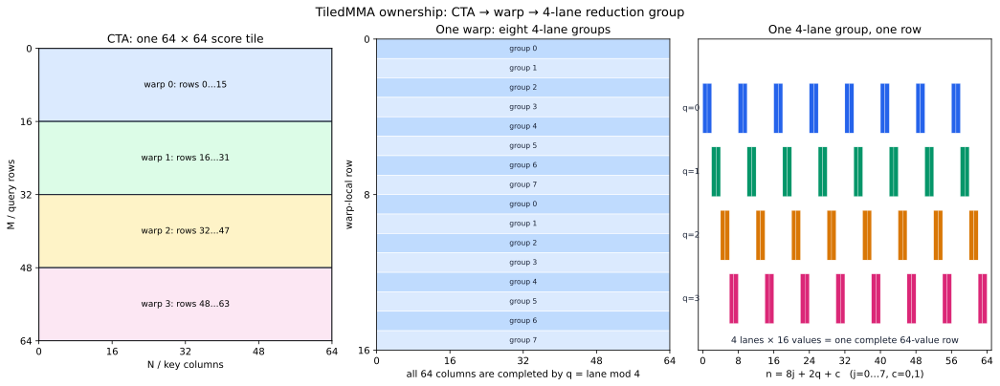
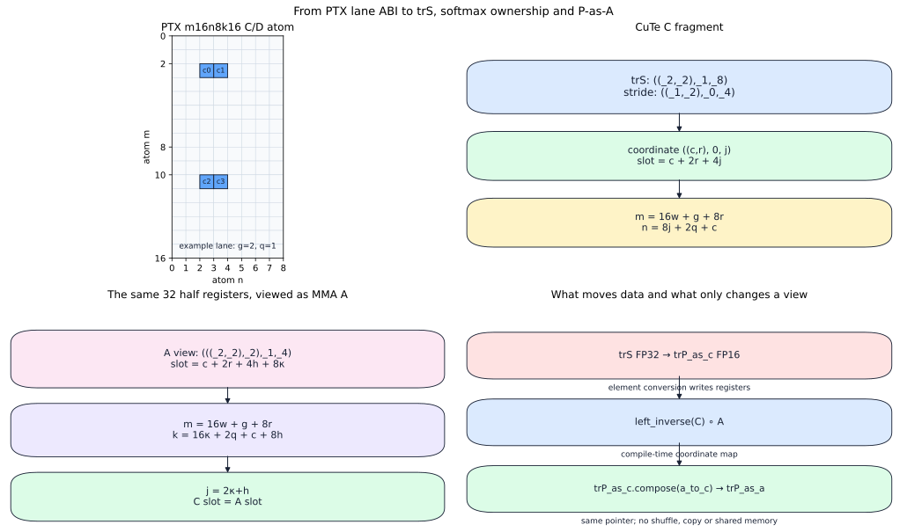
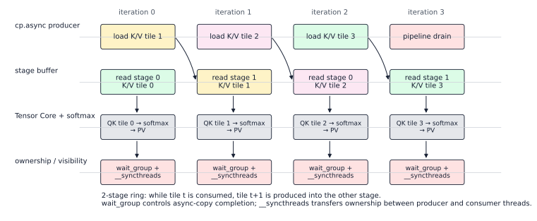
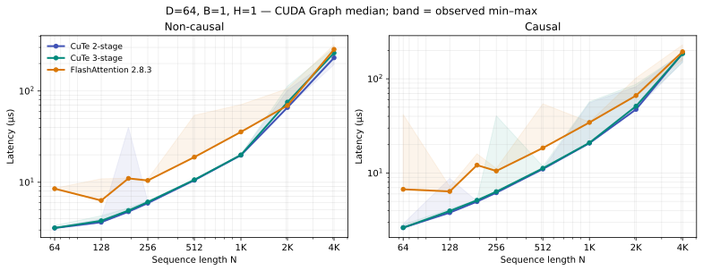
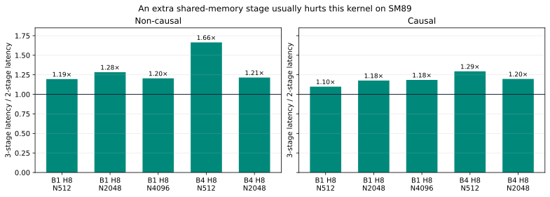

# CuTe 详解：以 FlashAttention-2 拆解 Layout、TiledCopy 与 TiledMMA

第一次读 CuTe Kernel，最容易产生一种错觉：代码里似乎没有地址计算，只有层层嵌套的 `Shape`、`Stride`、`Layout`，以及名字相近的 `partition_S`、`partition_A`、`retile_D`。数据究竟由哪个线程搬到哪里，反而比手写 CUDA 更难看见。

问题不在于 CuTe 隐藏了映射，而在于它把映射从循环下标提升成了**可组合的编译期对象**。要读懂一段 CuTe 代码，不能只问“这个 Tensor 是什么形状”，而要持续追问：

1. 当前坐标空间是什么？
2. 这个 `Layout` 把坐标映射到哪个索引？
3. 哪个 thread、哪个 register value 拥有该坐标？
4. producer 与 consumer 是否在同一个逻辑坐标上相遇？

本文以一个固定配置、可运行的 FlashAttention-2 教学 Kernel 为主线，拆开其中两套最关键的映射：

- `TiledCopy`：决定数据怎样在 global memory、shared memory 和 register 之间搬运。
- `TiledMMA`：决定 `(warp, lane, register)` 怎样映射到 GEMM 的逻辑 `(m,n,k)` 坐标。

两者并不要求寄存器编号相同，也不要求物理存储顺序相同。它们通过**同一个逻辑矩阵坐标**连接起来。这正是 CuTe 最值得建立的心智模型。

随后再沿同一份 ownership 解释 online softmax、score C fragment 到 P A fragment 的零搬运转换、输出 epilogue 和 K/V 多 stage 流水。FlashAttention-2 在这里不是另一条并列主线，而是一块足够复杂的“试金石”：如果我们真能从 CuTe Layout 推出每个 lane 的 score、归约分组和下一条 MMA 的输入位置，就说明这些抽象已经落到了硬件事实上。

> [!IMPORTANT]
> 本文逐线程公式对应一份教学特化实现：`D=64`、`BM=BN=64`、128 threads、FP16 输入、FP32 累加，使用 `SM80_16x8x16_F32F16F16F32_TN`，支持 causal/non-causal 与 2/3-stage K/V 流水。本地 CUTLASS 固定在 v4.6.1，官方对照固定在 FlashAttention v2.8.3。实测设备是 RTX 4060 Laptop（SM89），因此它验证的是 Ada 上的 Ampere-style 指令路径，不是 A100 性能。

## 先看全局：FA2 中的数据究竟去了哪里

单个 query tile 的前向计算可以压缩成两次矩阵乘和一次 online softmax：

$$
S = QK^T,\qquad P = \operatorname{softmax}(S),\qquad O = PV.
$$

教学 Kernel 的数据流如下：

```text
Q(gmem) --G2SRow--> Q(smem, swizzled) --S2R_A--> trQ
                                                    \
                                                     mma -> trS
                                                    /
K(gmem) --G2SRow--> K(smem, swizzled) --S2R_B--> trK

trS(C, FP32) --online softmax / FP16 convert--> trP_as_C --layout reinterpret--> trP_as_A
                                                               \
                                                                mma -> trO
                                                               /
V(gmem, logical transpose) --G2SCol--> V(smem) --S2R_B^T--> trV

trO(C, FP32) --normalize / FP16 convert--> O(smem) --S2GRow--> O(gmem)
```

这里有两个不太直觉的地方：

- `V` 没有真的做一次 global transpose，只是换了看待原地址的逻辑坐标。
- `P` 从第一次 GEMM 的 C fragment 变成第二次 GEMM 的 A fragment，也没有真的搬寄存器。

前一件完全是 Tensor view 的改变；后一件还包含一次 FP32→FP16 转换，但 C→A 的坐标重解释本身不搬寄存器。先建立 CuTe 的最小词汇，再回来推导它们。

## CuTe 的最小词汇

### Layout 是一个函数，不是一张二维表

CuTe 官方文档把 `Layout` 定义为从 coordinate space 到 index space 的函数。[^cute-layout] 最常见的写法由 `Shape` 和 `Stride` 组成：

```cpp
auto layout = make_layout(
    make_shape(Int<4>{}, Int<8>{}),
    make_stride(Int<8>{}, Int<1>{}));
```

这个对象接受坐标 `(i,j)`，返回一维索引：

$$
L(i,j)=8i+j.
$$

因此“row-major”不是 Tensor 的固有属性，只是某个 Layout 函数。把 stride 换成 `(1,4)`，相同坐标空间就映射成 column-major；再把它与 `Swizzle` 复合，逻辑坐标仍然是 `(i,j)`，物理地址却已经改变。

CuTe 中嵌套的 `Shape` 也不是装饰。例如：

```text
((_2,_2),_1,_8):((_1,_2),_0,_4)
```

冒号左侧是 shape，右侧是 stride。坐标也是分层的 `((c0,c1),m1,nu)`，索引为：

$$
r_C=c_0+2c_1+4\nu.
$$

读打印结果时，先把它还原成函数，通常比盯着括号更有效。

### Tensor = Engine + Layout

CuTe `Tensor` 由 `Engine` 和 `Layout` 组成。[^cute-tensor]

- Engine 回答“数据在哪里”，可能是 global、shared、register，也可能只是一个无数据的 identity engine。
- Layout 回答“给定逻辑坐标，如何找到 Engine 中的元素”。

所以 `make_tensor(make_gmem_ptr(ptr), layout)` 不是复制数据，而是给同一段地址附上坐标解释。`local_tile`、`partition_*` 也主要在变换视图；只有 `copy`、`gemm` 等算法才真正发出数据移动或计算指令。

### Atom、TiledCopy 与 TiledMMA

CuTe 把一条不可再分的硬件操作包装成 Atom，再把 Atom 沿线程和数据维度铺开。CUTLASS 3.x 文档也用这个层次统一描述 collective copy 与 MMA。[^cutlass-gemm-api]

- `Copy_Atom` 描述一次最小 copy 操作，例如 128-bit `cp.async` 或一个 warp collective `ldmatrix.x4`。
- `MMA_Atom` 描述一次最小矩阵乘，例如一个 warp 执行的 `m16n8k16` Tensor Core 指令。
- `TiledCopy` 决定 Copy Atom 在 `(thread,value)` 上如何铺成更大的 copy tile。
- `TiledMMA` 决定 MMA Atom 在 warp 和 M/N/K tile 上如何铺开。

这里的 “tiled” 不只是形状放大，还包含**所有权映射**。

### 先分清描述、视图、存储与指令

CuTe API 名称很多，但可以先按“是否真的改变机器状态”分类：

| API                                         | 本例中的作用                                         | 数据或存储是否改变                                |
| ------------------------------------------- | ---------------------------------------------------- | ------------------------------------------------- |
| `Shape` / `Stride` / `Layout`               | 定义坐标域与 `coord -> index`                        | 否                                                |
| `make_tensor(engine, layout)`               | 把 pointer 或 register engine 与 Layout 绑定         | 否；只创建 view                                   |
| `local_tile`                                | 从大 Tensor 中取 CTA tile view                       | 否                                                |
| `composition` / `Swizzle` / `tile_to_shape` | 组合地址函数，把 atom 平铺到目标 shape               | 否                                                |
| `get_slice(tid)`                            | 选出当前 thread 在 tiled operation 中的方案          | 否                                                |
| `partition_S/D`、`partition_A/B/C`          | 将 Tensor 按 copy 或 MMA ownership 切成线程 view     | 否                                                |
| `partition_fragment_A/B/C`                  | 创建当前线程拥有的 register fragment                 | 创建 owning register storage，但不读取传入 Tensor |
| `retile_D`                                  | 按 copy destination value layout 重看已有 fragment   | 否                                                |
| `make_tensor_like<T>`                       | 创建同 shape/layout、元素类型为 `T` 的 owning Tensor | 是，新建 register storage                         |
| `copy(...)`                                 | 按 Copy Atom 发出 copy                               | **是**                                            |
| `gemm(...)`                                 | 按 MMA Atom 发出矩阵乘并更新 accumulator             | **是**                                            |

这个分类能消除很多误读。例如 `partition_fragment_A(gQ)` 的参数虽然是 global-memory Tensor，但它只借用 `gQ` 的 shape 和 element type 推导 fragment，不会读取 Q；真正把 Q 装进这些寄存器的是后面的 `copy(s2r_copy_a, ..., retile_D(trQ))`。

## 三张地图：Tensor、Copy 与 MMA

把 CuTe Kernel 中的映射分成三张地图会清楚很多。

第一张是存储地图：

$$
L_{tensor}: \text{logical coordinate}\rightarrow\text{memory offset}.
$$

第二张是 copy 所有权地图：

$$
\Psi_{copy}:(thread,value,rest)\rightarrow\text{logical coordinate}.
$$

第三张是 MMA 所有权地图：

$$
\Phi_{mma}:(thread,value,repeat)\rightarrow(m,n,k).
$$

执行 `partition_S(src)` 时，CuTe 本质上把 `src.layout()` 与 Copy 的线程/value 映射复合，然后切出当前 thread：

$$
L_{src}\circ\Psi_{copy}(tid,\cdot).
$$

`partition_A(A)` 做的是同类工作，只不过目标映射来自 MMA 的 A operand：

$$
L_A\circ\Phi_A(tid,\cdot).
$$

CUTLASS v4.6.1 源码中的 `thrfrg_A/B/C` 正是先 `logical_divide`，再把 Atom 的 TV layout `compose` 进去，最后由 `partition_A/B/C` 切出当前 thread。[^mma-atom-source] 因此 `partition` 更接近“生成线程私有坐标视图”，而不是“分配内存”。

producer 与 consumer 能接起来的条件也随之明确：二者最终必须指向相同的逻辑坐标。至于中间是 row-major、swizzled shared memory，还是某种寄存器 value 次序，并不重要。

## 教学配置：一块 CTA 做什么

固定参数如下：

| 参数                |          值 | 含义                            |
| ------------------- | ----------: | ------------------------------- |
| `S`                 |        4096 | sequence length                 |
| `D`                 |          64 | head dimension                  |
| `BM`                |          64 | 每个 CTA 负责的 query 行数      |
| `BN`                |          64 | 每轮处理的 key/value 行数       |
| threads             |         128 | 4 warps                         |
| stages              |           2 | K/V shared-memory pipeline 深度 |
| input / accumulator | FP16 / FP32 | 输入与累加精度                  |

一个 CTA 固定 64 行 Q，沿 N 方向扫描 64 个 K/V block。每一轮先计算 `64×64` 的 score tile，做 online softmax，再把概率 tile 与 `64×64` 的 V tile 相乘。关于 online softmax 的数学推导，可先参考站内的 [FlashAttention 原理](../llm_inference/FlashAttention%20原理%20v1-v2.md)。

若序列长度为 $N$，显式保存 score 或 probability 会产生 $O(N^2)$ 的 HBM 中间数据。这个 Kernel 不保存完整的 S/P，而是为当前 64 行 Q 维护三份跨 KV tile 的状态：

$$
m_i=\max_{j\in\text{processed}}s_{ij},\qquad
\ell_i=\sum_{j\in\text{processed}}e^{s_{ij}-m_i},
$$

$$
\widetilde{o}_i=\sum_{j\in\text{processed}}e^{s_{ij}-m_i}v_j.
$$

其中 $\widetilde{o}_i$ 是未归一化 numerator，只有扫描完全部 KV tiles 后才计算 $O_i=\widetilde{o}_i/\ell_i$。因此主循环真正维护的不变量是：`running_max`、`running_sum` 与 `trO` 始终使用同一个指数基准。它们能否留在线程私有寄存器里，又取决于接下来的 `TiledMMA` 如何分配 score rows。

这里最重要的不是矩阵尺寸，而是两次 GEMM 之间的所有权约束：第一次的 score 输出，必须立即成为第二次的 A operand。FlashAttention-2 论文把 Q 切给不同 warp，使每个 warp 独占自己的输出行，减少 warp 间对 partial result 的 shared-memory 通信。[^fa2-paper] 下面的 `TiledMMA` 正是在坐标层面落实这一策略。

## TiledMMA：把四个 warp 只铺在 M 维

核心定义是：

```cpp
using MmaAtom = MMA_Atom<SM80_16x8x16_F32F16F16F32_TN>;

auto tiled_mma = make_tiled_mma(
    MmaAtom{},
    Layout<Shape<_4, _1, _1>>{},
    Tile<_64, _64, _16>{});
```

MMA Atom 是 `m16n8k16`。`Layout<Shape<_4,_1,_1>>` 表示四个 warp 只沿 M 维排布，不沿 N 或 K 维拆开。于是：

- warp 0 拥有 score 的 `m=0..15`；
- warp 1 拥有 `m=16..31`；
- warp 2 拥有 `m=32..47`；
- warp 3 拥有 `m=48..63`；
- 每个 warp 都覆盖完整的 `n=0..63`。

这让每个 warp 可以独立完成自己 16 行的 `QK^T -> softmax -> PV`，避免为了第二次 GEMM 重组概率矩阵而跨 warp 交换数据。



图中的关键不是“4 个 warp”这个数字，而是 ownership 沿 M 切分：每个 warp 只写自己那 16 行 `trO`，同时从 shared memory 读取完整 K/V tile。这正是 FA2 的 Q-split；主循环不再需要合并多个 warp 对同一输出行产生的 partial sum。

### Repeat 次数先由 tile 除出来

对单个 `16×8×16` Atom：

$$
R_M=\frac{64}{4\times16}=1,\qquad
R_N=\frac{64}{1\times8}=8,\qquad
R_K=\frac{64}{1\times16}=4.
$$

所以当前线程看到的 fragment 形状为：

```text
trQ : (V8, M1, K4)
trK : (V4, N8, K4)
trS : (V4, M1, N8)
```

`V8` 或 `V4` 是每次 Atom 中当前 lane 持有的 value 数；后面的 mode 是 Atom 在大 tile 中的 repeat。这个约定也解释了 CuTe GEMM 教程为何要求 fragment 的第一个 mode 对应单条 MMA 指令消费的元素，K repeat 放在最外层迭代。[^cute-gemm]

### 把 lane 公式真正写出来

令：

$$
w=\left\lfloor\frac{tid}{32}\right\rfloor,\quad
lane=tid\bmod32,\quad
g=\left\lfloor\frac{lane}{4}\right\rfloor,\quad
q=lane\bmod4.
$$

先看一条 `mma.sync.aligned.m16n8k16.row.col.f32.f16.f16.f32` 的 C fragment。PTX 规定每个 lane 得到四个 FP32 accumulator：

| register | atom row | atom column |
| -------- | -------: | ----------: |
| `c0`     |      $g$ |        $2q$ |
| `c1`     |      $g$ |      $2q+1$ |
| `c2`     |    $g+8$ |        $2q$ |
| `c3`     |    $g+8$ |      $2q+1$ |

因此 CuTe 打印出的 C fragment：

```text
shape  = ((_2,_2),_1,_8)
stride = ((_1,_2),_0,_4)
```

可以把第一层嵌套坐标记为 `(c,r)`，N repeat 记为 $\nu$。它的 thread-local register slot 为：

$$
slot_C(c,r,\nu)=c+2r+4\nu.
$$

这一步很重要：Layout 不是结果算完后附加的标签，而是 Tensor Core 将 accumulator 交给各 lane 时就已经确定的寄存器 ABI。为了和 CuTe 的嵌套 mode 对齐，下文把这里的 $c,r$ 分别记为 $c_0,c_1$。

则 Q 作为 A operand 时：

$$
m=16w+g+8a_1,
$$

$$
d=16\kappa+2q+a_0+8a_2.
$$

K 作为 B operand 时：

$$
n=8\nu+g,
$$

$$
d=16\kappa+2q+b_0+8b_1.
$$

注意 K 的坐标与 warp 编号 $w$ 无关。四个 warp 各自计算不同 M 行，却都需要同一个完整 K tile，因此 K 会从 shared memory 读入四套 warp-private register fragment。

score 作为 C accumulator 时：

$$
m=16w+g+8c_1,
$$

$$
n=8\nu+2q+c_0.
$$

这三个式子不仅回答“哪个 lane 算哪个元素”，还暴露了一个隐藏结构：固定 $w,g,c_1,\nu$ 后，连续四个 $q$ 覆盖一行上的 8 个 N 元素；再遍历 $\nu=0..7$，这个 4-lane subgroup 合起来拥有完整 64 列。因此 row max、row sum 的 warp reduction 可以先在 4-lane subgroup 内完成，而不必让 32 lanes 全部参与一行。

这是一条从 `TiledMMA` 直接推导 softmax 通信拓扑的结论。**reduction group 不应先拍脑袋决定，再勉强适配 fragment；它应从 accumulator 的 lane ownership 推出来。**

### 沿 C fragment 做 Online Softmax

固定 $w,g,c_1$ 后，一个 lane 沿 $c_0$ 和 $\nu$ 持有同一 query row 的 16 个 scores。它先完成 thread-local max，再由同一 4-lane subgroup 做 XOR shuffle：

```cpp
for (int delta = 1; delta < 4; delta <<= 1) {
  value = max(value, __shfl_xor_sync(0xffffffffu, value, delta, 4));
}
```

`width=4` 把一个 warp 分成 8 个独立 subgroup，对应 $g=0..7$；每组又通过 $c_1\in\{0,1\}$ 同时负责两行。因此一个 thread 维护 `running_max[2]` 与 `running_sum[2]`，不需要跨 warp reduction。

对当前 score tile，记 row max 为 $m_t$，历史状态为 $(m_{old},\ell_{old},\widetilde{o}_{old})$。合并后的指数基准和历史缩放因子为：

$$
m_{new}=\max(m_{old},m_t),\qquad
\alpha=e^{m_{old}-m_{new}}.
$$

当前 tile 的未归一化概率与分母更新为：

$$
p_j=e^{s_j-m_{new}},\qquad
\ell_{new}=\alpha\ell_{old}+\sum_jp_j.
$$

历史输出也必须换到同一个指数基准：

$$
\widetilde{o}_{new}=\alpha\widetilde{o}_{old}+P_tV_t.
$$

这解释了第二次 GEMM 前的两步：先对属于同一行的 `trO` values 乘 $\alpha$，再执行 `gemm(tiled_mma, trP_as_a, trV, trO)`。只缩放 `running_sum` 而不缩放旧 `trO`，会让不同 KV tile 使用不同的指数基准，结果也会随 tile 边界改变。

本例先对 raw QK score 求 max，再乘正数 `kScale=1/8`；因为 $\max(cx)=c\max(x)$ 对 $c>0$ 成立，可以少做 score fragment 上的若干乘法。官方 FA2 还使用 `exp2f(x\log_2e)` 组织缩放与指数计算；这属于 non-matmul 优化，不改变上述 ownership 推导。

## TiledCopy：128 个线程怎样搬完 64×64

### Gmem 到 Smem 的行拷贝

Q/K 的 G2S 使用 16-byte `cp.async`，每次搬 8 个 FP16。一个 `64×64` tile 有 4096 个 FP16，也就是 512 个向量 copy；128 个线程平均各做 4 次。

```cpp
using G2SRow = decltype(make_tiled_copy(
    Copy_Atom<SM80_CP_ASYNC_CACHEGLOBAL<uint128_t>, half_t>{},
    Layout<Shape<_32, _4>, Stride<_4, _1>>{},
    Layout<Shape<_1, _8>>{}));
```

令：

$$
r=\left\lfloor\frac{tid}{4}\right\rfloor,\qquad s=tid\bmod4.
$$

基本 copy tile 是 `32×32`，`64×64` 上还各有两次 rest。当前线程搬运：

$$
m=r+32\rho_m,
$$

$$
d=8s+v+32\rho_d,
$$

其中 $v=0..7$，$\rho_m,\rho_d\in\{0,1\}$。对固定 `tid, rest`，8 个 value 在 D 维连续，恰好组成一个 16-byte transaction。

`partition_S(gQ)` 与 `partition_D(sQ)` 使用同一 `(thread,value,rest)` 坐标空间，所以 `copy()` 能把相同逻辑 `(m,d)` 从 global layout 送到 shared layout。源和目的的物理 offset 不必相同。

### Swizzle 改物理列，不改逻辑坐标

shared-memory row layout 使用：

```cpp
Swizzle<3, 3, 3>
```

对 row-major 的 `64×64` FP16 tile，可以把核心地址变化写成：

$$
x'=x\oplus\left(\left(\frac{x}{2^6}\bmod 8\right)2^3\right),
$$

等价地，对逻辑 `(m,d)`：

$$
\operatorname{offset}(m,d)=64m+\left(d\oplus((m\bmod8)\ll3)\right).
$$

最低 3 bit 不变，所以一个 8-half、16-byte 的向量仍然连续；改变的是它所在的 16-byte segment。这样，producer 仍可做对齐的 `cp.async`，consumer 的 `ldmatrix` 又能从不同 row 得到更合适的 shared-memory bank 分布。Swizzle 不是“把矩阵打乱”，而是在保持逻辑坐标与向量连续性的同时，重排物理地址。

> [!WARNING]
> 一个 Swizzle 是否合适，取决于元素位宽、向量宽度、tile stride 和 consumer 指令。不能看到 shared memory 就机械地加 XOR；至少要同时验证对齐、覆盖、bank access 与 `ldmatrix` 所期待的布局。

### V 的转置只发生在视图里

物理 V 仍按 `V[n,d]` row-major 存储。Kernel 构造一个逻辑 `(d,n)` Tensor：

```cpp
auto mVt = make_tensor(
    make_gmem_ptr(V),
    make_layout(make_shape(D, S), make_stride(Int<1>{}, D)));
```

它的 offset 是：

$$
L_{V^T}(d,n)=d+nD=L_V(n,d).
$$

地址完全相同，只是 mode 的语义从 `(n,d)` 换成 `(d,n)`。对应的 G2SCol 把线程排布也交换：

$$
d=8s+v+32\rho_d,\qquad n=r+32\rho_n.
$$

这说明所谓“转置”至少有三种不同成本：改坐标解释、在 shared memory 中改变写入布局、真实搬运数据。CuTe 迫使我们明确自己需要的是哪一种。

## S2R：让 Copy 的终点成为 MMA 的起点

G2S 只负责让 tile 到达 shared memory。Tensor Core 并不直接消费普通 shared-memory Tensor，它要求每个 lane 的寄存器满足 MMA Atom 的 operand layout。

```cpp
auto s2r_copy_a = make_tiled_copy_A(
    Copy_Atom<SM75_U32x4_LDSM_N, half_t>{}, tiled_mma);

auto thr_copy_a = s2r_copy_a.get_slice(tid);
auto tCsQ = thr_copy_a.partition_S(sQ);
auto tCrQ = thr_copy_a.retile_D(trQ);
copy(s2r_copy_a, tCsQ, tCrQ);
```

`make_tiled_copy_A/B(copy_atom, tiled_mma)` 的作用，是从 MMA operand 的 TV layout 派生一个兼容的 tiled copy。这里两个 API 名称尤其容易误解：

- `partition_S(sQ)`：按 Copy Atom 的 source ownership 查看 shared Tensor。
- `retile_D(trQ)`：按同一 Copy Atom 的 value 次序重新查看已经存在的 register Tensor。

`retile_D` 没有申请另一组寄存器，也没有发出 shuffle。CUTLASS 源码将它实现为 layout retile，随后真正的 `copy()` 才发出 `ldmatrix`。[^copy-atom-source]

在当前配置中：

| operand | 每个 warp 需要的数据 | `ldmatrix.x4` 次数 / warp | 原因                          |
| ------- | -------------------: | ------------------------: | ----------------------------- |
| Q       |    `16×64=1024` FP16 |                         4 | 四个 warp 分别拥有不同 M 行   |
| K       |    `64×64=4096` FP16 |                        16 | 每个 M-warp 都需要完整 K tile |
| V       |    `64×64=4096` FP16 |                        16 | 每个 M-warp 都需要完整 V tile |

PTX 的 `ldmatrix.sync.aligned.m8n8.x4.shared.b16` 由一个 warp 协作装入四个 `8×8`、16-bit 矩阵，共 256 个 FP16。[^ptx-ldmatrix] V 使用转置形式 `SM75_U16x8_LDSM_T`，因为 shared memory 中物理语义是 `V[n,d]`，第二次 GEMM 的 B operand 却需要逻辑 `(d,n)`。

这里还能看出 G2S 和 S2R 的不同复用策略：K/V 从 global 到 shared 每个 CTA 只搬一份，但从 shared 到 register 会按四个 M-warp 复制四份。shared memory 是 CTA 内广播复用点，register 是 warp-private 消费点。

## 全文最关键的一步：Score 的 C layout 怎样变成 P 的 A layout

第一次 GEMM 后，score 位于 FP32 C fragment；softmax 原位把它变成概率，随后显式转换为 FP16 的 owning fragment：

```cpp
Tensor trP_as_c = make_tensor_like<Element>(trS);
for (int i = 0; i < size(trS); ++i) {
  trP_as_c(i) = Element(trS(i));
}
```

这段 FP32→FP16 conversion 确实会写一组新寄存器。接下来第二次 GEMM 要求 P 位于 A fragment；问题是能否只重解释这组 FP16 寄存器，而不再 shuffle 或经过 shared memory。

当前 `TiledMMA` 的关键设计恰好让它们兼容。

第一次 GEMM 的 C 坐标是：

$$
m=16w+g+8c_1,\qquad n=8\nu+2q+c_0.
$$

第二次 GEMM 的 A 坐标是：

$$
m=16w+g+8a_1,
$$

$$
k=16\kappa+2q+a_0+8a_2.
$$

令第一次的 $n$ 等于第二次的 $k$，可得：

$$
a_0=c_0,\qquad a_1=c_1,\qquad \nu=2\kappa+a_2.
$$

也就是说，把 C 的 N-repeat `8` 拆成 A-value 的 `2` 与 K-repeat 的 `4` 即可。C fragment 的 layout 为：

```text
((_2,_2),_1,_8):((_1,_2),_0,_4)
```

寄存器线性编号是：

$$
r_C=c_0+2c_1+4\nu.
$$

代入 $\nu=2\kappa+a_2$：

$$
r_C=a_0+2a_1+4a_2+8\kappa,
$$

正好对应 A view：

```text
((_2,_2,_2),_1,_4):((_1,_2,_4),_0,_8)
```



图中从 C 到 A 改变的是嵌套坐标的分组方式，底层线性 slot 没变。换句话说，CuTe 没有“优化掉一次本来存在的 copy”，而是证明这里本来就只需要一个 view。

代码可以用 Layout algebra 构造这次变换：

```cpp
auto a_to_c = left_inverse(layout_as_c).compose(layout_as_a);
auto trP_as_a = trP_as_c.compose(a_to_c);
```

没有 copy，没有 warp shuffle，也没有 shared-memory round trip。变化的只是“同一组 register index 应当用哪组层级坐标访问”。上游 FlashAttention v2.8.3 的 Ampere 前向 Kernel 也有同样的语义步骤：完成 softmax 后调用 `convert_layout_acc_Aregs`，再进入 `gemm_rs`。[^fa2-source]

这就是 CuTe Layout algebra 最有价值的用途：它不是为了写出更复杂的类型，而是把“两个硬件 fragment 是否能零搬运衔接”变成可以在编译期构造和检查的坐标关系。

## 第二次 GEMM 与输出 Epilogue

完成重解释后，第二次 GEMM 仍使用同一个 `TiledMMA`：

```text
P as A : (V8, M1, K4)
V as B : (V4, N8, K4)
O as C : (V4, M1, N8)
```

此时逻辑 K 就是 attention block 的 N 维，逻辑 N 则是 head dimension。每个 warp 继续拥有相同的 16 行输出，因此不需要改变 warp 排布。

但 accumulator C layout 并不适合直接做 coalesced global store。固定一行与一个连续 8-half 区间后，这 8 个值分散在 4 个 lanes，每个 lane 只拥有相邻两个。`compose` 只能重解释**同一个 thread 已有的寄存器**，不能把四个 lanes 的值聚到一个 thread，因而不能凭空形成一次 16-byte store。

Epilogue 复用生命周期已经结束的 Q shared buffer，在两套 ownership 之间做真实交接：

```cpp
Tensor sO = make_tensor(make_smem_ptr(q_smem), SmemLayoutO{});
Tensor tOsO = thr_mma.partition_C(sO);
copy(trO_half, tOsO);                  // C owners scatter 到 sO(m,d)
__syncthreads();

auto s2g_thr = S2GRow{}.get_slice(threadIdx.x);
Tensor tOsO_vec = s2g_thr.partition_S(sO);
Tensor tOgO_vec = s2g_thr.partition_D(gO);
copy(S2GRow{}, tOsO_vec, tOgO_vec);    // 连续 8 half，一次 16-byte store
```

第一套 view 让 MMA C owners 把值散到逻辑 `(m,d)`，barrier 完成 CTA 级 ownership transfer，第二套 view 再让每个 thread 读取连续 8 half。shared memory 在这里相当于一次显式、可同步的 lane-to-lane permutation；它不做数值归约，也不增加峰值 shared-memory 容量。

因此，P 的 C→A 能零搬运，而 O 的 C→global 需要 shared memory，差别不在于 Layout algebra 对谁“更聪明”，而在于目标值是否仍由同一个 thread 拥有。官方 v2.8.3 的 Ampere epilogue 也先用 `make_tiled_copy_C` 将 `acc_o` 写入 `sO`，再由 gmem tiled copy 写 `gO`。[^fa2-source]

## 多 Stage 流水：Layout 容量必须与等待协议一起变化

一块 CTA 在整个 N 循环中复用同一个 Q tile，而 K/V 每轮都换到下一个 block。因此 shared-memory 容量为：

$$
bytes=(1+2\times kStages)\times64\times64\times2.
$$

| 配置    |     Q |      K |      V | dynamic shared memory |
| ------- | ----: | -----: | -----: | --------------------: |
| 2-stage | 8 KiB | 16 KiB | 16 KiB |                40 KiB |
| 3-stage | 8 KiB | 24 KiB | 24 KiB |                56 KiB |



对 `kStages`，prologue 先填入 $\min(kv\_tiles,kStages-1)$ 个 K/V tiles；steady state 使用：

```cpp
read_stage    = tile % kStages;
prefetch_tile = tile + kStages - 1;
write_stage   = prefetch_tile % kStages;
```

计算 tile $t$ 时，producer 把 tile $t+kStages-1$ 写进环形 buffer。下一轮消费前调用：

```cpp
cp_async_wait<kStages - 2>();
__syncthreads();
```

两者不是同一种“等待”。`cp_async_wait<N>` 约束当前 thread 提交的 async-copy groups；`__syncthreads()` 则让 CTA threads 在 shared buffer 的 ownership 交接点会合。进入 tail、没有新 group 提交后，必须用 `cp_async_wait<0>()` 完全 drain；若沿用 steady-state 的阈值，最后一个预取 group 仍未完成时也可能合法返回。

`cp.async` 让 global-to-shared copy 与独立计算重叠，并避免中间数据先落到通用寄存器。[^ptx-cpasync] 但把 2-stage 改成 3-stage 绝不只是把 layout extent 从 2 改成 3：容量、prologue、环形索引、wait depth、tail drain 和 launch 的 dynamic-smem attribute 都必须同步变化。3-stage 超过传统 48 KiB，还需要 `cudaFuncSetAttribute(...MaxDynamicSharedMemorySize...)`。

这和 [CUDA 中的 ILP 与 MLP](CUDA%20中的%20ILP%20与%20MLP.md) 中的结论一致：异步流水增加的是在途内存工作和计算/访存重叠机会，但 stage 也消耗 shared memory，可能降低 resident CTA 数。它必须和 tile、寄存器预算与目标 GPU 一起调，而不是越深越好。

## 用实验检查抽象是否真的落到硬件

前面的公式属于 layout 与 PTX ABI 推导，性能则是特定环境下的测量，二者需要分开陈述。测试环境如下：

| 项目                   | 值                                                                |
| ---------------------- | ----------------------------------------------------------------- |
| GPU                    | NVIDIA GeForce RTX 4060 Laptop GPU，24 SM，compute capability 8.9 |
| CUDA / nvcc            | 12.8 / V12.8.93                                                   |
| PyTorch                | 2.10.0+cu128                                                      |
| CUTLASS                | v4.6.1，对应 commit `e05f953...`                                  |
| FlashAttention         | v2.8.3，对应 commit `060c918...`                                  |
| 编译                   | `-O3 -std=c++17 --use_fast_math -arch=sm_89`                      |
| dtype / head dimension | FP16 / 64                                                         |

### 正确性、编译与计时方法

FP32 参考实现关闭 TF32，按 128 个 query rows 分块计算完整 attention。测试覆盖 26 组 `(B,H,N,causal)`，N 从 64 到 4096，并加入 N=320 的 uniform-score 与放大 Q/K 的 concentrated-softmax 输入。全部输出满足 `atol=2e-3, rtol=2e-3`，观测到的最大绝对误差为 `1.26e-3`。

2-stage 与 3-stage 源码还以 `-arch=sm_80` 做 compile-only 检查，`ptxas` 均报告 0 stack frame、0 spill store、0 spill load。这证明 Ampere target 可以生成代码，不等于取得了 Ampere 硬件性能。若要检查抽象是否生成预期数据通路，还应在 cubin/SASS 中确认 `CP_ASYNC`、`LDSM` 与 `HMMA` 指令族。

计时路径预分配 output，使用同地址 warmup，在 CUDA Graph 中重复 100 次 forward，再用 CUDA Event 计时，共 9 rounds；三个实现轮转测量顺序。图中点为 median，淡色带为 min–max。笔记本温度和功耗会放大短 Kernel 抖动，因此小于几个百分点的差异不应当解释成稳定排序。

> [!NOTE]
> `compute-sanitizer --tool racecheck` 在当前 WSL/WDDM 设备上不支持调试接口，所以本文不声称完成 racecheck。同步正确性的现有证据来自 ownership 推导与数值边界测试；在 Linux 原生 Ampere 环境复跑时应补上 racecheck。

### 与官方 FA2 比较时，先对齐契约

对照固定为 upstream v2.8.3 的 D64 FP16 forward specialization，薄绑定直接调用 `flash::run_mha_fwd_<cutlass::half_t, 64, causal>`。双方读取同一份 `[B,H,N,64]` 物理数据，softmax scale 都是 `1/8`，计时不包含 Python transpose/copy 与 output allocation。

这仍不是功能完全等价的产品对比：

| 维度          | CuTe 教学版                          | 官方 FA2 v2.8.3 D64 路径                  |
| ------------- | ------------------------------------ | ----------------------------------------- |
| tile          | `64×64`                              | `128×128`                                 |
| threads       | 128                                  | 128                                       |
| shared memory | 40 KiB（2-stage）/ 56 KiB（3-stage） | 由 `128×128` traits 决定                  |
| 输出          | O                                    | O + softmax LSE                           |
| shape 支持    | D=64、N 为 64 倍数、定长 MHA         | 生产级多 shape 与边界分派中的一条特化路径 |
| exponent      | `__expf`                             | `exp2f` + `log2(e)` scale                 |

因此，小 shape 上教学版更快不能解释成“全面击败官方”：它使用更小 tile，也承担更窄的输出契约。

### 性能结果与瓶颈迁移



代表性中位延迟如下，单位为 μs：

| B×H |    N | mode       | CuTe 2-stage | CuTe 3-stage | 官方 FA2 | 2-stage / 官方 |
| --: | ---: | ---------- | -----------: | -----------: | -------: | -------------: |
|   1 |   64 | non-causal |        3.154 |        3.163 |    8.509 |   2.70× faster |
|   1 |  512 | non-causal |       10.536 |       10.660 |   18.862 |   1.79× faster |
|   1 | 2048 | non-causal |       66.058 |       75.592 |   69.376 |   1.05× faster |
|   1 | 4096 | non-causal |      231.178 |      261.089 |  285.706 |   1.24× faster |
|   1 | 4096 | causal     |      187.023 |      184.945 |  193.800 |   1.04× faster |
|   8 | 4096 | non-causal |     1592.410 |     1918.032 | 1562.163 |   1.02× slower |
|  32 | 2048 | non-causal |     1612.339 |     1958.623 | 1566.177 |   1.03× slower |
|  32 | 2048 | causal     |      919.859 |     1101.025 |  863.498 |   1.07× slower |

`B×H=1` 时 CTA 数等于 query tile 数。教学版 BM=64 产生的 CTA 是官方 BM=128 的两倍，在 24-SM 设备上更容易填满 wave，小 N 时也减少 tile 浪费。当 `B×H` 增加到 8 或 32，CTA 不再稀缺，官方较大的 tile 可以摊薄调度、softmax 与 epilogue 成本，瓶颈从“是否有足够 blocks”迁移到“单 block 的有效工作与资源效率”。



在选取的多 head/batch workload 中，3-stage 比 2-stage 慢 10%–66%。两者没有 spill，寄存器用量也只从 159 增至 160 registers/thread；更明显的变化是 shared memory 从 40 KiB 增至 56 KiB，而更深流水没有创造足够的独立计算来抵消 residency 损失。

这组负结果正好校验上一节的资源约束：

$$
\text{useful overlap}=f(\text{async depth},\text{compute window},\text{smem},\text{registers},\text{resident CTAs}).
$$

CuTe 可以把 stage 参数一致地传播到 Layout 与 copy protocol，但它不会替开发者判断瓶颈。抽象保证“关系能被表达”，性能仍取决于具体 SKU 和 workload。

### 如何复现

文章随附目录 [`code/fa2_cute_case/`](code/fa2_cute_case/) 保存教学 Kernel 快照、官方 D64 薄绑定、benchmark、原始 JSON/CSV 和作图脚本。在对应 `cuda_learn` 开发仓库根目录运行：

```bash
CUDA_HOME=/usr/local/cuda-12.8 \
python benchmarks/fa2_cute_case/bench.py \
  --output benchmarks/fa2_cute_case/results_local
```

在 A100、A10 或 RTX 30 等 Ampere 设备上复跑时增加：

```bash
python benchmarks/fa2_cute_case/bench.py \
  --require-ampere \
  --output benchmarks/fa2_cute_case/results_ampere
```

守卫只接受 SM80/86/87。不同 GPU 的 SM 数、shared-memory 容量、时钟和功耗差异很大，结果应分别记录，不能合并成一个笼统的“Ampere 数字”。

## 怎样系统调试一段 CuTe Kernel

### 1. 先固定版本、形状和 Atom

相同 API 在不同架构下可能选择不同 Atom。先写清 CUTLASS commit/tag、GPU 架构、dtype、tile shape、warp layout 与 stage 数。没有这些边界，打印出来的 layout 很难复现。

### 2. 把每个 Layout 当函数展开

对打印结果：

```text
Shape:Stride
```

先给每个 mode 命名，再写出线性 index 公式。遇到嵌套 mode，就逐层展开，而不是先 flatten 后猜语义。

### 3. 用 identity Tensor 暴露坐标

普通 Tensor 返回数据，identity Tensor 返回坐标。把同一个 `partition_*` 作用到 identity Tensor 上，就能直接看到当前 thread/value 对应的 `(m,n)` 或 `(m,k)`，这是验证 lane mapping 最可靠的办法之一。

### 4. 做元素守恒检查，但留意复制

对没有复制的 G2S tile：

$$
threads\times values/thread=tile\ elements.
$$

但 MMA fragment 还要考虑 warp 间复用。Q 的四个 warp 覆盖互不相交的 M 行；K/V 的逻辑 tile 只有一份，register fragment 却在四个 M-warp 中各复制一份。若只数 tile elements，很容易误判 S2R 流量。

### 5. 分三层验证

- 坐标层：检查每个逻辑元素是否恰好被覆盖，是否越界或重复。
- 指令层：检查 `cp.async`、`ldmatrix`、`mma.sync` 是否真正生成。
- 性能层：检查 shared-memory bank conflicts、global transaction、eligible warps、寄存器和 shared-memory occupancy。

站内的 [从 GEMM 实践 CUDA 优化](从GEMM实践CUDA优化.md) 展示了从 tiling、向量化到流水线的性能验证方式；CuTe 并没有替代这些硬件约束，只是让映射关系更可组合。

## 哪些结论可以迁移，哪些只是本例特例

可以迁移的原则：

- Layout 是坐标到索引的函数，Tensor 是 Engine 与 Layout 的组合。
- `partition_*` 通过 tiling、composition 和 slicing 构造线程视图。
- TiledCopy 与 TiledMMA 通过逻辑坐标交接，而不是通过相同的寄存器编号交接。
- Copy layout 必须同时满足 producer 的向量化要求和 consumer 的 operand layout。
- 两个 fragment 能否零搬运重解释，取决于 thread ownership 是否兼容。
- reduction 的 subgroup 应从 accumulator ownership 推导。

只属于当前配置的结论：

- `m16n8k16` 的精确 lane/value 公式；
- 四个 warp 只铺 M 维；
- subgroup 大小恰好为 4；
- `Swizzle<3,3,3>` 与 16-byte 向量的组合；
- Q 每 warp 4 次、K/V 每 warp 16 次 `ldmatrix.x4`；
- C fragment 可以按本文给出的 `N8 -> A2 × K4` 方式直接重解释。

生产版 FA2 还需要处理 causal/local mask、非整 tile、变长序列、dropout、不同 head dimension、GQA/MQA 和架构分派。上游 v2.8.3 源码中的 `GmemTiledCopy`、`make_tiled_copy_A/B`、`partition_fragment_C`、`convert_layout_acc_Aregs` 与 epilogue 能看到同一套坐标语言，但不能把本文固定公式逐字套过去。[^fa2-source]

Hopper 上的执行路径又会引入 TMA、WGMMA、warpgroup 和异步 transaction barrier。Colfax 的 Hopper FA2 case study 展示了 `TiledMMA` 和 partition 思路如何延续到新硬件，但 Atom 与数据通路已经不同。[^colfax-fa2] 应当迁移的是推导方法，不是某个 Ampere layout 的答案。

## 延伸阅读：不要一上来啃完整 FA2

更平缓的阅读顺序是：

1. **Guide**：先读 CuTe Quickstart，再读 Layout、Layout algebra 与 Tensor。目标不是记 API，而是确认 `Layout` 是函数、`Tensor` 是 Engine 加 Layout，以及 composition 的输入输出空间。[^cute-quickstart] [^cute-algebra]
2. **Example**：运行官方 `sgemm_2.cu`，打印 `TiledCopy` 和 `TiledMMA`，把一个普通 GEMM 的 `partition_S/D`、`partition_A/B/C` 走通。[^cute-gemm]
3. **Source**：对照 CUTLASS v4.6.1 的 `mma_atom.hpp` 与 `copy_atom.hpp`，确认 `partition` 和 `retile` 实际做了哪些 layout 变换，而不是只凭 API 名称猜测。[^mma-atom-source] [^copy-atom-source]
4. **FA2 Paper 与实现**：先理解为何 FA2 改成沿 Q 方向分 warp，再去上游固定 tag 的 Kernel 中寻找 `GmemTiledCopy -> make_tiled_copy_A/B -> gemm -> convert_layout_acc_Aregs -> gemm_rs -> epilogue`。[^fa2-paper] [^fa2-source]
5. **研究博客与架构迁移**：Colfax 的 transpose 教程适合继续练习“物理地址不变、逻辑坐标改变”的思维；Hopper FA2 case study 则适合观察相同 CuTe 语言怎样换成 TMA/WGMMA 数据通路。[^colfax-transpose] [^colfax-fa2]

这样每一步只新增一个变量。若直接从生产 FA2 的模板实例、mask 分支和 pipeline 状态机开始，很容易把业务边界、架构细节与 CuTe 基础语义混在一起。

## 总结：CuTe 在编排坐标，不是在隐藏 CUDA

以这个 FA2 Kernel 为例，CuTe 的工作可以压缩成一句话：**用 Layout 描述坐标关系，用 TiledCopy 实现存储层级之间的所有权迁移，用 TiledMMA 实现线程与 Tensor Core fragment 之间的所有权映射。**

真正串起整个 Kernel 的，不是某个 API 名称，而是贯穿始终的逻辑坐标：

1. G2S 的 `(thread,value,rest)` 落到 `(m,d)`、`(n,d)`。
2. S2R 把同一坐标改排成 MMA A/B fragment。
3. `TiledMMA` 决定 score `(m,n)` 落在哪个 lane 和 register。
4. softmax 沿这份 ownership 做 subgroup reduction。
5. score C fragment 通过 layout composition 零搬运变成 P A fragment。
6. output C fragment 经 shared memory 重排成 coalesced global store。

理解到这一层以后，`Shape` 和 `Stride` 不再是一片括号森林。它们是对几个非常具体的问题的精确回答：谁拥有哪个坐标，地址在哪里，下一条硬件指令希望以什么次序看到它，以及两段流水能否不搬数据地接上。

## 参考资料

[^cute-quickstart]: NVIDIA CUTLASS Documentation, [CuTe Quickstart](https://docs.nvidia.com/cutlass/latest/media/docs/cpp/cute/00_quickstart.html).

[^cute-layout]: NVIDIA CUTLASS Documentation, [CuTe Layouts](https://docs.nvidia.com/cutlass/latest/media/docs/cpp/cute/01_layout.html).

[^cute-algebra]: NVIDIA CUTLASS Documentation, [CuTe Layout Algebra](https://docs.nvidia.com/cutlass/latest/media/docs/cpp/cute/02_layout_algebra.html); 固定版本可对照 CUTLASS v4.6.1 的 [`02_layout_algebra.md`](https://github.com/NVIDIA/cutlass/blob/v4.6.1/media/docs/cpp/cute/02_layout_algebra.md).

[^cute-tensor]: NVIDIA CUTLASS Documentation, [CuTe Tensors](https://docs.nvidia.com/cutlass/latest/media/docs/cpp/cute/03_tensor.html).

[^cutlass-gemm-api]: NVIDIA CUTLASS Documentation, [CUTLASS 3.x GEMM API](https://docs.nvidia.com/cutlass/latest/media/docs/cpp/gemm_api_3x.html).

[^mma-atom-source]: NVIDIA CUTLASS v4.6.1, [`include/cute/atom/mma_atom.hpp`](https://github.com/NVIDIA/cutlass/blob/v4.6.1/include/cute/atom/mma_atom.hpp).

[^cute-gemm]: NVIDIA CUTLASS Documentation, [CuTe GEMM Tutorial](https://docs.nvidia.com/cutlass/latest/media/docs/cpp/cute/0x_gemm_tutorial.html); NVIDIA CUTLASS v4.6.1, [`examples/cute/tutorial/sgemm_2.cu`](https://github.com/NVIDIA/cutlass/blob/v4.6.1/examples/cute/tutorial/sgemm_2.cu).

[^fa2-paper]: Tri Dao, [FlashAttention-2: Faster Attention with Better Parallelism and Work Partitioning](https://arxiv.org/abs/2307.08691), 2023.

[^copy-atom-source]: NVIDIA CUTLASS v4.6.1, [`include/cute/atom/copy_atom.hpp`](https://github.com/NVIDIA/cutlass/blob/v4.6.1/include/cute/atom/copy_atom.hpp).

[^ptx-ldmatrix]: NVIDIA, [PTX ISA: Warp-level matrix load instruction `ldmatrix`](https://docs.nvidia.com/cuda/parallel-thread-execution/#warp-level-matrix-instructions-ldmatrix).

[^fa2-source]: Dao-AILab FlashAttention v2.8.3, [`csrc/flash_attn/src/flash_fwd_kernel.h`](https://github.com/Dao-AILab/flash-attention/blob/v2.8.3/csrc/flash_attn/src/flash_fwd_kernel.h) 与 [`flash_fwd_launch_template.h`](https://github.com/Dao-AILab/flash-attention/blob/v2.8.3/csrc/flash_attn/src/flash_fwd_launch_template.h).

[^ptx-cpasync]: NVIDIA, [PTX ISA: `cp.async`](https://docs.nvidia.com/cuda/parallel-thread-execution/#data-movement-and-conversion-instructions-cp-async).

[^colfax-transpose]: Colfax Research, [Tutorial: Matrix Transpose in CUTLASS](https://research.colfax-intl.com/tutorial-matrix-transpose-in-cutlass/).

[^colfax-fa2]: Ganesh Bikshandi and Jay Shah, [A Case Study in CUDA Kernel Fusion: Implementing FlashAttention-2 on NVIDIA Hopper Architecture using the CUTLASS Library](https://research.colfax-intl.com/wp-content/uploads/2023/12/colfax-flashattention.pdf), 2023.
