# FlashAttention v1-v4：从 IO 感知到异步流水与硬件协同

FlashAttention 已经把 $N\times N$ 的 attention matrix 留在片上了，为什么还需要 FA2、FA3、FA4？

如果答案只是“新 GPU 有更快的 Tensor Core”，就解释不了两件事：FA2 为什么要减少很少的一部分非矩阵运算，FA4 又为什么需要用普通 FMA 去模拟硬件已经支持的指数函数。

更准确的主线是：**每次消掉一个瓶颈，原本被它遮住的资源约束就会暴露出来。版本演进改变的不只是指令，而是中间状态的存放位置、线程所有权和可执行的调度顺序。**

| 版本 | 主要矛盾 | 核心改变 | 优化直接作用在哪一层 |
| --- | --- | --- | --- |
| FA1 | 大量 $N^2$ 中间值往返 HBM | 分块、online softmax、反向重计算 | 全局数据流与 IO 复杂度 |
| FA2 | IO 降下来后，SM 利用不足、warp 通信和非矩阵运算变贵 | Q 方向 CTA 并行、sliced-Q、延迟归一化 | 工作划分与片上通信 |
| FA3 | Hopper 的异步硬件没有被充分使用，softmax 暴露在关键路径上 | TMA、WGMMA、warp specialization、两层 GEMM–softmax overlap | 搬运与计算的异步调度 |
| FA4 | Blackwell 矩阵算力继续增长，指数吞吐和 SMEM 带宽跟不上 | TMEM 流水、softmax/correction 分工、部分指数模拟、条件 rescale、2-CTA backward | 算法状态、片上带宽与资源配平 |

站内的 [FlashAttention 原理](../llm_inference/FlashAttention%20原理%20v1-v2.md) 已经推导了 online softmax；[CuTe 详解](CuTe%20初探：以%20FlashAttention-2%20拆解%20Layout、TiledCopy%20与%20TiledMMA.md) 则把一份 FA2 教学 Kernel 拆到了 `(warp, lane, register)`。本文沿这两篇继续往硬件走，关注三个问题：数据放在哪里，谁负责消费，以及下一步究竟要等谁。

> [!NOTE]
> 本文的 FA1–FA4 指四篇同名论文的算法脉络，不等于 Python 包的四个主版本号。FA4 对应 2026-03-05 的论文 [Algorithm and Kernel Pipelining Co-Design for Asymmetric Hardware Scaling](https://arxiv.org/abs/2603.05451)，以 B200/GB200 的数据中心 Blackwell 路径为主。机制核对截至 2026-09-18，源码固定在 `1bda8f9290cd48d030f1516f0e680cd464ef3554`。下文的 timeline 是依赖与重叠示意，不是 Nsight trace，也不以方块宽度预测加速比。

Blackwell 虽然支持 FP4 等更窄格式，FA4 原论文的这条优化主线主要围绕 BF16 展开，不能把“第四代 FlashAttention”理解成“改用 4-bit attention”。

## 从硬件开始：Ampere、Hopper、Blackwell 的参数、数据通路与指令

这一章先把后文需要的硬件知识集中起来：先看资源上限，再分别跟踪 MMA 和 global→shared load。需要记住的变化有三条：

- **Ampere**：`cp.async` 让数据搬运异步，但 tile 的地址仍由线程组织；`mma.sync` 的输入与输出都由 warp 的寄存器 fragment 承载。
- **Hopper**：TMA 接手多维 tile 搬运，WGMMA 接手 warpgroup 级异步矩阵乘；producer/consumer 可以分工，但 accumulator 仍占 consumer 的寄存器。
- **Blackwell SM100**：`tcgen05.mma` 改为单线程发起、结果写入 TMEM；TMA 继续搬到 SMEM，并增加与 CTA pair 配合的完成通知语义。

下面的硬件图画的是 **ISA 可观察的数据路径和执行协议**，不是芯片 floorplan，也不假定公开文档没有说明的内部队列、布线或 cycle latency。MMA 图从已准备好的 operand 开始，load 图再展开这些 operand 怎样到达片上。

### 参数要分成整卡规格和每 SM 预算

整卡参数采用 **A100 80GB SXM、H100 80GB SXM、HGX B200 180GB** 三个代表性配置。FP16/BF16 一律用**稠密 Tensor Core 峰值**，一次乘加计 2 FLOPs；不能拿带 structured sparsity 的两倍数字来计算普通 attention 的利用率。

| 整卡参数 | Ampere：A100 80GB SXM | Hopper：H100 80GB SXM | Blackwell：B200 180GB |
| --- | --- | --- | --- |
| Compute capability | 8.0 / SM80 | 9.0；WGMMA 常用 `sm_90a` | 10.0；本文 `tcgen05` 路径以 `sm_100a` 为例 |
| 启用的 SM 数 | 108 | 132 | 148 |
| Tensor Core 代际 | 第 3 代 | 第 4 代 | 第 5 代 |
| 显存 | 80 GB HBM2e | 80 GB HBM3 | 180 GB HBM3e |
| 标称显存带宽 | 2039 GB/s | 3.35 TB/s | 7.7 TB/s（所引 HGX B200 SKU） |
| L2 容量 | 40 MB | 50 MB | 126 MB，Blackwell 数据中心实现口径 |
| FP16/BF16 稠密 Tensor Core 峰值 | 312 TFLOP/s | 989 TFLOP/s | 2250 TFLOP/s |
| 稠密 FP8 Tensor Core 路径 | 无 | 有 | 有，另有更窄格式及 block-scaled 路径 |

A100 的数据来自 [NVIDIA A100 产品规格](https://www.nvidia.com/en-us/data-center/a100/) 与 [GPU Performance Background](https://docs.nvidia.com/deeplearning/performance/dl-performance-gpu-background/index.html)；H100 结合 [正式产品规格](https://www.nvidia.com/en-us/data-center/h100/) 与 [架构说明中的 SXM 配置](https://developer.nvidia.com/blog/nvidia-hopper-architecture-in-depth/)，不使用早期发布稿的预估 FLOPS；B200 的容量/吞吐/带宽参考 [HGX B200 产品规格](https://lenovopress.lenovo.com/lp2226.pdf)，SM 数由 [NVIDIA 技术说明](https://developer.nvidia.com/blog/boost-gpu-memory-performance-with-no-code-changes-using-nvidia-cuda-mps/) 交叉核对，L2 参考 [Blackwell Tuning Guide](https://docs.nvidia.com/cuda/blackwell-tuning-guide/index.html)。这里的 GB/MB 沿用规格书标法。

这些数字还不能直接回答一个 CTA 能用多大的 tile。Kernel 受下面这张片上预算表约束；KiB 按 1024 bytes 计，register 数按 32-bit 单位计。

| 每 SM 的资源或约束 | A100 / SM80 | H100 / SM90 | B200 / SM100 |
| --- | --- | --- | --- |
| Register File | 64K 个 32-bit registers，即 256 KiB | 同左 | 同左 |
| 最大 resident warps / threads | 64 / 2048 | 64 / 2048 | 64 / 2048 |
| 最大 resident CTA 数 | 32 | 32 | 32 |
| L1 / texture / shared 的统一容量 | 192 KiB | 256 KiB | 256 KiB |
| 可配置 SMEM 上限 / SM | 164 KiB | 228 KiB | 228 KiB |
| 单 CTA 可寻址 SMEM 上限 | 163 KiB | 227 KiB | 227 KiB |
| TMEM | 无 | 无 | 256 KiB / SM，显式分配与回收 |
| 典型 MMA accumulator 位置 | registers | registers | TMEM |
| 与本文相关的异步加载 | `cp.async` | `cp.async` + TMA | `cp.async` + TMA，含 CTA-pair 扩展 |

资源表依据 [Ampere](https://docs.nvidia.com/cuda/archive/13.0.3/ampere-tuning-guide/index.html)、[Hopper](https://docs.nvidia.com/cuda/hopper-tuning-guide/index.html)、[Blackwell](https://docs.nvidia.com/cuda/blackwell-tuning-guide/index.html) 三份 tuning guide，以及 [PTX Tensor Memory 说明](https://docs.nvidia.com/cuda/parallel-thread-execution/#tensor-memory)。resident 上限不能同时无条件达到：register、SMEM、线程数、cluster 布局都会继续约束驻留；超过传统 48 KiB 的动态 SMEM 还需要 opt-in。

最值得注意的不是“容量都变大了”，而是 **Tensor Core 吞吐持续增加，通用 Register File 却仍是 256 KiB/SM，Hopper 到 B200 的 SMEM 容量也没有增加**。FA3 要精打细算寄存器，FA4 要引入 TMEM 生命周期设计，根源都在这里。

同一个架构名字内部也有分支。SM86 的 GA10x 不等于 A100，SM89 的 Ada 不能使用 Hopper 的 WGMMA 路径；H200 的更高 HBM 带宽不会自动提高指数吞吐；RTX 50 的 SM120 也不能被当作 B200 的 SM100 来编译 `tcgen05` kernel。架构专用 `a` target 和 family-specific target 的兼容性，应以目标工具链的 ISA 表为准。

### 一条 attention tile 会用到哪些硬件

- **HBM 与 L2**：HBM 提供容量，L2 缓存 global 数据；TMA/copy 访问命中 L2 时不会每次都到 HBM，但仍消耗 L2 和下游传输带宽。
- **SMEM**：软件管理的 banked 存储，主要承载复用的 Q/K/V tile。Swizzle 要同时满足 copy 写入与 Tensor Core 读取布局；增加 stage 消耗的是实际容量。
- **Register File**：存放线程的地址、predicate、统计量、softmax 临时值，以及 Ampere/Hopper 的矩阵 fragment。动态寄存器重分配调整所有权，不能增加寄存器总数。
- **Tensor Core**：执行矩阵乘加，不执行 attention 的整套 softmax。CUDA Core 负责一般运算，MUFU 负责指数等特殊函数，warp shuffle 或其他 reduction 路径负责跨 lane 统计量交换。
- **TMA 与 barrier**：TMA 推进 tile transfer，barrier 在生产者、消费者和异步硬件之间传递 ready/completion 状态。TMA 不是 CUDA stream 上用于 CPU↔GPU 传输的通用 DMA copy engine 的同义词。
- **TMEM 与 CTA cluster**：TMEM 给第五代 Tensor Core 的结果和部分 operand 提供独立存储；cluster 让相关 CTA 并驻留并通过 DSMEM 等机制协作。cluster 是调度/协作范围，TMEM 是数据存放位置，两者不是同一种资源。

### MMA 的三代变化：先比较接口契约

MMA 计算 $D=AB+C$，但三代指令并没有相同的 operand 接口。

| 属性 | Ampere `mma.sync` | Hopper `wgmma.mma_async` | Blackwell `tcgen05.mma` |
| --- | --- | --- | --- |
| 谁执行一次发起 | 同一个 warp 的 32 个线程 collective | 同一个 warpgroup 的 128 个线程 collective | 一个线程；2-CTA 模式也由 pair 中一个线程发起 |
| FP16/BF16 的代表性形状 | `m16n8k16` | `m64n128k16`；N 有多种合法取值 | 如 M=128、N=128；形状/类型还由 instruction descriptor 指定 |
| A 来源 | 分散在各 lane 的 registers | SMEM descriptor，或 A register fragment | SMEM descriptor，或 TMEM address |
| B 来源 | registers | SMEM descriptor | SMEM descriptor |
| C/D 累加状态 | C、D 为显式 register tuple，可 alias | D register tuple 同时承载旧累加值与新结果；可禁用旧值累加 | TMEM 中的 D 也承载旧累加值；predicate 控制是否使用旧值 |
| 完成机制 | 普通寄存器依赖；没有 WGMMA async group | commit/wait group | `tcgen05.commit` 与 mbarrier 等规定的完成协议 |
| 标量线程怎样取结果 | 直接使用 D registers | 等待对应 group 后使用 D registers | MMA 完成后 `tcgen05.ld` 到 registers，再等待 load 完成 |

表中是与本文最相关的稠密浮点路径，不覆盖所有 dtype、sparse 和 `.ws` 变体。`SS`、`RS`、`TS` 分别表示 Shared–Shared、Register–Shared、Tensor–Shared 的矩阵 operand 来源。**descriptor 的整数值存在寄存器中，不代表矩阵数据存在寄存器中。**

接口依据 [PTX warp MMA](https://docs.nvidia.com/cuda/parallel-thread-execution/#warp-level-matrix-instructions-mma)、[WGMMA](https://docs.nvidia.com/cuda/parallel-thread-execution/#asynchronous-warpgroup-level-matrix-instructions-wgmma-mma) 与 [CUTLASS tcgen05 编程指南](https://docs.nvidia.com/cutlass/4.5.2/media/docs/pythonDSL/mma_docs/tcgen05_programming.html)。

### Ampere MMA：先把 fragment 搬进寄存器，再执行 warp collective

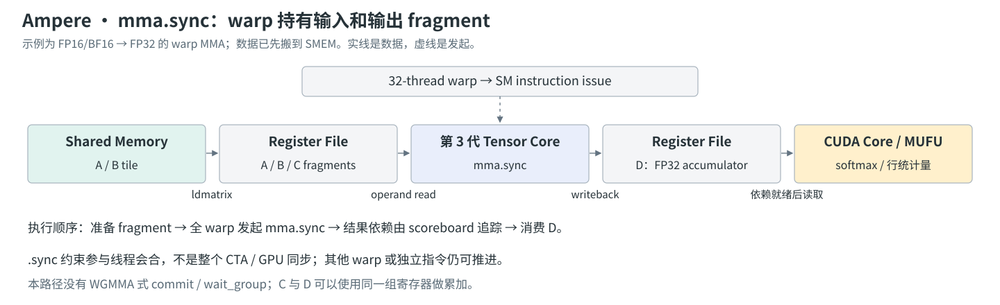

流程可以按四步读：

1. copy pipeline 把 operand tile 放进 SMEM，并完成必要等待；线程随后用 `ldmatrix` 等方式把 A/B 读成 MMA 需要的 register fragment。
2. 32 个 lane 共同执行同一条 `mma.sync.aligned.m16n8k16...`，每个 lane 提供自己负责的 fragment。单个线程拿到的是矩阵的一部分，不能将它当成独立完整矩阵。
3. Tensor Core 执行乘加，D 写回 register tuple；C/D 可以使用同一组寄存器，形成累加。
4. 后续依赖 D 的指令由寄存器依赖机制约束；如果要继续 softmax，线程直接处理自己的 accumulator fragment，并按行 ownership 做必要归约。

以 FP16 输入、FP32 累加的 `m16n8k16` 为例，每线程 A 有 4 个 32-bit packed registers、B 有 2 个，C/D 各有 4 个 FP32 registers。自检一下：$32\times4=128$ 个 FP32 输出，正好覆盖 $16\times8$；A 的 $32\times4\times2=256$ 个 FP16 值也对应 $16\times16$。这说明 Layout 的 fragment 映射必须和 ISA 的矩阵大小对得上。

`.sync` 不能翻译成“GPU 停下来等一次 GEMM”。它约束 collective 的参与线程会合；独立 warp 和允许的独立指令仍然可以推进。真正与 Hopper 不同的是：这条接口没有暴露一组“先提交大块矩阵运算，再显式等待其 async group”的控制方式。`ldmatrix` 也不是 Ampere 首次加入的指令，它在 Turing 已经存在；Ampere 新增的关键加载能力是后文的 `cp.async`。

### Hopper MMA：WGMMA 把矩阵输入和结果等待从指令发起中分开

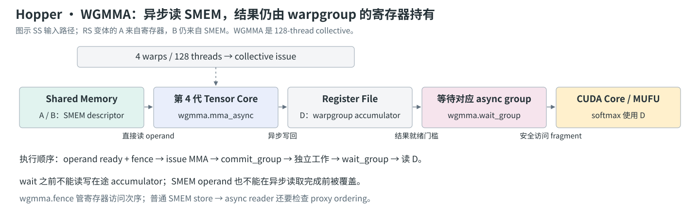

Hopper 的代表性执行顺序为：

1. 准备 SMEM tile 和 descriptor；如果使用 RS 变体，也准备寄存器 A。QK 常用 SS，PV 则可把 softmax 得到的 P 保留为寄存器 A。
2. 根据 producer 的写入方式建立可见性；在需要的位置执行 `wgmma.fence.sync.aligned`，使先前的 accumulator/A-register 访问与接下来的 WGMMA 有序。
3. 128 个线程一致执行 `wgmma.mma_async.sync.aligned...`。Tensor Core 异步读取 operand、推进矩阵乘，发起方可以执行不依赖该结果的其他工作。
4. `wgmma.commit_group.sync.aligned` 划定一组已经提交的 MMA；直到需要其结果，再用 `wgmma.wait_group.sync.aligned N` 控制允许尚未完成的 group 数。`N=0` 是排空，不是每次发起后都必须立刻执行的默认策略。
5. 等待满足后才能读写相应 D registers，也才能归还仍被异步读取的 SMEM operand buffer。

这里有两种 fence，不能互换。`wgmma.fence` 负责相关寄存器访问顺序；若 SMEM 由普通线程 store 写入、随后由 async proxy 读取，则还要满足 `fence.proxy.async` 对应的跨 proxy 规则。TMA 写入后的交接应按 TMA/pipeline 的完成协议处理，不能机械地在每条指令前都加同一条 fence。见 [WGMMA fence 的精确定义](https://docs.nvidia.com/cuda/parallel-thread-execution/#asynchronous-warpgroup-level-matrix-instructions-wgmma-fence)。

输入绕过了逐 lane 的 register staging，但结果没有：一份 $64\times128$ FP32 accumulator 共 32 KiB，均分到 128 个线程是每线程 64 个 32-bit registers。两份 accumulator、softmax 临时值和输出 U 同时存活时，很快就会侵占 64K registers/SM 的预算。后文 FA3 的流水深度取舍由此而来。

### Blackwell MMA：发起粒度缩小，accumulator 生命周期独立到 TMEM

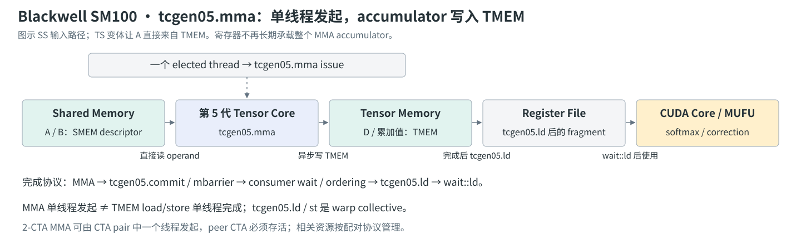

SM100 的流程进一步改变：

1. 按 collective 契约分配 TMEM，并准备 A/B 的 descriptor 或 TMEM address。形状、输入类型等还由 instruction descriptor 编码。
2. 在一个 elected thread 上发出 `tcgen05.mma.cta_group::1.kind::f16` 等指令；它不是 128-thread WGMMA collective 的另一个名字。
3. Tensor Core 从 SMEM/TMEM 读 operand，将累加结果异步写入 TMEM。发起 MMA 的线程不需要以自己的一组 D registers 接住完整结果。
4. 用 `tcgen05.commit...mbarrier::arrive::one` 等规定的机制提交完成通知；consumer 等待该 barrier，并按访问跨线程的情况使用相应 `tcgen05.fence` ordering。
5. consumer warps 用 `tcgen05.ld` 把需要的 TMEM 数据读到各自 registers；`tcgen05.wait::ld` 满足 load 完成条件后，再做 softmax/correction。写 P 回 TMEM 时则对应 `tcgen05.st` 及其等待/发布协议。

这里有三个不同的粒度：**MMA 发起是单线程，TMEM load/store 是 warp collective，TMEM allocation/deallocation 也有自己的 warp 或 CTA-pair collective 要求。** 不能把“单线程 MMA”扩大成“所有 TMEM 操作都由一个线程完成”。一个 warp 的 TMEM 访问窗口也受布局约束，不能任意访问整块 TMEM。

在 `cta_group::2` 中，CTA pair 由同一 cluster 内 rank 最低位不同的两个 CTA 组成；一个线程即可发起配对 MMA，但 peer CTA 必须已经存在并保持 active。A/B/accumulator 的切分由硬件接口规定，allocation/free 和退出也要遵守配对协议。详见 [tcgen05 issue granularity](https://docs.nvidia.com/cuda/parallel-thread-execution/#tcgen05-issue-granularity) 与 [memory consistency](https://docs.nvidia.com/cuda/parallel-thread-execution/#tcgen05-memory-consistency-model)。

一份 $128\times128$ FP32 accumulator 是 64 KiB。相比 Hopper，它不再全部挤进发起线程的 Register File，但占用的 TMEM 同样真实存在；softmax 将一行读到 registers 后，又会产生通用寄存器压力。因此 TMEM 扩大的是可行调度空间，不是无限容量。

### Async load 的三代变化：Ampere 的对照项是 cp.async，不是 TMA

| 属性 | Ampere `cp.async` | Hopper TMA load | Blackwell SM100 TMA load |
| --- | --- | --- | --- |
| 发起信息 | 每线程的 global/shared 地址、copy 大小与 predicate | tensor map、tile 坐标、SMEM 目的地址、mbarrier | 同左，并有 CTA-pair 等扩展 qualifier |
| 搬运粒度 | 单条 4/8/16 bytes，受具体变体限制 | 一次多维 tile，支持 1D–5D tensor 描述 | 保留 tile transfer；不是每代都更换指令家族 |
| 地址与边界 | 软件线程生成细粒度地址，组织覆盖关系 | 硬件根据 descriptor 处理布局、边界和支持的 swizzle | 保留同一抽象，新增能力按 target/变体核对 |
| payload 是否经过通用 RF | 不经过 | 不经过 | 不经过 |
| Global load 的目的地 | SMEM | SMEM | **仍是 SMEM，而不是 TMEM** |
| 常用完成协议 | per-thread async-copy group wait | mbarrier arrival + transaction bytes | 同左；`.cta_group::2` 可通知目的 CTA 的 peer |
| cluster multicast | 不具备 TMA multicast 接口 | 已支持 | 保留并扩展；不等同于 `.cta_group::2` |

这里讨论 global→shared load；反方向的 TMA store/reduction 可能使用 bulk async-group 等其他完成机制，不能把 load 的 mbarrier 协议直接照抄。具体 ISA 见 [`cp.async`](https://docs.nvidia.com/cuda/parallel-thread-execution/#data-movement-and-conversion-instructions-cp-async) 与 [`cp.async.bulk.tensor`](https://docs.nvidia.com/cuda/parallel-thread-execution/#data-movement-and-conversion-instructions-cp-async-bulk-tensor)。

### Ampere load：线程生成地址，硬件负责异步搬运 payload

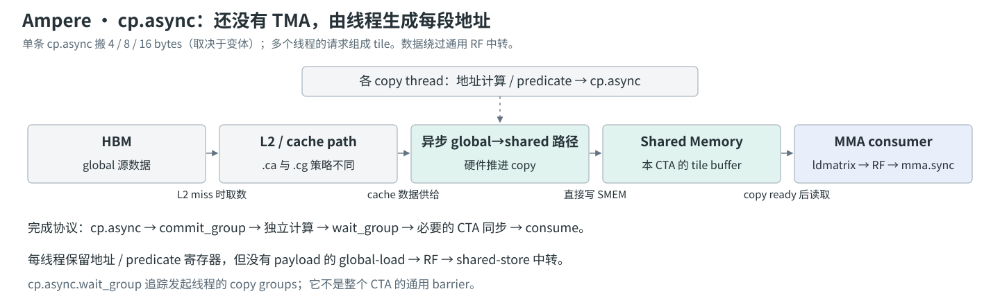

常规 `ld.global → register → st.shared` 路径需要寄存器暂存 payload，并由线程发出两侧数据指令。`cp.async` 允许直接推进 global→shared copy，省去这个中转；地址、predicate 等控制值仍要用寄存器，并不是“copy 不再需要任何寄存器”。

典型流程是：各线程计算自己那段源/目的地址，发出多个 copy，把它们 `commit_group`，然后先做当前 tile 的计算；需要下一块时，等待相应 group，完成 CTA 内必要的交接，再执行 `ldmatrix` 和 MMA。`.ca` 支持 4/8/16-byte copy，`.cg` 的这类基础变体为 16-byte copy；L1/L2 cache policy 也随变体不同，不能把所有 `cp.async` 统一画成“必过 L1”或“必绕过 L1”。

tile 的 shape/stride、每个线程搬哪些行、OOB 的 predicate/填零安排，仍由软件组织。Ampere 减少的是 payload staging 与暴露的搬运等待，还没有将多维 tensor 地址生成整体交给 TMA。

### Hopper TMA load：tensor map 把 tile 描述交给硬件

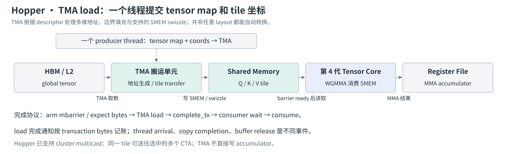

tensor map 通常由 `cuTensorMapEncodeTiled` 等 API 建立，描述 base address、维度、stride、tile box、dtype、swizzle 等；线程发起时提供 tile coordinates，而不再为每个元素重复构造独立 copy 请求。

一个典型 2D global→shared 指令家族为：

```text
cp.async.bulk.tensor.2d.shared::cluster.global.mbarrier::complete_tx::bytes
    [smem_dst], [tensor_map, {coord0, coord1}], [mbarrier];
```

这只是 operand 角色示意，不是包含初始化、地址转换、对齐和循环等待的可编译 kernel。执行时序为：

1. producer acquire 一个空的 SMEM stage，并初始化/推进该 stage 的 barrier phase。
2. 按实际将传输的字节数登记 expected transaction bytes，并完成协议所要求的 thread arrival；`arrive.expect_tx` 可以组合相关记账，但 arrival 和 transfer completion 是两种事件。
3. 一个 producer thread 发出 TMA load；TMA 从 global/L2 取数，处理支持的边界填充与 swizzle，写入 SMEM。
4. 传输完成后，硬件对指定 mbarrier 执行 `complete_tx`。只有对应 phase 的 arrival 与 transaction 条件满足，consumer 的 wait 才能成功。
5. consumer 执行 WGMMA；等所有旧 reader 完成，才 release stage 给下一轮 producer。

descriptor 不能描述任意 gather 或任意 transpose。特别是 FA3 的 FP8 V tile，连续维度要求不同仍可能需要真实转置；“TMA 能处理布局”不能推成“所有 layout conversion 都免费”。此外 Hopper 已有 `.multicast::cluster`，可将同一个 tile 送到选中的 CTA 的 SMEM，用于减少重复 global 取数；这不是 Blackwell 才首次出现的能力。

### Blackwell TMA load：数据路径延续，完成通知与 CTA pair 协作扩展

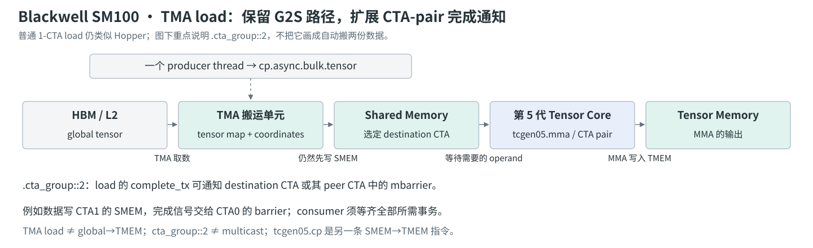

Blackwell 的普通 1-CTA TMA load 仍是 `global → SMEM`，仍使用 tensor map 和事务完成 barrier。最容易混淆的变化发生在 **完成信号发给谁**，以及下游 MMA 如何消费这些数据。

SM100 支持 `.cta_group::1/2` 等扩展。对 `.cta_group::2`，目的数据可以写入一方 CTA 的 SMEM，而完成通知关联到该 CTA 或其 peer CTA 中的 mbarrier。比如 CTA1 的 operand 到达后通知 CTA0 的 barrier，使负责发起 paired MMA 的角色在一个约定位置收集 ready 状态。跨 CTA barrier 地址还必须使用匹配的 shared address space 和 target 允许的形式；不能只在旧指令末尾拼一个 qualifier 就认为协议完整。

应严格区分三种功能：

- **`.cta_group::2`**：扩展 CTA pair 的完成通知关系；本身不表示复制两份 payload。
- **`.multicast::cluster`**：由 mask 指定多个接收数据的 CTA；与 CTA-group 修饰组合时还需遵循对应 barrier 信号路由规则。
- **`tcgen05.cp`**：另一条将 SMEM 数据搬到 TMEM 的指令，既不是 TMA global load，也不是普通 `cp.async`。

PTX 还列出 Blackwell 的 gather/im2col 等特定模式扩展，但它们不是本文 dense-attention TMA 主循环的必需条件。这里强调 FA4 真正用到的关系：**TMA 先准备 SMEM operand，`tcgen05.mma` 再把计算结果写入 TMEM**。实际 qualifier 的最低 target 与 ISA 版本可对照 [NVIDIA CCCL 的 TMA instruction wrapper](https://nvidia.github.io/cccl/unstable/libcudacxx/ptx/instructions/cp_async_bulk_tensor.html) 和 [PTX TMA 定义](https://docs.nvidia.com/cuda/parallel-thread-execution/#data-movement-and-conversion-instructions-cp-async-bulk-tensor)。

### 把两条流水接起来：ready、done 和 reusable 是三个时间点

硬件路径最终要组合成一个正确的 buffer 协议：

```text
producer 获得空 stage
  → cp.async / TMA 填充 operand
  → load ready：消费者可以读取
  → mma.sync / WGMMA / tcgen05.mma 执行
  → MMA done：结果可以交给 softmax / correction
  → 最后一个旧 reader 结束
  → stage reusable：下一轮才能覆盖
```

对不同 buffer，这几个时间点不一定相同：K 在 QK 读完后可能比 V 更早释放；MMA 已经发出也不代表 P、K、V 可以覆盖；TMEM 的 MMA 完成并不代表 `tcgen05.ld` 的目标寄存器已可使用。

因此三代演进不是简单的 `mma.sync → wgmma → tcgen05` 字符串替换。**发起粒度、operand 存放位置、accumulator 所有权和完成协议一起变了**。下面再回到同一张 attention 计算图，就能解释各代 FlashAttention 为什么要采用不同的线程分工与 overlap 调度。

## 先建立共同的计算图：哪些依赖不能被 overlap 消掉

对一个 head，忽略 dropout，令 $Q\in\mathbb R^{N_q\times d}$、$K,V\in\mathbb R^{N_k\times d}$：

$$
S=QK^T/\sqrt d+\mathrm{mask},\qquad
P=\operatorname{softmax}(S),\qquad O=PV.
$$

固定一块 $B_r$ 行的 Q，沿 KV token 维度扫描宽度为 $B_c$ 的 tile。令 $S_j$ 为第 $j$ 块 score，维护行最大值 $m_j$、指数和 $\ell_j$、**未归一化**输出 $U_j$：

$$
\begin{aligned}
m_j&=\max(m_{j-1},\operatorname{rowmax}(S_j)),\\
\alpha_j&=\exp(m_{j-1}-m_j),\\
\widetilde P_j&=\exp(S_j-m_j),\\
\ell_j&=\alpha_j\ell_{j-1}+\operatorname{rowsum}(\widetilde P_j),\\
U_j&=\alpha_j U_{j-1}+\widetilde P_jV_j,\\
O&=U_{\mathrm{last}}/\ell_{\mathrm{last}}.
\end{aligned}
$$

其中行向量按行广播；初始 $m=-\infty,\ell=0,U=0$，第一块和整行被 mask 的情况需要专门处理。这里用 FA2 式未归一化输出统一后文符号；FA1 原论文的状态更新写法有所不同。

这组式子把三类依赖分开了：

1. **同一 KV tile 内**：必须先得到 $S_j$，才能计算 $\widetilde P_j$，再执行 $\widetilde P_jV_j$。
2. **相邻 KV tile 间**：softmax 的统计量和输出累加有递推关系；重排时必须保持尺度一致。
3. **不同 Q tile 间**：输出行不同，统计量也不同，前向通常可以独立计算。

因此，合法的 overlap 来自“别的独立工作”：预取下一块 KV、计算另一块 Q、执行上一轮的 PV，或者先发出不会读取当前 softmax 结果的 QK。**异步指令只让发起线程可以继续前进，不会让尚未产生的 operand 提前可用。**

同样要区分两种 $P$：数学上的 $P$ 已经过整行归一化；主循环送入 PV 的通常是 $\widetilde P$。后文图中为了缩短标签写作 `P`，归一化留在 epilogue。

## FA1：先让大矩阵不再离开片上

本章按下面三项优化展开：

- **分块与 kernel fusion**：在片上衔接 QK、softmax、PV，避免完整 S/P 往返 HBM。
- **Online softmax**：用每行统计量合并不同 KV tile，使分块结果仍对应完整 attention。
- **Backward 重计算**：保存少量行状态，反向重建局部 S/P，以额外计算换取更少的显存流量。

### 分块解决的不是 FLOPs，而是中间值的往返

传统实现先用 GEMM 写出完整 S，再由 softmax 读 S、写 P，最后 GEMM 读 P。这两张 $N_q\times N_k$ 矩阵一旦物化到 HBM，计算途中就产生大规模读写。FA1 把局部 QK、softmax、PV 融进同一 Kernel，用上面的行统计量合并各块结果。

这里“留在 SRAM”是一种算法层面的简写：Q/K/V tile 通常由 shared memory 缓存，Tensor Core fragment、score、统计量和 accumulator 还会消耗寄存器。**不是把完整 S/P 放进 shared memory，而是任意时刻只保留当前需要的局部状态。**

以 $N=8192$ 为例，单 head 一张 FP16 的 $N^2$ 矩阵就有 128 MiB；这还没有算 S/P 两份状态、FP32 softmax 和 batch/head 维度。FA1 节省的首先是这类中间状态和相应 IO，而稠密 attention 的主导运算量仍是 $\Theta(N^2d)$。

原论文以片上容量 $M$（按元素计数）分析 IO：在其假设 $d\le M\le Nd$ 下，标准 attention 的 HBM 访问量为 $\Theta(Nd+N^2)$，分块方案为 $\Theta(N^2d^2/M)$。这个式子解释了 tile 复用为何有效，但不能直接拿 GPU 的全部 shared capacity 代入：真实 Kernel 还要给寄存器 fragment、多个 buffer、对齐和驻留 CTA 留预算。见 [FA1 §3 与 Algorithm 1](https://arxiv.org/abs/2205.14135)。

还有一个常见误读：FA1 的算法描述以 KV tile 为外层循环，在内层更新各 Q tile 的输出和统计量，**会读写输出状态**；不能把“没有 $N^2$ 中间矩阵”解释成“所有输入只读一次、输出只写一次”。后续 Q 方向的工作重排正是另一层优化。

### Online softmax：只保留能合并下一块的行状态

只做 tiling 还不够：softmax 的分母依赖整行所有 KV token，不能对每块独立归一化后直接相加。Online softmax 保留 running max 和指数和；新块使最大值变化时，用共同缩放因子把旧状态换到新尺度，再合并新块贡献。

前面的统一递推还携带了输出分子 U；FA1 原论文用归一化输出 O 写更新式，本质上保存的是同一份可合并状态。当前 tile 的 score/probability 用完即可丢弃，留下的是每行的标量统计量和 d 维输出，而不是完整概率矩阵。FA2 随后会进一步改变输出状态的表示，以减少主循环中的非矩阵工作。

这一步保持的是原 attention 的数学表达式，没有通过截断 KV 或稀疏化来近似注意力；实际浮点计算仍可能因运算顺序变化产生舍入差异。它解决了“完整分母尚未可用时，怎样先消费当前 tile”的问题，才使前一节的 fusion 成为可能。

### 反向重计算为什么能比保存更便宜

不保存完整 P，反向传播要怎么做？保存 O 和每行的 softmax 统计量，在 backward 中重新生成当前 tile 的 score/probability。新增的是局部矩阵乘与指数计算，省掉的是完整 attention matrix 的保存和读取。

这不是声称重计算永远便宜，而是利用当时 attention 的 IO 成本与 GPU 算力之间的不对称。换一颗计算更弱、片上空间更小的处理器，或者换一种必须返回完整 attention weights 的 API，这笔账就要重算。若调用者最终需要完整 P，输出本身的 $N^2$ 存储需求无法被 FlashAttention 消除。

FA1 的关键贡献也不应归因于某条新异步指令。Tiling、fusion、online softmax、recomputation 先改变了**算法的数据流**；A100 等硬件上的 Tensor Core 和高速片上存储把这套数据流变成实际收益。与之配套的作者团队解读可看 [Stanford Hazy Research 的 FlashAttention 介绍](https://hazyresearch.stanford.edu/blog/2022-06-09-longer-sequences-next-leap-ai)。

## FA2：省了 HBM 以后，还要省非矩阵工作和 warp 通信

本章按下面四项优化展开；前三项是论文强调的算法与工作划分改进，最后一项说明 Ampere 上的具体实现路径：

- **延迟归一化、减少非矩阵工作**：主循环累加未归一化输出，最后统一除以分母。
- **Q 方向 CTA 并行**：让 query 序列长度也提供独立任务，改善小 batch、少 head 时的 SM 利用率。
- **Sliced-Q 的 warp 分工**：把不同输出行交给不同 warp，减少跨 warp 的 partial-output 交换与合并。
- **异步 copy 与计算重叠**：用 `cp.async`、多 buffer 和匹配的 fragment layout 提前准备下一块 KV。

### 延迟归一化：少做的不是指数，而是反复更新输出的尺度

若每读一块 KV 就保存已经归一化的 $O_j$，下一轮需要把旧的分母尺度合进输出更新。FA2 维护未归一化 $U_j$，只在结束时除以 $\ell$，由此减少主循环中围绕输出向量的乘除、rescale 和 bookkeeping。

注意：FA2 仍保留 $\alpha_j=\exp(m_{j-1}-m_j)$ 的稳定性校正。这与 FA4 后面“在一定条件下连这一步也跳过”是不同优化。

为什么这些 FLOPs 占比很小，却值得专门优化？因为 FLOP 并不是等价的成本单位。Tensor Core 的矩阵 FMA、CUDA Core 上的向量运算、MUFU 上的指数、warp shuffle 上的归约，有不同的吞吐和依赖延迟。两个 GEMM 越快，夹在中间的非矩阵部分越可能暴露。

### 把 query 行分给更多 CTA，让长序列也提供并行度

FA2 前向让一个 CTA 拥有一块 Q 及其输出行，并在 CTA 内扫描所需的 KV。逻辑上的 CTA 数从主要依赖 batch/head，扩展到近似

$$
N_{\mathrm{CTA}}=B\,H_q\left\lceil N_q/B_r\right\rceil.
$$

小 batch、少 head、长序列时尤其重要：即使单个 head 工作量很大，若只生成很少的 CTA，也不能把全 GPU 的 SM 填满。

这里需要补一个历史边界：Q 序列方向的并行在 FA2 论文之前就已进入 FlashAttention 的迭代实现，作者在 [2023 年 1 月的长序列博客](https://hazyresearch.stanford.edu/blog/2023-01-12-flashattention-long-sequences) 中已经介绍。本文按 FA2 论文将它与非矩阵运算、warp 分工一起讨论，不把它误写成 FA2 发布当天才出现的能力。

这样做会让不同 Q tile 再次读取 K/V。它并不是让所有 IO 都减少，而是选择把输出状态留在本 CTA 的主循环里，换取 Q 方向并行和更好的局部累加；L2 命中能否降低重复读取的 HBM 成本，又取决于工作集和 CTA 顺序。**理论上的 IO 最省，不一定等于真实 GPU 上 latency 最低。**

### sliced-Q：让每个 warp 对自己负责的输出行算到底

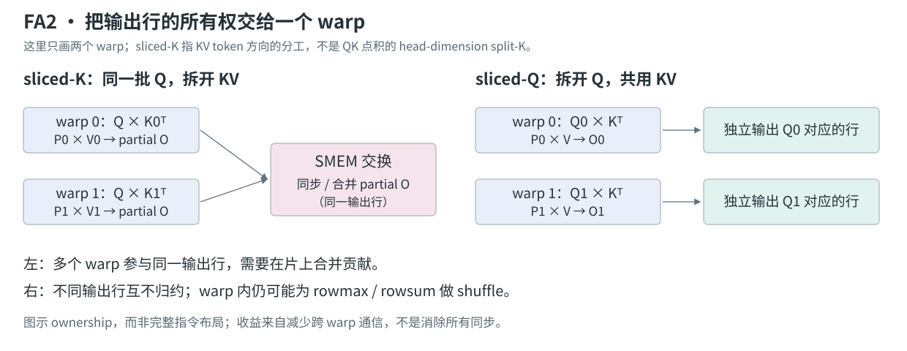

图左的 sliced-K 把 KV 序列方向的工作分给不同 warp，它们会产生同一输出行的部分贡献，因而需要跨 warp 交换、同步和合并。图右的 sliced-Q 则把 Q 行拆开，让每个 warp 持有不同输出行，K/V 由各 warp 复用。

这样，`QK → softmax → PV` 可以围绕一份行所有权组织；为了合并同一输出行而产生的跨 warp SMEM 流量被削减。warp 内部为 rowmax/rowsum 做的 shuffle 仍可能存在，不能把 sliced-Q 写成“没有 reduction”。这里的 sliced-K 也不要与 GEMM 沿 head dimension 拆分点积的 split-K 混为一谈。三项改动的原始说明见 [FA2 §3](https://arxiv.org/abs/2307.08691) 与 [作者博客](https://crfm.stanford.edu/2023/07/17/flash2.html)。

### Ampere 上的 overlap：下一块 KV 搬运与当前块计算

在 Ampere-style 实现中，`cp.async` 把 global→shared copy 从计算线程的同步数据路径里分离出来；shared→register 仍需按 MMA fragment 布局组织。Swizzle、向量化 copy、`ldmatrix` 与 register layout 都在解决“数据能否持续喂给 Tensor Core”。

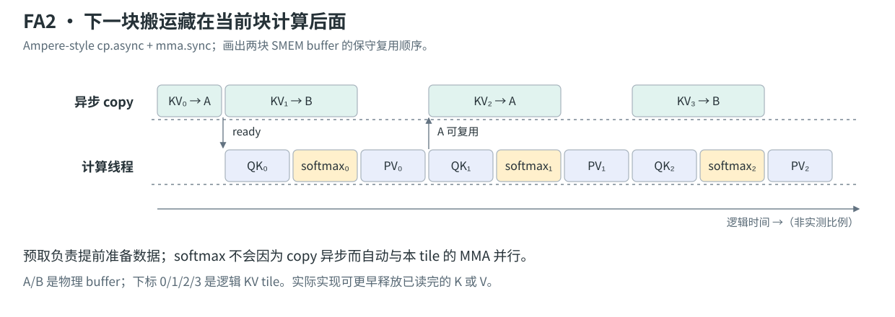

图中 KV₁ 的 copy 与 KV₀ 的计算重叠；计算 KV₁ 时，再搬 KV₂。它改变了加载等待的暴露程度，但没有消除当前 tile 的 `QK → softmax → PV` 依赖。

双缓冲里的 A/B 是物理 storage，tile 下标是逻辑迭代。写入 `tile j+2` 之前，必须确认旧消费者已经读完 `tile j`。`cp.async.wait_group` 负责对应异步 copy 的完成条件，CTA 级消费者之间的数据交接还需要合适的同步；单独写一个 `__syncthreads()` 不能替代异步 copy 的等待协议。具体实现可对照 [FA2 前向源码](https://github.com/Dao-AILab/flash-attention/blob/1bda8f9290cd48d030f1516f0e680cd464ef3554/csrc/flash_attn/src/flash_fwd_kernel.h) 与 [NVIDIA async-copy 说明](https://developer.nvidia.com/blog/controlling-data-movement-to-boost-performance-on-ampere-architecture/)。

这也解释了为什么三 stage 不一定优于两 stage。多一块 buffer 可以让 copy 更早发出，却同时增加 SMEM 占用，可能减少 resident CTA。站内 CuTe 实验在 RTX 4060 Laptop 的特定配置下就观察到更深流水变慢；那是资源交换的反例，不能推成 A100 上的通用结论。

## FA3：Hopper 把搬运和矩阵乘都变成异步工作

本章按下面五项优化展开：

- **TMA + warp specialization**：producer 搬运、consumer 计算，并用 `setmaxnreg` 调整两者的寄存器预算。
- **WGMMA 异步矩阵乘**：通过 SMEM descriptor 直接提供 operand，用 commit/wait 将发起与结果消费分开。
- **跨 warpgroup 的 ping-pong**：让一组的 GEMM 与另一组的 softmax 交错。
- **单 warpgroup 内的两阶段流水**：让当前 KV tile 的 softmax 与上一 tile 的 PV 重叠。
- **FP8 路径的布局与精度优化**：配合 block quantization、V 转置和 incoherent processing，降低量化误差并适配 Tensor Core。

### TMA + warp specialization：producer 与 consumer 做不同的事

TMA 使用 tensor map 描述布局和 tile 坐标，处理多维搬运、地址计算与部分边界逻辑。相比大量线程各自发出细粒度 copy，一个 producer 角色就能用很少的线程发起较大的 tile transfer。

FA3 将工作区分为 producer 与 consumer：producer 等待空 buffer、发出 Q/K/V 的 TMA load；consumer 等待数据 ready，执行 WGMMA 与 softmax，最后归还 buffer。producer 不需要那么多 accumulator 寄存器，`setmaxnreg` 允许把寄存器预算更多地留给 consumer。

但 TMA 并没有把 HBM 到 SMEM 的 bytes 变成零。它主要节省发起成本、地址处理与寄存器中转，并允许搬运在别的工作背后推进。producer 也不能无限向前跑：buffer 尚未释放时必须停下。

一块 SMEM buffer 的生命周期是：

```text
empty → producer acquire → TMA in flight → transaction complete / full
      → consumer acquire → WGMMA 读取 → 读取完成 / release → empty
```

其中 `TMA issued` 不等于 `full`，`WGMMA issued` 也不等于 buffer 可以复用。TMA 的事务完成 barrier、WGMMA 的 commit/wait、跨 proxy 的可见性要求和 consumer release 各自解决不同问题。具体协议应由目标指令和 pipeline abstraction 保证，不能拿一条通用 barrier 代替全部阶段。见 [FA3 Algorithm 1](https://arxiv.org/html/2407.08608v1#S3) 与 [Colfax 的流水教程](https://research.colfax-intl.com/cutlass-tutorial-design-of-a-gemm-kernel/)。

### WGMMA：输入少经过寄存器，输出仍然占用寄存器

Hopper WGMMA 是 warpgroup 级的异步矩阵乘。QK 可以直接读取 shared memory 中的 Q/K；PV 可以把寄存器中的 P 作为 A operand，并从 SMEM 读取 V。

输入直接来自 SMEM 并不代表寄存器压力消失：score accumulator、输出 accumulator、softmax 临时值和统计量仍要占寄存器。FA3 增加软件流水时，很快就会遇到“同时活着的状态太多”的约束。这一点正好连接到 FA4 为什么需要 TMEM。

### 两层 overlap：跨 warpgroup 与跨 KV 迭代

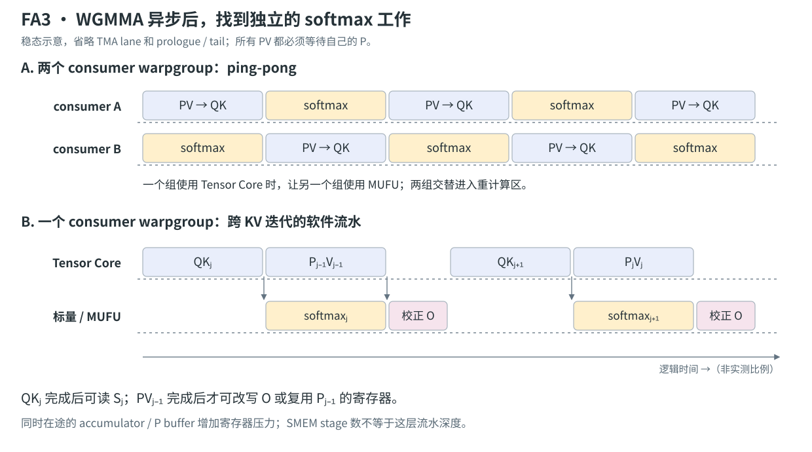

#### 跨 warpgroup：让不同 Q 行的工作交错

图 A 是 **inter-warpgroup ping-pong**。两个 consumer warpgroup 拥有独立 Q 行，各自都有 GEMM 和 softmax。让 A 做矩阵乘时 B 做 softmax，再交换角色，可以让 Tensor Core 与 MUFU 在时间上重叠。barrier 用于约束两组进入对应计算区的顺序；否则两个组可能同时计算 softmax，然后一起等矩阵结果，资源使用反而扎堆。

#### 单 warpgroup：跨 KV 迭代寻找独立工作

图 B 是 **intra-warpgroup 的两阶段流水**。在稳态中，先发出当前块 $QK_j^T$，再发出上一块 $\widetilde P_{j-1}V_{j-1}$。等 $S_j$ ready 后，计算当前块 softmax；此时上一块 PV 仍可以在 Tensor Core 上进行。等 PV 完成，再校正输出的尺度。

这里最值得检查的是寄存器所有权：

- softmax 使用 $S_j$，不能在当前 QK 完成前读取。
- 进行中的 PV 还会读取 $\widetilde P_{j-1}$，不能把它当作当前 P 的临时 buffer 随意覆盖。
- PV 正在更新 U 时，标量线程不能同时对同一 U 做 rescale。
- 第一轮没有“上一轮 PV”，最后一轮也没有“下一轮 QK”，因此 prologue 与 tail 必须单独安排。

图中的两层 overlap 可以结合，但它们都消耗状态空间；SMEM 的 copy stage 数与 register 中 GEMM–softmax 的流水深度不是一个参数。FA3 论文还讨论了三阶段方案，但更多 in-flight 工作也意味着更多寄存器，不能从理论重叠程度直接判断最终性能。见 [FA3 §3.2 与附录 B](https://arxiv.org/html/2407.08608v1#S3.SS2)；作者的 [Hopper 优化博客](https://tridao.me/blog/2024/flash3/) 给出了两种调度的直观图解。

### FP8：不仅要换 dtype，还要处理布局与误差

FP8 Tensor Core 提高了矩阵部分的吞吐，但 softmax 指数并不会随之变快。两个 GEMM 越短，softmax 越需要被覆盖；因此低精度和 overlap 是耦合的优化。

FA3 还处理了两种不同的问题：

**第一种是 operand layout。** FP8 WGMMA 的约束使 PV 需要的 V 布局与常见输入布局不一致；TMA load 本身不会任意交换连续维度。实现对 V tile 做 kernel 内转置，并处理 FP32 accumulator 到 FP8 A operand 的重排。这是实际数据变换，不能照搬 FP16 教学 Kernel 中“只改 view、不搬数据”的结论。

**第二种是量化误差。** 每个 Q/K/V block 用局部 scale，比整张 tensor 共用一个 scale 更能适应局部分布；对 Q/K 使用同一个随机正交变换 R，还可以在量化前分散 outlier。其依据是

$$
(QR)(KR)^T=QRR^TK^T=QK^T.
$$

等价性发生在量化之前；舍入到 FP8 后仍有误差。FA3 采用随机符号与 Hadamard 变换，以较低代价实现这一预处理，并讨论与前序算子融合。RoPE 存在时也要保持运算位置正确，不能任意把一个不与旋转交换的变换搬到 RoPE 之前。布局和数值细节见 [FA3 §3.3](https://arxiv.org/html/2407.08608v1#S3.SS3)。

所以“exact attention”的算法意义是没有用稀疏、低秩等方法改掉稠密 attention 定义；它不等于不同归约顺序、FP8 量化或近似指数能得到 bitwise identical 的结果。

## FA4：Blackwell 需要重新配平片上的各类资源

先用资源模型定位瓶颈，再按下面七项优化展开；前四项围绕 forward，后面扩展到 backward 和全 GPU 调度：

- **TMEM 中的状态与 buffer 生命周期**：用 `tcgen05.mma` 将 accumulator 与发起线程解耦，围绕结果交接组织流水。
- **MMA / softmax / correction 分工**：交错两个 Q tile，让矩阵乘、指数计算和输出校正有独立工作可做。
- **部分指数模拟**：将一部分 `exp2` 分配给 FMA 路径，缓解 B200 上 MUFU 的吞吐压力。
- **条件 rescale**：允许指数参考点在安全范围内暂缓更新，减少旧输出的缩放工作。
- **Backward 跨迭代流水与 TMEM 复用**：把上一轮 dK/dQ 插入本轮 softmax 窗口，控制五个 GEMM 的状态占用。
- **2-CTA MMA 与 DSMEM 协作**：减少 backward 的重复 SMEM 流量，并在写回前合并更多 dQ 贡献。
- **CTA 调度与确定性归约顺序**：联合考虑 causal/varlen 的任务长度、L2 局部性和 backward 更新等待。

### 用一笔简单的账看出 softmax 为什么重新成为瓶颈

固定 $B_r\times B_c$ score tile，两个 GEMM 的工作量约为 $4B_rB_cd$ FLOPs，指数约有 $B_rB_c$ 次。采用 FA4 论文对 **B200 BF16 稠密路径**的简化吞吐模型：Tensor Core 为 8192 FLOPs/clock/SM，指数单元为 16 operations/clock/SM，则

$$
T_{\mathrm{MMA}}\approx\frac{4B_rB_cd}{8192},\qquad
T_{\exp}\approx\frac{B_rB_c}{16},\qquad
\frac{T_{\exp}}{T_{\mathrm{MMA}}}\approx\frac{128}{d}.
$$

由此可以自己推出一个关键判断：当 $d=128$ 时，**只算指数的吞吐下界，就已经与两次矩阵乘相当**；$d=64$ 时压力更大。softmax 实际上还有 max、sum、subtract、类型转换和访存，因此“GEMM FLOPs 占绝大多数”不能说明 softmax 的耗时很小。

对 $B_r=B_c=d=128$，上述模型给出 MMA 1024 cycles、指数 1024 cycles；论文在其 SMEM operand 读取假设下算得约 768 cycles。它们是理想资源服务时间，不是单条指令 latency，也不是实测 kernel 用时；不能把三个数简单相加，因为目标恰好是重叠它们。反过来，也不能只取最大值就当成一定可达：依赖、TMEM 往返、指令发射和首尾阶段都会增加时间。原始模型及其假设见 [FA4 §3.1.1](https://arxiv.org/html/2603.05451v1#S3.SS1.SSS1)。

### TMEM：把“矩阵结果的所有者”从发起线程身上解开

Blackwell 的 `tcgen05.mma` 将 accumulator 写到 TMEM，而不要求发起矩阵运算的 warp 长期拥有这些寄存器 fragment。B200 每 SM 有 256 KiB TMEM；它是显式管理的 Tensor Memory，不是普通 shared memory 的别名，也不能被任意标量指令直接当寄存器计算。

前向数据路径可以概括为：

```text
Q/K in SMEM ── QK MMA ──> S in TMEM
                               │ tcgen05.ld
                               v
                     softmax in registers
                               │ convert + tcgen05.st
                               v
                         P in TMEM ──┐
V in SMEM ───────────────────────────┴─ PV MMA ──> U in TMEM
                                                     │
                                          correction / epilogue
```

这样，MMA warp 可以持续组织矩阵运算，softmax warpgroup 从 TMEM 取 S、算 P，再把 P 交回；另一个 correction warpgroup 负责读取/校正 U。不同角色通过 TMEM 和 barrier 传递数据状态，而不是必须共享一份长期占用的寄存器 fragment。

收益有两面：长生命周期 accumulator 不再全压在通用寄存器上，调度更灵活；但新增的 TMEM load/store、buffer 分配与可见性协议也有成本。softmax 把一整行搬到寄存器后，寄存器压力仍然很大，TMEM 没有让这个问题消失。

### 前向调度：两个 Q tile，两个 softmax 组，一个 correction 组

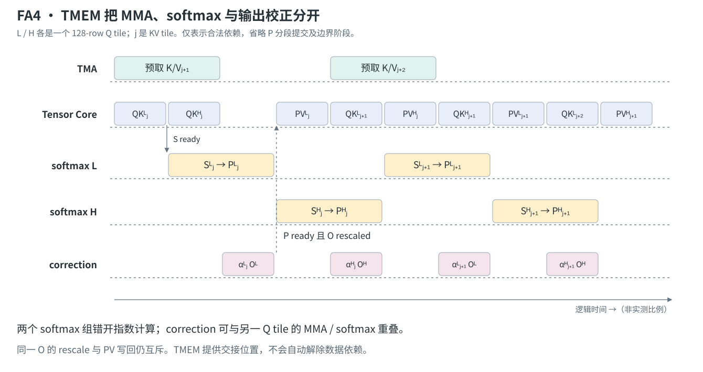

图中 L/H 是同一 CTA 内两个独立的 128-row Q tile，并不是两个 CTA。对 L 做 softmax 时，MMA 可以为 H 计算 score；H 做 softmax 时，再为 L 执行 PV 和下一轮 QK。两个 softmax 组的指数计算关键区错开，避免争抢同一类稀缺执行资源。

FA4 的代表性行映射让一个 softmax thread 处理一整行，因而 rowmax/rowsum 可以在线程内部完成，减少跨 lane 的统计量交换。代价是每线程要暂存更多 score 和转换结果。论文讨论的 128 列 BF16 tile 因此采用分段写出 P：先交出前三分之四，再交最后四分之一，缓解峰值寄存器压力，并给下游更早启动的机会。图中将这些细分合并成完整 `P ready`，便于先看清主依赖。

correction 被拆出来以后，可以与另一份 Q 的工作重叠，但它仍然在对应 PV 的依赖链上：必须保证 **P 已就绪、旧 U 的必要 rescale 已完成、V 已就绪**，才能继续累加这次 PV。固定 commit 的 [前向源码](https://github.com/Dao-AILab/flash-attention/blob/1bda8f9290cd48d030f1516f0e680cd464ef3554/flash_attn/cute/flash_fwd_sm100.py#L1047) 明确把 P 写入和 O 校正作为下一次 PV 的交接条件。

这给“correction 移出关键路径”一个更精确的解释：它可以离开 softmax warpgroup 的串行指令链，并利用其他工作覆盖；**如果它没有及时完成，PV 照样会等待**。

TMEM 布局也与这个顺序一起设计。以 $d=128$ 的代表性配置看，两份输出 accumulator 长期占据部分 TMEM，剩余区域轮转 S/P；FP32 S 转成 BF16 P 后可以复用空间，但前提是旧 S 已被读走、旧 P 已被 MMA 消费。参见 [FA4 §3.1.2](https://arxiv.org/html/2603.05451v1#S3.SS1.SSS2) 与 [作者的 FA4 博客](https://tridao.me/blog/2026/flash4/)。

### 用 FMA 模拟部分指数：用富余资源分担 MUFU

当 MUFU 已经成为瓶颈，继续增加 Tensor Core 利用率不够了。FA4 将一部分 `exp2` 运算改写到普通算术单元上：对 $x=n+f$，其中 $n=\lfloor x\rfloor$、$f\in[0,1)$，利用

$$
2^x=2^n2^f,\qquad 2^f\approx p_0+f(p_1+f(p_2+\cdots)).
$$

整数部分通过指数位处理，分数部分用多项式与 FMA 求值。硬件 MUFU 和 FMA 路径承担不同元素，增加指数计算的有效总吞吐。

这不等于“软件指数比硬件指令更快”。单个软件近似需要更多指令、临时寄存器和寄存器带宽；全部替换可能更慢。论文采用部分 emulation，并随 tile 调整比例。多项式的误差也要与最终 P 的 BF16 舍入误差一起评估，不能只看 FP32 结果就判断最终 attention 的误差。

这一优化还具有明确的硬件边界：FA4 论文区分了 B200 与指数吞吐更高的 B300/GB300；本文固定源码的调参表也对 SM103 关闭相应的指数模拟路径。由此可见，**优化的是特定资源比值，换代以后最好的选择可能是撤掉这项优化。** 机制见 [FA4 §3.1.3](https://arxiv.org/html/2603.05451v1#S3.SS1.SSS3)，当前分支选择见 [SM100/SM103 调参表](https://github.com/Dao-AILab/flash-attention/blob/1bda8f9290cd48d030f1516f0e680cd464ef3554/flash_attn/cute/flash_fwd_sm100.py#L76)。

### 条件 rescale：改变参考点的更新时机，保持分子分母同尺度

最简单的情况是 running max 没有变，这时 $\alpha=1$，输出 rescale 可以省去。FA4 更进一步：允许指数参考点暂时落后于真实最大值，只有超过阈值才更新。

为避免把“真实最大值”和“当前累加基准”混淆，我们另记后者为 $r$，并统一使用 base-2 score：$X=S\log_2e$。维护

$$
\ell_r=\sum_k2^{X_k-r},\qquad U_r=\sum_k2^{X_k-r}V_k.
$$

新块最大值为 $b$ 时，选择

$$
r'=\begin{cases}
\max(r,b),&\max(r,b)-r>\tau,\\
r,&\text{otherwise}.
\end{cases}
$$

再统一更新：

$$
\begin{aligned}
\alpha&=2^{r-r'},\\
\ell_{r'}&=\alpha\ell_r+\sum_{k\in\mathrm{new}}2^{X_k-r'},\\
U_{r'}&=\alpha U_r+\sum_{k\in\mathrm{new}}2^{X_k-r'}V_k.
\end{aligned}
$$

如果 $r'=r$，就没有旧输出缩放；最终仍然输出 $U_r/\ell_r$，因为共同的尺度会约掉。若需要给 backward 保存自然对数 LSE，则为 $r\ln2+\ln\ell_r$。这是对算法不变量的重新写法，第一块应单独初始化 r。

**关键是同时保留旧参考点，而不只是删掉 $\alpha U$。** 如果仍用新 max 计算当前 P，却不调整旧 U/ℓ，两部分会处于不同尺度，结果就是错的。

论文举出的典型 slack 为 8 个 log2 单位，即允许新块的未归一化指数达到相对基准约 $2^8$ 的量级。这也意味着 $\widetilde P$ 不再保证小于等于 1；数据类型的动态范围变成算法参数的限制。本文固定源码还考虑了额外 `max_offset`，要求概率的放大不能超出目标 dtype 范围，否则 P 转为低精度时可能饱和，而 FP32 分母仍累计未饱和值，最终输出就会偏小。参见 [FA4 §3.1.4](https://arxiv.org/html/2603.05451v1#S3.SS1.SSS4)、[SoftmaxSm100 的参考点更新](https://github.com/Dao-AILab/flash-attention/blob/1bda8f9290cd48d030f1516f0e680cd464ef3554/flash_attn/cute/softmax.py#L328) 和 [低精度尺度约束](https://github.com/Dao-AILab/flash-attention/blob/1bda8f9290cd48d030f1516f0e680cd464ef3554/flash_attn/cute/flash_fwd_sm100.py#L90)。

所以这项优化在实数代数层面保持 attention 公式，但实际数值误差仍受指数近似、类型转换和累加影响；最终归一化不会神奇地修复之前已经发生的溢出。

### Backward：最难的一部分转向 SMEM 带宽与归约

#### 五个 GEMM，比前向多出一组状态生命周期

先忽略 $1/\sqrt d$ 的尺度因子，反向的核心为

$$
\begin{aligned}
S&=QK^T, &P&=\exp(S-\mathrm{LSE}),\\
dV&=P^TdO, &dP&=dOV^T,\\
D_i&=\sum_k dO_{ik}O_{ik}, &dS&=P\odot(dP-D),\\
dQ&=dSK, &dK&=dS^TQ.
\end{aligned}
$$

这里有重算 S、dV、dP、dQ、dK 五个 GEMM，以及重算 P、计算 dS 两类逐元素工作。实际 kernel 常以转置视角组织它们，例如 `Sᵀ = KQᵀ`，以匹配 dV/dK 需要的 operand 布局；数学转置不一定意味着真的在 HBM 写出转置矩阵。

一个 CTA 固定 KV tile、扫描 Q tile 时，dK/dV 可以在 CTA 内持续累加，而同一 Q 对应的 dQ 收到来自多个 KV tile 的贡献，需要跨 CTA 的全局归约。这里的 ownership 与前向“一块 Q 的完整输出由一个 CTA 负责”不同。

#### 把上一轮 dK/dQ 插到本轮 softmax 后面

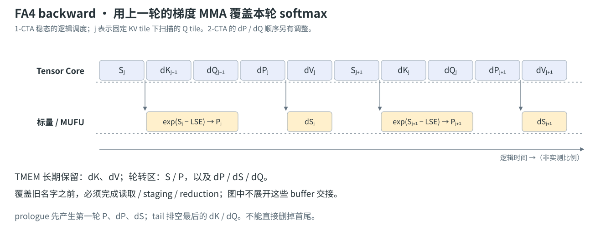

图中 $j$ 改为固定 KV 下扫描的 **Q tile** 下标。重算 $S_j$ 后，逐元素路径生成 $P_j$；Tensor Core 则利用这个窗口执行上一轮的 $dK_{j-1}$、$dQ_{j-1}$，再继续本轮 dP/dV。它们都不依赖尚未完成的 $P_j$，因此可以覆盖这段 softmax 时间。

限制来自 TMEM 容量与复用。一份 $128\times128$ FP32 accumulator 就是 64 KiB，四份已达到 256 KiB。FA4 代表性的 1-CTA backward 将 dK/dV 作为长期累加区域，另两块区域分别由 S/P 和 dP/dS/dQ 轮转复用。不能同时给五份这样的 accumulator 都分配独立大块；也不能因为旧变量“在数学上算完了”，就忽略下游仍未读取它的事实。

例如 dS 被下一轮梯度 MMA 使用之前需要完成对应 staging；dQ 的结果在被 reduction 路径取走之前，TMEM 区域不能随意覆盖。于是 buffer lifetime 反过来约束合法的 GEMM 顺序。图按 [FA4 Figure 2 与 §3.2.2](https://arxiv.org/html/2603.05451v1#S3.SS2.SSS2) 概括 1-CTA 稳态；首尾排空和全部同步细节没有展开。

#### 为什么 2-CTA 不只是“开两个 block 同时算”

论文对 $128^3$ 的 1-CTA backward 做的资源模型中，MMA 约需 2560 cycles，而计入 MMA operand、dS staging、dQ 写入与 reduction 读取的 SMEM 流量约需 3328 cycles。这里的瓶颈已从“能否 overlap softmax”进一步转向“如何少走 shared memory”。

Blackwell 的 **2-CTA MMA mode** 让同一 cluster 的 CTA pair 协作执行一个更大的矩阵乘。它有硬件定义的 operand/accumulator 切分与配对要求，区别于软件启动两个互不相干的 GEMM。

FA4 backward 利用它，让 B operand 的准备和读取由两个 CTA 分担，减少重复 SMEM 流量。但 dQ 会遇到一个特殊问题：两块 KV 在 dQ 的公式里沿 **reduction 维度**贡献结果，而 2-CTA 输出的划分并不是自动帮软件完成这个 split-K reduction。

因此实现通过 distributed shared memory（DSMEM）交换部分 dS，将它重新组织成“各 CTA 拥有部分输出行、但具有完整两块 KV 的 reduction 输入”。这样，两块 KV 的贡献先在更长 reduction 的 MMA 内合并，再写出相应 dQ 片段，减少全局 atomic reduction 的次数。

这增加了 DSMEM 交换和 cluster 协作成本。论文的 2-CTA 模型在相应工作分配下将 SMEM 服务时间降到约 2688 cycles，而 MMA 仍为约 2560 cycles；不能把 1-CTA 和 2-CTA 的 tile 大小不同忽略掉，再当作一条实测速度比。2-CTA 的主循环还重新排列了 dP 与上一轮 dQ，使 DSMEM latency 更容易被覆盖，并让当前 dS 与上一轮 dQ 重叠。细节见 [FA4 §3.2.3](https://arxiv.org/html/2603.05451v1#S3.SS2.SSS3)。

这里能提炼出一条一般原则：**跨 CTA 协作只有在减少的重复工作或归约成本足够大时才划算。** 更大的协作粒度也意味着配对驻留、更多同步以及小 shape 下的利用率问题。

### CTA 调度：把单个 SM 优化好，还不等于全 GPU 没有尾巴

前面的 overlap 都发生在一个 CTA 或 CTA pair 内。全 GPU 还有另一个问题：不同 CTA 的工作量不一样。

causal attention 的后部 Q tile 要扫描更多 KV，前部 Q tile 的工作更短。若短任务先跑，最后可能只剩少数长任务占着部分 SM。FA4 使用 longest-processing-time-first（LPT）的思想，让较长工作优先启动，以降低尾部闲置。

但纯粹按长度排序又会破坏 L2 复用。为不同 batch、不同 KV head 的 tile 来回切换，可能不断换入新的 K/V 工作集。因此论文把 Q tile 的逆序、head 的分组与 batch 顺序结合起来；GQA/MQA 下也要考虑多个 Q head 共享同一 KV head 的关系。这里优化的是**负载均衡与缓存局部性的联合目标**，不是单纯把序列下标倒过来。

对于 varlen，可以预处理长度元数据，建立逻辑 batch 顺序与真实 batch index 的映射。排序、元数据更新和调度器本身都有成本，小任务不一定值得付这笔开销。

另一个容易混淆的场景是 deterministic backward。为了固定全局梯度归约顺序，FA4 的确定性路径使用 semaphore 等机制约束更新次序；这会引入等待。论文还针对 causal backward 设计了避免初次写入就阻塞的顺序，不能把普通前向的 LPT 原封不动搬来。见 [FA4 §3.2.4 与 §3.3](https://arxiv.org/html/2603.05451v1#S3.SS3)。

这些调度思路并不要求 TMEM。FA4 论文也在 Hopper 上验证过相关调度优化；“FA4 提出的优化”不等于“只有 Blackwell 才能使用的硬件能力”。

## 回到 CuTe：Layout 之外还必须读懂时间上的所有权

站内 CuTe 教学代码重点追踪的是：同一逻辑坐标怎样经过 `TiledCopy`、`TiledMMA` 和 fragment 重解释，在正确线程的正确寄存器里相遇。

FA3/FA4 在此基础上又多了一层：**同一物理 buffer 在不同时刻，属于哪个逻辑 tile、哪一种矩阵以及哪一个消费者。**

| 要核对的问题 | FA2 的典型答案 | FA3/FA4 增加的约束 |
| --- | --- | --- |
| 当前 score 在哪里？ | MMA C fragment 寄存器 | FA3 在 consumer registers；FA4 在 TMEM，softmax 显式取出 |
| P 如何成为 PV 的 A？ | fragment 转换与布局重解释 | FP8 可能需要真实重排；FA4 经 TMEM 发布 |
| 什么时候可以改写 K/V buffer？ | copy 完成且旧 reader 已读完 | 异步 WGMMA/TMA 的完成与 pipeline release 必须匹配 |
| 什么时候可以改写输出？ | 当前依赖链上的同步累加 | 异步 PV 写回与 correction 必须避免冲突 |
| 多 stage 多出来的代价？ | 额外 SMEM，可能降低 CTA 驻留 | 再加 register/TMEM 的在途状态、barrier 和更长生命周期 |

FA4 采用 CuTe DSL，用 Python 表达布局与 kernel 生成，再编译到 GPU 指令。它改善的是表达、编译与迭代方式；运行时收益仍来自前文的状态组织、硬件指令和调度。不能把“用 Python 写 kernel”本身当成加速机制。

如果要继续读代码，建议按下面的顺序走；这些链接固定到同一个仓库快照，不宣称与各论文发布时实现完全一致：

1. [FA2 `flash_fwd_kernel.h`](https://github.com/Dao-AILab/flash-attention/blob/1bda8f9290cd48d030f1516f0e680cd464ef3554/csrc/flash_attn/src/flash_fwd_kernel.h)：先找 Q tile ownership、online softmax 和 copy wait。
2. [FA3 `mainloop_fwd_sm90_tma_gmma_ws.hpp`](https://github.com/Dao-AILab/flash-attention/blob/1bda8f9290cd48d030f1516f0e680cd464ef3554/hopper/mainloop_fwd_sm90_tma_gmma_ws.hpp)：区分 producer/consumer，以及 load pipeline 和 WGMMA 的等待。
3. [FA4 `flash_fwd_sm100.py`](https://github.com/Dao-AILab/flash-attention/blob/1bda8f9290cd48d030f1516f0e680cd464ef3554/flash_attn/cute/flash_fwd_sm100.py)：先读 warp role、TMEM 分配和 `pipeline_s_p_o`，再读 MMA/softmax/correction。
4. [FA4 `softmax.py`](https://github.com/Dao-AILab/flash-attention/blob/1bda8f9290cd48d030f1516f0e680cd464ef3554/flash_attn/cute/softmax.py)、[`flash_bwd_sm100.py`](https://github.com/Dao-AILab/flash-attention/blob/1bda8f9290cd48d030f1516f0e680cd464ef3554/flash_attn/cute/flash_bwd_sm100.py) 与 [`tile_scheduler.py`](https://github.com/Dao-AILab/flash-attention/blob/1bda8f9290cd48d030f1516f0e680cd464ef3554/flash_attn/cute/tile_scheduler.py)：分别追尺度不变量、buffer 复用和 CTA 顺序。

读一段异步源码时，可以把每个 buffer 标出 `allocate → fill → publish → consume → release → reuse`。这往往比只画函数调用图更容易发现错误等待、过早覆盖和没有真正实现的 overlap。

## 哪些情况下，这些优化不一定兑现

### 单 token decode 不是长序列 prefill 的缩小版

当 $N_q=1$，Q 方向不能再提供很多独立 tile；KV 读取的复用方式也不同。此时通常需要考虑 split-KV/Flash-Decoding、跨 split 的统计量合并以及 KV Cache 的存储方式，而不是只照搬大 Q tile 的前向流水。

GQA/MQA 可以减少逻辑 KV head 数，但是否真的减少 HBM bytes，要看多个 Q head 能否复用同一 KV 数据，以及访问是否命中 cache。Paged KV、变长序列、非连续页和 tail 又会增加地址与边界成本。大规模方形 attention 的峰值不能用来预测这些 workload。

### 更大的 tile、更深的流水、更低的精度都要付账

大 tile 提高数据复用，也增加 accumulator 和 softmax 暂存；多 stage 能隐藏更多 latency，也可能挤掉 resident CTA；FP8 加速 GEMM，也带来量化、scale、转置和格式转换。2-CTA 可以省 shared traffic，也要求两块 CTA 协作。

这些代价在短序列、小 batch、特殊 head dimension 或大量 padding 下更难摊薄。判断优化是否有用，应该看完整依赖链上少了多少时间，而不是某条路径的峰值提高多少。

### 如何验证“重叠真的发生了”

本文没有在 A100/H100/B200 上重跑性能实验。前文 cycles 是论文资源模型及据此进行的算术推导，源码分析证明实现机制，二者都不能代替硬件测量。

实际验证时至少固定：GPU/SKU 与时钟口径、CUDA/编译器和仓库 commit、dtype/累加精度、`B/Hq/Hkv/Nq/Nkv/d`、causal/varlen/dropout、前向或反向，以及是否计入量化、layout 转换、分配和 launch。对低精度还需要固定输入分布、outlier 与误差度量。

再按假设检查证据：

| 优化假设 | 应观察的变化 | 需要同时排除的反效果 |
| --- | --- | --- |
| FA1 消除中间矩阵 IO | 中间 buffer 不再分配，global bytes 降低 | 重计算或额外状态更新抵消收益 |
| FA2 提高并行与减少通信 | 更多有效 CTA，跨 warp SMEM 交换减少 | tile 缩小后重复读取、尾部开销增加 |
| FA3 实现 MMA–softmax overlap | 指令与 barrier 顺序允许独立执行，等待减少 | register spill、SMEM 驻留下降、编译器重排 |
| FA4 分担指数瓶颈 | MUFU 与 FMA 工作更平衡 | 指令数、寄存器带宽和误差增加 |
| FA4 2-CTA 减少 backward 流量 | operand/reduction 流量和 atomic 次数减少 | DSMEM 同步与 cluster 调度成本增加 |

Nsight Systems 能看 kernel 和 stream 的宏观重叠，但一个 kernel 内的 warpgroup/MUFU/Tensor Core 调度还需要结合 Nsight Compute、SASS、stall 和资源占用分析。看到两条 CUDA stream 的彩条重叠，不是证明 FA3 的两阶段流水生效；看到 Tensor Core busy，也不能单独证明 softmax 已被完全覆盖。

## 这四代真正留下了什么

从 FA1 到 FA4，attention 的数学定义基本没有变，改变的是执行它的成本结构：先避免 $N^2$ 中间矩阵进入 HBM，再减少输出归一化与 warp 通信，然后让不同功能单元并行，最后连指数参考点的更新时机和梯度归约粒度都参与资源配平。

其中最可迁移的经验有三条。第一，优化目标应是数据流和关键路径，而不是总 FLOPs。第二，overlap 必须有独立工作、状态存储和正确的交接协议，三个条件缺一不可。第三，硬件吞吐的比例一旦改变，旧优化就需要重算成本；FA4 在 B200 上用 FMA 分担指数、而后续硬件分支重新偏向 native exp，正是一个具体例子。

如果再回头看 CuTe 中的 Layout，就会发现空间映射与时间调度其实在回答同一个问题：**一个逻辑值由谁拥有、存在哪里，下一位消费者何时能安全使用它。** FlashAttention 的演进把这个问题从 register fragment 一直推到了 TMEM、CTA pair 和全 GPU 调度。

## Reference

### 四篇原始论文

- [FlashAttention: Fast and Memory-Efficient Exact Attention with IO-Awareness](https://arxiv.org/abs/2205.14135)，2022。
- [FlashAttention-2: Faster Attention with Better Parallelism and Work Partitioning](https://arxiv.org/abs/2307.08691)，2023。
- [FlashAttention-3: Fast and Accurate Attention with Asynchrony and Low-precision](https://arxiv.org/abs/2407.08608)，2024。
- [FlashAttention-4: Algorithm and Kernel Pipelining Co-Design for Asymmetric Hardware Scaling](https://arxiv.org/abs/2603.05451)，2026。本文使用 v1 的算法图与资源模型。

### 作者博客与实现教程

- [Hazy Research：Can Longer Sequences Help Take the Next Leap in AI?](https://hazyresearch.stanford.edu/blog/2022-06-09-longer-sequences-next-leap-ai)：FA1 的 IO 动机与应用背景。
- [Stanford CRFM：FlashAttention-2](https://crfm.stanford.edu/2023/07/17/flash2.html)：非矩阵工作、Q 方向并行与 warp 分工。
- [Tri Dao：FlashAttention-3](https://tridao.me/blog/2024/flash3/)：Hopper 特性和两层 overlap。
- [Tri Dao：FlashAttention-4](https://tridao.me/blog/2026/flash4/)：不对称硬件增长与 Blackwell 优化。
- [Colfax：Efficient GEMM Kernel Designs with Pipelining](https://research.colfax-intl.com/cutlass-tutorial-design-of-a-gemm-kernel/)：buffer stage、producer/consumer 与 pipeline 协议。

### 硬件、ISA 与代码

- NVIDIA：[Ampere Tuning Guide](https://docs.nvidia.com/cuda/archive/13.0.3/ampere-tuning-guide/index.html)、[Hopper Tuning Guide](https://docs.nvidia.com/cuda/hopper-tuning-guide/index.html)、[Blackwell Tuning Guide](https://docs.nvidia.com/cuda/blackwell-tuning-guide/index.html)。
- NVIDIA：[PTX ISA](https://docs.nvidia.com/cuda/parallel-thread-execution/)，重点阅读 `cp.async`、`wgmma.mma_async`、`tcgen05.mma`、TMEM 访问与完成语义。
- NVIDIA CUTLASS：[Blackwell Functionality](https://github.com/NVIDIA/cutlass/blob/main/media/docs/cpp/blackwell_functionality.md)。
- Dao-AILab：[本文分析的 flash-attention 固定快照](https://github.com/Dao-AILab/flash-attention/tree/1bda8f9290cd48d030f1516f0e680cd464ef3554)。

本文的十一张 SVG（六张硬件/指令路径图，五张工作划分与调度图） 为依据论文和源码重新绘制的机制图；可编辑生成源为仓库内 `scripts/draw_flashattention_evolution.py`。方块宽度只用于区分顺序与并发窗口，不表示测得的时长。
