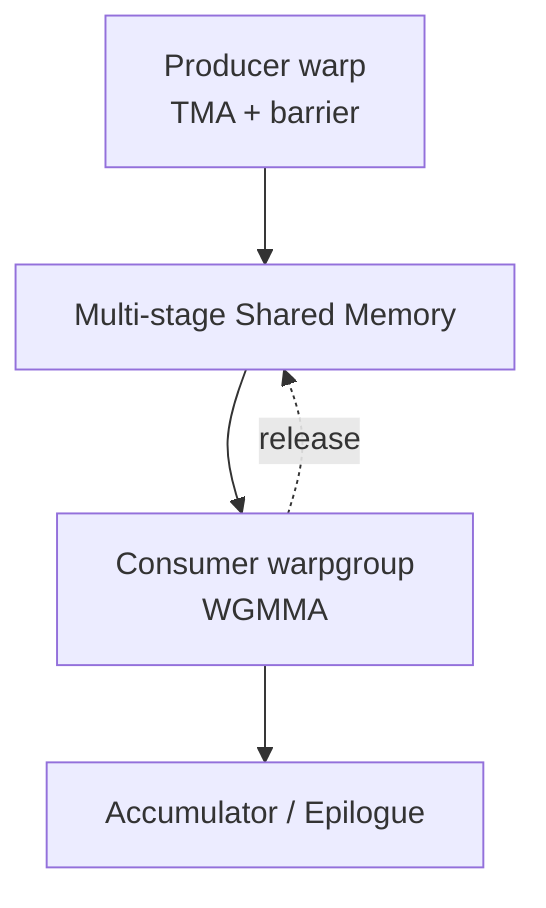

# 从 Volta/Turing、Ampere、Ada 到 Hopper：硬件、PTX 与 Kernel 编程范式演进

📚 看 GPU 白皮书很容易得到一串越来越大的数字：更多 Tensor Core FLOPS、更高 HBM 带宽、更大的 Cache。但 kernel 开发者真正关心的不是“峰值提高了几倍”，而是：

> **峰值为什么提高？PTX 暴露了哪条新数据路径？现有 kernel 要改变什么，才能把纸面性能兑现为算子性能？如果没有兑现，限制来自硬件、问题形状，还是实现？**

这三个问题不能只看一张规格表。本文把证据分成四层：

1. **白皮书与产品规格**：给出计算、带宽、容量和协作域的物理上限。
2. **PTX 与编程模型**：说明软件能显式调用哪些数据路径，以及 operand、同步和 target 的约束。
3. **论文与微基准**：测出 sustainable bandwidth、instruction throughput、latency 和 shape utilization。
4. **真实算子**：观察 GEMM、Attention、Decode、Reduction 能否把局部硬件能力变成端到端收益。

文章沿两条产品线展开：

- **数据中心主线**：Volta/Turing 提供 Tensor Core 与 `ldmatrix`，A100/Ampere 建立 `cp.async + mma.sync` 流水，H100/Hopper 再用 TMA、WGMMA 和 Cluster 重构它。
- **消费级/推理分支**：GA10x/Ampere 到 Ada 仍沿用 warp 级主循环，主要收益来自更多 SM、更高频率、FP8 和显著增大的 L2，而不是 Hopper 式的新流水。

> [!WARNING]
> “Ampere”至少要区分 GA100/A100（`sm_80`）与 GA10x/RTX 30（`sm_86`）；“Ada”也不能当成“小号 Hopper”。下文的产品数字都标明具体 SKU。跨产品比较只用于解释趋势，不把 PCIe、SXM、频率、显存规格不同的结果伪装成严格同条件实验。

> [!TIP]
> 如果对 tile、arithmetic intensity 或 online softmax 还不熟，可以先看站内的 [从 GEMM 实践 CUDA 优化](../cuda/从GEMM实践CUDA优化.md)、[GPU 内存系统演进](../cuda/GPU%20内存系统演进：最大化带宽利用与延迟隐藏的技术路径.md) 与 [FlashAttention v1/v2](../llm_inference/FlashAttention%20原理%20v1-v2.md)。本文在这些概念上继续追踪硬件和 PTX 的代际变化。

## 先把演进关系画对

现代 Tensor Core kernel 的数据通路不是一代完成的：

```text
Volta sm_70       WMMA / mma：Tensor Core 进入 CUDA kernel
      │
Turing sm_75      ldmatrix + 更直接的 warp-level mma 数据供给
      │
Ampere sm_80/86   cp.async + mbarrier + TF32/BF16 + mma.sp
      │            └─ 形成 thread-driven 的多 stage Tensor Core pipeline
      ├──────── Ada sm_89：保留上述 pipeline，增加 FP8、大 L2、更多算力
      │
      └──────── Hopper sm_90/90a：TMA + WGMMA + Cluster/DSM
                                  └─ 转为 accelerator-driven pipeline
```

这里有一个常见误读：`ldmatrix` **不是 Ampere 才出现**。PTX ISA 6.5 已加入 `ldmatrix`，最低目标是 `sm_75`；Ampere 真正新增的是 PTX 7.0 的 `cp.async`、split arrive/wait barrier、TF32/BF16 等能力，PTX 7.1 又加入 structured sparse `mma.sp`。[^ptx-ldmatrix][^ptx-release-notes][^ptx-mma-sp]

这条时间线也解释了“硬件变化”和“编程范式变化”为什么不能画等号：新 dtype 或更多执行单元会提高峰值，却未必要求重写主循环；TMA/WGMMA 的峰值之外还改变了 operand 所在层级、协作粒度与同步协议，因此需要新的 kernel architecture。

## Ampere：把现代 Tensor Core 流水搭完整

### 相比 Volta/Turing，硬件改变了什么

以数据中心主线为例，V100 SXM2 到 A100 40 GB SXM 的变化不只是 Tensor Core 翻倍：

| 维度 | V100 SXM2 | A100 40 GB SXM | 对 kernel 的含义 |
| --- | ---: | ---: | --- |
| Dense 16-bit Tensor | 约 125 TFLOP/s FP16 | 312 TFLOP/s FP16/BF16 | 计算增长约 2.5 倍，feeding 与非矩阵指令更容易暴露 |
| HBM 带宽 | 900 GB/s | 1,555 GB/s | 增长约 1.73 倍，慢于 Tensor Core |
| L2 | 6 MB | 40 MB | 跨 CTA/跨 kernel 的可缓存工作集显著扩大 |
| 最大 Shared Memory/SM | 96 KB | 164 KB | 可以容纳更深的 tiled pipeline |
| Register file/SM | 256 KB | 256 KB | accumulator 与 staging 仍受相同总预算约束 |
| 新数值路径 | FP16 Tensor Core | TF32、BF16、FP64 Tensor Core、2:4 sparsity | 精度迁移与稀疏性成为新的峰值入口 |

数据来自 A100 白皮书与架构说明。[^ampere-whitepaper][^ampere-architecture] 这组数字已经暴露了第一条性能规律：

$$
I_{ridge} = \frac{P_{peak}}{BW_{HBM}}
$$

若用 dense Tensor Core 峰值粗略估算，V100 FP16 的 ridge point 约为 $125/0.9=139$ FLOP/B，A100 BF16/FP16 则约为 $312/1.555=201$ FLOP/B。也就是说，A100 的 Tensor Core 虽然更快，但算子必须提供更高的数据复用，才能保持 compute-bound。

### PTX 改变了什么

Ampere 最关键的新接口不是又一种 `mma` shape，而是把 Global Memory → Shared Memory 搬运从同步的 `ld.global; st.shared` 改成：

```ptx
cp.async.cg.shared.global [smem_addr], [gmem_addr], 16;
cp.async.commit_group;

// 计算当前 tile

cp.async.wait_group 1;
```

`cp.async` 可直接搬运 4/8/16 B，避免显式的寄存器中转；split barrier 则允许 producer 到达后继续执行，由 consumer 等待条件满足。[^ptx-cp-async][^ampere-tuning] 配合从 Turing 继承的 `ldmatrix` 与 warp-level `mma.sync`，Ampere 建立了今天最典型的 Tensor Core 主循环：

$$
\text{GMEM}
\xrightarrow{\texttt{cp.async}}
\text{SMEM}
\xrightarrow{\texttt{ldmatrix}}
\text{Registers}
\xrightarrow{\texttt{mma.sync}}
\text{Tensor Core}
$$

`mma.sp` 则把 2:4 structured sparsity 显式写进 instruction operand：硬件峰值可以翻倍，但前提是权重满足结构约束、metadata 正确生成，并且问题足够大以摊薄压缩、布局和 epilogue 成本。

### 编程范式改变了什么

Volta/Turing 常见做法是让多个 warp 用同步 load、software pipelining 和双缓冲隐藏访存；Ampere 的典型写法变成 **thread-driven multistage pipeline**：

1. 每个线程计算自己负责的 Global/Shared address，并发出若干 `cp.async`。
2. warp 提交 copy group，在当前 stage 上执行 `ldmatrix + mma.sync`。
3. `wait_group` 只等待即将消费的 stage，而不是让整个 CTA 每轮完全停住。
4. L2 persistence/access-policy window 可用于少量热点数据，但不能替代合并访问和 tile 复用。

微基准研究发现，在小 tile 的矩阵流水中，A100 的异步 Shared Memory pipeline 相比同步版本平均可快约 19.6%，但 tile 增大到足以摊薄 load 时，收益会缩小甚至消失。[^hopper-benchmark] 这正好说明：`cp.async` 不是“固定加速按钮”，它减少的是寄存器中转、搬运指令与暴露 latency；如果 kernel 原本已被计算覆盖，额外 stage 和 barrier 反而可能增加资源成本。

## Ada：更强的 Ampere pipeline，不是小号 Hopper

Ada 的 CUDA compute capability 是 `sm_89`。它保留 `cp.async → SMEM → ldmatrix → mma.sync` 的 warp-centric 数据通路，没有 TMA、WGMMA、Thread Block Cluster、DSM 和 `setmaxnreg`。因此 Ada 的主要问题不是“怎样照搬 Hopper kernel”，而是怎样利用更多算力、FP8 与巨大 L2，同时控制更高的 compute-to-bandwidth 比。

### 相比 GA10x/Ampere，硬件改变了什么

RTX 3090 Ti 与 RTX 4090 是最直观的一组同类产品对比：

| 维度 | RTX 3090 Ti | RTX 4090 | 变化 |
| --- | ---: | ---: | ---: |
| SM 数 | 84 | 128 | 1.52× |
| Boost clock | 1.86 GHz | 2.52 GHz | 1.35× |
| FP32 | 40 TFLOP/s | 82.6 TFLOP/s | 2.07× |
| Dense FP16 Tensor，FP32 accumulate | 80 TFLOP/s | 165.2 TFLOP/s | 2.07× |
| Dense FP8 Tensor，FP32 accumulate | 不支持 | 330.3 TFLOP/s | 新增 |
| 显存带宽 | 1,008 GB/s | 1,008 GB/s | 不变 |
| L2 | 6 MB | 72 MB | 12× |

这组产品数据来自 Ada 白皮书；完整 AD102 可配置 96 MB L2，RTX 4090 实际启用 72 MB。[^ada-whitepaper][^ada-tuning] 它解释了 Ada 的性能性格：

- 大 GEMM 可以随 SM 数和频率接近翻倍。
- 纯 streaming kernel 的显存带宽没有同步提升，不能期待同样倍率。
- 工作集落入 72 MB L2、或跨 kernel 能重复命中的 workload，可能得到规格表里“HBM 不变”无法解释的收益。
- 4090 的 FP16-FP32 accumulate ridge 已从 3090 Ti 的约 $80/1.008=79$ FLOP/B 上升到 $164$ FLOP/B；若用 FP8-FP32 accumulate，则进一步到约 $328$ FLOP/B。

### PTX 与软件栈改变了什么

PTX 7.8 加入 `sm_89` target 与 E4M3/E5M2 FP8 类型。当前 CUTLASS/CuTe 已为 Ada 暴露 FP8 warp-level `mma.sync`，常用 shape 包括 `m16n8k16`/`m16n8k32`，仍由 32-thread warp 协作。[^ptx-release-notes][^cutlass-ada-mma]

这也是阅读旧论文时必须保留的版本上下文：2024 年的跨代微基准使用 CUDA 12.1 测 RTX 4090，当时作者没有可用的 Ada FP8 MMA 软件路径；这不能被解释为“AD102 硬件没有 FP8 Tensor Core”。今天若仍看不到 FP8 instruction，应先检查 CUDA、CUTLASS、dtype、accumulate type 和实际 SASS，而不是直接归因于硬件。

### 编程范式改变了什么

Ada 最有效的 kernel 策略仍是 Ampere 风格的多 stage pipeline，但调参重点发生了变化：

- **重新做 tile/stage 搜索**：更多 stage 能隐藏 latency，却会吃掉 Shared Memory；Ada 每个 SM 为 100 KB、每 block 最大 99 KB，资源形状更接近 GA10x 而不是 A100 的 164 KB。[^ada-tuning]
- **把 L2 当容量层而不是魔法带宽**：通过 batching、operator fusion、权重/查找表驻留和稳定访问顺序增加 reuse；一次性 streaming 访问不会因 L2 更大自动变快。
- **FP8 要与 scale、accumulate 和 fusion 一起设计**：只把 GEMM 输入转换成 FP8，却在每层之间反复量化/反量化，端到端收益会被 conversion 与 memory traffic 吞掉。
- **继续核算 register/occupancy**：Ada 仍是每 SM 64K 32-bit registers；更大的 tile 与更深 staging 可能降低 active blocks，不能只追求单 CTA 的指令效率。

所以，Ada 是“**把 Ampere 范式推向更高 compute density**”；Hopper 才是“**改变谁搬数据、谁发起矩阵运算、CTA 在哪里协作**”。

## Hopper 的起点：Ampere 主循环还剩什么问题

A100 的 `cp.async` 已经绕过显式 register staging，并能在计算 tile $k$ 时预取 $k+1$。但它只改变了 copy 的数据路径，没有卸载整个流水的控制工作：每个线程仍要计算 Global/Shared address、执行 predicate、发出 4/8/16 B copy 并推进 pointer。Tensor Core 越快，这些 integer instruction、register state 和 issue slot 的占比越明显。

Hopper 并不是简单地把这条流水线做得更快，而是把原本由 CUDA threads 承担的多维地址生成、数据搬运和细粒度 Tensor Core orchestration 进一步下沉给专用硬件：

$$
\boxed{
\text{warp-centric pipeline}
\rightarrow
\text{accelerator-driven asynchronous pipeline}
}
$$

Ampere 风格主循环还留下三个边界：

- **搬运仍由 warp 组织**：`cp.async` 绕过了寄存器中转，但没有卸载 per-thread address generation。
- **MMA 以 32-thread warp 为协作粒度**：Shared Memory 中的 A/B fragment 通常还要通过 `ldmatrix` 进入寄存器。
- **CTA 是最大的硬件协作域**：不同 CTA 之间不能依赖彼此同时 resident，也不能直接访问对方的 Shared Memory。

Hopper 的 TMA、WGMMA 和 Thread Block Cluster 分别对应这三个问题。

## Hopper：从 warp 驱动转向 accelerator 驱动

| 维度 | Ampere | Hopper | 对 kernel 的影响 |
| --- | --- | --- | --- |
| Global → Shared copy | `cp.async`，per-thread addressing | TMA，tensor descriptor 驱动 | 降低地址计算、指令数与寄存器压力 |
| Tensor Core 指令 | `mma.sync` | `wgmma.mma_async` | 从 warp 扩展到 128-thread warpgroup，并支持异步 group |
| Shared → MMA operand | `ldmatrix` → A/B register fragments | A 可为 register/SMEM，B 必须为 SMEM descriptor | 减少部分 operand 的显式搬运 |
| 异步完成通知 | `cp.async.wait_group`、基础 `mbarrier` | transaction-aware `mbarrier` | barrier 可以追踪异步事务完成量 |
| Warp 分工 | 多数 warp 执行相似 mainloop | producer / consumer specialization | 让搬运、Tensor Core 与普通 CUDA Core 重叠 |
| 最大协作域 | CTA | Thread Block Cluster | 多 CTA 同驻一个 GPC，可同步并访问 DSM |
| 跨 CTA 数据复用 | 通常重复从上层存储加载 | DSM / TMA multicast | 暴露片上跨 SM 的复用路径 |

### 相比 A100/Ampere，硬件改变了什么

| 维度 | A100 40 GB SXM | H100 80 GB SXM | 直接影响 |
| --- | ---: | ---: | --- |
| Dense BF16/FP16 Tensor | 312 TFLOP/s | 989 TFLOP/s | 矩阵峰值约 3.17×，feeding/标量尾部更突出 |
| Dense FP8 Tensor | 不支持 | 1,979 TFLOP/s | 低精度矩阵峰值再翻倍，但引入 scale 与格式管理 |
| HBM 带宽 | 1.555 TB/s | 3.35 TB/s | 约 2.15×，增长慢于 BF16 Tensor Core |
| L2 | 40 MB | 50 MB | 容量小幅增加，不足以解释主要代际倍率 |
| 最大 Shared Memory/SM | 164 KB | 228 KB | 可容纳更深 TMA/WGMMA stage 或更大 tile |
| Register file/SM | 256 KB | 256 KB | accumulator 变大，寄存器总预算却没有增加 |
| CTA 协作域 | 单 CTA | Thread Block Cluster + DSM | 同一 GPC 内多 CTA 可同步、远端访问 SMEM |

数据来自 A100/H100 产品资料和 Hopper Tuning Guide。[^ampere-whitepaper][^h100-spec][^hopper-tuning] 这组资源关系解释了 `setmaxnreg` 为什么重要：Hopper 给了 kernel 更多 Shared Memory 和更宽的矩阵 instruction，却没有同比增加 register file，只能更精细地在 producer 与 consumer 之间分配每 CTA 的寄存器预算。

### PTX 改变了什么

Hopper 对软件真正可见的新边界集中在 PTX 8.0：

- `cp.async.bulk.tensor` 用 tensor-map descriptor 发起 1D–5D TMA transaction；
- transaction-aware `mbarrier` 用 expected bytes 管理异步写入何时可消费；
- `wgmma.mma_async` 让 128-thread warpgroup 发起异步矩阵运算；
- `setmaxnreg.inc/dec` 在同一 CTA 的 warpgroup 之间动态重分配寄存器配额；
- cluster address space、barrier 与 multicast 让数据路径越过单 CTA。

其中 TMA/Cluster 的基础能力面向 `sm_90`，WGMMA 与 `setmaxnreg` 是 `sm_90a` architecture-specific feature。[^ptx-tma][^ptx-wgmma][^ptx-setmaxnreg] target 选错时，问题不是“少一点性能”，而是根本没有那条指令路径或失去预期兼容性。

### 编程范式改变了什么

Ampere 是每个 warp 一边搬自己的 fragment、一边执行自己的 MMA；Hopper-native kernel 则更像一个由 CUDA threads 编排的片上数据流系统：producer warp 提交 TMA，consumer warpgroup 提交 WGMMA，barrier 传递 Shared Memory stage 的所有权，Cluster 管理跨 CTA 生命周期。

**所以 Hopper 的核心并不是“塞进更多 warp”，而是让已有 warp 更少参与搬运，并让专用硬件并行工作。**

## 先建立成本尺度：Register、SMEM、L1、L2 与 HBM 到底差多少

讨论“为什么要异步”之前，先要知道被隐藏的 latency 大概有多长。下面的数据来自对 A100 PCIe 与 H800 PCIe 的 dependent pointer-chase 微基准；它测量的是后一条 load 依赖前一条 load 的 **load-to-use latency**，不是架构承诺，也不是连续合并访问时的吞吐。[^hopper-microbench]

| 层级 | A100 dependent read | H800 dependent read | “写完成” cycle | 应该怎样理解 |
| --- | ---: | ---: | --- | --- |
| Register | N/A | N/A | N/A | register 是 instruction operand；读写随生产/消费 instruction pipeline 发生 |
| Shared Memory | 约 29 cycles | 约 29 cycles | 无统一值 | 单线程、4 B stride、无 bank conflict 的 dependent load；写入要指定同线程/跨线程观察者与 barrier |
| L1 Cache | 约 33 cycles | 约 32 cycles | 无统一值 | 命中延迟基本同一量级；global store 的可见性不能由 L1 hit latency 推导 |
| L2 Cache | 约 202.8–408 cycles | 约 264.5–502 cycles | 无统一值 | partitioned L2 存在 near/far path，不能用一个数字概括 |
| HBM / Global Memory | 约 566 cycles | 约 656 cycles | 无统一值 | cache miss 后的 dependent access；store issue、到达 L2/HBM 与对其他 agent 可见是不同事件 |

这张表还有三个容易被忽略的边界：

1. **latency 不等于 throughput。** H100 SXM 的 HBM3 峰值带宽约为 3 TB/s，而 A100 40 GB 为 1.555 TB/s；Hopper 可以用更多并发请求获得更高吞吐，但单条依赖链依然要等待数百 cycles。[^hopper-tuning]
2. **Register 不能写成“读 1 cycle、写 1 cycle”。** PTX register 没有可单独计时的 `load register`；source read 与 destination write 是 instruction pipeline 的一部分。真正影响 kernel 的是 RAW dependency、register-file port/bank pressure、spill，以及生产指令何时让结果可用。
3. **普通 store 没有与 pointer-chase read 对称的“写延迟”。** `st` 发射或退休，并不代表数据已经对另一个 thread、CTA 或 async proxy 可见。若要测“写完成”，必须先定义观察者，再通过 load、atomic 或 fence 建立可观察条件；得到的数字会包含一致性与同步开销。

因此，下文提到“隐藏 SMEM/HBM latency”时，真正目标不是把某个固定数字消掉，而是通过多 stage、多个 async group 和独立 engine，让 latency 不再落在 kernel 的 critical path 上。

## TMA：从复制地址变成复制 Tensor Tile

### Descriptor-driven addressing

TMA（Tensor Memory Accelerator）的关键不是“单次复制更大”，而是把数据搬运的抽象从地址提升到 tensor tile。

Ampere 的心智模型是：

```text
thread 0: calculate addr0 → copy 16 B
thread 1: calculate addr1 → copy 16 B
...
thread 31: calculate addr31 → copy 16 B
```

Hopper 的心智模型则是：

```text
Tensor Map + tile coordinate → TMA → Shared Memory tile
```

Tensor Map descriptor 描述 Global Memory 的 base address、shape、stride，以及 Shared Memory tile 的 box shape、interleave、swizzle 和越界策略。kernel 只需要给出 tile coordinate，TMA 负责后续地址生成和数据移动。

PTX 中对应的 instruction family 是 `cp.async.bulk.tensor`。它支持 1D–5D tensor copy，并支持 Global Memory → CTA/Cluster Shared Memory 以及 Shared Memory → Global Memory 等方向。[^ptx-tma]

```ptx
cp.async.bulk.tensor.2d.shared::cta.global
    .tile
    .mbarrier::complete_tx::bytes
    [smem_addr],
    [tensor_map, {coord0, coord1}],
    [mbar];
```

与 `cp.async ... 16` 相比，两者不在同一个抽象层次：

- `cp.async`：复制这个线程算出的 16-byte address。
- TMA：按照 descriptor 复制这个 tensor tile。

把两组 PTX 放在一起看，差异会更明确：

```ptx
// Ampere：每个执行线程给出一个 dst/src address
cp.async.cg.shared.global [dst], [src], 16;
cp.async.commit_group;
cp.async.wait_group 1;

// Hopper：一个 elected thread 给出 tensor map 与 tile coordinate
cp.async.bulk.tensor.2d.shared::cta.global
    .tile.mbarrier::complete_tx::bytes
    [dst_smem], [tensor_map, {coord0, coord1}], [full_barrier];
```

> [!TIP]
> **PTX 证据 1：谁负责地址生成。** 经典 `cp.async` 的语法直接携带 `src` 与 `dst`，copy group 也由执行它的 thread 提交和等待；`cp.async.bulk.tensor` 携带的是 tensor-map handle 与坐标，1D–5D 的地址展开由 TMA 完成。[^ptx-cp-async][^ptx-tma]

| 问题 | `cp.async` | TMA `cp.async.bulk.tensor` |
| --- | --- | --- |
| 发起粒度 | 每个 thread 发起 4/8/16 B copy | 一个 thread 可发起整个 tensor tile |
| 地址工作 | 每线程计算 gmem/smem address 与 predicate | host/device 构造 descriptor，kernel 推进 tile coordinate |
| shape | 本质上是线性 byte copy | 1D–5D tensor box |
| layout 变换 | 通常由 thread address mapping 实现 | descriptor 可携带 interleave/swizzle 等信息 |
| 越界处理 | 软件 predicate 与 zero-fill 语义 | tensor coordinate 与 OOB fill 由硬件处理 |
| 完成通知 | per-thread async-group + `wait_group` | transaction `mbarrier`，或 bulk async-group，取决于传输方向 |
| 跨 CTA 复制 | 不支持 | 支持 cluster Shared Memory 与 multicast |

这会减少 producer 中的 gmem/smem pointer、predicate、tile offset 与 integer ALU 指令，也不需要用寄存器暂存搬运数据。NVIDIA 对 Hopper 的描述同样强调，TMA 允许少量线程发起大规模异步传输，并由硬件完成地址生成。[^hopper-architecture]

> [!IMPORTANT]
> TMA 不是所有 load 的无条件替代品。小尺寸、离散或不满足布局约束的访问仍可能更适合普通 load 或 `cp.async`。真正要比较的是 descriptor 构建、TMA 启动与同步成本，能否被足够大的 tile 和后续计算摊薄。

这里的“摊薄”非常具体：H800 微基准把 TMA 发起、`mbarrier` 初始化与等待全部计入后，单次访问比普通 global access 多出约 170 cycles；但当单条 TMA 搬运足够大的 2D/3D tile，并且有足够 CTA 并发时，吞吐可以接近 HBM 上限。[^hopper-microbench] 因而 TMA 优化的是 **每字节的软件成本与可重叠性**，不是让单次小 load 获得更低 latency。

### TMA swizzle

Ampere kernel 常用 CuTe `Swizzle` 或手写 XOR 变换，把 logical coordinate 映射为 bank-conflict-friendly 的 Shared Memory 地址。TMA 的 tensor descriptor 可以直接描述 Shared Memory swizzle，于是部分地址变换可以从 per-thread calculation 下沉到 descriptor：

```text
GMEM linear layout
        │
        │ TMA + swizzle metadata
        ▼
SMEM swizzled layout
```

这不意味着 CuTe Layout 不再重要。软件仍要构造与 TMA 约束兼容的 Shared Memory layout，只是硬件可以承担实际搬运过程中的 swizzle。

### TMA multicast

TMA 还可以把一个 tensor tile multicast 到 cluster 内多个 CTA 的 Shared Memory：

```text
                      ┌─→ CTA 0 SMEM
GMEM → TMA multicast ─┼─→ CTA 1 SMEM
                      ├─→ CTA 2 SMEM
                      └─→ CTA 3 SMEM
```

```ptx
cp.async.bulk.tensor.2d.shared::cluster.global
    .mbarrier::complete_tx::bytes
    .multicast::cluster
    [smem_addr],
    [tensor_map, {coord0, coord1}],
    [mbar],
    cta_mask;
```

在 GEMM 中，如果 cluster 内多个 CTA 计算不同的 N tile，却复用相同的 A tile，multicast 可以减少各 CTA 独立加载相同数据造成的上游流量。此时 CUTLASS 的 `ClusterShape` 不只是调度参数，也决定了潜在的数据复用方式。

## Transaction Barrier：等待线程还不够

Ampere 已经支持 Shared Memory `mbarrier`，因此不能简单地说 Hopper 才引入了 barrier。真正的变化是：**Hopper 的 barrier 能够参与异步事务的完成追踪。**

传统 barrier 主要回答：

```text
有多少 thread arrive？
```

TMA 出现后，还需要回答：

```text
已经发起的异步传输完成了吗？
对应的数据现在可以消费了吗？
```

`mbarrier.expect_tx` 会增加 barrier 的 expected transaction count；与 TMA 的 `.mbarrier::complete_tx::bytes` completion mechanism 配合时，可以把 tile 的传输完成纳入 phase 管理。[^ptx-mbarrier]

```ptx
// 示意：barrier 需要等待 16384 B 的异步事务完成
mbarrier.expect_tx.shared.b64 [bar], 16384;

// 发起由该 barrier 追踪的 TMA copy
cp.async.bulk.tensor.2d.shared::cta.global
    .tile
    .mbarrier::complete_tx::bytes
    [smem_addr], [tensor_map, {x, y}], [bar];
```

于是 producer 与 consumer 的同步从“线程都走到这里”变成了“当前 pipeline stage 对应的异步数据已经可见”。多 stage pipeline 一般为每个 stage 维护 barrier phase，并在复用 buffer 前确认上一轮 consumer 已经释放该 stage。

### 一个 stage 实际维护两种所有权

更精确地说，每个 ring-buffer stage 都要回答两个问题：

- `empty`：consumer 是否已经用完，producer 能否覆盖这个 SMEM buffer？
- `full`：TMA 是否已经把预期字节数写完，consumer 能否读取？

可以把一个 stage 看成下面的状态机：

```text
consumer release
      │
      ▼
   EMPTY ── producer acquire / expect_tx ──→ LOADING
                                                 │
                                         TMA complete_tx(bytes)
                                                 │
                                                 ▼
   EMPTY ←── consumer WGMMA / release ──────── FULL
```

`mbarrier` 的 phase 中既有 thread arrival 计数，也可以有 transaction byte 计数。producer 在当前 phase 声明 `expect_tx(bytes)`，TMA 完成相应传输后执行 `complete_tx(bytes)`；两类 pending work 都满足，consumer 的 wait 才能通过。下面只表达状态关系，不是可直接编译的完整 PTX：

```ptx
// producer: 等 empty(stage, phase)，再把该 stage 交给 TMA
mbarrier.try_wait.parity.shared::cta.b64 p, [empty_bar], phase;
mbarrier.arrive.expect_tx.shared::cta.b64 state, [full_bar], bytes;
cp.async.bulk.tensor.2d.shared::cta.global
    .tile.mbarrier::complete_tx::bytes
    [stage_smem], [tensor_map, {m, k}], [full_bar];

// consumer: full phase 完成后才能让 WGMMA 读取该 stage
mbarrier.try_wait.parity.shared::cta.b64 p, [full_bar], phase;
// issue wgmma ...
// wait for the last use of stage_smem, then release empty_bar
mbarrier.arrive.shared::cta.b64 state, [empty_bar];
```

这也是普通 `__syncthreads()` 不够的原因：它只能证明 CTA threads 到齐，不能代表 TMA engine 已经完成某个 tile 的字节事务，更不能表达 buffer 在连续 phase 之间的所有权转移。

### 为什么还需要 `fence.proxy.async`

Hopper 把普通 CUDA memory operation 与异步硬件操作建模为不同的 memory proxy。程序顺序正确，并不必然代表另一个 proxy 已经按要求观察到 Shared Memory 写入。

例如，Shared Memory matrix 由普通 store 写入、随后被 WGMMA 通过 descriptor 读取时，需要使用正确的 async proxy fence 建立可见性顺序。PTX 对 `wgmma.fence` 的说明也明确区分了 register ordering 与 Shared Memory 的 async proxy ordering。[^ptx-wgmma]

这里需要拆开三件经常被混写成“同步”的事情：

| 机制 | 它回答的问题 | 它不保证什么 |
| --- | --- | --- |
| `mbarrier` | TMA transaction 与参与线程是否完成当前 phase | 不自动替代所有跨 proxy ordering |
| `fence.proxy.async` | generic proxy 的写，何时可被 async proxy 观察 | 不等待 WGMMA accumulator 结果完成 |
| `wgmma.fence/commit_group/wait_group` | register operand ordering、WGMMA group 边界与结果可用性 | 不替代 CTA/cluster 生命周期同步 |

实际开发时更推荐使用 CUTLASS/CuTe 或 CUDA pipeline/barrier API 表达这些约束；手写 PTX 时则必须把 **线程同步、异步事务完成、memory visibility** 当成三个不同问题处理。

## WGMMA：从 Warp MMA 到 Warpgroup MMA

### 128 threads 共同执行一次 MMA

Ampere 的典型 Tensor Core PTX 是：

```ptx
mma.sync.aligned.m16n8k16 ...
```

其协作粒度是一个 warp。Hopper 的 `wgmma.mma_async` 则由一个 warpgroup，也就是 4 个连续 warp、共 128 threads 协作执行。常见 shape 以 $M=64$ 为基础，例如：

```text
m64n8k16
m64n64k16
m64n128k16
```

更大的 collective MMA 减少了软件组织大量小 fragment 的次数，但也意味着所有 warp 必须一致执行同一条 WGMMA 指令；条件分支导致 warpgroup 内执行不一致时，行为是未定义的。[^ptx-wgmma]

### 为什么协作粒度必须从 warp 扩大到 warpgroup

“128 threads 比 32 threads 一次算得更多”只是结果，不是原因。更深的因果链是：

1. **Tensor Core tile 变大。** `wgmma` 固定 $M=64$，而 Ampere 常见 `mma.sync.m16n8k16` 的 $M=16$。四个 warp 正好覆盖一个 $64$-row collective，硬件可以在一条 collective instruction 中组织更大的 output tile。
2. **operand feeding 模型改变。** Ampere 的 warp 先用 `ldmatrix` 把小 fragment 搬到各 lane registers，再发同步 `mma`；WGMMA 允许 Tensor Core async proxy 按 descriptor 读取 Shared Memory。既然工作已经不是“一个 warp 的 register fragment”，继续把 ISA 边界限制在一个 warp 反而会让软件重复拆分 descriptor、instruction 与 accumulator bookkeeping。
3. **更大的 N 维需要分摊 accumulator。** 对 `m64n64`、`m64n128` 这类 shape，D 有 $64N$ 个元素。把它分散到 128 threads，单线程分别持有 $N/2$ 个 FP32 accumulator，仍然很重；如果强行限制在 32 threads，register pressure 会再放大 4 倍。
4. **异步 engine 需要足够粗的工作包。** descriptor fetch、SMEM operand read、Tensor Core compute 与 accumulator writeback 都有固定控制成本。warpgroup collective 能让一次 issue 描述更多工作，并通过 async group 摊薄前端开销。

> [!NOTE]
> **推论而非 NVIDIA 的直接表述：** warpgroup 的意义不是把四个独立 warp “绑死”这么简单，而是为 **更大 tile、Shared Memory 直接供数、分布式 accumulator 与异步提交** 提供共同的 ISA 原子性。PTX 给出了上述 shape、operand 与 collective execution 约束；至于它们是 WGMMA 设计取舍的因果关系，是从这些约束推导出的微架构解释。

### WGMMA 是异步的

WGMMA 不只扩大了协作粒度，还把 Tensor Core 计算纳入异步 group：

```ptx
wgmma.fence.sync.aligned;

wgmma.mma_async.sync.aligned.m64n8k16.f32.f16.f16 ...;
wgmma.mma_async.sync.aligned.m64n8k16.f32.f16.f16 ...;

wgmma.commit_group.sync.aligned;

// 执行与当前 accumulator 无依赖的工作

wgmma.wait_group.sync.aligned 0;
```

这里指令名中的 `.sync` 是 warp/warpgroup participation 语义，并不把 `mma_async` 变回同步计算。软件通过 `wgmma.commit_group` 和 `wgmma.wait_group` 管理异步 MMA group。

为什么一定要暴露为异步，而不是做一条更大的 `mma.sync`？可以从依赖链反推：

```text
SMEM descriptor decode
        ↓
SMEM A/B operand fetch
        ↓
Tensor Core execution
        ↓
D accumulator writeback
```

在 Ampere 上，`ldmatrix` 已经把 SMEM → register 的等待显式放在 `mma.sync` 之前；在 WGMMA 的 SS/RS 模式中，至少 B 仍在 Shared Memory，operand fetch 被收进 WGMMA 的 async proxy。如果每条 WGMMA 都必须同步完成后 warpgroup 才能继续，SMEM fetch、矩阵计算和写回 latency 会直接串到 instruction stream 上，也无法连续提交多个独立 K-slice。

异步语义把“发起”与“结果可用”拆开：

- `wgmma.mma_async` 把工作放进未提交 group；
- `wgmma.commit_group` 封闭当前 group；
- 后续 WGMMA 或其他无依赖指令可以继续发射；
- `wgmma.wait_group N` 只在确实要读取 accumulator、复用 operand buffer 或限制 in-flight group 数时等待。

> [!TIP]
> **PTX 证据 2：异步不是因为 Hopper SMEM 变慢。** 实测 A100 与 H800 的无冲突 SMEM dependent latency 都约为 29 cycles。真正变化是 WGMMA 让 async proxy 直接消费 Shared Memory operand，并把更大的 collective 工作放入独立 group；异步化的目标是隐藏整段 operand-fetch + Tensor Core pipeline，而不是补救一项退化的 SMEM 指标。[^hopper-microbench]

还要注意，`wgmma.wait_group` 只保证对应 WGMMA group 的寄存器结果完成。若某个 SMEM stage 是 WGMMA operand，在确认该 group 不再使用它之前就让 producer 覆盖 buffer，会形成 read-after-write 生命周期错误；因此 WGMMA group depth 与 TMA stage depth 不能各自独立决定。

### PTX 操作数揭示了什么：没有独立的 C，B 也不是寄存器

PTX 给 WGMMA 两种主要 operand form：

```ptx
// SS: A、B 都由 64-bit Shared Memory descriptor 描述
wgmma.mma_async.sync.aligned.m64n64k16.f32.f16.f16
    {d0, ..., d31}, a_desc, b_desc, scale_d, imm_scale_a, imm_scale_b;

// RS: A 是每线程 register fragment，B 仍是 Shared Memory descriptor
wgmma.mma_async.sync.aligned.m64n64k16.f32.f16.f16
    {d0, ..., d31}, {a0, a1, a2, a3}, b_desc,
    scale_d, imm_scale_a, imm_scale_b;
```

> [!IMPORTANT]
> **PTX 证据 3：准确的存储位置约束是 `A = Register/SMEM`、`B = SMEM only`、`D = Register only`。** `a_desc` 与 `b_desc` 是装在 64-bit register 中的 descriptor 值，但它们指向的是 Shared Memory matrix；不能因此把 B 说成 register fragment。`d` 是每线程的 register vector，同时充当输入 accumulator 与输出 destination。[^ptx-wgmma]

与 `mma.sync` 的 `d, a, b, c` 四组 operand 不同，`wgmma.mma_async` 的编码中没有一组独立的 `c`：

$$
D \leftarrow A \times B + D
$$

当 `scale_d = 0` 时，旧 D 被忽略，语义变为：

$$
D \leftarrow A \times B
$$

因此，“WGMMA 不能做 $D=A\times B+C$”需要更精确地说：**instruction encoding 不能同时指定彼此独立的 C-register fragment 与 D-register fragment**。如果先把 C 放进 D 对应的 accumulator registers，再令 `scale_d = 1`，数学结果仍然是 $A\times B+C$；只是 C 与 D 必须共用同一组物理/虚拟 registers。这种 destructive accumulation 减少了一个大 fragment operand，也强化了 WGMMA 适合沿 K 维持续累加的定位。

### Fragment layout：不是“每线程随便拿几个元素”

Ampere 通常需要：

```text
SMEM → ldmatrix → A/B register fragment → mma.sync
```

WGMMA 支持通过 64-bit Shared Memory descriptor 提供 matrix operand；不同 instruction variant 可以采用 Shared/Shared 或 Register/Shared 形式。因此常见 Hopper mainloop 不再要求 A、B 都显式经过 `ldmatrix`：

```text
SMEM ── descriptor ──→ WGMMA ──→ accumulator registers
```

这会降低部分 operand fragment 的寄存器占用，为更大的 accumulator tile 留出空间。需要注意的是，accumulator 仍然驻留在寄存器中，WGMMA 并没有消除 register pressure，只是改变了压力的来源。

以 FP16/BF16 输入、FP32 accumulate 为例，PTX 规定的 fragment 资源可以这样对比：

| Instruction | 协作线程 | 每线程 A | 每线程 B | 每线程 C/D |
| --- | ---: | --- | --- | --- |
| `mma.sync.m16n8k16` | 32 | 4 个 `.f16x2`，共 8 elements | 2 个 `.f16x2`，共 4 elements | 4 个 `.f32` |
| `wgmma.m64nNk16` RS | 128 | 4 个 `.f16x2`，共 8 elements | 无 register fragment，使用 `b_desc` | FP32 时 $N/2$ 个 `.f32` |
| `wgmma.m64nNk16` SS | 128 | 无 register fragment，使用 `a_desc` | 无 register fragment，使用 `b_desc` | FP32 时 $N/2$ 个 `.f32` |

例如 `m64n64k16.f32.f16.f16` 中，每线程有 32 个 FP32 accumulator，128 threads 一共正好是 $128\times32=4096=64\times64$ 个 D elements。若 D 类型为 FP16，则每线程是 $N/4$ 个 `.f16x2` registers。这里的 vector register 数量只是接口的第一层约束；每个 lane/warp 对应矩阵的哪些 row/column 由 PTX fragment layout 固定，不能把普通 row-major array 直接塞进 register list。

Shared Memory operand 则由 64-bit matrix descriptor 编码：

- start address、leading byte offset、stride byte offset 都以 16 B 为粒度编码，起始地址至少 16 B aligned；
- descriptor 中携带 32 B、64 B、128 B 或 no-swizzle 模式；
- 128 B swizzle 的基本 atom 可视为 $8\times8$ 个 16-byte normalized elements；64 B 与 32 B swizzle 的 atom 进一步随 K-major 或 M/N-major 改变；
- warpgroup 中四个 warp 必须使用相同的 descriptor 值；
- matrix major、swizzle、leading/stride offset 与 instruction 的 transpose/shape 组合必须匹配。

descriptor 自身的 bit field 进一步证明它描述的是 layout，而不只是一个 pointer：

| Bits | 含义 |
| --- | --- |
| 13:0 | matrix start address，按 16 B 编码 |
| 29:16 | leading dimension byte offset，按 16 B 编码 |
| 45:32 | stride dimension byte offset，按 16 B 编码 |
| 51:49 | swizzle 模式下的 base offset |
| 63:62 | `0/1/2/3` 分别表示 no/128 B/64 B/32 B swizzle |

> [!TIP]
> **PTX 证据 4：descriptor address field 的编码是 `(byte_address & 0x3FFFF) >> 4`。** 低 4 bit 被省略意味着至少 16 B alignment；leading/stride 也使用同样粒度。因此一个 C++ pointer “数值正确”还不够，offset 的对齐、可编码范围与 swizzle atom 都必须同时合法。[^ptx-wgmma]

可以把这两类 layout 分开理解：

```text
Register fragment layout
    logical matrix element ── PTX 固定映射 ──→ warp / lane / register slot

Shared descriptor layout
    logical matrix coordinate ── major + stride + swizzle ──→ SMEM byte address
```

CuTe 的 `TiledMMA`、`Layout` 与 GMMA descriptor builder 所做的核心工作，就是证明这两套映射在 tile partition 后彼此一致。手写 PTX 最常见的错误并非算术类型，而是 descriptor 指向的 SMEM layout 与 WGMMA 期待的 major/swizzle atom 不一致；轻则 bank conflict，重则直接得到错误矩阵。

## Hopper GEMM 的主循环：TMA + WGMMA

把 TMA、transaction barrier 与 WGMMA 放在一起，Hopper-native GEMM 的 mainloop 可以抽象为：


对应的时间线是：

```text
time ─────────────────────────────────────────────→

TMA:    A2/B2 █████   A3/B3 █████   A4/B4 █████
WGMMA:  A0×B0   ███████ A1×B1   ███████ A2×B2
CUDA:       pointer / barrier / softmax / epilogue
```

理想情况下，一个 stage 的时间接近最慢引擎的时间，而不是三个阶段的简单相加：

$$
T_{\text{stage}}
\approx
\max\left(
T_{\text{TMA}},
T_{\text{WGMMA}},
T_{\text{CUDA}}
\right)
$$

这正是 Hopper 被称为更“异步”的 GPU 的原因：CUDA threads 越来越像 orchestration layer，负责发起工作、维护 pipeline state 和同步专用引擎，而不是亲自执行每一步数据搬运。[^grace-hopper]

## Warp Specialization 与动态寄存器分配

### Producer / Consumer 分工

当 TMA 和 WGMMA 都能异步运行时，让 CTA 中所有 warp 执行完全相同的 mainloop 不再合理。CUTLASS 3.x 的 Hopper kernel 会把 thread block 分为 producer 与 consumer：[^cutlass-gemm]

- **Producer warp**：推进 tile coordinate、发起 TMA、维护 barrier phase。
- **Consumer warpgroup**：等待 stage 变为 full，发起 WGMMA，完成后释放 stage。
- **普通 CUDA Core 工作**：根据算法穿插 pointer update、softmax、reduction 或 epilogue。



TMA 的 programming model 允许一个 elected thread 发起大型 copy，所以 producer 的主要价值不是提供大量搬运线程，而是维持异步流水的控制流。

### `setmaxnreg`

Warp specialization 会导致不同角色的寄存器需求极不均衡：producer 只需要少量地址与 barrier 状态，而 consumer 需要大量 accumulator registers。

Hopper 的 `setmaxnreg.inc/dec` 允许 warpgroup 在运行时调整每线程可拥有的最大寄存器数量。立即数范围为 24–256，并且必须是 8 的倍数；同一 warpgroup 的所有 warp 必须一致执行该指令。[^ptx-setmaxnreg]

```ptx
// 示意：producer 降低上限，consumer 提高上限
setmaxnreg.dec.sync.aligned.u32 40;
setmaxnreg.inc.sync.aligned.u32 232;
```

它并不会增加每个 SM 的 register file 总量，而是在不同角色之间重新分配预算。实际配置还必须满足 CTA 总线程数、编译期最大寄存器设置、Shared Memory 与 occupancy 的共同约束。

PTX 的描述比“动态调寄存器”更严格：register pool 是 **per-CTA** 的；`.dec` 把当前 warp 尾部的一部分 registers 归还池中，`.inc` 从池中申请。如果池里不够，`.inc` 会阻塞，直到足够 registers 被释放。新增 registers 的初始值未定义，必须先写后读；同一 warpgroup 必须一致执行，并且两次 `setmaxnreg` 之间还要显式同步。[^ptx-setmaxnreg]

所以顺序应当是：

```text
producer warpgroup: setmaxnreg.dec ── release register pool
                                      │
                                      ▼
consumer warpgroup: setmaxnreg.inc ── acquire accumulator budget
```

反过来先让 consumer `.inc`，可能不是“稍微慢一点”，而是等待一个尚未被 producer 释放的资源。它也不会凭空提高已驻留 CTA 的数量；launch-time occupancy、CTA Shared Memory 与编译期 register ceiling 仍然要先满足。

### 三个机制为什么缺一不可

现在可以回答第三个核心问题：

| 机制 | 管理对象 | 少了它会发生什么 |
| --- | --- | --- |
| warp specialization | instruction stream 与硬件角色 | 所有 warp 重复执行地址、predicate 与控制流，producer/consumer 难以独立前进 |
| transaction `mbarrier` | SMEM stage 的 full/empty phase | consumer 不知道 TMA 何时完成，producer也不知道何时可覆盖 buffer |
| `setmaxnreg` | per-CTA register pool 在不同 warpgroup 间的配额 | producer 占着用不到的 registers，consumer accumulator tile 被迫缩小或 spill |

三者共同把一个 CTA 从“所有 warp 走同一条 SIMT 程序”改造成一个小型 dataflow machine：producer 只推进数据，consumer 只推进矩阵累加，barrier 传递 stage ownership，register pool 随角色重新分配。TMA 和 WGMMA 提供异步硬件能力，这三项机制才把能力变成不会覆盖 buffer、不会读到旧数据、也不会把 accumulator spill 到 local memory 的软件流水线。

## Thread Block Cluster 与 Distributed Shared Memory

### 从 CTA-local 到 Cluster-local

Ampere 的硬件协作层级止于 CTA：不同 CTA 不保证同时 resident，因此不能安全地建立需要对方持续运行的 barrier。

Compute Capability 9.0 增加 Thread Block Cluster。cluster 内的 CTA 保证同时调度到同一个 GPC，可以执行 cluster-level synchronization。CUDA 保证的 portable cluster size 最大为 8 个 block，具体设备或 MIG 配置可能更小，也可能支持更大的非 portable 配置。[^cuda-cluster]

```text
Grid
└── Cluster
    ├── CTA 0 → SM 0
    ├── CTA 1 → SM 1
    ├── CTA 2 → SM 2
    └── CTA 3 → SM 3
```

PTX 对应提供 `barrier.cluster.arrive` 与 `barrier.cluster.wait`：前者允许线程到达后继续执行独立工作，后者等待 cluster 中参与者全部到达。

cluster 首先解决的其实是 **forward progress**，而不只是多一个 barrier。如果普通 grid 中的 CTA 0 等 CTA 1，但调度器只让 CTA 0 resident，CTA 0 不退出又使 CTA 1 无法上机，就会死锁。cluster 的 co-scheduling contract 保证成员 CTA 同驻一个 GPC，跨 CTA barrier 和远端 SMEM 生命周期才有合法基础。

### Distributed Shared Memory

Cluster 中的 CTA 可以读取、写入或原子操作其他 CTA 的 Shared Memory，这个组合地址空间称为 Distributed Shared Memory（DSM）。CUDA C++ 可通过 `cluster.map_shared_rank(ptr, rank)` 获得远端 block 的映射地址，PTX 则提供 `.shared::cluster` 与 `mapa.shared::cluster`。

如果 4 个 CTA 各自分配 128 KB Shared Memory，那么 cluster 在逻辑上拥有 512 KB DSM；这并不代表物理 SRAM 被合并为一块统一、等延迟的缓存。远端 DSM 访问有额外成本，访问拓扑和模式也会影响实际吞吐。[^hopper-microbench]

PTX 暴露的路径也很直接：先把本 CTA 的 shared address 映射到目标 CTA rank，再执行 cluster-scope load/store/atomic。

```ptx
mapa.shared::cluster.u32 remote_addr, local_smem_addr, dst_rank;
ld.shared::cluster.u32 value, [remote_addr];
// st.shared::cluster / atom.shared::cluster 同理
```

> [!TIP]
> **PTX 证据 5：DSM 是“带 rank 的远端 Shared Memory”，不是一块新的 L1/L2 cache。** `mapa.shared::cluster` 保留 shared-memory offset，只改变目标 CTA rank；数据实际仍归某个 CTA 的 SMEM 所有。因此 owner CTA 的 buffer 不能提前释放，任何 CTA 也不能在别人仍可能 remote access 时退出。

微基准给出了更可操作的成本尺度：H800 local SMEM 约 29 cycles；即使用 DSM interface 访问本地 SMEM也约 33 cycles；跨两个 SM 的 DSM access 约 181 cycles，cluster size 2–16 时约 184–213 cycles。它明显快于用 global memory 做一次 store + load 的约 1110 cycles，但仍远慢于 local SMEM，而且 throughput 对 ring、pair、broadcast pattern 与 cluster size 非常敏感。[^hopper-microbench]

### DSM 与 TMA multicast 如何选择

两者都能支持跨 CTA 复用，但数据路径不同：

- **DSM remote access**：一个 CTA 的线程直接访问另一个 CTA 已有的 Shared Memory。
- **TMA multicast**：一次 TMA 操作把相同 tile 写入多个 CTA 各自的 Shared Memory。

前者适合直接共享或原子更新 cluster-local 状态；后者更适合 GEMM 中多个 CTA 复用同一输入 tile。具体选择需要结合 remote access latency、Shared Memory 占用和后续访问模式评估。

两者解决的其实是两类相反的数据放置问题：

| 数据语义 | 更合适的机制 | 原因 |
| --- | --- | --- |
| partitioned：每个 CTA 拥有一部分，偶尔访问别人部分 | DSM | 保持单份 owner copy，按 rank remote load/store/atomic |
| replicated：多个 CTA 将反复读取同一 tile | TMA multicast | 一次上游读取，把副本直接落到各 CTA local SMEM，后续访问保持 local |

例如 GEMM 的 cluster shape 为 $(C_M,C_N,1)$：

- 沿 N 方向的 $C_N$ 个 CTA 可以复用同一个 A tile；
- 沿 M 方向的 $C_M$ 个 CTA 可以复用同一个 B tile；
- TMA multicast 让这些 CTA 不必各自从 L2/HBM 重复取相同 tile。

代价是 multicast 仍会在每个接收 CTA 的 Shared Memory 中落一份副本，因而减少的是 L2/HBM 与 TMA request 流量，不是 SMEM 容量。若只保留一个 owner copy，让其他 CTA 反复走 DSM remote load，则节省了容量，却可能把 WGMMA feeding 变成高 latency、易争用的 SM-to-SM traffic。对反复读取的 dense tile，通常宁愿 multicast 后 local consume；对 histogram bin、cluster reduction scratch、生产者—消费者 queue 等可变共享状态，DSM 才更自然。

### Cluster 不是越大越好

cluster size 增大同时带来四种反作用：

1. co-scheduling 的 CTA 越多，placement 与 occupancy 越受限制；
2. 每个 cluster 占用更多 SM，tail wave 更难填满；
3. DSM remote request 在 SM-to-SM network 和目标 SMEM bank 上竞争；
4. barrier 等待由最慢 CTA 决定，load imbalance 被放大。

H800 微基准中，DSM broadcast-like pattern 会随 cluster size 增大而明显退化；histogram 也不是 cluster 越大越快，最佳配置随 block size 改变。[^hopper-microbench] 所以第四个核心问题的答案不是“Cluster 提供更大的 Shared Memory”一句话，而是：**Cluster 提供 co-residency 与 on-chip communication domain；DSM 支持单份分区数据的远端访问；TMA multicast 支持只读 tile 的低上游流量复制。三者分别解决调度合法性、跨 SM 状态共享和跨 CTA 输入复用。**

## Hopper 中的 FP8 与 Transformer Engine

Ada 与 Hopper 的第四代 Tensor Core 都增加了 FP8 `E4M3` 和 `E5M2`；区别在于 Ada 仍通过 warp-level `mma.sync` 使用它，Hopper 则能把 FP8 放进 warpgroup-level WGMMA 主循环：

| 格式 | exponent | mantissa | 倾向 |
| --- | ---: | ---: | --- |
| E4M3 | 4 bit | 3 bit | 更高精度、更小动态范围 |
| E5M2 | 5 bit | 2 bit | 更大动态范围、更低精度 |

FP8 WGMMA 常把 K 维扩展到 32，例如：

```ptx
wgmma.mma_async.sync.aligned.m64n8k32.f32.e5m2.e4m3 ...;
```

> [!NOTE]
> Transformer Engine 不是一条名为 `transformer.engine` 的 PTX 指令。它是 FP8-capable Tensor Core、scaling、amax tracking、格式选择与软件 runtime 共同组成的 mixed-precision 方案。

因此，FP8 的收益不能只看理论 FLOPS。权重与激活如何分块缩放、何时更新 scale、异常值如何处理，以及算子是否仍受 memory bandwidth 限制，都会影响端到端收益。

## Hopper 的系统级变化不能都归因于 WGMMA

除了前面的主循环重构，Hopper 还有多项系统级增强；它们会改变不同算子的上限，但不能都记在 WGMMA 名下：

| 能力 | 变化 | 更直接影响的场景 |
| --- | --- | --- |
| HBM | H100 SXM 使用 HBM3，带宽最高 3.35 TB/s | Decode GEMV、KV Cache streaming、memory-bound kernel |
| L2 | A100 40 MB → H100 50 MB | 模型权重与工作集缓存 |
| NVLink | 第四代 NVLink，H100 SXM 每 GPU 最高 900 GB/s | TP、EP、All-Reduce、All-Gather |
| DPX | fused add + min/max 等动态规划操作 | Smith–Waterman、图 DP、routing |

其中 HBM、L2 与 NVLink 更接近系统吞吐和容量升级；DPX 面向 dynamic programming，并不是常规 Transformer inference 的核心路径。对 GEMM/Attention kernel 来说，最值得优先建立的心智模型仍然是 **TMA + WGMMA + warp specialization**。

H100 SXM 的 dense BF16/FP16 Tensor Core 峰值约为 989 TFLOP/s，HBM 带宽最高 3.35 TB/s；对应 ridge point 约为 295 FLOP/B。A100 40 GB SXM 则约为 201 FLOP/B。[^h100-spec][^ampere-whitepaper] 所以 H100 的 HBM 虽然更快，**计算相对带宽仍增长得更快**。Hopper-native 编程首先解决的是怎样让更快的矩阵引擎不停顿，而不是让所有旧 kernel 自动获得约 3.2 倍的 dense BF16 提升。

## 从峰值到算子：四层证据怎样对齐

白皮书回答“最多有多少资源”，不能直接回答 kernel 会跑多快。更可靠的判断顺序是：

```text
产品峰值
  ↓ 受时钟、功耗、可持续带宽影响
微基准上限
  ↓ 受 instruction shape、operand path、occupancy 影响
算子 kernel
  ↓ 受边界 tile、epilogue、标量链和 launch 影响
端到端模型
     还受未加速模块、格式转换、通信和框架调度影响
```

### 存储层：可持续带宽通常接近、但达不到标称峰值

同一项跨代研究在 A100 PCIe 40 GB、RTX 4090 与 H800 PCIe 上测得：[^hopper-benchmark]

| GPU | 标称 Global Memory 带宽 | 连续合并访问实测 | 峰值利用率 |
| --- | ---: | ---: | ---: |
| A100 PCIe 40 GB | 1,555 GB/s | 1,407.2 GB/s | 约 90% |
| RTX 4090 | 1,008 GB/s | 929.8 GB/s | 约 92% |
| H800 PCIe | 2,039 GB/s | 1,861.5 GB/s | 约 91% |

这给 Roofline 中的带宽斜线提供了比 datasheet 更现实的校准值。如果一个顺序读写 kernel 已达到同平台 STREAM-like 基准的 90% 左右，再优化指令调度通常不会获得数量级提升；要继续加速，需要减少字节数、提高 reuse，或更换 dtype。反过来，如果 DRAM throughput 很低、Tensor Core 也很低，问题往往不是“硬件带宽不够”，而是访问不合并、并发不足、同步或依赖链让请求没有铺开。

### 指令层：同一块 Hopper，旧 `mma` 与 WGMMA 不是同一上限

上述研究中，A100 的合适 `mma` shape 可超过理论峰值的 95%；H800 的 Ampere-compatible `mma` 路径平均只有约 62.9%，而 `wgmma.mma_async` 在较大 shape 上可以接近 96%。WGMMA 的 $N\ge 64$ 更容易接近峰值，$N<64$ 时利用率明显下降；RS/SS operand mode 也会改变寄存器与 SMEM 压力。[^hopper-benchmark]

这组结果把“硬件限制”和“优化问题”切开了一层：

- shape 已填满、native instruction 已发出、Tensor pipe 接近微基准上限：更像硬件/功耗上限。
- H100 上仍执行 `mma.sync`，或 WGMMA 的 $m64nN$ 大量 padding：更像实现路径或 workload shape 没有利用新硬件。
- 2:4 sparse 的小 $K$ 只得到约 1.3 倍，而大 $K$ 才接近 2 倍：不是“稀疏 Tensor Core 失效”，而是 metadata、issue 和固定成本尚未被摊薄。[^tensorcore-microbench]

### 算子层：峰值倍率只有在矩阵部分占主导时才成立

NVIDIA 的 cuBLAS 12 测试中，大型 compute-bound FP16 GEMM 在 H100 上相对 A100 约为 3 倍，接近两代 dense Tensor Core 峰值比；一组更混合的 MLPerf GEMM 约为 2.7 倍，实际深度学习 shape 示例约为 2.2 倍。FP8 GEMM 相对 A100 BF16 baseline 可到约 4.8 倍。[^cublas-hopper]

Attention 更能说明“算子重构”的价值：FlashAttention-2 在 A100 上达到理论峰值的约 50%–73%；FlashAttention-3 通过 TMA/WGMMA、warp specialization 与异步 overlap，在 H100 BF16 上最高达到 840 TFLOP/s、约为峰值的 85%，FP8 约为 1.3 PFLOP/s。[^flashattention2][^flashattention3] 提升来源并不只是 H100 峰值更高，还包括把 softmax 与矩阵计算交错、减少 producer 指令并提高 Tensor Core utilization。

反例同样重要。上述 H800/RTX 4090 研究中，Transformer Engine 的 FP8 Linear 在小矩阵上可能慢于 BF16，到 $N\approx8192$ 后才开始稳定获益；整层 Transformer 的 FP8 收益也低于 GEMM 的 2 倍。decode-only、batch 8 的 LLM 实验里，FP8 甚至与 BF16 持平或更慢，因为权重/KV 流量、未融合模块以及 FP16/FP32 中间数据占据了 critical path。[^hopper-benchmark] 这类结果不能推翻 FP8 峰值，只说明峰值不是当前算子的紧约束。

## 为什么有些算子大幅提升，有些几乎不变

架构升级只会加速落在新增资源上的那部分时间。对一个 tiled kernel，可以用下面这个粗略模型先找上限：

$$
T \gtrsim \max\left(
\frac{B_{HBM}}{BW_{HBM}},
\frac{B_{L2}}{BW_{L2}},
\frac{B_{SMEM}}{BW_{SMEM}},
\frac{F_{MMA}}{P_{TC}},
\frac{F_{scalar}}{P_{CUDA}}
\right) + T_{sync}+T_{launch}
$$

Hopper 同时提高了 Tensor Core peak、HBM/L2 throughput，并新增 TMA/WGMMA；但各项提升比例不同。Tensor Core 变得越快，ridge point 越向高 arithmetic intensity 移动，原先“勉强 compute-bound”的算子反而更容易暴露 HBM、SMEM、scalar instruction 或 synchronization 瓶颈。

| 常见算子 | Hopper 上的主要提升路径 | 为什么可能提升有限 |
| --- | --- | --- |
| 大尺寸 GEMM / Linear / regular Conv | WGMMA、FP8、TMA、多 stage、较大 SMEM | tile 不整除、K 太小、epilogue、register/SMEM 容量、power wall |
| 小 M / skinny GEMM、GEMV、LLM decode Linear | 更高 HBM/L2 带宽，FP8/INT8 减少权重字节 | 每个 weight 只复用很少，M=1 很难填满 `m64` WGMMA，dequant/launch 占比上升 |
| Prefill / training Attention | QK/PV 使用 WGMMA，TMA 搬 K/V，warp specialization 重叠 softmax | softmax/reduction 在 CUDA Core，online-softmax 跨 tile 依赖，causal tail 与 head-dim shape |
| Decode Attention | HBM 带宽、KV quantization、GQA/MQA | KV Cache streaming 是主成本，query 数少，Tensor Core 利用率低 |
| LayerNorm / RMSNorm / Softmax | 更高 memory throughput，融合减少中间写回 | reduction、exp/rsqrt、低 arithmetic intensity；几乎吃不到 WGMMA peak |
| GeLU / SiLU / RoPE / elementwise | fusion、向量化、更高 bandwidth | SFU/scalar pipeline 或 memory-bound，TMA setup 对小连续数组未必划算 |
| Embedding / gather / MoE routing | 更大 L2、HBM、局部 atomic/DSM | 地址离散，cache miss 与负载不均；tensor descriptor 很难描述 irregular access |
| Histogram / cluster reduction | DSM remote atomic、cluster 内合并 | bank/atomic hotspot、broadcast contention、cluster barrier 与 placement |
| All-Reduce / All-Gather | NVLink 4、通信计算重叠 | 受网络拓扑、协议和跨 GPU 同步限制，WGMMA 不能加速数据传输 |

### 大 GEMM 为什么最容易吃满 Hopper

大 GEMM 有足够的 $M/N/K$ tile 与数据复用，HBM 取入一次的 A/B 可以在 SMEM 和 Tensor Core 中产生大量 FLOPs。TMA 的约 170-cycle 固定开销可以被大 tile 摊薄，WGMMA 的 `m64nN` shape 能被填满，consumer 也有足够多的 K-slice 建立 async group pipeline。

这类 workload 的限制会从“能否喂饱 Tensor Core”转向：

- SMEM 能放多少 pipeline stages；
- accumulator 是否把 consumer 推到 200+ registers/thread；
- epilogue 的 bias、activation、quantization 能否与 mainloop 融合；
- edge tile 是否因 predicate/padding 失去 WGMMA 有效工作；
- Tensor Core 高占用时是否触达 power wall。

微基准中，Hopper-native WGMMA 可接近理论峰值的 96%，而兼容的 `mma` 路径平均约为 62.9%；这说明只把 Ampere kernel 重新编译到 H100 上，无法自动获得第四代 Tensor Core 的完整收益。[^hopper-benchmark]

### Decode GEMV 为什么不能按 Tensor Core 峰值同比加速

以 BF16 matrix-vector multiply 为例，一个 weight 大约贡献 2 FLOPs，却至少要从 HBM/L2 提供 2 B，arithmetic intensity 约为 1 FLOP/B。batch 很小时权重缺少跨 token 复用，性能上限更接近：

$$
P_{GEMV}\approx I\times BW_{HBM}
$$

而不是 $P_{TC}$。此外 WGMMA 的 $M=64$ collective 对 $M=1$ 或很小 batch 会产生大量无效 row；强行 padding 虽能执行，却不创造有效算术。FP8 的价值在这里主要是把 weight bytes 减半，而不是“使用了更快的 FP8 Tensor Core”；若 scale load、dequantization、格式转换与中间 buffer 抵消了字节收益，端到端速度就不会翻倍。H800 的 decode-only LLM 测试也观察到 memory-bound 场景中 FP8 相对 BF16 几乎没有收益，瓶颈包括算子融合与模块间仍以 FP16/FP32 传输。[^hopper-benchmark]

### Attention 的瓶颈会在 Tensor Core 与 CUDA Core 之间迁移

Prefill 或训练阶段的 $QK^T$、$PV$ 是 dense matmul，能直接使用 WGMMA；softmax 却包含 row max、exp、row sum、rescale 与 causal masking。这些工作主要运行在 CUDA Core/SFU，而且 online softmax 的状态要跨 K/V tiles 递推。

当 WGMMA 更快后，以下链条会暴露出来：

```text
QKᵀ WGMMA → row max/sum reduction → exp/rescale → PV WGMMA
```

FlashAttention-3 的 warp specialization 并不是让 softmax 本身变成 Tensor Core operation，而是用异步 WGMMA 留出的窗口，让另一组 warps/warpgroup 执行 softmax，同时 producer 继续 TMA。若 head dimension 太小、sequence 太短、causal edge tile 太多，或 softmax dependency 无法被下一次 WGMMA 覆盖，Hopper peak 仍然兑现不了。Decode Attention 则通常由读取长 KV Cache 主导；GQA/MQA、KV quantization 和分页布局可能比 WGMMA shape 更重要。[^flashattention3]

### Reduction、elementwise 与 irregular operator 为什么收益更弱

LayerNorm、RMSNorm、Softmax 和多数 activation 每个 element 只做少量运算，却至少需要一次读与一次写。它们不生成适合 WGMMA 的高复用矩阵 tile，TMA 也无法消除 reduction dependency、`exp/rsqrt` latency 或最终 global store。因此最有效的 Hopper 优化通常仍是 **fusion、vectorized access、减少中间 tensor 与跨 warp reduction**。

Embedding/gather、MoE routing 与 histogram 又多一层 irregularity：地址、目标 expert 或 bin 由数据决定。TMA 擅长 descriptor 能描述的规则 tensor box，不擅长 pointer chasing；DSM 虽能把部分 remote atomic 留在 GPC 内，却会受到 hot bank、many-to-one contention 和 cluster placement 限制。硬件新增了一条更短的数据路径，并没有消除算法本身的冲突结构。

因此判断 Ampere → Hopper 是否会提升，应该先问四个瓶颈问题：

1. 有效 tile 能否填满 `m64nN`，还是大部分 Tensor Core work 都是 padding？
2. 同一份 HBM 数据会被复用多少次，能否把 arithmetic intensity 推到新 ridge point 之上？
3. WGMMA/TMA 的异步窗口中，是否真有独立的 softmax、epilogue 或下一 stage 可以重叠？
4. 新路径节省的是 bytes、instructions 还是 latency；当前 critical path 恰好是哪一个？

## 对 GEMM、CUTLASS 与 FlashAttention 的影响

### CUTLASS/CuTe 的层级映射

把两代架构映射到 CUTLASS/CuTe，可以更直观看到为什么 Hopper mainloop 不是一次简单的指令替换：

| 抽象 | Ampere | Ada | Hopper |
| --- | --- | --- | --- |
| Global → Shared copy | `TiledCopy` → `cp.async` | 同 Ampere | Tensor Map / TMA Copy → `cp.async.bulk.tensor` |
| Shared layout | software swizzle | 同 Ampere，需针对较小 SMEM/更大 L2 重调 tile | TMA-compatible layout + descriptor swizzle |
| Shared → MMA | `Copy_Atom` → `ldmatrix` | `ldmatrix` | WGMMA Shared Memory descriptor |
| MMA | `TiledMMA` → `mma.sync` | warp-level `mma.sync`，新增 FP8 路径 | `TiledMMA` → `wgmma.mma_async` |
| CTA scheduling | threadblock tile | threadblock tile | persistent scheduler + `ClusterShape` |

Ampere 的 thread mapping、copy mapping、MMA mapping、pipeline 与 register allocation 高度耦合。换成 TMA 与 WGMMA 后：

- copy 不再需要整个 warp 分摊每个地址；
- MMA 需要一个 warpgroup 协作；
- A/B operand 不一定都经过 register fragment；
- producer 与 consumer 的 register 需求不同；
- cluster shape 可能参与跨 CTA 数据复用。

所以 Hopper-native kernel 往往需要重新设计 mainloop，而不是把 `cp.async` 文本替换为 TMA。

### FlashAttention-3 为什么特别依赖 Hopper

Ampere 风格 FlashAttention 的主要数据流是：

```text
GMEM Q/K/V → cp.async → SMEM → ldmatrix → registers → MMA
                                             │
                                             └→ softmax / PV
```

Hopper 可以把它拆成多个并行角色：

- producer 用 TMA 加载 K/V tile；
- consumer warpgroup 用异步 WGMMA 计算 $QK^T$ 与 $PV$；
- CUDA Core 在合适的依赖窗口中处理 softmax；
- multi-stage pipeline 用 barrier 管理 buffer 生命周期。

FlashAttention-3 的关键并不是“把 FA2 编译到 H100”，而是显式利用 Tensor Core 与 TMA 的异步性，通过 warp specialization 重叠数据移动、block-wise matmul 与 softmax，并进一步结合 FP8。[^flashattention3]

## 从 PTX 约束继续追问

前面的四个主问题还会导出一些更有用的二阶问题。

### WGMMA 既然能读 SMEM，为什么还保留 Register/Shared 模式

SS 能减少 A fragment registers，但 RS 允许软件把会跨多次 WGMMA 复用的 A 保留在 registers，只让 B 沿 N/K tile 从 SMEM 流入。两者的选择不是“新接口一定优于旧接口”，而是 SMEM traffic 与 register pressure 的交换：

```text
SS: 更低 A-register pressure，更多 SMEM operand traffic
RS: 更高 A-register pressure，A 可在多次 WGMMA 中直接复用
```

至于“为什么 PTX 只允许 A 为 R/S、B 只能为 S”，官方 ISA 只规定了约束，没有公开内部 operand network 的因果解释。合理推测是固定一侧的 feeding path 可以控制大 tile 的 crossbar、descriptor 与 lane-fragment 复杂度；这属于微架构推论，不应写成已证实事实。

### WGMMA 省掉 `ldmatrix` 后，为什么 register pressure 仍然很高

因为被省掉的是一个或两个 **multiplicand fragment**，不是 accumulator。`m64n64` FP32 accumulate 已经需要每线程 32 个 D registers；一个 consumer 同时保留多个 output tiles，再叠加 softmax、epilogue 与地址状态，很快就会逼近 register ceiling。WGMMA 的 N 越大，instruction 数越少，但每线程 D registers 按 $N/2$ 线性增长，这就是 tile shape 不能只按 FLOPs 选择的原因。

### TMA 只需一个 elected thread，为什么还需要 producer warp

GPU 的最小调度单位仍是 warp。所谓“one-thread TMA”指只有 elected lane 提交 copy，不代表硬件能驻留四分之一个 warp。其余 lanes 可以不参与地址展开，但 producer warp 仍负责循环控制、descriptor/coordinate、barrier phase、cluster mask 与 pipeline tail。它节省的是 per-thread data-movement instruction，不是取消 warp scheduler 的执行单位。

### HBM 带宽更高，为什么 measured latency cycle 反而可能更大

latency 是一条依赖请求多久返回，bandwidth 是大量独立请求每秒能搬多少。Hopper 可以拥有更高 clock、更宽 HBM 与更多并发通道，同时让单条 pointer-chase 用更多 cycles；只要更多 warps、TMA stages 或 async groups 能保持请求在途，吞吐仍然更高。这正是异步流水越来越重要的另一面。

### 有了 50 MB L2，为什么还需要 multicast 和 DSM

L2 命中仍需约数百 cycles，而且每个 CTA 独立发 request 会消耗 L2 port 与片上网络带宽；cache 也不提供 cluster barrier、remote atomic scratch 或确定的数据所有权。multicast 主动表达“一次读取、多 CTA 复制”，DSM 主动表达“数据归某 CTA、其他 CTA 按 rank 访问”，它们提供的是 cache replacement policy 无法保证的通信语义。

## `sm_90` 与 `sm_90a`：不要混为一谈

理解 Hopper PTX 时，必须区分通用 `sm_90` 能力与 architecture-specific `sm_90a` 能力：

- Thread Block Cluster、DSM、TMA 等基础能力属于 `sm_90` 范围。
- PTX 文档将 `wgmma.mma_async` 与 `setmaxnreg` 标为需要 `sm_90a`。
- 使用 `compute_90a` / `sm_90a` architecture-specific features 的 PTX 或 binary 不具有普通 PTX 的前向、后向兼容性。[^hopper-compatibility]

因此，`compute capability = 9.0` 不等于所有 `90a` 指令都属于稳定的 forward-compatible virtual ISA。构建部署包时，应明确哪些 kernel 走兼容路径，哪些 kernel 需要 H100-specific cubin。

## 到不了理论性能：硬件限制还是优化问题

“只达到峰值的 40%”本身不是诊断。若算子的 arithmetic intensity 只允许 10% Tensor Core peak，那么 40% 不但不是差，甚至不可能；若同 shape 的 cuBLAS 已达到 85%，自定义 kernel 只有 40%，才存在明确的软件 headroom。

一个比单层 Roofline 更接近真实 kernel 的 useful-throughput 上限是：

$$
P_{useful}\lesssim\min\left(
U_{shape}P_{TC},
I_{HBM}BW_{HBM},
I_{L2}BW_{L2},
I_{SMEM}BW_{SMEM},
P_{scalar}/f_{scalar}
\right)
$$

其中 $U_{shape}=F_{useful}/F_{issued}$ 把 padding、causal tail 和 WGMMA shape 浪费计入；$f_{scalar}$ 是总工作中必须由 CUDA Core/SFU 完成的比例。真正的上限还要再扣除 power/clock、launch waves、barrier 与 epilogue。这个模型最重要的作用不是算出一个绝对准确的 TFLOP/s，而是说明**应该与哪条边界比较**。

### 第一步：先定义“有效工作”与字节数

矩阵 padding 到 $m64nN$ 后，硬件执行的 FLOPs 会高于模型需要的 FLOPs。若 profiler 按 issued FLOPs 计算，而业务吞吐按 useful FLOPs 计算，两者可以同时“正确”却相差很大。至少记录：

- 输入 shape、dtype、layout、batch 与序列长度；
- useful FLOPs 与 padded/issued FLOPs；
- 从 HBM、L2、SMEM 实际读写的 bytes，而不是只按源代码 tensor 大小估算；
- 是否包含 layout transform、quant/dequant、scale、epilogue 和中间 tensor。

对于 GEMM，理想数据量可以从 $MK+KN+MN$ 起算；profiling 中若 HBM bytes 远高于该值，通常存在重复读取、cache miss、spill 或隐式 workspace。对于 Attention，则必须把 Q/K/V、online-softmax 状态与输出分别核算，不能把两次矩阵乘的高 FLOPs 直接当成整个 fused kernel 的 intensity。

### 第二步：建立同一台机器上的三个基准上限

不要把互联网中的“最高纪录”直接当分母。更可比的上限是同一 GPU、同一功耗/频率状态、同一 dtype 和相近 shape 下的：

1. **Bandwidth ceiling**：连续、合并、足够大工作集的 copy/read microbenchmark。
2. **Instruction ceiling**：能填满目标 `mma.sync` 或 `wgmma.mma_async` shape 的 microbenchmark。
3. **Library ceiling**：相同 shape、dtype、transposition 和 epilogue 的 cuBLASLt/CUTLASS kernel。

library 比自定义 kernel 快，说明问题通常仍有软件 headroom；library 也同样慢，则优先检查 shape、memory intensity、launch waves 和产品级带宽/功耗。它不能证明“再也无法优化”，但能防止把不合适的 datasheet peak 当目标。

### 第三步：确认实际生成了哪条硬件路径

先看编译 target，再看 SASS，最后才谈峰值：

```bash
# 为各代保留独立代码路径；Hopper architecture-specific 特性使用 sm_90a
nvcc -gencode arch=compute_80,code=sm_80 \
     -gencode arch=compute_89,code=sm_89 \
     -gencode arch=compute_90a,code=sm_90a kernel.cu

cuobjdump --dump-sass a.out
```

要确认的不是“源码里写了 FP8/TMA”，而是：

- Ada FP8 是否真的进入 native Tensor Core instruction，而不是转换后走 FP16；
- Hopper 是否使用 WGMMA/TMA，还是仅把 Ampere `mma.sync + cp.async` 路径重编译；
- 2:4 sparsity 是否生成 sparse MMA，并且 metadata/shape 符合要求；
- local-memory load/store 是否暴露 register spill；
- 编译器是否因 alignment、layout 或 dynamic shape 退回标量/普通 load 路径。

### 第四步：用 Roofline 定位边界，再看停顿原因

Nsight Compute 的 Roofline、Speed Of Light、Memory Workload Analysis、Launch Statistics 与 Warp State Statistics 可以把结果分成几类。[^nsight-compute]

```bash
ncu --set full --section SpeedOfLight_RooflineChart ./a.out
```

| 观测 | 更可能的结论 | 下一步实验 |
| --- | --- | --- |
| DRAM 已接近同机可持续带宽，Tensor pipe 低 | 硬件/算法的 HBM 上限 | 减少 bytes、量化、fusion、batch/GQA 增加 reuse；不要只加 warps |
| L2 hit rate 高且 HBM 低，但 L2 throughput 饱和 | 片上带宽上限 | 改 tile/访问顺序、减少重复读；Ada 上检查工作集是否真正留在大 L2 |
| Tensor pipe 接近同 shape 微基准，memory 未饱和 | compute 或 shape 上限 | 换 dtype/sparsity，减少 padding；接受该路径已接近硬件边界 |
| DRAM 与 Tensor pipe 都低，Long Scoreboard 高 | load-to-use latency 暴露、并发请求不足 | 增加独立 tile/stage，改善合并访问，检查 producer 是否持续供数 |
| SMEM throughput 高、bank conflict/MIO stall 高 | Shared layout/feeding 问题 | 改 swizzle、vector width、`ldmatrix`/descriptor layout |
| Barrier stall 高，TMA/WGMMA 利用率呈空洞 | pipeline ownership 或角色失衡 | 检查 full/empty phase、wait distance、producer/consumer 工作量与 tail drain |
| occupancy 受 registers/SMEM 限制且 spill 出现 | 资源优化问题 | 缩 accumulator tile/stage，融合前后重算生命周期，Hopper 调整 `setmaxnreg` |
| occupancy 低但 Tensor/DRAM 已饱和 | 未必是问题 | 不要为提高 occupancy 牺牲 ILP、tile reuse 或 WGMMA shape |
| 小 shape 很慢，增大 $M/N/K$ 后迅速接近峰值 | launch、固定成本或 shape utilization | batching、persistent kernel、grouped GEMM；硬件峰值对当前小问题并不紧 |
| 时钟下降、功耗接近上限，不同数据 pattern 波动 | 产品级 power/thermal ceiling | 固定 clocks/power state 做对照；报告实测频率而非只用 boost spec |

Warp stall reason 只有在 scheduler 没能持续 issue 时才有解释价值；单独看到 “Long Scoreboard 40%” 并不能证明 40% 时间都能被消除。[^nsight-compute] 同理，occupancy 是隐藏 latency 的手段，不是目标函数。一个每 SM 只驻留一个 CTA、却能让 WGMMA 与 TMA 满流水的 kernel，可能比高 occupancy 的小 tile 更快。

### 第五步：用受控消融把因果关系做实

一次只改一个变量，并画出曲线，而不是只报告一个 shape：

| 消融 | 若性能明显改善，说明什么 | 若几乎不变，说明什么 |
| --- | --- | --- |
| 扫描 $M/N/K$ 与 batch | 固定开销、tail 或 WGMMA shape 是主因 | 更像稳定的带宽/计算上限 |
| stage count：2 → 3 → 4… | latency 原本未被隐藏 | 已被覆盖，继续加 stage 只消耗 SMEM |
| FP16/BF16 → FP8 | 计算或字节数位于 critical path | scalar/launch/未量化模块主导，或没有 native FP8 codegen |
| fusion on/off | 中间 tensor 与 launch 是主因 | 主 kernel 自身已占绝大多数时间 |
| Hopper `mma.sync` → WGMMA | 旧 instruction path 是主因 | 当前算子受 bandwidth/scalar/shape 限制 |
| SS ↔ RS、tile/swizzle | operand feeding、register/SMEM trade-off 是主因 | 瓶颈在别处 |
| TMA ↔ `cp.async` | address generation/搬运指令或 overlap 是主因 | tile 太小，或 copy 已被计算完全覆盖 |

因此，“硬件限制还是优化问题”通常有三种答案：

- **硬件/产品上限**：已经贴近同机可持续 bandwidth、native instruction 或 power ceiling。
- **workload 与 ISA 的适配上限**：矩阵太窄、reuse 太低、padding/causal tail 太多；硬件有峰值，但这个问题形状无法使用。
- **实现问题**：没有生成目标指令、数据路径多绕一层、同步留洞、bank conflict、spill 或 launch/fusion 开销仍在 critical path。

只有把这三类分开，才知道下一步应该改算法、改 layout/pipeline，还是接受当前 kernel 已经接近可实现上限。

## 从 Ampere kernel 迁移时怎么判断

### Ampere → Ada：先复用，再按 L2/FP8 重调

Ampere kernel 重新编译为 `sm_89` 后，基本 mainloop 仍然成立。迁移顺序应是：

1. 保留 `cp.async + ldmatrix + mma.sync` 路径，先获得相同 shape 的基线。
2. 根据 Ada 的 100 KB Shared Memory/SM 重新搜索 CTA tile 与 stage count，不照搬 A100 参数。
3. 扫描工作集与 L2 hit rate，确认 72/96 MB 大 L2 是否真的改变 HBM traffic。
4. 若误差预算允许，再接入原生 FP8 MMA、scale/amax 管理，并把 conversion 尽量融合进 producer/epilogue。
5. 若代码来自 `sm_80` 且 FP32-heavy，检查是否利用 Ada 更高的 FP32 ops/cycle；GA10x 已有相似的双 FP32 datapath，不能把它重复算成 Ada 新增收益。

不要在 Ada 路径上模拟 TMA/WGMMA 的接口；它们并不存在。Ada 的主要优化空间仍是 tile、cache reuse、dtype、fusion 和 occupancy 的常规权衡。

### Ampere → Hopper：兼容运行不等于原生迁移

直接执行：

```bash
nvcc -arch=sm_90 old_ampere_kernel.cu
```

可以让旧 kernel 在 Hopper 上运行，并受益于部分硬件规格提升，但它不会自动变成使用 TMA、WGMMA、warp specialization 与 cluster multicast 的 Hopper-native kernel。

Hopper-native 迁移可以按下面的顺序判断：

1. **先确认瓶颈**：是 Global Memory、Tensor Core feeding、普通 CUDA Core、同步，还是 launch/epilogue 开销？
2. **判断 tile 是否适合 TMA**：访问是否规则、tile 是否足够大、shape/stride/alignment 是否满足约束？
3. **重新规划 Shared Memory**：确定 stage count、swizzle、barrier phase 与 buffer 生命周期。
4. **重新规划 warp 角色**：producer 与 consumer 是否能形成稳定 overlap？
5. **核算寄存器**：accumulator、epilogue、producer 状态和 `setmaxnreg` 是否满足 CTA 资源预算？
6. **最后考虑 cluster**：是否存在明确的跨 CTA 数据复用，且收益足以覆盖调度与 DSM 成本？

> 使用 Hopper feature 不等于自动变快。TMA latency、WGMMA shape、stage count、cluster topology、功耗与工作集规模都会影响结果，最终仍要用 Nsight Compute 和目标 workload 验证。微架构研究也表明，理论 FLOPS 无法单独预测 TMA、DSM 与 WGMMA 的实际表现。[^hopper-microbench][^hopper-benchmark]

## 总结

这几代架构的变化可以压缩成四句话：

1. **Volta/Turing 建立 Tensor Core 的 warp 级接口**：`mma` 负责矩阵 collective，`ldmatrix` 让 warp 从 Shared Memory 装载 fragment。
2. **Ampere 建立现代异步主循环**：`cp.async` 去掉显式 register staging，配合 split barrier、TF32/BF16 与 `mma.sp`，把优化重点变成 thread-driven multistage pipeline。
3. **Ada 提高这条主循环的算力密度**：更多 SM/频率、FP8 和巨大 L2 可以显著加速合适 workload，但 HBM 带宽与 Shared Memory 资源没有同比增长；它仍是 warp-level `mma.sync` 范式。
4. **Hopper 重构主循环本身**：TMA 负责 descriptor-driven tensor copy，WGMMA 把矩阵 collective 扩大到 warpgroup，Cluster/DSM 扩展 CTA 协作域，再由 transaction barrier、warp specialization 与 `setmaxnreg` 组织稳定流水。

Hopper 的原生执行模型最终是：

```text
CUDA orchestration
       │
       ├── Producer warp ── TMA ──→ Shared Memory stages
       │                                 │
       └── Consumer warpgroup ← barrier ─┘
                    │
                    └── WGMMA ──→ Tensor Core

Thread Block Cluster
       ├── cluster synchronization
       ├── Distributed Shared Memory
       └── TMA multicast
```

但架构演进并不等于每个算子同比加速：大 GEMM 能接近 compute peak，decode/GEMV 常受 HBM bytes 限制，Attention 还受 softmax 标量链与形状影响，reduction/irregular operator 甚至基本吃不到 WGMMA。正确的优化闭环应是：

```text
白皮书峰值 → 同机微基准 → 同 shape 库实现 → 自定义 kernel → 端到端算子
```

每一层只和自己的紧约束比较，再用 SASS、Roofline、资源与 stall、shape/stage/dtype 消融定位差距。**Ampere 优化的核心，是让 warp 更高效地搬数据、准备 fragment 并喂给 Tensor Core；Ada 是把同一范式推向更高 compute density；Hopper 则让 warp 尽量不亲自做细粒度搬运，而是组织 TMA 与异步 Tensor Core。能否接近理论性能，最终取决于问题是否适合这条数据路径，以及实现有没有真正把它喂满。**

## Reference

[^ampere-whitepaper]: [NVIDIA A100 Tensor Core GPU Architecture](https://images.nvidia.com/aem-dam/en-zz/Solutions/data-center/nvidia-ampere-architecture-whitepaper.pdf)
[^ampere-architecture]: [NVIDIA Ampere Architecture In-Depth](https://developer.nvidia.com/blog/nvidia-ampere-architecture-in-depth/)
[^ampere-tuning]: [NVIDIA Ampere Tuning Guide](https://docs.nvidia.com/cuda/ampere-tuning-guide/index.html)
[^ada-whitepaper]: [NVIDIA Ada GPU Architecture](https://images.nvidia.com/aem-dam/Solutions/geforce/ada/nvidia-ada-gpu-architecture.pdf)
[^ada-tuning]: [NVIDIA Ada Tuning Guide](https://docs.nvidia.com/cuda/ada-tuning-guide/index.html)
[^h100-spec]: [NVIDIA H100 Tensor Core GPU](https://www.nvidia.com/en-us/data-center/h100/)
[^hopper-tuning]: [NVIDIA Hopper Tuning Guide](https://docs.nvidia.com/cuda/hopper-tuning-guide/index.html)
[^hopper-architecture]: [NVIDIA Hopper Architecture In-Depth](https://developer.nvidia.com/blog/nvidia-hopper-architecture-in-depth/)
[^grace-hopper]: [NVIDIA Grace Hopper Superchip Architecture In-Depth](https://developer.nvidia.com/blog/nvidia-grace-hopper-superchip-architecture-in-depth/)
[^cuda-cluster]: [CUDA Programming Guide — Thread Block Clusters](https://docs.nvidia.com/cuda/cuda-programming-guide/01-introduction/programming-model.html#thread-block-clusters)
[^ptx-release-notes]: [PTX ISA — Release Notes](https://docs.nvidia.com/cuda/parallel-thread-execution/#release-notes)
[^ptx-ldmatrix]: [PTX ISA — `ldmatrix`](https://docs.nvidia.com/cuda/parallel-thread-execution/#warp-level-matrix-instructions-ldmatrix)
[^ptx-cp-async]: [PTX ISA — `cp.async`](https://docs.nvidia.com/cuda/parallel-thread-execution/#data-movement-and-conversion-instructions-cp-async)
[^ptx-mma-sp]: [PTX ISA — Sparse `mma.sp`](https://docs.nvidia.com/cuda/parallel-thread-execution/#warp-level-matrix-instructions-for-sparse-mma)
[^ptx-tma]: [PTX ISA — `cp.async.bulk.tensor`](https://docs.nvidia.com/cuda/parallel-thread-execution/#data-movement-and-conversion-instructions-cp-async-bulk-tensor)
[^ptx-mbarrier]: [PTX ISA — `mbarrier.expect_tx`](https://docs.nvidia.com/cuda/parallel-thread-execution/#parallel-synchronization-and-communication-instructions-mbarrier-expect-tx)
[^ptx-wgmma]: [PTX ISA — `wgmma.mma_async`](https://docs.nvidia.com/cuda/parallel-thread-execution/#asynchronous-warpgroup-level-matrix-instructions-wgmma-mma)
[^ptx-setmaxnreg]: [PTX ISA — `setmaxnreg`](https://docs.nvidia.com/cuda/parallel-thread-execution/#miscellaneous-instructions-setmaxnreg)
[^cutlass-ada-mma]: [CUTLASS/CuTe DSL — Ada Warp-level MMA](https://docs.nvidia.com/cutlass/latest/media/docs/pythonDSL/cute_dsl_api/cute_nvgpu_warp.html)
[^cutlass-gemm]: [CUTLASS — Efficient GEMM in CUDA](https://docs.nvidia.com/cutlass/latest/media/docs/cpp/efficient_gemm.html#hopper-warp-specialization)
[^cublas-hopper]: [cuBLAS 12.0 Features and Matrix Multiplication Performance on Hopper](https://developer.nvidia.com/blog/new-cublas-12-0-features-and-matrix-multiplication-performance-on-nvidia-hopper-gpus/)
[^flashattention2]: [FlashAttention-2: Faster Attention with Better Parallelism and Work Partitioning](https://arxiv.org/abs/2307.08691)
[^flashattention3]: [FlashAttention-3: Fast and Accurate Attention with Asynchrony and Low-precision](https://papers.neurips.cc/paper_files/paper/2024/file/7ede97c3e082c6df10a8d6103a2eebd2-Paper-Conference.pdf)
[^hopper-compatibility]: [NVIDIA Hopper Compatibility Guide](https://docs.nvidia.com/cuda/hopper-compatibility-guide/index.html)
[^hopper-benchmark]: [Benchmarking and Dissecting the NVIDIA Hopper GPU Architecture](https://arxiv.org/abs/2402.13499)
[^hopper-microbench]: [Dissecting the NVIDIA Hopper Architecture through Microbenchmarking and Multiple Level Analysis](https://arxiv.org/abs/2501.12084)
[^tensorcore-microbench]: [Dissecting Tensor Cores via Microbenchmarks: Latency, Throughput and Numeric Behaviors](https://arxiv.org/abs/2206.02874)
[^nsight-compute]: [Nsight Compute Profiling Guide](https://docs.nvidia.com/nsight-compute/ProfilingGuide/)
