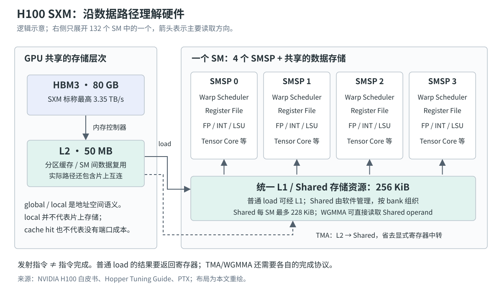
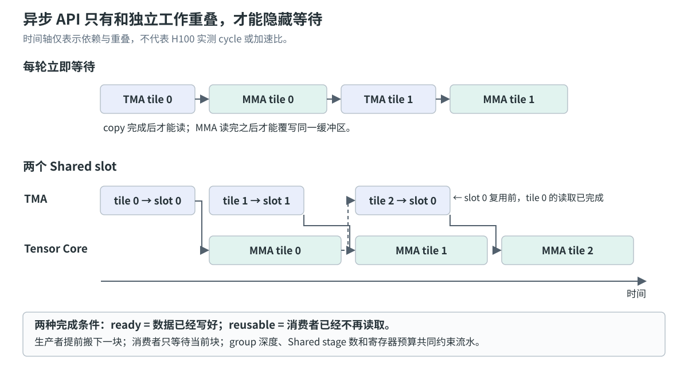

# 理解 H100：从硬件数据路径到 Nsight Compute 瓶颈分析

读 H100 白皮书时，最显眼的是 Tensor Core 算力和 HBM 带宽；打开 Nsight Compute，迎面而来的却是 `eligible warps`、`long_scoreboard`、`wavefronts` 和一长串带后缀的 metric。两边描述的是同一块 GPU，却很难直接对应。

连接它们的办法，是跟着一份工作在硬件里走一遍：**block 在哪里驻留，warp 为什么能发射，load 怎样变成访存事务，数据何时能够消费，以及哪个资源限制了下一步。** 有了这条路径，指标才有解释力。

本文结合 [Nsight Compute Metrics Guide](https://docs.nvidia.com/nsight-compute/ProfilingGuide/#metrics-guide)、Aleksa Gordić 的 [matmul 解析](https://www.aleksagordic.com/blog/matmul)、H100 白皮书、CUDA/PTX 文档和 GPU 微基准研究。采用的判断顺序是：

1. 确认工作量和测量口径，判断计算、存储或调度的哪一环受限。
2. 将“资源已经达到吞吐上限”和“资源还没吃饱，线程却在等待”分开。
3. 用源码、SASS 和依赖关系定位原因，最后用运行时间验证修改。

后文的数值推导与诊断案例会明确写出假设；论文数据保留设备和测量方法。硬件以 **H100 80 GB SXM** 为主要参照，涉及原版 H100 PCIe、H800 或其他架构时单独说明。本文没有将示意性的 profile 当作实测结果。

## 1. H100 上有哪些资源，它们分别约束什么

### 从整卡到一个 SM

Hopper 是架构名称，GH100 是芯片实现，H100 是产品。完整 GH100 的结构图包含 144 个 SM；H100 SXM 实际启用 132 个 SM，原版 H100 80 GB PCIe 为 114 个。不能拿完整芯片结构图中的数量直接计算手上设备的峰值。[^hopper-architecture]

SM（Streaming Multiprocessor）是执行 CUDA block 的主要硬件单元。H100 的一个 SM 划分为四个 SMSP，即 SM subpartition。每个 SMSP 维护一组 resident warps，配有调度器、寄存器和执行资源；SM 内还有共享的 L1/Shared 存储资源。

下面这张图把主要读取路径放到一起。它省略了地址转换、内部队列与互连细节，强调数据位置和消费者：



普通计算通常从寄存器取操作数；global load 的结果也会进入寄存器。TMA 可以把 global 数据直接搬入 Shared Memory，WGMMA 又能直接消费 Shared 中的矩阵 operand，因此不能把所有计算都画成同一条“HBM → L2 → L1 → Register”直线。

对 kernel 开发最有用的预算如下。容量按实际二进制含义写为 KiB；厂商文档常将这些片上容量标为 KB。[^hopper-whitepaper][^hopper-tuning][^h100-product]

| 范围 | H100 的相关资源 | 优化时真正要问的问题 |
| --- | --- | --- |
| 整卡，SXM | 132 个 SM；80 GB HBM3；标称最高 3.35 TB/s | 独立 block 足够多吗？实际搬运量是否过大？ |
| 整卡 | 50 MB L2，分区组织 | 数据能否跨 CTA 复用？流量是否集中在部分分区？ |
| 一个 SM | 四个 SMSP；128 个 FP32 CUDA Core、64 个 INT32 单元、64 个 FP64 单元、四个 Tensor Core | 忙的是矩阵计算、标量数学还是地址计算？ |
| 一个 SM | 65,536 个 32-bit register，即 256 KiB | accumulator 和临时变量占了多少？是否限制并发或发生 spill？ |
| 一个 SM | 256 KiB 统一 L1/Shared 资源；Shared 最多 228 KiB | tile 和 stage 能否放下？Shared carveout 是否挤压 L1？ |
| 一个 block | 最多 1,024 个线程；Shared 最多 227 KiB | block 是否过大？资源按什么粒度分配？ |
| 一个 SM | 最多 64 个 resident warps、32 个 resident blocks | 理论 occupancy 的限制来自哪项资源？ |

表中的“最多”不能全部同时取得。一个 block 占用 128 KiB Shared 时，即使线程与寄存器很少，也无法在 228 KiB 的 Shared 预算中同时放入两个这样的 block。

计算峰值还必须说明精度和稀疏性。H100 SXM 的 dense BF16/FP16 Tensor Core 峰值约为 989 TFLOP/s，而当前产品表中的约 1,979 TFLOP/s 带有 sparsity 脚注。普通 dense GEMM 不能使用后者作为分母。FP32 CUDA Core 与 TF32 Tensor Core 也是不同执行路径。[^h100-product]

### 编程层次与硬件层次不是一一对应的

CUDA 的层次描述协作和工作划分，GPC/TPC/SM 描述硬件组织。最重要的映射是：

| 软件单位 | 协作粒度 | 与硬件的关系 |
| --- | --- | --- |
| thread | 一个线程的变量、控制流和索引 | 有自己的执行状态；通常与同一 warp 的线程共同执行指令 |
| warp | 32 个线程 | 是普通 SIMT 指令调度的重要单位 |
| block / CTA | 一组 warps | 普通执行中驻留在同一 SM，共享 Shared 和 block barrier |
| warpgroup | 四个 warp、128 个线程 | Hopper WGMMA 的协作单位，不是额外的 kernel launch 层次 |
| thread block cluster | 一组 block | 在受支持的 cluster launch 下协同调度到同一 GPC，可使用 DSM |
| grid | 一次 launch 的全部 block | 可以分多批占用整个 GPU |

普通 block 之间不能假定执行次序或同时驻留。Hopper 的 cluster 则显式增加了更大的协作域；可移植的 cluster size 上限通常为八个 block，更大的非可移植配置需要查询设备支持与 occupancy。DSM 是访问 cluster 内其他 block 的 Shared，并没有增加一块新的全 GPU 共享 SRAM。[^cuda-model][^hopper-tuning]

两个会影响实现选择的边界：

- **block 不必至少 128 线程。** 多个较小 block 可以共同提供 resident warps；WGMMA 的 128-thread 协作要求，不能推广为所有 CUDA kernel 的规则。
- **warpgroup 不等于 cluster。** 前者在一个 CTA 内协作执行矩阵指令；后者让多个 CTA 跨 SM 协作。跨 SM 的同步与数据生命周期必须另外处理。

32-thread warp 描述逻辑执行组，不保证任意一种指令都由 32 个物理算术单元在一个 cycle 内完成。指令所用的 pipeline、执行宽度和依赖延迟仍要分别看。分支或边界 predicate 还会使部分 lanes 不参与有效计算：发射了一条 warp 指令，也不一定做满 32 份有效工作。Independent Thread Scheduling 改善线程执行状态的管理，但不会消除分歧成本；线程间通信仍要使用合适的同步。[^cuda-simt]

## 2. 一个 kernel 怎样占满 GPU，又怎样留下空隙

CUDA 源码并不是调度器直接执行的指令。编译过程通常先后涉及 PTX 与目标架构机器代码：**PTX 是虚拟指令集，SASS 是实际 GPU 机器指令的汇编表示。** 编译器会展开、合并、向量化或删除源码操作，必要时还会发生 JIT 编译。所以“代码里写了四次 load”与“最终执行了哪些指令、多少次”需要分别确认。[^ptx]

### block admission：资源决定并发上限

CPU 提交 kernel 后，GPU 要把 block 分配到能够容纳它们的 SM。一个 block 需要的寄存器、Shared、warp slot 等资源，决定了每个 SM 能同时驻留几个 block。

可以先用简化模型建立直觉：

$$
B_{\text{resident}}\leq\min\left(
B_{\text{HW}},
\left\lfloor\frac{T_{\text{SM}}}{T_{\text{block}}}\right\rfloor,
\left\lfloor\frac{R_{\text{SM}}}{R_{\text{block}}}\right\rfloor,
\left\lfloor\frac{S_{\text{SM}}}{S_{\text{block}}}\right\rfloor
\right).
$$

它只是上界估计。真实分配还受 allocation granularity、SMSP 资源分布、barrier 和 cluster 限制，最终应使用 occupancy calculator 和 profiler 的结果。[^cuda-advanced]

假设 block 有 256 个线程，每线程用 64 个寄存器，忽略分配粒度时：

$$
R_{\text{block}}=256\times64=16{,}384,\qquad
\left\lfloor\frac{65{,}536}{16{,}384}\right\rfloor=4.
$$

如果变成每线程 65 个寄存器，纯总量模型就只允许三个 block。**资源压力对并发度的影响有台阶。** 多一个临时变量有时影响很小，有时恰好跨过边界；反过来，强行压低寄存器导致 spill，可能用额外访存换来名义上更高的 occupancy。

### wave 与 tail：线程多也不代表整卡繁忙

如果一个 kernel 每 SM 最多驻留两个 block，132 个 SM 的一批 resident capacity 就是 264 个 block。假设所有 block 时长相等、没有其他限制：

- 264 个 block 恰好占满一批。
- 265 个 block 在第一批之后，还剩一个 block 的工作。
- 2,640 个 block 有更多批次，末尾不均衡的相对影响往往更小。

这是解释 tail effect 的极端模型，真实调度动态推进，并不存在所有 SM 必须一起结束当前 wave 的全局 barrier。但它揭示了同一个问题：**kernel duration 由最后完成的工作决定，平均并行度却会被尾部空闲拉低。**

需要同时查看 grid size、`launch__waves_per_multiprocessor`、理论与实际 occupancy，以及 SM 之间的工作分布。理论 occupancy 高、实际低，可能是 block 太少、任务长度不均、warp 提前退出或尾部效应，不能立刻归因于寄存器。[^instruction-cache]

对小矩阵，减小 tile 可能增加 block 数、改善整卡利用率；对大矩阵，相同改动却可能降低复用、增加访存。tile 的最优点依赖 shape，是算法映射与硬件资源的共同问题。

### resident、eligible、issued 是三种状态

warp 驻留后，调度器仍然不能无条件发射它。每个 cycle 的决策可以理解为：

```text
resident warp
  ├─ 下一条指令还没取到 → 等待指令供给
  ├─ 输入依赖未满足     → 等待结果 / 同步
  ├─ 目标资源暂不可接收 → 等待 pipeline / queue
  └─ 可以推进          → eligible
                           ├─ 被选中 → issued
                           └─ 其他 warp 被选中 → not selected
```

Occupancy 统计 resident warps，不是 eligible warps。SM 上可以有很多活着的 warp，但它们恰好都在等内存或同一个 barrier，调度器仍会出现空发射周期。NVIDIA 的 ADO 案例展示了高 resident warp 数与低 eligible warp 数可以同时出现。[^ado]

另一方面，某个 warp 正在等待，并不意味着整个 SM 没有工作。其他 warp 能继续执行，就可能把它的等待隐藏起来。不要把各 warp 的等待样本相加，解释成整张 GPU 可消除的运行时间。

## 3. 发射一条指令之后，硬件在做什么

### pipeline 吞吐与指令依赖延迟

假设某条计算指令从发射到结果可用需要四个 cycle，但相应流水每个 cycle 都能接受新的独立指令。这两个数字不矛盾：四个 cycle 描述一条依赖链多久能继续推进；每 cycle 一条描述流水稳定工作时的接收速率。

以下伪代码只说明依赖关系：

```cpp
// 一条串行依赖链
a = fma(a, x0, y0);
a = fma(a, x1, y1);

// 两条独立链；在算法和数值要求允许重组时才成立
a0 = fma(a0, x0, y0);
a1 = fma(a1, x1, y1);
```

第二种形式让编译器有机会将独立指令交错安排，用 ILP（指令级并行）覆盖结果延迟。另一个 warp 的指令也能起到类似作用，那是 TLP（线程级并行）。实际执行仍受 SASS 指令次序和调度约束，不能想象成 GPU 会任意越过一条阻塞指令、寻找后面所有可执行工作。

Volkov 在 GTC 2010 的报告用 Little's Law 解释了二者的关系：要维持目标吞吐，需要足够多的在途独立工作。其具体 cycle 数属于当年的 GPU，能迁移到 H100 的是模型。[^volkov]

$$
\text{所需在途工作量}\approx\text{目标吞吐率}\times\text{完成延迟}.
$$

寄存器也应放在这个框架里理解。“数据已经在 register”并不代表依赖延迟为零；消费者仍要等生产它的 FMA、load 或 MMA 完成。

此外，结果 ready 之后，执行单元还要取得输入 operand。Jia 等人的 Volta 微架构研究通过改变 FFMA 的源寄存器编号，观察到 register bank 组织对服务成本的影响；这属于寄存器文件内部问题，与 Shared bank conflict 是两件事。[^volta-paper] 这类研究说明，operand delivery 也是吞吐约束，但其中测得的 bank 数、映射和 cycle 不能直接当作 H100 的硬件契约。对 H100 应以实际编译结果、可用 counter 和针对该设备的实验继续确认。

### 忙的未必是你关心的计算

高 SM throughput 只能提示某部分 SM 资源很忙。地址计算、索引变换、类型转换和 load/store 指令同样要使用执行或发射资源。应在 Compute Workload Analysis 中确认主要 pipeline，再看 Instruction Statistics 和 SASS。

例如，高复用 GEMM 将 HBM 压力降下去后，主循环可能仍包含大量地址更新和边界 predicate。继续增大缓存命中率未必有效，减少地址生成和指令数才可能让 Tensor Core 得到更多工作。

另一个例子是 Attention：矩阵乘变快后，softmax 的 exp、reduction、缩放与重排可能占据更大的关键路径。Tensor Core 峰值翻倍不代表这些部分也翻倍。分析时需要按阶段看各条 pipeline 的需求，不能只使用整个 kernel 的 FLOP 总数。

## 4. 内存层次：地址空间、存储位置和服务路径

### global、local、shared 分别意味着什么

CUDA 的 memory space 与物理存储不是同一组分类。[^cuda-simt][^private-arrays]

| 名称 | 程序可见语义 | 常见物理路径与代价 |
| --- | --- | --- |
| register | 线程的快速工作状态 | 位于 SM，受寄存器预算、指令依赖及 operand delivery 限制 |
| local | 线程私有的地址空间 | 常用于 spill、栈和动态索引数组；通常走设备内存及缓存路径 |
| shared | block 可协作访问的存储 | 位于 SM，软件显式管理，访问模式要匹配 bank |
| global | 广泛可见的地址空间 | 常映射到本卡显存，也可能指向系统或 peer memory，依具体分配而定 |
| constant | 只读常量空间 | 适合 warp 内少量相同地址的读取，地址分散可能增加服务成本 |
| texture / surface | 带特定访问语义的空间 | 使用纹理/表面相关路径，不能直接套普通 global load 的吞吐假设 |

L1 与 L2 提供硬件管理的缓存；Shared 提供软件管理的局部存储。L1 和 Shared 共享部分物理资源，不代表它们的同步、寻址、替换策略和可见性可以互换。

对于普通 global read，可以先使用如下模型：

```text
warp 执行 load
  → 地址计算与请求生成
  → L1TEX 的相关处理阶段
  → L1 hit，或向 L2 请求
  → L2 hit，或继续到显存 / 系统 / peer 路径
  → 返回数据，解除后续消费者的依赖
```

这是主干，cache policy、异步 copy 和具体指令会改变路径。store、atomic、texture 也不能简单当作它的反向过程。尤其要区分“store 已发射”“请求已完成”和“另一个参与者能观察到数据”；这些事件决定了不同的同步要求。[^ptx]

### instruction、request、sector、wavefront：四种计数不能混用

假设 32 个线程执行同一条 scalar FP32 load，每线程读四个字节。软件层看到一条 warp 指令；硬件还要按地址分布组织请求，处理这些请求涉及的存储区域。Nsight 使用 sector 表示对齐的 32 B 区域，使用 wavefront 描述内部某处理阶段一次能够处理的工作包。[^metrics]

用四种访问模式看区别：

| warp 中的地址模式 | 独立有效数据 | 涉及的 32 B sector | 直接含义 |
| --- | ---: | ---: | --- |
| 读取对齐的连续 32 个 float | 128 B | 4 | 这次请求覆盖的数据都被使用 |
| 同样的连续范围错开一个 float，跨过原 sector 边界 | 128 B | 5 | 请求覆盖范围扩大 |
| 每线程读彼此相隔 32 B 的一个 float | 128 B | 32 | 触及 1,024 B 的 sector 范围，只使用其中 128 B |
| 所有线程读取同一个 float | 4 B | 1 | 有广播复用，不能按 128 B 独立数据计算效率 |

这张表只计算请求触及的 sector，不宣称它们都会变成 HBM 流量。缓存命中、请求合并和其他 warp 的复用会改变下游实际 bytes。对于排列过的地址，只要触及同一组 sector，也可以保持良好的 coalescing。[^cuda-simt]

所以，看到 `Sectors/Request = 8`，不能直接宣布访问效率只有一半。先问每线程访问宽度、active lanes、访问空间和广播情况：每线程八个字节时，32 个线程本来就需要至少 256 B。

也不要把不合并访问解释成“编译器多发了 32 条同样的 SASS load”。**同一条 warp 级 load 可以产生更多内部服务工作。** 源码 load 数、SASS 指令数和事务数之间要逐层对照。coalescing 能精确描述请求在 sector 层的组织，但不能仅凭它推断真实 DRAM row 的映射与命中。

wavefront 则继续回答：这些 sector 的服务工作要被拆成几批？sector 数相同，地址分布和阶段限制仍可能让 wavefront 数不同。因此，指令数、sector 数和 wavefront 数未必按相同比例变化。

这解释了为什么 DRAM 还没跑满，L1TEX 内部却可能先达到服务上限。增加更多 load 只会给繁忙阶段排更长的队。[^triage]

### Shared bank conflict：一个 bank 要服务几个不同位置

对 H100 上常见的 32-bit Shared 访问，可以用下面的映射分析：

$$
\text{bank}=\left\lfloor\frac{\text{byte address}}{4}\right\rfloor\bmod32.
$$

让 lane $i$ 读 `s[i]`，各线程落到不同 bank；让它读 `s[32*i]`，不同位置落到同一个 bank，就需要分批服务。多个线程读取同一 32-bit word 时可以广播，不能当成相同程度的冲突。[^shared-memory]

经典二维例子是行主序 `float tile[32][32]`：沿行读取容易分散到 32 个 bank，沿列读取则步长为 32 个 float。改成 `tile[32][33]` 后，一列的相邻元素在 bank 编号上也前进一步，从而消除这个特定访问的冲突。

但“加一列”不是通用 Tensor Core layout 方案。`ldmatrix`、向量化 load 与 TMA/WGMMA 有各自的布局、alignment 和 swizzle 约束，需要按真实指令分析；站内的 [Bank Conflict 与 CUTLASS Swizzle](../cuda/从%20Bank%20Conflict%20到%20CUTLASS%20Swizzle：推导%20ldmatrix%20的访存布局.md) 有进一步推导。

还要比较 **actual 与 ideal wavefronts**。每线程读取 16 B 时，即使没有地址冲突，也不能要求整个 warp 的 512 B 工作总是只占一个 128 B 服务单位。宽访问的必要拆分和多余拆分应分别看待。

### L2 hit 很高，为什么 kernel 仍然慢

缓存命中只说明请求在某层得到满足，不说明服务没有成本。它仍占用请求队列、tag/data port、互连和返回路径，也仍有 load-to-use latency。

例如，kernel 反复从 L2 读取同一数据，每次只做少量计算。它可能同时具备高 L2 hit rate、低 HBM 带宽和明显等待。此时可以尝试把复用前移到 register 或 Shared，减少到达 L2 的请求次数；也可能需要增加独立请求，覆盖已有延迟。两种优化针对不同原因，需要用 L2 吞吐和调度状态区分。

反过来，一次性顺序扫描的大数组可以有很低的 cache hit rate，却已经接近 HBM 的可持续带宽。没有复用的数据，不会因为“希望命中率更高”就凭空产生复用。

### 微基准中的 latency 数字应该怎么读

Luo 等人的 Hopper 研究使用 dependent pointer-chase 测量访问延迟：下一次地址依赖上一次返回值，主动压低 MLP，暴露 load-to-use 等待。其 Hopper 设备是 **H800 PCIe、114 SM、CUDA 12.6、driver 560.35.03**，不能将结果写成 H100 SXM 的固定常数。[^hopper-paper]

该研究传统 pointer-chase 的 H800 结果中，L1 约 32 cycle、Shared 约 29 cycle，L2 随路径和工作集出现约 264.5–502 cycle 的变化。细粒度实验进一步区分了近、远 L2 路径。它提醒我们：“L2 latency”不能脱离路径、工作集和测量定义写成唯一数字。

阅读这类表格时，先检查四件事：

1. 测的是 dependent latency，还是大量独立操作的 throughput？
2. cycle 属于哪个 clock domain，实际频率是多少？
3. 数据是否预热，cache modifier、步长和工作集怎样设置？
4. “完成”指 load 可被消费，还是包含 barrier、循环与计时指令的整个序列？

这也适用于 TMA。论文的 TMA 测量包含相应 barrier 和 wait 开销时，不能把总时长视为引擎自身的纯延迟。对于 store，还必须定义谁观察到完成；不存在可以和 load 表机械对称的统一 write cycle。

## 5. 带宽很高和延迟很长，为什么可以同时成立

假设目标 HBM 带宽为 3.35 TB/s，一次访问的端到端延迟取 **假设值** 500 ns。用 Little's Law 做数量级估算：

$$
Q_{\text{bytes}}\approx3.35\times10^{12}\times500\times10^{-9}
=1.675\times10^6\ \text{B}.
$$

在这个假设下，整卡要维持约 1.675 MB 的在途服务工作才能支撑目标速率。这不是 H100 队列容量的测量，也不表示所有在途字节都均匀分配到 SM；它只是解释为什么少量串行 load 喂不满很宽的显存接口。

考虑下面两种循环：

```cpp
// 地址相关：下一个请求无法提前发出
index = next[index];
index = next[index];

// 地址独立：编译器有机会提前安排多个 load
x0 = input[i0];
x1 = input[i1];
x2 = input[i2];
x3 = input[i3];
// 后续才消费 x0...x3
```

第一种是典型的 latency 问题。第二种能增加独立请求，但前提是地址、寄存器与指令安排确实允许请求重叠。

增加 MLP 的手段包括更多 resident warps、每线程多元素、适度展开和预取。向量化还可以增加每条指令搬运的 bytes、降低指令开销，但需要正确 alignment、尾部处理，并可能提高寄存器压力。`float4` 是否生成宽访存指令，应在 SASS 中核实。[^vectorized]

最重要的停止条件是：**如果某级带宽或请求服务率已经饱和，继续增加并发不再解决主要矛盾。** 此时应该减少 bytes、提高复用或改变布局。关于 ILP、MLP 和 TLP 的进一步区分，可参见 [CUDA 中的 ILP 与 MLP](../cuda/CUDA%20中的%20ILP%20与%20MLP.md)。

## 6. Hopper 的异步流水：TMA 与 WGMMA 省掉了什么

### 从同步搬运到 TMA

传统 tiled kernel 可以由线程先 load global 到寄存器，再 store 到 Shared。Ampere 的 `cp.async`/LDGSTS 已能省去显式寄存器中转；Hopper 的 TMA 进一步用 tensor map 描述多维布局，把大量逐线程寻址和搬运组织交给专用硬件。[^async-copy]

这里要分清两个 descriptor：

- **TMA tensor map** 描述 global tensor 的基址、维度、stride、tile 等信息，用于组织搬运。
- **WGMMA Shared descriptor** 描述矩阵 operand 在 Shared 中的布局。描述符值位于寄存器，不代表矩阵数据也位于寄存器。

TMA 省掉部分搬运指令、地址计算和 staging register。它没有消除 HBM bytes，也没有消除 Shared buffer 的容量需求。

### WGMMA 改变 operand 路径和协作方式

以 dense BF16 `wgmma.mma_async` 为例，128-thread warpgroup 协作执行矩阵运算。A 可以采用支持的 register 或 Shared 形式，B 使用 Shared descriptor，FP32 accumulator 分散在线程寄存器中。WGMMA 是 Hopper 的 `sm_90a` 架构特定能力。[^ptx]

用一个 $64\times128$ 的 FP32 accumulator 做预算：

$$
\frac{64\times128}{128}=64.
$$

平均每线程需要 64 个 32-bit register 存放结果元素，尚未计算指针、descriptor、循环状态和 epilogue 临时值。WGMMA 省掉部分输入 operand 的寄存器 staging，**accumulator 的寄存器成本依然存在**。

这解释了为什么更大矩阵 tile 既可能提高运算效率，又可能降低 occupancy。不能只根据 Tensor Core 理论吞吐选择最大 shape。

### ready 与 reusable：两种完成点

TMA 把数据写入 Shared 后，消费者才可以开始使用它；WGMMA 发射后，还可能继续读取 Shared operand，生产者不能立即覆盖同一 buffer。

每个 slot 至少有如下生命周期：

```text
可复用 → 生产者获得 slot → TMA 正在写入 → 数据 ready
  → 消费者发起 WGMMA → 完成对 operand 的使用 → 再次可复用
```

`mbarrier`、async proxy ordering、`wgmma.fence` 和 `wgmma.wait_group` 处理的不是同一件事。具体代码必须遵循对应指令的内存模型；`asm volatile` 或编译器 `"memory"` clobber 不能替代硬件完成与可见性协议。

下图对比每轮立即等待与双缓冲的依赖关系：



tile 1 的搬运与 tile 0 的计算重叠；tile 2 复用 slot 0 前，tile 0 的消费者已经不再读取它。蓝色搬运完成决定 ready，绿色消费完成决定 reusable。两种状态由不同依赖边界约束。

下面只表达控制结构，不是可编译的同步实现：

```cpp
// 伪代码：实际实现需正确设置 barrier phase、参与者与内存顺序
producer:
    wait_until_slot_is_reusable(slot);
    issue_tma_for_tile(slot, tile);
    // ready 由相应的异步事务完成条件决定

consumer:
    wait_until_tile_is_ready(slot);
    issue_wgmma_using(slot);
    commit_wgmma_group();
    // 可以继续处理独立工作
    wait_until_operand_reads_are_complete(slot);
    release_slot_to_producer(slot);
```

如果每次发出 TMA 就立即等待、每次发出 MMA 又立即等待，中间没有独立工作，异步 API 仍可能近似串行运行。Aleksa 的文章从 tiled matmul 推进到 producer/consumer 与 buffer queue，提供了很好的代码阅读入口；复现时仍应回到 PTX 与实现核对同步要求。[^matmul]

### stage 越多，为什么有时更慢

假设 BF16 CTA tile 取 $B_M=B_N=128$、$B_K=64$。只计算 A/B Shared buffer，一个 stage 需要：

$$
S_{\text{stage}}=2(B_MB_K+B_KB_N)
=32{,}768\ \text{B}=32\ \text{KiB}.
$$

三个 stage 使用 96 KiB，四个 stage 使用 128 KiB。只考虑 228 KiB 的 Shared 总预算，三个 stage 的两个 CTA 共 192 KiB，仍可能放下；四个 stage 的两个 CTA 共 256 KiB，已经放不下。真实 kernel 还要计入 barrier、padding 和其他 Shared 分配。

多一个 stage 给预取更长的提前量，却可能让 resident CTA 数减半。它能否更快，取决于新增重叠是否超过减少 TLP 的损失。因此 stage 数、MMA group 深度、tile、producer/consumer 分工和寄存器预算应一起搜索。

对小 K，额外 stage 甚至来不及进入稳态，prologue 和 drain 就结束了。TMA/WGMMA 的机制优势不保证小 shape 一定受益。

### 分工之后，寄存器也可以按角色分配

producer 主要维护搬运状态，consumer 要保存较大的 accumulator，两者的寄存器需求不同。Hopper 的 `setmaxnreg` 允许符合条件的 warpgroup 在 CTA 的寄存器池内调整各 warp 拥有的寄存器额度；申请额外寄存器时，若池中不足，执行会等待。[^ptx]

这给 warp specialization 多了一项设计空间：让 producer 释放不需要的额度，供 consumer 使用。它没有增加 SM 的寄存器总量，也不能简单理解为“动态降低 producer 寄存器就会自动增加 resident CTA”。分析这类 kernel 时，要结合角色、编译配置与运行期分配，不能只用一个平均 registers/thread 解释全部行为。

## 7. 用 GEMM 把复用、容量与吞吐接起来

### Roofline 要选对 bytes 和计算路径

对 $C=AB$，A 为 $M\times K$，B 为 $K\times N$，乘加按两次浮点运算计数：

$$
F=2MNK,\qquad P_{\text{achieved}}=\frac{F}{T}.
$$

若 A、B、C 均以 BF16 存储，$\beta=0$，理想地每份输入只从 HBM 读取一次、输出只写一次：

$$
Q_{\text{HBM,min}}=2(MK+KN+MN),\qquad
I_{\text{HBM,ideal}}=\frac{F}{Q_{\text{HBM,min}}}.
$$

这是**理想最小流量模型**。实际 HBM bytes 可能因重复读、spill、缓存状态等改变；C 若为 FP32 或需要读取旧 C，分母也要重算。使用实测 bytes 时，归属和读写口径必须一致。

对于某一存储层级 $j$：

$$
P\leq\min\left(P_{\text{compute}},\ BW_j I_j\right).
$$

L1、L2、HBM 的 $I_j$ 不同，因为数据通过这些边界的次数不同。HBM Roofline 允许很高性能，不保证 L1TEX 请求服务或 Shared 数据供给没有先受限。

用约 989 TFLOP/s 的 dense BF16 峰值和 3.35 TB/s 计算，H100 SXM 名义 HBM ridge point 约为 $989/3.35\approx295$ FLOP/B。这只是规格层面的参考交点；实际应使用与精度、时钟、功耗和 workload 匹配的可持续上限。

### 为什么增大 BK 不会自动提高输入复用

一个 CTA 每轮处理 $B_M\times B_K$ 的 A 和 $B_K\times B_N$ 的 B。忽略输出、缓存和额外流量，BF16 输入的运算强度是：

$$
I_{\text{CTA,input}}
=\frac{2B_MB_NB_K}{2(B_MB_K+B_KB_N)}
=\frac{B_MB_N}{B_M+B_N}.
$$

$B_K$ 被约掉了。增大 BK 可以减少循环次数、摊薄寻址和同步开销、改变 copy 粒度，但不会在这个模型中自动增加每个输入元素的复用次数。增大 BM/BN 才改变这里的复用，同时增大 accumulator 与 Shared 需求。

若 BM=BN=128，上式是 64 FLOP/B，低于前面的名义 HBM ridge。大 GEMM 仍可能接近计算上限，因为不同 CTA 可在 L2 复用 A/B，使 HBM 不必为每个 CTA 重复提供全部输入。**CTA tile 复用与整卡 cache 复用必须分层计算。**

### 分层优化改变不同的成本

| 修改 | 主要减少或增加什么 | 需要重新检查什么 |
| --- | --- | --- |
| 调整 thread mapping，合并访问 | 减少无效 sector 和内部服务工作 | active lanes、访问宽度、actual/ideal transactions |
| Shared tiling | 提高 block 内输入复用 | Shared 容量、bank conflict、同步 |
| register tiling | 增加输入复用与独立 accumulator | register pressure、spill、occupancy |
| 宽 load/store | 减少相同数据量所需的访存指令 | alignment、SASS、尾部、寄存器 |
| `cp.async` / TMA | 减少显式 staging，增加搬运与计算重叠 | stage 生命周期、队列、Shared 预算 |
| WGMMA | 使用更强的矩阵执行路径 | shape 利用率、accumulator、同步与供给 |
| epilogue fusion | 减少中间结果写回和额外 launch | 非矩阵计算占比、寄存器生存区间 |

这些优化不能机械叠加。一次修改让瓶颈从 HBM 转移到 Shared 或寄存器，往往说明它改变了工作量分布；下一轮应该重新诊断。

## 8. 先读懂 metric 的分母，再读它的数值

### 一个长名字实际在回答四个问题

以这个 metric 为例：

```text
l1tex__t_sectors_pipe_lsu_mem_global_op_ld.sum
│      │ │       │        │          │   └─ 各硬件实例求和
│      │ │       │        │          └──── 只计 load
│      │ │       │        └─────────────── 只计 global memory
│      │ │       └──────────────────────── LSU 路径
│      │ └──────────────────────────────── 计数对象是 sector
│      └────────────────────────────────── tag 阶段
└───────────────────────────────────────── L1TEX 单元
```

它没有直接告诉你 kernel 花了多少时间，也没有直接给出 HBM bytes。它在特定硬件位置，对符合条件的事件进行计数，再做实例聚合。读其他长名字时也按这个顺序拆解：**在哪里计数、计什么、筛选什么、怎样聚合和归一化。**[^metrics]

常见前缀对应以下观察位置：

| 前缀 | 观察位置 | 典型用途 |
| --- | --- | --- |
| `gpu__` | GPU / workload 层 | 时间和高层汇总 |
| `sm__` | SM 层 | 计算 pipeline、warp 驻留与总体吞吐 |
| `smsp__` | SM 子分区 | 调度、指令、warp 状态 |
| `l1tex__` | L1 / texture / Shared 相关单元 | request、sector、wavefront、bank conflict |
| `lts__` | L2 slice | L2 流量、命中和服务压力 |
| `dram__` | 显存接口 | HBM 读写量和吞吐 |
| `launch__` | launch 配置 | block/grid、资源分配、理论 occupancy 限制 |

当前 Metrics Guide 同时覆盖多代 GPU。看到 `tmem` 或 Blackwell 的新矩阵路径，不代表 H100 也具备这些存储或指令。首先查询当前 GPU 与 Nsight Compute 版本实际支持的 metric，再解释含义。

### `.avg` 不是“对每个时间点取平均”

对于普通硬件 counter，`.sum`、`.avg`、`.min`、`.max` 首先是在硬件实例之间聚合。例如，`sm__inst_executed.avg` 是各 SM 指令计数的平均，不等同于 IPC；后面再带 `.per_cycle_active`，才引入时间归一化。

这让 `.min`/`.max` 在负载不均时很有价值：平均很低，可能是所有 SM 都只完成少量工作，也可能是少数 SM 很忙、其余基本闲置。可结合 Workload Distribution 或支持的实例数据区分；不能把一个全局平均值想象成每个 SM 的真实状态。

### active 与 elapsed：只看开工期间，还是覆盖整个观察区间

考虑一个人为构造的单元：观察区间共 400 cycle，它只在其中 100 cycle 活跃，而活跃期间恰好持续达到参考峰值。于是：

$$
U_{\text{active}}=100\%,\qquad U_{\text{elapsed}}=25\%.
$$

两者都正确，但回答的问题不同：前者问“开始工作后效率如何”，后者问“整个区间利用了多少能力”。这个例子只说明分母效应，各硬件单元的 active 定义要读 metric description。

因此，achieved occupancy 常用的 active-cycle 分母，与 Speed Of Light 中常见的 elapsed-cycle 分母不能混为一谈。一个短暂活跃的 SM 可以在活跃期间有不错的 occupancy，却无法证明整卡在整个 kernel 期间都很忙。

另外，SM、L2、DRAM 的 cycle 可能属于不同 clock domain。跨层比较时，应转换到时间、bytes/s 或相应的百分比口径，不能直接拿不同单元的 cycle 相除。

### Throughput 百分比并不是“多少比例的全部晶体管在工作”

Nsight 的 throughput 是一组相关 constituent counters 的峰值利用率中取最大值。它是一种寻找受压环节的汇总，不能解释为所有子部件的平均利用率。[^metrics]

例如，SM throughput 为 90%，可能由某条繁忙 pipeline 贡献，不代表 FP32、INT、Tensor Core 都达到 90%。Memory throughput 为 90%，也可能来自 L1TEX 或 L2 的服务压力；必须展开 breakdown，才能知道是否真的是 HBM 接口接近上限。

工程上可以把高层百分比当成路标，然后沿最大贡献者向下看。不要给所有 workload 套一个“超过 80% 就最优”的结论：峰值数据库的参考口径、实际时钟、指令组合、短 kernel 的非稳态阶段都会影响可达到的值。

## 9. Nsight Compute：从时间到原因的诊断顺序

### 先确认值得优化的是哪个 kernel

如果端到端时间主要花在 CPU 提交、数据传输、跨卡通信或 kernel 之间的空隙里，单个 kernel 的优化空间并不等于应用加速空间。先用 Nsight Systems 找到热区及其上下文，再用 Nsight Compute 深入代表性的 launch。NVIDIA 在 ALCF workshop 的培训材料也按这两个观察尺度组织工具。[^alcf]

例如，某 kernel 只占总时间的 10%，即使把它加速两倍，在其他部分完全不变、且不改变重叠关系的简化模型下，总时间也只是从 1 降到 $0.9+0.1/2=0.95$。决定深入分析哪个 kernel，应该先有这个收益预算。

进入 Nsight Compute 后，我会按以下顺序阅读：

1. **Launch / Occupancy**：问题足够大吗？资源限制和 tail 在哪里？
2. **Speed Of Light**：计算或存储是否已有某个环节接近上限？
3. **Compute / Memory Workload Analysis**：是哪条 pipeline、哪层存储、哪种事务受压？
4. **Scheduler / Warp State**：有工作驻留时，为什么还不能发射？
5. **Source / SASS**：哪个生产者、消费者或地址模式造成了这种状态？

这是逐步缩小假设范围，不是五个必须逐个调高的分数。尤其对于 WGMMA：少量异步指令可以驱动较长时间的矩阵计算，低普通指令发射率未必代表 Tensor Core 饥饿，应结合矩阵 pipeline 活跃情况和运行时间判断。[^triage]

### 第一组：时间、工作规模与并发预算

下面给出常见名称；完整可用性仍以本机 query 和 section 为准。表中 `*` 表示一组相关 metric，不能将整行当作完整的采集参数。

| 查看内容 / 代表 metric | 它能支持什么判断 | 单独看它不能说明什么 |
| --- | --- | --- |
| `gpu__time_duration.sum` | 被测 workload 的时间 | profiler 外的端到端收益 |
| `launch__grid_size`、`launch__block_size`、`launch__waves_per_multiprocessor` | 是否有足够 block，是否容易留下尾部 | 每个 block 工作量是否均匀 |
| `launch__registers_per_thread`、Shared allocation | 寄存器和 Shared 预算 | 寄存器多就一定慢 |
| `launch__occupancy_limit_*`、理论 occupancy | 哪项资源限制理论驻留 | warp 是否能实际发射 |
| `sm__warps_active.avg.pct_of_peak_sustained_active` | 活跃周期内的实际 warp 驻留比例 | 计算资源是否饱和 |
| `smsp__warps_eligible.avg.per_cycle_active` | 每个调度器平均有多少 warp 能推进 | 某个异步执行单元是否已经吃满 |
| `smsp__issue_active.avg.pct_of_peak_sustained_active` | 调度器是否经常能发射 | 发射的指令是否做了有效算法工作 |

如果 resident warps 很多、eligible 很少，继续增加 resident 数未必是最直接的办法。先看它们是不是共同等待一份数据，或在一个阶段末尾汇聚到同一 barrier。

### 第二组：到底是哪种“忙”

| 查看内容 / 代表 metric | 需要联读的证据 | 可能的优化方向 |
| --- | --- | --- |
| `sm__throughput.avg.pct_of_peak_sustained_elapsed` | 展开的 `sm__pipe_*`、指令类型、算法 FLOPs | 减少繁忙 pipeline 的工作，或改用适合的执行路径 |
| `dram__throughput.avg.pct_of_peak_sustained_elapsed` | `dram__bytes_read.sum`、`dram__bytes_write.sum`、时间 | 减少 HBM bytes、复用、融合、可接受的更低存储精度 |
| `lts__throughput.avg.pct_of_peak_sustained_elapsed` | L2 bytes、请求类型、hit rate、分区负载 | 减少重复到达 L2 的工作，将复用前移或改善分布 |
| `l1tex__throughput.avg.pct_of_peak_sustained_elapsed` | request、sector、wavefront、路径分类 | 改善访问组织、减少访存指令或多余服务批次 |
| Memory 表中的实际 / 理想 Shared wavefronts | source line、bank conflict、宽度与 active lanes | 针对真实指令调整 padding、swizzle、访问顺序 |
| local load/store、编译器 spill 信息 | SASS、动态数组/栈用法、register budget | 缩短生存区间、改变索引或 tile，评估寄存器与并发的交换 |
| 每条指令的 active / predicated-on threads | 分支、边界 tile、数据分布 | 减少无效 lanes；按工作类型分组或调整映射 |

Memory Workload Analysis 中的 **Mem Busy、Max Bandwidth、Mem Pipes Busy** 分别帮助检查单元服务能力、单元之间的传输能力和访存指令流水压力。三者可能同时升高，但改法不一定相同。[^triage]

一个很实用的补充是同时计算两种带宽：

$$
BW_{\text{useful}}=\frac{Q_{\text{algorithm}}}{T},\qquad
BW_{\text{transferred}}=\frac{Q_{\text{measured}}}{T}.
$$

前者按算法确实需要的数据量估算，后者按某个明确硬件边界的实际流量计算。若后者很高、前者很低，可能有重复读取、事务放大或 spill；若二者都低，应继续检查内部服务上限和延迟隐藏。缓存复用存在时还可能出现算法计数大于该层实际流量，所以必须写清 $Q_{\text{algorithm}}$ 如何定义。

### 第三组：stall reason 是症状索引

优先分析会伴随 issue 空隙或关键执行单元饥饿的等待。以下使用 profiler 常见的 reason 名称；具体采样 metric 的完整前后缀以及支持的 reason 依架构和版本而异。[^metrics][^ncu-ui]

| reason | warp 当前主要在等什么 | 接下来查哪里 / 怎么改 |
| --- | --- | --- |
| `long_scoreboard` | L1TEX 路径操作相关的依赖，包括 local/global、texture 等 | 找产生数据的 load；查缓存层级、访问组织、spill 和独立请求。它不等于“正在等 HBM” |
| `short_scoreboard` | MIO 路径的短 scoreboard 依赖，常见于 Shared，也可涉及其他该路径操作 | 对照 SASS 确认生产指令；再查 Shared 多余 wavefront、依赖距离。不能直接等同 bank conflict |
| `wait` | 固定延迟执行依赖 | 查串行算术链、转换等；尝试独立 accumulator 或重排独立工作 |
| `lg_throttle` | local/global 指令队列暂时不能接收 | 查小粒度 load/store 过密、spill；宽访问或减少冗余可能降低指令压力 |
| `mio_throttle` | MIO 指令队列压力 | 查 Shared / 特殊数学等指令组合、服务成本与集中发射 |
| `math_pipe_throttle` | 目标数学 pipeline 暂时没有接收能力 | 确认具体 pipeline，减少其工作或分散到其他可用路径；增加 occupancy 未必有帮助 |
| `barrier` | 同步参与者还没到齐 | 找晚到的 warp/路径；检查任务不均、前序访存和同步频率 |
| `membar` | memory barrier 的完成条件 | 检查必须完成的操作与同步 scope；在内存模型允许时调整协议，不能直接删掉 barrier |
| `no_instructions` | 下一条指令暂时不可供发射 | 查指令取指、代码体积与短 kernel 启动阶段；过度 unroll 可能增加 I-cache 压力 |
| `not_selected` | 已经 eligible，但调度器选择了别的 warp | 通常说明还有可选工作；不要把减少它当作独立优化目标 |

另外，`tex_throttle` 指向 texture 路径队列，`branch_resolving` 指向分支解析，`drain` 可出现在 warp 退出前等待未完成工作；Hopper 的 warpgroup 协作还可能出现相应的 arrive/wait 状态。都需要结合所在阶段判断，不能仅凭名称认定同步过多。

举两个容易走错方向的例子：

- `long_scoreboard` 高，同时 L2 服务已接近上限：继续加预取可能只增加排队，应先减少到 L2 的工作量。
- `barrier` 高，但晚到 warp 执行的是长访存链：barrier 是等待汇合的位置，真正的改动可能在前面的数据读取。

### 为什么 stall 经常标在“看起来没问题”的 FMA 上

下面是省略修饰符和真实寄存器分配的 SASS 示意：

```text
LDG   R8, [R2]             // 生产 R8
...                       // 一些独立工作
FFMA  R12, R8, R10, R12    // 消费 R8；数据没回来，停在这里
```

采样时 warp 的下一条指令是 FFMA，于是等待可能标到消费者上。要利用 Source 视图的 register/scoreboard dependency 追溯产生 R8 的 load，再检查该 load 的地址、sector 与路径。只改 FFMA 所在源码行，很可能碰不到原因。[^ncu-ui]

还应区分两类统计：Warp State 图可能显示按 issued instruction 归一化的等待周期，而 PC sampling 是周期性抽取 warp 状态。普通采样可以包含“被采样 warp 在等、调度器正在发射其他 warp”的时刻；支持的 `*_not_issued` 变体进一步筛选调度器未发射的情况。

因此，某 reason 占 40% 的样本，并不意味着把它消除就能让 kernel 快 40%。样本、每指令等待周期、各 warp 重叠时间和端到端关键路径是不同口径。**先证明等待没有被覆盖，再证明改动缩短了关键路径。**

## 10. 四个诊断案例：相似的症状，不同的改法

以下均为**假设案例**，用于演示证据链，不是本文在 H100 上采集的性能结果。百分比只用于构造情境，不是通用阈值。

### 案例 A：HBM 已经忙，优化目标却不一定是“更多带宽”

假设某 kernel 的 DRAM throughput 为 88%，访问合并接近理想，grid 足够大，实际 bytes 与算法的最低流量接近。

第一假设是 HBM 吞吐已经限制时间。应尝试减少总流量：融合相邻算子以去掉中间写回，增加确实存在的复用，或在数值要求允许时降低存储精度。如果问题本身是一次性扫描、没有可消除的数据搬运，那么接近可持续带宽已经是合理结果。

反过来，如果 DRAM bytes 明显高于工作量模型，先定位放大的来源：重复读、非合并请求还是 spill。相同的 88%，既可能意味着有效工作做得好，也可能意味着大量多余流量把接口占满。

验证时同时看 bytes 和时间。假设一次融合让 bytes 降低 30%、时间降低 20%，带宽值反而下降到原来的 $0.7/0.8=87.5\%$。这完全可能是成功优化：**工作减少得比时间更快，百分比下降不代表退步。**

### 案例 B：DRAM 不忙，但继续增加 MLP 也没用

假设 DRAM throughput 只有 25%，L1TEX 某个 wavefront 相关组成项接近上限；每线程读取一个 float，32 个 active lanes 的请求却平均触及接近 32 个 sector。

此时已有直接的事务放大证据。先调整 thread-to-data mapping，使一个 warp 覆盖较少的 sector；若算法需要转置，可评估在 Shared 中重排，并检查重排本身是否引入 bank conflict。若访问原本合并良好，而 SASS 中有大量小粒度 load/store，则评估向量化和消除冗余。

预期变化应提前写下：每份有效数据对应的 sectors / wavefronts 或访存指令数减少，L1TEX 服务压力下降，时间缩短。若只看到 HBM 带宽升高，却没有时间改善，仍不能认定优化成功。

这个案例的关键是：DRAM 不忙只能排除“HBM 接口已经饱和”这一种原因，不能排除存储系统内部其他上限。

### 案例 C：所有吞吐都低，warp 在等长依赖

假设 SM、L1TEX、L2、DRAM 吞吐均较低，eligible warps 很少，`long_scoreboard` 显著；访问合并良好，没有明显 spill，但地址按 `p = next[p]` 串行生成。

这里下一次 load 必须等待上一次 load 给出地址。把同一条链的循环展开八次，不会凭空生成八个独立请求。若算法存在多条独立链，可以交错处理；若数据允许重排，可以改变布局或批量组织查询。若只有一条不可拆的链，低带宽是依赖结构造成的，kernel tuning 的空间本来就有限。

另一个实现如果有独立请求，只因 Shared 或寄存器限制导致 resident warps 很少，那么减小 tile/stage 或缩短寄存器生存区间，才可能增加有效在途工作。需要区分“没有独立工作”和“有独立工作但资源放不下”。

验证目标是 eligible / issue 空隙得到改善且时间下降；DRAM 利用率上升可以作为旁证。修改后如果某层吞吐达到平台，再加并发的收益就可能结束。

### 案例 D：occupancy 很低，Tensor Core 却接近饱和

假设一个 WGMMA GEMM 的 achieved occupancy 只有 25%，但矩阵 pipeline 已经很忙，正确口径的 FLOP/s 接近该 shape 的实用上限。增加 stage 后，Shared 分配变大、尾部更长，反而变慢。

这里没有充分证据支持“先把 occupancy 拉高”。现有 warpgroup 已能供给矩阵执行单元。下一步可以看边界 tile 的无效计算、epilogue、prologue/drain、CTA 分布，以及是否有算法层面的数据流改进。

反例也同样重要：如果 Tensor Core 只在主循环的短片段忙，整个 kernel 的 elapsed 利用率不高，那么局部活跃并不代表全程饱和。结合时间线或阶段实验，区分“主循环已经很好”和“整个 kernel 已经很好”。

## 11. 离开 GEMM，这套方法怎样迁移

H100 的 Tensor Core 峰值很醒目，但不同算子的首要限制可以完全不同。先写工作量和数据流，再挑指标。

| workload | 一个有用的初始模型 | 优先排查 |
| --- | --- | --- |
| FP32 vector add | 两个输入读取、一个输出写入，每元素 12 B、一次加法，约 $1/12$ FLOP/B；忽略额外流量 | 合并访问、实际 bytes、HBM 吞吐、规模与 launch 成本 |
| BF16 GEMV | 大矩阵只读一次，忽略向量和输出流量时约 $2MN/(2MN)=1$ FLOP/B | HBM 流量、向量复用、reduction、shape 导致的并行度不足 |
| Attention | QK/PV 矩阵计算、softmax/reduction、数据重排和中间存储交替 | Tensor 与非 Tensor 阶段、Shared、寄存器、同步和融合后的实际流量 |
| gather / embedding | 数据依赖索引；有用 bytes 可远小于触及的 sector | 地址局部性、请求放大、MLP、L2/HBM 路径 |
| histogram / scatter / atomic reduction | 多线程可能竞争相同地址 | 原子操作热点、序列化、是否可先做 warp/block 内聚合 |

例如，把 GEMV 拆成更多 block 能改善并行度，但也可能重复读取向量、增加 partial reduction；把 Attention 融合进一个 kernel 能减少 HBM 中间结果，却可能提高寄存器压力，或者让非矩阵部分成为关键路径。优化一个层级的成本后，必须重新计算另一个层级的代价。

### cluster 和 multicast 什么时候值得使用

Hopper 的 cluster / DSM 与 TMA multicast 扩大了 CTA 间协作和数据分发的选择。若多个 CTA 需要同一 tile，multicast 可以将一次分发面向 cluster 中的多个接收者；但各接收者的 Shared 存储、同步和消费者进度仍需要管理。[^hopper-whitepaper][^async-copy]

这类方案值得问的不是“能不能跨 SM 共享”，而是：**省下的数据服务成本，是否超过 cluster 调度、同步及资源约束带来的成本？** 如果原本 L2 复用已经有效，HBM 流量下降未必明显；如果问题规模小或 cluster 尾部不均，协作的代价可能更突出。应该比较真实流量、active clusters 和时间，而不是根据新特性名称判断收益。

## 12. 一套可复用的采集与验证流程

### 先保留优化，再添加源码关联

对于普通 Hopper kernel，可以使用 `-arch=sm_90`；使用 WGMMA 等架构特定指令时，按实现要求使用 `sm_90a`。以下以后一种为例，程序名和 kernel 名需要替换：

```bash
nvcc -O3 -lineinfo -arch=sm_90a kernel.cu -o app
```

`-lineinfo` 帮助 profiler 把 SASS 关联到源码。不要为了看源码而使用会改变优化行为的 `-G` 来代表 release 性能。被优化后的源码行与指令也不是一一对应关系，最后仍要看实际 SASS。[^ncu-cli]

查询 section 和 metric：

```bash
ncu --list-sections
ncu --query-metrics --query-metrics-mode suffix --metrics sm__throughput,dram__throughput --chips gh100
```

先采集一个代表性 launch：

```bash
ncu --set basic --kernel-name regex:my_kernel --launch-skip 10 --launch-count 1 -o baseline ./app
```

这里跳过的是十次**匹配过滤条件的 launch**，不是应用中任意十次 launch。它也不是通用的 warmup 次数：实际初始化、JIT、数据分布与稳态要由应用来确认。[^ncu-cli]

随后只增加当前判断需要的 section。例如检查资源、调度与访存：

```bash
ncu --section LaunchStats --section Occupancy --section SchedulerStats --section WarpStateStats --section ComputeWorkloadAnalysis --section MemoryWorkloadAnalysis --section SourceCounters --import-source yes --kernel-name regex:my_kernel --launch-skip 10 --launch-count 1 -o diagnose ./app
```

需要展开高层 throughput 时：

```bash
ncu --metrics breakdown:sm__throughput.avg.pct_of_peak_sustained_elapsed --kernel-name regex:my_kernel --launch-skip 10 --launch-count 1 -o compute-breakdown ./app
```

用 UI 打开生成的 `.ncu-rep`，保留修改前后的 baseline。`--set full` 适合需要全面检查的代表性 kernel，但采集项越多，往往需要更多 replay；不必对整个训练或推理过程的每次 launch 都收集所有 counter。

### profiler 的执行环境也是实验条件

这些条件应与 shape、dtype、代码版本一起记录：

- **Replay 与缓存。** 多组 counter 可能来自重复执行。默认 cache control 通常在 kernel replay 前清缓存；热缓存应用要根据实际需求选择采集方式。只关闭 cache flush，也不能保证每个 replay pass 都重现原应用的缓存状态。
- **时钟与功耗。** 记录 GPU 型号、时钟控制、功耗限制、温度和其他负载。不要用 profiler 的受控时钟结果直接除以另一种 boost 状态下的纸面峰值。
- **并发。** 单 kernel profiling 可能改变与其他 kernel 的重叠。依赖并发行为的程序应评估适合的 range / graph profiling，并回到 Systems 确认应用时间线。
- **稳定性。** 短 kernel、非确定执行和多 pass 会放大噪声。若百分比稍超 100% 或 counter 互相矛盾，先检查收集口径和稳定性，不要解释成硬件长期超过自身极限。

最终性能对比要在 profiler 外，用正确同步的 CUDA event 或应用计时重复测量，并验证结果正确性。数值精度、shape、输入分布、预热与缓存条件保持可比；融合或调度修改则还要检查端到端时间。[^best-practices]

### 每次修改都带一个可被推翻的预测

可以用这样一张小表记录实验：

| 假设 | 修改 | 应该变化的证据 | 必须保住的条件 |
| --- | --- | --- | --- |
| 多余事务限制 L1TEX | 改 lane mapping | sector / wavefront 减少，时间下降 | 相同结果与工作量 |
| 可用独立请求不足 | 增加 ILP 或 resident work | eligible 增加，issue 空隙减少 | 不出现抵消收益的 spill |
| TMA 没有提前足够久 | 增加 stage | 消费者等数据的空隙缩短 | Shared 导致的并发损失可接受 |
| 过度 unroll 压迫取指 | 减少展开 | 指令 footprint 和相关等待下降 | 主循环指令开销不反客为主 |

如果预测没有发生，就修正假设。一次变快可能来自时钟、缓存或尾部的偶然变化；一次指标变好，也可能被其他资源成本抵消。NVIDIA 关于 vectorized access 和 instruction-cache 的案例都说明了同一点：优化必须落实到生成的指令与整体运行时间。[^vectorized][^instruction-cache]

## 结语

理解 H100，可以从三个预算开始：**驻留多少工作、同时推进多少独立工作、每完成一份算法工作要消耗多少硬件服务。** 寄存器和 Shared 决定能放多少，依赖与同步决定能推进多少，pipeline 和存储层次决定最终吞吐上限。

Nsight Compute 把这些约束变成可观察的证据。每次分析只需反复回答四个问题：

1. 当前时间真正花在哪里，工作是否足够分散到 GPU？
2. 哪个资源已经忙到上限，还是没有足够可推进的工作？
3. 源码与 SASS 中，哪段数据流造成了多余工作或无法覆盖的等待？
4. 修改后，正确性、对应证据和真实运行时间是否共同支持这个解释？

规格数字和 metric 名称会变化，这条从硬件路径到可验证假设的分析链仍然成立。

## Reference

本文核对资料的日期为 2026-09-15。Hopper Tuning Guide 与 PTX 使用 CUDA 12.8 归档版，Nsight Compute 使用访问时的在线文档；命令与指标应再用实际安装版本查询。微基准数据来自论文，其余标为“假设”“示意”的数字均为本文推导。

推荐阅读顺序：先看白皮书的 SM / memory / async execution，再结合 matmul 理解实现；用 Metrics Guide 和 Triage Guide 查指标，最后用论文与 GTC 报告理解测量方法及其边界。

[^hopper-whitepaper]: NVIDIA, [NVIDIA H100 Tensor Core GPU Architecture Whitepaper](https://dam-cdn.nvd.orangelogic.com/AssetLink/705n6ur546g0uk43w0117r17n8042d73.pdf)。重点看规格表、Hopper SM、TMA、异步事务 barrier、HBM3/L2 与 compute capability 表；早期版本的预估吞吐与最终规格有差异。
[^hopper-architecture]: NVIDIA, [NVIDIA Hopper Architecture In-Depth](https://developer.nvidia.com/blog/nvidia-hopper-architecture-in-depth/)。用于完整 GH100 与产品启用资源、SM 组织和 cluster 的结构说明。
[^h100-product]: NVIDIA, [H100 Tensor Core GPU — Specifications](https://www.nvidia.com/en-us/data-center/h100/)。注意 SXM / NVL 等型号差异，以及 Tensor throughput 的 sparsity 脚注。
[^hopper-tuning]: NVIDIA, [Hopper Tuning Guide, CUDA 12.8](https://docs.nvidia.com/cuda/archive/12.8.0/hopper-tuning-guide/index.html)。用于 occupancy、Shared、寄存器和 cluster 资源限制。
[^cuda-model]: NVIDIA, [CUDA Programming Model](https://docs.nvidia.com/cuda/cuda-programming-guide/01-introduction/programming-model.html)。用于线程层次、block 独立性和 cluster 协作语义。
[^cuda-simt]: NVIDIA, [Writing CUDA Kernels](https://docs.nvidia.com/cuda/cuda-programming-guide/02-basics/writing-cuda-kernels.html)。用于 SIMT、地址空间与访问组织。
[^cuda-advanced]: NVIDIA, [Advanced Kernel Programming](https://docs.nvidia.com/cuda/cuda-programming-guide/03-advanced/advanced-kernel-programming.html)。用于 occupancy、资源和高级执行模型。
[^async-copy]: NVIDIA, [Asynchronous Data Copies](https://docs.nvidia.com/cuda/cuda-programming-guide/04-special-topics/async-copies.html)。用于 `cp.async`、TMA、完成协议和数据布局要求。
[^ptx]: NVIDIA, [PTX ISA 8.7, CUDA 12.8](https://docs.nvidia.com/cuda/archive/12.8.0/parallel-thread-execution/index.html)。重点查 asynchronous warpgroup matrix instructions、`wgmma.fence` / `wait_group`、`mbarrier`、async proxy 和 `setmaxnreg`；性能解释不能取代这些正确性约束。
[^matmul]: Aleksa Gordić, [Inside NVIDIA GPUs: Anatomy of high performance matmul kernels](https://www.aleksagordic.com/blog/matmul)。将 matmul 实现、SASS、tiling 和 Hopper 异步执行联系起来的代码阅读材料；本文的事务、资源与同步解释以官方文档为边界。
[^hopper-paper]: Luo et al., [Dissecting NVIDIA Hopper Architecture through Microbenchmarking and Multiple Level Analysis](https://arxiv.org/html/2501.12084v2)。重点看实验设置、memory latency/throughput 方法和 TMA 测量；文中的 Hopper 实验设备为 H800 PCIe。
[^volta-paper]: Jia et al., [Dissecting the NVIDIA Volta GPU Architecture via Microbenchmarking](https://arxiv.org/abs/1804.06826)，2018。重点看寄存器 bank 实验与 instruction latency 的测量方法；Volta 的具体组织不直接外推至 Hopper。
[^volkov]: Vasily Volkov, [Better Performance at Lower Occupancy, GTC 2010](https://www.nvidia.com/content/GTC-2010/pdfs/2238_GTC2010.pdf)。用于 ILP/TLP 与 Little's Law 的分析框架，非 H100 绝对延迟的来源。
[^alcf]: Matt Stack / NVIDIA, [Nsight Developer Tools, ALCF Hands-On Workshop 2023](https://www.alcf.anl.gov/sites/default/files/2023-10/ALCF-HandsOnWorkshop-Nsight-Stack.pdf)。包含 Systems、Compute 与源码依赖分析的分工。
[^metrics]: NVIDIA, [Nsight Compute Profiling Guide — Metrics Guide](https://docs.nvidia.com/nsight-compute/ProfilingGuide/#metrics-guide)。重点查 Hardware Model、Metrics Structure、Metrics Decoder、Units、Pipelines、Metrics Description 与 Range and Precision；warp sampling 的解释见同页 Metrics Reference。
[^triage]: NVIDIA, [Nsight Compute — Compute Triage Guide](https://docs.nvidia.com/nsight-compute/ComputeTriage/index.html)。用于从规模、吞吐、调度到源码的诊断顺序；其中经验阈值仍需结合 workload，访问事务的理想值需考虑真实宽度与 active lanes。
[^ncu-ui]: NVIDIA, [Nsight Compute User Interface](https://docs.nvidia.com/nsight-compute/NsightCompute/)。重点看 Source、Instructions & Dependencies 和 metric details。
[^ncu-cli]: NVIDIA, [Nsight Compute CLI](https://docs.nvidia.com/nsight-compute/NsightComputeCli/index.html)。用于查询、过滤、section、source import、replay、cache 与 clock control 参数。
[^ado]: NVIDIA, [Analysis-Driven Optimization: Analyzing and Improving Performance with NVIDIA Nsight Compute, Part 2](https://developer.nvidia.com/blog/analysis-driven-optimization-analyzing-and-improving-performance-with-nvidia-nsight-compute-part-2/)。展示从 scheduler、LG throttle 和源码进入优化的过程。
[^vectorized]: NVIDIA, [CUDA Pro Tip: Increase Performance with Vectorized Memory Access](https://developer.nvidia.com/blog/cuda-pro-tip-increase-performance-with-vectorized-memory-access/)。宽访问降低指令数，同时引入 alignment、尾部和寄存器方面的约束。
[^shared-memory]: NVIDIA, [Using Shared Memory in CUDA C/C++](https://developer.nvidia.com/blog/using-shared-memory-cuda-cc/)。用于 Shared bank 与矩阵 padding 的基本模型，具体架构和指令仍应查对应文档。
[^private-arrays]: NVIDIA, [Fast Dynamic Indexing of Private Arrays in CUDA](https://developer.nvidia.com/blog/fast-dynamic-indexing-private-arrays-cuda/)。解释线程私有数组、动态索引与 local memory 的关系。
[^instruction-cache]: NVIDIA, [Improving GPU Performance by Reducing Instruction Cache Misses](https://developer.nvidia.com/blog/?p=86868)。用于 loop unrolling、代码体积、取指压力及 workload 分布的分析。
[^best-practices]: NVIDIA, [CUDA C++ Best Practices Guide](https://docs.nvidia.com/cuda/cuda-c-best-practices-guide/index.html)。用于性能测量、有效带宽与优化后的验证方法。
