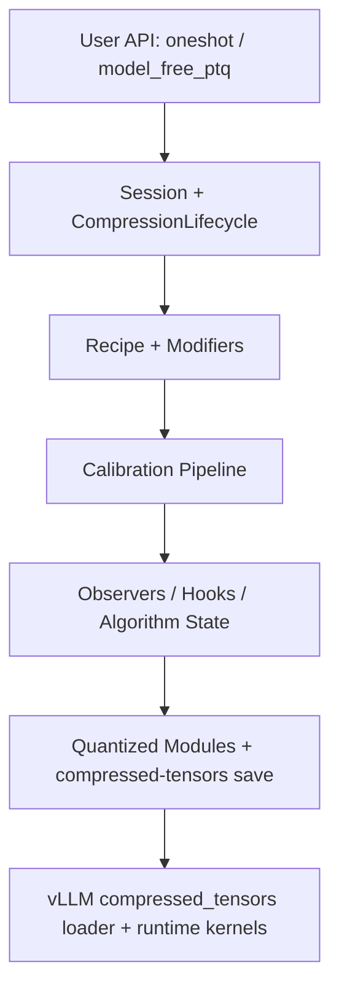
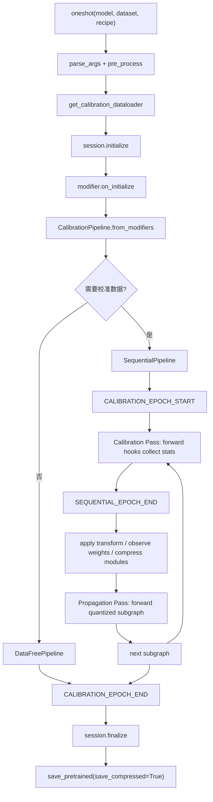
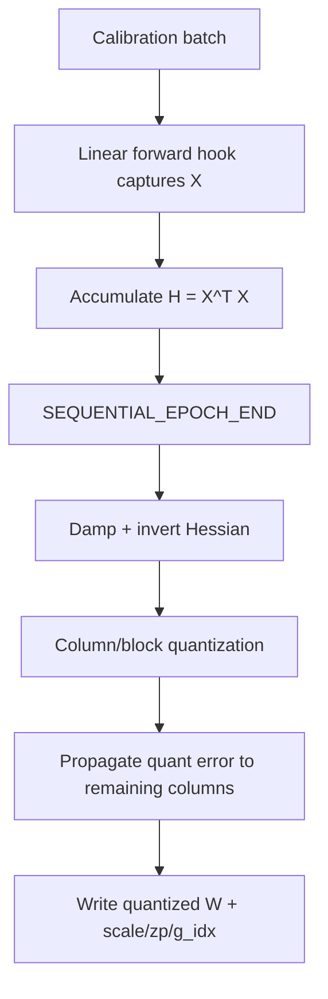
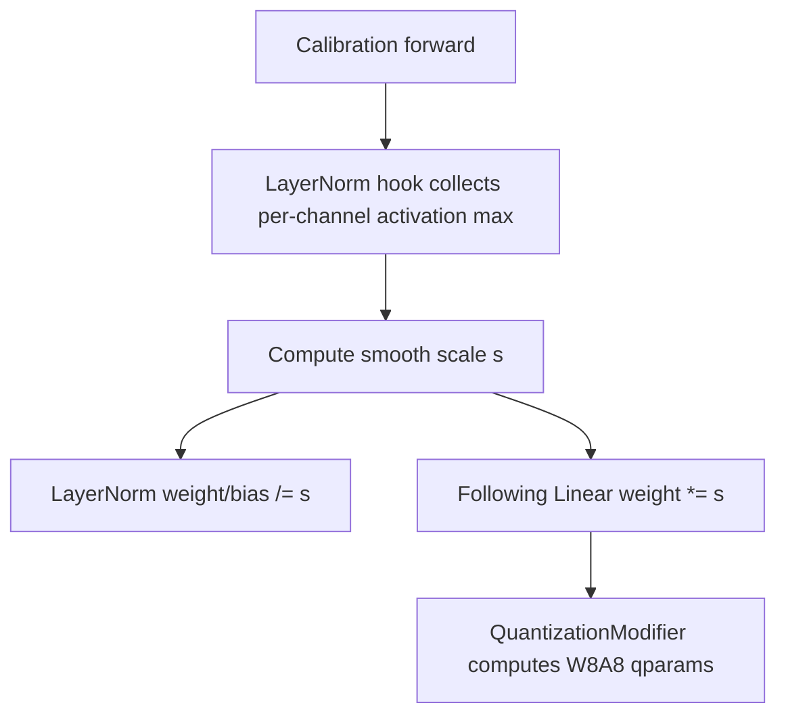
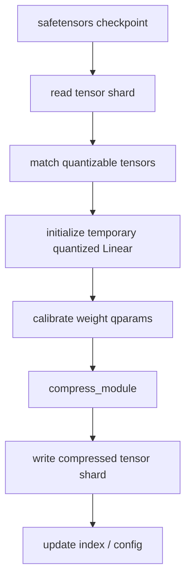
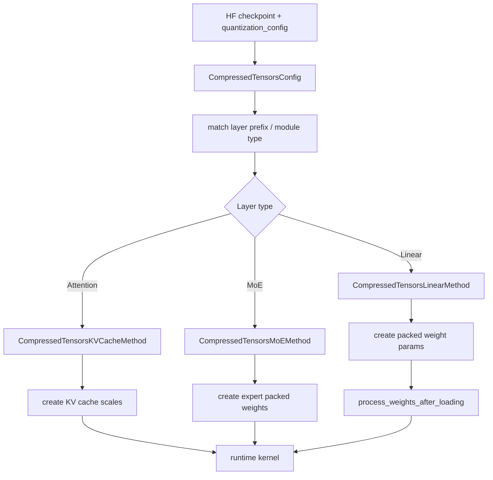

---
tags:
  - LLMInference
  - Quantization
---

# LLM Compressor 量化原理、架构与算法执行流程

本文整理 `llm-compressor` 的量化体系：它如何把不同 PTQ / GPTQ / AWQ / SmoothQuant / AutoRound / FP8 / FP4 / KV cache quant 算法封装成 `Modifier`，如何通过 event 和 hook 在校准前向中收集统计量，如何逐层压缩模型，最后如何保存成 vLLM 可加载的 `compressed-tensors` checkpoint。

整体阅读顺序：

1. 先理解量化的基础公式和粒度。
2. 再看 `llm-compressor` 的整体架构、pipeline、event 和 hook。
3. 然后看每个 `Modifier` 的作用。
4. 最后逐个看算法的公式、伪代码和执行数据流。

## 1. llm-compressor 是什么

`llm-compressor` 是面向 LLM 部署的离线压缩工具链。它不是推理框架，而是在 HuggingFace 模型上线到 vLLM 之前，完成量化、校准、权重打包和 metadata 写入。

典型输入：

- HuggingFace `PreTrainedModel` 或 safetensors checkpoint。
- recipe，描述使用哪些 `Modifier` 和量化 scheme。
- 可选 calibration dataset。

典型输出：

- compressed-tensors 格式的 safetensors。
- `config.json` 中的 `quantization_config`。
- tokenizer / processor。
- 可被 vLLM 根据 `quantization_config` 选择对应 kernel 加载。

`llm-compressor` 的核心价值是：用统一 recipe 和 `Modifier` 生命周期封装不同量化算法，把算法结果落成推理框架能消费的 checkpoint 格式。

## 2. 支持的量化方向

| 方向 | 常见 scheme | 常见算法 | 主要收益 |
|---|---|---|---|
| Weight-only | W4A16, W8A16 | RTN, GPTQ, AWQ, AutoRound | 权重显存和 checkpoint 体积下降 |
| Weight + activation | W8A8 INT8, FP8_DYNAMIC, FP8_BLOCK | RTN, GPTQ, SmoothQuant, AWQ | batch serving / prefill GEMM 更容易加速 |
| Microscale FP4/FP8 | NVFP4, MXFP4, MXFP8 | RTN, AutoRound, calibration | Blackwell / MX 格式低比特 kernel |
| KV cache | FP8, per-head FP8 | QuantizationModifier | 长上下文 KV cache 显存下降 |
| 旋转/变换 | QuIP, SpinQuant, QuaRot 类 | transform + quantization | 降低 outlier，支持更激进低比特 |
| Model-free PTQ | FP8_BLOCK 等 data-free scheme | RTN / weight observer | 不完整加载模型，直接处理 safetensors |

## 3. 量化基础公式

### 3.1 均匀整数量化

对浮点 tensor `x`，给定整数范围：

```text
q_min = -2^(b-1), q_max = 2^(b-1)-1     # signed symmetric
q_min = 0,        q_max = 2^b-1          # unsigned/asymmetric
```

非对称量化：

```text
scale = (x_max - x_min) / (q_max - q_min)
zero_point = round(q_min - x_min / scale)
zero_point = clamp(zero_point, q_min, q_max)

q = clamp(round(x / scale) + zero_point, q_min, q_max)
x_hat = scale * (q - zero_point)
```

对称量化：

```text
absmax = max(abs(x))
scale = absmax / q_max

q = clamp(round(x / scale), q_min, q_max)
x_hat = scale * q
```

误差来自两类：

- clipping error：量化范围没有覆盖原始值。
- rounding error：浮点值投影到离散网格。

### 3.2 浮点低比特量化

FP8 / FP4 通常不是整数网格，而是先缩放，再投影到低比特浮点可表示集合：

```text
F_b = low-bit floating point representable set
q = cast_to_F_b(x / scale)
x_hat = scale * q
```

常见 FP8：

- E4M3：指数 4 bit，尾数 3 bit，精度更高，范围较小。
- E5M2：指数 5 bit，尾数 2 bit，范围更大，精度较低。

NVFP4 / MXFP4 会配合更细粒度的 local scale，弥补 4 bit 浮点表达能力不足。

### 3.3 Linear 层量化计算

原始 Linear：

```text
Y = X W^T + b
```

weight-only：

```text
W_hat = S_w * (W_q - Z_w)
Y = X W_hat^T + b
```

weight + activation：

```text
X_hat = S_x * (X_q - Z_x)
W_hat = S_w * (W_q - Z_w)

Y ~= X_hat W_hat^T
   = S_x S_w (X_q - Z_x)(W_q - Z_w)^T
```

对称量化时：

```text
Y ~= S_x S_w (X_q W_q^T)
```

推理 kernel 通常不会物化完整 `W_hat` 或 `X_hat`，而是在 tile 内 load、dequant、matmul，并在 epilogue 完成 rescale、bias、activation。

## 4. 量化粒度

observer 会先把 tensor reshape 成便于统计的形状：

```text
(num_observations, *qparam_shape, group_size)
```

然后在最后一维或指定 block 上统计 min/max、MSE 或加权误差。

### 4.1 Per-tensor

整层共享一个 scale：

```text
scale shape = [1]
W_hat = scale * W_q
```

scale 开销最小，但最容易被 outlier 影响。

### 4.2 Per-channel

权重按输出通道独立 scale：

```text
W shape = [out_features, in_features]
scale shape = [out_features, 1]

W_hat[i, j] = scale[i] * W_q[i, j]
```

权重量化常用，精度通常明显好于 per-tensor。

### 4.3 Per-group

权重沿输入维分组：

```text
g = floor(j / group_size)
scale shape = [out_features, in_features / group_size]

W_hat[i, j] = scale[i, g] * W_q[i, j]
```

W4A16 常用 `group_size=128`。group 越小，精度越好，metadata 越多。

### 4.4 Per-block

二维 block 共享 scale，例如 128x128：

```text
block_row = floor(i / block_h)
block_col = floor(j / block_w)
W_hat[i, j] = scale[block_row, block_col] * W_q[i, j]
```

FP8_BLOCK 常用。它和 kernel tile 更匹配，但不一定比 per-channel 更准。

### 4.5 Per-token / dynamic activation

activation 按 token 动态计算 scale：

```text
X shape = [batch, seq, hidden]
scale shape = [batch, seq, 1]

X_hat[b, t, h] = scale[b, t] * X_q[b, t, h]
```

优点是不依赖静态 activation calibration；代价是 runtime 要计算 scale。

### 4.6 Per-head KV cache

KV cache 形状通常是：

```text
K/V shape = [batch, num_heads, seq, head_dim]
```

per-tensor：

```text
scale shape = [1]
```

per-head：

```text
scale shape = [num_heads]
```

per-head 通常比 per-tensor 更稳，但 metadata 更多。

## 5. 整体架构

`llm-compressor` 可以抽象成五层：



关键组件：

| 层级 | 组件 | 作用 |
|---|---|---|
| 入口 | `oneshot()` | 解析参数、准备数据、初始化 session、运行 pipeline、保存模型 |
| 生命周期 | `CompressionLifecycle` | 统一分发 initialize / event / finalize |
| 算法封装 | `Modifier` | 每种压缩算法的生命周期、hook、统计量和权重改写 |
| Pipeline | `SequentialPipeline`, `DataFreePipeline` | 决定是否逐层校准、是否需要 dataloader |
| Observer | MinMax, MSE, IMatrix | 收集统计量并计算 qparams |
| 保存 | compressed-tensors utils | 保存 packed weight、scale、zero_point、quantization_config |
| 推理 | vLLM compressed_tensors | 根据 scheme 创建参数并选择 kernel |

## 6. 一次 oneshot 的执行流程

典型调用：

```python
from llmcompressor import oneshot
from llmcompressor.modifiers.quantization import QuantizationModifier

recipe = QuantizationModifier(
    targets="Linear",
    scheme="FP8_DYNAMIC",
    ignore=["lm_head"],
)

oneshot(
    model=model,
    dataset=dataset,
    recipe=recipe,
    num_calibration_samples=512,
    max_seq_length=2048,
    output_dir="model-fp8",
)
```

整体流程：



### 6.1 预处理

`Oneshot.__init__()` 会：

- 解析 `model_args`、`dataset_args`、`recipe_args`。
- 加载或接收已传入的 `PreTrainedModel`。
- 加载 tokenizer / processor。
- patch `save_pretrained`，使其支持 compressed-tensors。

### 6.2 初始化 Modifier

`session.initialize()` 会对 recipe 中每个 `Modifier` 调用：

```text
modifier.initialize(state)
  -> modifier.on_initialize(state)
```

常见行为：

- `QuantizationModifier`：给目标 Linear 附加 `quantization_scheme`，注册或准备 observer。
- `GPTQModifier`：初始化 Hessian 相关状态，准备量化配置。
- `SmoothQuantModifier`：解析模型结构 mapping，准备保存 activation min/max。
- `AWQModifier`：解析 balance/smooth layer mapping，准备 activation 统计。
- `AutoRoundModifier`：准备逐 block 优化参数。

### 6.3 选择 Pipeline

粗略规则：

- data-free scheme：走 `DataFreePipeline`，只处理权重。
- 需要 activation / Hessian / output reconstruction 的算法：走 `SequentialPipeline`。
- `IndependentPipeline` 在很多路径里是 sequential 的别名或兼容入口。

### 6.4 SequentialPipeline 的核心

Sequential pipeline 会按 decoder layer 或可追踪 subgraph 逐块处理：

```text
for subgraph in traced_subgraphs:
    1. onload 当前 subgraph
    2. 用 cached activations 跑 calibration pass
    3. 触发 SEQUENTIAL_EPOCH_END，让 modifier 处理当前 subgraph
    4. 用量化后的 subgraph 跑 propagation pass
    5. 把量化误差后的输出写回 activation cache
    6. offload / 释放不再需要的中间激活
```

这样一次只压缩当前层，避免全模型同时持有 Hessian、activation 和临时权重。

## 7. 校准前向上下文

校准时通常包在一组 context 中：

| context | 作用 |
|---|---|
| `torch.no_grad()` | 禁用梯度，降低显存 |
| `disable_cache(model)` | 关闭 `config.use_cache`，校准 prefill 不需要 KV cache |
| `eval_context(model)` | 关闭 dropout 等训练行为 |
| `disable_hf_kernels(model)` | 避免 HF 自定义 kernel 绕过 PyTorch hooks |
| `disable_lm_head(model)` | 避免 vocab size 巨大矩阵乘造成 OOM |
| `DisableQuantization(model)` | 校准统计时先用原始精度 activation |

`DisableQuantization` 很关键：`on_initialize` 可能已经改写了 module forward，但校准统计需要基于原始精度输入。否则 observer、Hessian 和 smoothing scale 会看到已经量化污染过的激活。

## 8. Activation cache 和误差传播

Sequential pipeline 的关键优化是 `IntermediatesCache`：

```text
原始 dataloader batch
  -> offload 到 CPU pinned memory
  -> 当前 subgraph 需要时 fetch 到 GPU
  -> 当前 subgraph forward
  -> update 成下一层输入
  -> delete 已消费激活
```

如果 `propagate_error=False`，下一层看到的是原始精度前向输出。

如果 `propagate_error=True`，当前层压缩后会再跑一次 propagation pass：

```python
with HooksMixin.disable_hooks():
    for inputs in batches:
        outputs = subgraph.forward(model, **inputs)  # quantized weights enabled
        activations.update(batch_idx, outputs)
        activations.delete(batch_idx, consumed_names)
```

意义：

- Calibration Pass 用原始精度，适合收集当前层统计。
- Propagation Pass 用量化后权重，把当前层误差传给下一层。
- 下一层校准时看到的输入更接近真实推理分布。

## 9. Event 机制

`llm-compressor` 有两层 hook / event：

1. `Modifier` 生命周期方法：普通 Python 方法，由 lifecycle 显式调用。
2. PyTorch module hook：`register_forward_hook` / `register_forward_pre_hook`，在 module forward 时自动触发。

### 9.1 EventType

事件分三类：

| 类别 | 事件 |
|---|---|
| 生命周期 | `INITIALIZE`, `FINALIZE` |
| batch 训练事件 | `BATCH_START`, `LOSS_CALCULATED`, `OPTIM_PRE_STEP`, `OPTIM_POST_STEP`, `BATCH_END` |
| 校准事件 | `CALIBRATION_EPOCH_START`, `SEQUENTIAL_EPOCH_END`, `CALIBRATION_EPOCH_END` |

校准量化主要用后三个：

```text
CALIBRATION_EPOCH_START
  -> modifier.on_start
  -> 注册 PyTorch hooks / 开始校准

SEQUENTIAL_EPOCH_END
  -> 对当前 subgraph 处理统计量
  -> transform / update qparams / compress weights

CALIBRATION_EPOCH_END
  -> modifier.on_end
  -> 移除 hooks / freeze quantization
```

### 9.2 CompressionLifecycle.event

事件分发中心：

```python
def event(event_type, **kwargs):
    validate_order_if_batch_event(event_type)
    event = Event(type_=event_type)
    for modifier in recipe.modifiers:
        modifier.update_event(state, event, **kwargs)
```

### 9.3 Modifier.update_event

通用分发逻辑：

```python
def update_event(state, event, **kwargs):
    self.on_event(state, event, **kwargs)

    if event.type_ == BATCH_START and not self.started_ and self.should_start(event):
        self.on_start(state, event, **kwargs)
        self.started_ = True
        self.on_update(state, event, **kwargs)
        return

    if event.type_ == BATCH_END and not self.ended_ and self.should_end(event):
        self.on_end(state, event, **kwargs)
        self.ended_ = True
        self.on_update(state, event, **kwargs)
        return

    if self.started_ and not self.ended_:
        self.on_update(state, event, **kwargs)
```

很多 PTQ modifier 不依赖 batch start/end，而是在 `on_event()` 中手动处理校准事件：

```python
def on_event(state, event, **kwargs):
    if event.type_ == CALIBRATION_EPOCH_START and not self.started_:
        self.on_start(state, None)

    if event.type_ == SEQUENTIAL_EPOCH_END:
        self.process_current_subgraph(kwargs["modules"])

    if event.type_ == CALIBRATION_EPOCH_END and not self.ended_:
        self.on_end(state, None)
```

这就是为什么 GPTQ、Quantization、SmoothQuant 这类 modifier 常常看起来“绕过”了 `should_start()`：它们的核心生命周期是 calibration event，而不是训练 batch event。

## 10. PyTorch hook 机制

### 10.1 QuantizationModifier hooks

`QuantizationModifier` 通过 `QuantizationMixin` 管理 observer hooks：

| 注册时机 | Hook 类型 | 目标 | Hook 函数 | 作用 |
|---|---|---|---|---|
| `on_start` | `forward_pre` | Linear | `calibrate_input_hook` | 收集输入 activation |
| `on_start` | `forward` | Linear | `calibrate_output_hook` | 收集输出 activation |
| `on_start` | custom query | attention | `calibrate_query_hook` | KV cache / attention 相关统计 |
| `on_start` | custom key | attention | `calibrate_key_hook` | K cache 统计 |
| `on_start` | custom value | attention | `calibrate_value_hook` | V cache 统计 |

### 10.2 GPTQ hooks

| 注册时机 | Hook 类型 | 目标 | Hook 函数 | 作用 |
|---|---|---|---|---|
| `on_start` | `forward` | 有 weight quant scheme 的 Linear | `calibrate_module` | 从 `args[0]` 取输入并累积 Hessian |
| `on_start` | `forward_pre` / `forward` | Linear | activation observer | W8A8 等场景同时统计 activation |

GPTQ 的核心统计：

```text
H += 2 * X^T X
```

### 10.3 SmoothQuant hooks

| 注册时机 | Hook 类型 | 目标 | Hook 函数 | 作用 |
|---|---|---|---|---|
| `on_start` | `forward` | LayerNorm / RMSNorm 等 smooth 层 | `hook_fn` | 收集输出 activation 的 per-channel min/max |

### 10.4 全局禁用 hooks

`HooksMixin.disable_hooks()` 会让通过 mixin 注册的 hook 包装函数直接 return：

```python
with HooksMixin.disable_hooks():
    subgraph.forward(...)
```

主要用于 propagation pass，避免二次 forward 又污染 calibration 统计。

## 11. Modifier 总表

| Modifier | 类型 | 是否需要 calibration | 主要作用 | 典型组合 |
|---|---|---:|---|---|
| `QuantizationModifier` | 通用 PTQ / RTN | 视 scheme 而定 | 绑定量化 scheme、observer、计算 qparams、压缩权重 | FP8_DYNAMIC, FP8_BLOCK, W8A8, KV cache |
| `GPTQModifier` | 二阶 weight quant | 是 | 收集 Hessian，逐列/逐 block 量化并做误差补偿 | W4A16, W8A8 |
| `AWQModifier` | transform modifier | 是 | 搜索 activation-aware channel scale，改写权重分布 | AWQ + QuantizationModifier |
| `SmoothQuantModifier` | transform modifier | 是 | 把 activation outlier 转移到 weight，服务 W8A8 | SmoothQuant + Quantization/GPTQ |
| `AutoRoundModifier` | optimization modifier | 是 | 优化 rounding / clipping 参数，重构 block 输出 | INT4, FP4, sub-4-bit |
| `IMatrixGatherer` | observer / gatherer | 是 | 收集输入通道重要性 | IMatrix + GPTQ/MSE |
| `QuIPModifier` | rotation transform | 通常是 | 正交旋转降低 outlier / incoherence | QuIP + quantization |
| `SpinQuantModifier` | rotation transform | 通常是 | 学习或应用旋转矩阵 | SpinQuant + quantization |
| `QuantizationModifier.kv_cache_scheme` | KV cache quant | 是或静态配置 | 给 K/V cache 统计或保存 scale | FP8 KV cache |

一个经验判断：

- `QuantizationModifier` 负责“真正把 tensor 量化并保存”。
- `SmoothQuant` / `AWQ` / `QuIP` / `SpinQuant` 多数是“量化前重参数化或变换”。
- `GPTQ` 和 `AutoRound` 是“带优化目标的量化器”，不仅仅计算 min/max。

## 12. Observer 与 qparams

Observer 做两件事：

1. `observe(x)`：收集统计量。
2. `compute()`：把统计量变成 `scale / zero_point / global_scale`。

### 12.1 MinMax observer

```text
min_vals = min(observed, dim=(0, -1))
max_vals = max(observed, dim=(0, -1))

scale, zero_point = calculate_qparams(min_vals, max_vals, quant_args)
```

伪代码：

```python
class MinMaxObserver:
    def observe(self, x):
        x = flatten_for_calibration(x, strategy)
        self.min = minimum(self.min, x.min(dim=reduce_dims))
        self.max = maximum(self.max, x.max(dim=reduce_dims))

    def compute_qparams(self):
        return calculate_qparams(self.min, self.max, quant_args)
```

### 12.2 MSE observer

MSE observer 会尝试缩小 min/max 范围，牺牲少量 clipping 换更低整体误差：

```text
candidate_min = p * min_val
candidate_max = p * max_val
p = 1 - i / grid

(min*, max*) = argmin sum(|Q(x; candidate_min, candidate_max) - x|^norm)
```

伪代码：

```python
best_err = inf
for i in range(grid):
    p = 1 - i / grid
    cand_min = p * min_val
    cand_max = p * max_val
    scale, zp = calculate_qparams(cand_min, cand_max)
    x_hat = dequantize(quantize(x, scale, zp), scale, zp)
    err = lp_error(x, x_hat, norm)
    if err < best_err:
        best = (scale, zp)
return best
```

### 12.3 IMatrix observer

IMatrix 给输入通道加重要性权重：

```text
importance_j = E[x_j^2]

loss = sum_{i,j} importance_j * |Q(W_ij) - W_ij|^p
```

直觉：输入通道 `j` 的激活越大，`W[:, j]` 的误差越容易放大到输出。

## 13. RTN / Simple PTQ

### 封装方式

RTN 主要由 `QuantizationModifier` 完成：

```python
QuantizationModifier(
    targets="Linear",
    scheme="FP8_DYNAMIC",
    ignore=["lm_head"],
)
```

它负责：

- 根据 `targets` 找到模块。
- 给模块附加 `quantization_scheme`。
- 对权重 observer 计算 qparams。
- 调用 compress / pack，把权重和 scale 写成 compressed-tensors。
- 如有 activation scheme，则注册 activation observer 或标记 dynamic quant。

### 核心公式

```text
q = round(x / scale)
x_hat = scale * q
```

### 伪代码

```python
for module in target_modules:
    W = module.weight
    min_val, max_val = observer.observe(W)
    scale, zp = calculate_qparams(min_val, max_val, scheme.weights)
    W_q = quantize(W, scale, zp)
    module.weight = pack_or_cast(W_q)
    module.weight_scale = scale
    module.weight_zero_point = zp
```

### 特点

- 速度快，适合 FP8 / FP8_BLOCK / MXFP 这类不需要复杂校准的场景。
- INT4 W4A16 上通常弱于 GPTQ/AWQ/AutoRound。

## 14. GPTQ

GPTQ 是二阶近似的 post-training weight quantization。

### 封装方式

`GPTQModifier` 是一个带 Hessian 统计和误差补偿的量化 modifier：

```python
from llmcompressor.modifiers.gptq import GPTQModifier

recipe = GPTQModifier(
    targets="Linear",
    scheme="W4A16",
    ignore=["lm_head"],
)
```

执行中：

1. `on_initialize` 绑定量化 scheme。
2. `on_start` 给 Linear 注册 forward hook。
3. Calibration Pass 中 hook 收集输入 `X` 并累积 Hessian。
4. `SEQUENTIAL_EPOCH_END` 对当前 subgraph 的 Linear 做 GPTQ 压缩。
5. `on_end` 移除 hooks。

### 优化目标

原始目标：

```text
min_{W_hat} ||X W^T - X W_hat^T||_2^2
```

令 `E = W - W_hat`，`H = X^T X`：

```text
loss ~= tr(E H E^T)
```

### Hessian 收集

```text
H = sum X^T X
H = H / num_samples
```

实际实现常见写法：

```text
H += 2 * X^T X
```

### GPTQ 量化公式

先 damping：

```text
H_damped = H + lambda * mean(diag(H)) * I
```

求逆相关矩阵：

```text
H_inv = chol(cholesky_inverse(chol(H_damped)))
```

逐列处理：

```text
w_i = W[:, i]
q_i = Quant(w_i)
d_i = H_inv[i, i]

err_i = (w_i - q_i) / d_i
W[:, i:] = W[:, i:] - err_i * H_inv[i, i:]
```

### 伪代码

```python
def gptq_quantize(W, H, quantizer, block_size):
    H = damp(H)
    H_inv = cholesky_inverse_factor(H)

    for block_start in range(0, W.num_cols, block_size):
        block_end = min(block_start + block_size, W.num_cols)
        block_errors = []

        for i in range(block_start, block_end):
            w = W[:, i]
            q = quantizer.quantize(w)
            W[:, i] = q

            err = (w - q) / H_inv[i, i]
            block_errors.append(err)

            W[:, i:block_end] -= outer(err, H_inv[i, i:block_end])

        W[:, block_end:] -= block_errors @ H_inv[block_start:block_end, block_end:]

    return W
```

### ActOrder

按输入重要性重排列：

```text
importance_j = H[j, j]
perm = argsort(importance, descending=True)
W = W[:, perm]
H = H[perm, :][:, perm]
```

先量化重要列，通常降低误差。

### 数据流



## 15. AWQ

AWQ 的核心是 activation-aware scaling。它不是直接输出 int4，而是先做一个浮点等价变换，把 activation outlier 对后续权重量化的破坏转移到可控的权重缩放里，让后面的 `QuantizationModifier` 更容易得到低误差的 W4A16 checkpoint。

源码主线在：

| 文件 | 作用 |
|---|---|
| `src/llmcompressor/modifiers/transform/awq/base.py` | `AWQModifier` 主实现：event、hook、scale 搜索、改权重 |
| `src/llmcompressor/modifiers/transform/awq/mappings.py` | 不同模型结构的 smooth layer / balance layer 映射 |
| `src/llmcompressor/modifiers/awq/__init__.py` | 旧 import 路径的兼容 shim，会把一个 AWQ 配置拆成 AWQ transform + QuantizationModifier |
| `src/llmcompressor/modifiers/quantization/quantization/base.py` | AWQ 之后真正计算 qparams 的 `QuantizationModifier` |
| `src/llmcompressor/transformers/compression/compressed_tensors_utils.py` | `save_pretrained(save_compressed=True)` 的保存封装 |

### 封装方式

AWQ 必须与后续量化 modifier 配合。直接使用 transform 版本时，recipe 通常写成：

```python
from llmcompressor.modifiers.transform.awq import AWQModifier
from llmcompressor.modifiers.quantization import QuantizationModifier

recipe = [
    AWQModifier(duo_scaling="both"),
    QuantizationModifier(
        targets=["Linear"],
        scheme="W4A16_ASYM",
        ignore=["lm_head"],
    ),
]
```

旧路径 `from llmcompressor.modifiers.awq import AWQModifier` 是兼容 shim：它会按参数名拆成两个 modifier：

```text
AWQModifier(...)  # old shim
  -> AWQTransformModifier(**awq_kwargs)
  -> QuantizationModifier(**quant_kwargs)
```

`recipe.py` 还会校验：如果 recipe 中出现 transform 版 `AWQModifier`，它后面必须还有继承 `QuantizationMixin` 的 modifier，否则报错。原因是 AWQ 只改写浮点权重分布，不负责最终 pack int4 / scale / zero_point。

### 15.1 AWQ mapping：谁被除 scale，谁被乘 scale

AWQ 不是对任意相邻层盲目平滑，而是用 `AWQMapping` 描述一组结构关系：

```python
AWQMapping(
    smooth_layer="re:.*input_layernorm$",
    balance_layers=["re:.*q_proj$", "re:.*k_proj$", "re:.*v_proj$"],
)
```

含义：

- `smooth_layer`：产生要被平滑的 activation 的层，常见是 LayerNorm / RMSNorm，也可以是 `v_proj`、`up_proj` 这类 Linear。
- `balance_layers`：消费这份 activation 的后继权重层。AWQ 会把这些层的输入通道权重乘上同一个 scale。
- `activation_hook_target`：少数并行 block / MoE 场景下，默认 hook `balance_layers[0]` 不一定能看到完整输入，可以指定 parent 内部的另一个子模块来收集 activation。

默认 Llama / Qwen 类 mapping 大致是：

```text
input_layernorm           -> q_proj, k_proj, v_proj
v_proj                    -> o_proj
post_attention_layernorm  -> gate_proj, up_proj
up_proj                   -> down_proj
```

`_set_resolved_mappings()` 会把 regex 解析成 `ResolvedMapping`：

```text
smooth_name, smooth_layer
balance_names, balance_layers
parent_name, parent
activation_hook_target
```

其中 `parent` 是这些 balance layers 的最低公共祖先。AWQ 后面会重新 forward 这个 parent block 来比较 “原始输出” 和 “临时量化后的输出”。

### 等价变换

原始 Linear：

```text
Y = X W^T
```

插入 channel scale `s`：

```text
Y = (X / s) (W * s)^T
```

未量化时完全等价，因为：

```text
(X / s)_j * (W * s)_{i,j} = X_j * W_{i,j}
```

量化后：

```text
Y_hat = (X / s) Q(W * s)^T
```

AWQ 搜索：

```text
s* = argmin_s || (X / s) Q(W * s)^T - X W^T ||_2^2
```

在 `llm-compressor` 的实现里，`X / s` 不一定显式写成一个 runtime 节点。最终落模型时，它通过改前一层参数实现：

```text
smooth_layer.weight /= s
smooth_layer.bias   /= s
balance_layer.weight *= s
```

因此浮点模型函数近似不变，但 `balance_layer.weight` 的通道分布变了，后续权重量化误差下降。

### 15.2 完整 event 时间线

AWQ 主要响应四个生命周期点：

| 时机 | 触发位置 | AWQ 做什么 | 作用 |
|---|---|---|---|
| `on_initialize` | `session.initialize()` | 如果用户没给 `mappings`，调用 `get_layer_mappings_from_model(state.model)` 推断；设置 `offload_device` 默认值 | 只准备结构配置，此时后续量化 scheme 还没完全应用 |
| `CALIBRATION_EPOCH_START` | `SequentialPipeline` / `BasicPipeline` 进入校准前 | 如果还没 start，调用 `on_start()` | 解析 mapping、校验量化策略、注册 hooks |
| `SEQUENTIAL_EPOCH_END` | 每个 traced subgraph 校准 forward 结束后 | 调用 `_apply_smoothing(state.model)` | 用当前 subgraph 收集到的 activation 搜 scale 并改权重 |
| `CALIBRATION_EPOCH_END` | 全部校准结束 | 调用 `on_end()` | 检查 activation 都被消费，移除 hooks |
| `on_finalize` | `session.finalize()` | 记录 error metrics，清空 cache / mapping / stats | 释放状态，避免污染后续 run |

Sequential pipeline 中的顺序尤其重要：

```text
LifecycleCallbacks.calibration_epoch_start()

for subgraph in subgraphs:
    with DisableQuantization(model):
        forward calibration batches
        # AWQ hooks 在这里收集 parent kwargs 和 activation stats

    LifecycleCallbacks.sequential_epoch_end(modules)
        -> AWQModifier._apply_smoothing()
        -> QuantizationModifier.observe(weight)
        -> QuantizationModifier.update_qparams(input/output/weight)

    if propagate_error:
        with HooksMixin.disable_hooks():
            forward quantized subgraph
            update activation cache for next subgraph

LifecycleCallbacks.calibration_epoch_end()
```

`DisableQuantization(model)` 保证校准 pass 中看到的是原始浮点 activation；`HooksMixin.disable_hooks()` 保证 AWQ 自己为了评估候选 scale 做的 parent forward 不会反复污染统计量。

### 15.3 on_start：解析 mapping、校验、注册 hooks

`on_start()` 做三件事。

第一，调用 `_set_resolved_mappings(model)`：

```text
AWQMapping(regex strings)
  -> match_modules_set(...)
  -> smooth_layer + balance_layers
  -> lowest common ancestor parent
  -> ResolvedMapping(...)
```

如果某个 mapping 没有匹配到 balance layer，或匹配到的层没有被量化配置 target 到，会跳过并 warning。`v_proj -> o_proj` 这类 shape 不兼容场景也会跳过。

第二，校验 `duo_scaling`。当 `duo_scaling != False` 时，AWQ 需要按通道 / group / block 统计权重重要性；如果目标权重是 per-tensor quantization，代码会报错，提示改成 per-channel / group，或关闭 duo scaling。

第三，调用 `_setup_activation_cache_hooks()` 注册两类 hook：

| hook | 注册到哪里 | hook 类型 | 保存什么 |
|---|---|---|---|
| `cache_parent_kwargs_hook` | `mapping.parent` | `forward_pre`，`with_kwargs=True` | 当前 parent forward 所需的 args / kwargs，后面 `_run_samples(parent)` 会复用 |
| `cache_smooth_activations_hook` | `mapping.activation_hook_target` 或 `mapping.balance_layers[0]` | `forward` | 输入 activation 的 abs 均值统计，按 hidden channel 累加 sum/count |

activation hook 的核心逻辑：

```text
activations = args[0].abs().detach()
masked_activations = activations.flatten(0, -2)
x_sum += masked_activations.float().sum(dim=0).cpu()
count += masked_activations.size(0)
```

如果 dataset 开启 `use_loss_mask`，它会从 `state.loss_masks[state.current_batch_idx]` 取 mask，只统计参与 loss 的 token。这对 instruction/chat 校准很有用，因为 prompt token 和 answer token 的重要性可能不同。

### 15.4 SEQUENTIAL_EPOCH_END：AWQ 真正做事的地方

每个 subgraph 校准 forward 结束后，pipeline 触发：

```python
LifecycleCallbacks.sequential_epoch_end(modules)
```

AWQ 收到 `EventType.SEQUENTIAL_EPOCH_END` 后调用 `_apply_smoothing(model)`。流程是：

```text
for mapping in _resolved_mappings:
    if mapping.smooth_name not in _smooth_activation_stats:
        continue

    align_modules(parent, smooth_layer, balance_layers)
    with calibration_forward_context(model), HooksMixin.disable_hooks():
        fp16_outputs = _run_samples(parent)
        orig_layer_weights = {layer: layer.weight.clone()}
        best_scales = _compute_best_scale(mapping, fp16_outputs, orig_layer_weights)

        for balance_layer:
            balance_layer.weight = orig_weight * best_scales.view(1, -1)

        smooth_layer.weight /= best_scales
        smooth_layer.bias   /= best_scales

    del _smooth_activation_stats[mapping.smooth_name]
```

这里的 `fp16_outputs` 是 parent block 在原始权重下的输出，作为重构目标。`orig_layer_weights` 用于 grid search 中反复恢复并临时缩放权重。

### 15.5 如何搜索 scale

`_compute_best_scale()` 先拿 activation 统计：

```text
x_sum, count = _smooth_activation_stats[mapping.smooth_name]
x_mean = x_sum / count
```

分布式时会对 `x_sum` 和 `count` 做 all-reduce，保证所有 rank 搜到同一组 scale。

常用统计：

```text
x_mean_j = mean(abs(X_j))
w_mean_j = mean(normalized_abs(W[:, j]))
```

如果 `duo_scaling` 开启，再调用 `_compute_layer_means(balance_layers)` 得到 `w_mean`。这一步会尊重量化粒度：

```text
TENSOR       -> chunk_size = weight.numel()
CHANNEL      -> chunk_size = weight.size(1)
GROUP        -> chunk_size = group_size
TENSOR_GROUP -> chunk_size = group_size
BLOCK        -> chunk_size = block_h * block_w
```

每个 chunk 内先做：

```text
abs(weight) / (amax(abs(weight)) + 1e-6)
```

再还原到原始 `[out_features, in_features]` 形状，对输出通道求平均，得到每个输入通道的平均归一化权重幅度。

候选 scale 的公式：

```text
duo_scaling=False:
    s_j = x_mean_j ^ r

duo_scaling=True:
    s_j = x_mean_j ^ r / (w_mean_j ^ (1-r) + 1e-4)

s_j = clamp(s_j, min=1e-4)
s = s / sqrt(max(s) * min(s))
inf / nan -> 1
```

`_get_grid_search_params()` 控制 `r` 怎么扫：

| `duo_scaling` | grid |
|---|---|
| `False` | `r = grid_idx / (n_grid - 1)`，全部不用 `w_mean` |
| `True` | 显式加入 `(0.0, False)` 作为接近 identity 的 baseline，其余点用 duo scaling |
| `"both"` | 一半 grid 不用 duo scaling，一半 grid 用 duo scaling |

默认 `n_grid=20`，所以 AWQ 会对每个 mapping 做最多 20 次 parent block forward。

### 15.6 每个候选 scale 如何算误差

在 grid search 内，AWQ 会临时把 balance layer 权重改成 `W * s`，再用后续量化配置的 weight observer 计算 qparams，然后 fake quant。为了降低搜索时的内存占用，它会在搜索期间把这些 balance layer 的 `weight_observer` patch 成 `memoryless_minmax`，并调用 `fuse_weight_observers(mapping.parent)`，让 fused group 共享 observer 关系仍然成立。

```text
1. balance_layer.weight = orig_weight * s
2. observe(balance_layers_to_patch, "weight")
3. update_qparams(balance_layers_to_patch, "weight", only_update_onload=True)
4. balance_layer.weight = forward_quantize(weight, "weight", w_qscheme) / s
5. int_w_outputs = _run_samples(mapping.parent)
6. loss = mse(fp16_outputs, int_w_outputs)
```

第 4 步容易误读。数学目标是：

```text
Q(W * s) @ (X / s)
```

代码中 parent 的输入 activation 没有真的除以 `s`，所以它把临时权重写成：

```text
forward_quantize(W * s) / s
```

这样用原始 `X` forward 时，等价评估的是：

```text
X @ (Q(W * s) / s)^T
```

这和 `Q(W * s) @ (X / s)` 是同一个重构目标，只是把除法融合到了权重侧，方便复用原 parent forward。

误差由 `_compute_loss()` 计算：

```text
loss = sum(mse(fp16_batch, int_w_batch, reduction="sum")) / num_elements
```

如果有 `loss_mask`，只在 masked token 上算 MSE；分布式时会 all-reduce `loss` 和 `num_elements`。搜索过程中记录：

```text
initial_error = 第一个候选的 loss
best_error    = 当前最小 loss
best_ratio    = 当前最优 r
best_scales   = 当前最优 scale
```

最后保存一条 debug metric：

```text
{
  "layer_name": mapping.smooth_name,
  "parent_name": mapping.parent_name,
  "initial_error": initial_error,
  "best_error": best_error,
  "reduction": best_error / initial_error,
}
```

### 15.7 如何改变权重

搜索结束后，`_apply_smoothing()` 把最优 scale 永久写回模型参数。

对 balance layers：

```python
balance_layer.weight = orig_layer_weights[balance_layer] * scales.view(1, -1)
```

也就是每个输入通道乘 `s_j`。对于 Linear 权重 `[out_features, in_features]`，`scales.view(1, -1)` 正好沿列广播。

对 smooth layer：

```python
smooth_layer.weight /= scales
smooth_layer.bias   /= scales
```

如果 smooth layer 是 Linear 且 shape 不完全对齐，例如 fused qkv 场景，代码会只缩放最后 `scales.size(0)` 个输出特征：

```text
smooth_layer.weight[-scales.size(0):] /= scales.view(-1, 1)
```

所有写回都通过 `update_offload_parameter()`，所以即使模型参数被 accelerate / compressed-tensors offload 管理，也能同步更新 offloaded/onloaded 参数。

### 15.8 AWQ 和 QuantizationModifier 的先后关系

同一个 `SEQUENTIAL_EPOCH_END` 里，recipe modifier 按顺序收到 event。典型 AWQ recipe 是：

```text
AWQModifier
QuantizationModifier
```

因此当前 subgraph 结束时顺序是：

```text
1. AWQModifier._apply_smoothing()
   - 搜 best scale
   - 永久改 smooth_layer / balance_layer 浮点权重

2. QuantizationModifier.on_event(SEQUENTIAL_EPOCH_END)
   - get_modules(parents)
   - sync_obs_act_stats(modules)
   - observe(modules, "weight")
   - update_qparams(modules, input/output/weight)
```

这意味着最终保存的 qparams 是基于 AWQ 改写后的权重算出来的。如果顺序反过来，量化参数就会先基于未平滑权重计算，AWQ 的收益会被破坏。

### 伪代码

```python
def awq_on_initialize(model):
    mappings = user_mappings or get_layer_mappings_from_model(model)


def awq_on_start(model):
    resolved = resolve_regex_mappings(model, mappings)
    validate_duo_scaling_and_shapes(resolved)
    register_parent_kwargs_hooks(resolved)
    register_activation_stat_hooks(resolved)


def awq_on_calibration_forward(parent, smooth_name, batch):
    parent_args_cache[parent].append(bound_forward_args(parent, batch))
    smooth_activation_stats[smooth_name].sum += abs(input).sum(dim=0)
    smooth_activation_stats[smooth_name].count += num_tokens


def awq_on_sequential_epoch_end(model):
  for mapping in resolved:
    if mapping.smooth_name not in smooth_activation_stats:
        continue

    Y_ref = run_parent_with_cached_args(mapping.parent)
    orig_weights = clone_balance_weights(mapping.balance_layers)
    x_mean = activation_sum / activation_count
    w_mean = compute_layer_means(mapping.balance_layers)
    best_loss = inf

    for r, use_duo in grid_search_params(duo_scaling, n_grid):
        s = build_scale(x_mean, w_mean, r, use_duo)
        for layer in balance_layers:
            layer.weight = orig_weights[layer] * s

        observe_weight_and_update_qparams(balance_layers)

        for layer in balance_layers:
            layer.weight = fake_quant(layer.weight) / s

        Y_q = run_parent_with_cached_args(mapping.parent)
        loss = mse(Y_q, Y_ref)

        if loss < best_loss:
            best_s = s

    for layer in balance_layers:
        layer.weight = orig_weights[layer] * best_s

    smooth_layer.weight /= best_s
    smooth_layer.bias /= best_s
```

### 15.9 如何保存

AWQ 自己不会保存任何单独的 `awq_scale` tensor。它把 scale 融进了模型参数：

```text
smooth_layer 参数已经除以 best_s
balance_layer.weight 已经乘以 best_s
```

随后 `QuantizationModifier` 会把这些已经 AWQ 平滑过的权重对应的 qparams 写到 module 上，例如：

```text
weight_scale
weight_zero_point
input_scale / output_scale
global_scale
quantization_scheme
quantization_status = FROZEN
```

调用保存时：

```python
model.save_pretrained(output_dir, save_compressed=True)
```

`modify_save_pretrained()` 包装后的流程是：

```text
ModelCompressor.from_pretrained_model(model, quantization_format=...)
if save_compressed:
    compressor.compress_model(model)

original_hf_save_pretrained(output_dir)
compressor.update_config(output_dir)
update_and_save_recipe(...)
copy_python_files_from_model_cache(...)
```

保存结果的关键点：

- safetensors 中保存的是 compressed-tensors 打包后的权重，以及 scale / zero_point 等量化参数。
- `config.json` 中写入 `quantization_config`，`quant_method` 是 `compressed-tensors`。
- `recipe.yaml` 会记录本次 AWQ + Quantization recipe，便于追溯。
- vLLM 加载时不会重新跑 AWQ；它只根据 `quantization_config` 创建对应 quantized parameter 和 kernel。

所以 AWQ 的 scale 搜索结果是“烙进权重”的，不是运行时 metadata。运行时看到的就是一个已经被 AWQ 重参数化、再被 `compressed-tensors` 压缩保存的 checkpoint。

### 15.10 特点和注意事项

- 对 activation outlier 明显的模型很有用。
- W4A16 / group size 128 是常见组合，测试 recipe 中也有 `strategy: "group", group_size: 128`。
- AWQ 依赖结构 mapping。MoE、parallel block、fused qkv、fused gate_up、视觉/音频 tower 都要检查 mapping 是否真的覆盖目标层。
- `duo_scaling="both"` 会更慢，因为每个 mapping 要跑更多候选，但能同时比较 activation-only 和 activation+weight 两类 scale。
- `offload_device` 对 MoE 默认设为 CPU，减少缓存 parent args 和 activation stats 时的显存压力。
- 如果某个专家在校准样本中没有被路由命中，`fp16_outputs` 可能为空；代码会跳过对应 smooth layer。
- `loss_mask` 支持普通 decoder block，但对 MoE `up_proj -> down_proj` mapping 不支持，因为 token 被 router 分发后 mask 很难和专家输入正确对齐。

## 16. SmoothQuant

SmoothQuant 主要服务 W8A8 activation quantization。

### 封装方式

```python
from llmcompressor.modifiers.smoothquant import SmoothQuantModifier
from llmcompressor.modifiers.quantization import QuantizationModifier

recipe = [
    SmoothQuantModifier(smoothing_strength=0.8),
    QuantizationModifier(
        targets="Linear",
        scheme="W8A8",
        ignore=["lm_head"],
    ),
]
```

`SmoothQuantModifier` 做 outlier 平滑，后续 `QuantizationModifier` 或 `GPTQModifier` 做量化。

### 核心公式

```text
Y = X W^T
  = (X / s) (W * s)^T
```

scale：

```text
s_j = max(abs(X_j))^alpha / max(abs(W[:, j]))^(1-alpha)
```

`alpha` 越大，越多 activation 量化压力被转移到 weight。

### 伪代码

```python
for smooth_layer, linear_layers in mappings:
    # calibration hook has collected activation absmax
    x_absmax = activation_absmax[smooth_layer]
    w_absmax = max_abs_over_output_channels(linear_layers)
    s = x_absmax**alpha / (w_absmax**(1 - alpha) + eps)

    smooth_layer.weight /= s
    if smooth_layer.bias is not None:
        smooth_layer.bias /= s

    for linear in linear_layers:
        linear.weight *= s
```

### 数据流



## 17. AutoRound

AutoRound 更接近轻量量化优化，不是简单 RTN，也不是完整 QAT。

### 封装方式

`AutoRoundModifier` 在每个 block 内优化 rounding / clipping 参数，优化完成后 freeze 量化权重。

它适合：

- INT4 小模型。
- sub-4-bit。
- FP4 / NVFP4 / MXFP4 等激进格式。

### 优化目标

```text
W_q(theta) = Quant(W; rounding_offset(theta), clipping(theta))

theta* = argmin_theta
    || f_block(X; W_q(theta)) - f_block(X; W) ||_2^2
```

其中 `theta` 可抽象成：

```text
V, alpha, beta
```

- `V`：控制舍入方向。
- `alpha / beta`：控制 clipping 或 range。

### 伪代码

```python
for block in decoder_blocks:
    X = cached_block_inputs(block)
    Y_ref = block_forward_fp16(block, X)

    init_trainable_rounding_and_clipping_params()

    for step in range(num_steps):
        W_q = quantize_with_trainable_params(W, V, alpha, beta)
        Y_q = block_forward_with_quantized_weights(block, X, W_q)
        loss = mse(Y_q, Y_ref)
        grad_sign = sign(grad(loss, [V, alpha, beta]))
        update_by_sign_sgd([V, alpha, beta], grad_sign)

    freeze_quantized_weights()
```

### 特点

- 精度通常强于 RTN。
- 计算开销高于 RTN/GPTQ/AWQ。
- 需要 calibration inputs 和 block reconstruction。

## 18. 旋转类算法：QuIP / SpinQuant / QuaRot 思路

这类方法目标是降低 outlier 和提高 incoherence，使低比特量化更容易。

### 核心公式

令 `R` 为正交矩阵：

```text
R R^T = I
Y = X W^T
  = (X R) (W R)^T
```

如果 `R` 让数值分布更均匀：

```text
Quant(X R), Quant(W R)
```

可能比直接量化 `X, W` 误差更低。

### 封装方式

`QuIPModifier` / `SpinQuantModifier` 属于 transform modifier：

- 在量化前改写或插入旋转。
- 能融合进权重的旋转尽量 offline fuse。
- 不能融合的在线旋转需要 runtime kernel 支持。
- 最后仍常和 `QuantizationModifier` 或其他量化器组合。

### 伪代码

```python
for block in target_blocks:
    R = build_or_learn_orthogonal_rotation(block)

    for linear in block.quantized_linears:
        linear.weight = linear.weight @ R

    if activation_needs_runtime_rotation:
        insert_rotation_module_before_linear(R)

run_quantization_modifier()
```

## 19. KV cache 量化

KV cache 是长上下文显存大头：

```text
KV bytes =
  batch_size
  * seq_len
  * num_layers
  * 2              # K and V
  * num_kv_heads
  * head_dim
  * bytes_per_elem
```

FP16/BF16 `bytes_per_elem=2`，FP8 `bytes_per_elem=1`，主体显存接近减半。

### 封装方式

KV cache 量化通过 `QuantizationModifier` 的 `kv_cache_scheme` 配置：

```python
from compressed_tensors.quantization import QuantizationArgs
from llmcompressor.modifiers.quantization import QuantizationModifier

recipe = QuantizationModifier(
    targets="Linear",
    scheme="FP8_DYNAMIC",
    ignore=["lm_head"],
    kv_cache_scheme=QuantizationArgs(
        num_bits=8,
        type="float",
        strategy="attn_head",
    ),
)
```

### 公式

```text
K_cache = Quant(K, scale_k)
V_cache = Quant(V, scale_v)

Attention(Q, K, V)
~= Attention(Q, Dequant(K_cache), Dequant(V_cache))
```

### 伪代码

```python
for attention_module in target_attention_modules:
    register_query_key_value_hooks(attention_module)

for calibration_batch in dataloader:
    Q, K, V = attention_forward(...)
    key_observer.observe(K)
    value_observer.observe(V)

for attention_module in target_attention_modules:
    k_scale = key_observer.compute_qparams()
    v_scale = value_observer.compute_qparams()
    save_kv_cache_scales(attention_module, k_scale, v_scale)
```

vLLM runtime 还需要显式启用：

```bash
vllm serve ./model-fp8-kv --kv-cache-dtype fp8
```

或：

```python
from vllm import LLM

llm = LLM(model="./model-fp8-kv", kv_cache_dtype="fp8")
```

## 20. FP8 / FP4 / Microscaling schemes

### 20.1 FP8_DYNAMIC

```text
W bf16 -> observer -> W_fp8 + weight_scale
X runtime -> dynamic per-token scale -> X_fp8
X_fp8 @ W_fp8 -> output
```

特点：

- 权重约 2x 压缩。
- activation 动态量化，对输入分布漂移更稳。
- 适合 vLLM server / batch inference。

### 20.2 FP8_BLOCK

常见 block 公式：

```text
W_hat[i, j] = scale[floor(i/128), floor(j/128)] * W_fp8[i, j]
```

特点：

- 与 DeepGEMM / block FP8 kernel 贴合。
- block 中如果有 outlier，会影响整块精度。
- 不天然优于 per-channel，关键看 scale 粒度和 kernel 要求。

### 20.3 W4A16

```text
W: int4
A: fp16/bf16
```

常见配置：

```text
group_size = 128
symmetric or asymmetric
Marlin / compressed-tensors WNA16 kernel
```

理论 4x 权重压缩，实际因为 scale、zero_point、packing 对齐，通常低于 4x。

### 20.4 NVFP4

抽象公式：

```text
W_hat[group] = global_scale * local_scale[group] * W_fp4[group]
```

特点：

- 4 bit 浮点主体。
- local scale 常按小 group，例如 16。
- local scale 可用 FP8 保存。
- full W4A4 需要 activation global scale 校准。
- 强依赖 Blackwell / FP4 kernel 支持。

### 20.5 MXFP4 / MXFP8

OCP MX microscaling 格式：

```text
scale_group = 2 ^ e_group
X_hat[group] = scale_group * X_mx[group]
```

特点：

- group_size 常见为 32。
- scale 使用 E8M0 exponent。
- MXFP4 压缩强，MXFP8 精度更稳。

## 21. Model-free PTQ

`model_free_ptq` 不通过 transformers 完整加载模型，而是直接处理 safetensors。

适合：

- 模型太大，完整加载困难。
- 模型结构未进入 transformers。
- 只做 data-free scheme，例如 FP8_BLOCK。

数据流：



示例：

```python
from llmcompressor import model_free_ptq

model_free_ptq(
    model_stub="Qwen/Qwen3-0.6B",
    save_directory="Qwen3-0.6B-FP8-BLOCK",
    scheme="FP8_BLOCK",
    ignore=["model.embed_tokens", "lm_head"],
    max_workers=15,
    device="cuda:0",
)
```

## 22. compressed-tensors 到 vLLM

保存后 checkpoint 通常包含：

```text
config.json
model.safetensors
model.safetensors.index.json
```

`quantization_config` 描述：

- quantization format。
- target 和 ignore。
- weights / input_activations / output_activations scheme。
- kv_cache_scheme。
- transform_config。

vLLM 加载流程：



常见映射：

| Scheme | vLLM 侧重点 |
|---|---|
| W4A16 | packed int4/int8 weight, scale/zp, Marlin/MPLinear kernel |
| FP8 W8A8 | FP8 weight parameter, weight scale, dynamic/static input scale |
| FP8_BLOCK | block scale shape 校验，block FP8 kernel |
| NVFP4 | packed FP4 weight, local scale, global scale, input global scale |
| KV cache FP8 | KV cache scale，runtime `kv_cache_dtype=fp8` |

## 23. 推理侧计算数据流

### 23.1 Weight-only INT4

```text
load packed int4
  -> unpack in registers/shared memory
  -> load scale/zp
  -> dequant tile
  -> matmul with fp16/bf16 activation
  -> write fp16/bf16 output
```

公式：

```text
Y = X (S_w * (W_q - Z_w))^T
```

### 23.2 Dynamic W8A8 / FP8

```text
X fp16/bf16
  -> runtime scale
  -> quantize X
  -> quantized GEMM with W_q
  -> accumulate
  -> epilogue rescale
  -> fp16/bf16 output
```

公式：

```text
Y ~= S_x S_w (X_q W_q^T)
```

### 23.3 KV cache FP8

写入：

```text
hidden -> q_proj/k_proj/v_proj -> K,V -> quantize -> FP8 KV cache
```

读取：

```text
Q + FP8 KV cache + scales -> attention kernel -> context output
```

## 24. Recipe 示例

### 24.1 FP8 dynamic

```python
recipe = QuantizationModifier(
    targets="Linear",
    scheme="FP8_DYNAMIC",
    ignore=["lm_head"],
)
```

### 24.2 FP8 block

```python
recipe = QuantizationModifier(
    targets="Linear",
    scheme="FP8_BLOCK",
    ignore=["lm_head"],
)
```

### 24.3 GPTQ W4A16

```python
from llmcompressor.modifiers.gptq import GPTQModifier

recipe = GPTQModifier(
    targets="Linear",
    scheme="W4A16",
    ignore=["lm_head"],
)
```

### 24.4 AWQ W4A16

```python
recipe = [
    AWQModifier(duo_scaling="both"),
    QuantizationModifier(
        targets=["Linear"],
        scheme="W4A16_ASYM",
        ignore=["lm_head"],
    ),
]
```

### 24.5 SmoothQuant W8A8

```python
recipe = [
    SmoothQuantModifier(smoothing_strength=0.8),
    QuantizationModifier(
        targets="Linear",
        scheme="W8A8",
        ignore=["lm_head"],
    ),
]
```

### 24.6 DeepSeek 类混合 scheme 示例

```python
recipe = QuantizationModifier(
    config_groups={
        "attention": QuantizationScheme(
            targets=[
                r"re:.*attn\.(q_a_proj|q_b_proj|kv_proj|o_a_proj|o_b_proj)$",
                r"re:.*attn\.compressor\.indexer\.q_b_proj$",
            ],
            **FP8_BLOCK,
        ),
        "experts": QuantizationScheme(
            targets=[
                r"re:.*mlp\..*(gate|up|down)_proj$",
            ],
            **NVFP4,
        ),
    },
    ignore=[],
)
```

这里的设计是：

- attention GEMM 走 FP8 block。
- MLP / MoE experts GEMM 走 NVFP4。
- 不同 target group 绑定不同 quantization scheme。

## 25. 选型建议

| 目标 | 优先方案 | 备注 |
|---|---|---|
| 快速 2x 权重压缩 | FP8_DYNAMIC 或 FP8_BLOCK RTN | 通常最省事 |
| INT4 weight-only | GPTQ W4A16 | 强基线 |
| INT4 且 activation outlier 明显 | AWQ + W4A16_ASYM | AWQ 做预处理 |
| W8A8 INT8 | SmoothQuant + Quantization/GPTQ | 重点处理 activation outlier |
| 小模型 / sub-4-bit | AutoRound | 更慢但更精细 |
| 长上下文显存瓶颈 | FP8 KV cache | vLLM 需开启 `kv_cache_dtype=fp8` |
| Blackwell FP4 | NVFP4 / MXFP4 | 注意 kernel 和 fused scale 约束 |
| 模型结构无法完整加载 | model_free_ptq | 适合 data-free scheme |

## 26. 精度、显存、速度关系

显存近似：

```text
memory_weight ~= num_params * bits_per_weight / 8
                + scale_bytes
                + zero_point_bytes
                + packing_overhead
```

INT4 group_size=128 且 scale 为 fp16：

```text
bits_per_weight ~= 4 + 16 / 128 = 4.125
```

再加 zero_point 和对齐，实际压缩率会低于理论 4x。

速度取决于是否命中低比特 kernel：

- 小 batch decode：W4A16 weight-only 容易因为权重带宽下降而加速。
- 大 batch prefill：W8A8 / FP8 更容易受益于低比特 GEMM。
- dynamic activation：有 scale 计算开销，但可融合。
- 无高性能 kernel：dequant / unpack 可能抵消收益。

精度一般趋势：

```text
RTN < GPTQ/AWQ < AutoRound/rotation-aware approaches
```

但实际取决于模型规模、校准数据、任务敏感度、scale 粒度和 kernel 格式。

## 27. 调试和评估 checklist

- 校准数据要贴近线上输入；chat 模型使用 chat template。
- 常见起点是 256 到 512 samples，sequence length 1024 到 2048。
- 通常 ignore `lm_head`。
- 多模态模型通常先 ignore vision/audio tower。
- MoE router、gate、fused qkv、gate_up 要检查 scheme 是否支持。
- W4A16 从 `group_size=128` 开始。
- FP8 dynamic 优先 per-channel weight + per-token activation。
- FP8 block 检查 block shape 是否被 runtime kernel 支持。
- KV cache 从 tensor scale 开始，再尝试 `attn_head`。
- 保存时使用 `save_pretrained(..., save_compressed=True)`。
- vLLM 日志中确认 `quantization_config` 被识别，并命中预期 kernel。
- 评估最终 serving path，而不仅是 PyTorch fake quant path。

## 28. 常见问题

### 28.1 为什么 block 粒度可能比 channel 粒度更差

block scale 覆盖二维 tile，例如：

```text
128 * 128 = 16384 elements
```

per-channel scale 覆盖一个输出通道的一行权重。如果某个 block 内有强 outlier，一个 scale 会让普通值的有效精度下降。

### 28.2 为什么 GPTQ 需要更多内存

GPTQ 要保存当前层 Hessian：

```text
H shape = [in_features, in_features]
```

hidden size 大时，Hessian 很重。Sequential pipeline 的意义之一就是一次只处理当前 subgraph，降低峰值显存。

### 28.3 AWQ 为什么还需要 QuantizationModifier

AWQ 在 `llm-compressor` 中是 transform modifier：

```text
AWQModifier -> 改写权重分布
QuantizationModifier -> 量化、打包、保存
```

这样 AWQ 可以服务 W4A16、W4A8、FP8 等不同后端格式。

### 28.4 KV cache 量化为什么还要 vLLM 参数

checkpoint 保存了 KV cache scheme 和 scale，但 runtime 是否把 KV cache 存成 FP8 是 serving engine 的内存管理选择。vLLM 需要显式设置 `kv_cache_dtype=fp8`。

## 29. 关键源码路径

以当前文档引用的仓库结构为准：

| 模块 | 路径 | 作用 |
|---|---|---|
| oneshot | `src/llmcompressor/entrypoints/oneshot.py` | 用户入口 |
| pipeline registry | `src/llmcompressor/pipelines/registry.py` | 推断 datafree / sequential |
| sequential pipeline | `src/llmcompressor/pipelines/sequential/pipeline.py` | 逐 subgraph 校准和传播 |
| quantization modifier | `src/llmcompressor/modifiers/quantization/quantization/base.py` | 通用 PTQ / RTN |
| quantization mixin | `src/llmcompressor/modifiers/quantization/quantization/mixin.py` | observer hooks / qparams / freeze |
| observers | `src/llmcompressor/observers/*` | minmax / mse / imatrix |
| GPTQ | `src/llmcompressor/modifiers/gptq/*` | Hessian 和二阶误差补偿 |
| AWQ | `src/llmcompressor/modifiers/transform/awq/*` | activation-aware scaling |
| SmoothQuant | `src/llmcompressor/modifiers/transform/smoothquant/*` | activation outlier 平滑 |
| AutoRound | `src/llmcompressor/modifiers/autoround/base.py` | rounding / clipping 优化 |
| QuIP / SpinQuant | `src/llmcompressor/modifiers/transform/{quip,spinquant}` | 旋转类预处理 |
| compressed save | `src/llmcompressor/transformers/compression/compressed_tensors_utils.py` | 保存 compressed-tensors |
| vLLM loader | `vllm/model_executor/layers/quantization/compressed_tensors/*` | runtime 加载和 kernel 映射 |

## 30. 总结

`llm-compressor` 的主线可以压缩成一句话：

```text
Recipe 选择 Modifier
  -> Modifier 在 lifecycle event 中注册 hooks
  -> hooks 在 calibration forward 中收集 activation / Hessian / KV 统计
  -> SEQUENTIAL_EPOCH_END 对当前 subgraph 做 transform 或 quantization
  -> propagation pass 把量化误差传给下一层
  -> 保存 compressed-tensors checkpoint
  -> vLLM 根据 quantization_config 选择 kernel
```

量化算法的基础公式并不复杂，真正决定效果的是：

- scale 粒度。
- outlier 怎么处理。
- calibration 数据是否匹配。
- GPTQ / AWQ / SmoothQuant / AutoRound 等算法如何降低误差。
- checkpoint metadata 是否和推理 kernel 需要的格式一致。

RTN 适合快速 FP8 / MXFP / data-free 压缩；GPTQ 是 W4A16 的强基线；AWQ 和 SmoothQuant 通过重参数化处理 activation outlier；AutoRound 通过局部优化 rounding/clipping 提升低比特精度；旋转类算法进一步降低 outlier 和 incoherence；KV cache 量化则直接服务长上下文显存。
