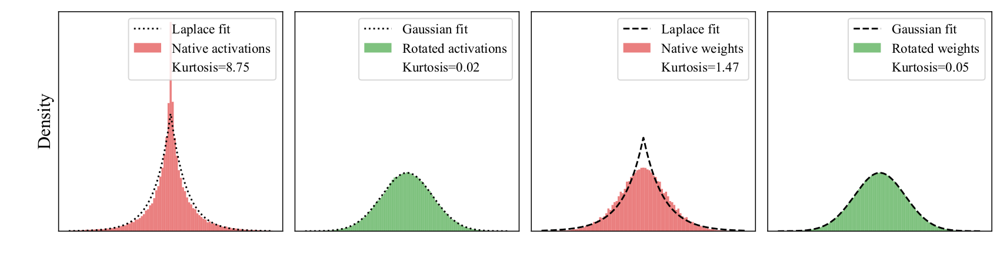
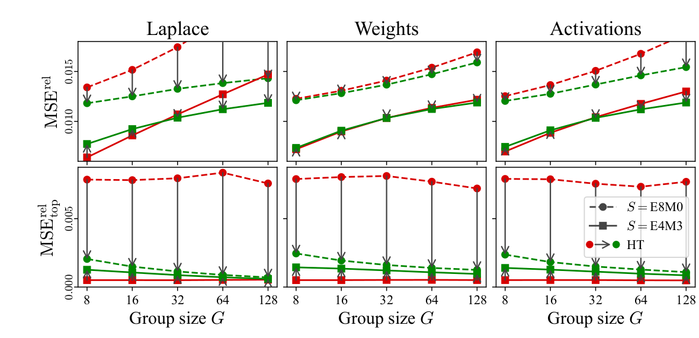
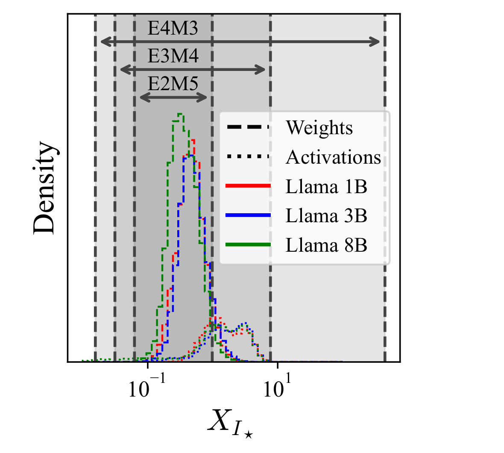
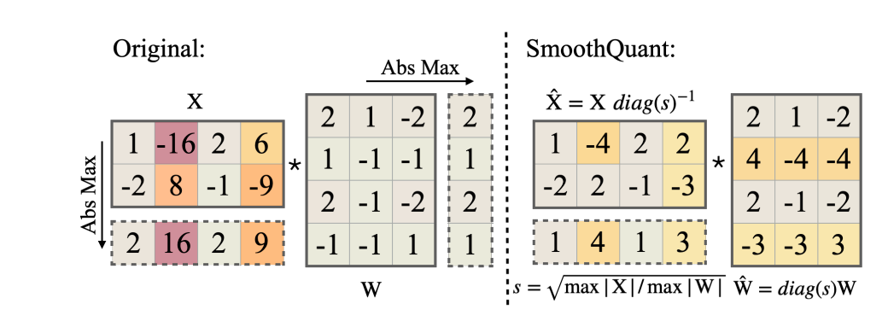
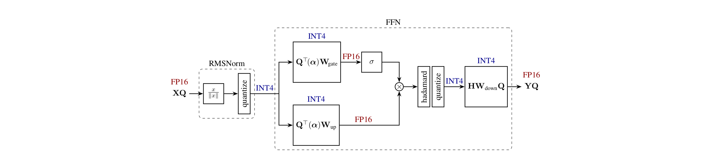
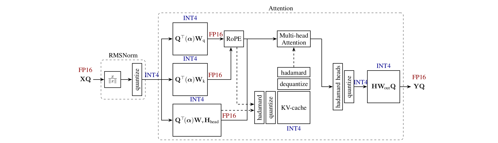
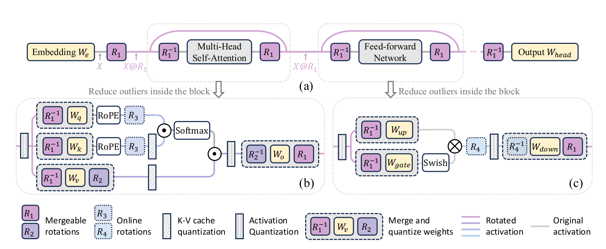
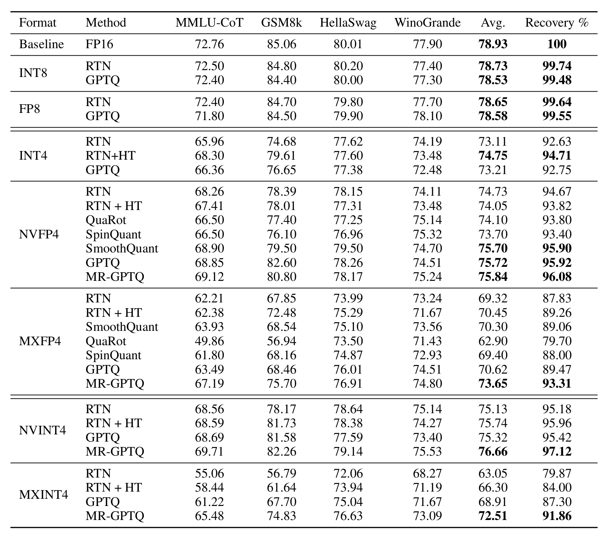

# Bridging the Gap Between Promise and Performance for Microscaling FP4 Quantization 论文笔记

论文 [_Bridging the Gap Between Promise and Performance for Microscaling FP4 Quantization_](https://proceedings.iclr.cc/paper_files/paper/2026/hash/b87bb4f6346d727b265088235e5bc389-Abstract-Conference.html) 研究的是一个很容易被硬件峰值掩盖的问题：**GPU 原生支持 FP4，只说明矩阵乘法可以更快，并不说明现有模型能准确地落到这套数值格式，也不说明量化、scale 计算和数据重排之后仍然更快。**[^paper]

论文给出的答案不是“NVFP4 一定优于 MXFP4”，也不是“给 FP4 加 Hadamard rotation 就够了”，而是下面这条更有工程价值的结论：

> **FP4 的有效性由 `元素格点 × scale 格式 × group size × 量化算法 × Kernel 数据路径` 共同决定。脱离格式约束讨论算法，或脱离运行时开销讨论精度，都会得到错误的部署判断。**

本文不按论文目录逐节复述，而是围绕五个问题展开：

1. 为什么 INT4 上有效的异常值处理方法，迁移到 NVFP4 后反而可能损害精度？
2. MXFP4 的 E8M0 scale 明明动态范围更大，为什么误差反而更高？
3. MR-GPTQ 的三个改动分别在修复哪一层问题？
4. QuTLASS 如何把离线旋转、在线旋转和 FP4 GEMM 接成可部署路径？
5. 论文里的 3.6×、6× 与端到端收益分别在什么 workload 下成立？

> [!NOTE]
> 论文讨论的是将 Transformer 中的 Linear 同时做 4-bit weight 与 4-bit activation 量化，即 W4A4，精度模型覆盖 Llama 3 与 Qwen 3。论文将 AMD CDNA 4 对 MXFP4 的支持作为背景，但 QuTLASS 实现与性能实验均面向 NVIDIA Blackwell；**论文没有给出 AMD GPU 上的 Kernel 或 benchmark 结果**。[^amd]

## 零、Prerequisite Knowledge：读懂误差分析需要哪些基础概念

论文第 3 节把 native weight/activation 建模为 Laplace 分布，把 Hadamard rotation 后的 tensor 建模为 Gaussian 分布，再用 kurtosis、dead zone、平均 MSE 和 top-element MSE 解释实验。要理解这条推理链，需要先分清三个层次：

1. **分布层**：一个 tensor 的能量集中在主体还是尾部，出现极端值的概率有多大。
2. **量化层**：有限 grid、shared scale 与 group size 怎样把分布变成 rounding、zero-collapse 和 clipping error。
3. **模型层**：这些局部误差经过 Linear、残差和非线性后，是否真的造成任务 accuracy 下降。

论文的理论主要连接前两层，benchmark 才负责检验第三层。分布更“漂亮”或局部 MSE 更低，都不是模型精度的充分条件。

### 1. 概率密度、均值与方差分别描述什么

连续随机变量 $X$ 的概率密度 $f(x)$ 描述数值在不同位置附近出现的相对可能性。均值与方差分别为：

$$
\mu=\mathbb E[X],
\qquad
\sigma^2=\mathbb E[(X-\mu)^2].
$$

- 均值决定分布中心；本文讨论的 weight/activation 近似以 0 为中心。
- 方差衡量总体能量或离散程度，但无法单独说明能量位于“中间宽肩”还是“尖峰和长尾”。
- 两个分布可以拥有相同的均值和方差，却有完全不同的极端值概率；量化最关心的恰好是这种差异。

论文在理论部分将两种分布都归一化到均值 0、方差 1。这样比较误差时，差异主要来自分布形状，而不是一个 tensor 单纯比另一个 tensor 数值更大。

### 2. Gaussian：能量更集中在中间，尾部衰减很快

Gaussian/Normal distribution 写作 $X\sim\mathcal N(\mu,\sigma^2)$，概率密度为：

$$
f_N(x)=
\frac{1}{\sqrt{2\pi}\sigma}
\exp\left(-\frac{(x-\mu)^2}{2\sigma^2}\right).
$$

标准 Gaussian 取 $\mu=0,\sigma=1$。它关于均值对称，密度平滑，偏离中心越远，概率按照 $e^{-x^2/2}$ 快速下降。两侧尾部在大 $t$ 时近似为：

$$
\Pr(|X|>t)
\approx
\sqrt{\frac{2}{\pi}}\frac{\sigma}{t}
\exp\left(-\frac{t^2}{2\sigma^2}\right).
$$

指数中是 $-t^2$，所以很大的 outlier 相对少见。Hadamard rotation 将多个坐标做带正负号的归一化求和；在坐标相关性不过强、没有单项完全支配时，中心极限定理式的效应会让旋转后坐标更接近 Gaussian。这是论文用 Normal 建模 rotated tensor 的直觉基础。

### 3. Laplace：中心更尖，同时比 Gaussian 更容易出现大值

Laplace distribution 写作 $X\sim\operatorname{Laplace}(\mu,b)$：

$$
f_L(x)=
\frac{1}{2b}
\exp\left(-\frac{|x-\mu|}{b}\right),
\qquad
\operatorname{Var}(X)=2b^2.
$$

论文固定单位方差，因此取：

$$
\mu=0,
\qquad
b=\frac{1}{\sqrt2}.
$$

Laplace 密度在 0 处有尖角，离开中心后按照 $e^{-|x|/b}$ 衰减。单位方差时，Gaussian 在 0 处的密度约为 0.399，Laplace 则约为 0.707。这意味着 Laplace 相比 Gaussian 同时具有：

- 更多非常接近 0 的小值；
- 较少位于中等幅度“肩部”的值；
- 更多远离中心的极端值。

其双侧尾部概率有简单形式：

$$
\Pr(|X|>t)=e^{-t/b}.
$$

例如在方差都为 1 时，超过 $4\sigma$ 的概率，Gaussian 约为 $6.3\times10^{-5}$，Laplace 约为 $3.5\times10^{-3}$，后者高约 55 倍。二者虽然有相同方差，absmax 和量化 scale 却可能完全不同。

> [!IMPORTANT]
> 量化论文常把 Laplace 称为 `heavy-tailed`，意思是“尾部比 Gaussian 更重”。按部分概率论教材的严格定义，Laplace 仍属于指数衰减的 light-tailed distribution，并不等同于 Pareto 或某些 Student-t 的幂律重尾。本文沿用论文语境，但不把两种定义混为一谈。

### 4. Kurtosis：衡量尾部贡献，不只是“曲线有多尖”

总体 kurtosis 定义为标准化四阶中心矩：

$$
\kappa=
\frac{\mathbb E[(X-\mu)^4]}{\sigma^4}.
$$

因为四次方会强烈放大远离均值的样本，kurtosis 对稀有极端值非常敏感。常见的两种报告口径是：

$$
\text{raw kurtosis}=\kappa,
\qquad
\text{excess kurtosis}=\kappa-3.
$$

| 分布     | Raw kurtosis | Excess kurtosis | 量化直觉                        |
| -------- | -----------: | --------------: | ------------------------------- |
| Gaussian |            3 |               0 | 极端值较少，最大值增长较慢      |
| Laplace  |            6 |               3 | 尾部贡献更大，更容易拉高 absmax |

“高峰度”经常伴随中心更尖和尾部更重，但 kurtosis 的数学定义主要反映四阶矩与尾部贡献，不能简单理解成图形峰顶的高度。论文 Figure 2 将接近 Gaussian 的 rotated tensor 报为 0.02/0.05，因此图中使用的是 excess-kurtosis 口径；native activation 的 8.75 表示它甚至比理想 Laplace 的 3 更容易产生极端样本。

经验 kurtosis 还很容易受 sample size、layer 聚合方式和少数异常点影响。它能支持“分布建模是否合理”，不能单独预测模型 accuracy，也不能证明 tensor 坐标独立同分布。

### 5. Tail、outlier 与 group maximum 为什么会控制 scale

对一个含 $G$ 个元素的 block，定义绝对值最大值：

$$
M_G=\max_{1\le i\le G}|X_i|.
$$

即使每个元素的方差不变，$G$ 越大，抽到极端值的机会也越多。对独立同分布样本，大 $G$ 下的典型增长量级为：

$$
M_G^{\mathrm{Laplace}}\sim b\log G,
\qquad
M_G^{\mathrm{Gaussian}}\sim\sigma\sqrt{2\log G}.
$$

Laplace maximum 随 $G$ 增长得更快。若整个 group 共用 absmax scale，单个 outlier 不只是它自己难量化，还会把同组所有普通值的归一化幅度压小。这就是 **outlier 污染范围由 group size 决定** 的含义：

- 小 group 将影响限制在少量元素中，但需要更多 scale metadata。
- 大 group 减少 metadata，却提高遇到极值并拉大共同范围的概率。
- Rotation 会改变每个坐标的幅度与最大值，但不会改变向量总能量。

这些 maximum 公式是渐近量级，不是任意真实 LLM block 的精确预测。真实 tensor 存在 channel correlation、层间差异和非平稳 activation；论文随后必须用真实 weight/activation 再做数值验证。

### 6. Quantization grid、scale 与 group

量化器最终只能把数值放到有限集合，也就是 quantization grid。用归一化 grid $\mathcal Q\subset[-1,1]$ 表示，一个简单的对称量化器可以写成：

$$
q_i=\operatorname{RTN}_{\mathcal Q}(x_i/s),
\qquad
\widehat x_i=sq_i.
$$

- `grid` 决定有哪些合法 level，以及 0 附近和大值附近分别有多密。
- `scale` 将真实数值范围映射到 grid；scale 过大时主体分辨率不足，过小时会 clipping。
- `group` 决定哪些元素共享 scale，也是误差耦合的边界。
- `RTN` 只选择距离最近的 level，不考虑该坐标对层输出是否重要。

INT4 的 grid 通常近似均匀；E2M1 FP4 的 grid 非均匀，在 0 附近相对更密、在大值区域更稀。Microscaling 又让每 16/32 个元素共享一个低精度 scale，因此元素 grid 的误差和 scale grid 的误差会同时存在。

### 7. Dead zone：没有 overflow，信息也可能直接消失

设归一化 grid 的最小正数为 $q_{\min}$。最近舍入时，0 与 $q_{\min}$ 的决策边界位于二者中点：

$$
\delta=\frac{q_{\min}}{2}.
$$

于是：

$$
|x_i/s|<\delta
\quad\Longrightarrow\quad
q_i=0.
$$

区间 $(-\delta,delta)$ 就是 quantization dead zone。落入其中的非零值被重建为 0，误差等于其自身能量。它不是数值格式的 IEEE underflow，也不要求出现 overflow/NaN；只是最近格点恰好为 0。

在论文归一化模型下，E2M1 的非负 level 除以最大值 6 后为：

$$
\left\{
0,\frac1{12},\frac16,\frac14,
\frac13,\frac12,\frac23,1
\right\},
$$

因此 $q_{\min}=1/12$、$\delta=1/24$。采用有效对称范围 $[-7,7]$ 的 INT4 归一化 grid 则有 $q_{\min}=1/7$、$\delta=1/14$。这个例子说明 E2M1 在零附近的相对 level 更密，但实际 NVFP4/MXFP4 还要叠加 group size 和 scale quantization，不能只比较这两个 dead-zone 数字。

若使用 absmax scale $s=M_G$，真实域的 dead-zone 半宽就是：

$$
s\delta=M_G\delta.
$$

所以 outlier 抬高 $M_G$ 时，dead zone 会同步扩大，更多普通元素变成 0。这是“异常值伤害整组量化”的最直接机制。

### 8. Dead-zone、rounding、clipping 和 scale error 不要混为一谈

| 误差来源        | 发生条件                         | 直接结果                         |
| --------------- | -------------------------------- | -------------------------------- |
| Dead-zone error | 小值离 0 比离最小非零 level 更近 | 非零值被量化成 0                 |
| Rounding error  | 数值位于两个非零 level 之间      | 映射到最近 level                 |
| Clipping error  | 数值超出 scale 覆盖的 grid 端点  | 被截断到最大/最小 level          |
| Scale error     | 理想 scale 还要量化成 E8M0/E4M3  | 整个 group 的 level 同时发生偏移 |

`absmax` 选择尽量避免 clipping，却不一定使总 MSE 最小；MSE scale search 可以主动裁掉少数极值，换取主体值更小的 dead-zone/rounding error。E8M0 scale 则可能因为只能取 2 的幂，使理想范围与实际 grid 之间留下额外空隙。

### 9. 为什么 absmax 能保护 top element

若 scale 本身不量化、归一化 grid 包含端点 1，取 $s=M_G$ 后，最大元素满足：

$$
\frac{|X_{I_\star}|}{s}=1.
$$

它恰好落到 grid 端点，因此没有 rounding 或 clipping error。这就是论文所说的 top-element preservation。注意它依赖两个前提：scale 精确，且没有先改变坐标系。实际 E8M0/E4M3 scale 被量化后，top error 不一定严格为 0；Hadamard rotation 后，原空间 top element 也不再对应旋转空间中的某个端点。

### 10. Orthogonal/Hadamard rotation 保持什么，又改变什么

正交矩阵 $H$ 满足：

$$
HH^T=I.
$$

因此它保持 $L_2$ norm、内积以及未量化 Linear 的输出等价性：

$$
\|xH\|_2=\|x\|_2,
\qquad
(XH)(WH)^T=XW^T.
$$

但它不保持单个坐标、$L_\infty$ norm、kurtosis，也不保留某个原始元素与某个旋转坐标的一一对应；若 rotation block 跨越 quantization group 边界，还会改变哪些原始信息共享同一 scale。归一化 Hadamard 的元素为 $\pm1/\sqrt G$，所以每个输出坐标会混合整个 block。一个 outlier 的能量被摊开，普通值的 dead-zone 可能缩小；与此同时，原 top element 的特殊保护也会消失。

这也是全文最重要的基础事实：**rotation 不会减少向量能量，它只改变能量在哪些坐标上出现；量化是坐标相关、分组相关的，所以相同能量可以产生不同误差。**

### 11. MSE、Relative MSE 与 SQNR 怎样阅读

对一个实际 block，常见误差指标为：

$$
\operatorname{MSE}
=\frac1G\|x-\widehat x\|_2^2,
$$

$$
\operatorname{MSE}^{\mathrm{rel}}
=\frac{\|x-\widehat x\|_2^2}{\|x\|_2^2},
$$

$$
\operatorname{SQNR}
=10\log_{10}
\frac{\|x\|_2^2}{\|x-\widehat x\|_2^2}
=-10\log_{10}\operatorname{MSE}^{\mathrm{rel}}.
$$

绝对 MSE 会被高方差 layer/group 主导；relative MSE 便于比较不同能量的 block；SQNR 只是把相同比值换成“越高越好”的 dB 表达。论文还额外观察 top-element MSE，因为相同平均误差可能有两种完全不同的形态：均匀的小噪声，或少数关键 outlier 的大误差。

这些局部指标通常与模型退化相关，但不是一一对应。Hessian sensitivity、误差方向、残差连接、后续归一化与 benchmark 方差都会改变最终结果。因此本文后面始终把“理论 MSE”“数值验证”和“任务 accuracy”作为三类证据分别阅读。

## 一、Motivation：硬件提供 FP4 指令，软件还缺一条完整路径

### 1. “4 bit”并不是完整的数据格式

MXFP4 与 NVFP4 的单个数据元素都使用 E2M1：1 bit sign、2 bit exponent、1 bit mantissa。其非负值集合是：

$$
\{0,\ 0.5,\ 1,\ 1.5,\ 2,\ 3,\ 4,\ 6\}.
$$

真正区分两种格式的，是元素之外的 scale 与分组方式：

| 格式  | 元素格式 | group size $G$ | 组内 scale              | tensor scale | 忽略对齐后的平均位宽 |
| ----- | -------- | -------------: | ----------------------- | ------------ | -------------------: |
| MXFP4 | E2M1     |             32 | E8M0，只表示 2 的幂次   | 无           |    $4+8/32=4.25$ bit |
| NVFP4 | E2M1     |             16 | E4M3，带 3 bit mantissa | FP32         |     $4+8/16=4.5$ bit |

因此，NVFP4 用更小的组和更精细的局部 scale 换取精度，MXFP4 则用更低的 metadata 成本和更简单的幂次缩放换取吞吐。两者都不是“每个参数恰好 4 bit”，与 BF16 比较模型大小时也不能直接套用 4× 压缩比。OCP 规范中的 MXFP4 和 NVIDIA 的 NVFP4 说明了这两套格式契约。[^ocp] [^nvfp4]

概念上，可以把重建写成：

$$
\widehat{x}_{g,i}^{\mathrm{MX}}
=s_g^{\mathrm{E8M0}}q_{g,i}^{\mathrm{E2M1}},
$$

$$
\widehat{x}_{g,i}^{\mathrm{NV}}
=s_T^{\mathrm{FP32}}s_g^{\mathrm{E4M3}}q_{g,i}^{\mathrm{E2M1}}.
$$

这里最值得注意的是：**scale 也在被量化。** 若理想值为 $sq$，实际保存的是 $\widehat{s}=s+\Delta s$ 与 $\widehat{q}=q+\Delta q$，则：

$$
\widehat{s}\widehat{q}-sq
=s\Delta q+q\Delta s+\Delta s\Delta q.
$$

优化 E2M1 的舍入只能减小第一项，无法消除 scale 引入的第二项；而 FP4 格点很稀，scale 的变化还会改变元素落入哪个格点，使二者进一步耦合。这是 MXFP4 精度问题的入口。

### 2. 论文真正要验证的三层“承诺”

新格式要成为可部署方案，至少要同时兑现三层承诺：

- **格式层**：相同存储预算下，E2M1 与 microscaling 是否真的比 INT4 更准确？
- **算法层**：GPTQ、SmoothQuant、QuaRot、SpinQuant 等已有方法是否仍适配新的非均匀格点和 16/32 元素小组？
- **系统层**：在线 activation rotation、动态量化、scale 计算与硬件要求的 scale layout 重排，会不会吃掉 FP4 Tensor Core 的收益？

论文的反常发现是：这三层不能独立回答。NVFP4 的格式本身已经在做局部异常值隔离，可能让全局异常值缓解变成负优化；MXFP4 的 GEMM 更容易做快，却先被 E8M0 的 scale 误差限制精度；GPTQ 的动态 `act-order` 能改善误差，却会破坏适合硬件执行的列布局。

如果需要先补齐 INT/FP 数据格式、PTQ/QAT 与 scale 粒度的全局背景，可以配合站内的 [LLM 量化综述：数据格式、PTQ 与 QAT 的算法演进](../量化综述.md) 阅读。

## 二、Insight 1：旋转不是天然有效，group size 决定收益方向

### 1. Hadamard rotation 改变的首先是分布

论文把原始 weight/activation 近似为尖峰、重尾的 Laplace 分布，把经过 Hadamard rotation 的值近似为 Normal 分布。Llama-3.1-8B-Instruct 的实测拟合支持这个建模：原始 activation 的 kurtosis 为 8.75，旋转后接近 0.02；原始 weight 虽然形状看似 Gaussian，尾部仍明显更重，旋转后也更接近 Normal。



_图 1（原论文 Figure 2）：Llama-3.1-8B-Instruct 聚合 weight/activation 在旋转前后的分布拟合。图片裁自论文，版权归原作者所有。_

从左到右读这张图，可以看到两次一致的变化：

1. 原生 activation 有非常尖的中心和长尾，Laplace 拟合明显优于 Gaussian，图中 kurtosis 为 8.75。
2. Hadamard rotation 后，activation 的峰度降到 0.02，分布接近 Normal。
3. 原生 weight 的主体看起来已经像钟形，但 kurtosis 仍有 1.47，说明“看起来 Gaussian”不等于尾部足够轻；Laplace 对尾部的拟合更好。
4. 旋转后的 weight kurtosis 降到 0.05，也接近 Normal。

图中把 Gaussian 对应到接近 0 的 kurtosis，因此这里应按 **excess kurtosis（超额峰度）**理解。更重要的是，Figure 2 只验证了后续理论所需的分布建模是否合理，并没有直接证明 rotation 一定降低量化误差；误差方向还取决于 group size、量化 dead zone 和 scale 精度。

### 2. 从一个 micro-block 定义两类误差

对一个长度为 $G$ 的量化组，先用绝对值最大值缩放：

$$
M=\max_i |X_i|,\qquad U_i=\frac{X_i}{M}.
$$

设归一化量化格点中最小正值为 $q_{\min}$，则 round-to-nearest 会产生宽度为

$$
\delta=\frac{q_{\min}}{2}
$$

的 dead zone；当 $|U_i|<\delta$ 时，该元素直接变成 0。组越大，最大值 $M$ 越可能增大，普通元素被除得越小，更多能量落入 dead zone。

论文先假设 block 内元素独立同分布、方差为 1，量化格点 $\mathcal Q\subset[-1,1]$ 关于 0 对称且包含 0 和 1。量化与反量化过程可以写成：

$$
\widehat U_i=\operatorname{RTN}_{\mathcal Q}(U_i),
\qquad
\widehat X_i=M\widehat U_i.
$$

它随后区分两个容易被混在一起的指标：

$$
\operatorname{MSE}(G)
=\mathbb E\left[(X_1-\widehat X_1)^2\right],
$$

$$
I_\star=\arg\max_i|X_i|,
\qquad
\operatorname{MSE}_{\mathrm{top}}(G)
=\mathbb E\left[(X_{I_\star}-\widehat X_{I_\star})^2\right].
$$

- `MSE` 衡量随机抽取一个普通元素时的平均误差，对应整个 block 的主体能量有没有被保住。
- `MSE_top` 单独观察绝对值最大的元素，对应对模型精度敏感的 outlier 是否被破坏。

只看平均 MSE 会漏掉“少数关键坐标是否被保留”，只看最大值又会漏掉“为了保护一个最大值，是否让其余元素大量落入 0”。论文的核心洞察正来自这两个指标之间的张力。

### 3. 不旋转时，absmax 天然保护最大值

若先忽略 scale 自身的量化，组内最大元素经过 absmax normalization 后恰好落到量化格点的端点，因此其误差为 0：

$$
\operatorname{MSE}_{\text{top}}(G)=0.
$$

这件事很重要。传统旋转方法的直觉是“把异常值能量摊开，避免一个大值拖累整组 scale”；但当 group 只有 16 个元素时，microscaling 已经把异常值的影响限制在很小的局部，而且 absmax 又精确保留了组内最大值。此时继续旋转，等于主动放弃这项顶值保护。

### 4. 旋转后，最大值误差被摊回所有坐标

令归一化 Hadamard 矩阵为 $U=H/\sqrt{G}$，先计算 $y=Ux$，在旋转域量化得到 $\widehat y$，再通过 $\widehat x=U^T\widehat y$ 恢复。论文证明，在其 i.i.d. Gaussian 假设下，原空间最大坐标上的期望误差变为旋转域的平均误差：

$$
\operatorname{MSE}_{\text{top}}(G)
=\frac{1}{G}\mathbb E\|\varepsilon_y\|_2^2
=\operatorname{MSE}(G).
$$

换句话说，rotation 确实“摊开”了东西，但它不仅摊开异常值，也把原本为 0 的顶值误差摊回了所有坐标。**分散异常值并不自动等于降低最终量化误差。**

等式背后的直觉是 $\varepsilon_x=H^T\varepsilon_y/\sqrt G$：Hadamard 每个元素的绝对值都为 1，某个原坐标会等权接收全部 $G$ 个旋转域误差分量；在论文的独立、对称建模下交叉项期望抵消，剩下的就是总误差能量的 $1/G$。因此逆旋转不会消灭噪声，只会重新分配噪声。

### 5. 为什么小组偏爱重尾，大组偏爱 Gaussian？

论文进一步分析了没有落入 dead zone 的 preserved mass：

$$
\mathcal R(G)=1-\operatorname{MSE}(G).
$$

在大 $G$ 渐近区域，Laplace 与 Normal 分布分别满足：

$$
\mathcal R_L(G)=\Theta\!\left((\log G)^2G^{-\delta}\right),
$$

$$
\mathcal R_N(G)=\Theta\!\left(\sqrt{\log G}\,G^{-\delta^2}\right).
$$

这两个 rate 可以从 block maximum 的增长速度直观看出来。对单位方差 Laplace，最大值量级约为 $M_L\sim\log G$；要逃离 dead zone，需要 $|X_1|\gtrsim\delta\log G$，Laplace tail 给出约 $G^{-\delta}$ 的存活概率，再乘平方能量得到 $(\log G)^2$ 因子。对 Normal，$M_N\sim\sqrt{2\log G}$；阈值进入 Gaussian tail 后，指数项变成约 $G^{-\delta^2}$，并留下 $\sqrt{\log G}$ 量级的因子。

由于 $0<\delta^2<\delta<1$，Normal 的 preserved mass 在足够大的 $G$ 下衰减更慢，因此大组最终更受益于 rotation；但在小组区域，Laplace 重尾使更多质量远离 0，原始分布反而可能有更低 MSE。论文的数值实验观察到了这一 crossover：

- 在 NVFP4 的 $G=16$、`absmax + RTN` 设置下，Hadamard rotation 通常提高误差并降低任务精度。
- MXFP4 的 $G=32$ 更容易从 rotation 获益；继续增大 rotation block，在部分模型上还能进一步改善精度。

所以，“NVFP4 的小组尺寸中和了异常值处理”更准确的理解是：**小组 microscaling 与 absmax 已经完成了局部异常值隔离和顶值保护，rotation 的边际收益变小，代价却仍然存在。** 这不是 Hadamard 无法把值混合，而是它改变分布后，收益方向被量化组的尺度反转了。

> [!IMPORTANT]
> 这个结论只直接适用于论文分析的 `absmax + RTN` 基线。MR-GPTQ 加入 MSE scale search 与二阶误差补偿后，`Had16 + MSE + ActOrder` 在低噪声 PlatinumBench 上反而成为 NVFP4 的最佳变体。不能把“RTN 下 rotation 伤害 NVFP4”扩大成“NVFP4 永远不应旋转”。

### 6. Figure 3：理论预测如何落到真实 weight 与 activation

真实 tensor 的不同 block 方差差异很大，直接平均绝对 MSE 会让高能量 block 支配结果。论文因此在数值验证中改用相对误差：

$$
\operatorname{MSE}^{\mathrm{rel}}(G)
=\mathbb E\left[
\frac{\sum_{i=1}^{G}(X_i-\widehat X_i)^2}
{\sum_{i=1}^{G}X_i^2}
\right],
$$

$$
\operatorname{MSE}^{\mathrm{rel}}_{\mathrm{top}}(G)
=\mathbb E\left[
\frac{(X_{I_\star}-\widehat X_{I_\star})^2}
{X_{I_\star}^2}
\right].
$$

前者回答“这个 block 有多少相对能量被量化误差吃掉”，后者回答“最大坐标自身损失了多少比例”。这一步还把理论分析中暂时忽略的 **scale quantization** 加回来了，所以它是连接定理与实际 FP4 格式的关键实验。



_图 2（原论文 Figure 3）：Hadamard Transform 对不同 group size 下相对平均误差与相对顶值误差的影响。三列依次为合成 Laplace 样本、Llama-3.1-8B-Instruct weight 和 activation。图片裁自论文，版权归原作者所有。_

读图时需要先认清图例：上排是 $\operatorname{MSE}^{\mathrm{rel}}$，下排是 $\operatorname{MSE}^{\mathrm{rel}}_{\mathrm{top}}$；圆点/虚线对应 E8M0 scale，方点/实线对应 E4M3 scale；箭头由红色指向绿色，表示同一设置应用 HT 前后的变化。纵轴越低越好。

#### 现象一：理论的 crossover 在 E4M3 平均误差上出现了

在上排 E4M3 曲线中，小 $G$ 时绿色点高于红色点，即 HT 增大误差；随着 $G$ 增大，两者交叉，绿色点最终更低。合成 Laplace、真实 weight、真实 activation 三列都呈现相同趋势，因此它不是某一层偶然出现的噪声，而与前面推导的 heavy-tail → Gaussian 及 group-size crossover 相符。

这解释了 NVFP4 的特殊位置：它固定 $G=16$，恰好位于 rotation 还没有稳定获益的区域。MXFP4 固定 $G=32$，更接近或已经越过部分曲线的交叉点，所以更容易从旋转后的归一化分布获益。

#### 现象二：E8M0 的平均误差整体更高，但 HT 几乎一直有帮助

上排 E8M0 曲线位于 E4M3 之上，说明 **相同 E2M1 数据格点下，粗糙的 power-of-two scale 本身就在制造额外误差**。绿色 E8M0 曲线通常低于红色曲线，表示 HT 通过压低 block 内的极值与主体值之比，让更多元素逃离 dead zone，能够部分抵消 E8M0 的粗粒度问题；但它没有改变 E8M0 相邻 scale 相差 2 倍这一事实，所以无法把 MXFP4 自动变成 NVFP4 的精度。

#### 现象三：顶值误差揭示了两种 scale 的本质差别

如果 scale 不量化，未旋转的 absmax 会让最大值精确落在端点，$\operatorname{MSE}_{\mathrm{top}}=0$。下排加入真实 scale quantization 后，红色曲线不再严格为 0：

- 对 E4M3，未旋转顶值仍接近横轴，因为 E4M3 比 E2M1 更精细，最大值相当于被“提升”到 scale 的精度。
- 对 E8M0，未旋转顶值误差维持在约 $8\times10^{-3}$ 的高位；E8M0 比 E2M1 更粗，scale 无法细调时，最大值最终只能借助 E2M1 level 近似，顶值精度受 base format 限制。
- HT 后，最大坐标不再单独受保护，它的误差来自整个旋转 block 的噪声混合。E8M0 的顶值误差因此显著下降；E4M3 原本极低的顶值误差反而上升。不过随着 $G$ 增大，重尾分布的 $X_{I_\star}^2$ 增长较快，相对顶值误差又逐渐下降。

Figure 3 因而验证的是一条更细的因果链：

```text
HT 改变分布形状
  -> group maximum 与普通元素的比例改变
  -> dead-zone / rounding error 改变
  -> 是否保留 top element 又受到 scale dtype 约束
  -> NVFP4 与 MXFP4 得到相反或不同幅度的收益
```

它不能单独预测最终 benchmark accuracy，因为模型还存在 layer sensitivity、误差相关性以及后续非线性；但它成功预测了 Table 1 中最反常的一项：`RTN + HT` 改善 INT4/MXFP4，却损害 NVFP4。

## 三、Insight 2：MXFP4 缺的不是动态范围，而是 scale 分辨率

### 1. E8M0 把 8 bit 几乎都花在了用不到的范围上

E8M0 可以覆盖约 $2^{-127}$ 到 $2^{128}$ 的幂次范围，但 weight 与 activation 的实际 group scale 分布窄得多。论文的 Figure 4 显示，E4M3 的范围已经足以覆盖所测 Llama 模型中的 scale；E8M0 增加的范围没有转化成收益，反而因为没有 mantissa，只能在相邻 2 的幂之间跳跃。



_图 3（原论文 Figure 4）：不同 FP8 scale 格式的可表示范围，与 Llama 1B/3B/8B 实际 weight/activation 顶值分布的比较。实线表示 weight，点线表示 activation；图片裁自论文，版权归原作者所有。_

横轴是对数尺度下的 $X_{I_\star}$。灰色竖虚线和箭头给出 E2M5、E3M4、E4M3 的 normal range，彩色分布则来自不同规模 Llama 模型。图中最重要的不是 E4M3 的箭头最长，而是：**全部实测分布已经落在 E4M3 范围内。** E8M0 的范围比图中三者还大，因此继续增加 exponent bit 并不能减少 overflow；真正决定相邻可表示 scale 距离的是 mantissa。

可以用同样为 8 bit 的两种 scale 做直观比较：

- E8M0 没有 mantissa，相邻正常 scale 是 $2^k$ 与 $2^{k+1}$，间隔为 2 倍。
- E4M3 在同一 exponent 区间内还有 8 个 significand 档位，局部相对误差上界远小于 E8M0。

所以 MXFP4 的问题不是“数值太大装不下”，而是“明明只需要覆盖一小段范围，却把编码预算用在了遥远的 exponent 上”。这也是后续 MSE scale search 和 `MXFP4†` scale fitting 有效的直接动机。

论文在 Llama-3.1-8B-Instruct 第 15 个 block 的各个 Linear 上固定 group size 为 16，对不同 8-bit scale 格式做了误差比较。相对不量化 scale 的 FP16 scale，E4M3 使 weight relative MSE 平均增加约 10%，E8M0 则增加约 40%；拥有更多 mantissa 的 E1M6-E3M4 以及 INT8 scale 更接近 FP16 scale。这里的 10%/40% 是**量化 MSE 的相对增量**，不是模型 accuracy 下降 10%/40%。

这给出一个反直觉但可迁移的设计原则：

> 对 scale 而言，覆盖真实分布之后，继续增加 exponent range 的价值很低；把 bit 留给 mantissa，往往比覆盖永远不会出现的数量级更重要。

### 2. `MXFP4†`：把 256 个 exponent code 重新铺到数据范围

标准 MXFP4 使用带 $4/3$ 修正的 E8M0 grid：

$$
s_{\mathrm{E8M0}}
=\frac{4}{3}\cdot 2^{\operatorname{clamp}(\operatorname{round}(\log_2s),-128,127)}.
$$

论文附录 H 又提出 scale fitting：先统计 $s_{\min}$、$s_{\max}$，再把 256 个 code 均匀铺到这段 log-domain 范围。其本质可写成：

$$
s=2^{\alpha q+\beta},\qquad 0<\alpha<1.
$$

标准 E8M0 的相邻指数步长是 1，拟合后变成小于 1 的 $\alpha$，因此同样 8 bit metadata 可以在真实范围内得到更细的对数分辨率。作者把该变体记为 `MXFP4†`。

| 方法    | 格式   | Llama 3 8B recovery | Qwen 3 8B recovery |
| ------- | ------ | ------------------: | -----------------: |
| RTN     | MXFP4  |               87.8% |              93.7% |
| RTN     | MXFP4† |       94.3%（+6.5） |      96.3%（+2.6） |
| GPTQ    | MXFP4  |               89.5% |              94.1% |
| GPTQ    | MXFP4† |       95.2%（+5.7） |      92.3%（-1.8） |
| MR-GPTQ | MXFP4  |               93.6% |              95.2% |
| MR-GPTQ | MXFP4† |       94.9%（+1.3） |      98.5%（+3.3） |

这组结果既说明 scale grid 是 MXFP4 的主要误差源，也给出了一个重要反例：Qwen 3 8B 的 GPTQ 在 scale fitting 后下降 1.8 个 recovery points。**格式特定优化仍需逐模型验证，不能用平均收益代替回归测试。**

另一个边界是，`MXFP4†` 改变了标准 E8M0 的 scale 编码契约，不能和原生 OCP MXFP4 完全等同。论文指出，若同一层的 activation 与 weight 使用相同的 $\alpha$，scale 乘法仍可化为指数加法；但部署端必须明确支持这套重映射，不能把它当成无需修改 Kernel 的标准 MXFP4 checkpoint。

## 四、Method：Table 1 中的算法分别改变了哪类误差

先用一个统一表达式看这些方法到底在优化什么。对 PyTorch Linear 布局 $Y=XW^T$，令 $H$ 为正交旋转，并记：

$$
X_H=XH,\qquad W_H=WH,
$$

$$
Q(X_H)=X_H+E_X,\qquad Q(W_H)=W_H+E_W.
$$

由于 $HH^T=I$，全精度计算保持不变；量化输出误差则是：

$$
\begin{aligned}
\widehat Y-Y
&=(X_H+E_X)(W_H+E_W)^T-XW^T\\
&=X_HE_W^T+E_XW_H^T+E_XE_W^T.
\end{aligned}
$$

三个误差项依次来自 weight quantization、activation quantization 和二者的交叉项。Table 1 中的方法并不是在做同一件事：rotation 改变 $E_X/E_W$ 产生前的数据分布，SmoothQuant 在二者之间转移难度，GPTQ 直接压低第一项在校准输入上的输出影响，MR-GPTQ 则同时干预分布、scale grid 和 weight error propagation。

> [!NOTE]
> 下面解释的是《Bridging...》复现实验里的具体配置，不应把方法名直接等同于原论文的所有默认选项。例如，Table 1 的 QuaRot 在旋转后使用 RTN；GPTQ 与 MR-GPTQ 优化 weight，activation 仍然使用 RTN。实验使用 1024 条 FineWeb calibration sequence；GPTQ 使用 `absmax` scale、$\lambda=10^{-2}$ Hessian damping 和标准量化顺序。

| 方法        | 改变的主要对象                         | Weight 侧                     | Activation 侧            | 核心作用                         |
| ----------- | -------------------------------------- | ----------------------------- | ------------------------ | -------------------------------- |
| RTN         | 不改坐标系，只使用局部 scale           | 最近邻舍入                    | 动态最近邻舍入           | 提供最朴素、但必须认真比较的基线 |
| RTN + HT    | 局部 Hadamard 坐标系                   | 旋转后 RTN                    | 旋转后 RTN               | 分散 outlier，降低块内峰均比     |
| SmoothQuant | 输入通道上的等价对角缩放               | RTN，承接部分 activation 难度 | RTN，通道 outlier 被平滑 | 在 $E_X$ 与 $E_W$ 之间搬移误差   |
| QuaRot      | Transformer 多条路径上的正交旋转       | 本表为旋转后 RTN              | 旋转后 RTN               | 系统性降低 hidden-state outlier  |
| SpinQuant   | 可学习的模型级正交旋转                 | 冻结原权重，只学习 rotation   | 旋转后 RTN               | 用 calibration loss 选坐标系     |
| GPTQ        | weight 的量化顺序与误差补偿            | Hessian-aware 二阶补偿        | `absmax + RTN`           | 最小化层输出中的 weight error    |
| MR-GPTQ     | 微块旋转、scale/grid、ActOrder 与 GPTQ | 格式专用 grid + 二阶补偿      | 旋转后 RTN               | 同时适配 NVFP4/MXFP4 的物理分组  |

### 1. RTN：真正的基线是“局部格式能力”

Round-to-Nearest 对每个 block 执行：

1. 找到 `absmax` 并计算理想 scale。
2. 按 E4M3 或 E8M0 量化 shared scale。
3. 将每个归一化值映射到最近的 INT4/FP4 level。
4. Weight 离线执行；activation 在运行时对每个输入动态执行。

用归一化 grid 表示时，它就是：

$$
s=\max_i|x_i|,
\qquad
\widehat x_i=s\cdot\operatorname{RTN}_{\mathcal Q}(x_i/s).
$$

RTN 不知道某层是否敏感、不知道哪个输入方向更常被激活，也不会补偿已经产生的舍入误差。它能抑制误差的唯一来源，是格式自身提供的小 group 与 scale：group 越小，单个 outlier 能污染的元素越少；scale 越细，block 能越贴近真实范围。

这正是 NVFP4 RTN 达到 74.73 的原因。$G=16$ 已经把异常值限制在很小的邻域，E4M3 scale 又保留了顶值，因此 RTN 不是一个“故意很弱”的 baseline，而是对 NVFP4 格式原生能力的测试。

### 2. RTN + HT：压低峰均比，但会放弃顶值保护

对局部 Hadamard block，有：

$$
XW^T=(XH)(WH)^T,
\qquad HH^T=I.
$$

把等式落实成 RTN + HT 的数据流，就是：

1. **按量化 group 切块。** 对 activation 的输入维和 weight 的对应输入维使用同一个归一化 Hadamard 块 $H$。
2. **两侧同步换基。** 在线计算 $X_H=XH$；离线预计算 $W_H=WH$。二者同步变换，才有 $X_HW_H^T=XW^T$。
3. **在旋转坐标中独立量化。** 分别执行 $Q(X_H)$ 与 $Q(W_H)$；Table 1 中这里仍是 `absmax + RTN`，只是 grid 换成 INT4、NVFP4 或 MXFP4。
4. **直接执行低精度 GEMM。** 线性层输出不需要显式逆旋转，因为 $HH^T$ 已在乘法中相消；若该旋转跨越其他算子，不能相消的部分才需要在线 Hadamard 或折叠到相邻 weight。

因此，量化后的层输出可以展开为：

$$
\widehat Y=(X_H+E_X)(W_H+E_W)^T
=Y+E_XW_H^T+X_HE_W^T+E_XE_W^T.
$$

HT **没有直接消掉** $E_X$ 或 $E_W$；它改变的是误差产生之前的坐标分布。其证据不是一张独立的“RTN + HT 方法图”，而是前文图 1 的 Gaussian/Laplacian 分布拟合与图 2 的 group-size 误差曲线：前者说明旋转压低峰度与极值集中，后者说明这种收益会随 group 变小而被 NVFP4 的 top-value preservation 反超。

在全精度下，这只是换坐标系。量化后之所以可能更好，是因为 Hadamard 的每个输出坐标都是原坐标的正负加权平均。一个集中在单坐标上的极值会被分散：

$$
[100,0,0,\ldots]
\xrightarrow{H/\sqrt d}
[\pm100/\sqrt d,\ldots].
$$

这通常降低 $\|x\|_\infty/\|x\|_2$，使 absmax scale 不再由单个坐标独占，更多普通值能够离开 dead zone：

- INT4 的均匀 grid 在 0 附近没有 FP4 那样的非均匀密度，最怕 outlier 拉大 step size，因此平均分从 73.11 升到 74.75。
- MXFP4 的 E8M0 scale 很粗，rotation 不能增加 scale 精度，却能让一个 power-of-two scale 覆盖的 block 更均匀，因此从 69.32 升到 70.45。
- NVFP4 原本借助 $G=16$ 与 E4M3 scale 保护 top element；rotation 把最大坐标变成多个普通坐标，再在逆旋转时把各维噪声混回去，因此平均分从 74.73 降到 74.05。

最后一个下降应准确表述为：Avg. 下降 0.68 point，Recovery 由 94.67% 降到 93.82%，下降 0.85 percentage point。它不是“Hadamard 玄学失效”，而是 rotation 降低普通元素误差的收益，小于放弃局部顶值保护的代价。

### 3. SmoothQuant：不消灭误差，而是在 weight 与 activation 之间搬运



> **图 5｜SmoothQuant 原论文的方法示意。** 左侧 activation 的固定通道含有 $-16/8$ 等大值，导致按行 absmax 量化时多数普通值只占很少的 level；右侧用通道 scale 将 activation 压到更均衡的范围，同时把逆向变化吸收到 weight。原图为了便于展示取 $\alpha=0.5$；《Bridging...》Table 1 经调参使用的是 $\alpha=0.6$，不能把图中的示例超参数当成本文实验配置。图源：SmoothQuant Figure 5。[^smoothquant]

SmoothQuant 对输入通道做可逆的对角缩放。继续沿用 $Y=XW^T$、$W$ 为 `[out, in]` 的布局：

$$
Y=XW^T
=\left(X\operatorname{diag}(s)^{-1}\right)
\left(W\operatorname{diag}(s)\right)^T,
$$

$$
s_j=
\frac{\max|X_j|^\alpha}
{\max|W_j|^{1-\alpha}}.
$$

《Bridging...》调参后使用 $\alpha=0.6$。$s_j$ 大的 outlier channel 在 activation 侧被除小，同一缩放离线乘入 weight，所以全精度输出不变，也不必在线执行额外的 per-channel 乘法。[^smoothquant]

#### 从 calibration 到推理的完整流程

1. **统计通道难度。** 用 calibration token 分别统计输入通道 $a_j=\max|X_j|$ 与 weight 输入通道 $w_j=\max|W_j|$。这里是跨 token 的 channel 统计，不是 NVFP4/MXFP4 的 16/32-element micro-block 统计。
2. **确定误差迁移量。** 计算 $s_j=a_j^\alpha/w_j^{1-\alpha}$。$\alpha=0$ 几乎不平滑 activation；$\alpha=1$ 完全由 activation absmax 决定，会把最多的动态范围压力移给 weight；$\alpha=0.6$ 是本文对二者的折中。
3. **构造等价参数。** 数学上令 $\widehat X=X\operatorname{diag}(s)^{-1}$、$\widehat W=W\operatorname{diag}(s)$。工程上，$\operatorname{diag}(s)^{-1}$ 通常融合进前一层的 LayerNorm 参数或相邻线性层，因此推理时不需要新增一次逐通道乘法。
4. **再执行普通量化。** 对 $\widehat W$ 离线量化，对运行时产生的 $\widehat X$ 动态量化，然后计算 $Q(\widehat X)Q(\widehat W)^T$。SmoothQuant 本身不改变 FP4 level，也不替代 RTN。

为什么能抑制误差？设平滑后的误差为 $\widehat E_X$、$\widehat E_W$，一阶输出误差仍是

$$
\Delta Y\approx \widehat E_X\widehat W^T+\widehat X\widehat E_W^T.
$$

如果某些 activation outlier 长期固定在少数 channel，除以较大的 $s_j$ 会让它们不再反复拉大所在 micro-block 的 scale，普通 activation 更少落入 dead zone。代价是对应 weight 列乘以 $s_j$ 后更难量化。方法有效的条件不是“两边误差都下降”，而是 activation 侧减少的输出误差大于 weight 侧增加的输出误差。

它有效的前提是 activation outlier 长期出现在相对固定的 channel，而 weight 在相应 channel 上还有量化余量。此时 $E_X$ 明显减小，虽然 $E_W$ 增大，总输出误差仍可能下降。Table 1 中 NVFP4 达到 75.70，说明即使 group 已缩小到 16，跨 token 持续存在的 channel outlier 仍未被 microscaling 完全解决。

但 SmoothQuant 没有优化 E4M3/E8M0 scale 的离散位置，也没有针对 FP4 grid 修改舍入。MXFP4 上它只有 70.30，略低于 RTN + HT 的 70.45，说明把难度迁给 weight 后，粗糙 E8M0 scale 仍然是瓶颈。

### 4. QuaRot：模型级“去异常值”不等于 micro-block 误差最小



> **图 6｜QuaRot 在 LLaMA-style FFN 中的流程。** 蓝色 `INT4` 是 QuaRot 原论文的实验格式，不是《Bridging...》Table 1 的 FP4 配置；迁移到 Table 1 时，旋转拓扑不变，但量化器替换为 NVFP4/MXFP4 的 micro-block grid。图源：QuaRot Figure 3。[^quarot]

QuaRot 利用 Transformer 的 computational invariance，在 residual stream、MLP、attention 与 KV 路径插入正交旋转。能吸收到相邻 Linear 的旋转离线折叠进 weight；FFN down-projection 与部分 attention 路径保留少量在线 Hadamard。这样既降低 weight 的 incoherence，也系统性消除 hidden-state outlier。[^quarot]

#### FFN 图逐节点解释

1. **保持 residual stream 处于旋转坐标。** 输入已经由全局随机 Hadamard $Q$ 变成 $XQ$。只要所有读写 residual 的 weight 同步吸收 $Q$ 或 $Q^T$，模型的全精度函数不变。
2. **融合 RMSNorm scale。** 原本逐通道的 $\operatorname{diag}(\alpha)$ 被吸收到 gate/up projection，因此图中的两个 weight 写成 $Q^T\operatorname{diag}(\alpha)W_{gate/up}$。这里的 $Q^T$ 恰好撤销输入 $XQ$。
3. **量化第一组 GEMM。** RMSNorm 输出和两组 weight 在进入 Tensor Core 前量化；矩阵乘结果恢复成 FP16，再执行 SiLU/$\sigma$ 与逐元素门控，因为这些非线性不能简单与正交矩阵交换。
4. **处理 FFN 内部的新 outlier。** 门控后的 activation 可能重新变得尖峰化，因此在 down projection 前在线执行一次 Hadamard，再量化。逆变换被预先折叠成 $HW_{down}Q$：左侧 $H$ 与在线 Hadamard 相消，右侧 $Q$ 让输出继续保持为 $YQ$，供下一层沿用。

这一设计为何通常有效？全局 $Q$ 处理 block 之间持续存在的 hidden-state channel outlier，FFN 内部 $H$ 处理非线性重新制造的局部 outlier；能折叠的变换不增加运行时算子，不能折叠的只保留快速 Hadamard。它优化的是整个 Transformer 中“哪里出现异常值”，而不是某个 FP4 micro-block 的最优离散 scale。



> **图 7｜QuaRot 在 attention 与 KV cache 中的流程。** 虚线表示为了处理 key/value outlier 而增加的在线路径；图中 `KV-cache INT4` 属于 QuaRot 原论文的 W4A4/KV4 方案。《Bridging...》Table 1 主要比较 Linear 的 W4A4，不能把这张图理解成 Table 1 同时报告了 KV-cache FP4。图源：QuaRot Figure 6。[^quarot]

#### Attention 图逐节点解释

1. $Q^T\operatorname{diag}(\alpha)$ 同样折叠到 $W_q/W_k/W_v$，撤销 residual 输入的全局旋转。
2. Value projection 的每个 attention head 预先在 weight 端折叠 $H_{head}$，让输出 value 在 head 内被旋转；对应逆变换再并入 output projection。
3. Key 与 Query 的旋转必须成对出现，才能保持 $QK^T$ 不变。由于 RoPE 阻止它们完全折叠进 $W_q/W_k$，QuaRot 在 RoPE 后在线对 Q/K 做相同的 head-wise Hadamard；cache 中存旋转且量化后的 K/V，读取时 dequantize，并在需要的位置用 Hadamard 恢复等价计算。
4. 多头 attention 输出后再做一次跨 head Hadamard（图中 `hadamard heads`），随后量化；其逆变换与全局 $Q$ 一起折叠到 $HW_{out}Q$，最终仍输出 $YQ$。

因此 QuaRot 的误差抑制逻辑是：先在产生 Q/K/V 和 FFN 中间量之前降低 incoherence，再量化，让 absmax 不容易被单个 feature 控制。但它并未搜索 E4M3/E8M0 shared scale，也没有让旋转边界与 $G=16/32$ 物理分组对齐。这正是“原论文流程合理”与“Table 1 上直接迁移 FP4 失败”能够同时成立的原因。

原始 QuaRot 可以配合 GPTQ 或 RTN，但 **Table 1 的 QuaRot 配置明确使用旋转后的 RTN**。这意味着它主要检验“原有模型级 rotation recipe 能否直接迁移到新 FP4 格式”，而不是检验 QuaRot 与 GPTQ 组合的上限。

结果是 NVFP4 只有 74.10，MXFP4 更降到 62.90。原因可以由前面的误差分析解释：

- QuaRot 优化的是全局/层级 outlier 和 incoherence，rotation 位置与尺寸不一定和 16/32 元素的 scale group 对齐。
- 它没有为 E4M3/E8M0 重新搜索 shared scale；“旋转后更 Gaussian”不等于每个硬件 block 都恰好落到更好的 FP4 scale。
- 对 NVFP4，它会削弱 absmax 的 top-value preservation。
- 对 MXFP4，即使分布更平滑，每个 block 的理想 scale 仍可能落在两个 E8M0 幂次之间，造成大幅 rounding mismatch。

所以 MXFP4 + QuaRot 的低分不是在否定 rotation，而是在说明：**outlier 指标、block MSE 与最终任务损失不是同一个目标；格式改变后，原来的旋转位置和量化 grid 必须重新共同设计。**

### 5. SpinQuant：学习到的坐标系也可能优化错目标



> **图 8｜SpinQuant 的整体 rotation parameterization。** 紫色 $R_1$ 与蓝色 $R_2$ 可折叠进 weight；虚线蓝框 $R_3/R_4$ 是无法完全折叠、需在线计算的 Hadamard；竖向纹理分别标出 activation 与 KV-cache 量化位置。图源：SpinQuant Figure 1。[^spinquant]

SpinQuant 不再随机选择全部 rotation，而是在 Stiefel manifold 上学习正交矩阵：

$$
\min_{R_1,R_2\in\mathcal M}
\mathcal L_Q(R_1,R_2;W,X),
\qquad R^TR=I.
$$

它冻结原始模型权重，只训练少量 rotation 参数；Cayley-SGD 用 skew-symmetric update 保证优化后仍满足正交约束。可折叠的 $R_1/R_2$ 负责 residual 和 attention value 路径，难以折叠的 $R_3/R_4$ 继续使用快速 Hadamard。[^spinquant]

#### 图中四类 rotation 如何工作

1. **$R_1$：全模型 residual rotation。** 图 (a) 在 embedding 后把 $X$ 变成 $XR_1$，在 attention/FFN 入口用 $R_1^{-1}$ 撤销、出口再写回 $R_1$。这些矩阵可分别并入 embedding、Q/K/V、MLP、output head 等 weight，所以最终部署模型不需要显式执行 $R_1R_1^{-1}$。
2. **$R_2$：attention value/output 成对 rotation。** 图 (b) 在每个 head 的 value 方向引入 $R_2$，在 output projection 前用 $R_2^{-1}$ 相消。它的大小是 $D_{head}\times D_{head}$，可逐层学习并折叠进 $W_v/W_o$。
3. **$R_3$：Q/K 与 KV-cache 的在线 rotation。** 当 KV cache 也降到低 bit 时，在 RoPE 后对 Q/K 施加相同的 Hadamard，内积保持不变，而 cache 张量的 outlier 被打散。它受算子边界限制，不能像 $R_1/R_2$ 那样全部预乘进 weight。
4. **$R_4$：FFN down-projection 前的在线 rotation。** 图 (c) 在 Swish 与 gate 相乘之后应用 Hadamard，处理非线性重新产生的尖峰；$R_4^{-1}$ 则并入 $W_{down}$。

SpinQuant 真正“学习”的主要是 $R_1/R_2$。给定带 fake quantizer 的 calibration network，它冻结 $W$，最小化任务损失 $\mathcal L_Q$；$R_3/R_4$ 因为必须在线执行而保留快速 Hadamard结构。Cayley 更新把普通梯度投影成 skew-symmetric 方向，再通过 Cayley transform 更新 $R$，从构造上保证 $R^TR=I$，所以训练 rotation 不会改变对应全精度网络的函数。

这比随机 QuaRot 多解决了一件事：不同正交矩阵的量化效果方差很大，SpinQuant 能从 calibration loss 中挑坐标系。然而它仍没有在目标函数中显式表示“第 $g$ 个 16/32-element block 的 scale 必须落在 E4M3/E8M0 哪个离散值”。因此学到的低任务损失方向可以减少全局 outlier，却仍与 FP4 的 shared-scale rounding error 错配。

《Bridging...》用 1024 条 FineWeb calibration sequence 训练这些 rotation，但 NVFP4/MXFP4 只有 73.70/69.40。学习方法仍然失效，说明“可训练”并不会自动消除目标错配：

1. calibration loss 最优不保证四个下游 benchmark 的均值最优。
2. 模型级 rotation 的参数化没有显式优化每个 16/32 元素 group 的离散 scale。
3. 如果后端仍使用 `absmax + RTN`，NVFP4 顶值保护被削弱、MXFP4 E8M0 粗粒度等格式问题仍然存在。

换句话说，SpinQuant 学习的是“什么正交坐标系更适合给定 fake-quantized network”，MR-GPTQ 进一步约束的是“什么坐标系、scale 与列顺序同时适合具体 microscaling contract”。

### 6. GPTQ：用 Hessian 把 weight error 推向不敏感方向

给定校准 activation $X$ 与权重 $W$，GPTQ 近似求解：

$$
\min_{\widehat W}\|X\widehat W^T-XW^T\|_F^2,
\qquad
\mathcal H\approx2X^TX.
$$

对待量化列 $q$，GPTQ 先舍入该列，再利用 inverse Hessian 将误差补偿到尚未量化的列。忽略 batch/block 实现细节，可写成：

$$
e_q=
\frac{W_{:,q}-Q(W_{:,q})}
{[\mathcal H^{-1}]_{qq}},
$$

$$
W_{:,q+1:}
\leftarrow
W_{:,q+1:}
-e_q[\mathcal H^{-1}]_{q,q+1:}.
$$

如果两个输入 channel 在 calibration data 上高度相关，一个 channel 的 weight 舍入误差就可能通过另一个 channel 的小幅 weight 调整抵消。Hessian diagonal 大的方向通常被 activation 更频繁或更强地使用，GPTQ 会对这些方向的误差更敏感。因此它优化的不是 $\|W-\widehat W\|_F$ 本身，而是第一项 $X_HE_W^T$ 对层输出的影响。[^gptq]

GPTQ 相较逐权重贪心 OBQ 让所有输出行共享 Hessian，并采用固定列顺序，把复杂度从 $O(d_{row}d_{col}^3)$ 降到 $O(\max\{d_{row}d_{col}^2,d_{col}^3\})$。但 Table 1 中 activation 仍是 `absmax + RTN`，所以它优化了 $X\Delta W$，没有直接处理 $\Delta XW$：NVFP4 从 74.73 提升到 75.72，MXFP4 只从 69.32 提升到 70.62。

这也解释了 INT8/FP8 上 GPTQ 略低于 RTN 的现象。8 bit 的初始舍入误差已经很小，0.1 point 量级差异落在 calibration 与 benchmark 波动范围内，不能据此推导 GPTQ 在高精度格式上系统性有害。

### 7. MR-GPTQ：让 rotation、scale 与二阶补偿处理同一个 block

论文由误差分析导出三条候选路线：

1. 对 NVFP4 保留原生顶值保护，在标准 `absmax` grid 上执行 GPTQ。
2. 对 MXFP4 同时旋转 weight/activation，再在 MXFP4 grid 上执行 GPTQ。
3. 对 NVFP4 也旋转，但用 MSE-optimized grid 与 GPTQ compensation 抵消 rotation 增加的局部误差。

后两条构成 MR-GPTQ。操作上可以拆成四步，但论文正式命名的核心 ingredient 是 MSE grid、static activation reordering 和 fused online rotation；格式特定 scale 策略包含在第一项中，而附录的 `MXFP4†` scale fitting 是额外扩展，不是 Table 1 所有 MR-GPTQ 数字的默认组成。

#### Step 1：Block-wise Hadamard micro-rotation

若 $H_k$ 是由 $k\times k$ 正交块组成的 block-diagonal matrix：

$$
(XH_k)(WH_k)^T
=XH_kH_k^TW^T
=XW^T.
$$

MR-GPTQ 实际计算量化近似：

$$
\widehat Y
=Q(XH_k)Q(WH_k)^T,
\qquad
k\in\{16,32,64,128\}.
$$

它不是对整个 hidden dimension 做一次与硬件 block 无关的大旋转，而是在 micro-block 内归一化分布。这样 rotation 改变的坐标集合与后续 shared scale 覆盖的集合一致：对 MXFP4，它直接降低 E8M0 group 内的峰均比；对 NVFP4，则为后续 MSE scale 和 GPTQ 创造可补偿的、较均匀误差。

#### Step 2：MSE-optimized scale/grid

`absmax` 的目标是“不 clipping 最大值”，不等于最小化总误差。如果一个 block 只有一个极值，稍微缩小 scale 虽然会裁掉极值的一部分，却能让其余 $G-1$ 个值使用更细的格点。MR-GPTQ 直接搜索这种 clipping 与 rounding/dead-zone 的平衡。

NVFP4 同时有 tensor scale $s_T$ 和 group scale $s_{G_i}$：

$$
\widehat X_i=s_Ts_{G_i}
Q\!\left(\frac{X_i}{s_Ts_{G_i}}\right),
$$

$$
\min_{s_T,s_{G_1},\ldots,s_{G_k}}
\sum_i\|\widehat X_i-X_i\|_2^2.
$$

论文交替优化 global tensor scale 与各个 E4M3 group scale。对旋转后的 MXFP4，作者观察到一个静态搜索系数能跨层稳定工作，因此主方法没有复制同样的双层交替优化。MSE scale 压低的是产生 $E_W$ 之前的 grid mismatch，而 GPTQ 再处理剩余 $E_W$ 对输出的影响，两步目标互补。

#### Step 3：Static activation reordering

GPTQ 的 `act-order` 按 Hessian diagonal 从大到小量化 weight column，让高敏感输入 channel 先获得补偿自由度。传统 dynamic act-order 在计算 grid/scale 前就重排列，因此改变了哪些列共享一个 microscaling group；部署时还必须同步重排 activation，论文测得 10%-20% 的端到端 slowdown。

MR-GPTQ 将优化顺序与物理布局拆开：

1. 按原始列顺序确定每个 group 的 grid 与 scale。
2. 冻结这些 scale，只在 GPTQ 误差补偿阶段按 Hessian diagonal 临时重排列。
3. 量化结束后执行 inverse permutation，恢复原始列顺序和硬件 group structure。

“Static activation reordering”这个名字容易误解：它并不在线重排 activation，而是**根据 activation Hessian 静态决定 weight column 的量化顺序**。它既降低高敏感方向的 weight error，又不把 permutation 和非连续访存带入 runtime。官方 FP-Quant 实现可以看到“先定 scales，再按 permutation 量化，最后恢复列顺序”的数据流。[^fpquant]

#### Step 4：格式专用组合，而不是把同一 recipe 复制两遍

- `MR-GPTQ-MXFP4` 依赖 rotation 改善 E8M0 group 的分布，再用 MSE grid 与 GPTQ 补偿粗 scale 留下的误差，所以 Table 1 的提升最大：$69.32\rightarrow70.62\rightarrow73.65$。
- `MR-GPTQ-NVFP4` 主动放弃 RTN 的部分顶值保护，但用 E4M3 MSE grid 和 Hessian compensation 换取更低的层输出误差；它从 GPTQ 的 75.72 升到 75.84，仅高 0.12 point，处于论文报告的约 0.3 point 实验波动内。
- `MXFP4†` 把 E8M0 code 重映射到观测数据范围，是附录 H 的独立增强。它可以和 MR-GPTQ 组合，但会改变标准 OCP E8M0 的编码契约，不能在解释 Table 1 时偷偷算入默认 MR-GPTQ。

最终数据流是：

```text
离线：calibration X -> Hessian / scale statistics
      W -> block rotation -> MSE scale/grid -> static act-order GPTQ -> Q(W H_k)

在线：X -> fused block rotation + scale calculation + FP4 RTN -> Q(X H_k)
      Q(X H_k) x Q(W H_k)^T -> FP4 Tensor Core GEMM -> output
```

因此 MR-GPTQ 有效并不是因为“叠了更多技巧”，而是因为四个步骤分别压低同一误差表达式的不同部分：micro-rotation 改善 $E_X/E_W$ 产生前的分布，MSE scale 减少 grid mismatch，GPTQ 压低 $X_HE_W^T$，static act-order 则保住前述收益而不破坏运行时布局。它无法完全消除 activation 项 $E_XW_H^T$，这也是 W4A4 recovery 仍低于 100% 的根本原因。

## 五、QuTLASS：所谓“零开销旋转”是怎样实现的

MR-GPTQ 若把 Hadamard 单独实现成一个 activation Kernel，就会新增一次读、写和 launch，FP4 GEMM 省下的时间很容易被吃掉。论文为此实现 QuTLASS，在 NVIDIA Blackwell 的 SM100（B200）与 SM120（RTX 5090）上提供两类 Kernel。[^qutlass]

### 1. Quantization-related Kernel

- Weight 侧的 $WH_k$ 离线完成，checkpoint 直接保存旋转并量化后的权重。
- Activation 侧在线计算 $XH_k$，并把 rotation、scale calculation、FP4 quantization 融合到同一个 Kernel。
- 对 $k<256$ 的小型 dense transform，论文观察到 Kernel 仍然 memory-bound，因此整个变换矩阵可以在线载入；在其实现中，Hadamard、DCT 等变换的主要成本接近。

这里的“negligible/zero overhead”不应理解为 rotation 没有指令，而是它没有形成一条独立的显存往返路径，并且其成本能被 memory-bound 的量化 Kernel 吸收。论文的 `actual` 曲线仍然低于只计 GEMM 的 `ideal` 曲线，只是差距已经较小。

### 2. Matmul-related Kernel

Blackwell 的 block-scaled `tcgen05.mma` 对 scale factor 有指定布局。QuTLASS 在量化和矩阵乘之间用 Triton Kernel 完成 scale rearrangement，随后可以选择 CUTLASS 或 FlashInfer 作为 FP4 matmul backend。

因此，真实数据路径并不只有一条 FP4 MMA：

```text
activation load
  -> rotation + quantization + scale calculation
  -> scale layout rearrangement
  -> block-scaled FP4 GEMM
  -> BF16 output / epilogue
```

这一点也解释了为什么“理论 4-bit 吞吐”不能直接当作端到端速度。QuTLASS 当前公开仓库还明确要求 Blackwell 与 CUDA 12.8+，并处于持续开发状态；截至本文核对的 commit，公开 README 标为 v0.2.0，而 ICLR 论文正文称实验 Kernel 为 v1.0。复现实验时应固定代码 commit、推理框架和 backend，不能只写一个 `QuTLASS` 版本名。

## 六、Result：精度上解决了什么，还有哪些反例

### 1. Llama-3.1-8B 的统一 W4A4 对比

论文先在 PyTorch simulated quantization 中，将 Llama-3.1-8B-Instruct 所有 Linear 的 weight 与 activation 量化，对 GSM8K、MMLU-CoT、HellaSwag、WinoGrande 取平均。为对齐存储预算，INT4 使用 group size 32 与 FP16 scale，使平均位宽与 NVFP4 接近。FP16 baseline 的平均分为 78.93，下表列出 recovery：



_图 4（原论文 Table 1）：Llama-3.1-8B-Instruct 的统一 W4A4 simulated-quantization 对比。粗体表示同一格式下处于实验波动范围内的最优方法；图片裁自论文，版权归原作者所有。_

论文将 Recovery 定义为量化模型平均分相对 FP16 平均分的比例：

$$
\operatorname{Recovery}(\%)
=\frac{\operatorname{Avg}_{\mathrm{quant}}}
{\operatorname{Avg}_{\mathrm{FP16}}}\times100.
$$

原表还包含 INT8、FP8、NVINT4 与 MXINT4。下面抽出与本文主线直接相关的 INT4/NVFP4/MXFP4，便于比较：

| 格式  | 方法        |      Avg. |   Recovery |
| ----- | ----------- | --------: | ---------: |
| INT4  | RTN         |     73.11 |     92.63% |
| INT4  | RTN + HT    |     74.75 |     94.71% |
| INT4  | GPTQ        |     73.21 |     92.75% |
| NVFP4 | RTN         |     74.73 |     94.67% |
| NVFP4 | RTN + HT    |     74.05 |     93.82% |
| NVFP4 | SmoothQuant |     75.70 |     95.90% |
| NVFP4 | GPTQ        |     75.72 |     95.92% |
| NVFP4 | MR-GPTQ     | **75.84** | **96.08%** |
| MXFP4 | RTN         |     69.32 |     87.83% |
| MXFP4 | RTN + HT    |     70.45 |     89.26% |
| MXFP4 | GPTQ        |     70.62 |     89.47% |
| MXFP4 | MR-GPTQ     | **73.65** | **93.31%** |

这张表支持四个结论：

1. **不存在无损的 W4A4 格式。** 最好的 NVFP4 仍只有约 96% recovery。
2. NVFP4 的朴素 RTN 已经很强；加 Hadamard 后 Avg. 下降 0.68 point、Recovery 下降 0.85 percentage point，与小组顶值保护分析一致。
3. MXFP4 的主要问题不是 GPTQ 没做误差补偿：标准 GPTQ 只比 RTN 高 1.64 points；加入格式专用设计后，MR-GPTQ 才提高到 93.31%。
4. 复杂方法并不自动胜过简单 baseline。QuaRot 在 MXFP4 上只有 79.70% recovery，明显低于 RTN；SpinQuant、SmoothQuant 与标准 GPTQ 也没有形成跨格式稳定排序。

还要避免只盯着 Avg.：NVFP4 GPTQ 在 GSM8K 上为 82.60，MR-GPTQ 为 80.80；MR-GPTQ 的平均优势主要来自 MMLU-CoT 与 WinoGrande 等列。论文报告 NVFP4 五个 seed 的平均分波动约为 0.3 point，并把两个标准差内的结果同时加粗，因此 75.72 与 75.84 不能解释成统计显著胜出。相反，MXFP4 从 GPTQ 70.62 到 MR-GPTQ 73.65 的 3.03-point 差距明显更大，才是格式专用方法最有说服力的收益。

完整表中的 NVINT4/MXINT4 也是一组有价值的控制：它们把 NV/MX 的 microscaling 结构与 INT4 base grid 组合，MR-GPTQ 分别达到 97.12%/91.86% recovery。这说明 micro-rotation、MSE grid 与 static act-order 的作用并不只来自 E2M1 本身；但 MX 路径仍显著落后于 NV 路径，进一步指向 group size 与 shared-scale precision。

Weight-only 的控制实验同样不是完全无损：Llama-3.1-8B 上，NVFP4 的 RTN/GPTQ/AWQ recovery 约为 98%，MXFP4 的 GPTQ 为 96.76%。论文据此判断，W4A4 的误差大致由 weight 与 activation 两侧共同贡献，只优化 weight 不能解决全部问题。

### 2. 模型规模增大后，恢复率总体提高，但方法排名不稳定

真实 QuTLASS + vLLM Kernel 上，论文评估了 Llama 3 的 1B/3B/8B/70B 与 Qwen 3 的 8B/14B/32B。下面保留几组能说明趋势与反例的数据：

| Model         | NVFP4 GPTQ | NVFP4 MR-GPTQ | MXFP4 GPTQ | MXFP4 MR-GPTQ |
| ------------- | ---------: | ------------: | ---------: | ------------: |
| Llama 3.2 1B  |      85.7% |     **87.3%** |      68.4% |     **79.8%** |
| Llama 3.1 8B  |      95.7% |     **95.8%** |      89.7% |     **93.3%** |
| Llama 3.3 70B |  **99.1%** |         98.3% |      97.9% |     **98.4%** |
| Qwen 3 32B    |  **99.5%** |         98.3% |  **96.7%** |         95.6% |

总体趋势是模型越大越能吸收局部量化噪声：Llama 70B 上两种格式都达到约 98%-99% recovery。Qwen 系列也普遍比小型 Llama 更稳。但“MR-GPTQ 始终最佳”并不成立：

- Llama 70B 和 Qwen 32B 的 NVFP4 都是标准 GPTQ 高于 group-aligned MR-GPTQ。
- Qwen 32B 的 MXFP4 中，`RTN + Had32` 达到 98.7%，还高于 GPTQ 与 MR-GPTQ。
- 小模型依然困难，Llama 1B 即使使用 MR-GPTQ，NVFP4/MXFP4 也只有 87.3%/79.8% recovery。

论文还报告 Llama-3.1-8B 的真实 Kernel 评估与模拟量化只相差约 0.2-0.3 point，说明 pseudo-quantization 能较好预测这组实现；但这个一致性不能自动外推到其他 FP4 编码、Kernel 或模型家族。

### 3. Ablation 说明三个 ingredient 是耦合的

标准 benchmark 的方差较大，论文又在 PlatinumBench 上比较 transform size、MinMax/MSE scale 与 ActOrder。NVFP4 的 `Had16 + MSE + ActOrder` 达到 96.6% 平均 recovery，显著高于若干 identity 变体；MXFP4 最好的组合为 92.3%，与 NVFP4 仍相差超过 4 points。

这个结果补充了前面的理论边界：RTN 下 Hadamard 会伤害 NVFP4，不代表 Hadamard 与 NVFP4 不兼容；当 rotation block 与 group 对齐，并与 MSE grid 和 GPTQ compensation 一起工作时，误差方向可以被重新塑造。反过来，单独打开 rotation、单独把 MinMax 换成 MSE，也不能保证得到同样收益。

论文还加入了使用 92,995 条 Tülu 3 样本的 QAT 结果。部分配置下 QAT 能进一步缩小差距，例如 Qwen 3 8B 的 `MXFP4 QAT + Had32` 达到 98.44% recovery；但它使用训练过程，不应与一次性 PTQ 的成本直接等价比较。

## 七、Result：3.6×、6× 与端到端收益分别意味着什么

### 1. Layer-wise throughput

| GPU         | 单层 workload                                                 | 实际最高加速 | 论文给出的格式理论上限 |
| ----------- | ------------------------------------------------------------- | -----------: | ---------------------: |
| NVIDIA B200 | Llama-3.3-70B 的 $57344\times8192$ Linear，FlashInfer backend |      约 3.6× |                     4× |
| RTX 5090    | Qwen-3-32B 的单层 Linear                                      |        约 6× |                     8× |

`ideal` 只包含 4-bit weight × 4-bit activation matmul，`actual` 还包含 Hadamard、activation quantization、scale calculation 与相关重排。两条曲线接近，说明融合确实压低了附加成本。

更有意思的是，在 B200 上，实际 MXFP4 吞吐最多比 NVFP4 高约 15%。作者推测原因包括：E8M0 的 2 的幂次 scale 更容易计算，以及 32 元素组减少了 scale metadata 和处理次数。**数值上更粗糙的格式反而可以是更快的格式**，MR-GPTQ 的意义正是用算法去补这个硬件友好格式的精度短板。

“MXFP4 超过 ideal NVFP4 matmul”也不违反所谓理想上限：`ideal NVFP4` 只是 NVFP4 自己排除量化前后处理后的上界，不是所有 FP4 格式共用的 roofline。两者的 group size、scale 运算与 metadata 流量本来就不同。

### 2. End-to-end inference

- 单张 B200 上，vLLM 运行 Llama-3.3-70B MXFP4，在论文设置的 prompt/decode 与批量范围内最高约 2.2× BF16。
- 单张 RTX 5090 上，Transformers 运行 Qwen-3-8B MXFP4，最高接近 4× BF16。

这里不能把 2.2× 与 4× 当作同一模型在两张卡上的直接硬件对比，因为模型、推理框架和测试路径都不同。论文摘要写的是相对 FP16，而性能图和正文基线标为 BF16；复述 benchmark 时应以具体图中的 BF16 baseline 为准。

### 3. 最重要的负结果：小 batch 几乎没有 W4A4 收益

附录 G 将 B200 上的 Llama-3.3-70B 分成小 batch 与大 batch：

- 大 batch / prefill 区域，MR-MXFP4 约 15,000 tok/s，相对 BF16 为 2.2×，相对 FP8 为 1.3×。
- 小 batch / 单用户 generation 区域，论文的 W4A4 Kernel 尚未针对该 workload 优化，相对 BF16/FP8 几乎没有收益。
- 该区域是 memory-bound，activation quantization 不减少模型 weight 的主导访存，因此 weight-only FP4 更合适；论文的 weight-only micro-rotated FP4 比 FP8 latency 低约 20%。

这正是局部峰值不能直接推出服务收益的例子：FP4 GEMM 加速后，activation quantization、scale/reorder、非 Linear 算子、调度与内存带宽会成为新的 critical path。部署选择应先区分 prefill/大 batch throughput 与 decode/小 batch latency。

## 八、Contribution：这篇论文真正推进了什么

### 1. 理论贡献：把 rotation 收益写成 group-size 问题

论文没有停留在“实测 NVFP4 不喜欢 rotation”，而是从 heavy-tailed/native 与 Gaussian/rotated 分布、dead zone、平均 MSE 与 top-element MSE 推导 crossover，解释了为什么 group size 会改变 rotation 的收益方向。这让“异常值缓解是否有效”从经验规则变成了可检查的格式条件。

### 2. 数值格式贡献：把 scale 从 metadata 提升为主要误差源

MXFP4 与 NVFP4 使用相同 E2M1 元素，精度却显著不同，关键原因之一是 scale precision。论文通过不同 FP8 scale 格式的误差实验和 `MXFP4†` scale fitting 证明：**在 microscaling 中，量化 scale 与量化数据同样重要。**

### 3. 算法贡献：MR-GPTQ 是格式专用的组合设计

MR-GPTQ 将 block rotation、MSE grid、static act-order 与 GPTQ compensation 放到同一流程中。它最有价值的地方不是增加了三个 heuristic，而是每个步骤都对应一个已识别的约束：分布、scale、误差传播和物理布局。

### 4. 系统贡献：QuTLASS 证明算法可以进入真实数据路径

QuTLASS 将离线 weight rotation 与在线 activation fused quantization 接到 Blackwell block-scaled MMA，并在 vLLM/Transformers 中测量真实 Kernel 与端到端性能。这避免论文只在 fake quantization 上证明 accuracy，却把 rotation 的显存流量留给部署者解决。

### 5. 经验贡献：给出了一组有价值的负结果

复杂 PTQ 不一定胜过 RTN、Hadamard 会伤害 NVFP4 RTN、小模型 recovery 很低、scale fitting 存在回退样例、W4A4 在小 batch 几乎无收益。这些结果比单个最高加速更能指导格式和 serving strategy 的选择。

## 九、如何理解这篇论文的边界

### 理论边界

分析依赖 i.i.d. Laplace/Normal 建模、absmax scaling、RTN 与特定 dead-zone 假设。真实 LLM 的 channel correlation、layer sensitivity、非平稳 activation 和 calibration shift 不会被这些假设完全覆盖。论文先忽略 scale quantization 推导主结论，再用数值实验把 scale 加回来；因此定理解释的是机制，不是任意模型 accuracy 的严格保证。

### 精度边界

实验集中于 Llama 3、Qwen 3 和若干 zero-shot benchmark，主要量化 Transformer Linear 的 weight/activation。平均 recovery 会掩盖单任务回退，甚至可能因为评测噪声超过 100%；长上下文、代码、复杂推理、KV Cache、MoE 和多模态模型仍需单独验证。

### 性能边界

性能证据来自单卡 NVIDIA Blackwell。论文没有给出 AMD 实现、多 GPU tensor parallel、通信、显存容量或生产调度下的结果。B200 与 RTX 5090 的 benchmark 还使用了不同模型和框架，不能只按 GPU 名称横向比较。

### 工程版本边界

FP-Quant 与 QuTLASS 都在持续演进。论文方法、当前 GitHub 默认分支和推理框架集成可能不在同一个版本点；尤其是 scale 编码、global scale fusion、支持的 transform size 与小 batch Kernel。复现时应锁定论文、代码 commit、CUDA、GPU compute capability、backend、模型和 workload。

## 十、My Summary：从论文中可以迁移出的判断框架

这篇论文最值得带走的不是“该选 MXFP4 还是 NVFP4”的固定答案，而是一套判断顺序：

1. **先看完整格式，不只看元素位宽。** 明确 element grid、scale dtype、group size、global scale 和实际 bits/element。
2. **再看算法改变了哪类误差。** Rotation 改分布，scale search 改 grid，GPTQ 改 weight error 的传播方向；它们不能互相替代。
3. **把 group size 当作算法参数。** 更小 group 不只是更多 metadata，也是一种隐式异常值隔离，会改变传统 outlier method 的收益。
4. **保持算法布局与硬件布局一致。** Static act-order 的价值就在于只改变优化顺序，不把 permutation 成本带到线上。
5. **最后按 workload 验收。** 大 batch W4A4 看 Tensor Core throughput，小 batch decode 先看 weight bandwidth；layer-wise peak 之外还要重算端到端 critical path。

落到部署选择上，可以得到一个更克制的结论：追求 PTQ 精度时，NVFP4 的小组与 E4M3 scale 通常是更稳的起点；追求 Blackwell 上的大 batch throughput 时，MXFP4 的简单 scale 与更低 metadata 成本更有潜力，但需要 MR-GPTQ/rotation/scale fitting 去补精度；小 batch decode 则应优先重新评估 weight-only 路径。**FP4 的前沿不属于某一个编码，而属于算法与 Kernel 对同一组格式约束的共同优化。**

## Reference

[^paper]: Vage Egiazarian et al., [_Bridging the Gap Between Promise and Performance for Microscaling FP4 Quantization_](https://proceedings.iclr.cc/paper_files/paper/2026/file/b87bb4f6346d727b265088235e5bc389-Paper-Conference.pdf), ICLR 2026.

[^fpquant]: IST-DASLab, [`FP-Quant` official implementation, commit `d2e3092`](https://github.com/IST-DASLab/FP-Quant/tree/d2e3092f968262c4de5fb050e1aef568a280dadd).

[^qutlass]: IST-DASLab, [`QuTLASS`, commit `e74319e`](https://github.com/IST-DASLab/qutlass/tree/e74319e3405ce6d71965732880f5dc1f52371f64).

[^ocp]: Open Compute Project, [_OCP Microscaling Formats (MX) Specification v1.0_](https://www.opencompute.org/documents/ocp-microscaling-formats-mx-v1-0-spec-final-pdf).

[^nvfp4]: NVIDIA Transformer Engine, [NVFP4 training recipe](https://docs.nvidia.com/deeplearning/transformer-engine-releases/release-2.16/user-guide/features/low_precision_training/nvfp4/nvfp4.html).

[^amd]: AMD, [_AMD CDNA 4 Architecture White Paper_](https://www.amd.com/content/dam/amd/en/documents/instinct-tech-docs/white-papers/amd-cdna-4-architecture-whitepaper.pdf), 2025.

[^gptq]: Elias Frantar et al., [_GPTQ: Accurate Post-Training Quantization for Generative Pre-trained Transformers_](https://arxiv.org/abs/2210.17323), ICLR 2023.

[^smoothquant]: Guangxuan Xiao et al., [_SmoothQuant: Accurate and Efficient Post-Training Quantization for Large Language Models_](https://arxiv.org/abs/2211.10438), ICML 2023.

[^quarot]: Saleh Ashkboos et al., [_QuaRot: Outlier-Free 4-Bit Inference in Rotated LLMs_](https://arxiv.org/abs/2404.00456), NeurIPS 2024.

[^spinquant]: Zechun Liu et al., [_SpinQuant: LLM Quantization with Learned Rotations_](https://arxiv.org/abs/2405.16406), ICLR 2025.
