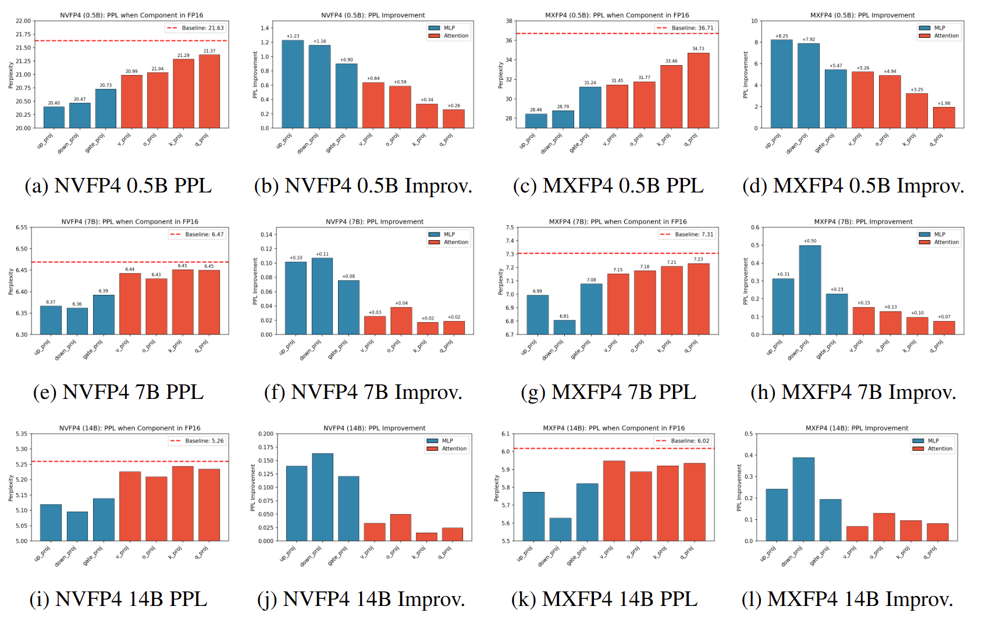

# FP4、FP8 与 INT8/INT4：数值范围、块缩放与推理计算精度

“FP8 模型”和“FP4 模型”是两个很容易误导人的简称。模型权重以 4 bit 存储，不代表乘法、累加、Softmax、残差以及输出也都在 4 bit 中完成；KV Cache 是 FP8，也不代表 Attention 的两个矩阵乘都一定使用 FP8 Tensor Core。

讨论低精度推理前，应当先把四件事分开：

1. **存储精度**：权重或 KV Cache 在显存中占多少 bit；
2. **操作数精度**：送入 Tensor Core 的两个矩阵是什么格式；
3. **累加精度**：沿 $K$ 维相加时，寄存器中的 accumulator 是 INT32、FP16 还是 FP32；
4. **非线性与输出精度**：LayerNorm、Softmax、残差和下一层输入使用 BF16、FP16 还是 FP32。

本文先解释 INT8、FP8、MXFP8、INT4、MXFP4 和 NVFP4 能表示什么，再沿 GEMM 与 Attention 的实际数据流回答两个问题：低比特究竟低在哪里，以及为什么仍要保留 BF16/FP32 的“高精度岛”。文中的格式定义主要以 [OCP Microscaling Formats v1.0](https://www.opencompute.org/documents/ocp-microscaling-formats-mx-v1-0-spec-final-pdf)、[NVIDIA Transformer Engine](https://docs.nvidia.com/deeplearning/transformer-engine/user-guide/features/low_precision_training/nvfp4/nvfp4.html) 和 [TensorRT 量化类型说明](https://docs.nvidia.com/deeplearning/tensorrt/latest/inference-library/quantized-types-schemes.html) 为准。

## 1. 为什么还需要 8 bit 和 4 bit

低精度首先是一种系统优化，而不只是一种数值压缩。

- **容量**：一个 70B 模型只算原始权重，BF16 约为 140 GB，FP8 约为 70 GB，裸 FP4 约为 35 GB；更低的位宽可能让模型少跨一张卡。
- **带宽**：自回归 Decode 的矩阵乘通常 $M$ 很小，GPU 经常在等权重从 HBM 搬入。权重减半，理论上也把最主要的读流量减半。
- **算力**：在适合的矩阵形状上，新一代 Tensor Core 每周期能处理更多低精度元素。例如 Blackwell 同时提供 FP8 和块缩放 FP4 的 MMA 指令。
- **缓存与通信**：更小的权重、激活和 KV Cache 更容易留在片上缓存，也能减少跨 GPU 传输量。

但低精度并非自动加速。一次低精度调用的时间更接近

$$
T_{\text{low}}
=T_{\text{quant}}+T_{\text{scale/pack}}+T_{\text{MMA}}+T_{\text{epilogue}}.
$$

矩阵太小时，动态量化、scale 读取、布局变换与 kernel launch 的固定成本可能超过低精度 MMA 节省的时间。Transformer Engine 的[性能说明](https://docs.nvidia.com/deeplearning/transformer-engine/user-guide/features/low_precision_training/speedups.html)也特别指出，低精度收益依赖矩阵形状，小投影甚至可能因量化开销而变慢。

## 2. 先看标量：整数、FP8 与 FP4 能表示什么

### 2.1 INT8/INT4：等间距的格点

对称整数反量化可以写成

$$
x \approx \hat{x}=s q,
\qquad q=\operatorname{clip}\left(\operatorname{round}(x/s),q_{\min},q_{\max}\right).
$$

$q$ 是整数码，$s$ 是 scale。补码 INT8 的编码范围为 $[-128,127]$，INT4 为 $[-8,7]$；很多对称量化器会主动使用 $[-127,127]$ 或 $[-7,7]$，让正负两侧严格对称。只要没有 clipping，舍入的绝对误差上界约为 $s/2$。

整数的优点是简单、均匀，缺点是**所有值共享同一个绝对步长**。如果一个块中有离群值，$s$ 必须变大，靠近零的大量普通值便会挤在少数几个格点上。

### 2.2 浮点：用指数换动态范围

常见二进制浮点可抽象为

$$
x=(-1)^S\times 2^E\times (1+M),
$$

其中 $S$ 是符号，$E$ 控制数量级，$M$ 提供同一数量级内的精细刻度。指数位越多，动态范围越大；尾数位越多，相邻可表示数越密。

| 格式     | 位分配 |                最大有限正数 | 最小正规格化正数 | 最小非零正数 | 特点                           |
| -------- | -----: | --------------------------: | ---------------: | -----------: | ------------------------------ |
| FP32     |  E8M23 | $\approx 3.40\times10^{38}$ |       $2^{-126}$ |   $2^{-149}$ | 适合归约与数值敏感计算         |
| BF16     |   E8M7 | $\approx 3.39\times10^{38}$ |       $2^{-126}$ |   $2^{-133}$ | 与 FP32 指数范围相同，尾数更短 |
| FP16     |  E5M10 |                     $65504$ |        $2^{-14}$ |    $2^{-24}$ | 精度高于 BF16，范围明显更小    |
| FP8 E4M3 |   E4M3 |                       $448$ |         $2^{-6}$ |     $2^{-9}$ | 精度优先，常用于前向激活/权重  |
| FP8 E5M2 |   E5M2 |                     $57344$ |        $2^{-14}$ |    $2^{-16}$ | 范围优先，训练反向更常见       |
| FP4 E2M1 |   E2M1 |                         $6$ |              $1$ |        $0.5$ | 必须配合细粒度缩放             |

这里的 FP8 指 OCP 定义的有限数格式。E4M3 没有无穷大编码，E5M2 则保留 Inf/NaN。FP4 E2M1 的 16 个 bit pattern 对应

$$
\{-6,-4,-3,-2,-1.5,-1,-0.5,-0,
 +0,+0.5,+1,+1.5,+2,+3,+4,+6\}.
$$

它只有 0、0.5、1、1.5、2、3、4、6 这 8 个非负数。若直接拿 E2M1 表示整个张量，小于 0.5 的非零值全部会消失，超过 6 的值全部会饱和。因此，现实中的 FP4 几乎总是“4 bit 数据 + 分块 scale”，而不是裸 E2M1。

## 3. Microscaling：让一小组数共享一个指数

### 3.1 原始格式的范围不等于张量的范围

量化格式能表示的真实数值范围还要乘 scale：

| 方案     |               量化块 | scale                   | 单块有效范围                                           |
| -------- | -------------------: | ----------------------- | ------------------------------------------------------ |
| INT8     | tensor/channel/block | 常为 FP16/BF16/FP32     | $[-128s,127s]$；对称量化常为 $[-127s,127s]$            |
| FP8 E4M3 | tensor/channel/block | 常为 FP32               | $[-448s,448s]$                                         |
| MXFP8    |                   32 | E8M0，共享 8 bit 指数   | $[-448\cdot2^e,448\cdot2^e]$                           |
| INT4     |          常见 64/128 | 常为 FP16/BF16          | $[-8s,7s]$                                             |
| MXFP4    |                   32 | E8M0，共享 8 bit 指数   | $[-6\cdot2^e,6\cdot2^e]$，最小非零幅值为 $0.5\cdot2^e$ |
| NVFP4    |                   16 | 每块 E4M3 + 每张量 FP32 | $[-6s_gs_b,6s_gs_b]$，最小非零幅值为 $0.5s_gs_b$       |

所以“NVFP4 的范围是 $[-6,6]$”只描述了块内 E2M1 码，而不是反量化后的真实张量。只要 scale 可变，张量的绝对范围也随之变化；真正固定的是**一个块内能保留的相对层次**。

### 3.2 MXFP8 与 MXFP4

OCP MX 格式把连续 32 个元素作为一个块：

$$
\hat{x}_i = 2^e q_i.
$$

MXFP8 的 $q_i$ 为 E4M3 或 E5M2，MXFP4 的 $q_i$ 为 E2M1；共享 scale 是 E8M0，本质上只能表达 $2^e$。E8M0 很省硬件，但 scale 只能按 2 倍跳变。

OCP 规范给出了基准转换方法，却没有规定所有量化器必须逐 bit 相同。例如 scale 可以向下取整，也可以向上取整以避免块最大值溢出。[MXFP8 训练配方研究](https://arxiv.org/abs/2506.08027)发现，scale 的舍入方向本身就可能影响大规模训练稳定性。这提醒我们：**格式定义**只规定如何解释 bit，amax、clipping、舍入和校准策略属于**量化算法**。

### 3.3 NVFP4

NVFP4 同样用 E2M1 存数据，但把块缩小到 16 个元素，并增加两级缩放：

$$
\hat{x}_i=s_g\,s_b\,q_i,
$$

其中 $s_b$ 是每 16 个元素一个 E4M3 scale，$s_g$ 是每张量一个 FP32 scale。E4M3 局部 scale 比 E8M0 的幂次 scale 更细，16 元素块也减少了离群值“污染”邻居的范围；代价是更多元数据、更复杂的布局和搬运。

需要纠正一个常见表述：NVFP4 不是“16 个数共享 4 bit scale”。**数据元素是 4 bit，局部 scale 是 8 bit E4M3，另有 FP32 全局 scale。**

忽略 padding 与全局 scale 后，每元素有效存储开销为

$$
\begin{aligned}
\text{MXFP8}&: 8+8/32=8.25\text{ bit},\\
\text{MXFP4}&: 4+8/32=4.25\text{ bit},\\
\text{NVFP4}&: 4+8/16=4.5\text{ bit}.
\end{aligned}
$$

因此 70B 权重的粗略体积不是严格的 35 GB：MXFP4 约 37.2 GB，NVFP4 约 39.4 GB；embedding、norm、lm_head 等未量化参数还会继续增加实际体积。

### 3.4 “NVFP8”需要先看量化配置

MXFP8 是 OCP 有明确定义的格式，NVFP4 也有 NVIDIA 公开的格式契约；“NVFP8”则经常作为模型、checkpoint 或产品的营销标签出现，并不是一个与它们同等明确、统一的公开数据格式。不能只凭名字推断它一定是“16 元素一块、E4M3 scale”。部署时应检查 checkpoint 的 `quantization_config`、scale 的 shape/dtype、块大小以及目标 kernel 接受的 operand 类型。

## 4. Scale 怎么选：范围和精度不能同时白拿

设块内最大绝对值为 $a_{\max}$，E2M1 最大值为 6。最直观的 scale 是

$$
s=\frac{a_{\max}}{6},
$$

把最大值映射到 6。但 E2M1 在高端只有 3、4、6，4 和 6 之间有一个很大的空洞。对某些分布，把最大值映射到 4，反而能让中间值落到更合适的格点。[Four Over Six](https://arxiv.org/abs/2512.02010)系统研究的正是这个选择。

例子是 $[1,2,3,4]$：最大值映射到 4 时四个值都可精确恢复；若映射到 6，则中间值未必更准。换成 $[1,2,8,12]$，映射到 6 又更合适。没有一个规则对所有块都最优。

scale 自身也被量化时，误差可拆成

$$
(s+\delta s)(q+\delta q)-sq
=s\delta q+q\delta s+\delta s\delta q.
$$

第一项来自元素量化，第二项来自 scale 量化，第三项是二者耦合。较小的 block、非幂次 E4M3 scale、旋转/平滑、异常值通道单独处理，本质上都在减少这三类误差中的一部分。仓库中的 [FP4 格式探针](../code/fp4_format_probe.py)列出了 E2M1 的精确码本，并复现了 MXFP4/NVFP4 有效位宽、scale 选择和幂次重缩放实验。

## 5. GEMM 到底用什么精度算

矩阵乘可写成

$$
C_{mn}=\sum_{k=1}^{K} A_{mk}B_{kn}.
$$

操作数只有 4/8 bit，不意味着这个和也只有 4/8 bit。常见推理路径如下：

| 路径             | 显存中的输入                  | Tensor Core 操作数                             | 累加                                   | 常见输出              | 核心收益             |
| ---------------- | ----------------------------- | ---------------------------------------------- | -------------------------------------- | --------------------- | -------------------- |
| INT8 W8A8        | INT8 权重、INT8 激活          | INT8 × INT8                                    | INT32                                  | BF16/FP16/FP32        | 原生整数吞吐         |
| FP8 W8A8         | E4M3/E5M2                     | FP8 × FP8                                      | 通常 FP32，也存在 FP16/fast-accum 路径 | BF16/FP16，或继续 FP8 | 原生 FP8 Tensor Core |
| MXFP8            | FP8 + E8M0 block scale        | 块缩放 FP8 × FP8                               | Blackwell block-scaled MMA 为 FP32     | 常见 BF16             | 细粒度动态范围       |
| INT4 W4A16       | packed INT4 权重、16 bit 激活 | 权重在片上解包/反量化后，与 BF16/FP16 激活相乘 | 通常 FP32                              | BF16/FP16             | 主要省权重带宽       |
| INT4 W4A4        | INT4 权重、INT4 激活          | INT4 × INT4                                    | INT32                                  | 反缩放后 BF16/FP16    | 原生整数低比特计算   |
| MXFP4/NVFP4 W4A4 | E2M1 + block scale            | 块缩放 FP4 × FP4                               | Blackwell block-scaled MMA 为 FP32     | BF16/FP16             | 原生 FP4 Tensor Core |

前四行中特别容易混淆的是 INT4 W4A16。TensorRT 把 INT4 定位为 weight-only 类型，并在计算前做反量化；高性能 kernel 会把读取、解包、反量化和矩阵乘融合起来，但数值上仍不是“INT4 × BF16 的整数点积”。它省下的是 HBM 中的权重字节，真正送进乘法单元的权重 fragment 往往已经是 FP16/BF16。

原生整数 INT4 MMA 则要求两边都是 INT4，乘积累加到 INT32。原生 MXFP4/NVFP4 MMA 是另一条硬件路径：输入是带 block scale 的 E2M1，Blackwell `tcgen05` 块缩放 MMA 固定使用 FP32 accumulator。相关算子定义可见 [CUTLASS tcgen05 文档](https://docs.nvidia.com/cutlass/4.5.2/media/docs/pythonDSL/mma_docs/tcgen05_programming.html)。

### 5.1 为什么低比特乘法仍要 FP32 累加

一个输出可能累加几千个乘积。顺序浮点求和的经典误差上界包含

$$
\gamma_K\approx\frac{Ku}{1-Ku},
$$

其中 $u$ 是单位舍入误差。取 $K=4096$，FP32 的 $u=2^{-24}$，$Ku\approx2.4\times10^{-4}$；BF16 的 $u=2^{-8}$，此时 $Ku>1$，这个一阶误差界已经失去意义。真实 Tensor Core 使用树形/分块归约，误差不会等同于简单顺序求和，但数量级仍说明：**低精度输入误差已经不可避免，没必要再让长归约产生巨大的额外舍入误差。**

块缩放还要求每个 $K$ block 乘自己的 scale：

$$
C_{mn}=\sum_t s^A_{mt}s^B_{tn}
\left(\sum_{k\in\mathcal{B}_t}q^A_{mk}q^B_{kn}\right).
$$

不同 $t$ 的 scale 乘积不同，不能等到整个点积结束后只乘一个总 scale。FP32 accumulator 能容纳这些不同数量级的块贡献。它只驻留在片上寄存器/累加器中，不会把 4 bit checkpoint 重新变成 32 bit 权重，因此不抵消显存和带宽收益。

## 6. 8 bit 推理：Linear 可以 FP8，Attention 要逐段看

Attention 的核心数据流为

$$
S=\frac{QK^\mathsf{T}}{\sqrt d},
\qquad P=\operatorname{softmax}(S),
\qquad O=PV.
$$

一个典型的 FP8 Transformer 推理流水线更接近：

1. residual、RMSNorm/LayerNorm 保持 BF16，归约统计常用 FP32；
2. Q/K/V、O 以及 MLP 投影执行 FP8 W8A8 GEMM，FP32 累加，再输出 BF16；
3. RoPE 在 BF16/FP32 中应用；
4. Attention kernel 可能走 BF16，也可能走专门的 FP8 路径；
5. Softmax 的 max、sum、LSE 和在线重缩放保留 FP32；
6. Attention 输出回到 BF16，再进入残差路径。

因此“8 bit GEMM”最常见的含义是 **FP8 输入、FP32 累加、BF16 输出**，而不是 FP8 累加。PTX 也允许部分 FP8 MMA 使用 FP16 destination，cuBLASLt 还有降低中间累加精度的 fast-accum 选项，所以最终仍应以 kernel 配置为准。

### 6.1 FP8 Attention

专门的 FP8 Attention 会把 Q、K、V 量化为 E4M3/E5M2，并携带 FP32 descale；$QK^\mathsf{T}$ 和 $PV$ 使用低精度 Tensor Core，点积在 FP32 中累加，Softmax 的统计量仍是 FP32。两个 GEMM 之间的 $P$ 可以再次量化为 FP8，也可以保留更高精度，最终输出通常是 BF16/FP16；cuDNN 的图接口也允许显式配置 FP8 输出。具体 scale 与数据类型接口见 [cuDNN FP8 SDPA 文档](https://docs.nvidia.com/deeplearning/cudnn/v1.9.0/operations/Attention.html)。

FlashAttention-3 的 FP8 前向还会对 Q/K 做 incoherent processing，并使用 block quantization 来减轻离群值影响。重点不是“整个 Attention 都变成 FP8”，而是两次矩阵乘的输入变成 FP8，同时在线 Softmax 和累加保留高精度。

### 6.2 GQA 不决定精度

GQA 只是让查询头数 $H_q$ 大于 KV 头数 $H_{kv}$，多组 Q 头复用同一组 K/V。它减少 KV Cache 与 K/V 搬运，却没有规定 Q、K、V 必须是 BF16、FP8 或 INT8。支持 GQA 的 FP8 Attention kernel 可以直接处理这种 head 映射；没有对应低精度 kernel 时，同一个模型也可以退回 BF16 Attention。

同理，“FP8 KV Cache”首先是一条**存储契约**：

- 普通实现可以在 tile 读入时把 FP8 K/V 反量化为 BF16，再做 BF16 Attention；
- 专用 kernel 可以直接把 FP8 K/V 送入 FP8 Tensor Core，只在 accumulator 和 Softmax 中升精度；
- 较差的实现甚至可能先物化整个 BF16 Cache 副本，节省了容量，却增加显存流量和延迟。

只有第二种才是真正的端到端 FP8 Attention 快路径。

### 6.3 MLA：压缩结构与计算精度也是两回事

MLA 用低秩 latent 压缩 KV Cache，解决的是存储结构；它仍不自动决定核心 Attention 的数值格式。DeepSeek 公布的 V3/R1 H800 推理系统明确写到：矩阵乘和 dispatch 传输与训练时的 FP8 对齐，但 **MLA 核心与 combine 传输使用 BF16**，见 [DeepSeek 推理系统概览](https://github.com/deepseek-ai/open-infra-index/blob/56d86855fcf6e08fdfd45ce6280bd24322c93351/202502OpenSourceWeek/day_6_one_more_thing_deepseekV3R1_inference_system_overview.md)。所以“DeepSeek 是 FP8 模型”不能推出“MLA 的 $QK^\mathsf{T}$、Softmax、$PV$ 都是 FP8”。

当 MLA KV Cache 以 FP8 保存时，是否反量化成 BF16 计算由 backend 决定。正确的折中通常是在片上按 tile 反量化，不落地完整 BF16 副本；具备原生支持的 kernel 则可直接消费 FP8 Cache。SGLang 的一个[实现问题记录](https://github.com/sgl-project/sglang/issues/35291)展示了某些 backend 把整个 FP8 MLA Cache `.to(q.dtype)` 为 BF16 所造成的额外开销，也说明“Cache dtype”和“计算 dtype”必须分开分析。

## 7. 4 bit 推理：GEMM 已经原生化，Attention 仍是混合精度

“4 bit 模型”目前常对应两类完全不同的执行方式：

### 7.1 INT4 W4A16：4 bit 主要省带宽

GPTQ、AWQ 一类方案通常把 Linear 权重以 INT4 存储，激活仍是 BF16/FP16。fused kernel 从 HBM 读取 packed INT4，在片上解包并乘 scale，然后与 16 bit activation 做高精度点积，通常 FP32 累加并输出 BF16。

因此它的 Q/K/V 投影可以称为 4 bit weight GEMM，但投影结果已经是 BF16。随后 FlashAttention 的 $QK^\mathsf{T}$、Softmax 和 $PV$ 通常继续使用 BF16/FP32。给模型贴上 INT4 标签，并不意味着 Attention kernel 是 INT4。

### 7.2 MXFP4/NVFP4 W4A4：Linear 使用 FP4 Tensor Core

Blackwell 原生块缩放路径可让权重和动态量化后的激活都以 FP4 输入 MMA，FP32 累加，再写出 BF16/FP16。这正是 MXFP4/NVFP4 相比传统 weight-only INT4 的关键区别：它不仅压缩权重，还能提高大矩阵乘的 Tensor Core 吞吐。

但默认部署通常仍把 LayerNorm、RoPE、Residual、Softmax、LSE 以及敏感的输出层留在 BF16/FP32；核心 Attention 多数也继续走 BF16，或者至多使用已较成熟的 FP8 Attention。于是一个合理的 NVFP4 推理路径是：

$$
\underbrace{\text{FP4 Linear}}_{\text{FP32 accumulate}}
\rightarrow \text{BF16 }Q,K,V
\rightarrow
\underbrace{\text{BF16/FP8 Attention}}_{\text{FP32 softmax/accumulate}}
\rightarrow \text{BF16 output}.
$$

### 7.3 为什么不把 Softmax 和整个 Attention 都做成 FP4

第一，Softmax 会放大分数差的误差。若两个 score 的误差为 $\delta_i,\delta_j$，它们的概率比会多出因子

$$
\exp(\delta_i-\delta_j).
$$

第二，$P$ 位于 $[0,1]$ 且常有很长的近零尾部。裸 E2M1 的最小非零值是 0.5，即使加 block scale，不同 query 行、不同 tile 的概率分布也需要频繁重缩放，小概率很容易被舍入成零。

第三，Attention 不是单一 GEMM。在线 Softmax 包含 max、指数、求和、重缩放和跨 tile 状态依赖；head dimension 又通常远小于 MLP 的 $K$，两次低比特 MMA 省下的时间可能被量化与 layout conversion 吃掉。最新的 [FP4 FlashAttention-4 研究](https://arxiv.org/abs/2609.04105)也把瓶颈定位在 FP4 Tensor Core 之外的 Softmax 与格式转换，说明“硬件有 FP4 MMA”并不足以自动得到 FP4 Attention 加速。

第四，$PV$ 往往比 $QK^\mathsf{T}$ 更敏感。[Full-Stack FP4 训练研究](https://arxiv.org/abs/2607.04422)选择把部分 QK 相关矩阵乘放到 NVFP4，却保留 PV 等路径为 BF16；这是训练实验，不能直接当成推理标准，但很好地展示了混合精度选择的原因。

### 7.4 FP4 Attention 不是不存在，而是专用算法

[SageAttention3](https://github.com/thu-ml/SageAttention/tree/main/sageattention3_blackwell)已经在 Blackwell 上实现 FP4 Attention：API 接收 BF16/FP16 Q/K/V，先做平滑与量化，再用 E2M1 数据和 E4M3 block scale 执行 FP4 矩阵乘，最后输出 BF16。这里的“FP4 Attention”依然保留 FP32 accumulator 和更高精度 Softmax/输出，并依赖专门的量化与调度，而不是把每个中间张量粗暴 cast 为 FP4。

其仓库也明确提醒当前实现并非对所有模型都无损，主要验证场景偏图像/视频生成。对精度敏感的语言模型，BF16 或 FP8 Attention 仍是更稳妥的默认项。换言之，4 bit Attention 是正在快速发展的 kernel/算法选项，还不是“NVFP4 模型”的必然组成部分。

## 8. FP4 的敏感性：不是所有 Linear 都应一刀切

[Diagnosing FP4 Inference](https://arxiv.org/abs/2603.08747)对 Qwen2.5 0.5B、7B 和 14B 做了组件级与 block 级控制实验，比较 MXFP4 和 NVFP4。实验每次只量化 Q、K、V、O、gate、up、down 七类投影中的一种，其余投影保持 FP16；block 实验则逐块保留高精度，以观察深度位置的影响。

需要注意，该实验把 FP16 权重在运行时量化/反量化，用于隔离数值敏感性，并不等同于原生 FP4 kernel 的端到端性能测试。其主要观察是：

- MLP 的 up/down 投影总体最敏感，gate 次之，Attention 投影通常明显更低；
- 敏感度沿深度有结构，不一定只在最后几层达到峰值，某些配置也有早期 block 效应；
- down projection 接收 SwiGLU/SiLU 后激活，异常值与高敏感性一致；但 up projection 即使异常值比例低也可能同样敏感，说明“极端离群值”不是唯一解释。

工程含义不是永远禁止 MLP 使用 FP4，而是不要只靠一个全局阈值。更实际的方案包括：逐层校准、对敏感层保留 BF16/FP8、缩小 block、使用 NVFP4 的两级 scale、旋转/平滑激活，并同时验证困惑度、推理/代码任务以及长上下文质量。[NVFP4 预训练研究](https://arxiv.org/abs/2509.25149)同样结合旋转、二维权重量化、随机舍入和选择性高精度来控制误差，说明可用的 FP4 系统本来就是混合精度系统。

## 9. 一张决策表

| 模型/功能标签    | Linear GEMM 的典型实际精度                       | Attention 的典型实际精度                       | 应重点确认                               |
| ---------------- | ------------------------------------------------ | ---------------------------------------------- | ---------------------------------------- |
| INT8 W8A8        | INT8 × INT8，INT32 accumulate                    | 多为 BF16；也可另配 INT8/FP8 kernel            | 对称范围、per-channel/block scale        |
| FP8 W8A8         | FP8 × FP8，通常 FP32 accumulate，BF16 out        | BF16 或专用 FP8 Attention；Softmax FP32        | E4M3/E5M2、fast accumulation、输出 dtype |
| FP8 KV Cache     | 与 Linear 无直接关系                             | 读入后 BF16 计算，或 kernel 原生消费 FP8       | 是否物化 BF16 Cache、backend 支持        |
| INT4 W4A16       | 片上反量化后 FP16/BF16 dot，通常 FP32 accumulate | 通常 BF16/FP32                                 | 是 weight-only，还是原生 W4A4            |
| MXFP4/NVFP4 W4A4 | FP4 × FP4，FP32 accumulate，BF16 out             | 默认多为 BF16/FP8；FP4 需专用 kernel           | block size、scale 类型、敏感层豁免       |
| FP4 Attention    | 专用 FP4 block-scaled MMA                        | FP4 QK/PV + FP32 accumulate/Softmax + BF16 out | 算法适用模型、转换开销与精度验证         |

最终可以用三句话概括：

1. **格式范围一定要连同 scale 一起讨论。**E2M1 的裸范围是 $[-6,6]$，MXFP4/NVFP4 张量的实际范围却由 block scale 决定。
2. **4/8 bit 通常描述输入和存储，不描述长归约。**原生 FP4/FP8 Tensor Core 仍普遍用 FP32 累加，Softmax/Norm 也保留 FP32 统计。
3. **Attention 必须按 QK、Softmax、PV、KV Cache 分段说明。**GQA/MLA 是结构，FP8/FP4 是数值格式，两者没有一一对应关系。

## 参考资料

- [MXFP8、MXFP4 与 NVFP4 详解](https://www.qingkeai.online/blog/v85N2eyT)
- [OCP Microscaling Formats (MX) Specification v1.0](https://www.opencompute.org/documents/ocp-microscaling-formats-mx-v1-0-spec-final-pdf)
- [NVIDIA Transformer Engine: NVFP4](https://docs.nvidia.com/deeplearning/transformer-engine/user-guide/features/low_precision_training/nvfp4/nvfp4.html)
- [NVIDIA Transformer Engine: MXFP8](https://docs.nvidia.com/deeplearning/transformer-engine/features/low_precision_training/mxfp8/mxfp8.html)
- [TensorRT Quantized Types and Quantization Schemes](https://docs.nvidia.com/deeplearning/tensorrt/latest/inference-library/quantized-types-schemes.html)
- [CUTLASS tcgen05 MMA Programming Guide](https://docs.nvidia.com/cutlass/4.5.2/media/docs/pythonDSL/mma_docs/tcgen05_programming.html)
- [FP8 Formats for Deep Learning](https://arxiv.org/abs/2209.05433)
- [DeepSeek-V3 Technical Report](https://arxiv.org/abs/2412.19437)
- [Diagnosing FP4 Inference](https://arxiv.org/abs/2603.08747)
- [SageAttention3: Microscaling FP4 Attention for Inference and Exploration](https://arxiv.org/abs/2505.11594)
