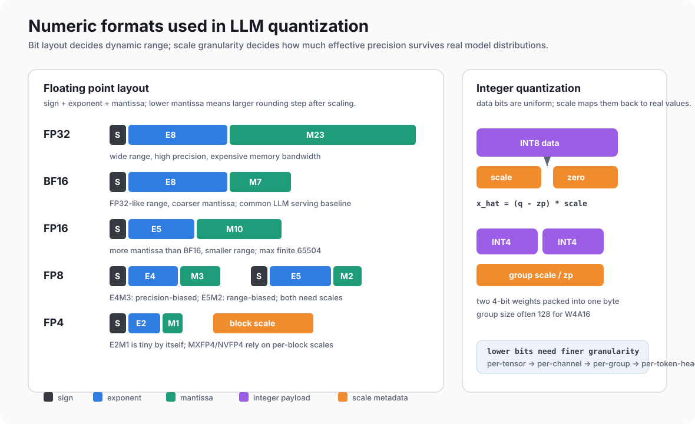
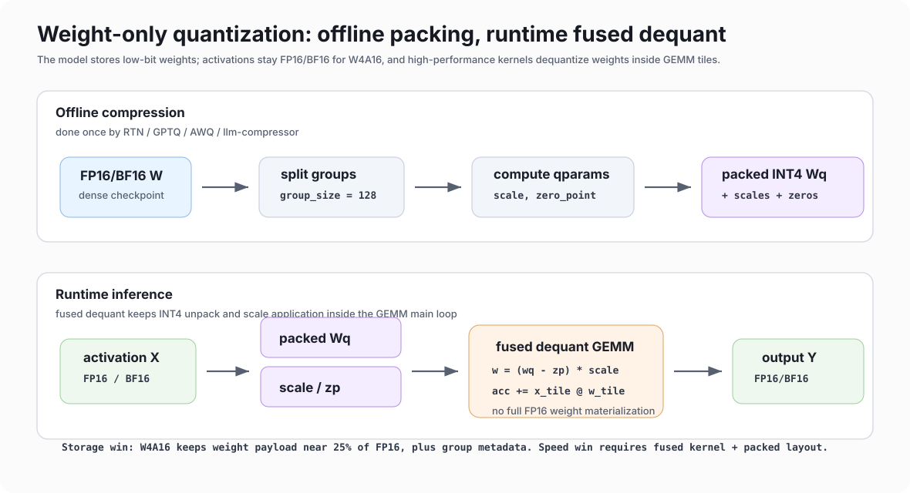
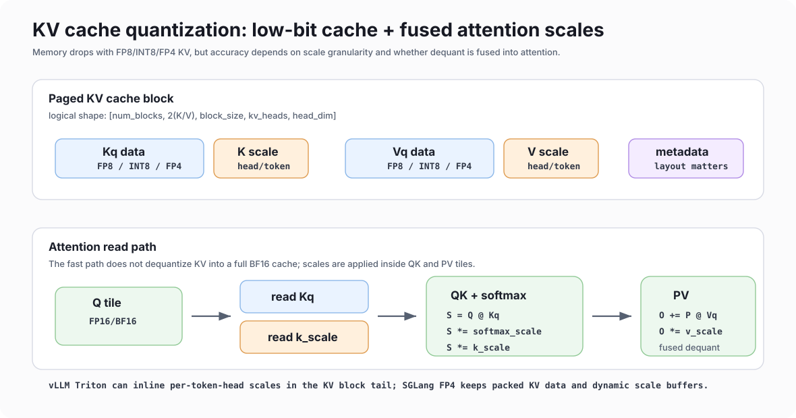

---
tags:
  - LLMInference
  - Quantization
---

# LLM 量化基础与生态综述

整理日期：2026-07-03

本文综合了本仓库 `blog` 目录下的量化笔记，并补充 vLLM、SGLang、llm-compressor、FP8/FP4/KV cache 量化相关公开资料。目标不是替代原始笔记，而是形成一份从基础概念到工程生态的总览。

## 阅读范围

本地笔记：

- `blog/量化/量化.md`
- `blog/量化基础.md`
- `blog/量化前沿.md`
- `blog/量化算子.md`
- `blog/Int4 量化.md`
- `blog/llm-compressor框架解析.md`
- `blog/vllm_per_token_head_kv_scale_cache_flow.md`
- `blog/vllm中的图编译.md` 中与 quant / KV / attention 边界有关的内容

外部资料重点核对：

- vLLM quantized KV cache 与 Triton attention KV cache layout
- SGLang quantization 与 quantized KV cache 文档
- GPTQ、AWQ、SmoothQuant、LLM.int8、FP8 formats、MARLIN、KIVI、KVQuant、TurboQuant、UltraQuant 等论文或项目文档

## 1. 量化基础

### 1.1 一句话地图

LLM 量化本质上是在精度、显存、带宽、算力利用率和 kernel 复杂度之间做交换：

- 权重量化主要省模型参数显存和权重读取带宽，典型形态是 W8A8、W4A16、GPTQ、AWQ。
- 激活量化主要省 GEMM 输入/输出带宽，并解锁 INT8/FP8 Tensor Core，但难点在动态分布和 outlier。
- Attention / KV cache 量化主要省长上下文和大 batch 下的 KV 显存，收益随上下文长度、并发和 decode 轮数增加。
- 低比特格式本身不等于加速，只有当 scale、pack/unpack、反量化、重排和 GEMM/attention 被 fused 到高性能 kernel 中，才会体现吞吐优势。

### 1.2 常见数值格式、表示范围与精度影响



| 格式 | 典型范围/结构 | 常见用途 | 主要影响 |
| --- | --- | --- | --- |
| FP32 | E8M23，最大约 `3.4e38` | 参考精度、少量累加、scale | 精度高但显存和带宽成本大 |
| TF32 | E8M10，范围接近 FP32 | NVIDIA Tensor Core GEMM | 比 FP32 快，尾数精度低于 FP32 |
| FP16 | E5M10，最大 `65504` | 传统推理/训练 | 尾数比 BF16 多，范围小，容易 overflow |
| BF16 | E8M7，最大约 `3.39e38` | 当前 LLM 推理基线 | 动态范围稳定，尾数较粗 |
| FP8 E4M3 | E4M3；不同 fn/fnuz/OCP 变体最大值约 `240` 到 `448` | forward、权重、激活、KV | 精度优于 E5M2，范围较小，需 scale |
| FP8 E5M2 | E5M2，最大约 `57344` | 梯度、KV、动态范围更大的张量 | 范围大但尾数少，量化噪声更大 |
| INT8 | signed 常见 `[-128, 127]`，也可 unsigned `[0, 255]` | W8A8、INT8 KV | 硬件支持成熟，但对 outlier 敏感 |
| INT4 | signed 常见 `[-8, 7]` 或对称有效 `[-7, 7]` | W4A16、W4A8 | 显存收益大，通常需要 group-wise scale |
| FP4 E2M1 | E2M1，原始最大有限值通常为 `6`，配合 block scale | NVFP4、MXFP4、KV4 | 极低比特，必须依赖 block scaling 和专用 kernel |
| MXFP4 | E2M1 数据 + 通常每 32 个元素共享 E8M0 scale | Blackwell / 低精度探索 | scale 开销低，精度依赖 block 分布 |
| NVFP4 | E2M1 数据 + 通常每 16 个元素共享 FP8 scale，再配全局 scale | Blackwell 生态、NVFP4 推理 | 比 MXFP4 更细粒度，metadata 和 kernel 要匹配 |

数值格式的误差主要来自三处：

- clipping error：真实值超过可表示范围，被截断到最大/最小值。
- rounding error：落在两个可表示值之间，只能映射到最近格点。
- scale mismatch：一个 scale 覆盖过大的张量范围，导致小值有效位数不足。

### 1.3 统一量化公式

均匀整数量化常写成：

```text
q = clamp(round(x / scale) + zero_point, qmin, qmax)
x_hat = (q - zero_point) * scale
```

其中：

- `scale` 决定浮点值到离散整数格点的间距。
- `zero_point` 决定浮点零映射到哪个整数值。
- `qmin/qmax` 由 INT8、INT4 等格式决定。

浮点低比特量化如 FP8、FP4 也需要 scale，只是 `q` 不再是均匀整数格点，而是低比特浮点编码：

```text
x_scaled = x / scale
q = cast_to_fp8_or_fp4(x_scaled)
x_hat = cast_to_fp16_or_bf16(q) * scale
```

### 1.4 对称量化与非对称量化

对称量化：

```text
scale = max(abs(x)) / qmax
zero_point = 0
```

优点是 kernel 简单，零点为 0，矩阵乘法中不需要额外处理 zero point。LLM 权重通常经过 LayerNorm/RMSNorm 后分布较接近零均值，因此权重量化中对称方案很常见。

非对称量化：

```text
scale = (x_max - x_min) / (qmax - qmin)
zero_point = round(qmin - x_min / scale)
```

优点是能更好覆盖偏移分布，缺点是 kernel 需要处理 zero point 修正。AWQ/GPTQ 的 INT4 权重常见 asymmetric group quantization，即每组权重有 scale 和 zero point，精度更稳，但 pack/unpack 与反量化更复杂。

### 1.5 量化粒度

| 粒度 | scale 形状 | 常见对象 | 优点 | 风险 |
| --- | --- | --- | --- | --- |
| Per-tensor | 一个张量一个 scale | 简单 INT8/FP8、KV FP8 | 元数据少、kernel 简单 | outlier 会拖累整体 |
| Per-channel | 通常沿输出通道/列/行一组 scale | 权重、K cache | 精度比 per-tensor 好 | scale 读取和布局复杂 |
| Per-group | 每 `group_size` 个元素一个 scale | W4A16/GPTQ/AWQ | INT4 权重主流折中 | group 越小 metadata 越多 |
| Per-block | 二维 block 一个 scale | FP8 block、MXFP4/NVFP4 | 适合 tile GEMM | block shape 要贴近 kernel |
| Per-token | 每个 token 一个 scale | activation dynamic quant | 适配动态激活范围 | 每步动态计算 scale |
| Per-token-head | 每个 token、每个 KV head 一个 scale | KV cache quant | 长上下文下更稳 | scale 存储和 attention 读取复杂 |
| Per-attention-head | 每层每个 attention head 一个 scale | vLLM FP8 KV calibration | 精度/开销折中 | 需要校准或运行时 scale |

一个实用结论：低比特越低，粒度通常需要越细。INT4/FP4 如果仍用 per-tensor，常会被少量 outlier 主导 scale；而 per-group/per-block/per-token-head 可以把误差局限在局部。

### 1.6 权重量化

权重量化处理的是模型静态参数，最大优势是离线完成、推理时复用。常见模式如下：

| 方案 | 形式 | 核心思想 | 工程特点 |
| --- | --- | --- | --- |
| INT8 weight-only | W8A16/W8A8 的权重部分 | 权重 INT8 存储，计算时反量化或 INT8 GEMM | 精度稳，收益中等 |
| RTN W4A16 | INT4 weight + FP16/BF16 activation | 直接 round-to-nearest | 最简单，但精度通常弱于 GPTQ/AWQ |
| GPTQ | W4A16，常用 group size 128 | 用近似 Hessian 做逐列/逐块误差补偿 | 精度强，校准和量化成本较高 |
| AWQ | W4A16 | 依据 activation 保护少量 salient channel | 校准相对轻，和 Marlin/ExLlama 等 kernel 绑定紧 |
| FP8 weight | W8A8 FP8 或 FP8_DYNAMIC | 权重 FP8，激活动态 FP8 | Hopper/Blackwell 生态常见，适合高端 GPU |
| FP4/NVFP4/MXFP4 | W4A4/W4A8 或 block FP4 | block scale + 专用低精度算子 | 学术和新硬件方向，依赖 kernel 成熟度 |



权重量化的主要工程变量：

- group size：常见 `128`，越小越准但 scale/zero point 越多。
- 是否 asymmetric：INT4 asymmetric 精度更好，但 zero point 带来额外计算。
- 是否 act-order：GPTQ 中按照激活重要性重排量化顺序，通常提升精度但影响布局。
- 是否 weight reorder：Marlin/AWQ/ExLlama 等 kernel 通常要求专用 pack layout。
- 是否 fused dequant：先反量化成 FP16 再 GEMM 通常吃掉收益；高性能实现会在 GEMM tile 内边读边反量化。

### 1.7 激活值量化

激活比权重更难量化，原因是：

- 动态性强：每个 prompt、token、layer 的分布都不同。
- outlier 明显：少数 channel 可能远大于其他 channel。
- 不能完全离线：activation scale 往往要运行时计算。

主流方案：

- Dynamic per-token quantization：每个 token 运行时统计 absmax，生成 activation scale，适合 FP8/INT8 W8A8。
- SmoothQuant：把 activation 的量化难度迁移到 weight，公式可理解为 `x' = x / s, w' = w * s`，让 activation 更平滑。
- LLM.int8：绝大部分矩阵乘用 INT8，outlier channel 走 FP16 混合精度路径。
- clipping/MSE observer：在校准集上找更合适的截断范围，不只用最大值。

激活量化的工程收益通常来自 Tensor Core：例如 INT8xINT8 或 FP8xFP8 GEMM。如果只是把 activation 量化后又马上反量化到 BF16，再走 BF16 GEMM，收益通常只剩带宽节省，甚至可能变慢。

### 1.8 Attention score 量化

Attention 中真正的 score 是：

```text
S = Q @ K^T * softmax_scale
P = softmax(S)
O = P @ V
```

实际工程里很少单独把完整 attention score 矩阵长期量化存储，原因是：

- score 是临时中间结果，FlashAttention 类 kernel 会 tile 化计算，不 materialize 完整矩阵。
- softmax 对相对大小敏感，score 上的系统性误差可能被指数放大。
- causal mask、sliding window、prefix cache、paged attention 会让 score 生命周期很短。

更常见的做法是量化 Q/K/V 或 KV cache，并在 attention kernel 内融合 scale：

```text
K = K_q * k_scale
V = V_q * v_scale
S = Q @ K_q^T * (softmax_scale * k_scale)
O += P @ V_q * v_scale
```

因此，“attention score 量化”在框架实现中通常表现为 Q/K/V 低精度读取、KV cache 量化、以及 QK/PV 路径中的 fused scale，而不是对 score matrix 做一个独立量化格式。

### 1.9 KV Cache 量化

KV cache 是 decode 阶段的显存大头之一。对每层、每个 token、每个 KV head 都要存 K/V：

```text
KV bytes ~= 2 * num_layers * seq_len * num_kv_heads * head_dim * bytes_per_elem
```

从 BF16 降到 FP8/INT8，理论上数据区约减半；降到 FP4，数据区约降到四分之一，但要加上 scale metadata。



KV cache 量化常见粒度：

| 粒度 | scale 位置 | 精度 | 工程复杂度 |
| --- | --- | --- | --- |
| Per-tensor | 每层 K/V 各一个 scale | 最弱 | 最简单 |
| Per-head / attn-head | 每层每 head scale | 中等 | 需要校准或加载 scale |
| Per-token | 每 token scale | 较好 | 动态计算 scale |
| Per-token-head | 每 token 每 head scale | 更好 | scale 存储、paged cache、attention kernel 都要适配 |
| Per-block FP4 | 每 16/32 个元素 scale | FP4 常用 | 需要 pack 和专用 dequant |

K 和 V 的量化敏感性并不完全一样：

- K 影响 score `QK^T`，误差会进入 softmax，可能改变 attention 分布。
- V 影响 value 加权求和，通常更像输出噪声。
- 长上下文下，KV 误差会随 token 数和 attention 累积放大，per-channel 这种固定维度 scale 容易被跨 token 的分布变化拖累。

实用选型上，FP8 KV 是当前工程可用性最好的第一步；INT8/FP8 per-token-head 更适合追求长上下文容量；FP4 KV 需要严格评估任务，尤其是数学、检索、长链路 agent 场景。

## 2. 量化生态

### 2.1 llm-compressor 权重量化组件

`llm-compressor` 的角色是离线压缩：输入 HuggingFace 模型、recipe 和 calibration data，输出带 `quantization_config` / `compressed-tensors` 元数据的模型，再由 vLLM 等推理框架加载。

典型链路：

```text
model + recipe + calibration data
  -> oneshot
  -> CompressionLifecycle
  -> Recipe / Modifiers
  -> calibration forward + hooks / observers
  -> pack / save compressed-tensors
  -> vLLM loader
  -> Marlin / CUTLASS / Triton / FP8 kernel
```

#### Event 机制如何把 oneshot 串起来

`llm-compressor` 里真正把“入口、recipe、校准 forward、逐层压缩、保存”串起来的是 `CompressionLifecycle` 和 `LifecycleCallbacks`。可以把它理解成两层机制：

- 外层 event：`oneshot` / pipeline 显式触发 `CALIBRATION_EPOCH_START`、`SEQUENTIAL_EPOCH_END`、`CALIBRATION_EPOCH_END`。
- 内层 hook：modifier 在 event 中注册 PyTorch forward hook / pre-hook，校准 forward 时自动收集 activation、Hessian、observer min/max、AWQ scale 搜索所需统计量。

核心调用链：

```text
oneshot(...)
  -> pre_process
     - 加载/接收 model、tokenizer、dataset
     - patch save_pretrained，使其能保存 compressed-tensors

  -> active_session().initialize(recipe=...)
     -> CompressionLifecycle.initialize
        -> Recipe.create_instance
        -> for modifier in recipe.modifiers:
             modifier.initialize(state)
             modifier.on_initialize(state)

  -> CalibrationPipeline.from_modifiers(...)
     -> DataFreePipeline / BasicPipeline / SequentialPipeline

  -> LifecycleCallbacks.calibration_epoch_start()
     -> active_session().event(EventType.CALIBRATION_EPOCH_START)
     -> CompressionLifecycle.event
        -> for modifier in recipe.modifiers:
             modifier.update_event(state, event)
             modifier.on_event / on_start
             注册 hooks、observer、Hessian buffer、AWQ activation cache 等

  -> calibration forward
     -> model(**batch)
     -> PyTorch hooks 自动记录当前 module 的输入/输出统计

  -> LifecycleCallbacks.sequential_epoch_end(modules)
     -> modifier.update_event(...)
     -> 对当前 modules 计算 qparams / 搜索 scale / GPTQ 误差补偿 / 压缩权重

  -> propagation forward
     -> HooksMixin.disable_hooks()
     -> 用量化后的 subgraph 重新 forward，把误差后的输出传给下一层校准

  -> LifecycleCallbacks.calibration_epoch_end()
     -> modifier.on_end
     -> 移除 hooks，freeze quantization，收尾剩余压缩状态

  -> active_session().finalize()
  -> save_pretrained(save_compressed=True)
```

这里最关键的是 `CompressionLifecycle.event()`：

```python
event = Event(type_=event_type)
for modifier in recipe.modifiers:
    modifier.update_event(state=state, event=event, **kwargs)
```

所以 recipe 里的 modifier 顺序就是事件处理顺序。比如 AWQ 常见 recipe 是：

```python
recipe = [
    AWQModifier(...),
    QuantizationModifier(...),
]
```

这意味着每个 calibration event 都先让 AWQ 做 activation-aware 的缩放/平衡，再让 `QuantizationModifier` 根据变换后的权重计算 qparams、pack 权重并写入 compressed-tensors 元数据。AWQ 不是最终量化格式，它是前置 transform。

`SEQUENTIAL_EPOCH_END` 是 PTQ 路径里最重要的事件。`SequentialPipeline` 会按 decoder layer 或 traced subgraph 逐块执行：

```text
for subgraph in traced_subgraphs:
    1. onload 当前 subgraph
    2. calibration pass：hooks 开启，收集当前 subgraph 的统计
    3. SEQUENTIAL_EPOCH_END(modules)：modifier 压缩当前 subgraph
    4. propagation pass：hooks 关闭，用量化后的 subgraph 产出下一层输入
    5. offload 当前 subgraph，继续下一块
```

这样不需要一次性为全模型保存所有 activation / Hessian / 临时权重，显存压力小很多。`BasicPipeline` 则更简单：全模型跑完 calibration batches 后，对 `list(model.modules())` 触发一次 `SEQUENTIAL_EPOCH_END`。

#### 我们使用的最小 example

下面是最小 FP8 dynamic 离线压缩样板，适合先验证 llm-compressor -> compressed-tensors -> vLLM/SGLang loader 这条链路。这里用内联文本构造一个很小的 calibration dataset，实际使用时换成业务 prompt 或 `ultrachat/open_platypus/c4` 一类校准集即可。

```python
from datasets import Dataset

from llmcompressor import oneshot
from llmcompressor.modifiers.quantization import QuantizationModifier


MODEL_ID = "/path/to/dense_model"
OUT_DIR = "/path/to/model-fp8-dynamic"

calib_ds = Dataset.from_dict(
    {
        "text": [
            "Explain why KV cache quantization helps long-context inference.",
            "Summarize the difference between GPTQ, AWQ, and SmoothQuant.",
            "Write a short answer about FP8 E4M3 versus FP8 E5M2.",
            "Give an example of activation outliers in transformer inference.",
        ]
    }
)

recipe = QuantizationModifier(
    targets="Linear",
    scheme="FP8_DYNAMIC",
    ignore=["lm_head"],
)

oneshot(
    model=MODEL_ID,
    tokenizer=MODEL_ID,
    recipe=recipe,
    dataset=calib_ds,
    text_column="text",
    max_seq_length=512,
    num_calibration_samples=len(calib_ds),
    output_dir=OUT_DIR,
    trust_remote_code_model=True,
)
```

这个 example 里 event 的实际展开是：

```text
QuantizationModifier.on_initialize
  -> 给目标 Linear 绑定 FP8_DYNAMIC quantization scheme

CALIBRATION_EPOCH_START
  -> 准备 observer / fake-quant / hook 状态

calibration forward
  -> hooks 看到 Linear 输入；FP8_DYNAMIC 的 activation 是 runtime per-token dynamic，
     权重侧 qparams/scale 会在 modifier 收尾阶段写入模型

SEQUENTIAL_EPOCH_END
  -> 对 Linear 权重计算 FP8 scale，压缩/替换目标模块状态

CALIBRATION_EPOCH_END
  -> freeze quantization，移除 hooks

save_pretrained(save_compressed=True)
  -> 输出 safetensors + quantization_config + recipe
```

如果要把这个最小例子切到 W4A16 GPTQ，只替换 recipe：

```python
from llmcompressor.modifiers.gptq import GPTQModifier

recipe = GPTQModifier(
    targets="Linear",
    scheme="W4A16",
    ignore=["lm_head"],
)
```

如果要切到 AWQ W4A16，则使用 transform + quantization 两段式 recipe：

```python
from llmcompressor.modifiers.quantization import QuantizationModifier
from llmcompressor.modifiers.transform.awq import AWQModifier

recipe = [
    AWQModifier(duo_scaling="both"),
    QuantizationModifier(
        targets="Linear",
        scheme="W4A16_ASYM",
        ignore=["lm_head"],
    ),
]
```

实际业务里建议至少把 `num_calibration_samples` 提到 `128` 或 `256`，并用覆盖真实 prompt 长度、语言、任务分布的数据；尤其 GPTQ/AWQ/SmoothQuant 对校准分布更敏感，四条内联文本只适合 smoke test。

核心组件：

| Modifier / 组件 | 作用 | 典型输出 |
| --- | --- | --- |
| `QuantizationModifier` | 通用 RTN/PTQ 量化，配置 weight/input/output scheme | INT8、INT4、FP8、FP8 dynamic、FP8 block 等 |
| `GPTQModifier` | 收集 Hessian，做 GPTQ 误差补偿 | GPTQ W4A16，常配 group size 128 |
| `AWQModifier` | 搜索 activation-aware scale，保护 salient channel | AWQ transform 后再配 `QuantizationModifier` |
| `SmoothQuantModifier` | 把 activation outlier 迁移到 weight | W8A8 更稳 |
| `AutoRoundModifier` | 通过可学习 rounding 优化 PTQ | 更强但更重的离线过程 |
| `IMatrixGatherer` | 收集 activation 重要性矩阵 | 供 GPTQ/importance-aware quant 使用 |
| QuIP / SpinQuant / QuaRot 类旋转 | 通过正交旋转平滑分布 | 更适合极低比特 |
| `kv_cache_scheme` | 生成 KV cache quant scale / metadata | FP8 KV cache 与框架加载参数配合 |

注意：

- AWQ 不是最终 pack 格式本身，它先做等价缩放/平衡，后面还需要 `QuantizationModifier` 真正量化和保存。
- KV cache 量化即使离线生成了 scale，推理时仍要显式打开框架参数，例如 vLLM 的 `kv_cache_dtype` 或 SGLang 的 `--kv-cache-dtype`。

### 2.2 当前业界主要使用的量化精度和粒度

| 场景 | 主流格式 | 常见粒度 | 使用状态 |
| --- | --- | --- | --- |
| 高端 GPU 通用推理 | FP8 W8A8 / FP8 dynamic | weight per-channel/per-block，activation per-token dynamic | Hopper/Blackwell 生态成熟度较高 |
| INT8 全量化 | INT8 W8A8 | weight per-channel，activation per-token/per-tensor | 老牌方案，SmoothQuant 常用于处理 activation outlier |
| 显存压缩优先 | GPTQ/AWQ W4A16 | INT4 weight per-group，group size 常见 128 | 当前开源 serving 最常见的 4-bit 路线 |
| 更激进吞吐探索 | W4A8 | INT4 weight + INT8 activation | 需要专用 kernel；Hopper 上原生支持并不理想 |
| 新硬件低精度 | NVFP4 / MXFP4 | block 16/32 scale | Blackwell/CDNA4 等平台重点方向 |
| 长上下文容量 | FP8/INT8 KV cache | per-tensor、per-head、per-token-head | 工程可用，需 attention kernel fused dequant |
| 极低 KV cache | FP4 KV、TurboQuant、KIVI/KVQuant | per-block、per-token/per-channel、向量量化 | 论文和部分框架实现并进 |

简化选型：

- 追求稳定上线：BF16 baseline + FP8 dynamic 或 W8A8。
- 显存放不下模型：优先 GPTQ/AWQ W4A16 + Marlin/ExLlama 类 kernel。
- 长上下文放不下 KV：先试 FP8 KV，再评估 FP4/INT8 per-token-head。
- 没有 fused kernel：低比特格式可能只省显存，不一定省时间。

### 2.3 学术界 FP8、FP4 与更低精度探索

| 方向 | 代表工作 | 关键点 |
| --- | --- | --- |
| FP8 format | FP8 Formats for Deep Learning | E4M3 偏精度，E5M2 偏范围；现代 GPU/框架采用广泛 |
| INT8 activation | SmoothQuant、LLM.int8 | SmoothQuant 迁移 outlier；LLM.int8 用混合精度处理 outlier |
| INT4 weight | GPTQ、AWQ | GPTQ 用 Hessian 误差补偿；AWQ 用 activation-aware scaling 保护重要通道 |
| 高性能 INT4 kernel | MARLIN | mixed-precision autoregressive serving，W4A16 fused dequant GEMM |
| KV 2-bit/3-bit | KIVI、KVQuant | K/V 不同粒度、pre-RoPE、outlier sparse handling、非均匀量化 |
| KV 向量量化 | TurboQuant | 旋转 + scalar quantizer + QJL residual，目标是低比特下保持 attention inner product |
| 系统化 FP4 KV | UltraQuant | 以 TurboQuant 质量为锚，以 vLLM FP8 KV 为部署基线，在 AMD CDNA4 上做 FP4 KV 近似 |
| 最新 weight-only PTQ | FASQ、HeRo-Q、BDQ、ButterflyQuant、HARP、GlowQ | 方向集中在 Hessian/loss-aware、正交旋转、低秩补偿、子空间/码本量化 |
| 最新 W/A 联合量化 | OffQ、DynamicPTQ、LBLLM | 重点处理 activation collapse、structured outlier、二值化/蒸馏 |
| FP4 误差分析 | MXFP4 error decomposition | 分析 block scale、clipping、rounding、指数共享带来的误差来源 |

趋势上，低比特量化基本有四类组合：

- 统计更细：per-token、per-head、per-block、group-wise。
- 变换更强：Hadamard/Butterfly/随机旋转，降低 outlier 和相关性。
- 目标更贴近任务：Hessian、loss-aware、attention inner product preserving。
- 系统协同更紧：layout、paged KV、FlashAttention、Tensor Core、scale cache 一起设计。

### 2.4 推理框架 W8A8、W4A16、AWQ、GPTQ 与高性能算子

#### vLLM

vLLM 的量化生态主要围绕 loader、`compressed-tensors` 元数据和后端 kernel：

- 支持 FP8、INT8、AWQ、GPTQ、Marlin、compressed-tensors 等多种加载路径。
- `llm-compressor` 产出的量化模型可通过 `quantization_config` 映射到 vLLM 的量化 method。
- KV cache 支持 FP8，并支持通过 llm-compressor calibration 提供 per-attention-head scale。
- Triton attention backend 已有 per-token-head KV scale 的 cache layout 设计：KV 数据后面内联存放 float32 scale view。

#### SGLang

SGLang 文档中明确建议优先使用离线量化而不是在线量化。它覆盖的量化类型包括：

- `fp8`、`w8a8_int8`、`w8a8_fp8`
- `awq`、`gptq`、`awq_marlin`、`gptq_marlin`
- `compressed-tensors`
- `mxfp4`、`modelopt_fp4`、`blockwise_int8`
- KV cache 的 `fp8_e5m2`、`fp8_e4m3`、`fp4_e2m1`

FP8 GEMM backend 可按平台选择 CUTLASS、FlashInfer、Triton、AITER、Marlin、DeepGEMM 等；FP4 在 Blackwell 上有 native 路径，在 SM80-SM90 可有 Marlin fallback。

#### 高性能算子原则

高性能量化 GEMM 的关键不是“把权重压成 4 bit”，而是：

- pack layout 要匹配 Tensor Core tile。
- scale/zero point 要贴近 tile 读取，避免全局内存反复加载。
- dequant 要 fused 到 GEMM 主循环中。
- activation scale 最好动态计算并与 GEMM epilogue/prologue 融合。
- 对 attention，KV dequant 必须 fused 到 QK/PV kernel，独立 dequant 会破坏吞吐和显存收益。

H20/Hopper 2048³ GEMM(AI 辅助实现) 测试结果可作为工程直觉：

| 方案 | 实现 | 时间 | 吞吐 |
| --- | --- | ---: | ---: |
| W8A8 INT8xINT8 | CUTLASS | `0.100 ms` | `171.7 TFLOPS` |
| W4A16 BF16xINT4 | CUTLASS | `0.162 ms` | `105.7 TFLOPS` |
| W4A16 BF16xINT4 | Triton | `0.170 ms` | `101.2 TFLOPS` |
| W4A8 INT8xINT4 | CUTLASS full path | `0.111 ms` | `154.4 TFLOPS` |
| W4A8 INT8 fused | Triton | `0.101 ms` | `169.8 TFLOPS` |
| W4A8 BF16 fused | Triton | `0.179 ms` | `96.1 TFLOPS` |

几个结论：

- W4A16 不一定比 FP16/BF16 快，因为 INT4 unpack、scale、zero point 和 layout 处理会吃掉收益。
- Hopper 没有理想的原生 INT4xINT8 WGMMA 路径，W4A8 往往要靠 Triton register path 或 CUTLASS 分离路径。
- Marlin 这类 kernel 的价值在于把 weight reorder、pack、dequant、GEMM 做成一个连贯的数据流。

### 2.5 KV Cache 量化原理与实现生态

#### vLLM FP8 KV cache

vLLM 官方文档中的 FP8 KV cache 要点：

- 支持 `fp8` / `fp8_e4m3` / `fp8_e5m2`。
- 支持 per-tensor scale 与 per-attention-head scale。
- per-attention-head scale 需要 FlashAttention backend，并可通过 llm-compressor calibration 生成。
- 如果没有 calibration scale，默认 scale 为 `1.0`，可能影响精度。
- 运行时可用 `calculate_kv_scales=True` 从随机 token 或实际输入中计算 scale，但官方更推荐数据集校准。

本地 `vllm_per_token_head_kv_scale_cache_flow.md` 进一步梳理了 vLLM Triton attention 的 per-token-head 设计：

```text
kv_cache shape:
(num_blocks, 2, block_size, num_kv_heads, data_head_size + scale_pad)

scale_pad = sizeof(float32) / sizeof(cache_dtype)
```

例如 INT8/FP8 cache dtype 下，`scale_pad = 4`。每个 token/head 的 K/V scale 不单独分配新 buffer，而是内联放在 KV cache 最后一段字节中，再通过 `as_strided` 视作 float32 scale cache。attention 读取时把 scale 融入 QK 和 PV：

```text
S = dot(Q, K_q) * softmax_scale * k_scale
O = dot(P, V_q) * v_scale
```

优点是 scale 跟随 paged KV block 生命周期，缺点是 last dimension 不是纯 head_dim，所有读写 kernel 都要理解这个 layout。

#### SGLang FP8 / FP4 KV cache

SGLang 官方文档中的 KV cache 量化要点：

- FP8 KV 支持 `fp8_e5m2` 和 `fp8_e4m3`。
- FP4 KV 支持 `fp4_e2m1`，实现上采用类似 MXFP4 的 block scaling。
- FP8 目前只支持 per-tensor scalar scaling factor，可从 checkpoint 的 `k_scale`/`v_scale` 或 JSON quant param 中加载；缺失时默认 `1.0`。
- FP4 scaling factor 动态计算，不需要外部 scale 文件。
- SGLang 当前实现中 FP4 KV cache block size 为 16，而不是 OCP MXFP4 常见的 32。

从本地 SGLang 源码看：

- `configure_kv_cache_dtype()` 会根据 `--kv-cache-dtype` 和模型 quant config 选择 `fp8_e5m2`、`fp8_e4m3`、`bf16/bfloat16` 或 `fp4_e2m1`。
- FP8 KV method 为每层注册 `k_scale`、`v_scale` 参数，并加载 checkpoint/JSON 中的 scale。
- FP4 KV path 使用 uint8 packed storage 存两个 FP4，并单独维护 K/V scale buffer；MHA/MKLA memory pool 需要专门处理这些 scale buffer。

#### KIVI / KVQuant

KIVI 和 KVQuant 都强调 K/V 的分布差异：

- KIVI：keys 使用 per-channel，values 使用 per-token，目标是 tuning-free 2-bit asymmetric KV cache。
- KVQuant：强调 per-channel key quantization、pre-RoPE key quantization、非均匀 layer-sensitive bit allocation，以及 dense-and-sparse outlier 处理。

这类方案的核心不是简单把 KV 从 BF16 cast 到 INT2/INT3，而是让 attention inner product 的误差尽量小。

#### TurboQuant

TurboQuant 关注在线向量量化，核心组合是：

- 对 KV 向量做随机旋转，使分布更接近可量化的各向同性形态。
- 旋转后使用 scalar quantizer。
- 使用 QJL residual estimator 保持 inner product 估计尽量无偏。

论文报告在 KV cache 上约 `3.5 bits/channel` 可做到接近无损，`2.5 bits/channel` 只有小幅退化。它更像“KV 向量压缩算法/理论路线”，并不等于 vLLM 或 SGLang 中已有的开箱即用 kernel。

#### UltraQuant

UltraQuant 可以理解为把 TurboQuant 的质量目标往系统实现推进一步：

- 质量锚点：接近 TurboQuant 的低比特 KV 质量。
- 部署锚点：以 vLLM FP8 KV cache 作为工程 baseline。
- 实现目标：在 AMD CDNA4 上用硬件友好的 FP4 近似和 fused kernel 改善长上下文 agent workload。

其报告中，在 cache pressure 较重的后期 agent round，P50 TTFT 相比 FP8 KV baseline 可达 `3.47x`；全轮次约 `2.3x`；输出吞吐约 `1.63x`。

### 2.6 vLLM / SGLang 真实评测结果

#### SGLang 官方 KV cache accuracy / capacity 结果

SGLang 文档给出了 BF16 KV、FP8 KV、FP4 KV 的真实评测表。核心结论：

- BF16 -> FP4 理论数据区可到 4x 容量；扣除 scale overhead 后，文档中给出的可支持 token 数约为 `3.56x`。
- FP4 token 容量约为 FP8 的 `1.78x`。
- 简单任务上 FP8/FP4 接近 BF16，但 AIME、GPQA 这类更难任务上 FP4 可能明显退化。

摘录如下：

| 模型 | 数据集 | KV16 | KV8 | KV4 |
| --- | --- | ---: | ---: | ---: |
| Qwen3-235B-A22B | gsm8k | `0.9168` | `0.9181` | `0.9186` |
| Qwen3-235B-A22B | aime25 | `0.7733` | `0.7333` | `0.6000` |
| Qwen3-235B-A22B | gpqa_diamond | `0.7010` | `0.6899` | `0.6778` |
| DeepSeek-R1-0528 | gsm8k | `0.9157` | `0.9154` | `0.9124` |
| DeepSeek-R1-0528 | aime25 | `0.5067` | `0.4934` | `0.4000` |
| DeepSeek-R1-0528 | gpqa_diamond | `0.7707` | `0.7697` | `0.7273` |
| GPT-OSS-120B | gsm8k | `0.9161` | `0.9163` | `0.9152` |
| GPT-OSS-120B | aime25 | `0.7533` | `0.7667` | `0.3533` |
| GPT-OSS-120B | gpqa_diamond | `0.5081` | `0.5434` | `0.3202` |

这组数据说明：对 gsm8k 这类任务可能几乎无损，但在长推理链、数学竞赛、复杂 QA 上可能掉点明显。

#### vLLM 公开资料中的实现参考

vLLM 官方文档更多给出能力和配置，而不是统一 benchmark 表：

- `kv_cache_dtype="fp8"` 可启用 FP8 KV。
- `calculate_kv_scales=True` 可在运行时计算 scale。
- 推荐用 llm-compressor 基于校准数据生成 KV scale。
- Triton attention backend 的 per-token-head KV scale layout 已把 scale 放入 KV cache block 尾部，避免额外 allocator。

因此，如果要做 vLLM 的真实评测，建议至少固定以下变量：

- 模型：如 Qwen3、Llama、DeepSeek、Mixtral 等。
- 后端：FlashAttention / Triton attention / FlashInfer。
- KV dtype：BF16、FP8 E4M3、FP8 E5M2、INT8 per-token-head、FP4。
- scale 来源：默认 `1.0`、运行时动态、llm-compressor calibration。
- workload：短 prompt、高并发 decode、长上下文 prefill、agent 多轮、RAG 长检索。
- 指标：accuracy、TTFT、TPOT、output throughput、峰值显存、最大并发 token。

### 2.7 选型建议

| 目标 | 推荐起点 | 需要验证 |
| --- | --- | --- |
| 稳定上线、少掉点 | BF16 或 FP8 dynamic W8A8 | 校准集 accuracy、端到端吞吐 |
| 模型参数显存压缩 | GPTQ/AWQ W4A16，group size 128 | 是否有 Marlin/ExLlama/vLLM/SGLang 高性能 kernel |
| 高并发吞吐 | FP8 W8A8 或 INT8 W8A8 | activation outlier、batch 下 Tensor Core 利用率 |
| 长上下文 KV 容量 | FP8 KV cache | scale 是否校准、长上下文任务掉点 |
| 极限 KV 容量 | FP4 KV、INT8/FP8 per-token-head、KIVI/KVQuant/TurboQuant 类方案 | 数学、检索、agent 多轮、长链路误差累积 |
| Blackwell / 新硬件 | NVFP4、MXFP4、FP4 GEMM/KV | 框架 backend 是否真正走 native kernel |
| 快速实验 | llm-compressor + vLLM/SGLang offline quant | recipe、calibration data、quantization_config 是否被正确加载 |

一个实用的上线顺序：

1. 先用 BF16 建立 accuracy / latency / memory baseline。
2. 权重侧先试 FP8 dynamic 或 W4A16 GPTQ/AWQ，确认加载的 kernel 不是 fallback。
3. KV 侧先试 FP8 KV，并使用校准 scale。
4. 若长上下文容量仍不足，再评估 FP4 / per-token-head / TurboQuant 类路线。
5. 每次只改变一个变量：weight dtype、activation dtype、KV dtype、scale 粒度、attention backend 分开测。

## 参考资料

- vLLM Quantized KV Cache: https://docs.vllm.ai/en/latest/features/quantization/quantized_kvcache/
- vLLM Triton Attention API: https://docs.vllm.ai/en/latest/api/vllm/v1/attention/backends/triton_attn/
- vLLM LLM Compressor: https://docs.vllm.ai/en/latest/features/quantization/llm_compressor/
- SGLang Quantization: https://docs.sglang.io/docs/advanced_features/quantization
- SGLang Quantized KV Cache: https://docs.sglang.io/docs/advanced_features/quantized_kv_cache
- GPTQ: https://arxiv.org/abs/2210.17323
- AWQ: https://arxiv.org/abs/2306.00978
- SmoothQuant: https://arxiv.org/abs/2211.10438
- LLM.int8(): https://arxiv.org/abs/2208.07339
- FP8 Formats for Deep Learning: https://arxiv.org/abs/2209.05433
- MARLIN: https://arxiv.org/abs/2408.11743
- Give Me BF16 or Give Me Death: Accuracy-Performance Trade-Offs in LLM Quantization: https://arxiv.org/abs/2411.02355
- KIVI: https://arxiv.org/abs/2402.02750
- KVQuant: https://arxiv.org/abs/2401.18079
- TurboQuant: https://arxiv.org/abs/2504.19874
- UltraQuant: https://arxiv.org/abs/2606.20474
