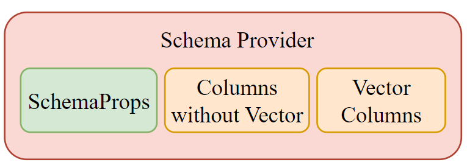
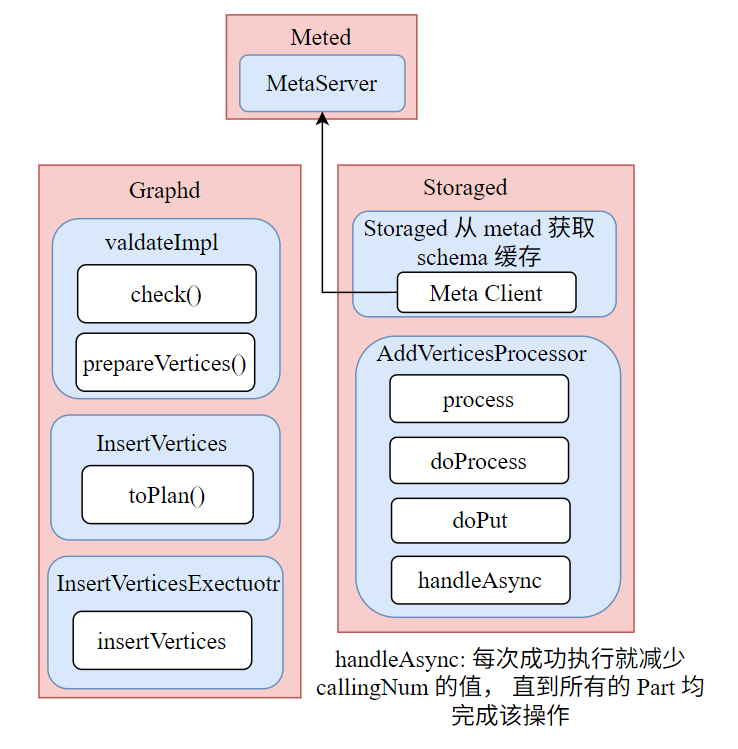
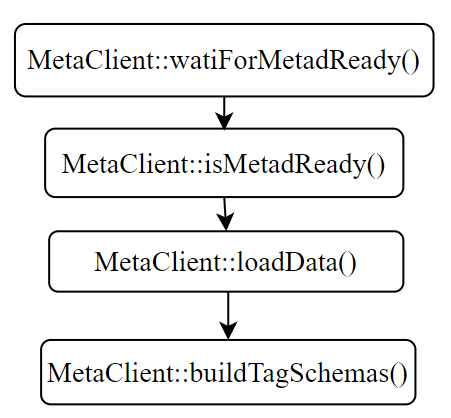
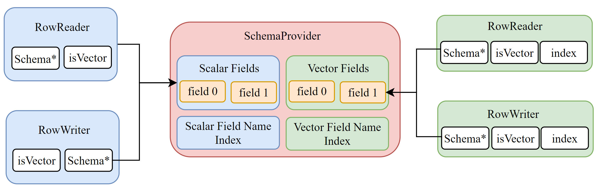
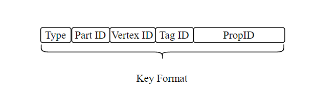
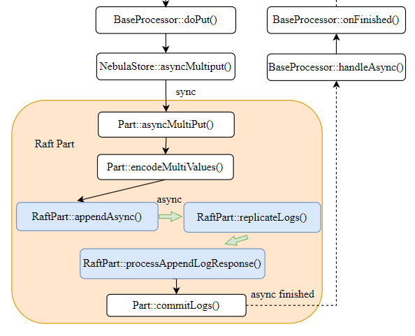

# 中篇：Vector 类型的 DDL & DML 适配

📚 本系列文章分为上中下三篇，记录了我在开源之夏项目中，开发 Nebula Graph 向量搜索功能的一些复盘和思考，希望可以给大家学习和开发类似系统时有一定的样本参考。希望大家多多关注和交流，大家一起进步 😊 欢迎订阅我的个人网站🚀 [tom-jerr.github.io](https://tom-jerr.github.io/)

> 本篇主要介绍如何支持向量属性的 DDL 和 DML 语句(💀 走了很多设计的弯路)。

在[nebula graph 的上篇](<上篇：初识 Nebula Graph —— 向量类型支持.md>)我们已经对 Nebula Graph 的整体执行流程有了认识，并概述了如何实现 Vector 数据类型以及 Vector 存储。

现在我们需要将 Vector 类型集成到 Nebula Graph 中，支持用户通过 DDL 和 DML 语句来创建和操作 Vector 类型的属性。我们需要解决几个关键问题：

- 如何在已有的 Tag/Edge Schema 中添加 Vector 类型的属性？
- 如何在 Insert/Update 语句中插入和更新 Vector 类型的属性值？
- 如何保证 Storage 层获取正确的 Schema 信息，并正确存储和读取 Vector 类型的属性值？

接下来我们一步一步来解决这些问题，我们将从 DDL 适配开始讲起，然后是 DML 适配，最后总结我们中间走了的弯路和经验教训，上面提到的问题我们都会一一覆盖到。

> ⚠️ 这里为了简化，我们假设使用 Tag Schema 进行说明

## DDL 适配

在 Nebula Graph 中，Tag/Edge 的 Schema 定义存储在 Metad 节点中，用户通过 DDL 语句（如 CREATE TAG/ALTER TAG）来定义和修改 Schema。

> 💀 实际上 Storaged 节点在执行 DML 语句时会从 Metad 获取最新的 Schema 信息。通过自己的 cache 定期更新。

### DDL Syntax

我们需要在 DDL 语句中支持定义 Vector 类型的属性。

- 定义 vector 属性时，需要指定向量的维度，例如 `vector(128)` 表示一个 128 维的向量。
- 对于 vector 具体的数值常量，我们为了避免 parser 的二义性，单独设计了语法规则 `vector(1.0,2.0,3.0)` 来表示一个具体的向量值。

```cypher
CREATE TAG IF NOT EXISTS test1(name string, embedding vector(3) DEFAULT vector(1.0,2.0,3.0)) TTL_DURATION = 100, TTL_COL = "create_time";;
```

### Schema Support

#### Schema Storage

Meta 服务使用 RocksDB 存储，将 schema 对应的 KV 对存入其中

- Key 结构： `SpaceId + TagId + Version`

- Value 是 Thrift 序列化的 Schema 定义，我们复用了原有的 Schema 结构，只是扩展了 ColumnTypeDef 来支持 Vector 类型

  > 这里我们复用了 `ColumnTypeDef` 中的 `type_length` 字段来表示 Vector 的维度

  ```cpp
  struct ColumnTypeDef {
    1: required common.PropertyType    type, // add vector type
    // type_length is valid for fixed_string type and vector type for dimension
    2: optional i16                    type_length = 0,
    // geo_shape is valid for geography type
    3: optional GeoShape               geo_shape,
  }
  struct ColumnDef {
      1: required binary          name,
      2: required ColumnTypeDef   type,
      3: optional binary          default_value,
      4: optional bool            nullable = false,
      5: optional binary          comment,
  }
  struct SchemaProp {
      1: optional i64      ttl_duration,
      2: optional binary   ttl_col,
      3: optional binary   comment,
  }
  struct Schema {
      1: list<ColumnDef> columns,
      2: SchemaProp schema_prop,
  }
  ```

#### Schema Provider

`SchemaProvider` 是内存中的 schema 表示，提供字段查询、偏移计算等功能，是对数据编解码的核心依赖

- 实际上，Schema 在 graphd 中通过 `SchemaProvider` 管理 field

```cpp
class NebulaSchemaProvider {
 private:
  SchemaVer ver_;  // Schema 版本号
  // 字段映射: 字段名 -> 字段索引
  std::unordered_map<std::string, int64_t> fieldNameIndex_;
  // 字段数组,按顺序存储所有字段
  std::vector<SchemaField> fields_;
  // 可空字段数量
  size_t numNullableFields_;
  // Vector 字段相关
  std::unordered_map<std::string, int64_t> vectorFieldNameIndex_;
  std::vector<SchemaField> vector_fields_;
  size_t numVectorNullableFields_;
  // Schema 属性 (TTL等)
  cpp2::SchemaProp schemaProp_;
};
```

- field 由 `SchemaField` 表示

```cpp
class SchemaField {
  std::string name_;           // 字段名
  PropertyType type_;          // 数据类型
  bool nullable_;              // 是否可空
  bool hasDefault_;            // 是否有默认值
  std::string defaultValue_;   // 默认值
  size_t size_;                // 固定大小(字节)
  size_t offset_;              // 在行中的偏移量
  size_t nullFlagPos_;         // NULL 标志位位置
  cpp2::GeoShape geoShape_;    // 地理类型形状
};
```

为了**保证兼容性**，需要对 thrift 文件最小化修改，我们采用了原始列和向量列逻辑上分离的设计：

- 原始列（除 VECTOR 类型外的其他类型）
- 向量列（仅适用于 VECTOR 类型）
- 架构属性选项（TTL、TTL_COL 等）



### Why Design Like This?

- 可以兼容已有的 Schema 设计，最小化对现有代码的改动
- 后续我们依据 Schema 进行数据读取和写入时，可以根据属性类型区分原始列和向量列，逻辑更清晰
- 对后续向量索引的创建和 ann search，可以更方便地定位向量属性

## DML 适配

### DML Syntax

#### Insert Vertex Sentence For Vector Type

```cypher
INSERT VERTEX tag1(id, vec1, vec2) VALUES 'v5':(5, vector (0.4, 0.5, 0.6), vector (0.1, 0.2, 0.3, 0.4)), 'v6':(6, vector (0.7, 0.8, 0.9), vector (0.2, 0.4, 0.6, 0.8));
```

#### Delete Vertex Sentence For Vector Type

```cypher
Delete VERTEX on tag1 "v5" [with edge]
```

#### Update Vertex Sentence For Vector Type

```cypher
UPDATE VERTEX on tag1 'v5', 'v6' SET vec1 = vector (0.1, 0.2, 0.3), vec2 = vector (0.4, 0.5, 0.6, 0.7);
```

### DML Processing

我们先从整个流程上看我们整个 Insert Vertex 语句的处理过程：

- 客户端 INSERT 语句传入 Graph 层
- Graph 层进行语法解析、语义校验、执行计划生成并执行 `InsertVerticesExecutor`，该处理器会将数据打包成 `AddVerticesRequest` 请求发送到 Storage 层
- Storage 层接收到请求后，执行 `AddVerticesProcessor`
  - 获取 Schema 信息
  - 分离属性：Regular vs Vector
  - 对两种属性分别编码：
    - Regular 属性使用 RowWriterV2 的常规模式编码
    - Vector 属性使用 RowWriterV2 的 Vector 模式编码
  - 生成不同的 Key-Value 对：
    - Regular: tagKey → regularData
    - Vector: vectorTagKey → vectorData
  - 批量写入 RocksDB



#### 1. Get Schema From Meta Service

传入的 `env` 中的 `SchemaManager` 维护 schema 缓存，该缓存会定期从 Meta 服务拉取最新的 schema 信息，保证 Storage 层获取到最新的 schema。

##### How It Works?

- Storaged 拥有 meta 客户端，当 meta service 准备就绪时，storaged 将从 metad 获取**序列化后的 schema 数据**。

- 获取到 schema 后，storage service 中的 meta client 会解析传来的数据并**重组成 `NebulaSchemaProvider`** 供 storage service 后续使用。



#### 2. Encode Regular & Vector Properties Separately

我们需要对 Regular 属性和 Vector 属性分别编码，实际上这是由 `RowWriterV2` 来处理的

- Regular 属性编码时，`RowWriterV2` 以常规模式工作，直接获取所有 Regular 属性并编码到同一个 rowstr 中。
- Vector 属性编码时，`RowWriterV2` 以 Vector 模式工作，每个 Vector 属性单独编码成一个 rowstr，通过传入的 `index` 来获取不同的 Vector 属性。



##### Regular Encoding Code

- 分区布局：以 person(name:string, age:int, city:string) 为例

  ```shell
  +--------+--------+-----------+--------------+---------------+-----------+
  | Header | Ver    | NullFlags | Fixed Data   | Variable Data | Timestamp |
  +--------+--------+-----------+--------------+---------------+-----------+
  | 1 byte | 0-7 B  | 0-N bytes | size  bytes  | 变长          | 8 bytes   |
  +--------+--------+-----------+--------------+---------------+-----------+

  Fixed Data 详细布局:
  +----------------+----------------+----------------+
  | name (8 bytes) | age (8 bytes)  | city (8 bytes) |
  | [offset, len]  | [int64_t]      | [offset, len]  |
  +----------------+----------------+----------------+
    ↓                                  ↓
    指向 Variable Data                 指向 Variable Data

  Variable Data:
  +-------+-------+
  | Alice | Tokyo |
  +-------+-------+
  ```

- Regular 属性的编码我们沿用之前的逻辑不变，**所有 Regular 属性会被编码到同一个 rowstr 中**。

- 具体编码调用如下：`encodeRowVal()` -> `RowWriterV2::setValue()` -> `RowWriterV2::write()`

  ```cpp
  // BaseProcessor-inl.h - encodeRowVal()
  StatusOr<std::string> encodeRowVal(
      const meta::NebulaSchemaProvider* schema,
      const std::vector<std::string>& propNames,
      const std::vector<Value>& props,
      WriteResult& wRet) {

    // 创建常规 RowWriterV2 (isVectorColumns=false)
    RowWriterV2 rowWrite(schema);

    // 逐个设置字段值
    for (size_t i = 0; i < propNames.size(); i++) {
      wRet = rowWrite.setValue(propNames[i], props[i]);
    }

    // 完成编码
    wRet = rowWrite.finish();

    // 返回编码后的字符串
    return std::move(rowWrite).moveEncodedStr();
  }
  ```

- `RowWriterV2::write()` 对固定长度属性和变长属性分别处理，最终生成 rowstr

  - 固定长度属性：直接在预分配的缓冲区写入并通过 schema 的 `offset()` 直接计算位置
  - 变长属性：
    - 间接存储：固定区域只存 8 字节的 [offset, length]
    - 后追加：所有变长数据按顺序追加到末尾

  ```cpp
  // 写入 INT64 示例
  WriteResult RowWriterV2::write(ssize_t index, int64_t v) {
    auto field = schema_->field(index);
    auto offset = headerLen_ +           // Header + Version
                  numNullBytes_ +        // NULL 标志
                  field->offset();       // 字段在固定区域的偏移
    // 3. 原地写入（in-place）
    memcpy(&buf_[offset], &v, sizeof(int64_t));
    // 4. 清除 NULL 标志
    if (field->nullable()) {
      clearNullBit(field->nullFlagPos());
    }
    isSet_[index] = true;
    return WriteResult::SUCCEEDED;
  }

  WriteResult RowWriterV2::write(ssize_t index, const std::string& v) {
    auto field = schema_->field(index);
    // 1. 计算固定区域的偏移（存储 offset + length）
    auto fixedOffset = headerLen_ + numNullBytes_ + field->offset();
    // 2. 字符串实际存储在缓冲区末尾
    int32_t strOffset = buf_.size();
    int32_t strLen = v.size();
    // 3. 在固定区域写入"指针"
    memcpy(&buf_[fixedOffset], &strOffset, sizeof(int32_t));
    memcpy(&buf_[fixedOffset + 4], &strLen, sizeof(int32_t));
    // 4. 追加实际数据
    buf_.append(v.data(), v.size());
    if (field->nullable()) {
      clearNullBit(field->nullFlagPos());
    }
    isSet_[index] = true;
    return WriteResult::SUCCEEDED;
  }
  ```

##### Vector Key Design

- 在 `Type` 中新增 `VECTOR` 类型，便于后面直接根据 rowstr 的第一字节判断写入 RocksDB 的哪个 CF。

- 增加 `PropId` 来区分不同的 Vector 属性。

  

##### Vector Encoding Code

- 与变长属性处理类似，Vector 属性在 rowstr 中也采用间接存储的方式：

  - 固定区域存储 8 字节的 [offset, length]
  - 实际的向量数据追加到 rowstr 的末尾

  ```shell
  +--------+--------+-----------+--------------+---------------+-----------+
  | Header | Ver    | NullFlag  | Offset + Len | Vector Data   | Timestamp |
  +--------+--------+-----------+--------------+---------------+-----------+
  | 1 byte | 0-7 B  | 0-1 byte  | 8 bytes      | 变长(N*4 B)   | 8 bytes   |
  +--------+--------+-----------+--------------+---------------+-----------+

  示例：128 维向量
  +-----------+------------------+-----------------------------+
  | [offset]  | [length]         | [f1, f2, ..., f128]        |
  | (4 bytes) | (4 bytes)        | (128 * 4 = 512 bytes)      |
  +-----------+------------------+-----------------------------+
      ↓             ↓                      ↓
    指向数据      数据长度            原始 float 数组
  ```

- Vector 属性的编码我们新增了一套逻辑，**每个 Vector 属性会被单独编码成一个 rowstr**。

  ```cpp
  bool vectorPropNamesEmpty = vectorPropNames_.empty();

  // 遍历每个 Vector 属性
  for (size_t i = 0; i < vectorProps_.size(); ++i) {
    // 获取 vector 字段索引
    int64_t vectorFieldIndex = vectorPropNamesEmpty
        ? static_cast<int64_t>(i)
        : schema->getVectorFieldIndex(vectorPropNames_[i]);

    // 生成 Vector 专用 Key
    auto vectorKey = NebulaKeyUtils::vectorTagKey(
        spaceVidLen_, partId, vid, tagId,
        static_cast<int32_t>(vectorFieldIndex));

    // 编码 Vector 值
    auto vectorValue = encodeVectorRowVal(
        schema, vectorProps_[i],
        static_cast<size_t>(vectorFieldIndex), wRet);

    // 存储
    data.emplace_back(std::move(vectorKey), std::move(vectorValue.value()));
  }
  ```

#### 3. Write to RocksDB

完整的通过 raft-wal 写入 RocksDB 流程如下图：

- 为了确保 DML 操作的一致性，每个请求仅使用一个 `MergeableAtomicOp` 异步操作
  > 一个 INSERT/UPDATE/DELETE 请求对应一个原子操作单元
- 写入真正的执行在 **Raft commitLog**



- 实际上真正写入的时候，我们通过 Key 的 `type` 字段区分 Regular 和 Vector 数据，写入不同的 Column Family
  > 以 batch 写入为例：

```cpp
case OP_BATCH_WRITE: {
    auto data = decodeBatchValue(log);
    for (auto& op : data) {
        if (op.first == BatchLogType::OP_BATCH_PUT) {
            if (NebulaKeyUtils::isVector(op.second.first.str())) {
                // Vector 数据写入专用 Column Family
                code = batch->put(
                    NebulaKeyUtils::kVectorColumnFamilyName,
                    op.second.first,
                    op.second.second
                );
            } else {
                code = batch->put(op.second.first, op.second.second);
            }
        }
        // ... 其他操作类型
    }
    break;
}
```

#### Update Special Processing

Update 语句在 Storage 层的处理，相比 Insert 语句有一些特殊之处：

- Update 在 Storage 层生成的计划树包含 `TagNode` 节点，该节点负责读取当前顶点的属性值
- 为了支持 Vector 属性，我们需要确保 `TagNode` 能正确读取多个 Vector 属性


##### 完整流程

```shell
┌─────────────────────────────────────────────────────────────────┐
│ 1. TagNode::doExecute(partId, vId)                            │
├─────────────────────────────────────────────────────────────────┤
│   • 读取常规 Tag 数据: tagKey -> value_                       │
│   • 检查 Schema 是否包含 Vector 字段                          │
│   • 遍历所有属性,筛选出 Vector 类型                           │
│   • 为每个 Vector 属性:                                       │
│     - 获取字段索引: getVectorFieldIndex(propName)             │
│     - 构造 Vector Key: vectorTagKey(vId, tagId, index)        │
│     - 读取 Vector 数据: kvstore_->get() -> vectorValues_      │
│   • 初始化 RowReader:                                         │
│     - reader_.reset(*schemas_, value_)                        │
│     - vectorReaders_[i].reset(*schemas_, vectorValues_[i], true, index) │
└─────────────────────────────────────────────────────────────────┘
                              ↓
┌─────────────────────────────────────────────────────────────────┐
│ 2. FilterNode::doExecute()                                     │
├─────────────────────────────────────────────────────────────────┤
│   • 检查过滤条件                                              │
│   • 传递 reader_ 和 vectorReaders_ 给下游                     │
└─────────────────────────────────────────────────────────────────┘
                              ↓
┌─────────────────────────────────────────────────────────────────┐
│ 3. UpdateTagNode::doExecute()                                  │
├─────────────────────────────────────────────────────────────────┤
│   • 获取上游的 reader_ 和 vectorReaders_                      │
│   • collTagProp():                                             │
│     - 从 reader_ 读取常规属性                                 │
│     - 从 vectorReaders_[i] 读取 Vector 属性                   │
│     - 所有属性统一存储到 props_                               │
│   • updateAndWriteBack():                                      │
│     - 计算更新表达式,更新 props_                              │
│     - 区分写入:                                               │
│       * 常规属性 -> rowWriter_->setValue()                    │
│       * Vector 属性 -> vectorRowWriters_[index]->setValueVec()│
│     - 完成编码:                                               │
│       * rowWriter_->finish() -> nVal                          │
│       * vectorRowWriters_[i]->finishVector() -> vectorVals[i] │
│     - 批量写入:                                               │
│       * batchHolder->put(key_, nVal)                          │
│       * batchHolder->put(vectorKeys_[i], vectorVals[i])       │
└─────────────────────────────────────────────────────────────────┘
                              ↓
┌─────────────────────────────────────────────────────────────────┐
│ 4. UpdateResNode::doExecute()                                  │
├─────────────────────────────────────────────────────────────────┤
│   • 根据 returnPropsExp_ 提取返回属性                         │
│   • 构造 DataSet 返回给客户端                                 │
└─────────────────────────────────────────────────────────────────┘
```

##### TagNode

- 独立读取 Vector 数据到 `vectorValues_`
- 我们实际上为了支持多 Vector 属性的读取，新增了 `vectorReaders_` 成员变量来存储多个 Vector Reader
  > 每个 Vector 属性对应一个 Reader
  > Vector 属性初始化需要传入 Vector 所在的索引

```cpp
// 一个主 Reader,N 个 Vector Reader
RowReaderWrapper reader_;                     // 读取常规属性
std::vector<RowReaderWrapper> vectorReaders_; // 读取 Vector 属性

// 初始化方式不同
reader_.reset(*schemas_, value_);           // 常规模式
vectorReaders_[i].reset(*schemas_, vecVal, true, idx); // Vector 模式
```

##### UpdateTagNode

- 从多个 Vector Reader 收集所有属性
  - 常规属性从 `reader_` 读取
  - Vector 属性从 `vectorReaders_` 读取
- 统一到 `props_map` 进行表达式计算
- 使用多个 `vectorRowWriters_` 编码回写

```cpp
// 1. 收集常规属性
for (auto index = 0UL; index < schema_->getNumFields(); index++) {
    auto propName = std::string(schema_->getFieldName(index));
    auto retVal = QueryUtils::readValue(reader_, propName, schema_);
    if (!retVal.ok()) {
      return nebula::cpp2::ErrorCode::E_TAG_PROP_NOT_FOUND;
    }
    props_[propName] = std::move(retVal.value());
  }

// 2. 收集 Vector 属性
for (auto index = 0UL; index < schema_->getVectorNumFields(); index++) {
  auto vecPropName = std::string(schema_->getVectorFieldName(index));

  auto retVal = QueryUtils::readVectorValue(vectorReaders_[index], vecPropName, schema_);
  if (!retVal.ok()) {
    return nebula::cpp2::ErrorCode::E_TAG_PROP_NOT_FOUND;
  }
  props_[vecPropName] = std::move(retVal.value());
}

// 3. 初始化 Regular 属性的 RowWriter
rowWriter_ = std::make_unique<RowWriterV2>(schema_);
val_ = reader_->getData();

// 4. 为每个 Vector 属性创建独立的 RowWriter
for (auto index = 0UL; index < schema_->getVectorNumFields(); index++) {
  vectorVals_.emplace_back(vectorReaders_[index]->getData());
  vectorRowWriters_.emplace_back(
      std::make_unique<RowWriterV2>(schema_, true, static_cast<int32_t>(index))
  );
}
```

## 踩过的坑

在实现过程中，我们也遇到了一些设计上的挑战和坑，下面列举几个典型的例子：

### 1. Parser 对 Vector 语法的支持

v1: 最初我尝试直接使用 `[1.0, 2.0, 3.0]` 来表示向量值，但发现这样会与`list`类型产生二义性，导致进行 tck 测试时对 `list` 类型的复杂查询出现解析错误。

v2: 后来我尝试使用 `(1.0;2.0;3.0)` 的语法，但这种方式会与计算表达式中的括号冲突，导致解析器无法正确识别。

v3: 后来经过和 mentor 的讨论，最终我们设计了 `vector(1.0,2.0,3.0)` 的语法，避免了上面的解析冲突。

### 2. Schema 设计的兼容性

v1: 最初我尝试直接在 `ColumnTypeDef` 中添加一个新的字段来表示 Vector 的维度，但这样会导致对现有代码的改动过大，影响了系统的稳定性。
v2: 后来我尝试将 Vector 属性和 Regular 属性混合存储在同一个字段列表中，但这样会导致在数据读取和写入时难以区分不同类型的属性，增加了实现的复杂度。而且也会影响后面向量索引的创建和查询。
v3: 最终我们采用了将 Vector 属性和 Regular 属性逻辑上分离的设计

### 3. DML 处理中的多属性支持

v1: 最初我的想法是将 Regular 和 Vector 属性写入分为两个原子操作，但是这样会**破坏操作的原子性**
v2: 后面我尝试在 RowWriter 和 RowReader 中对不同类型属性进行处理，但是对 RocksEngine，batch 等存储层接口改动过大，增加实现的复杂度
v3: 最终我们通过在 Key 中区分不同类型属性，并在写入时根据类型选择不同的 Column Family，既保证了操作的原子性，又简化了存储层的实现。

> 我们只需要在 `RaftPart::commitLogs()` 中根据 Key 的类型选择不同的 CF 即可。

### 4. Update 语句中多 Vector 属性的读取和写入

v1: 最初我的想法是一个 filterNode 可以有多个 TagNode 来分别读取不同的 Vector 属性，实际实现时发现这种方案实现复杂度过高，且不易维护。
v2: 最终我们选择在一个 TagNode 中读取所有 Vector 属性，并在 UpdateTagNode 中统一处理所有属性的更新和写入，简化了实现。

### 5. Schema 缓存的一致性问题

💀 在测试中，我们发现 vector 属性在 Storage 层进行操作时会崩溃，经过排查发现是因为 Storage 层的 Schema 缓存没有及时更新，导致读取到的 Schema 信息不一致。

解决方案：我们确保 Storage 层的 Schema 缓存可以拉取到 vector 类型的属性，保证操作时使用的是最新的 Schema。

## 总结

现在我们来回答一下开篇提出的三个问题

> 😆 回收开头

### 如何在已有的 Tag/Edge Schema 中添加 Vector 类型的属性？

- 在 DDL 层扩展类型定义，新增 VECTOR 类型并且在定义时指定维度（dimension），例如 vector(128)。
- 在 schema 的序列化结构中复用现有 `ColumnTypeDef` 的 `type_length` 字段表示 Vector 的维度（最小化 Thrift 文件改动）。
- 在 meta（Meta 服务）中保存 schema 的序列化表示（`Key: SpaceId + TagId + Version，Value: Thrift 序列化的 Schema`）
- Storage 从 Meta 拉取该序列化结果并构建内存 SchemaProvider。
- 在内存 SchemaProvider 中对 Vector 字段单独维护（与常规列逻辑上分离），比如额外的 `vectorFieldNameIndex_`、`vector_fields_`、`numVectorNullableFields_` 等。

### 如何在 Insert/Update 语句中插入和更新 Vector 类型的属性值？

- 在 Parser/语义层加入对 vector 常量的支持，采用专门语法 `vector(0.1, 0.2, 0.3)` 来表示向量常量，避免与 list 等冲突。
- Graph 层在语义校验通过后生成请求（例如 AddVerticesRequest / Update 请求），将 vector 属性与 regular 属性区分并打包到请求中发送给 Storage 层。
- Storage 层处理 DML 时，先从 SchemaProvider 获取 schema，然后“分离属性”：Regular vs Vector。
  - Regular 属性统一使用已有的 RowWriterV2 常规编码，一个 rowstr 包含所有 regular 字段。
  - 每个 Vector 属性单独使用 RowWriterV2 的 Vector 模式编码（每个 vector 属性生成独立的 rowstr）。
  - Key 设计：对 Vector 数据使用区分 type 的 Key（并带上 PropId 或 vector field index），以便写入不同 Column Family（CF）。
  - 写入：在组装写入 Batch（或 Raft 提交）时，根据 Key 判断写入 CF，保证 Regular 与 Vector 数据可以在同一原子请求中写入不同 CF，从而保持操作的整体原子性（通过 raft-wal + batch）。
- 更新（UPDATE）：
  - Update 的计划会读取当前 regular row（tagKey）以及所有 vector 行（vectorTagKey）——TagNode 负责读取常规和 vector 数据并构造主 `reader_` 与多个 `vectorReaders_`。
- UpdateTagNode 把常规字段与多个 vector 字段合并到 `props_map`，计算表达式后分别用 `rowWriter->setValue()` 和 `vectorRowWriters[index]->setValueVec()` 编码，并一起 batch 写回（regular key + 所有 vector keys）。

### 如何保证 Storage 层获取正确的 Schema 信息，并正确存储和读取 Vector 类型的属性值？

- Schema 存储与传递：
  - Meta 服务以 RocksDB 存储 schema（`Key: SpaceId + TagId + Version；Value: Thrift 序列化的 Schema`）。
  - Storage 端有 meta client，定期或在事件触发时从 Meta 拉取序列化的 schema 数据，然后解析并重建为 NebulaSchemaProvider（内存表示）。
- SchemaProvider 设计：
  - 在内存 SchemaProvider 中区分 regular 字段数组与 vector 字段数组（`fieldNameIndex_` vs `vectorFieldNameIndex_`）。提供方法 `getFieldIndex`/`getVectorFieldIndex`、`getNumFields`/`getVectorNumFields` 等。
- RowReader/RowWriter：
  - Regular 的读写沿用 RowReader/RowWriter 既有逻辑（单个 rowstr）。
  - Vector 的读写采用 RowWriterV2 的 Vector 模式：
    - 固定区域存放 [offset, length]（8 bytes，或两个 4-byte），实际 float 数组追加在 rowstr 尾部（N * 4 bytes for float）。
  - 每个 vector 字段对应单独的 rowstr，因此读取时需要单独发起 kv get（使用 vectorKey）。
- TagNode：
  - 读取正常 tagKey 的值并初始化主 `reader_`；
  - 如果 schema 有 vector 字段，逐个构造 vectorKey 并读取对应值，初始化对应的 `vectorReaders_`
