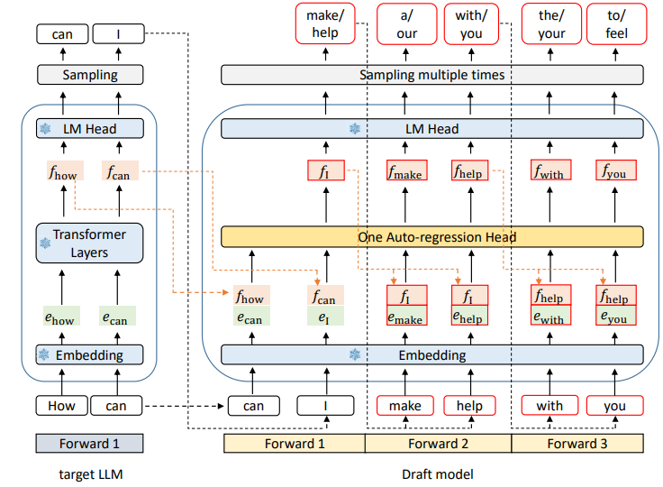
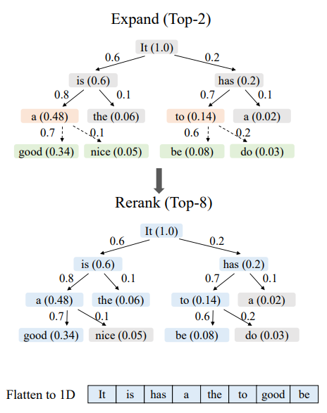
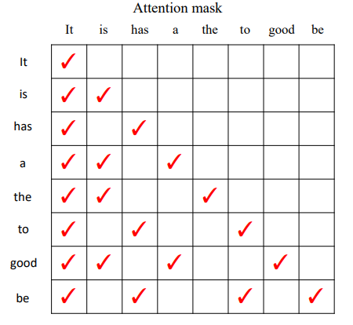
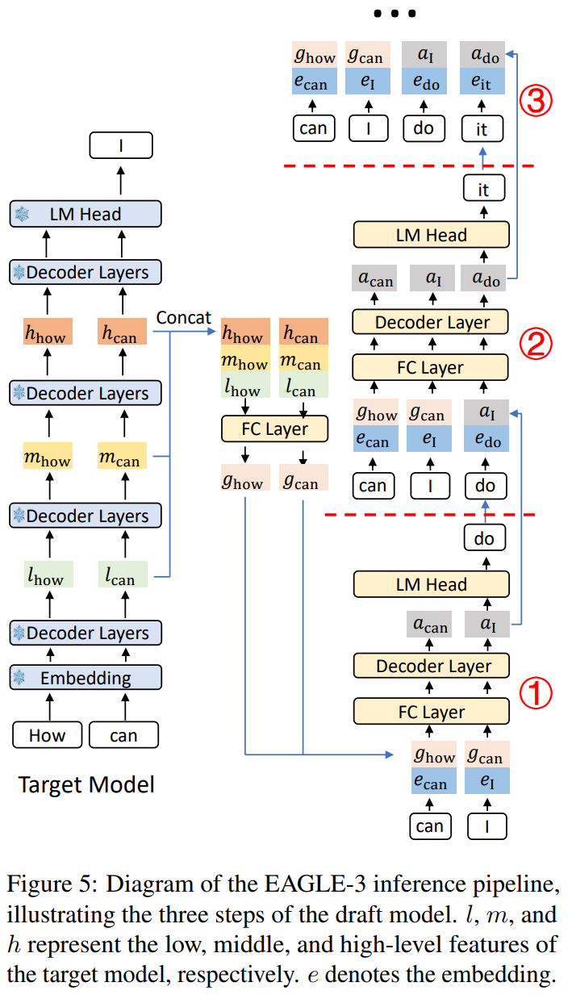
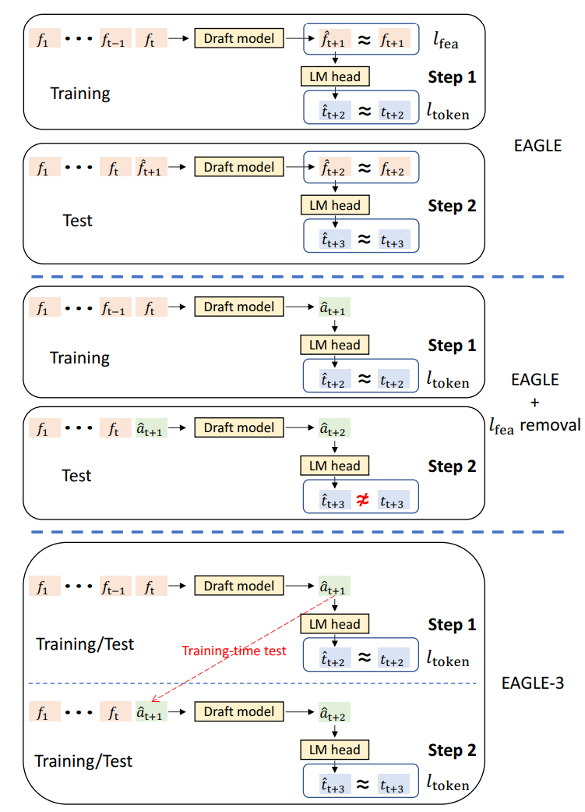
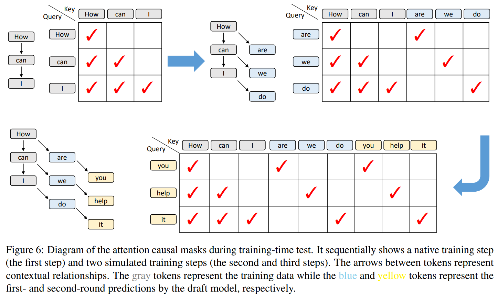
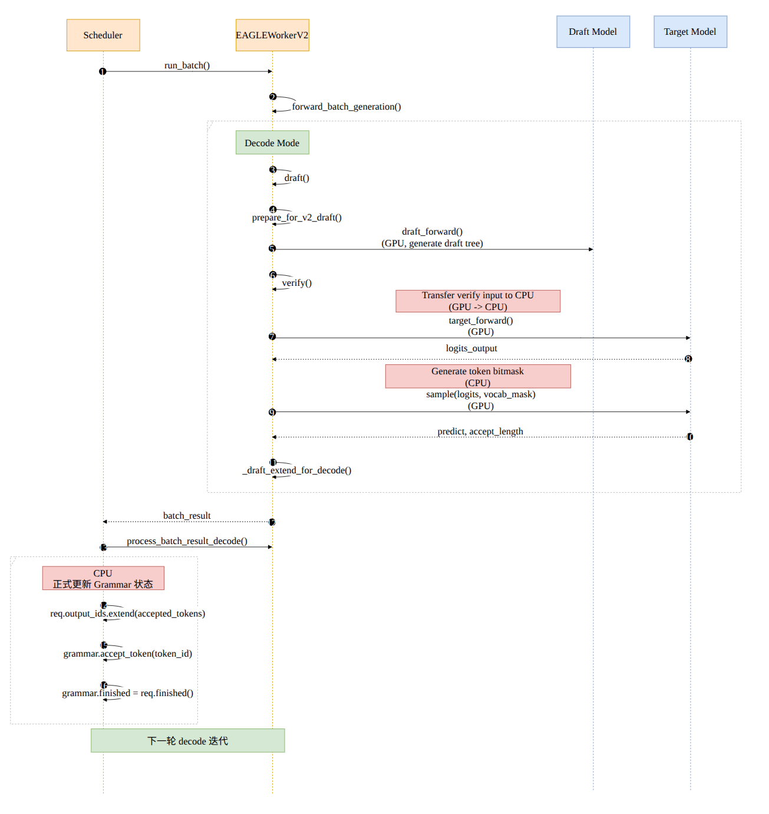
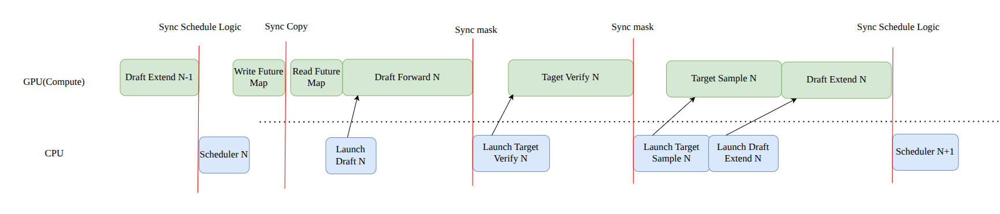
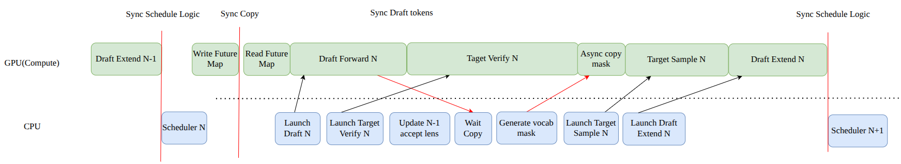

# 从 EAGLE 到 DFlash 2：SGLang 与 SpecForge 的投机解码训练和推理

投机解码看起来是一件很简单的事：让小模型先猜几个 token，大模型一次验证，接受正确前缀。但真正把它接入 serving 之后，问题会同时落到三个地方：**草稿是否准确、生成草稿花多久、系统愿意为它分配多少验证资源。**

EAGLE 系列最先把 target 的内部表示交给 draft，让小模型不必从 token 历史重新理解整个问题；DFlash 把重计算从逐 token 自回归改成整块并行；DSpark 和 DFlash 2 则继续处理并行预测中的块内依赖。其中，DSpark 还把验证长度变成了一个随请求质量和系统负载变化的调度决策。

这不是几个算法名字的简单替换。训练阶段允许 draft 看见哪些信息，会决定推理阶段必须维护什么状态；推理阶段如何选候选，又会决定训练到底应该优化哪一种损失。本文沿着这些接口，串起论文、SpecForge 的训练实现和 SGLang 的推理实现。

> [!NOTE]
> 本文在原 EAGLE2 文章上重写，保留原文的树验证、KV 管理及 grammar overlap 实验。源码固定到 **2026-09-11 核对的 SGLang `822e73ccddc0` 和 SpecForge `3d64e7a61f5f`**，链接均指向对应快照。DFlash 2 的方法来源是官方技术博客及公开实现；本文说明的 SpecForge recipe 是该框架的公开训练路径，不等同于作者 checkpoint 的完整内部训练配方。本文没有重新运行 GPU 训练或性能实验。

## 1. 先统一一轮投机解码的输入、输出与成本

### 1.1 已经生成 token，不代表已经计算它的 KV

设 target 已经执行了前缀 $x_{1:t}$，对应 KV 和 hidden states 都已存在，并从最后一个位置的分布中采样出 $x_{t+1}$。将这个刚生成的 token 记为 anchor $a$。

此时系统的状态是：

```text
已执行 target：    A B C
已生成但尚未执行：      D   ← anchor
希望 draft 预测：        E F G H

已有 target feature：h_A h_B h_C
尚无 target feature：            h_D h_E h_F ...
```

**anchor 已确定，但 target 尚未以它为输入执行 forward。** 这个一位偏移贯穿 EAGLE 的特征递推、DFlash 的训练 mask 和验证后的 KV 提交。

统一记号如下，避免把不同论文里的 $K$、$\gamma$、block size 混在一起。

| 记号                  | 本文含义                                          |
| --------------------- | ------------------------------------------------- |
| $a=x_{t+1}$           | 上轮 target 生成、这一轮要处理的 anchor           |
| $m$                   | 本轮新提出的 draft token 数，不包含 anchor        |
| $B=m+1$               | 线性 target verify 的输入长度：anchor 加草稿      |
| $r$                   | 实际接受的 draft 前缀长度，$0\le r\le m$          |
| $\tau=\mathbb E[r+1]$ | 平均每轮新输出 token 数，包含 correction/bonus    |
| $K$                   | DFlash 2 每个位置保留的候选数，与 block size 不同 |

target 验证的输入是 `[a, d1, ..., dm]`。因果 attention 允许一次得到所有位置的条件分布：anchor 那一行预测 `d1`，`d1` 那一行预测 `d2`，依此类推。第一个不匹配或被拒绝的位置使后缀作废；若所有草稿都通过，则再从最后一行采样 bonus。

因此，**全部接受时是 $m+1$ 个新输出，而不是接受 $m-1$ 个再补一个**。到达 EOS 或输出长度上限时，面向用户的输出还会被截断。

### 1.2 Lossless 保证来自验证协议

对随机 proposal，令 $q_j$ 为 draft 在实际已选前缀下使用的条件分布，$p_j$ 为 target 在同一前缀下的分布。对 $d_j\sim q_j$，经典拒绝采样使用：

$$
\alpha_j(d_j)=\min\left(1,\frac{p_j(d_j)}{q_j(d_j)}\right).
$$

拒绝后从残差分布采样：

$$
p'_j(v)=\frac{[p_j(v)-q_j(v)]_+}{\sum_u[p_j(u)-q_j(u)]_+}.
$$

接受分支提供的概率质量是 $\min(p_j(v),q_j(v))$，拒绝分支补上 $[p_j(v)-q_j(v)]_+$，两者之和恰好为 $p_j(v)$。这里不要求 $q=p$；两者越接近，通常接受率越高，但不接近首先损失的是速度。[原始 speculative decoding 论文](https://arxiv.org/abs/2211.17192)给出了这一分布保持机制。

需要区分三件事：

- Greedy 验证比较 target argmax 和候选 token，在相同数值与 tie-breaking 条件下保持 greedy 输出。
- 随机采样要求记录**实际 proposal 分布**。经过 DSpark correction 或 DFlash 2 selector 后，不能继续把未经修改的 unary softmax 当成 $q$。
- 分布相同不意味着同一个随机种子下逐 token 相同；并行路径对随机数的消费顺序可能不同。

另外，树采样、独立 target 采样后匹配前缀，以及标准 $p/q$ 拒绝采样是不同实现。算法叫作 speculative decoding，并不自动证明某个设备后端和采样配置保持分布，后文会回到源码中的实际分支。

### 1.3 优化目标是每个有效输出的总成本

单请求稳态下，可以用下面的近似理解收益：

$$
T_{\text{token}}
\approx\frac{T_d+T_v+T_{\text{state}}+T_{\text{sched}}}{\tau}.
$$

$T_d$ 是 drafting，$T_v$ 是 target verification，另外两项包含 KV 提交、draft 状态刷新、采样和调度开销。这是把一轮成本除以有效输出数的摊销模型，不能把其中某一项默认视为零。

若无投机时每个 token 成本为 $T_{\text{AR}}$，收益条件是：

$$
T_d+T_v+T_{\text{state}}+T_{\text{sched}}<\tau T_{\text{AR}}.
$$

小 batch 下，合并多个位置有机会摊薄权重读取和执行开销；高并发下，target 已经忙于服务大量请求，验证低质量后缀会与其他请求竞争容量。**“一次验证与一次 decode 一样贵”只是某些区间内的近似，并非前提保证。**

## 2. EAGLE 与 EAGLE-2：先利用 target feature，再决定树怎么长

### 2.1 EAGLE 的不确定性来自尚未确定的下一个 token

EAGLE 中的 feature 指 LM head 之前的高层表示。论文使用 second-to-top-layer 的说法，不能机械理解成所有框架的 `hidden_states[-2]`；需要核对是否包含 embedding、final norm，以及 capture 发生在 decoder layer 的输入还是输出。

假设 target 对 `I` 预测了两个可能后续：`am` 与 `always`。单凭 $h_{\text{I}}$，下一位置的 feature 并不唯一，因为它取决于实际选中了哪个 token。EAGLE 因此把**提前一位的 token embedding**与已有 feature 一起输入草稿模型：

$$
\widehat h_{t+1}
=D_\theta\bigl(h_{1:t},E(x_{2:t+1});\mathrm{KV}_d\bigr),
\qquad
q(x_{t+2})=\operatorname{softmax}\bigl(W_{\text{head}}\widehat h_{t+1}\bigr).
$$

公式表示完整前缀上的递推关系，增量实现只计算新增位置。关键配对是 **$h_t$ 与 $E(x_{t+1})$**，而不是 $h_t$ 与 $E(x_t)$。[EAGLE 论文](https://arxiv.org/abs/2401.15077)及原文的示意图都围绕这一点展开。



图中的 token 输入把采样结果补给 feature predictor。后续尚无真实 target feature 时，draft 继续使用自己预测的 feature，仍然沿深度自回归。

### 2.2 EAGLE 的训练：feature regression 与 token prediction

训练时冻结 target，用完整训练序列取得 feature 和 token 分布。草稿模型学习从前一位置 feature 加下一 token embedding，预测下一位置表示。目标可概括为：

$$
\mathcal L_{\text{EAGLE}}
=\mathcal L_{\text{feature}}+\lambda\mathcal L_{\text{token}}.
$$

其中 feature 项使用 Smooth L1 一类的回归损失，token 项约束经过 LM head 后的预测；具体权重属于训练配置。原始方法还对输入 feature 加噪，缓解推理时使用近似 feature 带来的偏移。

这让 draft 既要输出适合预测 token 的向量，又要接近 target 指定位置的向量。后一个要求在 EAGLE 中提供了训练稳定性和递推接口，但也成为 EAGLE-3 要重新审视的约束。

### 2.3 EAGLE-2 不需要一套新的训练目标

EAGLE 使用树状候选，同一深度可以有多个分支。静态树的问题在于，它不能区分当前上下文究竟适合继续加深，还是应该保留多个浅层候选。

EAGLE-2 保留原有 draft 模型，把变化放在 **context-aware tree construction**：用 draft confidence 近似衡量节点的价值。沿一条路径累积：

$$
s(v)=\prod_{u\in\operatorname{path}(v)}q_u(x_u),
\qquad
\log s(v)=\sum_u\log q_u(x_u).
$$

这个量是候选路径的 proposal score，不能直接等同于严格的 target 接受概率。它的用途是以低成本选择值得扩展和验证的节点。

1. **Expand**：选择较高分的 frontier，继续调用 draft 扩展后继；同一轮可并行多个分支，但后续深度仍依赖前一轮。
2. **Rerank**：从已生成的所有候选中选出验证预算允许的高分节点，不只选最后一层。
3. **保持祖先闭包**：子节点不能脱离父节点单独送去验证；概率乘积的单调性配合稳定的 tie-breaking 支持这一约束。



这张旧文中的扩展图表达的是**生成预算与验证预算分离**：draft 可以探索一些最终不会送给 target 的节点。[EAGLE-2 论文](https://arxiv.org/abs/2406.16858)改变的是这种推理期资源分配，而不是另训一种 EAGLE-2 feature predictor。

### 2.4 Tree attention 为什么能在一次 forward 中验证多条路径

将树压成一维 token 数组后，每个节点只能看已提交的历史、自己的祖先和自己，不能看兄弟分支；position ID 根据路径深度生成，而不是根据压平后的数组下标生成。



这使同一层不同节点能在一次 target forward 中计算，同时各自获得合法的自回归上下文。验证之后只保留一条路径，其余节点既不能进入输出历史，也不能成为下轮 attention 的有效 KV。

还要区分 **EAGLE-2 算法版本**和 **SGLang `EAGLEWorkerV2` 的 worker 版本**。后者是 serving 执行路径的名字，EAGLE-3 也会使用它；看到 `V2` 不能推断当前运行的是 EAGLE-2 checkpoint。

## 3. EAGLE-3：取消 feature 回归以后，训练必须承受自己的输出

### 3.1 从“逼近 target 向量”转向“让后续 token 预测正确”

EAGLE-3 去掉 feature prediction loss，让草稿内部状态 $a$ 不必拟合 target 的某个指定 hidden state，同时将多个 target 层的特征融合为条件：

$$
g_t=W_f[h_t^{(l)};h_t^{(m)};h_t^{(h)}].
$$

浅、中、深层是原始方法的选取思路，具体 layer IDs、维度和 normalization 需要以 checkpoint 为准。它们提供不同层级的信息，但“某一层只负责词法、另一层只负责语义”不是严格的架构契约。

有了 anchor $x_{t+1}$ 后，递推为：

$$
\begin{aligned}
a_{t+1}&=D_\theta(g_t,E(x_{t+1});\mathrm{KV}_d),
& d_1&\sim\operatorname{Head}(a_{t+1}),\\
a_{t+2}&=D_\theta(a_{t+1},E(d_1);\mathrm{KV}_d),
& d_2&\sim\operatorname{Head}(a_{t+2}).
\end{aligned}
$$

这里省略历史，只展示新增位置。第二步使用 $a_{t+1}$，因为 target 尚未处理 anchor，拿不到 $g_{t+1}$。[EAGLE-3 论文](https://arxiv.org/abs/2503.01840)的 inference pipeline 正是这个 self-feedback 过程。



EAGLE-3 的“直接预测 token”指优化目标和内部表示约束的改变，不意味着不存在 hidden state 或 LM head。

### 3.2 Training-Time Test 解决的是递推状态的训练分布

如果训练时始终输入真实 $g$，推理时第二步却改喂 unconstrained $a$，训练和执行之间就出现接口偏移。去掉 feature loss 后，这个偏移甚至更明显：第一步 token 预测变好了，但输出向量未必适合作为第二步输入。

Training-Time Test，简称 TTT，要求训练中也展开多步：第一轮使用 target feature，后续轮次使用 draft 刚产生的状态，每轮继续计算 token 层的监督。



需要修正一个常见的简化：**TTT 不等于把所有深度一次性无依赖算完。** 同一个深度上的多个起点可以并行，下一深度仍需要上一深度生成的表示。训练 attention mask 则让每个起点只访问自己的合法上下文和递推链，防止不同起点的模拟后续互相泄漏。



图中的额外 mask 不是装饰：如果把模拟轮次当成普通连续序列，后一个训练起点可能读到本不该看见的答案。

### 3.3 SpecForge：TTT 循环、teacher forcing 与梯度边界

当前实现的入口是 [`OnlineEagle3Model.forward()`][sf-eagle]，训练策略是 [`Eagle3TrainStrategy`][sf-strategy]。名字中的 `Online` 是历史命名，这个 wrapper 也被当前统一 runtime 的 offline 训练使用。

其核心逻辑可以简化为以下**说明性伪代码**：

```python
state = fuse(target_aux_features)
losses = []
for depth in range(ttt_length):
    # input_ids、teacher、loss mask 按深度对齐；attention 限制各 rollout 的上下文
    embeds = draft.embed_input_ids(shifted_training_tokens(depth))
    state = draft.backbone(embeds, state, rollout_attention, rollout_kv)
    logits = draft.compute_logits(state)
    losses.append(token_distribution_loss(logits, shifted_teacher(depth)))
loss = sum(ploss_decay**depth * value for depth, value in enumerate(losses))
```

真正值得注意的是三处细节：

**第一，latent self-feedback 与 token self-sampling 不是同一件事。** 当前循环把 `hidden_states_out` 赋给下一轮 `hidden_states`；token 输入却通过 `padding(..., left=False)` 等对齐逻辑推进训练序列，并非每轮都把 draft argmax 写回输入。这是自生成状态加 teacher-forced token 的训练路径，不能描述成完全自由运行的生成。

**第二，不能把 stop-gradient 写成 EAGLE-3 的必需步骤。** 这个循环直接传递 `hidden_states_out`，这里没有 blanket `detach()`。teacher 分布和统计指标的 detach 是另外的边界；冻结 teacher，也不等于停止梯度穿过 draft 自己的递推。原文把 stop-gradient 当成统一规则的说法在这个版本下不成立。

**第三，token loss 不必是对数据 token 的普通硬标签 CE。** 当前默认路径通过 `LogSoftmaxLoss` 对齐 teacher 分布，训练策略再按深度衰减聚合；源码还提供 LK 等可选目标。论文的“取消 feature regression”和某个框架的“具体 token objective”是两个层次，不宜混写。

如果启用缩小的 draft vocabulary，还必须同时处理 `t2d`、`d2t` 和监督 mask。草稿 ID 只是较小词表中的索引，不能原样当作 target token ID。当前 SGLang 也通过映射将其恢复到 target 词表。[训练数据归一化][sf-eagle-data]与[推理模型][sg-eagle-model]是检查该契约的两端。

### 3.4 SGLang：prefill、draft、verify、draft extend

当前 [`EAGLEWorkerV2.forward_batch_generation()`][sg-eagle-worker] 的主路径如下：

```text
首次 prefill
  target forward：填充 target KV，取得 target features 和 anchor
  _draft_extend_for_prefill：shift token，填充 draft KV，准备首层候选

后续每轮
  draft / draft_forward：逐深度扩展，整理候选树
  run_eagle_verify：target forward + grammar mask + sample
  提交有效长度与接受路径
  _draft_extend_for_decode：用 target 确认的特征刷新 draft 状态
```

prefill 中，对于 `[A,B,C]` 和 target 生成的 `D`，draft 的特征输入为 `[h_A,h_B,h_C]`，token 侧配成 `[B,C,D]`。它计算的是处理 `B/C/D` 的草稿状态，最后一行给出 `E` 的候选。

`draft_forward()` 再从这些已准备的候选开始循环。源码在最后一轮选出 token 后直接 `break`，不再做无用 forward；因此不能把 `speculative_num_steps=m` 简化成“decode 函数内恰好调用 $m$ 次 draft forward”。首层预测可能已在上轮 draft extend 中完成。

生成阶段整理 `score_list`、`token_list`、`parents_list`；树构建生成 `custom_mask`、`positions`、`retrieve_index`、`retrieve_next_token`、`retrieve_next_sibling`。这些数组分别描述可见性、逻辑位置和验证遍历路径，而不是几份等价的 token 下标。

[`run_eagle_verify()`][sg-eagle-common] 完成 target forward 后，调用 `eagle_sample()` 得到 `predict`、`accept_lens` 与 `accept_index`。当 `topk > 1` 时，它还把接受路径的 KV、预测和 hidden states 整理到后续链式处理所需的位置。

最后的 draft extend 很关键：**target 的验证结果不仅决定输出，也生产下一轮 draft 的可信条件。** 如果只更新 token 历史而遗漏这个状态刷新，下一轮就可能继续使用未被 target 确认的 latent/KV。

EAGLE-3 因而仍有两个不同的递推方向：一轮内部用 draft 自己的 $a$ 向前猜，一轮结束后用 target 确认的特征重新对齐。TTT 训练前者，serving 的 draft extend 维护后者。

## 4. DFlash：把整块重计算并行化，target feature 改从每层 KV 注入

### 4.1 一次 forward 同时预测多个 MASK

EAGLE-3 的训练改善了多步 draft 的质量，但执行仍需要逐深度推进。DFlash 将输入改成：

```text
target 已执行的前缀： A B C
target 给出的 anchor：D

draft 输入： D [MASK] [MASK] [MASK] [MASK]
draft 输出：     E      F      G      H

target verify 输入：D E F G H
```

这里的 $B=5$ 包含一个 anchor，真正新提出的候选是 $m=4$。这是一次 block denoising forward，不是每生成一块都执行多轮扩散去噪；target 自己仍是原来的自回归模型。[DFlash 论文](https://arxiv.org/abs/2602.06036)的主要变化是把 diffusion-style 计算用于 cheap drafter。

“并行预测”也不等于 hidden states 之间毫无交互。原始 DFlash 在块内使用双向 attention，多个 MASK 的表示可以互相影响；缺少的是**实际已经选出的前序离散 token 条件**。计算第二个位置的分布时，模型还不知道第一个位置最后选了什么。

### 4.2 KV injection 注入的是投影后的 target hidden，不是 target KV

从若干 target 层提取特征，拼接、投影得到条件表示 $C$。对 draft 的第 $\ell$ 层，可以概括为：

$$
K_c^{(\ell)}=W_K^{(\ell)}C,
\qquad
V_c^{(\ell)}=W_V^{(\ell)}C.
$$

该层的 draft query 读取 context KV 和当前 noisy block 的 KV：

$$
O^{(\ell)}=\operatorname{Attention}
\left(Q_d^{(\ell)},[K_c^{(\ell)};K_d^{(\ell)}],
[V_c^{(\ell)};V_d^{(\ell)}];M\right).
$$

公式省略 norm、RoPE 等细节。**这里没有直接复制 target attention 层的 K/V 张量。** target 与 draft 的层数、head layout、投影参数未必相同；复用的是 target 已经计算出的上下文信息。

每一层都重新访问这份条件，有利于增加 draft 深度时继续利用 target 信息。并行 block 降低了沿 token 轴反复执行 backbone 的需求，但多层 draft、context KV projection 和更长的 attention 仍然有成本。

### 4.3 SpecForge：随机 anchor、严格的上下文边界与位置加权 CE

[`OnlineDFlashModel._forward_draft_blocks()`][sf-block] 负责把训练序列变成多个独立 draft block：

1. 用 `loss_mask` 找到可监督区域，采样 anchor；当前 `_sample_anchor_positions()` 要求 anchor 与紧接的目标位置都有效。
2. `_create_noise_embed()` 构造每块首位为真实 token、其余为 MASK 的输入。
3. position ID 使用原始序列中的 anchor 位置加块内偏移，不能重置成每块都从零开始。
4. 从完整序列的 target forward 取得 context features，但用 mask 限制每块可访问的范围。
5. backbone 一次处理这些 block，对非 anchor 位置计算预测损失。

设一条训练序列长 $S$，采样了 $N$ 个 anchor，则 draft query 长度为 $NB$，attention 的 key/value 逻辑长度为 $S+NB$。允许的上下文是：

$$
M(q,k)=
\begin{cases}
1,&k\text{ 是 target context 且 }k<\operatorname{anchor}(q),\\
1,&k\text{ 属于同一个 draft block，且满足该层块内规则},\\
0,&\text{其他情况}.
\end{cases}
$$

**必须是严格小于 anchor 位置。** 训练时虽然已离线算出 $h_{\text{anchor}}$，推理却没有它；把它放进可见 context 等于让 draft 偷看 target 已处理 anchor 后的信息。`create_dflash_block_mask()` 中的 `kv_idx < anchor_pos` 明确体现了这个边界。

原始 full-attention 路径允许同块双向交互；当前框架还支持 sliding-attention checkpoint，其 block 内 mask 会增加因果限制。不能把论文默认 mask 无条件套在所有新模型配置上。[训练 mask 与分层 attention 实现][sf-block]、[DFlash 模型][sf-dflash-model]需要一起看。

默认 DFlash objective 可写为：

$$
\mathcal L_{\text{DFlash}}
=-\frac{\sum_{n=1}^{N}\sum_{j=1}^{m}M_{n,j}w_j
\log q_{n,j}(x^*_{n,j})}
{\sum_{n,j}M_{n,j}w_j},
\qquad w_j=\exp\left(-\frac{j-1}{\gamma_w}\right).
$$

$\gamma_w$ 是位置权重的衰减尺度，这里特意与 proposal length 分开命名。越早出错，浪费的后缀越长，所以前部预测得到更大权重。

这条路径主要用数据 token 做 CE，不要求所有训练样本都携带完整 teacher 概率。冻结的 embedding/LM head 负责维持表示与词表接口，训练更新 draft backbone、条件投影等参数。当前 SpecForge 还支持 D-PACE/LK 等 loss 变体，它们是可选训练策略，不是 DFlash 论文的必选组成。

固定 $N$ 可以约束 noisy query 的规模，但不意味着上下文长度 $S$ 增长后训练成本完全不变：target capture、feature 存储和读取 context 的 attention 仍受 $S$ 影响。

### 4.4 SGLang：用 target hidden 更新 draft KV，替代 EAGLE 式状态递推

[`DFlashWorkerV2.forward_batch_generation()`][sg-dflash-worker] 的 prefill 分支先执行 target，随后立即调用 `_append_target_hidden_to_draft_kv_by_loc()`，按 target 提供的有效位置填充 draft context KV。

这一步不能随意推迟。源码说明了原因：prefill 返回后 scheduler 可能更新 radix cache；共享映射可被发布之前，对应 draft cache 也必须已经具备有效内容。

decode 期主流程为：

```text
bonus_tokens + prefix_lens
  → 准备 [anchor, MASK, ...]、positions、临时 cache slots
  → draft forward 一次
  → 取 MASK 行的候选
  → target 验证 [anchor, candidates...]
  → accept 前缀 + correction/bonus
  → 仅将已提交 verify 输入的 target hidden 投影写入 draft KV
  → next_draft_input 携带新 bonus 与有效长度
```

与 EAGLE 的差别在于，DFlash 不必用自生成状态再跑一条逐 token 的 draft extend 链。它在每轮验证后，把可信 target context 直接物化到每个 draft layer 的 KV 中。[`DFlashAttention.kv_proj_only()` 和 `project_target_hidden()`][sg-dflash-model]是理解这种更新的模型侧入口。

当前 worker 支持共享预分配映射，也有 compact draft cache 的滑窗路径。两种布局改变 KV 的物理组织，却都必须满足：下轮可见的历史只对应 target 已确认的前缀，不能让 noisy block 留下的临时内容冒充可信 context。

## 5. DSpark：并行 backbone 加轻量序列头，再决定值得验证多长

### 5.1 为什么并行预测会出现 suffix decay

如果上下文允许 `of course` 与 `no problem`，两个独立位置的高概率词可能组合成 `of problem`。每个 token 单看都合理，组合后却偏离 target 的条件分布。越往后，前面选择的分支越重要，缺少实际 token 条件就越容易使接受率下降。

DSpark 把大部分计算留在 DFlash 式 backbone 中，一次生成全部位置的 hidden states $h_j$ 与基础 logits $U_j$，再由轻量 head 沿块内前缀修正分布：

$$
q_j(v\mid a,d_{<j})
=\operatorname{softmax}_v\left(U_j(v)+b_j(a,d_{<j},v)\right).
$$

这是正规化后的条件分布，不是简单把两个概率函数相乘却省略 normalization。[DSpark 论文](https://arxiv.org/abs/2607.05147)和[公开模型实现][sf-dspark-model]给出了 Markov 与 RNN 两类序列头。

**Markov head** 只依赖前一个 token，用低秩形式避免存储 $V\times V$ 转移矩阵：

$$
b_j(\cdot)=W_1[d_{j-1}]W_2,
\quad W_1\in\mathbb R^{V\times r_h},\quad
W_2\in\mathbb R^{r_h\times V},\quad d_0=a.
$$

**RNN head** 再维护块内状态 $s_j$，将前一状态、前一 token embedding 与当前位置 $h_j$ 拼接，通过门控更新状态，同时产生 logit bias。它能利用更长的已选块内前缀，但递推深度仍存在。

所谓 semi-autoregressive，是把串行部分限制在轻量修正和采样，而不是每个 token 都重新跑完整 Transformer。对 Markov head，训练时若前驱 token 全部已知，可以批量计算 bias；推理时前驱是刚选出的 token，仍需从左到右执行。RNN 在训练时也有块内递归状态，不能宣称全部序列头都能消除训练递推。

### 5.2 DSpark 的一个小改动：anchor 行也负责预测

原始 DFlash 的 $B$ 个输入位置只用后 $B-1$ 行预测。DSpark 的默认布局把 anchor 自己也当成预测位置：

```text
DFlash，4 个 proposal：
  输入    D MASK MASK MASK MASK
  预测      E    F    G    H

DSpark，4 个 proposal：
  输入    D MASK MASK MASK
  预测    E F    G    H
```

因此 DSpark draft 可以用 $m$ 个 query 输出 $m$ 个候选，target verify 仍需要 `[D,E,F,G,H]` 共 $m+1$ 个输入。

SpecForge 的 `_build_dspark_labels_and_mask()` 使用 anchor 后的 `1 ... block_size` 作为 label 偏移；SGLang 的 `DraftProposer` 则按 `sample_from_anchor` 选择 `query_token_num=m` 或 `m+1`，不能忽略 checkpoint 对该行为的声明。[训练 label 构造][sf-block]和[推理 proposer][sg-dspark-draft]直接对应。

这种一位变化会影响 label gather、LM head 行数、position ID、loss mask 和 serving 参数。若沿用 DFlash 的切片规则，程序可能仍能运行，但预测整体错位。

### 5.3 SpecForge：CE、分布 L1 和 confidence 三个训练目标

[`OnlineDSparkModel`][sf-block] 复用 anchor 采样、noise embedding 和 context mask，然后构造：

```text
target_ids       = [E, F, G, H]
prev_token_ids   = [D, E, F, G]   ← 训练时取真实前驱
backbone_hidden  = [h1,h2,h3,h4]
base_logits      → Markov/RNN correction → draft_logits
```

这里也是 teacher forcing。推理时 `prev_token_ids` 来自 draft 的实际选择，训练 CE 很低并不自动证明自由生成的块内一致性已经足够好。

DSpark 额外需要 `target_last_hidden_states`。它与用于 context conditioning 的多层 `hidden_states` 不是同一个张量：前者通过冻结的 target LM head 恢复 teacher 分布，后者用于 draft KV injection。源码用 `safe_label_indices - 1` 取得预测该 label 的 target hidden，避免再次发生一位错配。[DSpark feature contract][sf-dspark-provider]明确要求这两类数据。

令 $p_j$ 为 teacher 分布，$q_j$ 为**经过序列头修正后**的 draft 分布，训练项是：

$$
\begin{aligned}
\mathcal L_{\text{CE}}&=-\sum_j w_j\log q_j(x_j^*),\\
\mathcal L_{\text{L1}}&=\sum_j w_j\|p_j-q_j\|_1,\\
c_j^*&=1-\frac12\|p_j-q_j\|_1,\\
\mathcal L_{\text{conf}}&=\sum_j w_j\operatorname{BCE}(c_j,c_j^*).
\end{aligned}
$$

最后按配置加权组合。论文的默认权重为 $0.1,0.9,1.0$；这是该 recipe 的设置，不是所有 target 的最优超参数。严格说 TV 是 L1 的一半，论文以 TV 命名的损失项采用 L1 形式，差一个常数可以吸收到权重中。

$c_j^*$ 为什么有意义？在同一前缀下，标准拒绝采样的平均接受概率为：

$$
\mathbb E_{v\sim q_j}[\alpha_j(v)]
=\sum_v\min(p_j(v),q_j(v))
=1-\operatorname{TV}(p_j,q_j).
$$

它衡量整个分布的重叠程度，既不是 $q_j$ 的最大 softmax 值，也不是某一个已抽到 token 的 $\min(1,p/q)$。

当前 `_dspark_objective_chunk_terms()` 在 teacher 一侧使用 `no_grad()`，计算 L1 时允许梯度回到 draft；confidence 的 soft label 则使用 `accept_probability.detach()`。这里 detach 的作用是固定监督目标，防止 confidence loss 借改变标签走捷径，并非切断整个 draft 的训练。

实现还按 block 分块计算词表 logits，通过 `checkpointed_chunk_reduce()` 聚合 numerator/denominator，控制 $N\times m\times V$ 中间张量规模。做分布匹配后，训练成本不只来自 backbone；大词表上的 teacher projection 和 loss 也可能成为瓶颈。

### 5.4 Confidence 预测的是“前面都通过以后，这一位还能不能通过”

confidence head 将 draft hidden 与前驱 token 的 Markov embedding 作为输入，输出条件接受率 $c_j$。连续前缀存活概率为：

$$
A_j=P(r\ge j)\approx\prod_{i=1}^{j}c_i,
\qquad
\mathbb E[r+1]\approx1+\sum_{j=1}^{m}A_j.
$$

这是条件概率的链式乘积，不要求各位置无条件独立。后续调度需要的是 $A_j$ 的绝对数值，仅有排序正确还不够：轻微过度自信经过多个位置相乘，会错误估计延长验证的收益。

DSpark 因此引入 Sequential Temperature Scaling（STS），在留出的验证数据上逐位置校准，使累计存活概率更贴近实际观测。它调整 confidence logits 的温度，**不是调整最终生成文本的采样 temperature**。SGLang 将这部分独立为 [`dspark_sts.py`][sg-dspark-sts]，并在 planner 中验证校准文件与当前 proposal length 的一致性。

### 5.5 从单请求 acceptance 走向全 batch 验证预算

设共有 $R$ 个请求，第 $r$ 个请求选择验证 $\ell_r$ 个草稿。总 target 输入量和预期有效输出为：

$$
M=\sum_{r=1}^{R}(1+\ell_r),
\qquad
\widehat N=\sum_{r=1}^{R}\left(1+\sum_{j=1}^{\ell_r}A_{r,j}\right).
$$

如果 profiling 给出每秒能执行多少轮的曲线 $\operatorname{SPS}(M)$，则预计吞吐为：

$$
\widehat\Theta=\widehat N\operatorname{SPS}(M).
$$

延长一个请求的验证前缀，边际收益是对应的 $A_{r,j}$。由于它沿位置单调不增，在固定总预算下，按存活概率选取高价值扩展能自然保留前缀依赖；相同分数时仍需优先较早的位置。

但**选择验证长度也可能影响正确性**。若观察了尚未纳入前缀的随机候选，再回头决定是否保留前面的 token，就可能产生 selection bias。论文因此讨论 non-anticipating 的截断条件，而不是允许任意查看整块未来后再选一个看起来最好的长度。

这也解释了为何不能只抄一个 `argmax(expected_throughput)` 就宣称调度无损：还必须说明估计来自哪一轮、决策依赖哪些已知量、截断处怎样产生补充 token，以及采样分支怎样使用有效的 $q$。

### 5.6 SGLang：预算估计、当前块分配与 ragged verify 分开执行

[`DSparkWorkerV2._forward_decode()`][sg-dspark-worker] 将执行拆给 proposer、planner、verify executor：

```text
DraftProposer.propose
  → 并行 backbone
  → 序列 head + 采样，保存 corrected logits
  → confidence

VerifyPlanner
  → resolve_verify_token_budget
  → schedule_layout：每请求 verify_lens、ragged layout、graph tier

TargetVerifyExecutor
  → run_compact / run_non_compact
  → grammar mask
  → accept_and_finalize
  → commit_hidden
```

这里有几处不同于抽象论文伪代码的工程选择。

**总预算可以来自历史 confidence。** [`HostConfidenceBudgetPlanner`][sg-dspark-planner] 有滞后队列和 request generation 标记，`compute_verify_token_budget()` 的参数明确叫 `history_survival_probs`。它结合 SPS 或 additive cost table 搜索预算；请求槽位复用后，历史 generation 不匹配时不会直接继承旧请求的预测。

**当前块的具体分配由设备侧完成。** `_schedule_verify_lens()` 根据当前 confidence 做累计乘积和 top-k 分配，并同步各 TP rank 的 `verify_lens`。历史数据决定本轮愿意花多少资源，当前数据决定这些资源落到哪些请求。这两级不要混成“直接用当前候选做全局最优长度搜索”。[排序与 tie-breaking 实现][sg-dspark-schedule]独立于候选 token 的字面值。

**逻辑少验证必须转化为物理少执行。** `run_compact()` 使用 ragged layout 将不同长度请求的有效行压紧；`run_non_compact()` 则保留规则布局。只有逻辑 mask 变短、计算仍覆盖同样多的 padded rows，并不能自动节省 target 成本。

**CUDA Graph 带来离散成本。** 实际执行可能向上落到某个 capture tier，SPS 曲线就不是光滑函数。当前 planner 包含 tier 对齐与成本表处理；若成本表未初始化，源码会提示平坦曲线可能退化成 verify-all。[SPS 表][sg-dspark-sps]因此属于执行配置的一部分。

**验证结果包含截断语义。** executor 区分 `correct_len`、`commit_lens` 与 `cap_trim_lens`，并携带 layout cutoff 选取正确的 bonus。随机验证使用 Markov/RNN 修正后的 logits 恢复 $q$；混合 greedy/sampling batch 也有单独分支。不能把这些长度全部解释为“算法猜对几个 token”。[验证 executor][sg-dspark-verify]与[接受 kernel][sg-dspark-accept]共同定义这套接口。

这些机制解释了当前 serving 的实现方式，但不能把源码中的 lagged budget、top-k allocation 和 graph tier 等同于论文中某个简化调度器的完整数学证明。修改调度时，需重新检查决策的因果依赖和采样契约，不能仅依靠原论文的 lossless 结论。

## 6. DFlash 2：把块内一致性拆成候选选择与局部表示建模

### 6.1 Top-1 错误并不总是 backbone 完全没想到答案

DFlash 2 的官方分析区分了两种失败：正确 token 已经在某个位置的 top-K 中，但独立 top-1 选错了；或者正确 token 根本不在候选集合里。前者可以改善选择，后者需要改善 backbone。

在官方报告的五层 Qwen3-4B drafter、GSM8K 设置中，首位置的条件 Recall@1 为 85.4%，Recall@16 为 99.5%；最后位置的 Recall@16 下降到 87.8%。这些指标都以更早位置正确为条件，不能当成任意上下文上的无条件准确率。[DFlash 2 官方技术博客](https://inco.ai/blog/dflash2/)用这个观察引出 selector 与 convolution 两部分。

这条思路与 DSpark 是对并行 drafting 缺失依赖的不同回应。它们并非同一项目严格继承的四代版本，DSpark 的 serving scheduler 也不是被 DFlash 2 的 selector 替代了。

### 6.2 Selector：先并行算邻接候选分数，再走一条因果路径

保留位置 $j$ 的候选集合 $\mathcal C_j=\operatorname{TopK}(U_j)$。对前驱候选 $a$ 和当前候选 $b$，计算：

$$
S_j(a,b)=U_j(b)+\left\langle A(a)\odot H(h_j),B(b)\right\rangle.
$$

$A$ 与 $B$ 是前驱、后继的低维 codebook，$H$ 将当前位置 hidden 投影到同样维度。词表中任意两词的全转移不必在每个位置显式展开；只给相邻位置保留下来的候选对打分。

[`CandidateSelector.build_lattice()`][sg-dflash-model] 的主要结果可理解成 `[batch, m, K, K]`：每个位置，对所有可能前驱与当前候选计算分数。首位置的前驱固定为 anchor。候选表与各位置的 $h_j$ 已经生成，所以这些分数可并行计算。

接下来执行的是因果 walk：

$$
d_j=\arg\max_{b\in\mathcal C_j}S_j(d_{j-1},b)
$$

或在候选集合内按正规化的条件分布采样：

$$
q_j(b\mid d_{j-1})
=\frac{\exp(S_j(d_{j-1},b)/T)}
{\sum_{u\in\mathcal C_j}\exp(S_j(d_{j-1},u)/T)}.
$$

**当前实现不是 Viterbi，也不是最大化整条路径分数之和的全局搜索。** SGLang 的 `sample_path()` 和 SpecForge 的 `greedy_path()` 从 anchor 出发，用当前已选前驱查下一行。这保留了清晰的条件 proposal 分布，也避免把未来位置的分数倒灌进当前 token 的决策。

与 DSpark 的全词表 logit correction 相比，DFlash 2 把额外序列决策收缩到候选集；但 top-K 本身仍需要从词表 logits 中选取，codebook 也仍按词表大小存储。**候选评分只处理 $K$ 个词，不等于整个 drafter 的参数和计算都与 $V$ 无关。**

### 6.3 Grouped dynamic convolution：专门补块内局部依赖

selector 不能选择候选集合外的 token，因此还需要改善 late-position recall。DFlash 2 在 attention 和 MLP 子层周围加入 grouped dynamic depthwise convolution。

以两 tap 为例，当前位置读取当前和前一个位置的 hidden：

$$
\widetilde h_{j,c}
=\left(b_{0,c}+\Delta_{j,0,g(c)}\right)h_{j,c}
+\left(b_{1,c}+\Delta_{j,1,g(c)}\right)h_{j-1,c}.
$$

其中 $c$ 为 channel，$g(c)$ 是所属 channel group；基础系数可以逐 channel 存储，动态增量按组共享。所有位置的上一层 hidden 已知，所以这种 causal 卷积可以并行执行，**不必等待前一个位置先选出离散 token**。

[`DFlashGroupedConv`][sf-dflash2-model] 用子层输入产生 input/output 两侧的动态系数，`prepare()` 在子层前卷积，`finish()` 在子层输出后卷积；每个 proposal block 单独处理，边界补零，不连接不同训练 anchor。

初始化也体现了兼容性：基础 kernel 从 identity 开始，动态 projection 从零开始。新组件启用时先接近原来的 DFlash，避免随机扰乱 backbone。这里的“causal”约束是新增局部混合只看左侧；不能据此推断整个 full-attention backbone 也已变成自回归模型。

### 6.4 SpecForge：DFlash objective 加严格 top-K selector CE

SpecForge 没有要求选择一个新的 `training.strategy=dflash2`。当前 [DFlash registration][sf-dflash-provider] 同时接受 `DFlashDraftModel` 和 `DFlash2DraftModel`，训练 wrapper 仍是 `OnlineDFlashModel`，模型 architecture 决定是否存在卷积和 selector。

训练主线为：

```text
随机 anchor + masked blocks + target context
  → 带 convolution 的 DFlash backbone
  → frozen LM head 得到 unary logits
  ├─ 全词表 token objective
  └─ strict unary top-K
       + teacher-forced 前驱 token
       → selector scores
       → 候选集上的 CE
```

对真实目标 token $x_j^*$，selector 项可概括为：

$$
\mathcal L_{\text{sel}}
=-\sum_j M_jw_j\mathbf1[x_j^*\in\mathcal C_j]
\log q_j^{\text{sel}}(x_j^*\mid x_{j-1}^*).
$$

主 token objective 继续训练 backbone；selector objective 的权重由配置和训练进度控制。当前 `_selector_chunk_terms()` 有三个直接影响结果的设计：

1. **不把漏召回的目标 token 强行插入 top-K。** 训练使用与 serving 一样的真实候选集合，目标缺席时该位置不贡献 selector 梯度；这类错误交给 backbone 改善。
2. **前驱使用真实训练 token。** 推理却使用刚选出的 token，因此 teacher-forced selector accuracy 和实际走完整条路径的 acceptance 必须分别看。
3. **`selector_stop_gradient` 可配置，默认是 false。** 设为 true 时，只对 selector objective 输入的 hidden/unary logits 做 detach；主 DFlash loss 仍正常更新 backbone。warmup/ramp 也是可选配置，不能描述成必然先训 DFlash、再冻结它单独训 selector。

训练指标因此至少要拆成候选 coverage、候选已覆盖时的 conditional accuracy，以及真实 greedy walk 的 serving accepted length。把“正确答案已经在候选里时的选择准确率”当成端到端准确率，会系统性忽视 recall 的上限。[objective 与诊断实现][sf-block]已经分别统计这些量。

当前 [Qwen3.8-27B 的示例配置][sf-dflash2-config]使用 `block_size=8`、`selector_top_k=16`、`selector_rank=256`、两 tap、group size 16，并声明了 sliding attention。这些值用于说明**配置如何驱动实现**，不应推广成 DFlash 2 必须使用的固定网络。

### 6.5 SGLang：复用 DFLASH worker，但 sampling 必须带上 selector 的 q

SGLang 的 [`DFlash2DraftModel`][sg-dflash-model] 继承 `DFlashDraftModel`，仍用 `--speculative-algorithm DFLASH`。worker 检查 `candidate_selector` 后，在 draft forward 后进入 selector 路径；prefill、target verify 和 target-hidden KV commit 沿用 DFlash 主体。

`compute_candidates()` 得到 top-K IDs 和 unary scores，`build_lattice()` 并行构造邻接分数，`sample_path()` 返回选出的 token，以及**沿实际路径使用的每一行条件概率 `q_rows`**。

随机验证时，`_selector_sampling_accept()` 将这个稀疏候选分布按 `candidate_ids` scatter 到 target 词表坐标，再交给拒绝采样。候选外的 $q$ 为零，但 target 仍可通过残差分布输出这些 token，因此 top-K proposal 不会直接把最终 target 输出限制在 top-K 内。[worker 中的 proposal 与 acceptance 分支][sg-dflash-worker]将这两者明确分开。

源码还在 `finally` 中把 scatter 的位置清零，因为缓冲区跨轮复用，下轮候选集合可能不同。**“本轮 q 只有 K 个非零位置”同时是数学契约和内存生命周期契约**：若旧位置没有清掉，验证计算的就不再是实际 proposal 分布。

还有一个需要明确的支持边界：当前 `_validate_phase1_sampling_support()` 对部分 build/device 的非 greedy 不可用情况，会警告并退回 greedy 验证，selector 分支的警告明确指出请求的 sampling distribution 不再保持。因此部署验证必须检查实际后端分支；论文的 lossless 结论不能覆盖这种 fallback。

## 7. 把 SpecForge 的训练全流程串起来

前面解释了每种算法怎样把张量变成 loss。接下来还需要回答：张量来自哪里、谁管理它们、checkpoint 怎样交给 SGLang。

### 7.1 当前入口是一套 trainer，算法与部署拓扑分别选择

当前公开入口是：

```bash
specforge train --config run.yaml
```

typed config 的 `training.strategy` 选择算法，`model.draft_model_config` 选择 draft architecture，data 和 deployment 字段再决定读取已有 feature 文件还是消费在线 capture。不是每种组合各有一份独立的训练主循环。[CLI][sf-cli]与[runtime 架构说明][sf-runtime]定义了当前路径：

```text
配置解析 + AlgorithmRegistration
  → 构建 topology、feature store、数据源、draft model、strategy
  → Trainer.fit()
  → FeatureDataLoader 产出 TrainBatch
  → TrainerController 控制 epoch / step / checkpoint / ack
  → TrainerCore.train_step()
  → DraftTrainStrategy.forward_loss()
  → backend backward / gradient accumulation / optimizer.step()
  → 保存训练状态与可导出的 draft 权重
```

旧教程中以某个 `scripts/train_*.py` 为中心的调用链可能已经过时。本文使用该快照的 `specforge train`，各算法的 wrapper 名字则仍可能保留旧的 `Online` 前缀。

### 7.2 数据准备：首先对齐文本模板与监督区间

训练数据首先经过 target tokenizer 和 chat template，形成 `input_ids`、attention mask 与 `loss_mask`。对话中的 user/system 内容通常作为上下文，哪些 assistant token 参与 loss 由数据处理规则决定。

这里的真实风险不是 JSON 能否读入，而是训练生成的 token 序列是否与部署一致：special tokens、工具调用模板、thinking 开关、截断策略或 tokenizer revision 的变化，都可能让 drafter 学到另一种上下文分布。

然后冻结 target，对干净序列做 causal forward，采集算法需要的 target 表示。**在线 capture 不等于所有训练样本都由服务自由生成。** 当前 adapter 向外部 capture server 发送模型输入，让它执行并提取张量；数据 token 来自已有回答还是先前 rollout，属于上游数据构建策略。[inference plane 设计][sf-inference]明确区分了 transport/capture 与算法训练。

### 7.3 Feature contract 比“拿到 hidden states”更具体

| 算法     | draft 条件                                                  | 额外监督表示                                                               | 容易混淆的地方                                                     |
| -------- | ----------------------------------------------------------- | -------------------------------------------------------------------------- | ------------------------------------------------------------------ |
| EAGLE-3  | 多层 auxiliary feature，归一化后的训练字段为 `hidden_state` | `target`，当前契约可由 target final hidden 经冻结 head 得到 teacher logits | 原始 offline 文件中的 `hidden_state` 与 wrapper 中同名字段语义不同 |
| DFlash   | `hidden_states`，用于 context KV injection                  | 数据 token 即可支持默认 CE                                                 | context 里不能暴露 anchor 及其未来的 target feature                |
| DSpark   | `hidden_states`                                             | `target_last_hidden_states`，用于 L1 和 confidence label                   | teacher hidden 要按 label 的前一位置索引                           |
| DFlash 2 | 与 DFlash 一样的 context features                           | 数据 token、其真实前驱及 strict top-K 中的 label                           | selector 没有独立的 target backbone，也不能解决未召回 token        |

以 EAGLE-3 为例，[`normalize_offline_sample()`][sf-eagle-data]将磁盘里的 `aux_hidden_state` 映射为训练输入 `hidden_state`，将磁盘里的 final `hidden_state` 映射为 `target`。只按字段名猜含义，很容易把三层条件和最后一层监督互换。

多层 capture 的顺序同样是 checkpoint 接口。即使拼接后的总维度相同，把 `[low,mid,high]` 换成 `[high,mid,low]`，FC 仍能执行，语义却完全变化。因此要核对 layer ID、输入/输出采集位置、norm 和投影，而不是只检查 tensor shape。

### 7.4 Offline 与 online disaggregated 的区别是数据生命周期

**Offline colocated** 读取预先生成的本地 feature 文件，用固定 `SampleRef` 列表组成可重复遍历的数据集；**offline disaggregated** 则把既有特征发布到共享目录或 Mooncake，并提供静态 manifest。这两种方式可以围绕同一批 feature 做多个 epoch。

**Online disaggregated** 中，外部经过适配的 SGLang capture server 直接把 feature tensor 写到 Mooncake，producer/控制面传递的是样本 ID、key、shape、dtype 等元数据，trainer 再取张量。不能把任意普通 SGLang server 当成兼容的 capture server；应使用该版本 recipe 指定的 capture 支持。

```text
训练文本 → capture 请求 → SGLang target forward
                              │
                       feature tensors
                              ↓
                           Mooncake
                              │
SampleRef → rank 0 分发 → 各 rank FeatureDataLoader
                              ↓
                       TrainBatch + algorithm loss
                              ↓
                      optimizer boundary + ack
                              ↓
                         feature 清理
```

控制面不转发大 tensor，是为了避免数据绕经 producer 内存并让元数据队列承担不必要带宽；相应代价是必须严肃处理 ack、对象保留和重试。当前实现由 consumer rank 0 维护 durable ledger，每个 optimizer boundary 汇总各 rank 的样本确认，再清理对应 feature。[runtime 架构与 ack 时序][sf-runtime]解释了这套所有权。

多 rank 还要求按完整 optimizer window 分发，基本量子为：

$$
Q=\mathrm{DP}\times\mathrm{batch\_size}\times\mathrm{accumulation\_steps}.
$$

若生产侧 in-flight 容量不足以容纳 $Q$，就无法稳定推进一个完整全局 step。当前 online stream 是 consume-once：多个 epoch 表示 producer 创建新的样本 pass，而不是 consumer 对已经删除的张量再遍历一遍。

### 7.5 Backward、checkpoint 与导出

[`TrainerCore` 与 training backend][sf-training]负责梯度累积、非边界 microbatch 的 `no_sync()`、梯度裁剪和 optimizer step。`TrainerController` 只在实际 optimizer boundary 推进 `global_step`，再执行 ack 和定期保存。

训练 checkpoint 与 serving model directory 也不同。前者包含恢复所需的 optimizer/RNG 等状态，后者应具备模型配置、draft 权重及必要映射。各 strategy 的 `checkpoint_state_filter()` 负责筛选 draft 状态，export 层再转换布局。

例如，准备好与配置匹配的 feature 数据后，可以先查看启动计划，再执行训练。以下命令来自当前 CLI 形式，路径指 SpecForge checkout：

```bash
# 只解析并显示拓扑，尚不启动训练
specforge train --config examples/configs/offline/colocated/qwen3-8b-eagle3-offline.yaml --plan

# 真正执行；此前必须准备好配置所指的数据、target 权重和 vocab mapping
specforge train --config examples/configs/offline/colocated/qwen3-8b-eagle3-offline.yaml
```

导出命令的形式如下，`CHECKPOINT_PATH` 等均是待替换的实际产物路径，不是本次写作已经生成的权重：

```bash
specforge export --to sglang \
  --checkpoint CHECKPOINT_PATH \
  --draft-config configs/qwen3-8b-eagle3.json \
  --vocab-mapping VOCAB_MAPPING_PATH \
  --output-dir EXPORTED_DRAFT_DIR
```

DFlash/DSpark 等按各自配置导出；没有词表裁剪时不要照搬 EAGLE-3 的 mapping 参数。DFlash 2 尤其需要同时导出 convolution、codebook、hidden projection 及对应 config。权重名称兼容使迁移更直接，但不会替代一次实际 serving parity 检查。

## 8. SGLang 的共同底座：提交前缀、KV 生命周期和 overlap

### 8.1 一轮真正保留的是哪些 KV

回到开始的例子。target 已处理 `A B C`，anchor 为 `D`，draft 提出 `E F G H`。验证发现 `E/F` 可以接受，`G` 应替换为 `X`：

| 项目                         | 本轮之后的内容            |
| ---------------------------- | ------------------------- |
| 本轮 target verify 输入      | `D E F G H`               |
| 本轮新输出                   | `E F X`；`D` 已在上轮输出 |
| 新增有效 target KV           | `KV(D), KV(E), KV(F)`     |
| 不可作为历史的临时 KV        | `KV(G), KV(H)`            |
| 下一轮 anchor                | `X`                       |
| 下一轮开始前尚缺的 target KV | `KV(X)`                   |

`X` 是处理 `F` 那一行时生成的结果；target 没有以 `X` 为输入执行，因此不能把被拒绝 `G` 的 KV 改个 token ID 当成 `X` 的 KV。

接受了 $r=2$ 个草稿，新输出数与新增有效 KV 数恰好都是 $r+1=3$，**但对应的 token 集合不同**：输出是 `[E,F,X]`，KV 是 `[D,E,F]`。这就是 `commit_lens` 容易让人误读的原因。

下一轮从有效 KV 前缀 `A B C D E F` 与 anchor `X` 开始。对 DFlash 类 worker，draft context KV 同样只接收这三个已执行位置的 target hidden；对 EAGLE，draft extend 用对齐后的 token/feature 更新自己的状态。

### 8.2 逻辑回滚不必等于立刻物理 free

SGLang 将“已经确认有效”和“已经预留容量”分开维护。当前请求字段位于 `req.kv` 中：

- `kv_committed_len` 描述已经提交的 KV 边界。
- `kv_allocated_len` 描述已分配容量的边界，可覆盖尚未有效的 speculative 空间。
- GPU 上的 `seq_lens` 描述当前执行路径使用的长度；overlap 下，CPU bookkeeping 可能滞后于设备结果。

因此一般有：

$$
L_{\text{committed}}\le L_{\text{allocated}}.
$$

拒绝发生后，首先必须保证后缀不再对 attention 可见；物理槽位可以保留供下一轮复用，或按 allocator、page、回收时机释放。原文“rejected KV 一律到请求结束才释放”应收窄为**某条预分配执行路径的行为**，不能作为所有模型、后端和版本的统一规则。[当前 `ScheduleBatch` 的容量管理][sg-batch]和[result processor 的提交逻辑][sg-result]分别负责这两个层面。

连续链的接受前缀天然位于前面，树结构却可能接受压平数组中不连续的节点。当前 EAGLE 的 `_finalize_accept_tree_path()` 对 `topk>1` 进行 compaction，使 KV、hidden states 和预测结果对齐；`topk=1` 无需做这种树路径搬移。[公共 verify 实现][sg-eagle-common]明确保留了这个分支。

同样的 slot index 也不意味着 target/draft 共享了 KV 数值。两个模型可以借用相同逻辑索引与分配计划，但各自持有不同层数和布局的 KV buffer。DFlash 的 target-hidden projection 正好说明：它们共享位置语义，不共享任意 attention layer 的数值。

### 8.3 混合模型还可能有 KV 以外的状态

对纯 Transformer，关注 token history 与 KV 已经能解释大部分回滚。对于带 recurrent/linear-attention 状态的 hybrid target，只缩短 KV 长度不够：未接受 token 可能已经推进了额外状态。

当前 EAGLE 的 `commit_mamba_states_after_verify()`、DFlash 的 `_update_target_mamba_state_after_verify()`、DSpark 对应的 commit 路径，就是为了把非 KV 状态也落到接受边界。不能由“某个算法支持线性链验证”直接推断它支持任意 hybrid target；需要该模型的完整状态提交适配。

### 8.4 Overlap 隐藏的是等待，不会消除依赖

原文围绕 grammar constrained decoding 的观察仍然重要。验证阶段既有 GPU 上的 target forward，也有 CPU 上的 grammar 状态推进与词表 mask 构造，两者可部分重叠：

```text
draft 候选与树结构就绪
  ├─ GPU：target verify forward → logits ──────────┐
  └─ CPU：取得树结构 → 推进已接受 grammar → 构造 mask ┤
                                                   ↓
                                       apply mask → sample
                                                   ↓
                                         提交输出与下轮状态
```

当前 [`run_eagle_verify()`][sg-eagle-common] 在 target launch 前建立 `GrammarTree`，target forward 后构造 grammar vocab mask，再交给 `eagle_sample()`。plan stream 与 compute stream 之间的 `wait_stream()` 则保护 draft 产生的 metadata 与 verify 消费它的先后关系。

这里有三个不能跨越的依赖：

1. 生成本轮 grammar mask 前，必须已经应用此前实际接受的 token。
2. 树或链的候选结构必须对 mask 构造者可见，不能读尚未完成的设备到主机拷贝。
3. sampling 必须读取应用了正确 grammar 与采样处理后的 target 分布。

在 DSpark 的当前实现中，live grammar 会关闭某些将 acceptance 折叠到 CUDA Graph 内的路径，因为图内 epilogue 不能绕开图外生成的 mask。[`DSparkWorkerV2` 的 `fold_eligible` 判断][sg-dspark-worker]让这种约束直接体现在代码中。

所以优化 overlap 时真正的问题不是“哪里可以删一次同步”，而是**生产者何时完成、消费者在哪个 stream/线程读取、复用缓冲区何时安全**。DFlash 2 的 `q_rows` 清理、DSpark 的历史 confidence generation、EAGLE 的 verify buffer keep-alive，都是同一类生命周期问题。

## 9. 从训练结果到 serving：如何判断一次改进是否成立

### 9.1 四种长度必须分别记录

训练 block length、draft proposal length、target 验证行数、最终输出数不是同一个指标。

| 方法与典型配置                             | Draft query 数         | 新 proposal 数             | Target verify 输入预算                             |
| ------------------------------------------ | ---------------------- | -------------------------- | -------------------------------------------------- |
| EAGLE tree                                 | 随 frontier 与深度变化 | 树中的候选，不是一条等长链 | `speculative_num_draft_tokens` 个树节点，包含 root |
| DFlash `block_size=8`                      | 8                      | 7                          | 8                                                  |
| DSpark 默认 anchor-predict，`block_size=7` | 7                      | 7                          | 8，开启调度时各请求可缩短                          |
| DFlash 2 `block_size=8`、`top_k=16`        | 8                      | 7；每位置先保留 16 个候选  | 8，最终只验证选出的一条链                          |

尤其不要把 DFlash 2 的候选 lattice 当成 EAGLE tree：selector 内部虽有多条可选路径，target 收到的仍然是选好的一条链，并没有同时验证每个位置全部 16 个候选。

SGLang 的 DSpark 参数解析显式计算 `gamma = speculative_num_draft_tokens - 1`；draft query 的数目还取决于 `sample_from_anchor`。[参数解析][sg-dspark-config]比变量名字更可靠。

### 9.2 训练指标要对应部署的失败方式

| 观察到的现象                                            | 优先检查的机制                                                              |
| ------------------------------------------------------- | --------------------------------------------------------------------------- |
| EAGLE-3 第一步好、深处迅速下降                          | TTT 深度、递推状态接口、token/teacher shift、训练 mask                      |
| DFlash 各位置 loss 很低，上线 acceptance 差             | 是否泄漏 anchor target feature、模板/采样差异、是否只测 teacher-forced 指标 |
| DSpark confidence 很高、实际尾部常被拒绝                | 校准数据、STS 适配长度、teacher 分布与部署采样配置、累计概率偏差            |
| DFlash 2 conditional selector accuracy 很高，整体收益小 | strict top-K coverage、自由 walk 与 teacher forcing 的差异                  |
| acceptance 提高但 token/s 下降                          | draft/selector 成本、KV commit、verify 实际执行行数和 graph tier            |
| 输出 token 看似对齐，后续生成逐渐异常                   | 接受路径 KV、bonus 未执行状态、recurrent state 和词表映射                   |

其中一个很有用的判断是：DFlash 2 若 coverage 已经高、conditional accuracy 低，可以改 selector；若 coverage 本身持续下降，继续堆 selector 参数不会把答案变回候选，只能从 backbone、局部依赖或数据分布入手。

### 9.3 先比较一轮的成本，再比较完整 workload

下面是**仅用于说明成本公式的假设数据**，不是论文或本次测量结果；总耗时已包含 draft、verify、采样与状态开销：

| 方案   | 每轮总耗时 | 平均新输出数 $\tau$ | 摊销时间      |
| ------ | ---------- | ------------------- | ------------- |
| 方案 A | 9 ms       | 6.0                 | 1.50 ms/token |
| 方案 B | 6 ms       | 4.8                 | 1.25 ms/token |
| 方案 C | 6.5 ms     | 5.8                 | 1.12 ms/token |

方案 B 的 acceptance 较低，却仍然更快。反过来，selector 改善 $\tau$，也需要补偿 top-K、评分和采样增加的时间。

完整评估至少要记录 target/draft revision、量化、attention backend、硬件、TP/DP、上下文与输出长度、batch/concurrency、sampling 和 grammar 设置。分别报告 TTFT、TPOT、吞吐与有效输出长度，再拆分 draft、verify、KV/context update 的时间。

训练 epoch 中测到的 acceptance proxy，不能代替 serving benchmark；一个空载单请求结果，也不能推导饱和系统的总吞吐。跨论文引用“最高几倍”时，如果 baseline、模型和 workload 不同，数字不构成可比较的演进曲线。

### 9.4 有哪些明确的反例

**短输出可能不值得投机。** prefill、drafter 初始化和额外状态准备尚未摊销，请求就已经结束。首字延迟与稳态 TPOT 应分开分析。

**高并发下扩大验证长度可能损失吞吐。** draft 生成得便宜，不代表 target 验证得便宜。DSpark 把总预算交给负载相关的 cost model，正是处理这种收益反转。

**长上下文可能让 persistent context 变贵。** target feature capture、传输、draft KV 容量与 attention 读取都会增加。DFlash 的单次 parallel forward 不能消除这些随上下文变化的成本；滑窗可以降低成本，但必须与训练和模型配置对齐。

**大词表可能让轻量 head 成为显著开销。** DSpark 的低秩修正仍产生全词表 logits；DFlash 2 要做 top-K，并存储 codebook。理论上减少序列 backbone 次数后，新的瓶颈可能出现在这些原先不起眼的环节。

**有 fallback 的 sampling 不一定保持请求语义。** 使用 greedy 路径验证 greedy、正确随机路径验证 sampling，是两种不同的检查。accuracy 接近本身不是分布保持的证明。

### 9.5 一个从训练到部署的核对顺序

1. 固定 target/tokenizer revision 与数据模板，确认 feature capture 的层、顺序及 norm。
2. 检查一小批样本的 token/feature/label 对齐和有效 mask，尤其是 anchor 边界。
3. 对 EAGLE 看逐 TTT 深度指标，对 DFlash 看逐位置指标，对 DSpark 看分布重叠和校准，对 DFlash 2 同时看 coverage 与路径 acceptance。
4. 导出模型，核对配置和权重完整性；DSpark 另准备与实际 workload/backend 匹配的 confidence 校准及成本表。
5. 先验证 greedy 输出与状态提交，再验证随机分布和约束输出分支，最后测多种并发与上下文长度的端到端成本。

例如，一个已有兼容 DFlash 2 导出目录的 serving 命令形态是：

```bash
python -m sglang.launch_server \
  --model-path TARGET_MODEL_PATH \
  --speculative-algorithm DFLASH \
  --speculative-draft-model-path EXPORTED_DFLASH2_DIR \
  --speculative-num-draft-tokens 8
```

这里的 8 表示上述典型配置的验证 block 预算，真正 proposal 为 7。该命令展示参数接口；是否能直接运行，仍由 target/draft 配对、模型配置和后端支持决定。

## 10. 保留原文实验：EAGLE + Grammar 的 overlap 优化

原文在 2025-12-23 记录过约束解码与投机解码的 overlap 实验。核心观察是：处理上一轮已接受 token 的 grammar 状态，以及根据当前 draft 构造词表 mask，都有机会放到 target verification 的执行窗口里。

原来的时序图如下：



图中需要关注的是从 draft tree 到 CPU grammar mask、再到 GPU sampling 的依赖，而不是把所有 CPU 工作都串在 GPU forward 之前。

原始与优化后的执行示意分别为：





优化思路是异步取得 verify 输入，在 target 执行期间处理上一轮 grammar accept，再构造本轮 mask。sampling 仍然等待 mask 就绪。原文代码中的 `last_batch_accept_tokens`、`grammar_accept_processed` 是当时原型的组织方式，不应当作当前 commit 的稳定 API。

### 10.1 原始观测值

| 测试场景       | No Overlap | Overlap Double Sync | Overlap Once Sync |
| -------------- | ---------- | ------------------- | ----------------- |
| JSON Generate  | 0.8557 s   | 0.7296 s            | 0.6687 s          |
| JSON OpenAI    | 0.4455 s   | 0.2549 s            | 0.3861 s          |
| Mix Concurrent | 0.6386 s   | 0.5623 s            | 0.5468 s          |

原文另外记录了 batch size 4 的 TPOT 从 4.07 ms 降至 3.22 ms，TTFT 从 21 ms 增至 27 ms，平均 acceptance length 从 2.59 变为 2.9。

还有一次 GSM8K 观测，命令参数为 `--num-shots 8 --num-questions 1319 --parallel 1319`：

| 指标              | No Overlap       | Overlap          |
| ----------------- | ---------------- | ---------------- |
| Accuracy          | 0.232            | 0.230            |
| Invalid           | 0.003            | 0.003            |
| Latency           | 44.037 s         | 36.554 s         |
| Output throughput | 3763.649 token/s | 4559.657 token/s |

以上只作为**历史实验记录**保留。原文未给出完整 target/draft checkpoint、硬件、软件 commit、全部采样参数及重复次数，本次也没有重测，不能用它们预测当前版本收益，更不能用 accuracy 接近证明实现严格无损。

### 10.2 Acceptance 变化是待解释的问题

我仍然保留原文的疑问：仅改变 overlap，为什么 acceptance length 会从 2.59 变为 2.9？如果模型、输入、候选构建与验证语义完全相同，单纯移动执行时序不应被直接当作模型预测变准的原因。

应依次核对请求混合、输出长度、随机数消费顺序、计数口径、grammar 状态更新时间和候选 mask。TTFT 增加也可能来自初始化或额外调度开销，但缺少 profile 时只能作为假设，不能写成已经证实的归因。

这组记录能够支持的工程结论是：CPU grammar 与 GPU verify 存在可重叠的窗口；要把它转化成可信性能结论，还需要把正确性、负载和统计口径固定下来。

## 11. 演进回看：训练在定义信息边界，推理在兑现成本收益

| 方法     | 训练重点                                                  | Draft 执行                                       | 验证和状态管理重点                                 |
| -------- | --------------------------------------------------------- | ------------------------------------------------ | -------------------------------------------------- |
| EAGLE    | feature regression + token prediction                     | feature 与提前一位 token 驱动自回归              | 静态树、tree attention、接受路径                   |
| EAGLE-2  | 复用 EAGLE draft 训练                                     | confidence 驱动 expand/rerank                    | 动态树预算和祖先闭包                               |
| EAGLE-3  | 去除 feature loss，多层条件，TTT                          | 可信 target feature 起步，自生成 latent 递推     | verify 后 draft extend，训练/执行状态对齐          |
| DFlash   | 随机 anchor、masked blocks、位置加权 CE                   | 一次 block forward，每层 context KV injection    | 线性 verify，按提交前缀更新 draft context          |
| DSpark   | block 训练 + CE/L1/confidence，另做校准                   | 并行 backbone + Markov/RNN 序列头                | 保存修正后的 q，confidence/SPS 预算，ragged verify |
| DFlash 2 | DFlash objective + strict top-K selector CE，卷积参与训练 | 带局部卷积的 backbone + 并行候选评分 + 因果 walk | 使用 selector 的实际 q，复用 DFlash 状态提交       |

对我来说，这条演进最值得迁移的认识有三个。

**第一，target feature 是训练与推理之间的契约。** 它在何时可用、哪些位置可见、怎样投影，决定了 drafter 能利用什么信息。TTT、anchor mask、KV injection 都在处理不同形式的信息可用性。

**第二，保留少量串行依赖未必妨碍低延迟。** EAGLE 把串行放在 backbone 深度推进中，DSpark 将其收缩到轻量 head，DFlash 2 再收缩到预计算候选分数上的 walk。要比较的是关键路径上留下多少工作，而不是是否出现一个 `for` 循环。

**第三，接受长度必须与成本和状态一致性一起看。** 好的 loss、较长的 proposal、较高的 conditional accuracy 都只是中间结果。只有验证预算、实际执行行数、有效 KV 和最终采样协议共同正确，才会得到稳定的 serving 收益。

SpecForge 负责把这些训练目标落实为数据契约、loss、梯度与 checkpoint；SGLang 负责把 checkpoint 落实为候选生成、验证、调度和状态提交。把两边连起来看，才能解释一个 drafter 为什么离线很好、上线却没有变快，以及下一次应该改数据、模型，还是执行系统。

## Reference

论文与方法材料：

- [Fast Inference from Transformers via Speculative Decoding](https://arxiv.org/abs/2211.17192)
- [EAGLE: Speculative Sampling Requires Rethinking Feature Uncertainty](https://arxiv.org/abs/2401.15077)
- [EAGLE-2: Faster Inference of Language Models with Dynamic Draft Trees](https://arxiv.org/abs/2406.16858)
- [EAGLE-3: Scaling up Inference Acceleration of Large Language Models via Training-Time Test](https://arxiv.org/abs/2503.01840)
- [DFlash: Block Diffusion for Flash Speculative Decoding](https://arxiv.org/abs/2602.06036)
- [DSpark: Confidence-Scheduled Speculative Decoding with Semi-Autoregressive Generation](https://arxiv.org/abs/2607.05147)
- [DFlash 2: Keep Drafting Parallel](https://inco.ai/blog/dflash2/)

实现与源码阅读入口：

- [SGLang：EAGLE worker][sg-eagle-worker]、[公共 verify][sg-eagle-common]、[EAGLE-3 模型][sg-eagle-model]
- [SGLang：DFlash/DFlash 2 worker][sg-dflash-worker]、[模型与 selector][sg-dflash-model]
- [SGLang：DSpark worker][sg-dspark-worker]、[proposer][sg-dspark-draft]、[planner][sg-dspark-planner]、[verify executor][sg-dspark-verify]
- [SpecForge：runtime 数据流][sf-runtime]、[训练职责][sf-training]、[capture 边界][sf-inference]
- [SpecForge：EAGLE-3 TTT][sf-eagle]、[DFlash/DSpark/DFlash 2 objectives][sf-block]、[DFlash 2 模型][sf-dflash2-model]
- [EAGLE 官方实现](https://github.com/SafeAILab/EAGLE)、[DFlash 官方实现](https://github.com/z-lab/dflash)、[DSpark 官方 DeepSpec](https://github.com/deepseek-ai/DeepSpec)

原文背景阅读与站内关联：

- [Medusa](https://arxiv.org/abs/2401.10774)、[Lookahead Decoding](https://arxiv.org/abs/2312.12728)、[Clover](https://arxiv.org/abs/2405.00263)
- [原文参考的 Speculative Decoding Slides](https://docs.google.com/presentation/d/1iD0ud3Otd1VbB4Q-G7_UQDFgRfVrIEQr3XDyKkcy-xc/edit)
- [一条 Request 在 SGLang 的前世今生](一条%20Request%20在%20SGLang%20的前世今生.md)
- [从代码看 SGLang 的 KV Cache](从代码看%20SGLang%20的%20KV%20Cache.md)

[sg-eagle-worker]: https://github.com/sgl-project/sglang/blob/822e73ccddc0297e9901042d4aab7fcccc11f1a6/python/sglang/srt/speculative/eagle_worker_v2.py
[sg-eagle-common]: https://github.com/sgl-project/sglang/blob/822e73ccddc0297e9901042d4aab7fcccc11f1a6/python/sglang/srt/speculative/eagle_worker_common.py
[sg-eagle-model]: https://github.com/sgl-project/sglang/blob/822e73ccddc0297e9901042d4aab7fcccc11f1a6/python/sglang/srt/models/llama_eagle3.py
[sg-dflash-worker]: https://github.com/sgl-project/sglang/blob/822e73ccddc0297e9901042d4aab7fcccc11f1a6/python/sglang/srt/speculative/dflash_worker_v2.py
[sg-dflash-model]: https://github.com/sgl-project/sglang/blob/822e73ccddc0297e9901042d4aab7fcccc11f1a6/python/sglang/srt/models/dflash.py
[sg-dspark-worker]: https://github.com/sgl-project/sglang/blob/822e73ccddc0297e9901042d4aab7fcccc11f1a6/python/sglang/srt/speculative/dspark_components/dspark_worker_v2.py
[sg-dspark-draft]: https://github.com/sgl-project/sglang/blob/822e73ccddc0297e9901042d4aab7fcccc11f1a6/python/sglang/srt/speculative/dspark_components/dspark_draft.py
[sg-dspark-planner]: https://github.com/sgl-project/sglang/blob/822e73ccddc0297e9901042d4aab7fcccc11f1a6/python/sglang/srt/speculative/dspark_components/dspark_planner.py
[sg-dspark-sts]: https://github.com/sgl-project/sglang/blob/822e73ccddc0297e9901042d4aab7fcccc11f1a6/python/sglang/srt/speculative/dspark_components/dspark_sts.py
[sg-dspark-sps]: https://github.com/sgl-project/sglang/blob/822e73ccddc0297e9901042d4aab7fcccc11f1a6/python/sglang/srt/speculative/dspark_components/dspark_sps.py
[sg-dspark-verify]: https://github.com/sgl-project/sglang/blob/822e73ccddc0297e9901042d4aab7fcccc11f1a6/python/sglang/srt/speculative/dspark_components/dspark_verify.py
[sg-dspark-accept]: https://github.com/sgl-project/sglang/blob/822e73ccddc0297e9901042d4aab7fcccc11f1a6/python/sglang/kernels/ops/speculative/dspark/dspark_accept.py
[sg-dspark-schedule]: https://github.com/sgl-project/sglang/blob/822e73ccddc0297e9901042d4aab7fcccc11f1a6/python/sglang/kernels/ops/speculative/dspark/dspark_schedule.py
[sg-dspark-config]: https://github.com/sgl-project/sglang/blob/822e73ccddc0297e9901042d4aab7fcccc11f1a6/python/sglang/srt/speculative/dspark_components/dspark_config.py
[sg-batch]: https://github.com/sgl-project/sglang/blob/822e73ccddc0297e9901042d4aab7fcccc11f1a6/python/sglang/srt/managers/schedule_batch.py
[sg-result]: https://github.com/sgl-project/sglang/blob/822e73ccddc0297e9901042d4aab7fcccc11f1a6/python/sglang/srt/managers/scheduler_components/batch_result_processor.py
[sf-eagle]: https://github.com/sgl-project/SpecForge/blob/3d64e7a61f5fcc7f7d78ba6164c881f831943947/specforge/algorithms/eagle3/model.py
[sf-strategy]: https://github.com/sgl-project/SpecForge/blob/3d64e7a61f5fcc7f7d78ba6164c881f831943947/specforge/training/strategies/base.py
[sf-eagle-data]: https://github.com/sgl-project/SpecForge/blob/3d64e7a61f5fcc7f7d78ba6164c881f831943947/specforge/algorithms/eagle3/data.py
[sf-block]: https://github.com/sgl-project/SpecForge/blob/3d64e7a61f5fcc7f7d78ba6164c881f831943947/specforge/algorithms/common/dflash_family_model.py
[sf-dflash-model]: https://github.com/sgl-project/SpecForge/blob/3d64e7a61f5fcc7f7d78ba6164c881f831943947/specforge/modeling/draft/dflash.py
[sf-dspark-model]: https://github.com/sgl-project/SpecForge/blob/3d64e7a61f5fcc7f7d78ba6164c881f831943947/specforge/modeling/draft/dspark.py
[sf-dspark-provider]: https://github.com/sgl-project/SpecForge/blob/3d64e7a61f5fcc7f7d78ba6164c881f831943947/specforge/algorithms/dspark/providers.py
[sf-dflash-provider]: https://github.com/sgl-project/SpecForge/blob/3d64e7a61f5fcc7f7d78ba6164c881f831943947/specforge/algorithms/dflash/providers.py
[sf-dflash2-model]: https://github.com/sgl-project/SpecForge/blob/3d64e7a61f5fcc7f7d78ba6164c881f831943947/specforge/modeling/draft/dflash2.py
[sf-dflash2-config]: https://github.com/sgl-project/SpecForge/blob/3d64e7a61f5fcc7f7d78ba6164c881f831943947/configs/qwen3.8-27b-dflash2.json
[sf-cli]: https://github.com/sgl-project/SpecForge/blob/3d64e7a61f5fcc7f7d78ba6164c881f831943947/specforge/cli.py
[sf-runtime]: https://github.com/sgl-project/SpecForge/blob/3d64e7a61f5fcc7f7d78ba6164c881f831943947/specforge/runtime/ARCHITECTURE.md
[sf-training]: https://github.com/sgl-project/SpecForge/blob/3d64e7a61f5fcc7f7d78ba6164c881f831943947/specforge/training/DESIGN.md
[sf-inference]: https://github.com/sgl-project/SpecForge/blob/3d64e7a61f5fcc7f7d78ba6164c881f831943947/specforge/inference/DESIGN.md
