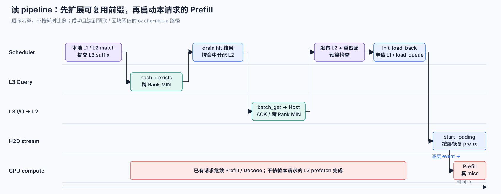
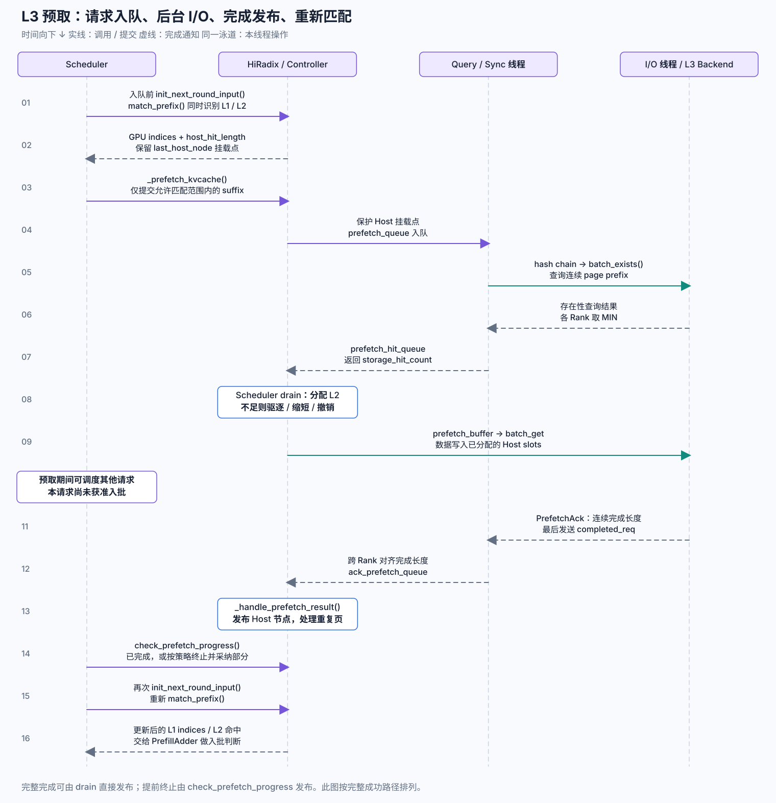
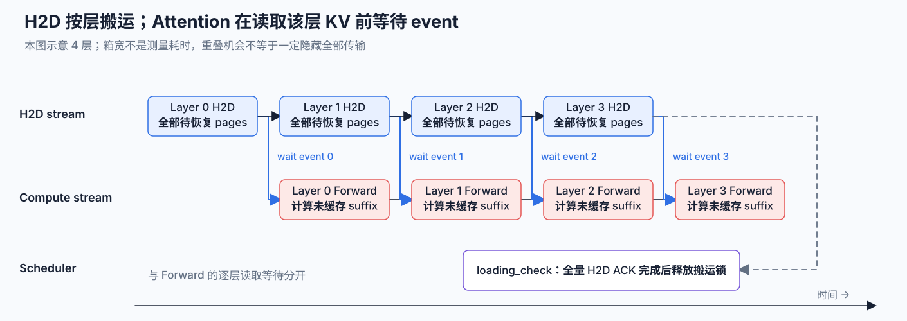
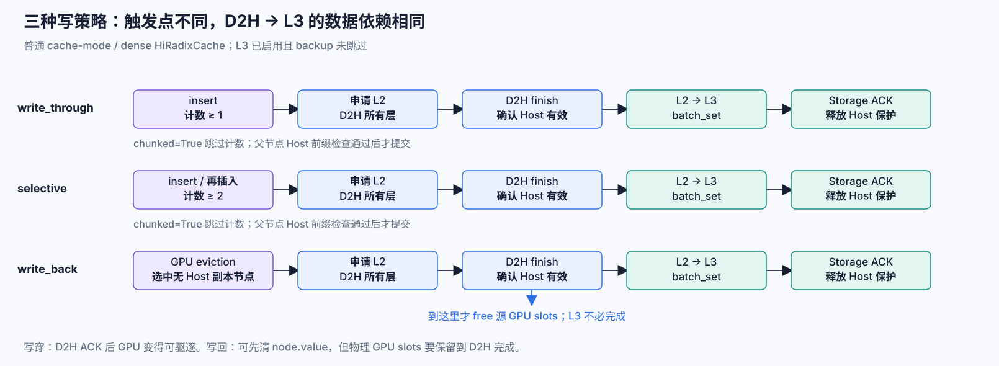
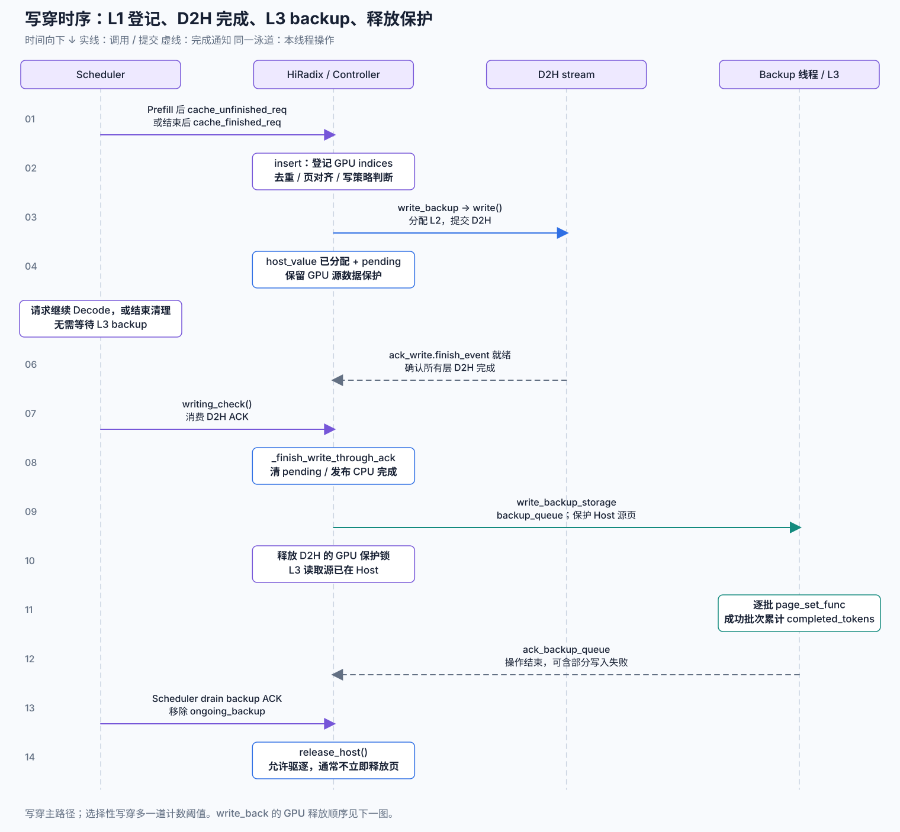

# SGLang HiCache 的 L1、L2、L3 匹配与写回时序

前文 [HiCache in SGLang：为什么需要 CPU 后台线程](hicache.md) 已经介绍了三级 KV Cache、内存布局与后台线程。这篇文章只追一条请求，回答两个更具体的问题：

1. 请求到来后，什么时候匹配 L1，什么时候匹配 L2，什么时候才查询 L3？
2. Prefill 或 Decode 生成的新 KV 在什么时候进入 Radix Tree，又在什么时候真正写到 L2 和 L3？

可以先记住两条主线：

```text
读：Radix 匹配 L1/L2 → 查询剩余 L3 → L3 materialize 到 L2
    → 再次 Radix 匹配 → L2 按层恢复到 L1 → 只计算真 miss

写：Forward 生成 KV → 插入 L1 Radix → 根据写策略触发 D2H
    → D2H ACK 后提交 L2→L3 → Storage ACK 后释放 Host 保护
```

但这两行省略了最容易产生误解的地方：**命中、分配、提交、数据完成和模型可读是五个不同的时刻。** 下文基于 SGLang `02d9b306` 源码快照分析，主要讲普通 MHA/MLA 的 cache-mode `HiRadixCache`，最后再补 Hybrid Controller 的变化。

## 先建立准确的三层模型

经典 HiCache 可以理解为：

> 一棵统一的逻辑 Prefix Radix Tree，加上 L1、L2、L3 三种物理驻留位置。

其中 L1 与 L2 共享 Radix 索引，L3 使用 page hash 寻址：

| 层级 | 数据位置 | Radix 节点中的描述 | 命中后是否能直接计算 |
| --- | --- | --- | --- |
| L1 | GPU HBM | `node.value = device_indices` | 可以；KV 已在 GPU |
| L2 | Host DRAM | `node.host_value = host_indices` | 不可以；要先 H2D |
| L3 | 外部 Storage | `page hash → object` | 不可以；先 L3→L2，再 L2→L1 |

`TreeNode.evicted` 的判断就是 `value is None`，`TreeNode.backuped` 的判断就是 `host_value is not None`。因此 L1 eviction 可以只清空 `value`，保留同一个节点及其 `host_value`。这个节点随后成为 L2-only 节点，而不是从逻辑 Prefix Tree 中立即消失。[源码：TreeNode residency](https://github.com/sgl-project/sglang/blob/02d9b3060ab4a691af283d48587bf2ab07787909/python/sglang/srt/mem_cache/radix_cache.py#L289-L307)

L3 则没有要求每个本地节点长期保留一份 storage placement。Controller 根据前一页 hash 和 suffix token 生成 hash chain，再调用 `batch_exists()`。这个接口返回的是**从输入第一个 key 开始连续存在的 page 数**，所以中间出现 miss 后，即使后面的 page 恰好存在，也不能跳过缺口继续复用。[源码：batch_exists contract](https://github.com/sgl-project/sglang/blob/02d9b3060ab4a691af283d48587bf2ab07787909/python/sglang/srt/mem_cache/hicache_storage.py#L321-L334)

### 三个“完成”不能混为一谈

读路径至少有三个完成点：

| 完成点 | 发生了什么 | 此时能否作为本轮 Attention 的历史 KV |
| --- | --- | --- |
| L3 exists hit | Storage 声明连续 page 存在 | 不能，只有 metadata |
| L3→L2 完成并发布 | bytes 已进入 Host，`host_value` 已挂到树上 | 不能，还在 CPU |
| 对应 layer 的 L2→L1 event 完成 | 该层历史 KV 已进入 GPU slot | 该层可以读取 |

写路径也有三个不同完成点：

| 完成点 | 状态含义 |
| --- | --- |
| `host_value` 已分配 | 只说明 Controller 预留了 Host slot，D2H 可能还在执行 |
| D2H `finish_event` ready | L2 数据有效，可以把 L3 写入建立在这份 Host 数据上 |
| Storage ACK | 本次 L2→L3 操作结束；成功写入多少以 `completed_tokens` 为准 |

这也是 HiCache 需要 `lock_ref`、`host_ref_counter`、`write_through_pending_id` 和 CUDA event 的原因：它们不是重复状态，而是在保护不同阶段的数据所有权。

## 总览：一次请求如何逐层扩展可复用前缀

先看端到端 pipeline。横向是时序，纵向泳道表示真正可以并行的执行资源。



一条新请求并不会先把 L1、L2、L3 全部查询完成，再交给 Scheduler。实际过程是：

1. 请求进入 waiting queue 前先做本地 Radix match，并异步提交 L3 suffix prefetch。
2. 当前请求等待 L3 时，Scheduler 可以继续运行其他已就绪请求。
3. L3 命中数据先进入 L2，并发布成 host-only Radix 节点。
4. 请求准备入批时再次 match，确认最新的 L1/L2 prefix。
5. `PrefillAdder` 通过预算检查后才分配 L1 slot；组 batch 时提交 H2D。
6. 模型按 layer 等待 KV，计算真正没有缓存的 suffix。

因此 L3 prefetch 是 admission 之前的投机工作；L2 load back 是 admission 成功之后、该 batch 真正要运行时才发生的工作。把两者分开，可以避免请求还没获得本轮 GPU 预算就占用 L1。

## 第一阶段：一次 Radix walk 同时识别 L1 与 L2

请求入队时，`Scheduler._prefetch_kvcache()` 先调用 `req.init_next_round_input()`。后者最终进入 `HiRadixCache.match_prefix()`：

```python
value, last_node = self._match_prefix_helper(self.root_node, key)

# value 只拼接仍有 node.value 的 device indices
device_indices = torch.cat(value) if value else empty

# 从最深匹配节点向上，累计连续的 L2-only suffix
host_hit_length = 0
last_host_node = last_node
while last_node.evicted:
    host_hit_length += len(last_node.host_value)
    last_node = last_node.parent

# 找到最深的、已经拥有 Host 副本的祖先，作为 L3 锚点
while not last_host_node.backuped:
    last_host_node = last_host_node.parent
```

[源码：HiRadixCache.match_prefix](https://github.com/sgl-project/sglang/blob/02d9b3060ab4a691af283d48587bf2ab07787909/python/sglang/srt/mem_cache/hiradix_cache.py#L1734-L1765)

它返回的几个字段各自承担不同职责：

| 字段 | 含义 | 后续消费者 |
| --- | --- | --- |
| `device_indices` | 从 root 开始、当前仍在 L1 的连续 GPU KV indices | 直接拼到请求的 `prefix_indices` |
| `last_device_node` | 最深的 L1 resident 节点 | 请求锁与 L1 生命周期 |
| `host_hit_length` | L1 prefix 后面可由 L2 继续恢复的连续 token 数 | Prefill 预算与 `init_load_back()` |
| `last_host_node` | 最深的 L2 backed-up 祖先 | 计算 L3 hash chain 的锚点 |
| `best_match_node` | 当前 load-back 起点；经典路径等于 `last_host_node` | `PrefillAdder` |

所以本地最长前缀是：

$$
L_{local}=L_{L1}+L_{L2,extra}
$$

这里的 `host_hit_length` 不是 Host 上所有匹配数据的总量，而是 **L1 结束之后，L2 还能连续接上的 suffix 长度**。同一 Radix walk 已经完成 L1/L2 的结构匹配，不需要另查一棵 Host Radix Tree。

### 为什么 pending D2H 不会被误当成可读 L2

`write_backup()` 会先分配 `host_value`，再提交 D2H，所以单看 `backuped == True`，并不能证明 bytes 已经写完。源码用另外两条约束保证安全：

1. write-through 提交 D2H 后会增加节点 `lock_ref`；在 D2H ACK 之前，L1 节点仍然存在且不能被驱逐。
2. 只有 `writing_check()` 确认 `finish_event`，才清除 `write_through_pending_id` 并释放这把锁。

因此普通请求在 pending 期间仍命中 L1，不会把尚未完成的 Host 副本作为 L2-only 数据恢复。`host_value` 是已分配地址，CUDA event 才是数据完成证明。

## 第二阶段：L3 只查询 L1/L2 之后的 suffix

Scheduler 计算：

```python
matched_len = len(req.prefix_indices) + req.host_hit_length
match_end = req._compute_max_prefix_len(len(req.full_untruncated_fill_ids))
new_input_tokens = req.full_untruncated_fill_ids[matched_len:match_end]
```

[源码：Scheduler._prefetch_kvcache](https://github.com/sgl-project/sglang/blob/02d9b3060ab4a691af283d48587bf2ab07787909/python/sglang/srt/managers/scheduler.py#L2975-L3023)

`_compute_max_prefix_len()` 通常把最大可匹配长度限制在 `input_len - 1`，为本轮 logit 计算保留至少一个 token；随后 `prefetch_from_storage()` 再按 `page_size` 向下对齐。于是 L3 查询范围准确地说是：

$$
K_{L3}=align\_down(tokens[L_{local}:L_{max\_prefix}], page\_size)
$$

这带来两个容易忽略的边界：

- L3 不会从 P0 重新查完整 prompt，它只查本地连续前缀后的部分。
- prompt 最后一页可能因为 `input_len - 1` 与 page alignment 不进入查询，即使 Storage 中存在也不会在这一轮作为完整缓存页复用。

`prefetch_from_storage()` 还会检查 storage 是否启用、suffix 是否达到 `prefetch_threshold`、Host prefetch 是否被限流。固定快照中的默认 `prefetch_threshold` 是 256 token；低于阈值直接继续计算，避免一次小搬运引入更多固定开销。[源码：prefetch gate](https://github.com/sgl-project/sglang/blob/02d9b3060ab4a691af283d48587bf2ab07787909/python/sglang/srt/mem_cache/hiradix_cache.py#L1767-L1814)

### L3 exists 和 L3 get 分成两个阶段

完整的异步时序如下。图中时间向下，虚线箭头表示完成通知。



`prefetch_thread` 首先生成 page hash chain，并按 `STORAGE_BATCH_SIZE=128 pages` 分批调用 `batch_exists()`。遇到第一个不完整 batch 就停止，因为 Prefix Cache 不能越过缺页继续命中。TP/PP Rank 随后取最小命中长度，保证每个 Rank 对可复用 prefix 得出相同结论。[源码：storage hit query](https://github.com/sgl-project/sglang/blob/02d9b3060ab4a691af283d48587bf2ab07787909/python/sglang/srt/managers/cache_controller.py#L1166-L1230)

查询结果通过 `prefetch_hit_queue` 返回 Scheduler。到这个时刻，HiCache 才为真正命中的 token 分配 Host slot：

```text
exists hit count
  → 精确分配同样长度的 L2 slots
  → 分配失败时 evict_host 后重试
  → 仍失败则缩短为 page-aligned prefix
  → 低于阈值则撤销 prefetch
```

先查询、后分配避免了“候选 suffix 很长，但 L3 只命中很短前缀”时的 Host 内存浪费。这同时解释了为什么 L3 query 和 L3 get 不能合成一个同步接口：Scheduler 需要在二者之间执行容量决策。

分配成功后，`prefetch_io_aux_thread` 调用 `batch_get`，把 Storage 数据写到指定 Host slots；每完成一批就发送 `PrefetchAck(completed_tokens=...)`，最后发送 `completed_req=True`。`prefetch_sync_thread` 再对各 Rank 的完成长度取最小值。

### prefetch 什么时候结束

`--hicache-storage-prefetch-policy` 决定请求被 Scheduler 再次看到时，是否继续等待：

| 策略 | admission 时的行为 |
| --- | --- |
| `wait_complete` | prefetch 未完整结束时继续跳过该请求 |
| `best_effort` | 采纳此刻已经安全完成的部分；还没分配 Host 时可以直接撤销 |
| `timeout` | 超时前等待，超时后终止并采纳安全完成的部分 |

所以 “L3 prefetch 已提交” 不等于 “请求必须等到全部 I/O 完成”。HiCache 可以用已有的部分命中换取更短等待，但只会发布跨 Rank 一致、已经完成的数据。

## 第三阶段：L3 命中先 materialize 成 L2 节点

L3 数据写进 Host buffer 仍不够。Radix Tree 此时还不知道 token page 与 Host slot 的对应关系。`_handle_prefetch_result()` 会调用 `_insert_helper_host()`：

```python
new_node.key = fetched_key
new_node.value = None
new_node.host_value = written_indices
new_node.hash_value = completed_hash_values
```

它将新数据发布为 host-only 节点，并处理一个重要竞态：如果 L3 prefetch 期间另一条请求已经把相同 page 插进树里，`matched_length` 会记录重复部分，随后释放重复分配的 Host slots。最终统计的 L3 新增命中量是：

$$
L_{L3,extra}=L_{completed}-L_{already\_matched}
$$

[源码：prefetch result publication](https://github.com/sgl-project/sglang/blob/02d9b3060ab4a691af283d48587bf2ab07787909/python/sglang/srt/mem_cache/hiradix_cache.py#L1627-L1700)

请求真正进入 admission 循环后还会再次执行 `req.init_next_round_input()`。这次 `match_prefix()` 才能看到刚发布的 host-only 节点，重新得到最新的 `host_hit_length` 和 `best_match_node`。因此正确顺序是：

```text
第一次 match：确定 L1/L2 基线与 L3 查询起点
L3→L2：获取数据并发布 host-only nodes
第二次 match：把新 L2 prefix 纳入本轮预算
```

如果省略第二次 match，Storage 预取虽然成功，`PrefillAdder` 仍会按旧 prefix 计算预算，甚至重新计算已经加载到 Host 的部分。

## 第四阶段：请求通过预算检查后，L2 才恢复到 L1

`PrefillAdder.add_one_req()` 先完成 KV budget gate 和 prefill delay 协商。只有该请求被允许进入本轮 batch，而且 `req.needs_host_load_back()` 为真时，才调用 `init_load_back()`：[源码：PrefillAdder load-back](https://github.com/sgl-project/sglang/blob/02d9b3060ab4a691af283d48587bf2ab07787909/python/sglang/srt/managers/schedule_policy.py#L1284-L1312)

1. `load_back()` 从最深 host hit 节点向上收集连续的 L2-only nodes。
2. 总量低于 `load_back_threshold` 或超出本轮 `mem_quota` 时，放弃 load back，退回最深 L1 节点重新计算。
3. Controller 为整段 Host prefix 分配新的 GPU slots；失败时先执行 L1 eviction，再重试一次。
4. 分配成功后，节点的 `value` 更新为新 `device_indices`，并进入 `load_queue`。

这里再次出现“metadata 领先于 bytes”：`node.value` 写入时，H2D 还没有真正开始。其安全性由按层 event 保证。

Scheduler 创建 `ScheduleBatch` 后调用 `ready_to_load_host_cache()`，Controller 合并 `load_queue`，在独立 H2D stream 中按 layer 搬运，并在每层结束时记录 `LayerLoadingEvent`。[源码：start_loading](https://github.com/sgl-project/sglang/blob/02d9b3060ab4a691af283d48587bf2ab07787909/python/sglang/srt/managers/cache_controller.py#L913-L965)

## 第五阶段：H2D 与 Prefill 是按层生产—消费



Attention backend 读取第 `i` 层 KV pool 前，会调用 `layer_transfer_counter.wait_until(i)`，也就是让 compute stream 等待该层的 load event。第 0 层 H2D 一完成，第 0 层 Forward 就可以开始；H2D stream 同时继续搬第 1、2、3 层。[源码：KV pool read gate](https://github.com/sgl-project/sglang/blob/02d9b3060ab4a691af283d48587bf2ab07787909/python/sglang/srt/mem_cache/memory_pool.py#L2347-L2378)

这里有两个不同同步粒度：

- **逐层 event**决定 Forward 何时可以读取该层 KV，是执行正确性依赖。
- **全量 D2H/H2D ACK**由 Scheduler 后续 `check_hicache_events()` 消费，用来清理 `ongoing_load_back`、释放节点保护并记录指标，是生命周期管理依赖。

所以 Forward 不必等待整段 H2D 全部完成才启动。反过来，`start_loading()` 返回也不代表 GPU 已经拥有可读的所有层；它只代表传输已提交并产生了 consumer event index。

这段重叠能否隐藏传输时间，取决于每层 H2D 时间与每层计算时间。如果第 0 层搬运本身很慢，TTFT 仍会先暴露首层等待；如果后续层的传输比计算推进得慢，compute stream 仍会在对应 layer event 上停住。

## 一个完整例子：P0 到 P9 如何被逐层复用

假设：

- `page_size=16`，prompt 共 160 token，即 P0～P9。
- L1 已有 P0～P3；L2 连续覆盖 P0～P6；L3 连续覆盖 P0～P8。
- 为了让这个小例子进入 L3 路径，假设 `prefetch_threshold <= 32`；固定快照默认值 256 会直接跳过这次小预取。

第一次 Radix match 得到：

```text
L1 device prefix = P0 P1 P2 P3 = 64 token
L2 extra suffix  = P4 P5 P6    = 48 token
local matched    = P0 ... P6   = 112 token
```

需要注意，`max_prefix_len = input_len - 1 = 159`，再按 16-token page 向下对齐后，最多查询到 144 token。因此 L3 suffix 是 P7、P8，不包含 P9：

```text
P0 P1 P2 P3 | P4 P5 P6 | P7 P8 | P9
     L1           L2        L3    compute
```

接下来：

1. `batch_exists(H7, H8)` 返回 2 pages。
2. Scheduler 分配 32 token 的 Host slots，`batch_get` 将 P7、P8 写入 L2。
3. `_insert_helper_host()` 发布 P7、P8 host-only nodes。
4. 第二次 match 得到 P0～P8 的连续 L2 prefix。
5. `load_back()` 为 P4～P8 分配 80 token 的 GPU slots并排队 H2D；P0～P3 仍使用原 L1 slots。
6. 各 layer KV 到达后，模型只 Prefill P9，并用 P0～P8 作为历史 KV。

最终：

$$
L_{reuse}=64+48+32=144,\qquad L_{compute}=160-144=16
$$

这个修正后的例子也说明，不能简单写成“L3 查询所有剩余 page”。**允许匹配的末端**先受 `input_len - 1` 约束，再受 page alignment 约束。

## Forward 之后：KV 何时插入 Prefix Cache

Forward 产生的新 KV 最初直接写入请求拥有的 L1 GPU slots。它们要成为其他请求可发现的 prefix，还需要进入 Radix Tree：

- 一个 chunked Prefill chunk 结束而请求未完成时，结果处理路径调用 `cache_unfinished_req()`；它把已经提交的、page-aligned token/KV 插入 Radix Tree，并更新本请求接下来复用的 `prefix_indices`。
- Prefill 结束后请求继续 Decode 时，也会缓存已完成的 Prefill prefix。
- 请求最终结束时，`release_kv_cache()` 调用 `cache_finished_req()`，将 `effective_kv_committed_len()` 范围内的 token/KV 插入树，释放重复部分、非对齐尾部与 request slot。

[源码：Prefill result cache/release](https://github.com/sgl-project/sglang/blob/02d9b3060ab4a691af283d48587bf2ab07787909/python/sglang/srt/managers/scheduler_components/batch_result_processor.py#L318-L350) [源码：finished request release](https://github.com/sgl-project/sglang/blob/02d9b3060ab4a691af283d48587bf2ab07787909/python/sglang/srt/mem_cache/common.py#L254-L289)

因此“完成推理后写回”只覆盖其中一个触发点。真实系统会在 Prefill 阶段就逐步建立可复用 prefix；Decode 产生的已提交 KV 则在请求完成时进入 finished cache。是否随即备份到 L2/L3，要看写策略。

## 三种写策略决定 D2H 的触发时刻



| 策略 | L1→L2 触发点 | 对 I/O 和持久性的影响 |
| --- | --- | --- |
| `write_through` | 节点第一次插入/复用并达到阈值 1 | 尽早建立 L2/L3 副本，写流量最高 |
| `write_through_selective` | 节点命中计数达到阈值 2 | 冷 prefix 留在 L1，热点 prefix 才备份 |
| `write_back` | L1 eviction 选中尚无 Host 副本的节点 | 平时写流量最低，eviction critical path 更长 |

`_inc_hit_count()` 在 `write_back` 或 `chunked=True` 时直接返回；其他策略达到阈值后才调用 `write_backup()`。write-through 还维护一个结构不变量：父节点尚未 backup 时，子节点不能先写到 Host。这样 L2 始终是从 root 连续可恢复的 prefix。[源码：write policy trigger](https://github.com/sgl-project/sglang/blob/02d9b3060ab4a691af283d48587bf2ab07787909/python/sglang/srt/mem_cache/hiradix_cache.py#L856-L879) [源码：hit threshold](https://github.com/sgl-project/sglang/blob/02d9b3060ab4a691af283d48587bf2ab07787909/python/sglang/srt/mem_cache/hiradix_cache.py#L998-L1007)

### write-through 的完整 ACK 时序



写穿路径可以拆成四个所有权阶段。

### 1. 插入 L1，并预留 L2

`write_backup()` 调用 Controller `write()`：

1. 从 Host pool 分配 `host_indices`。
2. 创建 `CacheOperation(host_indices, device_indices, node_id)`。
3. `start_writing()` 合并队列并提交所有 layer 的 D2H。
4. 节点写入 `host_value`、`write_through_pending_id`，并增加 L1 锁引用。

此时请求可以继续 Decode，或者完成自己的输出处理；Host 地址已经挂在节点上，但 D2H event 尚未完成。

### 2. D2H ACK 后，L2 才成为完成副本

Scheduler 每轮调用 `check_hicache_events()`。`writing_check()` 只消费 `finish_event.query()` 已就绪的 ACK，并同步 event。随后 `_finish_write_through_ack()`：

1. 清除 `write_through_pending_id`。
2. 发布 CPU medium 的 store event。
3. 如果启用了 L3，调用 `write_backup_storage()`。
4. 释放 write-through 期间的 L1 锁。

这个顺序很重要：L3 的写入以 Host 数据为源，所以只能在 D2H 确认完成后提交；而 L1 节点到此才可以安全进入后续 eviction 候选。

### 3. L2→L3 在 backup thread 中逐批执行

`write_backup_storage()` 创建 `StorageOperation` 放进 `backup_queue`，并增加 `host_ref_counter`。`backup_thread` 按 batch 调用 `page_set_func()`，成功时累计 `completed_tokens`；最后无论完整成功还是中途失败，都把 operation 放入 `ack_backup_queue`。[源码：storage backup loop](https://github.com/sgl-project/sglang/blob/02d9b3060ab4a691af283d48587bf2ab07787909/python/sglang/srt/managers/cache_controller.py#L1241-L1292)

Scheduler drain Storage ACK 后从 `ongoing_backup` 移除 operation，并调用 `release_host()`。这里释放的是 **Host eviction protection**，通常不是立即 free Host slots。L2 节点仍可以继续提供 load back，直到后续 `evict_host()` 选择它。

如果 Storage 某一批写失败，未来 `batch_exists()` 会在缺失 page 处截断。HiCache 不会因为本地节点拥有 `hash_value` 就凭空宣称 L3 已经存在；外部 backend 的 exists 结果才是下一次读取的依据。

### 4. write-back 为什么必须阻塞 L1 eviction

write-back 只在 L1 eviction 时备份冷数据。对没有 Host 副本的节点，源码执行：

```text
提交 D2H
  → node.value = None，使逻辑节点先变成 L2-only
  → writing_check(write_back=True) 阻塞等待所有 staged D2H
  → D2H 完成后才 free 原 device_indices
  → Host 副本继续异步进入 L3
```

[源码：write-back eviction](https://github.com/sgl-project/sglang/blob/02d9b3060ab4a691af283d48587bf2ab07787909/python/sglang/srt/mem_cache/hiradix_cache.py#L1248-L1299)

`node.value=None` 只是逻辑摘除，不能立即释放物理 GPU slots，因为 D2H stream 仍在读取它们。`writing_check(write_back=True)` 就是这个 source lifetime fence。它会拉长本次 eviction，但不需要等待 L3：一旦 Host 数据完整，GPU 源 slot 就可以释放，L3 backup 在后台继续。

## L1、L2、L3 eviction 后分别留下什么

| 事件 | Radix 节点变化 | 数据还能从哪里恢复 |
| --- | --- | --- |
| L1 eviction，已有 L2 副本 | `value → None`，保留 `host_value` 与节点 | L2→L1 |
| L1 eviction，没有 L2 副本，write-through 策略 | 释放 value 并删除无备份 leaf | 可能从 L3 查回，或重算 |
| L1 eviction，没有 L2 副本，write-back 策略 | 先 D2H，确认后释放 GPU | L2→L1，后续可写 L3 |
| L2 eviction | 只允许驱逐已 L1-evicted、无 Host 引用的 leaf；删除本地 host-only 节点 | L3 hash lookup，或重算 |
| L3 miss/eviction | 本地树不受直接影响 | 本地 L1/L2 若也没有，则重算 |

这里体现了三层的不对称：L1/L2 residency 由同一棵本地树直接表达；L3 是否存在由 backend 的 page hash 查询回答。L2-only 节点被删除后，本地 Radix Tree 不再记得这段 prefix，但下一条请求仍可以从最近的 Host hash 锚点重新查询 L3。

## Unified / Hybrid 模型多了一条“所有组件都可恢复”的约束

普通 MHA/MLA 中，一个 Full KV page 命中就足以恢复该 prefix。DSA、SWA、Mamba 等混合模型还可能有 indexer KV、滑动窗口 KV 或状态 sidecar。`HybridCacheController` 会把多个 `PoolTransfer` 绑定到同一个 operation，但可用长度不能只看 Full KV：

$$
L_{usable}=\min(L_{FullKV}, L_{all\ required\ ALL\_PAGES\ pools})
$$

`ALL_PAGES` pool，例如 KV-derived indexer，要求从头到目标 prefix 的所有 page 连续存在；`TRAILING_PAGES` pool 只要求目标 prefix 尾部窗口或状态存在。H2D 时各 pool 也共享同一次 operation 的 layer completion 语义：只有该层要求的组件都搬完，模型才能消费该层状态。

所以 Unified/Hybrid 改变的是“一个命中由哪些物理组件共同成立”，没有改变主时序：

```text
L3 exists 对齐所有必需组件
  → L3→L2 materialize
  → 重新匹配并做 admission
  → 一次 operation 恢复 Full KV 与 sidecar
  → 对应 layer event 后消费
```

## 哪些场景下 HiCache 会主动不搬

HiCache 并不是命中越多越好。源码至少在以下情况选择重算、缩短或等待：

- L3 candidate 小于 `prefetch_threshold`：直接跳过，避免 hash、队列、网络和 Host 分配的固定成本。
- L2-only hit 小于 `load_back_threshold`：不做 H2D，由 GPU 重新 Prefill。
- L2 load 超出本轮 `mem_quota`：不让 cache promotion 挤占 admission 所需 KV 空间。
- Host 空间不足：先驱逐，再缩短为 page-aligned prefix；仍低于阈值则撤销。
- 多 Rank 命中或完成长度不一致：取最小值，不能让某个 Rank 使用其他 Rank 没有的 page。
- `best_effort` 的请求更早获得调度机会，但可能放弃尚未完成的 L3 命中；`wait_complete` 更偏命中率，却会增加队头等待。

因此更准确的收益判断不是“L3 hit 了多少”，而是：

$$
T_{saved\ compute} > T_{query}+T_{L3\to L2}+T_{unhidden\ H2D}+T_{control}
$$

其中只有一部分 H2D 和其他请求的计算可以重叠。小 prefix、低带宽或高排队压力下，重算可能更快，这正是两级 threshold 和 stop policy 存在的原因。

## 回到开头的两个问题

匹配 L1/L2 发生在同一次 `match_prefix()` 中；L3 查询只覆盖它们之后、且满足最大可匹配长度与 page alignment 的 suffix。L3 命中先成为 L2 host-only 节点，请求随后重新 match；通过入批预算后才发起 L2→L1。H2D 的 `node.value` publication 不代表 bytes 已完成，Attention 以 per-layer event 作为读取门槛。

Forward 后的新 KV 先进入请求的 L1 slots，再在 Prefill chunk 或请求结束时插入 Radix Tree。write-through/选择性 write-through 在插入或命中计数达到阈值后备份；write-back 在 GPU eviction 时备份。D2H ACK 是 Host 数据有效和 GPU 源可释放的边界，Storage ACK 只结束 L3 operation 并解除 Host 保护。请求完成、L2 完成和 L3 完成是三个独立生命周期。

## 源码时序索引

如果要用 profiler、日志或断点核对这篇文章，可以按下面的顺序追踪。表中的“完成后状态”比函数返回值更重要，因为很多函数只负责提交异步工作。

| 顺序 | 执行位置 | 入口 | 完成后可确认的状态 |
| --- | --- | --- | --- |
| 1 | Scheduler | `Req.init_next_round_input()` → `HiRadixCache.match_prefix()` | 已得到本地 L1 indices、L2 extra length 和 L3 Host 锚点 |
| 2 | Scheduler | `Scheduler._prefetch_kvcache()` → `prefetch_from_storage()` | L3 suffix operation 已进入 `prefetch_queue`，尚无 L3 命中结论 |
| 3 | `prefetch_thread` | `_storage_hit_query()` | 已得到 page hash 与连续 exists 长度，并完成 Rank 间 MIN |
| 4 | Scheduler | `_drain_and_alloc_storage_hit()` | 只为实际命中范围分配了 Host slots；operation 进入 `prefetch_buffer` |
| 5 | `prefetch_io_aux_thread` | `_page_transfer()` | `batch_get` 分批写入 Host，并产生累计完成 ACK |
| 6 | `prefetch_sync_thread` | `_reduce_prefetch_ack()` | 各 Rank 对已完成的连续长度达成一致 |
| 7 | Scheduler | `_handle_prefetch_result()` → `_insert_helper_host()` | 完成的 L3 bytes 已发布为 L2 host-only Radix nodes |
| 8 | Scheduler | 再次 `Req.init_next_round_input()` | 请求看到最新 L1/L2 prefix，可重新计算 admission 成本 |
| 9 | Scheduler | `PrefillAdder.add_one_req()` → `init_load_back()` | GPU slots 已预留，节点 `value` 已登记，H2D 尚未提交 |
| 10 | Scheduler / H2D stream | `ready_to_load_host_cache()` → `start_loading()` | H2D 已按 layer 提交，batch 拿到 consumer event index |
| 11 | Compute stream | KV pool `get_*_buffer()` → `wait_until(layer_id)` | 对应 layer event 完成后，该层历史 KV 才能读取 |
| 12 | Scheduler | `loading_check()` | 整次 H2D 完成，移除 `ongoing_load_back` 并释放保护 |
| 13 | Scheduler | `cache_unfinished_req()` / `cache_finished_req()` | 新计算且 page-aligned 的 KV 已进入 L1 Radix Tree |
| 14 | Scheduler / D2H stream | `write_backup()` → `write()` → `start_writing()` | Host slots 已分配，D2H 已提交，节点仍受 L1 锁保护 |
| 15 | Scheduler | `writing_check()` → `_finish_write_through_ack()` | L2 bytes 有效；可以提交 L3 backup，并释放 D2H 的 L1 保护 |
| 16 | `backup_thread` | `_page_backup()` | 成功 page 已经 `batch_set` 到 L3，operation 进入 backup ACK queue |
| 17 | Scheduler | `_drain_backup()` | `ongoing_backup` 清理，Host eviction protection 解除 |

调试时可以围绕四组 ID 关联日志：请求使用 `rid`；L3 prefetch 使用 `PrefetchOperation`；L1/L2 传输 ACK 携带 `node_ids`；L3 backup 使用 `StorageOperation.id`。只用 `rid` 无法完整串起节点级 D2H 和后台 Storage 写入。

## Reference

- [SGLang HiCache System Design](https://github.com/sgl-project/sglang/blob/02d9b3060ab4a691af283d48587bf2ab07787909/docs_new/docs/advanced_features/hicache_design.mdx)
- [HiRadixCache](https://github.com/sgl-project/sglang/blob/02d9b3060ab4a691af283d48587bf2ab07787909/python/sglang/srt/mem_cache/hiradix_cache.py)
- [HiCacheController](https://github.com/sgl-project/sglang/blob/02d9b3060ab4a691af283d48587bf2ab07787909/python/sglang/srt/managers/cache_controller.py)
- [HiCacheStorage](https://github.com/sgl-project/sglang/blob/02d9b3060ab4a691af283d48587bf2ab07787909/python/sglang/srt/mem_cache/hicache_storage.py)
- [Scheduler](https://github.com/sgl-project/sglang/blob/02d9b3060ab4a691af283d48587bf2ab07787909/python/sglang/srt/managers/scheduler.py)
