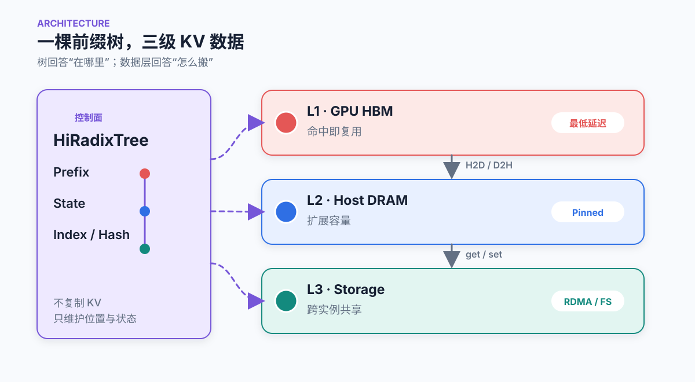
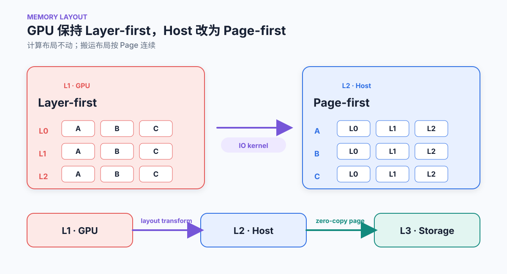
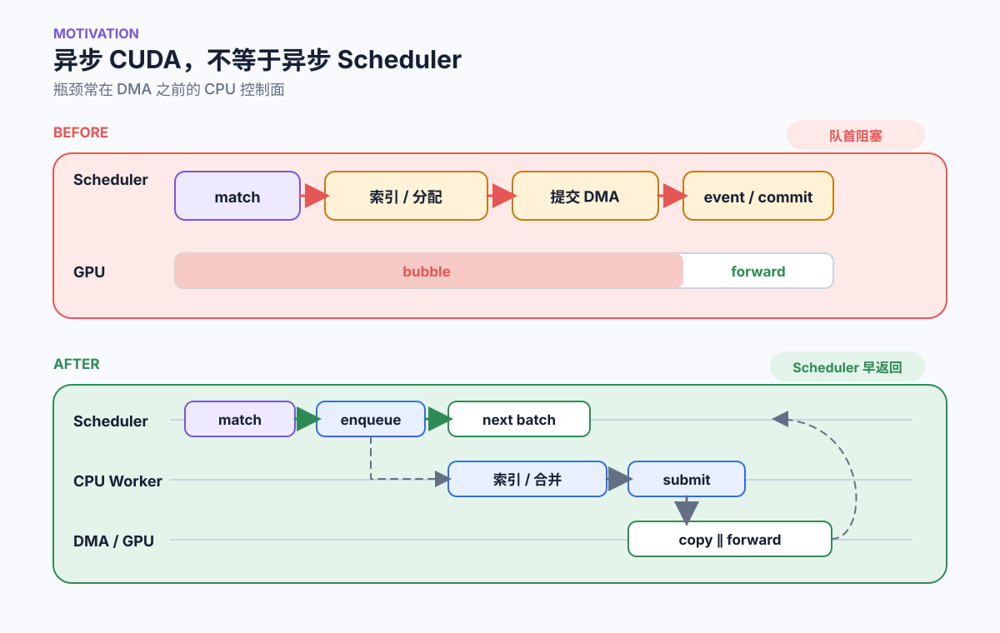
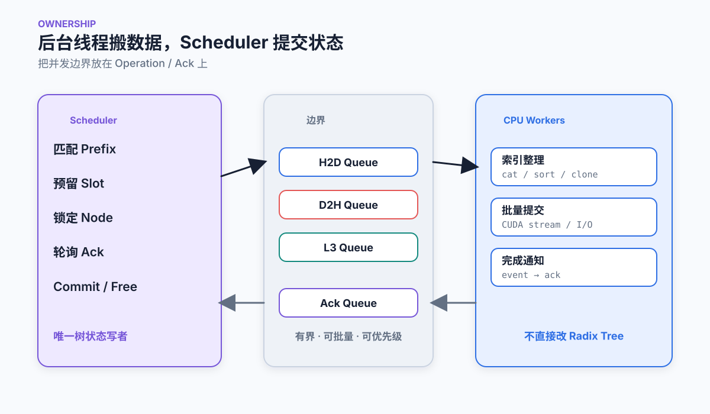
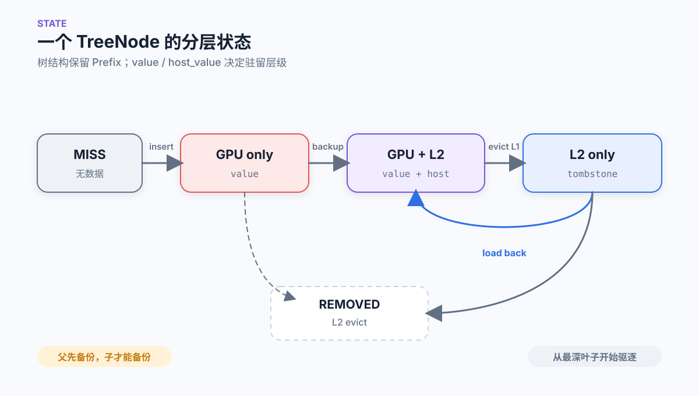
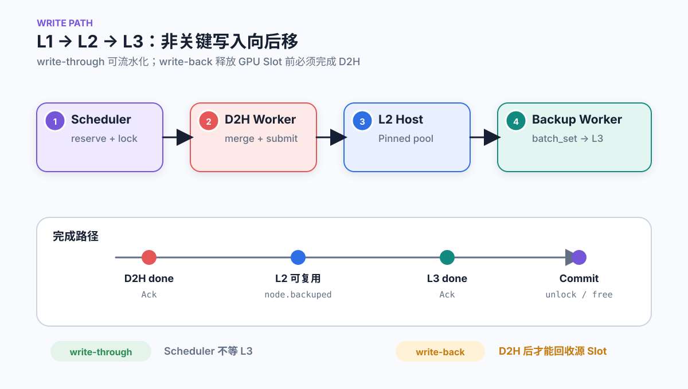
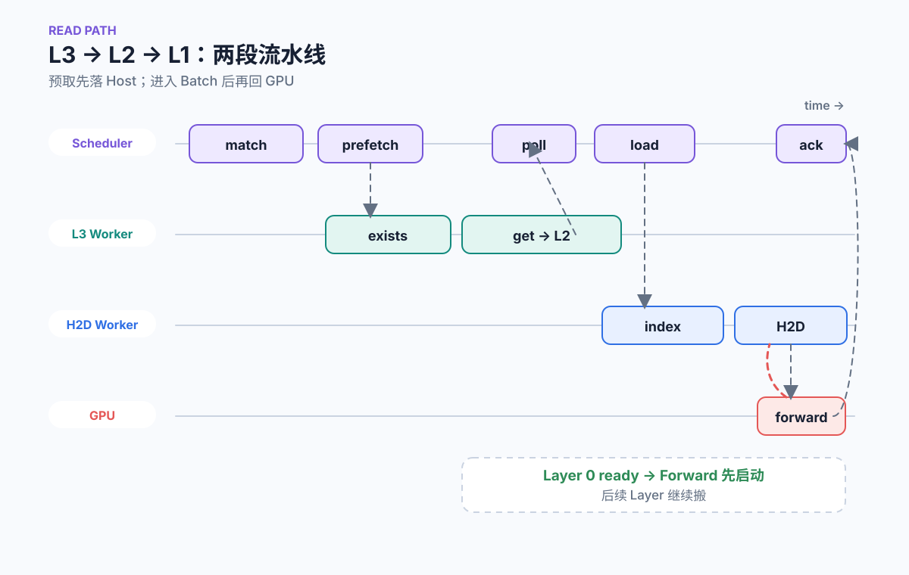
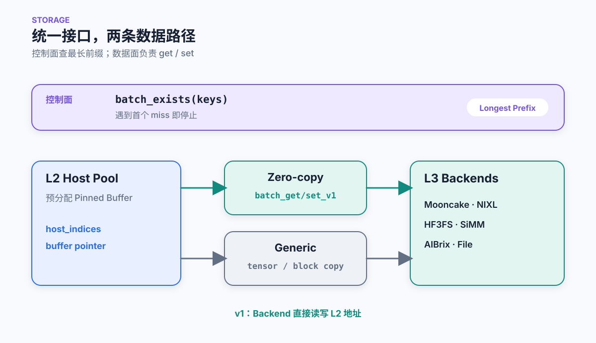
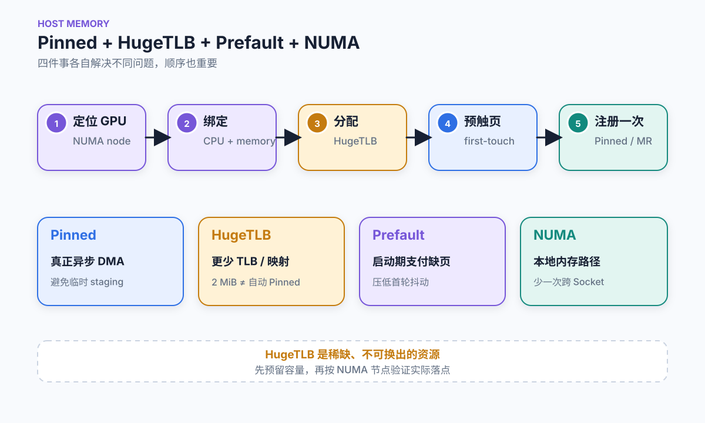

# HiCache in SGLang：为什么需要 CPU 后台线程

> [!TLDR]
> 这项优化的核心不是“让 PCIe 搬得更快”，而是把 HiCache 搬运的 **CPU 控制面**从单线程 Scheduler 热路径中解耦；Pinned HugeTLB、Prefault 与 NUMA 亲和性则让真正的**数据面**更稳定，更容易与 GPU 计算重叠。

## Overview

HiCache 将 KV Cache 扩展为三级：

- HiRadixTree：单机 GPU-CPU 双层前缀缓存树
- Storage Backend：可插拔存储后端，集成 3FS、Mooncake、NIXL 等
  - 统一接口封装 batch_get / batch_set / batch exists
  - 零拷贝数据传输
- Global KVManager：部分 Backend 提供全局 KV block 的元数据、分配与一致性管理
- Global Storage：3FS、Mooncake、NIXL 等后端提供跨实例共享能力



### 流程

HiCache 的读路径可以理解成两段独立轮询、可以重叠执行的异步流水线：

1. **L3 -> L2**：Scheduler 先通过 `match_prefix()` 找到 L2 挂载点，再把 L2 未覆盖的 suffix 交给 prefetch 线程。prefetch 线程先做 hash 计算和 storage existence check，确认命中足够多后，再由 IO 线程把 storage 中的 KV 直接读入预分配的 host memory。
2. **L2 -> L1**：请求真正被选入 batch 时，`init_load_back()` / `load_back()` 才会把 host 上命中的 KV 分配回 GPU slot，并提交 H2D DMA。

两段流水线的轮询点不同，但都是 scheduler 每次迭代时进行轮询：

- `check_prefetch_progress()` 负责把 L3 prefetch 完成的数据插入 radix tree
- `loading_check()` 负责检查 H2D DMA 是否完成并释放保护引用。

**Load back**

- H2D load 和 prefill forward 是 layer-wise 重叠的：第 0 层 KV 搬完后 forward 就可以开始算第 0 层，同时 load stream 继续搬后面的层。

**Backup**

- Prefill 结束后，新产生的 KV 留在 GPU；如果策略要求 write back / backup，则再按 L1 -> L2 -> L3 的方向异步写回。

> [!NOTE]
> 这里的 L3 预取和 L2 load back 都需要匹配时超过一个阈值，如果没有超过不会进行这个过程
>
> L3 prefetch 预分配一大段的 host kv slot，实际上可能 IO 线程只填充了一部分，剩余的会放入 host_mem_release_queue 里面。

## Mempool Opt



HiCache 采用了解耦的内存布局策略：

- L1 GPU 端：保持“Layer-First”布局，确保与现有的计算算子完全兼容。
- L2 & L3 端：统一采用全新的“Page-First”排布。在 Page-First 模式下，对于一个固定的物理页面（例如 64 个 Token 对应的 Key 和 Value），它在所有模型层（例如 80 层）上的 KV 数据被紧凑、连续地打包存储在 CPU Pinned 内存或远端网络内存中。

主机内存池的内存布局：

- `page_first`：把同一个 token/page 的所有 layer 连起来，方便 L3 I/O。
- `page_first_direct`：再进一步按 page_num, layer_num, page_size 组织，让 CPU -> GPU 的 direct transfer 可以按「某 page 的某 layer」聚合。
- `page_head`：是后面异构 TP 要用的布局，它把 head 维度提到 page 里面，方便按 head 切分。

CPU 和 GPU 之间 KV 缓存传输的 I/O 后端：

- `direct`：更接近普通 indexing/copy，适合 `page_first_direct`。
- `kernel`：走 SGLang 自己的 GPU-assisted I/O kernel，适合 `page_first`、`page_head` 这些需要 layout transform 的路径。

> [!IMPORTANT]
> prefix cache 的命中模型决定了 "layer" 不是独立可命中的单位，唯一一个 per-layer 切分有意义的维度是 head（不是 layer）。
> L3 的 key 粒度跟着"命中的最小有意义单位"走，而 prefix cache 的最小有意义单位是一页 token 的全部层 KV，只要少一层就得整页重算。

## HiSparse

> HiSparse 在代码里对应 `--enable-hisparse`，全称是 hierarchical sparse attention。它和 HiCache 都在做 GPU/Host 分层，但目标不同：HiCache 是 prefix KV cache 的分层复用；HiSparse 是稀疏注意力场景下的 per-request KV 分层，把完整历史 KV 主要放在 Host，只把当前 decode 需要的 top-k KV token/page swap 到 GPU device buffer。

### 定位与约束

HiSparse 当前主要服务于 DSA（DeepSeek Sparse Attention，例如 DeepSeek V3.2、GLM-5）以及 DeepSeek V4。启动参数在 `server_args.py` 中：

```shell
--enable-hisparse
--hisparse-config '{"top_k": 2048, "device_buffer_size": 4096, "host_to_device_ratio": 2}'
```

`hisparse_config` 的核心字段：

| 字段 | 默认值 | 含义 |
| --- | --- | --- |
| `top_k` | `2048` | 每次 decode 稀疏注意力真正读取的历史 KV token/page 数 |
| `device_buffer_size` | `2 * top_k` | 每个 request 在 GPU 上保留的热 KV buffer 大小，必须大于等于 `top_k` |
| `host_to_device_ratio` | `2` | logical KV 空间相对 hisparse device buffer 的放大倍数；越大表示更多 KV 放到 Host，GPU 热区越小 |
| `algorithm` / `backend` | `None` | 通用 sparse framework 的算法和 backend adaptor |
| `page_size` / `min_sparse_prompt_len` | `None` | 通用 sparse framework 的页粒度和启用阈值 |

代码里有几个硬约束：

- `validate_hisparse()` 要求模型是 DSA 或 DeepSeek V4。
- DSA 路径上，KV dtype 和 backend 绑定：`bfloat16 -> flashmla_sparse`，`fp8_e4m3 -> flashmla_kv`。
- **HiSparse 当前要求 `--disable-radix-cache`**。这是 `arg_groups/hisparse_hook.py` 里的显式 assert。
- **HiSparse 当前不能和 HiCache 同时开启**。原因是 HiCache 要 `--enable-hierarchical-cache`，而 `server_args._handle_cache_compatibility()` 禁止 `enable_hierarchical_cache && disable_radix_cache`；HiSparse 又要求 `disable_radix_cache`。所以从参数校验层就互斥。

### 核心原理

普通 decode 注意力会从 GPU KV cache 中读完整历史；HiSparse 则把历史 KV 拆成两层：

- **Host full history**：request 的历史 KV 备份在 Host pool 中，作为完整可恢复的长期存储。
- **GPU hot buffer**：每个 request 在 GPU 上只有一个较小的 `device_buffer`，保存最近 token、刚生成 token，以及当前 layer top-k 需要访问的 KV。

一次 decode 的关键路径是：

1. DSA indexer 根据当前 query 算出 top-k 历史 token/page 位置。
2. `HiSparseCoordinator.swap_in_selected_pages()` 根据 top-k 位置检查 GPU hot buffer。
3. 命中则直接返回 device loc；miss 则从 `req_to_host_pool` 找到 Host KV loc，通过 JIT kernel `load_cache_to_device_buffer_*()` 把该 layer 的 KV 搬入 device buffer。
4. 稀疏 attention kernel 使用返回的 `top_k_device_locs` 做 FlashMLA sparse / FlashMLA KV 计算。
5. decode 产生的新 KV 先写到 device buffer；满足压缩/页对齐条件后异步 backup 回 Host，保证后续还能被 swap-in。

这里的“hierarchical”不是 prefix 层级，而是同一个 request 内的 KV 生命周期层级：Host 保存完整历史，GPU 保存当前稀疏注意力需要的热子集。

### 组件组成

**1. 参数与校验层**

- `server_args.py`：注册 `--enable-hisparse` 和 `--hisparse-config`。
- `arg_groups/hisparse_hook.py`：选择 DSA backend，并校验模型类型、KV dtype/backend、`--disable-radix-cache`。
- `mem_cache/sparsity/factory.py`：解析 `SparseConfig`，默认 `top_k=2048`、`device_buffer_size=4096`、`host_to_device_ratio=2`。

**2. 稀疏算法与 backend adaptor**

`mem_cache/sparsity/core/sparse_coordinator.py` 定义了一个通用框架：

- `RequestTrackers`：记录每个 request 是否已经构造稀疏表示、prompt 长度、最后构造到哪个 page。
- `SparseCoordinator`：提供 `on_request_begin()`、`attention_begin()`、`attention_end()`、`forward_begin()`、`forward_end()` 生命周期钩子。
- `BaseSparseAlgorithm`：抽象出 representation construction、representation update、`retrieve_topk()`。
- `BackendAdaptor`：把算法返回的 logical selected indices 转成具体 attention backend 的 metadata。

不过 DSA HiSparse 的当前实现更直接：`DeepSeekDSAAlgorithm.retrieve_topk()` 基本把 top-k 选择委托给 DSA 原生 indexer；真正的 Host/GPU 分层管理由 `managers/hisparse_coordinator.py` 的 `HiSparseCoordinator` 负责。

**3. KV pool 与 allocator**

HiSparse 有两套地址空间：

- logical/full KV indices：对 scheduler、req_to_token、普通 KV 语义可见，表示完整序列逻辑位置。
- hisparse device indices：真实落在 GPU hot buffer 中的物理位置。

`HiSparseTokenToKVPoolAllocator` 同时维护：

- `logical_attn_allocator`：给完整逻辑 KV 空间分配索引。
- `hisparse_attn_allocator`：给 GPU hot buffer 分配索引。
- `full_to_hisparse_device_index_mapping`：把 logical loc 映射到 hisparse device loc。

对 DSA 模型，device pool 是 `HiSparseDSATokenToKVPool`。它继承 `DSATokenToKVPool`，但在 `set_mla_kv_buffer()` / `get_mla_kv_buffer()` 前会把 logical loc 翻译成 hisparse device loc。

DeepSeek V4 还有专门路径：`DeepSeekV4HiSparseTokenToKVPoolAllocator` 包装 SWA/full allocator，同时管理 C4 压缩 KV pool；这里 `compress_ratio=4`，即多个 full token 对应一个压缩 C4 KV token。

**4. Host pool**

HiSparse 的 Host 侧不是 HiCache 的 radix tree host backup，而是 request-local 的完整历史 KV 存储：

- DSA 路径使用 `MLATokenToKVPoolHost`。
- DeepSeek V4 使用 `DeepSeekV4PagedHostPool`。
- `HiSparseCoordinator.req_to_host_pool` 记录每个 request 每个历史 token/page 在 Host pool 中的位置。
- `req_to_host_pool_allocated_len` 记录每个 request 已经分配/备份到 Host 的长度。

**5. HiSparseCoordinator**

`HiSparseCoordinator` 是运行时核心，主要状态包括：

| 状态 | 作用 |
| --- | --- |
| `req_to_device_buffer` | 每个 request 的 GPU hot buffer slot |
| `req_device_buffer_size` | 每个 request 当前已分配的 hot buffer 长度 |
| `req_to_host_pool` | 每个 request 的 Host KV loc 表 |
| `req_device_buffer_tokens` | 每层、每 request、每 buffer slot 当前缓存的是哪个 token |
| `req_device_buffer_token_locs` | 每层、每 request、每 buffer slot 对应的 device loc |
| `lru_slots` | 每层每 request 的 hot buffer LRU 状态 |
| `top_k_device_locs_buffer` | CUDA graph safe 的 top-k device loc 输出缓冲 |
| `write_staging_stream` / `decode_backup_stream` | prefill 后 staging 和 decode 后 backup 的异步 copy stream |

### 工作流程

#### 1. 初始化

启动时：

1. `validate_hisparse()` 校验模型、dtype/backend、`disable_radix_cache`。
2. `ModelRunner.init_memory_pool()` 根据 `enable_hisparse` 选择 `HiSparseDSATokenToKVPool` 和 `HiSparseTokenToKVPoolAllocator`。
3. `ModelRunner.initialize()` 创建 `HiSparseCoordinator`，并把它挂到 `model_runner.hisparse_coordinator`。
4. Scheduler 初始化后复用 model runner 中的 coordinator，并调用 `set_decode_producer_stream()`，让 backup stream 可以等待 decode producer stream。

#### 2. Prefill / Extend 阶段

普通非 PD 路径中，prefill 仍然会算完整 prompt 的 KV，但 KV 写入的是 hisparse device pool：

1. `alloc_extend()` 同时分配 logical indices 和 hisparse device indices。
2. `full_to_hisparse_device_index_mapping[logical_indices] = hisparse_indices` 建立映射。
3. prefill 结束后，`BatchResultProcessor` 调用 `hisparse_coordinator.admit_request_into_staging(req)`。
4. staging 从 `req_to_token_pool` 取出 request 的 full KV logical indices，翻译成 hisparse device indices。
5. Host pool 为该 request 分配对应长度的 host slots。
6. `write_staging_stream` 异步调用 `backup_from_device_all_layer()`，把 prefill KV 从 GPU hot/device pool 备份到 Host。
7. Scheduler 不把 last prefill batch 直接 merge 到 running batch，而是调用 `collect_ready_reqs()` 轮询 staging 完成；完成后 `alloc_device_buffer(req)` 给该 request 准备 decode hot buffer，再构建 decode batch。

#### 3. Decode 阶段

decode 每步会做两件事：先把新 token 的 buffer/mapping 接好，再在 attention 层按 top-k swap-in。

1. `ScheduleBatch.prepare_for_decode()` 会调用 `hisparse_coordinator.map_last_loc_to_buffer()`。
2. `map_last_loc_to_buffer()` 先通过 `_eager_backup_previous_token()` 把上一个新产生的压缩 token 备份到 Host。
3. 对普通 DSA 路径，如果序列还短，会增长 request 的 device buffer；如果超过 `device_buffer_size`，最新 token 走 reserved slot。
4. DSA attention backend 调用 indexer 得到 `topk_indices`。
5. `dsa_backend.py` 在 decode 时调用 `hisparse_coordinator.swap_in_selected_pages(req_pool_indices, seq_lens, topk_indices, layer_id)`。
6. `swap_in_selected_pages()` 调用 JIT kernel `load_cache_to_device_buffer_mla()` 或 `load_cache_to_device_buffer_dsv4_mla()`：
    - 如果 top-k token 已在 hot buffer，直接返回对应 device loc。
    - 如果不在，按 `req_to_host_pool` 找 Host loc，把当前 layer KV 拷到 LRU 选出的 device buffer slot。
    - 更新 `device_buffer_tokens`、`device_buffer_token_locs` 和 LRU。
7. FlashMLA sparse / KV backend 使用返回的 `top_k_device_locs` 做实际 attention。

#### 4. PD Decode direct-to-host 路径

PD decode 下还有一个直接写 Host 的路径：

- `disaggregation/decode.py` 中，HiSparse 会断言 `prefix_len == 0`，即不走 decode 侧 L1 radix cache。
- `_pre_alloc()` 使用 `alloc_logical_only()`，只分配 logical indices，不分配 hisparse device indices。
- prefill 节点通过 RDMA/传输后端把 KV 直接写入 decode 节点的 HiSparse Host pool。
- decode 侧调用 `admit_request_direct(req)`，只为 request 分配小的 GPU hot buffer；短序列会 `_preload_to_device_buffer()`，长序列则把 hot buffer 标记为空，后续每层按 top-k 从 Host swap-in。

### 与 RadixCache / HiCache 的关系

| 机制 | 解决的问题 | 共享粒度 | GPU 上保留什么 | Host/Storage 上保留什么 |
| --- | --- | --- | --- | --- |
| RadixCache | 跨请求 prefix KV 复用 | token/page prefix | 命中的 prefix KV | 默认没有 Host/L3 |
| HiCache | RadixCache 的 L1/L2/L3 分层 | 从 root 开始连续 prefix | L1 命中的 prefix KV | L2 host backup + L3 storage page |
| HiSparse | 单请求长上下文稀疏注意力的 KV 分层 | request 内 top-k token/page | 每个 request 的 hot device buffer | 该 request 的完整历史 KV |

几个关键区别：

- RadixCache / HiCache 是 **prefix cache**：重点是多个请求之间复用相同前缀。
- HiSparse 是 **retrievable sparse attention cache**：重点是单个长请求 decode 时只取 top-k 历史 KV。
- HiCache 的 Host/L3 数据必须满足连续 prefix invariant；HiSparse 的 Host 数据是 request-local full history，不要求跨请求 prefix tree。
- HiCache 的 load back 是把 L2/L3 命中的 prefix 恢复成 GPU KV；HiSparse 的 swap-in 是每层按当前 query 的 top-k 动态恢复部分 KV。

### 能否同时开启

当前代码结论：

- **HiSparse + RadixCache：不能同时开启。** `validate_hisparse()` 显式要求 `server_args.disable_radix_cache`。
- **HiSparse + HiCache：不能同时开启。** HiCache 要 `--enable-hierarchical-cache`，但 `server_args._handle_cache_compatibility()` 禁止 `enable_hierarchical_cache && disable_radix_cache`；而 HiSparse 又要求 `disable_radix_cache`。
- **HiSparse + PD decode radix cache：不能正常共用。** PD decode 的 HiSparse 路径里写了 `assert prefix_len == 0`，并注释说明 HiSparse incompatible with decode-side L1 radix cache。

因此在当前 SGLang 代码里，HiSparse 和 HiCache 是两条互斥的长上下文 KV 优化路线：HiCache 适合 prefix 复用和分层 KV 存储；HiSparse 适合 DSA/DeepSeek V4 这类稀疏注意力模型，把 decode 的历史 KV 访问变成 top-k retrieval + Host->GPU swap-in。
## 为什么异步 CUDA 仍会阻塞 Scheduler

`cudaMemcpyAsync` 只保证设备工作可以异步排入 Stream，不代表调用它之前的 CPU 工作已经异步。一次 L1 ↔ L2 操作在真正 DMA 前后，仍可能包含：

- Host / GPU Slot 分配、Node 加锁和队列合并
- `torch.cat`、`sort`、`clone` 等索引整理
- `device_indices.cpu()` 引入的同步与拷贝
- 首次缺页、Pinned / RDMA 注册、CUDA Event 管理
- TP / PP Rank 对齐，以及完成后的 Tree 状态提交

当前 Scheduler 同时负责接收请求、Prefix Match、Continuous Batching、挑选下一个 Batch、提交 Forward、回收完成请求。如果上述 CPU 工作进入同一条热路径，一个慢操作阻塞的不只是当前 L2/L3 命中请求，还会推迟：

1. 新请求进入 Batch
2. 已在 L1 的其他请求继续运行
3. 下一次 GPU Forward 提交
4. Decode 完成处理与 Slot 回收

这就是全局 **Head-of-Line Blocking**：PCIe 可能还没开始搬，GPU Bubble 已经出现。



### 当前主线的边界

本文按 SGLang `02d9b306` 源码快照分析。当前实现已经把 L3 的查询、I/O、同步与 Backup 放入多个[存储后台线程](https://github.com/sgl-project/sglang/blob/02d9b3060ab4a691af283d48587bf2ab07787909/python/sglang/srt/managers/cache_controller.py#L435-L467)；但 L1 → L2 的 [`write()` 会直接进入 `start_writing()`](https://github.com/sgl-project/sglang/blob/02d9b3060ab4a691af283d48587bf2ab07787909/python/sglang/srt/managers/cache_controller.py#L783-L823)，L2 → L1 的 [`start_loading()`](https://github.com/sgl-project/sglang/blob/02d9b3060ab4a691af283d48587bf2ab07787909/python/sglang/srt/managers/cache_controller.py#L913-L950) 也会在调用线程中完成 Queue Merge、索引搬移和 Transfer Submit。

因此，本文讨论的“CPU 后台线程”不是重复已有的 L3 Worker，而是进一步把 **L1 ↔ L2 的 CPU 准备与提交阶段**移出 Scheduler。

## CPU 后台线程如何解耦控制面

Scheduler 只做必须串行化的轻量操作：

1. 预留目标 Slot
2. 锁定 TreeNode，避免异步期间被驱逐
3. 构造只含索引、Node ID、优先级的 `Operation`
4. 入队后立即继续调度

Worker 负责重活：索引整理、合并小请求、选择专用 Stream、提交 DMA / I/O，并在 Event 完成后写入 Ack Queue。Scheduler 在安全点轮询 Ack，统一提交 `backuped`、`evicted`、引用计数和 Slot 回收。



这个所有权边界很重要：**Worker 搬数据，Scheduler 改树状态。** 如果 Worker 直接修改 HiRadixTree，很容易出现 Node 已删除、Slot 提前复用或异步 use-after-free。

### 它具体带来什么

- **切掉 Scheduler 的 CPU 长尾**：页错误、索引整理、注册和 Backend 抖动不再串行阻塞所有请求
- **形成三路重叠**：Scheduler 组 Batch、GPU Forward、PCIe / RDMA 搬运可以同时推进
- **批处理小操作**：Worker 可以合并多个 `Operation`，摊薄 Python、Kernel Launch 和 Event 开销
- **可控排队**：H2D Read 优先于非关键 D2H Write，并通过有界队列施加 Backpressure

它不会提高 PCIe / RDMA 的理论带宽，也不能消除当前请求对 H2D 数据的依赖。`write_back` 驱逐还必须等 D2H 完成，才能安全释放源 GPU Slot；当前源码也在该路径上[显式同步完成事件](https://github.com/sgl-project/sglang/blob/02d9b3060ab4a691af283d48587bf2ab07787909/python/sglang/srt/mem_cache/hiradix_cache.py#L1044-L1055)。

## Component Details

下面的代码均为保留关键分支的简化片段；字段与行号以文末固定 Commit 的源码链接为准。

### HiRadixTree

**RadixAttention 原始模型**
普通 RadixAttention 用 radix tree 存 prefix KV。每个节点是一段连续 token：

```shell
  root
   └── [system prompt tokens]
        └── [user turns]
             └── [more tokens]
```

Tree Node 结构：

```python
  TreeNode.key        # 这段 token span
  TreeNode.value      # GPU KV cache indices
  TreeNode.children   # 后续 token span
  TreeNode.lock_ref   # 正在被请求引用，不能驱逐
```

匹配请求时，从 root 开始按 token prefix 往下走。命中的节点 KV 可以直接复用，未命中的 suffix 才需要 prefill 计算。

**HiRadixTree 增加的状态**
HiCache 在同一个 TreeNode 上增加分层状态：

```python
  node.value       # L1: GPU KV indices；None 表示 GPU 已驱逐
  node.host_value  # L2: host KV indices；None 表示 host 没有备份
  node.hash_value  # L3: 每个 page 的 hash key，用来查外部 storage
```

通过 value 和 host_value 的组合来判断节点的状态：

- L1 hit: node.value != None
- L2 hit: node.value == None and node.host_value != None
- L3 hit: node.hash_value != None 且 storage backend 存在对应 hash
- Miss: 以上都没有

这就是分层 radix cache 的本质：tree 结构仍然按 token prefix 组织，但每个节点标记 KV 数据在哪一层

#### Prefix Match

`match_prefix()` 是 HiCache 读路径的入口之一。它先调用 `_match_prefix_helper()` 沿 radix tree 从 root 按 token prefix 向下走，然后再向上走两次，用两个指针分别定位 L1 和 L2 的覆盖范围。

```python
value, last_node = self._match_prefix_helper(self.root_node, key)

# 指针 1：沿 evicted 节点向上走，累加 L2 覆盖的 token 数
host_hit_length = 0
last_host_node = last_node
while last_node.evicted:
    host_hit_length += len(last_node.host_value)
    last_node = last_node.parent

# 指针 2：从原始位置向上走到第一个 backuped 祖先，作为 L2 锚点
while not last_host_node.backuped:
    last_host_node = last_host_node.parent
```

HiCache 版本的 `_match_prefix_helper()` 和 base radix cache 的关键区别是：已经 `evicted` 的节点不会被加入 `device_indices`，因为它的 GPU KV 已经不在 L1。

```python
# 普通 radix cache：所有匹配节点的 value 都加入结果
value.append(child.value)

# HiCache：evicted 节点跳过，避免返回已经释放的 GPU slot
if not child.evicted:
    value.append(child.value)
```

返回值可以这样理解：

| 返回值             | 含义                                                         |
| ------------------ | ------------------------------------------------------------ |
| `device_indices`   | L1 上已经命中的 GPU KV indices，可以直接复用                 |
| `host_hit_length`  | L2 上处于 `evicted` 状态、需要 load back 的 token 数         |
| `last_host_node`   | 最深的 L2 备份祖先，也是 L3 prefetch 的挂载点                |
| `last_device_node` | 最后一个未 evict 的 L1 命中节点，用来保护和更新 GPU 驻留状态 |

一个典型例子：

```text
root (backuped)
 └─ Node_A (GPU + backuped)            <- last_device_node / last_host_node
     └─ Node_B (evicted, 128 tok)      <- host_hit_length += 128
         └─ Node_C (evicted, 64 tok)   <- host_hit_length += 64
```

这次匹配会得到：

```text
device_indices  = Root ... Node_A 的 device value 拼接
host_hit_length = 128 + 64 = 192
last_host_node  = Node_A
```

这里的直觉是：tree match 负责确认 prefix 结构，`device_indices` 只返回 L1 上真实存在的 KV；L2 上的 evicted 节点只统计长度，真正 H2D 搬运要等请求进入 batch 后由 `init_load_back()` 触发。

#### Insert

HiCache 的 `insert()` 相比 base radix cache 多了分层状态维护：同一个 token span 可能只在 GPU、只在 host、或者同时在 GPU 和 host。插入时既要维护 radix tree 结构，也要维护 `value` / `host_value` / `hash_value` 三类元数据。

**1. 驱逐节点重物化**

如果插入路径命中了一个 `evicted` 节点，说明这个节点的树结构和 L2 备份还在，但 GPU value 已经释放。这次请求重新计算出同一段 KV 后，可以直接把新的 GPU indices 写回该节点。

```python
if node.evicted:
    node.value = value[:prefix_len].clone()
    self.evictable_size_ += len(node.value)
    self._update_leaf_status(node)
    self._update_host_leaf_status(node)
```

这一步相当于把 `Evicted_on_L2` 重新 materialize 成 GPU 驻留节点，而不是创建重复节点。

**2. 分裂时同时保留 GPU / Host / Hash 状态**

当新 key 和已有 child 只有部分 prefix 相同，需要调用 `_split_node()` 把 `parent -> child` 拆成 `parent -> new_node -> child`。

```python
# GPU value 分裂
if child.evicted:
    new_node.value = None
else:
    new_node.value = child.value[:split_len].clone()
    child.value = child.value[split_len:].clone()

# Host value 分裂
if child.backuped:
    new_node.host_value = child.host_value[:split_len].clone()
    child.host_value = child.host_value[split_len:].clone()

# Hash value 分裂
new_node.hash_value, child.hash_value = split_node_hash_value(
    child.hash_value, split_len, self.page_size
)
```

这里必须同时切分三类 value，否则会破坏分层缓存的 invariant：GPU 上的 token span、L2 备份、L3 page hash 链都要和 radix node 的 key 对齐。

**3. 命中计数触发 write-through**

插入或复用已有节点后，HiCache 会增加节点的 `hit_count`。在非 `write_back` 模式下，如果一个节点被命中到阈值，并且还没有 L2 备份，就会触发 `write_backup()`，把 L1 KV 写穿到 L2。

```python
def _inc_hit_count(self, node, chunked=False):
    if self.cache_controller.write_policy == "write_back" or chunked:
        return

    node.hit_count += 1
    if not node.backuped and node.hit_count >= self.write_through_threshold:
        self.write_backup(node)
```

这也是 `write_through_selective` 的核心：不是所有节点一插入就写到 host，而是热点节点达到阈值后再写。

**Host-only 插入**

L3 prefetch 完成后走的是 `_insert_helper_host()`，它不会创建 GPU value，而是把 storage 读出来的数据 materialize 成 L2 节点。

```python
new_node.value = None
new_node.host_value = host_value.clone()
new_node.hash_value = hash_value
self._record_store_event(new_node, medium=StorageMedium.CPU)
```

这种节点可以看成 host-only tombstone：它在 tree 中占据 prefix 位置，但不占 GPU KV。后续请求命中它时，`match_prefix()` 会累计 `host_hit_length`，再由 `load_back()` 恢复 GPU value。

#### Eviction

HiCache 有两层驱逐：`evict()` 处理 L1 GPU KV，`evict_host()` 处理 L2 host KV。两者的最大区别是：

- L1 驱逐如果有 L2 备份，会保留 tombstone
- L2 驱逐会把 tombstone 从树中彻底删除

##### L1 Eviction

主入口是 `evict()`。它从 `evictable_leaves` 构建最小堆，根据 eviction strategy 选择要驱逐的 GPU 叶子节点。

```python
def evict(self, params):
    leaves = list(self.evictable_leaves)
    heap = [(self.eviction_strategy.get_priority(node), node) for node in leaves]

    while num_evicted < num_tokens and heap:
        _, x = heapq.heappop(heap)
        if x.lock_ref > 0:
            continue

        if not x.backuped:
            if write_policy == "write_back":
                self.write_backup(x, write_back=True)
                write_back_nodes.append(x)
            else:
                self._evict_regular(x)
        else:
            self._evict_backuped(x)
```

三种 L1 驱逐路径：

| 驱逐方法            | 条件                               | 操作                                                |
| ------------------- | ---------------------------------- | --------------------------------------------------- |
| `_evict_backuped()` | 已有 `host_value`                  | 释放 GPU value，保留树节点和 L2 备份                |
| `_evict_regular()`  | 无 `host_value` 且 `write_through` | 释放 GPU value，并从树中删除节点                    |
| write-back 两阶段   | 无 `host_value` 且 `write_back`    | 先 `write_backup()` 写到 L2，再按 backuped 节点降级 |

**`_evict_backuped()`：GPU -> CPU 降级**

```python
def _evict_backuped(self, node):
    self._record_remove_event(node, medium=StorageMedium.GPU)
    self.cache_controller.evict_device(node.value)
    self.evictable_size_ -= len(node.value)
    node.value = None
    self._update_leaf_status(node)
    self._update_host_leaf_status(node)
    self._update_leaf_status(node.parent)
```

这个节点不会被删除，`host_value` 仍然保留在树中。之后再命中同一段 prefix 时，可以通过 `load_back()` 把 L2 KV 恢复到 GPU。

**`_evict_regular()`：完全删除**

```python
def _evict_regular(self, node):
    assert len(node.children) == 0
    self._record_remove_event(node)
    self.cache_controller.mem_pool_device_allocator.free(node.value)
    num_evicted = len(node.value)
    self._delete_leaf(node)
    return num_evicted
```

这种路径没有 L2 备份，因此节点会从 tree 中彻底消失。

##### L2 Eviction

当 host memory 不够时，`evict_host()` 会驱逐 L2 上的 host-only tombstone。

```python
def evict_host(self, num_tokens):
    leaves = list(self.evictable_host_leaves)
    heap = [(get_priority(node), node) for node in leaves]

    while num_evicted < num_tokens and heap:
        _, x = heapq.heappop(heap)
        if x.host_ref_counter > 0:
            continue
        if not x.evicted:
            continue

        self._record_remove_event(x, medium=StorageMedium.CPU)
        self.cache_controller.evict_host(x.host_value)
        x.parent.children.pop(key)
        self.evictable_host_leaves.remove(x)

        if len(x.parent.children) == 0 and x.parent.evicted:
            heapq.heappush(heap, (get_priority(x.parent), x.parent))
```

和 L1 eviction 的关键区别是：`evict_host()` 释放的是 L2 `host_value`，并且会把 tombstone 从 radix tree 里删掉；而 `_evict_backuped()` 只是 `node.value = None`，保留 L2 可恢复状态。

##### Evictable Leaf Sets

HiCache 同时维护两组可驱逐叶子集合：

| 叶子集                  | 维护函数                     | 节点条件                                              |
| ----------------------- | ---------------------------- | ----------------------------------------------------- |
| `evictable_leaves`      | `_update_leaf_status()`      | `not evicted`、`lock_ref == 0`、所有 child 都已 evict |
| `evictable_host_leaves` | `_update_host_leaf_status()` | `evicted`、`lock_ref == 0`、没有更深的 evicted child  |

设计意图是让两类驱逐都从最深处开始：

- GPU evict 从最深的 GPU 叶子开始，避免先驱逐父节点导致 GPU child 失去前缀结构。
- L2 evict 从最深的 tombstone 开始，因为更深的 evicted node 应该先被删除。

每次 insert、split、evict、load back 后，都要更新这两组集合，否则后续驱逐候选就会不准确。

##### State Transition

核心设计原则有三个：

1. **Backup invariant**：父节点不备份，子节点不能备份；L2 上的节点必须形成从 root 开始的连续 prefix。
2. **Tombstone 保留**：有 L2 备份的驱逐节点保留在树中，后续 `load_back()` 可以恢复；只有 `evict_host()` 才会最终删除。
3. **叶子驱逐 + 父级级联**：永远从叶子开始驱逐，驱逐后父节点可能变成新的叶子，再加入候选堆。



---

### HiCacheController

初始化路径：Scheduler -> HiRadixCache -> HostKVCache -> HiCacheController

- 每个 rank 都有一个 HiCacheController 实例，负责管理本地 HiRadixTree 和与 storage backend 的交互。
- memory device pool 管理 GPU 池，memory host pool 管理 host 池
- 多个队列存放不同请求，scheduler 每次调度都会 check 这些队列状态并清除完成的请求：
    - write_queue：L1->L2 写请求
    - ack_write_queue：L1->L2 写完成 ack
    - load_queue：L2->L1 读请求
    - ack_load_queue：L2->L1 读完成 ack
    - prefetch_queue：L3 预取请求
    - prefetch_revoke_queue：L3 预取撤销请求
    - host_mem_release_queue：host 内存释放请求
    - backup_queue：L2->L3 写请求
    - ack_backup_queue：L2->L3 写完成 ack
- 后台线程和多流：
  - copy stream：专门用于 GPU<->host 的异步 copy，配合 CUDA event 实现非阻塞的 load/write 操作
    > 每一层记录一个 CUDA event，实现 layer-wise的 load/prefill 重叠
  - prefetch_thread：负责 L3 prefetch 的元数据查询和命中判断
  - prefetch_io_aux_thread：负责 L3->L2 的实际数据搬运
  - prefetch_sync_thread：负责跨并行 Rank 对齐可用的连续 Prefix
  - backup_thread：负责 L2->L3 的写入操作

这组 Queue / Worker 的职责边界见上文的 `hicache-controller-ownership` 图。下面把读、写两条复杂路径拆开看。

---

#### Device->Host->Storage Backup



**写入策略**

- **write_through**：命中/插入后尽快写到 L2/L3，缓存收益最大，I/O 压力也最大。
- **write_through_selective**：命中次数达到阈值后才写，偏向热点数据。
- **write_back**：GPU 驱逐时才写到 host/L3，减少 I/O。

**Device->Host Backup**
HiCacheController 将 host_indices 放入 write_queue，然后 merge_ops 把队列中多个写操作合并成一个批量操作：

1. 拼接 tensor：把多个 host_indices 和 device_indices 张量拼接成一个大 tensor
2. 收集 node_ids：把所有请求的 node_id 汇总
3. 取最小 priority：使用最低优先级
4. 合并 pool_transfers：合并内存池传输信息
5. 然后 node.value 对应的 GPU KV 拷到 host pool：

> [!IMPORTANT]
> 对 write_through 有一个重要约束：host 备份必须形成从 root 开始的连续 prefix，**不能父节点没备份而子节点先备份**。

**Host->Storage Backup**
递归获取祖先的 hash value，直到 root，形成当前节点的 hash_value。然后把 host KV 和 hash_value 作为一个 StorageOperation 放入 backup_queue，由 backup_thread 负责写回 storage。

- Zero-copy backend（Mooncake、NIXL、EIC、SiMM、HF3FS 等）：通过 `batch_set_v1()` 直接传 host memory 指针或 buffer view，backend 从 L2 buffer 读出并写到远端。
- Generic-copy backend（File、AIBrix 等）：通过 `batch_set()` 先构造 tensor / block handle，再由 backend 写入本地文件或远端 KV manager。

完成的 backup 回放入 ack_backup_queue，由 scheduler drain 并更新节点状态。

---

#### Storage -> Host -> Device Load Back



> [!NOTE]
> 图中的 L3 Worker 是当前主线已有路径；H2D Worker 是本文讨论的进一步优化。若未实现该 Worker，可把第三行理解为 Scheduler 调用 `start_loading()` 时执行的 CPU 子阶段。

Storage -> Host -> Device 是一条两段异步流水线：

- **L3 -> L2**：`prefetch_thread` 做 hash 计算和 storage 命中查询，`prefetch_io_aux_thread` 做真正的 storage -> host 数据搬运。
- **L2 -> L1**：Scheduler 主线程触发 `load_back()`，`load_stream` 按 layer 做 host -> device DMA。
- 两段互相独立：都由 scheduler 每次迭代后进行轮询；L3 prefetch 通过 `check_prefetch_progress()` 轮询，L2 load back 通过 `loading_check()` 轮询，因此可以和调度、prefill 计算重叠。

##### 第一阶段：L3 -> L2（Storage -> Host Prefetch）

**Step 1：`match_prefix()` 确定 L2 覆盖范围**

对应固定快照中的 [`match_prefix()`](https://github.com/sgl-project/sglang/blob/02d9b3060ab4a691af283d48587bf2ab07787909/python/sglang/srt/mem_cache/hiradix_cache.py#L1734-L1765)。

请求进入 radix tree 后，`match_prefix()` 会返回三个和 HiCache 读路径相关的值：

```python
# 沿 parent 向上走，统计 evicted 节点在 L2 上的 token 数
while last_node.evicted:
    host_hit_length += len(last_node.host_value)
    last_node = last_node.parent

# 沿 parent 向上走，找第一个 backuped 祖先，作为 L3 prefetch 挂载点
while not last_host_node.backuped:
    last_host_node = last_host_node.parent
```

| 返回值            | 含义                                                              |
| ----------------- | ----------------------------------------------------------------- |
| `device_indices`  | GPU 上已经命中的 prefix，可直接复用                               |
| `last_host_node`  | 最深的 L2 备份节点，也是 L3 prefetch 结果插入 radix tree 的挂载点 |
| `host_hit_length` | L2 上处于 `evicted` 状态的 token 数，后续需要 load back 到 GPU    |

这里有个关键约束：prefetch 结果最终要插入 radix tree，因此必须先找到一个已经 `backuped` 的 L2 祖先节点作为挂载点。

**Step 2：`_prefetch_kvcache()` 触发 L3 prefetch**

```python
if last_host_node.backuped or last_host_node is self.tree_cache.root_node:
    new_input_tokens = req.fill_ids[matched_len:]
    self.tree_cache.prefetch_from_storage(
        req.rid, last_host_node, new_input_tokens, last_hash, prefix_keys
    )
```

`new_input_tokens` 是 L2 尚未覆盖的 suffix。只有 `last_host_node.backuped`，或者挂载点退化到 `root_node` 时，Scheduler 才会发起 storage prefetch。

**Step 3：`prefetch_from_storage()` 只登记请求并入队**

```python
def prefetch_from_storage(self, req_id, last_host_node, new_input_tokens, ...):
    prefetch_key = RadixKey(new_input_tokens, ...).page_aligned(self.page_size)

    if not self.enable_storage or len(prefetch_key) < self.prefetch_threshold:
        return

    last_host_node.protect_host()
    operation = self.cache_controller.prefetch(
        req_id, prefetch_key, last_hash, prefix_keys, ...
    )
    self.ongoing_prefetch[req_id] = (last_host_node, prefetch_key, operation)
```

这一步还没有做 I/O，也不预分配整个 suffix 的 Host Memory，只完成三件事：

1. 按 `page_size` 对齐 `prefetch_key`
2. 保护 L2 父节点，避免 prefetch 期间挂载点被 evict。
3. 创建轻量 `PrefetchOperation`，放入 `prefetch_queue`

如果 storage 没启用、命中长度低于 `prefetch_threshold`，或者 host pool 已经接近限流阈值，这里会直接短路返回。

**Step 4：查询命中后再精确分配 Host Memory**

`prefetch_thread` 是第一层后台线程，它从 `prefetch_queue` 取出 operation 后，先做 hash 计算和 existence check：

```python
def prefetch_thread_func(self):
    while not stopped:
        operation = self.prefetch_queue.get(block=True)
        hash_value, storage_hit_count = self._storage_hit_query(operation)

        operation.hash_value = hash_value[:storage_hit_count // self.page_size]
        operation.storage_hit_count = storage_hit_count
        self.prefetch_hit_queue.put(operation)
```

`_storage_hit_query()` 会按 page 做链式 SHA256。每个 page 的 hash 依赖上一个 page 的 hash，因此它天然表达的是 longest-prefix 语义：

```python
for start in range(0, len(tokens), page_size * storage_batch_size):
    batch_tokens = tokens[start:end]
    for i in range(0, len(batch_tokens), page_size):
        last_hash = self.get_hash_str(batch_tokens[i:i + page_size], last_hash)
        batch_hashes.append(last_hash)

    hit_page_num = self.storage_backend.batch_exists(batch_hashes, extra_info)
    storage_query_count += hit_page_num * self.page_size
    if hit_page_num < len(batch_hashes):
        break
```

如果本 Rank 查询到的命中长度足够，相关并行 Rank 会通过 `all_reduce(MIN)` 对齐连续命中长度。Scheduler Drain `prefetch_hit_queue` 后，才按实际命中长度分配 Host Slot；不足阈值就撤销，内存紧张时则尝试 Evict 或退化为更短的页对齐 Prefix。这样不会为 L3 Miss 的尾部过量预留 L2。

```python
host_indices = mem_pool_host.alloc(operation.storage_hit_count)
operation.host_indices = host_indices
prefetch_buffer.put(operation)
```

随后 IO 辅助线程做真正的数据搬运：

```python
def prefetch_io_aux_func(self):
    while not stopped:
        operation = self.prefetch_buffer.get(block=True)
        self._page_transfer(operation)

def _page_transfer(self, operation):
    for i in range(0, len(operation.hash_value), storage_batch_size):
        batch_hashes = operation.hash_value[i:i + storage_batch_size]
        batch_host_indices = operation.host_indices[
            i * page_size:(i + storage_batch_size) * page_size
        ]
        results = self.storage_backend.batch_get_v1(
            batch_hashes, batch_host_indices
        )
```

`batch_get_v1()` 是零拷贝读路径的关键：Storage Backend 会把**数据直接写入按命中长度分配的 Host KV Memory**。

- 比如 Mooncake backend 可以通过 `batch_get_into(keys, buffer_ptrs, buffer_sizes)` 直接把远端数据 RDMA 到 host buffer。

**Step 5：`check_prefetch_progress()` 轮询并把完成结果插入 radix tree**

Scheduler 每轮调度都会检查 prefetch 进度：

```python
def check_prefetch_progress(self, req_id):
    _, _, operation = self.ongoing_prefetch[req_id]

    if not self.can_terminate_prefetch(operation):
        return False

    self.cache_controller.terminate_prefetch(operation)
    if operation.host_indices is None:
        self._revoke_pending_prefetch(req_id)
    else:
        self._handle_prefetch_result(operation)
    return True
```

`_insert_helper_host()` 会沿 radix tree 向下复用已有节点，剩余部分创建新的 host-only 节点：

```python
node.value = None
node.host_value = host_value
```

因此，`completed_tokens` 表示本轮 prefetch 实际完成的 token 数，`matched_length` 表示这些 token 中已经在 tree 里的前缀长度，真正从 L3 新加载的是：

```python
loaded_from_storage = completed_tokens - matched_length
```

`--hicache-storage-prefetch-policy` 控制 prefetch 何时可以终止：

| 策略            | 行为                                                       |
| --------------- | ---------------------------------------------------------- |
| `best_effort`   | 立即终止，有多少用多少                                     |
| `wait_complete` | 等所有 page 完成                                           |
| `timeout`       | 等完成或超时，超时按 Base、每 Ki Token 增量和 Max 上限计算 |

---

##### 第二阶段：L2 -> L1（Host -> Device Load Back）

**Step 6：`init_load_back()` 触发 H2D load**

当请求被选入 batch 时，Scheduler 才真正触发 L2 -> L1：

```python
if req.host_hit_length > 0:
    new_indices, req.last_node = self.tree_cache.init_load_back(
        InitLoadBackParams(
            last_host_node=req.last_host_node,
            host_hit_length=req.host_hit_length,
            req=req,
        )
    )
    req.prefix_indices = torch.cat([req.prefix_indices, new_indices])
```

这里的 `host_hit_length` 可能来自两个地方：

1. `match_prefix()` 在 L2 已有节点中统计到的 `evicted` token。
2. `check_prefetch_progress()` 刚从 L3 prefetch 并插入 radix tree 的 host-only 节点。

**Step 7：`load_back()` 从 host 恢复到 GPU**

```python
def load_back(self, node: TreeNode, mem_quota=None):
    nodes_to_load = []
    while node.evicted:
        assert node.backuped, "No backup available on evicted nodes"
        nodes_to_load.insert(0, node)
        node = node.parent

    ancester_node = node
    self.inc_lock_ref(ancester_node)

    host_indices = torch.cat([n.host_value for n in nodes_to_load])
    device_indices = self.cache_controller.load(
        host_indices=host_indices, node_id=last_hit_node.id
    )

    offset = 0
    for node in nodes_to_load:
        node.value = device_indices[offset:offset + len(node.host_value)].clone()
        offset += len(node.host_value)
        node.evicted = False
```

这一步主要是在 radix tree 和 KV pool 的 index 层面完成恢复：

1. 从当前节点向上收集连续的 `evicted` 节点。
2. 找到第一个未 evict 的祖先作为锚点，并增加 `lock_ref`，防止 load 过程中被驱逐。
3. 拼接所有 `host_value`，分配 GPU KV slot。
4. 把新分配的 `device_indices` 切回各个节点，更新 `node.value` 并把 `node.evicted` 置为 `False`。

**Step 8：`start_loading()` 逐层异步 H2D DMA**

```python
def start_loading(self):
    producer_id = self.layer_done_counter.update_producer()
    op = CacheOperation.merge_ops(self.load_queue)
    host_indices, device_indices, pool_transfers = self._move_op_indices(op)
    producer_event = self.layer_done_counter.events[producer_id]

    completion = self.l2_transfer_engine.submit_host_to_device(
        self._l2_load_transfers(host_indices, device_indices, pool_transfers),
        start_event=producer_event.start_event,
        on_layer_done=producer_event.complete,
        layer_num=self.layer_num,
    )

    self.ack_load_queue.append(HiCacheAck(
        finish_event=completion.finish_event,
        node_ids=op.node_ids,
    ))
```

关键优化是 `LayerDoneCounter`：每拷贝完一层，就通知 forward pass 这一层的 KV 已可用。这样 forward 计算第 `i` 层时，load stream 可以继续搬第 `i + 1` 层甚至更后面的 KV，实现计算和数据传输重叠。

**Step 9：`loading_check()` 轮询 DMA 完成**

实际上在 `check_hicache_events()` 里面，scheduler 每轮都会做这件事

```python
def loading_check(self):
    finish_count = self._count_ready_acks(
        self.cache_controller.ack_load_queue
    )
    while finish_count > 0:
        ack = self.cache_controller.ack_load_queue.pop(0)
        ack.finish_event.synchronize()
        for ack_id in ack.node_ids:
            end_node = self.ongoing_load_back.pop(ack_id)
            self.dec_lock_ref(end_node)
        finish_count -= 1
```

当 CUDA event 表示 load 已完成后，Scheduler 会从 `ack_load_queue` 中取回对应节点，并释放前面为了保护锚点而增加的 `lock_ref`。

### Global KVManager 与 Storage Backend

HiCacheController 不直接关心底层是 Mooncake、NIXL、EIC、SiMM、HF3FS、AIBrix 还是本地 File。它把 L3 I/O 抽象成三类接口：

- `batch_exists(keys)`：检查一批 page hash 是否存在，返回连续命中的 page 数。
- `batch_get` / `batch_get_v1`：把 L3 中的 KV page 读到 L2 host memory。
- `batch_set` / `batch_set_v1`：把 L2 host memory 中的 KV page 写回 L3。

`_v1` 接口表示 backend 可以直接接收 host memory indices 或指针，优先走零拷贝路径；非 `_v1` 接口则走通用 copy 路径。



#### Zero-copy 与 Generic Copy 分发

**零拷贝分发**

Mooncake、NIXL、EIC、SiMM、HF3FS 这类 RDMA / usrbio 风格 backend 可以直接拿到预分配 L2 host memory 的地址。读路径中，backend 直接把远端数据写进 `host_indices` 指向的 buffer；写路径中，backend 直接从这些 buffer 读取并发送到远端。

```python
def _page_get_zero_copy(self, operation, hash_values, host_indices, extra_info):
    results = self.storage_backend.batch_get_v1(
        hash_values, host_indices, extra_info
    )
    # host_indices 指向预分配的 L2 host memory，backend 直接往里写数据

def _page_set_zero_copy(self, hash_values, host_indices, extra_info):
    return all(
        self.storage_backend.batch_set_v1(hash_values, host_indices, extra_info)
    )
```

**拷贝模式分发**

File、AIBrix 这类 backend 通常先返回普通 tensor / block handle，再由 controller 或 manager 把数据 copy 到目标 host page。

```python
def _generic_page_get(self, operation, hash_values, host_indices, extra_info):
    page_data = self.storage_backend.batch_get(hash_values, dummy_page_dst)
    for i in range(len(hash_values)):
        mem_pool_host.set_from_flat_data_page(
            host_indices[i * page_size], page_data[i]
        )

def _generic_page_set(self, hash_values, host_indices, extra_info):
    data = [
        mem_pool_host.get_data_page(host_indices[i * page_size])
        for i in range(len(hash_values))
    ]
    return self.storage_backend.batch_set(hash_values, data)
```

#### Backend 实现差异

**MooncakeStore：RDMA 零拷贝**

Mooncake 是最典型的高性能 RDMA backend。Python 层的 `MooncakeStore` 会通过 pybind 调 C++ `MooncakeDistributedStore`。

```python
def batch_exists(self, keys, extra_info=None):
    keys = self._tag_keys(keys)
    exist_result = self.store.batch_is_exist(keys)
    for i in range(len(keys)):
        if exist_result[i] != 1:
            return i // key_multiplier

def batch_get_v1(self, keys, host_indices, extra_info=None):
    key_strs, buffer_ptrs, buffer_sizes = self._batch_preprocess(
        keys, host_indices
    )
    get_results = self.store.batch_get_into(
        key_strs, buffer_ptrs, buffer_sizes
    )

def batch_set_v1(self, keys, host_indices, extra_info=None):
    key_strs, buffer_ptrs, buffer_sizes = self._batch_preprocess(
        keys, host_indices
    )
    set_results = self.store.batch_put_from(
        key_strs, buffer_ptrs, buffer_sizes
    )
```

`_batch_preprocess()` 会把逻辑 page hash 转成真正存储 key 和 buffer 指针：

- MHA 模型：每个 page 拆成 K / V 两个 key，例如 `"{hash}_{rank}_k"` 和 `"{hash}_{rank}_v"`。
- MLA 模型：通常只需要一个 K buffer，因为 MLA 的 V 不按同样方式放在 page 中。
- 最终返回 `key_strs`、`buffer_ptrs`、`buffer_sizes`，C++ RDMA 接口直接用这些指针读写 L2 host memory。

**AibrixKVCacheStorage：显式 Global KV Cache Manager**

AIBrix 是这里唯一显式使用 `BaseKVCacheManager` 的 backend。它把 L3 操作抽象成跨节点 KV block 的 `exists`、`acquire`、`allocate_for`、`put`，底层可以对接 Infinistore 或 PrisKV。

```python
from aibrix_kvcache import BaseKVCacheManager, BlockHashes

class AibrixKVCacheStorage(HiCacheStorage):
    def __init__(self, storage_config, mem_pool):
        config = KVCacheConfig(
            block_spec=KVCacheBlockSpec(
                block_ntokens=page_size,
                block_dtype=kv_cache_dtype,
                block_layout=KVCacheBlockLayout("NCLD"),
                tensor_spec=KVCacheTensorSpec(
                    heads=head_ids,
                    layers=layer_ids,
                    head_size=head_dim,
                ),
            ),
            model_spec=ModelSpec(102400),
        )
        self.kv_cache_manager = BaseKVCacheManager(config)

    def batch_get(self, keys, target_locations):
        block_hash = BlockHashes(keys, self.page_size)
        status = self.kv_cache_manager.acquire(None, block_hash)
        if status.is_ok():
            kv_blocks = status.value.to_tensors()
            for i in range(len(kv_blocks)):
                target_locations[i].copy_(kv_blocks[i].flatten())
            return target_locations

    def batch_set(self, keys, values):
        block_hash = BlockHashes(keys, self.page_size)
        status = self.kv_cache_manager.allocate_for(None, block_hash)
        handle = status.value
        tensors = handle.to_tensors()
        for i in range(len(tensors)):
            tensors[i].copy_(values[i])
        self.kv_cache_manager.put(None, block_hash, handle)

    def batch_exists(self, keys, extra_info=None):
        block_hash = BlockHashes(keys, self.page_size)
        status = self.kv_cache_manager.exists(None, block_hash)
        return status.value // self.page_size
```

这里的 `BaseKVCacheManager` 是真正的 global 管理层：它负责跨节点 KV block 的分配、存在性检查、远端读取和提交写入。

**HiCacheSiMM：C++ Store RDMA 接口**

SiMM 的结构和 Mooncake 类似，底层是 `simm.kv.Store`，批量 exists / get / set 都交给 C++ store：

```python
self.store.mexists(key_strs)
self.store.mget(key_strs, block_views)
self.store.mput(key_strs, block_views)
```

`block_views` 指向 L2 host memory，因此也可以走零拷贝风格的数据路径。

**HiCacheHF3FS：3FS + metadata service**

HF3FS 使用 3FS 分布式文件系统和 metadata service。metadata 负责 page key 到文件 / page index 的映射，usrbio client 负责批量读写。

```python
results = self.metadata_client.exists(self.rank, keys)
self.usrbio_client.batch_read(keys, buffers)
self.metadata_client.reserve_and_allocate_page_indices(keys)
self.metadata_client.confirm_write(keys)
```

读路径中，`batch_read()` 可以把数据写入目标 buffers；写路径通常先 reserve page indices，再并发写入文件，最后 `confirm_write()` 提交 metadata。

**HiCacheFile：本地磁盘实现**

File backend 是最直接的本地磁盘实现，适合调试和单机验证：

```python
# exists
os.path.exists(f"{hash}_{modelname}_{tp_rank}_{tp_size}.bin")

# set
tensor.contiguous().numpy().tofile(path)

# get
open(path, "rb").readinto(pre_allocated_buffer)
```

它没有 RDMA 语义，本质是文件读写和 CPU copy。

#### Longest-prefix Exists

所有 backend 的 `batch_exists()` 都要实现最长连续前缀语义：从 `keys[0]` 开始检查，遇到第一个不存在的 key 就停止，返回已连续存在的 page 数。

这个语义会被 `_storage_hit_query()` 直接利用：

```python
for i in range(0, len(batch_tokens), page_size):
    last_hash = self.get_hash_str(batch_tokens[i:i + page_size], last_hash)
    batch_hashes.append(last_hash)

hit_page_num = self.storage_backend.batch_exists(batch_hashes, extra_info)
if hit_page_num < len(batch_hashes):
    break
```

因为 HiCache 的 page hash 是链式 hash：每个 page 的 hash 都依赖前一个 page 的 hash。一旦中间 miss，后续 page 就不再满足连续 prefix 复用语义，也不应该继续查询。这和 L2 backup invariant 保持一致：**可复用 KV 必须是从 root 开始的连续 prefix**。
## Pinned HugeTLB 为什么要和后台线程一起做

后台线程解决“谁来提交”；Host Memory 决定“提交后是否稳定”。四个概念不能混为一谈：

| 机制          | 解决的问题                                   | 不等于      |
| ------------- | -------------------------------------------- | ----------- |
| Pinned Memory | Host Page 不被换出，支持真正的异步 H2D / D2H | Huge Page   |
| HugeTLB       | 减少 TLB、页表、IOMMU / MR 映射项            | 自动 Pinned |
| Prefault      | 启动期完成 First Touch，避免请求期集中缺页   | NUMA 绑定   |
| NUMA Affinity | 让 Worker、内存和 GPU 尽量位于同一 Socket    | 带宽无限    |

CUDA 文档明确要求异步 Host ↔ Device Copy 使用 [Page-Locked Host Memory](https://docs.nvidia.com/cuda/cuda-programming-guide/02-basics/understanding-memory.html#page-locked-host-memory)，并说明异步接口可以让 Host 工作、设备计算与内存传输并发执行。[CUDA Best Practices](https://docs.nvidia.com/cuda/cuda-c-best-practices-guide/index.html#asynchronous-and-overlapping-transfers-with-computation)



以 100 GiB Host Pool 为例：4 KiB 页约有 2621 万页，2 MiB Huge Page 约 5.12 万页。页粒度放大 512 倍后，CPU 侧的 TLB / Page Walk、IOMMU Scatter-Gather 和 RDMA Memory Region 元数据都更容易控制。Linux 内核也将节省稀缺 TLB 表项列为 [HugeTLB](https://docs.kernel.org/admin-guide/mm/hugetlbpage.html) 的主要动机。

推荐初始化顺序是：

1. 查询 GPU 对应 NUMA Node
2. 绑定 Worker CPU 与 Memory Policy
3. 在该 Node 分配 HugeTLB
4. 由绑定后的线程 Prefault 每一页
5. 对整个 Pool 做一次 `cudaHostRegister` / RDMA MR 注册

只绑 CPU、不绑内存或不 Prefault，物理页仍可能由错误线程 First Touch 到远端 NUMA Node，最终形成 `GPU ↔ PCIe Root ↔ UPI/Infinity Fabric ↔ 远端 DRAM` 的绕路。

> [!IMPORTANT]
> 普通 HiCache Host Pool 使用 Pinned Memory，不代表默认使用 HugeTLB。当前主线中明确暴露 HugeTLB、NUMA Node 与 Prefault 配置的是 [MORI / UMBP Host Allocator](https://github.com/sgl-project/sglang/blob/02d9b3060ab4a691af283d48587bf2ab07787909/python/sglang/srt/mem_cache/storage/umbp/umbp_host_allocator.py#L24-L115)。HugeTLB 需要提前预留、不能换出，且可能因碎片或目标 NUMA Node 容量不足而分配失败。

## 为什么有效 Cache Hit 也可能上升

后台线程不增加缓存容量，所以它不会凭空提高“理论命中率”。它能改变的是一个命中能否**及时完成并最终被 GPU 使用**：

- L3 Prefetch 更早发出，降低 Timeout / Revoke 概率
- H2D Read 不再排在大段 CPU 控制工作之后
- D2H Backup 与 Host Slot 回收更及时，减少可复用数据被挤掉
- Scheduler 更快进入下一轮，缓存数据更可能赶上请求的使用窗口

SGLang 的统计口径是 `cached_tokens / prompt_len`；L2 / L3 数据只有被拉回 GPU 并实际使用，才会计入 `cached_tokens`。因此这里更准确的名字是 **Effective Cache Hit**，而不是静态存在率。这个口径可参考 SGLang 的[讨论说明](https://github.com/sgl-project/sglang/discussions/11672)。

固定模型、负载与并发配置的同组测试中，观察到：

| 指标                |  优化前 |  优化后 |                     变化 |
| ------------------- | ------: | ------: | -----------------------: |
| Effective Cache Hit |  46.28% |  69.23% | +22.95 pp（相对 +49.6%） |
| 平均 TTFT           | 28.83 s | 20.86 s |     -7.97 s（约 -27.6%） |

这组数据与“减少 Scheduler Head-of-Line Blocking、让 Prefetch 更及时”的机制一致，但不能单独证明因果。如果测试使用 `wait_complete`、缓存已经完全 Warm、且没有容量驱逐，那么异步化理论上应主要降低 TTFT，而不应显著改变 Hit Rate；此时应继续核对请求顺序、Warm-up、Timeout / Revoke、驱逐次数和指标分母。

## 总结

HiCache 的性能问题要分三层看：

1. **容量层**：L1 / L2 / L3 决定能保存多少 KV
2. **数据层**：Pinned、HugeTLB、NUMA 和传输后端决定搬运是否稳定
3. **控制层**：后台 Worker、Operation Queue 与 Ack 决定搬运是否阻塞 Scheduler

真正降低 TTFT 的关键，是让 Scheduler 尽快回到 `get_next_batch_to_run()`，同时保留必要的数据依赖与状态提交顺序。CPU 后台线程优化的是调度关键路径，不是 PCIe 峰值带宽。

## References

- [SGLang HiCache System Design](https://github.com/sgl-project/sglang/blob/02d9b3060ab4a691af283d48587bf2ab07787909/docs_new/docs/advanced_features/hicache_design.mdx)
- [HiCacheController](https://github.com/sgl-project/sglang/blob/02d9b3060ab4a691af283d48587bf2ab07787909/python/sglang/srt/managers/cache_controller.py)
- [HiRadixTree](https://github.com/sgl-project/sglang/blob/02d9b3060ab4a691af283d48587bf2ab07787909/python/sglang/srt/mem_cache/hiradix_cache.py)
- [SGLang L2 Transfer Engine](https://github.com/sgl-project/sglang/blob/02d9b3060ab4a691af283d48587bf2ab07787909/python/sglang/srt/mem_cache/l2_transfer.py)
- [SGLang NUMA Utilities](https://github.com/sgl-project/sglang/blob/02d9b3060ab4a691af283d48587bf2ab07787909/python/sglang/srt/utils/numa_utils.py)
