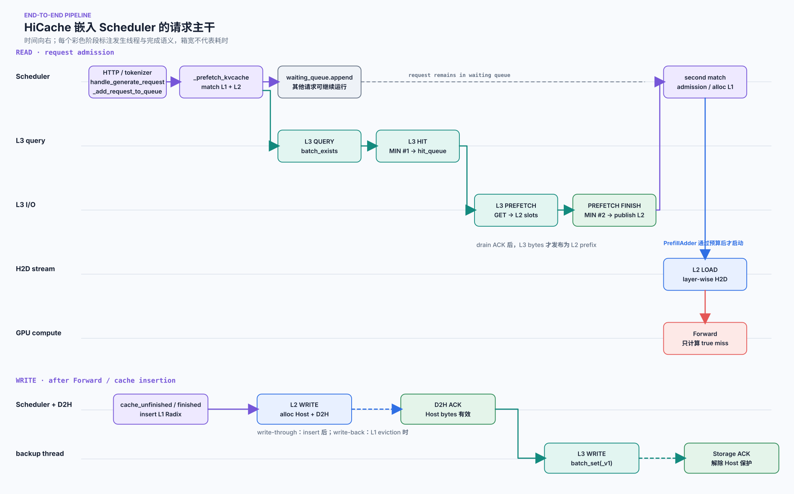
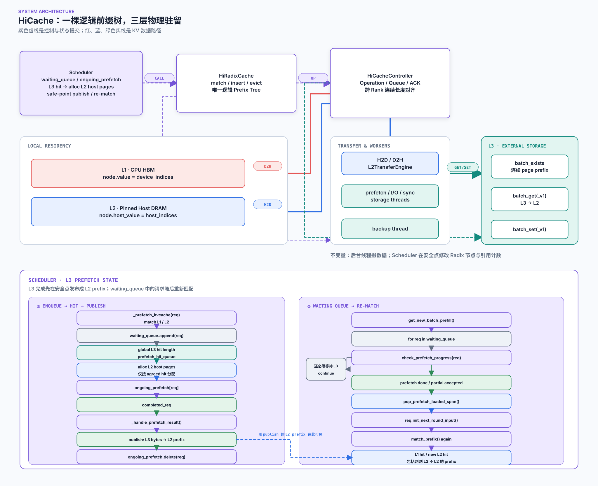
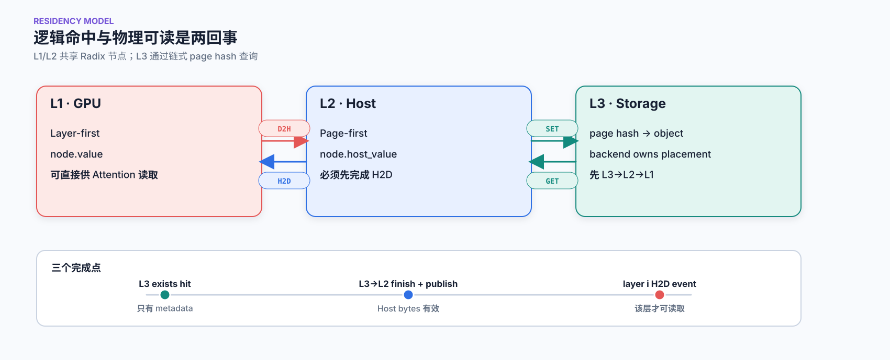
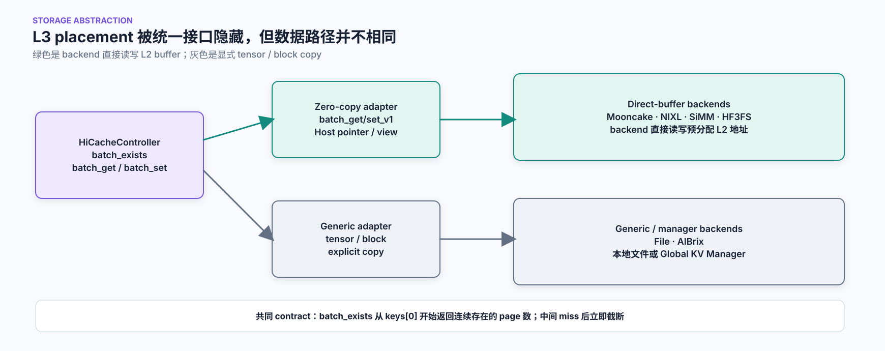
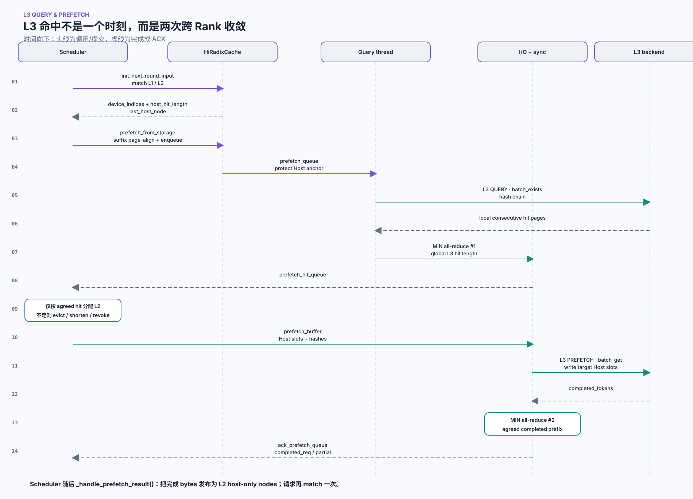
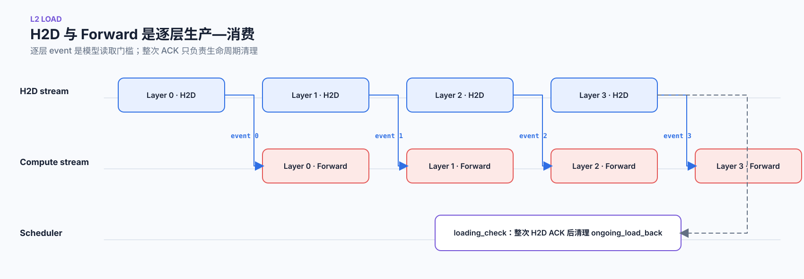
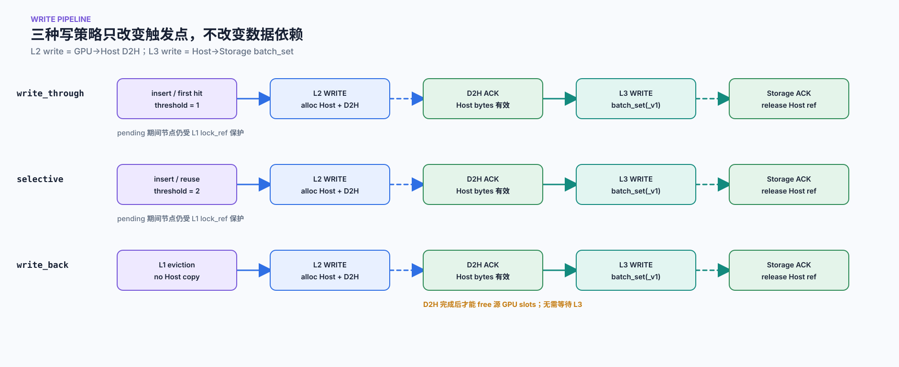

# SGLang HiCache：组件、工作流与 L1/L2/L3 读写时序

HiCache 看上去只是把 KV Cache 从 GPU 扩展到 CPU 和外部存储，但真正理解它，不能只记住 `L1 = GPU、L2 = CPU、L3 = Storage`。更关键的问题是：

1. 三层 Cache 是三棵索引，还是一棵逻辑树的三种物理驻留状态？
2. `L3 hit` 之后，数据为什么不能立刻参与 Attention？
3. L3 query、L3 prefetch、L2 load 分别在请求生命周期的哪个位置发生？
4. Forward 产生的新 KV 何时进入 Radix Tree，又何时完成 L2 write 和 L3 write？
5. 为什么代码里既有 CUDA event，又有 ACK queue、引用计数和两次跨 Rank `MIN`？

先给出最重要的结论：

> [!TLDR]
> HiCache 的核心是一棵统一的逻辑 Prefix Radix Tree。L1/L2 residency 由节点的 `value` 与 `host_value` 表达，L3 则由链式 page hash 查询。读路径是“本地匹配 → L3 query → L3→L2 prefetch → 发布 L2 节点 → 二次匹配 → admission → L2→L1 load”；写路径是“Forward → 插入 L1 Radix → L1→L2 D2H → D2H ACK → L2→L3 write → Storage ACK”。**命中、分配、提交、数据完成、模型可读是五个不同的时刻。**

本文基于 SGLang `02d9b3060ab4a691af283d48587bf2ab07787909` 源码快照分析，主体是普通 MHA/MLA 的 cache-mode `HiRadixCache`。主线之后再说明 Hybrid Controller、HiSparse、Host Memory 与后台线程的边界。源码仍在快速演进，文中的函数位置和默认值都属于这个固定快照。

## 先看完整主干：这些事件到底发生在什么时候

下面这张图把请求从进入 Scheduler 到读出历史 KV、执行 Forward，再到新 KV 写回 L2/L3 的生命周期放在同一条时间线上。它不是按耗时比例绘制，而是回答“谁先发生、在哪个线程发生、哪个完成点才能被下一阶段消费”。



图中的七个关键词需要严格区分：

| 事件               | 真正含义                                              | 发生位置                | 下一步依赖什么                |
| ------------------ | ----------------------------------------------------- | ----------------------- | ----------------------------- |
| L3 query           | 对 page hash 调用 `batch_exists()`                    | storage query thread    | 各 Rank 的连续命中长度        |
| L3 hit             | 第一次 `MIN` 后得到全局一致的连续命中长度             | query/sync path         | Scheduler 按命中长度分配 L2   |
| L3 prefetch        | 对已确认命中的 page 调用 `batch_get(_v1)`             | storage I/O thread      | bytes 写入指定 Host slots     |
| L3 prefetch finish | 第二次 `MIN` 后得到全局一致的完成长度，并发布 L2 节点 | sync thread + Scheduler | 请求再次执行 `match_prefix()` |
| L2 load            | `L2 → L1`，即 Host KV 恢复到 GPU                      | H2D stream              | 对应 layer event              |
| L2 write           | `L1 → L2`，即新 GPU KV 备份到 Host                    | D2H stream              | D2H `finish_event`            |
| L3 write           | `L2 → L3`，即 Host KV 写入外部存储                    | backup thread           | Storage ACK                   |

这里最反直觉的是，**L3 hit 只是存在性结论，不是数据命中完成**。同理，`node.value` 已填入 GPU indices 也不代表 H2D 已完成；它只代表目标 GPU slot 已登记，真正的读取门槛是对应层的 CUDA event。

## 整体架构：谁拥有状态，谁搬数据

HiCache 的组件关系如下。图中用 containment 表示长期归属，用箭头表示接口和数据路径。



架构里有一条必须贯穿全文的不变量：

> **后台线程和传输引擎搬数据；Scheduler 在安全点修改 Radix Tree、引用计数与请求状态。**

如果 I/O Worker 直接修改树，就可能遇到节点已经分裂或删除、GPU/Host slot 已被复用、异步传输仍在读取旧地址等竞态。因而 HiCache 把耗时的数据面放进 stream/worker，把需要全局一致性的状态提交留给 Scheduler drain ACK。

### Scheduler：请求生命周期的串行化边界

Scheduler 不直接执行所有 I/O，但它决定 I/O 何时对请求可见：

- 新请求入队前调用 `_prefetch_kvcache()`，建立本地 L1/L2 基线并提交 L3 query。
- 每轮 `get_next_batch_to_run()` 前后调用 `tree_cache.check_hicache_events()`，消费 query、prefetch、load、write 和 backup 的完成通知。
- `get_new_batch_prefill()` 遍历 waiting queue，调用 `check_prefetch_progress()` 决定继续等待、接受部分结果还是撤销。
- `PrefillAdder` 完成 KV budget gate；只有 admission 成功的请求才允许申请 L1 slot 并发起 L2 load。
- Forward 后由 `cache_unfinished_req()` 或 `cache_finished_req()` 把新 KV 注册为可共享 prefix。

这种设计把“操作已提交”和“状态可以发布”分开：Worker 可以并行推进，但 Radix Tree 仍由 Scheduler 串行修改。

### HiRadixCache：一棵树同时描述 L1 与 L2

普通 `RadixCache` 的节点保存一段连续 token 与其 GPU KV indices。`HiRadixCache` 在同一个节点上增加 Host 与 Storage 相关状态：

```python
node.key          # 一段连续 token
node.value        # L1 device_indices；None 表示 GPU 已驱逐
node.host_value   # L2 host_indices；None 表示没有 Host 副本
node.hash_value   # 已计算的 page hash chain
node.lock_ref     # GPU 生命周期保护
node.host_ref_counter  # Host 生命周期保护
```

L1 与 L2 不是两棵独立的 Prefix Tree。一次 radix walk 已经确定 token 结构，之后通过 `value` / `host_value` 判断物理 residency。L3 更不一样：`hash_value` 只提供 key，真正是否存在必须问 Storage Backend。



可以把节点状态概括成：

| `value` | `host_value` | 本地状态              | 能否直接算 Attention |
| ------- | ------------ | --------------------- | -------------------- |
| 非空    | 可空或非空   | L1 resident           | 可以                 |
| `None`  | 非空         | L2-only / GPU evicted | 不可以，先 H2D       |
| `None`  | `None`       | 本地没有可恢复副本    | 查询 L3 或重算       |

原稿里容易把 `node.hash_value != None` 直接写成 L3 hit，这并不严谨。Hash 存在只说明“知道如何寻址”，外部对象仍可能被淘汰、写失败或尚未完成；下一次读取以 `batch_exists()` 的返回为准。

### HiCacheController：Operation、Queue、Stream 与 ACK

`HiCacheController` 位于 Radix Tree 与物理内存/Storage 之间。它把节点级请求转成批量 `CacheOperation` 或 `StorageOperation`，再交给传输引擎和后台线程。

| 路径                 | 提交队列                 | 完成队列/结构        | 执行资源                               |
| -------------------- | ------------------------ | -------------------- | -------------------------------------- |
| L1→L2 write          | `write_queue`            | `ack_write_queue`    | D2H stream / L2 transfer engine        |
| L2→L1 load           | `load_queue`             | `ack_load_queue`     | H2D stream / L2 transfer engine        |
| L3 existence query   | `prefetch_queue`         | `prefetch_hit_queue` | `prefetch_thread`                      |
| L3→L2 get            | `prefetch_buffer`        | `ack_prefetch_queue` | `prefetch_io_aux_thread` + sync thread |
| L2→L3 set            | `backup_queue`           | `ack_backup_queue`   | `backup_thread`                        |
| 未使用 Host 尾部释放 | `host_mem_release_queue` | Scheduler drain      | storage control path                   |

`CacheOperation.merge_ops()` 会合并多个节点的 Host/GPU indices 与 `node_ids`，减少 Python 调用、kernel launch 和 event 数量。合并不改变所有权：每个 ACK 仍携带足够的 ID，让 Scheduler 回到对应节点释放保护。

### Memory Pool 与布局转换

计算和 I/O 希望看到的布局不同：

- **L1 GPU pool 使用 Layer-first**：模型执行第 $i$ 层时，整层 KV 的访问连续，保持现有 Attention kernel 接口。
- **L2/L3 倾向 Page-first**：同一个 token page 的所有层 KV 被打包，便于一次 Storage I/O 读取或写入完整可复用单元。
- `page_first_direct` 进一步按 page、layer、token 组织，使 direct backend 可以聚合 page-layer 传输。
- `page_head` 把 head 维度提前，服务异构 TP 等需要按 head 切分的场景。

L1 与 L2 之间因此不总是简单 `cudaMemcpyAsync`。`direct` backend 更接近 indexing/copy，`kernel` backend 则用 GPU-assisted I/O kernel 完成 layout transform。

这里的最小复用单元由 Prefix Cache 语义决定：普通 MHA/MLA 的一个完整 page 要包含所有必需 layer 的 KV。单独搬回某一层可以用于 pipeline，但不能把“某层存在”当成整个 prefix page 命中。

### Storage Backend 与 Global KV Manager

`HiCacheController` 不需要知道底层是 Mooncake、NIXL、SiMM、HF3FS、AIBrix 还是 File，它只依赖少量统一接口：

- `batch_exists(keys)`：从 `keys[0]` 开始返回连续存在的 page 数。
- `batch_get()` / `batch_get_v1()`：将 L3 page 读入 L2。
- `batch_set()` / `batch_set_v1()`：将 L2 page 写入 L3。



`_v1` 路径允许 backend 直接接收预分配 Host memory 的 indices、指针或 buffer view。Mooncake/NIXL/SiMM/HF3FS 一类 backend 可以直接向 L2 buffer 写入或从中读出；通用接口则先获得 tensor/block，再显式复制。

AIBrix 是一个更明确的 Global KV Manager 例子：`BaseKVCacheManager` 负责 block 的 `exists`、`acquire`、`allocate_for` 和 `put`。这里的“global”属于具体 backend 的元数据与分配能力，不是每个 HiCache backend 都额外拥有同样一层 Manager。

## 读路径：从请求入队到只计算 true miss

读路径可以写成：

```text
HTTP / tokenizer
  → handle_generate_request()
  → _add_request_to_queue(req)
  → _prefetch_kvcache(req)
  → 第一次 match_prefix()：识别 L1 + L2
  → L3 query / hit
  → 按 hit 长度分配 L2
  → L3 prefetch / finish
  → 发布 L2 host-only nodes
  → 第二次 match_prefix()
  → PrefillAdder admission
  → init_load_back()
  → ready_to_load_host_cache() / start_loading()
  → 逐层 L2→L1 + Forward
```

下面逐段解释每一步的输入、状态变化和完成条件。

### 第一次 `match_prefix()`：一次 walk 同时识别 L1 与 L2

新请求进入 waiting queue 前，`Scheduler._prefetch_kvcache()` 先调用 `req.init_next_round_input()`，最终进入 `HiRadixCache.match_prefix()`：

```python
value, last_node = self._match_prefix_helper(self.root_node, key)
device_indices = torch.cat(value) if value else empty

host_hit_length = 0
last_host_node = last_node
while last_node.evicted:
    host_hit_length += len(last_node.host_value)
    last_node = last_node.parent

while not last_host_node.backuped:
    last_host_node = last_host_node.parent
```

[源码：`HiRadixCache.match_prefix()`](https://github.com/sgl-project/sglang/blob/02d9b3060ab4a691af283d48587bf2ab07787909/python/sglang/srt/mem_cache/hiradix_cache.py#L1595-L1623)

返回值的职责不能混用：

| 字段               | 含义                                 | 后续消费者                          |
| ------------------ | ------------------------------------ | ----------------------------------- |
| `device_indices`   | 从 root 开始仍驻留 L1 的 GPU indices | 直接拼入 `req.prefix_indices`       |
| `last_device_node` | 最深 L1 resident 节点                | 请求锁与 L1 生命周期                |
| `host_hit_length`  | L1 之后可从 L2 连续恢复的 token 数   | admission 成本与 `init_load_back()` |
| `last_host_node`   | 最深的 L2 backed-up 祖先             | L3 hash chain 的锚点                |
| `best_match_node`  | 当前 load-back 起点                  | `PrefillAdder`                      |

因此本地可复用长度为：

$$
L_{local}=L_{L1}+L_{L2,extra}
$$

`host_hit_length` 不是 Host 上所有匹配 token 的总量，而是 **L1 结束后，L2 还能连续接上的 suffix**。这是同一次 Radix walk 的结果，不存在“先查一棵 GPU 树，再查一棵 CPU 树”。

### L3 query：只检查本地 prefix 之后的 suffix

Scheduler 计算本地已匹配长度，再截取允许参与前缀复用的剩余 token：

```python
matched_len = len(req.prefix_indices) + req.host_hit_length
match_end = req._compute_max_prefix_len(len(req.full_untruncated_fill_ids))
new_input_tokens = req.full_untruncated_fill_ids[matched_len:match_end]
```

`_compute_max_prefix_len()` 通常为本轮 logit 计算保留至少一个 token，`prefetch_from_storage()` 又按 `page_size` 向下对齐，所以查询范围是：

$$
K_{L3}=align\_down(tokens[L_{local}:L_{max\_prefix}], page\_size)
$$

这带来三个边界：

- L3 不会从 P0 重新查询完整 prompt，只查本地 L1/L2 连续前缀之后的 suffix。
- prompt 尾部可能因为 `input_len - 1` 和 page alignment 不参与本轮 L3 复用。
- suffix 小于 `prefetch_threshold` 或 Host prefetch 被限流时，系统直接计算，避免小搬运的固定成本。

`prefetch_from_storage()` 此时只做 page alignment、保护 Host 锚点、构造 `PrefetchOperation` 并放入 `prefetch_queue`，不会预先为整段候选 suffix 分配 Host memory。[源码：`prefetch_from_storage()`](https://github.com/sgl-project/sglang/blob/02d9b3060ab4a691af283d48587bf2ab07787909/python/sglang/srt/mem_cache/hiradix_cache.py#L1624-L1669)

### L3 hit：第一次 `MIN` 只收敛“存在多少”

`prefetch_thread` 对 token page 生成链式 hash，并按 batch 调用 `batch_exists()`：

```python
for batch_hashes in page_hash_batches:
    hit_page_num = storage_backend.batch_exists(batch_hashes, extra_info)
    storage_query_count += hit_page_num * page_size
    if hit_page_num < len(batch_hashes):
        break
```

每个 page hash 依赖前一页 hash。一旦中间 page miss，后续 page 即便恰好存在，也不再是从 root 开始的连续 prefix，不能越过缺口复用。`batch_exists()` 的抽象契约也明确要求返回“从输入开头连续存在的 key 数”。[源码：`batch_exists()` contract](https://github.com/sgl-project/sglang/blob/02d9b3060ab4a691af283d48587bf2ab07787909/python/sglang/srt/mem_cache/hicache_storage.py#L293-L304)

本 Rank 得到 local hit pages 后，相关 TP/PP/Attention 并行 Rank 对命中长度执行第一次 `MIN`。原因不是保守统计，而是模型只允许消费所有必需 Rank 都拥有的连续 prefix。结果进入 `prefetch_hit_queue`，等待 Scheduler drain。

到这里，只有 metadata：**L3 hit 已确定，L3 prefetch 还没有开始。**

### 为什么 query 和 prefetch 之间必须插入一次 Scheduler 决策

Scheduler drain `prefetch_hit_queue` 后才按 agreed hit length 精确分配 L2：

```text
global L3 hit length
  → alloc 同样长度的 Host slots
  → 失败时 evict_host 后重试
  → 仍失败则缩短为 page-aligned prefix
  → 低于 threshold 则 revoke
  → prefetch_buffer.put(operation)
```

如果在 query 前按完整候选 suffix 预留 Host memory，L3 只命中很短一段时会浪费大量 L2。把 `exists` 与 `get` 拆成两阶段，让 Scheduler 可以在二者之间做容量、驱逐和退化决策。

### L3 prefetch：`batch_get` 真正把 bytes 写入 L2

下图展开了从本地匹配到两次跨 Rank 收敛的完整时序。



分配成功后，I/O 线程从 `prefetch_buffer` 取出 operation，调用 `batch_get()` 或 `batch_get_v1()` 把 page 写入指定 Host slots。每完成一批就累计 `completed_tokens`；sync thread 再对各 Rank 的完成长度做第二次 `MIN`。

为什么存在两次 `MIN`？

1. 第一次回答“所有 Rank 的 L3 最多共同存在多少 page”，用于确定 L2 分配上限。
2. 第二次回答“所有 Rank 实际完成了多少 page”，用于确定能安全发布多少 Host prefix。

Query 成功后仍可能遇到 I/O 失败、超时、撤销或部分完成，所以不能用第一次长度替代第二次完成长度。

### L3 prefetch finish：先发布 L2，再让请求二次匹配

`_handle_prefetch_result()` 调用 `_insert_helper_host()`，把已完成部分注册为 host-only Radix nodes：

```python
new_node.key = fetched_key
new_node.value = None
new_node.host_value = written_indices
new_node.hash_value = completed_hash_values
```

[源码：`_insert_helper_host()`](https://github.com/sgl-project/sglang/blob/02d9b3060ab4a691af283d48587bf2ab07787909/python/sglang/srt/mem_cache/hiradix_cache.py#L1670-L1700)

如果 prefetch 期间另一条请求已经插入相同 page，`matched_length` 会记录重复部分，随后释放重复分配的 Host slots。真正新增的 L3 命中量是：

$$
L_{L3,extra}=L_{completed}-L_{already\_matched}
$$

请求回到 admission 循环后必须再次执行 `req.init_next_round_input()`：

```text
第一次 match：确定 L1/L2 基线与 L3 query 起点
L3→L2：读取并发布 host-only nodes
第二次 match：让请求看见新的 L2 prefix，并重算 admission 成本
```

省略第二次 match，Storage bytes 虽然已经在 Host，`PrefillAdder` 仍会按旧 prefix 长度做预算，甚至重复计算已经拉回的数据。

### Prefetch stop policy：完成并不总是等于“全部完成”

`--hicache-storage-prefetch-policy` 决定 Scheduler 再次看到请求时如何处理未完成 prefetch：

| 策略            | admission 行为                     | trade-off                  |
| --------------- | ---------------------------------- | -------------------------- |
| `wait_complete` | 未完整结束就继续跳过该请求         | 倾向更高复用，等待更长     |
| `best_effort`   | 采纳当前安全完成的部分             | 更早调度，可能放弃后续命中 |
| `timeout`       | 超时前等待，超时后接受安全完成部分 | 在等待与复用之间折中       |

所以 `L3 prefetch finish` 更准确地说，是 operation 到达可终止点，Scheduler 已经拿到一个跨 Rank 一致、可以发布的连续完成长度；它可能是完整成功，也可能是策略允许的部分结果。

### L2 load：admission 通过后才分配 GPU slot

`PrefillAdder.add_one_req()` 先做 KV budget gate。只有请求被允许进入本轮 batch，而且 `req.needs_host_load_back()` 为真，才调用 `init_load_back()`：

1. 从最深 Host hit 节点向上收集连续的 L2-only nodes。
2. 总量小于 `load_back_threshold` 或超过本轮 `mem_quota` 时放弃 load，退回最深 L1 prefix 重算。
3. 为整段 Host prefix 分配 GPU slots；失败时先做 L1 eviction，再重试。
4. 把新的 `device_indices` 写回节点，并创建 L2→L1 `CacheOperation`。

[源码：`HiRadixCache.load_back()`](https://github.com/sgl-project/sglang/blob/02d9b3060ab4a691af283d48587bf2ab07787909/python/sglang/srt/mem_cache/hiradix_cache.py#L1282-L1346)

这又出现一次“metadata 领先于 bytes”：节点已经拥有新的 `value`，H2D 却还没提交。`ScheduleBatch` 构造完成后，`ready_to_load_host_cache()` 才调用 `start_loading()`，合并 `load_queue` 并把逐层传输提交到 H2D stream。[源码：`HiCacheController.start_loading()`](https://github.com/sgl-project/sglang/blob/02d9b3060ab4a691af283d48587bf2ab07787909/python/sglang/srt/managers/cache_controller.py#L834-L867)

### 为什么 L2 load 能与 Forward 按层重叠



Attention backend 读取第 $i$ 层 KV pool 前会等待该层的 loading event。第 0 层 H2D 完成后，第 0 层 Forward 就能开始；H2D stream 同时继续搬第 1、2、3 层。

这里有两个同步粒度：

- **per-layer event** 是执行正确性依赖，决定该层历史 KV 何时可读。
- **整次 H2D ACK** 是生命周期依赖，供 Scheduler 清理 `ongoing_load_back`、释放节点保护和记录指标。

`start_loading()` 返回只说明工作已提交；`loading_check()` 看到整次 ACK 也不负责启动每层计算。二者服务不同消费者，不能合并成一个“加载完成”。

重叠也不是免费午餐。首层 H2D 会直接暴露在 TTFT 上；如果后续每层 H2D 比对应计算推进得慢，compute stream 仍会在 layer event 上停住。

### 一个完整例子：P0～P9 如何被逐层复用

假设：

- `page_size = 16`，prompt 共 160 token，记为 P0～P9。
- L1 已有 P0～P3；L2 连续覆盖 P0～P6；L3 连续覆盖 P0～P8。
- 为了让小例子进入 L3 路径，假设 `prefetch_threshold <= 32`；固定快照的默认值 256 会跳过这次预取。

第一次本地 match：

```text
L1 device prefix = P0 P1 P2 P3 = 64 token
L2 extra suffix  = P4 P5 P6    = 48 token
local matched    = P0 ... P6   = 112 token
```

最大可匹配长度先受 `input_len - 1 = 159` 约束，再按 16-token page 向下对齐到 144，所以 L3 query 只包含 P7、P8：

```text
P0 P1 P2 P3 | P4 P5 P6 | P7 P8 | P9
     L1           L2        L3    compute
```

接下来发生：

1. `batch_exists(H7, H8)` 返回 2 pages，第一次 Rank `MIN` 仍为 2。
2. Scheduler 为 32 token 分配 L2 slots，`batch_get` 将 P7、P8 写入 Host。
3. 第二次 Rank `MIN` 确认 32 token 完成，`_insert_helper_host()` 发布 P7、P8。
4. 请求第二次 match 得到 P0～P8 的连续本地 prefix。
5. admission 成功后，`load_back()` 为 P4～P8 分配 80 token 的 GPU slots；P0～P3 继续使用原 L1 slots。
6. 模型按 layer 等待这 80 token 的 KV，只 Prefill P9。

最终：

$$
L_{reuse}=64+48+32=144,\qquad L_{compute}=160-144=16
$$

## 写路径：新 KV 何时进入 L1、L2 与 L3

Forward 产生的新 KV 首先写入请求拥有的 L1 GPU slots。要让其他请求发现它，还需插入 Prefix Tree：

- chunked Prefill 的中间 chunk 完成时调用 `cache_unfinished_req()`，插入已经提交且 page-aligned 的 token/KV。
- Prefill 完成进入 Decode 时，也会缓存已完成的 Prefill prefix。
- 请求最终结束时，`cache_finished_req()` 插入 `effective_kv_committed_len()` 范围内的 token/KV，并释放重复部分、非对齐尾部与 request slot。

因此“请求结束后才写缓存”并不准确。长 Prefill 会逐 chunk 建立共享 prefix；Decode 已提交的 KV 通常在请求完成时进入 finished cache。何时从 L1 继续写向 L2/L3，则由写策略决定。

### 三种写策略



| 策略                      | L2 write 触发点                    | 收益                | 代价                        |
| ------------------------- | ---------------------------------- | ------------------- | --------------------------- |
| `write_through`           | 节点第一次插入/命中，阈值 1        | 尽早拥有 L2/L3 副本 | 写流量最大                  |
| `write_through_selective` | `hit_count` 达到阈值 2             | 只备份更热的 prefix | 冷数据可能没有 Host 副本    |
| `write_back`              | L1 eviction 选中无 Host 副本的节点 | 正常路径写流量最低  | eviction critical path 更长 |

`chunked=True` 时 `_inc_hit_count()` 不触发 write-through。非 write-back 路径还有一条结构约束：父节点尚未拥有 Host 副本时，子节点不能先备份，确保 L2 始终是从 root 连续可恢复的 prefix。

### L2 write：分配 Host 地址不等于 D2H 完成

`write_backup()` 调用 Controller `write()`：

1. 从 Host pool 分配 `host_indices`。
2. 创建包含 `host_indices`、`device_indices` 与 `node_id` 的 `CacheOperation`。
3. `start_writing()` 合并队列并提交所有 layer 的 D2H。
4. 节点写入 `host_value` 和 `write_through_pending_id`，并增加 L1 `lock_ref`。

此时请求可以继续 Decode 或完成输出处理，但 Host 里未必已有完整 bytes。为什么 pending D2H 不会被误当成可读 L2？

- pending 期间节点仍驻留 L1，且 `lock_ref` 阻止它被驱逐。
- 只有 `writing_check()` 确认 D2H `finish_event`，才清除 pending ID 并释放这把 L1 锁。

因此普通请求仍命中 L1，不会把尚未完成的 Host 副本当成 L2-only 数据恢复。`host_value` 是地址分配证明，CUDA event 才是数据完成证明。

### D2H ACK：L2 有效与 L3 write 的依赖边界

Scheduler 每轮在 `check_hicache_events()` 中消费 ready ACK。`_finish_write_through_ack()` 按顺序：

1. 清除 `write_through_pending_id`。
2. 发布 CPU medium 的 store event。
3. 启用 L3 时调用 `write_backup_storage()`。
4. 释放 D2H 期间的 L1 保护。

L3 write 以 Host 数据为源，所以必须建立在 D2H 完成之后。反过来，一旦 Host bytes 完整，L1 节点就可以进入后续 eviction 候选，不必等待远端写入结束。

### L3 write：后台 `batch_set` 与 Storage ACK

`write_backup_storage()` 创建 `StorageOperation` 放入 `backup_queue`，并增加 `host_ref_counter`。`backup_thread` 按 batch 调用 `batch_set()` 或 `batch_set_v1()`，成功时累计 `completed_tokens`，操作结束后写入 `ack_backup_queue`。

Scheduler drain Storage ACK 后移除 `ongoing_backup` 并调用 `release_host()`。这里释放的是 **Host eviction protection**，通常不会立即 free Host slots；L2 仍可继续服务 load back，直到之后被 `evict_host()` 选中。

如果某一批 L3 write 失败，未来 `batch_exists()` 会在缺页处截断。HiCache 不会仅凭本地节点拥有 `hash_value` 就宣称远端对象存在。

### write-back 为什么会阻塞 L1 eviction

write-back 只在 L1 eviction 时为没有 Host 副本的节点执行：

```text
选中 GPU leaf
  → 分配 L2 并提交 D2H
  → node.value = None：逻辑上摘除 L1 residency
  → 阻塞等待 staged D2H 完成
  → free 原 device_indices
  → L3 write 在后台继续
```

`node.value = None` 只是元数据变化，D2H stream 仍在读取原 GPU slot。若此时立即 free 并复用 slot，就会把新数据与正在备份的数据混在一起。因此 `writing_check(write_back=True)` 是 source lifetime fence。它必须等 L2 write 完成，但无需等 L3 write 完成。

### L1/L2/L3 eviction 分别留下什么

| 事件                              | Radix 节点变化                                                      | 还能从哪里恢复                  |
| --------------------------------- | ------------------------------------------------------------------- | ------------------------------- |
| L1 eviction，已有 L2              | `value → None`，保留 `host_value` 与节点                            | L2→L1                           |
| L1 eviction，无 L2，write-through | 释放 GPU value 并删除无备份 leaf                                    | 查询 L3 或重算                  |
| L1 eviction，无 L2，write-back    | 先 D2H，完成后释放 GPU                                              | L2→L1；随后可查 L3              |
| L2 eviction                       | 只驱逐已 L1-evicted、无 Host 引用的 leaf，并删除本地 host-only 节点 | L3 query 或重算                 |
| L3 miss/eviction                  | 本地树不直接变化                                                    | 本地 L1/L2 仍在则复用，否则重算 |

这体现了三层的不对称：L1/L2 residency 是本地树的直接状态；L3 availability 是 backend 回答的外部事实。L2-only 节点删除后，本地树不再记得那段 Host prefix，但后续请求仍能从最近的 Host hash 锚点重新查询 L3。

## 四类保护状态分别在保护什么

HiCache 的引用与完成状态不是重复 bookkeeping：

| 状态                       | 保护对象                             | 释放条件                   |
| -------------------------- | ------------------------------------ | -------------------------- |
| `lock_ref`                 | 请求或 D2H 正在使用的 GPU 节点/slot  | 请求离开或 D2H ACK         |
| `host_ref_counter`         | prefetch/backup 正在使用的 Host page | Storage operation ACK/撤销 |
| `write_through_pending_id` | 已分配但尚未完成的 L2 write          | D2H finish event           |
| layer loading event        | 第 $i$ 层历史 KV 的可读性            | 对应层 H2D 完成            |
| operation ACK              | 整次传输的生命周期与清理             | Scheduler drain            |

这里连接了两个看似独立的设计：Radix Tree 保持 Scheduler 单线程串行修改，所以异步数据面不能靠 Worker 直接切状态；而 slot 可以被 allocator 复用，所以 metadata publication 又必须由 event/ref counter 约束。Queue、ACK、引用计数和 event 共同把“物理 bytes 的生命周期”映射回“逻辑 prefix 的可见性”。

## 为什么 HiCache 会主动选择不搬

HiCache 的目标不是最大化静态 hit 数，而是降低端到端成本。源码在多种情况下会跳过、缩短或终止搬运：

- L3 candidate 小于 `prefetch_threshold`：跳过 hash、队列、网络与 Host 分配的固定开销。
- L2-only hit 小于 `load_back_threshold`：直接 GPU 重算。
- L2 load 超过本轮 `mem_quota`：避免 promotion 挤占 admission 所需 KV 空间。
- Host 空间不足：先 evict，再缩短为 page-aligned prefix；仍不足则 revoke。
- 多 Rank 命中/完成不一致：取最小值，不能让某 Rank 读取其他 Rank 没有的 page。
- `best_effort` 可以减少等待，但会放弃尚未完成的潜在命中。

收益判断更接近：

$$
T_{saved\ compute}
>
T_{query}+T_{L3\to L2}+T_{unhidden\ H2D}+T_{control}
$$

只有部分 I/O 能被其他请求或后续 layer 的计算隐藏。小 prefix、Host/Storage 带宽不足、排队过深或首层搬运过慢时，重算可能更快。这也是 threshold、stop policy 和 admission quota 必须共同设计的原因。

## Host Memory 与后台线程：容量、数据面、控制面不要混淆

`cudaMemcpyAsync` 只表示设备工作可以异步排入 stream，不表示调用前的 CPU 工作已经异步。一次 L1↔L2 操作仍可能包含 Host/GPU slot 分配、`torch.cat`/sort/clone、索引搬移、page fault、注册、event 管理和状态提交。

固定快照已经把 L3 query、I/O、sync 与 backup 放入多个 storage threads；L1↔L2 的 queue merge、索引准备与 transfer submit 仍有一部分发生在调用线程。进一步把这段 CPU 准备工作移出 Scheduler，可以切掉全局 Head-of-Line Blocking，但必须保留前文的所有权边界：Worker 搬数据，Scheduler 改树状态。

Host Memory 的四个概念也不能混为一谈：

| 机制          | 解决的问题                                 | 不等于      |
| ------------- | ------------------------------------------ | ----------- |
| Pinned Memory | Host page 不换出，支持真正异步 H2D/D2H     | Huge Page   |
| HugeTLB       | 减少 TLB、页表、IOMMU/RDMA MR 元数据       | 自动 Pinned |
| Prefault      | 启动时完成 First Touch，避免请求期集中缺页 | NUMA 绑定   |
| NUMA Affinity | 让 Worker、内存与 GPU 尽量位于同一 socket  | 带宽无限    |

普通 HiCache Host Pool 使用 Pinned Memory，不代表默认使用 HugeTLB。固定快照中显式暴露 HugeTLB、NUMA node 与 prefault 配置的是 MORI/UMBP allocator。HugeTLB 需要提前预留，可能因为碎片或目标 NUMA node 容量不足而失败。

以 100 GiB Host Pool 为例，4 KiB 页约 2621 万页，2 MiB Huge Page 约 5.12 万页。页粒度放大 512 倍后，TLB/page walk、IOMMU scatter-gather 和 RDMA memory region 元数据更容易控制，但这不会提高 PCIe/RDMA 的理论峰值带宽。

## Hybrid Controller：一个“命中”可能由多个 pool 共同成立

普通 MHA/MLA 中，一个完整 KV page 命中就能恢复该 prefix。DSA、SWA、Mamba 等混合模型还可能包含 indexer KV、滑动窗口 KV 或状态 sidecar。`HybridCacheController` 把多个 `PoolTransfer` 绑定到同一个 operation，但 usable length 不能只看 Full KV：

$$
L_{usable}=\min(L_{FullKV},L_{all\ required\ ALL\_PAGES\ pools})
$$

`ALL_PAGES` pool 要求从 root 到目标 prefix 的 page 全部连续存在；`TRAILING_PAGES` pool 只要求目标 prefix 的尾部窗口或状态存在。H2D 时，一个 layer 的所有必需组件都到达后，模型才能消费该层状态。

Hybrid 改变的是“一个 hit 由哪些物理组件共同成立”，没有改变主时序：

```text
L3 exists 对齐所有必需组件
  → L3→L2 materialize
  → 二次匹配与 admission
  → 一个 operation 恢复 Full KV 与 sidecar
  → layer event 后消费
```

## HiCache 与 HiSparse 不是同一条路径

旧稿对 HiSparse 做了很长的展开，但它不是 HiCache 的子组件。保留下面的边界更有助于避免概念混淆：

| 机制       | 目标                            | 共享粒度                    | GPU 保留什么             | Host/Storage 保留什么 |
| ---------- | ------------------------------- | --------------------------- | ------------------------ | --------------------- |
| RadixCache | 跨请求 prefix 复用              | 连续 token/page prefix      | 命中的 prefix KV         | 默认无 L2/L3          |
| HiCache    | 把 Radix prefix 扩展到 L1/L2/L3 | 从 root 连续 prefix         | L1 resident prefix       | L2 backup + L3 page   |
| HiSparse   | 单请求长上下文稀疏 Attention    | request 内 top-k token/page | request-local hot buffer | 该请求完整历史 KV     |

固定快照中 HiSparse 要求 `--disable-radix-cache`，而 HiCache 依赖 hierarchical Radix Cache，因此二者在参数校验层互斥。HiCache 的 load back 是把跨请求可复用 prefix 恢复到 GPU；HiSparse 的 swap-in 则是每层根据当前 query 动态取 top-k 历史 KV。

## 调试时如何串起整条链路

很多函数只负责提交异步工作，所以断点和日志应观察“完成后的状态”，不能只看函数是否返回。

| 顺序 | 执行位置       | 入口                                                    | 完成后可确认的状态                                        |
| ---- | -------------- | ------------------------------------------------------- | --------------------------------------------------------- |
| 1    | Scheduler      | `handle_generate_request()` → `_add_request_to_queue()` | 请求准备进入本地 match 与 waiting queue                   |
| 2    | Scheduler      | `_prefetch_kvcache()` → `match_prefix()`                | 得到 L1 indices、L2 extra length、L3 Host 锚点            |
| 3    | Scheduler      | `prefetch_from_storage()`                               | L3 query operation 已入队，尚无 hit 结论                  |
| 4    | query thread   | `_storage_hit_query()`                                  | 本 Rank 连续 exists 长度已知                              |
| 5    | query/sync     | 第一次 `MIN`                                            | 全局 L3 hit length 已知，进入 `prefetch_hit_queue`        |
| 6    | Scheduler      | drain hit + alloc Host                                  | 仅为 agreed hit 分配 L2，operation 进入 `prefetch_buffer` |
| 7    | I/O thread     | `_page_transfer()`                                      | `batch_get` 正在把 L3 page 写入 L2                        |
| 8    | sync thread    | 第二次 `MIN`                                            | 跨 Rank 一致的 completed prefix 已知                      |
| 9    | Scheduler      | `_handle_prefetch_result()`                             | bytes 已发布为 L2 host-only Radix nodes                   |
| 10   | Scheduler      | 第二次 `init_next_round_input()`                        | 请求看到最新 L1/L2 prefix                                 |
| 11   | Scheduler      | `PrefillAdder.add_one_req()` → `init_load_back()`       | L1 slots 已预留，H2D 尚未提交                             |
| 12   | H2D stream     | `start_loading()`                                       | L2 load 已按 layer 提交                                   |
| 13   | Compute stream | `wait_until(layer_id)`                                  | 对应层 KV 可读，Forward 计算 true miss                    |
| 14   | Scheduler      | `cache_unfinished_req()` / `cache_finished_req()`       | 新 KV 已插入 L1 Radix Tree                                |
| 15   | D2H stream     | `write_backup()` → `start_writing()`                    | L2 write 已提交，Host 地址已分配                          |
| 16   | Scheduler      | `writing_check()`                                       | D2H ACK，L2 bytes 有效，可提交 L3 write                   |
| 17   | backup thread  | `_page_backup()`                                        | `batch_set` 写入成功 page，产生 Storage ACK               |
| 18   | Scheduler      | drain backup ACK                                        | operation 与 Host eviction protection 被清理              |

日志关联至少需要四组 ID：请求用 `rid`；L3 read 用 `PrefetchOperation`；L1/L2 transfer ACK 携带 `node_ids`；L3 write 用 `StorageOperation.id`。只搜 `rid` 无法完整串起节点级 D2H 与后台 Storage write。

## 总结

回到开头的问题，HiCache 可以用三个层次理解：

1. **索引层**：一棵 HiRadixTree 表达连续 prefix，L1/L2 共享节点；L3 用链式 page hash 寻址。
2. **数据层**：L1/L2/L3 决定 bytes 在哪里；Layer-first、Page-first、Pinned/NUMA 与 backend 决定怎么搬。
3. **控制层**：Scheduler、Operation Queue、两次 Rank `MIN`、CUDA event 与 ACK 决定 bytes 何时可以发布、读取、驱逐和复用。

读路径中，L3 query 发生在请求入 waiting queue 之前的 `_prefetch_kvcache()` 提交点；L3 hit 是第一次 Rank 收敛后的 metadata 结果；L3 prefetch 是精确分配 L2 之后的真实 `GET`；prefetch finish 后才发布 L2 prefix 并二次匹配；admission 通过后才执行 L2 load。写路径中，新 KV 先插入 L1 Radix；写策略决定 L2 write 的触发点；D2H ACK 证明 L2 bytes 有效，随后才能发起 L3 write；Storage ACK 结束远端 operation 并解除 Host 保护。

真正容易出错的地方，从来不是记错某个函数名，而是把 `hit` 当成 `data ready`、把 `slot allocated` 当成 `copy finished`、把 `operation submitted` 当成 `model readable`。一旦把这些完成点分开，HiCache 的组件、时序、引用计数和多线程设计就会落在同一条因果链上。

## References

- [SGLang HiCache System Design](https://github.com/sgl-project/sglang/blob/main/docs_new/docs/advanced_features/hicache_design.mdx)
- [SGLang HiCache Best Practices](https://github.com/sgl-project/sglang/blob/main/docs_new/docs/advanced_features/hicache_best_practices.mdx)
- [固定快照：HiRadixCache](https://github.com/sgl-project/sglang/blob/02d9b3060ab4a691af283d48587bf2ab07787909/python/sglang/srt/mem_cache/hiradix_cache.py)
- [固定快照：HiCacheController](https://github.com/sgl-project/sglang/blob/02d9b3060ab4a691af283d48587bf2ab07787909/python/sglang/srt/managers/cache_controller.py)
- [固定快照：HiCacheStorage](https://github.com/sgl-project/sglang/blob/02d9b3060ab4a691af283d48587bf2ab07787909/python/sglang/srt/mem_cache/hicache_storage.py)
- [固定快照：L2 Transfer Engine](https://github.com/sgl-project/sglang/blob/02d9b3060ab4a691af283d48587bf2ab07787909/python/sglang/srt/mem_cache/l2_transfer.py)
- [CUDA Programming Guide：Page-Locked Host Memory](https://docs.nvidia.com/cuda/cuda-programming-guide/02-basics/understanding-memory.html#page-locked-host-memory)
- [Linux Kernel：HugeTLB Pages](https://docs.kernel.org/admin-guide/mm/hugetlbpage.html)
