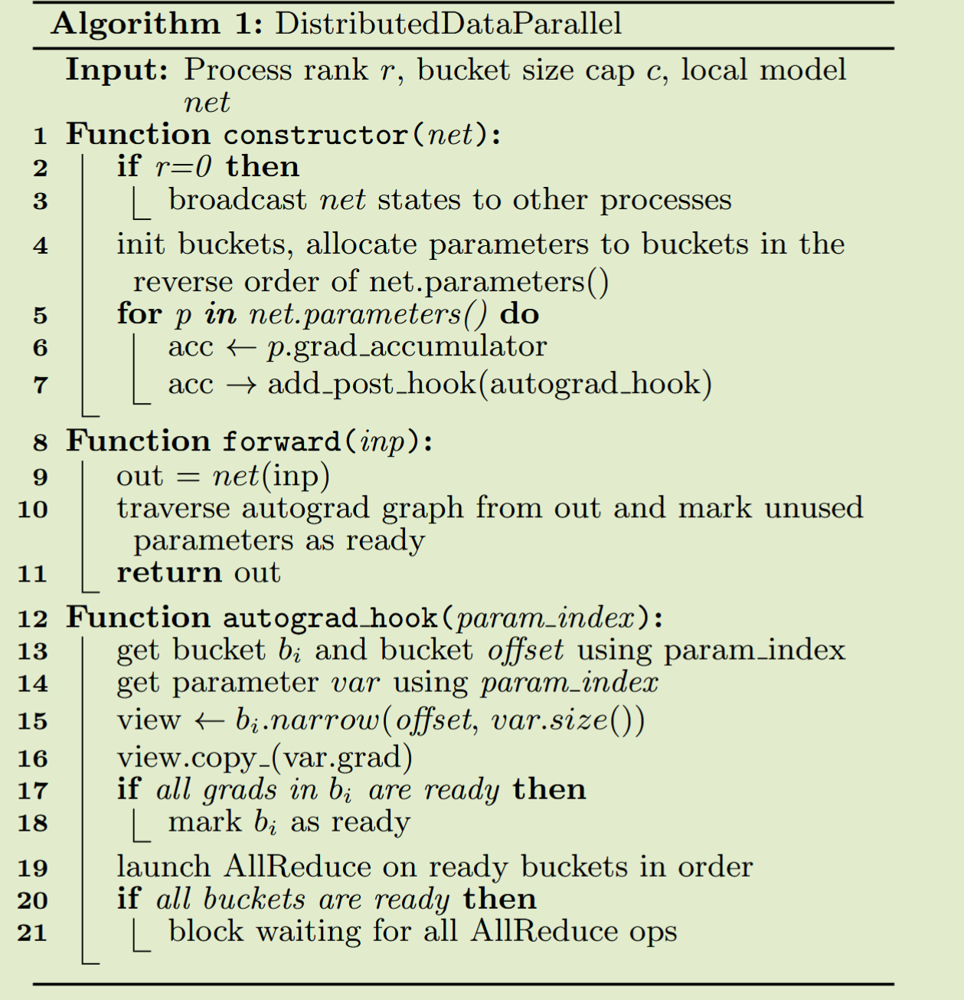
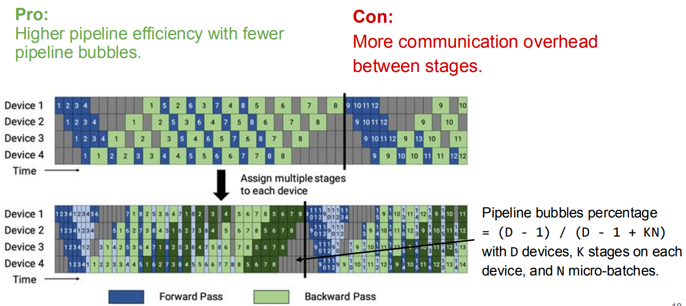
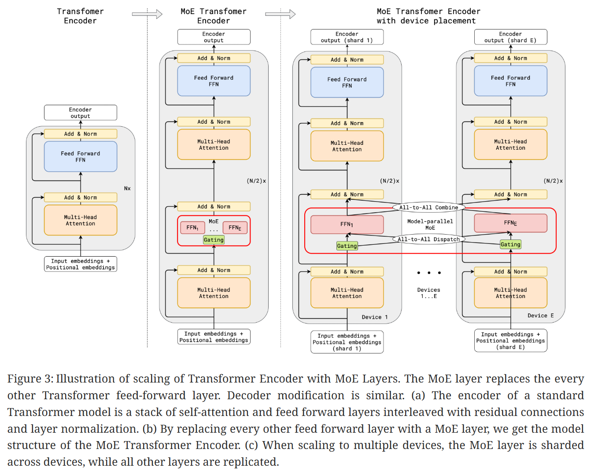
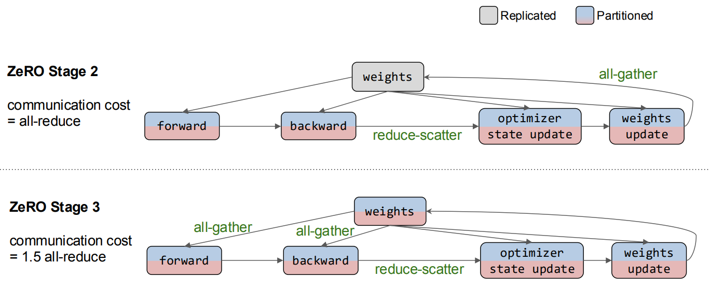

# Parallelization in ML Systems

通常分为`Data Parallelism`和`Model Parallelism`，`Model Parallelism`中很多研究者又细分为`Tensor Parallelism`和`Pipeline Parallelism`，以及对 llm MoE(Mixture of Experts)操作的`Expert Parallelism`。

cse234 课程中鉴于`Model Parallelism`比较模糊的界限同时为了更好地从计算角度分析，提出`inter-op parallelism`和`intra-op parallelism`的概念，前者指的是操作之间的并行，后者指的是单个操作内部的并行。

## Why Parallelism

- `Computation Bottleneck`: LLM 的参数量巨大，以 GPT-3 为例，1750 亿参数，对 GPU 计算能力要求极高，单个 GPU 无法满足。
- `Memory Bottleneck`: LLM 的模型参数和中间激活值占用大量内存，单个 GPU 的显存有限，无法容纳整个模型。

## Overview

### Compute Perspective

- Compute: **model & weight** update parallelism
- Memory: **data & parameter** parallelism
- 因为将模型和计算分布到多个计算上，为了保证前向传播和反向传播梯度的正确性，涉及到**参数**和**激活值**的通信

### Classical Perspective

- Data Parallelism: 每个 GPU 拥有完整的模型副本，处理不同的数据子集，适用于大批量数据训练
- Model Parallelism: 将模型划分到多个 GPU 上，每个 GPU 处理模型的一部分
  

### CSE234 Perspective

**Trade-off:** Inter-op 通信更少但是 Device 空闲时间更长；而 Intra-op 通信更多但是 Device 利用率更高

## Before Parallelism

:smile:在分布式训练中，GPU 之间的通信必不可少，所以我们需要知道 NCCL 的基本通信原语

- **Minimum Spanning Tree**: HPC 通信常用，最小化通信 ROUND 数
- **Ring Algorithm**: GPU 通信通常有极高的带宽，通信启动带来的延迟并不是主要 bottleneck

**AllReduce:** 将所有 GPU 的数据进行汇总，计算平均值，并将结果广播回所有 GPU，常用于梯度更新

**Broadcast:** 将一个 GPU 的数据发送到所有其他 GPU，常用于模型参数初始化

**Reduce:** 将所有 GPU 的数据汇总到一个 GPU 上，常用于收集结果

**AllGather:** 将所有 GPU 的数据收集到每个 GPU 上，常用于收集中间结果

**ReduceScatter:** 将数据先进行 Reduce 操作，然后将结果分散到各个 GPU 上，常用于分布式计算中的中间步骤

## Problem Define

:star2:**The best way to execute the graph subject to memory and communication constraints**

### Why Data Parallelism

**Compute Bottleneck:**

- 每个 GPU 显存没有占满，但是 compute 能力已经达到极限了
- 训练时间过长，需要并行化来加速

### Why Model Parallelism

**Memory Bottleneck:**

- 模型参数太大，单个 GPU 显存无法容纳，而 compute 能力可能还有剩余

## Indicator

$$\# MFU(model \space flops \space utilization)= \#FLOPs \space / \space t(time) \space / \space peak FLOPS $$

- Do not use HFU: 因为 HFU 显示的是硬件 flops 的利用率，硬件上某些计算量并不能为模型收敛做贡献

## Data Parallelism

- **Parameter Server:** workers 存有副本保证容错，PS 收集梯度更新并广播保证一致性
  
- **All-reduce:** 每个 GPU 计算梯度，然后通过 All-reduce 汇总并更新参数，没有容错，但是简单(工业界喜欢简单有效的方案)
  

### DDP in PyTorch

#### Original Solution

1. 从相同的模型状态开始
   > 在 DDP 构建时将模型状态从一个进程广播到所有其他进程来实现
2. 在每次迭代中消耗相同的梯度来保证正确性。

   > 一个简单的解决方案可以在本地反向传播之后和更新本地参数之前插入一个梯度同步阶段。

   > DDP 可以注册 autograd 钩子以在每个反向传播后触发计算。当触发时，每个钩子会扫描所有本地模型参数，并从每个参数中检索梯度张量。

   > 然后，它使用 AllReduce 集体通信调用来计算所有进程中每个参数的平均梯度，并将结果写回梯度张量。

实际上这种方案导致了性能问题：

- 集群通信在小 tensor 上效率低下
- 因为将梯度计算和同步分开，无法重叠计算和通信

#### Improved Technique

1. Gradient Bucketing: DDP 可以通过等待一段时间并将多个梯度合并到一个 AllReduce 操作中，实现更高的吞吐量和更低的延迟。**为了重叠计算和通信，DDP 不应在一次 AllReduce 中通信所有梯度，否则在计算完成之前无法开始通信**
2. Overlap Computation with Communication: 使用桶划分，DDP 只需要等待同一桶中的所有内容都准备好后才开始通信。**DDP 为每个梯度累加器注册了一个自动微分钩子。钩子在相应的累加器更新梯度后触发**，并将检查它所属的桶。如果同一桶中所有梯度的钩子都已触发，最后一个钩子将触发该桶的异步 AllReduce。

:skull:**Attentions**

- 所有进程必须使用相同的桶排序顺序，并且没有进程可以在启动桶 i+1 之前启动桶 i 的 AllReduce

  > （a）显示了一个例子，其中两个垂直轴代表时间，虚线表示梯度何时准备好。在进程 1 中，四个梯度按顺序计算，但在进程 2 中，梯度$g_2$是在$g_3$和$g_4$之后计算的。在这种情况下，如果所有进程在准备好后立即进行 AllReduce，AllReduce 内容将不匹配(**$g_2$还没有计算完成，结果不正确**)

  > PyTorch v1.5.0 通过使用 model.parameters()的逆序作为桶排序顺序来解决这个问题，假设层很可能按照与它们在正向传递中调用的相同顺序注册。 因此，反向顺序应大致代表反向传播中的梯度计算顺序

- 对于跳过的梯度，DDP 可以通过在**正向传播结束时主动将它们标记为就绪**来避免等待其余参数梯度

  > 由于梯度到桶的映射是在构建时确定的，那些缺失的梯度会导致一些桶从未看到最终的 autograd 钩子，从而未能将桶标记为就绪。因此，反向传播可能会挂起

  > （b）显示了一个例子，其中一个迭代中跳过了对应梯度$g_3$的参数，导致桶 2 永远不会准备好

#### DistributedDataParallel Algorithm

## Model Parallelism

朴素的想法是把模型切分多个 stage，每个 device 负责一个 stage 的计算，类似 CPU 的 pipeline，问题变成了**如何让 pipeline 的 bubbles 尽可能少**

### Pipeline Parallelism

实际上 llm 推理和训练的 pipeline 并不完全一样，推理的 pipeline 更简单，因为不需要反向传播，而训练的话需要考虑反向传播和梯度更新。**反向传播和梯度更新对前向传播有依赖**

#### Device Placement

- 只对特殊的有分支的模型有效
  

#### Synchronous Pipeline Parallelism

- Idea: 尽可能减少 Pipeline Bubbles
- Pros: 保证收敛语义，训练过程和在单张卡上相同
- Cons:
  - compute: 流水线气泡
  - compute: 为了消除流水线气泡，我们必须切分 input 变成更小的 micro-batches，**但是 micro-batch 太小会影响硬件计算的效率($AI \space = \space \#ops \space/ \space \#bytes$)**
    **GPipe**: 把 input 切分成多个 micro-batches，把 micro-batches 依次送入 pipeline。梯度计算如下：

$$
\nabla L_{\theta}(x) = \frac{1}{N} \sum_{i=1}^{N} \nabla L_{\theta}(x_i)
$$

- **Memory Usage 问题：**存在一个不停增长内存的阶段直到峰值，因为每个 micro-batch 的中间激活值都需要存储直到开始反向传播

  

**1F1B**: 并没有降低 GPipe 的延迟，只是改变了调度的顺序，尽可能优先地执行反向传播

**Interleaved 1F1B**: 切分成更细粒度的 stage，每个 GPU 负责多个不邻近的 stage

**TeraPipe**: 专门针对 autoregressive 系列模型设计的 pipeline 并行，**把多个 Transformer layer 堆叠成一个 stage**，每个 GPU 负责多个 stage

> 每个 token 仅仅只依赖前面的 token，

**Chimera**: 提出双向流水线 (bi-directional pipeline)，即同时在 forward 阶段和 backward 阶段并行运行不同 micro-batch(DeepSeek 使用)

#### Asynchronous Pipeline Parallelism

- Idea: 在反向传播完成之前开始下一阶段的前向传播
- Pros: No pipeline bubbles
- Cons:
  - compute: 打破了同步训练语义(**forward 和 backward 必须匹配同一份权重**)，训练过程中可能有滞后 gradient
  - memory: 算法会存储多个版本的 weights 来保证一致性

**AMPNet**: 完全异步。每个设备在空闲时就执行前向传播，并在每次反向传播后更新权重。

- Techniques:
  - Task Queue: 每个计算单元维护一个本地队列，forward 和 backward 都被表示为任务。任务只有在依赖的数据 (activation 或梯度) 到达时，才会被触发
  - AMPNet 引入了**依赖计数 (dependency counter)**，当所有依赖满足时，任务才能被调度执行。
- Pros: **No pipeline bubbles**
- Cons:
  - :sob:**只在本地更新权重，没有全局同步**。小数据集上可以很好的泛化，但是大数据集上很难
  - activation 缓存造成 memory overhead(forward 结果需要存储直到 backward)

**Pipedream**: 每个 batch 存储多个权重版本(类似 MVCC)

- Techniques:
  - Weight Versioning:
    1. forward 时保存一份当前参数快照 (stash)。
    2. backward 时必须使用对应 forward 时的那份参数（确保一致性）。
    3. 更新是异步的，但保证 forward/backward 用的是同一版本的权重。
  - 采用 1F1B (one forward, one backward) pipeline 调度。
- :skull: **No Memory saving compared to single device case, which is opposite to the purpose of model parrallelism**

**Pipedream-2BW**: 只保留 2 个版本的权重

- Techniques:

  - 每个 stage 只保留 两个版本的权重（current 和 previous）。不需要为每个微批次 stash weight，大幅降低显存占用。
  - **forward 总是用前一版本**（stalled by 1 update）
  - 调度：改进了 1F1B 调度，使得在 forward/backward 之间能更高效复用 weight。

#### RL-Based Partitioning Algorithm

将计算图分 stage 问题变成一个强化学习问题

#### Optimization-Based Partitioning Algorithm

讲求解划分问题变成一个整数线性规划问题

### Tensor Parallelism(Intra-op Parallelism)

#### Parallelize One Operator

- **Manual**: 枚举所有可能的划分方式，选择在你环境限制下最优的划分方式
  

#### Re-partition in Tensor Parallelism

不同的 op 并行策略要求 tensor 的形状不同，通信开销也不同

#### Parallelize All Operators in a Computation Graph

**Problem Definition**:

- 给定一个计算图，选择一个划分策略，使得 Node costs(计算开销+通信开销) + Edge costs(re-partition 通信开销) 最小
  

##### Model-specific Intra-op Parallel Strategies

**AlexNet**

**Megaton-LM**

- f 和 g 是共轭的。 f 在正向传播中是恒等算子，在反向传播中是所有 reduce 操作，而 g 在正向传播中是所有 reduce 操作，在反向传播中是恒等操作
  

**Gshard-MoE**

- 除了 MoE 层分布式在多个设备上，其他层都 copy 到每个设备上
- 一次 forward 和 backward 分别需要 2 次 all-to-all 操作
  > 路由分发 token 到不同的专家，将路由到自己专家的输入 gather

##### Systems for Intra-op Parallelism

**ZeRO Optimizer**: 解决数据并行中内存瓶颈，将 gradients, optimizer states and model weights 分区并分发到不同设备上

> 这里 Optimizer States 使用了 Adam 优化器，需要为每个参数额外存储一阶动量 + 二阶动量 + 参数副本(fp32 copy)，ZeRO 论文中使用了 **FP16 + FP32 混合精度训练**，所以会存储两倍的 Optimizer States

**ZeRO 2**: 不仅将 optimizer states 分布到不同设备上，还将 gradients 分布到不同设备上

**ZeRO 3**: 将模型参数也分布到不同设备上，但是增加了通信开销

##### Automatic Parallelization Methods

**Alpa**

- **Techniques:**

  - 分层抽象 (Hierarchical Abstraction)：把大问题拆分成两层：

    - Inter-Operator Parallelism（算子级别并行） → 决定每个 layer/module 怎么切（DP, PP, TP）。
    - Intra-Operator Parallelism（算子内并行） → 针对矩阵乘法、卷积等操作进一步做张量切分。

  - 两阶段搜索 (Two-level search)：
    - Stage 1: 通过动态规划（DP）+ cost model，在 operator graph 层面找到最优划分。
    - Stage 2: 在每个 operator 内部，用 ILP / search 确定最佳 intra-op parallelism。
  - 编译器支持 (Compiler-based)：
    - Alpa 构建在 XLA 上，可以自动生成 SPMD (single program multiple data) 程序。
    - 通过 parallel execution plan → lowered to XLA SPMD → 映射到 GPU/TPU。

- **搜索空间：** 对于 computation block，Alpa 允许 DP PP TP 以及他们的组合
  
- **Search Methods:**

  - Inter-Operator 层级：把模型分成多个 stage 分配给不同的 mesh。每个 segment 选择一个并行方式（DP / PP / TP）。动态规划搜索 segment 划分，利用 cost model 评估执行的延迟。
    
    

  - Intra-Operator 层级：对每个算子，枚举可能的 tensor 切分方式。用 ILP 找到代价最低的方案。
    

## Summary

### Why we do not use automatic parallelization in LLM?

因为 LLM 现在的架构基本是 Transformer，Transformer 的计算图比较简单，**手动设计的并行策略已经足够好，并且自动并行化方法的搜索空间和计算开销都比较大，收益不明显**。

### Parallelism in LLM

- **DP:** LLM 训练常结合 ZeRO 使用，减少 optimizer/gradient/weight 的冗余。
- **PP:** DeepSeek 使用了 Chimera，大多数都会使用 1F1B
- **TP:** Megaton-LM 的 attention 算子并行和 matmul 并行
  
- **Expert Parallelism:** MoE 层的专家并行，GShard-MoE
  - :laughing:Inference 越来越常见
    
