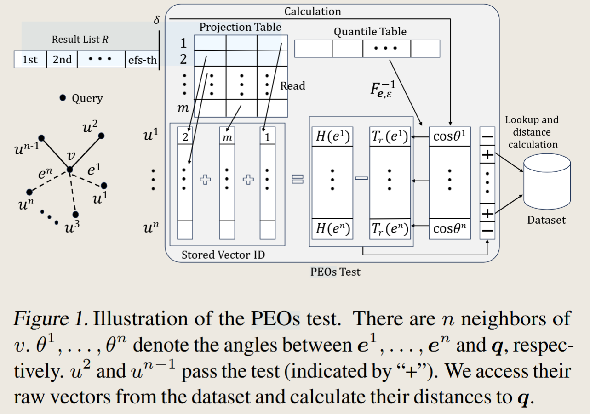
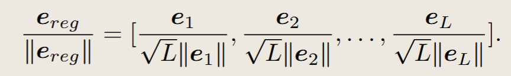

# Highlights

1. **LSM-VEC System:** This paper proposes LSM-VEC, a disk-based vector search system that integrates **hierarchical graph indexing with LSM-tree storage**. LSM-VEC can efficiently handle insertions, deletions, and high-recall Approximate Nearest Neighbor (ANN) queries on billion-scale datasets.

   > Based on AsterDB, a previous paper that proposes a disk-based graph index system.

2. **Integrates LSM-tree for Efficient Dynamic Updates:** LSM-VEC is the first system to incorporate LSM-trees, an index structure optimized for writes, into vector indexing, thereby effectively supporting vector insertion and deletion operations.

   > **Scalable**

3. **Sampling-based Probabilistic Search Strategy:** LSM-VEC improves search efficiency and reduces I/O overhead while maintaining high recall by employing a sampling-based probabilistic search strategy combined with adaptive neighbor selection.

   > Maybe can not get high recall, but can get high QPS.

4. **Connectivity-Aware Graph Reordering:** Introduces connectivity-aware graph reordering technology to further reduce I/O without the need for global graph reconstruction, optimizing vector data layout on disk and improving disk locality.
   > Graph ordering is a NP-hard problem, and this paper uses GO algorithm from a [previous paper](https://dl.acm.org/doi/10.1145/2882903.2915220)

# Problems Solved

1. **Memory Limitations of Traditional ANN Indices**: Addresses the problem of traditional ANN search indices (e.g., HNSW) being limited by memory constraints at large data scales, preventing them from handling billion-scale data.

2. **Inefficient Updates in DiskANN**: Solves the issue where disk-based indices like DiskANN rely on **offline graph construction**, leading to **high I/O cost** and inefficient vector updates. These systems are primarily designed for static datasets and provide poor support for continuous updates.
   In dynamic environments, DiskANN has two questions

   - requires expensive global reconstruction
   - suffers from degraded search performance due to poorly connected new nodes.

3. **Recall and Layout Optimization in SPFresh**: Addresses the problem that while existing clustering-based methods like SPFresh offer better scalability, they suffer from reduced recall due to **coarse-grained partitioning**, it updates by **assigning new vectors to the nearest cluster**. It will lead to some problems:
   - **Poor recall**: Similar vectors may fall into different clusters, breaking neighborhood locality and leading to lower recall
   - **Inefficient disk layout**: The in-place update design restricts the flexibility of data layout optimization, making it difficult to improve disk locality.

# Design:yum:

This system consists of three main components:

- LSM-based Hierarchical Graph Indexing Module.
- Probabilistic Sampling Query Engine.
- Connectivity-Aware Reordering Module.

## LSM-Based Hierarchical Graph Indexing

LSM-VEC has scalability by seperate HNSW graph into multiple levels, where each level is stored in a separate LSM-tree. The bottom level is stored on disk, while the upper levels are kept in memory. This design allows for efficient updates and queries.

## Probabilistic Sampling Query Engine

The probabilistic filtering strategy is based on projection-based similarity scores. This way consists of several steps:

1. **Orthogonal Decomposition**: We decompose e as $e = e_{reg} + e_{res} $ such that $e_{reg} ⊥ e_{res}$ and the direction of $e_{reg}$ is determined as follows:
   
   And we also have two weights $w_{reg}$ and $w_{res}$, $w_{reg} = \Vert e_{reg}\Vert / \Vert e\Vert$, $w_{res} = \Vert e_{res}\Vert / \Vert e\Vert$

2. **Generating Projected Vectors**: We generate projected vectors for decomposed sub-vector and generate projectetd vectors for original vectors.
3. **Collection of Extreme Values**: In each $M_i$, we collect L + 1 extreme values that yield the greatest inner products with the projected vectors.
4. **Adjust the routing algorithm**:The projection vector is adjusted according to the statistical vector distribution and extreme values, and the influence of norm imbalance caused by subspace division is solved.
   > This step is balance subspace division and norm imbalance, which is a key step in the probabilistic routing algorithm.
5. **Query Projection**: Given query q, we normalize it to q and calculate the inner products with the projected vectors to obtain two values $H_1(e)$ and $H_2(e)$.
6. **Routing Test**: With $H_1(e)$ and $H_2(e)$, we calculate $A_r(e)$ as follows for l2 distance, With $A_r(e)$, we design a routing test for u: If $A_r(e)$ ≥ 1, it returns false. If $A_r(e)$ ≤ 0, it returns true. In case 0 < $A_r(e)$ < 1, we calculate H(e) and $T_r(e)$:
   

## Connectivity-Aware Reordering

Dynamically collect runtime statistics from sampling query engine, nodes frequently traversed together will be reordered together when LSM compaction occurs.

### Score definition

The score function $S(u,v)$ aims to quantify the "affinity" or "co-access likelihood" between two nodes (vectors) u and v. A higher score indicates that u and v are **frequently accessed together** or are important for each other in the search process:

$$
S(u,v) = S_s(u,v) + S_n(u,v) \cdot (1+\lambda \cdot Hamming(Hash(q), Hash(u)))
$$

- $S_s (u, v) = |N_I (u) \cap N_I (v)|$ measures the number of common in-neighbors of u and v.
  > **in-neighbors represent nodes from which edges point to u or v**
- $S_n (u, v)$ counts the existence of direct edges between u and v.

This sampling-driven score directly captures the **runtime importance of each edge based on its frequency in sampled search paths**, enabling the layout optimization to reflect actual query behavior.

### Goal of Score

LSM-VEC aims to find a node permutation $\phi(\cdot)$ that **maximizes the total edge scores within a physical prefetch window of size w**, following the formulation as:

$$
F(\phi) = \sum_{0 < \phi(v) - \phi(u) < w} S(u, v)
$$

- **Node Permutation $\phi(\cdot)$**: This refers to the mapping of each logical node ID to a physical position on the disk. The goal is to rearrange the nodes in storage.
- **Physical Prefetch Window w**: This is a critical concept for disk I/O. When a disk performs an I/O operation (e.g., reading data), it typically reads data in fixed-size blocks or pages. A "prefetch window" of size w means that **if a disk block at position i is read, all data within the range [i,i+w−1] (or some similar concept) can be efficiently read in a single I/O operation or a few sequential I/Os**.

Intuitively, this objective encourages **frequently co-accessed nodes to be placed closely together**. If two nodes u and v have a high score $S(u,v)$ (meaning they are likely to be accessed together), the objective function heavily rewards placing them within the same prefetch window w.

### Graph Ordering Problem([GO Algorithm](https://dl.acm.org/doi/10.1145/2882903.2915220))

Maximizing $F(\phi)$ to obtain an optimal permutation $\phi(\cdot)$ for a directed graph G is **NP-hard**.

GO algorithm prioritizes placing nodes with high $S(u,v)$ scores close together. The greedy approach ensures that at each step, the node chosen to be **placed next is the one that has the strongest "ties" (highest sum of scores) with the nodes that have just been placed** within the prefetch window size.

LSM-VEC periodically applies a global reordering pass over the disk-resident bottom-layer graph.

# Operation in LSM-VEC

## Insertion in LSM-VEC

1. The vector is assigned to a random level L sampled from an exponentially decaying distribution：
   - At each level l (except the bottom layer), the system identifies approximate neighbors and connects the vector to the top-M closest nodes using in-memory search.
   - At the bottom layer, neighbor search is conducted on the disk-resident graph stored in the LSM-tree. The vector is connected to the top-M nearest disk-resident nodes, and the resulting edges are written to the LSM-tree for durable storage.
     

## Deletion in LSM-VEC

1. In memory, its immediate neighbors are reconnected using approximate neighbor search to preserve local graph connectivity.
2. In the disk layer, LSM-VEC identifies affected nodes and inserts new edges into AsterDB, avoiding full reindexing.
3. After relinking neighbors, the system removes all edges involving the deleted node from AsterDB and deletes the corresponding vector data.

## Search in LSM-VEC

1. Search the memory-resident layers of the LSM-tree to find the top-k nearest neighbors.
2. If the top-k neighbors are not sufficient, the system will traverse the disk-resident layers of the LSM-tree. We should use the probabilistic sampling query engine to efficiently filter out irrelevant nodes and reduce the number of disk accesses.

# Results:eyes:

Probabilistic sampling can **substantially improve efficiency with minimal impact on accuracy**. It is a key component of LSM-VEC, enabling scalable and latency-aware vector search under dynamic workloads.

As sample ratio increases, QPS improves significantly, while recall remains stable.

# Potential Questions:skull:

1. **Write Amplification**: This is a original problem of LSM-tree, and it is not mentioned in this paper. How does LSM-VEC handle write amplification when updating data?
2. **Graph Ordering Frequency**: The paper mentions that the graph ordering is performed periodically. How often does this reordering occur, and how does it impact the performance of the system?
3. **High Recall(over 0.95)**: The paper does not mention whether the system can achieve high recall (over 0.95) in all scenarios. What are the conditions or limitations for achieving such high recall?

# References

1. [A Large-Scale Disk-Based System for Dynamic Vector Search](https://www.arxiv.org/abs/2505.17152)
2. [Speedup graph processing by graph ordering](https://dl.acm.org/doi/10.1145/2882903.2915220)
3. [Probabilistic Routing for Graph-Based Approximate Nearest Neighbor Search](http://arxiv.org/abs/2402.11354)
