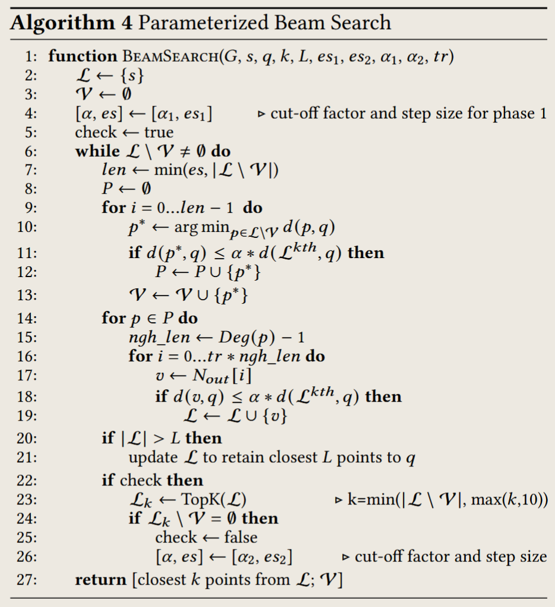

# Perspectives

1. This paper reveals that it is not worthwhile to exploit intra-iteration and intra-query parallelism.
2. Not every iteration in searching contributes equally to the final result, so it is not necessary to wait for all iterations to finish.
   
3. The paper reveals that the input queries and their ANNS results exhibit a notable temporal correlation in many real-world datasets.

# Core Ideas

## Parameterized Beam Search

## Recency-aware Graph Construction

## Graph Layout Optimization

### Selective Neighbor Scan

This early termination of neighbor scanning has two advantages:

1. it avoids fetching unpromising vector data from the memory;
2. unpromising distance computations are also circumvented.

### Vertex reordering

To avoid random access and simplify the selection logic, we propose a graph layout optimization. The idea is that, after the graph is constructed, we **sort each vertex’s out-neighbor list based on the timestamp**.

Then, at each iteration of the beam search, only a fraction of the vertex’s out-neighbors is fetched and evaluated.

# Potential Problems
