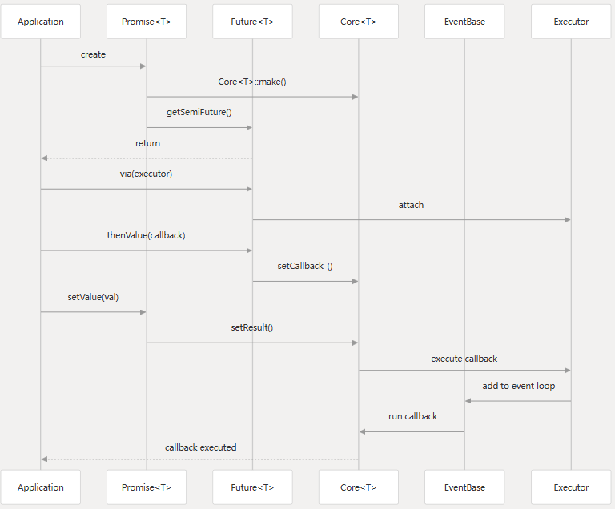
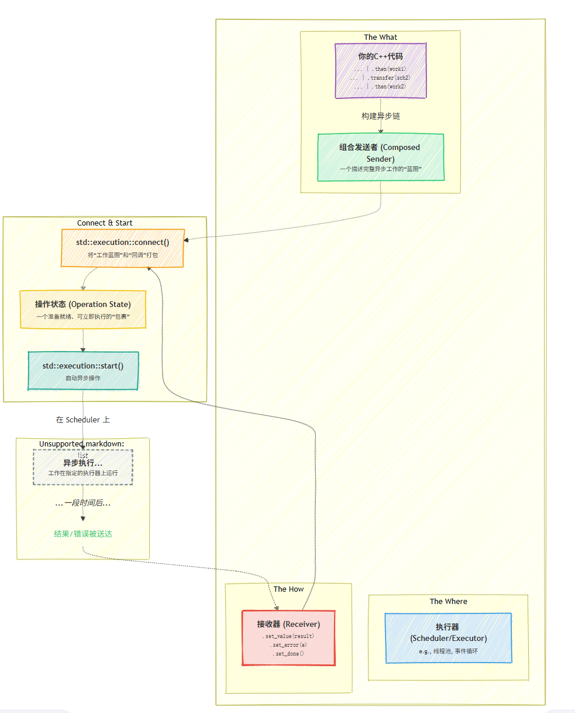
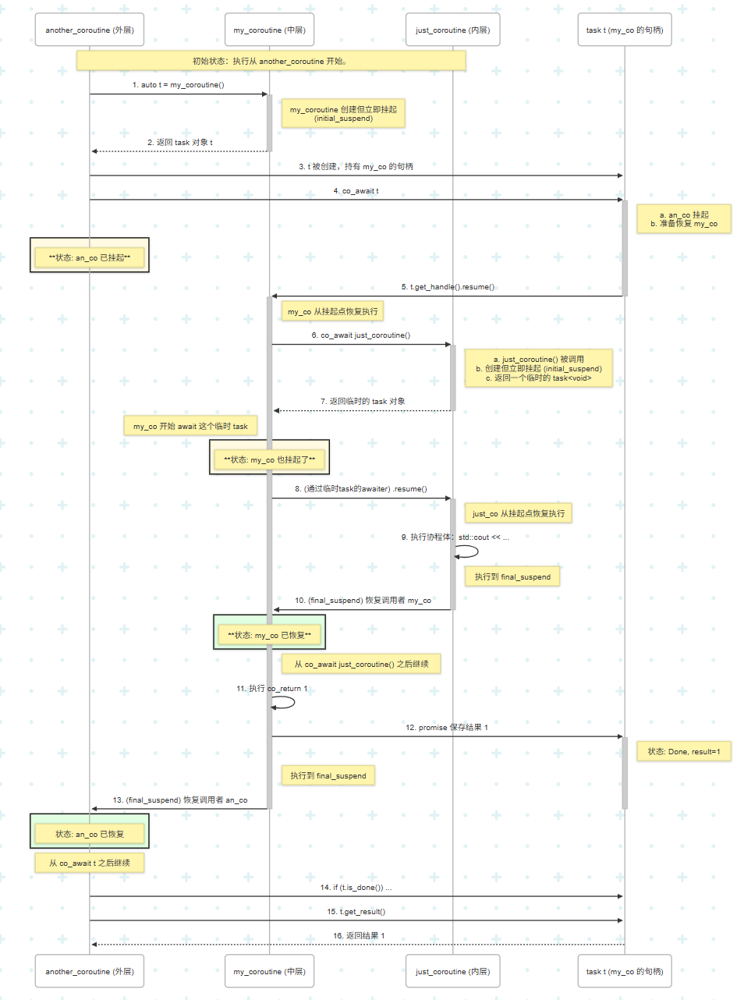

# Key Concept

1. 同步 (Synchronous) vs. 异步 (Asynchronous)

- 同步：当你发起一个操作（比如读取文件、请求网络数据），你的程序会停在那里**等待**这个操作完成，然后才能继续执行下一步。这就像打电话，你必须等着对方接通才能说话。
- 异步：当你发起一个操作，程序**不会等待**，而是立即返回，继续执行后续代码。当那个操作完成后，系统会通过某种方式（如回调函数、事件、Future）通知你。这就像发短信，你发完后可以去做别的事，等收到回复时再处理。

2. 阻塞 (Blocking) vs. 非阻塞 (Non-Blocking)

- 阻塞：一个函数或操作在完成其任务之前不会返回，会“阻塞”当前线程的执行。同步操作通常是阻塞的。
- 非阻塞：一个函数或操作会立即返回，无论任务是否完成。如果任务没完成，它通常会返回一个“正在进行中”或“稍后再试”的状态。
-

# 标准库的异步尝试：Future and Promise in C++

- `std::future`: 一个代表未来某个时刻才会有的结果的对象。你可以通过它的 get() 方法来获取结果。如果结果还没准备好，get() 会阻塞当前线程直到结果可用。
- `std::promise`: 用于在某个线程中设置值，而这个值可以被关联的 `std::future` 在另一个线程中获取。std::async 内部就封装了 promise 的使用。

## Example 1 (Logic)

设线程 1 需要线程 2 的数据，那么组合使用方式如下：

1. 线程 1 初始化一个 promise 对象和一个 future 对象，promise 传递给线程 2，相当于线程 2 对线程 1 的一个承诺；future 相当于一个接受一个承诺，用来获取未来线程 2 传递的值
2. 线程 2 获取到 promise 后，需要对这个 promise 传递有关的数据，之后线程 1 的 future 就可以获取数据了。
3. 如果线程 1 想要获取数据，而线程 2 未给出数据，则线程 1 阻塞，直到线程 2 的数据到达


## Example 2 (Code)

使用`std::async`进行异步 CPU 密集型任务，主线程等待异步任务执行的结果。

```c++
#include <iostream>
#include <future>
#include <chrono>

int heavy_calculation() {
    std::this_thread::sleep_for(std::chrono::seconds(2));
    return 42;
}

int main() {
    // 使用 std::async 异步启动任务
    std::future<int> result_future = std::async(std::launch::async, heavy_calculation);

    std::cout << "Main thread continues working while calculation is in progress..." << std::endl;
    // ... 在这里做其他事情 ...

    std::cout << "Waiting for the result..." << std::endl;
    int result = result_future.get(); // get()会阻塞直到结果可用

    std::cout << "The calculated result is: " << result << std::endl;
    return 0;
}
```

# Folly 对标准库的进一步封装和扩展：Future and Promise in Folly

Future 的执行通过 Executor 执行，Folly 允许 Future 进行链式调用，Promise setValue 后执行回调，这一步实际上是将该过程加入 eventloop，由事件循环去触发。



## Example

1. 启动: 主线程创建了所有组件并启动了事件循环。
2. 阶段 1: 第一个 .thenValue() 回调在主线程上执行，因为这是 mainEventBase 运行的地方。这符合预期。
3. 切换到线程池: via(cpuExecutor.get()) 生效。
4. 阶段 2: 第二个 .thenValue() 回调被调度到 CPUThreadPoolExecutor 的一个工作线程上。线程 ID 的变化是 via() 起作用的最直接证明。 耗时的计算在这里进行，完全不会影响主事件循环的响应。
5. 切换回 EventBase: via(&mainEventBase) 生效。
6. 阶段 3: 第三个 .thenValue() 回调被调度回主线程。这对于需要与特定线程（如 UI 线程）交互或对共享资源进行串行访问的场景至关重要。
7. 结束: 回调中调用 terminateLoopSoon()，事件循环结束，程序退出。

```c++
// 辅助函数，打印当前线程ID和消息
void print_thread_info(const std::string& message) {
    std::cout << "[" << std::this_thread::get_id() << "] " << message << std::endl;
}

int main() {
    // === 1. 设置执行器 ===
    // a) 主事件循环，用于I/O和最终更新
    folly::EventBase mainEventBase;
    // b) CPU线程池，用于计算密集型任务
    //    创建一个有4个线程的线程池
    auto cpuExecutor = std::make_unique<folly::CPUThreadPoolExecutor>(4);

    print_thread_info("Main thread started. Setting up future chain.");
    print_thread_info("mainEventBase is running on this thread once loop starts.");

    // === 2. 创建并链接 Future 链 ===

    // 启动一个Future链，初始值为一个用户ID
    folly::makeFuture(123)

        // ---------------------------------------------------------------------
        // 阶段 1: 在默认执行器 (mainEventBase) 上运行
        // .then() 的回调默认会在添加它的线程（这里是主线程）的 EventBase 上调度
        .thenValue([&](int userID) {
            print_thread_info("Phase 1: Fetched user ID. Preparing for heavy computation.");
            // 模拟从缓存中获取的原始数据
            return "raw_data_for_user_" + std::to_string(userID);
        })

        // ---------------------------------------------------------------------
        // *** 关键部分: 切换到 CPU 线程池 ***
        // via() 确保下一个 .then() 将在 cpuExecutor 的一个线程上执行
        .via(cpuExecutor.get())

        // ---------------------------------------------------------------------
        // 阶段 2: 在 CPUThreadPoolExecutor 的一个工作线程上运行
        .thenValue([](std::string rawData) {
            print_thread_info("Phase 2: Starting heavy computation on CPU thread pool.");
            // 模拟耗时的 CPU 密集型工作
            std::this_thread::sleep_for(std::chrono::seconds(2));
            std::string processedData = "PROCESSED(" + rawData + ")";
            print_thread_info("Phase 2: Computation finished.");
            return processedData;
        })

        // ---------------------------------------------------------------------
        // *** 关键部分: 切换回主 EventBase ***
        // via() 确保下一个 .then() 将回到 mainEventBase 上执行
        .via(&mainEventBase)

        // ---------------------------------------------------------------------
        // 阶段 3: 回到主 EventBase 线程上进行最终处理
        .thenValue([&](std::string finalData) {
            print_thread_info("Phase 3: Back on main EventBase. Finalizing result.");
            std::cout << "\n>>> FINAL RESULT: " << finalData << " <<<\n" << std::endl;

            // 工作完成，停止事件循环
            print_thread_info("Phase 3: Terminating event loop.");
            mainEventBase.terminateLoopSoon();
        })

        // 异常处理
        .thenError(folly::tag_t<std::exception>{}, [&](const std::exception& e) {
            print_thread_info("An error occurred in the chain: " + std::string(e.what()));
            mainEventBase.terminateLoopSoon();
        });


    // === 3. 启动事件循环 ===
    print_thread_info("Future chain is set up. Starting event loop...");
    mainEventBase.loopForever();

    // === 4. 清理资源 ===
    // 等待所有线程池中的任务完成
    cpuExecutor->join();
    print_thread_info("Program finished.");
    return 0;
}
```

## 常用方法

### collectAll()

- collectAll 持有一个元素类型为`Future<T>`的可迭代集合类型，返回一个`Future<std::vector<Try<T>>>` ，这个返回的 Future 将在所有的 input futures 都变为 completed 状态时变为 completed 状态。结果(resultant)Future 中的 vector 将按照 Future 被添加的顺序包含 input futures 的值（或者异常）。任何组件 Future 的错误都不会导致这个过程提前终止，input futures 都是被 move 而变得无效。

### via()

- Future 拥有一个 via()函数，该函数需要一个 Executor 类型的参数。Executor 是一个非常简单的接口，它只存在一个线程安全的`add(std::function<void()> func)` 方法，它会在某个时候执行这个 func，尽管不是立即执行。而 via()可以确保被设置的回调函数在指定的 Executor 上执行。

#### Executor 常用实现

- ThreadPoolExecutor ：是一个抽象的线程池实现，支持调整大小、自定义线程工厂、池和每个任务的统计信息、支持 NUMA、用户自定义的任务终结。当前它有两个实现。
  - CPUThreadPoolExecutor（是一个通用线程池，除了上述功能之外，它还支持任务优先级）
  - IOThreadPoolExecutor (类似 CPUThreadPoolExecutor，但是每一个线程都在一个 EventBase 事件循环 loop)。
- EventBase ：是一个 Executor，把任务作为一个回调在事件循环上执行。
- FutureExecutor：包装了其他 Executor，并提供了`Future<T> addFuture(F func)`函数返回一个 Future 用于异步获取函数的执行结果。

# C++ 异步的进一步抽象（C++26）：std::execution

## Architecture overview

- Sender: lazy value，会延迟到需要时才计算

- Receiver: continuation 或者 callback，当 sender 计算完成时，得到的值会传入 receiver 而不是返回给调用方。

- Scheduler: 资源的描述符。



## Sender Details

- lazy: 创建发送者不会执行任何操作。
- potential: 它知道在成功时将产生什么类型的值（T...），可能产生的错误（E），或者是否可以被取消。
- composition: 你可以使用可管道操作符（|）如 then()、upon_error()、transfer()等将发送者链接在一起。链中的每一步都会创建一个新的、更复杂的发送者。

```c++
// Pseudocode for chaining senders
auto final_work_order = scheduler.schedule()               // Sender 1: A sender that says "run on this scheduler"
                      | then([]{ return read_file(); })   // Sender 2: A new sender that wraps Sender 1 and adds file reading
                      | then([](string data){ return parse(data); }); // Sender 3: A new sender that wraps Sender 2...
```

## Receiver Details

接收者是发送者结果的使用者。它本质上是一个具有三个不同通道的回调。接收者必须具有这三个方法：

- set_value(T... values): 当发送者的操作成功完成时被调用。工作已经完成。

- set_error(E error): 当发送者的操作失败时调用。工作已完成。

- set_done(): 当操作被取消或无值/错误完成（例如，发送者被停止）时调用。工作已完成。

```c++
// Pseudocode for a receiver (often a lambda)
auto my_callback = receiver {
    .set_value = [](auto result){ std::cout << "Success! Result is " << result << std::endl; },
    .set_error = [](auto error){ std::cout << "Failure! Error was " << error << std::endl; },
    .set_done  = []{ std::cout << "Operation was cancelled." << std::endl; }
};
```

## Scheduler Details

- execution context: 这可以是一个线程池、当前线程、特定的 UI 线程、GPU 流或 I/O 事件循环。
- factory for senders: 调度器的首要任务是通过其 `.schedule()` 方法生成一个发送者。这个“调度发送者”是大多数异步工作链的起点。它是一个在启动时，仅仅在调度器的上下文中完成的发送者。

```c++
// Get a scheduler from a thread pool
thread_pool my_pool;
scheduler auto sch = my_pool.get_scheduler();

// Create a sender that will execute its subsequent work on the thread pool
sender auto start_on_pool = sch.schedule();
```

## Bridge between Sender and Receiver

### connect()

1. `std::execution::connect(sender, receiver) -> operation_state`

- 它返回一个 operation_state 对象。
- 这仍然是一个懒加载步骤，但它可能会执行预计算、内存分配等操作。它创建了一个可以立即运行的软件包。

2. `std::execution::start(operation_state)`

- 这是唯一一个急切执行的函数。它接收 operation_state 并说"开始执行！"。
- 它是即插即用的。它立即返回 void
- 发送方描述的工作将在其调度器提供的上下文中开始执行。
- 在未来的某个时刻，工作将完成，持有接收方的 operation_state 将调用其 set_value、set_error 或 set_done 中的一个方法。

# Coroutine with std::execution

## what is coroutine

`co_await io_task`之后，coroutine 会被挂起来，我们首先将 io 任务安排好（利用 epoll、iouring、windows IOCP 等操作系统提供的 io 工具）。

- 一般来讲，会有单独的一个或者多个 io 线程，不断从操作系统中读取 io 状态，一旦 io 完毕，这个 io 线程会调用`handle.resume()`，于是后续任务就会在 io 线程中完成。
- 当然 io 线程也可以选择一旦结束，就将 handle 调度到其他 worker 线程，worker 线程会调用`handle.resume()`。

```c++
some_return_type  my_coroutine() {
     co_await async_read(some_buffer);
     /// runs in some io threads or worker threads
     ....
     co_await async_write(some_buffer);
     /// runs in some io threads or worker threads
     ....
     co_return;
}
```

## task

- task 是一个 return_type，就是说一个 coroutine 可以 return task。
- task 是一个 awaiter，就是说可以 co_await 一个 task 的 object。
- `task::promise_type`就是一个 coroutine 的 promise。就是说一个 coroutine 如果返回了 task，那么编译器可以直接从 task::promise_type 找 promise 的类型是什么，并生成 promsie object。

### example

1. logic
   - 默认 task 再 `initial_suspend` 会直接挂起该协程。
   - 在 my_coroutine 被 resume，并且完全执行完毕（co_await final_suspend()）的时候，another_coroutine 才会 resume。co_await just_coroutine 过程也是如此。
   - 等到 my_coroutine 执行结束后，`final_suspend`会恢复 another_coroutine 的执行。



2. code

```c++
task<void> just_coroutine() {
  std::cout << "just cout\n";
}

task<int> my_coroutine() {
    // task缺省实现的promise是一个lazy promise。
    // 刚进入my_coroutine的时候，在co_await promise.initial_suspend()的时候，
    // 会直接挂起来，下面的co_await just_coroutine并不会立刻执行。

    co_await just_coroutine;
    co_return 1;
}


// 注意 another coroutine也是一个lazy coroutine（因为task<> 缺省实现)
task<> another_coroutine() {

    // t是一个task<int>类型，my_coroutine直接被挂起来后，返回task，并继续运行这里
    auto t = my_coroutine();

    // co_await t的时候，会调用 t.get_handle().resume(),就是说 co_await t的时候，才会
    // 接着运行 my_coroutine里的 co_await just_coroutine。
    // 同时，本coroutine（another_coroutine)会被挂起来。
    co_await t;
    // 在 my_coroutine 被resume，并且完全执行完毕（co_await final_suspend()）的时候，本coroutine
    // 才会resume，就是说本coroutine会一直等到 t所代表的任务全部完成后，才会resume()。

    // co_await just_coroutine可能在别的线程将my_coroutine resume，task提供接口拿到 co_return结果（co_return 1)
    if (t.is_done()) {
        print(t.get_result());
     }
}
```

## combine coroutine and execution

- 每个 task 都是一个小任务（类似于 sender），当另一个 task 2 代表的 coroutine，调用了 co_await task1 的时候，task1 代表的任务完全结束后，task2 才会继续运行。task2 所代表的任务就相当于包含了（组合了）task1 的任务。这和 execution 是十分像的。
- 所以我们需要类似 sender 的 connect 接口，它的实现是一个 lazy 的 coroutine。
  - 运行 connect(awaiter, receiver)的时候，coroutine 挂起来（内部的逻辑完全没有运行），coroutine 会返回一个自定义类型，在 execution 框架里，就是返回 operation。
  - 当 start(op)的时候，我们只要在 start(op)里调用 handle.resume()，即可继续运行 connect 这个 coroutine。
  ```c++
  my_awaiter awaiter;
  auto op = connect(awaiter, my_receiver{});
  start(op);
  ```

### NVIDIA std::exec example

定义了一个简单的异步工作流：首先等待 s2 完成，然后等待 s1 完成，并返回 s1 的结果。 这是一个异步的“串行”操作。

- `co_await static_cast<S2&&>(s2)`: 等待 s2 这个异步操作完成，但忽略它的结果（因为 s2 是 just()，结果是空）。
- `co_return co_await static_cast<S1&&>(s1)`: 在 s2 完成后，协程恢复执行。它接着 co_await s1 (just(42))。当 s1 完成并返回值 42 时，co_return 会将这个值 42 作为整个 exec::task 的最终结果返回。
- `get_stop_token()`: 这是一个 Sender，当它被执行时，会返回与当前执行环境关联的 inplace_stop_token。这个 token 可以用来查询是否收到了停止请求。
  stopped_as_optional(get_stop_token()): 再次使用 stopped_as_optional。
  - 如果执行环境没有停止请求，get_stop_token() 会成功，并返回一个 stop_token。stopped_as_optional 会将其包装在 std::optional 中。
  - 如果执行环境有停止请求，get_stop_token() 会传播“停止”信号。stopped_as_optional 会捕获它并返回一个 std::nullopt。

```c++
using namespace stdexec;

template <sender S1, sender S2>
auto async_answer(S1 s1, S2 s2) -> exec::task<int> {
  // Senders are implicitly awaitable (in this coroutine type):
  co_await static_cast<S2&&>(s2);
  co_return co_await static_cast<S1&&>(s1);
}

template <sender S1, sender S2>
auto async_answer2(S1 s1, S2 s2) -> exec::task<std::optional<int>> {
  co_return co_await stopped_as_optional(async_answer(s1, s2));
}

// tasks have an associated stop token
auto async_stop_token() -> exec::task<std::optional<stdexec::inplace_stop_token>> {
  co_return co_await stopped_as_optional(get_stop_token());
}

auto main() -> int {
  try {
    // Awaitables are implicitly senders:
    auto [i] = stdexec::sync_wait(async_answer2(just(42), just())).value();
    std::cout << "The answer is " << i.value() << '\n';
  } catch (std::exception& e) {
    std::cout << e.what() << '\n';
  }
}
```
