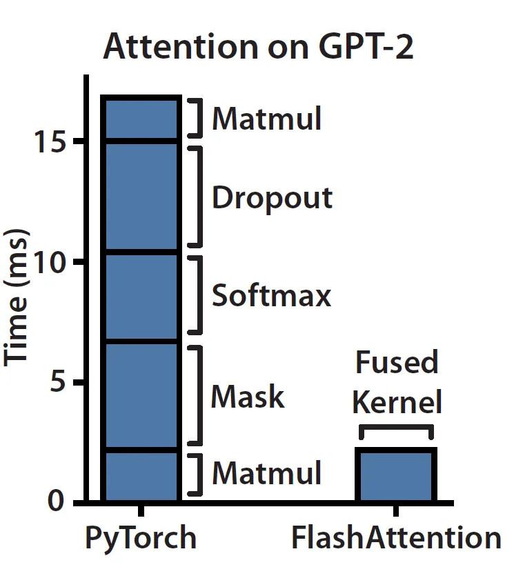
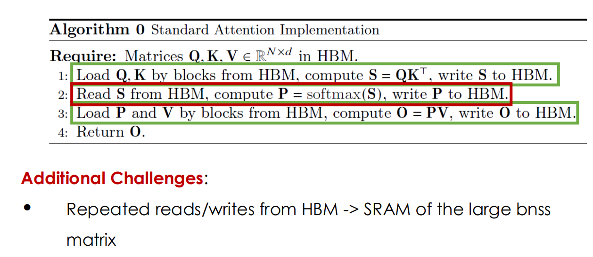
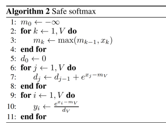
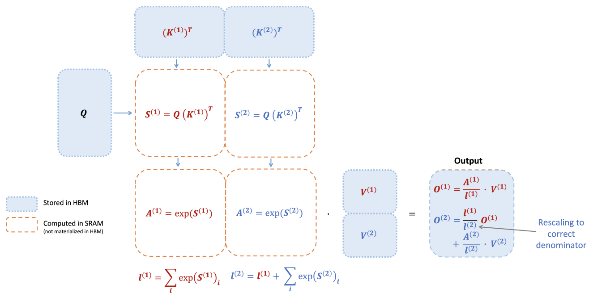
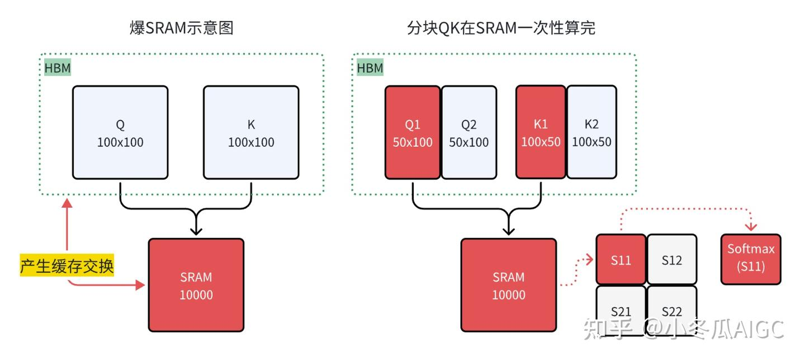
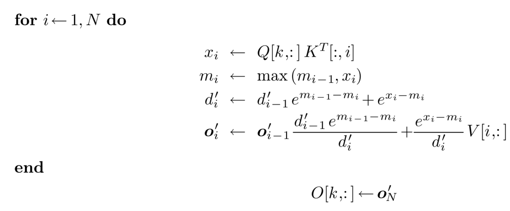
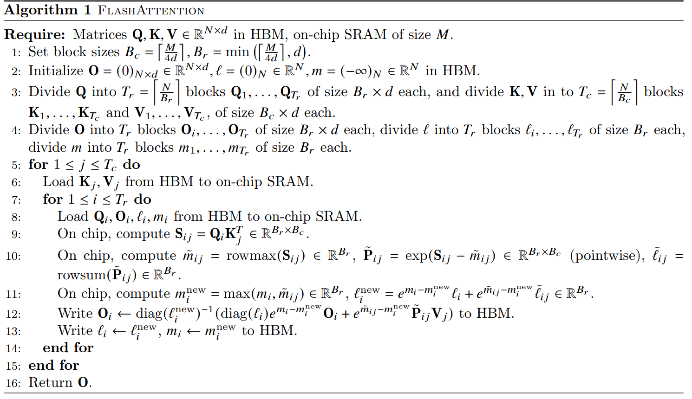
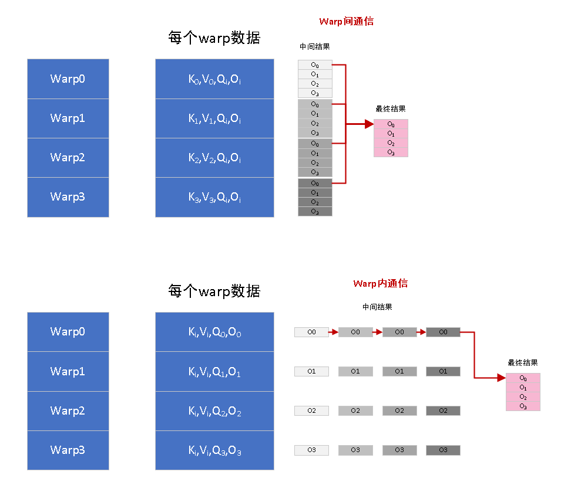

---

title: FlashAttention 原理 v1-v2
tags:

- LLMInference
created: 2025-11-03
updated: 2025-12-13
description: 本文详细介绍 FlashAttention 的原理及其 v1 和 v2 版本的改进点，涵盖 Online Softmax、分块计算以及并行化优化等关键技术。
cover: /img/parallelization_kv.gif
---

# FlashAttention 原理 v1-v2

## Motivation

attention 的计算对计算和内存要求都很高（b 是 batch size，s 是 seq len，h 是 hidden size）

- Compute：$4bs^2h$
- Memory：$bs^2h$
  
但实际上 Attention 是 Memory-Bound 的操作，计算资源远远没有被充分利用
> Dropout、softmax、Mask——这些都是element-wise操作，都是内存密集型操作

- 有改进的方法降低计算复杂度，没太大用，原因**缓存存取很耗时**
- `FlashAttention`  优化了显存存取，**非优化计算复杂度**

传统的 Attention 计算需要对 HBM 进行存取 8 次，非常耗时

我们希望尽可能将 attention 分块，部分加载到 shared memory 进行一次计算后直接写回，避免多次的读取和写入。这就带来了挑战，我们必须避免显式地（在内存中）构建出矩阵 **S**，同时还要做到：

- **在前向传播中**，在无法访问完整的 $N \times N$ 矩阵的情况下，计算出 softmax 的归一化结果 $O$；
- **在反向传播中**，即使没有保存前向传播时的 $N \times N$ softmax 激活值，也能够正确计算梯度。

在正式进入 Flash Attention 之前，我们需要重新回顾下 softmax 的过程以及 \*_online softmax 如何实现的，FA 主要思想就是进行分块计算注意力，Online-Softmax 是 FA 实现的关键_

## Online Softmax

### basic softmax

$$
\bar{x_i} = \frac{e^{x_i}}{\sum_j^N{e^{x_j}}}
$$

### safe softmax

将变量的指数统一减去最大值，防止指数数值上溢

$$
\bar{x_i} = \frac{e^{x_i - max(x_{:N})}}{\sum_j^N{e^{x_j - max(x_{:N})}}}
$$

### online softmax

实际上我们的 $d_i^{\\prime}$ 可以由 $d_i$ 递推得到：

$$
\begin{aligned}
d_i' &= \sum_{j=1}^{i} e^{x_j - m_i} \\
&= \left( \sum_{j=1}^{i-1} e^{x_j - m_i} \right) + e^{x_i - m_i} \\
&= \left( \sum_{j=1}^{i-1} e^{x_j - m\_{i-1}} \right) e^{m_{i-1} - m_i} + e^{x_i - m_i} \\
&= d\_{i-1}' e^{m_{i-1} - m_i} + e^{x_i - m_i}
\end{aligned}
$$

## Flash Attention

当键向量 **K** 被划分为两个块（blocks），并且值向量 **V** 也被划分为两个块时，我们可以分别对每个块计算注意力（attention），然后在最后对输出进行**重新缩放（rescaling）**，这样就能得到与完整计算相同的正确结果。

在示意图中，为了简化说明，我们**省略了 softmax 中减去每行最大值（row-wise max**的步骤。

### SRAM 分块示例

传统`Attention` 7 次进行 HBM 到 SRAM 的交换，我们希望分块的计算可以在 SRAM 一次算完

### Self attention v2: with Online Safe Softmax

我们通过 online safe softmax 可以得到 self attention 的计算过程

- 我们可以发现，其实我们只需要 $o_i$，而不是 $a_i$
- 所有我们接下来可以找 $o_i$ 的递推公式，只用一个循环实现部分的更新(max，d，o)

### Flash Attention

寻找 $o_i$ 的递推公式：

$$
\mathbf{o}'_i = \sum_{j=1}^{i} \frac{e^{x_j - m_i}}{d'_i} V[j,:]
$$

$$
= \\left( \\sum\_{j=1}^{i-1} \\frac{e^{x_j - m_i}}{d'\_i} V[j,:] \\right) + \\frac{e^{x_i - m_i}}{d'\_i} V[i,:]
$$

$$
= \left( \sum_{j=1}^{i-1} \frac{e^{x_j - m_{i-1}}}{d'_{i-1}} \frac{e^{x_j - m_i}}{e^{x_j - m_{i-1}}} \frac{d'_{i-1}}{d'_i} V[j,:] \right) + \frac{e^{x_i - m_i}}{d'_i} V[i,:]
$$

$$
= \left( \sum_{j=1}^{i-1} \frac{e^{x_j - m_{i-1}}}{d'_{i-1}} V[j,:] \right) \frac{d'_{i-1} e^{m_{i-1} - m_i}}{d'_i} + \frac{e^{x_i - m_i}}{d'_i} V[i,:]
$$

$$
= \mathbf{o}'_{i-1} \frac{d'_{i-1} e^{m_{i-1} - m_i}}{d'_i} + \frac{e^{x_i - m_i}}{d'_i} V[i,:]
$$

此时就得到`Flash Attention`的 **`one-pass` 迭代形式**

### Tiling Flash Attention

- 外层循环遍历 K 和 V 的 ”列块“（**一次 I/O 读**）
- 内存循环遍历 Q 的 "行块"（**一次 I/O 读**）
  - 计算 $Q \cdot K^T$产生了一个 $B_r \times B_c$ 的小矩阵 $S_{ij}$。**它从不被写入 HBM**
  - 针对刚刚得到的 $S_{ij}$ 块，计算**这个块的**“局部”Softmax 统计量：
    - $\tilde{m}_{ij}$：$S_{ij}$ 这一块的**行最大值** (rowmax)。
    - $\tilde{P}_{ij}$：$S_{ij}$ 减去块最大值后的 $\exp$ 结果，即 $e^{S_{ij} - \tilde{m}_{ij}}$。
    - $\tilde{\ell}_{ij}$：$\tilde{P}_{ij}$ 的**行和** (rowsum)，即 $\sum e^{S_{ij} - \tilde{m}_{ij}}$。
  - 更新 $m_i^{new}$ 和 $l_i^{new}$
  - 更新输出 $O_i$ （**一次 I/O 写**）：$O_i \leftarrow \text{diag}(\ell_i^{new})^{-1} \left( \text{diag}(e^{m_i - m_i^{new}}) O_i + e^{\tilde{m}_{ij} - m_i^{new}} \tilde{P}_{ij} V_j \right)$
    - $e^{m_i - m_i^{new}} O_i$：用缩放因子**修正**“历史”输出 $O_i$。
    - $e^{\tilde{m}_{ij} - m_i^{new}} \tilde{P}_{ij} V_j$：计算当前块的（未归一化的）输出，并用缩放因子修正它。
    - 两者相加，得到（未归一化的）新输出。
    - $\text{diag}(\ell_i^{new})^{-1}$：最后，除以新的全局分母 $\ell_i^{new}$，完成归一化。
  - **第二次 I/O 写：** 将更新后的 online 统计量 $\ell_i^{new}$ 和 $m_i^{new}$ 也写回 HBM，以便**下一个外循环**（$j+1$）可以使用它们。

### Summary

- 我们只会读取 $(Q, K)$ 一次，我们实际上是分块计算，分块存储输出矩阵 $O$
- 我们从来不会获取完整的 $S$
- 我们也不会获取完整的 $a (softmax(S))$

## Flash Attention V2

`Flash Attention 2` 比 `Flash Attention 1` 加速 `2x`, 计算效率达到GEMM性能的 `50~73%`，v2 相比于 v1 的优化主要有下面几点：

- **Parallelsim**：置换内外循环位置，同时减少非矩阵的计算量
- **Work Partitioning Between Warps**： 优化 thread blocks 内部 warp 级别的工作模式，尽量减少 warp 间的通讯和读取 shared memory 的次数
- **Optimize non-matmul**：优化 Attention 部分thread blocks的并行化计算，新增 seq_len 维度的并行，使 SM 的利用率尽量打满。这其实也是内外循环置换这个总体思想配套的改进措施
- **Causal Masking**：Flash Attention 是块计算的，可以直接跳过 causal mask 的块

### Parallelism

FlashAttention 在 batch 和 heads 两个维度上进行了并行化：

- 使用**一个 thread block 来处理一个 attention head**，总共需要 thread block 的数量等于`batch size × number of heads`。每个 block 被调到到一个 SM 上运行，例如 A100 GPU 上有 108 个 SMs。当 block 数量很大时（例如 ≥80），这种调度方式是高效的，因为几乎可以有效利用 GPU 上所有计算资源。

但是在**处理长序列输入**时，由于内存限制，通常会减小 batch size 和 head 数量，这样并行化程度就降低了。因此，**FlashAttention-2 还在序列长度这一维度上进行并行化**，显著提升了计算速度。此外，当 batch size 和 head 数量较小时，在序列长度上增加并行性有助于提高 GPU 占用率。

- `Flash Attention 2`  将 `Q` 当作外循环，`KV` 当作内循环， 将 `O[i]` 的在一个 `Q[i]` 周期算完，可以减少 SRAM -> HBM 的次数
- **由于改进了算法使得 warps 之间不再需要相互通信去处理**，所以外循环可以放在不同的 thread block 上
- 从`O`的缓存`write/read`次数从`2 x B_q x B_kv -> 2 x B_q`次

### Work Partitioning Between Warps

在每个 thread block 内部，我们也需要决定如何在不同的 warp 之间分配工作。我们通常在每个 thread block 中使用 4 或 8 个 warp。

- v1 计算该块的 $O_i$ 时，每个 warp 算出了矩阵乘的部分结果($O_i$)，需要**先写入共享内存。然后再同步，并重新读取**，reduce 成一个。会有额外的共享内存读写开销，和不同 warp 同步的开销。
  > 需要把 partial 结果写到共享内存并做 `__syncthreads()` + read + reduce
- v2 对 $Q_i$ 分块，每个 warp 能得到矩阵乘的部分完整结果。可以直接写到共享内存中该结果的对应部分，不需要 warp 之间同步了。也不需要再像 v1 一样把部分和从共享内存读出来，写到最终结果
  > 所有的同步操作都在 warp 内就完成了，只有最后的 O 输出的时候将 4 个 warp 的结果 allgather 成完整的 O

### Optimize non-matmul

`Flash Attnetion v1`  每次都要做 `Scaled` ($O \times L_i^{-1}$)，都是额外的非乘法计算；

1. 在计算局部 attention 时，先不考虑 softmax 的分母 $\sum e^{x_i}$，即
   $\ell^{(i+1)} = e^{m^{(i)}-m^{(i+1)}} \ell^{(i)} + \text{rowsum}( e^{S^{(i+1)}-m^{(i+1)}} )$，例如计算 $\mathbf{O}^{(1)}$ 时去除了
   $\text{diag}\left(\ell^{(1)}\right)^{-1}$

   **FlashAttention:**

   $$
   \mathbf{O}^{(1)} = \tilde{\mathbf{P}}^{(1)} \mathbf{V}^{(1)} = \text{diag}\left(\ell^{(1)}\right)^{-1} e^{S^{(1)}-m^{(1)}} \mathbf{V}^{(1)}
   $$

   **FlashAttention-2:**

   $$
   \tilde{\mathbf{O}}^{(1)} = e^{S^{(1)}-m^{(1)}} \mathbf{V}^{(1)}
   $$

2. 由于去除了 $\text{diag}\left(\ell^{(i)}\right)^{-1}$，更新 $\tilde{\mathbf{O}}^{(i+1)}$ 时不需要 rescale $\ell^{(i)} / \ell^{(i+1)}$，但是得弥补之前局部 max 值，例如示例中：

   **FlashAttention:**

   $$
   \mathbf{O}^{(2)} = \text{diag}\left(\ell^{(1)} / \ell^{(2)}\right)\mathbf{O}^{(1)} + \text{diag}\left(\ell^{(2)}\right)^{-1} e^{S^{(2)}-m^{(2)}} \mathbf{V}^{(2)}
   $$

   **FlashAttention-2:**

   $$
   \tilde{\mathbf{O}}^{(2)} = \text{diag}\left(e^{m^{(1)}-m^{(2)}}\right) \tilde{\mathbf{O}}^{(1)} + e^{S^{(2)}-m^{(2)}} \mathbf{V}^{(2)} = e^{S^{(1)}-m^{(2)}} \mathbf{V}^{(1)} + e^{S^{(2)}-m^{(2)}} \mathbf{V}^{(2)}
   $$

3. 由于更新 $\tilde{\mathbf{O}}^{(i+1)}$ 未进行 rescale，最后一步时需要将 $\tilde{\mathbf{O}}^{(\text{last})}$ 乘以 $\text{diag}\left(\ell^{(\text{last})}\right)^{-1}$ 来得到正确的输出，例如示例中：

   $$
   \mathbf{O} = \text{diag}\left(\ell^{(2)}\right)^{-1} \tilde{\mathbf{O}}^{(2)}
   $$

   

### 忽略 mask block 的 Attention 计算

- 由于 FlashAttention 和 FlashAttention-2 已经通过块操作来实现，**对于所有列索引都大于行索引的块（大约占总块数的一半），我们可以跳过该块的计算**。这比没有应用因果掩码的注意力计算速度提高了 1.7-1.8 倍。
- 不需要对那些行索引严格小于列索引的块应用因果掩码。这意味着对于每一行，我们只需要对 1 个块应用因果掩码。

### Summary

Flash-Decoding 分 3 个步骤进行：

1. 首先，我们将键/值拆分成更小的块。
1. 我们使用 FlashAttention 并行计算每个分割后的查询注意力值。此外，我们还为每行和每个分割写入一个额外的标量：注意力值的对数和指数。
1. 最后，我们通过对所有分割进行归约来计算实际输出，使用对数求和指数来缩放每个分割的贡献。

这一切之所以可行，是因为注意力/softmax 可以迭代计算。在 Flash-Decoding 中，它被用于两个层面：在 splits 内（类似于 FlashAttention），以及跨 splits 进行最终的 reduce。

实际上，步骤 (1) 不涉及任何 GPU 操作，因为键/值块是完整键/值张量的视图。然后，我们需要两个独立的内核分别执行步骤 (2) 和 (3)。

