---

title: FlashAttention 原理 v1-v3
tags:

- LLMInference
created: 2025-11-03
updated: 2025-12-13
description: 本文详细介绍 FlashAttention 的原理及其 v1-v3 版本的改进点，涵盖 Online Softmax、分块计算以及并行化优化等关键技术。
cover: /img/parallelization_kv.gif
---

# FlashAttention v1-v3 & FlashDecoding

## Motivation

attention 的计算对计算和内存要求都很高（b 是 batch size，s 是 seq len，h 是 hidden size）

- Compute：$4bs^2h$
- Memory：$bs^2h$
  
但实际上 Attention 是 Memory-Bound 的操作，计算资源远远没有被充分利用
> Dropout、softmax、Mask——这些都是element-wise操作，都是内存密集型操作

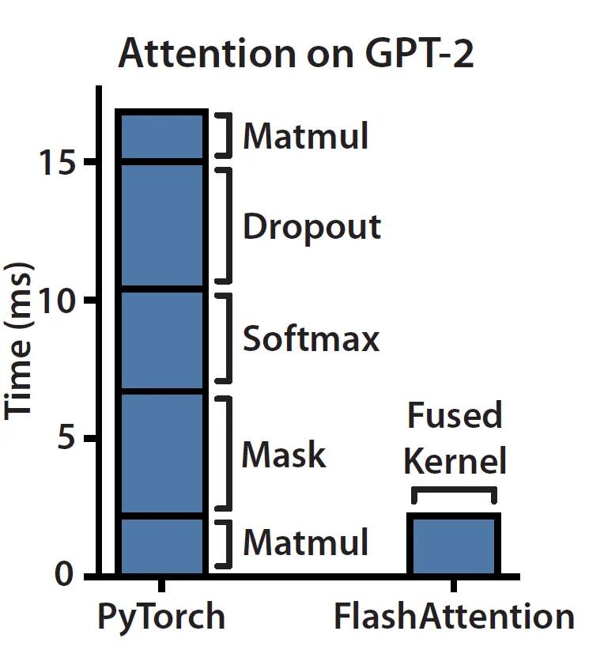

- 有改进的方法降低计算复杂度，没太大用，原因**缓存存取很耗时**
- `FlashAttention`  优化了显存存取，**非优化计算复杂度**

传统的 Attention 计算需要对 HBM 进行存取 8 次，非常耗时

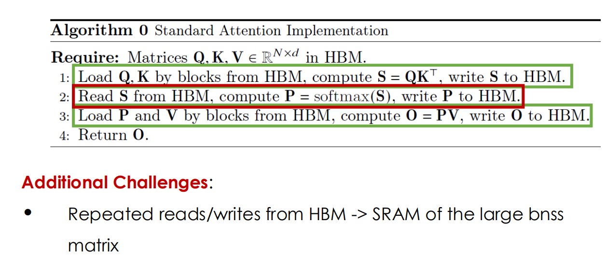

我们希望尽可能将 attention 分块，部分加载到 shared memory 进行一次计算后直接写回，避免多次的读取和写入。这就带来了挑战，我们必须避免显式地（在内存中）构建出矩阵 **S**，同时还要做到：

- **在前向传播中**，在无法访问完整的 $N \times N$ 矩阵的情况下，计算出 softmax 的归一化结果 $O$；
- **在反向传播中**，即使没有保存前向传播时的 $N \times N$ softmax 激活值，也能够正确计算梯度。

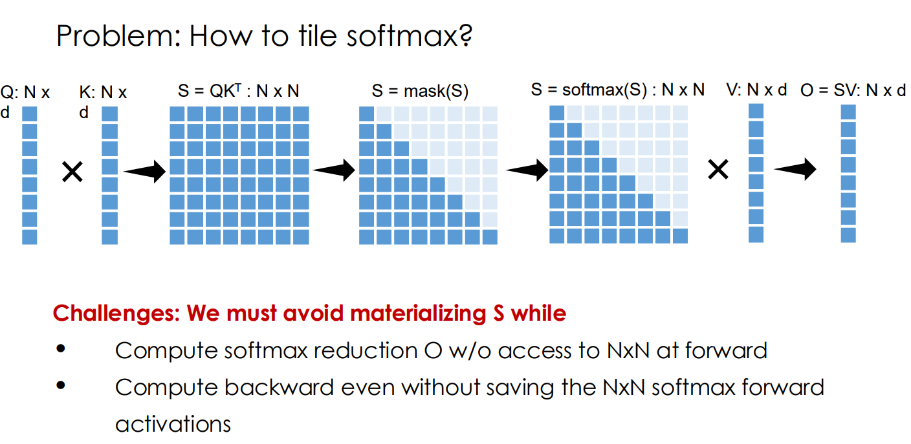

在正式进入 Flash Attention 之前，我们需要重新回顾下 softmax 的过程以及 \*_online softmax 如何实现的，FA 主要思想就是进行分块计算注意力，Online-Softmax 是 FA 实现的关键_

## Online Softmax

### basic softmax

$$
\bar{x_i} = \frac{e^{x_i}}{\sum_j^N{e^{x_j}}}
$$

### safe softmax

将变量的指数统一减去最大值，防止指数数值上溢

$$
\bar{x_i} = \frac{e^{x_i - max(x_{:N})}}{\sum_j^N{e^{x_j - max(x_{:N})}}}
$$

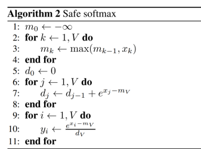

### online softmax

实际上我们的 $d_i^{\\prime}$ 可以由 $d_i$ 递推得到：

$$
\begin{aligned}
d_i' &= \sum_{j=1}^{i} e^{x_j - m_i} \\
&= \left( \sum_{j=1}^{i-1} e^{x_j - m_i} \right) + e^{x_i - m_i} \\
&= \left( \sum_{j=1}^{i-1} e^{x_j - m_{i-1}} \right) e^{m_{i-1} - m_i} + e^{x_i - m_i} \\
&= d_{i-1}' e^{m_{i-1} - m_i} + e^{x_i - m_i}
\end{aligned}
$$

- 我们可以只在一次循环中计算出 $m_i$ 和 $d_i$，而不需要先计算出完整的 $m$ 和 $d$。

  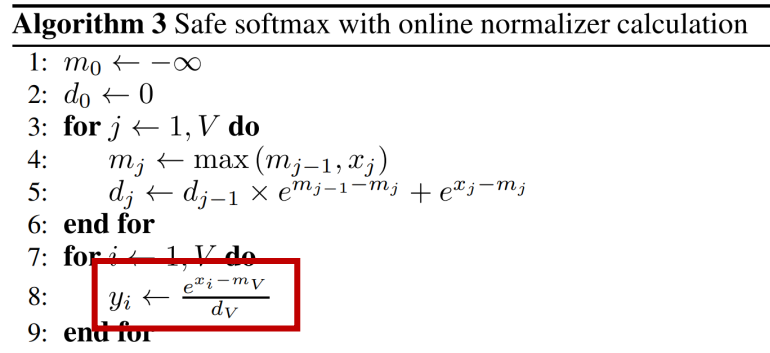

## Flash Attention

当键向量 **K** 被划分为两个块（blocks），并且值向量 **V** 也被划分为两个块时，我们可以分别对每个块计算注意力（attention），然后在最后对输出进行**重新缩放（rescaling）**，这样就能得到与完整计算相同的正确结果。

在示意图中，为了简化说明，我们**省略了 softmax 中减去每行最大值（row-wise max）** 的步骤。

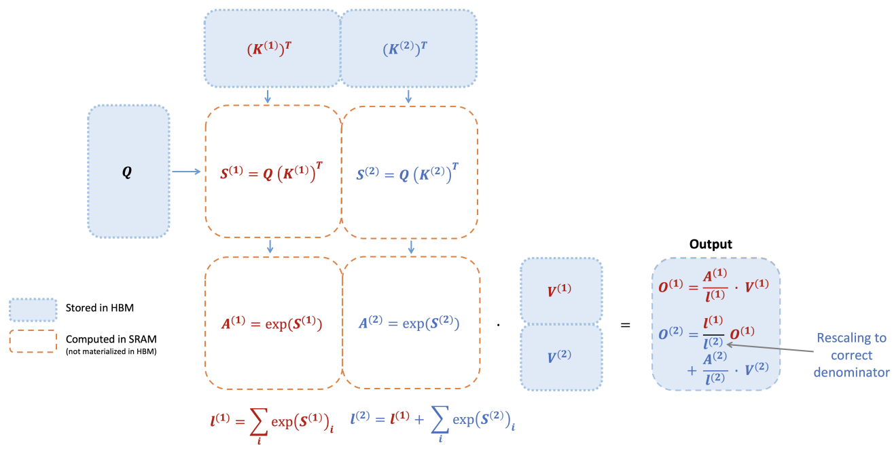

### SRAM 分块示例

传统`Attention` 8 次进行 HBM 到 SRAM 的交换，大量时间花在了显存访问上：
- Read Q, Read K: HBM->SRAM
- Write S($Q@K^T$): SRAM->HBM
- Read S: HBM->SRAM
- Write P(softmax(S)): SRAM->HBM
- Read P, Read V: HBM->SRAM
- Write O: SRAM->HBM

我们希望分块的计算可以在 SRAM 一次算完，减少 HBM 的读写次数，不要在计算中途写入或者读取整个大矩阵 S 和 P

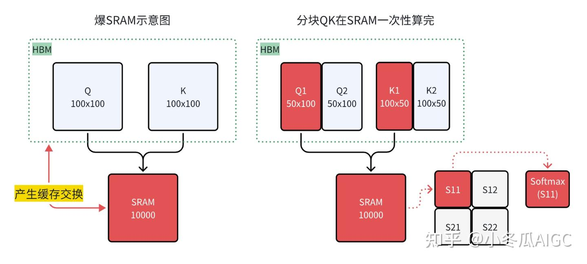

### Self attention v2: with Online Safe Softmax

我们通过 online safe softmax 可以得到 self attention 的计算过程

- 我们可以发现，其实我们只需要 $o_i$，而不是 $a_i$
- 所有我们接下来可以找 $o_i$ 的递推公式，只用一个循环实现部分的更新(max，d，o)

  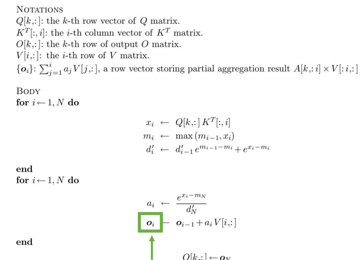

### Flash Attention

寻找 $o_i$ 的递推公式：

$$
\mathbf{o}'_i = \sum_{j=1}^{i} \frac{e^{x_j - m_i}}{d'_i} V[j,:]
$$

$$
= \left( \sum_{j=1}^{i-1} \frac{e^{x_j - m_i}}{d'_i} V[j,:] \right) + \frac{e^{x_i - m_i}}{d'_i} V[i,:]
$$

$$
= \left( \sum_{j=1}^{i-1} \frac{e^{x_j - m_{i-1}}}{d'_{i-1}} \frac{e^{x_j - m_i}}{e^{x_j - m_{i-1}}} \frac{d'_{i-1}}{d'_i} V[j,:] \right) + \frac{e^{x_i - m_i}}{d'_i} V[i,:]
$$

$$
= \left( \sum_{j=1}^{i-1} \frac{e^{x_j - m_{i-1}}}{d'_{i-1}} V[j,:] \right) \frac{d'_{i-1} e^{m_{i-1} - m_i}}{d'_i} + \frac{e^{x_i - m_i}}{d'_i} V[i,:]
$$

$$
= \mathbf{o}'_{i-1} \frac{d'_{i-1} e^{m_{i-1} - m_i}}{d'_i} + \frac{e^{x_i - m_i}}{d'_i} V[i,:]
$$

此时就得到`Flash Attention`的 **`one-pass` 迭代形式**

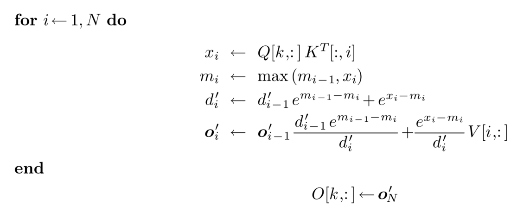

### Tiling Flash Attention

- 外层循环遍历 K 和 V 的列块（**一次 I/O 读**）
  - 这里 Flash Attention 2 会更改，因为每次 Q 计算下一次 KV 的时候，Q 的 L2 Cache 会被刷掉，影响效率
- 内存循环遍历 Q 的行块（**一次 I/O 读**）
  - 计算 $Q \cdot K^T$产生了一个 $B_r \times B_c$ 的小矩阵 $S_{ij}$。**它从不被写入 HBM**
  - 针对刚刚得到的 $S_{ij}$ 块，计算**这个块的**局部Softmax 统计量：
    - $\tilde{m}_{ij}$：$S_{ij}$ 这一块的**行最大值** (rowmax)。
    - $\tilde{P}_{ij}$：$S_{ij}$ 减去块最大值后的 $\exp$ 结果，即 $e^{S_{ij} - \tilde{m}_{ij}}$。
    - $\tilde{\ell}_{ij}$：$\tilde{P}_{ij}$ 的**行和** (rowsum)，即 $\sum e^{S_{ij} - \tilde{m}_{ij}}$。
  - 更新 $m_i^{new}$ 和 $l_i^{new}$
  - 更新输出 $O_i$ （**一次 I/O 写**）：$O_i \leftarrow \text{diag}(\ell_i^{new})^{-1} \left( \text{diag}(l_i)e^{m_i - m_i^{new}} O_i + e^{\tilde{m}_{ij} - m_i^{new}} \tilde{P}_{ij} V_j \right)$
    - $e^{m_i - m_i^{new}} O_i$：用缩放因子**修正**“历史”输出 $O_i$。
    - $e^{\tilde{m}_{ij} - m_i^{new}} \tilde{P}_{ij} V_j$：计算当前块的（未归一化的）输出，并用缩放因子修正它。
    - 两者相加，得到（未归一化的）新输出。
    - $\text{diag}(\ell_i^{new})^{-1}$：最后，除以新的全局分母 $\ell_i^{new}$，完成归一化。
  - **第二次 I/O 写：** 将更新后的 online 统计量 $\ell_i^{new}$ 和 $m_i^{new}$ 也写回 HBM，以便**下一个外循环**（$j+1$）可以使用它们。

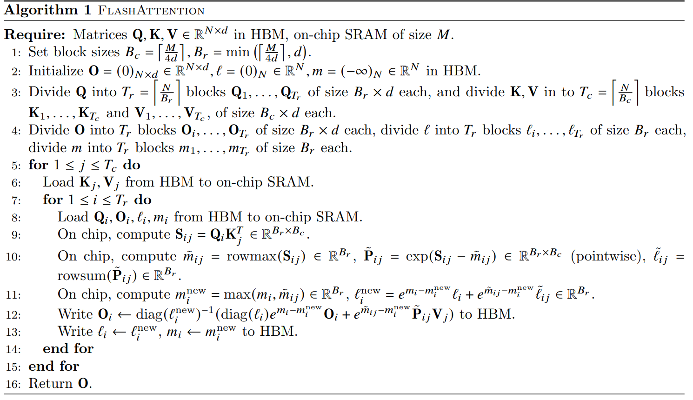

### Summary

- 我们只会读取 $(Q, K)$ 一次，我们实际上是分块计算，分块存储输出矩阵 $O$
- 我们从来不会获取完整的 $S$
- 我们也不会获取完整的 $ softmax(S)$

## Flash Attention V2

`Flash Attention 2` 比 `Flash Attention 1` 加速 `2x`, 计算效率达到GEMM性能的 `50~73%`，v2 相比于 v1 的优化主要有下面几点：

- **Parallelsim**：置换内外循环位置，同时增加 seq 维度的并行，不只是不同 batch/head 可以并行，不同 sequence tile 也可以并行
- **Work Partitioning Between Warps**： 优化 thread blocks 内部 warp 级别的工作模式，尽量减少 warp 间的通讯和读取 shared memory 的次数
- **Optimize non-matmul**：优化 Attention 部分thread blocks的并行化计算，新增 seq_len 维度的并行，使 SM 的利用率尽量打满。这其实也是内外循环置换这个总体思想配套的改进措施
- **Causal Masking**：Flash Attention 是块计算的，可以直接跳过 causal mask 的块

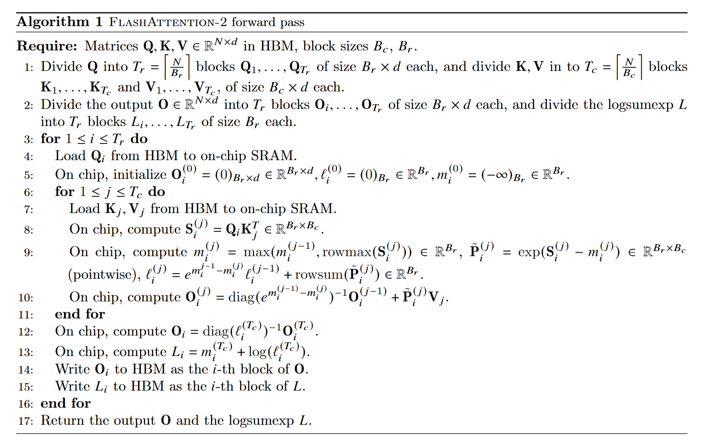

### Parallelism

FlashAttention 在 batch 和 heads 两个维度上进行了并行化：

- 使用**一个 thread block 来处理一个 attention head**，总共需要 thread block 的数量等于`batch size × number of heads`。每个 block 被调到到一个 SM 上运行，例如 A100 GPU 上有 108 个 SMs。当 block 数量很大时（例如 ≥80），这种调度方式是高效的，因为几乎可以有效利用 GPU 上所有计算资源。

#### 并行维度增加 Q 维度
但是在**处理长序列输入**时，由于内存限制，通常会减小 batch size 和 head 数量，这样并行化程度就降低了。因此，**FlashAttention-2 还在序列长度这一维度上进行并行化**，显著提升了计算速度。此外，当 batch size 和 head 数量较小时，在序列长度上增加并行性有助于提高 GPU 占用率。
- 不同 SM 计算同一个 Head 的不同 $Q$ 块时，互不干扰，因为它们最终贡献的是输出 $O$ 的不同行。这极大地提高了长序列训练时的 GPU 利用率（Occupancy）

#### 内外循环置换，Q 为外循环
`Flash Attention 2`  将 `Q` 当作外循环，`KV` 当作内循环， 将 `O[i]` 的在一个 `Q[i]` 周期算完，可以减少 SRAM -> HBM 的次数
- FA1 由于外层是 KV，每当处理一个新的 KV 块时，都需要更新所有的 Q 块对应的输出
- FA2 计算完所有的 KV 块后，该 Q 块对应的输出 $O$ 就彻底算完了。每个 Q 块对应的 $O$ 只需要在最后写入一次 HBM 
  - $O$从`O`的缓存`write/read`次数从`2 x B_q x B_kv -> 2 x B_q`次
  

### Work Partitioning Between Warps

在每个 thread block 内部，我们也需要决定如何在不同的 warp 之间分配工作。我们通常在每个 thread block 中使用 4 或 8 个 warp。

- FA1 在 Warp 级别通常是将 $Q$ 交给所有 Warp，但将 $K$ 和 $V$ 切分给不同的 Warp
  - v1 计算该块的 $O_i$ 时，每个 warp 算出了矩阵乘的部分结果($O_i$)，需要**先写入共享内存。然后再同步，并重新读取**，reduce 成一个。会有额外的共享内存读写开销，和不同 warp 同步的开销。
  > 需要把 partial 结果写到共享内存并做 `__syncthreads()` + read + reduce
- FA2 改变了策略：将 $Q$ 切分给不同的 Warp，但让每个 Warp 都能看到完整的 $K$ 和 $V$ 块（在当前 Block 的 Shared Memory 中）。
  - v2 对 $Q_i$ 分块，每个 warp 能得到矩阵乘的部分完整结果。可以直接写到共享内存中该结果的对应部分，不需要 warp 之间同步了。也不需要再像 v1 一样把部分和从共享内存读出来，写到最终结果
  > 所有的同步操作都在 warp 内就完成了，只有最后的 O 输出的时候将 4 个 warp 的结果 allgather 成完整的 O

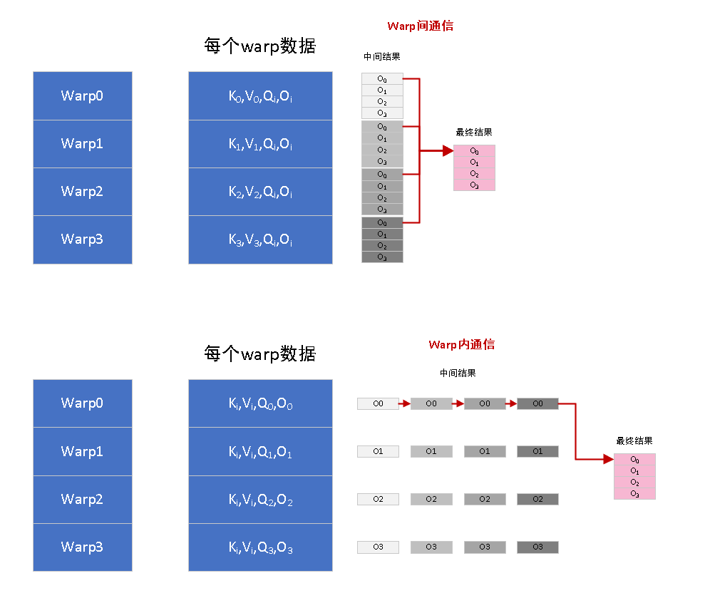

### Optimize non-matmul
在 GPU 上，尤其 Tensor Core 机器上：

- matmul 的吞吐非常高

- 但 exp/max/sum/rescale/mask/update 这些操作吞吐远低于 matmul

如果 kernel 里非 matmul 部分太多，就会出现：

> 理论 FLOPs 很大，但 Tensor Core 实际占比不高，整体效率拉不上去

#### FA1 问题
每处理一个新的 KV 块，FA1 都会更新 $m$，并根据新的 $m$ 对旧的输出 $O$ 进行重标定（Rescale）。$$O_{new} = \text{diag}(e^{m_{old} - m_{new}}) O_{old} + \dots$$这意味着在内层循环中，每一轮都要对 $O$ 进行一次昂贵的乘法缩放
$$
m_{\text{new}} = \max\left(m_{\text{old}},\, m_{\text{block}}\right)
$$

$$
l_{\text{new}} =
e^{\,m_{\text{old}} - m_{\text{new}}} \, l_{\text{old}}
+
\sum e^{\,s_{\text{block}} - m_{\text{new}}}
$$

$$
O_{\text{new}} =
\frac{
e^{\,m_{\text{old}} - m_{\text{new}}} \, l_{\text{old}}
}{
l_{\text{new}}
} O_{\text{old}}
+
\frac{
e^{\,s_{\text{block}} - m_{\text{new}}}
}{
l_{\text{new}}
} V_{\text{block}}
$$
- 旧的输出 O_old 需要按比例 rescale

- 每一步都涉及除法、乘法、逐元素更新

- 这些都不是高吞吐 matmul

#### FA2 优化
FA2 的一个关键技巧就是：

> 不在每一步都维护“已经除以 $\ell$ 的规范化输出，而是维护未归一化的累计输出 $\tilde{O}$，

1. 在计算局部 attention 时，先不考虑 softmax 的分母 $\sum e^{x_i}$，即   $\ell^{(i+1)} = e^{m^{(i)}-m^{(i+1)}} \ell^{(i)} + \text{rowsum}( e^{S^{(i+1)}-m^{(i+1)}} )$，例如计算 $\mathbf{O}^{(1)}$ 时去除了   $\text{diag}\left(\ell^{(1)}\right)^{-1}$

   **FlashAttention:**

   $$
   \mathbf{O}^{(1)} = \tilde{\mathbf{P}}^{(1)} \mathbf{V}^{(1)} = \text{diag}\left(\ell^{(1)}\right)^{-1} e^{S^{(1)}-m^{(1)}} \mathbf{V}^{(1)}
   $$

   **FlashAttention-2:**

   $$
   \tilde{\mathbf{O}}^{(1)} = e^{S^{(1)}-m^{(1)}} \mathbf{V}^{(1)}
   $$

2. 由于去除了 $\text{diag}\left(\ell^{(i)}\right)^{-1}$，更新 $\tilde{\mathbf{O}}^{(i+1)}$ 时不需要 rescale $\ell^{(i)} / \ell^{(i+1)}$，但是得弥补之前局部 max 值，例如示例中：

   **FlashAttention:**

   $$
   \mathbf{O}^{(2)} = \text{diag}\left(\ell^{(1)} / \ell^{(2)}\right)\mathbf{O}^{(1)} + \text{diag}\left(\ell^{(2)}\right)^{-1} e^{S^{(2)}-m^{(2)}} \mathbf{V}^{(2)}
   $$

   **FlashAttention-2:**

   $$
   \tilde{\mathbf{O}}^{(2)} = \text{diag}\left(e^{m^{(1)}-m^{(2)}}\right) \tilde{\mathbf{O}}^{(1)} + e^{S^{(2)}-m^{(2)}} \mathbf{V}^{(2)} = e^{S^{(1)}-m^{(2)}} \mathbf{V}^{(1)} + e^{S^{(2)}-m^{(2)}} \mathbf{V}^{(2)}
   $$

3. 由于更新 $\tilde{\mathbf{O}}^{(i+1)}$ 未进行归一化，最后一步时需要将 $\tilde{\mathbf{O}}^{(\text{last})}$ 乘以 $\text{diag}\left(\ell^{(\text{last})}\right)^{-1}$ 来得到归一化后正确的输出，例如示例中：

   $$
   \mathbf{O} = \text{diag}\left(\ell^{(2)}\right)^{-1} \tilde{\mathbf{O}}^{(2)}
   $$

### 详细流程
对于固定的 $i, j$，先和 FA1 一样计算：

$$
  S_{ij} = Q_i K_j^T
$$

$$
  \widetilde m_{ij} = \operatorname{rowmax}(S_{ij})
$$

$$
  \widetilde P_{ij} = \exp(S_{ij} - \widetilde m_{ij})
$$

$$
  \widetilde \ell_{ij} = \operatorname{rowsum}(\widetilde P_{ij})
$$

然后更新 running max：

$$
  m_i^{\mathrm{new}} = \max(m_i, \widetilde m_{ij})
$$

更新分母：

$$
  \ell_i^{\mathrm{new}}=
 e^{m_i - m_i^{\mathrm{new}}} \ell_i
  +
  \widetilde \ell_{ij}
$$

FA2 的关键是输出不直接写成归一化形式，而是写成：

$$
  \widetilde O_i^{\mathrm{new}} =
  e^{m_i - m_i^{\mathrm{new}}} \widetilde O_i
  +
  \widetilde P_{ij} V_j
$$

最后如果要真正得到规范化输出，再做：

$$
  O_i^{\mathrm{new}} =
  \operatorname{diag}(\ell_i^{\mathrm{new}})^{-1}
  \widetilde O_i^{\mathrm{new}}
$$

### 忽略 mask block 的 Attention 计算

- 由于 FlashAttention 和 FlashAttention-2 已经通过块操作来实现，**对于所有列索引都大于行索引的块（大约占总块数的一半），我们可以跳过该块的计算**。这比没有应用因果掩码的注意力计算速度提高了 1.7-1.8 倍。
- 不需要对那些行索引严格小于列索引的块应用因果掩码。这意味着对于每一行，我们只需要对 1 个块应用因果掩码。

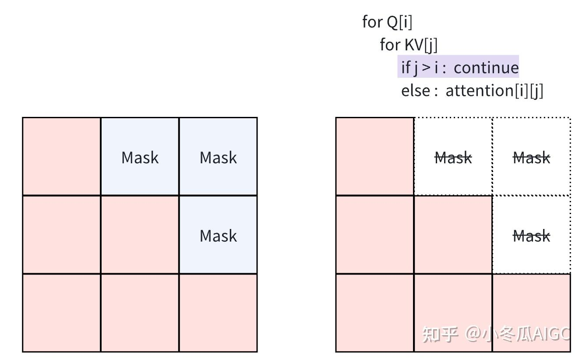

## Flash Attention V3
使用 Hopper 架构的硬件特性（如 TMA 和 Warp-specialization）来实现更高效的并行化和重叠计算，进一步提升性能。

### TMA and Warp-specialization
- 通过将底层执行域在物理 Warp 级别进行彻底拆分，由专用的 Producer Warps 专门负责调度毫无计算逻辑的单纯内存搬运（TMA 硬件在背后默默执行，彻底隐藏并消灭了传统的 Long Scoreboard 停顿）
- 同时由另一批独立的 Consumer Warps 纯粹利用 Tensor Cores 进行并发矩阵乘运算。
 Inter-warpgroup overlapping with pingpong scheduling (曲速组间的乒乓调度重叠)
- 默认情况（什么都不做）： GPU 的硬件调度器本身就很聪明。如果某个 Warp 在等内存数据，调度器会自动切换到另一个准备好的 Warp。这能提供一定的免费重叠。
- 手动优化（乒乓调度）： 仅仅依赖硬件是不够的。开发者手动将任务分配给两个 Warp 组（Warpgroup 1 和 Warpgroup 2），并使用同步屏障（bar.sync） 强制它们按特定的节奏交替工作。
  - 第一拍： Warpgroup 1 使用张量核心疯狂计算 GEMM；此时，Warpgroup 2 使用常规核心计算上一轮的 Softmax。
  - 第二拍： Warpgroup 1 算完了 GEMM，开始用常规核心算 Softmax；此时，Warpgroup 2 接管张量核心，开始算它的 GEMM。
#### 同步方式(mbarrier)
- 利用 NamedBarrier（底层对应 PTX 指令 mbarrier） 允许开发者在 Shared Memory 中定义一个轻量级的、针对特定线程子集的硬件同步屏障。它完全打破了 __syncthreads() 的全局限制。
  - 实际上是异步事务限制
  - Arrive（到达）： 线程干完自己的活，告诉 Barrier “我这部分完事了”，然后不阻塞，可以继续去干别的无需同步的活。
  - Wait（等待）： 线程真正需要依赖别人数据的时候，才调用 Wait 阻塞自己，直到所有被期望的线程都 Arrive。
- 初始状态： WG0 负责算当前块的矩阵乘（GEMM），WG1 负责算上一个块的 Softmax 和数据转换。
  第一拍（交接）：
  - WG1 算完了 Softmax，调用 warp_scheduler_barrier_arrive()，告诉屏障：“我的资源（比如 Shared Memory 或寄存器里的某块空间）释放了”。
  - WG0 在准备开启下一轮软流水之前，调用 warp_scheduler_barrier_sync()，它会在这里阻塞，直到确认 WG1 已经把资源腾出来了。
  第二拍（角色互换）：
  - WG0 冲破屏障后，立刻接管原本属于 WG1 的资源，开始它的下一轮任务。
  - 此时，通过精密的循环展开和 ID 取模计算，WG0 和 WG1 的角色会在逻辑上互换。
### Intra-warpgroup overlapping of GEMM and Softmax
核心思路： 哪怕是在同一个 Warp 组内部，我们也不等当前的 GEMM 完全算完再算 Softmax。我们可以采用软件流水线Software Pipelining 的技术，让同一个 Warp 组在执行当前循环的 GEMM 指令的间隙，穿插执行上一个循环的 Softmax 指令。
- Hopper 架构的矩阵乘指令（wgmma.mma_async）是完全异步的。 当你用 C++ 触发 flash::gemm 时，GPU 只是把这个巨大的矩阵乘任务扔给了后端的 Tensor Cores，然后马上执行下一条指令，绝对不等待计算结果
- SIMT 利用 CUDA Core 计算上一轮的 softmax
- 用到刚才异步发射的 wgmma 的结果来进行下一步时，调用 warpgroup_wait<0>() 等待 wgmma 完成
代价（Tradeoff）—— 寄存器压力（Register Pressure）：
- 这是这种技术最大的难点。GPU 线程的计算必须依赖寄存器（Registers）（最快但容量极小的存储器）。
- 如果要在同一个 Warp 组内同时推进 GEMM 和 Softmax，你就必须同时把 GEMM 的累加结果（Accumulators）和 Softmax 的输入/输出数据都保存在寄存器里。
- 如果寄存器不够用，数据就会“溢出（Spill）”到慢速内存中，导致性能暴跌。

## Flash Decoding

Flash-Decoding 分 3 个步骤进行：

1. 首先，我们将键/值拆分成更小的块。
2. 我们使用 FlashAttention 并行计算每个分割后的查询注意力值$o_i$。此外，我们还为每行和每个分割写入一个额外的标量：注意力值的对数和指数。
3. 最后，我们通过对所有分割进行归约来计算实际输出，使用对数求和指数来缩放每个分割的贡献。

这一切之所以可行，是因为注意力/softmax 可以迭代计算。在 Flash-Decoding 中，它被用于两个层面：在 splits 内（类似于 FlashAttention），以及跨 splits 进行最终的 reduce。
### 第一层：split 内部的 FlashAttention reduce

对于某个 split，仍然按 FlashAttention 的方式在 tile 级别递推。

对于当前 tile $t$，有局部最大值 $m_t$、局部分母 $l_t$、局部输出 $o_t$。  
跨 tile 时维护全局状态：

$$
m_{\text{new}} = \max(m_{\text{old}}, m_t)
$$

$$
l_{\text{new}} =
e^{m_{\text{old}} - m_{\text{new}}} l_{\text{old}}
+
 l_t
$$

$$
o_{\text{new}} =e^{m_{\text{old}} - m_{\text{new}}} o_{\text{old}}
+
l_t
$$

最后得到这个 split 的：

- 局部输出 $o^{(m)} = o_{\text{new}} / l_{\text{new}}$
- 局部 logsumexp

$$
\ell^{(m)} = m^{(m)} + \log l^{(m)}
$$

---

### 第二层：split 之间的 combine reduce

再把所有 split 的 $(o^{(m)}, \ell^{(m)})$ 做同样风格的归并。

先定义：

$$
m^\star = \max_m \ell^{(m)}
$$

则总的 logsumexp 为：

$$
L = m^\star + \log \sum_m e^{\ell^{(m)} - m^\star}
$$

最终输出为：

$$
O = \sum_m e^{\ell^{(m)} - L} \, o^{(m)}
$$

