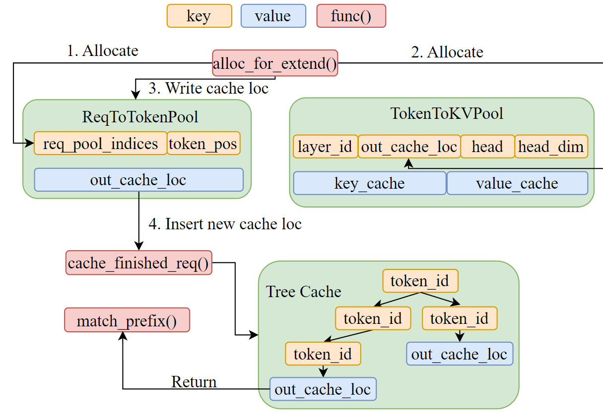

# SGLang 的 KV Cache

实际上 SGLang 的 Cache 管理由三个组件构成 `tree_cache` 、 `req_to_token_pool` 和 `token_to_kv_pool_allocator` 。

- `tree_cache` 充当协调层 ，位于两个内存池之上。

- `req_to_token_pool` 存储了从请求到令牌位置的逻辑映射

- `token_to_kv_pool_allocator` 管理 KV 缓存槽的物理分配

`tree_cache` 通过 `match_prefix()` 返回现有的 KV 索引(`out_cache_loc`)，从而实现前缀重用 ，避免了重新计算和重新分配。
`tree_cache` 通过 `cache_finished_req()` 或者 `cache_unfinished_req()`(chunked prefill 使用) 来重新插入`prefix + new allocate` 的 `cache_loc`，然后释放冗余的 kv cache。



## 组件详解

### req_to_token_pool

这是从请求到其令牌的键值缓存索引的映射。这就是我们在注意力后端图中提到的 `req_to_token` 。

- 形状：最大允许请求数（由参数 `max-running-requests` 设置，用于指定可同时运行的最大请求数）\* 每个请求的最大上下文长度（由配置 model_config.context_len 设置）
- 访问：

  - Dim0： `req_pool_indices` 标识具体请求
  - Dim1：请求中标记的位置（从 0、1、2… 开始），用于标识请求中的特定标记。
  - Value: `out_cache_loc` ，表示令牌指向由 Dim0 和 Dim1 标识的与该令牌关联的 KV 缓存索引。

### token_to_kv_pool

`req_to_token_pool` 维护了 Request 到 token KV 缓存索引的映射关系， `token_to_kv_pool` 进一步将 token 从其 KV 缓存索引映射到其实际的 KV 缓存数据。需要注意的是，对于不同的注意力机制实现，例如 MHA 、 MLA 、 Double Sparsity，`token_to_kv_pool` 可能具有不同的实现方式。

- Layout: Number of Layers _ Max Allowed Tokens Number _ Number of Head \* Head Dimension
- 访问：
  - Dim0：`layer_id` 标识特定图层
  - Dim1：`out_cache_loc` 标识特定的 KV 缓存索引（空闲槽位）
  - Dim2：`head`
  - Dim3：`head_dim`
  - Value: k_buffer 的值为 cache_k ，v_buffer 的值为 cache_v ，表示实际的键值缓存数据。

请注意，我们通常会一次性检索整个层的 KV 缓存，因为我们**需要请求中所有先前 token 的 KV 才能进行 forward**。

### 示例

让我们举一个直观的例子来说明 req_to_token_pool 是什么样子：

1. 假设我们有 2 个请求，每个请求有 7 个令牌。

2. 那么 req_to_token_pool 是一个形状为 (2, 7) 的张量，其中每个条目将请求中的一个标记映射到其对应的 KV 缓存索引。

```python
req_to_token_pool = [
    [1, 2, 3, 4, 5, 6, 7],
    [8, 9, 10, 11, 12, 13, 14]
]
```

`seq_lens` is [7, 7]

3. 执行一次 forward_extend 操作，向每个请求添加新令牌后， req_to_token_pool 将被更新为：

```python
req_to_token_pool = [
    [1, 2, 3, 4, 5, 6, 7, 15],
    [8, 9, 10, 11, 12, 13, 14, 16]
]
```

`seq_lens` is [8, 8]

4. 如果第一个请求已完成，并且我们对第二个请求运行另一个解码，则 req_to_token_pool 将被更新为：

```python
req_to_token_pool = [
    [1, 2, 3, 4, 5, 6, 7, 15],
    [8, 9, 10, 11, 12, 13, 14, 16, 17]
]
```

`seq_lens` is [8, 9].

## 模型推理中的 KV Cache 管理流程

这里为了简化提取关键流程，我们假设设置 `page_size=1` ，即逐 token 精确匹配。

1. Step 1: Prefix Matching

   - 当有新请求到达时， `tree_cache.match_prefix()` 方法会遍历基数树以找到最长的缓存前缀
   - `match_prefix()` 函数返回 `prefix_indices` （键值缓存位置张量）和 `last_node` （表示匹配前缀的树节点）。这些 `prefix_indices` 直接指向可重用的物理键值缓存槽位。

2. Step 2: Memory Allocation

   - 为批次分配键值缓存时，系统会使用树缓存中已缓存的`prefix_indices`，并且仅为未缓存的标记分配新的缓存

   ```python
   # prefix reuse: 从树缓存中检索缓存的键值索引
   prefix_tensors = [r.prefix_indices for r in batch.reqs]
   # req_to_token_pool alloc: allocates slots for new tokens
   req_pool_indices = alloc_req_slots(batch.req_to_token_pool, ...)
   # token_to_kv_pool alloc: kv cache allocation for new tokens
   out_cache_loc = alloc_token_slots(batch.tree_cache, ...)
   # mapping: writes both cached and new indices to req_to_token_pool
   write_cache_indices(...)
   ```

3. Step 3: Cache Insertion

   - 计算完成后，新的键值缓存通过 `cache_finished_req()` 或者 `cache_unfinished_req()`被插入回树缓存中，插入过程中，树缓存：
     - 识别树中已存在的重复前缀（返回 new_prefix_len ）
     - 通过 `token_to_kv_pool_allocator.free()` 释放重复的 KV 索引
     - 使用新节点更新 radix tree
     - 增加/减少锁引用以保护缓存节点免受驱逐
