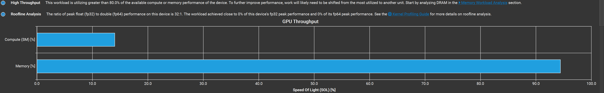

---

title: 一步步实现 CUDA Vector Add 优化
created: 2025-10-21
tags:

- LLMInference

---

# 一步步实现 CUDA Vector Add 优化

📚 本文将从最基础的 vector add 实现开始，使用 nsight compute 工具进行性能分析寻找瓶颈并一步步进行优化。通过这种方式来学习 CUDA 的编程和优化。

## Prerequisite

### Arithmetic Intensity(AI)

算术强度是衡量一个计算任务（如 CUDA Kernel）是“计算密集型”还是“访存密集型”的核心指标。

**1. 定义：** 它被定义为“总共执行的浮点计算操作次数”与“总共传输的数据字节数”之间的比率。

- **`AI = (总计算操作数) / (总访存字节数)`**
- **单位：** `FLOPs/Byte` (即，每传输一个字节的数据，能对应执行多少次浮点计算)

**2. 为什么它如此重要？** AI 决定了一个程序**理论上的性能瓶颈**。我们可以用它来对比一个程序和一个硬件（GPU）的特性：

- **硬件的“AI”**：GPU 也有一个平衡点，即它的 `峰值计算能力 (GFLOPs/s)` / \`峰值内存带宽 (GB/s)
- **程序的 AI**：内核的 `FLOPs / Bytes`。

### Roofline

Roofline 模型（屋顶线模型）是一种用来**分析程序性能瓶颈**（计算受限还是带宽受限）的方法。\
它把**计算性能**（FLOPs/s）和**访存性能**（Bytes/s）联系在一起，。以可视化的方式展示性能上限

$$
Achievable FLOPs=min(AI×Memory BW,Peak FLOPs)
$$


### Stall in NCU

| 类型                     | 代表等待           | 典型瓶颈 | 优化方向           |
| ------------------------ | ------------------ | -------- | ------------------ |
| **All Scoreboard**       | 所有依赖未满足     | 完全等待 | 提高并发、异步访问 |
| **Long Scoreboard**      | DRAM 访问未返回    | 内存延迟 | 优化访存、共享内存 |
| **Short Scoreboard**     | L1/寄存器依赖      | 数据依赖 | 调整指令顺序       |
| **Execution Dependency** | 算术指令结果未就绪 | 运算链长 | 增加 ILP           |
| **Barrier/Branch**       | 同步或分支等待     | 控制流   | 减少分支/同步      |

## baseline

```cpp
// FP32
// ElementWise Add grid(N/256),
// block(256) a: Nx1, b: Nx1, c: Nx1, c = elementwise_add(a, b)
__global__ void vector_add_kernel(const float *a, const float *b, float *c,
                                  int n) {
  int idx = blockIdx.x * blockDim.x + threadIdx.x;
  if (idx < n) {
    c[idx] = a[idx] + b[idx];
  }
}
```

### 分析

该版本的 vector add，执行一次计算需要三次访存，每次读 4 bytes (read A, read B, write C)

$$
AI = 1 / (3 \\times 4) =1/12\\approx 0.083
$$

说明这是一个 **memory-bound** 的程序

- 查看 ncu 的 SLO 我们可以看到，确实内存达到峰值性能的 90% 以上



- 查看 Memory Workload Analysis，我们可以发现我们完全没有用到 shared memory，直接用 L2 Cache 和 L1 Cache


- Kernel 的主要瓶颈是 **`Stall Long Scoreboard`**——即**内存延迟停顿**。GPU 隐藏这种“等待”的唯一机制，就是 **Occupancy (占用率)**

## Optimization V1 -- vectorized access

### 优化

- 矢量化内存访问：我们不再一次读取一个 float，而是同时取 4 个 float，**一个 wrap 里面的所有线程同时获取 4 float，可以变为 LDG.128 一次性获取 128 bit 数据**
- :warning: 这里有个 trade-off，如果我们每个 thread 使用了过多的寄存器，那么 SM 上活跃的 Warp 会变少，导致 Occupany 会下降，这同样对性能影响很大

```cpp
// ElementWise Add + Vec4
// grid(N/256), block(256/4)
// a: Nx1, b: Nx1, c: Nx1, c = elementwise_add(a, b)
__global__ void vector_add_kernel_vec4(const float *a, const float *b, float *c,
                                       int n) {
  int idx = (blockIdx.x * blockDim.x + threadIdx.x) * 4;
  if (idx < n) {
    float4 a_vec = FLOAT4(a); // registers
    float4 b_vec = FLOAT4(b);
    float4 c_vec;
    c_vec.x = a_vec.x + b_vec.x;
    c_vec.y = a_vec.y + b_vec.y;
    c_vec.z = a_vec.z + b_vec.z;
    c_vec.w = a_vec.w + b_vec.w;
    FLOAT4(c[idx]) = c_vec;
  }
}
```

### 分析

- 通过这种优化后，我们已经将内存合并访问，Memory 的效率已经提升了，但是 Compute 效率还是很低

- **时间几乎相同**：21.66 μs → 21.25 μs。

- **内存带宽利用率都高 (~96%)**：说明两者都被 **memory-bound** 限制，而非算力瓶颈。

- **Compute Throughput** 反而下降（14% → 3.6%），因为相同的数据量下，`float4` 版本需要更少的指令，因此算术部分相对占比变小。

- ：向量化访问 (`float4`) 优化了访存效率（一次读取 4 个 float），**但总内存带宽已接近饱和，所以性能提升有限。**

  

## Optimization V2 -- fp16 compute

### 优化

- 在 30 系及以上显卡，对 fp16 和 fp32 的计算几乎无差别，都使用相同的 ALU 进行计算，但是 fp16 每次存取比 fp32 少一般的内存，所以**可以节省内存带宽**，从而大幅提高效率
- FP16 计算：我们使用的是 RTX Titan，该显卡 fp16 的计算 FLOPS 是 fp32 的 2 倍左右

```cpp
// FP16
// ElementWise Add grid(N/256),
// block(256) a: Nx1, b: Nx1, c: Nx1, c = elementwise_add(a, b)
__global__ void elementwise_add_f16_kernel(half *a, half *b, half *c, int N) {
  int idx = blockIdx.x * blockDim.x + threadIdx.x;
  if (idx < N)
    c[idx] = __hadd(a[idx], b[idx]);
}
```

### 分析

$$
AI = \frac{1 FLOPs}{2 * 3 Bytes} = 1/6 \approx 0.17 FLOPs /Byte
$$

:warning: **fp16 计算的精度会比 fp32 低很多**，需要考虑应用的场景是否可以接受，测试发现基本精度在 0.2 以下

- **Memory Throughput 下降 (96%→71%)**：FP16 数据量只有 float 的一半，显存传输压力小。
- **Compute Throughput 上升 (14%→22%)**：虽然数据变小，但 ALU 对 FP16 处理更快（部分架构可双发射或更高密度处理）。

## Optimization V3 -- fp16 + more compute per thread

### 优化

- `half2` 双打包一次访问两倍数据量
  - 节省了内存带宽
  - 摊销算术成本

```cpp
__global__ void elementwise_add_f16x2_kernel(half *a, half *b, half *c, int N) {
  int idx = 2 * (blockIdx.x * blockDim.x + threadIdx.x);
  if (idx < N) {
    half2 reg_a = HALF2(a[idx]);
    half2 reg_b = HALF2(b[idx]);
    half2 reg_c;
    reg_c.x = __hadd(reg_a.x, reg_b.x);
    reg_c.y = __hadd(reg_a.y, reg_b.y);
    HALF2(c[idx]) = reg_c;
  }
}
```

### 分析

$$
AI = \frac{2*(_hadd) FLOPs}{4 * 3 Bytes} = 1/6 \approx 0.17 FLOPs /Byte
$$

- **执行时间继续下降**：13.41 μs → 11.17 μs
- **Memory Throughput 恢复上升 (71%→87%)**：`half2` 双打包一次访问两倍数据量，访问效率提升。
- **Compute Throughput 略降 (22%→14%)**：算术负载被摊薄（计算量少，但访存更快）。

## Optimization V4 -- fp16 + more compute per thread + memory alignment

### 优化

- 内存对齐 128 bit，可以矢量化访问内存，减少指令数
- 每个线程一次处理 8 个 half（即 4 次 `__hadd2`），加上 `#pragma unroll` → 展开循环，避免分支开销

| 优化维度         | 普通版本（\_\_hadd）    | 优化版（\_\_hadd2 + pack） | 性能效果                   |
| ---------------- | ----------------------- | -------------------------- | -------------------------- |
| **计算模式**     | 每次算 1 个 half        | 每次算 2 个 half           | ✅ 计算吞吐提升约 2×       |
| **寄存器利用率** | 较分散，指令依赖多      | 更连续，指令复用率高       | ✅ 提高 ILP、减少 stall    |
| **warp 效率**    | 访存指令多，warp 常等待 | warp 内访存对齐一致        | ✅ warp active cycles 更高 |

```cpp
__global__ void elementwise_add_f16x8_pack_kernel(half *a, half *b, half *c, int N) {
  int idx = 8 * (blockIdx.x * blockDim.x + threadIdx.x);
  // temporary register(memory), .local space in ptx, addressable
  half pack_a[8], pack_b[8], pack_c[8]; // 8x16 bits=128 bits.
  // reinterpret as float4 and load 128 bits in 1 memory issue.
  LDST128BITS(pack_a[0]) = LDST128BITS(a[idx]); // load 128 bits
  LDST128BITS(pack_b[0]) = LDST128BITS(b[idx]); // load 128 bits
#pragma unroll
  for (int i = 0; i < 8; i += 2) {
    // __hadd2 for half2 x 4
    HALF2(pack_c[i]) = __hadd2(HALF2(pack_a[i]), HALF2(pack_b[i]));
  }
  // reinterpret as float4 and store 128 bits in 1 memory issue.
  if ((idx + 7) < N) {
    LDST128BITS(c[idx]) = LDST128BITS(pack_c[0]);
  } else {
    for (int i = 0; idx + i < N; i++) {
      c[idx + i] = __hadd(a[idx + i], b[idx + i]);
    }
  }
}
```

### 分析

$$
AI = \frac{4*(_hadd2) FLOPs}{16 * 3 Bytes} = 1/6 \approx 0.17 FLOPs /Byte
$$

- 一次加载 128 bit 数据，减少内存事务数量，节省时间
- 单个线程的工作量提升
- 实际 benchmark 和 profile 发现，在 RTX Titan 显卡上，对于 1M 大小的数据这个算子的实际 Occupancy 比 `fp16x2` 算子更少，加速效果略不明显

## Summary

vector add 算子是一个典型的 memory-bound 的算子，我们需要尽可能节省内存带宽并提高计算效率。

> 下面我们使用 benchmark 测试所有算子的开销，观察和我们的分析哪里不同

### 洞察 1：问题规模 vs. 启动开销 (Kernel Launch Overhead)

这个测试完美地展示了为什么 GPU 不适合处理“小任务”。

- 在 1K (N=1024) 时

  - CPU Time: **0.0030 ms**

  - GPU (最快): **0.0078 ms**

  - **原因：** 调用一个 CUDA 内核（`__global__ void`）本身就有**固定的开销**（`Kernel Launch Overhead`），这个开销通常需要几个微秒 (microseconds)。对于 1K 这样的小问题，GPU 实际执行计算的时间（可能只有 1-2 微秒）远小于启动它所花费的时间（5-6 微秒）。CPU 直接在本地执行循环，没有任何启动开销，所以更快。

- 在 1M (N=1048576) 时

  - CPU Time: **3.0058 ms**
  - GPU (最快): **0.0132 ms** (即 `GPU FP16 x2` 版本)
  - **原因：** 当问题规模变得足够大时，**大规模并行（Massive Parallelism）**的优势开始显现。启动内核的 5-6 微秒开销在总共 13.2 微秒的执行时间中变得微不足道。此时，GPU 的**巨大内存带宽**（`GPU FP16 x2` 达到了 **475.7 GB/s**）彻底击败了 CPU 的内存带宽（被限制在 **4.2 GB/s**）。

______________________________________________________________________

### 洞察 2：内存带宽是瓶颈 (Memory-Bound)

逐元素加法（Vector Addition）是一个经典的\*\*内存带宽受限（Memory-Bound）\*\*问题，它的计算密集度 (AI) 极低。这意味着性能的瓶颈是\*\*你能多快地从显存中读取 a 和 b，并写回 c。

这个测试结果清楚地证明了这一点：

-  FP32 vs. FP16 (在 1M 数据集)

  - `GPU Standard` (FP32): 0.0250 ms

  - `GPU FP16 Std`: 0.0163 ms

- **原因：** FP32 内核需要移动的数据量是 $1M \times (4+4+4) = 12 \text{ MB}$。而 FP16 内核只需要移动 $1M \times (2+2+2) = 6 \text{ MB}$。

- **数据量减半，性能几乎翻倍**（`0.0250 / 0.0163 = 1.53x` 加速）。这证实了瓶颈在内存，而不是计算。

______________________________________________________________________

### 洞察 3：baseline 实现在较小的问题规模下已足够好

- 在数据小于 64K 大小的情况下，baseline 是最优的方法

```shell
========== Testing 1K (N=1024) ==========
--- Speedup Analysis ---
Standard vs Vec4:       0.98x
Standard vs FP16:       0.98x
Standard vs FP16x2:     0.97x
Standard vs FP16x8:     0.95x
Standard vs FP16x8_pack:  0.99x

========== Testing 4K (N=4096) ==========
--- Speedup Analysis ---
Standard vs Vec4:       1.02x
Standard vs FP16:       0.78x
Standard vs FP16x2:     0.79x
Standard vs FP16x8:     0.75x
Standard vs FP16x8_pack:  0.76x

========== Testing 16K (N=16384) ==========
--- Speedup Analysis ---
Standard vs Vec4:       1.00x
Standard vs FP16:       0.99x
Standard vs FP16x2:     0.99x
Standard vs FP16x8:     0.87x
Standard vs FP16x8_pack:  0.91x


========== Testing 64K (N=65536) ==========
--- Speedup Analysis ---
Standard vs Vec4:       0.96x
Standard vs FP16:       0.98x
Standard vs FP16x2:     1.00x
Standard vs FP16x8:     0.92x
Standard vs FP16x8_pack:  0.88x
```

### 洞察 4：1M 数据测试下 `FP16 x2` 是最佳的 "工作粒度"

在最大的 1M 测试中，我们看 FP16 的各种实现：

1. **`GPU FP16 x2`**: **0.0132 ms** (🏆)
2. `GPU FP16 x8_pack`: 0.0158 ms
3. `GPU FP16 x8`: 0.0161 ms
4. `GPU FP16 Std`: 0.0163 ms

- **`FP16 Std` (1 线程/1 元素)** 是最慢的，因为它最朴素，每个线程只做了最少的工作，调度的开销相对最大。
- **`FP16 x8` 和 `x8_pack` (1 线程/8 元素)** 表现更好，因为它们让每个线程做了更多工作，减少了总的调度开销并使用了向量化指令（如 Nsight 分析所示）。
- **`FP16 x2` 为什么更优？**
  - `FP16 x2` 内核使用了 `half2` 数据类型进行加载。而 `x8_pack` 使用的是 128-bit (`float4`) 操作。
  - 在这个特定的测试中，**`half2` 达到了“工作粒度”和“硬件亲和性”的 sweet spot**。它比 `x8_pack` 更简单，需要更少的寄存器(`x8_pack` 需要 22 个，而 `x2`只需要 16 个)，**实际占用率 (Achieved Occupancy)更高**。

## 附录

```shell
Vector Addition Performance Test
================================

========== Testing 1K (N=1024) ==========
Mismatch at index 2: 2.39844 != 2.4 (error: 0.0015626)
Correctness: FAIL (Max error: 0.037506)
Array Size: 1024 elements (0.00 GB)

--- Execution Times (Kernel Only) ---
CPU Time:           0.0030 ms (Bandwidth:    4.1 GB/s)
GPU Standard:       0.0078 ms (Bandwidth:    1.6 GB/s)
GPU Vec4:           0.0079 ms (Bandwidth:    1.5 GB/s)
GPU FP16 Std:       0.0079 ms (Bandwidth:    0.8 GB/s)
GPU FP16 x2:        0.0080 ms (Bandwidth:    0.8 GB/s)
GPU FP16 x8:        0.0082 ms (Bandwidth:    0.8 GB/s)
GPU FP16 x8_pack:   0.0078 ms (Bandwidth:    0.8 GB/s)

--- Speedup Analysis ---
CPU vs GPU Standard:    0.39x
CPU vs GPU Vec4:        0.38x
CPU vs GPU FP16:        0.38x
CPU vs GPU FP16x2:      0.38x
CPU vs GPU FP16x8:      0.37x
CPU vs GPU FP16x8_pack:  0.39x
Standard vs Vec4:       0.98x
Standard vs FP16:       0.98x
Standard vs FP16x2:     0.97x
Standard vs FP16x8:     0.95x
Standard vs FP16x8_pack:  0.99x
FP16 vs FP16x2:         0.99x
FP16x2 vs FP16x8:       0.98x
FP16x8 vs FP16x8_pack:  1.05x

========== Testing 4K (N=4096) ==========
Mismatch at index 0: 9.60156 != 9.6 (error: 0.00156212)
Correctness: FAIL (Max error: 0.037506)
Array Size: 4096 elements (0.00 GB)

--- Execution Times (Kernel Only) ---
CPU Time:           0.0120 ms (Bandwidth:    4.1 GB/s)
GPU Standard:       0.0060 ms (Bandwidth:    8.1 GB/s)
GPU Vec4:           0.0059 ms (Bandwidth:    8.3 GB/s)
GPU FP16 Std:       0.0077 ms (Bandwidth:    3.2 GB/s)
GPU FP16 x2:        0.0077 ms (Bandwidth:    3.2 GB/s)
GPU FP16 x8:        0.0081 ms (Bandwidth:    3.0 GB/s)
GPU FP16 x8_pack:   0.0080 ms (Bandwidth:    3.1 GB/s)

--- Speedup Analysis ---
CPU vs GPU Standard:    1.98x
CPU vs GPU Vec4:        2.01x
CPU vs GPU FP16:        1.55x
CPU vs GPU FP16x2:      1.56x
CPU vs GPU FP16x8:      1.48x
CPU vs GPU FP16x8_pack:  1.50x
Standard vs Vec4:       1.02x
Standard vs FP16:       0.78x
Standard vs FP16x2:     0.79x
Standard vs FP16x8:     0.75x
Standard vs FP16x8_pack:  0.76x
FP16 vs FP16x2:         1.01x
FP16x2 vs FP16x8:       0.95x
FP16x8 vs FP16x8_pack:  1.01x

========== Testing 16K (N=16384) ==========
Mismatch at index 0: 38.4062 != 38.4 (error: 0.00624847)
Correctness: FAIL (Max error: 0.100006)
Array Size: 16384 elements (0.00 GB)

--- Execution Times (Kernel Only) ---
CPU Time:           0.0472 ms (Bandwidth:    4.2 GB/s)
GPU Standard:       0.0044 ms (Bandwidth:   45.1 GB/s)
GPU Vec4:           0.0044 ms (Bandwidth:   45.1 GB/s)
GPU FP16 Std:       0.0044 ms (Bandwidth:   22.4 GB/s)
GPU FP16 x2:        0.0044 ms (Bandwidth:   22.4 GB/s)
GPU FP16 x8:        0.0050 ms (Bandwidth:   19.5 GB/s)
GPU FP16 x8_pack:   0.0048 ms (Bandwidth:   20.4 GB/s)

--- Speedup Analysis ---
CPU vs GPU Standard:   10.82x
CPU vs GPU Vec4:       10.82x
CPU vs GPU FP16:       10.74x
CPU vs GPU FP16x2:     10.75x
CPU vs GPU FP16x8:      9.36x
CPU vs GPU FP16x8_pack:  9.80x
Standard vs Vec4:       1.00x
Standard vs FP16:       0.99x
Standard vs FP16x2:     0.99x
Standard vs FP16x8:     0.87x
Standard vs FP16x8_pack:  0.91x
FP16 vs FP16x2:         1.00x
FP16x2 vs FP16x8:       0.87x
FP16x8 vs FP16x8_pack:  1.05x

========== Testing 64K (N=65536) ==========
Mismatch at index 0: 53.5938 != 53.6 (error: 0.00625229)
Correctness: FAIL (Max error: 0.100006)
Array Size: 65536 elements (0.00 GB)

--- Execution Times (Kernel Only) ---
CPU Time:           0.1875 ms (Bandwidth:    4.2 GB/s)
GPU Standard:       0.0096 ms (Bandwidth:   82.3 GB/s)
GPU Vec4:           0.0099 ms (Bandwidth:   79.3 GB/s)
GPU FP16 Std:       0.0097 ms (Bandwidth:   40.4 GB/s)
GPU FP16 x2:        0.0096 ms (Bandwidth:   41.0 GB/s)
GPU FP16 x8:        0.0103 ms (Bandwidth:   38.0 GB/s)
GPU FP16 x8_pack:   0.0109 ms (Bandwidth:   36.2 GB/s)

--- Speedup Analysis ---
CPU vs GPU Standard:   19.63x
CPU vs GPU Vec4:       18.91x
CPU vs GPU FP16:       19.28x
CPU vs GPU FP16x2:     19.57x
CPU vs GPU FP16x8:     18.13x
CPU vs GPU FP16x8_pack: 17.27x
Standard vs Vec4:       0.96x
Standard vs FP16:       0.98x
Standard vs FP16x2:     1.00x
Standard vs FP16x8:     0.92x
Standard vs FP16x8_pack:  0.88x
FP16 vs FP16x2:         1.01x
FP16x2 vs FP16x8:       0.93x
FP16x8 vs FP16x8_pack:  0.95x

========== Testing 256K (N=262144) ==========
Mismatch at index 0: 14.3984 != 14.4 (error: 0.00156307)
Correctness: FAIL (Max error: 0.037506)
Array Size: 262144 elements (0.00 GB)

--- Execution Times (Kernel Only) ---
CPU Time:           0.7488 ms (Bandwidth:    4.2 GB/s)
GPU Standard:       0.0111 ms (Bandwidth:  282.9 GB/s)
GPU Vec4:           0.0105 ms (Bandwidth:  299.7 GB/s)
GPU FP16 Std:       0.0108 ms (Bandwidth:  145.7 GB/s)
GPU FP16 x2:        0.0101 ms (Bandwidth:  155.5 GB/s)
GPU FP16 x8:        0.0107 ms (Bandwidth:  146.7 GB/s)
GPU FP16 x8_pack:   0.0109 ms (Bandwidth:  143.9 GB/s)

--- Speedup Analysis ---
CPU vs GPU Standard:   67.36x
CPU vs GPU Vec4:       71.34x
CPU vs GPU FP16:       69.35x
CPU vs GPU FP16x2:     74.03x
CPU vs GPU FP16x8:     69.83x
CPU vs GPU FP16x8_pack: 68.53x
Standard vs Vec4:       1.06x
Standard vs FP16:       1.03x
Standard vs FP16x2:     1.10x
Standard vs FP16x8:     1.04x
Standard vs FP16x8_pack:  1.02x
FP16 vs FP16x2:         1.07x
FP16x2 vs FP16x8:       0.94x
FP16x8 vs FP16x8_pack:  0.98x

========== Testing 1M (N=1048576) ==========
Mismatch at index 0: 57.5938 != 57.6 (error: 0.00625229)
Correctness: FAIL (Max error: 0.100006)
Array Size: 1048576 elements (0.01 GB)

--- Execution Times (Kernel Only) ---
CPU Time:           3.0058 ms (Bandwidth:    4.2 GB/s)
GPU Standard:       0.0250 ms (Bandwidth:  503.4 GB/s)
GPU Vec4:           0.0233 ms (Bandwidth:  539.8 GB/s)
GPU FP16 Std:       0.0163 ms (Bandwidth:  384.9 GB/s)
GPU FP16 x2:        0.0132 ms (Bandwidth:  475.7 GB/s)
GPU FP16 x8:        0.0161 ms (Bandwidth:  391.2 GB/s)
GPU FP16 x8_pack:   0.0158 ms (Bandwidth:  398.0 GB/s)

--- Speedup Analysis ---
CPU vs GPU Standard:  120.26x
CPU vs GPU Vec4:      128.94x
CPU vs GPU FP16:      183.90x
CPU vs GPU FP16x2:    227.29x
CPU vs GPU FP16x8:    186.88x
CPU vs GPU FP16x8_pack:190.17x
Standard vs Vec4:       1.07x
Standard vs FP16:       1.53x
Standard vs FP16x2:     1.89x
Standard vs FP16x8:     1.55x
Standard vs FP16x8_pack:  1.58x
FP16 vs FP16x2:         1.24x
FP16x2 vs FP16x8:       0.82x
FP16x8 vs FP16x8_pack:  1.02x

========== Test Complete ==========
➜  build git:(master) ✗
```
