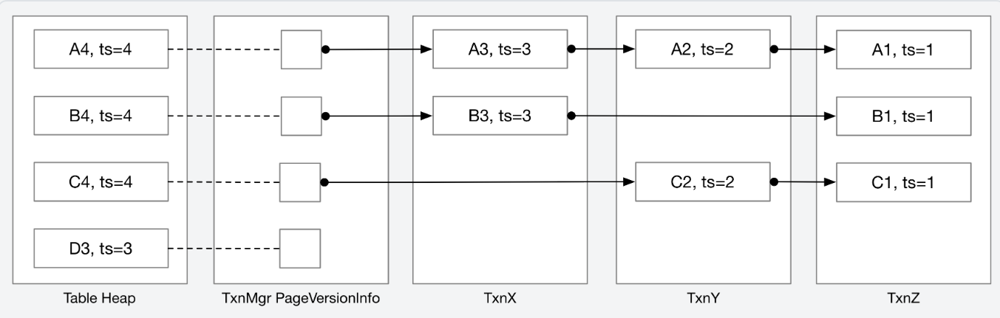
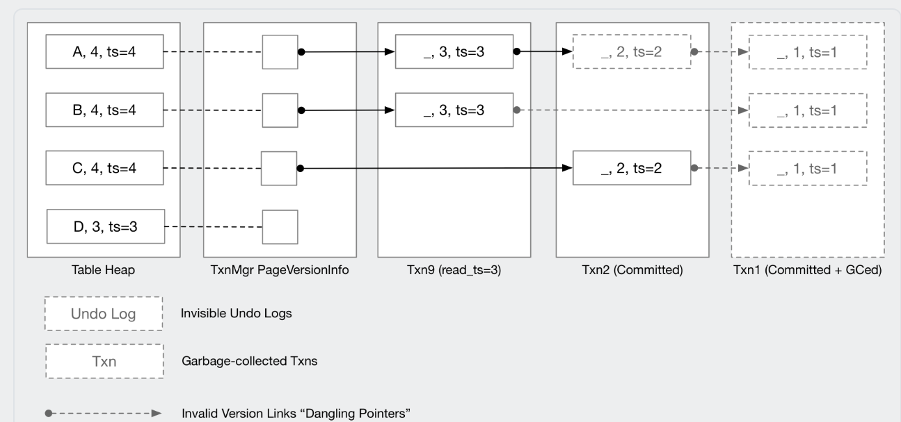
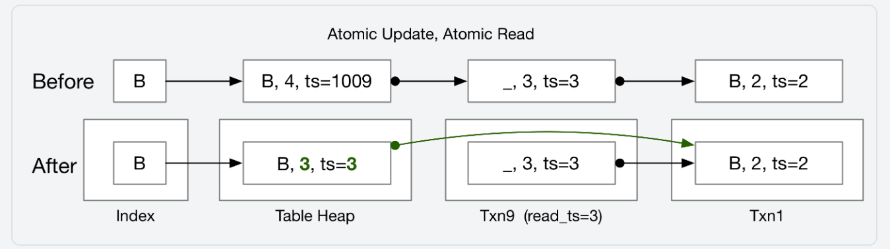
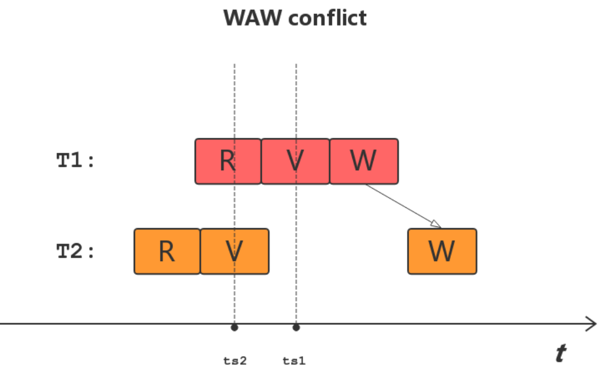
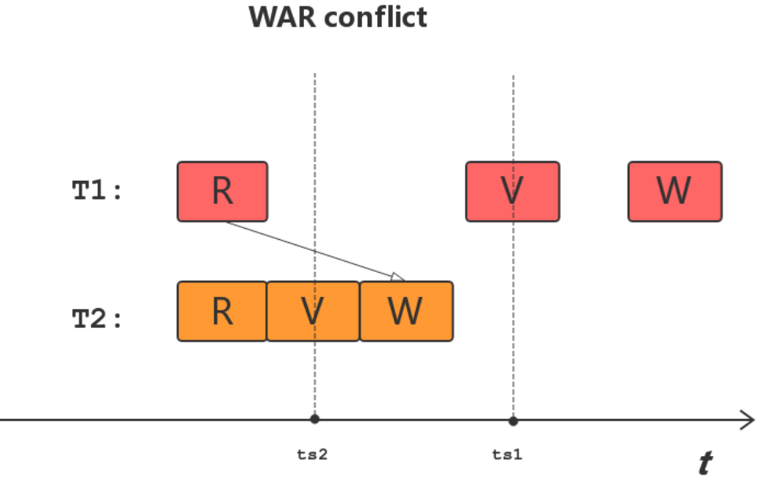

# Basic Knowledge

Bustub 是一个教学用的 RDBMS，核心组件包括 Parser、Planner、Optimizer、Executor 以及 Storage。CMU15445 这门课的课程作业需要修改上述几乎全部内容，可以让数据库初学者深入理解数据库的工作原理。

## Parser

Bustub 的 Parser 实际上使用的是 duckdb_libpgquery 的库，负责将 SQL 语句解析成抽象语法树（AST）。在这个阶段，你需要理解 SQL 的基本语法和如何将其转换为 AST。

Bustub 还多了一个 binder 的过程，将 Statement 转换为更具体的语法树（如 InsertStatement），这一步骤会进行类型检查和符号解析。

## Planner

Planner 负责将 AST 转换为逻辑查询计划（Logical Query Plan）。整个查询计划以树的形式存在，包含了各种操作节点（如 SeqScan、IndexScan、Filter 等）。我们需要知道如何组织这些操作结点，从而让整个计划可以自下而上地执行。

## Optimizer

Optimizer 负责对查询计划进行优化，主流的数据库优化器一般使用 RBO（基于规则优化）和 CBO（基于成本估算优化）将逻辑计划转变为物理计划（Physical Query Plan）。
但是 Bustub 只有 RBO 优化，优化器优化规则主要包括以下几个方面：

- **谓词下推**：将过滤条件尽可能早地应用到数据上，以减少后续操作的数据量。
- **连接顺序优化**：通过改变连接操作的顺序来减少中间结果集的大小，从而提高查询效率。
- **索引选择**：根据查询条件选择合适的索引来加速数据访问。

## Executor

Executor 负责执行物理查询计划中的操作节点。它会根据物理查询计划的结构，逐个执行操作，并将结果传递给下一个操作节点。Executor 的实现需要理解每种操作的具体执行逻辑，如如何进行表扫描、索引扫描、连接操作等。

Bustub 并没有支持所有算子，但是支持了多种 Join 算子（如 Nested Loop Join、Nested Index Join、Hash Join 等），并且支持了多种 Scan 算子（如 SeqScan、IndexScan 等）。

## Storage

Storage 模块负责数据的存储和管理，包括数据页的读写、缓冲池的管理、索引的维护等。

Bustub 的数据存储与 PostgreSQL 一致，使用 Slotted page 进行 tuple 的存储。

```c++
/**
 * Slotted page format:
 *  ---------------------------------------------------------
 *  | HEADER | ... FREE SPACE ... | ... INSERTED TUPLES ... |
 *  ---------------------------------------------------------
 *                                ^
 *                                free space pointer
 *
 *  Header format (size in bytes):
 *  ----------------------------------------------------------------------------
 *  | NextPageId (4)| NumTuples(2) | NumDeletedTuples(2) |
 *  ----------------------------------------------------------------------------
 *  ----------------------------------------------------------------
 *  | Tuple_1 offset+size (4) | Tuple_2 offset+size (4) | ... |
 *  ----------------------------------------------------------------
 *
 * Tuple format:
 * | meta | data |
 */
```

同时，Bustub 使用了 B+树作为索引结构，并实现了缓冲池管理器来优化磁盘 I/O 操作。

为了更好地对磁盘进行操作并不影响前台的查询，Bustub 设计了 DiskManager 和 DiskScheduler。DiskManager 负责磁盘的读写操作，而 DiskScheduler 则负责调度这些操作，以确保查询的高效执行。

## Multi-Version Concurrency Control (MVCC) + Optimistic Concurrency Control (OCC)

Bustub 本身并没有实现 MVCC，但它提供了一个基本框架需要我们来实现。MVCC 允许多个事务并发执行而不会相互干扰，主要通过版本控制来实现。每个数据项都有一个版本号，事务在读取数据时会检查版本号，以确保读取到的是最新的版本。

OCC 则是一种乐观的并发控制机制，它假设事务之间不会发生冲突，因此在提交时才进行冲突检测。如果检测到冲突，则回滚事务。Bustub 的 MVCC + OCC 实现了串行化隔离级别，确保事务的执行结果与串行执行的结果一致。

# Buffer Pool Manager

这个任务实际上包括三个小任务：

1. LRU-K Policy
2. Disk Scheduler
3. Buffer Pool Manager

## LRU-K Policy

LRU-K 是一种改进的 LRU（Least Recently Used）缓存替换策略，LRU-K 算法会淘汰在替换器中反向 k 距离最大的页帧。反向 k 距离是通过当前时间戳与第 k 次先前访问的时间戳之间的时间差计算的。少于 k 次历史访问的页帧会被赋予+inf 作为其反向 k 距离。如果多个页帧具有+inf 反向 k 距离，替换器会淘汰具有最早整体时间戳的页帧（即记录访问最久远的页帧）。

LRUKReplacer 中维护了一个 unordered_map 存储 frame_id 和其对应的 LRU-K 信息。每个 frame_id 对应一个 LRUKNode 对象，包含了 frame_id、访问次数、访问历史等信息。

```c++
class LRUKNode {
 private:
  /** History of last seen K timestamps of this page. Least recent timestamp stored in front. */
  std::list<size_t> history_;         // history timestamp
  size_t k_{0};                       // k times
  frame_id_t fid_{INVALID_FRAME_ID};  // frame id
  bool is_evictable_{false};          // whether or not can be evicted
};

class LRUKReplacer {
  std::unordered_map<frame_id_t, LRUKNode> node_store_;
  size_t current_timestamp_{0};
  size_t curr_size_{0};
  size_t replacer_size_;
  size_t k_;
  std::mutex latch_;
};
```

## Disk Scheduler

磁盘调度器可以被其他组件使用，以将磁盘请求排队，这些请求由一个 DiskRequest 结构体表示。磁盘调度器将维护一个后台工作线程，负责处理调度好的请求。这里的 DiskRequest 里面有一个 std::promise 对象，用于在请求完成时通知等待的线程，但是我们暂时并**没有实现成完全异步的**，实际上我们可以通过 epoll 等事件通知机制配合 promise 和 future 来实现真正的异步请求。

```c++
struct DiskRequest {
  /** Flag indicating whether the request is a write or a read. */
  bool is_write_;
  /**
   *  Pointer to the start of the memory location where a page is either:
   *   1. being read into from disk (on a read).
   *   2. being written out to disk (on a write).
   */
  char *data_;
  /** ID of the page being read from / written to disk. */
  page_id_t page_id_;
  /** Callback used to signal to the request issuer when the request has been completed. */
  std::promise<bool> callback_;
};

void DiskScheduler::StartWorkerThread() {
  std::optional<DiskRequest> request;
  while (true) {
    request = request_queue_.Get();
    if (request != std::nullopt) {
      if (request->is_write_) {
        disk_manager_->WritePage(request->page_id_, request->data_);
        request->callback_.set_value(true);
      } else if (!request->is_write_) {
        disk_manager_->ReadPage(request->page_id_, request->data_);
        request->callback_.set_value(true);
      }
    } else {
      break;
    }
  }
}
```

## Buffer Pool Manager

BufferPoolManager 负责使用 DiskScheduler 从磁盘获取数据库页面，并将它们存储在内存中。 BufferPoolManager 还可以根据明确的指示或在需要驱逐页面以腾出空间给新页面时，调度脏页写入磁盘。Bustub 提供了一个名为 FrameHeader 的辅助类，用于管理内存中的帧。所有对页面数据的访问都应通过 FrameHeader 进行。 FrameHeader 有一个名为 GetData 的方法，该方法返回其帧内存的原始指针，而 DiskScheduler / DiskManager 将使用此指针将磁盘上的物理页面内容复制到内存中。

在实现多线程缓冲池管理器时，我们必须注意同步数据访问。这意味着我们不想在缓冲池的不同帧中存在相同页面的多个副本。如果我们允许这种情况，我们会遇到这样的场景：

1. 线程 T1 将页 X1 从磁盘加载到缓冲区帧中，并开始修改页 X1 ，我们将这个新版本称为页 X2 。
2. 线程 T2 将页 X1 从磁盘加载到不同的缓冲区帧中，并开始修改这个版本的页 X1 ，我们将这个其他修改过的版本称为页 X3 。
3. 线程 T2 完成写入并将 X3 写回磁盘。
4. 线程 T1 完成写入并将 X2 写回磁盘。
5. 数据竞争 ☠️！

因此，Bustub 每次只在内存中保留一页的版本，以防止数据同步竞争。此外，为了防止在线程访问页时将其驱逐，我们在存储该页的帧上维护一个引用计数/固定计数。最后，为了跟踪哪些页存储在哪些帧中，我们还使用哈希映射维护一个页表，该哈希映射将页 ID 映射到帧。

### 实现

这里需要注意的是获取 FrameHeader 中的 rw_latch 前需要释放 bpm_latch，否则会导致死锁。WritePageGuard 和 ReadPageGuard 整个生命周期内都持有 rw_latch。

[参考 the king king 的博客](https://thekingking.github.io/posts/cmu-15445-24fall-project1/)

为了保证对同一页写入和读取的并发安全，我们需要在 BufferPoolManager 中实现一个脏页写入机制。这个机制可以确保在有脏页存在时，其他线程不会读取未写入的脏页。

```c++
/** @brief A set of dirty pages that need to be flushed to disk. */
std::unordered_set<page_id_t> dirty_pages_;
/** @brief A mutex to protect the dirty pages set. */
std::mutex flush_mutex_;
/** @brief A condition variable to notify the flusher thread that there are dirty pages to flush. */
std::condition_variable flush_cv_;
```

操作流程如下：

1. 获取 FreeFrame，如果是脏页进行标记并将该页加入到 dirty_pages，脏页刷盘不应该在 bpm_latch 中进行，而是应该在获取到 frame 的 rw_latch 后进行。
2. 修改 Buffer Pool Manager 的元数据然后释放 bpm_latch，获取 frame 的 rw_latch。
3. 如果是脏页且需要刷盘，将 frame 刷写到磁盘 中，并重置 frame 的状态，然后将脏页从 dirty_pages 中删除，并通知 flusher 线程。
4. 等待 flush*cv* 的通知，直到 dirty_pages 中不包含当前页，然后加载页面到 frame 中。
5. 返回 WritePageGuard 或 ReadPageGuard。

# Concurrent BPlusTree Index

B+树也是按照页面来进行存储的，B+树的每个节点都是一个页面。B+树的节点分为叶子节点和内部节点，叶子节点存储有序的键及其对应的值。而内部节点存储 m 个有序键和 m + 1 个指向其他 B+树页面的子指针（即页面 ID）。

任何时候，每个内部页面的填充率应至少为半满。在删除操作中，两个半满页面可以合并，或者可以将键和指针重新分配以避免合并。在插入操作中，一个满页面可以拆分为两个，或者可以将键和指针重新分配以避免拆分。叶子页面与内部页面一样，对键值对的数量有相同的限制，并且应遵循相同的合并、拆分和重新分配键的操作。

每个 B+树叶子节点/内部页面对应于缓冲池获取的内存页面的内容（即 data\_ 部分）。每次从叶子节点或内部页面读取或写入时，必须首先从缓冲池中获取该页面（使用其唯一的 page_id ），将其重新解释转换为叶子节点或内部页面，并在读取或写入后取消固定该页面。

### 实现

使用了乐观锁优化，首先从 root 到 leaf 全部加读锁，如果中间的内部节点或者叶子节点需要分裂或者合并，则释放所有锁，然后从头开始获取写锁，执行正常的插入或删除操作。

使用 Context 来维护了从根节点到叶子节点的路径以及写锁和读锁的集合。可以避免在 B+树节点中维护父节点指针，减小存储开销。

整体并发控制使用 latch crabbing 策略，如果确定当前节点插入不会分裂/删除不会合并，则释放之前的所有写锁，只保留当前节点的锁，直到叶子节点。

#### Insert

1. 如果是空树，直接开始新树。
2. 从根节点开始一直向下查找叶子节点，获取读锁，如果叶子节点未满，则直接插入。
3. 如果叶子节点已满，释放所有读锁，重新从根节点开始查找叶子节点，获取写锁。
4. 开始执行递归插入节点直到 B+树达到平衡。

```c++
INDEX_TEMPLATE_ARGUMENTS
auto BPLUSTREE_TYPE::OptiInsert(Context *ctx, const KeyType &key, const ValueType &value) -> bool {
  ctx->header_page_ = bpm_->WritePage(header_page_id_);
  if (IsEmpty(ctx)) {
    return StartNewTree(ctx, key, value); // 如果是空树，直接开始新树
  }
  ctx->ReleaseAllLatch();
  auto leaf_page_id = OptiFindLeafPage(ctx, Operation::INSERT, key, comparator_, false, false); // 读锁
  // 此时ctx.write_set_中保存这leaf_page的写锁
  auto leaf_page = ctx->write_set_.back().AsMut<LeafPage>();
  if (leaf_page->GetSize() < leaf_page->GetMaxSize() - 1) {
    auto before_insert_size = leaf_page->GetSize();
    leaf_page->Insert(key, value, comparator_);
    auto new_size = leaf_page->GetSize();
    // check leaf node whether it is full or not
    // 1. duplicate key
    return before_insert_size != new_size;
  }
  ctx->ReleaseAllLatch();
  ctx->header_page_ = bpm_->WritePage(header_page_id_);

  auto new_leaf_page_id = FindLeafPage(ctx, Operation::INSERT, key, comparator_, false, false); // 写锁

  // 如果找到叶子节点，一定确保ctx.write_set_不为空
  BUSTUB_ASSERT(!ctx->write_set_.empty(), "write set is empty");
  auto new_leaf_page = ctx->write_set_.back().template AsMut<LeafPage>();

  auto before_insert_size = new_leaf_page->GetSize();
  new_leaf_page->Insert(key, value, comparator_);
  auto new_size = new_leaf_page->GetSize();
  // check leaf node whether it is full or not
  // 1. duplicate key
  if (before_insert_size == new_size) {
    return false;
  }
  // 2. leaf node is  not full
  if (new_size < new_leaf_page->GetMaxSize()) {
    return true;
  }
  // 3. leaf node is full
  auto ret = SplitLeaf(ctx);
  auto new_key = ret.new_key_;
  auto new_page_id = ret.new_page_id_;

  InsertIntoParent(ctx, new_leaf_page_id, new_key, new_page_id, 0);
  return true;
}
```

#### Remove

1. 首先先获取读锁，找到叶子节点。
2. 如果叶子节点未满，则直接删除。
3. 如果叶子节点已满，释放所有读锁，重新从根节点开始查找叶子节点，获取写锁。
4. 开始执行递归删除节点直到 B+树达到平衡。
5. 删除时我们这里先进行 Redistribute，如果 Redistribute 失败，则进行 Coalesce。
   - Redistribute 是将当前节点和兄弟节点的键值对进行重新分配，保证两个节点的键值对数量都大于等于最小值。
   - Coalesce 是将当前节点和兄弟节点合并，保证两个节点的键值对数量都大于等于最小值。
   - 如果当前节点是根节点且只有一个子节点，则将根节点删除，子节点作为新的根节点，树高度减一。

```c++
INDEX_TEMPLATE_ARGUMENTS
void BPLUSTREE_TYPE::OptiRemove(Context *ctx, const KeyType &key) {
  ctx->header_page_ = bpm_->WritePage(header_page_id_);
  if (IsEmpty(ctx)) {
    return;
  }
  ctx->ReleaseAllLatch();
  auto leaf_page_id = OptiFindLeafPage(ctx, Operation::REMOVE, key, comparator_, false, false);

  auto leaf_page = ctx->write_set_.back().AsMut<LeafPage>();
  if (leaf_page->GetSize() > leaf_page->GetMinSize()) {
    leaf_page->RemoveAndDeleteRecord(key, comparator_);
    return;
  }
  ctx->ReleaseAllLatch();
  ctx->header_page_ = bpm_->WritePage(header_page_id_);
  auto new_leaf_page_id = FindLeafPage(ctx, Operation::REMOVE, key, comparator_, false, false);
  if (leaf_page_id == INVALID_PAGE_ID) {
    return;
  }

  DeleteEntry(ctx, key, -1, new_leaf_page_id, 0);
}

INDEX_TEMPLATE_ARGUMENTS
auto BPLUSTREE_TYPE::DeleteEntry(Context *ctx, const KeyType &key, int delete_index, page_id_t current_page_id,
                                 int recursive_level) -> bool {
  if (ctx->IsRootPage(current_page_id)) {
    AdjustRoot(ctx);
    return true;
  }
  // ...
  bool redistribute = Redistribute(ctx, old_page_index, sibling_index, recursive_level, parent_key);
  if (!redistribute) {
    if (old_page_index != 0) {
      coalesec = Coalesce(ctx, sibling_index, true, recursive_level, parent_key);
    } else {
      coalesec = Coalesce(ctx, sibling_index, false, recursive_level, parent_key);
    }
  }
  return true;
}
```

#### Search

1. 从根节点开始，获取读锁，向下查找叶子节点。
2. 如果找到叶子节点，则返回叶子节点中的值。

#### Iterator

需要注意 BPlusTree 的 Begin()和 End()方法在后面 IndexScan 算子中会用到，所以我们这里设计 IndexIterator 里面包含一个 ReadPageGuard，用于在迭代器中读取叶子节点的内容。

- End()方法的迭代器里面实际上没有内容，所以我们在 IndexIterator 中使用 std::optional<ReadPageGuard> 来表示是否有叶子节点的内容。

```c++
INDEX_TEMPLATE_ARGUMENTS
class IndexIterator {
 private:
  // add your own private member variables here
  BufferPoolManager *bpm_;
  std::optional<ReadPageGuard> leaf_page_guard_;
  int index_;
};

INDEX_TEMPLATE_ARGUMENTS
auto BPLUSTREE_TYPE::Begin(const KeyType &key) -> INDEXITERATOR_TYPE {
  Context ctx;
  FindLeafPage(&ctx, Operation::SEARCH, key, comparator_, false, false);
  auto *leaf_page = ctx.read_set_.back().As<LeafPage>();
  auto index = leaf_page->KeyIndex(key, comparator_);
  return INDEXITERATOR_TYPE(bpm_, std::optional<ReadPageGuard>(std::move(ctx.read_set_.back())), index);
}

INDEX_TEMPLATE_ARGUMENTS
auto BPLUSTREE_TYPE::End() -> INDEXITERATOR_TYPE {
  return INDEXITERATOR_TYPE(bpm_, std::nullopt, 0);
}
```

# SQL support

Slotted page 的整体布局，其中 tuple meta 中包含了事务的时间戳和删除标记。Tuple 结构体包含了 RID 和数据部分。

我们这里的 DELETE 操作实际上是将 tuple 的 is*deleted* 标记为 true，而不是直接删除 tuple。这样可以实现 MVCC 的多版本并发控制。后面实现 MVCC 时，我们会有后台 GC 线程来清理这些被删除且不再被其他事务引用的 tuple。

```c++
/**
 * Slotted page format:
 *  ---------------------------------------------------------
 *  | HEADER | ... FREE SPACE ... | ... INSERTED TUPLES ... |
 *  ---------------------------------------------------------
 *                                ^
 *                                free space pointer
 *
 *  Header format (size in bytes):
 *  ----------------------------------------------------------------------------
 *  | NextPageId (4)| NumTuples(2) | NumDeletedTuples(2) |
 *  ----------------------------------------------------------------------------
 *  ----------------------------------------------------------------
 *  | Tuple_1 offset+size (4) | Tuple_2 offset+size (4) | ... |
 *  ----------------------------------------------------------------
 *
 * Tuple format:
 * | meta | data |
 */
 struct TupleMeta {
  /** the ts / txn_id of this tuple. In project 3, simply set it to 0. */
  timestamp_t ts_;
  /** marks whether this tuple is marked removed from table heap. */
  bool is_deleted_;
 };

 class Tuple {
  RID rid_{};  // if pointing to the table heap, the rid is valid
  std::vector<char> data_;
};
```

## Hash Join

Hash Join 是一种基于哈希表的连接算法，主要用于连接两个关系（表）。它的基本思路是将其中一个关系（通常是较小的关系）构建成哈希表，然后扫描另一个关系，使用哈希表来查找匹配的记录。

HashTable 的构建在该算子的初始化阶段，存储右侧算子的结果。执行阶段则是对左侧算子的结果进行扫描，并使用哈希表来查找匹配的记录。

```c++
void HashJoinExecutor::Init() {
  // 1. init child executors
  left_child_executor_->Init();
  right_child_executor_->Init();

  // 2. build hash table for right table
  Tuple right_tuple{};
  RID right_rid;
  while (right_child_executor_->Next(&right_tuple, &right_rid)) {
    HashJoinKey key = GetRightJoinKey(&right_tuple);
    // jht_ 是 HashJoinTable 的实例，存储了右表的哈希表
    jht_->Insert(key, right_tuple);
  }
}

auto HashJoinExecutor::Next(Tuple *tuple, RID *rid) -> bool {
  if (!results_.empty()) {
    *tuple = results_.front();
    *rid = RID{1, 0};
    results_.pop_front();
    return true;
  }
  auto left_schema = left_child_executor_->GetOutputSchema();
  auto right_schema = right_child_executor_->GetOutputSchema();
  while (left_child_executor_->Next(tuple, rid)) {
    auto left_hash_key = GetLeftJoinKey(tuple);
    if (jht_->GetValue(left_hash_key) != nullptr) {
      for (const auto &right_tuple : *jht_->GetValue(left_hash_key)) {
        std::vector<Value> values;
        for (uint32_t i = 0; i < left_schema.GetColumnCount(); i++) {
          values.emplace_back(tuple->GetValue(&left_schema, i));
        }
        for (uint32_t i = 0; i < right_schema.GetColumnCount(); i++) {
          values.emplace_back(right_tuple.GetValue(&right_schema, i));
        }
        results_.emplace_back(Tuple{values, &GetOutputSchema()});
      }
    } else if (plan_->GetJoinType() == JoinType::LEFT) {
      std::vector<Value> values;
      for (uint32_t i = 0; i < left_schema.GetColumnCount(); i++) {
        values.emplace_back(tuple->GetValue(&left_schema, i));
      }
      for (uint32_t i = 0; i < right_schema.GetColumnCount(); i++) {
        values.emplace_back(ValueFactory::GetNullValueByType(right_schema.GetColumn(i).GetType()));
      }
      results_.emplace_back(Tuple{values, &GetOutputSchema()});
    }
    // 直到这次的left_tuple与right_tuples匹配的数组都被遍历完才会继续下一次的left_tuple
    if (!results_.empty()) {
      *tuple = results_.front();
      *rid = RID{1, 0};
      results_.pop_front();
      return true;
    }
  }
  return false;
}
```

## External Merge Sort

External Merge Sort 是一种外部排序算法，主要用于处理无法完全加载到内存中的大数据集。它的基本思路是将数据分成多个小块，每个小块在内存中进行排序，然后将这些已排序的小块合并成一个大的有序结果。

1. 我们这里使用 2-way merge sort，使用 MergeSortRun 来表示一个已排序的小块。每个 MergeSortRun 包含一个当前排好序 tuple 的迭代器。
2. 所有的排序工作在 Init 阶段完成，Next 方法只需要从最后的排序结果中读取数据。

```c++
template <size_t K>
void ExternalMergeSortExecutor<K>::Init() {
  child_executor_->Init();
  // 1. 生成初始的mergesortrun
  auto *bpm = exec_ctx_->GetBufferPoolManager();
  // ...
  while (child_executor_->Next(&child_tuple, &child_rid)) {
    auto sort_key = GenerateSortKey(child_tuple, plan_->GetOrderBy(), GetOutputSchema());
    buffer.emplace_back(SortEntry{sort_key, child_tuple});
    if (buffer.size() == max_tuples_per_page) {
      task_nums++;
      // 将buffer中的数据flush到一个新的MergeSortRun中
      thread_pool_->Enqueue([=]() {
        FlushBufferToRun(buffer, bpm, max_tuples_per_page, tuple_length, runs_);
        task_nums_.fetch_add(1);
      });
      buffer.clear();
    }
  }
  // 未满一页也需要flush
  if (!buffer.empty()) {
    task_nums++;
    thread_pool_->Enqueue([=]() {
      FlushBufferToRun(buffer, bpm, max_tuples_per_page, tuple_length, runs_);
      task_nums_.fetch_add(1);
    });
    buffer.clear();
  }
  // 同步IO线程，保证所有的page都是排好序的
  while (task_nums != task_nums_.load()) {
  }
  task_nums_.store(0);

  // 2. merge all runs
  while (runs_.size() > 1) {
    std::vector<MergeSortRun> new_runs;
    // 2-way external merge sort
    for (size_t i = 0; i < runs_.size(); i += 2) {
      if (i + 1 < runs_.size()) {
        Merge2Runs(runs_[i], runs_[i + 1], bpm, max_tuples_per_page, tuple_length, new_runs);
      } else {
        new_runs.emplace_back(runs_[i]);
      }
    }
    runs_ = std::move(new_runs);
  }

  // 3. read the last run
  if (!runs_.empty()) {
    current_iterator_ = runs_[0].Begin();
    end_iterator_ = runs_[0].End();
    is_inited_ = true;
  } else {
    current_iterator_ = {};
    end_iterator_ = {};
  }
}

```

# Multi-version Concurrency Control And Optimistic Concurrency Control (MVOCC)

MVCC 保证可重复读，MVCC 配合行锁+间隙锁（MYSQL 使用）或者 MVCC 配合乐观锁（PostgreSQL 使用）可以保证串行化隔离级别。Bustub 实现的是 MVCC + OCC 实现串行化隔离级别。

## Transaction Manager

TransactionManager 是全局实例，负责管理所有事务的生命周期。它提供了事务的开始、提交和回滚等操作。

PageVersionInfo 用于存储每个页面的版本信息，包括之前的版本链接。UndoLink 用于存储撤销日志的链表，UndoLog 则是具体的撤销日志内容，最后一个 UndoLink 的 TxnId 为 INVALID_TXN_ID，表示该版本是最新的。


```c++
/**
 * TransactionManager keeps track of all the transactions running in the system.
 */
class TransactionManager {
 public:
  /**
   * Begins a new transaction.
   * @param isolation_level an optional isolation level of the transaction.
   * @return an initialized transaction
   */
  auto Begin(IsolationLevel isolation_level = IsolationLevel::SNAPSHOT_ISOLATION) -> Transaction *;

  /**
   * Commits a transaction.
   * @param txn the transaction to commit, the txn will be managed by the txn manager so no need to delete it by
   * yourself
   */
  auto Commit(Transaction *txn) -> bool;

  /**
   * Aborts a transaction
   * @param txn the transaction to abort, the txn will be managed by the txn manager so no need to delete it by yourself
   */
  void Abort(Transaction *txn);

  /** @brief Stop-the-world garbage collection. Will be called only when all transactions are not accessing the table
   * heap. */
  void GarbageCollection();

  /** protects txn map */
  std::shared_mutex txn_map_mutex_;
  /** All transactions, running or committed */
  std::unordered_map<txn_id_t, std::shared_ptr<Transaction>> txn_map_;

  struct PageVersionInfo {
    /** protects the map */
    std::shared_mutex mutex_;
    /** Stores previous version info for all slots. Note: DO NOT use `[x]` to access it because
     * it will create new elements even if it does not exist. Use `find` instead.
     */
    std::unordered_map<slot_offset_t, UndoLink> prev_link_;
  };

  /** protects version info */
  std::shared_mutex version_info_mutex_;
  /** Stores the previous version of each tuple in the table heap. Do not directly access this field. Use the helper
   * functions in `transaction_manager_impl.cpp`. */
  std::unordered_map<page_id_t, std::shared_ptr<PageVersionInfo>> version_info_;

  /** Stores all the read_ts of running txns so as to facilitate garbage collection. */
  Watermark running_txns_{0};

  /** Only one txn is allowed to commit at a time */
  std::mutex commit_mutex_;
  /** The last committed timestamp. */
  std::atomic<timestamp_t> last_commit_ts_{0};

  /** Catalog */
  Catalog *catalog_;

  std::atomic<txn_id_t> next_txn_id_{TXN_START_ID};
};
```

### Tuple Storage

BusTub 将事务数据存储在三个地方：表堆、事务管理器和每个事务的工作空间中。表堆始终包含最新的元组数据。事务管理器存储每个元组的最新撤销日志的指针 ( PageVersionInfo )。事务存储它们创建的撤销日志(UndoLog)，这些日志记录了事务如何修改元组。

- 要在一个给定的读时间戳下检索一个元组，你需要 (1) 获取所有在该时间戳之后发生的修改（即撤销日志），以及 (2) 从元组的最新版本中回滚这些修改（“撤销”撤销日志），以恢复该元组的过去版本。

  

### UndoLog

时间戳（ ts* ）是指这个 UndoLog 对应的提交时间戳。我们还存储了一个指向下一个 UndoLog 的链接（ prev_version* 通过 UndoLink 存储）。如果一个 UndoLog 是版本链中的最后一个，TxnId（在代码中对应 prev*txn* ）将被设置为 INVALID_TXN 。


### Garbage Collection

需要遍历表堆和版本链，以识别仍可被具有最低读时间戳的事务访问的撤销日志。如果事务已提交/中止，并且不包含对具有最低读时间戳的事务可见的任何撤销日志，可以直接将其从事务映射中移除。

下面的例子说明了当水位时间戳为 3 时，我们已经有 txn1 、 txn2 和 txn9 提交的情况。



- txn1 的撤销日志不再可访问，因为所有提交时间戳为 1 的撤销日志都被提交时间戳小于或等于 3 的更新覆盖了。因此我们可以直接删除 txn1 。
- txn2 的元组(A, 2)的撤销日志不可访问，但其元组(C, 2)的撤销日志仍然可访问，因为没有额外的更新，所以我们现在不能删除它。

### Abort

进入 TAINTED 状态的事务会导致其他事务在写冲突的元组上中止。当中止一个事务时，我们应该撤销这个修改，以便其他事务可以写入元组。



中止 txn9 将原子性地将撤销链接链接到前一个版本并更新表堆。我们使用 UpdateTupleAndUndoLink / GetTupleAndUndoLink 来原子性地更新/读取元组和撤销链接。

## Trasaction

Transaction 是事务对象，包含一个读取时间戳和一个提交时间戳。事务的状态由 TransactionState 枚举类型表示，可能的状态包括 RUNNING、COMMITTED 和 TAINTED 。

写集合和扫描谓词集合用于 OCC 判断事务与在我读取时间戳之前的事务是否存在冲突。写集合存储了事务修改的元组的 RID，而扫描谓词集合存储了事务读取的元组的谓词。

```c++
/**
 * Transaction tracks information related to a transaction.
 */
class Transaction {
  // The below fields should be ONLY changed by txn manager (with the txn manager lock held).

  /** The state of this transaction. */
  std::atomic<TransactionState> state_{TransactionState::RUNNING};

  /** The read ts */
  std::atomic<timestamp_t> read_ts_{0};

  /** The commit ts */
  std::atomic<timestamp_t> commit_ts_{INVALID_TS};

  /** The latch for this transaction for accessing txn-level undo logs, protecting all fields below. */
  std::mutex latch_;

  /**
   * @brief Store undo logs. Other undo logs / table heap will store (txn_id, index) pairs, and therefore
   * you should only append to this vector or update things in-place without removing anything.
   */
  std::vector<UndoLog> undo_logs_;

  /** stores the RID of write tuples */
  std::unordered_map<table_oid_t, std::unordered_set<RID>> write_set_;
  /** store all scan predicates */
  std::unordered_map<table_oid_t, std::vector<AbstractExpressionRef>> scan_predicates_;

  // The below fields are set when a txn is created and will NEVER be changed.

  /** The isolation level of the transaction. */
  const IsolationLevel isolation_level_;

  /** The thread ID which the txn starts from.  */
  const std::thread::id thread_id_;

  /** The ID of this transaction. */
  const txn_id_t txn_id_;
};
```

### TimeStamp

在 BusTub 中，每个事务将被分配两个时间戳：一个读取时间戳和一个提交时间戳。

- 当事务开始时，它将被分配一个读取时间戳，该时间戳等于最近提交的事务的提交时间戳。从高层次来看，你可以将其理解为记录数据库中最新原子写入的时间戳。读取时间戳决定了事务可以安全且正确读取哪些数据。换句话说，读取时间戳决定了当前事务可以看到的元组的最新版本。
- 当事务提交时，它将被分配一个单调递增的提交时间戳。提交时间戳决定了事务的序列化顺序。由于这些提交时间戳是唯一的，我们也可以通过提交时间戳唯一地识别已提交的事务。

  

### Generate UndoLog

需要考虑三种情况：

1. 更新：在这种情况下，基于基础元组和目标元组生成 UndoLog 。如果这不是该事务中的第一次更新，则通过 GenerateUpdatedUndoLog 将其与原始 UndoLog 合并。请注意，每个事务最多应保留一个针对每个 RID 的撤销日志。如果事务需要两次更新元组，它应该只更新基础元组及其当前的撤销日志。

2. 删除：如果不是当前事务修改，生成新 UndoLog；如果是当前事务修改，则需要将元数据更新为删除状态，并 UpdateUndoLog 保证每个 tuple 对每个事务只有一个 UndoLog。

3. 插入：tuple 被当前事务删除，但是索引还存在，更新 tuple 元数据以及 Undolog；如果被另一事务删除，需要生成新的 undolog 插入到 undo_link 中。

## Optimistic Concurrency Control

Optimistic Concurrency Control (OCC) 是一种乐观的并发控制机制，主要用于处理事务之间的并发冲突。它的基本思路是允许事务在没有锁的情况下执行，直到提交时才检查是否存在冲突。

所谓的冲突检测, 就是验证 timestamp ordering 决定的事务执行顺序和 data dependence 决定的事务执行顺序是否存在矛盾

### WAW(write-after-write)

也叫做 output dependence, T1.write → T2.write => T1 → T2;


如果两个事务都提交, 则先提交的事务(T2) overwrite 后提交的事务(T1)的结果 , i.e. Lost Update.

### WAR(write-after-read):

也叫做 anti-dependence, T1.read → T2.write => T1 → T2;


如果两个事务都提交, 则先提交的事务(T2)的结果对后提交的事务(T1)不可见, 后提交的事务(T1)依然根据 Stale 记录修改数据库, 导致先提交事务(T2)的结果被覆盖而丢失. i.e. Lost Update.

### RAW(read-after-write):

也叫做 flow dependence, T1.write → T2.read => T1 → T2


所以不可能出现 RAW 冲突.

### Bustub OCC 实现

1. 不需要验证只读事务，因为 RAW 冲突不可能发生。
2. 收集所有在当前事务的读时间戳之后提交的事务。我们将这些事务称为“冲突事务”。（WAR/WAW Conflict）
3. 对于每个元组，遍历其版本链以验证当前事务是否读取了任何“幽灵”。你可以收集所有在事务读时间戳之前的撤销日志。然后逐个重放以检查交集。
4. 对于版本链中的每个更新:
   - 对于插入操作，你应该检查新元组是否满足当前事务的任何扫描谓词。如果满足，则中止。
   - 对于删除操作，你应该检查被删除的元组是否满足当前事务的任何扫描谓词。如果满足，则中止。
   - 存在一种边缘情况，即一个事务插入然后删除一个元组，这会在表堆中留下一个删除标记。这种情况应该被视为无操作，而不是删除。
   - 对于更新操作，你应该检查“旧图像”和“新图像”。如果其中任何一个与当前事务的扫描谓词中的任何一个重叠，就中止。
     - 考虑这样一种情况：一个事务修改了一个元组，但随后又将其撤销，这会留下一个撤销日志，其中某些列被更新为相同的值。在这种情况下，你仍然应该将其处理为相同的更新，而不是忽略它，并在必要时中止事务。
     - 然而，如果存在两个事务，第一个事务将值从 X 修改为 Y，然后第二个事务将 Y 修改为 X，那么当有一个事务 txn3 在 txn1 开始之前启动，并在 txn2 提交之后提交时，你仍然应该检测到 X 发生了变化所引发的冲突。
