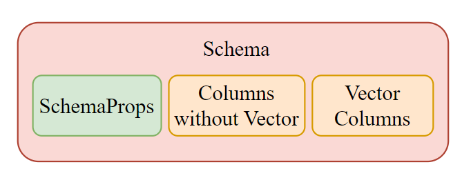
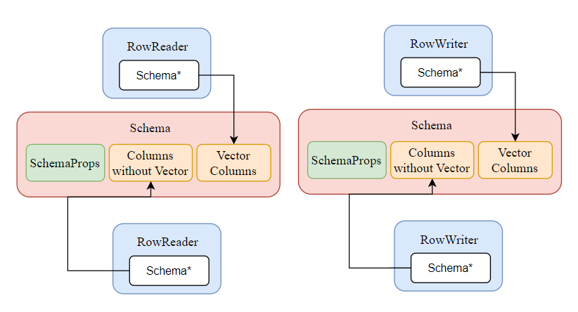

# The Implementation of Vector Type in Nebula Graph

1. Implement vector value type and property type and do the unit test for vector type
   - Add new value type: VECTOR
   - Modify RocksEngine to support multiple column family of RocksDB
2. Implement serialization and deserialization for vector type: Graphd to Storaged by thrift
   - Add thrift operation for vector type
   - Encoding of vector type key
   - RowWriter and RowReader for vector type
3. Modify Schema to simply support original column and vector column
   - Separate vector column and original column in schema
   - Modify RowWriter and RowReader to support vector column
4. Add vector distance expression in expression system
   - Implement vector distance expression in expression system
   - TODO: Add vector distance expression in query engine
5. Implement Create Tag Sentence For Vector Type
   - Create tag with vector type property
6. Implement Add Vertex with Vector Type Property
   - Add vertex with vector type property
   - TODO: Pass tck tests

# Design Notes

## Vector Value Type

The VECTOR type can be used as a property type. For storage, the actual data content of the vector is placed at the end of the encoded data block. We then use an offset and a length to specify the exact memory region where the vector's content is located.


## Storage for Vector Data

Specifically, Vertex data is stored in RocksDB in the form of KV pairs. We use RocksDB's Column Family to separate storage of VECTOR attributes and other graph attributes. We should add read and write method for RowReader and RowWriter.

### Key of Vector Type

The key of vector attributes is PartitionID + VertexID + TagID + PropID, Value is serialized vector data.


### Encoded Value

The encoded value of vector is consist of metadata and original data. Metadata is offset and length of original data, and original data is at last of whole value.


## Schema Modification

To simply support original column and vector column, we need to modify the schema as follows:

1.  Original columns (for other types except VECTOR type)
2.  Vector columns (just for VECTOR type)
3.  Schema Properties Options (TTL, TTL_COL, etc.)



### Schema Provider and RowReader/RowWriter

Actually, the manipulation of the schema is done in the `SchemaProvider`. So we need to add new data structure and iterator for vector columns in the `SchemaProvider`.

Input Data will be stored by RowWriter, which contains a `SchemaProvider*` pointer and a `isVector` flag to indicate whether the column is a vector type. By this way, we can encode the vector data and other data separately.

Reading data will be done by RowReader, which also contains a `SchemaProvider*` pointer and a `isVector` flag. The RowReader will read the vector data from the RocksDB "vector" column family if the `isVector` flag is true. Otherwise, it will read the data from the default column family.



## Create Tag Sentence For Vector Type

To create a tag with a vector type property, we can use the following sentence:

```cypher
CREATE TAG IF NOT EXISTS test1(name string, embedding vector(3) DEFAULT [1.0,2.0,3.0]) TTL_DURATION = 100, TTL_COL = "create_time";;
```

## Add Vertex with Vector Type Property

### Process for Adding Vertex with Vector Type Property

When adding a vertex with a VECTOR type property, the `AddVerticesProcessor` executor is responsible for processing the request. It packages the vertex data and metadata into raft-wal logs, which are then submitted to the Raft Part. The actual insertion into RocksDB occurs in the `Part::commitLogs()` method.


The actual data insertion into RocksDB occurs within the `Part::commitLogs(std::unique_ptr<LogIterator> iter, bool wait, bool needLock)` method. The process can be summarized with the following pseudo-code:

```c++
auto batch = engine_->startBatchWrite();
while (iter->valid()) {
    // ...
    switch (log[sizeof(int64_t)]) {
      case OP_MULTI_PUT_VECTOR: {
        // Here, 'kvs' contains both keys and values, and potentially the column family name.
        auto kvs = decodeMultiValues(log);
        for (size_t i = 0; i < kvs.size(); i += 2) {
          auto code = batch->put("vector", kvs[i], kvs[i + 1]);
          // ...
        }
        break;
      }
      case OP_MULTI_REMOVE_VECTOR: {
        // Here, 'kvs' contains both keys and values, and potentially the column family name.
        auto keys = decodeMultiValues(log);
        for(auto k: keys) {
            auto code = batch->remove("vector", k);
            // ...
        }
        break;
      }
      // ...
    }
    ++(*iter);
}
engine_->commitBatchWrite(
      std::move(batch), FLAGS_rocksdb_disable_wal, FLAGS_rocksdb_wal_sync, wait);
```

To minimize modifications and maintain the integrity of the existing Raft log processing workflow, we propose adding some new log types like `OP_MULTI_PUT_VECTOR`, `OP_MULTI_REMOVE_VECTOR`. We can just solve vector data by adding a new switch case in `commitLogs` and add `cfName` field in `doPut` method. To fully support our new VECTOR type, we need to modify the entire data storage flow:

1. `KVStore::asyncMultiPut`: Extend the asyncMultiPut method to support writes to the "vector" column family.
2. Part Methods:
   - The `asyncMultiPut` method must be updated to support the "vector" column family.
   - The `commitLogs` method must also be adapted to correctly process log entries destined for the "vector" column family.
3. `encodeMultiValues`: Modify this function to correctly encode the "vector" column family name into the log entry.
4. `KVEngine` Interface: The KVEngine interface needs to be enhanced to support operations on the "vector" column family.

## Addition of Interface for Vector Type

- Add a new interface for `WriteBatch` to support operations on specific column families.

```c++
class WriteBatch {
public:
  virtual nebula::cpp2::ErrorCode put(folly::StringPiece key,
                                      folly::StringPiece value,
                                      const std::string& cfName) = 0;
  virtual nebula::cpp2::ErrorCode remove(folly::StringPiece key, const std::string& cfName) = 0;
  virtual nebula::cpp2::ErrorCode removeRange(folly::StringPiece start,
                                              folly::StringPiece end,
                                              const std::string& cfName) = 0;
};
```

- Add a new interface for `KVEngine` to support operations on specific column families.

```c++
class KVEngine {
public:
  virtual nebula::cpp2::ErrorCode get(const std::string& key,
                                      std::string* value,
                                      const std::string& cfName,
                                      const void* snapshot = nullptr) = 0;
  virtual std::vector<Status> multiGet(const std::vector<std::string>& cfNames,
                                       const std::vector<std::string>& keys,
                                       std::vector<std::string>* values) = 0;
  virtual nebula::cpp2::ErrorCode range(const std::string& cfName,
                                        const std::string& start,
                                        const std::string& end,
                                        std::unique_ptr<KVIterator>* iter) = 0;
  virtual nebula::cpp2::ErrorCode prefix(const std::string& cfName,
                                         const std::string& prefix,
                                         std::unique_ptr<KVIterator>* iter,
                                         const void* snapshot = nullptr) = 0;
  virtual nebula::cpp2::ErrorCode rangeWithPrefix(const std::string& cfName,
                                                  const std::string& start,
                                                  const std::string& prefix,
                                                  std::unique_ptr<KVIterator>* iter) = 0;
  virtual nebula::cpp2::ErrorCode scan(const std::string& cfName,
                                       std::unique_ptr<KVIterator>* storageIter) = 0;
  virtual nebula::cpp2::ErrorCode put(const std::string& cfName,
                                      std::string key,
                                      std::string value) = 0;
  virtual nebula::cpp2::ErrorCode multiPut(const std::vector<std::string>& cfNames,
                                           std::vector<KV> keyValues) = 0;
  virtual nebula::cpp2::ErrorCode remove(const std::string& cfName,
                                         const std::string& key) = 0;
  virtual nebula::cpp2::ErrorCode multiRemove(const std::vector<std::string>& cfNames,
                                              std::vector<std::string> keys) = 0;
  virtual nebula::cpp2::ErrorCode removeRange(const std::string& cfName,
                                              const std::string& start,
                                              const std::string& end) = 0;
};
```

- Add new interface for `KVStore` to support operations on specific column families. And implement the `KVStore` interface for `NebulaStore`.

```c++
class KVStore {
public:
  virtual nebula::cpp2::ErrorCode get(GraphSpaceID spaceId,
                                      PartitionID partId,
                                      const std::string& key,
                                      std::string* value,
                                      const std::string& cfName,
                                      bool canReadFromFollower = false,
                                      const void* snapshot = nullptr) = 0;

  virtual void asyncMultiPut(GraphSpaceID spaceId,
                             PartitionID partId,
                             std::vector<KV>&& keyValues,
                             KVCallback cb,
                             const std::string& cfName) = 0;
  virtual void asyncMultiRemove(GraphSpaceID spaceId,
                                PartitionID partId,
                                std::vector<std::string>&& keys,
                                KVCallback cb,
                                const std::string& cfName) = 0;
};
```

- For `Part`, we need to implement the `asyncMultiPut` and `asyncMultiRemove` methods to support the "vector" column family. The `commitLogs` method should also be updated to handle logs related to the "vector" column family.
