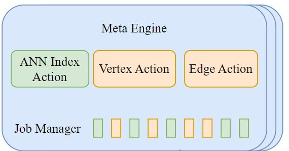

# 上篇：初识 Nebula Graph —— 向量类型支持

📚 本系列文章分为上中下三篇，记录了我在开源之夏项目中，开发 Nebula Graph 向量搜索功能的一些复盘和思考，希望可以给大家学习和开发类似系统时有一定的样本参考。希望大家多多关注和交流，大家一起进步 😊 欢迎订阅我的个人网站:rocket: [tom-jerr.github.io](https://tom-jerr.github.io/)

> 上篇主要介绍 Nebula Graph 的整体执行流程，重点讲解向量类型的设计和向量存储的设计思路。

> 中篇主要介绍如何支持向量属性的 DDL 和 DML 语句(:skull: 走了很多设计的弯路)。

> 下篇主要介绍如何实现向量索引和向量搜索功能。

在真正开始对 Nebula Graph 进行大刀阔斧的改动之前，我们必须先了解，一条 Cypher 语句是如何在系统中执行的。当有了对语句执行的基本概念，我们可以开始深入每个模块进行修改来支持向量功能。

这篇文章主要从对 Nebula Graph 的整体执行流程出发，聚焦如何实现 Vector 数据类型以及 Vector 存储。

## 一条 Cypher 语句的前世今生

⚠ 需要注意的是，整个 Nebula Graph 系统的执行路径都是异步的，调用者立即拿到 Future，而执行者在工作完成后通过 Promise 填充结果，然后自动触发 Future 上的回调执行后续逻辑。

### Overview

1. 用户在 `console` 或者通过 `sdk` 输入 Cypher 语句到 Graph Service，立即返回给用户 Future，线程池的工作线程开始执行下面的真实工作流程。
2. Graph Service 将 Query、Session、Storage 等打包成 Request Context，随后将 Request Context 打包成 Query Context，创建 Query Instance 随后开始执行 parse、validate、optimize、execute 整个流程，这里生成了 Graphd 的物理计划。
   - Query Context 的生命周期从语句传入 Graphd 开始，到向 client 返回结果
3. 然后将 Request Context 传入 Scheduler，按照算子树依次执行每个物理节点计划。
4. 每个物理节点计划在 Graphd 中存在一个 executor，实际上里面调用了 storaged 的 processor。
5. Storaged 的每个 processor 内部也会生成自己的执行计划。
   - 真正对数据的操作计划的每个节点上(node)：从 RocksDB 中获取或者存储 KV 对，实际上是通过 raft-wal 进行集群间的数据同步（确保原子性和一致性），然后用结果去设置 Promise，触发 Future 回调返回给 client 结果。


### Details

实际上比较重要的就是三个守护进程：计算节点 Graphd、元数据节点 Metad 和存储节点 Storaged，下面以 Insert 语句执行为例，详细解释下整个语句执行流程。

#### Graphd

Graphd 大体上分为 parse，validate，planner，optimize，execute 这几个阶段。所有的 statement、execplan 以及最后的 resultset 包括原始的 Query 语句，都存储在 RequestContext 中。

- 构建 RequestContext 并把 Query 语句传入，根据 RequestContext 构建 Query Instance。开启所有的异步流程后，返回用户一个 Future。
- 在 Query Instance 中执行 parse，将语句解析成 sentence(statement)。
- 在 validate 中通过`validateimpl`方法进行 check，校验是否满足 schema 以及是否数据未超范围。

  ```c++
    Status InsertVerticesValidator::validateImpl() {
      spaceId_ = vctx_->whichSpace().id;
      NG_RETURN_IF_ERROR(check());
      NG_RETURN_IF_ERROR(prepareVertices());
      return Status::OK();
    }
  ```

- 通过 validator 的`toplan`方法将 sentence 变成 execution plan tree。

  ```c++
    Status InsertVerticesValidator::toPlan() {
      auto doNode = InsertVertices::make(qctx_,
                                        nullptr,
                                        spaceId_,
                                        std::move(vertices_),
                                        std::move(tagPropNames_),
                                        ifNotExists_,
                                        ignoreExistedIndex_);
      root_ = doNode;
      tail_ = root_;
      return Status::OK();
    }
  ```

- 将逻辑执行计划树交给 Optimizer 进行优化，nebula 现在的优化是 **Rule-based optimization，每个执行计划需要遍历所有的 rules，得到最优的物理执行计划。**
- 然后将整个物理计划交给 Scheduler 进行执行，在 Scheduler 中按照计划树的父子关系，从下之上依此执行计划，所有的计划都是用 Future 异步执行。

  - 首先先根据 Logical Plan 构造出 Physical Plan(Execution Plan)

    ```c++
    Executor *Executor::makeExecutor(const PlanNode *node,
                                 QueryContext *qctx,
                                 std::unordered_map<int64_t, Executor *> *visited)
    ```

  - 对 Executor 进行调度，parent plan 节点需要所有的 children plan 节点都执行完后才开始执行。

  ```c++
    folly::Future<Status> AsyncMsgNotifyBasedScheduler::scheduleExecutor(
    std::vector<folly::Future<Status>>&& futures, Executor* exe, folly::Executor* runner) const {
    switch (exe->node()->kind()) {
      // ...
      case PlanNode::Kind::kArgument: {
        return runExecutor(std::move(futures), exe, runner);
      }
      default: {
        if (exe->depends().empty()) {
          return runLeafExecutor(exe, runner);
        } else {
          return runExecutor(std::move(futures), exe, runner);
        }
      }
    }
    }
    folly::Future<Status> AsyncMsgNotifyBasedScheduler::runExecutor(
      std::vector<folly::Future<Status>>&& futures, Executor* exe, folly::Executor* runner) const {
    return folly::collect(futures).via(runner).thenValue(
        [exe, this](auto&& t) mutable -> folly::Future<Status> {
          NG_RETURN_IF_ERROR(checkStatus(std::move(t)));
          // Execute in current thread.
          return execute(exe);
        });
    }

    folly::Future<Status> AsyncMsgNotifyBasedScheduler::runLeafExecutor(Executor* exe,
                                                                      folly::Executor* runner) const {
      return std::move(execute(exe)).via(runner);
    }
  ```

- 在 runExecutor 方法中会调用 graphd 中的 executor，进行物理计划的执行。里面涉及到存储层的内容时会通过 RPC 向 Storaged 请求服务。

#### Storaged

Storaged 接收到 graphd 发送的 executor 请求，启动对应的 Processor，执行`process`方法，实际上执行`doProcess`方法。


- 对于查询语句来说，实际上 `doProcess` 方法也会生成 Storage 的执行计划，对 RocksDB 进行操作，这里对于 Insert 语句来说就是简单的执行 `doPut` 操作，通过 raft-wal 向 RockDB 中写入数据
- 在执行完逻辑后，将所有的更改写入集群，最后在回调中执行`handleAsync`方法，实际上是执行`onFinished`方法，`onFinished`方法中设置 promise 的 value 为 RESP，RESP 中包含查询的结果，一层层返回直到返回给客户端。

  ```c++
  template <typename RESP>
  void BaseProcessor<RESP>::doPut(GraphSpaceID spaceId,
                                  PartitionID partId,
                                  std::vector<kvstore::KV>&& data) {
    this->env_->kvstore_->asyncMultiPut(
        spaceId, partId, std::move(data), [spaceId, partId, this](nebula::cpp2::ErrorCode code) {
          handleAsync(spaceId, partId, code);
        });
  }

  template <typename RESP>
  void BaseProcessor<RESP>::handleAsync(GraphSpaceID spaceId,
                                      PartitionID partId,
                                      nebula::cpp2::ErrorCode code) {
    bool finished = false;
    {
      std::lock_guard<std::mutex> lg(this->lock_);
      handleErrorCode(code, spaceId, partId);
      this->callingNum_--;
      if (this->callingNum_ == 0) {
        finished = true;
      }
    }
    if (finished) {
      this->onFinished();
    }
  }

  virtual void onFinished() {
    memory::MemoryCheckOffGuard guard;
    this->result_.failed_parts_ref() = this->codes_;
    this->resp_.result_ref() = std::move(this->result_);
    this->promise_.setValue(std::move(this->resp_));
    delete this;
  }
  ```

##### doPut

- 写入更改是 doPut 操作，该操作实际上是对 raft 提交日志，驱动 raft 状态机将该操作同步到集群中。

  

- Raft 的日志复制过程大致分为三个步骤：
  1. Leader：首先检查自身状态，然后先写入本地 WAL，然后将所有 log 复制到所有 follower
  2. Follower：Followers 也会将新日志写入自己的 WAL，并向 Leader 回复 “成功”。
  3. Leader：包括自己在内的大多数（Majority） 节点都已成功将该日志写入其 WAL，Leader 就会认为这条日志是 **“已提交” (Committed)** 的。Leader 就可以安全地将该日志（即 KV 操作）应用到其状态机（即真正执行 multiPut）

```c++
void RaftPart::appendLogsInternal(AppendLogsIterator iter, TermID termId) {
  do {
	// Process 1
  // Step 1: Write Local WAL
    {
      SCOPED_TIMER(
      if (!wal_->appendLogs(iter)) {
        break;
      }
    }
  } while (false);


  // Step 2: Replicate to followers
  auto* eb = ioThreadPool_->getEventBase();
  replicateLogs(eb, std::move(iter), currTerm, lastId, committed, prevLogTerm, prevLogId);
  return;
}

// process 2 & 3
void RaftPart::replicateLogs(folly::EventBase* eb,
                             AppendLogsIterator iter,
                             TermID currTerm,
                             LogID lastLogId,
                             LogID committedId,
                             TermID prevLogTerm,
                             LogID prevLogId) {
  collectNSucceeded(gen::from(hosts) |
                        gen::map([self = shared_from_this(),
                                  eb,
                                  currTerm,
                                  lastLogId,
                                  prevLogId,
                                  prevLogTerm,
                                  committedId](std::shared_ptr<Host> hostPtr) {
                          return via(eb, [=]() -> Future<cpp2::AppendLogResponse> {
                            // 向所有 follower 发送 AppendLogs 请求
                            return hostPtr->appendLogs(
                                eb, currTerm, lastLogId, committedId, prevLogTerm, prevLogId);
                          });
                        }) |
                        gen::as<std::vector>(),
                    quorum_,
                    [hosts](size_t index, cpp2::AppendLogResponse& resp) {
      // Process 2: 收集到了半数节点通过
                      return resp.get_error_code() == nebula::cpp2::ErrorCode::SUCCEEDED &&
                             !hosts[index]->isLearner();
                    })
      .via(executor_.get())
      .then([self = shared_from_this(),
             eb,
             it = std::move(iter),
             currTerm,
             lastLogId,
             committedId,
             prevLogId,
             prevLogTerm,
             pHosts = std::move(hosts),
             beforeAppendLogUs](folly::Try<AppendLogResponses>&& result) mutable {
        // Process 3: followers 真正开始进行写入
        self->processAppendLogResponses(*result,
                                        eb,
                                        std::move(it),
                                        currTerm,
                                        lastLogId,
                                        committedId,
                                        prevLogTerm,
                                        prevLogId,
                                        std::move(pHosts));
        return *result;
      });
}
```

#### Metad

一般 Metad 主要参与 DDL 的语句执行流程，负责存储 Tag/Edge 的 Schema 以及一些索引的元数据信息。管理 ReBuild Index 等需要与 Storaged 同步的 Job



## Our Work

我们已经梳理了一条 Cypher 语句从输入到执行的完整流程，接下来我们就可以开始对 Nebula Graph 进行改动，支持向量类型以及向量存储。

Nebula Graph 的实际类型存储是以 KV 对的形式存储在 RocksDB 中的，Key 有自己特殊的结构，Value 则是属性值的二进制序列化结果。因此我们需要做两方面的工作：

1. 设计向量类型 (Vector Data Type)：实现向量数据类型和属性、序列化和反序列化
2. 设计向量存储 (Vector Storage)：修改存储引擎，支持向量属性的单独存储和读取，设计向量属性的 Key 和 Value 格式
   > 为了方便后面的向量索引设计，我们将向量属性单独存储在一个 Column Family 中，其他属性存储在默认的 Column Family 中。

### 向量类型设计

Nebula Graph 中已经有了支持多 Value 的数据类型 List，但是我们仍然需要设计新的 Vector 类型。
**Why?**

> 向量与标准中已支持的数组在以下方面有所不同：

> - 数组类型是一种集合类型。数组是值的集合。这些值在数组之外可能具有意义。例如，在一个电话号码数组中，每个电话号码在数组之外都有其意义。相比之下，向量的单个坐标本身在向量之外没有太多意义。
> - 一个向量类型中的所有向量都具有相同的维度 $n$。$1$ 和 $n$ 之间的每个坐标都是非空值。这与数组类型形成对比，数组类型通过声明的最大基数 $n$ 来支持可变的基数，并且允许每个元素为空值。
> - 向量类型除了`==`和`!=`，其他的算数操作均不应该支持

#### Vector Value Type

Vector 类型主要由一个 `std::vector<float>` 组成


#### Vector Property Type

- 新增属性类型，其值类型为 VECTOR (向量)。
- 在 common.thrift 中为向量 (VECTOR) 值类型添加新模式。

```thrift
// Vector type
struct Vector {
    1: list<double> values;
} (cpp.type = "nebula::Vector")
```

#### 序列化和反序列化

为 Vector 类型实现下面的接口即可

```cpp
template <class Protocol>
uint32_t Cpp2Ops<nebula::Vector>::write(Protocol* proto, nebula::Vector const* obj;

template <class Protocol>
void Cpp2Ops<nebula::Vector>::read(Protocol* proto, nebula::Vector* obj);

template <class Protocol>
uint32_t Cpp2Ops<nebula::Vector>::serializedSize(Protocol const* proto, nebula::Vector const* obj);

template <class Protocol>
uint32_t Cpp2Ops<nebula::Vector>::serializedSizeZC(Protocol const* proto,
                                                   nebula::Vector const* obj);
```

### 向量存储设计

我们的目标是将向量属性存储在 Nebula Graph 的存储引擎中，Nebula Graph 默认的存储引擎是 RocksDB，同时需要支持一个 Tag/Edge 上同时存在**多个向量属性**。

我们的设计是将向量属性和其他属性分开存储，方便后续创建向量索引。那么我们的工作就变成了：

- 修改存储引擎，支持向量属性的单独存储和读取(当前 Nebula Graph 只支持 RocksDB 的默认 Column Family)
- 设计向量属性的 Key 和 Value 格式

#### Why?

在 Nebula Graph 默认设计中，所有属性（包括标量属性、文本属性、向量属性）都存放在 Default Column Family 里，即：

```cpp
Key = {tag_id, vertex_id, property_name}
Value = {encoded property value}
```

但这对向量属性来说有几个问题：

- 数据膨胀：向量数据通常是高维（如 512D 或 1024D），单条记录体积大，容易造成 LSM-tree 写放大和 Compaction 压力；

- 访问模式不同：普通属性多为点查或条件过滤，而向量属性读取通常是批量读取或扫描式（构建索引时需要读所有向量）；

- Scan 效率低：向量索引构建时需要扫描所有向量数据，若与普通属性混存，读取时会带来大量无用数据的 IO 开销和解析开销

所以我们决定将向量属性单独存储在一个 Column Family 里，其他属性继续存储在 Default Column Family 里。

#### 存储引擎修改

所有的属性都是存在 RocksDB 中的 KV 对中，一般属性的 Key 由 `partId + tagId/edgeId + vertexId + propId` 组成，Value 则是属性值的二进制序列化结果。

如下图所示，我们可以利用 RocksDB 的 Column Family 功能，将向量属性单独存储在一个 Column Family 中，其他属性存储在默认的 Column Family 中。

> 这里的 ID-VID Column Family 是后续创建向量索引时需要的，这里先不详细介绍。


:joy: 有趣的是，RockDB 支持多 Column Family 需要先使用默认列族打开 RocksDB，然后创建其他列族并获取这些列族的句柄（CF handles）。接着关闭数据库，再使用多个列族句柄重新打开该数据库。

```cpp
// We need first open the db with default column family, then create the other column families.
// Last we reopen the db with all column families.
rocksdb::Options singleCFOptions(dbOptions, cfDescriptors[0].options);
initRocksdbOptions(singleCFOptions, spaceId, vIdLen);
status = rocksdb::DB::Open(singleCFOptions, path, &db);

size_t cfCount = cfDescriptors.size();
for (size_t i = 0; i < cfCount; ++i) {
  if (cfDescriptors[i].name == NebulaKeyUtils::kDefaultColumnFamilyName) {
    continue;
  }
  rocksdb::ColumnFamilyHandle* handle = nullptr;
  status = db->CreateColumnFamily(cfDescriptors[i].options, cfDescriptors[i].name, &handle);
  if (!status.ok()) {
    LOG(FATAL) << "Failed to create column family " << cfDescriptors[i].name << ": "
                << status.ToString();
  }
}
delete db;
db = nullptr;
cfHandles_.clear();
status = rocksdb::DB::Open(dbOptions, path, cfDescriptors, &cfHandles_, &db);
```

#### 向量 Key 和 Value 格式

我们设计向量属性的 Key 格式为 `type + partId + tagId + vertexId + propId`，可以区分单个 Tag 中的向量属性。Value 则是 vector data type 的二进制序列化结果。

> 这样的设计可以支持**一个 Tag 中有多个 vector 属性**
> 不同的 tag 或属性可以用不同的 propId 区分，不会相互影响

```shell
VectorTagKey: () 里面是字节数
type(1) + partId(3) + vertexId(*) + tagId(4) + propId(4)

VectroEdgeKey:
type(1) + partId(3) + srcId(*) + edgeType(4) + edgeRank(8) + dstId(*) + propId(4) +placeHolder(1)

```
