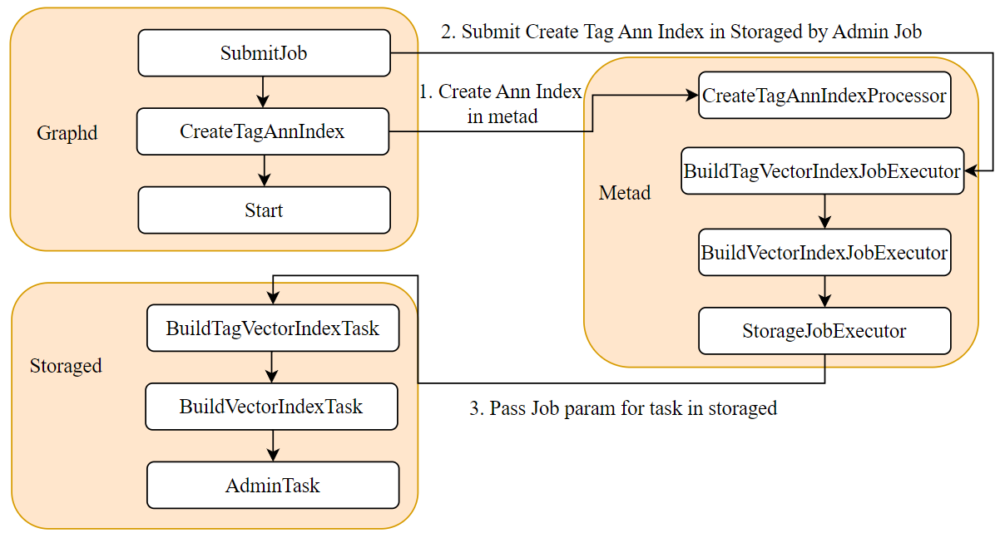
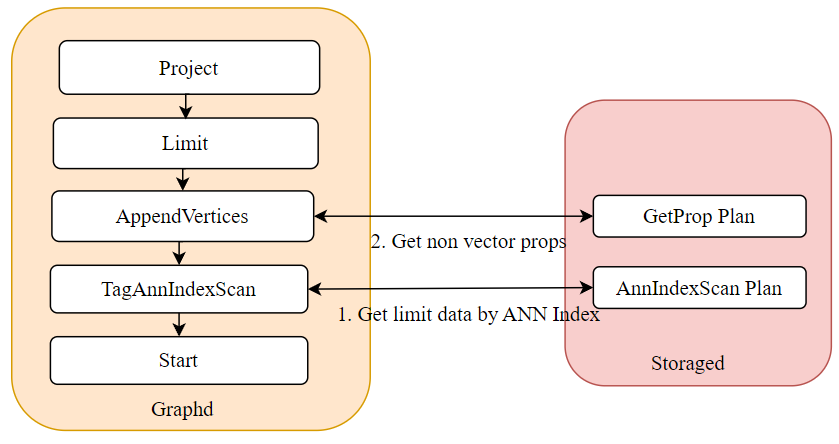
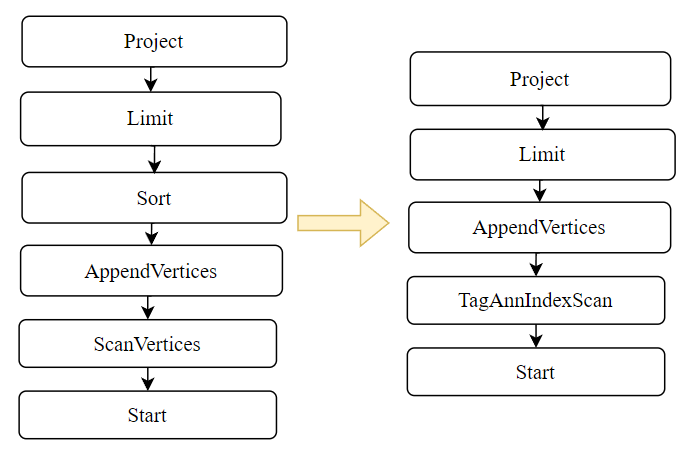
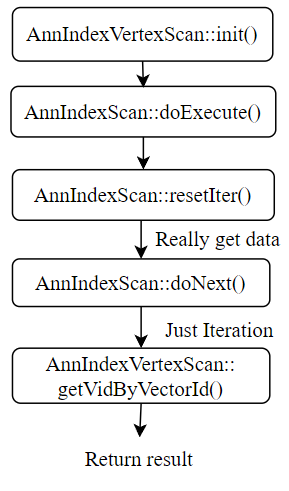

# 下篇：向量索引与相似度搜索 —— Nebula Graph 的 ANN 实现之路

📚 本系列文章分为上中下三篇，记录了我在开源之夏项目中，开发 Nebula Graph 向量搜索功能的一些复盘和思考，希望可以给大家学习和开发类似系统时有一定的样本参考。希望大家多多关注和交流，大家一起进步 😊 欢迎订阅我的个人网站:rocket: [tom-jerr.github.io](https://tom-jerr.github.io/)

> 本篇主要介绍如何支持 Ann 索引和 Ann Search。

在[nebula graph 的上篇](https://tom-jerr.github.io/blogs/posts/%E4%B8%8A%E7%AF%87%EF%BC%9A%E5%88%9D%E8%AF%86%20Nebula%20Graph%20%E2%80%94%E2%80%94%20%E5%90%91%E9%87%8F%E7%B1%BB%E5%9E%8B%E6%94%AF%E6%8C%81/)和[中篇](https://tom-jerr.github.io/blogs/posts/%E4%B8%AD%E7%AF%87%EF%BC%9AVector%20%E7%B1%BB%E5%9E%8B%E7%9A%84%20DDL%26DML%20%E9%80%82%E9%85%8D/)，我们已经实现了 Vector 类型的存储以及对 DDL 和 DML 的适配。现在我们需要实现 Ann Index 构建和 Ann Search，这里分三个步骤来实现：

- 构建 Ann Index Adapter，将 HNSWlib 和 faiss 封装成统一的接口
- 实现 Ann Index 的 DDL，支持创建和删除 Ann Index
- 利用 Ann Index 进行 Ann Search

这里面也有一些关键问题需要解决：

1. Ann Index 的生命周期管理谁来负责？
2. Ann Index 的数据存储在哪里？
3. Ann Search 生成的计划如何使用 Ann Index 进行搜索？

我们会在下面的章节中结合三个步骤逐一进行说明，并且分享我们在实现过程中得到的经验教训。

> :warning: 这里为了简化，我们假设使用 Tag Schema 进行说明

## Ann Index Interface

### Ann Index Lifecycle

向量索引的生命周期由存储服务器管理。执行创建索引命令后，向量索引将被插入；执行删除索引命令后，向量索引将被删除。在其他情况下，存储服务器将继续维护此索引。

> 在 Ann Index DDL 章节中会详细介绍创建和删除索引的实现。实际上是通过 `VectorIndexManager` 来管理向量索引的生命周期，这个单例会维护一个内存中的向量索引映射表，Key 是 `GraphSpaceID + PartID + IndexID`，Value 是具体的向量索引实例。

> 这个 `VectorIndexManager` 在存储守护进程**启动时初始化(加载持久化的向量索引)**，在进程退**出前持久化**所有的向量索引到磁盘。

### Ann Index Persistence

我们这里暂时没有考虑到分布式一致性和宕机重启情况，所以只是简单的调用 faiss 和 hnswlib 的序列化 ann index 接口，以二进制形式写入本地文件。

> 实际上这些 ann search 库持久化底层使用的也是 C++ IOStream **序列化机制**

### Memory Tracked

暂时我的实现是使用 Nebula 内置的 MemoryTracker 定期查询内存索引的大小。如果超过限制，则无法插入新的 Vector

### Ann Index Interface

为了支持不同的向量索引库，我们需要定义一个统一的向量索引接口 `AnnIndex`，并且实现不同的向量索引适配器。这个接口主要包含以下方法：

```cpp
class AnnIndex {
 public:
  AnnIndex() = default;

  AnnIndex(GraphSpaceID graphID，
           PartitionID partitionID，
           IndexID indexID，
           const std::string &indexName，
           bool propFromNode，
           size_t dim，
           const std::string &rootPath，
           MetricType metricType，
           size_t minTrainDataSize = 3);

  virtual ~AnnIndex() = default;
  AnnIndex(const AnnIndex &) = delete;
  AnnIndex &operator=(const AnnIndex &) = delete;

  [[nodiscard]] virtual Status init(const BuildParams *params) = 0;
  // add data to index incrementally
  [[nodiscard]] virtual Status add(const VecData *data) = 0;
  // upsert data to index
  [[nodiscard]] virtual Status upsert(const VecData *data) = 0;
  // soft delete data from index， return number of deleted vectors
  [[nodiscard]] virtual StatusOr<size_t> remove(const IDSelector &sel) = 0;

  // ann search
  [[nodiscard]] virtual Status search(const SearchParams *params， SearchResult *res) = 0;
  // reconstruct vector by id
  [[nodiscard]] virtual StatusOr<Vector> reconstruct(VectorID id) = 0;

  // load index file from disk
  // flush index to disk
  [[nodiscard]] virtual Status read(const std::string &file) = 0;
  [[nodiscard]] virtual Status write(const std::string &dir， const std::string &file) = 0;
  virtual AnnIndexType indexType() const = 0;
  virtual std::string toString() const = 0;
};
```

### Concurrent Ann Index

通过实现 `AnnIndex` 接口，我们构建了两个向量索引：一个底层使用 Faiss IVF 索引，另一个底层使用 HNSWlib HNSW 索引。为了实现并发，我们在向量索引中使用了读写锁。这允许多个查询执行 Ann Search，但只允许执行一个查询执行对索引的 DML 操作（添加或删除）。

### Ann Index Utils

为了简化向量索引的使用，我们定义了一些辅助数据结构和枚举类型：

- `MetricType`：表示向量距离度量类型，如 L2 距离和内积。
- `AnnIndexType`：表示向量索引类型，如 IVF 和 HNSW。
- `IDSelector`：用于选择要删除的向量 ID 列表。
- `VecData`：表示向量数据，包括向量数量、维度、数据和 ID。
- `BuildParams`：表示向量索引构建参数的基类，以及其派生类 `BuildParamsIVF` 和 `BuildParamsHNSW`。
- `SearchParams`：表示向量搜索参数的基类，以及其派生类 `SearchParamsIVF` 和 `SearchParamsHNSW`。
- `SearchResult`：表示向量搜索结果，包括向量 ID、距离和向量数据。

```cpp
enum MetricType : int8_t { L2， INNER_PRODUCT };
enum AnnIndexType : int8_t { IVF， HNSW };

// faiss used
struct IDSelector {
  size_t cnt;
  VectorID* ids;  // vector of IDs to select
};

struct VecData {
  size_t cnt;     // number of vectors
  size_t dim;     // dimension of each vector
  float* fdata;   // float type vector data source
  VectorID* ids;  // int64 identifier of each vector
};

struct OwnedVecData {
  std::vector<float> flat;
  std::vector<VectorID> ids;
  VecData view;
};

// ANN index build parameters
struct BuildParams {
  MetricType metricType{MetricType::L2};
  AnnIndexType indexType{AnnIndexType::IVF};
};

struct BuildParamsIVF final : public BuildParams {
  size_t nl{3};  // number of lists
  size_t ts{3};  // train size
};

struct BuildParamsHNSW final : public BuildParams {
  size_t maxDegree{16};      // the maximum degrees
  size_t efConstruction{8};  // expansion in construction time
  size_t capacity{10000};    // capacity of the index
};

struct SearchParams {
  size_t topK{10};        // number of nearest neighbors to search
  float* query{nullptr};  // query vector data
  size_t queryDim{0};     // dimension of query vector
};

struct SearchParamsIVF final : public SearchParams {
  size_t nprobe{10};  // number of lists to probe
};

struct SearchParamsHNSW final : public SearchParams {
  size_t efSearch{16};  // expansion factor at search time
};

// ANN search result
struct SearchResult {
  std::vector<VectorID> IDs;
  // distances of the result vectors
  std::vector<float> distances;
  // result vectors
  std::vector<float> vectors;
};
```

## Ann Index DDL

Ann Index DDL 功能的主要设计目标是支持对多个共享同名属性的标签进行索引。这需要新的 DDL 语法、元数据结构以及 Graphd 、 Metad 和 Storaged 之间协调的执行流程。

### Create Ann Index Syntax

- Tag Ann Index Creation Syntax

```shell
CREATE TAG ANNINDEX <index_name> ON <tag_name_list>::(<field_name>) [IF NOT EXISTS] ann_index_params}[COMMENT '<comment>']
```

- Ann Index Parameters

  - `ANNINDEX_TYPE`: Index type， support `IVF` and `HNSW`
  - `DIM`: Vector dimension
  - `METRIC_TYPE`: Metric type， support `L2` and `INNER_PRODUCT`
  - `NLIST`: Number of lists， only for `IVF` index
  - `TRAINSIZE`: Training size， only for `IVF` index
  - `MAXDEGREE`: Maximum degree， only for `HNSW` index
  - `EFCONSTRUCTION`: Expansion factor at construction time， only for `HNSW` index
  - `MAXELEMENTS`: Capacity of the index， only for `HNSW` index

```shell
{ANNINDEX_TYPE: "IVF"， DIM:128， METRIC_TYPE:"L2"， NLIST:3， TRAINSIZE:3}
{ANNINDEX_TYPE: "HNSW"， DIM:128， METRIC_TYPE:"L2"， MAXDEGREE:15， EFCONSTRUCTION:200， MAXELEMENTS:10000}
```

### Thrift Structure

#### 1. Thrift Ann Index Item

- 通用索引项定义了单个模式中多个字段的索引，其索引参数仅包含 `s2_max_level` 和 `s2_max_cells` ，这无法满足 Ann 索引对跨多个模式的同名属性创建索引的要求。因此，我们设计了一个新的 Ann 索引项。

```cpp
struct IndexItem {
    1: common.IndexID       index_id，
    2: binary               index_name，
    3: common.SchemaID      schema_id
    4: binary               schema_name，
    5: list<ColumnDef>      fields，
    6: optional binary      comment，
    7: optional IndexParams index_params，
}
```

- Ann 索引项定义了在多个模式中同名属性之间创建索引的过程，包括所有需要建立索引的模式的信息。同时，它还使用一个列表来存储创建 Ann 索引所需的参数。

> ```cpp
> ann index params:
> [IVF/*ann type*/， 128 /*dim*/， L2/*metric type*/， 3/*nlist*/， 3/*train size*/]
> [HNSW/*ann type*/， 128 /*dim*/， L2/*metric type*/， 16/*max degree*/， 200/*ef construction*/， 100000/*max elements*/]
> ```

```cpp
struct AnnIndexItem {
    1: common.IndexID           index_id，
    2: binary                   index_name，
    3: binary                   prop_name，
    4: list<common.SchemaID>    schema_ids，
    5: list<binary>             schema_names，
    6: list<ColumnDef>          fields，
    7: optional binary          comment，
    8: optional list<binary>    ann_params，
}
```

#### 2. Thrift Request & Response Structure

- DDL 在 Graphd 接收到创建 Ann Index 请求后，会将请求转换为 Thrift 请求发送到 Metad。我们定义了以下 Thrift 结构：

  ```cpp
  struct CreateTagAnnIndexReq {
      1: common.GraphSpaceID      space_id，
      2: binary                   index_name，
      3: list<binary>             tag_names，
      4: IndexFieldDef            field，
      5: bool                     if_not_exists，
      6: optional binary          comment，
      7: optional list<binary>    ann_params，
  }
  ```

- Storaged 会定期向 Metad 请求 Ann Index 元数据，并根据元数据创建向量索引实例。所以我们需要新的 request 将所有的 Ann Index 元数据发送到 Storaged：

  ```cpp
  struct ListTagAnnIndexesResp {
      1: common.ErrorCode         code，
      2: common.HostAddr          leader，
      3: list<AnnIndexItem>	items，
  }
  struct ListEdgeAnnIndexesResp {
      1: common.ErrorCode         code，
      2: common.HostAddr          leader，
      3: list<AnnIndexItem>    	items，
  }
  ```

### Core Component

我们的设想是在 Storaged 中维护我们的向量索引实例，为了与其他功能模块解耦，我们设计了一个核心组件 `VectorIndexManager` 来管理所有的向量索引实例。

- 在存储守护进程中，设计一个 `VectorIndexManager` 单例来管理 Storaged 中的所有 Ann Index。
- Ann Index 的生命周期：
  - 创建 ：通过 `CreateTagAnnIndex` 请求创建 Ann 索引。
    > 除非删除，否则它将始终保存在内存中。退出时需要将所有 Ann Index 持久化到磁盘，并在系统重启后从磁盘重新加载。
  - 访问 ：通过 `GetTagAnnIndex` 请求访问 Ann 索引用于加速 Ann Search。
  - 删除 ：通过 `DropTagAnnIndex` 请求删除 Ann Index。
  - 更新 ：通过 `UpdateTagAnnIndex` 请求更新 Ann Index。
- 实际上，`VectorIndexManager` 维护了一个内存中的向量索引映射表，Key 是 `GraphSpaceID + PartID + IndexID`，Value 是具体的 Ann Index 的智能指针。

```cpp
class VectorIndexManager final {
 public:
  static VectorIndexManager& getInstance();
  Status init(meta::IndexManager* indexManager， std::string annIndexPath);
  Status start();
  Status stop();

  // Create & Rebuild
  Status createOrUpdateIndex(GraphSpaceID spaceId，
                             PartitionID partitionId，
                             IndexID indexId，
                             const std::shared_ptr<meta::cpp2::AnnIndexItem>& indexItem);
  Status rebuildIndex(GraphSpaceID spaceId，
                      PartitionID partitionId，
                      IndexID indexId，
                      const std::shared_ptr<meta::cpp2::AnnIndexItem>& indexItem);

  // Access & Search
  StatusOr<std::shared_ptr<AnnIndex>> getIndex(GraphSpaceID spaceId，
                                               PartitionID partitionId，
                                               IndexID indexId);
  StatusOr<SearchResult> searchVectors(GraphSpaceID spaceId，
                                       PartitionID partitionId，
                                       IndexID indexId，
                                       const SearchParams& searchParams);

  // Update & Delete
  Status addVectors(GraphSpaceID spaceId，
                    PartitionID partitionId，
                    IndexID indexId，
                    const VecData& vecData);
  Status removeIndex(GraphSpaceID spaceId， PartitionID partitionId， IndexID indexId);

  // Utility
  std::vector<std::shared_ptr<AnnIndex>> getIndexesByPartition(GraphSpaceID spaceId，
                                                               PartitionID partitionId);
  bool hasIndex(GraphSpaceID spaceId， PartitionID partitionId， IndexID indexId) const;

  // ... private members for lifecycle management
};
```

### Create Index Execution Flow

创建过程是一个多步骤操作，涉及 Graphd 、 Metad 和 Storaged 。

#### 1. Graphd -> Metad -> Storaged

1. Graphd: 解析 `CREATE ANNINDEX DDL` 并生成生成计划 `Start->CreateTagAnnIndex->​​SubmitJob`。

2. Metad: 执行 `CreateTagAnnIndex` 步骤。Metad 会在内部创建 `AnnIndexItem` 元数据条目。创建成功后，提交一个 AdminJob。
3. Metad: 该 AdminJob 将 Ann Index 参数打包成 AdeminTask 发送给 Storaged。Storaged 通过其内部的 `AdminTaskManager` 处理这些任务以完成作业。这涉及到一个分布式时序问题：

   - Meta Client 会因缓存更新看不到新加入的索引。因此，我们在 Storaged 中使用了**重试机制**。如果多次重试失败，我们会直接从元服务器请求数据以强制刷新缓存。

   > Meta Client 缓存更新机制： 存储节点的 `IndexManager` 通过 `MetaClient` 获取索引信息，但 `MetaClient` 的缓存通过心跳周期进行更新：
   >
   > - 时序问题： 元服务创建索引后，存储节点需要等到**下一个心跳周期才能看到新索引**。
   >   同步问题： `getTagAnnIndex` 直接从缓存读取数据。如果缓存尚未更新，则会返回 IndexNotFound 错误。



#### 2. Storaged Ann Index Creation

存储节点在接收到创建 Ann Index 的 AdminTask 后，会生成真正的向量索引实例并将其存储在 `VectorIndexManager` 中。

对于每个分区，Storaged 会执行以下步骤：

1. 扫描 KVStore（RocksDB）中与属性名称匹配的所有 Vector 属性数据。

2. 将这些向量数据批量添加到新创建的向量索引实例中。

3. 将顶点 ID/边类型和向量 ID 之间的映射关系存储到 KVStore 的 id-vid 列族中。
   > 顶点 ID 的类型为 std::string。这里 VectorID 是通过哈希计算得到的，因此需要存储两个映射：VectorID->VertexID 和 VertexID->VectorID。


## Ann Search

为了在 Graphd 中支持 Ann Search，我们必须修改查询执行流程。当查询的 Tag/Edge 上存在 Ann Index 时，执行计划将优先扫描 Ann Index 以获取 limit \* K 条数据，然后再进行过滤。

这需要对**优化规则**、Graphd 执行计划以及 Storaged 中的执行计划进行修改，最主要的是在 Storaged 中添加一个新的 AnnIndexScan 节点。

### Ann Search Syntax

为了轻松区分 Ann Search 和原始的 MATCH 语句，我们设计了新的 `APPROXIMATE LIMIT` 语法。这使我们无需在 yacc 层面做过多改动。

语法示例：

```sql
MATCH (v:v1)
RETURN v， euclidean(vector(0.90， 0.85， 0.88)， v.embedding) AS distance
ORDER BY euclidean(vector(0.90， 0.85， 0.88)， v.embedding)
APPROXIMATE LIMIT 1
OPTIONS {ANNINDEX_TYPE:'IVF'， METRIC_TYPE:L2， NPROBE:2};
```

### Overview of Ann Search Execution Flow

1. Graphd (优化)： 优化规则识别出 `APPROXIMATE LIMIT` 语法，并生成一个包含 `TagAnnIndexCcan` 节点的物理执行计划。

2. Storaged (索引扫描)： Storaged 收到 `TagAnnIndexScan` 请求。它会生成一个内部计划，在底层的 Ann Index（例如 IVF）上执行搜索。

3. Storaged (返回 VIDs)： 索引扫描返回匹配的 `VectorID`。Storaged 随后将 `VectorID` 映射回 `vid`，并将 `vid` 返回给 Graphd。

4. Graphd (获取属性)： Graphd 调用 Storaged 的 `GetProp` 操作符，为上一步返回的 `vid` 批量获取其余的非向量属性。

5. Graphd (收尾)： Graphd 执行最终的 Limit 和 Project 操作，整理数据后返回给客户端



### Graphd Details

#### 1. Ann Search Optimization Rule

新的优化规则用于识别 Ann Search 模式并将其转换为 `TagAnnIndexScan` 计划。规则需要覆盖以下两种情况：

- 情况 1：不返回向量距离：

```sql
MATCH (v:tag5:tag6)
RETURN v
ORDER BY euclidean(vector(1.0，2.0，3.0)， v.vec)
APPROXIMATE LIMIT 3
OPTIONS {ANNINDEX_TYPE:'IVF'， METRIC_TYPE:L2， NPROBE:3}
```



- 情况 2：返回向量距离：`ApproximateLimit->Sort->Project->ScanVertices` 转换为 `Limit->TagAnnIndexScan`

```sql
MATCH (v:tag5:tag6)
RETURN v， euclidean(vector(1.0，2.0，3.0)， v.vec)
ORDER BY euclidean(vector(1.0，2.0，3.0)， v.vec)
APPROXIMATE LIMIT 1
OPTIONS {ANNINDEX_TYPE:'IVF'， METRIC_TYPE:L2， NPROBE:3}
```


#### 2. Attribute Expression Modification

为了支持在多个标签上对同名向量属性进行 Ann Search，我们必须修改 `AttributeExpression` 的处理方式。

```sql
MATCH (v:coach_vector:player_vector)
RETURN v， euclidean(vector(0.90， 0.85， 0.88)， v.embedding) AS distance
ORDER BY euclidean(vector(0.90， 0.85， 0.88)， v.embedding)
APPROXIMATE LIMIT 1
OPTIONS {ANNINDEX_TYPE:'IVF'， METRIC_TYPE:L2， NPROBE:2};
```

- 原有限制： 原始表达式强制要求使用 `v.tag.prop` 的形式来获取顶点属性，这样的话 `v.embedding` 会被识别成对 Tag 的获取直接返回 NULL 给用户。

- 修改后： **对于向量属性**，我们放宽了这一限制。系统现在支持 `v.embedding` 这种形式来获取 Vertex 的 Vector 属性，并

### Storaged Details

Graphd 的执行器会通过 RPC 调用 Storaged 上的服务。Storaged 内部会启动自己的执行器并生成 Storaged 计划。而我们主要需要修改的是 Storaged 计划中的 `AnnIndexScan` 节点和 `GetProp` 节点。


#### 1. AnnIndexScan Node

`AnnIndexScan` 的内部流程与 `IndexScan` 非常相似：

1. 初始化： 执行 `doExecute`，它会调用 `resetIter` 来准备数据。

2. 获取 VectorID： `resetIter` 负责调用 Ann Index（例如 IVF）的搜索接口。这一步返回的结果仅仅是 VectorID（ANN 索引内部的 ID），而不是实际的 vid。

3. 迭代与映射： `doNext` 负责遍历 `resetIter` 获取的 VectorID 结果。

4. 获取 VID： 在 `doNext` 内部，调用 `AnnIndexVertexScan::getVidByVectorid()` 函数。此函数通过获取 RocksDB 的 id-vid 列族数据，**得到 VectorID 对应的实际 vid**。

5. 返回数据： Storaged 将 vid 返回给 Graphd。



#### 2. GetProp Node

为了配合 Multi-Tag Ann Search，Storaged 中 `AppendVerticesExecutor` 执行计划里的 `GetProp` 节点也需要修改。

我们设计了一个新函数 `collectAllVertexProps`，用于收集**单个顶点的所有非向量属性和向量属性**。

- 目的： 当我们对 tag5 和 tag6 进行 Ann Search 时，一个顶点可能只匹配了 tag5（即它只有 tag5），但没有 tag6。

- 行为： `collectAllVertexProps` 函数能正确处理这种情况，将未匹配标签的属性设置为 **EMPTY**（空），确保返回给 Graphd 的数据结构始终一致。

GetProp 返回的属性示例：

```shell
 _vid|tag5.id|tag5.vec|tag5._tag|tag6.num|tag6.vec|tag6._tag
 "v7"|7|vector(1.9，2.0，2.1)|2|__EMPTY__|__EMPTY__|__EMPTY__
 "v8"|8|vector(2.2，2.3，2.4)|2|__EMPTY__|__EMPTY__|__EMPTY__
 "v6"|6|vector(1.6，1.7，1.8)|2|__EMPTY__|__EMPTY__|__EMPTY__
```

## 踩过的坑

实现这个功能过程中，一般我们遇到的问题都是设计不够周全导致的。这里总结几个比较典型的：

1. Ann Index 元数据设计不合理

   - 问题：最初我们尝试使用通用索引项 `IndexItem` 来表示 Ann Index 元数据，但它无法支持在多个标签上对同名属性创建索引的需求。
   - 解决方案：我们设计了新的 `AnnIndexItem` 结构，能够包含多个 Tag 的信息，并且使用列表来存储创建 Ann Index 所需的参数。

2. Ann Index 创建的时序问题

   - 问题：实现过程中并未考虑 Metad 和 Storaged 的时序问题，在测试时发现无法获取到 Ann Index
   - 原理：在 Metad 创建 Ann Index 后，Storaged 可能无法立即看到新创建的索引，因为 Meta Client 的缓存需要通过心跳周期更新。
   - 解决方案：我们在 Storaged 中实现了重试机制。如果多次重试失败，我们会直接从元服务器请求数据以强制刷新缓存。

3. Ann Search 优化规则不完善

   - 问题：最初的优化规则只覆盖了返回向量距离的情况，忽略了不返回向量距离的场景。
   - 解决方案：我们扩展了优化规则，确保它能够识别两种情况，并正确生成包含 `TagAnnIndexScan` 节点的执行计划。

4. Multi-Tag Ann Search 属性获取问题
   - 问题：在 Multi-Tag Ann Search 场景下，`v.embedding` 这种形式无法正确获取向量属性，导致返回结果总是为空。
   - 原因：原始的 `AttributeExpression` 实现强制要求使用 `v.tag.prop` 的形式来获取顶点属性。
   - 解决方案：我们修改了 `AttributeExpression` 的处理逻辑，允许对向量属性使用 `v.embedding` 这种形式进行访问。同时为了简化逻辑，我们设计了 `collectAllVertexProps` 函数，确保即使某些标签未匹配，其属性也会被设置为 EMPTY，从而保持数据结构的一致性。

## 总结

本文详细介绍了在 Nebula Graph 中实现向量索引和相似度搜索的完整过程，这是本系列的下篇。在前两篇文章中，我们已经完成了 Vector 类型的存储支持以及 DDL/DML 的适配，而本篇则聚焦于 Ann Index 的构建和 Ann Search 的实现。

> :sob: 实在是没有时间，分布式下的功能还没有完成，希望以后有机会再来填坑。

### 核心成果

通过本次开发，我们实现了以下核心功能:

1. **统一的 Ann Index 接口**: 设计了 `AnnIndex` 抽象接口，成功封装了 HNSWlib 和 Faiss 两种主流向量索引库，为后续扩展更多索引类型奠定了基础。

2. **完整的索引生命周期管理**: 通过 `VectorIndexManager` 单例实现了向量索引的创建、访问、更新和删除的完整生命周期管理，包括索引的持久化和重启后的自动加载。

3. **Multi-Tag Ann Index 支持**: 突破了传统索引只能作用于单个 Schema 的限制，实现了跨多个 Tag 对同名向量属性建立索引的能力，这是本次实现的一大亮点。

4. **高效的 Ann Search 执行流程**: 设计了从 Graphd 到 Storaged 的完整执行链路,包括新的优化规则、`TagAnnIndexScan` 执行节点,以及 VectorID 到 VertexID 的映射机制。

### 回顾关键问题

在文章开头，我们提出了三个关键问题。现在让我们来回顾一下这些问题的答案：

**问题 1：Ann Index 的生命周期管理谁来负责？**

答案：**由 Storaged 通过 `VectorIndexManager` 单例来管理**。这个单例维护了一个内存中的向量索引映射表（Key 为 `GraphSpaceID + PartID + IndexID`，Value 为具体的向量索引实例）。`VectorIndexManager` 在存储守护进程启动时初始化并加载持久化的索引，在进程退出前将所有索引持久化到磁盘。这种设计将索引实例维护在存储层，既保证了数据局部性，又简化了分布式环境下的一致性问题。

**问题 2：Ann Index 的数据存储在哪里？**

答案：**Ann Index 以两种形式存储**：

- **内存存储**：向量索引实例（IVF、HNSW）常驻内存，通过 `VectorIndexManager` 管理，以支持高性能的向量搜索。
- **磁盘持久化**：调用 Faiss 和 HNSWlib 的序列化接口，将索引以二进制形式写入本地文件系统。这些库底层使用 C++ IOStream 序列化机制。
- **映射关系存储**：VectorID 与 VertexID/EdgeType 之间的映射关系存储在 RocksDB 的 id-vid 列族中，确保能够将向量搜索结果转换回实际的顶点或边。

**问题 3：Ann Search 生成的计划如何使用 Ann Index 进行搜索？**

答案：**通过专门的优化规则和执行节点实现**：

1. **Graphd 优化阶段**：新的优化规则识别 `APPROXIMATE LIMIT` 语法，将 `ApproximateLimit->Sort->Project->ScanVertices` 转换为 `Limit->TagAnnIndexScan` 执行计划。
2. **Storaged 执行阶段**：`AnnIndexScan` 节点通过 `VectorIndexManager` 获取对应的向量索引实例，调用其 `search` 接口返回 VectorID 列表。
3. **ID 映射转换**：通过查询 RocksDB 的 id-vid 列族，将 VectorID 转换为实际的 VertexID。
4. **属性补全**：Graphd 使用返回的 VertexID 列表调用 `GetProp` 获取完整的顶点属性，通过 `collectAllVertexProps` 函数处理 Multi-Tag 场景。

### 关键技术决策

在实现过程中，我们做出了几个重要的技术决策:

- **索引生命周期由 Storaged 管理**: 将向量索引实例维护在存储层，既能保证数据局部性，又能简化分布式环境下的一致性问题。

- **新的元数据结构 `AnnIndexItem`**: 摆脱了通用 `IndexItem` 的限制，专门为 Ann Index 设计的元数据结构，能够更好地支持 Multi-Tag 场景。

- **重试机制解决时序问题**: 通过在 Storaged 中引入重试机制，解决了 Meta Client 缓存更新延迟带来的时序问题。

### 经验与教训

回顾整个开发过程，我们总结出以下几点经验:

1. **充分考虑分布式系统的时序问题**: 在分布式系统中，不同组件之间的状态同步是异步的。我们在 Ann Index 创建流程中遇到的 Meta Client 缓存更新问题就是一个典型案例。设计时应该充分考虑这类时序问题，并设计相应的重试或强制刷新机制。

2. **接口设计要考虑可扩展性**: `AnnIndex` 接口的设计使得我们能够轻松支持多种向量索引库。统一的接口不仅简化了上层调用逻辑，也为后续引入新的索引类型(如 DiskANN、ScaNN 等)预留了空间。

3. **优化规则要覆盖所有场景**: 在实现 Ann Search 优化规则时，我们最初只考虑了返回距离的场景，导致不返回距离的查询无法被优化。这提醒我们在设计优化规则时，需要全面梳理所有可能的查询模式。

4. **测试先行**: 在开发过程中，充分的测试帮助我们发现了许多设计上的疏漏，如 Multi-Tag 场景下的属性获取问题。完善的测试用例不仅能帮助发现 bug，还能驱动我们思考更多的边界情况。

### 展望

当前的实现已经基本满足了向量搜索的核心需求，但仍有一些可以优化和扩展的方向:

- **索引更新策略优化**: 当前的索引更新是实时的，对于大规模数据插入场景，可以考虑引入批量更新或异步更新机制。

- **更多索引类型支持**: 可以引入更多类型的向量索引，如基于磁盘的 DiskANN，以支持超大规模向量数据。

- **混合查询优化**: 探索向量搜索与图遍历的更深度融合，如在图遍历过程中动态执行向量过滤。

- **分布式索引**: 当前索引是按分区独立管理的，未来可以考虑实现跨分区的分布式索引，提升大规模场景下的查询性能。

通过这个项目，我深刻体会到在复杂的分布式系统中添加新功能的挑战性。它不仅需要对系统架构有深入的理解，还需要细致地考虑各种边界情况和性能优化。希望这个系列的分享能给正在开发类似功能的同学一些参考和启发。

最后，感谢 Nebula Graph 社区和开源之夏项目组提供的学习和实践机会！感谢我的项目曹志鹏导师的指导和 Nebula Graph 社区小姐姐的帮助！ 🎉

---

**相关文章**:

- [上篇：初识 Nebula Graph —— 向量类型支持](https://tom-jerr.github.io/blogs/posts/%E4%B8%8A%E7%AF%87%EF%BC%9A%E5%88%9D%E8%AF%86%20Nebula%20Graph%20%E2%80%94%E2%80%94%20%E5%90%91%E9%87%8F%E7%B1%BB%E5%9E%8B%E6%94%AF%E6%8C%81/)
- [中篇：Vector 类型的 DDL&DML 适配](https://tom-jerr.github.io/blogs/posts/%E4%B8%AD%E7%AF%87%EF%BC%9AVector%20%E7%B1%BB%E5%9E%8B%E7%9A%84%20DDL%26DML%20%E9%80%82%E9%85%8D/)
