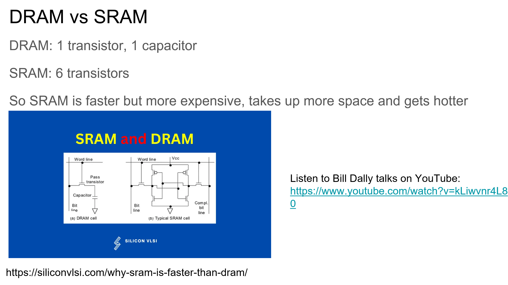
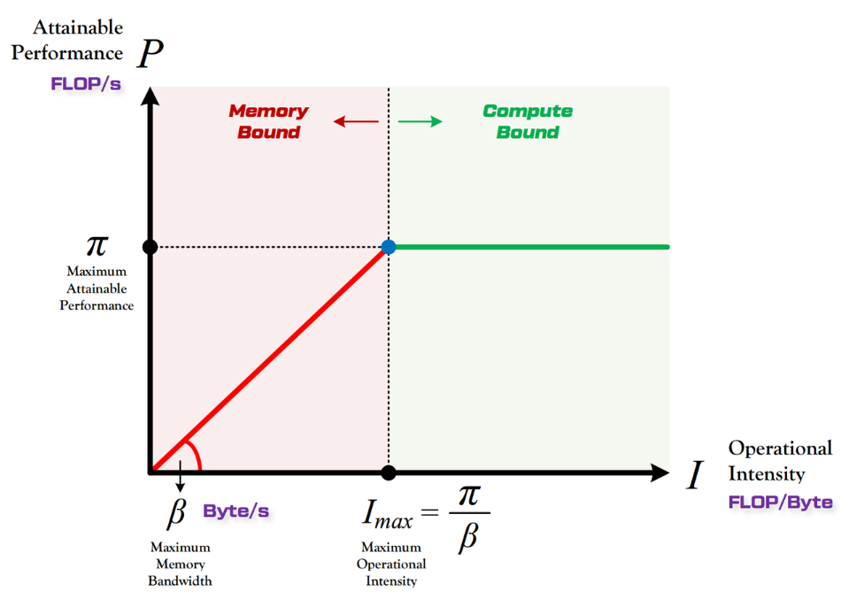
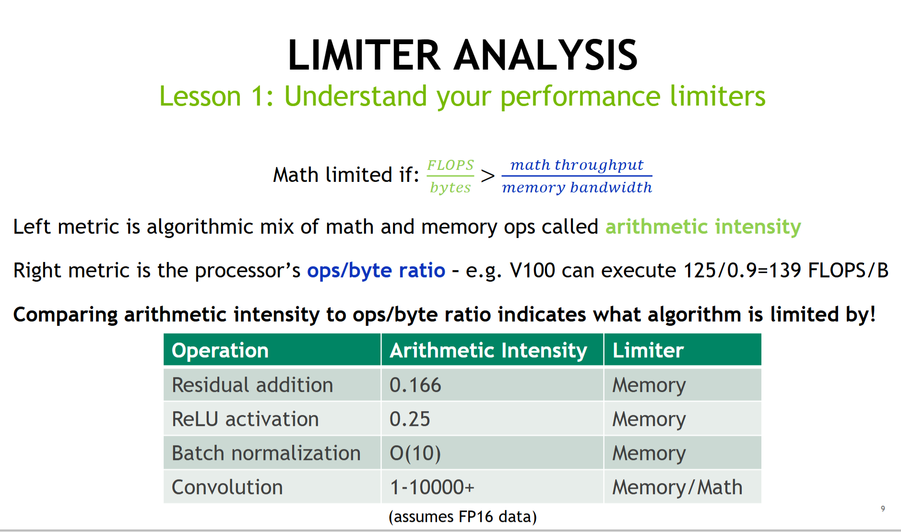

# CUDA Performance Checklist
## DRAM vs SRAM

- DRAM由1个晶体管和1个电容器构成；SRAM: 由6个晶体管构成
- SRAM 比 DRAM 更快，但也更贵；SRAM 占用更多空间且发热更多； 实际上SRAM就对应了GPU的Shared Memory，而DRAM对应的则是Shared Memory。
  
## Performance Checklist
- 合并全局内存访问（Coalesced Global Memory Access）
- 最大化占用率（Maximize occupancy）
- 理解是内存受限还是计算受限（Understand if memory or compute bound）
- 最小化线程分化（Minimize control divergence）
- Tiling以更好的重用数据（Tiling of reused data）
- 私有化（Privatization）
  - 使用Shared Memory/寄存器优化全局内存读取
- Thread Coarsening
  - 一个线程应该完成多少任务，一般情况下我们让一个线程完成的任务尽量少，但是在Compute Bound情况下，让一个线程执行更多的工作可以让程序运行得更快。
- 使用更好的数学方法重写算法（Rewrite your algorithm using better math）
  - like Flash Attention

## Memory Latencies
不同类型内存的访问延迟（以时钟周期为单位）：

- 全局内存（Global memory）: 290 cycles
- L2 缓存: 200 cycles
- L1 缓存: 33 cycles
- 共享内存（Shared Memory）: 读取23 cycles，写入19 cycles

吞吐量（Throughput）和延迟（Latency）的对比：
- 吞吐量容易提高，但延迟却很难降低。
  - 举例说明：即使你可以并行使用80条电话线，每条线传输一个比特，但100毫秒的延迟仍然存在。
- 量化（Quantization）技术：
  - 用于减少数据包大小的一种方法。
  - 例如，Bolo（可能是某个系统或协议）尽可能使用字节（byte）而不是16位或32位字来减少数据包大小

## Memory Coalescing
我们无法减少延迟，但可以通过读取连续的内存元素来隐藏延迟。Slides建议在进行案例研究时要关注以下三个方面：

- DRAM Throughput（DRAM吞吐量）
- Duration（持续时间）
- L1 cache 

### Example: Coalesced vs Non-Coalesced Access
- 定义了两个CUDA kernel：
  - copyDataNonCoalesced kernel：非合并内存访问模式，以非连续的方式读取输入数组（使用 (index * 2) % n 作为索引），这种访问模式会导致非合并的内存访问，可能降低性能。
  - copyDataCoalesced kernel：合并内存访问模式，以连续的方式读取输入数组（直接使用 index 作为索引），这种访问模式允许合并内存访问，可以提高性能。
- 主函数：
  - 分配统一内存（Unified Memory）用于输入和输出数组，初始化输入数组。
  - 设置CUDA网格和块的大小，分别运行非合并和合并的kernel，在每次kernel执行后使用 cudaDeviceSynchronize() 确保GPU操作完成

```cpp
__global__ void copyDataNonCoalesced(float *in, float *out, int n) {
    int index = blockIdx.x * blockDim.x + threadIdx.x;
    if (index < n) {
        out[index] = in[(index * 2) % n];
    }
}

__global__ void copyDataCoalesced(float *in, float *out, int n) {
    int index = blockIdx.x * blockDim.x + threadIdx.x;
    if (index < n) {
        out[index] = in[index];
    }
}
```
- 对于copyDataCoalesced kernel来说，DRAM内存吞吐量是82%，L1 Cache的吞吐量大约是37%，执行时间是558us。
- 对于copyDataNonCoalesced kernel来说，DRAM内存吞吐量大约是89%，L1 Cache的吞吐量是30%，kernel的执行时间是764us。

我们可以看到合并内存访问的kernel是有明显的性能提升的。可以预见，随着输入数据量的增大合并内存访问的优势会更明显。
- ncu的结果里面还提示计算的理论occupancy（100.0%）和实测的实际occupancy占用（77%）之间的差异可能是由于 kernel 执行期间的warp调度开销或工作负载不平衡导致的。
- 在同一kernel 的不同块之间以及块内的不同 warps 之间都可能发生负载不平衡。
- 把上面程序中的int blockSize = 128改成int blockSize = 1024再次用ncu profile，可以发现occupancy提升到了85.94%。

## Occupancy
- 两种quantization问题：
  - a) Tile quantization：矩阵维度不能被线程块Tile大小整除。
  - b) Wave quantization：Tile总数不能被GPU上的SM（流多处理器）数量整除。
- 性能图表比较和分析：
  - 左图(a)：cuBLAS v10 上 NN GEMM 的性能
  - 右图(b)：cuBLAS v11 上 NN GEMM 的性能
  - 两图都是在 M = 1024, N = 1024 的矩阵维度下进行的测试
  - 左图(a)显示性能呈现明显的阶梯状，有大幅波动。
  - 右图(b)显示性能波动较小，整体更加平滑。 我们可以看到cuBLAS v11 可能采用了更好的调度策略或优化技术，减少了由于Tile和Wave Quantization 导致的性能波动。


CUDA Occupancy calculator工具可以帮我们自动计算达到更好Occupancy的kernel启动参数
这时会出现新的问题
> 警告（WRN）：内存利用率高于计算利用率：请查看内存工作负载分析部分以识别DRAM瓶颈。检查内存重放（合并）指标，以确保您正在有效利用传输的字节。同时考虑是否可以通过每次内存访问执行更多工作（kernel融合）或是否有可以（重新）计算的值。

## Roofline



- 左侧指标是数学运算和内存操作的算法混合，称为算术强度。
- 右侧指标是处理器的ops/byte比率。例如，V100 GPU可以执行125/0.9=139 FLOPS/B。
- 比较算术强度和ops/byte比率可以指出算法受什么因素限制。

下面还给出了操作类型及其算术强度表格：
  - Large GEMM（大规模矩阵乘法）：受数学运算限制
  - Other GEMM（其他矩阵乘法）：受内存运算限制
  - Residual addition（残差加法）：0.166，受内存限制
  - ReLU activation（ReLU激活）：0.25，受内存限制
  - Batch normalization（批量归一化）：O(10)，受内存限制
  - Convolution（卷积）：1-10000+（假设FP16数据），可能受内存或数学运算限制



### Example
- V100 上计算 linear layer 的性能分析：
  - 输入矩阵维度：M = 512, K = 1024, N = 4096

$$
\begin{aligned}
  arithmetic \space intensity&=\frac{MAC}{Bytes} \\
  &= \frac{2MKN}{2(MK+KN+MN)} \\
  &= \frac{2\cdot(512\cdot1024\cdot4096)}{2\cdot(512\cdot1024+1024\cdot4096+512\cdot4096)}\\
  &\approx 315
\end{aligned}
$$

$$
  ops/byte =\frac{125}{0.9} \approx 139
$$
- 矩阵乘法的算术强度为 315，大于 V100 PCle 的 139。因此，在 V100 PCle 上，该矩阵乘法受到算术限制，即 GPU 将被充分利用

## TL;DR
- 带宽受限的kernel（Bandwidth Bound Kernels）优化策略：
  - Fuse（融合）：合并多个操作以减少内存访问
  - Quantize（量化）：使用更小的数据类型来减少内存传输
  - Compile（编译）：可能指使用特定的编译技术来优化内存访问模式
- 计算受限的kernel（Compute Bound Kernels）优化策略：
  - Write a better algorithm（编写更好的算法）：这意味着需要从算法层面进行优化
  - 量化：在计算受限的情况下，量化可以减少计算量，从而提高性能，但会损失精度（trade-off）
  - Tensor Core：利用GPU的Tensor Core来加速计算，特别是在深度学习任务中\
    - 在PyTorch中使用padding（填充）来解决Tensor Core矩阵乘法维度要求的问题

### Tiling of resued data
关于矩阵乘法Tiling减少全局内存访问

### Minimize control divergence
- 控制分歧（control divergence）与占用率（occupancy）有关，如果条件语句导致大量线程闲置，这是不好的。
- processArrayWithDivergence 耗时 0.074272 毫秒; processArrayWithoutDivergence 耗时 0.024704 毫秒;这表明去除control divergence可以显著提高性能（约3倍）。
- "ncu --set full divergence" 用这行命令来设置线程control divergence分析。

### Thread Coarsening
对于compute bound的kernel，让线程可以做更多工作，可能会更快。

- 性能比较：
  - VecAdd 执行时间：0.245600 ms
  - VecAddCoarsened 执行时间：0.015264 ms
- 关键观察：
  - VecAddCoarsened启动了一半的线程数量
  - 尽管线程数减少，但执行速度显著提高（约16倍）

### Privatization
- 将部分更新应用到数据的私有副本上，然后再写回全局或共享内存。

- Privatization的优势：
  - 更高的占用率（Higher occupancy）
  - 更高的计算SM吞吐量（Higher compute SM throughput）
  - 更低的DRAM吞吐量（Lower DRAM throughput）

#### Example: Sliding Window Sum
滑动窗口求和的例子中通过把global memory加载到shared memory中，然后进行累加时求和操作就是在shared memory中进行操作
```cpp
// Kernel without privatization: Direct global memory access
__global__ void windowSumDirect(const float *input, float *output, int n, int windowSize) {
    int idx = blockIdx.x * blockDim.x + threadIdx.x;
    int halfWindow = windowSize / 2;
    if (idx < n) {
        float sum = 0.0f;
        for (int i = -halfWindow; i <= halfWindow; ++i) {
            int accessIdx = idx + i;
            if (accessIdx >= 0 && accessIdx < n) {
                sum += input[accessIdx];
            }
        }
        output[idx] = sum;
    }
}

// Kernel with privatization: Preload window elements into registers
__global__ void windowSumPrivatized(const float *input, float *output, int n, int windowSize) {
    int idx = blockIdx.x * blockDim.x + threadIdx.x;
    int halfWindow = windowSize / 2;
    __shared__ float sharedData[1024]; // Assuming blockDim.x <= 1024

    // Load input into shared memory (for demonstration, assuming window fits into shared memory)
    if (idx < n) {
        sharedData[threadIdx.x] = input[idx];
        __syncthreads(); // Ensure all loads are complete

        float sum = 0.0f;
        for (int i = -halfWindow; i <= halfWindow; ++i) {
            int accessIdx = threadIdx.x + i;
            // Check bounds within shared memory
            if (accessIdx >= 0 && accessIdx < blockDim.x && (idx + i) < n && (idx + i) >= 0) {
                sum += sharedData[accessIdx];
            }
        }
        output[idx] = sum;
    }
}
```
### Better Math
以Flash Attention为例，如果你可以从数学的角度重写算法，有可能可以让代码的性能大幅度提升。比如Flash Attention利用Safe Softmax的数学形式分块计算Attention
