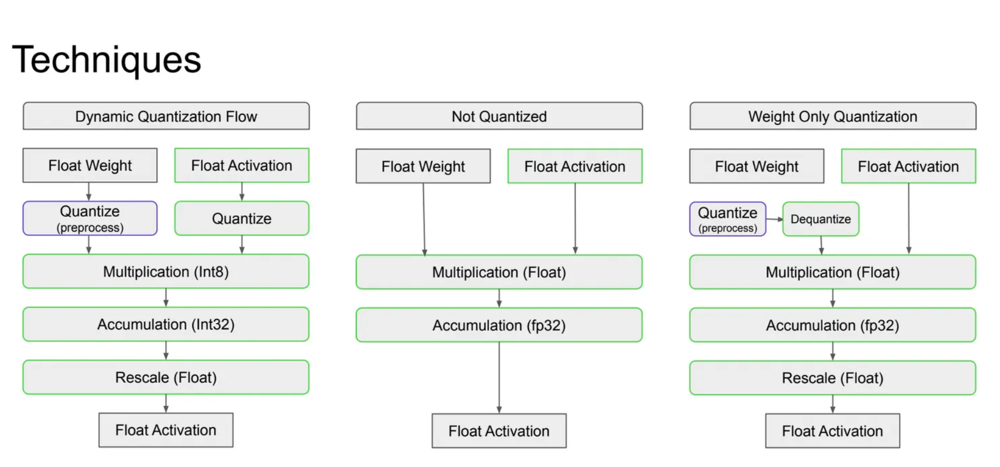
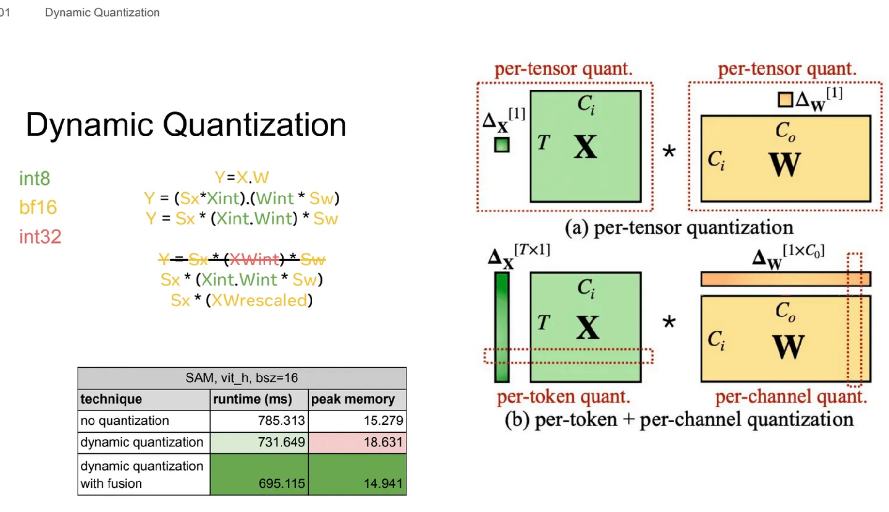
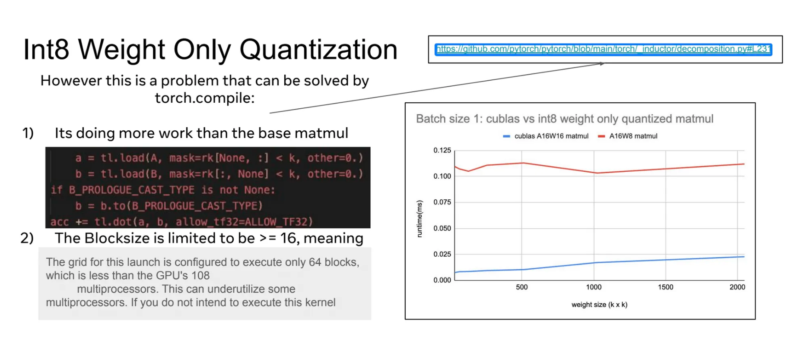
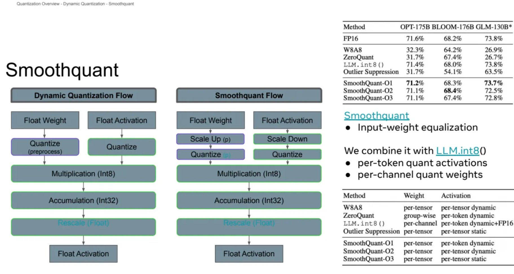
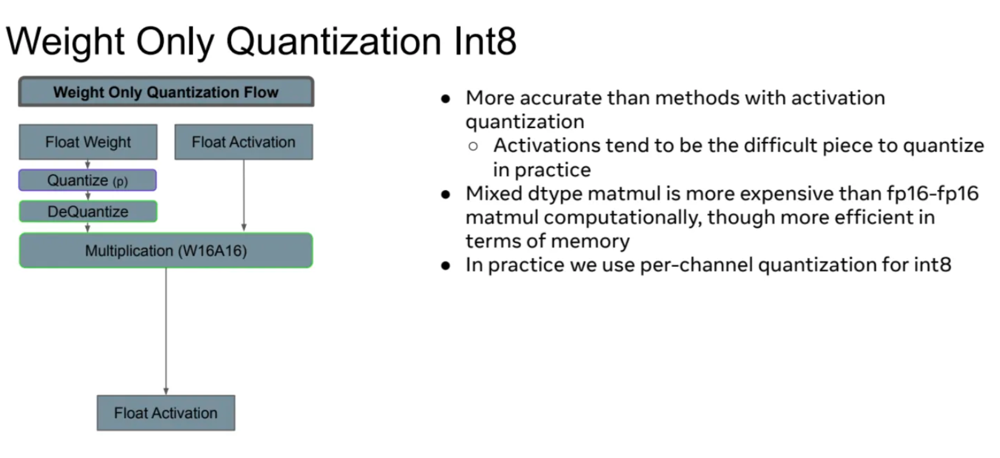
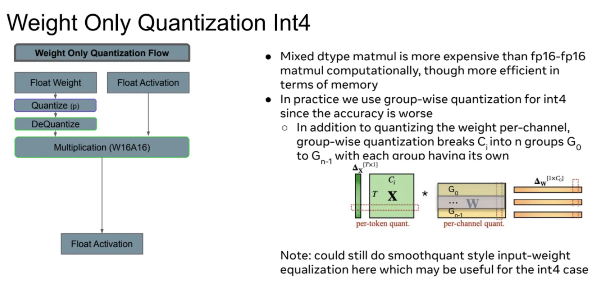

# Quantization CUDA


- 动态量化流程 (Dynamic Quantization Flow):
  - 权重和激活都从浮点开始
  - 权重在预处理阶段量化
  - 激活在运行时量化
  - 使用Int8进行乘法运算
  - 使用Int32进行累加
  - 最后rescale回浮点数
- 未量化 (Not Quantized):
  - 权重和激活都保持浮点格式
  - 所有运算（乘法和累加）都使用浮点数进行
- 仅权重量化 (Weight Only Quantization):
  - 权重在预处理阶段量化
  - 随后立即反量化回浮点数
  - 激活保持浮点格式
  - 乘法和累加都使用浮点数进行
  - 最后有一个rescale步骤

## Dynamic Quantization
- 数学表达：
  - 原始公式：Y = X.W
  - 量化后的公式：Y = (Sx*Xint).(Wint * Sw)
  - 重排后的公式：Y = Sx * (Xint.Wint) * Sw 这里，Sx 和 Sw 是缩放因子，Xint 和 Wint 是量化后的整数值。
- 动态量化流程图：
  - 开始于浮点权重（Float Weight）和浮点激活值（Float Activation）
  - 权重在预处理阶段进行量化（Quantize (preprocess)）
  - 激活值在运行时进行量化（Quantize）
  - 使用 Int8 进行乘法运算（Multiplication (Int8)）
  - 使用 Int32 进行累加运算（Accumulation (Int32)）
  - 最后将结果重新缩放（Rescale (Float)）回浮点数
  - 输出浮点激活值（Float Activation）

### 优化
- 显存增加的原因是要把int8的结果累加到int32类型中，因此相比于BFloat1增加了额外的显存
- 为了减少显存占用，作者提出了一个优化方案：将乘法和累加操作融合在一起，直接计算出rescaled的结果（XWrescaled），我们可以用 bf16 存储中间的值。
- 动态量化的数学表达：
  - 原始公式：Y = X.W
  - 量化公式：Y = (Sx*Xint).(Wint * Sw)
  - 重排公式：Y = Sx * (Xint.Wint) * Sw
  - 进一步优化：Sx * (XWrescaled)



在Torch Compile中实现动态量化with fusion需要做出的努力，因为Torch Compile并不愿意融合乘法操作，所以作者不得不在Torch Compile的矩阵乘法kernel后强制添加一个乘法的epilogue（实际上这是一个编译器的PASS，需要匹配到矩阵乘法+乘法才能生效）
```python
# This op is a special case of the int_mm op which we use based on the pattern
# _int_mm -> mul (defined in ../fx_passes/post_grad.py) in order to prevent
# realization of the int32 _int_mm output by forcing fusion with the mul op.
# This is only used when config.force_fuse_int_mm_with_mul = True
def tuned_fused_int_mm_mul(mat1, mat2, mat3, out_dtype, *, layout=None):
    out_dtype = (
        torch.promote_types(mat3.get_dtype(), torch.int32)
        if out_dtype is None
        else out_dtype
    )
    m, n, k, layout, mat1, mat2, mat3 = mm_args(
        mat1, mat2, mat3, layout=layout, out_dtype=out_dtype
    )
    choices: List[Dict[Any, Any]] = []
    for config in int8_mm_configs(m, n, k):
        mm_template.maybe_append_choice(
            choices,
            input_nodes=(mat1, mat2, mat3),
            layout=layout,
            **dict(mm_options(config, m, n, k, layout), ACC_TYPE="tl.int32"),
            suffix_args=1,
            epilogue_fn=V.ops.mul,
        )
    return autotune_select_algorithm("int_mm", choices, [mat1, mat2, mat3], layout)
```

## Int8 Weight Only Quantization
- 数学表达：
  - 原始公式：Y = X.W
  - 量化公式：Y = X.(Wint * Sw)
  - 重排公式：Y = (X.Wint) * Sw
- 权重量化流程图：
  - 从浮点权重（Float Weight）开始
  - 量化（Quantize）步骤：在预处理阶段进行
  - 反量化（Dequantize）步骤：将量化后的权重转回浮点
  - 浮点激活（Float Activation）保持不变
  - 乘法运算使用浮点（Multiplication (Float)）
  - 累加使用fp32（Accumulation (fp32)）
  - 重新缩放（Rescale (Float)）
  - 最后输出浮点激活（Float Activation）
- 特点：
  - 只对权重进行量化，而不是对激活值进行量化
  - 在实际计算前，量化的权重被反量化回浮点格式
  - 所有的计算（乘法和累加）都在浮点精度下进行
- 其它：
  - 减少模型存储空间，因为权重以Int8格式存储
  - 保持了计算精度，因为实际运算仍在浮点下进行
  - 可能比全量化方法（如动态量化）具有更高的精度
  - 适用于对精度要求较高，但仍希望减少模型大小的场景
  - 可能在某些硬件上比全量化方法更容易实现和优化

### Problem



- 执行了比基础matmul更多的工作，展示了一段代码，显示了额外的加载和类型转换操作，这些额外操作可能导致性能下降
- 块大小被限制为大于等于16，当前配置只执行64个块，少于A100GPU的108个多处理器，这可能导致一些多处理器未被充分利用
### Solution
torch compile 解决:
- 实际上这个操作就是让GEMV用Cuda Core而不是Tensor Core来完成计算
- 具体做法就是把GEMV操作等价为一个element-wise乘法加一个reduce操作。这个操作通过Torch Compile生成的Triton Kernel代码如下
```python
@register_decomposition([aten.mm])
@pw_cast_for_opmath
def mm(self, input2):
    # Our matrix vector multiplies only achieve peak bandwidth with coordinate descent tuning.
    # todo: Look into why and fix it (hopefully)
    if config.coordinate_descent_tuning:
        if guard_size_oblivious(self.shape[0] == 1) or guard_size_oblivious(
            input2.shape[1] == 1
        ):
            return (self.unsqueeze(2) * input2.unsqueeze(0)).sum(dim=1)
    ...
    return NotImplemented
```

- 转换后的 triton 函数:
  - xnumel 和 rnumel 都设置为 4096，X 对应 N 维度，R 对应 K 维度
  - 使用 program_id(0) 和 XBLOCK 计算偏移量
  - XBLOCK 始终为 1，每个 program_id 处理输出的单个值
  - 加载完整的激活张量（fp32 格式）
  - 对权重的一列进行循环
  - 加载权重的一列的一个chunk（可能是 int8 格式）
  - 将权重列转换为 fp32 格式
  - 执行矩阵乘法的核心计算
  - 使用广播和累加操作
  - 对结果进行掩码处理和ReduceSum求和
  - 加载额外的数据（可能是偏置或缩放因子）
  - 执行最后的乘法和加法操作
  - 将结果存储回内存

  ```python
  def triton_(in_ptr0, in_ptr1, in_ptr2, in_ptr3, out_ptr1, xnumel, rnumel, XBLOCK: tl.constexpr, RBLOCK: tl.constexpr):
      xnumel = 4096
      rnumel = 4096
      xoffset = tl.program_id(0) * XBLOCK
      xindex = xoffset + tl.arange(0, XBLOCK)[:, None]
      xmask = xindex < xnumel
      rbase = tl.arange(0, RBLOCK)[None, :]
      x0 = xindex
      _tmp6 = tl.full([XBLOCK, RBLOCK], 0, tl.float32)
      for roffset in range(0, rnumel, RBLOCK):
          rindex = roffset + rbase
          rmask = rindex < rnumel
          r1 = rindex
          tmp0 = tl.load(in_ptr0 + (r1), None, eviction_policy='evict_last').to(tl.float32)
          tmp2 = tl.load(in_ptr1 + (r1 + (4096*x0)), xmask, eviction_policy='evict_first', other=0.0)
          tmp1 = tmp0.to(tl.float32)
          tmp3 = tmp2.to(tl.float32)
          tmp4 = tmp1 * tmp3
          tmp5 = tl.broadcast_to(tmp4, [XBLOCK, RBLOCK])
          tmp7 = _tmp6 + tmp5
          _tmp6 = tl.where(xmask, tmp7, _tmp6)
      tmp6 = tl.sum(_tmp6, 1)[:, None]
      tmp9 = tl.load(in_ptr2 + (x0), xmask, eviction_policy='evict_last').to(tl.float32)
      tmp11 = tl.load(in_ptr3 + (x0), xmask, eviction_policy='evict_last').to(tl.float32)
      tmp8 = tmp6.to(tl.float32)
      tmp10 = tmp8 * tmp9
      tmp12 = tmp10 + tmp11
      tl.store(out_ptr1 + (x0), tmp12, xmask)
  ```

### Result
- 性能问题解决：通过使用torch.compile可以解决之前遇到的性能问题。
- 性能对比（LLaMA-7B模型，批次大小为1）：
  - 无量化：93.08 tokens/s
  - int8权重量化：40.59 tokens/s
  - int8权重量化优化后：135.01 tokens/s
  这显示优化后的int8权重量化性能显著提升，超过了无量化版本。
- 微基准测试结果：
  - 图表显示了不同权重大小下的性能比较
  - cublas A16W16 matmul（蓝线）性能最佳
  - A16W8 matmul（红线）性能较差
  - A16W8 fixed matmul（黄线）性能介于两者之间
- 优化过程中的发现：
  - 尽管性能提升明显，但仍未完全匹配默认bf16的性能
  - 这主要是由于torch.compile的开销，在端到端测试中这个差距会减小
  - 在优化过程中遇到了**triton的一些限制，通过避免使用tensor cores来绕过这些限制**
  - 目前仍然缺乏对批次大小大于1（bsz>1）的高性能内核

## Int4 Weight Only Quantization
从Int4 Weight Only开始，Triton开始力不从心了。要点为：

- 目前PyTorch没有原生的int4/uint4数据类型（dtype）。
- 这意味着我们需要将更大尺寸的张量拆解成多个int4类型。
- 由于Triton在类型转换和乘法操作上的限制，我们在实际操作中会失去更多性能。
- 图示展示了int4数据（4位整数）如何被打包进更大的数据类型中

### Weight Store
在进行矩阵乘法时，由于这是权重，我们希望在int4x2格式中连续的信息在解包后仍然保持连续。
- 因此，我们应该使用右边两种选项之一。
- 由于矩阵乘法的实现通常让单个线程处理所有的K维度，所以选择了右下角的选项。这种选择可以避免因打包方式导致线程加载不必要的数据。


## Triton Limitations
- 复杂操作和非标准数据类型的问题：
  - Triton在处理复杂操作和非标准数据类型时会遇到困难。
  - 具体提到了Int4（4位整数）类型。
  - 当批处理大小大于1时，int8/int4权重量化也会遇到问题。
  - L2缓存优化在这些情况下可能会受到影响。
- 配置一致性问题：
  - 在一些测试中，启发式算法存在问题。
  - 最佳配置可能无法使用或被启发式算法错误地丢弃
## Triton Strengths
擅长组合"简单"操作：

- Triton在将简单操作组合在一起方面表现出色。
- 提到了两个具体例子： 
  1. Fused_int_mm_mul（融合整数矩阵乘法和乘法操作） 
  2. SAM flash attention（Segment Anything Model中使用的快速注意力机制）
- 性能接近CUDA，但使用更简单：
  - Triton能够达到CUDA速度的约75%。
  - 最重要的是，使用Triton可以达到这种性能水平，而无需直接处理.cu文件（CUDA源代码文件）。

## LLM.int8()
LLM.int8() 的核心思想是 **“混合精度分解”（Mixed-precision Decomposition）**。它不尝试强行量化那些难搞的离群值，而是将它们“隔离”出来单独处理。

具体步骤如下：

  - 设定阈值并提取离群值： 在进行矩阵乘法前，算法会扫描输入的激活矩阵。通常设定一个幅度阈值（例如绝对值大于 6.0）。
  - 矩阵拆分：

  - 离群值部分： 将包含这些极端值的整列（在激活矩阵中）以及与之对应的权重矩阵的整行提取出来。这部分数据在 LLM 中占比极小（通常不到 0.1%）。

  - 常规值部分： 矩阵中剩下的大约 99.9% 的常规数据。

- 混合精度计算：

  - INT8 矩阵乘法： 对 99.9% 的“常规值部分”的激活和权重分别进行 8-bit 量化，并使用高效的 INT8 进行矩阵乘法（Vector-wise quantization，**激活按 token 量化，权重按 channel 量化**）。

  - FP16 矩阵乘法： 对提取出来的不到 0.1% 的“离群值部分”，保持其 16-bit 浮点数（FP16）格式，直接进行高精度的 FP16 矩阵乘法。

- 结果合并： 将 INT8 乘法的结果（反量化回 FP16 后）与 FP16 乘法的结果相加，得到最终的输出。

## Smoothquant
- 观察到“激活难量化（有离群值），但权重容易量化（分布平滑）”。因此引入一个数学上的缩放因子 $s$。通过公式 $Y = (X \text{diag}(s)^{-1}) \cdot (\text{diag}(s) W)$，将激活值缩小（除以 $s$），同时将对应的权重放大（乘以 $s$）。这相当于把激活矩阵中难以处理的“量化难度”转移到了权重矩阵上，使得两者都变得容易进行 INT8 量化




## Weight Only Quantization
### 量化粒度
量化的本质是用一个公式 $x = S \cdot (q - Z)$ 将浮点数映射到整数，其中 $S$ 是 Scale（缩放因子），$Z$ 是 Zero-point（零点）。颗粒度的区别，就在于多大范围内的数据共享同一个 $S$ 和 $Z$。
- Per-tensor（逐张量量化）怎么做： 
  - 整个激活矩阵或权重矩阵共享唯一的一个 $S$ 和 $Z$。
  - 特点： 极致粗犷。只要矩阵里出现一个极大的离群值，整个矩阵的 $S$ 就会被撑大，导致绝大多数正常数值被压缩成了 0。在 LLM 中，由于激活值离群值的存在，Per-tensor 几乎不可用。
- Per-channel（逐通道量化，通常用于权重）怎么做： 
  - 针对权重矩阵，为其每一行（即每个 Output Channel）分配独立的 $S$ 和 $Z$。
  - 特点： 权重的离群值通常分布在特定的通道中。**按通道分配参数，可以把量化误差限制在对应的通道内，互不干扰**。这是 W8A8（8位权重8位激活）的标配。
- Per-token（逐 Token 量化，通常用于激活）怎么做： 
  - 针对输入的激活矩阵，为其每一行（即每个 Token 的特征向量）分配独立的 $S$ 和 $Z$。
  - 特点： LLM 每次输入的 Token 不同，激活的幅度波动极大。实时根据当前的 Token 计算一个专属的 $S$，可以完美应对动态的激活分布。
- Group-wise（分组量化，INT4 的核心）怎么做： 
  - 比 Per-channel 更细。它不仅按通道划分，还会把一条通道（比如长度为 4096 的向量）再切成若干个组（Group Size 通常设为 64 或 128）。每个组拥有自己独立的 $S$ 和 $Z$。
  - 特点： 对于 INT4 来说，即使是一整条通道共享一个 $S$ 也太勉强了。把 4096 个元素分成 32 个组（每组 128 个），就能计算出 32 个不同的 $S$。这样局部的数据分布更加紧凑，INT4 就能精准地拟合这 128 个数值。
### Marlin 格式
#### Motivation
在 Marlin 出现之前，业界发现了一个尴尬的现象：把权重从 FP16 压到 INT4，理论上显存读取数据量少了 4 倍，速度应该快 4 倍对吧？但实际上，早期的 INT4 算子跑起来甚至比 FP16 还慢，或者最多只能快 1.5 倍。因为解包（反量化）的开销和GPU 内存读取的不规则性把省下来的时间全吃光了。

#### 原理
- 模型权重默认是按照 AWQ 的传统格式存储的（通常是把 8 个 INT4 打包成一个 INT32）。
- 将传统的 INT32 数组打散，重新按照 Marlin 要求的 16x64 Tile交错格式进行排列。这样可以直接将这个排布交给 Tensor Core 来处理，而不需要在 GPU 上进行任何解包操作。重排后的权重格式被称为 Marlin 格式。
#### 与计算内核的配合
- Asynchronous Fetch： GPU 线程使用特殊的异步拷贝指令，将 qweight、scales 和 zeros 从全局显存搬运到共享内存（Shared Memory），再搬入寄存器（Registers）。
- 极速位运算解包 (Bitwise Unpacking)：拿到打包好的 INT4 数据后，线程在寄存器内部进行位移（Shift）和掩码（Mask）操作，把 4-bit 提取出来。
- 非对称反量化 (Asymmetric Dequantization)：这是 AWQ-Marlin 独有的步骤。
  - 在寄存器里，用提取出的 INT4 值（我们称之为 $W_{int4}$）结合 $Scale$ 和 $Zero$ 还原为 FP16：$W_{fp16} = (W_{int4} - Zero) \times Scale$
  - 为了速度，底层工程实现中通常会将公式变形为 $W_{fp16} = W_{int4} \times Scale - Zero\_precomputed$，利用 GPU 的 FMA（乘加融合）指令一次性算完。
- MMA 指令：刚刚在寄存器中的 $W_{fp16}$，立刻与激活值 $X_{fp16}$ 一起被送入 Tensor Core。执行硬件级的矩阵乘加操作：$Y = Y + X_{fp16} \cdot W_{fp16}$
### Int8 Weight Only Quantization
- 量化流程：
  - 浮点权重先进行量化（Quantize）
  - 然后进行反量化（DeQuantize）
  - 使用16位权重和16位激活进行乘法运算（Multiplication W16A16）
  - 最后得到浮点激活输出
- 优点：比包含激活量化的方法更精确；
  - 原因：在实践中，激活通常是更难量化的部分 
- 计算特性：混合数据类型的矩阵乘法（Mixed dtype matmul）在计算上比fp16-fp16矩阵乘法更昂贵 但在内存使用上更高效
- 实际应用：在实践中，对int8使用逐通道量化（per-channel quantization）



### Int4 Weight Only Quantization
- 量化流程与Int8量化类似，包括权重量化、反量化和16位乘法运算。
- 实际应用中的量化策略：**对int4使用分组量化（group-wise quantization）**。原因是int4的精度较低，分组量化可以提高精度。
  - 分组量化的具体操作：除了对**每个通道进行量化**外，还将**通道Ci分成n个组（G0到Gn-1）。每个组有自己的量化参数。**
- 右边还展示了per-token量化的激活矩阵和per-channel分组量化的权重矩阵。
- 可以考虑使用smoothquant风格的输入-权重均衡化技术。这对int4的情况可能特别有用，因为int4精度较低，更需要优化。



## GPTQ
- GPTQ的核心思想：使用期望Hessian（Expected Hessian）来量化权重W，目标是最小化 argmin ||WX - ŴX||²₂，其中Ŵ是量化后的权重。
- 量化方案：可以是分组量化（group-wise）或逐通道量化（per-channel）
- GPTQ的重要性：对于获得较好的int4仅权重量化精度是必要的
- GPTQ宏观算法流程：
  - 对某一层估计多个batch的Hessian矩阵
  - 量化W的一列
  - 使用Hessian矩阵H更新未量化的W列（以保持上述方程最小化）
  - 重复步骤2和3，直到所有列都被量化