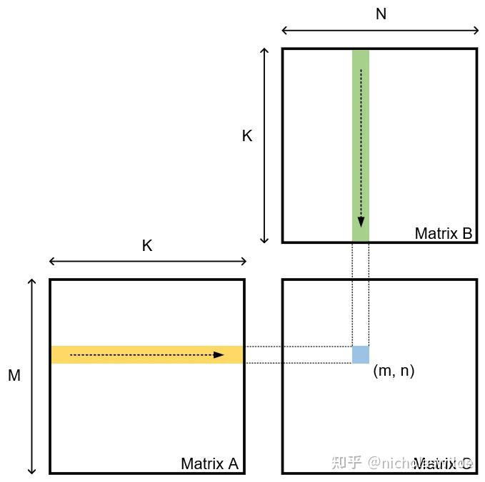
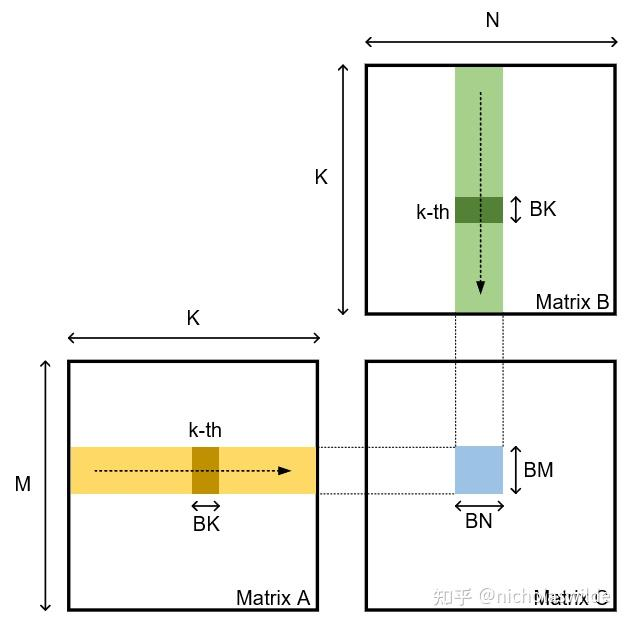
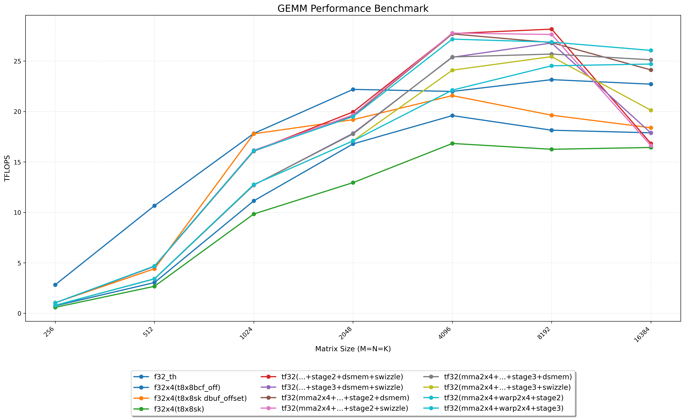

# 从 GEMM 实践 CUDA 优化

📚 本文将从最 naive 的 GEMM 实现开始，使用 nsight compute 工具进行性能分析寻找瓶颈并一步步进行优化。通过这种方式来实践 CUDA 中的各种优化技巧。

## GEMM 简介

General Matrix-Matrix Multiplication（通用矩阵乘法）。它是 BLAS (Basic Linear Algebra Subprograms) 标准库中定义的“第三级”（Level 3）运算。其标准数学定义如下：
$$C \leftarrow \alpha AB + \beta C$$
其中：

- $A, B, C$ 是矩阵。
- $\alpha, \beta$ 是标量（Scalar）。
- 通常假设 $A$ 的维度为 $M \times K$，$B$ 的维度为 $K \times N$，则 $C$ 的维度为 $M \times N$。

为什么 GEMM 如此重要？

- 深度学习的核心： 全连接层（Dense/Linear）直接就是矩阵乘法；卷积层（Convolution）通过 Im2Col 等变换后，本质上也是 GEMM。
- 计算密集型： 它是**典型的计算密集型**任务（Compute Bound），运算复杂度为 $O(N^3)$，而数据搬运复杂度为 $O(N^2)$。这意味着优化得当，可以极高地利用硬件峰值算力。

## 优化方法

### Naive GEMM

Naive GEMM 一共使用 M \* N 个线程完成整个矩阵乘法，每个线程计算结果矩阵 $C$ 的一个元素。下面是一个简单的 FP32 GEMM CUDA kernel 实现：

```cpp
// FP32
// GEMM naive: compute one c[i,j]
// element per threads, all row major
__global__ void gemm_fp32_kernel(const float *a, const float *b, float *c, int M, int N, int K) {
  int n = blockIdx.x * blockDim.x + threadIdx.x;
  int m = blockIdx.y * blockDim.y + threadIdx.y;

  if (m < M && n < N) {
    float psum = 0.0;
#pragma unroll
    for (int k = 0; k < K; k++) {
      // m row in a matrix, n col in b matrix
      psum += a[m * K + k] * b[k * N + n];
    }
    c[m * N + n] = psum;  // c[m,n]
  }
}
```



### Tiling 优化

- **Block Tile**: 每个 Block 负责计算矩阵 C 中的$BM \times BN$个元素；
- **K Tile**: 循环$K / BK$次，一个 Block 的所有线程每次一起从 Global Memory 中 load $BM \times BK$个矩阵 A 的元素和$BK \times BN$个矩阵 B 的元素；
- **Thread Tile**: 每个 Thread 负责计算矩阵 C 中的$TM \times TN$个元素。
- **Shared Memory**: 每个 Block 分配 Shared Memory 来存储从 Global Memory 加载的矩阵 A 和矩阵 B 的 Tile 数据，减少对 Global Memory 的访问次数，提高数据重用率。



#### 分析

- Block Level (线程块级):
  - $BM \times BN$: 一个 CUDA Block 负责计算 $C$ 矩阵中大小为 $BM \times BN$ 的一个子块。
  - $BK$: 每次循环（K 维度）加载到 Shared Memory 中的步长。
  - **目的**: 利用 Shared Memory 复用数据，减少 Global Memory 访问。
- Thread Level (线程级):
  - $TM \times TN$: 一个 CUDA Thread 负责计算 Block 子块中大小为 $TM \times TN$ 的微小块。
  - **目的**: 利用 Register (寄存器) 复用数据。寄存器比 Shared Memory 更快，且是零延迟的

计算访存比(AI)

$$
Loads = ( \frac{1}{BN} + \frac{1}{BM} ) \times MNK
$$

- 计算量: $2MNK$ (浮点运算次数) 是固定的。
- 访存量: 随着 $BM$ 和 $BN$ 增大，总访存次数下降。

我们希望尽可能增大 $BM$ 和 $BN$，以提高计算访存比 (AI)，从而提升性能；也希望增大 $TM$ 和 $TN$，以提高寄存器数据复用率。但是，增大这些参数会增加 Shared Memory 和寄存器的使用量，从而降低并发度 (Occupancy)。因此，需要在计算访存比和并发度之间进行权衡。

Occupancy 受以下因素影响：

- **Shared Memory 容量** (限制 BM, BN, BK)
  - 公式：$Bytes = BK \times (BM + BN) \times 4 \text{ (float size)}$
  - Double Buffering: 为了掩盖访存延迟，通常使用双缓冲（在计算当前块时加载下一块），这会导致需求翻倍：$$Bytes_{Total} = 2 \times BK \times (BM + BN) \times 4$$
- **寄存器压力** (Register Pressure) (限制 TM, TN)
  - 累加器消耗: 每个线程必须独自维护 $TM \times TN$ 个 $C$ 矩阵的元素。这些元素必须一直驻留在寄存器中直到计算结束。
  - 如果 $TM=8, TN=8$，仅 $C$ 的部分和就需要 64 个寄存器。
  - 加上加载 $A, B$ 的临时寄存器、索引计算、循环变量，一个线程可能消耗 80-100 个寄存器。
- **线程并行度 (Thread Level Parallelism)**
  - 公式：$ThreadsPerBlock = \frac{BM \times BN}{TM \times TN}$
  - 硬限制: CUDA 规定一个 Block 最多 1024 个线程。
  - 软限制: 线程数最好是 32 (Warp Size) 的倍数。

```cpp
// gemm: Block Tile + Thread Tile + K Tile + Vec4, with smem
// BK:TILE_K=8 BM=BN=128
// TM=TN=8 增加计算密度 BM/TM=16 BN/TN=16
// dim3 blockDim(BN/TN, BM/TM);
// dim3 gridDim((N + BN - 1) / BN, (M + BM - 1) / BM)
template <const int BM = 128, const int BN = 128, const int BK = 8, const int TM = 8,
          const int TN = 8>
__global__ void gemm_t_8x8_sliced_k_f32x4_kernel(float *a, float *b, float *c, int M, int N,
                                                 int K) {
  // [1]  Block Tile: 一个16x16的block处理C上大小为128X128的一个目标块
  // [2] Thread Tile: 每个thread负责计算TM*TN(8*8)个元素，增加计算密度
  // [3]      K Tile: 将K分块，每块BK大小，迭代(K+BK-1/BK)次，
  //                  每次计算TM*TN个元素各自的部分乘累加
  // [4]   Vectorize: 减少load和store指令，使用float4
  int bx = blockIdx.x;
  int by = blockIdx.y;
  int tx = threadIdx.x;
  int ty = threadIdx.y;
  int tid = threadIdx.y * blockDim.x + tx;  // tid within the block
  __shared__ float s_a[BM][BK], s_b[BK][BN];

  // 0. 先计算shared memory中的索引
  // 1024 个元素，每个线程读4个元素，需要256个线程
  int load_smem_a_m = tid / 2;
  int load_smem_a_k = (tid % 2 == 0) ? 0 : 4;
  int load_smem_b_k = tid / 32;
  int load_smem_b_n = (tid % 32) * 4;
  // 1. 再计算全局内存中的索引
  int load_gmem_a_m = by * BM + load_smem_a_m;  // global row of a and c
  int load_gmem_b_n = bx * BN + load_smem_b_n;  // global col of b and c

  float r_c[TM][TN];
  for (int bk = 0; bk < (K + BK - 1) / BK; ++bk) {
    // 2. 计算每次加载到smem的A和B矩阵元素在全局内存中的列数和行数
    int load_gmem_a_k = bk * BK + load_smem_a_k;
    int load_gmem_a_addr = load_gmem_a_m * K + load_gmem_a_k;
    FLOAT4(s_a[load_smem_a_m][load_smem_a_k]) =
        FLOAT4(a[load_gmem_a_addr]);  // load A to shared memory

    int load_gmem_b_k = bk * BK + load_smem_b_k;
    int load_gmem_b_addr = load_gmem_b_k * N + load_gmem_b_n;
    FLOAT4(s_b[load_smem_b_k][load_smem_b_n]) =
        FLOAT4(b[load_gmem_b_addr]);  // load B to shared memory
    __syncthreads();

    // 3. 计算线程负责的TMxTN个元素的部分乘加
#pragma unroll
    for (int k = 0; k < BK; ++k) {
#pragma unroll
      for (int m = 0; m < TM; ++m) {
#pragma unroll
        for (int n = 0; n < TN; ++n) {
          int comp_smem_a_m = ty * TM + m;
          int comp_smem_b_n = tx * TN + n;
          r_c[m][n] += s_a[comp_smem_a_m][k] * s_b[k][comp_smem_b_n];
        }
      }
    }
    __syncthreads();
  }

// 4. store output
#pragma unroll
  for (int m = 0; m < TM; ++m) {
    int store_gmem_c_m =
        by * BM + ty * TM +
        m;  // 大分块的起始行号by * BM + 小分块的起始行号ty * TM + 小分块内部的相对行号 m
#pragma unroll
    for (int n = 0; n < TN; ++n) {
      int store_gmem_c_n =
          bx * BN + tx * TN +
          n;  // 大分块的起始列号bx * BN + 小分块的起始列号tx * TN + 小分块内部的相对列号 n
      int store_gmem_c_addr = store_gmem_c_m * N + store_gmem_c_n;
      c[store_gmem_c_addr] = r_c[m][n];
    }
  }
}
```

### Free Bank Conflict 优化

#### Bank Conflict 介绍

Cuda shared memory 按照 4 字节一个 bank，总共 32 个 bank（128 字节）来组织，其 store 和 load 操作在一定情况下存在 bank conflict 的情况：

- 不同的线程访问同一 bank 的不同 address 时就会出现 bank conflict。
- bank conflict 只发生在**同一个 warp 的不同线程**间。
- 如果多个线程访问 shared memory 的相同 bank 的相同 address，实际效果是 broadcast，非 bank conflict。
- bank conflict 只发生在 shared memory 的读写操作上，global memory 的读写操作不会有 bank conflict 产生。

> [!NOTE]
> 在某些情况下，bank conflict 的发生是在 warp 中处于同一个 phase 的不同 threads 之间，这里的 phase 是指 warp 的 32 个线程操作 shared memory 时，分多个 phase，每个 phase 的参与线程不一样。
>
> 比如 ldmatrix 指令 ldmatrix.sync.aligned.x4.m8n8.shared.b16，该指令从共享内存加载数据到线程寄存器，操作分 4 个 phase，在 phase0 阶段，thread0~7 操作共享内存，在 phase1 阶段，thread8~15 操作共享内存，以此类推。

- bank conflict 会导致 warp 被 stall，冲突较多会对整个 pipeline 的耗时会有较大的影响。

> [!WARNING]
> 当发生 bank conflict 时，warp 需要额外的一个 cycle 来重新提交 shared memory 的访问指令到 LSU 单元，该指令需要在 MIO 中排队，这种排队会导致访问延迟增加，此时 warp 可能处于等待数据返回的状态，warp state 标识为 Stall Short Scoreboard。
>
> 如果 MIO 队列满，此时 warp 先需要等待 MIO 队列处于非空的状态，此时 warp state 标识为 Stall MIO Throttle。

#### Free Bank Conflict 优化方法

- **padding**: 在 shared memory 的二维数组中增加 padding 列，避免不同线程访问同一 bank
- **转置存储**: 将从 global memory 读取的数据转置存储到 shared memory 中
- **swizzling 机制**: 不改变物理内存大小，而是改变地址映射逻辑。在存入 Shared Memory 时，将列地址与行地址进行异或（XOR）。

#### 代码示例

这里使用了转置存储的方法；

对于 Paddding 大小的选择，我们需要同时满足两个硬性条件：

- **消除 Bank Conflict**： 跨行访问时的 Stride 不能是 32 的倍数(`s_a` 和 `s_b`)。

- **满足向量化对齐**： 每一行的起始地址必须是 16 Byte 对齐的（因为我们要用 float4 进行 Global -> Shared 的写入）。

```cpp
template <const int BM = 128, const int BN = 128, const int BK = 8, const int TM = 8,
          const int TN = 8, const int OFFSET = 0>
__global__ void gemm_t_8x8_sliced_k_f32x4_bcf_kernel(float *a, float *b, float *c, const int M,
                                                     const int N, const int K) {
  const int bx = blockIdx.x;
  const int by = blockIdx.y;
  const int tx = threadIdx.x;
  const int ty = threadIdx.y;
  const int tid = ty * blockDim.x + tx;

  __shared__ float s_a[BK][BM + OFFSET];  //我们需要的是 A[0][0], A[1][0], A[2][0],
                                          // A[3][0]（同一列的 4 个 M 值）。在 s_a[BM][BK] 中，这 4
                                          //个数的内存地址不连续（相隔 BK 个 float）。
  __shared__ float s_b[BK][BN + OFFSET];

  float r_load_a[TM / 2];  // 4
  float r_load_b[TN / 2];  // 4
  float r_comp_a[TM];
  float r_comp_b[TN];
  float r_c[TM][TN] = {0.0};

  int load_a_smem_m = tid / 2;  // tid / 2，(0,1,2,...,128)
  int load_a_smem_k = (tid & 1) << 2;
  int load_b_smem_k = tid / 32;         // 0~8
  int load_b_smem_n = (tid & 31) << 2;  // (0,4,8,12,...,124)
  int load_a_gmem_m = by * BM + load_a_smem_m;
  int load_b_gmem_n = bx * BN + load_b_smem_n;

  for (int bk = 0; bk < (K + BK - 1) / BK; bk++) {
    int load_a_gmem_k = bk * BK + load_a_smem_k;
    int load_a_gmem_addr = load_a_gmem_m * K + load_a_gmem_k;
    int load_b_gmem_k = bk * BK + load_b_smem_k;
    int load_b_gmem_addr = load_b_gmem_k * N + load_b_gmem_n;
    FLOAT4(r_load_a[0]) = FLOAT4(a[load_a_gmem_addr]);
    FLOAT4(r_load_b[0]) = FLOAT4(b[load_b_gmem_addr]);

    s_a[load_a_smem_k][load_a_smem_m] = r_load_a[0];      // e.g layer_0  b0
    s_a[load_a_smem_k + 1][load_a_smem_m] = r_load_a[1];  // e.g layer_4  b0
    s_a[load_a_smem_k + 2][load_a_smem_m] = r_load_a[2];  // e.g layer_8  b0
    s_a[load_a_smem_k + 3][load_a_smem_m] = r_load_a[3];  // e.g layer_12 b0

    FLOAT4(s_b[load_b_smem_k][load_b_smem_n]) = FLOAT4(r_load_b[0]);

    __syncthreads();

#pragma unroll
    for (int tk = 0; tk < BK; tk++) {
      FLOAT4(r_comp_a[0]) = FLOAT4(s_a[tk][ty * TM / 2]);
      FLOAT4(r_comp_a[4]) = FLOAT4(s_a[tk][ty * TM / 2 + BM / 2]);

      FLOAT4(r_comp_b[0]) = FLOAT4(s_b[tk][tx * TN / 2]);
      FLOAT4(r_comp_b[4]) = FLOAT4(s_b[tk][tx * TN / 2 + BN / 2]);
      // conclusion: still have some bank conflicts, need 4 memory issues.

#pragma unroll
      for (int tm = 0; tm < TM; tm++) {
#pragma unroll
        for (int tn = 0; tn < TN; tn++) {
          // r_c[tm][tn] += r_comp_a[tm] * r_comp_b[tn];
          r_c[tm][tn] = __fmaf_rn(r_comp_a[tm], r_comp_b[tn], r_c[tm][tn]);
        }
      }
    }
    // sync per BK.
    __syncthreads();
  }

#pragma unroll
  for (int i = 0; i < TM / 2; i++) {
    int store_c_gmem_m = by * BM + ty * TM / 2 + i;
    int store_c_gmem_n = bx * BN + tx * TN / 2;
    int store_c_gmem_addr = store_c_gmem_m * N + store_c_gmem_n;
    FLOAT4(c[store_c_gmem_addr]) = FLOAT4(r_c[i][0]);
    FLOAT4(c[store_c_gmem_addr + BN / 2]) = FLOAT4(r_c[i][4]);
  }
#pragma unroll
  for (int i = 0; i < TM / 2; i++) {
    int store_c_gmem_m = by * BM + BM / 2 + ty * TM / 2 + i;
    int store_c_gmem_n = bx * BN + tx * TN / 2;
    int store_c_gmem_addr = store_c_gmem_m * N + store_c_gmem_n;
    FLOAT4(c[store_c_gmem_addr]) = FLOAT4(r_c[i + TM / 2][0]);
    FLOAT4(c[store_c_gmem_addr + BN / 2]) = FLOAT4(r_c[i + TM / 2][4]);
  }
}
```

##### Why Transpose?

**不使用转置：**

- Bank Conflict：可以通过调节 OFFSET 消除。
- 向量化 (LDS.128)：这里取到的 4 个数在物理内存里是分散的（Strided Access）。
- 后果：必须发射 4 条 LDS.32 指令来分别读取这 4 个数。
- 性能代价：**指令数增加了 4 倍，发射带宽被浪费**。

**物理转置 (s_a[BK][BM + OFFSET])**

- Bank Conflict：可以通过调节 OFFSET 消除。
- 向量化 (LDS.128)：支持。可以用 1 条 LDS.128 指令把计算所需的 4 个数加载到寄存器。

##### Global -> Shared 变慢，为什么要做转置？

执行频率的对比：

- 外层循环 (Global $\rightarrow$ Shared)：执行次数：$K / BK$ 次。这是一个相对低频的操作。对总时间影响较小。
- 最内层循环 (Shared $\rightarrow$ Register $\rightarrow$ FMA)：执行次数：$(K / BK) \times BK = K$ 次。这是 Kernel 中**最热（Hot Spot）** 的地方。在这个循环里，任何多余的指令都会被放大数百万倍。如果在这里能用 1 条指令代替 4 条指令，性能收益是巨大的。

### Double Buffer 优化(Multi-Stage Pipeline)

Double Buffering 本质上是一种软件流水线 (Software Pipelining) 策略。其核心目标是通过指令调度，打破冯·诺依曼架构中“取指-执行”的串行依赖，实现计算资源（ALU/FPU/Tensor Core）与存储资源（DMA/Memory Controller）的时间重叠 。

- 预取 (Prefetching): 在处理当前迭代 Step $K$ 的同时，提前发出 Step $K+1$ 的内存加载请求。
- 延迟掩盖 (Latency Masking): 利用计算指令（Compute Kernel）的高吞吐量执行时间，去填补内存加载指令（Load Kernel）的高延迟空窗期。

```shell
Time -------------------------------------------------->
[Load K0] ...latency...
                        [Compute K0]
                        [Load K1 (Async/Background)] ...latency...
                                    <---- 被计算时间掩盖 ---->
                                                     [Compute K1]
                                                     [Load K2] ...
```

#### Cost Model 分析

实施 $N$-stage buffering (其中 $N=2$ 为双缓冲) 所需的 Shared Memory 容量 $S_{mem}$ 可由下式给出：
$$S_{mem} = N \times [BK \times (BM + BN)] \times \text{sizeof(dtype)}$$
其中：

- $N$: 缓冲级数 (Double Buffering 时 $N=2$, Multi-stage 可能为 3, 4, 5)。
- $BM, BN$: 分块矩阵在 M, N 维度的尺寸。
- $BK$: 累加维度 K 的步长 (Unroll factor)。
- $\text{sizeof(dtype)}$: 数据类型大小 (如 float 为 4 Bytes)。

这一公式揭示了算术强度 (Arithmetic Intensity) 与 片上存储容量 (On-chip Memory Capacity) 之间的直接矛盾。

#### Occupancy vs. Parallelism Trade-off

我们需要权衡两种并行模式：

- 线程级并行 (TLP - Thread Level Parallelism)
  - 定义： GPU 通过快速上下文切换 (Context Switching) 在不同的 Warps 之间轮转执行，以掩盖延迟。
  - 度量指标：占用率 (Occupancy)。即活跃 Warp 数量与 SM 物理最大支持 Warp 数量的比值。
  - 资源限制：Shared Memory 是限制 Occupancy 的关键瓶颈。
- 指令级并行 (ILP - Instruction Level Parallelism)
  - 定义：单个线程内部，利用流水线技术，让计算指令和访存指令同时在飞行中 (In-flight)。
  - Double Buffering 实际上是极大地提高了 ILP。

如果我们使用 Double Buffering，让 Shared Memory 过大会触发以下连锁反应：

- **Active Blocks 下降**：设 $C_{SM}$ 为单个 SM 的 Shared Memory 总容量 (e.g., A100 164KB)。单个 Block 的需求为 $S_{block}$。则每个 SM 能同时驻留的最大 Block 数量 $N_{blocks}$ 为：$$N_{blocks} = \lfloor \frac{C_{SM}}{S_{block}} \rfloor$$
- **Occupancy 崩塌**：如果 $S_{block}$ 超过了 $C_{SM} / 2$（即大于 82KB），那么 $N_{blocks}$ 强制变为 1。这意味着整个 SM 上只有一个 Block 在运行。
- **尾部效应与延迟暴露**：
  - **缺乏 TLP(Thread Level Parallelism, TLP) 补偿**： 当 SM 上只有一个 Block 时，如果该 Block 内的所有 Warps 都因为同步指令 (\_\_syncthreads()) 或 长延迟指令（如未被完全掩盖的 Global Memory 访问）而阻塞，SM 将没有任何其他 Block 的 Warps 可以调度来填补空闲时间。
  - **流水线气泡 (Pipeline Stalls)**： 一旦流水线断流，GPU 的海量计算单元将瞬间空转，性能急剧下降。

### wmma 指令优化
WMMA GEMM 的多 stage 异步预取 prologue。
- 256 个线程先线性编号成 8 个 warp，其中 warp_id 决定后面负责的输出子块位置。随后所有线程分工把当前 block 需要的 A[128x8] 和 B[8x128] tile 从 global memory 异步拷到 shared memory
  - A 的映射是每行两个线程分别搬前 4 和后 4 个 float
  - B 的映射是每个 warp 负责一整行、warp 内每个线程搬连续 4 个 float。
  - 每次 cp.async 拷 16B，既匹配 4 个 float，又利于对齐和吞吐。
  - COMMIT_GROUP 用来提交这一 stage 的异步拷贝请求
  - WAIT_GROUP 保证即将消费的 stage 已经落到 shared memory，
  - 最后再通过 __syncthreads() 确保整个 block 都能安全读取 shared tile。
  - 之后主循环就能一边做 WMMA 计算，一边继续预取下一 stage，实现访存和计算重叠。
#### Tensor Core

通过 WMMA API，开发者可将 D = A × B + C 当作 warp 操作，其中的 A、B、C、D 都是更大矩阵的 tile。通过 WMMA API，warp 的所有线程可以合作完成在这些 tile 上的矩阵乘加操作

每个 tile 可以进一步分割为 fragment，每个 fragment 是映射到线程寄存器的一组 tile 元素。因此，输入矩阵的分布是跨线程的，**每个线程只包含一部分 tile**。一个 16×16 的 tile 包含 256 个元素。warp（包括 32 个线程）中的每个线程在 8 个 GPR（General-Purpose Register）中保存一个 8（256/32=8）元素的 fragment。

```cpp
nvcuda::wmma::fragment<wmma::matrix_a, 16, 16, 16, half, wmma::row_major> frag_a;
nvcuda::wmma::fragment<wmma::matrix_b, 16, 16, 16, half, wmma::row_major> frag_a;
nvcuda::wmma::fragment<wmma::accumulator, 16, 16, 16, half> frag_c;

nvcuda::wmma::fill_fragment(frag_c, 0.0);
nvcuda::wmma::load_matrix_sync(frag_a, (shared memory or global memory pointer), (stride_a));
nvcuda::wmma::load_matrix_sync(frag_b, (shared memory or global memory pointer), (stride_b));
nvcuda::wmma::mma_sync(frag_c, frag_a, frag_b, frag_c);
nvcuda::wmma::store_matrix_sync((shared memory or global memory pointer), frag_c, (stride_c), wmma::mem_row_major);
```

#### wmma.load vs ldmatrix

在使用 Tensor Core 进行矩阵乘法时，数据加载是一个关键环节，这两个 API 的核心区别在于：寻址逻辑的粒度。

- wmma.load: 是 Block/Tile 级 的寻址。你给它一个基地址 (ptr) 和一个跨度 (stride)，它假设数据是“规矩”地按行或列排列的。
- ldmatrix: 是 Thread/Warp 级 的寻址。Warp 里的每个线程都可以提供一个独立的 Shared Memory 地址。

1. wmma.load 的局限性：死板的线性映射

   - 在 CUDA C++ API 中，wmma::load_matrix_sync 的函数签名通常长这样：`wmma::load_matrix_sync(frag, base_ptr, stride_dm)`;
   - 隐含假设： 它假设矩阵在内存中是连续的或者具有固定 stride 的。
   - 寻址公式： 对于矩阵中的第 $(row, col)$ 个元素，它强制认为地址是：$$Addr = base\_ptr + row \times stride + col$$
   - 问题所在：如果你为了避免 Shared Memory Bank Conflict，对数据布局做了 XOR Swizzling（异或混洗，即打乱了每行的起始偏移量），那么数据在内存中的物理位置就不再符合 row \* stride 这种简单的线性关系了。。wmma.load 无法理解这种逻辑，

2. ldmatrix 的灵活性：Per-Thread 寻址
   - ldmatrix 是 Ampere 引入的 PTX 指令，它把“加载什么数据”的控制权完全交给了每一个线程。
   - 指令原型（PTX）：`ldmatrix.sync.aligned.m8n8.x4.shared.b16 {r0, r1, r2, r3}, [addr]`;
   - 这里的 [addr] 是一个寄存器中的值。
   - Warp 中的 32 个线程，每个线程都持有自己的 addr 寄存器。
   - 在 .x4 模式（加载 4 个寄存器，对应 $16 \times 16$ 矩阵 A）下，硬件通常将 Warp 分为 8 组，每组 4 个线程。这 4 个线程协作加载一部分数据。

#### warp tile

Warp Tile 是 Block -> Warp -> Thread 的中间层。

- 在 FP32 上：优化 Cache 局部性，方便排布。
- 在 Tensor Core 上：必须存在，这是驱动 Tensor Core 的数据布局基础。

##### 为什么 CUDA Core 里面对 warp tile 不是必须的？

硬件特性： CUDA Core 是标量/向量单元，原本就是按线程调度的。

性能瓶颈： 在 FP32 SGEMM 中，性能瓶颈通常在于 Global Memory 带宽 和 Shared Memory 冲突。

#### Block Swizzle

通过改变 Grid 的遍历顺序，欺骗 GPU 硬件调度器，以最大限度地提高 L2 Cache 的命中率。

CUDA 默认按照 blockIdx.x 增加的方向调度，填满一行后再换下一行（blockIdx.y 增加）。RTX 3090 同一时刻只能跑 82 个 Block。

**不加 Swizzle：**

主要复用的是 A 的同一行块，而不是 B。因为 bx 变了，就意味着它们在不断切换 B[:, 0], B[:, 1], ..., B[:, 63]。如果这些 CTA 在时间上比较接近执行，那么很短时间里就会把很多不同的 B tile 依次拉进 L2。L2 容量有限时，较早装进去的 $B_{tile}[0]$ 很可能在后面访问 $B_{tile}[1...63]$ 的过程中被挤掉

```
grid = (num_tiles_n, num_tiles_m)
bx = blockIdx.x
by = blockIdx.y
(0,0) (1,0) (2,0) ... (63,0)
```

> 在普通 tile 编号下，更可能同时活跃 的 CTA 集合会覆盖更分散的 bx，因此 B 的工作集更大，更容易发生 L2 抖动

**加上 Swizzle：**
GPU 硬件调度器通常优先调度 x，然后 y，最后 z（或者说在 z 固定的情况下跑完 x, y）。我们通过逻辑映射，让 blockIdx 绕个弯：
- 原本序号 $0 \dots 15$ 的 CTA 被映射到 $(0,0) \dots (3,3)$ 这个 $4 \times 4$ 的闭环区域。
- B 消耗：虽然有 16 个 CTA 在跑，但它们只访问 $B[:, 0], B[:, 1], B[:, 2], B[:, 3]$ 这 4 个 Tile。

```
bx = blockIdx.z * gridDim.x + blockIdx.x
by = blockIdx.y
```
- 原来宽而分散的一整行，变成若干更窄的列块集合于是，在一段时间内，活跃 CTA 更集中地访问：B[:, 0..15]，而不是 B[:, 0..63]，这就把 B 的瞬时工作集缩小了

这 82 个正在运行的 Block，绝大多数都集中在 B 矩阵的前 16 个 Tile 上。它们共享 B 矩阵的读请求，L2 Cache 命中率极高，DRAM 带宽压力骤降。

#### Example

- warp_id 范围 0~7 (8 个 warps)。
- warp_m = warp_id / 2 (0~3) -> M 维度有 4 个 Warp。
- warp_n = warp_id % 2 (0~1) -> N 维度有 2 个 Warp。
- 每个 Warp 负责 $32 \times 64$。
- Block 总大小是 M: $4 \times 32 = 128$, N: $2 \times 64 = 128$。
- 这里简单使用 Padding 避免 shared memory 在 load/store 时的 Bank Conflict。

## 总结



这张图表非常直观地展示了不同 GEMM 实现策略在不同矩阵规模下的性能表现（TFLOPS）。

### 1. 小矩阵下（< 1024），PyTorch (cuBLAS) 效果最好

**原因：**

- 启动开销（Launch Overhead）：小矩阵计算时间短，Kernel 启动和 CPU 侧的开销占比大。PyTorch/cuBLAS 在这方面做了极致优化。

- 启发式选择：cuBLAS 内部针对小尺寸有专门的“硬编码”策略，并不是单纯走通用的分块逻辑，可能直接用寄存器极度优化的 Micro-kernel。

- 手写 Kernel（特别是 FP32x4 系列）在这里性能较低，说明单纯的 Tiling 和向量化在小尺寸上无法战胜 cuBLAS 的策略。

### 2. 中大矩阵下，TF32 Tensor Core 效果明显优于 FP32

- 从 2048 开始，带有 tf32 前缀的曲线（红、紫、粉、青色）开始反超 f32_th。在 4096 和 8192 达到峰值，最高接近 28 TFLOPS。

**原因：**

- Tensor Core 优势：PyTorch 的 f32_th 默认可能还是走的 FP32 SIMT 路径（或者策略相对保守），虽然稳定在 23 TFLOPS 左右，但无法达到 Tensor Core 的理论极限。

- 流水线掩盖：高性能的 tf32 曲线通常带有 stage2 或 stage3，说明多级流水线成功掩盖了 Global Memory 的延迟。

### 3. Grid Swizzling 与 Pipeline 的 trade-off

- 在 16384 处依然保持在 ~26 TFLOPS 的高位，完胜 PyTorch。

**原因：**

- Stage 3：三级流水线比二级提供了更深的预取深度，更能容忍大矩阵下的 DRAM 延迟抖动。

- Warp Tile 优化：warp2x4 可能提供了更好的寄存器和 Shared Memory 布局，配合 Stage 3 形成了更稳健的访存模式。
