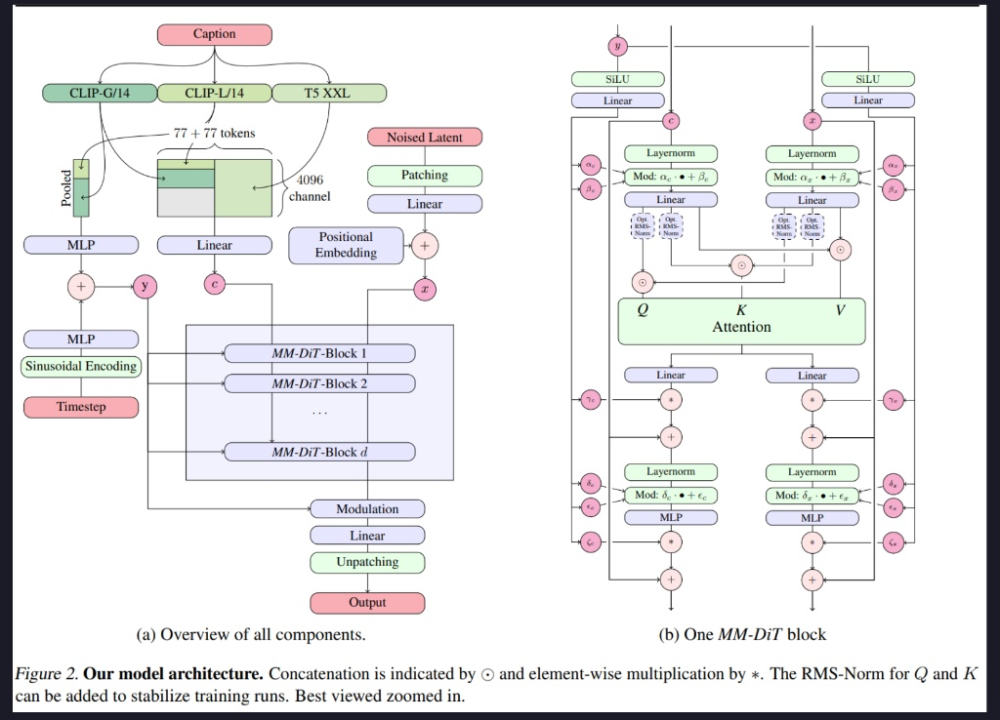
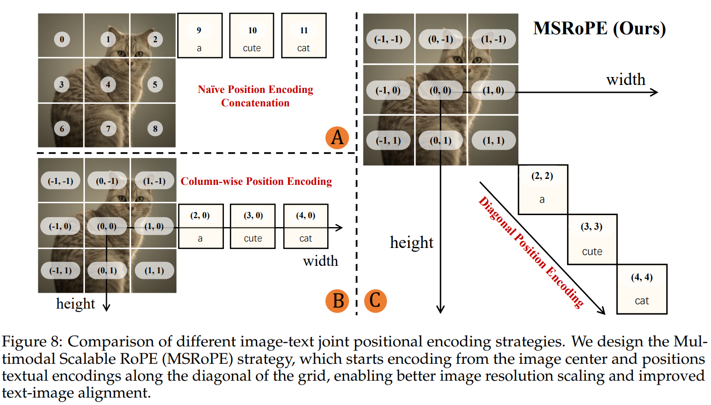
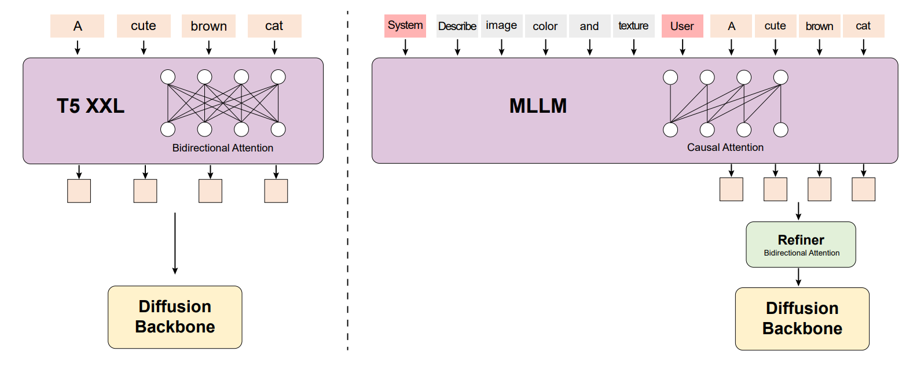

# DiT Generate Model in SGLang

## 常见 DiT Generate 模型

### Stable Diffusion 3(Image Generate)

> [!NOTE]
> 文本（Text）和图像（Image）是两种本质不同的模态，因此应该使用两套独立的权重来分别处理它们，但在注意力机制（Attention）阶段允许两者进行交互。

1. 双流架构：文本流 $c$ 与图像流 $x$ 各自用独立权重处理，仅在注意力处交互，以更好保留各自模态特征。
2. 全局调制：由时间步 $t$ 与汇聚文本向量构成的 $y$ 经 SiLU+Linear，为两流各自产生 6 组调制参数（$\alpha,\beta,\gamma,\delta,\epsilon,\zeta$），在各子模块中注入时序与语义。
3. 自适应归一化：进入 Attention/MLP 前先做 LayerNorm，再按 $\text{Mod}(u)=\alpha\cdot\text{LayerNorm}(u)+\beta$ 调制，实现可控的缩放与平移。
4. 联合注意力：两流分别生成 Q/K/V，沿序列拼接后做自注意力，完成跨模态信息交换，随后再拆回两流（可选 QK RMS-Norm 提升稳定性）。
5. 门控残差：Attention 用 $\gamma$、MLP 用 $\zeta$ 缩放后与输入做残差相加，便于深层训练并选择性抑制/增强模块贡献。
6. 独立 MLP：两流各自使用 Linear-激活-Linear 的 MLP，并配合 $\delta,\epsilon$ 等进行 AdaLN 调制。



### Qwen-Image(Image Generate)

> [!NOTE]
> 利用 Qwen2.5-VL 实现了极强的语义理解和多模态指令遵循能力  
> 通过 特制的 VAE 解码器 解决了“AI 生成文字乱码”的常见痛点

**整体流程**

```shell
多路输入（System/User prompt，选填图像）→ Qwen2.5-VL 提取条件特征
→ 初始噪声与潜在特征结合并注入时间步 t → 多层 MMDiT 处理
→ UnPatchify -> VAE 解码成图像
```

**条件编码器（Qwen2.5-VL）**
该模型语言-视觉空间已对齐；保留强语言理解；原生支持图像输入（适合编辑/图生图）。用特制 System Prompt，引出最后一层 hidden state 作为条件向量。
**VAE Encoder**
VAE Encoder 将图像从“像素空间”映射到“潜空间（Latent Space）”。这极大地降低了数据的维度，使得 MMDiT 能够高效地进行去噪训练。
**MM-DiT**
类似 SD 模型的 MMDiT，双流（文本/图像）各自独立的 Gate/MLP/Norm，仅在自注意力中交互；时间步 t 经 MLP 生成 Scale/Shift 注入各层 Norm，控制去噪进度。
**MS-RoPE**
解决文本/图像位置编码混淆；将文本视作 2D，并在位置空间与图像做“对角线拼接”，既保留图像分辨率可扩展性，又保持文本侧 1D-RoPE 等价性，提升高分辨率稳定性。




### CogVideoX(Video Generate)

**核心流程**

- 压缩：用 3D Causal VAE 把视频压到潜在空间，得到长序列 z_vision；文本经 T5 编码为 z_text。
- 融合：在序列维度拼接 $z_text ⊕ z_vision$，作为 input 传给多个 Expret Transforme r 块。
- 还原：输出先 Unpatchify 恢复潜在形状，再用 3D Causal VAE 解码成视频。

**关键组件**

- 3D Causal VAE：同时压缩空间与时间，使用因果卷积保证生成的时间顺序一致；通过上下文并行支撑长视频训练；以重建+感知+KL 为主，后期少量 GAN 提升细节。

  

- Expert Transformer：
  - Patchify（切片化）： 3D 因果 VAE 编码出形状为 $T \times H \times W \times C$ 的视频潜在变量（分别代表帧数、高、宽、通道）。这些潜在变量被切片，生成长度为 $\frac{T}{q} \cdot \frac{H}{p} \cdot \frac{W}{p}$ 的序列 $z_{vision}$。
  - 3D-RoPE：将位置编码扩展到(x,y,t)三维，分别用 1D-RoPE 并按通道拼接，提升时空建模能力。
  - Expert Adaptive LayerNrom：文本与视频两套独立调制归一化，缓解跨模态尺度与分布差异。
  - 3D Full Attention：统一在时空维度做混合注意力，借助 FlashAttention 与并行技巧把算力压力降到可接受。


**为什么要这样设计**

- 3D Causal VAE 的作用：压缩视频数据，减小计算量，同时保证时间顺序一致性，便于后续 Transformer 处理长序列。
- 3D-RoPE 的作用：3D-RoPE 专门为视频设计，告诉模型每个块在空间 $(x, y)$ 和时间 $(t)$ 上的具体位置。
- 3D Full Attention 的作用：同时计算所有帧、所有位置的关系。这让模型能直接捕捉大幅度的运动，保证物体在运动中不走样

### HunyuanVideo(Video Generate)

**架构概览**

- Latent DiT：输入为噪声潜变量 + 文本/图像条件，主干为约 13B 参数的 Transformer。
- 训练目标：采用 Flow Matching，相比扩散损失，生成轨迹更直更稳


**核心组件**

- 3D Causal VAE：时空压缩率为 $4 \times 8 \times 8$，潜在通道数 16；因果 Conv3D 确保第 t 帧不依赖未来帧，提升时序一致性。
- Text Encoder：使用增加了 bidirectional attention 的 MLLM
  
- Diffusion Backbone：先双流 20 层（文本/视频各自建模，无跨流注意力），再单流 40 层（拼接后 Full Attention 深度融合）。
  

## SGLang Diffusion 推理过程

### UniPC(Unified Predictor-Corrector) Scheduler
在log-SNR空间下，求解下面的 ODE；实际上它是给定一个当前状态，求解下一个 step 向哪个方向迭代的问题
- 将所有 predication 方式（ε/x₀/v/flow）统一成 $\hat{x}_0$，方便后续计算
- 求解 $\hat f_\theta(x, \lambda)$
**ODE（log-SNR）**
UniPC 不直接在 t 或 σ 上走，而是用  $\lambda(t) = \log(\alpha_t / \sigma_t)$

实际上，无论模型预测什么（ε / x₀ / v / flow），都可以统一成：
$$
\frac{dx(\lambda)}{d\lambda} = f_\theta(x(\lambda),\lambda)
$$
其中：
$$
x = \alpha x_0 + \sigma \varepsilon
$$
- $\lambda$ 单调递减（去噪过程）
- $x(\lambda)$ 是 $\lambda$ 时刻的 latent
- $f_\theta$ 由模型输出换算得到

**Predictor（UniP）** 

predication 的统一
  - ε-pred（DDPM 经典）: ε-pred 是**噪声空间**的坐标。
    - 模型预测：  
  $$
  \varepsilon_\theta
  $$

    - 正向过程：  
  $$
  x = \alpha x_0 + \sigma \varepsilon
  \Rightarrow
  x_0 = \frac{x - \sigma \varepsilon_\theta}{\alpha}
  $$


  - v-pred（Imagen / SDXL）: v-pred 是 $(x,\varepsilon)$ 的正交旋转坐标  
    - 定义：  
  $$
  v := \alpha \varepsilon - \sigma x_0
  \Rightarrow
  x_0 = \alpha x - \sigma v
  $$

    - 优点：高/低噪区数值更平衡，训练更稳定。

  - flow-pred（Flow Matching）: flow-pred 是**几何意义最直接的速度场**。
    - 模型预测：  
  $$
  v_\theta \approx \frac{dx}{d\sigma}
  $$

    - 正向线性插值：  
  $$
  x = (1 - \sigma)x_0 + \sigma z
  \Rightarrow
  x_0 = x - \sigma v_\theta
  $$


实际上，这些 predication 是**同一个向量场在不同基下的坐标表示**，我们只需要得到 $\hat{x}_0$，后续 ODE 积分完全一致。

$$
\text{Any prediction} \longrightarrow \hat{x}_0
$$
**Predictor 实际预测**
$$
x_{n+1}=x_n+\int_{\lambda_n}^{\lambda_{n+1}}f(x(\lambda),\lambda)\,d\lambda
$$

我们无法直接计算这个积分，因此用数值方法近似它，用离散点进行插值：
$$
x_{n+1} = \frac{\sigma_n}{\sigma_{n+1}} x_n - \alpha_{n+1}\Phi(h) - \alpha_{n+1}B(h)\sum_i \rho_i D_i
$$

然后算：
$$
x_{n+1}^{(p)}=x_n+\int_{\lambda_n}^{\lambda_{n+1}}\tilde f(\lambda)\,d\lambda
$$


**Corrector（UniC）**
用新得到的离散值 $m_{n+1}$ 和 历史离散值 $m_i$ 构造一个更好的插值函数$\int_{\lambda_n}^{\lambda_{n+1}} f(\lambda)\,d\lambda$，修正用旧信息构造的近似积分


$$
x_{n+1}^{(c)} = x_{n+1}^{(p)} - \int_{\lambda_n}^{\lambda_{n+1}} \bigl(\tilde f(\lambda)-f(\lambda)\bigr)\,d\lambda
$$

### UniPCMultistepScheduler 代码走读
- `timesteps`：离散索引
- `sigmas`：通过 $x = \alpha x_0 + \sigma \varepsilon$ 求出的噪声尺度，后续用于求解 `solver` 的时间步 $\Delta \lambda$，其中 $\lambda = \log(\frac{\alpha}{\sigma})$
- `solver`：在 log-SNR 空间下做 Predictor-Corrector 积分

**step 函数**
- 初始化 scheduler 当前的 `step_index`(当前 scheduler 的索引)
- 通过 `convert_model_output()` 将各类模型(flow-pred etc.)输出转换为统一的 $\hat{x}_0$ 格式
- 使用数组维护一个滑动窗口，存储最近 `solver_order` 个时间步的模型输出和时间步，用于后续 UniP 的显示多步插值以及 UniC 的滑动窗口 + 隐式新点的修正
  - 刚开始，滑动窗口未填满，使用 `self.lower_order_nums` 记录当前已填满的数量
  - 需要注意，靠近最后几步的时候，传入 UniP 的阶数不能比剩余步数大
- `prev_sample` 维护新的 latent
```python
def step(
    self,
    model_output: torch.Tensor,
    timestep: int | torch.Tensor,
    sample: torch.Tensor,
    return_dict: bool = True,
) -> SchedulerOutput | tuple:
    """
    Predict the sample from the previous timestep by reversing the SDE. This function propagates the sample with
    the multistep UniPC.

    Args:
        model_output (`torch.Tensor`):
            The direct output from learned diffusion model.
        timestep (`int`):
            The current discrete timestep in the diffusion chain.
        sample (`torch.Tensor`):
            A current instance of a sample created by the diffusion process.
        return_dict (`bool`):
            Whether or not to return a [`~schedulers.scheduling_utils.SchedulerOutput`] or `tuple`.

    Returns:
        [`~schedulers.scheduling_utils.SchedulerOutput`] or `tuple`:
            If return_dict is `True`, [`~schedulers.scheduling_utils.SchedulerOutput`] is returned, otherwise a
            tuple is returned where the first element is the sample tensor.

    """
    if self.num_inference_steps is None:
        raise ValueError(
            "Number of inference steps is 'None', you need to call 'set_timesteps' after creating the scheduler"
        )

    if self.step_index is None:
        self._init_step_index(timestep)

    use_corrector = (
        self.step_index > 0
        and self.step_index - 1 not in self.disable_corrector
        and self.last_sample is not None
    )

    model_output_convert = self.convert_model_output(model_output, sample=sample)
    if use_corrector:
        sample = self.multistep_uni_c_bh_update(
            this_model_output=model_output_convert,
            last_sample=self.last_sample,
            this_sample=sample,
            order=self.this_order,
        )

    for i in range(self.config.solver_order - 1):
        self.model_outputs[i] = self.model_outputs[i + 1]
        self.timestep_list[i] = self.timestep_list[i + 1]

    self.model_outputs[-1] = model_output_convert
    self.timestep_list[-1] = timestep

    if self.config.lower_order_final:
        this_order = min(
            self.config.solver_order, len(self.timesteps) - self.step_index
        )
    else:
        this_order = self.config.solver_order

    self.this_order = min(
        this_order, self.lower_order_nums + 1
    )  # warmup for multistep
    assert self.this_order > 0

    self.last_sample = sample
    prev_sample = self.multistep_uni_p_bh_update(
        model_output=model_output,  # pass the original non-converted model output, in case solver-p is used
        sample=sample,
        order=self.this_order,
    )

    if self.lower_order_nums < self.config.solver_order:
        self.lower_order_nums += 1

    # upon completion increase step index by one
    self._step_index += 1

    if not return_dict:
        return (prev_sample,)

    return SchedulerOutput(prev_sample=prev_sample)
```

**multistep_uni_p_bh_update 函数**
实际上是上述 UniP 公式的实现


### 推理过程中 shape 的变化

#### Unpatchify（反切片）

将 Transformer 输出的扁平序列还原为 5D 视频张量 `(B, C_out, F, H, W)`

| 符号 | 含义 |
| --- | --- |
| B | Batch Size |
| L | 序列长度 `= F' × H' × W'` |
| D | 隐藏维度（inner_dim） |
| C_out | 输出通道数 |
| F', H', W' | Patch 后的时间、高、宽维度 |
| p_t, p_h, p_w | Patch 尺寸 |

1. **输入**  
   `hidden_states: [B, L, D]`

2. `proj_out` 线性映射  
   把 `D` → `C_out × p_t × p_h × p_w`  
   输出形状：`[B, L, C_out * p_t * p_h * p_w]`

3. `reshape`  
   将 `L` 拆回 `(F', H', W')`，并把像素段拆回 `(p_t, p_h, p_w, C_out)`  
   形状：`[B, F', H', W', p_t, p_h, p_w, C_out]`

4. `permute(0, 7, 1, 4, 2, 5, 3, 6)`  
   维度顺序变为：  
   `B, C_out, F', p_t, H', p_h, W', p_w`

5. 逐级 `flatten`  
   - `flatten(6, 7)` → 合并 `W'` 与 `p_w` 得原始宽度 `W`  
   - `flatten(4, 5)` → 合并 `H'` 与 `p_h` 得原始高度 `H`  
   - `flatten(2, 3)` → 合并 `F'` 与 `p_t` 得原始帧数 `F`

6. **最终结果**  
   `output: [B, C_out, F, H, W]`

#### Latent Prepare
**ImageVAEEncodingStage:**

把参考图视作视频的首帧条件，将参考图 + 补零帧一起进行 VAE 编码，这样得到的 latent 在时间维度上是对齐的。

编码后会做后处理，我们显式构造一个**首帧条件 mask**，并将其作为 per-token condition feature 拼接到 latent token 的特征向量中。
- 压缩原始视频到 latent 空间：原始视频帧数 $T$ 会被压缩为潜在时间长度 $T_{lat} = \frac{T + r - 1}{r}$，同时Height/Width 也会被压缩到原来的 $\frac{1}{s_h}$和 $\frac{1}{s_w}$

- 增加首帧图片条件约束：该 mask 指示每个 压缩时间 token 是否应受到首帧条件的强约束，从而使后续的 DiT 能在不改变 token 序列结构的前提下，区分 **conditioned tokens（首帧相关） 与 unconditioned tokens（自由生成）**。
  - 原始 token 表示  
  $$x_{t,h,w} \in \mathbb{R}^{C_{\text{lat}}}$$
  - 增强后的 token 表示  
  $$\tilde{x}_{t,h,w} = [x_{t,h,w};\; c_t] \in \mathbb{R}^{C_{\text{lat}}+r}$$
    其中 $c_t \in \{0,1\}^r$
    - 对于 $t=0$: $c_0 = (1,1,\dots ,1)$
    - 对于 $t>0$: $c_t = (0,0,\dots ,0)$


#### DiT
Video DiT/Transformer 看到的输入，本质是一个 token 序列，latent 是 5D 向量：

$$
\text{latent} \in \mathbb{R}^{B \times C_{\text{lat}} \times X \times H \times W}
$$

真正进 Transformer 之前，会被 patchify 成：

$$
\underbrace{\mathbb{R}^{B \times L \times D}}_{\text{token 序列}}
$$
其中最常见的做法是把 $(X,H,W)$ 展开成 token 数：

- **token 数**：  
  $
  L = X \cdot H \cdot W \quad (\text{或再乘 patch 分块因子})
  $

- **token 维度**：  
  $D$ 通常来自通道维 $C$（再经过线性映射）


对于每个位置 $(t,h,w)$，有一个 token 向量：

$$
x_{t,h,w} \in \mathbb{R}^{C_{\text{lat}}}
$$

Transformer 做的是让这些 token 互相注意力交互。


### Wan Animate 接入 SGLang Diffusion
| 特性 | Wan 2.1 (T2V/I2V) | Wan Animate |
| --- | --- | --- |
| 目标 | 生成一个短视频片段 (如 5s) | 根据长姿态生成任意长度视频 |
| 生成方式 | One-shot (一次性) | Autoregressive (分段接力) |
| 循环结构 | 只有 Denoising 循环 | Segment 循环嵌套 Denoising 循环 |
| 条件输入 | 文本/首帧图片 | 文本/首帧 + Pose序列 + 上一段视频尾部 |
| 显存占用 | 固定 (取决于预设帧数) | 固定 (取决于分段长度 segment_frame_length) |

#### 方案

方案 A（更干净）：改 PipelineExecutor，支持 segment micro-batch + 重放 + merge

核心思想：把“外层 segment 循环”从某个 stage 里拿出来，交给 executor 做“控制流”。stage 仍保持“处理一个 Req → 返回一个 Req”的纯函数式风格，但 executor 能把同一个请求拆成多个 segment 子请求，跑一段 stage 子图，然后把结果 merge 回主请求。

新增的抽象（建议最小集合）
SegmenterStage（或叫 SegmentPlanStage）
输入主 Req，输出一个“segment 计划/列表”，本质是 List[Req]（每个元素是一个 segment micro-batch），以及一个可选的 merge_context。
例如：按 start/end 切 pose_video[:, :, start:end] / face_video[:, :, start:end]，为每段设置 batch.is_segment=True、batch.num_frames=segment_frame_length、batch.extra["segment"]={start,end,idx,...}。
MergerStage（或叫 SegmentMergeStage）
输入 List[Req]（每段已完成 denoise/decode 的结果）+ 主 Req，输出合并后的主 Req：拼接 out_frames/latents，更新 prev_segment_cond_*，写最终 batch.output。
executor 怎么执行（一个典型编排）
把 pipeline 的 stage 列表切成三段：
前置一次：[input_validation, text/image encoding, conditioning, timestep prep, ...]
segment 内重放：[latent prep(每段), prev_segment_cond prep(每段), pose prep(每段), denoising(每段), decoding(每段)]
末端一次：[merge, save]
伪代码示意（关键点是 executor 负责重放）：

并行/分布式要点（这也是它“更干净”的价值）
CFG parallel / SP parallel 的 barrier 与通信：现在 ParallelExecutor 每个 stage 都知道自己的 parallelism_type，executor 在 stage 边界做 barrier/broadcast。
改造后，重放仍然是“按 stage 边界”执行，所以通信语义不变；你只是在 executor 多套了一层“循环”，不会把 barrier 藏进某个 stage 的 forward() 里（这点对正确性和可维护性很关键）。
段间依赖（prev_segment_cond_*)：可以通过两种方式传递
方式 1（推荐）：executor 在跑每个 segment 前，把上一段的 prev_segment_cond_* 写入下一段的 Req（显式、可测）。
方式 2：在 MergerStage 里一次性算出所有段需要的 prev 信息（通常做不到，因为它依赖上一段的输出）。
profile/timings：仍能在 stage 级别计时；还能自然得到 per-segment 的分解数据（比把循环藏在 stage 里更好观测）。
优缺点
优点
真正“pipeline 图可组合”：segment 内要不要 decode、要不要额外 stage（如背景/mask replace）都能在列表层面拼装。
分布式语义清晰：barrier/broadcast 不会被埋进某个大 stage，后续更好做并行优化（并行跑多个 segment、pipeline parallel 等）。
更容易做“跳过某些 stage 的重放”（比如 timesteps 与 prompt encoding 不必每段重复）。
代价
需要改 PipelineExecutor 的接口与实现：从 execute(stages, batch)->batch 变成能处理 [Union[Req, List[Req]]](http://vscodecontentref/21) 或引入显式的 segment 执行模式。
需要定义清楚“哪些 stage 在 segment 内重放、哪些只跑一次”的边界；并保证 Req 字段在复制/切片时不会引入共享可变引用（尤其是 tensor 的 view/clone 策略）。
方案 B（最小侵入）：新增 SegmentLoopStage，在 stage 内部自己 for-loop + 调用 DenoisingStage

核心思想：pipeline 列表不变或变化很小；新增一个 stage 把外层 for segment in ... 藏在 forward() 里，循环里直接调用“每段需要的逻辑”（可直接复用 DenoisingStage 实例或抽一个函数）。

怎么落地
SegmentLoopStage.forward(batch)：
先根据 batch 计算 num_segments/start/end
每段：切 pose/face/background/mask，准备 prev_segment_cond_video/latents，然后调用 denoise + decode，得到 out_frames，再更新下一段的 prev
最后拼接所有段的输出写回 batch.output
优缺点
优点
改动范围小：不动 executor、不引入新执行模型，最快能跑起来。
对“只服务一个特定 pipeline（WanAnimate）”的短期目标很实用。
代价 / 风险（通常是后期痛点）
分布式语义容易变糊：现在 executor 的 barrier/broadcast 是按 stage 做的；你把循环塞进一个 stage，就等于把“多次 denoise/decode”塞进一次 barrier 区间里。
如果内部还需要 CFG/SP 同步，很容易出现“有的 rank 在循环里走了不同分支/不同次数”的隐患（尤其是 error handling、interrupt、动态跳步）。
可观测性差：profiling/timings 只能看到一个大 stage，很难分辨每段、每个子步骤耗时。
可复用性差：将来想把“segment 内部”再拆成可插拔 stage（比如替换不同的 prev-segment 生成策略、不同的 stitch 策略）会很难，因为控制流已经硬编码在一个 stage 里。
测试粒度粗：很难单测“segmenter/merger”这种逻辑单元。
怎么选（经验判断）

你现在的目标是“真正两个 stage 都在 pipeline 列表里、executor 驱动重放并 merge”——那就选方案 A；它的工程复杂度更高，但会把段式 video diffusion 变成平台能力。
如果你只是想尽快把 WanAnimate 跑通、短期不考虑通用化/分布式鲁棒性/可观测性，方案 B 会更快。
如果你愿意，我可以基于当前仓库的 ParallelExecutor 直接给出一个具体改造草案（新增 SegmenterStage/MergerStage 的最小接口、executor 如何识别“segment 子图边界”、以及 Req.extra["segment"] 的字段约定），这样你们可以按 PR 颗粒度逐步合入。