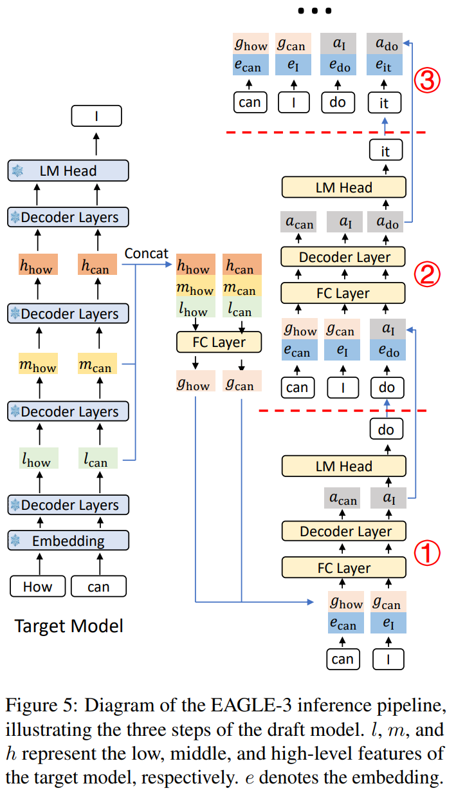

---

title: Speculative Decoding in SGLang(EAGLE2)
created: 2026-01-12
tags:
- LLMInference
description: 本文将从为什么需要 speculative decoding 开始讲起，通过几篇论文来讲述现在投机采样演进的路线，以 SGLang 中 Eagle2 的实现作为 example 进行解析，并结合约束解码进行异步优化进行部分结果对比。
cover: /img/eagle2.png
---
# Speculative Decoding in SGLang(EAGLE2)

在正式进入 SGLang 源码前，我们需要知道为什么我们需要 speculative decoding 以及什么是 speculative decoding。有了这些认识后，我们可以深入源码来了解 SGLang 是如何将 speculative decoding 与 scheduler 集成起来的

这里先大概给一下 speculative decoding 的示意图


## **Speculative Decoding Motivation**

基于以下观察，提出了 speculative decoding，利用空闲计算资源增加并行性

- Many easy tokens can be predicted with less computational overhead(using a smaller model)
- LLM 推理是高度 memory-bound 的，延迟主要在读取/写入模型参数而不是计算

> 每次生成一个 token，都需要搬运所有模型权重从 HBM 到 cache 中

我们需要保证 speculative decoding 生成多个 token 的成本要比 auto-regressive 生成 1 个 token 成本差不多，所以投机采样要想获得性能收益，核心要解决以下两个问题：

> 在整个投机采样的流程中，假设轻量 LLM 生成 Draft Tokens 的开销为  $p$ ，原始 LLM 验证 & Next Token 生成的开销近似为 1 ，那么**投机采样在接受 Tokens 数大于  **$1 + p$**  的情况下才有性能收益**，并且随着接受的 Tokens 数增加而性能收益越大。

1. **如何降低投机采样的 overhead？**
2. **如何提升 Verify 阶段的接受率？**

## **What is Speculative Decoding(Original)**

一般遵循以下流程：

- Draft: 生成 k 个 candidate tokens
- Verify:
  - 用 target model 并行 verify all candidate tokens
  - 对每个位置的分布计算概率
- Accept / Reject:
  - 接受所有 correct token
  - 在第一个被拒绝采样的位置，在**调整后的分布**中重新采样

> 注意：我们对 draft 分布需要与 target 的分布相同


---

## Some Limitations

我们需要让 Draft Model 的生成的目标分布与 Target Model 相同，这里有多种选择方式

- 选取与 target model 同一 family 的较小的模型
- Distill 一个轻量模型，teacher 选取 target model，这会引入 training cost
- 选取 ngram 模型，但是这个的接受率很低

Draft model 和 target model 需要共享 vocabulary 或者使用相同的 tokenizer

- $p(x)$ 和 $q(x)$ 必须定义在同一个样本空间上

---

## **发展历程**

### **Speculative Decoding (Leviathan et al., 2023, Google)**

📄 _Fast Inference from Transformers via Speculative Decoding_

- 首次提出该方法，思路：

  - 用一个小模型（draft model）生成多个候选 token；
  - 用大模型（target model）验证其中的一部分；
  - 若验证通过，则一次提交多个 token，减少大模型调用次数。
- 用更高效的模型 $M_q$ 生成 **γ **个候选 token；
- 然后使用目标模型 $M_p$ **并行 Verify** 这些候选样本及其在 $M_q$ 中的概率， 并**接受**所有能使分布与 $M_p$ 一致的候选；

> _决定被接受的数量 n（用随机数进行拒绝采样）_

- 接受所有正确的采样
  - 对第一个被拒绝的候选，从一个**调整后的分布**中重新采样

  > 如果草稿模型 $M_q$ 在第 n+1 个 token 被拒绝，那么目标模型 $M_p$ 不能直接用自己的分布采样，而必须把已经被 $M_q$ 尝试但拒绝掉的概率质量 $M_p$ 中减掉，再重新归一化
  >

  - 如果所有候选都被接受，只接受 **γ-1** 个，然后再采样一个额外的 token

> 修正的拒绝采样方案可以保持与 target 采样相同的目标分布
> 

- Limitations
  - 使用 separate 的 draft model
    - Draft model 训练后效果比较好，引入了训练成本
    - Draft model 和 target model 之间的 distribution shift
  - Memory overhead of second model
  - 每次迭代只有一个 draft sequence
  - $\gamma$是固定的，简单的 token 会浪费资源，复杂的 token 需要更多的推测

---

### **Medusa(No need for a separate draft model)**

📄 MEDUSA: Simple LLM Inference Acceleration Framework with Multiple Decoding Heads

- 不是单独的小模型，而是 **在大模型 decoder 的 last hidden states 上直接加多个预测头(1-2 layer mlp)**；
- 每个 head 会为它负责的位置生成多个最可能的预测

  - 第 t 个 position 位置处，第 k 个 head 预测 t+k+1 个 token
  - 这会增加一次 decoding step 的接受长度
  - Verification can be computationally intensive for a large number of completions

  > We need trade-off
  >
- 为了**加速**与**计算代价**之间取得平衡，引入了一种 **树状结构的注意力机制（tree-structured attention）**，可以**并行处理多个候选序列，一次验证一整棵树**

  - 依据预测的 probs 构造了一个稀疏的 candidate tokens 树
  - **Tree Mask**：**每个 token 只能看到来自同一条候选序列（continuation）的历史 token**，不能访问其他候选的 token。
  - 按照树结构，正确分配 positional encoding

  > 同一深度的 token 用同一个 position id
  >
- **会选择长度最长的前缀 candidate tokens**


- Limitations:
  - Position-Independent Prediction / Limited Information
    - 每个 Medusa head 预测位置 i+k，但它不知道位置$i+1\dots i+k-1$ 实际预测了什么

    > 与真实的自回归不同
    >

    - Medusa head 只能看到最后一层的表示
    - 最后一层是为预测下一个 token 训练的，而不是第 2、3 个之后的 token
    - 无法利用中间层更丰富的表示
  - Lower acceptance rates for later positions in the draft
  - Speedup plateaus at ~3× even with more heads

---

### **Lookahead Decoding**

📄 Lookahead: An Inference Acceleration Framework for Large Language Model with Lossles


- 层次化多分支草稿策略 (Hierarchical Multi-Branch Draft Strategy)：_利用共同的前缀标记将多个预测的草稿序列（分支）进行合并和压缩_
- 基于 Trie 树的草稿检索和管理 (Trie-tree-based Retrieval and Management)

  - Trie 树存储了**输入提示 (Prompt)** 和**已生成响应 (Generated response)** 中出现的 n-gram 标记序列（即分支）。
  - 引入了 **生成分支插入 (Generated branch Inserting)** 机制，能够动态地 (on-the-fly) 将生成的重复序列放入 Trie 树中，从而利用输出中的重复模式进行加速。
  - 通过**分支消除**和**节点修剪**策略来保持 Trie 树的高效性，控制内存消耗。

---

### **EAGLE-1： Extrapolation Algorithm for Greater Language-model Efficiency**

📄 EAGLE: Speculative Sampling Requires Rethinking Feature Uncertainty

- Train a lightweight plugin, called AutoRegression Head, in conjunction with the Original LLM's frozen embedding layer, to predict the next feature based on the current feature sequence form the second-top-layer of the Original model
- Decode using the frozen classification head of the Original LLM, which maps features to tokens
- Feed in tokens from one time step ahead
  

#### EAGLE-1 Drafting

EAGLE-1 解决了 Medusa 的不确定性，使用了 feature-level 进行预测

- Feature prediction with known context is much more accurate
- EAGLE integrates embeddings and generates the next feature
- When predicting $f_j$, we already know $f_{j-1}$

$$
\begin{aligned}
(f_n, t_n)&\rightarrow f_{n+1} \\
f_{n+1} &\rightarrow LM\_Head \rightarrow t_{n+1}\\
(f_{n+1}, t_{n+1}) &\rightarrow f_{n+2}
\end{aligned}
$$

#### EAGLE-1 Verification

- 对每个 draft token position 生成 target probs p
- **Tree Attention**：直接 verify 整个 tree

  - EAGLE 生成的树更稀疏、上下文更充分

  > 每一步预测都知道前面 token 是什么，通过 feature 可以得到更多的信息
  >

  - Medusa Head 2 predicting t+2 doesn’t know what t+1 will be


#### Multi-round speculative sampling

把同一位置的多个候选 token 按顺序做多轮 accept / reject；只有当所有候选都拒绝了，才从调整后的分布里真正采样一个 token。这样能 提升接受率 / 减少 fallback，同时仍然保持严格无偏（最终 token 仍服从目标分布 p）

- **依次尝试** $t_1,t_2,t_3\dots ,t_k$
- 每次尝试失败，不是立刻从 adjusted distribution 采样，而是：

  - **更新目标分布 p**（扣掉本轮 proposal 那部分概率重新进行分布）
  - 然后继续尝试下一个候选
- 如果 k 个都失败了，才从最终剩下的 adjusted 分布采样一次


---

### **EAGLE-2: Context-Aware speculation**

📄 EAGLE-2: Faster Inference of Language Models with Dynamic Draft Trees

- High confidence → high acceptance probability → expand the tree
- Low confidence → low acceptance probability → prune the tree

Context-aware speculation:

- Easy context (code boilerplate): Deeper trees
- Hard context (creative writing): Shallower, wider trees

#### Motivation

- 接受率除了与 **Token 所在位置相关以外（在树中所处的位置），还和上文相关（树中的祖宗节点）**。

> 
> _P3、P4 和 P5、P6 虽然都是同一层的节点（即同一个 Step 的 Draft Tokens），但接收率上 P3、P4 普遍高于 P5、P6 节点，一个重要的原因是 P3、P4 的父节点为 P1，其概率高于 P5、P6 节点的父节点 P2。P3、P4 的概率甚至普遍高于 P2 这更加说明在生成 Draft 树的时候，采用静态 Draft 树并不是一个最优选择，更应该选择动态 Draft 树。_

- 原始 LLM 自回归生成的 Token 概率分布表示 Token 接收概率。Eagle 的 Draft 模型生成的 Draft Tokens 概率分布与 Token 接收率分布接近。下图展示了 Draft Tokens 生成概率和 Token 接收率的分布图，可以看出分布很接近，**可以通过 Draft Tokens 生成概率预估 Token 的接收率。**
  

#### EAGLE-2 Dynamic Tree Construction

EAGLE-2 不修改 draft 模型的训练与推理方式，也不改变验证阶段。它的改进集中在两个方面：

1. 如何扩展草稿树；
2. 如何对草稿 token 进行重新排序

- **Expand 阶段**：从当前层选择 **全局接受概率（global acceptance probability）最高的前 k 个 token** 进行扩展。
  - 一个 token 的**全局接受概率**是它从根节点到该节点路径上所有 token 的接受概率的乘积：
    $V_i = \prod_{t_j \in \text{Path(root, }t_i\text{)}} p_j \approx \prod c_j，$ 其中$c_j$是 draft 模型的置信度
- **ReRank 阶段**：**不会直接使用扩展阶段的结果，而是对所有草稿 token 重新排序**，选出全局 top-m 的节点。

> _Expand 的目标是加深草稿树。然而，由于接受率在 0–1 之间，越深的 token 其值越小。_**一些浅层未扩展节点可能比深层节点更有价值**_。_
> **对于值相同的节点，优先选择浅层节点，始终保持父节点在子节点之前被选中。** 这样可以保证 top-m 节点仍构成一棵连通树。
> 

- **Tree Mask**：把这些选中的 token **拉平成一维序列**，送入主模型进行验证阶段。为了与标准自回归解码保持一致，我们需要调整注意力掩码。不同分支的 token 不应互相可见，因此注意力掩码需根据树结构修改，使每个 token 仅能看到它的祖先节点。


---

### EAGLE-3: Training-time test + Direct Token Prediction + Multi-level fusion

#### Motivation

- Increasing training data for EAGLE-1/2 provides **limited** improvement
- **EAGLE Training: Loss = L_fea + L_token**

  - Feature prediction loss constrains the model
  - Model must output something close to target features
  - This limits expressiveness!
- **The Feature Prediction Constraint:**

  - Forces draft model output to approximate target features
  - Limits the model's representational capacity
  - Token prediction is the goal; feature prediction is an auxiliary objective
  - If those outputs aren’t “feature-like,” the next step becomes out-of-distribution

#### EAGLE-3: Training-time test

**With L_fea (EAGLE-1/2)**

- Training step 2 still uses **ground-truth features** as context
- But at test time, step 2 uses **predicted** features
- L_fea partially masks this because predicted ≈ ground-truth
  **Without L_fea (failure mode)**
- Training never sees the model’s unconstrained predictions as inputs
- Test time does → out-of-distribution → compounding error
  Core rule: **if the model will consume its own predictions at test time, it should practice that during training**
- Train by simulating multiple draft steps **using predicted states**, not ground truth
- Important implementation detail: **stop-gradient** through the simulated rollout so training remains stable


- Removes the need for a strict “feature-likeness” constraint
- Model learns to be robust to its own imperfect intermediate states
- Capacity is spent on “what helps token accuracy under rollout,” not “match a specific feature target”

#### EAGLE-3: Tree Attention Mask during training of the draft model

- 虽然自回归推理在时间上是顺序的，但在训练时可以把多步 rollout 重构成一棵树，并用树状 attention mask 一次性并行计算，从而让模型在训练阶段就经历“使用自身预测作为上下文”的真实测试条件。
  

#### EAGLE-3: Multi-layer feature fusion

一旦不再强迫预测 feature 去像某一层的 ground-truth feature”（移除 $L_{\text{fea}}$），模型就可以自由地利用不同层的表示：

- Top-layer features are "committed" to the immediate next token
- Lower layers contain richer, more general semantic information
- Predicting t+2 benefits from information not yet "collapsed" into next-token prediction
- Fusion captures multiple abstraction levels



---

## **Eagle2 in SGLang**

### Overview

- Draft 的状态通过 batch.spec_info 来进行管理；不停地在 Scheduler 和 EAGLEWorkerV2 中流转
- 将 draft 和 verify 数据准备工作单独开辟一个 GPU plan stream 进行，与 GPU compute stream 并行
- 因为数据准备工作(**KV Cache 等**)会影响到后续这些过程计算的正确性，所以在启动 GPU compute kernel 前需要等待 plan kernel 执行完成

**同步点**[见下文](#同步点)**：**

1. Verify 与 Draft Extend 之间的同步
2. Draft 与 Verify 之间的同步
3. Verify 与 Sampling 之间的同步


### 整体流程

Prefill 阶段生成 batch 与不开启 spec 并无不同；通过 self.future_map.resolve_future() 和 self.future_map.store_to_map() 实现异步的结果存取

`run_batch()` 会先调用 EAGLEWorkerV2::forward_batch_generation()

- target_worker(TpWorker) 执行 `forward_batch_generation`，采样出第一个 token

> Eagle 需要这个 token 对应的 hidden states 进行 draft 的推理

- draft_worker(EAGLEWorkerV2) 执行 `_draft_extend_for_prefill`
  - 将 target model 生成的 token 也加入到 batch.input_ids 里面
  - 构造 EagleDraftInput，EAGLE v2 的 decode 阶段会基于 `verified_id` 作为树的根节点，再生成 topk 分支并构建 tree mask、positions 等
    ```shell
      EagleDraftInput(            _  _
      _hidden_states_  =_  target_hidden_states_  ,
      _  verified_id_  =_  next_token_ids_  ,
      _  new_seq_lens_  =_  batch_  .seq_lens,
      # draft mode is same with decode mode, only 1 num token per batch
      _  num_tokens_per_batch_  =1,
      _  num_tokens_for_logprob_per_batch_  =1,
      )
    ```
	- 调用 draft model 的 forward_extend() 并进行采样，得到 topk 的 token index & prob 以及 hidden states

- 在 decode 阶段，draft worker 先调用 draft()，再调用 verify()，最后 _draft_extend_for_decode()
	- draft(): 按 `speculative_num_steps` 多步扩展一棵 top-k 树，记录每个节点 token/score/parent，最后从整棵树里挑一批最高分节点作为 `draft_tokens`，并返回树结构信息给 `build_tree_kernel_efficient`，构造出 EageleVerifyInput
      ```python
      EagleVerifyInput(
          _draft_token_=draft_tokens, # draft 阶段挑选出来、准备让 target 一次验证的 **候选 token 集合**
          _custom_mask_=tree_mask, # 每个候选节点能看到哪些 token
          _positions_=position, # 每个候选节点对应的 **position id**
          _retrive_index_=retrive_index, # verify batch 中第 i 行，对应 draft 树里的哪个节点
          _retrive_next_token_=retrive_next_token, # 如果某个节点被接受，下一个应该跳到哪个节点
          _retrive_next_sibling_=retrive_next_sibling, # 如果当前节点没被接受，下一个备选兄弟节点是谁
          _retrive_cum_len_=None,
          _spec_steps_=_self_.speculative_num_steps, # draft 扩展的最大深度（树的高度）
          _topk_=_self_.topk, # draft 阶段每个节点的分支数
          _draft_token_num_=_self_.speculative_num_draft_tokens,
          _capture_hidden_mode_=None,
          _seq_lens_sum_=None,
          _seq_lens_cpu_=None,
      )
      ```
- verify(): verify 一次 forward，**最多验证 spec_steps 个未来 token + 当前 token**
	- 把 verify 所需的 **tree 索引和 token(verify_input)** 从 GPU 拷到 CPU，准备更新 vocab mask
	- Target model 执行 `forward_batch_generation()`，实际上直接跳过了 sample
	- 对 draft 树做 DFS 构造 vocab mask，并把 batch.sampling_info.vocab_mask 置空（`None`）
	- 对 draft input 做 sample，同时考虑 target 的概率分布和 draft 的 token
		- 如果 draft token 被拒绝，会根据 target 的概率分布重新采样一个新的 token 作为修正
- _draft_extend_for_decode():
	- 计算的 `select_index`，只保留最后一个 Token 的预测结果。
	- 计算出的 `topk_p`（概率）、`topk_index`（Token ID）和 hidden_states 被填入`next_draft_input`。这个对象会被传递给下一个循环的 `draft()` 函数，作为生成新的 Token 树的**root**


### KV Cache 管理

Draft Model 和 Target Model 都有自己独立的 KV Cache

- **Draft Cache**: 在 prepare_for_v2_draft 中计算写入的 KV Cache 位置。Draft 模型用它来生成树
- **Target Cache**: 在 prepare_for_v2_verify 中计算写入的 KV Cache 位置。Target 模型用它来验证树

#### 分配

在 prepare_for_decode() 处进行

- Target 通过 alloc_for_decode() 分配物理 KV Cache
- Draft 等待上一轮 sample 结束后，同步当前 batch 的 seq_len，利用这个 seq_len 分配下一轮需要的物理 KV Cache

> 分配了 2 * ALLOC_LEN，确保 current step 和 next step 所有的数据都可以装下

#### 释放

> commited_len 是实际 KV Cache 使用的长度
> allocated_len 是分配的 KV Cache 的长度

在 scheduler 调度中，调用 process_batch_result_decode 进行处理，req 结束后

- 处理已提交的 token，将"有用"的 token 放入 radix cache；其他直接释放
- Eagle v2 需要释放过度分配的 kv cache

  > 在 EAGLE v2 中，`allocated_len` 通常比 `committed_len` 大很多（包含 Draft 预测的但未被接受的 Token，以及为了 Overlap 预分配的空间）
  >

## Rollback Lazy Processing

Rollback（回退）并不是真的释放显存，而是**移动指针**。

- **物理层（不处理）：** 当 Target Model 验证发现 Draft 预测的 5 个 Token 只对了 2 个时，剩下的 3 个无效 Token 产生的 KV Cache 依然留在显存的物理 Block 中。我们不会立即触发类似 `free()` 的操作，因为这太慢了。
- **逻辑层（即时回退）：** `committed_len` 会立即更新为验证通过的长度。下一轮推理时，新的 KV Cache 会直接**覆盖（Overwrite）** 掉那些之前预测失败留下的脏数据。
- **请求结束：** 只有当整个请求结束，进入 `process_batch_result_decode` 时，Radix Cache 才会根据 `committed_len` 将真正有效的路径存入缓存池，而 `allocated_len` 多占用的那部分物理 Block 会被统一回收。

### 同步点

事实上除了上面提到的 CPU 与 GPU compute stream 的同步，这里还有一个 GPU plan stream

#### **Plan stream 和 Compute stream 之间的同步**

- 因为 plan stream 中一般都是为后续计算做准备的，compute stream 需要同步等待 plan stream 操作完成

#### CPU 与 Plan Stream 的同步

- 由 CPU 侧的调度逻辑保证，自然同步

#### CPU 与 Compute stream 的同步

- Draft Extend N-1 与下一轮调度由 CPU 调度逻辑保证同步
- Write future map 和 Read future map 由 copy_to_cpu() 保证同步
- Verify 与 Draft Extend 之间的同步

  - Draft Extend 填充 KV cache 依赖于 verify 的 accept length 和 predict 结果，所以需要同步

  > **事实上由于我们前面的 target verify 与 cpu 的 launch target sampling 有同步点，所以这里自然保证同步**
  >
- Draft 与 Verify 之间的同步

  - CPU 进行 verify plan 的时候，GPU 的 draft 可能还没计算完成，所以在 launch verify kernel 前同步更新下 verify buffer
  - 我们为了生成 vocab mask，需要 verify input，需要拷贝 GPU 上的数据，这里用的 .cpu() 实际上是一次同步

  > **这里应该用异步拷贝**
  >
- Verify 与 Sampling 之间的同步

  - Cpu 上根据得到的 verify input 进行 vocab mask generate，这里需要将 cpu 的 vocab mask 拷贝到 GPU 上


### 同步的细节

#### Late Binding

为了让 **Plan(prepare data for compute)** 可以不依赖 GPU compute stream，代码允许 Plan 阶段使用**不完整的数据**。

- Plan 阶段先分配好 Buffer，或者复用 CUDA Graph 的静态 Buffer。
- Draft 阶段算完后，直接调用 update_verify_buffers_to_fill_after_draft，利用 CUDA Kernel 高速把 Draft 生成的 Mask/Pos **直接写入** 到 Plan 阶段预留的显存地址中。

## Test SGLang Eagle + Constrained Decoding

### Test sh

```python
import requests
import time
import threading
import json

# 参数设置
X = 10 # 总请求数
T = 1  # 总时长（秒）
output_file = "output.json"

url = "http://localhost:30000/v1/chat/completions"
headers = {"Content-Type": "application/json"}
payload = {
    "model": "meta-llama/Llama-2-7b-chat-hf",
    "messages": [
        {"content": "Your task is to extract the name of the person from the following text.", "role": "system"},
        {"content": "I'm John Doe. Please write a detailed biography of John Doe, including his background, education, career, achievements, and any interesting stories or anecdotes. Make the biography as long and comprehensive as possible, and ensure the output is in valid JSON format as required by the schema. Add at least 10 different sections, and elaborate on each section with rich details and plausible events. If you need to invent information, make it realistic and consistent. This is a test. " * 20, "role": "user"}
    ],
    "response_format": {
        "json_schema": {
            "name": "extract_name",
            "schema": {
                "properties": {"name": {"type": "string"}},
                "required": ["name"],
                "title": "ExtractName",
                "type": "object"
            }
        },
        "type": "json_schema"
    },
    "max_tokens": 1000,
    "stream": False,
    "temperature": 0.0,
    "top_k": 1,
    "top_p": 1.0,
    "repetition_penalty": 1.0
}

interval = T / X
results = [None] * X

def send_request(_i_):
    try:
        response = requests.post(url, _headers_=headers, _data_=json.dumps(payload))
        results[_i_] = response.text
    except Exception as e:
        results[_i_] = str(e)

threads = []
for i in range(X):
    t = threading.Timer(interval * i, send_request, _args_=(i,))
    t.start()
    threads.append(t)

for t in threads:
    t.join()

with open(output_file, "w") as f:
    for r in results:
        f.write(r + "\n")
```

### Result

```json
[
  {
    "id": "814769f7ecfc4077a542b7a8621b4ed8",
    "object": "chat.completion",
    "created": 1766405499,
    "model": "meta-llama/Llama-2-7b-chat-hf",
    "choices": [
      {
        "index": 0,
        "message": {
          "role": "assistant",
          "content": "{\n\"name\": \"John Doe\"\n}",
          "reasoning_content": null,
          "tool_calls": null
        },
        "logprobs": null,
        "finish_reason": "stop",
        "matched_stop": 2
      }
    ],
    "usage": {
      "prompt_tokens": 2196,
      "total_tokens": 2209,
      "completion_tokens": 13,
      "prompt_tokens_details": null,
      "reasoning_tokens": 0
    },
    "metadata": {
      "weight_version": "default"
    }
  },
  {
    "id": "bd37e0e219904597a0fb4f3c78764902",
    "object": "chat.completion",
    "created": 1766405499,
    "model": "meta-llama/Llama-2-7b-chat-hf",
    "choices": [
      {
        "index": 0,
        "message": {
          "role": "assistant",
          "content": "{\n\"name\"\n\n\n\n\n\n\n\n\n\n\n\n",
          "reasoning_content": null,
          "tool_calls": null
        },
        "logprobs": null,
        "finish_reason": "abort",
        "matched_stop": null
      }
    ],
    "usage": {
      "prompt_tokens": 2196,
      "total_tokens": 2216,
      "completion_tokens": 20,
      "prompt_tokens_details": null,
      "reasoning_tokens": 0
    },
    "metadata": {
      "weight_version": "default"
    }
  },
  {
    "id": "c420563cc2a849a281c5ca86ffca4ec9",
    "object": "chat.completion",
    "created": 1766405504,
    "model": "meta-llama/Llama-2-7b-chat-hf",
    "choices": [
      {
        "index": 0,
        "message": {
          "role": "assistant",
          "content": "{\n\"name\"\n\n...(truncated for brevity, lots of newlines)...\n",
          "reasoning_content": null,
          "tool_calls": null
        },
        "logprobs": null,
        "finish_reason": "length",
        "matched_stop": null
      }
    ],
    "usage": {
      "prompt_tokens": 2196,
      "total_tokens": 3196,
      "completion_tokens": 1000,
      "prompt_tokens_details": null,
      "reasoning_tokens": 0
    },
    "metadata": {
      "weight_version": "default"
    }
  },
  {
    "id": "e9f0bbd4575e48db8b4497a9dd1a2ec2",
    "object": "chat.completion",
    "created": 1766405499,
    "model": "meta-llama/Llama-2-7b-chat-hf",
    "choices": [
      {
        "index": 0,
        "message": {
          "role": "assistant",
          "content": "{\n\"name\":\n\": John :\"\n\n\n",
          "reasoning_content": null,
          "tool_calls": null
        },
        "logprobs": null,
        "finish_reason": "abort",
        "matched_stop": null
      }
    ],
    "usage": {
      "prompt_tokens": 2196,
      "total_tokens": 2210,
      "completion_tokens": 14,
      "prompt_tokens_details": null,
      "reasoning_tokens": 0
    },
    "metadata": {
      "weight_version": "default"
    }
  },
  {
    "id": "296d8dd652474e3287efed9cb0bc9ef1",
    "object": "chat.completion",
    "created": 1766405499,
    "model": "meta-llama/Llama-2-7b-chat-hf",
    "choices": [
      {
        "index": 0,
        "message": {
          "role": "assistant",
          "content": "{\n\"name\"\n\n\n\n\n\n\n\n\n\n\n\n",
          "reasoning_content": null,
          "tool_calls": null
        },
        "logprobs": null,
        "finish_reason": "abort",
        "matched_stop": null
      }
    ],
    "usage": {
      "prompt_tokens": 2196,
      "total_tokens": 2216,
      "completion_tokens": 20,
      "prompt_tokens_details": null,
      "reasoning_tokens": 0
    },
    "metadata": {
      "weight_version": "default"
    }
  },
  {
    "id": "efec7d1f247d4a9a9de10679e31186f0",
    "object": "chat.completion",
    "created": 1766405499,
    "model": "meta-llama/Llama-2-7b-chat-hf",
    "choices": [
      {
        "index": 0,
        "message": {
          "role": "assistant",
          "content": "{\n\"name\"\n\n\n\n\n\n\n\n\n\n\n\n\n\n",
          "reasoning_content": null,
          "tool_calls": null
        },
        "logprobs": null,
        "finish_reason": "abort",
        "matched_stop": null
      }
    ],
    "usage": {
      "prompt_tokens": 2196,
      "total_tokens": 2218,
      "completion_tokens": 22,
      "prompt_tokens_details": null,
      "reasoning_tokens": 0
    },
    "metadata": {
      "weight_version": "default"
    }
  },
  {
    "id": "a482c6020a1941e993831b896f7f84df",
    "object": "chat.completion",
    "created": 1766405499,
    "model": "meta-llama/Llama-2-7b-chat-hf",
    "choices": [
      {
        "index": 0,
        "message": {
          "role": "assistant",
          "content": "{\n\"name\":\n\": John :\"\n\n\n",
          "reasoning_content": null,
          "tool_calls": null
        },
        "logprobs": null,
        "finish_reason": "abort",
        "matched_stop": null
      }
    ],
    "usage": {
      "prompt_tokens": 2196,
      "total_tokens": 2210,
      "completion_tokens": 14,
      "prompt_tokens_details": null,
      "reasoning_tokens": 0
    },
    "metadata": {
      "weight_version": "default"
    }
  },
  {
    "id": "8f8e886e238c4c00960563d666ea9fa2",
    "object": "chat.completion",
    "created": 1766405499,
    "model": "meta-llama/Llama-2-7b-chat-hf",
    "choices": [
      {
        "index": 0,
        "message": {
          "role": "assistant",
          "content": "{\n\"name\"\n\n\n\n\n\n\n\n\n\n\n\n",
          "reasoning_content": null,
          "tool_calls": null
        },
        "logprobs": null,
        "finish_reason": "abort",
        "matched_stop": null
      }
    ],
    "usage": {
      "prompt_tokens": 2196,
      "total_tokens": 2216,
      "completion_tokens": 20,
      "prompt_tokens_details": null,
      "reasoning_tokens": 0
    },
    "metadata": {
      "weight_version": "default"
    }
  },
  {
    "id": "41ae0850c66b4728a9550d1b0f0da787",
    "object": "chat.completion",
    "created": 1766405499,
    "model": "meta-llama/Llama-2-7b-chat-hf",
    "choices": [
      {
        "index": 0,
        "message": {
          "role": "assistant",
          "content": "{\n\"name\"\n\n\n\n\n\n\n\n\n\n\n\n\n\n\n\n\n",
          "reasoning_content": null,
          "tool_calls": null
        },
        "logprobs": null,
        "finish_reason": "abort",
        "matched_stop": null
      }
    ],
    "usage": {
      "prompt_tokens": 2196,
      "total_tokens": 2221,
      "completion_tokens": 25,
      "prompt_tokens_details": null,
      "reasoning_tokens": 0
    },
    "metadata": {
      "weight_version": "default"
    }
  },
  {
    "id": "9c3719b8e1304d3d8ba4bc754596a7b6",
    "object": "chat.completion",
    "created": 1766405499,
    "model": "meta-llama/Llama-2-7b-chat-hf",
    "choices": [
      {
        "index": 0,
        "message": {
          "role": "assistant",
          "content": "{\n\"name\": \"John Doe\"\n\n\n\n\n\n\n\n\n\n\n\n\n\n\n",
          "reasoning_content": null,
          "tool_calls": null
        },
        "logprobs": null,
        "finish_reason": "abort",
        "matched_stop": null
      }
    ],
    "usage": {
      "prompt_tokens": 2196,
      "total_tokens": 2223,
      "completion_tokens": 27,
      "prompt_tokens_details": null,
      "reasoning_tokens": 0
    },
    "metadata": {
      "weight_version": "default"
    }
  }
]
```

- 并发量变大时，比如 1s 内发送 10 个请求，基本上大量请求会在进行 grammar accept_token() 时直接 abort，造成最后的结果出现问题
  - 在处理 prefill 生成的结果，准备推进 json grammar 的时候，accept_token() 发现 next_token_id 是 INVALID 的，直接将该请求 abort

    ```python
    def process_batch_result_prefill(
    _self_: Scheduler,
    _batch_: ScheduleBatch,
    _result_: Union[GenerationBatchResult, EmbeddingBatchResult],
    ):
    ...
    if req.grammar is not None:
    # FIXME: this try-except block is for handling unexpected xgrammar issue.
    try:
    req.grammar.accept_token(next_token_id)
    except ValueError as e:
    # Grammar accept_token can raise ValueError if the token is not in the grammar.
    # This can happen if the grammar is not set correctly or the token is invalid.
    logger.error(
    f"Grammar accept_token failed for req {req.rid} with token {next_token_id}: {e}"
    )
    _self_.abort_request(AbortReq(_rid_=req.rid))
    req.grammar.finished = req.finished()
    ...
    ```

## 优化 Overlap: speculative decoding + constrained decoding

### Overview

优化后的调度逻辑如下图所示：

- 我们将 GPU 到 CPU 的 verify input 拷贝使用异步拷贝

- 之前的 constraint decoding + speculative decoding 是没有进行调度侧的 overlap 的；这里我们在 GPU 进行 target verify 的同时，处理 last batch 的 accept tokens

- Target sample 依赖 cpu 生成的 vocab mask，这里使用 .to(device) 进行同步


### Implementation

- ScheduleBatch 中维护一个 (request, accepted_token_ids) 的 list，存放 last batch 还未经过 grammar 处理的 accept_tokens

- event_loop_overlap 中 current batch 中携带 last batch 的 accept_tokens

  ```python
  last_batch, last_result = _self_.result_queue[-1]
  # here batch is copied, so has_grammar need also as a param
  if last_batch.has_grammar:
      batch.last_batch_accept_tokens = (last_batch, last_result)
      # Mark that grammar accept will be processed in the next batch's verify
      last_result.grammar_accept_processed = True
  ```

- Verify()
  - GPU 到 CPU 的 verify input 的拷贝用异步拷贝
  - GPU 进行 Target Verify 的同时，CPU 对上一轮的 grammar accept token 进行处理
  - CPU 等待 verify input 拷贝完成后生成本轮的 vocab mask，然后同步到 GPU 上准备进行 Target Sample

### JSON Unit Test Result

| 测试场景                    | No Overlap（基准） | Overlap（Double Sync） | Overlap（Once Sync） | 最佳策略    |
| --------------------------- | ------------------ | ---------------------- | -------------------- | ----------- |
| JSON Generate（标准长生成） | 0.8557s            | 0.7296s（+14.7%）      | 0.6687s（+21.8%）    | Once Sync   |
| JSON OpenAI（短文本 / API） | 0.4455s            | 0.2549s（+42.8%）      | 0.3861s（+13.3%）    | Double Sync |
| Mix Concurrent（混合并发）  | 0.6386s            | 0.5623s（+11.9%）      | 0.5468s（+14.4%）    | Once Sync   |


```shell
# no overlap
[2025-12-23 13:20:02] Test: test_json_generate | Duration: 0.8557s | Status: PASSED
[2025-12-23 13:20:03] Test: test_json_openai | Duration: 0.4455s | Status: PASSED
[2025-12-23 13:20:04] Test: test_mix_json_and_other | Duration: 0.6386s | Status: PASSED
D

# overlap with double sync mask
[2025-12-23 13:20:47] Test: test_json_generate | Duration: 0.7296s | Status: PASSED
[2025-12-23 13:20:47] Test: test_json_openai | Duration: 0.2549s | Status: PASSED
[2025-12-23 13:20:48] Test: test_mix_json_and_other | Duration: 0.5623s | Status: PASSED

# overlap with once sync mask
[2025-12-23 14:18:26] Test: test_json_generate | Duration: 0.6687s | Status: PASSED
[2025-12-23 14:18:27] Test: test_json_openai | Duration: 0.3861s | Status: PASSED
[2025-12-23 14:18:27] Test: test_mix_json_and_other | Duration: 0.5468s | Status: PASSED
```

### Benchmark Result(bs = 4)

#### Hiding CPU Overhead

- TPOT (Time Per Output Token) 从 **4.07ms 降低到了 3.22ms**，降幅超过 20%。

#### Accept Length 提升

- Accept Length 从 **2.59 提升到了 2.9**。
- 很神奇，正常不应该有 accept length 增长这么多的情况，因为使用相同的模型

#### 首字延迟 (TTFT) 微增

- TTFT 从 **21ms 增加到了 27ms**。
- Overlap 流水线通常需要更复杂的初始化过程（例如预分配更复杂的 Cuda Event、建立 Pending Info 结构、预热流水线状态）。
- 第一轮 Draft/Verify 往往无法享受到 overlap 的红利（因为没有上一轮），反而承担了额外的调度逻辑开销。

### GSM8K

```yaml
# No overlap
python3 benchmark/gsm8k/bench_sglang.py --num-shots 8 --num-questions 1319 --parallel 1319
Accuracy: 0.232
Invalid: 0.003
Latency: 44.037 s
Output throughput: 3763.649 token/s

# Overlap
python3 benchmark/gsm8k/bench_sglang.py --num-shots 8 --num-questions 1319 --parallel 1319
Accuracy: 0.230
Invalid: 0.003
Latency: 36.554 s
Output throughput: 4559.657 token/s
```

## **Reference**

[1]. [Clover: Regressive Lightweight Speculative Decoding with Sequential Knowledge](https://arxiv.org/pdf/2405.00263)

[2]. [Fast Inference from Transformers via Speculative Decoding](https://arxiv.org/abs/2211.17192)

[3]. [Lookahead: An Inference Acceleration Framework for Large Language Model with Lossless Generation Accuracy](https://arxiv.org/pdf/2312.12728)

[4]. [Medusa: Simple LLM Inference Acceleration Framework with Multiple Decoding Heads](https://arxiv.org/abs/2401.10774)

[5]. [EAGLE: Speculative Sampling Requires Rethinking Feature Uncertainty](https://arxiv.org/abs/2401.15077)

[6]. [EAGLE-2: Faster Inference of Language Models with Dynamic Draft Trees](https://arxiv.org/abs/2406.16858)

[7]. [EAGLE-3: Scaling up Inference Acceleration of Large Language Models via Training-Time Test](https://arxiv.org/abs/2503.01840)

[8]. [Speculative Decoding Slides](https://docs.google.com/presentation/d/1iD0ud3Otd1VbB4Q-G7_UQDFgRfVrIEQr3XDyKkcy-xc/edit?slide=id.p#slide=id.p)
