# Speculative Decoding in SGLang(EAGLE2)

在正式进入 SGLang 源码前，我们需要知道为什么我们需要 speculative decoding 以及什么是 speculative decoding。有了这些认识后，我们可以深入源码来了解 SGLang 是如何将 speculative decoding 与 scheduler 集成起来的

这里先大概给一下 speculative decoding 的示意图

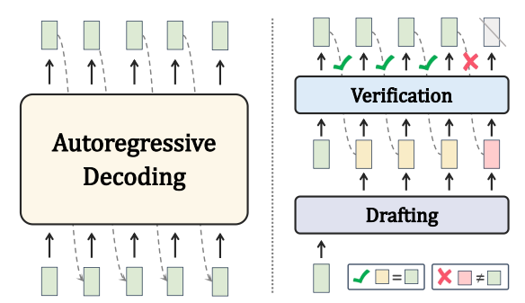

## **Speculative Decoding Motivation**

基于以下观察，提出了 speculative decoding，利用空闲计算资源增加并行性

- Many easy tokens can be predicted with less computational overhead(using a smaller model)
- LLM 推理是高度 memory-bound 的，延迟主要在读取/写入模型参数而不是计算

> 每次生成一个 token，都需要搬运所有模型权重从 HBM 到 cache 中

我们需要保证 speculative decoding 生成多个 token 的成本要比 auto-regressive 生成 1 个 token 成本差不多，所以投机采样要想获得性能收益，核心要解决以下两个问题：

> 在整个投机采样的流程中，假设轻量 LLM 生成 Draft Tokens 的开销为 $p$ ，原始 LLM 验证 & Next Token 生成的开销近似为 1 ，那么**投机采样在接受 Tokens 数大于 **$1 + p$** 的情况下才有性能收益**，并且随着接受的 Tokens 数增加而性能收益越大。

1. **如何降低投机采样的 overhead？**
2. **如何提升 Verify 阶段的接受率？**

## **What is Speculative Decoding(Original)**

一般遵循以下流程：

- Draft: 生成 k 个 candidate tokens，保存了概率分布，即 logits
- Verify:
  - 用 target model 并行 verify all candidate tokens
  - 对每个位置的分布计算概率
- Accept / Reject:
  - 接受所有 correct token
  - 在第一个被拒绝采样的位置，在**调整后的分布**中重新采样

> [!IMPORTANT]
> 虽然引入了小模型，但最终生成的文本分布（Distribution）在数学上严格等同于大模型独自生成的分布。 它是无损的（Lossless）

---

### Why lossless?

基于拒绝采样的变体：

- $M_p$：大模型（Target Model），概率分布为 $p(x)$。
- $M_q$：小模型（Draft Model），概率分布为 $q(x)$。

对于小模型生成的每一个 token $x$，我们需要根据大模型的判定来决定是否接受。

- 情况 A：大模型觉得小模型的猜测很靠谱
  - 如果 $p(x) \ge q(x)$（即大模型认为该词出现的概率比小模型预测的还要高或相等）
  - 操作： 直接接受该 token。
  - 数学含义： 这种情况下，接受率为 1。
- 情况 B：大模型觉得小模型在瞎猜
  - 如果 $p(x) < q(x)$（即大模型认为该词出现的概率低于小模型预测的）：
  - 操作： 以概率 $\alpha = \frac{p(x)}{q(x)}$ 接受该 token。如果不接受，则拒绝该 token 及其之后生成的所有草稿。
  - 修正（Resampling）： 一旦拒绝，我们需要重新生成这一个 token。为了保证分布一致性，我们需要从修正后的分布 $p'(x)$ 中采样：
    $$p'(x) = \text{norm}(\max(0, p(x) - q(x)))$$
  - 这确保了虽然我们拒绝了错误的草稿，但补充回来的 token 能够填补概率分布的缺口，使得总体分布回归到 $p(x)$。

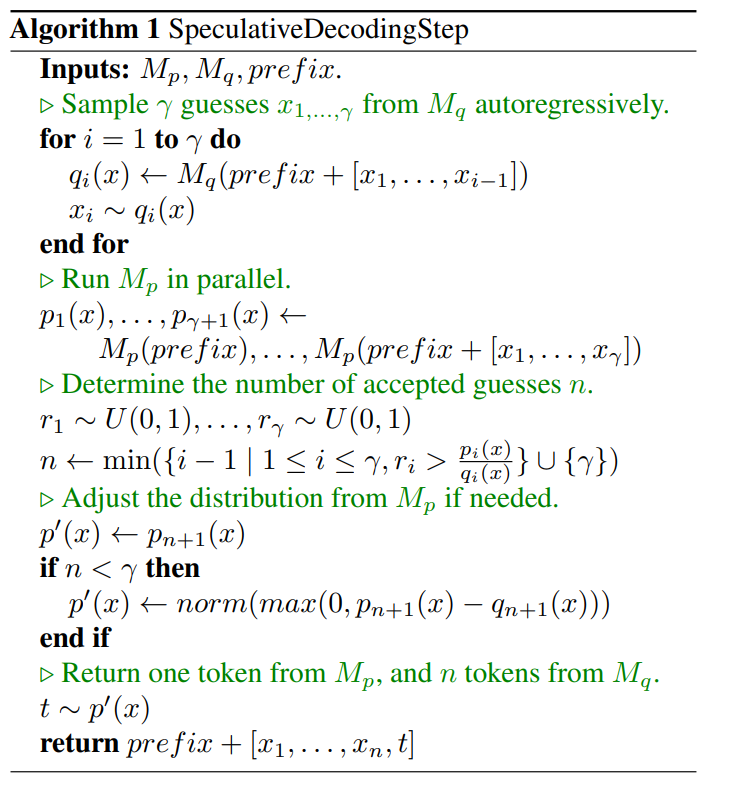

---

## Some Limitations

我们需要让 Draft Model 的生成的目标分布与 Target Model 相同，这里有多种选择方式

- 选取与 target model 同一 family 的较小的模型
- Distill 一个轻量模型，teacher 选取 target model，这会引入 training cost
- 选取 ngram 模型，但是这个的接受率很低

Draft model 和 target model 需要共享 vocabulary 或者使用相同的 tokenizer

- $p(x)$ 和 $q(x)$ 必须定义在同一个样本空间上

---

## **发展历程**

### **Speculative Decoding (Leviathan et al., 2023, Google)**

📄 _Fast Inference from Transformers via Speculative Decoding_

- 首次提出该方法，思路：
  - 用一个小模型（draft model）生成多个候选 token；
  - 用大模型（target model）验证其中的一部分；
  - 若验证通过，则一次提交多个 token，减少大模型调用次数。

- 用更高效的模型 $M_q$ 生成 **γ** 个候选 token；
- 然后使用目标模型 $M_p$ **并行 Verify** 这些候选样本及其在 $M_q$ 中的概率， 并**接受**所有能使分布与 $M_p$ 一致的候选；

  > _决定被接受的数量 n（用随机数进行拒绝采样）_

- 接受所有正确的采样
  - 对第一个被拒绝的候选，从一个**调整后的分布**中重新采样

  > 如果草稿模型 $M_q$ 在第 n+1 个 token 被拒绝，那么目标模型 $M_p$ 不能直接用自己的分布采样，而必须把已经被 $M_q$ 尝试但拒绝掉的概率质量 $M_p$ 中减掉，再重新归一化
  - 如果所有候选都被接受，只接受 **γ-1** 个，然后再采样一个额外的 token

  > 修正的拒绝采样方案可以保持与 target 采样相同的目标分布


- Limitations
  - 使用 separate 的 draft model
    - Draft model 训练后效果比较好，引入了训练成本
    - Draft model 和 target model 之间的 distribution shift
  - Memory overhead of second model
  - 每次迭代只有一个 draft sequence
  - $\gamma$是固定的，简单的 token 会浪费资源，复杂的 token 需要更多的推测

---

### **Medusa(No need for a separate draft model)**

📄 MEDUSA: Simple LLM Inference Acceleration Framework with Multiple Decoding Heads

- 不是单独的小模型，而是 **在大模型 decoder 的 last hidden states 上直接加多个预测头(1-2 layer mlp)**；
- 每个 head 会为它负责的位置生成多个最可能的预测
  - 第 t 个 position 位置处，第 k 个 head 预测 t+k+1 个 token
  - 这会增加一次 decoding step 的接受长度
  - Verification can be computationally intensive for a large number of completions

  > We need trade-off

- 为了**加速**与**计算代价**之间取得平衡，引入了一种 **树状结构的注意力机制（tree-structured attention）**，可以**并行处理多个候选序列，一次验证一整棵树**
  - 依据预测的 probs 构造了一个稀疏的 candidate tokens 树
  - **Tree Mask**：**每个 token 只能看到来自同一条候选序列（continuation）的历史 token**，不能访问其他候选的 token。
  - 按照树结构，正确分配 positional encoding

  > 同一深度的 token 用同一个 position id

- **会选择长度最长的前缀 candidate tokens**

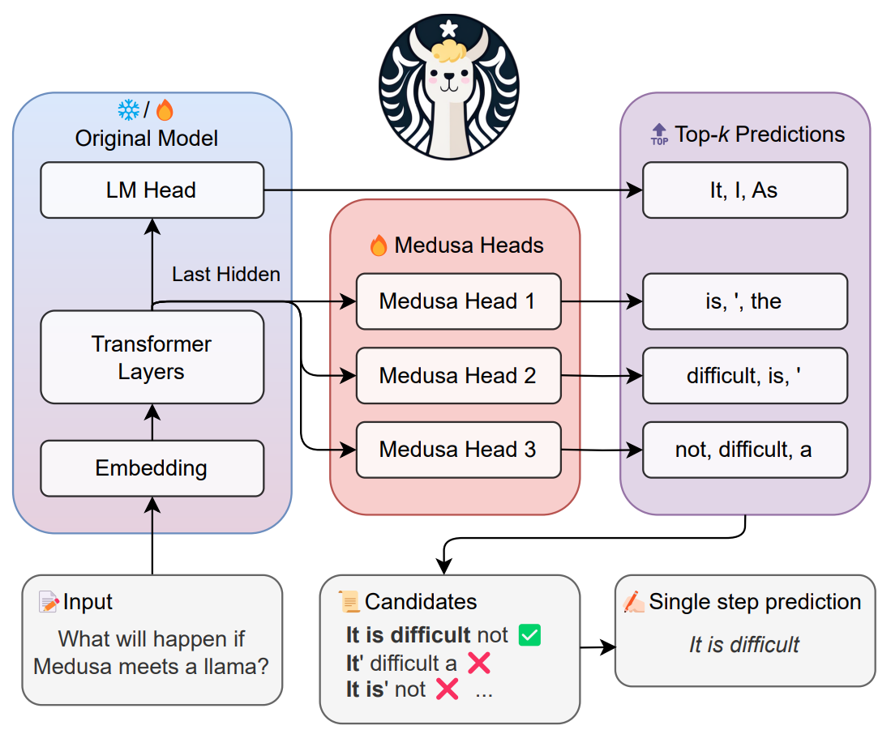
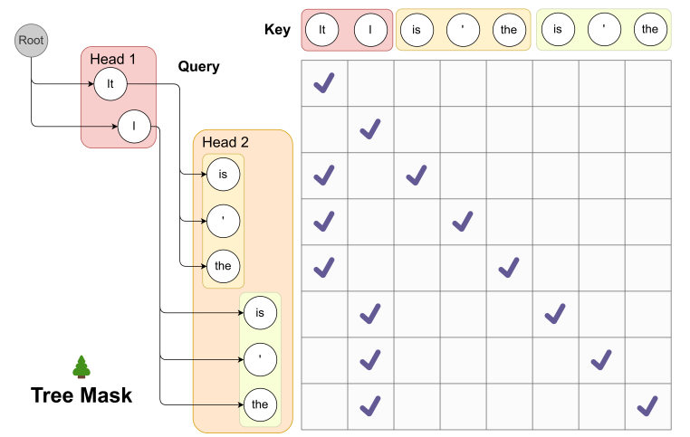

- Limitations:
  - Position-Independent Prediction / Limited Information
    - 每个 Medusa head 预测位置 i+k，但它不知道位置$i+1\dots i+k-1$ 实际预测了什么

      > 与真实的自回归不同

    - Medusa head 只能看到最后一层的表示
    - 最后一层是为预测下一个 token 训练的，而不是第 2、3 个之后的 token
    - 无法利用中间层更丰富的表示

  - Lower acceptance rates for later positions in the draft
  - Speedup plateaus at ~3× even with more heads

---

### **Lookahead Decoding**

📄 Lookahead: An Inference Acceleration Framework for Large Language Model with Lossles

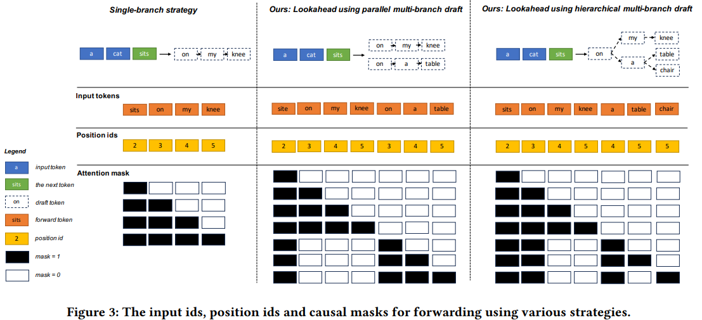

- 层次化多分支草稿策略 (Hierarchical Multi-Branch Draft Strategy)：_利用共同的前缀标记将多个预测的草稿序列（分支）进行合并和压缩_
- 基于 Trie 树的草稿检索和管理 (Trie-tree-based Retrieval and Management)
  - Trie 树存储了**输入提示 (Prompt)** 和**已生成响应 (Generated response)** 中出现的 n-gram 标记序列（即分支）。
  - 引入了 **生成分支插入 (Generated branch Inserting)** 机制，能够动态地 (on-the-fly) 将生成的重复序列放入 Trie 树中，从而利用输出中的重复模式进行加速。
  - 通过**分支消除**和**节点修剪**策略来保持 Trie 树的高效性，控制内存消耗。

---

### **EAGLE-1： Extrapolation Algorithm for Greater Language-model Efficiency**

📄 EAGLE: Speculative Sampling Requires Rethinking Feature Uncertainty

- Train a lightweight plugin, called AutoRegression Head, in conjunction with the Original LLM's frozen embedding layer, to predict the next feature based on the current feature sequence form the second-top-layer of the Original model
- Decode using the frozen classification head of the Original LLM, which maps features to tokens
- Feed in tokens from one time step ahead
  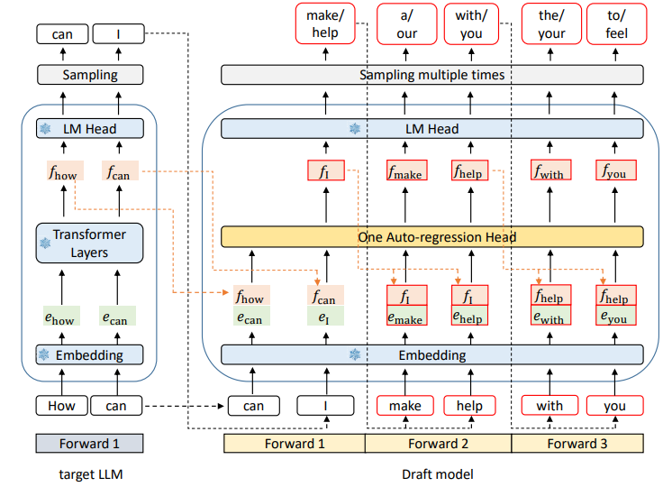

#### EAGLE-1 Drafting

EAGLE-1 解决了 Medusa 的不确定性，使用了 feature-level 进行预测

- Feature prediction with known context is much more accurate
- EAGLE integrates embeddings and generates the next feature
- When predicting $f_j$, we already know $f_{j-1}$

$$
\begin{aligned}
(f_n, t_n)&\rightarrow f_{n+1} \\
f_{n+1} &\rightarrow LM\_Head \rightarrow t_{n+1}\\
(f_{n+1}, t_{n+1}) &\rightarrow f_{n+2}
\end{aligned}
$$

#### EAGLE-1 Verification

- 对每个 draft token position 生成 target probs p
- **Tree Attention**：直接 verify 整个 tree
  - EAGLE 生成的树更稀疏、上下文更充分

  > 每一步预测都知道前面 token 是什么，通过 feature 可以得到更多的信息
  - Medusa Head 2 predicting t+2 doesn’t know what t+1 will be

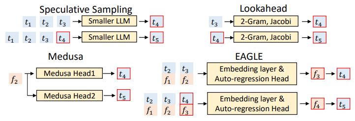
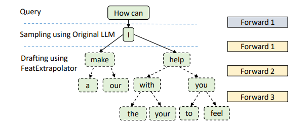

#### Multi-round speculative sampling

把同一位置的多个候选 token 按顺序做多轮 accept / reject；只有当所有候选都拒绝了，才从调整后的分布里真正采样一个 token。这样能 提升接受率 / 减少 fallback，同时仍然保持严格无偏（最终 token 仍服从目标分布 p）

- **依次尝试** $t_1,t_2,t_3\dots ,t_k$
- 每次尝试失败，不是立刻从 adjusted distribution 采样，而是：
  - **更新目标分布 p**（扣掉本轮 proposal 那部分概率重新进行分布）
  - 然后继续尝试下一个候选

- 如果 k 个都失败了，才从最终剩下的 adjusted 分布采样一次

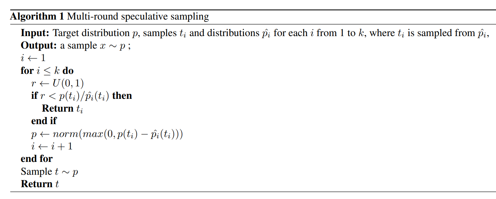

---

### **EAGLE-2: Context-Aware speculation**

📄 EAGLE-2: Faster Inference of Language Models with Dynamic Draft Trees

- High confidence → high acceptance probability → expand the tree
- Low confidence → low acceptance probability → prune the tree

Context-aware speculation:

- Easy context (code boilerplate): Deeper trees
- Hard context (creative writing): Shallower, wider trees

#### Motivation

- 接受率除了与 **Token 所在位置相关以外（在树中所处的位置），还和上文相关（树中的祖宗节点）**。

  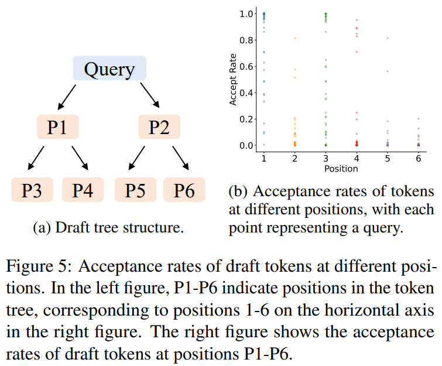

  > _P3、P4 和 P5、P6 虽然都是同一层的节点（即同一个 Step 的 Draft Tokens），但接收率上 P3、P4 普遍高于 P5、P6 节点，一个重要的原因是 P3、P4 的父节点为 P1，其概率高于 P5、P6 节点的父节点 P2。P3、P4 的概率甚至普遍高于 P2 这更加说明在生成 Draft 树的时候，采用静态 Draft 树并不是一个最优选择，更应该选择动态 Draft 树。_

- 原始 LLM 自回归生成的 Token 概率分布表示 Token 接收概率。Eagle 的 Draft 模型生成的 Draft Tokens 概率分布与 Token 接收率分布接近。下图展示了 Draft Tokens 生成概率和 Token 接收率的分布图，可以看出分布很接近，**可以通过 Draft Tokens 生成概率预估 Token 的接收率。**

  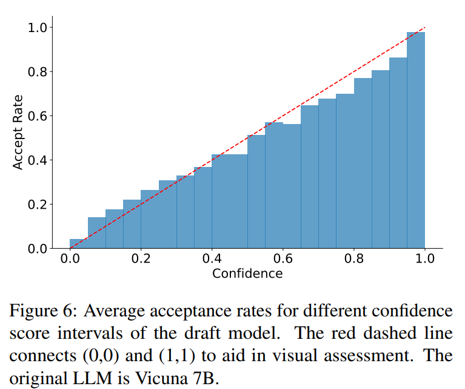

#### EAGLE-2 Dynamic Tree Construction

EAGLE-2 不修改 draft 模型的训练与推理方式，也不改变验证阶段。它的改进集中在两个方面：

1. 如何扩展草稿树；
2. 如何对草稿 token 进行重新排序

- **Expand 阶段**：从当前层选择 **全局接受概率（global acceptance probability）最高的前 k 个 token** 进行扩展。
  - 一个 token 的**全局接受概率**是它从根节点到该节点路径上所有 token 的接受概率的乘积：
    $V_i = \prod_{t_j \in \text{Path(root, }t_i\text{)}} p_j \approx \prod c_j，$ 其中$c_j$是 draft 模型的置信度
- **ReRank 阶段**：**不会直接使用扩展阶段的结果，而是对所有草稿 token 重新排序**，选出全局 top-m 的节点。

> _Expand 的目标是加深草稿树。然而，由于接受率在 0–1 之间，越深的 token 其值越小。_**一些浅层未扩展节点可能比深层节点更有价值**_。_
> **对于值相同的节点，优先选择浅层节点，始终保持父节点在子节点之前被选中。** 这样可以保证 top-m 节点仍构成一棵连通树。

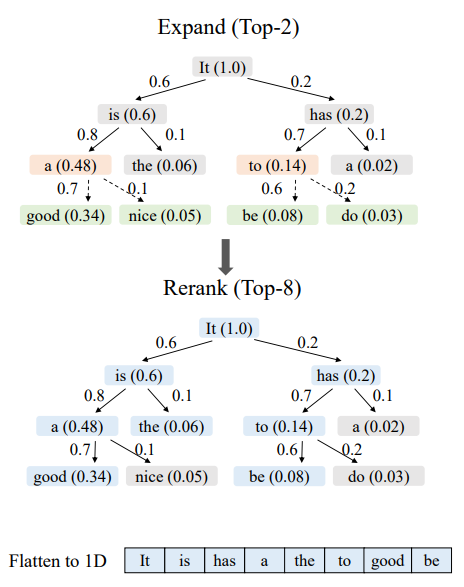

- **Tree Mask**：把这些选中的 token **拉平成一维序列**，送入主模型进行验证阶段。为了与标准自回归解码保持一致，我们需要调整注意力掩码。不同分支的 token 不应互相可见，因此注意力掩码需根据树结构修改，使每个 token 仅能看到它的祖先节点。

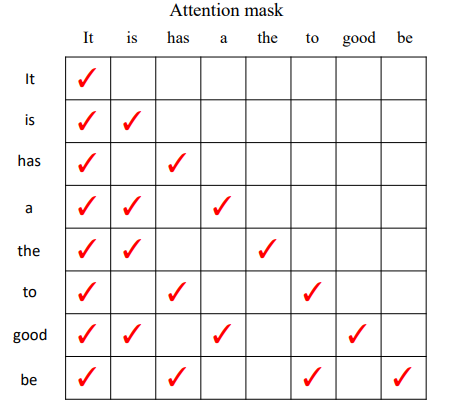

---

### EAGLE-3: Training-time test + Direct Token Prediction + Multi-level fusion

#### Motivation

- Increasing training data for EAGLE-1/2 provides **limited** improvement
- **EAGLE Training: Loss = L_fea + L_token**
  - Feature prediction loss constrains the model
  - Model must output something close to target features
  - This limits expressiveness!

- **The Feature Prediction Constraint:**
  - Forces draft model output to approximate target features
  - Limits the model's representational capacity
  - Token prediction is the goal; feature prediction is an auxiliary objective
  - If those outputs aren’t “feature-like,” the next step becomes out-of-distribution

#### EAGLE-3: Training-time test

**With L_fea (EAGLE-1/2)**

- Training step 2 still uses **ground-truth features** as context
- But at test time, step 2 uses **predicted** features
- L_fea partially masks this because predicted ≈ ground-truth
  **Without L_fea (failure mode)**
- Training never sees the model’s unconstrained predictions as inputs
- Test time does → out-of-distribution → compounding error
  Core rule: **if the model will consume its own predictions at test time, it should practice that during training**
- Train by simulating multiple draft steps **using predicted states**, not ground truth
- Important implementation detail: **stop-gradient** through the simulated rollout so training remains stable

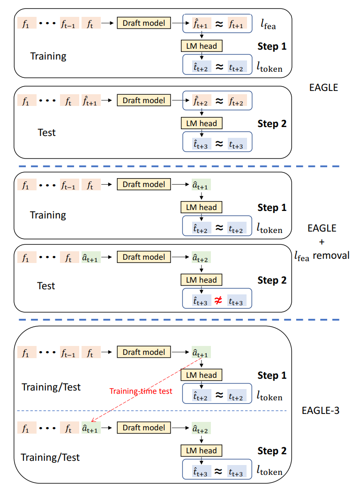

- Removes the need for a strict “feature-likeness” constraint
- Model learns to be robust to its own imperfect intermediate states
- Capacity is spent on “what helps token accuracy under rollout,” not “match a specific feature target”

#### EAGLE-3: Tree Attention Mask during training of the draft model

- 虽然自回归推理在时间上是顺序的，但在训练时可以把多步 rollout 重构成一棵树，并用树状 attention mask 一次性并行计算，从而让模型在训练阶段就经历“使用自身预测作为上下文”的真实测试条件。
  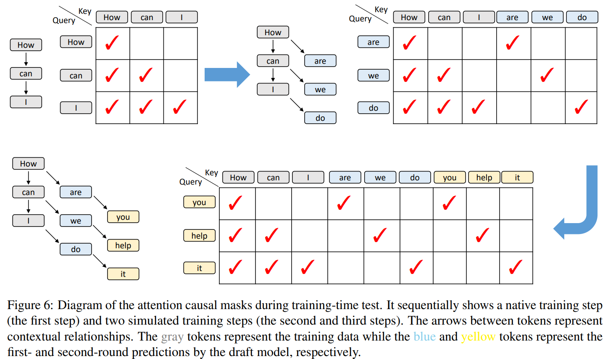

#### EAGLE-3: Multi-layer feature fusion

一旦不再强迫预测 feature 去像某一层的 ground-truth feature”（移除 $L_{\text{fea}}$），模型就可以自由地利用不同层的表示：

- Top-layer features are "committed" to the immediate next token
- Lower layers contain richer, more general semantic information
- Predicting t+2 benefits from information not yet "collapsed" into next-token prediction
- Fusion captures multiple abstraction levels

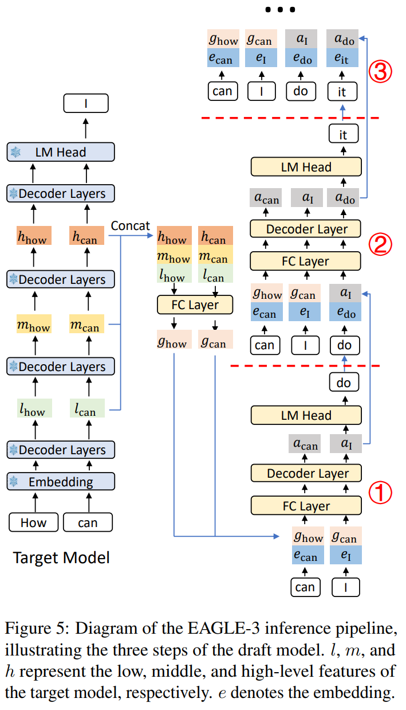

---

## Eagle2 推理流程

- Target Prefill/Decode：获取 hidden_states + next_token
- Draft Prefill/Draft Tree Generation：多步展开，多次调用 draft model 生成 Draft Tree，ReRank 得到最终的 draft tokens tree
- Build Tree Mask：构建验证需要的 tree attention mask
- Target Verify：获取 target model 对每个 draft token 的概率分布，用于后续的 speculative sampling 验证
- Target Sample：基于概率的 rejection sampling 的采样
- Draft Extend：为下一轮 Draft 做准备

### Prefill Phase

**Target Prefill**

目标模型先进行 prefill，得到 hidden_states 和 next_token_ids

**Draft Prefill**

修改 batch.input_ids，截断第一个 token，将生成的 next_token_ids 拼接到后面。因为Eagle 的核心公式通常是：

$$H_{t+1}^{draft} = \text{Eagle}(H_{t}^{base}, \text{Emb}(x_{t+1}))$$

- $H_{t}^{base}$：Base Model 处理第 $t$ 个词后输出的特征。
- $x_{t+1}$：第 $t+1$ 个词（即下一个词）。
  - Prompt: [A, B, C]
  - Base Model 输出特征: [H_A, H_B, H_C]
  - Base Model 预测的新词: D
  - Eagle 需要学习/预测的序列对如下：
    - 利用 H_A 和 B $\rightarrow$ 预测 H_B'
    - 利用 H_B 和 C $\rightarrow$ 预测 H_C'
    - 利用 H_C 和 D $\rightarrow$ 预测 H_D'

构造 EagleDraftInput，将 next_token_ids 作为 verified_id，后面构造 tree mask 用到

```python
# Construct spec_info
next_draft_input = EagleDraftInput(
    hidden_states=target_hidden_states,
    verified_id=next_token_ids,
    new_seq_lens=batch.seq_lens,
    # draft mode is same with decode mode, only 1 num token per batch
    num_tokens_per_batch=1,
    num_tokens_for_logprob_per_batch=1,
)
```

进行真正的 Draft Model Forward，更新 hidden_states 和相应的 topk_index

### Decode Phase

**Draft Tree Generation**
获取 prefill 或者上一个 decode 的 topk_index，hidden_states。

多步展开构建 draft tree:

- 选择 top-k tokens 作为这一层的扩展节点，parent_list 记录每个 token 对应的父节点索引
- Draft Model Forward 获取下一层的 logits 用于下一层更新
  - batch 的 input_ids 是这一层的 top-k tokens
- 对 logits 进行 topk 选择，更新 topk_index 以及 hidden_states，用于下一层更新

ReRank draft tokens

- 合并所有步的分数
- 选择分数最高的 (num_draft_tokens - 1) 个
- 排序，如果相同选择浅层节点保证树结构的正确性

**Build Tree Mask**

将 verified_id(每个 req 一个) 拼在 draft_tokens 的最前面。

- 主模型验证第 1 个草稿 Token 时，需要依赖 verified_id 作为上下文。

- 新的 draft_tokens 序列 = [Root, Node1, Node2, ...]。

调用 CUDA kernel 构建 Tree mask，把 Python/Pytorch 层面生成的一堆父子关系列表，并行地转换成 Base Model 推理所必须的三个底层张量：

- tree_mask (Attention Mask)：决定每个 Token 能看到谁（只能看祖先，不能看兄弟）。

- positions (Position IDs)：决定每个 Token 在树中的深度（用于位置编码）。

- retrive\_\* (拓扑索引)：构建链表结构，用于验证后快速提取最长路径。

构建 EagleVerifyInput，用于后面的 Target Verify

```python
EagleVerifyInput(
    draft_token=draft_tokens, # draft tree tokens
    custom_mask=tree_mask,    # tree mask
    positions=position,       # position in tree(depth)
    retrive_index=retrive_index, # 用于从 logits 中提取对应 token 的索引
    retrive_next_token=retrive_next_token, # 树结构中的子节点索引
    retrive_next_sibling=retrive_next_sibling, # 树结构中的兄弟节点索引
    retrive_cum_len=None,
    spec_steps=self.speculative_num_steps, # 树的最大深度
    topk=self.topk,
    draft_token_num=self.speculative_num_draft_tokens,
    capture_hidden_mode=None,
    seq_lens_sum=None,
    seq_lens_cpu=None,
)
```

**Target Verify**
verify input 的 num_steps 应该 + 1，因为 verified_id 需要加在最前面

分配 KV Cache，然后构建 forward batch 给 Target Model 使用

Target verify 是用 target model（大模型）对 draft model 生成的 draft token tree 进行并行 forward：

输入: 所有 draft tokens（树形结构展平后）
输出: 每个 draft token 位置的 logits（next_token_logits）
目的: 获取 target model 对每个 draft token 的概率分布，用于后续的 speculative sampling 验证

**Target Sample**

然后调用 Sample 进行采样，根据 Target Model 的 logits 进行判断是否可以接受 draft token

- Greedy: Target Model 直接选概率最大的词（Top-1）。如果 Target_Top1 == Draft_Token，则通过；否则截断
  - 某一层的节点被选中直接前往下一层；如果没有选中，遍历这一层的兄弟节点
  - Bonus Token: 无论是否有 draft token 验证成功，主模型在最后一步预测的那个 Token（即使草稿没猜对）也会被直接采纳

- Speculative Sampling: 没有按照标准的做法来做，而是使用了覆盖采样变体
  - prob_acc 表示当前这组草稿兄弟节点所覆盖的主模型概率总和。
  - coin <= prob_acc / threshold_acc：如果这群兄弟加起来的概率足够大（覆盖了随机硬币落在的区间），我们就从中选一个（代码逻辑简化为选累加到当前刚超过阈值的那个）。
  - target_prob_single >= threshold_single：如果有任何一个 Token 单独的置信度极高（比如 >0.9），直接通过，不需要管累计概率。这是为了保留确定性。
  - Bonus Token: 构造一个残差分布：$P_{new}(x) = \text{Norm}(\max(0, P(x) - P_{consumed}(x)))$，在这个分布中抽取一个 token，在主模型的概率分布中，挖掉刚才所有被拒绝的 Token 所占的坑，然后在剩下的坑里随机抽一个 token(代码中选择累计概率超过 u 的那个 Token)

然后释放并移动 KV Cache，让它们变得连续

更新 verified_id(**bs 大小，每个 req 的最后被接受的 token**)，然后构建下一次 draft 的 EagleDraftInput

```python
all_verified_id = predict[accept_index]
verified_id = torch.empty_like(accept_length, dtype=torch.int32)
fill_new_verified_id[(bs,)](
    all_verified_id,
    accept_length,
    verified_id,
    self.speculative_num_draft_tokens,
)
# Construct the next draft input
next_draft_input = EagleDraftInput(
    verified_id=verified_id,
    new_seq_lens=new_seq_lens,
    verify_done=verify_done,
)
```

**Draft Extend**
更新 Draft Model forward_batch 相关元数据

```python
batch.input_ids = predict(all accepted + bonus tokens)
batch.seq_lens += num_draft_tokens
batch.forward_mode = ForwardMode.DRAFT_EXTEND_V2
```

进行一次 Draft Model Forward，更新 hidden_states，topk_index，供下一次 Draft Tree Generation 使用

---

## Eagle2 KV Cache Management

共享 req_to_token_pool 和 token_to_kv_pool_allocator，实际上 target model 和 draft model 有自己的 KV Cache pool

```shell
┌─────────────────────────────────────────────────────────────────────────────────┐
│                         实际的 KV Cache 架构                                     │
├─────────────────────────────────────────────────────────────────────────────────┤
│                                                                                 │
│   ┌─────────────────────────────────────────────────────────────────────────┐   │
│   │                      共 享 的 部 分                                      │   │
│   ├─────────────────────────────────────────────────────────────────────────┤   │
│   │  req_to_token_pool          token_to_kv_pool_allocator                  │   │
│   │  ┌──────────────────┐       ┌──────────────────────────┐                │   │
│   │  │ req → slot 映射   │       │ 管理 slot 分配/释放       │                │   │
│   │  │ (索引表)          │       │ free_pages = [1,2,3...]  │                │   │
│   │  └──────────────────┘       └──────────────────────────┘                │   │
│   └─────────────────────────────────────────────────────────────────────────┘   │
│                                       │                                         │
│              ┌────────────────────────┴────────────────────────┐                │
│              ▼                                                 ▼                │
│   ┌──────────────────────────────┐          ┌──────────────────────────────┐   │
│   │    Target Model KV Pool      │          │     Draft Model KV Pool      │   │
│   │    (各自拥有的部分)           │          │     (各自拥有的部分)          │   │
│   ├──────────────────────────────┤          ├──────────────────────────────┤   │
│   │  token_to_kv_pool            │          │  token_to_kv_pool            │   │
│   │  ┌────────────────────────┐  │          │  ┌────────────────────────┐  │   │
│   │  │ k_buffer[L_t, S, H, D] │  │          │  │ k_buffer[L_d, S, H, D] │  │   │
│   │  │ v_buffer[L_t, S, H, D] │  │          │  │ v_buffer[L_d, S, H, D] │  │   │
│   │  └────────────────────────┘  │          │  └────────────────────────┘  │   │
│   │  L_t = 32层 (Target大模型)   │          │  L_d = 1层 (EAGLE Head)      │   │
│   └──────────────────────────────┘          └──────────────────────────────┘   │
│                                                                                 │
└─────────────────────────────────────────────────────────────────────────────────┘

L_t = Target Model 的层数 (e.g., 32 layers for 7B model)
L_d = Draft Model 的层数 (通常只有 1 层 attention)
S = max_total_num_tokens (slot 数量)
H = num_kv_heads
D = head_dim
```

---

### KV Cache 生命周期

#### Overview

```shell
┌─────────────────────────────────────────────────────────────────────────────────────────┐
│                           完整的 KV Cache 生命周期                                       │
├─────────────────────────────────────────────────────────────────────────────────────────┤
│                                                                                         │
│  Iteration N:                                                                           │
│  ┌──────────────────────────────────────────────────────────────────────────────────┐   │
│  │  1. prepare_for_decode() - 预分配                                                 │   │
│  │     alloc_token_slots(2 * ALLOC_LEN_PER_DECODE)                                  │   │
│  │     → out_cache_loc = [100, 101, 102, ..., 139]  (假设分配了40个slots)           │   │
│  │     → assign_req_to_token_pool 更新映射表                                         │   │
│  └──────────────────────────────────────────────────────────────────────────────────┘   │
│                                          │                                              │
│                                          ▼                                              │
│  ┌──────────────────────────────────────────────────────────────────────────────────┐   │
│  │  2. Draft Forward - 使用预分配的位置                                              │   │
│  │     assign_draft_cache_locs_page_size_1 从 req_to_token 读取位置                 │   │
│  │     Draft Model 在这些位置写入 KV Cache                                           │   │
│  │     → 生成 draft_tokens, tree_mask 等                                            │   │
│  └──────────────────────────────────────────────────────────────────────────────────┘   │
│                                          │                                              │
│                                          ▼                                              │
│  ┌──────────────────────────────────────────────────────────────────────────────────┐   │
│  │  3. Target Verify - 使用同样的位置                                                │   │
│  │     assign_extend_cache_locs_func 从 req_to_token 读取位置                       │   │
│  │     Target Model 在这些位置写入 KV Cache                                          │   │
│  │     → 验证 draft tokens，得到 accept_index                                       │   │
│  └──────────────────────────────────────────────────────────────────────────────────┘   │
│                                          │                                              │
│                                          ▼                                              │
│  ┌──────────────────────────────────────────────────────────────────────────────────┐   │
│  │  4. Free & Move - Scheduler 处理                                                  │   │
│  │                                                                                   │   │
│  │    通过 kv_committed_len 和 kv_allocated_len 来进行释放
│  └──────────────────────────────────────────────────────────────────────────────────┘   │
│                                          │                                              │
│                                          ▼                                              │
│  Iteration N+1: 重复上述过程                                                             │
│                                                                                         │
└─────────────────────────────────────────────────────────────────────────────────────────┘
```

---

#### Free 机制

```shell
┌─────────────────────────────────────────────────────────────────────────────────────────┐
│                           两种 KV 长度追踪                                               │
├─────────────────────────────────────────────────────────────────────────────────────────┤
│                                                                                         │
│   req.kv_committed_len     req.kv_allocated_len                                        │
│          │                         │                                                    │
│          │  实际有效的 KV 长度      │  已分配但可能未使用的 KV 长度                        │
│          │  (accepted tokens)      │  (包含预分配的空间)                                 │
│          ▼                         ▼                                                    │
│   ┌──────────────────────────────────────────────────────────────────────────────────┐  │
│   │ KV Cache Slots:                                                                  │  │
│   │                                                                                  │  │
│   │ [  prefill tokens  ][  accepted  ][     overallocated (未使用)     ]              │  │
│   │ └─────────────────────────────────┘                                              │  │
│   │           kv_committed_len        └──────────────────────────────────┘            │  │
│   │                                              需要释放的部分                        │  │
│   │ └────────────────────────────────────────────────────────────────────┘            │  │
│   │                           kv_allocated_len                                       │  │
│   └──────────────────────────────────────────────────────────────────────────────────┘  │
│                                                                                         │
│   在 V2 版本中:                                                                          │
│   - kv_committed_len: 由 scheduler 在 _resolve_spec_overlap_token_ids() 中更新          │
│   - kv_allocated_len: 由 prepare_for_decode() 在预分配时更新                             │
│   - 差值 (kv_allocated_len - kv_committed_len) = 需要释放的 rejected/unused slots        │
│                                                                                         │
└─────────────────────────────────────────────────────────────────────────────────────────┘
```

rejected tokens 的 KV Cache 的**不在 Verify 后立即释放，在请求完成时统一释放**

1. Verify 完成后更新 kv_committed_len
   ```python
   for i, req in enumerate(batch.reqs):
     req.kv_committed_len += accept_lens[i]  # ← 只更新 committed 长度
     predict_tokens.append(...)
     req.spec_verify_ct += 1
     req.spec_accepted_tokens += accept_lens[i] - 1
     # 注意: 这里没有释放 rejected slots！
     # kv_allocated_len 保持不变，仍然指向预分配的末尾
   ```
2. 下一轮 decode 时复用预分配空间
   ```python
    for r in batch.reqs:
    # Over-allocation happens here
    # 当前有效位置 + 需要的空间 - 已分配的位置
    x = r.kv_committed_len + 2 * self.ALLOC_LEN_PER_DECODE - r.kv_allocated_len
    cur_kv_lens_cpu.append(r.kv_allocated_len)
    nxt_kv_lens_cpu.append(r.kv_allocated_len + x)
    num_needed_tokens += x
    r.kv_allocated_len += x
   ```
3. 请求完成时释放 overallocated slots

   ```python
   def release_kv_cache(req: Req, tree_cache: BasePrefixCache, is_insert: bool = True):
    # 1. 先处理 committed 部分 (可能插入 radix cache)
    tree_cache.cache_finished_req(req, is_insert=is_insert)
    # 2. 获取 overallocated 范围
    start_p, end_p = req.pop_overallocated_kv_cache()

    if spec_algo is None:
        assert (
            start_p == end_p
        ), f"Unexpected overallocated KV cache, {req.kv_committed_len=}, {req.kv_allocated_len=}"

    # 3. 释放 overallocated 的 slots
    if page_size > 1:
        start_p = ceil_align(start_p, page_size)

    if start_p >= end_p:
        return

    indices_to_free = tree_cache.req_to_token_pool.req_to_token[req.req_pool_idx][
        start_p:end_p
    ]
    tree_cache.token_to_kv_pool_allocator.free(indices_to_free)
   ```

---

#### Prefill Phase

Draft Prefill 与 Target Prefill 使用相同的 KV slots 填充 Draft 的 KV Cache

#### Decode Phase

schedule batch 进行 decode 阶段的预分配

```python
def prepare_for_decode(self: EagleDraftInput, batch: ScheduleBatch):
    for r in batch.reqs:
        # 过度分配：2 * ALLOC_LEN_PER_DECODE
        # ALLOC_LEN_PER_DECODE = max(topk * num_steps, num_draft_tokens)
        x = r.kv_committed_len + 2 * self.ALLOC_LEN_PER_DECODE - r.kv_allocated_len
        num_needed_tokens += x
        r.kv_allocated_len += x

    out_cache_loc = alloc_token_slots(batch.tree_cache, num_needed_tokens)
```

在 Draft Tree Generation 前，为 draft tree 的每个 token 分配 KV Cache，实际上是使用预分配的 slots；然后进行 Draft Model Froward

在进行 Target Verify 前，为 Target Model 分配 KV Cache，仍然使用的是预分配的 slots；然后 Target Model 对所有的 draft token 进行一次 forward(batch.input_ids = EagleVerifyInput.draft_tokens)

Scheduler 在后处理时对 over allocation 的长度进行释放

---

## **Overlap Eagle2 + Grammar in SGLang**

### Overview

- Draft 的状态通过 batch.spec_info 来进行管理；不停地在 Scheduler 和 EAGLEWorkerV2 中流转
- 将 draft 和 verify 数据准备工作单独开辟一个 GPU plan stream 进行，与 GPU compute stream 并行
- 因为数据准备工作(**KV Cache 等**)会影响到后续这些过程计算的正确性，所以在启动 GPU compute kernel 前需要等待 plan kernel 执行完成

**同步点**[见下文](#同步点)**：**

1. Verify 与 Draft Extend 之间的同步
2. Draft 与 Verify 之间的同步
3. Verify 与 Sampling 之间的同步

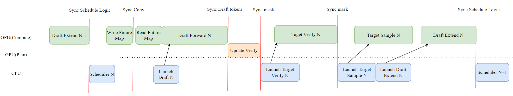

### 时序图

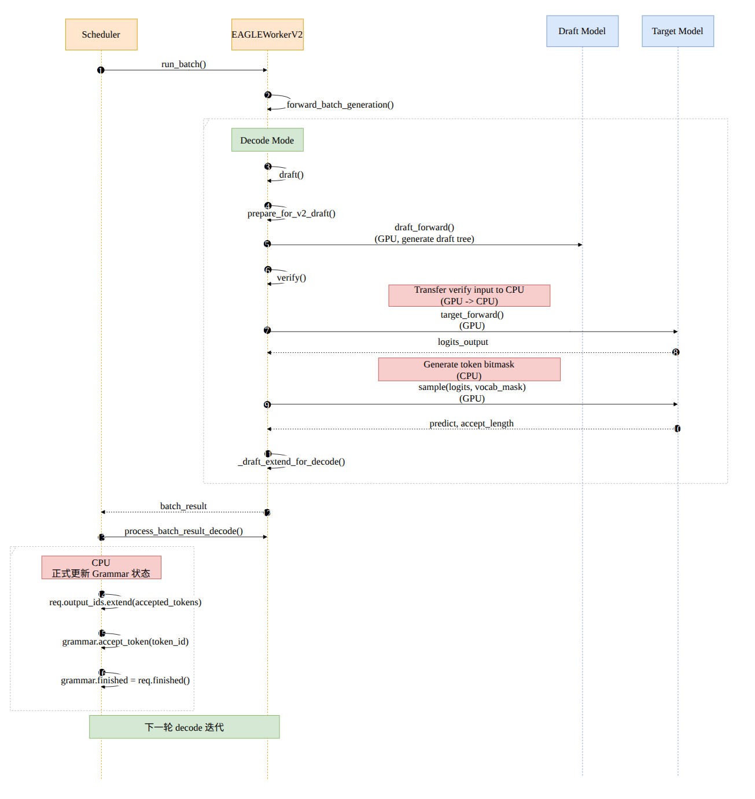

### 整体流程

Prefill 阶段生成 batch 与不开启 spec 并无不同；通过 self.future_map.resolve_future() 和 self.future_map.store_to_map() 实现异步的结果存取

`run_batch()` 会先调用 EAGLEWorkerV2::forward_batch_generation()

- target_worker(TpWorker) 执行 `forward_batch_generation`，采样出第一个 token

> Eagle 需要这个 token 对应的 hidden states 进行 draft 的推理

- draft_worker(EAGLEWorkerV2) 执行 `_draft_extend_for_prefill`
  - 将 target model 生成的 token 也加入到 batch.input_ids 里面
  - 构造 EagleDraftInput，EAGLE v2 的 decode 阶段会基于 `verified_id` 作为树的根节点，再生成 topk 分支并构建 tree mask、positions 等
  - 调用 draft model 的 forward_extend() 并进行采样，得到 topk 的 token index & prob 以及 hidden states

- 在 decode 阶段，draft worker 先调用 draft()，再调用 verify()，最后 \_draft_extend_for_decode()
  - draft(): 按 `speculative_num_steps` 多步扩展一棵 top-k 树，记录每个节点 token/score/parent，最后从整棵树里挑一批最高分节点作为 `draft_tokens`，并返回树结构信息给 `build_tree_kernel_efficient`，构造出 EageleVerifyInput
    > 在 build tree mask 时，会将 verified_id 拼接到 draft tokens 前面作为 root
    ```python
    EagleVerifyInput(
        draft_token_=draft_tokens, # draft 阶段挑选出来、准备让 target 一次验证的 **候选 token 集合**
        custom_mask_=tree_mask, # 每个候选节点能看到哪些 token
        positions_=position, # 每个候选节点对应的 **position id**
        retrive_index_=retrive_index, # verify batch 中第 i 行，对应 draft 树里的哪个节点
        retrive_next_token_=retrive_next_token, # 如果某个节点被接受，下一个应该跳到哪个节点
        retrive_next_sibling_=retrive_next_sibling, # 如果当前节点没被接受，下一个备选兄弟节点是谁
        retrive_cum_len_=None,
        spec_steps_=_self_.speculative_num_steps, # draft 扩展的最大深度（树的高度）
        topk_=_self_.topk, # draft 阶段每个节点的分支数
        draft_token_num_=_self_.speculative_num_draft_tokens,
        capture_hidden_mode_=None,
        seq_lens_sum_=None,
        seq_lens_cpu_=None,
    )
    ```

- verify(): verify 一次 forward，**最多验证 spec_steps 个未来 token + 当前 token**
  - 把 verify 所需的 **tree 索引和 token(verify_input)** 从 GPU 拷到 CPU，准备更新 vocab mask
    > 这里应该用异步拷贝
  - Target model 执行 `forward_batch_generation()`，实际上直接跳过了 sample，只做 forward，得到 logits(every draft token 的概率分布)
  - CPU 中 grammar 后端生成了 token bitmask
    - 对 draft 树做 DFS 构造 vocab mask
    - 把 batch.sampling_info.vocab_mask 置空（`None`）
  - 将 mask 拷贝到 GPU，对 target model 生成的 logits 应用这个 vocab mask
  - 对 draft input 做 sample，同时考虑 target 的概率分布和 draft 的 token
    > [!IMPORTANT]
    > Anyway, 目标模型生成的 bonus token 我们都会接受
- \_draft_extend_for_decode():
  - 计算的 `select_index`，只保留最后一个 Token 的预测结果。
  - 计算出的 `topk_p`（概率）、`topk_index`（Token ID）和 hidden_states 被填入`next_draft_input`。这个对象会被传递给下一个循环的 `draft()` 函数，作为生成新的 Token 树的**root**(verified_id)

实际上真正的 grammar 更新状态在 scheduler 的 post process 阶段

```python
# Speculative decode: next_token_id 是 accepted tokens 列表
for token_id in next_token_id:
  req.grammar.accept_token(token_id)  ← 正式更新状态
```

---

### 同步点

- Draft Extend N-1 与下一轮调度由 CPU 调度逻辑保证同步
- Write future map 和 Read future map 由 copy_to_cpu() 保证同步

  > 上一轮的 sample 负责 store，这一轮的 run_batch() 进行 get

- Grammar 带来的同步
  - 我们为了生成 vocab mask，需要 verify input，需要拷贝 GPU 上的数据，这里用的 .cpu() 实际上是一次同步
  - Sample() 前需要将 vocab mask 应用到 target verify 得到的 logits 上，这里需要将 cpu 的 vocab mask 拷贝到 GPU 上
    > [!IMPORTANT]
    > **这里应该用异步拷贝**

- Draft Extend 更改元数据信息依赖于 verify 的 accept length 和 predict 结果，所以需要同步

  > 由 CPU 侧调度保证

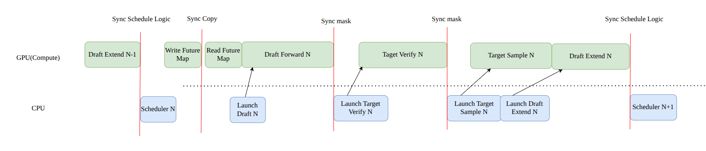

---

## 优化 Overlap: speculative decoding + constrained decoding

### Motivation

我们实际上有如下依赖关系：

1. vocab_mask 生成必须等待 last_batch accept 完成
2. vocab_mask 生成必须等待异步拷贝完成
3. Sample 必须等待 vocab_mask 到达 GPU

之前的做法是在 Scheduler 的后处理进行 last_batch 的 accept，我们实际上只需要保证 vocab mask 生成前 last_batch accept 即可；同时 target verify 是 GPU 上耗时比较长的任务，我们可以重叠这两个操作，让 GPU overlap CPU 上的计算开销

vocab mask 的生成还依赖 verify input，我们需要一次异步拷贝(GPU->CPU)

sample 需要 vocab mask 应用到 logits 上，也需要一次异步拷贝(CPU->GPU)

### Overview

优化后的调度逻辑如下图所示：

- 我们将 GPU 到 CPU 的 verify input 拷贝使用异步拷贝

- 之前的 constraint decoding + speculative decoding 是没有进行调度侧的 overlap 的；这里我们在 GPU 进行 target verify 的同时，处理 last batch 的 accept tokens

- Target sample 依赖 cpu 生成的 vocab mask，这里使用 .to(device) 进行同步

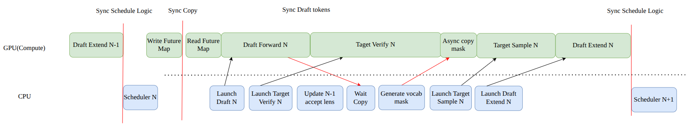

### Implementation

- ScheduleBatch 中维护一个 (request, accepted_token_ids) 的 list，存放 last batch 还未经过 grammar 处理的 accept_tokens

- event_loop_overlap 中 current batch 中携带 last batch 的 accept_tokens

  ```python
  last_batch, last_result = self.result_queue[-1]
  # here batch is copied, so has_grammar need also as a param
  if last_batch.has_grammar:
      batch.last_batch_accept_tokens = (last_batch, last_result)
      # Mark that grammar accept will be processed in the next batch's verify
      last_result.grammar_accept_processed = True
  ```

- Verify()
  - GPU 到 CPU 的 verify input 的拷贝用异步拷贝
  - GPU 进行 Target Verify 的同时，CPU 对上一轮的 grammar accept token 进行处理
  - CPU 等待 verify input 拷贝完成后生成本轮的 vocab mask，然后同步到 GPU 上准备进行 Target Sample

### JSON Unit Test Result

| 测试场景                    | No Overlap（基准） | Overlap（Double Sync） | Overlap（Once Sync） | 最佳策略    |
| --------------------------- | ------------------ | ---------------------- | -------------------- | ----------- |
| JSON Generate（标准长生成） | 0.8557s            | 0.7296s（+14.7%）      | 0.6687s（+21.8%）    | Once Sync   |
| JSON OpenAI（短文本 / API） | 0.4455s            | 0.2549s（+42.8%）      | 0.3861s（+13.3%）    | Double Sync |
| Mix Concurrent（混合并发）  | 0.6386s            | 0.5623s（+11.9%）      | 0.5468s（+14.4%）    | Once Sync   |

```shell
# no overlap
[2025-12-23 13:20:02] Test: test_json_generate | Duration: 0.8557s | Status: PASSED
[2025-12-23 13:20:03] Test: test_json_openai | Duration: 0.4455s | Status: PASSED
[2025-12-23 13:20:04] Test: test_mix_json_and_other | Duration: 0.6386s | Status: PASSED
D

# overlap with double sync mask
[2025-12-23 13:20:47] Test: test_json_generate | Duration: 0.7296s | Status: PASSED
[2025-12-23 13:20:47] Test: test_json_openai | Duration: 0.2549s | Status: PASSED
[2025-12-23 13:20:48] Test: test_mix_json_and_other | Duration: 0.5623s | Status: PASSED

# overlap with once sync mask
[2025-12-23 14:18:26] Test: test_json_generate | Duration: 0.6687s | Status: PASSED
[2025-12-23 14:18:27] Test: test_json_openai | Duration: 0.3861s | Status: PASSED
[2025-12-23 14:18:27] Test: test_mix_json_and_other | Duration: 0.5468s | Status: PASSED
```

### Benchmark Result(bs = 4)

#### Hiding CPU Overhead

- TPOT (Time Per Output Token) 从 **4.07ms 降低到了 3.22ms**，降幅超过 20%。

#### Accept Length 提升

- Accept Length 从 **2.59 提升到了 2.9**。
- 很神奇，正常不应该有 accept length 增长这么多的情况，因为使用相同的模型

#### 首字延迟 (TTFT) 微增

- TTFT 从 **21ms 增加到了 27ms**。
- Overlap 流水线通常需要更复杂的初始化过程（例如预分配更复杂的 Cuda Event、建立 Pending Info 结构、预热流水线状态）。
- 第一轮 Draft/Verify 往往无法享受到 overlap 的红利（因为没有上一轮），反而承担了额外的调度逻辑开销。

### GSM8K Just Eagle2 Test

```yaml
# No overlap
python3 benchmark/gsm8k/bench_sglang.py --num-shots 8 --num-questions 1319 --parallel 1319
Accuracy: 0.232
Invalid: 0.003
Latency: 44.037 s
Output throughput: 3763.649 token/s

# Overlap
python3 benchmark/gsm8k/bench_sglang.py --num-shots 8 --num-questions 1319 --parallel 1319
Accuracy: 0.230
Invalid: 0.003
Latency: 36.554 s
Output throughput: 4559.657 token/s
```

## **Reference**

[1]. [Clover: Regressive Lightweight Speculative Decoding with Sequential Knowledge](https://arxiv.org/pdf/2405.00263)

[2]. [Fast Inference from Transformers via Speculative Decoding](https://arxiv.org/abs/2211.17192)

[3]. [Lookahead: An Inference Acceleration Framework for Large Language Model with Lossless Generation Accuracy](https://arxiv.org/pdf/2312.12728)

[4]. [Medusa: Simple LLM Inference Acceleration Framework with Multiple Decoding Heads](https://arxiv.org/abs/2401.10774)

[5]. [EAGLE: Speculative Sampling Requires Rethinking Feature Uncertainty](https://arxiv.org/abs/2401.15077)

[6]. [EAGLE-2: Faster Inference of Language Models with Dynamic Draft Trees](https://arxiv.org/abs/2406.16858)

[7]. [EAGLE-3: Scaling up Inference Acceleration of Large Language Models via Training-Time Test](https://arxiv.org/abs/2503.01840)

[8]. [Speculative Decoding Slides](https://docs.google.com/presentation/d/1iD0ud3Otd1VbB4Q-G7_UQDFgRfVrIEQr3XDyKkcy-xc/edit?slide=id.p#slide=id.p)
