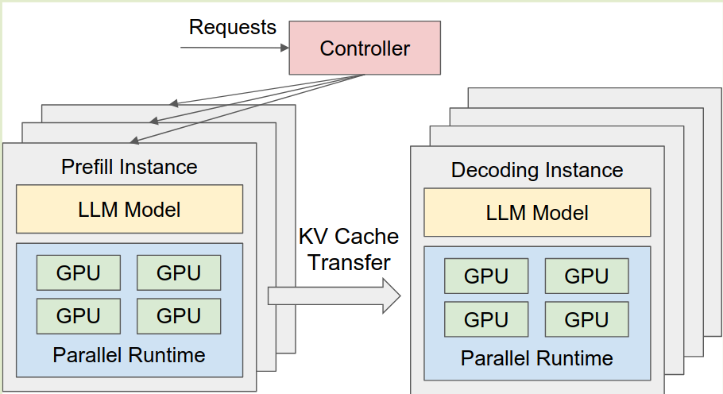
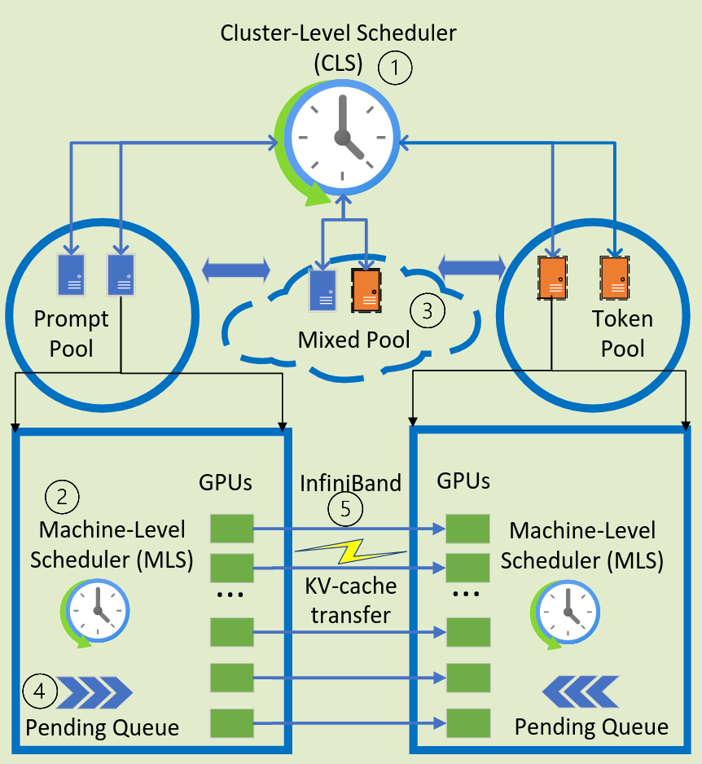
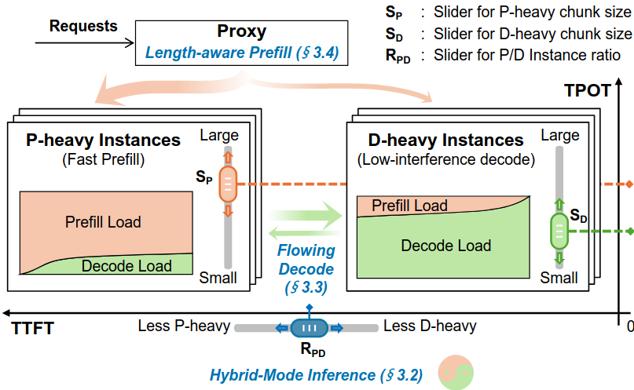
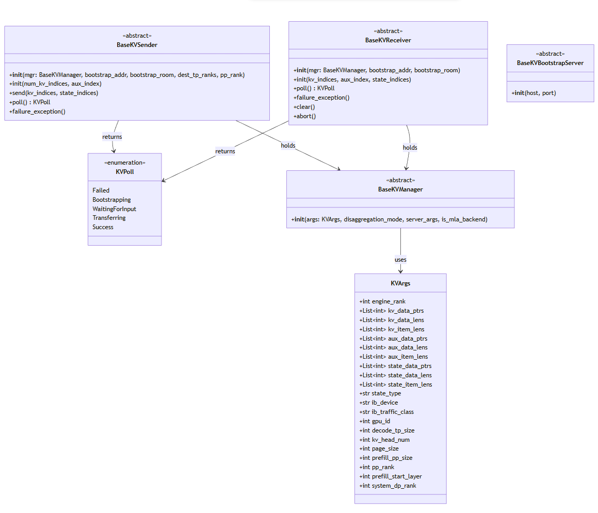

---

title: PD Disaggregation in SGLang
created: 2026-01-11
tags:
- LLMInference
description: 本文将从为什么需要 PD 分离开始讲起，通过几篇论文来讲述现在 PD 分离演进的路线，以 SGLang 中 PD 分离的实现作为 example 进行解析；由于笔者之前做过分布式相关的项目，将其中的状态机与 Raft 浅浅做了以下对比。
cover: /img/pddisagg.png
---
# PD Disaggregation in SGLang

## Why PD Disaggregation?

Prefill 是 compute-bound 阶段，decode 是 memory-bound 阶段；为了追求吞吐量，会将 prefill 分成 chunk 与 decode 一块组成 mixed batch 进行推理，但是这会增大 TTFT 和 TPOT，对于用户和应用来说这严重影响了推理服务的质量


Prefill 阶段适合使用模型并行策略减小单张 GPU 上的计算量。而 decode 阶段是内存密集型适合使用数据和流水线并行。如果预填充和解码同时配置在一个计算设备上，并行策略不能单独配置。

所以现在很多推理服务商选择进行 PD 分离，prefill 集群与 decode 集群分别执行这两个推理阶段的任务，中间的 KV Cache 以及必要的元数据通过 RDMA 高速网络传输

- DistServe：PD 分离开山之作，把 prefill 和 decoding 分离成两个实例池，各自分配 GPU、并行策略和 batch 策略，然后通过 KV cache 传递连接起来

  - 保证 TTFT 和 TPOT 这类 SLO 同时最大化 Throughput，引入指标 **goodput** = 在满足这两个 SLO 下每张 GPU 能承载的最大请求率
  - Prefill 阶段：在请求率较小时，更适合张量并行（TP）。在请求率较大时，更适合流水线并行（PP）
  - Decode 阶段：GPU 数量增加时，PP 可显著提高吞吐量（因为其处理方式是流水线化的）。TP 则可降低延迟（减少单个请求的处理时间）。
    
- Splitwise：把 prompt 计算和 token 生成放到不同的机器池上跑，各自用最合适、最便宜的 GPU
  **Prompt Pool**

  - 放 H100 这类算力强但贵、耗电大的 GPU。
  - 专门跑 prefill（一次性算完输入 prompt），追求 TTFT 低。
    **Token Pool**
  - 可以用 A100 / 甚至更老的 GPU，重点是内存容量 / 带宽和能耗性价比。
  - 只跑 decoding，把大量请求的 token generation 堆一堆做大 batch，拉满吞吐。
    **Mixed Pool（可选）**
  - 还可以有一个 mixed pool，同时处理两种任务用于弹性调节负载。



- Mooncake：将 KV Cache 视为一等公民，所有的调度围绕 KV Cache 进行
  **Prefill / Decode 集群解耦**
  - 和 Splitwise / DistServe 一样，单独搞 prefill 池、decode 池。
  - Prefill 池追 TTFT，Decode 池追 TBT 和吞吐。
    **再进一步：把 KVCache 做成分布式缓存池**
  - 利用 GPU 机器上闲着的 **CPU、DRAM、SSD、多个 NIC**，建一个分布式 KVCache pool。GPU 上只放当前需要的 KV 页面，其他都丢到 CPU/DRAM/SSD 等近端存储，传输靠 RDMA（GPUDirect）。
    **整个系统的调度都围着 KVCache 转**
  - 中央调度器叫 **Conductor**：
    - 先根据 KVCache 在哪儿 + 节点负载选一对 prefill 节点 + decode 节点；
    - 决定哪些 KV block 需要复制、迁移、淘汰；
    - 结合 TTFT / TBT SLO 决定是否 **早期拒绝**请求


最近有工作在做统一的 LLM serving，根据不同任务和负载动态可以在 aggregated / disaggregated 之间切换或混合

- 短 prompt / 短输出、小模型、有些网络拓扑下，PD 不分离甚至更好；
- 长 context / decode-heavy、高 QPS 才明显受益。



---

## PD Disaggregation Challenges & SGLang  Solutions

- Autoscaling

  - **Dynamic Connection:** A pair of prefill and decode server connections is established for each request. This approach allows us to easily scale the prefill and decode server pools up or down as needed.
  - We monitor the GPU utilization of prefill and decode workers, and add or remove them based on real time usage.
- Load balance

  - **Least Loaded Policy**: The load balancer is connected to prefill and decode pools with arbitrary sizes. When a request comes in, we select a pair of prefills and decode with the least loaded.
- Latency of transfer KV cache

  - **Non-blocking Transfer:** Send and receive operations are non-blocking and run in a background thread. This ensures that the original scheduler event loop continues to operate uninterrupted while data transfer occurs in the background.

  > transfer_worker in prefill and decode_thread in decode
  >

  - **RDMA-Based Transfer:** We leverage queue pairs in RDMA to establish connections and utilize scatter-gather elements (SGE) in RDMA to transfer non-contiguous memory chunks efficiently.

---

## PD Disaggregation VS. Raft(Multi-Raft)

在我看来，PD 分离与分布式的 Raft 有很多相似之处

- Raft 协议本质上是一个**强领导者（Strong Leader）**驱动的状态机。
- 而 SGLang 的 PD 分离其实非常像一个 **KV Cache 驱动的 Raft**。

  - **Leader**: Prefill Worker (产生 KV Cache，类似于产生 Log)。
  - **Follower**: Decode Worker (消费 KV Cache，类似于 Apply Log)

### Raft Overview

我们可以先来回顾下 Raft 在工程中是如何保证分布式系统一致性的：

- Raft 的状态：

  - **Follower（跟随者）**：所有节点起始的状态。
  - **Candidate（候选人）**：当 Follower 没收到 Leader 的心跳（超时），它会重新进入这个状态，开始重新选举 leader
  - **Leader（领导者）**：获得多数派（Quorum）投票后的状态。负责接收客户端请求，并驱动整个集群。
- 状态改变：
  
- 状态推进：

  - Etcd 中的 Raft 实际上靠一个类似 **tick()** 或 **poll()** 的循环来驱动
  - poll() 会定时触发处理选举超时或者心跳超时的情况
  - poll() 循环会不断从一个信箱（Inbox）中取出消息进行处理：
    - **AppendEntries (日志/心跳)**：如果收到 Leader 的消息，Follower 会更新自己的任期，并将状态重置为 Follower。
    - **RequestVote (拉票)**：节点根据自己的日志完整性决定是否投票。
- 强一致性：

  - 多数派原则 (Quorum) 与 两阶段提交
    - **Similar Propose: **当 Leader 收到写请求，它不能立刻更新状态机（Apply），而是先把日志（Log Entry）复制给 Follower。
      - 只有当 **大多数节点 (N/2 + 1)** 确认收到了这条日志并持久化到磁盘后，Leader 才会将这条日志标记为 **Committed（已提交）**然后应用到状态机将数据真正更新到存储中；然后返回给用户结果
    - **Similar Commit:** Leader 通过下一次心跳（或者专门的 AppendEntries）告诉 Followers：刚才那条日志我已经提交了，你们也可以提交了
  - **拥有最新日志者才能当选**
  - 出现脑裂现象保证 Term 更大的变为 leader，较小的 leader 变为 Follower
  - Lease Read(租约读)
    - Leader 在获得多数派确认后，会获得一个 lease（比如 1 秒）。在租约有效期内，Raft 保证不会产生新 Leader。
    - 因此，Leader 在租约内可以直接响应读请求，无需网络交互

---

### KVPoll 状态机转换 Overview

实际上 SGLang 的 PD 分离也是在推进一个状态机 KVPoll：

- 每个请求都会在一对 prefill 和 decode worker 进行通信
- 每个请求都会经历这几个状态(Start 是不存在的状态)，除了 Success 和 Failed 可以缓存，其他所有状态从 request 中获得

> 一旦请求达到终态（Success/Failed），就锁定状态，避免后续状态被意外修改

任何状态都可能变为 Failed:

- RPC 请求超时，连接断开(start->failed)
- Prefill/Decode worker 崩溃，触发超时检测
- Prefill 端数据传输错误，同步 status 给 decode 端(waitforinput->failed)
- 任何时刻心跳检测失败，直接状态变为 failed


这里我们需要考虑几个问题：

1. 我们如何改变状态，后台异步更新还是主线程阻塞更新？
2. 如果使用异步更新如何保证一致性，我们需要的一致性等级有多高？

#### 更新状态 & 获取状态

这里的状态更新是异步的，而获取状态是同步非阻塞的

- 注意这里我们没有显示用锁来保护 reqeust_status
  ```python
  ─────────────────────────────────────────────────────────────────
  │
  │   主线程 (Scheduler Event Loop)          后台线程 (异步更新状态)
  │   ─────────────────────────────          ────────────────────────
  │
  │   while True:                            # bootstrap_thread
  │       for req in queue:                  while True:
  │           status = req.sender.poll()         msg = socket.recv()  ← 阻塞
  │           # ↑ 非阻塞！只查字典              update_status(room, ...)
  │                                              # ↑ 更新 request_status
  │           if status == Success:
  │               handle_success(req)        # transfer_worker
  │           elif status == Failed:         while True:
  │               handle_failed(req)             chunk = queue.get()  ← 阻塞
  │                                              rdma_transfer(...)
  │                                              update_status(room, Success)
  │
  │   ┌──────────────────────────────────────────────────────────────
  │   │                    request_status (共享字典)
  │   │
  │   │   主线程: poll() 只读                 后台线程: 写入更新
  │   │         ↓                                    ↓
  │   │   { room_1: WaitingForInput,   ←── 更新 ──  transfer_worker
  │   │     room_2: Success,           ←── 更新 ──  decode_thread
  │   │     room_3: Failed }           ←── 更新 ──  heartbeat_checker
  │   └──────────────────────────────────────────────────────────────
  ```


#### 一致性

我们没有显示用锁来保护 reqeust_status，如何保证一致性呢？

这里涉及到一个问题，就是我们需要保证一致性的等级

- 实际上我们现在只是需要**最终一致性**，每个中间状态内部都是在后台线程**阻塞等待**推进下一个状态的消息
	```python
  sock.recv_multipart()
  sock.send_multipart()
  ```

- 我们的状态设计是单调递增的，即使有竞争，结果也是收敛的：

```python
Bootstrapping(0) → WaitingForInput(1) → Transferring(2) → Success(3)
                                                        ↘ Failed(4)
```

- 每个请求独立，无跨请求依赖
- 可以保证最终一致性：

  - 延迟可见不影响正确性
    ```python
    这一轮 poll 返回 WaitingForInput
    下一轮 poll 返回 Success
    只是晚一轮处理，不会出错
    ```
  - 无持久化需求  
    - 进程重启 → 所有进行中的请求都会超时/重试     
    - 不需要恢复中间状态

  - 失败是可接受的            
	
    ```python
    状态不一致 → 最坏情况是超时 → 标记 Failed                            
    用户会收到错误响应，可以重试
    ```

### PD Disaggregation VS. Raft

| 阶段          | Raft 日志推进                           | Mooncake KV 传输推进                                |
| ------------- | --------------------------------------- | --------------------------------------------------- |
| 准备          | Leader 接收请求，写入本地日志           | Prefill 计算完 Block，写入本地缓存                  |
| 传输          | Leader 通过 Poll 发送 AppendEntries     | Prefill 通过 Poll 触发 RDMA Write                   |
| 确认          | Follower 回复 ACK                       | RDMA 返回 status 给 Prefill                         |
| 提交 (Commit) | Leader 发现过半数 ACK，更新 commitIndex | Prefill 收到所有 TP Rank 确认，同步给 Decode status |


- 但是这里 Raft 一般用于数据库/文件系统的元数据管理所以需要强一致性；而 PD 分离只需要保证最终一致性

> Raft 需要保证落盘以及数据任意时刻的一致性；而 PD 分离状态转换是内部流程且单调递增，不影响用户可见的数据正确性


### PD Disaggregation VS. Multi-Raft


对于 scaling 和 load balance来说，PD 分离与 Multi-Raft 又很像：

| 核心维度      | SGLang（PD 分离架构）                                                                                           | Multi-Raft                                                                                                      |
| ------------- | --------------------------------------------------------------------------------------------------------------- | --------------------------------------------------------------------------------------------------------------- |
| 1. 负载均衡   | **Least Loaded Policy（最小负载）**<br>请求来临时，实时路由给当前最空的节点                                     | **Rebalance（重平衡）**<br>后台定期巡检，发现某台机器 Leader 过多，发起迁移指令                                 |
| 2. 分片与扩容 | **基于任务形态扩容**<br>• Prompt 很长（Input 压力大）→ 扩容 Prefill<br>• 生成很长（Output 压力大）→ 扩容 Decode | **基于热点分裂扩容（Split & Move）**<br>• 将大数据拆成多个小 Region<br>• 新机器上线后将分裂后的 Region 迁移过去 |


对于 Multi-Raft，实际上我们驱动整个状态机通过异步回调的方式：

- Motivation：
	- 现代分布式存储（如 TiKV, Nebula, CockroachDB）都是 **Multi-Raft** 架构，一台机器有大量 Region，每个 Region 构成一个 Raft Group。
	- 同步 tick()，需要每个 raft group 都有一个线程死循环推动状态机。
	- 异步模型可以使用少量的线程，通过 Reactor 模式同时驱动数万个 Raft Group。只有当某个 Group 真的收到消息或定时器到期时，才唤醒线程去处理。

- 优势：
	- Raft 的流程中包含两次昂贵的 IO：**网络 IO**（RPC）和 **磁盘 IO**（WAL 持久化）。
	- **流水线（Pipelining）**：在等待磁盘 `fsync` 的 `Future` 完成时，线程可以切过去处理另一个 Raft Group 的请求，或者处理当前 Group 的预计算逻辑。
	- **批量化（Batching）**：异步队列天然形成了缓冲区，更容易把多个小的 Log Entry 合并成一次大的磁盘写入或网络包发送。


对于 SGLang 中的 PD 分离，实际上 CPU 的占用率我们并不关注，GPU 尽可能不空闲以及 CPU-GPU overlap 是我们关注的重点，所以 SGLang 设计时没有引入异步构建 bootstrap

但是为了不影响主线程处理 req，将更改状态机的操作单独开启线程异步处理

- **Decode Notify:** Prefill 单独启动一个 bootstrap_thread 线程，用于接收并保存 Decode 传来的 KVArgs 以及 TransferInfo，用于后续 RDMA 传输

- **Prefill Sync Status:** Decode 启动一个 decode_thread 线程，用于接收 Prefill 同步的 status(Success or Failed)

---


### Prefill Worker 状态转换

#### **Start(No state)->Bootstrapping**

- Req 进入 prefill 阶段后加入 bootstrap_queue 之前，构建 KVSender

  ```python
  KVSender::__init__()                                
  update_status(Bootstrapping)
  ```

#### **Bootstrapping → WaitingForInput**

- 连接建立完成，等待 KV 数据准备

  - 等待 KVArgs
  - 等待所有 TP Decode 的 TransferInfo
- 等待 Prefill 完成计算后调用 sender.send() 发送 KV cache

  ```python
  add_transfer_request()
  transfer_worker # 执行 RDMA 传输
  ```

#### **WaitingForInput → Success**

- 所有数据传输完成

#### Any State -> Failed

- Bootstrapping->Failed:
	- Decode 宕机导致 prefill bootstrap_thread timeout

- WaitingForInput -> Failed:
	- Decode 宕机导致 RDMA 传输失败

---


### Decode  Worker 状态转换

#### **Start(No state) ->Bootstrapping->WaitingForINput**

```python
KVReceiver::__init__()                              
1. super().__init__() 设置 Bootstrapping           
2. _register_kv_args() 发送 KVArgs  
       _get_bootstrap_info_from_server
       _connect_to_bootstrap_server
       sock.send_multipart(KVArgs)
3. update_status(WaitingForInput) ← 直接覆盖!
4. init(kv_indices, aux_index) 
5. sock.send_multipart(TransferInfo)
6. self.init_time = time.time() ← 开始超时计时
```

#### **WaitingForInput → Success**

```python
1. 等待 Prefill 完成 KV 传输
2. 收到 Prefill Success 通知
```

#### Any State -> Failed

- WaitingForInput -> Failed:
  - 获取 Prefill 信息失败 (BootstrapServer 不可达)
  - Prefill Tranfer 超时
  - Prefill 宕机导致心跳检测失败

---

## 通信

### **控制面（Control Plane）**

- **传输协议：**
  ZMQ（底层 TCP） / HTTP
- **传输内容：**
  CPU 侧元数据

1. **HTTP（Bootstrap Server 交互）**

   - **Prefill 注册：**`PUT /route` 注册 rank_ip、rank_port、TP/DP/PP 配置
   - **Decode 查询：**`GET /route` 获取 Prefill 连接信息
2. **ZMQ（Worker 间直接通信）**
   Decode → Prefill：

   - KVArgsRegisterInfo（KV buffer 指针注册）
   - TransferInfo（目标 KV indices）
     Prefill → Decode：
   - Status 同步（Success / Failed）
   - AUX_DATA（NVLINK 模式下，辅助数据走 TCP）

---

### **数据面（Data Plane）**

- **传输协议：**
  RDMA（Mooncake Transfer Engine）
- **传输内容：**
  GPU 侧大块数据

**Prefill → Decode（单向 RDMA Write）：**

- KV Cache（主要数据，所有 layers 的 K/V tensors）
- Aux Data（output_id、cached_tokens、hidden_states 等）
- State Data（Mamba state、SWA extra pool 等）

### 控制面连接维护

#### 元数据缓存 connection_pool

```shell
# 位置: Decode 端 KVManager
# 作用: 缓存从 Bootstrap Server 获取的 Prefill 连接信息

connection_pool: Dict[str, List[dict]] = {}
# Key: "{bootstrap_addr}_{target_dp_group}_{target_tp_rank}"
# Value: [{"rank_ip": "...", "rank_port": ..., "is_dummy": bool}, ...]
```

#### ZMQ 连接缓存

#### TCP 连接工作流程

- 当前代码没有显式清理 _socket_cache，节点故障后，stale socket 仍在缓存中

  > 对于 PD 分离这种场景来说， prefill 节点宕机情况较少，额外的开销应该可以接受，不是很要紧的优化点

```python
[系统启动]
Prefill Worker:                          Decode Worker:

KVManager 初始化                      1. KVManager 初始化

HTTP PUT /route 注册到                2. connection_pool = {}
Bootstrap Server                    3. _socket_cache = {} (类级别)

bootstrap_thread 启动                 4. decode_thread 启动

transfer_workers 启动                 5. heartbeat_checker 启动

[第一个请求 Req1: Decode 需要连接 Prefill_A]
KVReceiver.init(bootstrap_addr=“addr_A”, room=1001):

Step 1: 查询 connection_pool
─────────────────────────────────────────────────────────────────────────   
  bootstrap_key = “addr_A_0_0”
  connection_pool.get(“addr_A_0_0”) → Miss

Step 2: HTTP 查询 Bootstrap Server                  
─────────────────────────────────────────────────────────────────────────    
  GET http://addr_A/route?engine_rank=0&target_dp_group=0&target_pp_rank=0
  Response: {"rank_ip": "10.0.0.2", "rank_port": 12345, ...}                        
  connection_pool["addr_A_0_0"] = [{"rank_ip": "10.0.0.2", ...}]

Step 3: 建立 ZMQ 连接并注册 KVArgs                                                      
─────────────────────────────────────────────────────────────────────────    
  endpoint = “tcp://10.0.0.2:12345”                                                     
  _socket_cache.get(endpoint) → Miss
  sock = zmq.socket(PUSH); sock.connect(endpoint)                                       
  _socket_cache[endpoint] = sock                                                        
  _socket_locks[endpoint] = Lock()                                                  
  sock.send_multipart([                                                                       
     "None",                    # 特殊标记：这是 KVArgs 注册                        
     local_ip, rank_port,                                                           
     session_id,                                                                   
     packed_kv_data_ptrs,       # KV buffer 指针  
     packed_aux_data_ptrs,      # Aux buffer 指针                                             
     ...                                                                           
  ])

KVReceiver.init(kv_indices=[0,1,2,3], aux_index=5):                                 
─────────────────────────────────────────────────────────────────────────
  # 复用已有连接                                                                      
  sock, lock = _connect_to_bootstrap_server(bootstrap_info)                             
  # sock 来自 _socket_cache[endpoint]，直接命中！                                    
  with lock:                                                                        
  sock.send_multipart([                                                                    
   "1001",                # room (非 "None"，表示 TransferInfo)             
   local_ip, rank_port,                                                       
   session_id,                                                                            
   kv_indices.tobytes(),  # 告诉 Prefill 写到哪些位置                           
   str(aux_index),                                                                        
   ...                                                                               
  ])

[状态变化]                                                                                
connection_pool = {“addr_A_0_0”: [{“rank_ip”: “10.0.0.2”, …}]}                      
_socket_cache = {“tcp://10.0.0.2:12345”: }                                
_socket_locks = {“tcp://10.0.0.2:12345”: }


[第二个请求 Req2: 相同配置，连接 Prefill_A]                                           
 ═════════════════════════════════════════════════════════════════════════
KVReceiver.init(bootstrap_addr=“addr_A”, room=1002):
   connection_pool.get(“addr_A_0_0”) → Hit ✓ 直接使用缓存的 bootstrap_info
   # 跳过 HTTP 查询！                                                                  
   # 跳过 _register_kv_args！(只在首次连接时注册)

KVReceiver.init(kv_indices=[4,5,6], aux_index=6):                                        
  endpoint = “tcp://10.0.0.2:12345”                                                     
  _socket_cache.get(endpoint) → Hit ✓ 复用已有 socket                                    
  sock.send_multipart([…])
[Prefill_A 故障]                                                                       
═════════════════════════════════════════════════════════════════════════  
heartbeat_checker 检测到 Prefill_A 不可达:                                               
  _handle_node_failure(“addr_A”):                                                       
  # 清理 connection_pool 中所有以 “addr_A” 开头的条目
    del connection_pool[“addr_A_0_0”]                                                     
    del prefill_dp_size_table[“addr_A”]                                                   
    del prefill_attn_tp_size_table[“addr_A”]                                              
  # 标记相关请求为 Failed
  for room in affected_rooms:                                                                
    update_status(room, KVPoll.Failed)
  ⚠️ 注意: _socket_cache 没有清理！                                                         
(socket 可能变成 stale，但下次使用会失败被检测到)
```

---

## Transfer Overview

- Prefill 和 Decode 是服务启动时创建的是固定数量的实例
- KVManager 每个实例一个，分发到相应实例的 requests 共享这个 KVManager

  - 初始化 Transfer Engine，相应的 transfer_worker 以及 bootstrap_thread 和 decode_thread 和 heart_checker
- KVSender/KVReceiver 请求到达时创建，每个请求维护各自的 sender 和 receiver
- 唯一确定连接的标识是 bootstrap_room，由 Gateway 利用随机数生成，每个 Req 唯一

  - 用于关联 Sender 和 Receiver


KVManager (共享) - 重量级资源

- 初始化 RDMA 引擎 (P2PHANDSHAKE)
- 注册 GPU 内存到 RDMA
- 管理后台传输线程池，消息触发线程，心跳检测线程等
- 维护所有请求的状态表 (request_status)

KVSender/KVReceiver (每请求一个) - 轻量级句柄

- 持有 bootstrap_room (请求唯一标识)
- 持有 conclude_state (请求状态)
- 持有 init_time (超时检测)
- 引用共享的 KVManager 来执行实际操作

---

## Transfer Msg

### Decode 向 prefill 传递

```python
class KVArgsRegisterInfo:
    room: str # 区分不同请求，相同请求的不同 tp，room 相同
    endpoint: str # 目标端可达地址（host/IP/hostname）
    dst_port: int # 目标端数据面端口
    mooncake_session_id: str # 本次传输在 mooncake backend 的唯一标识
    dst_kv_ptrs: list[int] # 目标端 KV Cache 显存池的基地址指针列表（每卡/每 rank 一份）
    dst_aux_ptrs: list[int] # 目标端 Aux 数据的显存池地址
    dst_state_data_ptrs: list[int] # 目标端 state 数据的显存池地址
    dst_tp_rank: int # 目标端的张量并行（TP）规模
    dst_attn_tp_size: int
    dst_kv_item_len: int # 每个数据项的长度（通常对应 Block Size），用于计算内存偏移

class TransferInfo:
    room: int
    endpoint: str
    dst_port: int
    mooncake_session_id: str
    dst_kv_indices: npt.NDArray[np.int32] # 目标端 KV cache 中，要被写入/填充的索引集合
    dst_aux_index: int # Aux cache 的目标索引
    dst_state_indices: List[int]
    required_dst_info_num: int # 本次传输**至少需要多少条目标端注册信息**才能开始
    is_dummy: bool # 标记假传输
```

### Prefill 内部使用

- Prefill 调用 send_kv_chunk 时实际上先在内部构建 TransferKVChunk 插入到 transfer_queue 中，然后 transfer_worker 后台线程从这个 transfer_queue 中取数据发送给 decode
  ```python
  class TransferKVChunk:
  room: int
  prefill_kv_indices: npt.NDArray[np.int32] # prefill 发送 KV 的全集
  index_slice: slice # 这一次发送的索引
  is_last: bool # 标记这是最后一个 chunk
  prefill_aux_index: Optional[int]
  state_indices: Optional[List[int]]

  ```

---


## Transfer Component of PD Disaggregation

这些是无关传输引擎的 KVCache 传输策略，换句话说，我们想实现一个新 Transfer Engine，实现这些接口即可

上面介绍了 KVSender，KVReceiver，KVManager

- BaseBootstrapServer：用于 Prefill 和 Decode 建立 TCP 连接前，用于 prefill 注册 ip + port 以及 deocde 查询 prefill 的 ip + port

- KVArgs：Decode 向 Prefill 发送里面的相关元数据，用于后续 RDMA 传输的 dst 相关参数 

- KVPoll：状态机，所有的元数据，数据传输都靠状态机推进状态



### 问题

#### aux_data 负责存储什么

传输 Prefill 阶段生成的第一个 token 的元数据，供 Decode 阶段使用，在 utils.py 中定义，包含：

- output_ids：输出 token ID

- cached_tokens：缓存的 token 数量

- output_token_logprobs_val/idx：token 级别的 logprobs

- output_top_logprobs_val/idx：top-k logprobs

- output_topk_p/index：用于投机解码

- output_hidden_states：隐藏层状态

#### state_data 负责存储什么

在 prefill.py 和 decode.py 中处理，根据模型类型不同：

1. **Mamba 混合模型** (HybridLinearKVPool)：
	- 传输单个 Mamba 状态索引
	- 用于 SSM（State Space Model）状态

2. **SWA 模型** (SWAKVPool)：
	- 传输滑动窗口内的 KV 索引
	- 窗口大小由 sliding_window_size 决定
	- 用于支持滑动窗口注意力机制

3. **NSA 模型** (NSATokenToKVPool)：
	- 传输完整序列的 KV 索引
	- 用于非标准注意力架构

4. **标准 Transformer**：
	- `state_data` 为空（`state_type = "none"`）

---


## Transfer Pipeline

整体流程如下图


### 启动阶段（只执行一次）

Prefill Worker 启动流程

```

KVManager.init()
→ init_engine()
→ MooncakeTransferEngine.init()
→ engine.initialize("P2PHANDSHAKE", "rdma")   # 初始化本地 RDMA
→ register_buffer_to_engine()                     # 注册 GPU 内存
→ start_prefill_thread()                          # 启动 bootstrap_thread

```

- Prefill worker 将自己的 ip 和 port 注册到 bootstrap server 的路由表中，供后续与 decode worker 建立 TCP 连接使用


Decode Worker 启动流程

```

KVManager.init()
→ init_engine()
→ MooncakeTransferEngine.init()
→ engine.initialize("P2PHANDSHAKE", "rdma")   # 初始化本地 RDMA
→ register_buffer_to_engine()
→ start_decode_thread()                           # 启动 decode_thread + heartbeat_checker

```

---

### Gateway 接收请求

```

用户请求 → Gateway
→ _generate_bootstrap_room()  # random.randint(0, 2^63-1)
→ 选择 Prefill/Decode 实例对
→ 注入 {bootstrap_host, bootstrap_port, bootstrap_room}
→ 并行转发到 Prefill 和 Decode

```

---

### 创建 KVSender / KVReceiver

Prefill 侧流程

```

PrefillScheduler.add(req)
→ KVSender(mgr, bootstrap_room=X)
→ update_status(X, Bootstrapping)     # 等待 Decode 通知
→ init_time = time.time()             # 开始超时计时

```

Decode 侧流程

```

DecodeScheduler.add(req)
→ KVReceiver(mgr, bootstrap_room=X)
→ _register_kv_args()                 # 发送 KV buffer 指针到 Prefill
→ update_status(X, WaitingForInput)

```

---

### Decode → Prefill：发送 KV indices 等传输元数据

Decode 端

```

KVReceiver.init(kv_indices, aux_index, state_indices)
→ _get_bootstrap_info_from_server() # get prefill ip:port
→ _connect_to_bootstrap_server() # TCP connect sync
→ ZMQ send_multipart([
room, ip, port, session_id,
kv_indices, aux_index, ...
])

```

Prefill 端

```

bootstrap_thread.recv_multipart()
→ transfer_infos[room] = TransferInfo(dst_kv_indices, ...)
→ update_status(room, WaitingForInput)    # Bootstrap 完成

```

---

### Prefill → Decode：通过 RDMA 传输 KV Cache

Prefill 端数据准备

```

KVSender.send(kv_indices)
→ add_transfer_request(room, kv_indices, ...)
→ transfer_queue.put(TransferKVChunk)

```

Prefill 后台 transfer_worker

```

transfer_worker:
→ send_kvcache(session_id, src_indices, dst_ptrs, dst_indices)
→ engine.batch_transfer_sync(...)     # RDMA 写入 Decode GPU 内存
→ send_aux(...)                           # 传输辅助数据

```

- 这里从 transfer_queue 中取出数据发送
> [!NOTE]	
> transfer_queue 使用 Condition(Lock + wait/notify) 机制保护 queue 

---


### Prefill → Decode：同步完成状态

Prefill 端

```

sync_status_to_decode_endpoint(endpoint, port, room, Success, rank)
→ ZMQ send [room, status=Success, prefill_rank]

```

Decode 端

后台线程接收数据并更新 decode 端 req.status

```

decode_thread.recv_multipart()
→ prefill_response_tracker[room].add(rank)
→ if all_arrived:update_status(room, Success)

```

---

### Decode → Prefill：心跳检测（周期性）

Decode `heartbeat_checker`后台线程进行监测；定期向 prefill 维护的 bootstrap server 中发起 GET 请求

```python

while True:
  sleep(heartbeat_interval)  # 默认 5 秒
  for addr in prefill_addresses:
    response = session.get(f"http://{addr}/health")

  if failed:
    heartbeat_failures[addr] += 1
    if failures >= max_failures:
      _handle_node_failure(addr)  # 标记相关请求为 Failed
```

---

## Transfer Opimization

- Batch poll: 一次 all_reduce 同步所有请求状态 (TP 场景)
	```
  poll_and_all_reduce([sender1, sender2, sender3, ...], gloo_group)       
                            │                                                 
                            ▼                                                 
  [poll1, poll2, poll3] ──all_reduce──▶ [min_poll1, min_poll2, min_poll3]
  ```

- 连续内存块合并：减少 RDMA 传输次数
  ```
  原始 KV indices: [0, 1, 2, 5, 6, 10, 11, 12, 13]
  合并后: [[0,1,2], [5,6], [10,11,12,13]]
  9 次传输 → 3 次传输

  ```

- 多层 KV 合并传输：直接一次 batch 写入 RDMA 对端设备
	```
  Layer 0 K: [block1, block2, block3]                                       
  Layer 0 V: [block1, block2, block3]                                       
  Layer 1 K: [block1, block2, block3]      ────合并────▶  transfer_blocks
  Layer 1 V: [block1, block2, block3]                       (所有层所有块)
  ```
> [!NOTE]
> 实际上 Mooncake 传输引擎底层实现应该也有特殊优化，这里先略过

---

## Scheduler with PD Disaggregation

上面我们已经讨论了 Transfer 本身如何在 prefill worker 和 decode worker 中进行消息通信和状态机的转换；现在的问题是我们如何将上面的 Transfer 流程结合到 req 的正常的 scheduler 中。

如果增加了 KV Transfer 流程的话，我们需要为 req 增加 transfer status，这带来的问题是如何处理不同 status 的 req，这里我们有两种思路去处理：

- 每次遍历 waiting queue，poll() 获取 req 状态比较不同状态对应不同处理
- 分不同状态，构建不同的队列，每次因为非 Failed 状态转换是不可逆的，每个队列一定是 FIFO，适合多队列处理

SGLang 的实现是第二种，个人认为可能有如下原因：

- **状态转换的不可逆性天然适合多队列：**
  ```
  Bootstrapping → WaitingForInput → Transferring → Success
  ↓                 ↓
  Failed            Failed

  ```

- TP > 1 场景下，批量处理一次 all-reduce 收益很大
	```python
  # 单队列方案：逐个 poll
  for req in queue:
      status = req.kv_receiver.poll()  # 每个请求一次 poll

  # 多队列方案：批量 poll + all_reduce (当前实现)
  polls = poll_and_all_reduce(
      [req.kv_receiver for req in transfer_queue],  # 批量收集
      gloo_group                                    # 一次 all_reduce
  )
  ```

> [!IMPORTANT]
> 这里的 poll() 都是非阻塞且无锁的，只是去查了一下字典中的状态值；这个字典由 bootstrap_thread 或 decode_thread 后台异步更新

---

### Init with PD Disaggregation

Prefill:

- 分配 aux data 的内存分配器的显存，注意这里我们需要 2 倍 running_bs 的大小
  > 为了稳定性，保守的设计
  >

  ```python
  # prefill
  Bootstrap Queue → Waiting Queue → Prefill Forward → Inflight Queue → Transfer Done
  ↑ 分配                                                              ↑ 释放
  |<------------------------- 持续占用 slot --------------------------->|

  ```

- 初始化 MetadataBuffers，在最后一个 kv chunk 发送给 decode 时，同时发送 MetadataBuffers 作为 aux data
	```python
  # aux data(MetadataBuffers contains)
  class MetadataBuffers:
      self.output_ids
      self.cached_tokens
      self.output_token_logprobs_val
      self.output_token_logprobs_idx 
      self.output_top_logprobs_val
      self.output_top_logprobs_idx
      # For PD + spec decode
      self.output_topk_p
      self.output_topk_index
      self.output_hidden_states
  ```

- 初始化两个队列，waiting queue Scheduler __init__ 已经初始化了
  1. Bootstrap Queue
     1. Initialize a sender for each request
     2. Use the queue to store requests whose bootstrap (handshake and preallocation) has not finished
     3. Poll senders to check bootstrap state
     4. Once bootstrap is complete, move request to Waiting Queue
  2. Waiting Queue
     1. Use PrefillAdder to pop requests
     2. Run forward
     3. Add the request to Infight Queue
  3. Infight Queue
     1. Poll (non-blocking) the sender of the request
     2. Once the transfer has finished, return the request

Decode：

- 分配 aux data 的内存分配器的显存，注意这里我们需要 2 倍 running_bs 的大小，三个队列中可能同时需要一块 slot
  ```python
  # decode
  PreallocQueue：正在握手和预分配的请求
  TransferQueue：正在接收 KV cache 的请求
  WaitingQueue + RunningBatch：正在运行的请求
  ```

- 初始化 MetadataBuffers，在最后一个 kv chunk 发送给 decode 时，同时发送 MetadataBuffers 作为 aux data
	```python
  # aux data(MetadataBuffers contains)
  class MetadataBuffers:
      self.output_ids
      self.cached_tokens
      self.output_token_logprobs_val
      self.output_token_logprobs_idx 
      self.output_top_logprobs_val
      self.output_top_logprobs_idx
      # For PD + spec decode
      self.output_topk_p
      self.output_topk_index
      self.output_hidden_states
  ```

- 初始化 2 个队列，waiting queue 和 running batch Scheduler __init__ 已经初始化了
  1. PreallocQueue:
     1. Initialize a receiver for each request
     2. The request handshakes first, and pre-allocate kv once there is available kv.
     3. Move the request to TransferQueue.
  2. TransferQueue:
     1. Poll the receiver to check the transfer state
     2. If the transfer has finished, move the request to waiting queue
  3. WaitingQueue:
     1. Use the requests in the queue to construct a PrebuiltExtendBatch
     2. Skip the prefill forward but only populate metadata
  4. RunningBatch:
     1. Merge the resolved PrebuiltExtendBatch into running batch to run decoding

---

### EventLoop with Multiqueue

- Prefill Server
  ```python
  while True:
    recv_reqs = self.recv_requests()
    self.bootstrap_queue.extend(recv_reqs)
    self.waiting_queue.extend(self.bootstrap_queue.pop_bootstrapped())
    batch = self.get_next_prefill_batch()
    if batch:
      result = self.run_batch(batch)
      # 1. batch.reqs start transferring
      # 2. add the transferring reqs into inflight queue
    self.process_batch_result(self, batch, result)
    self.process_infight_queue(self)
  ```

- Decode Server
	```python
  while True:
      recv_reqs = self.recv_requests()
      self.prealloc_queue.extend(recv_reqs)
      self.transfer_queue.extend(self.prealloc_queue.pop_prealloc())
      self.waiting_queue.extend(self.transfer_queue.pop_transfer())
      batch = self.get_next_decode_batch()
      if batch:
          result = self.run_batch(batch)
          self.process_batch_result(self, batch, result)
  ```


---

### Detailed Prefill Processing

新的 req 会先加入 bootstrap queue，这个过程中会 init KVSender

1. 将 req.origin_input_ids 分成多个 chunk 进行传输；req.fill_ids 每次只包含 prefix + trunc
   - 利用 PrefillAdder 判断此次有多少 req 可以进行 prefill (many whole req with or without only 1 chunked req)

    ```python
      # 情况 1: 无 prefix 匹配
      req.extend_input_len = trunc_len
      req.fill_ids = req.fill_ids[:trunc_len]  # 直接截断到 trunc_len
      # 情况 2: 有 prefix 匹配
      req.extend_input_len = trunc_len
      req.fill_ids = req.fill_ids[: len(req.prefix_indices) + trunc_len]  # 保留 prefix + 截断部分
      ```

2. poll() 获取所有 req 的状态，将 bootstrap queue 中完成了与 decode worker TCP 连接的 req(req.status=WaitForInput)，更新它们 kvsender 的 kv_indices 和 aux_index；然后放入 waiting_queue 等待被调度

3. 被调度到的 req 组成一个 prefill 或者 mixed batch，进入 run_batch 进行 forward 处理

4. 将 req 放入 inflight queue，后台的 Transfer worker 开始传输 TransferKVChunk(部分 KV Cache)，最后一个 chunk 还会传输 MetadataBuffers，将 decode 需要的 output_ids 以及 cached_tokens 等数据一并传输过去

> 这里的 KV Cache 按页传输，向上取整，不满一页也传输一整页

5. poll() 获取所有 req 的状态，将 inflight queue 中完成了数据传输的的 req(req.status=Success) 进行后处理
	- release_kv_cache
	- Free metadata buffer memory，避免超过 metadatabuffer allocator 的显存用量

#### PreillAdder tokens changes

通过 rem_total_tokens 表示**剩余的总可用 token 数量**，用于判断是否有足够的内存来接受新请求。

- **可驱逐的 token，是在 tree_cache 中没有 req 引用的 token 数**

  ```python
  rem_total_tokens = (可用 + 可驱逐的 token) - rem_total_token_offset
  ```

- rem_total_token_offset 由几部分组成：
  - mixed_with_decode_tokens：batch 和 chunked prefill 一块计算需要排除 decode 的 token，数值等于 running_bs
  - Running batch 的预留量：
    - 这里有个参数 new_token_ratio，初始时设置为 0.7， 每次 decode 后降低一点， OOM 后调整该 ratio 变得更保守[具体代码](#calc-ratio)
    - 新请求的预留量：
      - extend_input_len：本次要 prefill 的 token 数
      - max_new_tokens：预估的最大生成 token 数
      ```python
      self.rem_total_token_offset += extend_input_len + max_new_tokens
      ```

- 如果加入完整新请求，直接更新 rem_total_token_offset 为 extend_len(prompt - prefix in tree cache) + max_new_tokens

- 如果加入 chunked_req，更新 rem_total_token_offset 为 extend_input_len，只有最后一个 chunk，会更新为 extend_len + max_new_tokens

  - 第一次分块执行 add_one_req 逻辑，只是最后分配资源变成分块后的资源
  - 后续分块执行 add_chunked_req 逻辑，必须将 chunked_req 加入到 can_run_list 中供后续组成 prefill batch。即使资源紧张，chunked_req 也必须被添加，因为：

    - 它已经占用了部分 KV cache，必须让它继续处理或完成，才能释放资源
    - 否则会造成内存泄漏（资源被占用但永远无法释放）

---

### Detailed Decode Processing

新的 req 会进入 prealloc queue，这个过程中会初始化 KVReceiver，并构造 DecodeRequest

```python
class DecodeRequest:
    req: Req
    kv_receiver: BaseKVReceiver
    waiting_for_input: bool = False
    metadata_buffer_index: int = -1
```

1. 先将 retracted 的请求加入 Waiting queue，因为 KV Cache 已经传输完成了，如果 retracted req 还有，那么我们不会为新请求分配 memory
2. 如果还有剩余空间进行新请求的推理，我们定期轮询(由 polling_count 控制轮询间隔)，从 **DecodePreallocQueue** 中为已完成握手的请求预分配 KV cache 内存，然后将它们移到 **Transferqueue** 等待被调度
   > [!NOTE]
   > **降低 CPU 开销，避免频繁的网络 polling**
   
    - 计算可撤回的 tokens，即正在运行的请求(running_batch)占用的总 tokens
      ```python
        retractable_tokens = sum(
        len(r.origin_input_ids) + len(r.output_ids)
        for r in self.scheduler.running_batch.reqs
        )
        ```
    - 计算可分配的 tokens，确保最大请求能完成这部分 token 需要被减掉，至少保证单个请求能完成[具体代码](#calc-allocatable-tokens)

    - 移除所有失败的 req
    - 对当前队列中每个 req 尝试 pre-alloc，如果通过两次检查，执行预分配得到对应的 kv_indices 和 metadata_buffer_index
      > [!IMPORTANT]
      > 这里做了两次内存检查；都是为了避免后续该请求无法继续推进导致 memory leak
    
    - 当前立即需要的 token 数
        ```python
          required_tokens_for_request = (
            origin_input_len + self.num_reserved_decode_tokens
          )
          # 检查 1: 基本需求
          if required_tokens_for_request > allocatable_tokens:
            break
        ```
    
    - 未来 decode 的最坏情况
        ```python
          # 检查 2: 最坏情况（考虑 max_new_tokens）
          worst_case = max(
              required_tokens_for_request,
              origin_input_len 
              + min(max_new_tokens, CLIP_MAX_NEW_TOKEN)
              - retractable_tokens
          )
          if worst_case > allocatable_tokens:
              break
        ```
    - 调用 KVReceiver 的 init() 方法，将 kv_indices 对应的物理显存位置和 aux data 对应的物理显存位置告诉 prefill worker，准备后续接收 RDMA 传送过来的这些数据


3. Transfer queue 中进行 poll() 获取 req 状态，当且仅当成功时，利用传来的 MetadataBuffers 构造 DecodeRequest，然后将这个 DecodeRequest 放入 waitingqueue
4. 构建 prebuilt_batch，利用传来的 metadata 和 KV Cache，在 decode worker 中构建 tree_cache；output_ids 实际上是 req.output_ids 的最后一个 token，由 prefill worker 生成
    ```python
    self.output_ids.append(req.output_ids[-1])
    ```

5. 优先调度 prebuilt batch 执行，run_batch 返回 GenerateResult()

6. 后处理：在特殊的 process_batch_result_prebuilt 中做后处理
    ```python
    def process_batch_result_prebuilt(self: Scheduler, batch: ScheduleBatch):
      assert self.disaggregation_mode == DisaggregationMode.DECODE
      for req in batch.reqs:
          req.check_finished()
          if req.finished():
              req.time_stats.forward_entry_time = req.time_stats.completion_time = (
                  time.perf_counter()
              )
              trace_slice_end(
                  RequestStage.DECODE_QUICK_FINISH,
                  req.rid,
                  thread_finish_flag=True,
              )
              release_kv_cache(req, self.tree_cache)

      # Note: Logprobs should be handled on the prefill engine.
      trace_slice_batch(RequestStage.DECODE_FAKE_OUTPUT, batch.reqs)
      self.stream_output(batch.reqs, batch.return_logprob)
    ```

#### Code Ref
##### calc ratio
```python
self.rem_total_token_offset += sum(
[self._get_running_request_total_token_offset(r) for r in running_batch.reqs]
)
def _get_running_request_total_token_offset(self, req: Req) -> int:
return (
min(
(req.sampling_params.max_new_tokens - len(req.output_ids)),
CLIP_MAX_NEW_TOKENS,
)
* self.new_token_ratio
)
CLIP_MAX_NEW_TOKENS = int(
os.environ.get("SGLANG_CLIP_MAX_NEW_TOKENS_ESTIMATION", "4096")
)

# 初始时设置为 0.7， 每次 decode 后降低一点， OOM 后调整 ratio 变得更保守

init_new_token_ratio = min(
SGLANG_INIT_NEW_TOKEN_RATIO × schedule_conservativeness,  # 默认 0.7
1.0
)
self.new_token_ratio = max(
self.new_token_ratio - self.new_token_ratio_decay,
self.min_new_token_ratio  # 默认 0.7 × 0.14 = 0.098
)
```
##### calc allocatable tokens
``` python
  allocatable_tokens = self._allocatable_tokens(
      retractable_tokens=retractable_tokens, 
      count_retracted=True
  )
  # 1. 计算最大单请求需求
  need_space_for_single_req = max(
      [
          min(x.sampling_params.max_new_tokens, CLIP_MAX_NEW_TOKEN)
          + len(x.origin_input_ids)
          - retractable_tokens  # 减去可撤回的！
          for x in running_batch.reqs
      ]
  ) if retractable_tokens is not None else 0

  # 2. 获取可用 KV cache 大小
  available_size = token_to_kv_pool_allocator.available_size()

  # 3. 计算可分配量
  allocatable_tokens = available_size - max(
      # 预留给未来 decode 的空间
      num_reserved_decode_tokens * (
          len(running_batch.reqs) +
          len(transfer_queue.queue) +
          len(waiting_queue)
      ),
      # 确保最大请求能完成（假设其他都撤回）
      need_space_for_single_req
  )

  # 4. 减去 retracted 请求占用
  allocatable_tokens -= sum(
      len(req.origin_input_ids) + len(req.output_ids) + num_reserved_decode_tokens
      for req in retracted_queue
  )
```

#### Why Retracted Reqs First?

1. **公平性**：retracted 的请求已经部分完成，应该优先恢复
2. **避免饥饿**：防止 retracted 请求永远无法完成
3. **减少浪费**：这些请求的部分工作已经完成（部分 KV cache 已计算）

---

## Dummy Test

我们需要实现 fake 模式下的 KVSender，KVReceiver，KVManager，KVBootstrapServer；可以模拟 Transfer 流程，这里我们没有真实传输 KV Cache，所以数据是无意义的

启动所有服务命令

```shell
# Terminal 1: Prefill
CUDA_VISIBLE_DEVICES=0 python -m sglang.launch_server \
  --model-path Qwen/Qwen3-0.6B \
  --disaggregation-mode prefill \
  --disaggregation-transfer-backend fake \
  --port 30000 \
  --host 127.0.0.1 \
  --trust-remote-code

# Terminal 2: Decode
CUDA_VISIBLE_DEVICES=1 python -m sglang.launch_server \
  --model-path Qwen/Qwen3-0.6B \
  --disaggregation-mode decode \
  --disaggregation-transfer-backend fake \
  --port 30001 \
  --host 127.0.0.1 \
  --trust-remote-code

# Terminal 3: Router
python -m sglang_router.launch_router \
  --pd-disaggregation \
  --prefill http://127.0.0.1:30000 \
  --decode http://127.0.0.1:30001 \
  --host 0.0.0.0 \
  --port 8000
```

测试命令

```shell
curl http://localhost:8000/v1/chat/completions \
  -H "Content-Type: application/json" \
  -d '{
    "model": "Qwen/Qwen3-0.6B",
    "messages": [
      {"role": "user", "content": "你好，请介绍一下自己"}
    ],
    "max_tokens": 100,
    "temperature": 0.7
  }'
```

结果

```json
{
  "id": "42ac1ce075254ad8be944f7ebabded3b",
  "object": "chat.completion",
  "created": 1768037672,
  "model": "Qwen/Qwen3-0.6B",
  "choices": [
    {
      "index": 0,
      "message": {
        "role": "assistant",
        "content": "!enciónenciónenciónenciónenciónenciónenciónenciónenciónenciónenciónenciónenciónenciónenciónenciónenciónenciónenciónenciónenciónenciónenciónenciónenciónenciónenciónenciónenciónenciónenciónenciónenciónenciónenciónenciónenciónenciónenciónenciónenciónenciónenciónenciónenciónenciónenciónenciónenciónenciónenciónenciónenciónenciónenciónenciónenciónenciónenciónenciónenciónenciónenciónenciónenciónenciónenciónenciónenciónenciónenciónenciónenciónenciónenciónenciónenciónenciónenciónenciónenciónenciónenciónenciónenciónenciónenciónenciónenciónenciónenciónenciónenciónenciónenciónenciónenciónenciónención",
        "reasoning_content": null,
        "tool_calls": null
      },
      "logprobs": null,
      "finish_reason": "length",
      "matched_stop": null
    }
  ],
  "usage": {
    "prompt_tokens": 12,
    "total_tokens": 112,
    "completion_tokens": 100,
    "prompt_tokens_details": null,
    "reasoning_tokens": 0
  },
  "metadata": {
    "weight_version": "default"
  }
}
```

---

## 问题

1. Router 如何将 req 分到 prefill，会不会分到 decode

   - 实际上 router 会同时将 req 分发给 prefill worker 和 decode worker；同时在不同的机器上推进
   - 通过 KVSender 和 KVReceiver 之间对 KVPoll 状态机的推进，实现 prefill->decode 的 KV Cache 和相关元数据传输，在 decode worker 上执行后续 decode 流程，通过构建 prebuilt batch，跳过 decode 上的 prefill 阶段
2. KV Cache 如何传输(from prefill to decode)

   - 通过 bootstrap，decode 拿到 Prefill 的 ip:port，进行 TCP 连接
   - 通过 TCP 连接，同步 RDMA 需要的相关元数据(session_id, data_ptrs)
   - 传输使用 RDMA 零拷贝，直接从 prefill 传输到 decode

   > 请求完成 prefill 阶段后，才发送；在此之前 decode 会向 prefill 发送 decode 预留的 kv indices 等元数据
   >
3. Prefill 和  Decode 连接的生命周期以及管理权在哪

   - Prefill 维护 bootstrapserver，里面存放 prefill 的 ip:port
   - Deocde 维护 connection_pool，里面存放的是 prefill 的 ip:port 缓存
   - 实际上，真正的控制面的 TCP 连接存放在 decode 的 _socket_cache 中
   - TCP 连接的生命周期：
     - 新建：一个 req 使用一个 _socket_cache，只在首次使用时创建
     - Decode->Prefill
       1. 第一次建立连接后，向 prefill 注册相关元数据
       2. 发送给 prefill，告知 decode 这边传输的 kv indices，用于后续 Prefill 直接 RDMA 传输数据
     - Prefill->Decode
       - 在 prefill transfer_worker 完成传输任务后，向 decode 同步状态，推进 decode 的状态机
     - 销毁：**进程退出时**操作系统回收所有文件描述符和 socket
4. 如果 decode 在 prefill 工作过程中宕机了，一会又重连了，prefill 如何处理？

   - KVPoll 状态机是 request-level 的；所以新请求不受影响，旧请求标记为 Failed 后，在 Scheduler 后续处理中直接 abort
   - session_id 是 mooncake 后端管理，这里将 session_id 对应的失败标记清除了

   > 不是很理解这里，session_id 还会重复分配相同的吗？如果宕机后重启的话，decode 会重新发送 KVArgs，RDMA 会根据这些新的 data ptrs 来重新建立 queue_pair 的，感觉也应该分配新的 session_id，旧的 session_id 还会在哪里使用吗？
   >

   1. session_id 不会重复分配相同的。重启后的 Decode 会获得新的 session_id
   2. 代码中的 failed_sessions.remove(mooncake_session_id) 是清理旧 session 的**失败标记**，而不是复用 session
   3. 这个设计允许同一个 Decode 实例（通过 session_id 标识）在短暂故障恢复后继续服务新请求
   4. 真正的资源（RDMA Queue Pair）**回收是 Mooncake 引擎负责的，SGLang 层面只管理元数据**
5. 如果 prefill 对应的节点已经宕掉了，此时 decode 这边的 socket_cache 还在；再次重新连接的话，TCP 应该会 reset 这个请求，socket_cache 如何处理呢？

   - ZMQ PUSH socket 的处理方式类似 **TCP 非阻塞发送方式**
     ```python
      # ZMQ 内部行为

      sock.send_multipart([data])
      ↓
      将消息放入内部发送队列
      ↓
      后台 I/O 线程尝试发送
      ↓
      ├─ 成功 → 消息发送到对端
      │
      ├─ 对端不可达 →
      │   ├─ 队列未满 → 消息留在队列，稍后重试
      │   └─ 队列满（达到 HWM）→ 阻塞或丢弃
      │
      └─ TCP RST/超时 → ZMQ 静默处理，不向应用层报告
      ```
	- 这样有个问题，除非 decode 进程结束，否则僵尸 socket 永远不会被清理；对于 prefill 集群来说，宕机可能性极小，可以 do not care

6. Continuous batching 谁来管理，如何协调？
	- 每个 prefill 实例和 decode 实例各自维护自己的 batch 集合，各自进行调度
	- 唯一需要协调的是 KV Cache 以及 req 中的元数据如何传输

7. RDMA 相关接口如何使用的
	- 相应后端实现对应的 BaseKVManager，BaseKVSender，BaseKVReceiver 即可

8. 相关元数据有哪些，谁来维护，生命周期如何？
	- KVCache 以及 MetadataBuffer，prefill 和 decode 实例各自维护一份

9. 如何进行握手的(prefill 与 decode)，如何维护的？
	- 通过 prefill instance 中的 bootstrap server 作为中间桥梁
	- Prefill instance 将自己的 ip:port 存入 bootstrap server
	- Decode instance 获取 prefill instance 的 ip:port，进行 TCP 连接

10. 多 prefill 实例场景下，是否支持 prefix cache 的跨实例共享或同步？如果不支持，会导致什么问题？
	**不支持**。每个 prefill 实例独立维护自己的 radix cache。
	**导致的问题**：
	1. 相同 prefix 的请求如果路由到不同 prefill，会重复 prefill 计算
	2. Cache 利用率降低

11. bootstrap_room 是由 Router 生成的全局唯一 ID，这个 ID 的生成策略是什么？会不会溢出或冲突？
	- **范围**：`[0, 2^63 - 1]`（约 9.2 × 10^18）
	- **策略**：随机生成
	- **冲突概率**：极低，但理论上可能冲突（无去重机制）
	- **溢出**：不会溢出（使用 u64 且限制在 i64::MAX 范围内

12. **Prefill 和 Decode 实例数量的配比问题**
	- 如果 prompt 长（如 RAG 场景）：更多 prefill 实例
	- 如果 output 长（如代码生成）：更多 decode 实例

13. 一套 PD 分离架构能否同时服务多个模型？
	1. PD 分离架构假设 prefill 和 decode 使用相同的模型
	2. KV Cache 布局、hidden size、num_layers 等必须匹配

14. NVLink 只用于 KV Cache，Aux Data 仍用 TCP，为什么这样设计？
	1. KV Cache 是**大块连续 GPU 内存**，适合 NVLink 的高带宽特性
	2. Aux Data 是**小块元数据**，使用 NVLink 效率不高
	3. NVLink 需要特殊的内存注册（custom mem pool），Aux Data 未做此优化

15. **调试与问题排查**
	- KV 传输失败时，如何定位是 RDMA 层面还是应用层面的问题？
		1. **应用层**：检查 failure_records 中的错误信息
		2. **RDMA 层**：
			- transfer_sync_write 返回值 < 0
			- 检查 Mooncake 日志
			- 使用 `ibstat`、`perfquery` 等工具
	- TransferBackend.FAKE 的用途？
		1. **Warmup 请求**：编译/预热时跳过实际 KV 传输
		2. **功能测试**：验证除 KV 传输外的流程
		3. **CI 测试**：无需 RDMA 硬件也能运行 PD 测试
		4. 触发条件：`bootstrap_host == "2.2.2.2"`（`FAKE_BOOTSTRAP_HOST`）

---

## 编程杂谈

Scheduler 的实现方式，类似 C++ 中的 CRTP

```python
class Scheduler(
    SchedulerOutputProcessorMixin,
    SchedulerUpdateWeightsMixin,
    SchedulerProfilerMixin,
    SchedulerMetricsMixin,
    SchedulerDisaggregationDecodeMixin,
    SchedulerDisaggregationPrefillMixin,
    SchedulerMultiplexMixin,
    SchedulerRuntimeCheckerMixin,
    SchedulerPPMixin,
    SchedulerDPAttnMixin,
):
```

```cpp
template <typename Derived>
class PrefillMixin {
public:
    void schedule_prefill() {
        static_cast<Derived*>(this)->get_queue();
    }
};
class Scheduler : public PrefillMixin<Scheduler> {
    void get_queue();
};
```
