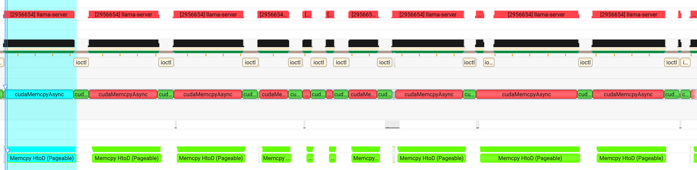

# Nsys Profiler
## Load Model
- cudamemgetinfo 执行了 373 s，应该是 Orin 的内存探测有问题，可能是其他系统组件影响了这个函数的性能。

- 使用文件进行 mmap，所以会出现 cudamemasync 之后进行 cuda sync 的情况，导致性能下降。

## Forward
**也会出现大量的 H2D 拷贝**
主要拷贝的不是模型权重，也不是大块 KV cache，而是这些每个 ubatch 都会变化的输入：

  - tokens: 当前 prefill micro-batch 的 token id
  - pos: 每个 token 的 position
  - k_idxs / v_idxs: 当前 token 要写入 KV cache 的 row/index
  - kq_mask: attention mask，和 n_tokens x n_kv 相关，prefill 时可能比较大
  - out_ids: 哪些 token 需要输出 logits
  - sampler/backend sampling 相关输入，如果启用了 backend sampler
  - 某些模型会有额外输入，比如 M-RoPE position、attention temperature、Hadamard rotation 表等
- prefill: 2.57 s
  - D2H: 返回的 logits
  - H2D：这一轮的 batch 元数据
- decode: 36.8 ms 左右
  - 使用了 CUDA Graph ，第一次 decode 需要捕获 graph，后续 decode 就不需要了，所以第一次 decode 的时间会比较长，后续 decode 的时间会比较短。
    - first decode: 39.351 ms
    - cuda graph decode: 36.8 ms

