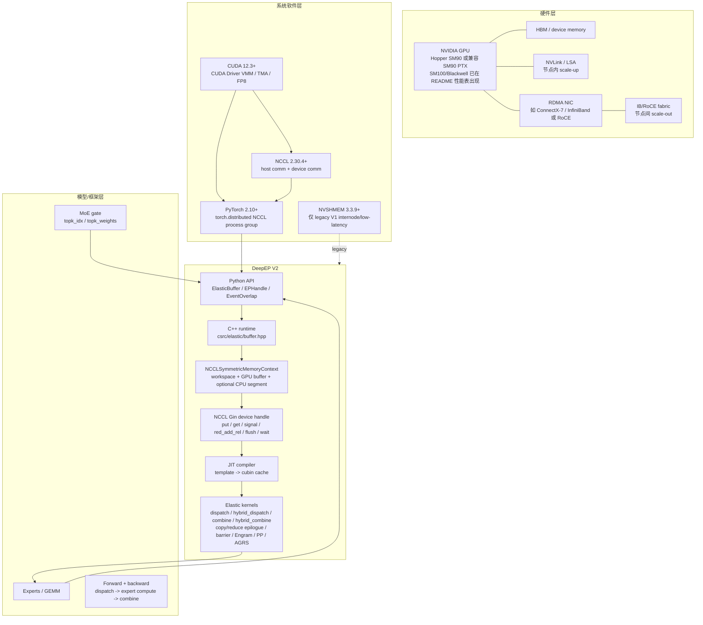
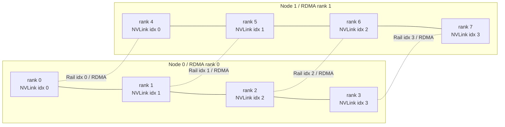
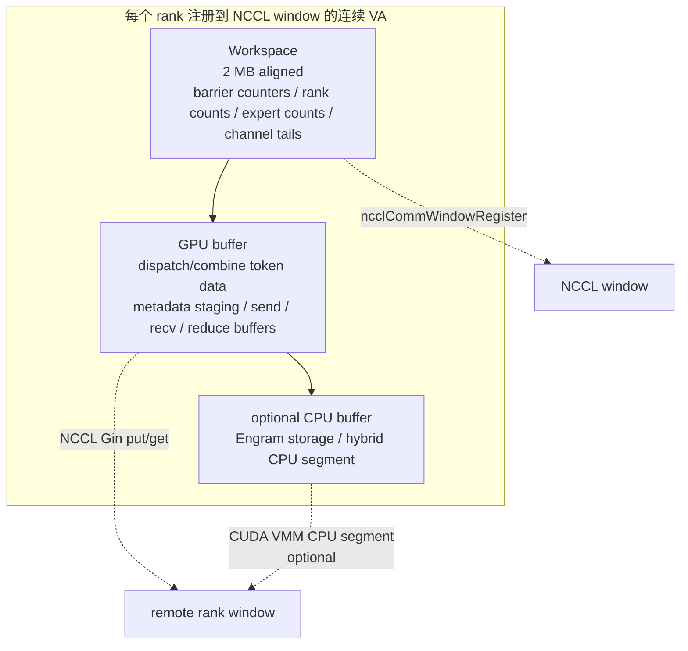
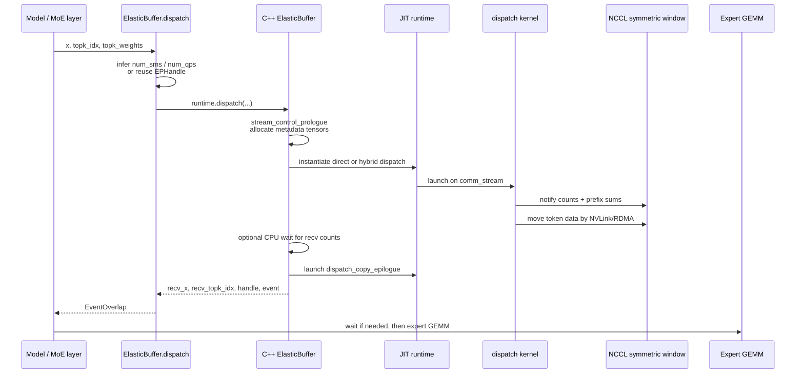
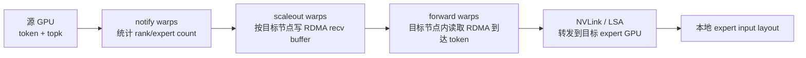
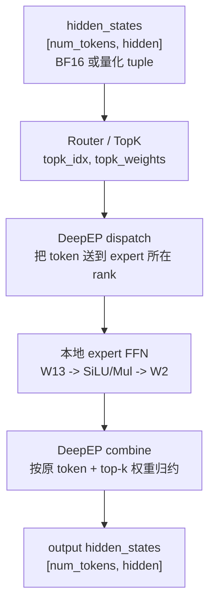
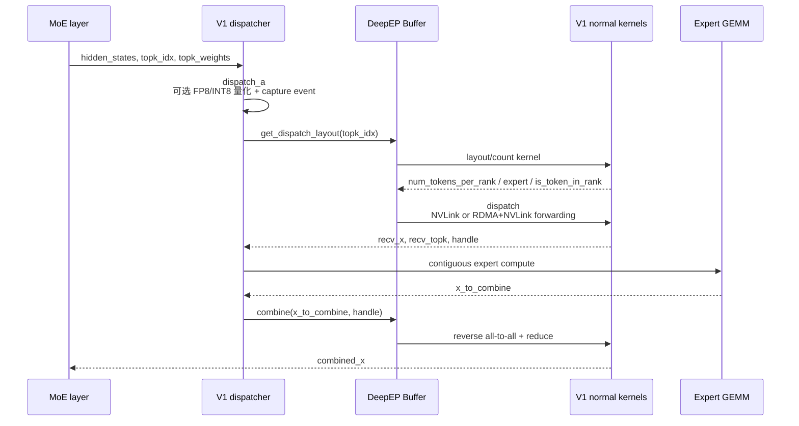
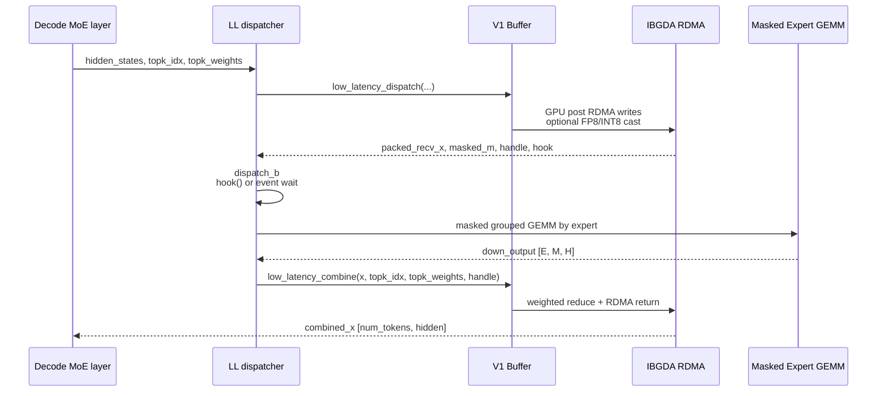

# DeepEP 架构与实现笔记

本文整理 DeepEP 相关官方文档与源码，重点解释 V2 `ElasticBuffer` 架构，同时把 V1 legacy 的 NVSHMEM/IBGDA 路径作为对照。源码基于官方仓库 `deepseek-ai/DeepEP` 的 `main` 分支临时克隆版本，提交为 `d4f41e4e93602a15e95f55f6ee8df8f1aaa0e4bb`。

主要参考：

- [DeepEP README](https://github.com/deepseek-ai/DeepEP/blob/main/README.md)
- [DeepEP V1 legacy docs](https://github.com/deepseek-ai/DeepEP/blob/main/docs/legacy.md)
- [NVSHMEM install guide](https://github.com/deepseek-ai/DeepEP/blob/main/docs/nvshmem.md)
- [V1 Python legacy Buffer](https://github.com/deepseek-ai/DeepEP/blob/main/deep_ep/buffers/legacy.py)
- [V1 C++ legacy runtime](https://github.com/deepseek-ai/DeepEP/blob/main/csrc/legacy/buffer.hpp)
- [V1 low-latency kernels](https://github.com/deepseek-ai/DeepEP/blob/main/csrc/kernels/legacy/internode_ll.cu)
- [V2 Python ElasticBuffer](https://github.com/deepseek-ai/DeepEP/blob/main/deep_ep/buffers/elastic.py)
- [V2 C++ ElasticBuffer runtime](https://github.com/deepseek-ai/DeepEP/blob/main/csrc/elastic/buffer.hpp)
- [NCCL backend](https://github.com/deepseek-ai/DeepEP/blob/main/csrc/kernels/backend/nccl.cu)
- [Symmetric memory backend](https://github.com/deepseek-ai/DeepEP/blob/main/csrc/kernels/backend/symmetric.hpp)
- [NCCL Gin device handle](https://github.com/deepseek-ai/DeepEP/blob/main/deep_ep/include/deep_ep/common/handle.cuh)
- [Communication helpers and barriers](https://github.com/deepseek-ai/DeepEP/blob/main/deep_ep/include/deep_ep/common/comm.cuh)
- [Dispatch kernel wrapper](https://github.com/deepseek-ai/DeepEP/blob/main/csrc/kernels/elastic/dispatch.hpp)
- [Direct dispatch kernel](https://github.com/deepseek-ai/DeepEP/blob/main/deep_ep/include/deep_ep/impls/dispatch.cuh)
- [Hybrid dispatch kernel](https://github.com/deepseek-ai/DeepEP/blob/main/deep_ep/include/deep_ep/impls/hybrid_dispatch.cuh)
- [Direct combine kernel](https://github.com/deepseek-ai/DeepEP/blob/main/deep_ep/include/deep_ep/impls/combine.cuh)
- [Hybrid combine kernel](https://github.com/deepseek-ai/DeepEP/blob/main/deep_ep/include/deep_ep/impls/hybrid_combine.cuh)
- 参考粘贴文本中的 SGLang/Kunlun DeepEP dispatcher、EPMoE contiguous/masked GEMM、TBO 说明。

## 1. 一句话总结

DeepEP 是面向 MoE Expert Parallelism 的通信库，核心任务是把 token 根据 gate/top-k 路由到 expert 所在 GPU，即 `dispatch`，再把 expert 输出按原 token 归约回来，即 `combine`。V2 把高吞吐和低延迟 EP API 统一到 `ElasticBuffer`，底层从 V1 的 NVSHMEM/IBGDA 切到 NCCL Gin 与 NCCL symmetric memory，并通过 JIT 模板内核、解析式 SM/QP 资源估算、NVLink/RDMA hybrid 拓扑建模来降低 SM 占用。

## 2. 总体架构图



## 3. 硬件到软件栈分层

| 层 | 组件 | 作用 | DeepEP 关注点 |
|---|---|---|---|
| GPU | SM90 Hopper 或兼容 SM90 PTX；README 也给出 SM100 性能 | 执行通信 kernel、TMA load/store、FP8 E4M3、barrier、prefix sum | V2 要 CUDA 12.3+；V1 可支持 SM80/SM90，但很多低级 PTX 优化偏 Hopper |
| 显存 | HBM、symmetric memory window | 保存 token、scale factor、metadata、workspace、atomic counters | V2 将 workspace 和 buffer 放入 NCCL window；大小 2 MB 对齐 |
| 节点内互连 | NVLink / NCCL LSA | scale-up 域，高带宽 GPU-GPU 访问 | V2 通过 `ncclTeamTagLsa` 和 `ncclGetLsaPointer` 做本地 symmetric pointer 访问 |
| 节点间互连 | RDMA NIC、InfiniBand/RoCE、multi-rail | scale-out 域，跨节点通信 | V2 使用 NCCL Gin rail/full connection；V1 使用 NVSHMEM IBGDA |
| CUDA/NCCL | CUDA Driver API、NCCL host comm、NCCL device comm、NCCL window | 建立通信域、注册 symmetric memory、提供 device-side Gin | V2 依赖 NCCL Gin，可复用现有 NCCL communicator |
| PyTorch 分布式 | `torch.distributed` process group | rank/group 管理、初始化 communicator、同步 | `ElasticBuffer(group, ...)` 从 process group 取 NCCL comm handle |
| DeepEP Python | `ElasticBuffer`、`EPHandle`、`EventOverlap`、FP8 工具 | 用户调用层；管理 buffer hint、SM/QP 估算、事件和 handle | 高吞吐和低延迟 EP V2 都走一个接口 |
| DeepEP C++ runtime | `csrc/elastic/buffer.hpp` | 分配 symmetric memory、创建 workspace、检查输入、控制 stream、调用 JIT kernel | dispatch/combine 的 CPU/GPU 边界 |
| DeepEP JIT kernel | `deep_ep/include/deep_ep/impls/*` | 根据 SM、QP、rank、expert、hidden、top-k 实例化 kernel | 不在安装时预编译所有组合，而是运行时生成/缓存 cubin |

## 4. V2 关键组件

### 4.1 `ElasticBuffer`

`ElasticBuffer` 是 V2 主入口。它支持：

- EP all-to-all：`dispatch` 与 `combine`，可走 NVLink、RDMA 或 hybrid。
- Engram：实验性的远端 KV cache fetch，RDMA `get`。
- PP send/recv：实验性的 pipeline parallel 点对点通信。
- AGRS：实验性的 all-gather reduce-scatter。

构造时会做这些事情：

1. 从 `torch.distributed.ProcessGroup` 获取 rank、world size 和 NCCL communicator handle。
2. 如果用户没有显式传 `num_bytes`，调用 `_C.calculate_elastic_buffer_size(...)` 根据 token、hidden、top-k、FP8、hybrid/reduction 模式估算 buffer。
3. 检查 NVLink 连接。PCIe GPU 场景下代码只允许较窄的 pairwise NVLink 情况。
4. 解析 `EP_OVERRIDE_RDMA_SL`，设置 RDMA service level / virtual lane。
5. 自动选择预分配 QP 数：hybrid 默认 65 或 129，direct 默认 17；具体取决于 fast RDMA atomic 支持。
6. 如果有 CPU segment，例如 Engram，跨 rank 交换 POSIX FD 句柄。
7. 构造 C++ `_C.ElasticBuffer`，创建 NCCL symmetric memory context。
8. 查询逻辑域：`num_scaleout_ranks`、`num_scaleup_ranks`。
9. 查询物理域：`num_rdma_ranks`、`num_nvlink_ranks`。
10. `cuda.synchronize -> group.barrier -> cuda.synchronize`，保证 window 和映射对所有 peer 可见。

### 4.2 `EPHandle`

`EPHandle` 是 `dispatch` 产生、`combine` 消费的路由元数据缓存。它保存：

- `topk_idx` 的克隆，避免用户后续修改导致 combine 路由错乱。
- `psum_num_recv_tokens_per_scaleup_rank`：按 scale-up rank 统计的接收 token prefix sum。
- `psum_num_recv_tokens_per_expert`：按本地 expert 统计并对齐后的 prefix sum。
- `recv_src_metadata`：源 token index、源 rank/top-k slot 等。
- `dst_buffer_slot_idx`：dispatch 时给每个 token/top-k selection 分配的目标 buffer slot。
- hybrid 专用 `token_metadata_at_forward` 与 `channel_linked_list`。
- `num_recv_tokens_per_expert_list`，供后续 expert GEMM layout 使用。

这个 handle 让 combine 不必重新推导反向路由；decode 场景还可以缓存 handle，跳过重复的 layout 计算与 CPU 同步。

### 4.3 `EventOverlap`

`EventOverlap` 包装 C++ `EventHandle`。当 `async_with_compute_stream=True` 时，DeepEP 在通信流上 launch kernel 并返回事件。用户可以让当前 compute stream 在真正使用输出前等待：

```python
recv_x, recv_topk_idx, recv_topk_weights, handle, event = buffer.dispatch(..., async_with_compute_stream=True)
# compute stream 上做其它计算
event.current_stream_wait()
# 此时使用 recv_x 安全
```

V2 C++ runtime 里的 `stream_control_prologue/epilogue` 会处理 compute stream 与 comm stream 的等待、tensor lifetime、`record_stream` 或 `EP_AVOID_RECORD_STREAM`。

### 4.4 NCCL Gin 与 symmetric memory

V2 的核心后端是 `NCCLSymmetricMemoryContext`：

- `ncclCommInitRank` 或复用已有 communicator。
- `ncclDevCommCreate` 创建 device communicator，并按 `num_allocated_qps` 配置 Gin context。
- `ncclCommWindowRegister` 注册 symmetric memory window。
- `ncclGetLsaDevicePointer` 拿到 NVLink/LSA peer 的 device pointer。
- 对 multi-node，`NCCL_GIN_CONNECTION_RAIL` 用于 hybrid rail 优化；direct 用 `NCCL_GIN_CONNECTION_FULL`。

device 端 `NCCLGin` 进一步封装：

| primitive | 作用 |
|---|---|
| `get_sym_ptr<team_t>(ptr, dst_rank)` | 如果目标在 LSA/NVLink 可达，返回 remote symmetric pointer，否则返回 `nullptr` |
| `put<team_t>(recv_sym_ptr, send_sym_ptr, bytes, dst)` | 远端写。可走 RDMA，也可通过 Gin 对应 team 发起 |
| `get<team_t>(src_ptr, dst_ptr, bytes, src)` | 远端读，Engram 用得多 |
| `put_value` | 写单个值；本地/NVLink 可用 PTX store，远端走 Gin put value |
| `red_add_rel` | release 语义的 remote add；本地/NVLink 用 PTX atomic add，远端用 Gin signal |
| `flush/flush_async/wait` | 刷新或等待 Gin request，确保可见性 |

通信 team 主要有三种：

- `World`：整个 process group。
- `LSA`：Local Shared Area，也就是节点内 NVLink/scale-up 域。
- `Rail`：跨节点同 local index 的 rail/scale-out 域。

## 5. 拓扑模型

DeepEP V2 把拓扑分成物理域和逻辑域。



物理域：

- `num_rdma_ranks = world_size / num_nvl_ranks`
- `num_nvl_ranks = ncclTeamLsa(comm).nRanks`

逻辑域：

- hybrid 模式：`num_scaleout_ranks = num_rdma_ranks`，`num_scaleup_ranks = num_nvl_ranks`
- direct 模式：`num_scaleout_ranks = 1`，`num_scaleup_ranks = world_size`

hybrid 的核心思想：跨节点先走 scale-out/RDMA 到目标节点，再由 forward warp 在目标节点内走 scale-up/NVLink 转发到 expert 所在 GPU。direct 模式则直接把目标 rank 当作一个扁平域处理。

## 6. 内存分配与布局

### 6.1 V2 symmetric memory 布局

C++ runtime 注释给出的逻辑是：

```text
Symmetric memory layout: [[[Workspace] GPU buffer] CPU buffer]
```

更展开一些：



关键点：

- `symmetric::kNumAlignmentBytes = 2 MB`。GPU buffer、CPU buffer、workspace 均按 2 MB 对齐。
- 纯 GPU buffer 使用 `ncclMemAlloc/ncclMemFree`。
- GPU + CPU 混合 buffer 使用 CUDA Driver VMM：`cuMemAddressReserve`、`cuMemCreate`、`cuMemMap`、`cuMemSetAccess`。
- Hybrid CPU segment 会为每个本地 scale-up rank 建一个 NUMA-local CPU segment，再通过 POSIX FD 跨进程导入并映射到连续 VA 后段。
- 如果使用 CPU-backed segment，会设置 `NCCL_ELASTIC_BUFFER_REGISTER=1`；hybrid 会设置 `NCCL_SYM_REUSE_SYSMEM_HANDLES=1`。

### 6.2 V2 buffer size 估算

Python 入口：

```python
required_bytes = ElasticBuffer.get_buffer_size_hint(
    group, num_max_tokens_per_rank, hidden,
    num_topk=num_topk,
    use_fp8_dispatch=use_fp8_dispatch,
)
```

C++ 里 `calculate_buffer_size` 会：

1. 取物理域和逻辑域。
2. 判断 `is_scaleup_nvlink`。
3. 根据 FP8 或 BF16 算 token element size。
4. 估算 dispatch layout 需要的空间。
5. 估算 combine layout 需要的空间。
6. 返回两者最大值并按 2 MB 对齐。

V2 README 明确提醒：V2 buffer 消耗比 V1 更大，换来的是统一 buffer、解析式资源估算和更大的 scale-up/scale-out 域支持。

### 6.3 Workspace 里有什么

从 kernel 使用可以归纳出 workspace 承担这些角色：

- barrier counter 和 signal：NVLink/Gin barrier 使用。
- notify reduction workspace：每个 SM 的 rank/expert count 归约。
- scale-up rank/expert count：目标节点内 rank 和 expert 接收计数。
- scale-out rank/expert count：hybrid 跨节点计数交换。
- atomic sender counter：给 token selection 分配目标 slot。
- channel signaled tail：hybrid scale-out 到 forward 的生产者/消费者 tail。
- channel scale-up tail：hybrid combine 中 scale-up 阶段的 tail。

DeepEP C++ 注释强调 workspace 必须保持为 0，因此初始化时会 `cudaMemset(workspace, 0, num_workspace_bytes)`。

### 6.4 V1 memory 对照

V1 `Buffer` 分成两类 buffer：

- `num_nvl_bytes`：节点内 NVLink 路径。
- `num_rdma_bytes`：节点间 RDMA，低延迟模式也复用 RDMA buffer。

V1 internode/low-latency 依赖 NVSHMEM symmetric heap 与 IBGDA，构造时会设置：

- `NVSHMEM_IB_ENABLE_IBGDA=1`
- `NVSHMEM_IBGDA_NUM_RC_PER_PE=num_qps_per_rank`
- `NVSHMEM_QP_DEPTH`
- `NVSHMEM_MAX_TEAMS=7`
- `NVSHMEM_DISABLE_NVLS=1`
- `NVSHMEM_CUMEM_GRANULARITY=2**29`

低延迟模式还有一个重要限制：返回 tensor 复用内部双 buffer，不能同时持有超过两个 low-latency kernel 的结果。

## 7. 通信原语与实现方式

### 7.1 V2 原语

V2 设备侧原语可以概括为：

```text
本地或 NVLink 可达：
  使用 symmetric pointer + PTX store/atomic/TMA store

跨节点或不可直接指针访问：
  使用 NCCL Gin put/get/signal/flush/wait
```

`NCCLGin::get_sym_ptr` 是选择路径的关键：

- `LSA` team：直接返回 LSA peer pointer。
- `World` team：如果目标 rank 在当前 rail 对应的 LSA 范围内，返回 LSA pointer。
- `Rail` team：只允许同 rail rank 的直接匹配，否则返回 `nullptr`。

因此 kernel 可以先尝试 NVLink bypass，失败再走 RDMA/Gin。

### 7.2 V2 barrier

V2 barrier 有两种：

- NVLink barrier：用 LSA symmetric pointer 和 `red_add_rel_sys` 更新 signal。
- Gin barrier：用 QP 0 发 `gin.signal`，再轮询 signal shadow 或 signal table。

hybrid barrier 可以并行做 scale-up 与 scale-out：

- SM 0 处理 scale-up barrier。
- SM 1 处理 scale-out barrier。
- 其它 SM 参与 grid sync 或数据路径。

### 7.3 V1 IBGDA 原语

V1 legacy 的 IBGDA device wrapper 包装了 NVSHMEM 内部原语：

| primitive | 作用 |
|---|---|
| `nvshmemi_ibgda_put_nbi_warp` | warp 粒度非阻塞 RDMA put |
| `nvshmemi_ibgda_rma_p` | 单元素 RMA put |
| `nvshmemi_ibgda_amo_nonfetch_add` | 远端 atomic add，不取回旧值 |
| `nvshmemi_ibgda_quiet` | 等待此前 RDMA/AMO 完成 |
| `nvshmemi_get_p2p_ptr` | NVSHMEM heap 内的 peer pointer 转换 |

V1 low-latency dispatch/combine 主要通过 GPU 线程直接发 IBGDA work request，目的是减少 CPU 参与和 latency。V2 README 说明 V2 不再支持 “0 SM RDMA low-latency EP”，但提供更统一、低 SM 占用的 elastic EP。

## 8. Dispatch / Combine 执行流程

### 8.1 V2 dispatch 高层流程



### 8.2 Direct dispatch kernel

Direct dispatch 用于 `num_scaleout_ranks == 1`。它的 warp 角色：

- notify warps：统计 `rank_count` 与 `expert_count`，跨 SM 归约，写 peer count，计算 prefix sum。
- dispatch warps：逐 token 读取 hidden、scale factor、top-k，给目标 rank 分配 slot，把 token 写入目标 buffer。

核心路径：

1. notify 阶段按 top-k 统计每个 rank/expert 会收到多少 token。rank 计数会去重，因为一个 token 的多个 expert 可能在同一 rank。
2. 通知目标 rank/expert count。NVLink 可达时用 symmetric pointer，非 NVLink 时用 Gin put。
3. 计算 prefix sum，生成 `psum_num_recv_tokens_per_scaleup_rank` 和 `psum_num_recv_tokens_per_expert`。
4. dispatch warp 用 TMA/cp.async 把 token 和 FP8 scale factor 搬到 shared memory。
5. 按 top-k selection 给目标 slot 分配 `dst_buffer_slot_idx`。
6. 如果目标 rank NVLink 可达，用 TMA store 到 remote symmetric pointer；否则先写 send buffer，再 `gin.put` 到目标。
7. 最后 barrier 确认数据到达，触发 copy epilogue。

### 8.3 Hybrid dispatch kernel

Hybrid dispatch 用于跨节点，逻辑是 scale-out + scale-up 两阶段：



warp 角色：

- notify warps：跨 scale-out rank 和 scale-up rank 归约接收计数，写 host workspace 或 GPU workspace。
- scaleout warps：每个 warp/channel 扫 token，按目标 scale-out rank 发送到目标节点的 `scaleout_recv_buffer`。
- forward warps：轮询各 scale-out peer 的 channel tail，从 `scaleout_recv_buffer` 取 token，再按 expert 所在 scale-up rank 用 NVLink 转发到 `scaleup_buffer`。

关键 metadata：

- `dst_buffer_slot_idx`：形状类似 `[channels, scaleout_ranks, max_tokens_per_channel, topk]`。
- `token_metadata_at_forward`：记录源 scaleout rank、源 token index、top-k scaleup peer、目标 slot 等。
- `channel_linked_list`：combine 时反向沿用的 per-channel/per-scaleup peer token list。

### 8.4 Combine 流程

Combine 是 dispatch 的反向：

1. 输入 expert GEMM 后的 `x` 与 `EPHandle`。
2. 使用 `recv_src_metadata` 找到每个 expert 输出应该回到哪个原始 rank/token/top-k slot。
3. direct combine 中，如果源 rank NVLink 可达，直接 TMA store 到对方 recv buffer；否则写 send buffer 并 `gin.put`。
4. hybrid combine 先在 scale-up 域聚集/转发，再按 scale-out 域发回原节点。
5. `combine_reduce_epilogue` 从 reduce buffer 中按 `topk_idx/topk_weights` 做最终归约，可选 bias。

`allow_multiple_reduction` 控制 combine 的归约策略。禁用时精度更好但可能增加传输量；启用时可在大规模 expert 场景下提升性能，但浮点累加顺序可能变化。

## 9. V1 legacy 推理路径

这一节补 V1 路径。和前面 V2 的 `ElasticBuffer` 不同，V1 主入口是 `Buffer`，并且把高吞吐 Normal 路径和低延迟 Low-Latency 路径拆得很清楚：

- Normal：面向训练和 prefill，大 token 数，高吞吐；节点内走 NVLink，跨节点走 RDMA + NVLink forwarding。
- Low-Latency：面向 decode，小 token 数，延迟敏感；pure RDMA/IBGDA，支持 hook-based overlap。
- 参考文本里的 SGLang/Kunlun 适配层在 `layers/moe/token_dispatcher/deepep.py` 之上再拆了 `dispatch_a/dispatch_b` 与 `combine_a/combine_b`，用于 Two Batch Overlap；其中 “XLink” 可以按节点内 scale-up/NVLink 域来理解，AIAK C++ 封装对应 DeepEP V1 C++ runtime。

### 9.1 V1 推理总流程

端到端可以看成四段：



通信层只负责 token 的跨 rank 重排和回传；专家计算层负责把收到的 token 按本地 expert 做 grouped GEMM。适配层通常把一次 MoE forward 拆成：

```text
dispatch_a -> dispatch_b -> expert compute -> combine_a -> combine_b
```

这样做的原因是 dispatch/combine 都有 “发起通信” 和 “等待通信完成/消费结果” 两个时间点。拆成 a/b 后，调度器可以把下一个 batch 的 dispatch_a 插到当前 batch 的 expert compute 前后，从而让 RDMA/NVLink 流量和 GEMM 重叠。

### 9.2 初始化、模式和资源

V1 `Buffer` 初始化时主要建立三类资源：

1. 进程组信息：rank、group size、device id。
2. 节点内 IPC/NVLink 可见性：交换 CUDA IPC handle。
3. 节点间 NVSHMEM/IBGDA：交换 NVSHMEM unique id，设置 QP、team、heap 等环境。

SGLang/Kunlun 适配层的 buffer 单例逻辑可以概括为：

```python
def get_deepep_buffer(group, hidden_size, param_bytes, mode, max_tokens, num_experts):
    num_nvl_bytes = 0
    num_rdma_bytes = 0

    if mode.enable_normal():
        hidden_bytes = hidden_size * param_bytes
        for config in (dispatch_config, combine_config):
            num_nvl_bytes = max(num_nvl_bytes, config.get_nvl_buffer_size_hint(hidden_bytes, group.size()))
            num_rdma_bytes = max(num_rdma_bytes, config.get_rdma_buffer_size_hint(hidden_bytes, group.size()))

    if mode.enable_low_latency():
        num_rdma_bytes = max(
            num_rdma_bytes,
            Buffer.get_low_latency_rdma_size_hint(max_tokens, hidden_size, group.size(), num_experts),
        )

    if mode == NORMAL:
        num_qps_per_rank = num_sms
    elif mode == LOW_LATENCY:
        num_qps_per_rank = num_experts // group.size()
    else:
        num_qps_per_rank = max(num_sms, num_experts // group.size())

    return Buffer(group, num_nvl_bytes, num_rdma_bytes,
                  low_latency_mode=mode.enable_low_latency(),
                  num_qps_per_rank=num_qps_per_rank)
```

关键约束：

- Normal 模式需要 `Config(num_sms, nvl_chunk_send, nvl_chunk_recv, rdma_chunk_send, rdma_chunk_recv)`。官方 V1 通过测试 sweep/默认配置调优；适配层也可通过环境或 JSON 覆盖。
- Low-Latency 模式要求 `num_experts % group_size == 0`，并推荐 `num_qps_per_rank = num_local_experts`，也就是每个本地 expert 一个 QP。
- `num_max_dispatch_tokens_per_rank` 是 decode 上限，官方文档建议实际 decode batch 不要设太大；实现里还要求单 rank 发往单 rank 的 token 数小于内部 finished tag 相关阈值。
- 从 Normal 切到 Low-Latency 前必须清理 low-latency buffer，因为 LL kernel 依赖 RDMA buffer 中部分计数/flag 初始为 0。

模式切换在适配层通常由 batch 类型决定：

```text
prefill / extend batch -> NORMAL
decode batch           -> LOW_LATENCY
```

### 9.3 Normal 路径：Prefill 高吞吐

Normal 路径的输出布局是二维 contiguous 形式：

```text
recv_x:                    [num_recv_tokens, hidden]
recv_topk_idx/weights:      [num_recv_tokens, topk]
num_recv_tokens_per_expert: [num_local_experts]
```

这里的 `num_recv_tokens` 已经是本 rank 真实收到的 token 数，`num_recv_tokens_per_expert` 会按 `expert_alignment` 对齐，方便后续 grouped GEMM。

完整流程：



`dispatch_a` 在适配层主要做两件事：

- 根据 dtype/量化配置把 BF16 hidden 转成通信格式。GPU 官方路径通常是 FP8 tuple `(x_fp8, scales)`；Kunlun/AIAK 参考文本里是 INT8 + per-token scale。
- 如果启用异步，调用 `Buffer.capture()` 在当前 stream 上记录事件，作为后续通信 stream 的依赖。

`dispatch_b` 先调用 `get_dispatch_layout`，再调用 `buffer.dispatch`。layout 阶段会产生：

| metadata | 作用 |
|---|---|
| `num_tokens_per_rank` | 当前 rank 要发给每个目标 rank 的 token 数 |
| `num_tokens_per_rdma_rank` | internode 场景中按 RDMA rank 聚合后的发送量 |
| `num_tokens_per_expert` | 每个全局 expert 的 token 数 |
| `is_token_in_rank` | token 是否需要发往某个 rank，处理 top-k 多 expert 时的 rank 去重 |

这些 metadata 会被 normal kernel 用来分配目标 slot，并生成 combine 需要的 handle。官方 V1 文档提醒：Normal dispatch 可能需要 CPU 等待 GPU 返回本 rank 收到的 token count；除非走 intranode `num_worst_tokens` 这类固定上限路径，否则不天然 CUDA graph friendly。

Normal internode kernel 的实现方式可以理解为两段：

1. RDMA 域：跨节点同 GPU index 的 rail 把 token 送到目标节点。
2. NVLink 域：目标节点内再 forward 到 expert 所在 GPU。

这也是 V1 针对 DeepSeek-V3 group-limited gate 优化的重点：不是普通 all-to-all，而是利用 “跨节点带宽窄、节点内带宽宽” 的不对称拓扑，把 RDMA 流量聚合到 scale-out，再用节点内 forwarding 展开。

### 9.4 Normal expert compute

Normal dispatch 后，expert 输入还需要整理成本地 GEMM 友好的 contiguous 布局。参考文本里的 Kunlun 路径是：

```text
recv_x [N_recv, H] + recv_topk_idx/weights
  -> dispatch_convert
  -> recv_x_all [M, H]，按 expert 连续排列
  -> GroupGemm W13
  -> SiLU/Mul
  -> GroupGemm W2
  -> combine_convert
  -> x_to_combine [N_recv, H]
```

`dispatch_convert` 做的核心事是给每个 `(token, topk_slot)` 找到本地 expert 分组中的行号：

```python
for token_idx in range(num_tokens):
    for j in range(topk):
        expert = topk_idx[token_idx, j]
        m_idx = expert_start[expert]
        recv_x_all[m_idx] = recv_x[token_idx]
        token_to_m[token_idx, j] = m_idx
        token_weights[m_idx] = topk_weights[token_idx, j]
        expert_start[expert] += 1
```

真实实现会用自定义算子完成，并同时产出：

- `m_indices`：每个 expert 的 token 数，供 grouped GEMM 分组。
- `token_to_m`：原 token/top-k 到 expert contiguous 行的映射。
- `token_weights`：每个 expert 行对应的 top-k 权重。
- `token_counts`：每个 token 有多少个有效 expert selection。

W8A8/INT8 路径通常会保持通信输入为 INT8/FP8，在 W13/W2 grouped GEMM 中带 scale 计算；非量化或高精度路径会先按 token scale 反量化，再做 BF16 grouped GEMM。`combine_convert` 是本地聚合：把同一个原始 token 的多个 expert 输出按 `token_weights` 加权求和，得到 `x_to_combine`，再交给 DeepEP `combine` 做跨 rank 回传。

### 9.5 Low-Latency 路径：Decode pure RDMA

Low-Latency 路径放弃 Normal 的动态 contiguous recv layout，改成固定 packed layout：

```text
recv_x:
  use_fp8=True  -> ([num_local_experts, num_ranks * max_tokens, hidden],
                    [num_local_experts, num_ranks * max_tokens, hidden // 128])
  use_fp8=False ->  [num_local_experts, num_ranks * max_tokens, hidden]

recv_count / masked_m:
  [num_local_experts]
```

`max_tokens` 是 `num_max_dispatch_tokens_per_rank`。每个源 rank 在每个 expert 下都有固定槽位范围，因此目标 offset 可以确定性计算，不需要像 Normal 那样先做全局 layout 同步。代价是 buffer 更大、很多槽位是无效填充，所以 expert compute 必须带 `masked_m` 跳过无效行。

完整流程：



LL `dispatch_a` 直接发起 `buffer.low_latency_dispatch`，并返回 `(packed_recv_hidden, packed_recv_count, handle, event, hook)`。如果 `return_recv_hook=True`，kernel 只负责发起 RDMA 请求，真正确认数据到达要等后续调用 `hook()`；如果不返回 hook，就由 `event.current_stream_wait()` 走常规等待。

LL `dispatch_b` 只做等待和解包：

```python
if return_recv_hook:
    hook()
else:
    event.current_stream_wait()

hidden_states, hidden_states_scale = unpack(packed_recv_hidden)
masked_m = packed_recv_count
```

`expected_m = (num_tokens * group_size * topk + num_experts) // num_experts` 通常作为 masked GEMM 的 tile/调度 hint，不代表真实 token 数；真实有效行数始终看 `masked_m`。

### 9.6 Low-Latency expert compute 与 combine

LL expert compute 直接消费 `[E, M, H]` packed layout，因此不需要 Normal 的 `dispatch_convert`。它有两条常见路径：

| 路径 | 输入 | 做法 |
|---|---|---|
| BF16/FP16 权重 | FP8/INT8 packed hidden + scale | 先 `per_token_dequant2d_with_mask`，只反量化 `masked_m[e]` 有效行，再跑 masked grouped GEMM |
| INT8/W8A8 权重 | INT8 packed hidden + scale | 直接 `m_grouped_gemm_I8_I8_bf16_nt_masked`，中间激活后再量化给 W2 |

逻辑上是：

```text
packed hidden [E, M, H]
  -> optional masked dequant
  -> masked grouped GEMM W13
  -> masked SiLU/Mul
  -> masked grouped GEMM W2
  -> down_output [E, M, H]
```

LL `low_latency_combine` 和 Normal `combine` 最大区别是它在 C++ kernel 内部直接做 weighted reduce：

- 输入仍是 `[num_local_experts, num_ranks * max_tokens, hidden]`。
- `topk_idx/topk_weights` 和 dispatch handle 一起告诉 kernel 每个 expert 输出回到哪个原 token/top-k slot。
- kernel 在回传时按 `topk_weights` 加权累加，输出直接是 `[num_tokens, hidden]`。
- 因此 LL 路径不需要 `combine_convert` 这个 Python/自定义算子阶段。

### 9.7 TBO 与 hook overlap

V1 LL 的 hook 是它最有辨识度的特性之一。它允许网络流量在后台推进，而不占用专家 GEMM 的 SM：

```text
batch_0: dispatch_a -> dispatch_b -> expert_compute -> combine_a -> combine_b
batch_1:                          dispatch_a -> dispatch_b -> expert_compute -> combine_a
                                  ^ RDMA 与上一批 compute/combine 的可重叠窗口
```

Normal 也能通过 `previous_event`、`async_finish`、`allocate_on_comm_stream` 做 stream 级 overlap，但 Normal layout/recv count 的 CPU 同步点更明显；LL 的固定 packed layout 更适合 decode 下的 CUDA graph 和双 batch 重叠。

适配层里的 `combine_a/combine_b` 还可以挂 combine-compute overlap 参数：

- 非 Blackwell：使用 `packed_recv_count`、`comp_signal`、`block_m`、`threshold` 和 `num_sms`，当某些块满足阈值后触发后续计算。
- Blackwell：使用 signal-based `src_signals` 和期望值，减少中间计数器路径。

这类 overlap 的核心不是改变数学结果，而是把 “等所有 expert 输出都回传完” 改成 “某个块可用就启动该块后续计算”。

### 9.8 V1 buffer 与临时内存复用

V1 通信 buffer 分为：

- `num_nvl_bytes`：Normal 节点内路径使用。
- `num_rdma_bytes`：Normal internode 和 LL pure RDMA 使用。

LL buffer 是双缓冲复用，官方接口明确提醒不能同时持有超过两个 LL kernel 的返回 tensor。这个限制来自 packed recv/combine buffer 复用：返回 tensor 指向内部注册 buffer，而不是每次新分配一块独立显存。

专家计算侧也常见手动复用临时 buffer。以 W8A8 contiguous 路径为例，生命周期可以压成两块大 buffer：

```text
buffer0:
  recv_x_all_int8 [M, H] -> down_input_bf16/int8 [M, F] -> x_to_combine [N, H]

buffer1:
  gateup_output [M, 2F] -> down_output [M, H]
```

这种复用成立的前提是各 tensor 的生命周期互不重叠：GEMM-0 消费完输入后，输入 buffer 可以变成 activation/down 输入；GEMM-1 写完 down output 后，再由 combine_convert 或 LL combine 消费。

### 9.9 V1 特性与实现方式小结

| 特性 | V1 Normal | V1 Low-Latency |
|---|---|---|
| 典型阶段 | prefill / training | decode |
| 通信后端 | NVLink + RDMA forwarding | pure RDMA / IBGDA |
| 布局 | `[N_recv, H]` contiguous | `[E_local, max_tokens * ranks, H]` packed |
| layout 计算 | `get_dispatch_layout`，动态统计 rank/expert count | 固定 offset，靠 `max_tokens` 和 rank/expert 计算 |
| expert GEMM | contiguous grouped GEMM，依赖 `m_indices` | masked grouped GEMM，依赖 `masked_m` |
| top-k 权重 | 常在本地 `combine_convert` 或 combine 中处理 | `low_latency_combine` 内部 weighted reduce |
| overlap | event/comm stream，Normal 可能有 recv count CPU wait | hook-based overlap，适合双 batch decode |
| 内存 | nvl/rdma buffer 按 config hint | RDMA packed buffer 较大，双缓冲复用 |
| 调优参数 | `Config`、`num_sms`、chunk size | `num_max_dispatch_tokens_per_rank`、本地 expert 数 QP |

读 V1 路径时可以抓住一句话：Normal 是 “先算 layout，再按真实接收量构造 contiguous expert 输入”；Low-Latency 是 “不算 layout，用固定 packed 槽位换掉同步，靠 mask 和 hook 把 decode 延迟压下去”。

## 10. 解析式 SM/QP 分配

V2 取消 V1 的 `Config` 手工/auto-tune，转为解析式估算。

### 10.1 SM 估算思想

`ElasticBuffer.get_theoretical_num_sms(num_experts, num_topk, ...)` 使用：

- `rdma_gbs`：RDMA 带宽，默认从 `ibstat` 检测。
- `nvlink_gbs`：NVLink 带宽，默认从 `nvidia-smi nvlink -s` 检测。
- `sm_read_gbs`：每 SM HBM read 估算，默认 200 GB/s。
- `sm_write_gbs`：每 SM HBM write 估算，默认 50 GB/s。
- topology：scale-out ranks、scale-up ranks、physical RDMA/NVLink ranks。

代码里明确写了 caveat：当前估算假设 balanced gate；对于 DeepSeek V3.0 的 group-limited gate，注释提示不要直接使用这个函数，需要额外适配。

伪代码：

```python
def estimate_num_sms(num_experts, num_topk):
    rdma_gbs = detect_rdma_gbs_if_needed()
    nvlink_gbs = detect_nvlink_gbs()

    def expected_topk(num_groups):
        experts_per_group = num_experts // num_groups
        miss = comb(num_experts - experts_per_group, num_topk) / comb(num_experts, num_topk)
        return num_groups * (1 - miss)

    expected_scaleout_topk = expected_topk(num_scaleout_ranks) if num_scaleout_ranks > 1 else 0
    expected_rank_topk = expected_topk(num_ranks)

    sm_read = 1 / expected_rank_topk
    sm_write = 0
    rdma_traffic = 0
    nvlink_traffic = 0

    if num_scaleout_ranks > 1:
        sm_write += 1 / expected_rank_topk
        sm_write += (1 / expected_rank_topk) * (expected_scaleout_topk / num_scaleout_ranks)
        rdma_traffic += (1 / expected_rank_topk) * expected_scaleout_topk * (1 - 1 / num_scaleout_ranks)
        sm_read += expected_scaleout_topk / expected_rank_topk
        sm_write += 1
        nvlink_traffic += 1 - 1 / num_scaleup_ranks
    else:
        if num_rdma_ranks > 1:
            sm_write += 1 / expected_rank_topk
        sm_write += num_nvlink_ranks / num_ranks
        nvlink_traffic += (num_nvlink_ranks / num_ranks) * (1 - 1 / num_nvlink_ranks)
        rdma_traffic += (num_ranks - num_nvlink_ranks) / num_ranks

    if scaleout and rdma_traffic / rdma_gbs > nvlink_traffic / nvlink_gbs:
        bounded_traffic, bounded_gbs = rdma_traffic, rdma_gbs
    else:
        bounded_traffic, bounded_gbs = nvlink_traffic, nvlink_gbs

    num_sms = max(
        bounded_gbs / bounded_traffic * sm_read / sm_read_gbs,
        bounded_gbs / bounded_traffic * sm_write / sm_write_gbs,
    )
    num_sms = align_even(max(4, ceil(num_sms * 1.25)))
    if not prefer_overlap_with_compute:
        num_sms = max(num_sms, 64)
    return min(num_sms, device_sm_count)
```

### 10.2 QP 估算

伪代码：

```python
def estimate_num_qps(num_sms, allow_hybrid_mode, num_allocated_qps):
    # direct mode: 少 QP，减少 doorbell ringing 开销
    num_qps = min(num_sms, 9)

    # hybrid mode: 每个 channel 加 notify 尽量独立 QP
    if allow_hybrid_mode:
        num_qps = num_sms * 16 + 1

    return min(num_qps, num_allocated_qps)
```

## 11. FP8 数据路径

DeepEP V2 支持 FP8 dispatch。Python 工具 `per_token_cast_to_fp8` 的逻辑是：

1. hidden 维按 128 对齐。
2. 每个 token、每 128 hidden 取绝对值最大值 `amax`。
3. 用 `448.0 / amax` 缩放到 E4M3 可表示范围。
4. 输出 `torch.float8_e4m3fn` 数据和 FP32 scale。

伪代码：

```python
def per_token_cast_to_fp8(x_bf16):
    x_pad = pad_hidden_to_multiple(x_bf16, 128)
    blocks = x_pad.view(num_tokens, -1, 128)
    amax = max(abs(blocks), dim=2).clamp(min=1e-4)
    x_fp8 = (blocks * (448.0 / amax[:, :, None])).to(float8_e4m3fn)
    scales = amax / 448.0
    return trim_hidden(x_fp8), scales
```

dispatch 输入可以是：

- BF16 tensor：`[num_tokens, hidden]`
- FP8 tuple：`(x_fp8, scales)`，其中 scales 会随 token 一起搬运

recv 端如果 FP8，会返回 `(recv_x_fp8, recv_scales)`。combine 目前主要以 BF16 expert 输出做 reduce。

## 12. 端到端伪代码

### 12.1 初始化

```python
def get_ep_buffer(group, max_tokens, hidden, topk, num_experts, use_fp8=False):
    required = ElasticBuffer.get_buffer_size_hint(
        group,
        num_max_tokens_per_rank=max_tokens,
        hidden=hidden,
        num_topk=topk,
        use_fp8_dispatch=use_fp8,
    )

    if cached_buffer is None or cached_buffer.num_bytes < required:
        cached_buffer = ElasticBuffer(
            group,
            num_max_tokens_per_rank=max_tokens,
            hidden=hidden,
            num_topk=topk,
            use_fp8_dispatch=use_fp8,
            allow_hybrid_mode=True,
            prefer_overlap_with_compute=True,
        )

    num_sms = cached_buffer.get_theoretical_num_sms(num_experts, topk)
    num_qps = cached_buffer.get_theoretical_num_qps(num_sms)
    return cached_buffer, num_sms, num_qps
```

### 12.2 MoE forward

```python
def moe_forward(x, gate):
    topk_idx, topk_weights = gate(x)
    buffer, num_sms, num_qps = get_ep_buffer(...)

    recv_x, recv_topk_idx, recv_topk_weights, handle, event = buffer.dispatch(
        x,
        topk_idx=topk_idx,
        topk_weights=topk_weights,
        num_experts=num_experts,
        num_max_tokens_per_rank=max_tokens,
        expert_alignment=alignment,
        num_sms=num_sms,
        num_qps=num_qps,
        async_with_compute_stream=True,
    )

    event.current_stream_wait()
    expert_out = run_local_experts(recv_x, handle.num_recv_tokens_per_expert_list)

    combined_x, _, event = buffer.combine(
        expert_out,
        handle=handle,
        num_sms=num_sms,
        num_qps=num_qps,
        async_with_compute_stream=True,
    )

    event.current_stream_wait()
    return combined_x
```

### 12.3 Direct dispatch kernel

```python
def direct_dispatch_kernel():
    gpu_barrier()

    if warp_role == "notify":
        local_rank_count, local_expert_count = count_topk(topk_idx)
        reduce_counts_across_sms()
        write_counts_to_peers_by_nvlink_or_gin()
        wait_peer_counts()
        psum_rank = prefix_sum(rank_count)
        psum_expert = prefix_sum(aligned_expert_count)

    if warp_role == "dispatch":
        for token in assigned_tokens:
            token_payload = tma_load_token_and_scales(x, sf, token)
            dst_ranks = deduplicate(rank_of(topk_idx[token]))
            for dst_rank in dst_ranks:
                slot = atomic_add(sender_counter[dst_rank])
                save_dst_slot_idx(token, dst_rank, slot)
                if nvlink_accessible(dst_rank):
                    tma_store(remote_recv_buffer(dst_rank, slot), token_payload)
                else:
                    tma_store(local_send_buffer(token), token_payload)
                    gin_put(remote_recv_buffer(dst_rank, slot), local_send_buffer(token))

    gpu_barrier()
    trigger_copy_epilogue()
```

### 12.4 Hybrid dispatch kernel

```python
def hybrid_dispatch_kernel():
    gpu_barrier(scaleout=True, scaleup=True)

    if warp_role == "notify":
        count_rank_and_expert_by_topk()
        send_scaleout_counts_to_peer_nodes_by_rail()
        reduce_counts_from_all_scaleout_peers()
        publish_scaleup_counts_to_local_nvlink_peers()
        psum_rank = prefix_sum(scaleup_rank_count)
        psum_expert = prefix_sum(local_expert_count)

    if warp_role == "scaleout":
        for token in channel_tokens:
            payload = tma_load_token(x, token)
            dst_node = scaleout_rank_of(topk_idx[token])
            slot = assign_channel_slot(dst_node)
            if dst_node == local_node:
                tma_store(local_scaleout_recv_buffer(slot), payload)
            else:
                tma_store(scaleout_send_buffer(token), payload)
                gin_put_rail(remote_scaleout_recv_buffer(dst_node, slot), scaleout_send_buffer(token))
            update_channel_tail(dst_node)

    if warp_role == "forward":
        while not all_scaleout_peers_finished:
            peer, slots = poll_channel_tails_round_robin()
            for slot in slots:
                payload = tma_load(scaleout_recv_buffer(peer, slot))
                dst_gpu = scaleup_rank_of(topk_idx_in_payload)
                linked_list_append_for_combine(channel, dst_gpu, token_metadata)
                tma_store_lsa(scaleup_buffer(dst_gpu), payload)

    gpu_barrier()
    trigger_copy_epilogue()
```

### 12.5 Combine

```python
def combine_kernel():
    gpu_barrier()

    for recv_token in assigned_expert_outputs:
        src_token_idx, src_rank, src_topk_slot = parse(recv_src_metadata[recv_token])

        if allow_multiple_reduction and multiple_local_outputs_for_same_token:
            value = local_reduce(outputs_for_same_token)
        else:
            value = expert_output[recv_token]

        if nvlink_accessible(src_rank):
            tma_store(remote_reduce_buffer(src_rank, src_token_idx, src_topk_slot), value)
        else:
            tma_store(local_send_buffer, value)
            gin_put(remote_reduce_buffer(src_rank, src_token_idx, src_topk_slot), local_send_buffer)

    gpu_barrier()
    combine_reduce_epilogue()
```

## 13. V1 与 V2 对照

| 维度 | V1 legacy | V2 elastic |
|---|---|---|
| 主入口 | `Buffer` | `ElasticBuffer` |
| 后端 | NVSHMEM + IBGDA + custom IPC | NCCL Gin + NCCL symmetric memory |
| 内存 | `num_nvl_bytes` 与 `num_rdma_bytes` 分离 | 单个连续 symmetric window：workspace + GPU buffer + optional CPU segment |
| 调优 | `Buffer.set_num_sms`、`Config`、测试 sweep | `get_theoretical_num_sms`、`get_theoretical_num_qps` |
| 模式 | normal high-throughput、low-latency pure RDMA 分开 | dispatch/combine 统一 API，direct/hybrid 内部选择 |
| 低延迟 decode | pure RDMA，hook 接收，接近 0 SM | README 说明 0-SM RDMA low-latency EP 不再支持；V2 以低 SM elastic EP 替代 |
| 依赖 | NVSHMEM 必需于 internode/LL | NCCL Gin 为主；NVSHMEM 用于 legacy |
| 规模 | 相对受限 | README 声称支持到 EP2048 |

## 14. 网络与部署检查

### V2 推荐检查

- GPU：Hopper SM90 或兼容 SM90 PTX；README 要求 CUDA 12.3+。
- PyTorch：2.10+。
- NCCL：2.30.4+，建议 pip 安装 `nvidia-nccl-cu13>=2.30.4`。
- 节点内：NVLink，DeepEP 会检查 PCIe/NVLink 连接。
- 节点间：InfiniBand 已充分测试，RoCE 理论兼容。
- NIC：`EP_NIC_NAME` 默认 `mlx5_0`，`ibstat` 用来检测 RDMA 速率与 fast RDMA atomic 支持。
- traffic isolation：通过 `sl_idx` 或 `EP_OVERRIDE_RDMA_SL` 选择 service level / virtual lane。
- adaptive routing：README 建议在所有网络负载条件下启用。
- congestion control：README 认为会伤害最大带宽，建议拥塞不可避免时把相关流量放低优先级 VL。
- PCI atomic：README 建议硬件支持时设置 `PCI_ATOMIC_MODE=4` 提升 RDMA atomic 性能。

### V1 legacy 额外检查

- NVSHMEM 3.3.9+。
- 节点内 GPU 需要 NVLink。
- 节点间需要 GPUDirect RDMA。
- IBGDA 需要 NVIDIA driver registry key 或 GDRCopy/gdrdrv。
- 构建时要找到 NVSHMEM；否则 internode 和 low-latency legacy 源文件不能正常启用。

## 15. 读源码时最值得盯的文件

| 文件 | 看什么 |
|---|---|
| `deep_ep/buffers/elastic.py` | Python API、`EPHandle`、buffer hint、SM/QP 估算、dispatch/combine 参数 |
| `csrc/elastic/buffer.hpp` | symmetric memory 创建、workspace、stream 控制、dispatch/combine 运行时流程 |
| `csrc/kernels/backend/nccl.cu` | NCCL communicator、device comm、Gin QP、window register、LSA pointer |
| `csrc/kernels/backend/symmetric.hpp` | 2 MB 对齐、GPU/CPU/Hybrid symmetric memory、CUDA VMM |
| `deep_ep/include/deep_ep/common/handle.cuh` | `NCCLGin` 的 put/get/signal/atomic wrapper |
| `deep_ep/include/deep_ep/common/comm.cuh` | barrier、QP 分配、timeout |
| `csrc/kernels/elastic/dispatch.hpp` | JIT wrapper 如何选择 direct/hybrid dispatch |
| `deep_ep/include/deep_ep/impls/dispatch.cuh` | direct dispatch 的 notify + dispatch warp 逻辑 |
| `deep_ep/include/deep_ep/impls/hybrid_dispatch.cuh` | scaleout warp 与 forward warp 逻辑 |
| `deep_ep/include/deep_ep/impls/combine.cuh` | direct combine 与 reduce 逻辑 |
| `deep_ep/include/deep_ep/impls/hybrid_combine.cuh` | hybrid combine 的 scale-up/scale-out 反向路径 |
| `deep_ep/utils/math.py` | FP8 per-token cast 与 scale factor |
| `docs/legacy.md` | V1 normal/low-latency API 和性能数字 |
| `docs/nvshmem.md` | V1 NVSHMEM/IBGDA 部署要求 |

## 16. 关键理解点

DeepEP 的本质不是通用 all-to-all，而是为 MoE 的稀疏、动态、top-k 路由做专门 all-to-all。它把 “先知道要发给谁、再按接收方 expert/GEMM layout 安排内存、最后把结果按原 token 归约回来” 这条路径拆进了通信 kernel、metadata handle 和 epilogue 里。

V2 的架构重心有三个：

1. 用 NCCL symmetric memory + Gin 把 NVLink 与 RDMA 抽象成可从 GPU kernel 发起的 remote memory operation。
2. 用 `EPHandle` 把 dispatch 中昂贵的路由和 prefix-sum 元数据保存下来，让 combine 与 decode cache 复用。
3. 用 JIT 模板把 rank 数、expert 数、top-k、SM/QP、direct/hybrid 等常量固化进 kernel，减少运行时分支和资源浪费。

V1 仍然值得读，因为它展示了 pure RDMA low-latency decode、IBGDA warp-level post-send、hook-based overlap 的思路；但实际集成新系统时，应优先按 V2 README 和 `ElasticBuffer` 走。
