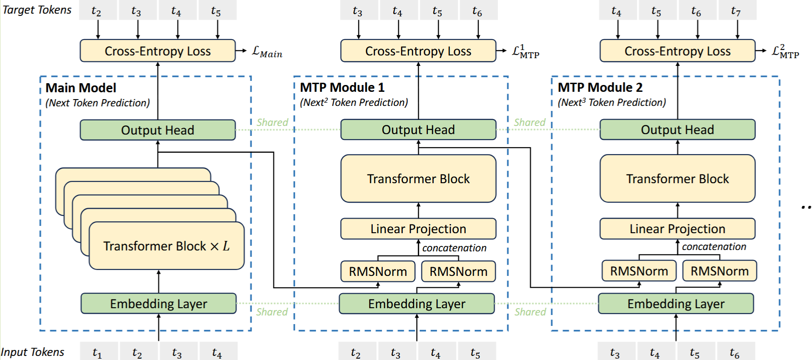
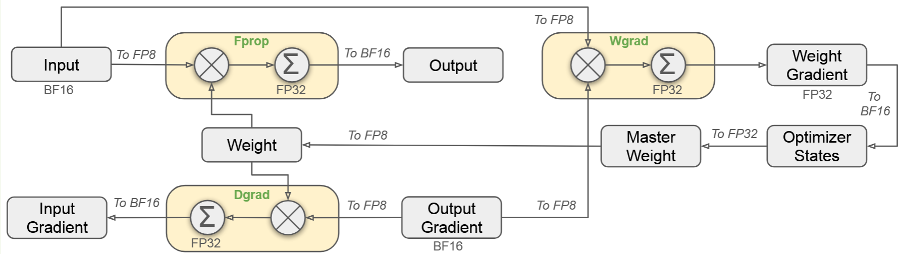
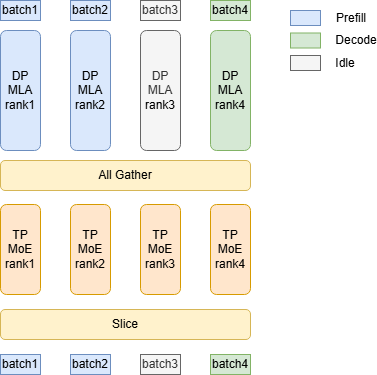
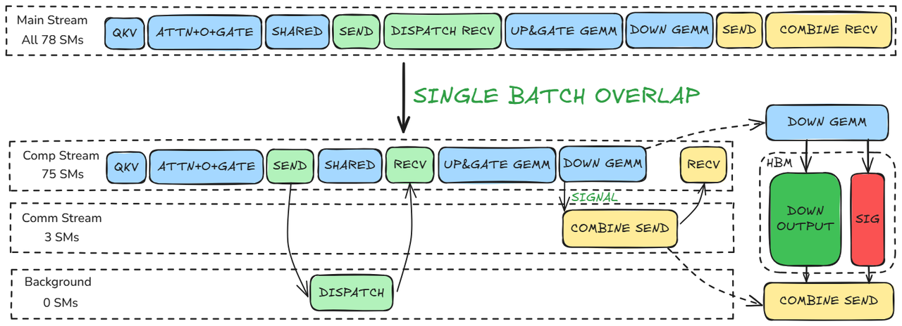

# Deepseek Details

## MoE
node-limited routing
- 每个 token 最多只发到有限个 node，这些 node 根据该 node 上专家的高 affinity 分数之和来选。目的非常直接，就是把跨节点 all-to-all 压下来，给 DualPipe + overlap 创造条件，最终接近计算通信重叠。再配合：

  - 每 step 依据 batch 负载更新 expert bias，而不是靠大 aux loss 硬拉均衡。
  - 再补一个很小的 sequence-wise aux loss，防单条序列极端失衡。
  - 所以训练和推理都可以做到 no token dropping。

## Attention
### MLA

### NSA
Block-level Indexing（块级索引）
- NSA 不会去一个一个挑选 Token，而是将序列切分成固定大小的块（Blocks），例如每块 64 个 Token。
- 索引逻辑：计算 Query 对整个 Block 的平均重要性（或者通过一个轻量级的 Router 预测）。如果某个 Block 被选中，那么这个块内的所有 Token 都会参与计算。
- 计算模式：它结合了三种模式：
  1. Sliding Window：保留最近的块（局部）。
  2. Compressed KV：对远处的块进行池化（压缩）。
  3. Sparse Blocks：只选取部分远处的块

### DSA
实际上是 Token-level Indexing + Sparse Attention 的结合。DSA 的核心创新是**动态稀疏（Dynamic Sparsity）**，即在每一层、每一个 Head 上，模型都会根据当前的 Query Token 动态地为它寻找最相关的 $k$ 个 Key Tokens。
- 索引逻辑：通常使用 Top-k 选择。比如在 128k 的长度中，每个词只选出最相关的 128 个词进行计算。
- 计算模式：这是一种完全非结构化的稀疏。被选中的 Token 在内存中往往是支离破碎、随机分布的。

完整算法其实是 4 步：
- Stage 1: approximate score
- torch.topk
- Stage 2: exact sparse attention on selected tokens
- Stage 3: reduce/merge partial outputs

Stage 1
- 输入不是完整 Q/K，而是 Q_Label 和 K_Label_Buffer
- 对当前 (batch, head)，沿着整条序列按 BLOCK_N 扫过去
- 计算每个 token 的一个近似 attention 分数，写到 Att_Out[H, B, S]
  - 这里的 head_dim 很小

TopK 选择
这一步不在 Triton kernel 里，而是在 Python 侧：
topk_token_indices = torch.topk(att_out_approx, heavy_token_num, dim=-1).indices
含义：
- 从全序列 S 个位置里，为每个 (head, batch) 选出 k=heavy_token_num 个位置
- 后面只对这些位置做真实 attention

Stage 2
- 输入换成了完整的 Q/K/V
- 但不再遍历整条序列，只遍历刚才挑出来的 Topk_token_indices
- 同时把这 k 个 token 再按 BLOCK_SEQ 分块
- 每个块内做一次标准的 online softmax accumulation，生成：
  - Mid_O[batch, head, seq_block_num, head_dim]
  - Mid_O_LogExpSum[batch, head, seq_block_num]


Stage 3
- 读取 Stage 2 每个块的 Mid_O 和 Mid_O_LogExpSum
- 再做一次块间的 online softmax merge
- 得到最终 O[batch, head, head_dim]

stage2 + stage3 有点类似 flash decoding，因为在 KV 分段了，所以先算出每个 KV 块的 o_i 和 log_exp_sum_i，然后用 reduce 进行最后的 softmax 的计算

## MTP
顺序地预测额外 Token，并在每个预测深度保持完整的因果链；Medusa 则是并行的预测多个 token，彼此之间并不知道对方的存在。
- MTP 主要为了提高训练中的表现
- 共享 Embedding 和 Output Head，节省参数量；MTP 模块主要是在学习如何变换隐藏层表示


MTP 实现使用 $D$ 个顺序模块来预测 $D$ 个额外的 Token。第 $k$ 个 MTP 模块组成：
- 一个共享的嵌入层 $\text{Emb}(\cdot)$
- 一个共享的输出头 $\text{OutHead}(\cdot)$
- 一个 Transformer 块 $\text{TRM}_k(\cdot)$ 
- 一个投影矩阵 $M_k \in \mathbb{R}^{d \times 2d}$ 组成。

对于第 $i$ 个输入 Token $t_i$，在第 $k$ 个预测深度，我们首先通过线性投影结合第 $(k-1)$ 层的表示 $h_i^{k-1} \in \mathbb{R}^d$ 和第 $(i+k)$ 个 Token 的嵌入 $\text{Emb}(t_{i+k}) \in \mathbb{R}^d$：$$h'^k_i = M_k [\text{RMSNorm}(h^{k-1}_i); \text{RMSNorm}(\text{Emb}(t_{i+k}))]$$其中 $[\cdot; \cdot]$ 表示拼接。特别地，当 $k=1$ 时，$h^0_i$ 指的是主模型提供的表示。注意，每个 MTP 模块的嵌入层与主模型共享。组合后的 $h'^k_i$ 作为第 $k$ 层 Transformer 块的输入，生成当前深度的输出表示 $h^k_i$：$$h^k_{1:T-k} = \text{TRM}_k(h'^k_{1:T-k})$$最后，以 $h^k_i$ 为输入，共享的输出头将计算第 $k$ 个额外预测 Token 的概率分布 $P^k_{i+1+k}$：$$P^k_{i+k+1} = \text{OutHead}(h^k_i)$$



### Training Objective
对于每个预测深度，我们计算交叉熵损失 $L^k_{\text{MTP}}$：
$$
L^k_{\text{MTP}} = -\frac{1}{T} \sum_{i=2+k}^{T+1} \log P^k_i[t_i]
$$
其中 T 是输入序列长度，$t_i$ 表示第 $i$ 个位置的真实 token，$P^k_i[t_i]$ 表示由第 $k$ 个 MTP 模块给出的对应预测概率。

最后，我们计算所有深度 MTP 损失的平均值，并乘以权重因子 $\lambda$，得到总体 MTP 损失 $L_{\text{MTP}}$，作为 DeepSeek-V3 的额外训练目标。
$$
L_{\text{MTP}} = \frac{\lambda}{D} \sum_{k=1}^D L^k_{\text{MTP}}
$$

## FP8 Training
### 混合精度框架
为了平衡效率和稳定性，DeepSeek-V3 采用了一套精细的混合精度方案。

- 核心计算 (GEMM)： 前向传播 (Fprop)、激活反向传播 (Dgrad) 和权重反向传播 (Wgrad) 这三大矩阵乘法全部采用 FP8。这理论上比传统的 BF16 快了一倍。
- 敏感环节 (维持高精度)： 嵌入层 (Embedding)、输出头 (Output Head)、MoE 门控模块、归一化 (Normalization) 和注意力机制 (Attention) 仍保留 BF16 或 FP32。
- 显存优化： 优化器状态（AdamW 的一阶和二阶动量）降级为 BF16，主权重和梯度保留 FP32


### 提高精度策略
- 细粒度量化 (Fine-Grained Quantization)： 针对 FP8 动态范围窄、易受离群值（Outliers）影响的问题，DeepSeek 不再对整个张量统一缩放，而是采用：
  - 激活值： 每 $1 \times 128$ 个元素（Tile-wise）作为一个缩放组。
  - 权重： 每 $128 \times 128$ 个元素（Block-wise）作为一个缩放组。
- 增加累加精度 (Increasing Accumulation Precision)： NVIDIA H800 的 Tensor Core 在做 FP8 矩阵乘法时，内部累加精度只有约 14 位，在大模型训练时误差极大。
  - DeepSeek 的做法是：每累加 $N_c = 128$ 个元素，就把中间结果转换到 CUDA Core 的 FP32 寄存器中进行全精度累加。
- 全量 E4M3 格式： 传统的 FP8 方案在反向传播时常用 E5M2（指数位更多，范围广但精度低）。DeepSeek 凭借细粒度量化解决了范围问题，因此全程使用 E4M3（尾数位更多，精度更高），进一步提升模型表现。

## Parallelism in SGLang
### DP-Attention
**Motivation**
mla存储 kvcache 的时候，对于一个token存储的是(1, kv_lora_rank)，而不是常规attention的(kv_head_num, head_dim)。这在tp并行时引入了一些问题
1. tp并行时，每张卡是在head_num维度切分kv cache，但mla的 kvcache 的head_num是1，没法切分，所以每张卡上都要保存（bs, 1, seq_len, kv_lora_rank的完整kvcache
2. 部分权重由于head_num=1无法切分到不同的卡上，比如q_a_proj 和kv_a_proj_with_mqa不能按 head_num 切分
  
因此，mla 采用 tp 并行时，部分权重和 kvcache 都无法按 head_num 划分到不同的卡上。这也是sglang的博客中给出的解释。

如果对mla采用dp并行，那么就可以将kvcache分开存储到不同的卡上，此时每张卡维护不同seq的全量kvcache，而tp并行下，每张卡都要维护所有seq的全量kvcache。
具体来说，
- 假设dp_size=2，那么卡1维护(bs_1, 1, seq_len, hidden_dim)的kvcache，卡2维护(bs_2, 1, seq_len, hidden_dim)的kvcache，
- 如果此时是tp并行，每张卡都要维护(bs_1+bs_2, 1, seq_len, hidden_dim)的kvcache。

通过sglang博客中的图可以看到，在mla之后会做一个all gather，让每张卡都获得所有seq的hidden_state，经过moe之后，再通过slice让每张卡取出属于自己的seqs。




**Process**
- prepare_attn: 基本不做跨卡通信，主要做 residual + input layernorm
- attention
- prepare_mlp：把每张卡上的本地 batch 聚成所有 MoE rank 都可见的 full batch，并做post-attn layernorm
  - prefill：all-reduce
    1. 每个 rank 先把自己的 local tokens 拷到 global buffer 的对应 offset
    2. 然后对这个 global buffer 做一次 tensor_model_parallel_all_reduce
    3. 因为不同 rank 只写自己那一段，all-reduce 后就拼成了 full batch
  - Decode：all-gather
    - TP all_gather_into_tensor 得到 full batch
- MoE:
  - 本体不是 DeepEP 那种 token dispatch/combine；它是所有 rank 都拿 full batch，只算自己那部分 experts 和 TP shard，最后再做一次 TP all-reduce，把 full batch 切回各自的本地 batch，给下一层 MLA
  - Prefill: all-reduce
    - 所有 rank 拿 full batch
    - R0/R1 只算 expert set A 的 tp shard 0/1
    - R2/R3 只算 expert set B 的 tp shard 0/1
    - TP all-reduce 汇总完整 routed output
  - Decode: skip all-reduce
    1. MoE wrapper 先跳过显式 all_reduce
- Postprocess_layer:
  - Prefill: local slice
    - 把 full batch 切回 local batch
    - prefill 常见是 dp_scatter，本质是本地 slice/copy
  - Decode: reduce-scatter
    - 直接 reduce-scatter
    - 一步完成 sum + slice

### Compute-Communication Overlap(TBO & SBO)
#### Two Batch Overlap (TBO)
- TBO(two-batch-overlap)：把一个大 ForwardBatch 拆成两个可以交错执行的子 batch，然后在单层 forward 内部，按预定义阶段显式穿插执行。
  - decode/verify：两个batch对半分 sequence，交错执行
  - prefill/extend：按 extend token 总量均衡切分
  - 在定义好的 operation 上交错执行，通过 yield 让出控制权，切换到另一个 batch 上继续执行。比如在 prefill 的 prepare_mlp 里，先执行 batch0 的前半部分，然后 yield 切到 batch1 执行它的前半部分；接着 batch0 执行后半部分，batch1 执行后半部分。
    - Prefill：计算负载高，可以在计算时穿插通信
      ```shell
      op_comm_prepare_attn->op_attn_core->op_comm_prepare_mlp->op_gate->op_select_experts->op_dispatch_a->Yield
      op_dispatch_b->op_experts->op_combine_a->Yield
      op_shared_experts->op_combine_b->Yield
      op_ouput->op_comm_postprocess_layer
      ```

    - Decode：瓶颈主要在显存访问，attn 单独很难 overlap 通信开销
      ```shell
        op_comm_prepare_attn->Yield
        op_attn_core->op_comm_prepare_mlp->op_gate->op_select_experts->Yield
        op_dispatch_a->op_shared_experts->Yield
        op_dispatch_b->op_experts->op_combine_a->Yield
        op_combine_b->Yield
        op_ouput->op_comm_postprocess_layer
      ```

#### Single Batch Overlap (SBO)
因为 H20 卡在 TBO 情况下不能很好进行 compute-communication overlap，所以 SGLang 为 DeepSeekV3 推理实现了 SBO(single-batch-overlap)，在单个 batch 内部把不同阶段的计算和通信穿插起来。

1. dispatch 阶段重叠 shared experts
  - 它注册一个 deepep_dispatch_hook。
  - hook 触发时直接调用 _forward_shared_experts(hidden_states)，也就是 dispatch 开始后，把 shared experts 插进这段窗口里。
2. combine 阶段重叠 shared experts / down-gemm
  - 注册 post_dispatch_hook、pre_combine_hook、post_combine_hook。
  - post_dispatch_hook 里先调用 compute_overlap_args(...)，会分配 CombineOverlapArgs / DownGemmOverlapArgs，并把通信用多少 SM、计算用多少 SM 算好。
  - pre_combine_hook 再在 combine 前启动 shared experts 或 down-gemm 的重叠计算。
  - post_combine_hook 负责清理 overlap args。


### EP
每次 MoE 层前向时，模型先拿当前层的 dispatch metadata(logic->physical mapping)，再做路由，再把 logical expert id 转成 physical expert id。转完以后，后面的 dispatcher 看到的就已经是 physical expert ids 了，它只负责把 token 发到那个 physical expert 所在 rank，不再关心 logical expert id。

大体流程如下：
- 根据 expert 布局策略和 token 统计定期产出新的 replica 布局
- dispatch 读取当前最新布局做 logical->physical 映射
  - static：直接用 `partial_logical_to_rank_dispatch_physical_map[topk_ids]` 查表，
  - dynamic：对每个 token 的每个 logical expert，在 `partial_logical_to_all_physical_map` 的有效副本里随机取一个
- 下一次 forward 到这个 layer 时，ExpertLocationDispatchInfo.init_new() 自然就会拿到新表
- 如果是 chunked rebalance，只会对已更新的那些 layer 切换到新表，别的 layer 继续用旧表


#### EPLB(Expert Location Load Balancing)
这里支持 chunked rebalance，每次只更新部分层的布局，避免一次性大规模数据迁移带来的性能冲击。
- 基于 expert 热度统计做周期性重平衡：先统计一个时间窗口内每层每个 expert 的命中 token 数，再把这个窗口里的统计求和，用这个历史热度重算 replica placement
- 根据不同的 placement 算法进行负载均衡布局的计算，这里是 logical expert 的布局
- 重平衡是在model_runner.forward() 后调用on_forward_pass_end() 推进 Generator 入口，然后再进入 rebalance()、update_expert_location() 等流程
  - 新布局先整体算出来
  - 先 yield，等下一个 forward 结束，再执行这一个 chunk 的 update_expert_location()
  - 常规情况下：**先把真实权重搬到目标 physical slot，再把逻辑映射切过去**
    - 权重复制：updater 会找到需要复制的 logical_expert_id 当前实际在哪些源槽位/源 rank 上有权重。然后把对应参数切片复制到本地目标槽位
> [!IMPORTANT]
> 需要先切换权重，然后再切换映射。因为如果先切映射，新的 logical->physical 映射可能会把某些 logical expert 映射到新的 physical slot 上，而这个 slot 上的权重还没有被复制过去，导致新请求打过来时，这些 expert 的权重是旧的或者随机的，影响精度。

#### deepseek_hierarchical placement
在 DeepSeek-V3 这类 group-limited routing 里，routed experts 会先被划成若干组；token 先选 group，再只在这些 group 内选 top-k experts。
- DeepSeek 的公开材料里明确提到：例如把 256 个 routed experts 分成 8 组，每组 32 个 expert，并尽量把**同组 expert 部署在同一 node 上，以减少跨节点流量**
- 每个 group 部署在单个 node 上，然后**算法上限制：每个 token 最多只会路由到 4 个 nodes**
- 把一个 node 已拥有的 experts / replicas 均匀分到本 node GPU 上，尽量让 token 命中本 node 副本，走 NVLink/NVSwitch

**Details**
1. pack groups to nodes
  - 统计每个 expert 预计有多少 token，再把同组 experts 的负载加起来，得到每个 group 的总热度
  - 用 balanced_packing() 把 group 尽量均匀地分到各 node
  - 这一步的目标是让同一组 experts 尽量留在同一节点，同时让每个节点接到的总负载接近
2. construct redundant experts within nodes
  - 把每个节点内部的逻辑专家重新编号成连续的 `mlog`
  - 用 replicate_experts() 在节点内给热点 logical expert 增加 replica
  - 复制规则很直接：每轮都挑当前 `tokens / mlogcnt` 最大的 expert 再复制一份，近似压低最大 replica 负载
3. pack physical experts to GPUs
  - 副本是在 node 内复制，而不是跨 node 复制
  - 节点内已经决定了哪些 replica 存在，接着把这些 physical experts 再均衡打包到各 GPU
  - 再次使用 balanced_packing()，但这次对象从 group 变成了 physical expert replica
    - 依据是复制后每个 physical expert 的估计负载
    - 让 node 内各 GPU 的总负载更均匀，避免某一张卡上塞满热点副本
> [!IMPORTANT]
> 当前的做法是**先在节点内复制专家，再把这些副本均衡分布到本节点的 GPU 上**。对于跨机器的 token 路由不友好

**问题**
- 如果某个 node 没有某个 expert 的任何副本，该 token 就只能跨 node 访问，使用低效的 RDMA
- 所以现在 SGLang 提出了，将第二步骤的复制专家从 node 内部复制变为专家复制到不同的节点
  - 这样其他节点想访问热点专家，可以利用 NVLink 高速设备

