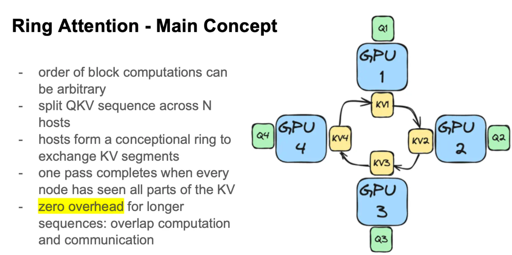
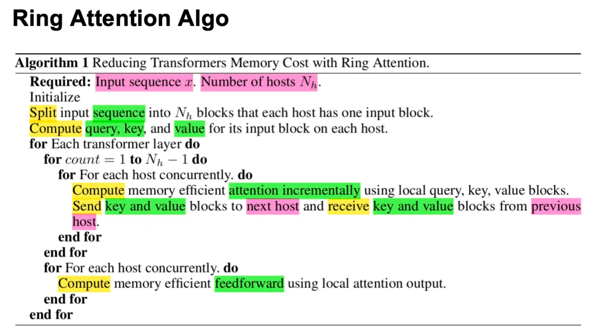
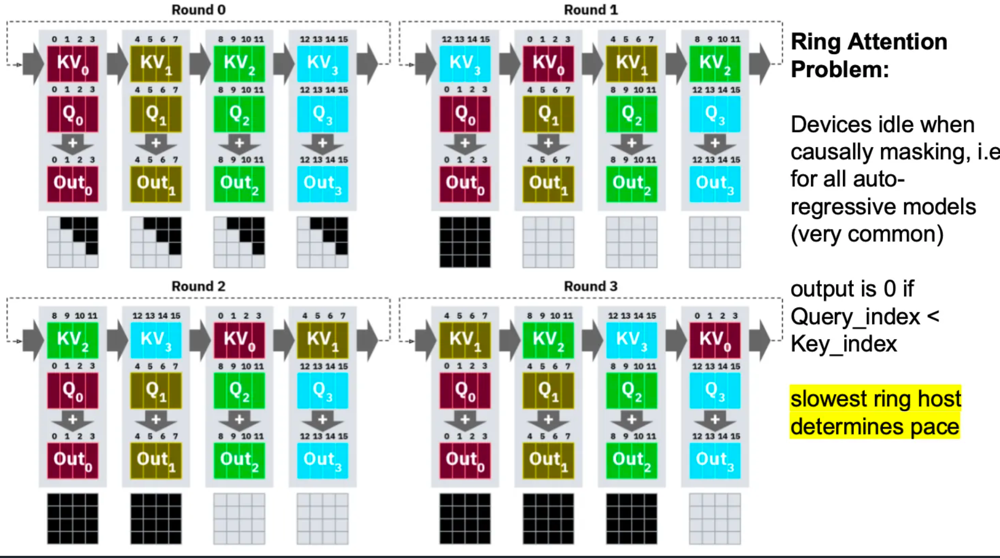
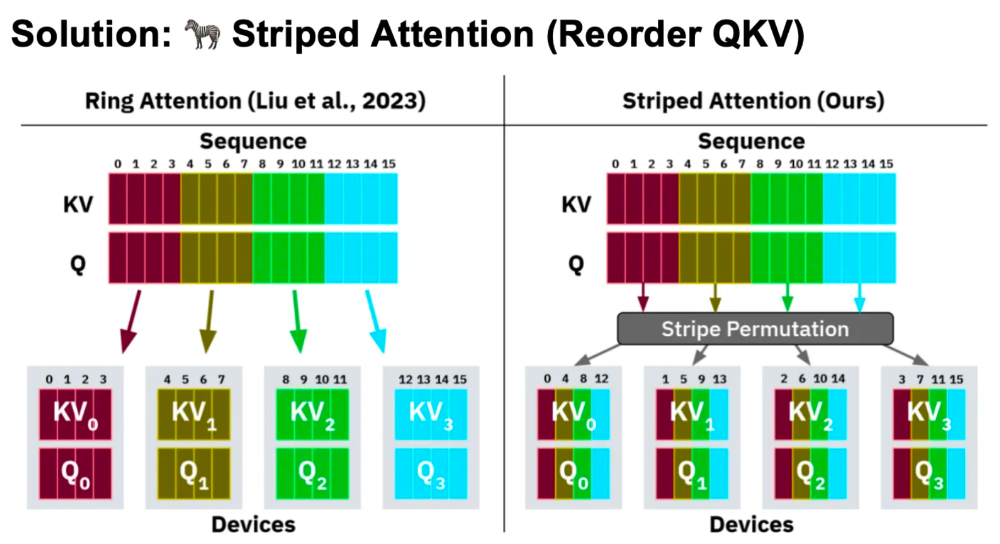
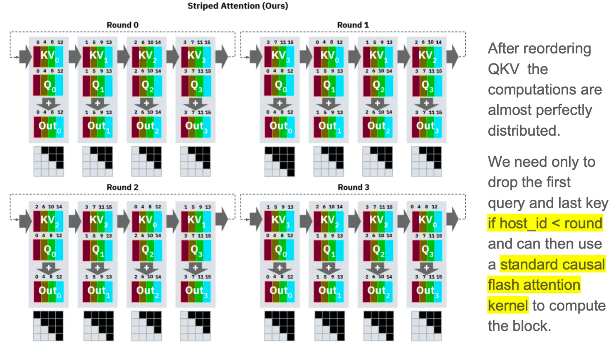
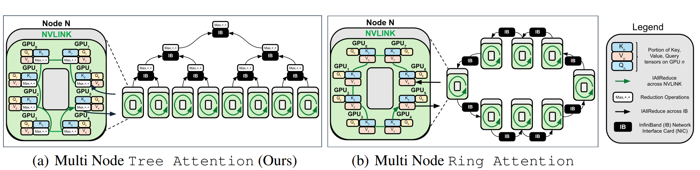
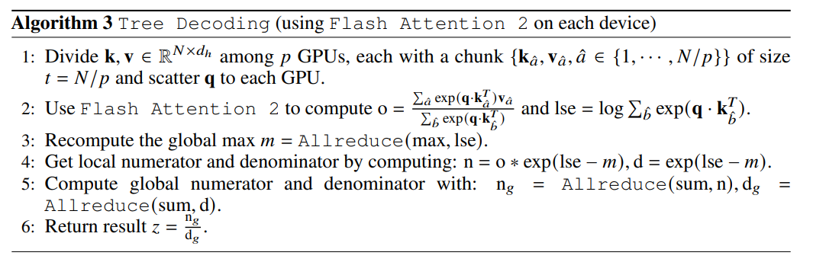
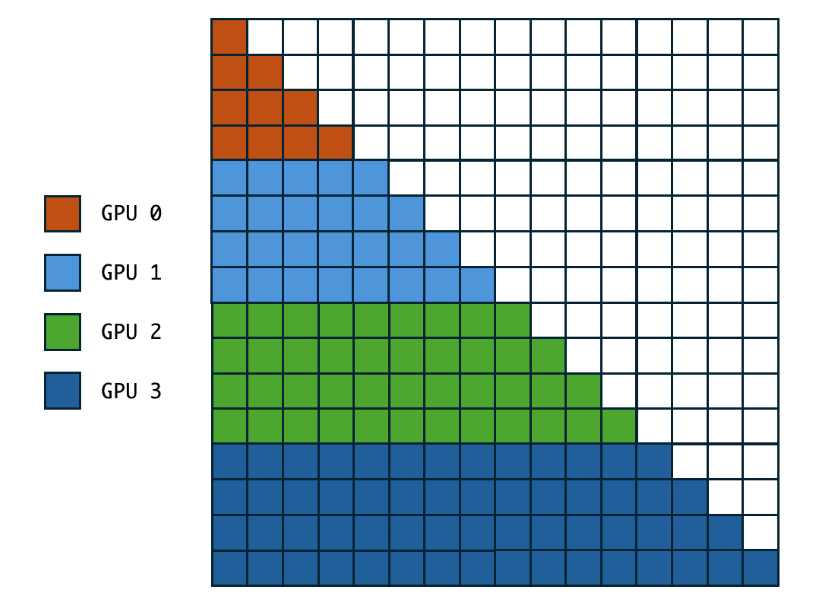
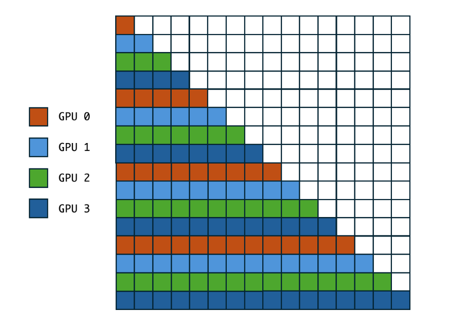
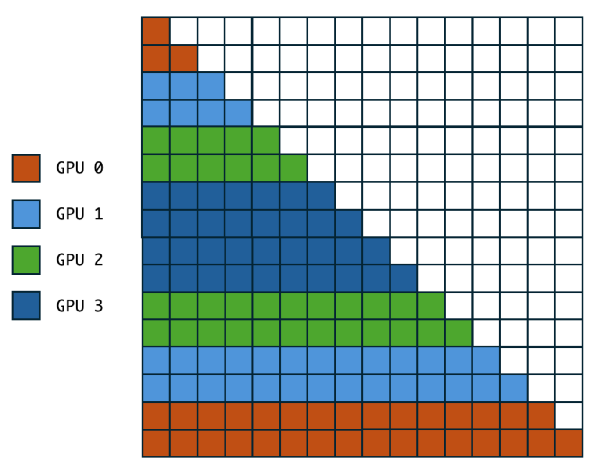

# Long Context Attention
- 长上下文注意力（Long Context Attention）是指在处理长序列数据时，如何高效地计算注意力机制的一种方法。传统的注意力机制在处理长序列时会面临计算和内存的挑战，因为它需要计算所有位置之间的关系，导致计算复杂度为O(n^2)。为了克服这个问题，研究人员提出了多种优化策略，如Ring Attention和Striped Attention，以及后续的 Tree Attention等方法。
## Motivation
- "挑战：我们耗尽了内存"
  - 引用自Ring Attention（2023年，Hao Liu等人的研究）：
  - "对于一个隐藏层大小为1024的简单模型，使用批量大小为1处理1亿个token需要超过1000 GB的内存。"
- 内存挑战的原因：
  - 输入需要被具体化（materialized）
  - 使用Flash-Attention时，内存需求与输入长度呈线性增长
  - 需要存储输入的QKV（查询、键、值）、输出、LSE（对数和指数）以及用于反向传播的dout
- 当前高端GPU的内存容量：
  - NVIDIA H200: 141 GB
  - AMD MI300X: 192 GB
  - NVIDIA GB200 (Blackwell): 288 GB（将于2024年底推出）
## Ring Attention
- 计算顺序的灵活性：块计算的顺序可以是任意的，不受限制。
- QKV序列的分割：将QKV（查询、键和值）序列分割成N个不同的主机进行处理。
- 主机环状结构：这些主机形成一个概念上的环，用于交换KV（键和值）段。
- 完成条件：当每个节点都看到所有KV部分时，一个完整的循环就完成了。
- 零开销：对于较长的序列，由于计算和通信可以重叠，因此实现了零开销。
- 把Flash Decoding看作是Ring Attention在推理阶段的一个优化

### Problem
- 设备空闲问题：
  - 当使用因果掩码（Causal Masking）时，在环形结构中某些设备会处于空闲状态。这种情况在所有自回归模型（例如语言模型）中非常常见。
  - 由于因果掩码的存在，当查询索引（Query_index）小于键索引（Key_index）时，输出会被掩盖（置为0），导致某些设备在计算时没有实际有效的输出，因此在等待其他设备时处于空闲状态。
- 逐轮处理的过程演示：
  - 该图将Ring Attention过程分为了四个回合（Round 0到Round 3），每个回合中，每个设备（如GPU）负责不同的KV（键-值）块和Q（查询）块。
  - 每个回合中，设备根据查询和键的索引关系计算输出，当掩码的值为0时（黑色格子表示被掩盖的位置），输出被强制为0。
  - 图中可以看到，随着回合的推进，有些设备的计算结果被掩盖（黑色区域增多），导致设备无法参与有效计算。
- 最慢的环形节点决定整体速度：
  - Slides 特别指出：环形结构中最慢的主机（Ring Host）决定了整体计算的速度。因此，如果某个设备因掩码导致计算时间变长或空闲时间变多，会拖慢整体环形的计算速度，降低效率。

### Solution

- 这两张slides讲解了一个Ring Attention负载不均衡的解决方案，通过 Stripe Permutation（条带置换） 的策略，将K，V和Q在序列维度上按条带重新排列（比如将KV0分成了0,4,8,12，而不是连续的0,1,2,3），通过重新排列KV和Q块，Striped Attention能够更好地分配计算资源，从而减轻设备之间的不平衡性，提高整体计算效率。
- 从第二张Slides可以看到，经过条带置换后的计算过程几乎能够完美地均衡分配计算负载，从而使得设备之间的计算更加平衡，避免了Ring Attention中存在的设备空闲问题。在每个回合中，只有当“host_id < round”时，需要丢弃第一个查询和最后一个键的计算，这样做能够避免不必要的计算，进一步提升效率。

## Tree Attention
Tree Attention（2024 年提出）将重点放在了跨设备解码时的通信拓扑优化上。节点内使用 Ring Attention，节点间使用 树状规约（Tree Reduction）来聚合注意力结果，从而显著降低了通信复杂度和延迟，特别是在跨节点的分布式环境中。
- Node 内有 NVLink 连接，Node 间通过 InfiniBand 连接
### Tree Attention 的核心创新点：

- 树状规约（Tree Reduction）： 它摒弃了低效的环状传递。由于注意力机制 Softmax 中的 logsumexp 和 max 运算满足数学上的结合律，Tree Attention 将多设备的注意力聚合操作重构成了一个树状拓扑结构。
- 对数级通信： 这一改变将通信步数从 Ring Attention 的线性复杂度 $O(N)$ 直接降维到了对数复杂度 $O(\log N)$。

## Zig-Zag Attention
- Ring Attention，如果直接按 $Q$ 的前后位置进行划分，会出现不同卡上计算量不均衡的问题。例如一个长度为 16 的序列被切到 4 张卡上，那么 attention mask 如下图：

- 对于这样计算量不均衡的问题，已经有了 stripped ring attention 这样的解决方案。striped ring attention 的思路大致是，将计算量划分成条带状：
  - 对于里面可能存在的台阶状 attention mask，无法直接调用 flash attention 的 API（因为 flash attention 只支持开启或关闭 causal）。不过如果我们把 striped attention 的 block size 设成 1，应该也可以直接用上 flash attention 的 API。

- 我们可以把 attention mask 对折起来，按照下面的方法进行划分:
  - 用这种方法计算，任意两张卡上的 $Q_i$ 与 $K_j$ 之间的 attention mask，都是一个完整的方形，而且每张卡上的计算量也是相对平均的
