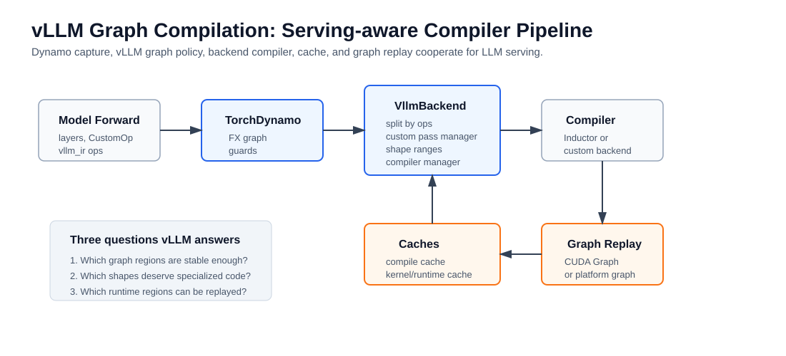
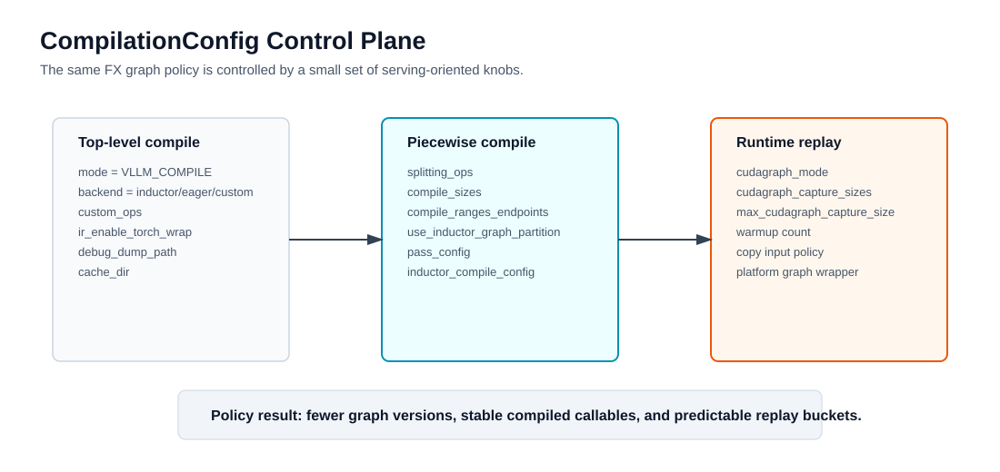
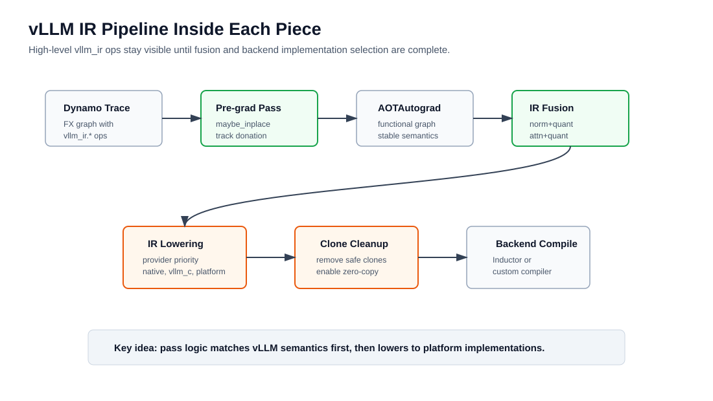
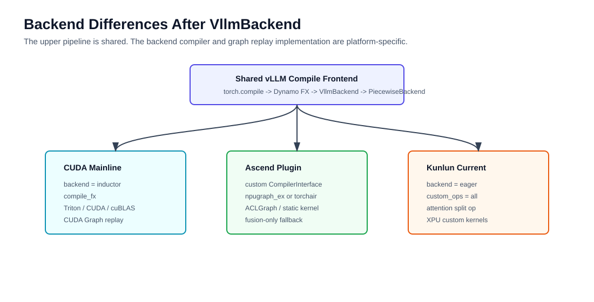
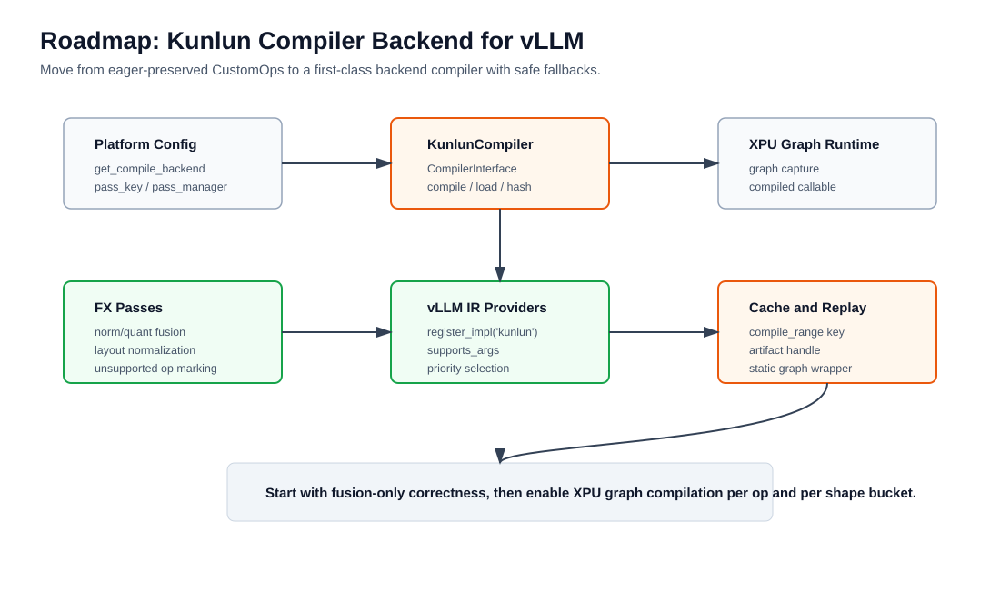

# 图编译在 vLLM 中的应用：从 torch.compile 到 Kunlun Compiler Backend

本文的主线只有一个：**vLLM 中的图编译不是简单打开 `torch.compile`，而是把 PyTorch 编译栈改造成适合 LLM Serving 的图捕获、图切分、图优化、编译缓存和运行时重放体系**。



这条主线可以按“总-分”理解：

1. **总：服务化编译管线**。vLLM 让 `torch.compile` 负责捕获模型前向图，但由 `VllmBackend` 决定哪些图段能编译、哪些图段要留给 attention/KV cache/runtime 处理、哪些 shape 需要专门化。
2. **分：三层职责**。Dynamo 负责动态图到 FX Graph；vLLM 负责推理语义相关的 graph policy；底层 compiler backend 负责把 piecewise graph 编成当前硬件可执行的 callable。
3. **落地：不同硬件不同后端**。CUDA 主线走 Inductor/Triton；Ascend 通过 `CompilerInterface` 接入 `AscendCompiler`；当前 vLLM-Kunlun 主要保留 CustomOp/eager 边界，后续可以参照 Ascend 建设自己的 compiler backend。

## 0. 术语表

| 术语 | 在本文中的含义 |
| --- | --- |
| `torch.compile` | PyTorch 2.x 的编译入口。它返回一个可编译包装对象，第一次执行时通常触发 Dynamo 捕获和后端编译。 |
| TorchDynamo | `torch.compile` 的前端捕获组件，从 Python 动态执行中捕获可编译张量计算，生成 FX Graph 和 guards。 |
| FX Graph | PyTorch FX 图表示，vLLM 会在其中保留普通 ATen op、vLLM CustomOp 和 `torch.ops.vllm_ir.*`。 |
| Guards | Dynamo 捕获图时记录的复用条件，如 shape、dtype、device、对象属性和部分分支条件。 |
| Graph Break | Dynamo 无法继续捕获 Python 执行路径时产生的断点。vLLM 希望在可控边界内自己切图，而不是让 Python break 随机决定优化边界。 |
| Inductor | PyTorch 默认编译后端。CUDA 上常见结果是生成 Triton/C++ kernel 或调用 ATen/cuBLAS/CUTLASS 等实现。 |
| `CompilationConfig` | vLLM 编译控制面，包含 `mode`、`backend`、`splitting_ops`、`compile_sizes`、`cudagraph_mode`、`pass_config` 等。 |
| `VllmBackend` | vLLM 传给 `torch.compile` 的自定义 backend，接收 Dynamo 捕获的 FX Graph，配置 pass，切分 piecewise graph，并调度 compiler backend。 |
| `PiecewiseBackend` | vLLM 管理每个子图编译和运行时 shape dispatch 的组件，会按 `compile_ranges` 和 `compile_sizes` 生成多个 callable。 |
| `CompilerInterface` | vLLM 对内部 compiler backend 的抽象。Inductor、Eager、Ascend 这类 backend 都可以实现 `compile/load/hash/cache` 这一组接口。 |
| vLLM IR | vLLM 在 FX Graph 中引入的 functional IR dialect，例如 `torch.ops.vllm_ir.rms_norm`，用于把算子语义和具体 kernel 实现解耦。 |
| CustomOp | vLLM 旧有自定义 op 机制，常用于 attention、RMSNorm、quant、MoE 等。它能屏蔽复杂实现，但也可能让 compiler pass 看不见高层语义。 |
| `splitting_ops` | vLLM 指定的图切分点。attention、KV cache update 等常作为 split op，以保持运行时灵活性。 |
| CUDA Graph / ACLGraph / XPU Graph | 运行时 capture/replay 机制，不等同于 Inductor 编译。主要收益是减少重复 launch 和 Python 调度。 |

## 1. 为什么 vLLM 不能只用普通 torch.compile

普通 PyTorch 场景中，`torch.compile(model)` 的核心问题是：`forward(x)` 能否被 Dynamo 捕获，并交给 Inductor 生成更快的执行函数。

LLM Serving 的问题更复杂：

- 请求动态到达，batch size、num tokens、sequence length 每步都可能变化。
- KV Cache 是长期存在并持续更新的 runtime state。
- Attention backend 强依赖硬件、KV layout、paged metadata、prefix cache、speculative decoding 和 graph replay 支持程度。
- Decode 阶段单步 token 数少但执行频率高，Python 调度和 kernel launch 开销会被放大。
- 在线服务不能因为 shape 变化频繁 re-trace/re-compile，否则会引入冷启动和延迟抖动。

因此 vLLM 的编译目标不是“尽可能把整模型交给 Inductor”，而是：

1. **把稳定的 tensor 计算段编译掉**，减少 Python/framework 调度开销。
2. **在图层做推理语义优化**，如 norm+quant、activation+quant、attention+quant、allreduce+rmsnorm、qk_norm+rope 等融合。
3. **把动态 shape 收敛为可管理的编译版本**，通过 compile range、compile size、bucket 和 runtime replay 提高缓存命中。
4. **把 attention/KV cache 这类强 runtime 逻辑留在明确边界上**，避免图编译吞掉服务系统真正需要动态控制的部分。

## 2. vLLM 编译的控制面：CompilationConfig

vLLM 编译行为主要由 `CompilationConfig` 控制。它不是单个开关，而是把编译、切图、缓存和运行时图重放分成几组策略。



### 2.1 顶层编译模式

| 配置 | 作用 | 关键理解 |
| --- | --- | --- |
| `mode` | 控制是否编译以及使用哪种编译模式 | V1 默认会选择 `VLLM_COMPILE`，即 vLLM 自定义编译路径。 |
| `backend` | 指定内部 compiler backend | 在 `VLLM_COMPILE` 下，它不是 `VllmBackend` 本身，而是 `VllmBackend` 内部调用的 backend，如 `inductor`、`eager` 或自定义 backend。 |
| `custom_ops` | 控制哪些 CustomOp 启用/禁用 | 默认逻辑会根据是否使用 Inductor 决定 CustomOp 是否展开，以便给 Inductor 更多融合空间。 |
| `ir_enable_torch_wrap` | 是否启用 vLLM IR torch custom op 包装 | 使用 Inductor + vLLM compile 时默认倾向开启，使 `torch.ops.vllm_ir.*` 能留在 FX Graph 里。 |

`mode` 可以单独看：

| `mode` | 含义 | 执行路径 |
| --- | --- | --- |
| `0 / NONE` | 不编译 | eager 执行 |
| `1 / STOCK_TORCH_COMPILE` | 标准 PyTorch 编译 | Dynamo 直接把图交给指定 PyTorch backend |
| `2 / DYNAMO_TRACE_ONCE` | 只捕获一次 | 适合不依赖动态 shape 控制流的场景 |
| `3 / VLLM_COMPILE` | vLLM 自定义编译 | Dynamo -> `VllmBackend` -> piecewise backend -> compiler backend |

### 2.2 图切分和 shape 策略

| 配置 | 作用 |
| --- | --- |
| `splitting_ops` | 指定 FX-level 或 Inductor partition 的切分点。默认会围绕 attention op 建立 piecewise graph。 |
| `compile_sizes` | 给高频 size 生成静态专门化版本，如 decode 常见 batch/token size。 |
| `compile_ranges_endpoints` | 生成一组 shape range，让一个 callable 覆盖一个 token/batch 范围。 |
| `use_inductor_graph_partition` | 关闭时 vLLM 先在 FX 层切图；开启时让 Inductor 在更后的位置 partition。 |
| `pass_config` | 控制 vLLM 自定义 pass，如 norm/quant、attention/quant、sequence parallel、GEMM+通信融合等。 |

`PiecewiseBackend` 的职责可以概括成一句话：**一张 piece graph 不是只编一个版本，而是按 range 和 size 编译多个可复用 callable，运行时按真实 token/batch size dispatch**。

### 2.3 CUDA Graph 与编译不是同一层

`cudagraph_mode`、`cudagraph_capture_sizes`、`max_cudagraph_capture_size` 控制的是运行时 capture/replay。它和 Inductor compile 有联系，但不是同一个东西。

- Inductor 编译：把 FX Graph 编成 callable，可能生成 Triton/C++/CUDA 代码。
- CUDA Graph：把已经稳定执行的一段 runtime 操作 capture 下来，后续 replay，减少 CPU launch 和调度开销。
- Piecewise CUDA Graph：vLLM V1 常把 attention 留在图外，只 capture attention 之间的 token-wise 计算段。
- Full CUDA Graph：如果 attention backend 也兼容 capture，decode 或小模型场景可尝试把 attention 包进去。

## 3. vLLM 编译主流程

官方 `torch.compile integration` 文档把流程拆成 Python code compilation、computation graph processing、computation graph compilation 和 cudagraph capture。结合源码，可以按下面这条线读：

```text
model.forward
  -> torch.compile(..., fullgraph=True, dynamic=False, backend=VllmBackend)
  -> TorchDynamo captures FX Graph
  -> VllmBackend configures pre/post grad passes
  -> split graph by splitting_ops
  -> PiecewiseBackend compiles ranges and sizes
  -> compiler backend returns callable
  -> optional graph capture/replay wraps runtime execution
```

### 3.1 `torch.compile` 入口

vLLM 的 wrapper 会调用：

```python
self._compiled_callable = torch.compile(
    compiled_ptr,
    fullgraph=True,
    dynamic=False,
    backend=backend,
    options=options if options else None,
)
```

这里有三个点容易误解：

- `fullgraph=True` 要求 Dynamo 在当前 callable 内捕获完整图，不代表 shape 一定完全静态。
- `dynamic=False` 表示 vLLM 不希望 Dynamo 自由推广动态 shape，而是由 vLLM 自己用 compile range/size 管理服务化 shape。
- `backend` 在 `VLLM_COMPILE` 下是 `VllmBackend` 对象；`VllmBackend` 内部再根据 `compilation_config.backend` 选择 Inductor、Eager 或平台自定义 compiler。

### 3.2 `VllmBackend` 做什么

`VllmBackend` 是 vLLM 编译体系的中枢。它主要做四件事：

1. 创建当前平台的 pass manager。默认平台通常用 vLLM 的 post-grad pass；Ascend/Kunlun 也可以覆盖 `get_pass_manager_cls()`。
2. 把 vLLM IR 的 pre-grad pass 和 post-grad pass 注入到 compiler config 中。
3. 按 `splitting_ops` 切分 FX Graph，生成外层 stitching graph 和多个 piecewise subgraph。
4. 通过 `CompilerManager` 和 `PiecewiseBackend` 调用真实 compiler backend，并管理 cache/load。

官方 API 文档中 `VllmBackend` 的描述也很直接：它是 `VLLM_COMPILE` 模式下的 `torch.compile` backend，主要工作是把图切成 piecewise graphs，再交给 piecewise backend。

### 3.3 为什么 attention 常是切分边界

Attention 不只是一个普通 tensor op。它依赖：

- block table、slot mapping、seq_lens、query_start_loc 等 serving metadata；
- KV Cache 的页式布局和更新逻辑；
- prefix cache、spec decode、MLA/sparse MLA 等模型特性；
- 后端 kernel 是否支持 graph capture；
- runtime 地址、workspace、stream 和通信约束。

所以 vLLM 默认让 attention 成为 `splitting_ops` 的核心候选。切图后，attention 可以 eager 或由平台自定义 op 执行，attention 前后的稳定计算段则进入 compiler backend 和 graph replay。

## 4. vLLM IR：让 pass 看见“语义”而不是只看 kernel

旧的 CustomOp 路线把很多高性能实现包成 opaque op，好处是集成简单，坏处是 compiler pass 不容易识别高层语义。比如 RMSNorm、量化、fused add norm 可能表现为不同 custom kernel、不同 ATen 展开，pass 要分别适配。

vLLM IR 的目标是把**算子语义**和**具体 kernel 实现**分开：

- 模型 forward 调用 `ir.ops.rms_norm(...)`、`ir.ops.fused_add_rms_norm(...)`。
- Dynamo 捕获后，FX Graph 中出现 `torch.ops.vllm_ir.rms_norm.default` 这样的高层 op。
- vLLM 先在高层 IR 上做 fusion/transformation。
- 到 lowering 阶段再按 provider priority 选择 `native`、`vllm_c`、`aiter`、`triton_*` 或外部平台实现。



### 4.1 每个 piece 内部的 IR 流程

1. **Dynamo tracing**：`vllm_ir.*` 作为 opaque torch op 出现在 FX Graph 中，不提前展开。
2. **Pre-grad inplace functionalization**：把 `maybe_inplace` 改成 functional `default` overload，同时记录 donated inputs。
3. **AOTAutograd functionalization**：继续规范 mutation，让后续 pass 面对语义稳定的 functional graph。
4. **IR fusion/transformation**：在高层 IR 上做 norm+quant、attention+quant、sequence parallel、collective fusion 等。
5. **IR lowering**：`VllmIRLoweringPass` 根据 priority list 和 `supports_args` 选择具体实现，并把 IR op 替换为实现图。
6. **Clone cleanup**：如果 lowering 为保护 functional 语义插入了 `clone`，`UnsafeCloneEliminationPass` 会利用 donated input 信息删除安全的多余 clone。
7. **Backend compile**：最后才进入 Inductor 或平台自定义 compiler 的后端优化、代码生成或 runtime graph 编译。

### 4.2 对 out-of-tree 平台的意义

vLLM IR 对 Kunlun 这类外部平台特别关键。外部平台可以不改 vLLM 主仓，直接注册自己的实现：

```python
from vllm import ir

@ir.ops.rms_norm.register_impl("kunlun", supported=True)
def rms_norm_kunlun(x, weight, epsilon, variance_size=None):
    return torch.ops._kunlun.rms_norm(x, weight, epsilon)
```

然后通过优先级配置让 lowering 优先选 Kunlun 实现。这样 compiler pass 面对的仍是统一的 `rms_norm` 语义，而不是每个平台各写一套 pattern。

## 5. 不同硬件后端的路径差异

上半段是共享的：`torch.compile`、Dynamo、FX Graph、`VllmBackend`、piecewise graph。真正差异发生在 `compilation_config.backend` 选择 compiler 之后。



### 5.1 CUDA：Inductor 主线

CUDA 主线通常是：

```text
VllmBackend
  -> PiecewiseBackend
  -> InductorAdaptor
  -> torch._inductor.compile_fx.compile_fx
  -> Triton/C++/CUDA/ATen/cuBLAS/CUTLASS
  -> optional CUDA Graph capture/replay
```

vLLM 负责图切分、pass 注入、shape specialization、compile cache 和 runtime replay；Inductor 负责每个 piece 的后端编译。官方文档也强调，piecewise cudagraph 和 piecewise compilation 对齐：attention 之间的计算通常 token-wise 且更适合 capture，而 attention 本身兼容性更复杂。

### 5.2 Ascend：通过 CompilerInterface 接入自定义 backend

Ascend 的思路不是让 Inductor 生成 CUDA/Triton，而是实现自己的 compiler backend：

```text
NPUPlatform.get_compile_backend()
  -> "vllm_ascend.compilation.compiler_interface.AscendCompiler"

AscendCompiler(CompilerInterface)
  -> compute_hash()
  -> initialize_cache()
  -> compile()
  -> load()
```

平台层还会提供：

- `pass_key`：Ascend 自己的 pass manager 注入 key。
- `get_pass_manager_cls()`：返回 `GraphFusionPassManager`。
- `get_compile_backend()`：返回 `AscendCompiler` 的 qualified name。

`AscendCompiler.compile()` 内部大致有两条路径：

1. `enable_npugraph_ex=True`：优先使用 `npugraph_ex.get_npu_backend()` 创建 NPU FX compiler；如果 `npugraph_ex` 不可用，则回退到 `torchair.get_npu_backend()`。这条路径把 FX Graph 交给 Ascend NPU 图编译后端，后续配合 ACLGraph/static kernel 做运行时复用。
2. `enable_npugraph_ex=False`：不进入 NPU 图编译增强路径，只运行 Ascend 插件侧 FX fusion pass，再用 AOTAutograd 包装成 callable。这是更保守的 fusion-only fallback。

这个设计给 Kunlun 的启发是：**新硬件不一定要接 Inductor；只要实现 `CompilerInterface`，vLLM 的 VllmBackend/PiecewiseBackend/compile cache 仍然可以复用**。

### 5.3 当前 vLLM-Kunlun：保留 CustomOp/eager 边界

当前 vLLM-Kunlun 的路径更像“平台插件 + import hook + CustomOp 保留”。在启用 graph/cudagraph 的主路径上，`KunlunPlatform.check_and_update_config()` 会把编译策略收敛到 eager/custom op 边界：

```text
vllm.platform_plugins
  -> vllm_kunlun:register
  -> install import hook
  -> vllm.compilation.wrapper => vllm_kunlun.compilation.wrapper
  -> KunlunPlatform.check_and_update_config
  -> backend = "eager"
  -> custom_ops = ["all"]
  -> pass_config.enable_fusion = False
```

几个关键点：

- `KunlunPlatform._enum = PlatformEnum.OOT`，但 `device_type` 和 `device_name` 仍返回 `"cuda"`，这是为了复用上游 GPU Worker 和部分 CUDA 命名接口。
- `get_piecewise_backend_cls()` 返回 `CUDAPiecewiseBackend`，`get_static_graph_wrapper_cls()` 返回 `CUDAGraphWrapper`，这里的 “CUDA” 更像复用 vLLM 内部接口名称，不代表底层一定是 NVIDIA CUDA。
- `opaque_attention_op()` 返回 `True`，并通过 `vllm::unified_attention_with_output_kunlun` 作为 split op，让 Kunlun attention 保留为图边界。
- attention、RMSNorm、MoE、采样等关键执行由 `vllm_kunlun` 自定义 op 和 XPU runtime 承担。

这条路径工程上稳健，但也意味着：在这类 graph 模式下，Inductor/Triton 路线被显式绕开，vLLM IR pass 和平台 compiler backend 的优化空间还没有充分打开。

## 6. 如何为 vLLM-Kunlun 建设 compiler backend

目标不是把 Kunlun 直接塞进 Inductor，而是参考 Ascend：**在 vLLM 的 `CompilerInterface` 下实现 Kunlun 自己的 FX compiler backend，并保留 eager/custom op fallback**。


<!-- 
### 6.1 目标架构

目标路径可以设计为：

```text
torch.compile
  -> VllmBackend
  -> PiecewiseBackend
  -> KunlunCompiler
       |-- fusion-only path
       |-- XPU graph compile path
       |-- eager fallback path
  -> Kunlun static graph wrapper / XPU graph replay
```

平台层从当前：

```python
compilation_config.backend = "eager"
custom_ops = ["all"]
pass_config.enable_fusion = False
```

演进为：

```python
compilation_config.backend = "vllm_kunlun.compilation.compiler_interface.KunlunCompiler"
custom_ops = ["all"]          # 第一阶段仍可保留
pass_config.enable_fusion = True
```

同时在 `KunlunPlatform` 中补齐：

```python
@property
def pass_key(self) -> str:
    return "kunlun_post_grad_custom_post_pass"

@classmethod
def get_pass_manager_cls(cls) -> str:
    return "vllm_kunlun.compilation.graph_fusion_pass_manager.KunlunGraphFusionPassManager"

@classmethod
def get_compile_backend(cls) -> str:
    return "vllm_kunlun.compilation.compiler_interface.KunlunCompiler"
```

### 6.2 KunlunCompiler 最小骨架

建议新增：

```text
vllm_kunlun/compilation/
  compiler_interface.py
  graph_fusion_pass_manager.py
  passes/
    __init__.py
    layout.py
    quant_fusion.py
    unsupported.py
  cache.py
  xpu_graph.py
```

`KunlunCompiler` 先实现 vLLM 需要的最小接口：

```python
class KunlunCompiler(CompilerInterface):
    name = "kunlun"

    def compute_hash(self, vllm_config: VllmConfig) -> str:
        factors = {
            "kunlun_runtime": get_kunlun_runtime_version(),
            "compiler_flags": get_kunlun_compile_flags(vllm_config),
            "graph_mode": get_kunlun_graph_mode(vllm_config),
        }
        return sha256(str(factors).encode(), usedforsecurity=False).hexdigest()[:10]

    def initialize_cache(self, cache_dir: str, disable_cache: bool = False, prefix: str = "") -> None:
        self.cache_dir = cache_dir
        self.disable_cache = disable_cache
        self.prefix = prefix

    def compile(self, graph, example_inputs, compiler_config, compile_range, key=None):
        graph = copy.deepcopy(graph)
        graph = run_kunlun_fx_safety_passes(graph, example_inputs, compiler_config)

        if supports_xpu_graph_compile(graph, example_inputs, compile_range):
            compiled = compile_to_kunlun_graph(graph, example_inputs, compile_range, key)
            handle = save_artifact_if_needed(compiled, self.cache_dir, key, self.disable_cache)
            return compiled, handle

        if supports_fusion_only(graph):
            return build_aot_callable_after_fusion(graph, example_inputs, compiler_config), None

        return graph.forward, None

    def load(self, handle, graph, example_inputs, graph_index, compile_range):
        return load_kunlun_graph_artifact(handle, example_inputs)
```

第一版不要求一步到位。只要能做到“FX pass + AOT callable + cache handle 占位”，就已经把 Kunlun 接入 vLLM 的 compiler 管理框架了。

### 6.3 第一阶段：fusion-only backend

第一阶段建议不直接做 XPU 图编译，而是先复制 Ascend 的保守路径：

1. `KunlunGraphFusionPassManager` 只做安全的 FX graph rewrite。
2. `KunlunCompiler.compile()` 内部用 AOTAutograd 包装 callable。
3. 不生成新 kernel，不改变 attention split op，不改变 KV cache 语义。
4. 所有不支持的图段直接 fallback eager/custom op。

适合先做的 pass：

| Pass | 目标 | 风险 |
| --- | --- | --- |
| no-op cleanup | 删除无效 reshape/cast/view | 低 |
| layout normalization | 统一 Kunlun custom op 期望的 contiguous/layout | 中 |
| quant metadata folding | 把静态 scale/zero point 元信息折叠进 op 参数 | 中 |
| unsupported marker | 标记不能进 XPU graph 的 op，便于 fallback | 低 |
| norm/quant fusion | 将 `rms_norm + quant` 改写为 Kunlun fused op | 中高 |

这个阶段的验收目标是：打开 `backend=KunlunCompiler` 后，正确性不回退，compile cache 能记录，日志能看见哪些 piece 命中 fusion-only path。

### 6.4 第二阶段：接入 vLLM IR provider

Kunlun 不应该长期只依赖 CustomOp。更好的方向是逐步迁移到 vLLM IR：

```python
from vllm import ir

@ir.ops.rms_norm.register_impl(
    "kunlun",
    supported=is_kunlun_available(),
    supports_args=supports_kunlun_rms_norm,
)
def rms_norm_kunlun(x, weight, epsilon, variance_size=None):
    return torch.ops._kunlun.rms_norm(x, weight, epsilon)
```

迁移顺序建议：

1. RMSNorm / Gemma RMSNorm。
2. `fused_add_rms_norm`，重点验证 `maybe_inplace`、donation 和 clone cleanup。
3. activation + quant，例如 `silu_mul + quant`。
4. RoPE + KV cache update，如果 Kunlun attention layout 能和 pass 约束对齐。
5. MoE gating/topk/fused MoE，放到后面做，因为涉及专家并行、量化和通信。

这样做的好处是：vLLM 的 IR fusion pass 仍按统一语义工作，Kunlun 只在 lowering 阶段提供实现。

### 6.5 第三阶段：XPU graph compile path

当 Kunlun runtime 有稳定的图编译或 graph replay 能力后，再把 `KunlunCompiler.compile()` 分出真正的图编译路径：

```text
FX Graph
  -> Kunlun safety/fusion passes
  -> lower unsupported ops to eager/custom call boundaries
  -> Kunlun graph compiler
  -> compiled artifact
  -> runtime replay wrapper
```

这里要定义清楚三类边界：

- **可编译 op**：纯 tensor 计算、layout 稳定、shape range 可表达。
- **runtime boundary op**：attention、KV cache update、connector wait/save、通信、采样等。
- **fallback op**：Kunlun graph compiler 暂不支持，但 eager/custom op 可以正确执行。

`compile_range` 必须进入 cache key。否则相同 graph 在不同 token/batch range 下复用错误 artifact，会造成隐蔽正确性问题。

### 6.6 第四阶段：替换静态图 wrapper

当前 Kunlun 复用 `CUDAGraphWrapper` 和 `CUDAPiecewiseBackend` 名称。长期建议改成显式 Kunlun wrapper：

```python
@classmethod
def get_piecewise_backend_cls(cls) -> str:
    return "vllm_kunlun.compilation.kunlun_piecewise_backend.KunlunPiecewiseBackend"

@classmethod
def get_static_graph_wrapper_cls(cls) -> str:
    return "vllm_kunlun.compilation.kunlun_graph.KunlunGraphWrapper"
```

首版可以继承上游实现，只覆盖：

- capture/replay API；
- 输入 tensor staging/copy 策略；
- graph warmup；
- XPU stream/event 同步；
- artifact handle load；
- 失败时 fallback eager。

这样可以减少“CUDA 命名接口实际跑 XPU”的维护成本，也方便日志和问题定位。

### 6.7 推荐里程碑

| 阶段 | 目标 | 验收 |
| --- | --- | --- |
| P0 | 保持当前 eager/custom op 稳定 | 现有单卡、多卡、MLA、MoE、采样测试不退化 |
| P1 | 接入 `KunlunCompiler` 空实现 | `backend=KunlunCompiler` 能走通 compile/load/cache 日志 |
| P2 | fusion-only backend | FX pass 生效，正确性通过，性能不明显下降 |
| P3 | vLLM IR provider | RMSNorm、fused_add_rms_norm、quant 的 Kunlun lowering 可选中 |
| P4 | XPU graph compile | decode 高频 compile size 能生成 Kunlun graph callable |
| P5 | Kunlun graph wrapper | runtime replay 与 CUDA 命名接口解耦 |
| P6 | AOT/cache | artifact 可保存、加载、跨进程复用或明确声明不可复用 |

### 6.8 风险清单

| 风险 | 影响 | 建议 |
| --- | --- | --- |
| FakeTensor/meta kernel 不完整 | Dynamo/FX pass 或 lowering 阶段失败 | 每个 Kunlun custom op 必须补 fake/meta 实现 |
| `maybe_inplace` donation 判断错误 | 结果错误或内存踩踏 | 先只给少数经过验证的 op 开启 inplace provider |
| shape range key 不完整 | 错用编译产物 | cache hash 包含 runtime、driver、dtype、layout、compile_range |
| attention 进入图过早 | KV cache/runtime 语义被破坏 | 第一阶段保持 attention split op，不做 full graph attention |
| 通信/采样/connector 被误编译 | graph capture 不稳定 | pass 中显式标记 runtime boundary |
| 复用 CUDA wrapper 语义不清 | debug 困难 | 中期替换为 KunlunGraphWrapper |
 -->
## 7. 小结

vLLM 图编译的本质是一个服务化编译系统：

```text
Dynamo 捕获模型 forward
  -> vLLM 用 VllmBackend 接管 FX Graph
  -> splitting_ops 把 attention/KV runtime 边界切出来
  -> PiecewiseBackend 按 range/size 管理多个 compiled callable
  -> vLLM IR 让 pass 先处理高层推理语义
  -> compiler backend 把 piece 编成当前硬件可执行形式
  -> runtime graph replay 进一步降低 decode/prefill 调度成本
```

CUDA 的答案是 Inductor + Triton + CUDA Graph；Ascend 的答案是 `AscendCompiler` + NPU graph backend + ACLGraph；Kunlun 当前答案是 CustomOp/eager 保留。下一步更合理的路线，是给 vLLM-Kunlun 建立 `KunlunCompiler`，先做 fusion-only 和 IR provider，再逐步接入 XPU graph compile 与 KunlunGraphWrapper。

## 参考资料

- [vLLM 官方文档：torch.compile integration](https://docs.vllm.ai/en/latest/design/torch_compile/)
- [vLLM 官方文档：How to debug the vLLM-torch.compile integration](https://docs.vllm.ai/en/latest/design/debug_vllm_compile/)
- [vLLM 官方文档：vLLM IR: Functional Intermediate Representation](https://docs.vllm.ai/en/latest/design/vllm_ir/)
- [vLLM 官方文档：CustomOp](https://docs.vllm.ai/en/latest/design/custom_op/)
- [vLLM 官方文档：CUDA Graphs](https://docs.vllm.ai/en/latest/design/cuda_graphs/)
- [vLLM API：CompilerInterface](https://docs.vllm.ai/en/latest/api/vllm/compilation/compiler_interface/)
- [vLLM API：PiecewiseBackend](https://docs.vllm.ai/en/latest/api/vllm/compilation/piecewise_backend/)
- [vLLM API：CompilationConfig](https://docs.vllm.ai/en/latest/api/vllm/config/compilation/)
- [vLLM-Ascend：compiler_interface.py](https://github.com/vllm-project/vllm-ascend/blob/main/vllm_ascend/compilation/compiler_interface.py)
- [vLLM-Ascend：platform.py](https://github.com/vllm-project/vllm-ascend/blob/main/vllm_ascend/platform.py)
- [PyTorch 官方文档：torch.compile](https://docs.pytorch.org/docs/stable/generated/torch.compile.html)
