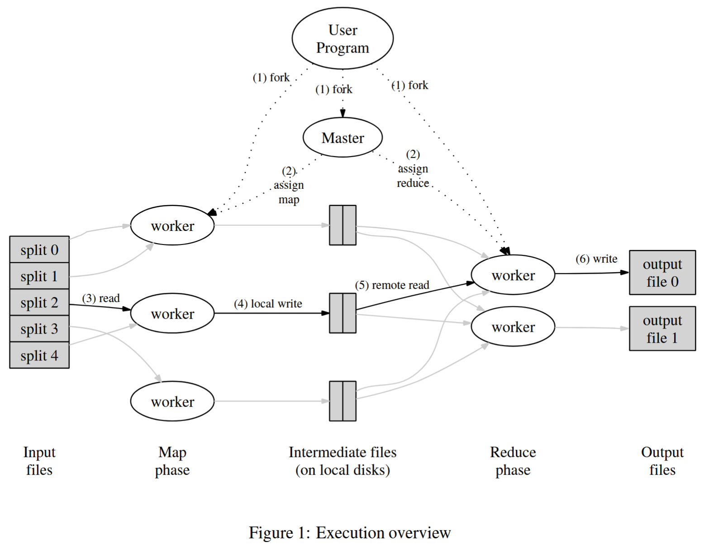

---

title: MapReduce
created: 2025-05-21
update:
comments: true
description: MapReduce 论文笔记
katex: true
tags:

- Distributed System

# categories: Project

---

# Implement with C++ personal

[PROJECT(not test carefully)](https://github.com/tom-jerr/MapReduce)

# 应用的基础架构

- Storage
- Communication (Network)
- Compute

# MapReduce 编程模型

- Map: `map (k1,v1) → list(k2,v2)`
  - input: file or other input pair
  - output: a set of intermediate key/value pairs
- Reduce: `reduce (k2,list(v2)) → list(v2)`
  - input: an intermediate key, a set of values for that key
  - output: a possibly smaller set of values

# MapReduce 工作方式

## 术语

Job。整个 MapReduce 计算称为 Job。

- 对于一个完整的 MapReduce Job，它由一些 Map Task 和一些 Reduce Task 组成\
  Task。每一次 MapReduce 调用称为 Task。\
  Shuffle。MapReduce 中从一种形式数据到另一种数据形式的转换

## 流程

1. MapReduce 启动时，会查找 Map 函数。之后，MapReduce 框架会为每个输入文件运行 Map 函数。这里可以并行运行多个只关注输入和输出的 Map 函数。

1. 所有的输入文件都运行了 Map 函数，并得到了论文中称之为中间输出（intermediate output），也就是每个 Map 函数输出的 key-value 对。此时这些 kv 对在内存 Buffer 中。

1. Buffered KV pairs 会通过分区函数定期刷写到本地磁盘上，本地磁盘会按照 partitioning function 进行逻辑分区分成 R 个区域，kv paris 在磁盘中的位置告知给 master，后续 reduce worker 需要知道 kv pairs 的位置。

1. reduce worker 使用 RPC 获取某个区域的 kv pairs，当 reduce 获取到所有 map worker 的某个分区的 kv pair 后，按照 key 来排序，如果排序无法在内存中完成，使用外部排序来实现。

1. reduce worker 对于每个唯一的 key，将 key 和对应的一系列 values 传递给用户定义的 reduce 函数

1. 当所有 map 任务和 reduce 任务都完成后，master 会唤醒用户进程。

# 故障处理

## Worker Failure

- master 用周期性心跳监听 worker 是否失效。

### task not completed

- 如果 task 没完成，worker 失效，将 task 标记为 idle，交给 master 重新来调度给其他可用的 worker

### task completed

- 已经完成的 map task，worker failed 需要重新执行，因为中间输出在本地文件系统；而完成的 reduce task 不需要，reduce task 的输出在 global file system 中。
- 一旦一个 map task 的 worker 切换，master 会通知这个消息给 reduce worker。

## Master Failure

- 因此，如果主节点失败，我们当前的实施将中止 MAPREDUCE 计算。客户可以检查此条件并根据需要重试 MapReduce 操作。

## Other Failure

### 如果协调器给两个工作节点分配相同的 Map() 任务怎么办?

- Master 将只向 Reduce 工作节点报告其中一个。
  > map task 完成任务会在消息中包含中间输出的 R 个临时文件的名称。如果主 master 收到已经完成的 map task 的完成消息，则忽略该消息。

### 如果协调器给两个工作节点分配相同的 Reduce() 任务怎么办?

- Reduce worker 都会尝试在 GFS 上写入同一个输出文件！原子 GFS 重命名可以防止混合；只有一个完整的文件将可见。
  > reduce task 完成后会将临时输出文件重命名为最终输出文件，依靠基础文件系统提供的原子重命名操作来确保最终文件系统状态仅包含一个由减少任务执行产生的数据

### 如果单个工作节点非常慢——一个“落后者”？

- Master 备份执行剩余的过程中任务。每当 Master 执行或备份执行完成时，任务被标记为完成。

# 瓶颈

- 网络带宽是瓶颈，通过 GFS 将输入文件存储在本地磁盘中
- MapReduce Master 考虑了输入文件的位置信息，并试图在包含相应输入数据复制的计算机上安排 MAP 任务。
- 数据仅仅在 Reduce task 时从 map 磁盘通过网络拷贝到 reduce worker 的机器中。

# 负载均衡

- 任务比工作机器多得多。协调器将新任务分配给完成先前任务的工作器。因此，较快的服务器执行的任务比慢的服务器多。并且慢的服务器分配的工作量较少，从而减少了对接总时间的影响。
