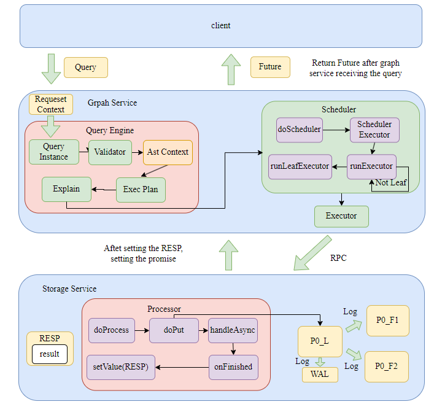

# 一条 nGQL 语句的前世今生

1. 用户在 console 或者通过 sdk 输入 Query 语句到 Graph Service，返回给用户 Future，然后开始执行回调，即下面的整个流程。
2. Graph Service 将 Query、Session、Storage 等打包成 Request Context，随后将 Request Context 打包成 Query Instance 随后开始执行 parse、validate、optimize、execute 整个流程。
   - 在 validate 结束后，首先先获取 statement 对应的 ast context，然后再转换成 plan node tree。
   - 在 Graph Service 获取到 query 并启动整个异步执行流程后，返回 Future 给 client。
3. 然后将 Request Context 传入 Scheduler，用 Scheduler 的内存池按照算子树依次执行每个物理节点计划。
4. 每个物理节点计划在 graphd 中存在一个 executor，实际上里面调用了 storaged 的 processor。
5. 每个 processor 内部从 RocksDB 中获取或者存储 KV 对，然后用结果去设置 promise，graphd 的 future 接收到后继续向上传递结果，直到返回给 client 的结果。

## Client

## Graphd

## Storaged
