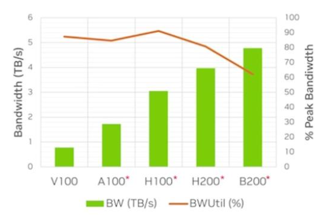
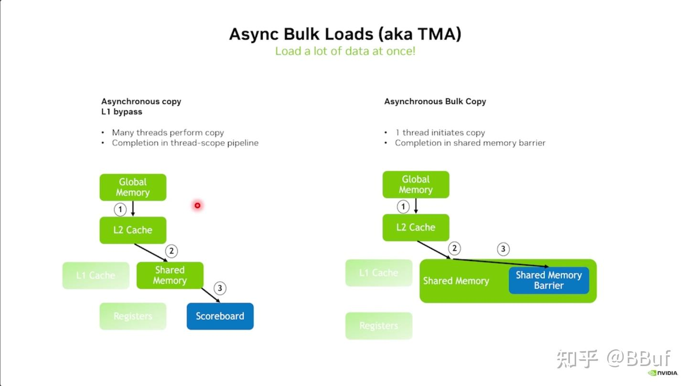

---

title: GPU 内存系统演进：最大化带宽利用与延迟隐藏的技术路径
tags:

- CUDA
created: 2025-11-3

---

# GPU 内存系统演进：最大化带宽利用与延迟隐藏的技术路径

> 参考 [BBuf 的博客](https://zhuanlan.zhihu.com/p/1940749102997566998)

**虽然 GPU 显存带宽越来越大，但单个 SM（Streaming Multiprocessor）的可用带宽提升幅度受限，因此 kernel 想要打满带宽，需要提高每个时刻在 in-flight 的数据量**。这就引出了三个优化路径：**ILP/DLP 并行扩展、异步内存加载、以及启动延迟优化**

> **in-flight 数据** 指的是：在任意时刻，已经被发出但尚未完成的内存访问或计算请求所涉及的数据量

## Little's Law

长期平均顾客数（ _L_ ）等于长期平均有效到达率（ _λ_ ）乘以顾客在系统中停留的平均时间（ _W_ ）。该定律的代数表达式为：
$$
L = \\lambda W
$$
对于 GPU 来说，Little's Law 如下：
$$
bytes-in-flight = bandwidth * mean\\space latency
$$

> bandwidth 和 mean latency 由硬件决定
> 硬件给定带宽与延迟；**软件需把“in-fight字节数”堆到这个水平，才能吃满带宽**

## Motivation(Vector Add Example)

```cpp
__global__ void kernel(float* a, float* b, float* c)
{
	int i = blockId.x * blockDim.x + threadId.x;
	c[i] = a[i] + b[i];
}
```

每个 SM 的 `bytes-in-flight` 计算公式如下：
$$
bytes-in-flight / SM = (#loads/thread) \\times (#bytes/load) \\times (#threads/block) \\times (#blocks/SM)
$$
对于向量加法来说：2 × 4 × 256 × 8 = 16 KB/SM（假设100% Occupancy）

> 简单 kernel 难以打满带宽。**真实带宽在上升但是简单kernel的利用率却在下降**



## How To Increase Bandwidth(Big Scale)

由上面的知识我们知道想把带宽打满，就要提升 `in-flight` 的字节数，这里介绍了三种通用手段

- 提升 ILP：每线程处理多元素、循环展开、增加并行加载（单线程更多独立内存操作）。
- 提升 DLP：用 `float4/uint4` 等、合并访问，单次事务搬更多字节并减少指令（向量化内存操作）。
- 异步数据拷贝：用 `cp.async/TMA` 预取到 shared memory，双/三缓冲，让加载与计算重叠。

### 提升指令并行度 ILP

`#pragma unroll 2` 或手工展开，让一个线程在使用前先发起两对独立加载：`a[i1], b[i1], a[i2], b[i2]`，再进行两次计算与写回。

估算每线程in-fight字节数翻倍：`#loads/thread` = 4，4 × 4B = 16B。in-fight 请求更多，带宽利用更高。

```cpp
__global__ void(int n, 
const float* __restrict__ a,
const float* __restrict__ b,
float* __restrict__ c
)
{
	int tid = blockId.x * blockDim.x + threadId.x;
	int stride = blockDim.x * gridDim.x
	/*
		load a[i1]
		load b[i1]
		load a[i2]
		load b[i2]
		mul a[i1], b[i1]
		store c[i1]
		mul a[i2], b[i2]
		store c[i2]
	*/
	#pragma unroll 2
	for(int i = tid; i < n; i += stride) {
		c[i] = a[i] + b[i];
	}
}
```

### 提升数据并行度 DLP

“向量化全局访存”提升 DLP/bytes‑in‑flight，从而更接近峰值带宽

显式使用向量类型：`float2`、`float4`（对应 64/128‑bit 事务）。或对标量指针做向量指针的强制转换；前提是地址按 8/16B 对齐

每线程 in-fight 字节数翻倍：`#loads/thread` = 4，4 × 4B = 16B

> 一次迭代有 16B 数据在 in-fight，指令/事务更少。需要确保对齐与边界处理（`N%2`、`N%4` 的尾部）、可能的寄存器压力

```cpp
__global__ void(int n, 
const float2* __restrict__ a,
const float2* __restrict__ b,
float2* __restrict__ c
)
{
	int tid = blockId.x * blockDim.x + threadId.x;
	int stride = blockDim.x * gridDim.x
	/*
		load a[i1], a[i2]
		load b[i1], b[i2]

		mul a[i1], b[i1]
		mul a[i2], b[i2]
		
		store c[i1], c[i2]
	*/
	#pragma unroll 2
	for(int i = tid; i < N / 2; i += stride) {
		c[i] = a[i] + b[i];
	}
}
```

新架构要吃满带宽更依赖增大 `bytes‑in‑flight`；**优先尝试向量化到 128bit（保证对齐），再配合适度 unroll**，注意寄存器与占用(Occupancy)权衡。

### 异步加载

即使 ILP/DLP 做到极致，仍受限于同步 load 导致的 **stall（等待内存返回）**。\
因此下一步的提升是：**将内存加载与计算彻底解耦，让内存传输在后台进行。**

#### 原理

通过**跳过寄存器直接将数据从全局内存传输到共享内存**，既节省了宝贵的寄存器资源用于计算，又减少了L1缓存的流量负担，相比传统的同步复制（需要经过寄存器中转），异步复制提供了两种模式——L1绕过模式和L1访问模式，实现了更高效的内存数据传输。


#### Async Load & TMA

- 普通异步加载需要**多个线程参与复制并在线程作用域pipeline中完成同步**
- TMA只需要一个线程启动复制操作，通过**共享内存屏障完成同步控制**，实现了更高效的大块数据传输，减少了线程协调的开销。



#### Example

通过`cuda::memcpy_async`，只需单个线程就能启动大块数据复制，使用共享内存屏障（`cuda::barrier`）进行完成同步控制，

> 当源/目标地址16字节对齐且大小为16的倍数时会**自动使用TMA硬件加速**，否则回退到同步复制模式。

```cpp
#include <cuda/barrier>
__shared__ cuda::barrier<cuda::thread_scope_block> bar;
if(threadIdx.x == 0) {
	init(&bar, blockDim.x);
}
__syncthreads();

if(threadIdx.x == 0) {
	cuda::memmcpy_async(smem_a, a + idx, cuda::aligned_size_t<16>(num_bytes), bar);
	cuda::memmcpy_async(smem_b, b + idx, cuda::aligned_size_t<16>(num_bytes), bar);
}

barrier::arrival_token token = bar.arrive();
bar.wait(cuda::std::move(token));
```

#### Async Load 总结

|                         | 对齐约束                                                     | 额外的好处                           |
| ----------------------- | ------------------------------------------------------------ | ------------------------------------ |
| Synchronous Loads       | None                                                         |                                      |
| Async Loads             | 4, 8 or 16 bytes                                             | + 批处理复制增加 `bytes-in-flight`   |
| Aysnc Bulk Loads        | 16 bytes                                                     | + 批处理复制减少指令数量             |
| Async Bulk Tensor Loads | SMEM 128 bytes; GMEM 16 bytes; strides multiples of 16 bytes | + SMEM swizzling 能力 + 越界处理能力 |

### 总结

从"START HERE"开始，首先判断当前是否有足够的在途字节数（bytes-in-flight），如果足够就无需优化；如果不够，接下来判断数据加载目标是寄存器（REG）还是共享内存（SMEM）——选择寄存器就进行展开/向量化优化，选择共享内存则需要进一步考虑对齐方式和数据块大小：4/8字节对齐时使用异步加载，16字节对齐时根据Tile大小选择策略（小于1KB用普通异步加载，1-2KB之间可选择批量或非批量异步加载，大于2KB则使用异步批量加载）


## How to Decrease Latency(Small scale)

相同问题规模下提高实际达到的带宽，通过减少总运行时间来实现这一目标，而**减少总运行时间需要针对性地降低延迟**

> **kernel 启动延迟**是制约小规模问题性能的主要瓶颈


这里有两种技术(**软件技术**)：一个是 CUDA Graph，通过**图结构化执行多个 kernel**，避免多次 CPU→GPU 的 launch 开销；一个是 PDL，当一个 kernel 运行结束后，硬件自动触发下一个依赖 kernel，不需要 CPU 进行重新 launch

### CUDA Graph

- 一次性构建执行图（Graph Capture），再批量执行（Graph Launch）。
- 适合重复执行的计算图，如推理 pipeline、小 batch 推理、RNN 步进计算。
- 效果：将成百上千个小 kernel 启动合并为一次图执行，显著降低 CPU overhead。

#### Usage

- 捕获阶段（Capture）通过 `cudaStreamBeginCapture` 和 `cudaStreamEndCapture` 将1000次kernel调用序列记录成图结构
- 创建阶段（Create）用 `cudaGraphInstantiate` 将捕获的图转换为可执行的图实例
- 启动阶段（Launch）通过 `cudaGraphLaunch` 一次性提交整个工作负载而不是逐个启动kernel
- 清理阶段（Cleanup）释放相关资源

```cpp
// capture
cudaGraph_t g;
cudaGraphCreate(&g, 0);
cudaStream_t stream;
cudaStreamCreate(&stream);
cudaStreamBeginCapture(stream, cudaStreamCaptureModeGlobal);
for(int i = 0; i < 1000; ++i)
	kernel<<<grid,block,smem_size,stream>>>(params);
cudaStreamEndCapture(stream, &g);

// create
cudaGraphExec_t gEx;
cudaGraphInstantiate(&gEx, g, nullptr, nullptr, 0);

// launch
CUDA_CHECK(cudaGraphLaunch(gEx, stream));
CUDA_CHECK(cudaDeviceSynchronize());

// cleanup
CUDA_CHECK(cudaStreamDestroy(stream));
CUDA_CHECK(cudaGraphDestroy(g));
CUDA_CHECK(cudaGraphExecDestroy(gEx));
```

### Programmatic Dependent Launch(PDL)

这是一种更细粒度的优化方法：在 kernel 函数中需要调用 `cudaGridDependencySynchronize()` 来确保前一个kernel的全局内存写入操作对当前 kernel 可见，而在启动配置中通过设置`cudaLaunchAttributeProgrammaticStreamSerialization` 属性和相关参数来启用这一特性

- **允许kernel提前启动**，即在前一个kernel的全局内存存储操作完全可见之前就开始执行，这样可以实现更多的预取操作
- 保证程序正确性，kernel必须在需要访问前一个kernel写入的数据之前**显式调用`cudaGridDependencySynchronize()` 进行同步**
- **最大化地重叠 kernel 启动和执行**


#### TriggerProgrammaticLaynchCompletion

- 该函数允许块在实际退出之前就向GPU调度器发送完成信号，**只需要块中的一个线程执行该调用即可**
- 改变了传统的kernel间同步模式：正常情况下下一个 kernel 必须等待前一个 kernel 的所有块真正退出后才能启动，而现在下一个 kernel 只需等待所有块都执行了`cudaTriggerProgrammaticLaunchCompletion()` 就可以提前启动，这样就**实现了计算和下一个kernel启动的重叠**，进一步减少了 kernel 间的空闲等待时间

### 总结

- CUDA Graph解决了批量kernel提交的开销问题
- PDL + TriggerProgrammaticLaynchCompletion 通过提前启动和更细粒度的依赖管理以及提前退出减少了kernel间的同步等待时间
- 在最小规模（10KB左右）时，三种组合优化技术可以实现高达3倍的加速比，但随着数据量增加，加速效果逐渐递减，当数据量达到1GB以上时加速比趋近于1倍（即基本无提升）


