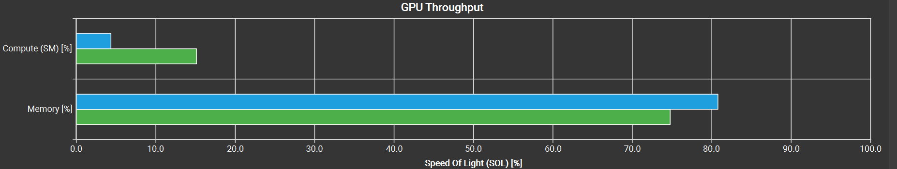

# 一步步实现 CUDA Vector Add 优化

📚 本文将从最基础的 vector add 实现开始，使用 nsight compute 工具进行性能分析寻找瓶颈并一步步进行优化。通过这种方式来学习 CUDA 的编程和优化。

## Prerequisite

### Arithmetic Intensity(AI)

算术强度是衡量一个计算任务（如 CUDA Kernel）是“计算密集型”还是“访存密集型”的核心指标。

**1. 定义：** 它被定义为“总共执行的浮点计算操作次数”与“总共传输的数据字节数”之间的比率。

- **`AI = (总计算操作数) / (总访存字节数)`**
- **单位：** `FLOPs/Byte` (即，每传输一个字节的数据，能对应执行多少次浮点计算)

**2. 为什么它如此重要？** AI 决定了一个程序**理论上的性能瓶颈**。我们可以用它来对比一个程序和一个硬件（GPU）的特性：

- **硬件的“AI”**：GPU 也有一个平衡点，即它的 `峰值计算能力 (GFLOPs/s)` / `峰值内存带宽 (GB/s)
- **程序的 AI**：内核的 `FLOPs / Bytes`。

### Roofline

Roofline 模型（屋顶线模型）是一种用来**分析程序性能瓶颈**（计算受限还是带宽受限）的方法。  
它把**计算性能**（FLOPs/s）和**访存性能**（Bytes/s）联系在一起，。以可视化的方式展示性能上限

$$
Achievable FLOPs=min(AI×Memory BW,Peak FLOPs)
$$


### Stall in NCU

| 类型                       | 代表等待       | 典型瓶颈 | 优化方向      |
| ------------------------ | ---------- | ---- | --------- |
| **All Scoreboard**       | 所有依赖未满足    | 完全等待 | 提高并发、异步访问 |
| **Long Scoreboard**      | DRAM 访问未返回 | 内存延迟 | 优化访存、共享内存 |
| **Short Scoreboard**     | L1/寄存器依赖   | 数据依赖 | 调整指令顺序    |
| **Execution Dependency** | 算术指令结果未就绪  | 运算链长 | 增加 ILP    |
| **Barrier/Branch**       | 同步或分支等待    | 控制流  | 减少分支/同步   |
## Settings

这里测试环境是 RTX 3080 Ti
- 理论带宽约为 912 GB/s
- FP32 peak FLOPs：**34 TFLOPS**
- **最大线程数 / SM：** 1536 个。
- **最大 Warp 数 / SM：** 48 个。

下面除 Benchmark 外，所有的测试 Vector Element 大小为 1024

## 指标

### Compute Throughput

$$\text{Compute Throughput} \approx \frac{\text{Total Instructions Executed (指令总数)}}{\text{Execution Time (执行时间)}}$$
### Memory Throughput

**影响该指标的问题**

#### 1. 指令层级：指令发射效率 (Instruction Issue Efficiency)

这是 `float4` 优化的直接作用域。

- **LSU (Load Store Unit) 压力：**
    
    - **Scalar (`float`):** 搬运同样多的数据，需要发射 **4 倍** 的指令数。这会大量占用前端（Fetch/Decode）带宽，并增加 LSU 维护 In-flight 状态的开销。
        
    - **Vectorized (`float4`):** **单指令高吞吐**。一条指令即可搬运 128-bit 数据。LSU 队列占用少，更容易维持流水线饱和。
        
    - _修正点：_ 即使是标量访问，如果是 Coalesced 的，Warp 也只会生成 1 个 Transaction，但需要 **4 条指令** 才能完成 4 个元素的加载。
        
- **指令发射延迟掩盖 (Issue Latency Hiding)：**
    
    - **气泡问题：** 指令发射有固有延迟。如果每条指令搬运的数据量太小（如 4 Bytes），指令发射的速度可能跟不上内存总线的消耗速度，导致总线出现“空闲气泡”。
        
    - **优势：** `float4` (16 Bytes/thread) 让每次发射的“含金量”更高，更容易填满内存管道。
        

#### 2. 数据层级：内存级并行度 (MLP, Memory Level Parallelism)

这是决定带宽上限的关键软件策略。

- **原理：** HBM 延迟极高 (~600 cycles)。为了掩盖延迟，必须让总线上同时飞着足够多的请求 (In-flight Requests)。
    
- **优化手段：** **循环展开 (Loop Unrolling)**。
    
    - _Bad:_ `Load -> Use -> Load -> Use` (串行依赖，延迟无法掩盖)。
        
    - _Good:_ `Load1 -> Load2 -> Load3 -> Load4 ... -> Use1` (并行发射，一次等待，全部返回)。
        

#### 3. 硬件层级：传输粒度与利用率 (Transaction & Utilization)

即使软件写得好，硬件机制也可能导致浪费。

- **扇区利用率 (Sector Utilization):**
    
    - **机制：** DRAM 到 L2 的最小传输粒度是 **32 Bytes (Sector)**。
        
    - **浪费：** 如果你只读 1 个 Byte (`char`) 且未打包，硬件也被迫搬运 32 Bytes。**有效带宽 (Effective Bandwidth)** 只有 1/32。
        
    - **对策：** 对于小数据类型（INT8/FP16），必须使用打包对齐（Pack Alignment）访问。
        
- **地址对齐 (Address Alignment):**
    
    - **机制：** 硬件要求访问地址按 32B 或 128B 对齐。
        
    - **后果：** 如果指针地址偏移（Misaligned），一次 128 Bytes 的读取可能会跨越两个 128B 块，导致硬件必须发起 **2 个 Transactions**。这会直接导致带宽性能减半。
        

#### 4. 架构层级：物理冲突 (Physical Conflict)

通常由硬件解决，但在极端优化时需注意。

- **分区冲突 (Partition Camping / Channel Conflict):**
    
    - **原理：** 显存被划分为多个物理分区（Memory Controllers）。
        
    - **现象：** 特定的访问步长（Stride，通常是 2 的幂次）可能导致所有请求集中打向同一个 Controller，造成局部拥堵（Serialization），而其他 Controller 空闲。
        
    - **现状：** 现代 GPU (Pascal+) 已通过物理地址哈希（Address Swizzling）极大缓解了此问题，但在写极限 Kernel 时仍需避免完美的 2 的幂次跨度。
## baseline

```cpp
// FP32
// ElementWise Add grid(N/256),
// block(256) a: Nx1, b: Nx1, c: Nx1, c = elementwise_add(a, b)
__global__ void vector_add_kernel(const float *a, const float *b, float *c,
                                  int n) {
  int idx = blockIdx.x * blockDim.x + threadIdx.x;
  if (idx < n) {
    c[idx] = a[idx] + b[idx];
  }
}
```

### 分析

该版本的 vector add，执行一次计算需要三次访存，每次读 4 bytes (read A, read B, write C)

$$
	AI = 1 / (3 \times 4) =1/12\approx 0.083
$$

说明这是一个 **memory-bound** 的程序

- 查看 ncu 的 SLO 我们可以看到
	- Memory Throughput: 75%
	- Compute Throughput: 15%

- 查看 Memory Workload Analysis，我们可以发现我们完全没有用到 shared memory，直接用 L2 Cache 和 L1 Cache


- Kernel 的主要瓶颈是 **`Stall Long Scoreboard`**——即**内存延迟停顿**。GPU 隐藏这种“等待”的唯一机制，就是 **Occupancy (占用率)**

## Optimization V1 -- vectorized access

### 优化

- 矢量化内存访问：我们不再一次读取一个 float，而是同时取 4 个 float，**一个 wrap 里面的所有线程同时获取 4 float，可以变为 LDG.128 一次性获取 128 bit 数据**
- 增加了 ILP
- ⚠ 这里有个 trade-off，如果我们每个 thread 使用了过多的寄存器，那么 SM 上活跃的 Warp 会变少，导致 Occupany 会下降，这同样对性能影响很大

```cpp
// ElementWise Add + Vec4
// grid(N/256), block(256/4)
// a: Nx1, b: Nx1, c: Nx1, c = elementwise_add(a, b)
__global__ void elementwise_add_f32x4_kernel(const float *a, const float *b,
                                         float *c, int n) {
  int idx = (blockIdx.x * blockDim.x + threadIdx.x) * 4;
  if (idx < n) {
    float4 a4 = reinterpret_cast<const float4 *>(a)[idx / 4];
    float4 b4 = reinterpret_cast<const float4 *>(b)[idx / 4];
    float4 c4;
    c4.x = a4.x + b4.x;
    c4.y = a4.y + b4.y;
    c4.z = a4.z + b4.z;
    c4.w = a4.w + b4.w;
    reinterpret_cast<float4 *>(c)[idx / 4] = c4;
  }
}
```

### 结果

- 内存吞吐增加，内存利用率提升至 80 %；计算利用率下降


- Occupancy 从 67% 提升至 100%
### 分析
- **Compute Throughput 下降：** 因为 Vector Add 是 Memory-Bound 的，性能瓶颈在于带宽而非计算。使用 `float4` 并没有改变总的数据传输量，但它通过向量化指令**大幅减少了 SM 需要发射的指令总数**（减少了 Load/Store 指令数和循环开销）。根据 `吞吐率 = 指令数 / 时间`，在时间不变的情况下，指令数减少导致了 Compute Throughput 下降。这实际上意味着**指令效率的提升**。
    
- **关于 Memory 上升：** `float4` 生成了更宽的内存事务（Memory Transactions），减少了 LSU（Load Store Unit）处理请求的开销，并减少了指令发射带来的延迟气泡，从而能更紧密地填满显存带宽，因此 Memory Utilization 不降反升。


## Optimization V2 -- fp16 

### 优化

- FP16 计算使用 CUDA Core 会比 FP32 快近 2 倍

```cpp
// FP16
// ElementWise Add grid(N/256),
// block(256) a: Nx1, b: Nx1, c: Nx1, c = elementwise_add(a, b)
__global__ void elementwise_add_f16_kernel(half *a, half *b, half *c, int N) {
  int idx = blockIdx.x * blockDim.x + threadIdx.x;
  if (idx < N)
    c[idx] = __hadd(a[idx], b[idx]);
}
```

### 结果

- Memory Throughput 下降 (80%→47%)
- 执行时间减少（15.97μs -> 13.38μs）

### 分析

传输的数据量减半，理论上时间应该从 **15.97 变成 8.0 左右**才对，为什么只到了 13.38 ？

**单次搬运粒度变小了，导致总线利用率低。**

- **FP32 + float4 (Baseline):**
    - 每个线程一条指令搬运：$4 \times 4 \text{ Bytes} = \mathbf{16 \text{ Bytes}}$。
        
- **FP16 (Current):**
    - 每个线程一条指令搬运：$\mathbf{2 \text{ Bytes}}$。单次请求太小了。
    - **后果：**
        1. **LSU 拥堵：** 发射指令的频率太高，LSU 处理不过来。
        2. **Sector 浪费：** 显存传输最小单位是 32 Bytes。如果你没做好合并访问（Coalescing），每次为了拿 2 Bytes 都要动用 32 Bytes 的带宽，**有效带宽（Effective Bandwidth）** 就会很低。

所以，我们需要一次搬运更多数据
## Optimization V3 -- fp16 * 8

### 优化

- 一次取 $\mathbf{16 \text{ Bytes}}$ 数据

```cpp
__global__ void elementwise_add_f16x8_kernel(const half *a, const half *b, half *c, int n) {
  int idx = (blockIdx.x * blockDim.x + threadIdx.x) * 8;
  if (idx < n) {
    float4 a4 = reinterpret_cast<const float4 *>(a)[idx / 8];
    float4 b4 = reinterpret_cast<const float4 *>(b)[idx / 8];
    float4 c4;
    half2 *a2 = reinterpret_cast<half2 *>(&a4);
    half2 *b2 = reinterpret_cast<half2 *>(&b4);
    half2 *c2 = reinterpret_cast<half2 *>(&c4);
    c2[0] = __hadd2(a2[0], b2[0]);
    c2[1] = __hadd2(a2[1], b2[1]);
    c2[2] = __hadd2(a2[2], b2[2]);
    c2[3] = __hadd2(a2[3], b2[3]);
    reinterpret_cast<float4 *>(c)[idx / 8] = c4;
  }
}
```

### 结果

- Memory Throughput 上升，达到 66%
- 执行时间减少（13.38μs -> 8.96μs）

### 分析

- **数据量：** $1M \text{ elements} \times 3 \text{ arrays} \times 2 \text{ Bytes} = \mathbf{6 \text{ MB}}$。
- **耗时：** $8.96 \mu s$。
- 理论有效带宽：
    $$\frac{6 \text{ MB}}{8.96 \mu s} = 0.669 \text{ TB/s} \approx \mathbf{670 \text{ GB/s}}$$
- **利用率：** $670 / 912 \approx \mathbf{73\%}$。

#### 为什么没有达到 FP32 * 4 的 Memory Throughput 呢？

**猜想**
- **物理规律：** 内存控制器从收到请求到数据真正占满总线，有一段固定的**物理延迟 (Latency)**。
- **FP32 场景:**
    - 总搬运量 12MB。
    - 耗时 ~16μs。
    - 这个时间足够长，让总线在大部分时间里处于“满载”状态，从而拉高了平均带宽。
- **FP16 场景:**
    - 总搬运量 6MB。
    - 耗时 **8.96μs**。
    - **结果：** Nsight Compute 统计的是**整个生命周期的平均带宽**。因为“满载”的时间段变短了，固定的“延迟”时间段占比变大了，导致平均带宽被拉低了。
#### 验证

验证 10 M 的 vector add，结果：
- 不管是 fp32 * 4 还是 fp16 * 8，Memory Throughput 都有明显增加，说明我们的猜想基本正确


## Summary

vector add 算子是一个典型的 memory-bound 的算子，我们需要尽可能节省内存带宽并提高计算效率。

> 下面我们使用 benchmark 测试所有算子的开销，分析产生这种结果的原因


### 阶段一：小数据量区间 (Latency Bound / 启动开销主导)

- **数据：** S=256, K=256
- **现象1：**
    - **PyTorch (`f32_th`):** 0.0116 ms
    - **Your Kernel (`f32x4`):** 0.0080 ms (**快了 ~30%**)
- **原因：**
	- **通用性 vs 专用性 (Generality vs Specialization)：**
		- **PyTorch:** 为了通用性，PyTorch 的 Element-wise 算子（`TensorIterator`）必须处理各种复杂情况：非连续内存（Strided Memory）、广播（Broadcasting）、类型转换（Type Casting）。即便数据是连续的，它内部的索引计算逻辑也比你复杂的索引计算更重，消耗更多寄存器和指令。
		- **f32x4 Kernel:** 假设了数据绝对连续、无广播。。
			
	- **启动配置 (Launch Heuristics)：**
		- PyTorch 有一套通用的 Block/Grid 计算公式。对于极小形状，它的配置可能不是针对当前 GPU 最优的。而你是针对性调优的。

- **现象2：**

| **内核版本**    | **执行时间 (ms)** |
| ----------- | ------------- |
| `out_f32x4` | **0.0079**    |
| `out_f16x8` | **0.0063**    |
- **原因：**
	- FP16 传输数据更少，读写这几百 KB 数据的**序列化延迟（Serialization Delay）** 差异正好就在微秒级别
		- **FP32x4:** 需要搬运 $65536 \times 4 \text{B} \times 3 \approx \mathbf{786 \text{ KB}}$。
		- **FP16x8:** 需要搬运 $65536 \times 2 \text{B} \times 3 \approx \mathbf{393 \text{ KB}}$。

### 阶段二：中等数据量区间

**关注点：** $S=1024, K=1024$ 左右。

- **现象：**
    - FP32 的时间开始显著增加（0.017ms）。
    - FP16 的时间约为 FP32 的一半甚至更少（0.006ms - 0.011ms）。
        
- **原因：**
    - 数据量开始大到足以掩盖启动开销。
    - 此时 **Memory Bound (带宽限制)** 的特征开始显现，FP16 因为数据量减半，优势开始扩大。
        
### 阶段三：大数据量区间 (Bandwidth Bound)

**关注点：** $S=4096, K=4096$ (最大规模)。

- **现象：** **2 倍线性加速 (FP32 vs FP16)**

| **内核版本**     | **执行时间 (ms)** | **分析** |
| ------------ | ------------- | ------ |
| `out_f32x4`  | **0.240**     | 向量化加载  |
| `out_f16x8`  | **0.122**     | 向量化加载  |

- **原因：** 这证明了这是彻底的 **Memory Bound** 场景。FP16 的数据量是 16-bit，FP32 是 32-bit。**计算单元（ALU）在这里完全是在等数据**。
        
## 附录

```shell
-------------------------------------------------------------------------------------
                                        S=256, K=256
         out_f32x4: [1.97265029, -1.30800462], time:0.00798702ms
        out_f32_th: [1.97265029, -1.30800462], time:0.01163483ms
-------------------------------------------------------------------------------------
         out_f16x8: [1.97265625, -1.30859375], time:0.00634193ms
        out_f16_th: [1.97265625, -1.30859375], time:0.01137257ms
-------------------------------------------------------------------------------------
-------------------------------------------------------------------------------------
                                        S=256, K=512
         out_f32x4: [-0.01563577, -0.42283049], time:0.00610352ms
        out_f32_th: [-0.01563577, -0.42283049], time:0.01132488ms
-------------------------------------------------------------------------------------
         out_f16x8: [-0.015625, -0.42285156], time:0.00598431ms
        out_f16_th: [-0.015625, -0.42285156], time:0.01120567ms
-------------------------------------------------------------------------------------
-------------------------------------------------------------------------------------
                                        S=256, K=1024
         out_f32x4: [-1.84007502, 0.55290109], time:0.00596046ms
        out_f32_th: [-1.84007502, 0.55290109], time:0.01132488ms
-------------------------------------------------------------------------------------
         out_f16x8: [-1.83984375, 0.55273438], time:0.00605583ms
        out_f16_th: [-1.83984375, 0.55273438], time:0.01125336ms
-------------------------------------------------------------------------------------
-------------------------------------------------------------------------------------
                                        S=256, K=2048
         out_f32x4: [1.10615909, 1.60974789], time:0.00636578ms
        out_f32_th: [1.10615909, 1.60974789], time:0.01173019ms
-------------------------------------------------------------------------------------
         out_f16x8: [1.10644531, 1.609375], time:0.00603199ms
        out_f16_th: [1.10644531, 1.609375], time:0.01103878ms
-------------------------------------------------------------------------------------
-------------------------------------------------------------------------------------
                                        S=256, K=4096
         out_f32x4: [2.09329867, 1.75160038], time:0.01795292ms
        out_f32_th: [2.09329867, 1.75160038], time:0.01842976ms
-------------------------------------------------------------------------------------
         out_f16x8: [2.09375, 1.75195312], time:0.00665188ms
        out_f16_th: [2.09375, 1.75195312], time:0.01180172ms
-------------------------------------------------------------------------------------
-------------------------------------------------------------------------------------
                                        S=512, K=256
         out_f32x4: [2.45374489, 0.12144065], time:0.00607967ms
        out_f32_th: [2.45374489, 0.12144065], time:0.01118183ms
-------------------------------------------------------------------------------------
         out_f16x8: [2.453125, 0.12158203], time:0.00586510ms
        out_f16_th: [2.453125, 0.12158203], time:0.01101494ms
-------------------------------------------------------------------------------------
-------------------------------------------------------------------------------------
                                        S=512, K=512
         out_f32x4: [-0.09491166, -1.25630379], time:0.00629425ms
        out_f32_th: [-0.09491166, -1.25630379], time:0.01106262ms
-------------------------------------------------------------------------------------
         out_f16x8: [-0.09472656, -1.25585938], time:0.00588894ms
        out_f16_th: [-0.09472656, -1.25585938], time:0.01108646ms
-------------------------------------------------------------------------------------
-------------------------------------------------------------------------------------
                                        S=512, K=1024
         out_f32x4: [0.18375367, 0.85552824], time:0.00627041ms
        out_f32_th: [0.18375367, 0.85552824], time:0.01142025ms
-------------------------------------------------------------------------------------
         out_f16x8: [0.18408203, 0.85546875], time:0.00581741ms
        out_f16_th: [0.18408203, 0.85546875], time:0.01120567ms
-------------------------------------------------------------------------------------
-------------------------------------------------------------------------------------
                                        S=512, K=2048
         out_f32x4: [-0.19396098, 1.58398294], time:0.01785755ms
        out_f32_th: [-0.19396098, 1.58398294], time:0.01859665ms
-------------------------------------------------------------------------------------
         out_f16x8: [-0.19384766, 1.58398438], time:0.00648499ms
        out_f16_th: [-0.19384766, 1.58398438], time:0.01170635ms
-------------------------------------------------------------------------------------
-------------------------------------------------------------------------------------
                                        S=512, K=4096
         out_f32x4: [-2.16418219, -0.03980557], time:0.03359318ms
        out_f32_th: [-2.16418219, -0.03980557], time:0.03430843ms
-------------------------------------------------------------------------------------
         out_f16x8: [-2.1640625, -0.03979492], time:0.01790524ms
        out_f16_th: [-2.1640625, -0.03979492], time:0.01864433ms
-------------------------------------------------------------------------------------
-------------------------------------------------------------------------------------
                                        S=1024, K=256
         out_f32x4: [0.90988386, 0.60685712], time:0.00605583ms
        out_f32_th: [0.90988386, 0.60685712], time:0.01113415ms
-------------------------------------------------------------------------------------
         out_f16x8: [0.91015625, 0.60644531], time:0.00584126ms
        out_f16_th: [0.91015625, 0.60644531], time:0.01084805ms
-------------------------------------------------------------------------------------
-------------------------------------------------------------------------------------
                                        S=1024, K=512
         out_f32x4: [-0.33057773, 1.10878396], time:0.00631809ms
        out_f32_th: [-0.33057773, 1.10878396], time:0.01146793ms
-------------------------------------------------------------------------------------
         out_f16x8: [-0.33056641, 1.10839844], time:0.00598431ms
        out_f16_th: [-0.33056641, 1.10839844], time:0.01108646ms
-------------------------------------------------------------------------------------
-------------------------------------------------------------------------------------
                                        S=1024, K=1024
         out_f32x4: [1.78476286, 2.11524606], time:0.01773834ms
        out_f32_th: [1.78476286, 2.11524606], time:0.01845360ms
-------------------------------------------------------------------------------------
         out_f16x8: [1.78515625, 2.11523438], time:0.00653267ms
        out_f16_th: [1.78515625, 2.11523438], time:0.01168251ms
-------------------------------------------------------------------------------------
-------------------------------------------------------------------------------------
                                        S=1024, K=2048
         out_f32x4: [-0.7581079, 2.17606115], time:0.03349781ms
        out_f32_th: [-0.7581079, 2.17606115], time:0.03435612ms
-------------------------------------------------------------------------------------
         out_f16x8: [-0.7578125, 2.17578125], time:0.01788139ms
        out_f16_th: [-0.7578125, 2.17578125], time:0.01869202ms
-------------------------------------------------------------------------------------
-------------------------------------------------------------------------------------
                                        S=1024, K=4096
         out_f32x4: [-1.73245358, 0.14577931], time:0.06384850ms
        out_f32_th: [-1.73245358, 0.14577931], time:0.06377697ms
-------------------------------------------------------------------------------------
         out_f16x8: [-1.73242188, 0.14550781], time:0.03356934ms
        out_f16_th: [-1.73242188, 0.14550781], time:0.03452301ms
-------------------------------------------------------------------------------------
-------------------------------------------------------------------------------------
                                        S=2048, K=256
         out_f32x4: [-0.57417279, -2.21091771], time:0.00746250ms
        out_f32_th: [-0.57417279, -2.21091771], time:0.01170635ms
-------------------------------------------------------------------------------------
         out_f16x8: [-0.57470703, -2.2109375], time:0.00593662ms
        out_f16_th: [-0.57470703, -2.2109375], time:0.01111031ms
-------------------------------------------------------------------------------------
-------------------------------------------------------------------------------------
                                        S=2048, K=512
         out_f32x4: [-1.0632087, -1.56113195], time:0.01783371ms
        out_f32_th: [-1.0632087, -1.56113195], time:0.01852512ms
-------------------------------------------------------------------------------------
         out_f16x8: [-1.06347656, -1.56054688], time:0.00619888ms
        out_f16_th: [-1.06347656, -1.56054688], time:0.01146793ms
-------------------------------------------------------------------------------------
-------------------------------------------------------------------------------------
                                        S=2048, K=1024
         out_f32x4: [1.92093897, 1.09060407], time:0.03349781ms
        out_f32_th: [1.92093897, 1.09060407], time:0.03435612ms
-------------------------------------------------------------------------------------
         out_f16x8: [1.92089844, 1.09082031], time:0.01776218ms
        out_f16_th: [1.92089844, 1.09082031], time:0.01859665ms
-------------------------------------------------------------------------------------
-------------------------------------------------------------------------------------
                                        S=2048, K=2048
         out_f32x4: [1.64275861, -0.26722771], time:0.06289482ms
        out_f32_th: [1.64275861, -0.26722771], time:0.06389618ms
-------------------------------------------------------------------------------------
         out_f16x8: [1.64257812, -0.26708984], time:0.03345013ms
        out_f16_th: [1.64257812, -0.26708984], time:0.03454685ms
-------------------------------------------------------------------------------------
-------------------------------------------------------------------------------------
                                        S=2048, K=4096
         out_f32x4: [-1.02567387, -0.87697959], time:0.12266636ms
        out_f32_th: [-1.02567387, -0.87697959], time:0.12316704ms
-------------------------------------------------------------------------------------
         out_f16x8: [-1.02539062, -0.87695312], time:0.06325245ms
        out_f16_th: [-1.02539062, -0.87695312], time:0.06403923ms
-------------------------------------------------------------------------------------
-------------------------------------------------------------------------------------
                                        S=4096, K=256
         out_f32x4: [-0.12928185, 1.02175057], time:0.01778603ms
        out_f32_th: [-0.12928185, 1.02175057], time:0.01845360ms
-------------------------------------------------------------------------------------
         out_f16x8: [-0.12915039, 1.02148438], time:0.00731945ms
        out_f16_th: [-0.12915039, 1.02148438], time:0.01139641ms
-------------------------------------------------------------------------------------
-------------------------------------------------------------------------------------
                                        S=4096, K=512
         out_f32x4: [0.10359669, 1.60598481], time:0.03335476ms
        out_f32_th: [0.10359669, 1.60598481], time:0.03447533ms
-------------------------------------------------------------------------------------
         out_f16x8: [0.10351562, 1.60546875], time:0.01790524ms
        out_f16_th: [0.10351562, 1.60546875], time:0.01866817ms
-------------------------------------------------------------------------------------
-------------------------------------------------------------------------------------
                                        S=4096, K=1024
         out_f32x4: [0.50812161, 2.05591512], time:0.06299019ms
        out_f32_th: [0.50812161, 2.05591512], time:0.06392002ms
-------------------------------------------------------------------------------------
         out_f16x8: [0.5078125, 2.0546875], time:0.03347397ms
        out_f16_th: [0.5078125, 2.0546875], time:0.03452301ms
-------------------------------------------------------------------------------------
-------------------------------------------------------------------------------------
                                        S=4096, K=2048
         out_f32x4: [0.44834208, -2.61600804], time:0.12195110ms
        out_f32_th: [0.44834208, -2.61600804], time:0.12311935ms
-------------------------------------------------------------------------------------
         out_f16x8: [0.44824219, -2.6171875], time:0.06358624ms
        out_f16_th: [0.44824219, -2.6171875], time:0.06401539ms
-------------------------------------------------------------------------------------
-------------------------------------------------------------------------------------
                                        S=4096, K=4096
         out_f32x4: [0.87607241, -2.12679267], time:0.24068356ms
        out_f32_th: [0.87607241, -2.12679267], time:0.24130344ms
-------------------------------------------------------------------------------------
         out_f16x8: [0.87597656, -2.12695312], time:0.12204647ms
        out_f16_th: [0.87597656, -2.12695312], time:0.12366772ms
-------------------------------------------------------------------------------------
```
