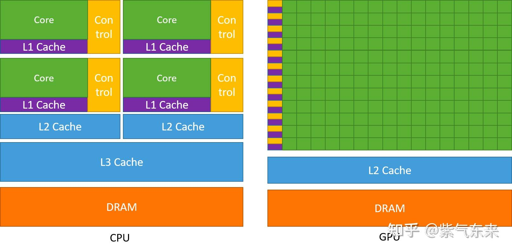
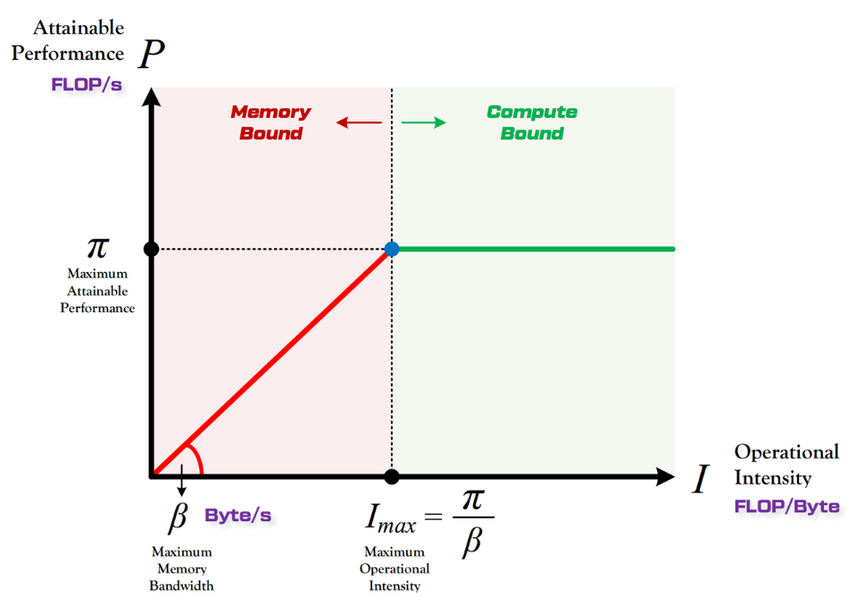
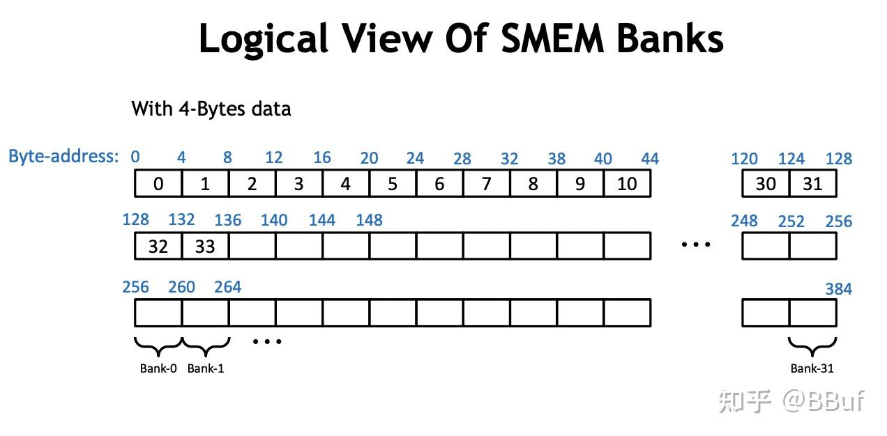

---

title: CUDA Optimization for LLM Inference
tags:

- CUDA

created: 2025-11-3
description: 在大规模语言模型（LLM）推理中，优化 CUDA 代码对于提升性能和效率至关重要。本文档介绍了一些关键的 CUDA 优化技术，帮助开发者更好地利用 GPU 资源进行 LLM 推理。
# cover: /img/h100sm.png
---

# CUDA Optimization for LLM Inference

## Overview

在大规模语言模型（LLM）推理中，优化 CUDA 代码对于提升性能和效率至关重要。本文档介绍了一些关键的 CUDA 优化技术，帮助开发者更好地利用 GPU 资源进行 LLM 推理。这里我们将介绍 Transformer-based 自回归预训练模型推理用到的算子的优化方法。这些优化的方法也适用于其他算子。

我们主要关注以下几个方面：

1. GPU 硬件架构(Hirerarchy Memory, SM, Warp 等)
1. CUDA 计算模型(Thread, Thread Block, Grid 等)
1. CUDA Kernel 性能调优(Nsight Compute, Occupancy)
1. CUDA 常用优化技巧(Double buffering, Memory Coalescing, Overcoming Bank Conflict 等)
1. Transformer 内部算子优化
   - Matrix Multiplication 优化
   - Softmax 优化
   - LayerNorm 优化
   - Self-Attention 优化
   - Flash Attention 优化

## GPU 硬件架构

GPU 以 Throughput 为设计目标，和 CPU 有很大的不同。

- GPU 中虽有**缓存结构但是数量**少。 因为要减少指令访问缓存的次数。
- GPU 中**控制单元非常简单**。 控制单元中没有分支预测机制和数据转发机制，对于复杂的指令运算就会比较慢。
- GPU 的**运算单元 (Core) 非常多**，采用长延时流水线以实现高吞吐量。 每一行的运算单元的控制器只有一个，意味着每一行的运算单元使用的指令是相同的，不同的是它们的数据内容。那么这种整齐划一的运算方式使得 GPU 对于那些控制简单但运算高效的指令的效率显著增加。[^cuda1]



### Streaming Multiprocessor (SM) (Based on H100 Hopper Architecture)

NVIDIA H100 GPU 基于 Hopper 架构，其 SM 设计为了极致的 AI 和 HPC 性能进行了重大升级。一个 H100 SM 包含以下核心组件：

- **4 个处理块 (SMSP - SM Sub-Partitions):**

  - **架构设计:** 为了提高指令流水线的并行度和资源利用率，每个 SM 被物理划分为 4 个独立的处理块（SMSP）。
  - **资源隔离:** 每个 SMSP 拥有自己独立的指令调度器、寄存器文件和计算单元。这意味着它们可以独立地调度和执行 Warp，互不干扰。
  - **组件详情:**
    - **Warp Scheduler & Dispatch Unit:** 每个 SMSP 有一个 Warp 调度器。它负责从分配给该 SMSP 的 Warp 池中选择一个 Ready 的 Warp，并将其下一条指令分发到执行单元。这是 GPU **延迟掩盖机制的核心**。
    - **Register File:** 每个 SMSP 配备 64K 个 32-bit 寄存器（整个 SM 共 256K）。寄存器是 GPU 上速度最快的存储，用于保存线程的私有变量。巨大的寄存器文件支持了高并发线程数（Occupancy）。
    - **L0 Instruction Cache:** 缓存指令，减少取指延迟。
    - **Math Units (计算单元):**
      - **32 FP32 Cores (CUDA Cores):** 负责标准的单精度浮点运算。
      - **16 INT32 Cores:** 负责整数运算，通常用于地址计算、循环控制等。Hopper 架构允许 FP32 和 INT32 指令并发执行，提高了流水线效率。
      - **16 FP64 Cores:** 双精度浮点单元。H100 的 FP64 性能是 A100 的 3 倍，这对科学计算（HPC）至关重要。
      - **1 4th Gen Tensor Core:** 这是 AI 推理和训练的动力源。
        - **多精度支持:** 支持 FP8, FP16, BF16, TF32, FP64。FP8 是 Hopper 的一大亮点，吞吐量是 FP16 的两倍。
        - **稀疏性 (Sparsity):** 支持结构化稀疏（Structured Sparsity），可进一步提升 2 倍性能。
        - **异步执行:** 与 CUDA Cores 异步执行，极大提升了矩阵运算效率。

- **Shared Memory / L1 Data Cache:**

  - **统一架构:** H100 SM 拥有 **256 KB** 的统一 L1/Shared Memory（相比 A100 的 192 KB 提升了 33%）。这块内存可以根据需要被配置为 L1 缓存或 Shared Memory。
  - **高带宽:** 它是片上内存，带宽极高，延迟极低，是线程块内数据交换的桥梁。
  - **Distributed Shared Memory (DSMEM):** 这是 Hopper 引入的革命性特性。
    - **Thread Block Cluster:** 允许将多个 Thread Block 组成一个 Cluster（例如 8 个 Block）。
    - **直接访问:** Cluster 内的所有线程可以直接访问其他 SM 上的 Shared Memory，就像访问本地 Shared Memory 一样（虽然延迟稍高一点点）。这打破了传统 CUDA 编程中 "Shared Memory 仅限 Block 内共享" 的限制，使得跨 Block 的数据复用和通信成为可能。

- **Tensor Memory Accelerator (TMA):**

  - **定义:** 一个专用的硬件直接内存访问 (DMA) 引擎。
  - **功能:** 负责在 Global Memory 和 Shared Memory 之间高效、异步地搬运数据。
  - **优势:**
    - **解放 SM:** 传统的数据加载需要 CUDA Core 执行 Load 指令，占用寄存器和 ALU 资源。TMA 接管了这项工作，让 SM 专注于计算。
    - **降低寄存器压力:** 数据直接从 Global Memory 写入 Shared Memory，不经过寄存器文件。
    - **简化编程:** 只需要配置好 Copy Descriptor，TMA 就会自动处理复杂的地址计算（如矩阵块的 stride 访问）和越界检查。
    - **支持 mbarrier:** 与异步屏障 (mbarrier) 结合，实现高效的流水线并行。


#### Functional Units (H100 Specifics)

H100 的功能单元设计旨在最大化并发性和吞吐量：

- **并发流水线 (Concurrent Pipelines):**
  - H100 的 SM 包含独立的 FP32, INT32 和 FP64 数据路径。
  - **FP32 & INT32 并发:** 允许在同一个周期内同时发射 FP32 指令和 INT32 指令。这对于循环索引更新（INT32）和核心计算（FP32）并行执行非常有效。
  - **FP64 性能:** H100 的 FP64 吞吐量是 FP32 的 1/2，相比 A100 大幅提升，适合科学计算。
- **Tensor Core (4th Gen):**
  - 独立于 CUDA Cores 的专用流水线。
  - 支持 **异步执行**，即 Tensor Core 在进行矩阵运算时，CUDA Cores 可以同时处理其他无关指令（如地址计算、逻辑判断）。

#### Warp Contexts & Occupancy

- **Warp Contexts:** 每个 SM 维护着大量 Warp 的上下文（PC, 寄存器状态等）。H100 上每个 SM 最多支持 **64 个 Warp**（即 2048 个线程）。
- **Occupancy (占用率):**
  - 指当前 SM 上实际激活的 Warp 数量与最大支持数量的比值。
  - **寄存器压力:** H100 每个 SM 有 64K (32-bit) 寄存器。如果每个线程使用的寄存器过多，SM 就无法同时容纳足够多的 Warp，导致 Occupancy 下降，从而无法有效隐藏延迟。
  - **Shared Memory 限制:** 同样，如果 Block 消耗过多的 Shared Memory，也会限制 SM 上能并发运行的 Block 数量。

#### Warp Scheduler (H100)

H100 的 Warp 调度器更加智能和高效：

- **独立调度器:** 每个 SMSP (SM Sub-Partition) 都有自己的 Warp Scheduler。这意味着一个 SM 每个周期可以同时从 4 个 SMSP 中各发射指令，实现 4 路并发。
- **Latency Hiding:**
  - 调度器的核心任务是**零开销上下文切换**。
  - 当当前 Warp 遇到长延迟操作（如 Global Memory 读取或 Tensor Core 计算）而阻塞时，调度器会在**下一个时钟周期**立即切换到另一个“准备就绪”的 Warp 执行。
  - **H100 优势:** 配合 TMA (Tensor Memory Accelerator) 的异步拷贝，SM 可以挂起等待数据的 Warp，转而执行计算密集的 Warp，实现计算与访存的完美重叠。
- **Warp Divergence:**
  - 依然遵循 SIMT (Single Instruction, Multiple Threads) 模型。
  - 如果 Warp 内线程进入不同的 `if-else` 分支，硬件会串行执行不同路径，并使用 **Active Mask** 屏蔽不应执行的线程。
  - 尽量避免 Warp 内的分支分化，或者使用 `__shfl_sync` 等指令在 Warp 内交换数据以统一控制流。

### GPU Memory Hierarchy (H100 Enhanced)

H100 的内存体系结构为了喂饱强大的 Tensor Cores 进行了全面升级，核心在于**更高的带宽**和**更灵活的数据共享**。

- **Registers (寄存器):**

  - **速度:** 最快，单周期访问。
  - **容量:** 每个 SM 拥有 256KB 的寄存器文件。
  - **优化:** 编译器会尽可能将频繁访问的变量放入寄存器。如果寄存器溢出 (Spill)，数据会被放入 Local Memory (实际上是 Global Memory)，导致性能急剧下降。

- **L1 Data Cache / Shared Memory (Unified):**

  - **统一架构:** 每个 SM 拥有 **256 KB** 的高速片上内存。
  - **可配置:** 可以根据 Kernel 需求灵活划分为 L1 Cache 和 Shared Memory
  - **DSMEM (Distributed Shared Memory):** 允许一个 Thread Block Cluster 内的 SM 直接通过 SM-to-SM 网络访问彼此的 Shared Memory。这使得 Shared Memory 的有效容量在逻辑上扩大了数倍。

- **L2 Cache:**

  - **容量:** H100 拥有巨大的 **50 MB** L2 Cache。
  - **作用:** 所有 SM 共享。它是连接高速 SM 和低速 HBM 的关键缓冲。由于原子操作 (Atomics) 通常在 L2 上执行，更大的 L2 意味着更少的 DRAM 访问冲突。

- **HBM3 (Global Memory):**

  - **带宽:** H100 搭载 HBM3 显存，带宽高达 **3.35 TB/s**。
  - **TMA:** 配合 Tensor Memory Accelerator，数据可以“流”进 Shared Memory，而不需要 CUDA Cores 逐个指令搬运。

- **Constant / Texture Memory:** 依然存在，用于只读数据的缓存优化，但在现代计算密集型 Kernel 中，其角色逐渐被 L1 Cache 和 Shared Memory 覆盖。


:laughing:**Summary (H100 Perspective)**

| 层级              | 类型               | H100 特性                            | 延迟 (Cycles)                |
| :---------------- | :----------------- | :----------------------------------- | :--------------------------- |
| **Registers**     | 私有               | 256KB/SM, 极速                       | ~0                           |
| **Shared Memory** | Block/Cluster 共享 | **DSMEM (跨 SM 访问)**, TMA 异步加载 | ~20-30 (Local), ~50 (Remote) |
| **L1 Cache**      | SM 私有            | 与 Shared Memory 统一配置            | ~30                          |
| **L2 Cache**      | 全局共享           | **50MB 超大容量**, 原子操作中心      | ~200                         |
| **HBM3 (Global)** | 全局共享           | **3TB/s+ 带宽**, TMA 直通            | ~400-600+                    |

### Warp (H100 Scheduling & Execution)

虽然程序员编写的是单个线程的代码，但在硬件层面，H100 依然将线程组织成固定大小（32 个）的束，称为 **Warp**。Warp 是 SM 上调度和执行的真正基本单位。

- **SIMT 与 独立线程调度:**

  - H100 延续了 Volta 引入的独立线程调度机制。每个线程都有自己的程序计数器 (PC) 和调用栈。
  - 尽管如此，为了性能，Warp 内的 32 个线程通常依然是同步执行相同指令的 (SIMT)。
  - **Warp Divergence:** 如果 Warp 内线程进入不同的分支，硬件会串行执行不同路径。虽然独立调度避免了死锁风险，但**性能惩罚依然存在**，因为硬件单元在某一时刻只能服务于一种指令路径。

- **Dispatch Speed:**

  - H100 的每个 SM 划分为 4 个 SMSP，每个 SMSP 都有独立的 Warp Scheduler。
  - 这意味着一个 SM 在每个时钟周期可以同时从 4 个不同的 Warp 中发射指令，极大地提高了指令吞吐量。

- **延迟隐藏:**

  - 传统的延迟隐藏依赖于“上下文切换”：当 Warp A 等待内存时，切换到 Warp B。
  - **H100 版本:** 结合 **TMA** 和 **异步拷贝 (`cp.async`)**，Warp 不再需要为了搬运数据而“停顿”在 Load 指令上。Warp 可以发出异步拷贝命令，然后继续执行其他计算任务（如 GEMM），直到真正需要数据时才在 `mbarrier` 上等待。这使得计算和访存的重叠 (Overlap) 达到了新的高度。

- **寄存器压力与 Occupancy:**

  - H100 每个 SM 有 64K 寄存器。
  - 为了维持足够的 Active Warps 来隐藏延迟，必须严格控制每个 Kernel 使用的寄存器数量。如果每个线程使用过多寄存器，SM 上能同时驻留的 Warp 就会减少，导致调度器“无 Warp 可切”，流水线出现气泡。

## CUDA 计算模型[^cuda2]

CUDA 将计算任务组织成一个三级层次结构 。这是一个由程序员创建的、用于组织问题的**逻辑层次**，而非硬件的直接体现 。

- **线程 (Thread)**：最基本的执行单位。单个线程执行一个 Kernel 函数的实例 。每个线程在其所属的线程块内拥有一个唯一的 ID(threadIdx)
- **线程块(Thread Block)**：一组可以相互协作的线程（在现代架构上最多 1024 个）。一个块内的所有线程可以通过高速的片上   共享内存共享数据，并能通过`__syncthreads()`来协调它们的执行 。每个线程块在其所属的 Grid 内也拥有一个唯一的 ID(blockIdx)
- **网格 (Grid)**：为执行单个 Kernel 而启动的所有线程块的集合 。一个 Grid 内的所有线程都可以访问同一个全局内存空间。Grid 内的线程块被假定为独立执行，且执行顺序不确定；它们之间没有直接的同步机制。

线程块和网格可以被组织成一维、二维或三维的结构，这为将计算任务映射到向量、矩阵、体数据等数据结构上提供了极大的便利 。


### 与硬件的对应

#### Thread

- 在某一时刻，一个 CUDA core 执行一个线程的指令。

- :warning: 实际上同一个 CUDA core 会在多个 thread 之间分时复用，因为线程数远多于核心数

#### Thread Block

- 一个 block 被分配到一个 SM (Streaming Multiprocessor) 上执行。
- 一个 block 中的线程会被分成若干 warp。SM 内有多个资源（寄存器文件、共享内存），这些资源在不同 block 之间分配。

#### Grid

- 一个 grid 对应一次 kernel 启动（Launch）。
- Grid 中的 block 会被分配到不同的 SM 执行。
- GPU 上的 GPC（Graphics Processing Cluster） 或 TPC（Texture Processing Cluster） 层级会参与全局调度。

### Kernel 执行流程

- 当一个 Kernel 被启动时，由硬件调度器将 Grid 中的所有线程块分配到 GPU 上可用的 SM 中
- 一个 Thread Block 会被完整地分配给一个 SM，并在其上完整地执行。在其生命周期内，它不会被迁移到其他 SM
- 一个 SM 可以并发地执行多个 Thread Block，前提是它拥有足够的资源（如寄存器、共享内存）来容纳这些线程块
- 在 SM 内部，一个 Thread Block 的所有线程被划分为若干个 Warp（每组 32 个线程）。这些 Warp 才是被 SM 的 Warp 调度器实际调度执行的单元 。

这个映射关系是层级化的：`Grid -> GPU`，`Block -> SM`，`Thread -> Warp -> CUDA核心`

## Roofline 模型

Roofline 模型（屋顶线模型）是一种用来**分析程序性能瓶颈**（计算受限还是带宽受限）的方法。\
它把**计算性能**（FLOPs/s）和**访存性能**（Bytes/s）联系在一起，。以可视化的方式展示性能上限

$$
Achievable \\space FLOPs=min(AI×Memory\\space BW,Peak FLOPs)
$$



## CUDA Kernel 性能调优

根据 Roofline 模型，算子分为 Compute-Bound 和 Memory-Bound 型，所以我们需要分开讨论，但实际上在优化过程中，这两种瓶颈会交替出现😭

### Memory-Bound

#### 1. 指令层级：指令发射效率 (Instruction Issue Efficiency)

- **LSU (Load Store Unit) 压力：**

  - **Scalar (`float`):** 搬运同样多的数据，需要发射 **4 倍** 的指令数。这会大量占用带宽，并增加 LSU 维护 In-flight 状态的开销。

  - **Vectorized (`float4`):** **单指令高吞吐**。一条指令即可搬运 128-bit 数据。LSU 队列占用少，更容易维持流水线饱和。


- **指令发射延迟掩盖 (Issue Latency Hiding)：**

  - **气泡问题：** 指令发射有固有延迟。如果每条指令搬运的数据量太小（如 4 Bytes），指令发射的速度可能跟不上内存总线的消耗速度，导致总线出现“空闲气泡”。

#### 2. 数据层级：内存级并行度 (MLP, Memory Level Parallelism)

这是决定带宽上限的关键软件策略。

- **原理：** HBM 延迟极高 (~600 cycles)。为了掩盖延迟，必须让总线上同时飞着足够多的请求 (In-flight Requests)。

- **优化手段：** **循环展开 (Loop Unrolling)**。

  - _Bad:_ `Load -> Use -> Load -> Use` (串行依赖，延迟无法掩盖)。

  - _Good:_ `Load1 -> Load2 -> Load3 -> Load4 ... -> Use1` (并行发射，一次等待，全部返回)。

#### 3. 硬件层级：传输粒度与利用率 (Transaction & Utilization)

即使软件写得好，硬件机制也可能导致浪费。

- **扇区利用率 (Sector Utilization):**

  - **机制：** DRAM 到 L2 的最小传输粒度是 **32 Bytes (Sector)**。

  - **浪费：** 如果只读 1 个 Byte (`char`) 且未打包，硬件也被迫搬运 32 Bytes。**有效带宽 (Effective Bandwidth)** 只有 1/32。

  - **对策：** 对于小数据类型（INT8/FP16），必须使用打包对齐（Pack Alignment）访问。

- **地址对齐 (Address Alignment):**

  - **机制：** 硬件要求访问地址按 32B 或 128B 对齐。

  - **后果：** 如果指针地址偏移（Misaligned），一次 128 Bytes 的读取可能会跨越两个 128B 块，导致硬件必须发起 **2 个 Transactions**。这会直接导致带宽性能减半。

#### 4. 架构层级：物理冲突 (Physical Conflict)

通常由硬件解决，但在极端优化时需注意。

- **分区冲突 (Partition Camping / Channel Conflict):**

  - **原理：** 显存被划分为多个物理分区（Memory Controllers）。

  - **现象：** 特定的访问步长（Stride，通常是 2 的幂次）可能导致所有请求集中打向同一个 Controller，造成局部拥堵（Serialization），而其他 Controller 空闲。

  - **现状：** 现代 GPU (Pascal+) 已通过物理地址哈希（Address Swizzling）极大缓解了此问题，但在写极限 Kernel 时仍需避免完美的 2 的幂次跨度。

#### 5. Asynchronous Copy (cp.async)

在 Ampere (A100) 和 Hopper (H100) 架构上，为了极致的 Double/Multi-stage Buffering，我们使用异步拷贝指令。

- **机制：** `cp.async` (PTX: `cp.async.ca.shared.global`) 允许数据直接从 Global Memory 传输到 Shared Memory。
- **优势：**
  - **Bypass Register File:** 数据不经过寄存器，直接进入 Shared Memory，极大降低寄存器压力 (Register Pressure)。
  - **Non-blocking:** 发出指令后，线程可以继续执行其他计算（如计算上一块数据的 GEMM），实现计算与访存的完美流水线掩盖。
- **流水线 (Pipeline):**
  - `cp.async.commit_group()`: 提交一组拷贝任务。
  - `cp.async.wait_group<N>()`: 等待直到只剩下 N 组未完成。

### Compute-Bound

#### 1. 使用 Tensor Cores (WMMA / MMA)

这是现代 LLM 推理加速的**绝对核心**。在 LLM 推理中，99% 的 GEMM 都是 FP16/INT8/BF16，必须运行在 Tensor Cores 上才能获得 8-16 倍的加速。

- **原理：**

  - **CUDA Core (FP32):** SIMT 模型，每个 Thread 处理一个标量计算。每个时钟周期执行 1 次 `FMA (a*b+c)`。
  - **Tensor Core (FP16/INT8):** Warp-level 模型，一个 Warp (32 threads) 协同处理一个矩阵块（如 16x16x16）。每个时钟周期执行 1 次完整的矩阵乘加。
  - **差距：** A100 上，Tensor Core 的吞吐量是 CUDA Core 的 **16 倍**以上。

- **关键概念：Fragment**

  - 数据不能随意放在寄存器里，必须按照 Tensor Core 要求的布局（Layout）存放。
  - `nvcuda::wmma::fragment`: 这是一个模板类，代表矩阵的一个块（Tile）。

- **API 层次：**

  1. **WMMA API (`nvcuda::wmma`)**: C++ 模板封装，易用性好。
     ```cpp
     using namespace nvcuda;
     wmma::fragment<wmma::matrix_a, 16, 16, 16, half, wmma::row_major> a_frag;
     wmma::load_matrix_sync(a_frag, a_ptr, lda);
     wmma::mma_sync(c_frag, a_frag, b_frag, c_frag);
     wmma::store_matrix_sync(c_ptr, c_frag, ldc, wmma::mem_row_major);
     ```
  1. **PTX MMA (`mma.sync`)**: 更底层，控制力更强，Cutlass 常用。

- **优化手段：**

  - 抛弃 `c = a * b + c` 的标量写法。
  - 使用 `nvcuda::wmma` 或 Cutlass 库。
  - **数据布局 (Layout):** 必须处理好 Shared Memory 到 Register 的加载，避免 Bank Conflict。

#### 2. 降低精度 (Precision Reduction)

计算吞吐量与数据类型的位宽成反比

- **FP32:** 基准 (1x)
- **TF32 (Ampere+):** Tensor Core 专用，19 bits，吞吐量通常是 FP32 的 high-speed 模式。
- **FP16 / BF16:** 吞吐量是 FP32 的 **2x** (CUDA Core) 或更高 (Tensor Core)。
- **INT8:** 吞吐量是 FP16 的 **2x**。
- **优化手段：** 在 LLM 推理中，权重（Weight）和激活（Activation）通常量化为 **FP16** 或 **INT8/W8A16**。

#### 3. 指令级并行 (ILP, Instruction Level Parallelism)

**循环展开 (Loop Unrolling)**: 让每个线程同时维持多个“In-flight”的计算指令
  ```cpp
  // 展开后，编译器会交错发射指令
  a1 = b1 * c1; // 发射
  a2 = b2 * c2; // 发射，不需要等 a1
  a3 = b3 * c3; // 发射
  // ... 此时 ALU 流水线被填满
  ```

#### 4. 双发射 (Dual Issue) / 并发执行

- **原理：** 现代 SM（Ampere/Ada/Hopper）通常包含：

  - FP32 计算单元
  - INT32 计算单元
  - 这两者在某些架构上是**独立**的，可以**同时执行**。

- **场景：**

  - `val = val * x + y` (FP32 计算)
  - `ptr += stride` (INT32 指针计算/循环计数)

- **优化手段：** 编写 Kernel 时，如果能让浮点计算（业务逻辑）和整数计算（地址索引）交织在一起，SM 可以**在一个周期内同时发射这两条指令**，从而掩盖掉索引计算的开销。

#### 5. 使用 FMA (Fused Multiply-Add)

- **原理：** `a * b + c`。
  - 如果不优化：`MUL` (乘法) + `ADD` (加法) = 2 条指令。
  - 优化后：`FFMA` (Fused FMA) = 1 条指令。
- **优化手段：** 编译器通常会自动优化。但在手写 intrinsic 时，确保调用 `__fmaf_rn(a, b, c)` 而不是分开写。

### Examples

- **Memory-Bound Vector Add**：[一步步实现 CUDA Vector Add 优化](https://tom-jerr.github.io/blogs/posts/Vector%20Add%20Optimization%20Example/)
- **Compute-Bound GEMM**: [从 GEMM 实践 CUDA 优化](https://tom-jerr.github.io/notes/cuda/%E4%BB%8EGEMM%E5%AE%9E%E8%B7%B5CUDA%E4%BC%98%E5%8C%96)

## CUDA 常用优化技巧

### Maximize Compiler Computation[^gpu-miarch]

- Unroll Loops
  > 展开循环（loop unrolling），让循环体重复展开多次，**减少循环控制开销**（比如 i++、i\<N 的判断），提高 GPU 的吞吐量。
- Write code using compile-time constants (not same as constant registers)
  > 在代码里用 编译期已知的常量来做索引、循环次数、数组大小等，而不是依赖 GPU 的常量寄存器

### Coalescing Memory Access

- 当一个 Warp 中的**所有 32 个线程访问全局内存中的连续位置时，硬件可以将这 32 个小的请求“合并”成一个单一、大型、高效的内存事务**

- Memory Access Patterns:

  - 合并访问（理想）：Warp 中的线程 i 访问内存地址 base + i。这在处理按行主序存储的矩阵的行时非常常见

    

  - 跨步访问（问题）：线程 i 访问 base + i * stride。如果步长（stride）很大，这将导致许多独立的、低效的内存事务。这在访问按行主序存储的矩阵的列时很常见

    

  - 非对齐访问：Warp 访问的起始地址未与内存事务的大小对齐

### Avoid Bank Conflicts in Shared Memory

:warning: Shared memory is organized into **32 banks**. Each bank is a slice of SRAM that can load or store **4 bytes of data every cycle**.



- 当一个 Warp 中的所有 32 个线程访问全局内存中的连续位置时，硬件可以将这 32 个小的请求 **“合并”成一个单一、大型、高效的内存事务**

  

- 当同一个 Warp 中的两个或更多线程试图访问位于同一个内存银行中的不同地址时，就会发生银行冲突 。此时，这些访问会被串行化处理，从而降低了共享内存的有效带宽

  

#### Solutions[^bankconflict]

- Padding: 在数据结构中插入填充元素，以改变数据在内存中的布局，避免多个线程访问同一银行
  - 可能降低 SM 的 occupancy
  - **可能地址访问不对齐，无法使用向量化访问**
- **Swizzling (XOR Swizzling):** 重新组织数据的存储方式，使得并行访问时更少冲突(更常用):rocket:
  - **原理：** 通过对地址位进行异或操作，打乱 Bank 的映射关系。

  - **公式示例：** `bank_id = ((addr / 4) / 8) ^ ((addr / 4) % 32)` (简化版)。

  - **LDGSTS (Load Global Store Shared):** 现代架构 (Ampere+) 提供了 `cp.async` 等指令，硬件自动处理 Swizzled 存储，不需要程序员手动计算复杂的地址映射。

  - 某些 swizzling 方法在从 shared memory 读数据到 register 时不能进行 float4 的合并读取

    

  - 逻辑位置表示元素在矩阵中的逻辑坐标。

  - 物理位置表示其对应元素在实际存储数据的 shared memory 中的位置坐标。

    > 当我们说读取矩阵的第 2 行第 3 列的元素，(2,3)就表示逻辑位置，而真正读取数据的时候，我们需要从实际存储数(2,1)的 shared memory 中对应的位置


#### Matmul Bank Conflict Avoidance Example[^bankconflict2]

```cpp
const int warp_id = tid / 32;
const int lane_id = tid % 32;
const int a_tile_index =  warp_id / 2 * 16 + lane_id / 8 * 4
const int b_tile_index =  warp_id % 2 * 32 + lane_id % 8 * 4;
```

使用的是 4×2 的 warp 布局, warp 中的每个线程按照 4×8 进行排布, 每个 warp 对应 16×32 的数据

- 每个 wrap 32 个线程只获取 As 的 4\*4=16 个数据
- 每个 wrap 32 个线程只获取 Bs 的 8\*4=32 个数据
- :warning: 广播 (Broadcast): 如果一个 Warp 中的所有线程访问同一个 bank 中的完全相同的地址，这是一种广播操作，不会产生冲突

  

### Double Buffering[^bankconflict2]

在共享内存中分配两个缓冲区: 当 SM 正在对缓冲区 1 中的数据进行计算时，硬件可以异步地将下一块数据从全局内存预取到缓冲区 2 中。一旦计算完成，两个缓冲区的角色互换。这种方式有效地将全局内存的访问延迟隐藏在了计算的背后


### Warp Shuffle & Reduction

在 Softmax 和 LayerNorm 等 Memory-bound 算子中，瓶颈往往在于规约 (Reduction) 操作（如求 Max 或 Sum）。

- **传统方法：** 使用 Shared Memory 进行树状规约。缺点是需要频繁读写 Shared Memory，且需要 `__syncthreads()` 同步。
- **优化方法：** 使用 Warp Shuffle API 在寄存器之间直接通信。
  - `__shfl_down_sync(mask, val, delta)`: 将数据从当前线程向下传递给 ID 为 `tid + delta` 的线程。
  - `__shfl_xor_sync(mask, val, laneMask)`: 蝴蝶交换 (Butterfly Exchange)，用于全规约。
- **Block Reduce:** 当一行数据超过 32 个（比如 hidden_size=4096）时，如何跨 Warp 进行规约？
  - 策略：Warp Reduce -> 存入 Shared Memory -> 最后一个 Warp 再读出来 Reduce。

### Tile[^matmul]

- 将原本一行 × 一列的计算进行分块，每次只计算一块

- 一次性从全局内存中加载一小块 A (BM x BK) 和一小块 B (BK x BN) 到共享内存中

- 一个线程块内的所有线程就可以在共享内存上快速地进行大量的计算，以完成对应的一小块 C (BM x BN) 的计算

- 每个线程不再是只计算 C 块中的一个元素，而是负**责计算一个更小的结果网格**（图中是 2x2）。这样做可以进一步提升数据复用率和计算效率

  

### Wrap Tile[^matmul]

- **线程块分片(blocktiling)**: 不同的线程块可以在不同的 SM 上并行执行.
- **warp 分片(warptiling)**: 不同的 warp 可以在不同的 warp 调度器上并行执行, 也可以在同一个 warp 调度器上并发执行.
- **线程分片(threadtiling)**: (数量非常有限的)指令可以在相同的 CUDA 内核上并行执行(=指令级并行, instruction-level parallelism, 即 ILP).


> [!NOTE]
> 实际上， WMMA 就是 Warp Tile 的一种实现

## Transformer 内部算子优化

### Softmax & LayerNorm 优化

这两个算子是典型的 Memory-bound 算子。

- **Softmax:** $Softmax(x_i) = \\frac{e^{x_i - x\_{max}}}{\\sum e^{x_j - x\_{max}}}$
  - 需要两次规约：一次求 Max，一次求 Sum。
  - 优化核心：使用 Warp Shuffle 进行寄存器级规约，减少 Shared Memory 访问。
- **LayerNorm:** 需要求 Mean 和 Variance。
  - 同样依赖高效的 Block Reduce。

### Flash Attention 优化

Standard Attention 的痛点在于 $N \\times N$ 的 Attention Matrix 太大，写回 HBM 再读回来做 Softmax，带宽撑不住。

- **核心思想：**
  1. **Tiling (分块):** 将 Q, K, V 切分成小块，加载到 SRAM (Shared Memory) 中计算。
  1. **Recomputation (重计算):** 为了不存储 $N \\times N$ 的中间矩阵，反向传播时宁愿重新计算一遍前向过程。
  1. **Online Softmax:** 这是一个数学技巧，允许 Softmax 分块计算，不需要等看到全局最大值。
     - 维护局部的 max 和 sum，当处理新的块时，更新全局的 max 和 sum。

## 参考资料

\[^cuda1\]: [CUDA（一）：CUDA 编程基础](https://zhuanlan.zhihu.com/p/645330027)
\[^cuda2\]: [CUDA（二）：GPU 的内存体系及其优化指南](https://zhuanlan.zhihu.com/p/654027980)
\[^matmul\]: [[CUDA 学习笔记] 如何优化 CUDA 矩阵乘内核以获得类似 cuBLAS 的性能: 工作日志](https://blog.csdn.net/LostUnravel/article/details/138034380#t12)
\[^gpu-miarch\]: [EE 7722, Lecture Slides: NVIDIA GPU Microarchitecture](https://www.ece.lsu.edu/koppel/gp/notes/set-nv-org.pdf)
\[^bankconflict\]: [CUDA shared memory 避免 bank conflict 的 swizzling 机制解析](https://zhuanlan.zhihu.com/p/4746910252)
\[^bankconflict2\]: [GEMM 优化: 双缓冲 (Prefetch) 和 Bank Conflict 解决](https://zhuanlan.zhihu.com/p/696844342)
