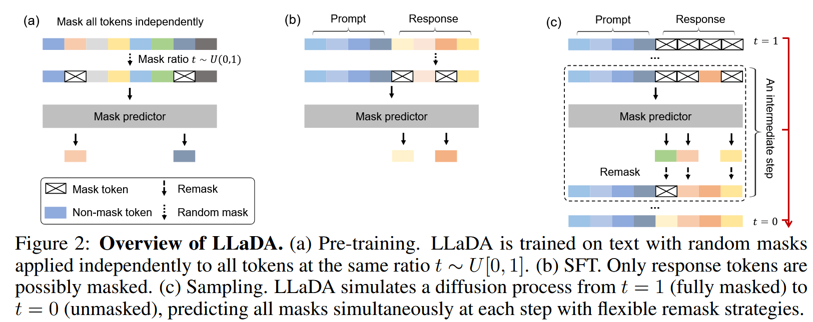
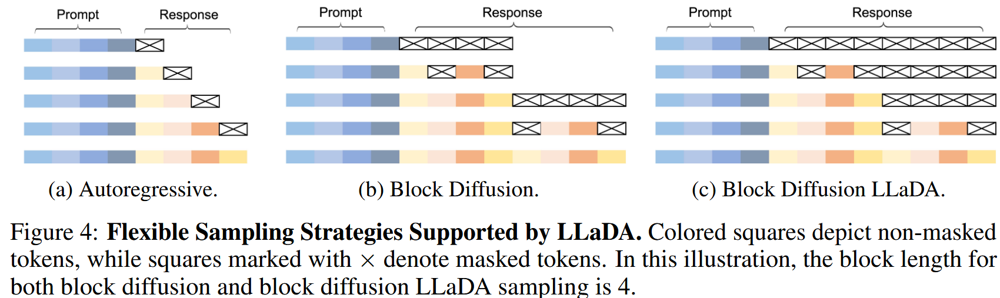

# Masked Diffusion Large Language Model

:book: 这里以 Ant Group 的 LLaDA 论文为例，介绍 Masked Diffusion LLM 的基本原理和实现方法；后面结合 SGLang 对该模型的推理实现进行说明。

## Traing Details



### 基于掩码的扩散模型(Masked Diffusion Model)
LLaDA 通过定义前向过程（Forward Process）和反向过程（Reverse Process）来建立模型分布 $p_\theta(x_0)$。
- 前向过程（破坏数据）：LLaDA 不像传统扩散模型那样添加高斯噪声，而是通过**掩码（Masking）** 来破坏数据。
  - 给定一个文本序列 $x_0$，过程从 $t=0$（无掩码）进行到 $t=1$（全掩码）。
  - 在任意时间步 $t \in (0, 1)$，序列 $x_t$ 中的每一个 Token 都有 $t$ 的概率被掩盖（变成 [MASK]），或者以 $1-t$ 
  - 使用的掩码比例是随机的（$0$ 到 $1$ 之间），而 BERT 使用的是固定的比例。这使得 LLaDA 在数学上成为一个有原则的生成模型，能够逼近最大似然估计。
- 反向过程（恢复数据）与训练目标：LLaDA 的核心是一个掩码预测器（Mask Predictor） $p_\theta(\cdot|x_t)$，它接收部分被掩盖的序列 $x_t$，并同时预测所有被掩盖的 Token。其损失函数定义为：
  $$L(\theta) \triangleq -E_{t,x_0,x_t} \left[ \frac{1}{t} \sum_{i=1}^{L} 1[x_i^t = M] \log p_\theta(x_i^0|x_t) \right]$$
  - $t$: 时间步/噪声水平。
  - $x_0$: 原始的、干净的数据样本（例如一句话或一张图的 Token 序列）。
  - $x_t$: 被破坏（加噪/掩码）后的数据样本。
  - $t \sim [0, 1]$ (Continuous Random Variable)这是一个连续的时间变量，从 0 到 1 均匀采样
  - $\mathbf{1}[x_t^i = \text{M}]$: 如果位置 $i$ 上的 Token 是掩码标记（$M$），则该项为 1；否则为 0。
  - $\log p_\theta(x_0^i | x_t)$: 给定被破坏的序列 $x_t$，模型预测位置 $i$ 处的原始 Token 是 $x_0^i$ 的概率。
  - 系数 $\frac{1}{t}$ 至关重要，它使得该损失函数成为模型负对数似然的上界，从而保证了 LLaDA 具有坚实的生成模型理论基础。
> [!NOTE]
> 这个公式引入了连续时间 $t$，实际上是在训练一个**生成**模型。在推理（生成）阶段，模型会从一个全 [MASK] 的序列开始，迭代地、一点一点地根据置信度把 [MASK] 填回去，最终生成完整的内容。这通常被称为 Iterative Decoding（迭代解码） 或 Discrete Diffusion（离散扩散）。

### 预训练 (Pre-training)
LLaDA 的预训练旨在让模型学会从不同程度的掩码中恢复文本。
- 模型架构：
  - **双向注意力**：与 GPT 系列（自回归模型）不同，LLaDA 使用的 Transformer 不使用因果掩码（Causal Mask）。这意味着在预测时，模型可以看到**上下文中的所有内容（包括“未来”的 Token，如果它们没被掩盖的话）**。
  - **MHA not GQA**：为了适应架构，LLaDA 做了一些微调。例如，它使用标准的**多头注意力（MHA）**而不是分组查询注意力（GQA），因为它不使用 KV Cache。为了保持参数量与 LLaMA3 8B 一致，它相应减少了前馈神经网络（FFN）的维度。
  > [!NOTE]
  > Why MHA not GQA?
  > 因为 LLaDA 与 KV Cache 不兼容。GQA 的主要目的是为了减少 KV Cache 的显存占用，既然用不了 KV Cache，GQA 的优势也就没了，不如直接用参数更多的 MHA 来换取性能
  - **预训练流程**：训练时，对每个序列随机采样一个时间步 $t \in [0, 1]$，然后按概率 $t$ 独立掩盖 Token。
    - 输入是一段完整的文本（如图中上方彩色方块）。
    - 采样一个掩码比例 $t$（Mask ratio）。独立地掩盖所有 Token，无论是前面的还是后面的 Token，都有可能被换成 Mask token。
    - 预测：Mask predictor 接收这个残缺的序列，试图还原那些被掩盖的 Token。
### 监督微调 (Supervised Fine-Tuning, SFT)
这是让 LLaDA 具备对话和指令遵循能力的关键步骤。SFT 需要模拟条件分布 $p_\theta(r_0|p_0)$，即给定提示词（Prompt）生成回复（Response）。将 Prompt ($p_0$) 和 Response ($r_0$) 拼接在一起。
- Prompt 部分：保持完全不掩盖，作为已知条件。
- Response 部分：按照概率 $t$ 进行独立掩盖，生成 $r_t$。

模型需要根据完整的 Prompt 和残缺的 Response 来填补空缺。这实际上是在教模型“根据问题写答案”（微调，Fine-tuning）。
$$\mathcal{L} = -\mathbb{E}_{t, p_0, r_0, r_t} \left[ \frac{1}{t} \sum_{i=1}^{L'} \mathbf{1}[r_t^i = \text{M}] \log p_\theta(r_0^i \mid p_0, r_t) \right]$$

这个公式的核心逻辑是：给定一个完整的问题（Prompt），以及一个被部分遮挡的答案（Masked Response），让模型去填补答案里的空缺

- $p_0$ (Prompt): 提示词/问题，模型始终能看到完整的问题。
- $r_0$ (Response): 原始的、正确的回复/答案。
- $r_t$ (Masked Response): 被遮挡（加噪）后的回复。这是随时间步 $t$ 变化的。部分 token 被替换成了 [MASK]。
- $L'$ (Dynamic Length): 回复的长度。因为每个问题的答案长度都不一样（有的答案 10 个字，有的 100 个字），所以长度是动态的。
- $p_\theta(r_0^i \mid p_0, r_t)$: 根据完整的问题 ($p_0$) 和 残缺的草稿 ($r_t$)，猜出第 $i$ 个位置原本的词 ($r_0^i$) 是什么。

### 采样与生成 (Sampling)
LLaDA 的生成是一个迭代的去噪过程：
- 初始状态 ($t=1$)：Response 部分全都是 Mask token，Prompt 部分保持可见。
- 中间步骤 (Intermediate step)：模型预测出所有 Token 的一种可能填法，然后根据调度策略，保留置信度高的，重新掩盖 (Remask) 置信度低的。
  > [!NOTE]
  > 原则上，重掩码策略应当是纯随机的。然而，受 LLM 采样中退火技巧 的启发，Llada 采用了一种低置信度重掩码策略（Low-confidence remasking strategy）
  >
  > 时间 $t \in (0, 1]$ 到 $s \in [0, t)$ 的中间步骤中，基于预测结果，将置信度最低的那 $s/t$ 比例的 Token 重新掩盖
- 最终状态 ($t=0$)：经过多次迭代，所有 Mask 都被替换为具体的 Token，形成完整的回复。
#### Sampling Strategies
- 自回归采样(Autoregressive Sampling)： 传统的逐步生成方法，每次生成 1 个 Token，直到达到指定长度或遇到 <eos> 标记。
- 块扩散采样(Block Diffusion Sampling)：在每个块（Block）内部应用原始的逆向扩散过程，而在块与块之间应用自回归采样。在原始的块扩散过程中，序列长度是动态变化的。
- Block Diffusion LLaDA：LLaDA 也可以采用固定长度的块扩散策略，论文中称之为“Block Diffusion LLaDA”，也称为半自回归重掩码(Semi-autoregressive Remasking)
  

## Inference
掩码扩散语言模型 (MDM) 的生成过程由网络 $p_\theta$ 建模，该网络在给定部分加噪上下文和（可选的）时间 $t$ 的条件下，预测掩码位置的清晰 Token (clean tokens) 。
- 在每一步中，给定当前的证据 $E = (x_t, t)$，模型为每个位置 $i$ 计算 $p_\theta(X_i = v | E)$，并选择具有最高置信度 $c_i(E) = \max_{v \in V} p_\theta(X_i = v | E)$ 的 Token 进行解掩码 (unmask)。
- 这一过程迭代更新序列，直到达到 $t = 0$ 或满足停止条件。
### Parallel Decoding
通过**根据置信度信号**并行解码被掩码的 Token 来加速 MDM 的生成。它将输出组织成 $K$ 个大小为 $B$ 的块 (blocks)，并通过 MDM 机制对每个块执行最多 $S$ 个精炼步骤 (refinement steps)。
- 基于阈值的规则 (Threshold-Based Rule): 对于当前处理序列 $x$，该规则计算置信度 $\{c_i(E)\}_{i \in M(x)}$，并解掩码所有置信度超过固定全局阈值 $\tau \in (0, 1)$ 的位置 ：
$$U_\tau (E) = \{ i \in M(x) : c_i(E) \ge \tau \} \quad (1)$$

## Problems Proposed in Llada

### 在每个 Block 内部不能使用 KV Cache 
- **没有 KV Cache**：GPT 推理快是因为有 KV Cache（不用重复计算前面的词）。LLaDA 是并行生成的，传统的 KV Cache 优化不适用，需要新的优化技术。
  > [!NOTE]
  > Block-wise KV Cache 是可以使用的，正在生成的 block 不能使用，但是已经生成并冻结的 block 是可以使用 KV Cache 的，详情见下文“推理优化”部分。

#### 计算量爆炸(是 ARM 的 BlockSize 倍？)
**传统自回归 (Autoregressive)**
- 过程：串行执行 32 次 Forward。
- 单次输入：1 个 Token（加上历史 KV Cache）。
- 单次计算量：主要集中在将这 1 个 Token 映射过所有的 Linear 层（QKV projection, MLP 等）。Attention 计算量为 $1 \times (L_{prefix} + i)$
​- 总计算量：近似为 $32×Cost(1_token)$

**退化的 Block Diffusion (Degraded DLLM)**
- 过程：LowConfidence 算法每次迭代只置信（固定）了 1 个 Token，因此循环了 32 次才填满 Block。串行执行 32 次 Forward。
- 单次输入：32 个 Token（包含已固定的和未固定的 Mask）。
- 单次计算量：
  - Linear 层：模型必须对这 32 个 Token 全部重新计算 Q、K、V 和 MLP。这是硬性开销，无法利用 Prefix Cache 省略（因为 Block 内部是双向 Attention，且 Mask 变了，整个 Block 的表示都会变）。
  - Attention 层：这 32 个 Token 需要与 Prefix 做 Attention，且 32 个 Token 内部要做 32×32 的双向 Attention。
- 总计算量：近似为 $32×Cost(32_tokens)$
**结论**
在退化最严重的情况下（每次只生成 1 个），DLLM 的计算量是传统自回归的 B 倍（即 32倍）。ARM 每次只算 1 个 Token 的新状态；DLLM 每次都要重算 32 个 Token 的状态，却只产出了 1 个有效 Token。

### 请求停止问题
LaDA 这种机制存在计算浪费：

- 计算浪费: 在 Worker 端，Attention 和 Linear 层是针对整个 Block（32 个 Token）并行计算的。即使 <eos> 出现在第 1 个位置，后面 31 个位置的计算也已经发生了，无法撤销。
- 显存浪费: 在生成过程中，这 32 个 Token 的 KV Cache 也都被计算并占用了显存 

如果 block size 设置过大实际上严重影响延迟，无法像传统自回归模型那样“见到 <eos> 马上停止”。

### 并行解码问题[^cadllm]
**忽略动态变化 (Ignore Dynamic Changes)**

问题：LLaDA 使用固定的 block_size (32) 和固定的迭代逻辑。它不会根据当前生成的难易程度动态调整 Block 大小。
现状：即使当前上下文非常简单（例如抄写一段固定文本），它依然会使用 32 的 Block Size，并且可能因为静态阈值过高而进行不必要的多次迭代。
**采样广度单一 (Uniform Sampling Width):**

问题：它对每个 Block 一视同仁。
现状：代码中没有针对不同 Block 或不同位置调整采样策略的逻辑。所有位置都使用相同的 argmax 或 topk 逻辑。
**提交阈值僵化 (Rigid Commit Threshold):**

问题：这是最显著的问题。self.threshold 是一个静态常数（0.95）。
现状：
场景 A（简单）：模型非常自信，置信度全是 0.99。静态阈值 0.95 工作良好，一次迭代全部解开。
场景 B（困难）：模型比较犹豫，置信度在 0.6-0.8 之间波动。静态阈值 0.95 会导致没有任何 Token 被选中（除了保底机制强制选一个）。这会导致算法退化成“一次一个 Token”的低效模式，正如我们之前讨论的那样。
缺乏适应性：算法不会根据当前步骤的置信度分布（例如整体都很低）来动态降低阈值以加速生成。 

## 推理优化

对于“正在生成的 Block”：依然不能使用 KV Cache。因为在这个 64 Token 的小窗口内，扩散过程依然是反复迭代、双向注意力的，每一步都要重算。

对于“已固定的前文”：可以使用 KV Cache。因为 Block 1 一旦生成完毕并冻结，它对于 Block 2 来说就是永远不变的上下文（Context）。Block 2 在迭代去噪时，虽然自己的 KV 会变，但它查询 Block 1 的 KV 是固定的。

### Adaptive Block Size, Steps and Threshold[^cadllm]
现有的置信度并行解码方法将输出组织成 $K$ 个大小为 $B$ 的块 (blocks)，并通过 MDM 机制对每个块执行最多 $S$ 个精炼步骤 (refinement steps)，计算置信度的方法主要有两种：
它。
- 基于阈值的规则 (Threshold-Based Rule)
  - 对于当前处理序列 $x$，该规则计算置信度 $\{c_i(E)\}_{i \in M(x)}$，并解掩码所有置信度超过固定全局阈值 $\tau \in (0, 1)$ 的位置：
  $$U_\tau (E) = \{ i \in M(x) : c_i(E) \ge \tau \} \quad (1)$$
- 基于因子的规则 (Factor-Based Rule)
  - 基于因子的规则通过一个因子参数 $\phi > 0$ 来控制并行度。对于当前块中 $m$ 个掩码位置的排序置信度 $c_{(1)} \ge \dots \ge c_{(m)}$，选择满足以下条件的最大 $r$：
  $$(r + 1)(1 - c_{(r)}) < \phi$$
  然后解掩码前 $r$ 个位置。直观地说，当个体置信度普遍较高时，这种方法会解码更多 Token；而当置信度模棱两可 (borderline) 时，解码较少。

固定的调度策略 (Fixed schedule) 会导致对简单的块进行过度精炼 (over-refines)，是对计算资源的浪费；而对较难的块则服务不足 (under-serving)，导致生成质量下降。

- Block Size： 当置信度较高时，较大的块大小可以充分利用并行解码，因为有更多的 Token 能够超过阈值；当置信度较低时，较小的块有助于更快地稳定输出。

- Step Size：在低置信度下步长应该较大，而一旦预测稳定下来，步长应该变小。

- Threshold： 置信度阈值本身也必须自适应——在某些情况下应设为高值以防止过早提交 (premature commitments)，而在另一些情况下应设为低值以加速解码。
> [!NOTE]
> 在实验中，Threshold 对结果影响最大，动态调节 Threshold 能显著提升生成质量和速度。


#### Softmax with Adaptive Vocabulary
采样广度存在延迟开销，[^cadllm]中结果显示，延迟随着词表大小急剧增加：评估全部约 5 万个 Token 的速度几乎比使用一个小词表子集慢了一个数量级 (order of magnitude)。由于每一步 (step) 都要调用 Softmax，这可能会成为一个主要的性能瓶颈。这也证实了基于自适应词表大小的选择是必要的，以便仅在总词表的一个子集上执行 Softmax 计算


#### Overview of CadLLM
**Adaptive Block Size($B_t$)**
论文将 $B_t$ 设定为与当前平均置信度 $\bar{c}$ 成正比：高置信度的块会扩大尺寸，以摊销前向传播的计算成本；而低置信度的块会收缩，以便模型能将精炼过程集中在不确定性集中的地方。
$$B_t = \text{clip}(B_{min} + (B_{max} - B_{min}) \cdot \bar{c}, B_{min}, B_{max}) \quad (2)$$这里，$B_{max}$ 和 $B_{min}$ 分别代表允许的最大和最小块大小。

**Adaptive Step($S_t$)**
 ($S_t$)我们将步数 $S_t$ 设计为与 $\bar{c}$ 呈互补关系（负相关），并用它来控制活跃块内内循环 (inner loop) 的节奏，同时也用于调度阈值 $\tau_t$。这使得**低置信度的掩码位置能够触发更多的精炼步骤**，而高置信度的位置则执行较少的步骤。
 $$S_t = \text{clip}(S_{base} + (S_{max} - S_{base})(1 - \bar{c}), S_{base}, S_{max}) \quad (3)$$

**Apdative vocabulary size ($V_t$)**
为了摊销从词表中采样的成本，论文根据几个关键指标调整采样大小 $V_t$：阶段 (phase)、置信度 (confidence) 和 Token 重复 (token repetition)
- 在生成的早期阶段或 Token 生成的不确定阶段使用较大的词表子集。
- 当生成出现重复 Token ($r_t$) 时，我们也允许较大的词表大小。
- 在高置信度情况下，我们减小其大小以降低计算成本。
$$V_t = \text{clip}(V_{phase}(g_t) \cdot f_{conf}(\bar{c}) \cdot f_{rep}(r_t), V_{min}, V_{max}) \quad (4)$$
- $V_{phase}(g_t)$： $g_t$ 是生成进度。
  - 生成初期：上下文很少，可能性无限多。这时候如果词表太小，可能会漏掉正确的方向。所以初期 $V_t$ 要大。
  - 生成后期： 句子快写完了，剩下的词基本被上下文限定死了（比如 "New York Ci..." 后面几乎肯定是 "ty"）。这时候只需要看很小范围的词表就够了。
- $f_{conf}(\bar{c})$： $\bar{c}$ 是模型的平均置信度。
  - 低置信度 (Low Confidence)： 模型很迷茫。这时候必须扩大搜索范围（扩大 $V_t$），去看看那些原本排在后面的词是不是更好的选择。
  - 高置信度 (High Confidence)： 模型非常有把握。这时候不需要浪费算力去看排名 1000 以外的词，只看前几名就够了（缩小 $V_t$）。
- $f_{rep}(r_t)$： $r_t$ 是检测到的重复率。
  - 如果模型极其自信（因子 2 让词表变得极小），它可能会陷入局部最优陷阱，反复输出同一个高概率词（例如："the the the..."）。
  - 一旦检测到重复率 $r_t$ 飙升，$f_{rep}$ 会变成一个大于 1 的系数，强制撑大词表。
  - 词表变大 -> 引入了更多低概率的“新鲜词” -> 模型有机会跳出“复读死循环” -> 恢复正常后，$r_t$ 下降，词表再次缩小。

**Apdative threshold ($\tau_t$)**
自适应置信度阈值控制着 Token 的解掩码。在一个块的早期或置信度较低时，通过设定低阈值并行提交过多 Token 会导致输出质量低下。同时，在块的后期设定高阈值会阻碍已经稳定的 Token 被解掩码。论文定义了一个感知进度 (progress-aware) 的阈值 $\tau_t$。随**着越来越多的 Token 被解掩码，该阈值最初是严格的（当置信度低时），并最终放松（随着置信度上升并保持高位）**
$$\tau_t = \tau_{base}(1 - g_t) + \tau_{min}g_t$$


### Early exiting in Diffusion LLM[^prophet]
这个方法利用了DLM中的特点——早期答案收敛（Early Answer Convergence）：在许多情况下，无论是在半自回归还是随机重新掩码（Re-masking）的调度策略下，模型在**最终解码步骤完成之前的一半步数时，就已经能在内部识别出正确答案**。例如，在 GSM8K 和 MMLU 数据集上，分别有高达 97% 和 99% 的实例仅使用一半的细化步骤就能被正确解码。

因此，Prophet 引入了一个“裁判”机制：在每一步迭代中，利用前两个预测候选之间的置信度差距(**top-2 confidence gap**)作为标准，动态决定是继续细化还是“All-in”(即一步解码所有剩余的 Token)。
> [!NOTE]
> 置信度差距 (Confidence Gap, $\bar{g}_t$)：计算 Top-1 概率与 Top-2 概率之间的差距。如果差距很大，说明模型非常确定选 Top-1 是对的；如果差距很小，说明模型在纠结。
> 
> All-in: 如果top2 Confidence Gap差距大于当前置信度阈值($\tau_t$)直接取当前概率最大的词填入所有掩码位置，并直接返回结果，不再进行后续循环


### 可能的优化方法

模型训练质量 (最关键)：

LLaDA 模型必须训练得足够好，能够在给定上下文时，对后续的多个 Token 同时产生高置信度。如果模型本身很弱，预测出来的概率分布很平坦（熵很高），那么置信度永远上不去，退化是必然的。
阈值 (Threshold) 调优：

config.algorithm_config.get("threshold", 0.95)。
降低阈值：将 0.95 降到 0.8 或 0.6，可以让模型单次迭代“接受”更多的 Token，从而减少迭代次数，提升速度。
代价：降低阈值可能会导致生成的质量下降（接受了模型不太确定的 Token），可能出现逻辑不通或幻觉。这是一个速度 vs. 质量的权衡。
动态 Block Size (进阶策略)：

目前的实现是固定的 block_size=32。
如果发现模型在某些复杂上下文中置信度普遍很低，可以动态减小 Block Size（例如减到 8 或 4）。虽然还是慢，但比硬算 32 个 Mask 要快。
推测采样 (Speculative Sampling)：

虽然代码中尚未完全集成，但 Block Diffusion 的思想与推测解码类似。如果能引入一个更小的 Draft Model 来给出一个初始的 Block 猜测，然后让 LLaDA 模型进行“降噪”或“验证”，可能会比从全 Mask 开始生成收敛得更快

## SGLang Design
### Baseline
GSM8K Accuracy Test:

```shell
# first shell
python3 -m sglang.launch_server --trust-remote-code \
  --model-path inclusionAI/LLaDA2.0-mini \
  --dllm-algorithm LowConfidence \
  --dllm-algorithm-config ./config.yaml \
  --host 0.0.0.0 \
  --port 30000

# second shell
python3 -m sglang.test.few_shot_gsm8k --num-questions 200
```

Results:

```shell
Accuracy: 0.925
Invalid: 0.000
Latency: 119.062 s
Output throughput: 204.145 token/s
```
mmlu Accuracy Test:

```shell
cd test/srt && python -m unittest test_eval_accuracy_large.TestEvalAccuracyLarge.test_mmlu
```
Results:

```shell
Total latency: 157.114 s
Score: 0.710
```

Online Benchmark Test:

```shell
# first shell
python3 -m sglang.launch_server --trust-remote-code \
  --model-path inclusionAI/LLaDA2.0-mini \
  --dllm-algorithm LowConfidence \
  --dllm-algorithm-config ./config.yaml \
  --host 0.0.0.0 \
  --port 30000

# second shell
python3 -m sglang.bench_serving --backend sglang --num-prompt 10
```

Results:
```shell
============ Serving Benchmark Result ============
Backend:                                 sglang    
Traffic request rate:                    inf       
Max request concurrency:                 not set   
Successful requests:                     10        
Benchmark duration (s):                  13.75     
Total input tokens:                      2055      
Total input text tokens:                 2055      
Total input vision tokens:               0         
Total generated tokens:                  2910      
Total generated tokens (retokenized):    2910      
Request throughput (req/s):              0.73      
Input token throughput (tok/s):          149.42    
Output token throughput (tok/s):         211.59    
Peak output token throughput (tok/s):    403.00    
Peak concurrent requests:                10        
Total token throughput (tok/s):          361.01    
Concurrency:                             5.47      
----------------End-to-End Latency----------------
Mean E2E Latency (ms):                   7523.65   
Median E2E Latency (ms):                 7886.13   
---------------Time to First Token----------------
Mean TTFT (ms):                          6257.11   
Median TTFT (ms):                        5386.92   
P99 TTFT (ms):                           12728.10  
-----Time per Output Token (excl. 1st token)------
Mean TPOT (ms):                          3.91      
Median TPOT (ms):                        4.55      
P99 TPOT (ms):                           5.56      
---------------Inter-Token Latency----------------
Mean ITL (ms):                           4.52      
Median ITL (ms):                         4.85      
P95 ITL (ms):                            5.79      
P99 ITL (ms):                            9.50      
Max ITL (ms):                            90.06     
==================================================
```

### Baseline + CadLLM
GSM8K Accuracy Test Results:

```shell
```

mmlu Accuracy Test Results:

```shell
```

Online Benchmark Test Results:
```shell
```

## Reference
[^cadllm]:[Improving the Throughput of Diffusion-based Large Language Models via a Training-Free Confidence-Aware Calibration](https://arxiv.org/pdf/2512.07173)
[^prophet]:[Diffusion Language Models Know the Answer Before Decoding](https://arxiv.org/pdf/2508.19982)