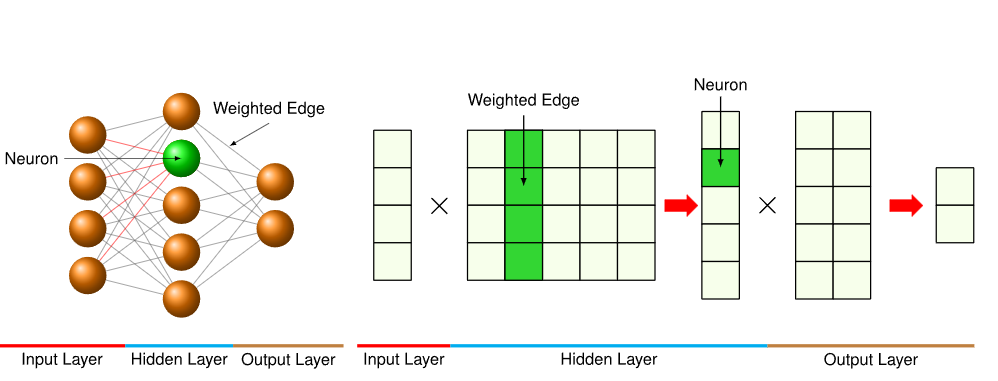
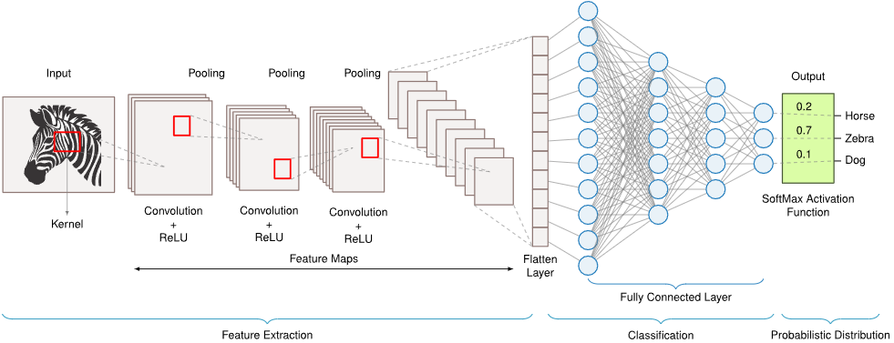

---

title: Introduction
created: 2025-09-12
update:
comments: true
katex: true
tags:

- LLMInference

---

# Introduction

## Overview

不同的算法结构有不同的计算模式，对模式的处理影响了算法结构，算法结构又会映射到计算机系统资源。从算法需求到计算机系统设计的映射涉及几个关键考虑因素：

- 内存访问模式：数据如何在内存层次结构中移动
- 计算特性：算术操作的本质和组织
- 数据移动：片上和片外数据传输的要求
- 资源利用：计算和内存资源的分配方式

状态化处理会在时间步长上维护信息，需要特定的片上内存来维护

我们一般分析计算模式如何影响计算机系统时，主要关注三个维度：

1. 内存需求
1. 计算需求
1. 数据移动

## MLP： Dense Pattern Processing

最初通过引入通用逼近定理（UAT）（Cybenko 1992；Hornik, Stinchcombe, and White 1989）而得到形式化，该定理表明，具有非线性激活函数的足够大的 MLP 可以在紧凑域内逼近任何连续函数，前提是具有合适的权重和偏差

### Pattern Processing Needs

深度学习系统经常遇到**任何输入特征都可能影响任何输出的情况，因为这些关系没有内在的约束**。考虑分析金融市场数据：任何经济指标都可能影响任何市场结果，或者在自然语言处理中，一个词的意义可能取决于句子中的任何其他词。这些场景需要一种能够**学习所有输入特征之间任意关系的架构模式**。

**密集模式处理**通过实现几个关键能力来满足这一基本需求。

- 它允许无限制的特征交互，其中每个输出可以依赖于任何输入组合。
- 它促进了学习到的特征重要性，使系统能够确定哪些连接重要，而不是由它们预先规定。
- 它提供了自适应表示，使网络能够根据数据重新塑造其内部表示。

### Algorithmic Structure

MLP 采用了一种直接的算法解决方案：将所有内容都连接到所有内容。这通过一系列全连接层来实现，其中每个神经元都与相邻层中的每个神经元相连。

$$
h^{(l)} = f(W^{(l)}h^{(l-1)} + b^{(l)})
$$



### Computational Mapping

mlp_layer_compute 通过嵌套循环暴露了实际的计算模式。这个版本向我们展示了当我们计算层的输出时真正发生的事情：我们处理批次中的每个样本，通过累积所有输入的加权贡献来计算每个输出神经元。

```python
def mlp_layer_matrix(X, W, b):
    # X: input matrix (batch_size × num_inputs)
    # W: weight matrix (num_inputs × num_outputs)
    # b: bias vector (num_outputs)
    H = activation(matmul(X, W) + b)
    # One clean line of math
    return H


def mlp_layer_compute(X, W, b):
    # Process each sample in the batch
    for batch in range(batch_size):
        # Compute each output neuron
        for out in range(num_outputs):
            # Initialize with bias
            Z[batch, out] = b[out]
            # Accumulate weighted inputs
            for in_ in range(num_inputs):
                Z[batch, out] += X[batch, in_] * W[in_, out]

    H = activation(Z)
    return H
```

### System Implications

#### Memory Requirements

内存需求源于存储和访问权重、输入和中间结果。在我们的 MNIST 示例中，将 784 维输入层连接到 100 个神经元的隐藏层需要 78,400 个权重参数。每次前向传播必须访问所有这些权重，以及输入数据和中间结果。

#### Computation Needs

核心计算围绕嵌套循环中的乘累加操作进行。每个输出值需要的乘累加次数与输入数量相同。对于 MNIST，这意味着每个输出神经元需要进行 784 次乘累加。在我们的隐藏层中有 100 个神经元，对于单个输入图像，我们执行了 78,400 次乘累加。

这种计算结构适合于现代硬件中的特定优化策略。密集矩阵乘法模式可以高效地并行化到多个处理单元，每个处理单元处理不同的神经元子集。现代硬件加速器通过专门的矩阵乘法单元利用这一点，而深度学习框架自动将这些操作转换为优化的 BLAS（基本线性代数子程序）调用。**CPU 和 GPU 都可以通过仔细划分计算来利用缓存局部性，以最大化数据重用**，尽管它们的具体方法根据其架构优势而有所不同。

#### Data Movement

MLP 中的全连接模式产生了巨大的数据移动需求。每次乘加操作需要三份数据：一个输入值、一个权重值和累计和。对于我们的 MNIST 示例层，计算单个输出值需要将 784 个输入和 784 个权重移动到计算发生的任何地方。这种移动模式在每个 100 个输出神经元中重复，从而在内存和计算单元之间产生了大量的数据传输需求。

这些数据移动模式的可预测性使得数据阶段和传输优化成为可能。不同的架构通过各种机制应对这一挑战；**CPU 使用复杂的预取和多级缓存；同时，GPU 采用高带宽内存系统以及通过大量线程隐藏延迟**。深度学习框架通过优化的内存管理系统协调这些数据移动。

## Convolutional Neural Networks: Spatial Pattern Processing

### Pattern Processing Needs

空间模式处理涉及数据点之间的关系取决于它们的相对位置或邻近性的场景。


> 空间特征提取：卷积神经网络通过在输入上应用可学习的滤波器来识别图像中独立于其位置的图案，从而实现鲁棒的对象识别。这些滤波器检测局部特征，**并在图像上重复应用这些滤波器创建**——即无论图案的位置如何都能识别该图案的能力

CNN 不是将每个输入连接到每个输出，而是使用局部连接模式，其中**每个输出仅连接到输入的一个小而空间上连续的区域**。这个局部感受野在输入空间中移动，在每个位置应用相同的一组权重——这个过程称为卷积

### Algorithmic Structure

- 处理本地邻域

- 在每个空间位置重复使用相同的权重

- 在输出中保持空间结构

### System Implications

#### Memory Requirements

对于卷积层，内存需求主要集中在两个关键组件：滤波器权重和特征图 。与需要存储完整连接矩阵的 MLP 不同，CNN 使用小型、可重复使用的滤波器。在我们的 MNIST 示例中，一个包含 32 个大小为 3\*3 的滤波器的卷积层只需要存储 288 个权重参数，相比之下，我们的 MLP 全连接层需要 78,400 个权重。然而，系统必须存储所有空间位置的特征图，这产生了不同的内存需求——一个具有 32 个输出通道的 28\*28 特征图需要存储 25,088 个激活值

#### Computation Needs

CNNs 的核心计算涉及在空间位置上反复应用小型滤波器。每个输出值都需要在滤波器区域内进行局部乘加运算。对于我们的 MNIST 示例，有 3\*3 个滤波器和 32 个输出通道，计算一个空间位置涉及 288 次乘加，并且必须对所有 784 个空间位置
重复此操作。虽然每个单独的计算涉及的运算比 MLP 层少，但由于空间重复，总计算量仍然很大。

#### Data Movement

卷积的滑动窗口模式创建了一个独特的数据移动配置文件。与 MLP 中每个权重在每个前向传递中只使用一次不同，CNN 滤波器权重在滤波器滑动到空间位置时被多次重复使用。

系统必须在保持滤波器权重稳定的同时，将输入特征流经计算单元。

## Recurrent Neural Networks: Sequential Pattern Processing

元素随时间变化的顺序和关系至关重要。文本处理需要理解词语与先前上下文的关系，语音识别需要跟踪声音如何形成连贯的模式，时间序列分析必须捕捉值随时间演化的方式。

### Pattern Processing Needs

序列模式处理解决当前输入的意义取决于之前发生的情况的场景。以自然语言处理为例：一个词的意义往往在很大程度上取决于句子中的前一个词。

序列处理中的关键挑战是**在时间上维护和更新相关上下文**。当阅读文本时，人类不会每个词都从头开始——我们保持一个不断发展的理解，随着我们处理新信息而演变。同样，当处理时间序列数据时，模式可能跨越不同的时间尺度，从即时依赖到长期趋势。这表明我们需要一个**既能维护状态又能根据新输入进行更新的架构。**

### Algorithmic Structure

RNNs 通过引入循环连接，不仅将输入映射到输出，而是在每个时间步更新内部状态。这创建了一种记忆机制，使网络能够将信息在时间上传递。

$$
h_t = f(W\_{hh}h\_{t-1} + W\_{xh}x_t + b_h)
$$


> Rnn 通过维护一个包含先前时间步信息的状态来处理序列数据。展开的结构明确表示了循环权重建模的时间依赖性，使网络能够学习可变长度序列中的模式。

### System Implications

#### Memory Requirements

RNNs 需要存储两组权重（输入到隐藏和隐藏到隐藏）以及隐藏状态。对于输入维度为 100 和隐藏状态维度为 128 的示例，这意味着需要存储 12,800 个输入投影的权重和 16,384 个递归连接的权重。RNN 的权重在时间步上重复使用。此外，**系统必须维护隐藏状态**，这成为内存使用和访问模式的关键因素。

现代处理器通过在缓存中保持权重矩阵，在流过序列元素时处理这些模式。深度学习框架通过将**序列分批和仔细管理时间步之间的隐藏状态存储来优化内存访问**。CPU 和 GPU 采用不同的策略来解决这个问题；CPU 利用其缓存层次结构来实现权重重用；同时，GPU 使用专为在连续操作中维护状态而设计的专用内存架构。

#### Computation Needs

RNNs 的核心计算涉及在时间步长上反复应用权重矩阵。对于每个时间步长，我们执行两次矩阵乘法：一次是与输入权重相乘，另一次是与循环权重相乘。在我们的例子中，处理单个时间步长需要 12,800 次乘加运算用于输入投影，以及 16,384 次乘加运算用于循环连接

虽然我们可以在批量元素之间并行化，但由于序列依赖性，我们无法在时间步之间并行化。**每个时间步必须等待前一个步骤的隐藏状态才能开始计算**。这导致了算法固有的序列性质与现代硬件并行执行愿望之间的紧张关系。

#### Data Movement

每个时间步必须：加载先前的隐藏状态（128 个值）、访问两个权重矩阵（从输入和循环连接中总共 29,184 个权重），并存储新的隐藏状态（128 个值）。这种模式在序列中的每个元素上都会重复。

## Attention Mechanisms: Dynamic Pattern Processing

语言理解需要捕捉到基于意义而不是仅仅位置的字词之间的关系。图分析需要理解节点间变化的连接。这些动态关系表明我们需要一个能够根据数据本身学习并调整其处理模式的架构。

### Pattern Processing Needs

动态模式处理针对的是元素之间的关系不是由架构固定，而是从内容中产生的场景。

系统必须计算所有元素对之间的关系，**根据内容权衡这些关系，并使用这些权重来选择性地组合信息**。与具有固定连接模式的前一代架构不同，动态处理需要**根据输入本身修改其计算图的能力**。这使我们转向 Transformer 架构，该架构通过注意力机制实现这些能力。

### Basic Attention Mechanism

$$
Attention(Q, K, V) = softmax\\left(\\frac{QK^T}{\\sqrt{d_k}}\\right)V
$$


### System Implications

#### Memory Requirements

注意力机制需要存储注意力权重、键查询值投影和中间特征表示。对于一个序列长度为 N 和维度为 d 的情况，每个注意力层必须为批次中的每个序列存储一个 N\*N 的注意力权重矩阵，三组投影矩阵用于查询、键和值（每个大小为 d\*d），以及大小为 N\*d 的输入和输出特征图。为每个输入动态生成注意力权重会创建一个内存访问模式，其中中间注意力权重成为内存使用的一个重要因素。

#### Computation Needs

计算需求在注意力机制中主要集中在两个主要阶段：生成注意力权重和将它们应用于值。对于每个注意力层，系统在多个计算阶段执行大量的乘加运算。仅查询-键交互就需要 $N\\times N \\times d$次乘加运算，应用注意力权重到值上也需要相同数量的运算。还需要额外的计算用于投影矩阵和 softmax 操作。这种计算模式与之前的架构不同，因为它与序列长度呈二次关系，并且需要对每个输入进行新鲜的计算。

#### Data Movement

每个注意力操作都涉及将查询、键和价值向量投影和移动到每个位置，存储和访问完整的注意力权重矩阵，以及在加权组合阶段协调价值向量的移动。这形成了一种数据移动模式，其中中间注意力权重成为系统带宽需求的主要因素。

### Transformer and Self-Attention

$$
SelfAttention(X) = softmax(\\frac{XW_Q (XW_K)^T}{\\sqrt{d_k}})XW_V
$$

- 自注意力使得序列中所有位置的并行处理成为可能。这在计算所有位置上的 Q 、 K 和 V 的矩阵乘法中表现得非常明显。
- 注意力分数的计算结果是一个大小为 **(seq_len × seq_len)** 的矩阵，导致与序列长度相关的二次复杂性。当处理长序列时，这种二次关系成为一个显著的计算瓶颈，这一挑战促使研究人员探索更有效的注意力机制。
- 多头注意力机制有效地并行运行多个自注意力操作，每个操作都有其自己的学习投影集。虽然这使计算负载与头的数量呈线性增长，但它允许模型捕捉同一输入中的不同类型的关系，增强了模型的表达能力。
- 自注意力中的核心计算主要由大矩阵乘法主导。对于长度为的 N 序列和嵌入维度为 d，主要操作涉及大小为 N\*d, d\*d, N\*N 的矩阵。这些密集的矩阵运算非常适合在专门的硬件如 GPU 上加速，但它们也显著增加了模型的整体计算成本。
- 自注意力生成内存密集的中间结果。注意力权重矩阵 N\*N 和每个注意力头的中间结果创建了大量的内存需求，尤其是对于长序列。这可能在内存受限的设备上部署时带来挑战，并需要在实现中仔细管理内存。

## Modern Architectures

现代架构，尤其是 Transformer，代表了这些基本构建模块的复杂综合。它们并非引入全新的模式，而是通过巧妙地组合和改进现有组件进行创新。以 Transformer 架构为例：其核心是 MLP 风格的前馈网络，在注意力层之间处理特征。注意力机制本身建立在序列模型的思想之上，但去除了循环连接，转而**使用受 CNN 直觉启发的位置嵌入** 。该架构广泛利用跳跃连接 ，这些连接继承自 ResNets，而层归一化（源自 CNN 的批量归一化）则稳定了训练


## System-Level Building Blocks

### Core Computational Primitives

三个基本操作是所有深度学习计算的构建块：矩阵乘法、滑动窗口操作和动态计算 。这些操作之所以是原生的，是因为它们不能进一步分解而不会失去其基本的计算特性和效率特征。

动态计算，其中操作本身依赖于输入数据，随着注意力机制的兴起而显著出现，但代表了适应处理所需的基本能力。在 Transformer 注意力中，**每个查询动态确定其与所有键的交互权重**；对于长度为 512 的序列，这意味着必须实时计算 512 种不同的权重模式。与预先知道计算图的固定模式不同，动态计算需要运行时决策。这创造了特定的实现挑战；硬件必须提供灵活的数据路由（现代 GPU 使用动态调度）并支持可变的计算模式，而软件框架需要高效的机制来处理数据相关的执行路径（PyTorch 的动态计算图，TensorFlow 的动态控制流）

### Memory Access Primitives

Three fundamental memory access patterns dominate in deep learning architectures: sequential access, strided access, and random access

随机访问对系统效率提出了最大的挑战。在一个处理 512 个标记序列的 Transformer 中，**每个注意力操作可能需要访问序列中的任何位置，从而产生不可预测的内存访问模式**。随机访问会通过缓存未命中（可能每次访问造成 100 多个周期停滞）和不可预测的内存延迟严重影响性能。系统通过大型缓存层次结构（现代 GPU 有数 MB 的 L2 缓存）和复杂的预取策略来解决这个问题，而软件框架采用诸如注意力模式剪枝等技术来减少随机访问需求。


### Data Movement Primitives

在深度学习架构中，四种基本的数据移动模式很常见：广播、散射、收集和归约。


- 广播操作同时将相同的数据发送到多个目的地。在批量大小为 32 的矩阵乘法中，每个权重都必须进行广播以并行处理不同的输入。现代硬件通过专用互连支持这一点
- 散列操作将不同的元素分配到不同的目的地。当在 GPU 核心上并行化 0#矩阵乘法时，每个核心接收计算的一部分。这种并行化对于性能至关重要，但具有挑战性，因为内存冲突和负载不均衡可能会降低效率 50%以上。
- 收集操作从多个来源收集数据。在序列长度为 512 的 Transformer 注意力中，每个查询必须从 512 个不同的键值对中收集信息。这些不规则的访问模式具有挑战性，随机收集可能比顺序访问慢。硬件通过高带宽互连和大型缓存来支持这一点，而软件框架采用诸如注意力模式剪枝等技术来减少收集开销。
- 归约操作将多个值通过求和等操作合并成一个单一结果。在计算 Transformer 中的注意力分数或 MLP 中的层输出时，高效的归约是必不可少的。硬件实现了树状结构的归约网络（将延迟从 O(N) 降低到 O(log N)），而软件框架使用优化的并行归约算法，可以实现接近理论峰值性能。

### System Design Impact

这些原语对系统设计最显著的影响之一是推动向专用硬件的发展。深度学习中矩阵乘法和卷积的普遍存在导致了张量处理单元（TPU）和 GPU 中的张量核心的发展，这些单元专门设计用于高效执行这些操作。这些专用单元可以并行执行许多乘加运算，显著加速神经网络的核心计算。

内存系统也深受深度学习原语需求的影响。支持高效地同时支持顺序和随机访问模式的需求推动了复杂内存层次结构的发展。高带宽内存（HBM）在 AI 加速器中变得常见，以支持大量数据传输需求，尤其是在 Transformer 中的注意力机制操作。片上内存层次结构变得更加复杂，拥有多级缓存和暂存内存，以支持不同神经网络层的工作集大小。

