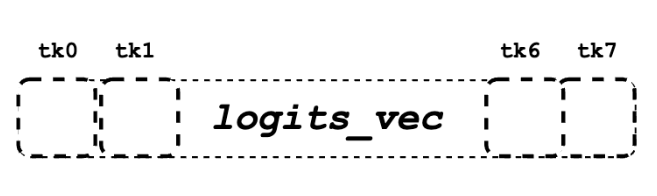

# Page Attention

## Prequisite

### GPU Tiling

- 将矩阵划分为更小的子矩阵（tile），以便更高效地利用 GPU 的并行计算能力和内存层次结构。
  

### Sequence

单个查询注意力内核（single-query kernel）每个序列在这个 kernel 内只有一个 query token 需要处理。如果 batch 里有很多序列、每个序列里有多个 token，**内核就把这些 token 展平，每个 token 当作一个 “独立的 query 序列”。**

```shell
[batch_size, seq_len, num_heads, head_size] =>[num_seqs, num_heads, head_size]
```

> 在常规的 多查询注意力 (multi-query) 或 标准注意力 (scaled dot-product attention) 内核中，往往是**一整个序列的所有 query 一起算**。

**Pros**:

- 并行度更高：每个 query token 独立并行，能更好地映射到 GPU thread block。

- 节省显存访问：单 query kernel 往往配合 KV-cache，把所有 key/value 放在显存中，一个 query 只需要拉取一次。

### Vectorization(一次性批量取回的连续元素块)

**Why Vectorization**: 在 GPU 上做矩阵乘法或注意力操作时，如果一个线程只按标量（scalar）去读数据，显存带宽利用率很低。因此常见的优化方法是：

- 一次加载多个元素 → 向量化加载（vectorized load）

- 每个线程组（warp 或 thread group）协同加载数据，保证 内存对齐（alignment），提升吞吐。

**How to Vectorization**:

- Q/K：通常要做 dot，所以多个线程要一起合作加载一条向量（保证 coalesced memory access，减少 bank conflict）。因此 thread group 一起凑够 16 字节。

  > 点积需要把同一 key 向量的许多元素加载出来并与 query 的对应元素逐项相乘求和。若每个线程单独拉取，会造成大量不合并的内存访问和带宽浪费

  > 通过线程组协作加载（每个线程加载自己的一小段，线程间地址连续）可以实现 **coalesced global loads（合并内存事务），并把 tile 放到 shared memory 以实现复用**。

  - **Q/K 的 VEC_SIZE**: 每个线程组（THREAD_GROUP_SIZE 个线程）要保证一次抓取的数据总量 = 16 字节。

    ```python
    VEC_SIZE = 16 / (scalar_t 大小 × THREAD_GROUP_SIZE)
    ```

- V：在注意力加权阶段，每个线程独立处理对应的 value 段，不需要和邻居线程强同步。因此每个线程自己保证取 16 字节就行。

  - **V 的 V_VEC_SIZE**: 每个线程自己就要对齐到 16 字节。

    ```python
    V_VEC_SIZE = 16 / (scalar_t 大小)
    ```

### Block in VLLM

block 存放 BLOCK_SIZE 个 token 的 Key/Value（在一个 attention head 内）。

> 如果 BLOCK_SIZE = 16，head_size = 128, 一个 block 能存：16 × 128 = 2048 个元素  (float16 / float32  数字)这 16 是 token 数量，128 是 每个 token 的向量维度。

### Hierarchical Computation

```python
Grid (The entire attention calculation for all queries & heads)
└── Thread Block (Task: Compute for Query #5, Head #3)
    ├── Warp 0 (Processes KV context blocks 0, 4, 8...)
    │   ├── Thread Group 0 (Threads 0-3) -> Works on Token A
    │   ├── Thread Group 1 (Threads 4-7) -> Works on Token B
    │   └── ...
    └── Warp 1 (Processes KV context blocks 1, 5, 9...)
        ├── Thread Group 8 (Threads 32-35) -> Works on Token C
        └── ...
```

#### Grid

网格的任务是计算所有查询标记在所有注意力头上的注意力。启动配置 Grid: (num_heads, num_seqs, max_partions)

- 网格的 x 维度对应不同的注意力头。

- y 轴对应不同的查询标记（序列）。

本质上，网格是单次前向传递中注意力层的整个工作负载。

#### Thread Block

单个线程块有一个非常具体且独立的任务：计算单个查询标记和单个注意力头的完整注意力输出。

因为块是独立的，GPU 可以在不同的硬件单元上同时计算（Query 0，Head 0）、（Query 1，Head 0）和（Query 0，Head 1）的注意力，这是并行化的主要来源。

#### Warp

在一个单独的块中，你仍然有很多工作要做：一个查询需要与整个上下文（所有 KV cache）进行比较。这个上下文被分成更小的块（ block_idx ）。

```cpp
for (int block_idx = start_block_idx + warp_idx; ...; block_idx += NUM_WARPS) {
  // 处理 block_idx 指定的 KV 块
}
```

这个“Warp-Stride Loop”以轮询的方式将上下文块分配给 Warp。Warp 0 处理 KV 块 0、N、2N...，而 Warp 1 处理 KV 块 1、N+1、2N+1...，以此类推。它们并行处理上下文的不同部分，以加快单个查询和头部的计算速度。

#### Thread Group

vLLM 中的逻辑概念：小型、自定义大小的线程集合，通常是一个 Warp 的子集。例如，一个包含 32 个线程的 Warp 可以逻辑上分为 8 个每个 4 线程的 thread_group 。

- thread_group 是为非常细粒度的任务创建的，主要是协作记忆加载和计算。
- 在 QK 部分，一个 thread_group 的职责是与**组内其他线程协作加载一小部分 Key 向量**以及从 global memory 中协作取出 q_ptr 指向的 query 向量，并计算它与 Query 向量相应部分的点积。

## Attention Kernel

### Process

1. Query 数据向量化从 global memory 加载到 shared memory
   
2. 按照 context 的 block 数量迭代
   - Key 数据向量化从 global memory 加载到 register
     
   - 计算 QK 点积，每个 thread_group 的领头线程计算最大的 qk 并存入 logits 数组(shared memory)
3. 计算 Softmax
   - 规约 qk_max
   - 规约 exp_sum
   - 归一化 logits 数组
4. 计算 LV
   - 按输出向量维度划分每个线程负责的 v_vec
   - 计算 logits_vec 和 v_vec 的点积并累加到 accs 数组
   - 规约 accs 数组
5. 输出结果到 out_ptr

```python
# from q_ptr to q_vecs

q_vecs = ...
for ... {
    k_ptr = ...
    for ... {
        k_vecs[i] = ...
    }
    ...
    float qk = scale * Qk_dot<scalar_t, THREAD_GROUP_SIZE>::dot(q_vecs[thread_group_offset], k_vecs);
    if (thread_group_offset == 0) {
      const bool mask = token_idx >= context_len;
      logits[token_idx - start_token_idx] = mask ? 0.f : qk;
      qk_max = mask ? qk_max : fmaxf(qk_max, qk);
    }
}

# qk_max reduction
for (int mask = WARP_SIZE / 2; mask >= THREAD_GROUP_SIZE; mask /= 2) {
    qk_max = fmaxf(qk_max, VLLM_SHFL_XOR_SYNC(qk_max, mask));
}

if (lane == 0) {
    red_smem[warp_idx] = qk_max;
}

for (int mask = NUM_WARPS / 2; mask >= 1; mask /= 2) {
    qk_max = fmaxf(qk_max, VLLM_SHFL_XOR_SYNC(qk_max, mask));
}
qk_max = VLLM_SHFL_SYNC(qk_max, 0);

# exp_sum
for (int i = thread_idx; i < num_tokens; i += NUM_THREADS) {
    float val = __expf(logits[i] - qk_max);
    logits[i] = val;
    exp_sum += val;
}
# ...
exp_sum = block_sum<NUM_WARPS>(&red_smem[NUM_WARPS], exp_sum);
const float inv_sum = __fdividef(1.f, exp_sum + 1e-6f);
for (int i = thread_idx; i < num_tokens; i += NUM_THREADS) {
    logits[i] *= inv_sum;
}

# lv
float accs[NUM_ROWS_PER_THREAD];
for ... { // Iteration over different blocks.
    logits_vec = ...
    for ... { // Iteration over different rows.
        v_vec = ...
        ...
        accs[i] += dot(logits_vec, v_vec);
    }
}

# accs reduction
for (int i = 0; i < NUM_ROWS_PER_THREAD; i++) {
    float acc = accs[i];
    for (int mask = NUM_V_VECS_PER_ROW / 2; mask >= 1; mask /= 2) {
        acc += VLLM_SHFL_XOR_SYNC(acc, mask);
    }
    accs[i] = acc;
}

# output
scalar_t* out_ptr = out + seq_idx * num_heads * max_num_partitions * HEAD_SIZE
                + head_idx * max_num_partitions * HEAD_SIZE
                + partition_idx * HEAD_SIZE;
for (int i = 0; i < NUM_ROWS_PER_THREAD; i++) {
    const int row_idx = lane / NUM_V_VECS_PER_ROW + i * NUM_ROWS_PER_ITER;
    if (row_idx < HEAD_SIZE && lane % NUM_V_VECS_PER_ROW == 0) {
        from_float(*(out_ptr + row_idx), accs[i]);
    }
}
```

#### Query 数据的加载

这个阶段的目标是将那个固定不变的 Query 向量从缓慢的全局内存加载到快速的共享内存中，让参与计算的所有线程都能高效地访问它。

- 定位 Query 数据：每个线程块首先计算出它负责的 Query Token 在全局内存中的地址，即 q_ptr。这个指针在当前线程块的整个生命周期中是固定的。

  ```cpp
  const scalar_t* q_ptr = q + seq_idx * q_stride + head_idx * HEAD_SIZE;
  ```

  

- 协作加载到共享内存：线程块内的所有线程（例如 thread0, thread1 等）一起工作，将 q_ptr 指向的数据（一个完整的 Query 向量，如 128 个元素）搬运到共享内存数组 q_vecs 中。

  ```cpp
  __shared__ Q_vec q_vecs[THREAD_GROUP_SIZE][NUM_VECS_PER_THREAD];
  ```

  

- 加载方式：采用高效的**内存合并 Memory Coalescing**模式。如图所示，thread0 加载 vec0, vec2 等偶数位的数据块，thread1 加载 vec1, vec3 等奇数位的数据块。由于 vec0 和 vec1 在物理内存中是相邻的，相邻线程访问相邻内存，触发合并读取，极大提升了加载效率。

#### Key 数据的迭代加载与 QK 点积计算（循环操作）

现在 Query 数据已经准备就绪，线程块进入一个主循环（即文档中的 outer loop），迭代遍历所有需要计算的 Key Token。
对于循环中的每一个 Key Token：

- 定位 Key 数据：在每次循环开始时，计算指向当前 Key Token 的指针 k_ptr。这个指针在每次迭代时都会更新，指向下一个新的 Key Token。

- 加载 Key 数据到寄存器：使用内存合并模式，从 k_ptr 指向的全局内存中读取当前 Key Token 的向量数据。**关键区别：这次，Key 数据被加载到每个线程私有的寄存器 k_vecs 中。**
  

```cpp
const scalar_t* k_ptr = k_cache + physical_block_number * kv_block_stride
                    + kv_head_idx * kv_head_stride
                    + physical_block_offset * x;
# x 是每个线程组一次加载的元素数量
K_vec k_vecs[NUM_VECS_PER_THREAD];
```


> 为什么是寄存器？ 因为当前这个 Key 向量只会被用于和 Query 向量做一次点积运算。**计算完成后，在下一次循环中它就会被新的 Key 向量覆盖掉。因此，使用最快但私有的寄存器是最高效的选择。**

- 执行 QK 点积运算：如果 HEADSIZE 的值为 128 且 THREAD_GROUP_SIZE 的值为 2，每个线程的 k_vecs 将包含总共 64 个元素。然而，返回的 qk 实际上是 128 个查询元素和 128 个键元素之间的点积乘法的结果(使用 qk_dot 函数)。

  ```cpp
  template <int THREAD_GROUP_SIZE, typename Vec, int N>
  inline __device__ float qk_dot_(const Vec (&q)[N], const Vec (&k)[N]) {
    using A_vec = typename FloatVec<Vec>::Type;
    // Compute the parallel products for Q*K^T (treat vector lanes separately).
    A_vec qk_vec = mul<A_vec, Vec, Vec>(q[0], k[0]);
    // 每个线程都计算了一个部分和向量。
  #pragma unroll
    for (int ii = 1; ii < N; ++ii) {
      qk_vec = vllm::fma(q[ii], k[ii], qk_vec);
    }

    // Finalize the reduction across lanes.
    float qk = sum(qk_vec);
  #pragma unroll
    for (int mask = THREAD_GROUP_SIZE / 2; mask >= 1; mask /= 2) {
      qk += VLLM_SHFL_XOR_SYNC(qk, mask);
    }
    return qk;
  }
  ```

### Softmax

#### 局部 qk_max

在 QK 点积计算的主循环中，每当一个线程组计算出一个新的 qk 值后，它会立即做两件事：

- 暂存 qk 值：将计算出的 qk 值存入一个位于**Shared Memory**的 logits 数组中。共享内存的访问速度远快于全局内存。logits 数组的大小等于上下文令牌的数量，用于存放所有的 qk 值，供后续计算使用。
  

```cpp
// thread_group_offset == 0 确保只有每个组的第一个线程去写共享内存，避免竞争
logits[token_idx - start_token_idx] = mask ? 0.f : qk;
```

- 更新局部最大值：每个线程（或线程组）维护一个私有寄存器中的 qk_max 变量，并用新计算出的 qk 值来更新它。

```cpp
qk_max = mask ? qk_max : fmaxf(qk_max, qk);
```

- 此时，每个线程的 qk_max 只记录了它自己处理过的 qk 值中的最大值。

#### 全局 qk_max 规约 (Reduction)

- 我们的目标是找到**整个 Thread Block**中所有 qk 值的全局最大值。这是一个典型的并行规约操作，分层进行以保证效率。

1. Warp 内规约（Intra-Warp Reduction）

```cpp
for (int mask = WARP_SIZE / 2; mask >= THREAD_GROUP_SIZE; mask /= 2) {
qk_max = fmaxf(qk_max, VLLM_SHFL_XOR_SYNC(qk_max, mask));
}
```

- VLLM_SHFL_XOR_SYNC：这是一个 Warp Shuffle 指令。它允许一个 Warp 内的线程之间直接交换寄存器中的数据，无需通过共享内存，速度极快。

2. Warp 间规约 (Inter-Warp Reduction)

```cpp
if (lane == 0) { // lane 是线程在 warp 内的 ID
  red_smem[warp_idx] = qk_max;
}
// ... 同步 ...
// 在一个 warp 内再次进行类似的 shuffle 操作来规约所有 warp 的最大值
for (int mask = NUM_WARPS / 2; mask >= 1; mask /= 2) {
  qk_max = fmaxf(qk_max, VLLM_SHFL_XOR_SYNC(qk_max, mask));
}
```

- 每个 Warp 的“领头线程”（lane == 0）将它得到的 Warp 内最大值写入共享内存 red_smem 中。
- 然后，通常由第一个 Warp 负责读取 red_smem 中的所有 Warp 最大值，并再次进行一次规约，从而得到整个线程块的全局 qk_max。

3. 广播全局 qk_max：

```cpp
qk_max = VLLM_SHFL_SYNC(qk_max, 0);
```

- 此时，全局 qk_max 可能只存在于线程块的第一个线程中。这条指令将第一个线程寄存器中的值广播给它所在 Warp 的所有其他线程。通过类似的方式，最终确保线程块中的每一个线程都拥有了正确的全局 qk_max 值。

#### 计算 exp_sum 并完成归一化

现在每个线程都知道了全局的 qk_max，可以开始计算 Softmax 的分子和分母了。计算分子并求局部和：

```cpp
for (int i = thread_idx; i < num_tokens; i += NUM_THREADS) {
  float val = \_\_expf(logits[i] - qk_max); // 计算 e^(qk - qk_max)
  logits[i] = val; // 将结果写回共享内存，覆盖原 qk 值
  exp_sum += val; // 累加到线程私有的 exp_sum 中
}
```

- 这是一个 Grid-Stride Loop，让有限的线程处理所有 num_tokens 个数据。

- 每个线程从共享内存 logits 中读取 qk 值，减去全局 qk_max，计算 exp()，然后将结果写回 logits 数组。此时 logits 存储的是 Softmax 的分子。

- 同时，每个线程将自己计算出的所有 val 累加到私有的 exp_sum 变量中。

#### 全局 exp_sum 规约

```cpp
exp_sum = block_sum<NUM_WARPS>(&red_smem[NUM_WARPS], exp_sum);
```

- 通过 Warp 内和 Warp 间的两级规约，最终得到所有分子之和，即 Softmax 的分母 exp_sum。

#### 最终归一化

```cpp
const float inv_sum = \_\_fdividef(1.f, exp_sum + 1e-6f);
for (int i = thread_idx; i < num_tokens; i += NUM_THREADS) {
  logits[i] \*= inv_sum;
}
```

- 为了避免开销较大的除法运算，代码先计算了分母的倒数 inv_sum。

- 再次使用 Grid-Stride Loop，每个线程将共享内存 logits 中存储的分子乘以这个倒数。

- 循环结束后，**共享内存 logits 数组中存储的就是最终归一化后的 Softmax 注意力权重**。这些权重将在下一步中用于与值（Value）数据进行点乘。

### LV 计算

#### Value

```cpp
// 每行v_vecs的数量
constexpr int NUM_V_VECS_PER_ROW = BLOCK_SIZE / V_VEC_SIZE;
// Warp 在单次遍历中可以同时处理多少行
constexpr int NUM_ROWS_PER_ITER = WARP_SIZE / NUM_V_VECS_PER_ROW;
// 每个线程负责的行数
constexpr int NUM_ROWS_PER_THREAD =
      DIVIDE_ROUND_UP(HEAD_SIZE, NUM_ROWS_PER_ITER);
```


计算核心

```cpp
float accs[NUM_ROWS_PER_THREAD]; // 每个线程私有的累加器数组

for ... { // 外层循环 (Outer loop): 遍历所有Token块
    logits_vec = ... // 1. 加载一批Token的注意力权重

    for ... { // 内层循环 (Inner loop): 遍历该线程负责的输出维度
        v_vec = ... // 2. 加载这些Token在当前维度上的Value值

        // 3. 计算点积并累加
        accs[i] += dot(logits_vec, v_vec);
    }
}
```

- 外层循环 (Outer Loop): 这个循环遍历所有上下文 Token。为了高效处理，Token 被分成大小为 BLOCK_SIZE 的块。在每次循环中，程序会处理一个新的 Token 块。logits_vec 也会相应地移动，以加载当前 Token 块对应的注意力权重。

- 内层循环 (Inner Loop): 这个循环遍历当前线程负责的输出维度（由 NUM_ROWS_PER_THREAD 决定）。

  - 在 iter0 中，thread0 处理第 0 个维度。它会加载 v_vec0，这个向量包含了当前 logits_vec 对应的所有 Token 在第 0 个维度上的值。

  - 在 iter1 中，thread0 处理第 32 个维度。它会加载 v_vec32，这个向量包含了同一批 Token 在第 32 个维度上的值。

- 点积运算 dot(logits_vec, v_vec): 这是计算的关键。

  - logits_vec: [w_0,w_1,...,w_7] (8 个 Token 的权重)

  - v_vec: [v_0,d,v_1,d,...,v_7,d] (这 8 个 Token 在维度 d 上的值)

- 累加 accs[i] += ...: 点积的结果被累加到 accs 数组中对应的位置。外层循环结束后，**accs[i] 就包含了输出向量在第 i 个维度上由所有上下文 Token 贡献的总和**。

:sob:但是，请注意，**此时的 accs 只是一个部分和。因为一个 Warp 内的多个线程（例如 thread0, thread1...）可能共同处理一个 logits_vec 对应的更大范围的 Token**。例如，thread0 处理 Token 0-7，thread1 处理 Token 8-15。它们计算的点积结果都需要被加起来，才能得到完整的维度值。这就引出了下一步：规约。

#### 规约 (Reduction)

- Warp 内规约 (Intra-Warp Reduction)：
- Warp 间规约 (Inter-Warp Reduction)

```python
for (int i = 0; i < NUM_ROWS_PER_THREAD; i++) {
    float acc = accs[i];
    for (int mask = NUM_V_VECS_PER_ROW / 2; mask >= 1; mask /= 2) {
        acc += VLLM_SHFL_XOR_SYNC(acc, mask);
    }
    accs[i] = acc;
}
```
