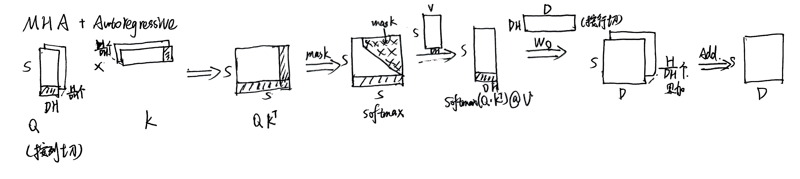
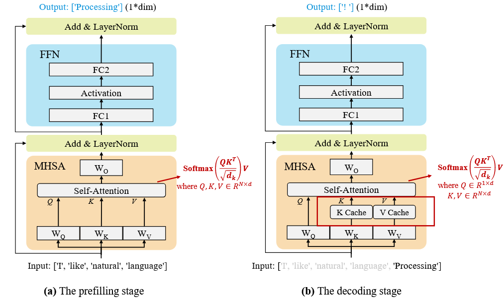
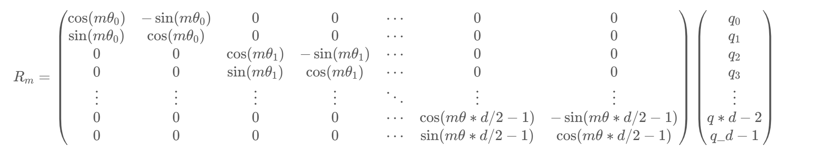
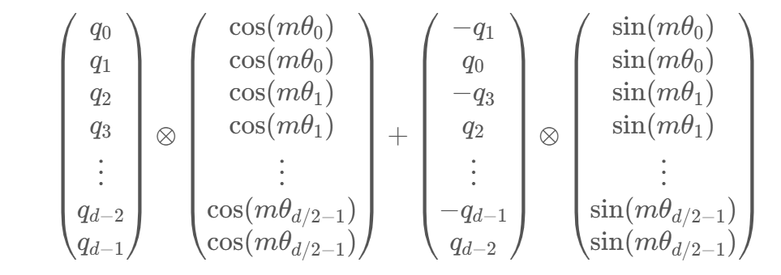
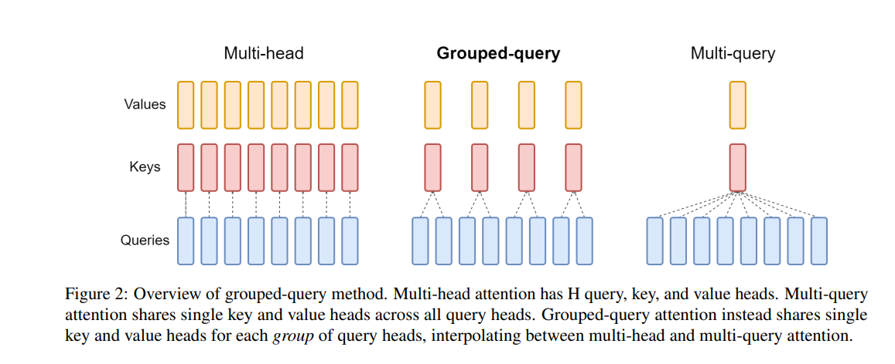
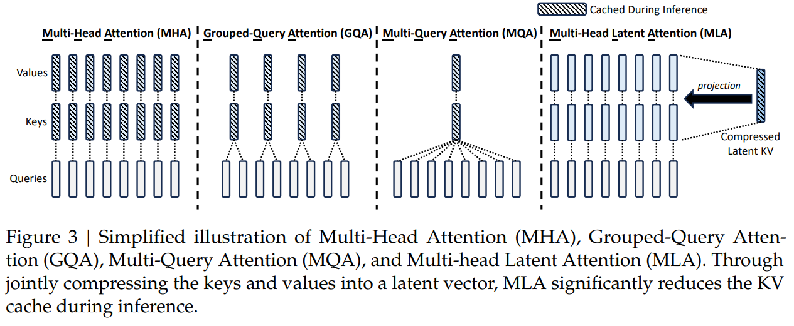
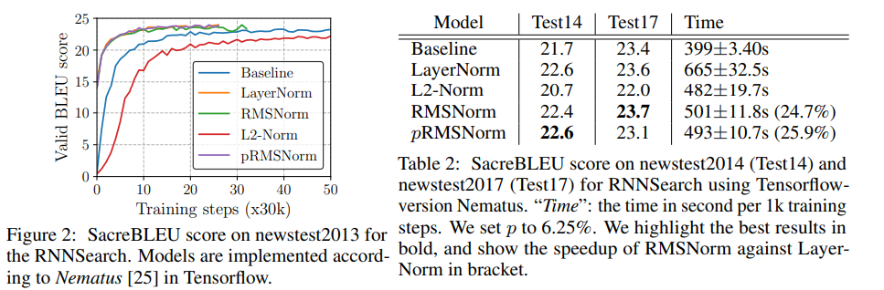
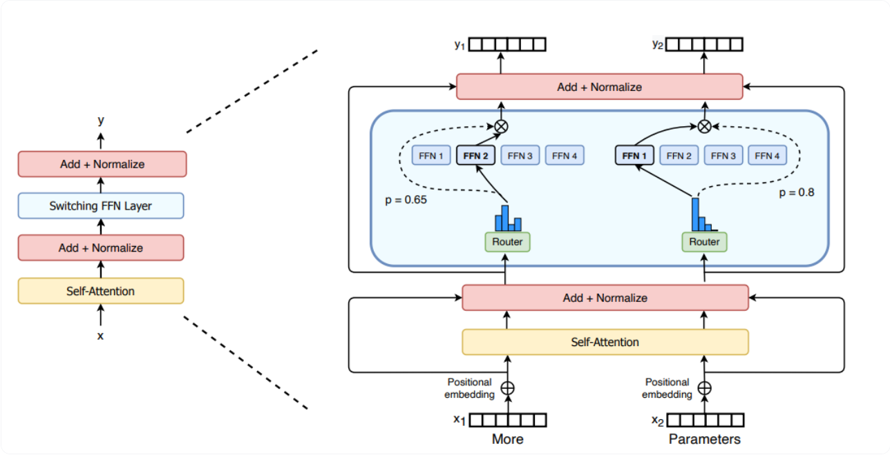
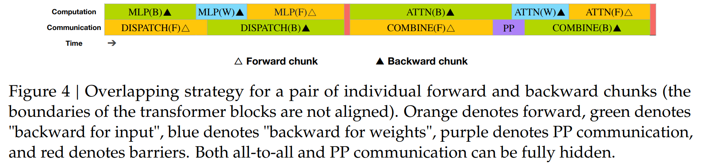
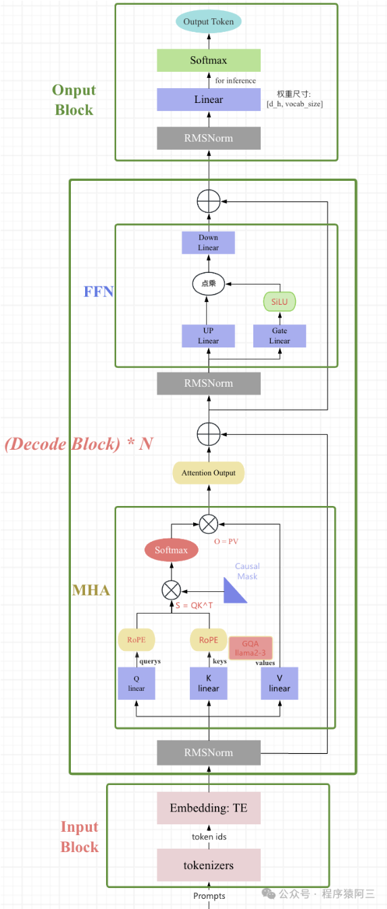

# Transformer-based LLM

现在的大模型基本是 Transformer-based 的自回归预训练模型，本章我们将以 llama2 为例介绍这种模型的基本结构。

- **Positional Encoding**: RoPE
- **Attention**: Multi-Head Attention or Multi-Query Attention or Grouped-Query Attention or Multi-Head Latent Attention or DeepSeek Sparse Attention
- **Normalization**: LayerNorm or RMSNorm
- **FFN**: MLP or SwiGLU or Mixture of Experts

## Overview

以 Transformer 架构为基础的 Large Language Models 的整体流程是基于 Transformer Block 的，每个 Transformer Block 主要由 Multi-Head Self-Attention Block，Feed Forward Network 以及 Layer Normalization 组成。每个 Transformer Block 的输入是上个 Transformer Block 的输出。



LLMs 推理是一般分为两个阶段 prefill 阶段和 decode 阶段：

- Prefill Stage: LLM 计算并存储初始输入 token 的 KV cache，并生成第一个 output token
  > 只有这个阶段 Q*K 是矩阵，decode 阶段通过 KV 缓存只会生成新的一行
- Decode Stage: LLM 通过 KV cache 逐个生成 output token，然后用新生成的 token 的 KV 对更新 KV cache
  

## Positional Encoding

一般分为两大类：绝对位置编码（Absolute Position Encoding）和相对位置编码（Relative Position Encoding）。本节将介绍这两种位置编码的区别及其重要性，并重点解析一种结合了两者优点的创新方法——旋转位置编码（Rotary Position Embedding, RoPE）

### Why we need Position Encoding

在自然语言处理领域，Transformer 模型已成为一项革命性的技术。然而，其核心的自注意力机制本身并**不具备捕捉序列中单词顺序的能力**，即位置无关性。为了解决这一问题，位置编码应运而生。

### 绝对位置编码（Absolute Position Encoding）

给序列中的每个位置一个唯一的向量，把位置信息直接加到 token embedding 上。

1. **固定式**：不用学习参数，能推广到比训练时更长的序列
   在最初的 Transformer 论文《Attention Is All You Need》中，作者使用正弦和余弦函数来生成这些位置编码。其数学表达式如下：

$$
\begin{aligned}
PE_{(pos, 2i)} &= \sin\left(\frac{pos}{10000^{2i/d_{model}}}\right) \\
PE_{(pos, 2i+1)} &= \cos\left(\frac{pos}{10000^{2i/d_{model}}}\right)
\end{aligned}
$$

2. **可学习式**：模型可以学到适合任务的位置信息。训练时没见过的长序列可能无法泛化
   $$
   PE_{pos} = \text{Embedding}(pos)
   $$

---

### 相对位置编码（Relative Position Encoding）

相对位置编码是根据单词之间的相对位置关系来计算位置编码。这种编码方式更加灵活，**能够捕捉到不同单词之间的相对位置信息**，有助于模型更好地理解序列中单词之间的关系。但是也有缺点，计算效率低下，同时大部分相对编码都没有落地可行性。

---
### ALiBi: Attention with Linear Biases
不给 token embedding 加位置向量，也不旋转 Q/K，而是在 attention score 上按距离直接减去一个线性惩罚。形式通常写成：

$$
  \mathrm{score}_{ij}=
  \frac{Q_i K_j^\top}{\sqrt{d}}-
  m_h \cdot (i-j),
  \qquad (j \le i)
$$
其中：

- $m_h$ 是第 $h$ 个 head 的 slope
- 距离越远，惩罚越大
- 不同 head 有不同 slope，有的更看近处，有的更看远处

ALiBi 原论文报告它能在较短训练长度下外推到更长输入，并且几乎不增加参数和运行成本
很多现代 LLM 实践里，效果通常仍不如 RoPE 家族稳定全面
### Rotary Position Embedding (RoPE)

将位置编码与词向量通过旋转矩阵相乘，使得词向量不仅包含词汇的语义信息，还融入了位置信息

$$
(R_mq)^T(R_nk) = q^TR_m^TR_nk = q^TR_{m-n}k
$$

给位置为 m 的向量 q 乘上矩阵$(R_m$)、位置为 n 的向量 k 乘上矩阵$(R_n$)用变换后的 Q,K 序列做 Attention，Attention 就自动包含相对位置信息

- 相对位置感知：使用**绝对位置编码来达到相对位置编码的效果**，RoPE 能够自然地捕捉词汇之间的相对位置关系。

- 无需额外的计算：位置编码与词向量的结合在计算上是高效的。

- 适应不同长度的序列：RoPE 可以灵活处理不同长度的输入序列。

---

#### 目的

我们假设通过下述运算来给 q,k 添加绝对位置信息，然后通过 Attention 的内积运算，内积的结果带有相对位置信息：

$$
\tilde{q}_m = f(q, m), \quad \tilde{k}_n = f(k, n) \tag{1}
$$

$$
⟨f(q,m),f(k,n)⟩=g(q,k,m−n)\tag{2}
$$

所以我们要求出该恒等式的一个（尽可能简单的）解。求解过程还需要一些初始条件，显然我们可以合理地设 $f(q,0)=q$ 和 $f(k,0)=k$

---

#### 实现

位置 m 的编码进行解方程，我们得到二维情况下用复数表示的 RoPE：

$$
f(q, m) = R*f(q, m) e^{i \theta f(q,m)}
= |q| e^{i(\Theta(q) + m\theta)}
= qe^{im\theta} \tag{3}
$$

矩阵形式：

$$
f(q, m) =
\begin{pmatrix}
\cos (m\theta) & -\sin (m\theta) \\
\sin (m\theta) & \cos (m\theta)
\end{pmatrix}
\begin{pmatrix}
q_0 \\
q_1
\end{pmatrix}
\tag{4}
$$

由于内积满足线性叠加性，因此任意偶数维的 RoPE，我们都可以表示为二维情形的拼接，即



:warning: 由于$(R_m$)具有稀疏性，不建议使用 matmul 进行实现，建议使用下面的方式实现：其中$(\odot$)是逐位对应相乘，即 Numpy、Tensorflow 等计算框架中的 ∗ 运算



#### 问题
- **位置维度和内容维度强耦合**：对于一些架构，特别是 MLA 这类压缩 attention 表达的结构，可能不希望所有维度都带旋转位置信息
- **对上下文扩展很敏感**：所以后来有很多 “RoPE scaling / interpolation / NTK-aware scaling / YaRN / LongRoPE”等变体

---
### Partial RoPE
只对 Q/K 的一部分维度施加 RoPE，剩下维度保持不旋转。

假设 `head_dim` 是 $d$，只对前 $d_r$ 维做旋转，后面 $d - d_r$ 维不动：

$$
  q =
  \begin{bmatrix}
  q^{(\mathrm{rope})} \\
  q^{(\mathrm{plain})}
  \end{bmatrix}
$$

$$
  k =
  \begin{bmatrix}
  k^{(\mathrm{rope})} \\
  k^{(\mathrm{plain})}
  \end{bmatrix}
$$

然后：

$$
  q' =
  \begin{bmatrix}
  R_m\, q^{(\mathrm{rope})} \\
  q^{(\mathrm{plain})}
  \end{bmatrix}
$$

$$
  k' =
  \begin{bmatrix}
  R_n\, k^{(\mathrm{rope})} \\
  k^{(\mathrm{plain})}
  \end{bmatrix}
$$

最后 score 变成：

$$
  \mathrm{score}_{mn}=
  \frac{
  \left\langle R_m q^{(\mathrm{rope})},\, R_n k^{(\mathrm{rope})} \right\rangle
  +
  \left\langle q^{(\mathrm{plain})},\, k^{(\mathrm{plain})} \right\rangle
  }{\sqrt{d}}
$$
#### 目的
- 不是所有维度都需要位置敏感：有些维度更适合表达语义内容，不一定适合被相位旋转。

- 降低长上下文时的高频扭曲：RoPE 的高频维度在超长外推时更容易出问题。只让部分维度承担旋转，可以减少这种影响。

- 适配 MLA / latent attention 一类结构：在 MLA 里，Q/K/V 有更强的低秩压缩和结构约束。把所有维度都塞进 RoPE，**可能会损伤压缩后的表达效率**。近年的 MHA2MLA 工作就把 partial RoPE 作为关键设计之一，用来仅保留对 attention 分数更重要的旋转维度
---
### RoPE Scaling
训练只见过 $L_{\text{train}}$，推理要跑更长 $L_{\text{test}}$，那就不要让位置 m 直接照原公式进旋转，而是做一个缩放：
$$
 m' = m / s
$$

或者某种非线性映射，再代入旋转角度。
直觉上是把更长序列压缩映射回训练时更熟悉的角度范围，减轻超长时的相位失真。

---

## Attention Series

- 在 **MHA (Multi Head Attention)** 中，每个头有自己单独的 key-value 对；标准的多头注意力机制，h 个 Query、Key 和 Value 矩阵。
- 在 **MQA (Multi Query Attention)** 中只会有一组 key-value 对；多查询注意力的一种变体，也是用于自回归解码的一种注意力机制。与 MHA 不同的是，MQA 让所有的头之间共享同一份 Key 和 Value 矩阵，每个头只单独保留了一份 Query 参数，从而大大减少 Key 和 Value 矩阵的参数量。
- 在 **GQA (Grouped Query Attention)** 中，会对 attention 进行分组操作，query 被分为 N 组，每个组共享一个 Key 和 Value 矩阵 GQA 将查询头分成 G 组，每个组共享一个 Key 和 Value 矩阵。
  - GQA-G 是指具有 G 组的 grouped-query attention。
    > GQA-1 具有单个组，因此具有单个 Key 和 Value，等效于 MQA。而 GQA-H 具有与头数相等的组，等效于 MHA。



---

### Why GQA?

ARM 中，Attention 的瓶颈并不在算力，而在 KV cache 的显存和带宽。

MQA 和 GQA 的出发点都是**减少 KV Cache 的显存占用和内存带宽**，从而提升推理速度。但是 MQA 所有的 Query 头都共享同一组 Key 和 Value，导致模型表达能力下降。而 GQA 则通过将 Query 头分组，每组共享一组 Key 和 Value，在一定程度上保留了模型的表达能力，同时仍然减少了 KV Cache 的显存占用和内存带宽。

---

### Multi-Head Latent Attention(MLA)

**目的**：不完全将 head 的 K/V 去掉，而是用一个低秩 latent 表示，把 head-specific 的投影推迟到计算时完成。

- KV cache 与 head 数无关
- 推理阶段 等价于 MQA
- 训练阶段 仍保留 MHA 的多头表达能力
- 吸收操作可防止 KV 缓存恢复到其原始大小。



#### KV Cache

对长度为 $T$ 的序列，MLA KV cache 实际是：

$$
\Bigl\{
\underbrace{c_i}_{\text{shared content}},\;
\underbrace{k_i^r}_{\text{shared RoPE key}}
\Bigr\}_{i=1}^T
$$

| 方案 | KV cache 大小（近似）            |
| ---- | -------------------------------- |
| MHA  | $T \times H \times d_k \times 2$ |
| GQA  | $T \times G \times d_k \times 2$ |
| MLA  | $T \times (d_c + d_r)$           |

其中：

$$
d_c \ll H d_k,\qquad d_r \ll d_c
$$

---

#### 训练阶段

- 在训练阶段，除了多了一步低秩投影以及只在部分维度加 RoPE 外，MLA 与 Q、K 的计算与 MHA 是基本相同的
  > RoPE 的$R_m$计算后投影矩阵与位置相关，为了解决这个问题，对 Q 和 K 的低秩投影分为两部分，**一部分是原始的投影矩阵，另一部分是与位置相关的投影矩阵**

**标准 MHA:**

对第 i 个 token 第 s 个 head：

$$
q^{(s)}_i=x_iW^{(s)}_q,\quad k^{(s)}_i=x_iW^{(s)}_k, \quad v^{(s)}_i=x_iW^{(s)}_v
$$

kv cache 需要存储所有的 $k^{(s)}_i、v^{(s)}_i$，与 head 数成正比。


**MLA:**
MLA 在 KV 计算前增加一层**共享低秩投影**

$$
c_i = x_i W_c
$$

接着做 head-specific 投影：

$$
q^{(s)}_i=x_iW^{(s)}_q,\quad k^{(s)}_i=c_iW^{(s)}_k, \quad v^{(s)}_i=c_iW^{(s)}_v
$$

---

#### 推理阶段
利用矩阵吸收实现 MQA 级推理效率。
- 避免了在推理阶段将 K 恢复到原始大小的昂贵操作。
- 在线阶段就不必先恢复 full value 再做 output projection，而是可以直接从 latent 输出映射到最终 hidden，减少中间张量和访存。


注意力 logits：

$$
q_t^{(s)} k_i^{(s)\top}
= (x_t W_q^{(s)}) (c_i W_k^{(s)})^\top
$$

重写为：

$$
= x_t \underbrace{(W_q^{(s)} W_k^{(s)\top})}_{\text{吸收到 Q 中}} c_i^\top
$$

定义新的 Query 投影矩阵：

$$
\tilde{W}_q^{(s)} = W_q^{(s)} W_k^{(s)\top}
$$

于是：

$$
q_t^{(s)} k_i^{(s)\top} = (x_t \tilde{W}_q^{(s)}) c_i^\top
$$

---

原始输出：

$$
o_t^{(s)} = \sum_i \alpha_{ti}^{(s)} v_i^{(s)} = \sum_i \alpha_{ti}^{(s)} (c_i W_v^{(s)})
$$

$$
o_t^{(s)} = \Bigl(\sum_i \alpha_{ti}^{(s)} c_i\Bigr) W_v^{(s)}
$$

定义：

$$
u_t^{(s)} = \sum_i \alpha_{ti}^{(s)} c_i
$$

于是：

$$
o_t^{(s)} = u_t^{(s)} W_v^{(s)}
$$

在 Transformer 里，多头输出会 concat 然后乘一个输出矩阵 $W_o$：

$$
y_t = [o_t^{(1)}, \dots, o_t^{(h)}]\, W_o
$$

把上面的 $o_t^{(s)} = u_t^{(s)} W_v^{(s)}$ 代进去，相当于：

$$
y_t = \Bigl[u_t^{(1)},\dots,u_t^{(h)}\Bigr]\; \tilde{W}_o,\qquad
\tilde{W}_o \triangleq \text{diag}\bigl(W_v^{(1)},\dots,W_v^{(h)}\bigr) W_o
$$

---

**KV cache 只需要缓存：**

$$
\{ c_i \}_{i=1}^T
$$

与 head 数 $h$ 完全无关，所有 head 共享同一份 KV latent。**与 head 相关的信息全部吸收到 Query 和输出矩阵中。**

---

#### RoPE 解耦

- 和位置无关的内容部分已经被压成共享 latent $c_i$，per-head 的差异被全部搬到**Q / 输出侧的矩阵**里；
- 和位置有关的 RoPE 部分，K 也是共享的，但每个 head 的 Q 不一样，所以每个 head 看到的 logits 还是不同的。

为 RoPE 是一个跟位置相关分块对角矩阵$R_m$，满足$R_mR^⊤_n=R_{m−n}$，MLA 加入 RoPE 之后会让固定的投影矩阵与位置相关：

$$
q^{(s)}_i=x_iW^{(s)}_qR_i,k^{(s)}_i=x_iW^{(s)}_kR_i
$$

$$
q^{(s)}_tk^{(s)T}_i=(x_tW^{(s)}_q)(c_iW^{(s)}_k)^T = x_t(W^{(s)}_qR_{t-i} W^{(s)T}_k)c_i^T
$$


这里的 $W^{(s)}_qR_{t-i} W^{(s)T}_k$ 就无法合并为一个固定的投影矩阵了（跟位置差 $t−i$ 相关），从而 MLA 的想法无法结合 RoPE 实现。

**每个 Attention Head 的 Q、K 新增 $d_r$ 个维度用来添加 RoPE**，其中 K 新增的维度每个 Head 共享：

$$
o_t = \big[o_t^{(1)}, o_t^{(2)}, \cdots, o_t^{(h)} ,\big]
$$

$$
o_t^{(s)} = Attention\left(q_t^{(s)}, k_{\le t}^{(s)}, v_{\le t}^{(s)}\right)
= \frac{\sum_{i \le t} \exp\left(q_t^{(s)} k_i^{(s)\top}\right) v_i^{(s)}}
{\sum_{i \le t} \exp\left(q_t^{(s)} k_i^{(s)\top}\right)}
$$

$$
q_i^{(s)} = [x_i W_{qc}^{(s)},x_i W_{qr}^{(s)}R_i] ,\quad
k_i^{(s)} = [c_i W_{kc}^{(s)},x_i W_{kr}R_i] ,\quad
v_i^{(s)} = c_i W_v^{(s)}, \quad
c_i = x_i W_c
$$


**Why RoPE-K shared?**

K 矩阵仅需共享的 $W_{kr}$；head 间的差异完全由各自的 $W_{qr}^{(s)}$ 在 Q 侧体现。

---
#### 完整推理过程

- 生成 Query

  - 内容部分（已吸收）：

  $$
  q_{absorb} = x_t W_{DQ} W_{Q_{absorb}} \quad (H \times d_c)
  $$

  - 位置部分：

  $$
  q_{rope} = \text{RoPE}(x_t W_{DQ} W_{QR}) \quad (H \times d_r)
  $$

- 生成并缓存 KV

  $$
  c_{KV_t} = x_t W_{DKV}
  $$

  $$
  k_{rope_t} = \text{RoPE}(x_t W_{KR})
  $$


- Attention 分数计算

  - 内容分数：

  $$
  S_{content} = q_{absorb} \cdot C_{KV\_cache}^T
  $$

  - 位置分数：

  $$
  S_{rope} = q_{rope} \cdot K_{rope\_cache}^T
  $$

  - 总分数：

  $$
  Scores = \frac{S_{content} + S_{rope}}{\sqrt{d_{head}}} + \text{Mask}
  $$

  $$
  Probs = \text{Softmax}(Scores)
  $$


- Value 聚合（在压缩空间）

  $$
  u_t = \sum_{i=1}^T Probs_i \cdot C_{KV_i}
  $$

  形状：$(H, d_c)$。


- 输出投影

  $$
  y_t = \text{Flatten}(u_t) \cdot W_{O_{absorb}}
  $$

  映射回 $d_{model}$ 维。
---

### Linear Attention
所以 linear attention 的核心目标就是：
> 避免显式构造 $N \times N$ 的 attention matrix，把复杂度从二次降到线性。


---
## Normalization

- LayerNorm: 对某个样本的所有特征维度进行归一化

  $$
  \text{LayerNorm}(x) = \frac{x - \mu}{\sigma} \cdot \gamma + \beta
  $$

- RMSNorm: 简化版的 LayerNorm，它不减去均值，只基于平方均值 (Root Mean Square) 来归一化
  $$
  \text{RMSNorm}(x) = \frac{x}{\sqrt{\frac{1}{d}\sum_{i=1}^{d} x_i^2 + \epsilon}} \cdot w
  $$

---

### Why RMSNorm?

- Layer-Norm 和 RMS-Norm 在测试集效果上没有明显差异，基本持平
- RMS-Norm 的计算效率要更高



---

## Feed Forward Network 
### Dense FFN

- MLP: 两层全连接网络，中间使用非线性激活函数（如 ReLU 或 SiLU）

  $$
  \text{FFN}(x) = \text{ReLU}(0, xW_1)W_2
  $$

- SwiGLU: 使用 SiLU 激活函数的变体并增加门控机制
  $$
  \begin{aligned}
  \text{SwiGLU}(x) &= (\text{Swish}(xW_1);\odot;xW_2) \\
  \text{Swish}(x) &= x \cdot \sigma(x)
  \end{aligned}
  $$

---

### Mixture of Experts (MoE)

- Mixture of Experts (MoE): 多个专家网络的集合，每个输入样本通过一个路由器选择部分专家进行处理，从而提高模型的表达能力

  - Switch Transformer：Top-1 gating，每个 token 只去 1 个专家。
  - GShard / GLaM：Top-2 gating，每个 token 走 2 个专家，结果加权。
  


#### Why we need MoE?

Dense FFN 的**计算量随着模型规模的增大而迅速增加**，MoE 通过引入多个专家网络，并让每个输入样本只激活其中的一部分专家，从而在保持模型表达能力的同时，大幅降低了计算资源的消耗。

MoE 的参数量巨大，但实际 activation 只用到一小部分专家

$$
\begin{aligned}
FFN(x) &= W_2 \sigma (W_1 x) \\
MoE(x) &= \sum_{e \in TopK(x)} g_e(x) \cdot Expert_e(x)
\end{aligned}
$$

#### MoE 优势
- 将参数数量与参数激活量解耦
  - 参数效率极高：Dense 70B ≈ MoE 600B（激活 40B）
- 推理成本可控：
  - 每 token 只算 K 个 expert
  - 理论 FLOPs 接近中型 Dense 模型
- 每个专家可以学到不同的知识领域，模型的整体能力提升

#### MoE 挑战
原本很规整的 dense 计算，变成了：

- 动态路由

- 不规则 token 分布

- 跨设备数据交换

- 很多小而不均匀的专家 batch

- 额外的 gather/scatter / permutation / combine
```
hidden states
  → router logits
  → top-k select
  → token 按 expert 分桶 / 排序 / 重排
  → 跨卡发给对应 expert（all-to-all）
  → 每个 expert 做 MLP
  → 结果再跨卡收回（all-to-all）
  → 恢复原 token 顺序
  → combine / weighted sum
```
##### 训练挑战
- 路由不均衡，部分专家过载，其他专家不能学到知识
  - 如果使用辅助损失（auxiliary loss） 来鼓励负载均衡，**辅助损失过大会损害模型性能。**
- Token-Dropping，每个 expert 在一次 forward 中能处理的 token 数是有限的：
  $$capacity=capacity_factor \times \frac{tokens}{experts}$$
  太多 token 同时路由到同一个 expert 时，就会发生丢 token。
  > [!IMPORTANT] 
  > **路由不均 + 容量有限**共同造成了 token-dropping 现象
- 稀疏激活带来的优化困难
  - 每个 GPU 的负载不同容易形成很多小矩阵乘，很难保持高 occupancy 和高 cache 命中
- 通信开销大，需要两次 all2all 通信
  ```shell
  tokens
    ↓ routing
  scatter to experts (all-to-all)
    ↓ expert compute
  gather back (all-to-all)
  ```
  - 大规模集群中，需要将通信开销与计算开销 overlap

    

##### 推理挑战
- routing 导致的动态不规则 workload
  - 负载倾斜：有些 GPU 上热门专家非常忙，其他 GPU 空闲。
  - 小批量 GEMM：很多 expert 只拿到很少 token，导致 MLP GEMM 变成瘦高矩阵或超小 batch，Tensor Core 利用率差。
  - 动态 shape：每一步每层每个 expert 的 token 数都变，难以做静态最优调度，也不利于 CUDA Graph 这类静态捕获。

- token permutation / unpermutation 开销大
  - 很多非连续访存，是 memory-bound
- 专家热点与真实流量分布不一致

**推理优化**
- 并行策略：
  - DP：数据并行，不同副本处理不同请求
  - TP：张量并行，同一个大矩阵切开
  - EP：专家并行，不同 expert 放在不同 GPU
- Grouped GEMM + permutation kernel：
  - 将多个 expert MLP 小矩阵乘合并成一个大矩阵乘，提升 Tensor Core 利用率
  - 用 专门的 permutation kernel 降低重排开销
  - 尽量把 permutation 和 grouped GEMM 更紧地接起来
- all-to-all & compute overlap:
  - dispatch/combine 主要是数据搬运，expert MLP 是算数密集，两者资源侧重点不同，所以理论上可以流水并发
  - TBO(two-batch-overlap)：把一个大 ForwardBatch 拆成两个可以交错执行的子 batch，然后在单层 forward 内部，按预定义阶段显式穿插执行。
    - decode/verify：两个batch对半分 sequence，交错执行
    - prefill/extend：按 extend token 总量均衡切分
    - 在定义好的 operation 上交错执行
      ```
      Stage 0 = attn prepare
      Stage 1 = attn core + gate/select_experts
      Stage 2 = dispatch_a + shared_expert
      Stage 3 = dispatch_b + experts + combine_a
      Stage 4 = combine_b
      Stage 5 = output
      ```
    
  

- EPLB(在线负载均衡)：
  - 服务时 expert rebalance：
    - 统计最近若干 step 各 expert 的 token 数
    - 调整 expert 到 EP rank 的映射
    - 把热门专家复制到更多 rank 上
    - 让 routing 更容易命中本地或较空闲的 rank
  - SGLang 做法
    - 重要对象：
    - `EPLBManager`：负责周期触发、算新布局、切 chunk，并在 chunk 之间 yield。
    - `ExpertLocationMetadata`：维护逻辑布局表，描述每个 physical slot 当前代表哪个 logical expert。
    - `ExpertLocationUpdater`：负责把真实 expert 权重切片复制到对应 GPU 槽位。
    - 基于 expert 热度统计做周期性重平衡：统计的是每个 expert 被多少 token 命中
    - 分层 placement：会优先把某个 rank 的 logical expert 映射最近的 replica：同 GPU 优先，其次同节点，最后随机补齐，再把物理 expert 权重分发到 GPU。
      - --eplb-rebalance-layers-per-chunk，由全模型一次迁移变成每次只迁一部分 layer
    - 重平衡是在model_runner.forward() 后调用on_forward_pass_end() 推进 Generator 入口，然后再进入 rebalance()、update_expert_location() 等流程
      - 新布局先整体算出来
      - 先 yield，等下一个 forward 结束，再执行这一个 chunk 的 update_expert_location()
      - 常规情况下：先把真实权重搬到目标 physical slot，再把逻辑映射切过去
        - 权重复制：updater 会找到需要复制的 logical_expert_id 当前实际在哪些源槽位/源 rank 上有权重。然后把对应参数切片复制到本地目标槽位
- 使用 CUDA Graph，基于预设的 cuda-graph-max-bs 来捕获图
  
## LLAMA2 模型结构

- 相较于 Transformer，llama2 使用了 pre-norm 结构

- 使用 RMSNorm 替代 LayerNorm，不计算样本均值

- 使用 Rotary Positional Encoding (RoPE)，用绝对编码的方式来实现相对位置编码

- 使用 GQA (Grouped-Query Attention)，平衡效率和性能

- 使用 SwiGLU 替代简单的 MLP，激活函数使用 SiLU

  $$
  \begin{aligned}
  \text{SwiGLU}(x) &= \text{Swish}(xW_1+b_1)\odot(xW_2+b_2) \\
  \text{Swish}(x) &= x \cdot \sigma(x)
  \end{aligned}
  $$

> [!IMPORTANT]
> 一般 embedding 和最后模型输出前的 LMHead 层会共享权重



## 推理时的计算量和显存占用
### FLOPs
在推理时，只有前向传播，没有反向传播。
1. 经验公式（Rule of Thumb）
   对于任何 Transformer 模型，生成一个 Token 的浮点运算次数（FLOPs）约为：
   $$\text{FLOPs/token} \approx 2 \times P$$
   - 其中 $P$ 是模型参数数量。

2. 两个阶段的具体计算假设模型参数量为 $P$（例如 7B 模型，$P \approx 7 \times 10^9$），输入 Prompt 长度为 $L_{in}$，生成长度为 $L_{gen}$。
   - Prefill 阶段 (处理 Prompt)一次性并行处理 $L_{in}$ 个 token。
     - 总 FLOPs $\approx 2 \cdot P \cdot L_{in}$
     - 特点：Compute-bound（计算密集型）。GPU 利用率通常很高，像是在做矩阵乘法。
   - Decode 阶段 (逐个生成)每步生成 1 个 token，共生成 $L_{gen}$ 次。
     - 单步 FLOPs $\approx 2 \cdot P + \text{Attention Cost}$
     - Attention Cost：随着序列变长，$Q \cdot K^T$ 的计算量是线性的 $O(T)$。但在常见的上下文长度（如 < 8k）下，相对于巨大的参数量 $P$，Attention 的计算量通常可以忽略不计。
     - 特点：Memory-bound（访存密集型）。这是推理慢的核心原因——虽然计算量只有 $2P$，但每算一个 token 都要把几十 GB 的模型权重从显存搬到计算单元，显存带宽（Bandwidth）成为了瓶颈。
### 显存占用
显存占用主要由三部分组成：模型权重 (Weights)、KV Cache、激活值 (Activation)。

1. 模型权重 (Model Weights) 
   - 公式：$P \times \text{Precision}$
   - 示例 (7B 模型)：FP16 (2 Bytes): $7 \times 10^9 \times 2 \approx \textbf{14 GB}$
2. KV Cache —— 随着序列长度（Context Length）和 Batch Size 的增加，KV Cache 会迅速膨胀，甚至超过模型权重。
   - 公式 (MHA)：$$\text{Mem}_{KV} = 2 \times B \times L \times H \times d_{head} \times \text{Precision}$$
   - GQA: 将 $H$ 变为 $G$ (例如 32头变 8头)，KV Cache 减少 4 倍。
   - MLA: 将 $H \times d_{head}$ 压缩为极小的 Latent 维度 $d_c + d_r$，KV Cache 极度压缩
3. 激活值 (Activations)
   - 这是前向传播时的中间结果（每一层的输出）。在推理时，我们不需要存反向传播的梯度，用完即丢。
   - 占用相对较小，主要取决于 $B \times L \times d$

### 场景分析
- 场景 A：个人用户 / 边缘端推理 (Batch=1, 长度 < 4k)
  - 模型权重以 LLaMA-7B (FP16) 为例：权重：~14 GB
  - KV Cache (4k长度): $\approx 2 \times 1 \times 4096 \times 32 \times 128 \times 2 \approx 0.06 \text{ GB}$ 
  - 此时优化 KV Cache 意义不大，量化权重（INT4）才是关键。
- 场景 B：企业级服务 / 长文本推理 (Batch=64, 长度=32k)
  - 以 LLaMA-7B (FP16) 为例：权重：~14 GB (固定不变)
  - KV Cache: $2 \times 64 \times 32768 \times 32 \times 128 \times 2 \approx \textbf{34.3 GB}$
    > KV Cache 远超模型权重
  - 这就是为什么 DeepSeek (MLA) 和 LLaMA-3 (GQA) 如此重要的原因——如果不压缩 KV Cache，显存会在长窗口、高并发下瞬间爆满，导致 OOM (Out of Memory)。
### 总结
| 指标                        | Prefill 阶段              | Decode 阶段                  |
| --------------------------- | ------------------------- | ---------------------------- |
| 计算量 (FLOPs)              | 巨大：$2 \cdot P \cdot L$ | 较小：$2 \cdot P$            |
| 瓶颈                        | 算力瓶颈（GPU Compute）   | 带宽瓶颈（Memory Bandwidth） |
| 显存大头（短序列）          | 模型权重                  | 模型权重                     |
| 显存大头（长序列 / 高并发） | KV Cache                  | KV Cache                     |


## 参考资料

1. [结构篇| 浅析 LLaMA 网络架构](https://zhuanlan.zhihu.com/p/10815570163)
2. [苏剑林. (Mar. 23, 2021). 《Transformer 升级之路：2、博采众长的旋转式位置编码 》[Blog post]. Retrieved from https://kexue.fm/archives/8265](https://kexue.fm/archives/8265)
3. [苏剑林. (May. 13, 2024). 《缓存与效果的极限拉扯：从 MHA、MQA、GQA 到 MLA 》[Blog post]. Retrieved from https://spaces.ac.cn/archives/10091](https://spaces.ac.cn/archives/10091)
4. [DeepSeek-V2: A Strong, Economical, and Efficient
   Mixture-of-Experts Language Model](https://arxiv.org/pdf/2405.04434)
5. [Root Mean Square Layer Normalization](https://arxiv.org/pdf/1910.07467)
6. [Switch Transformers: Scaling to Trillion Parameter Models with Simple and Efficient Sparsity](https://arxiv.org/abs/2101.03961)
