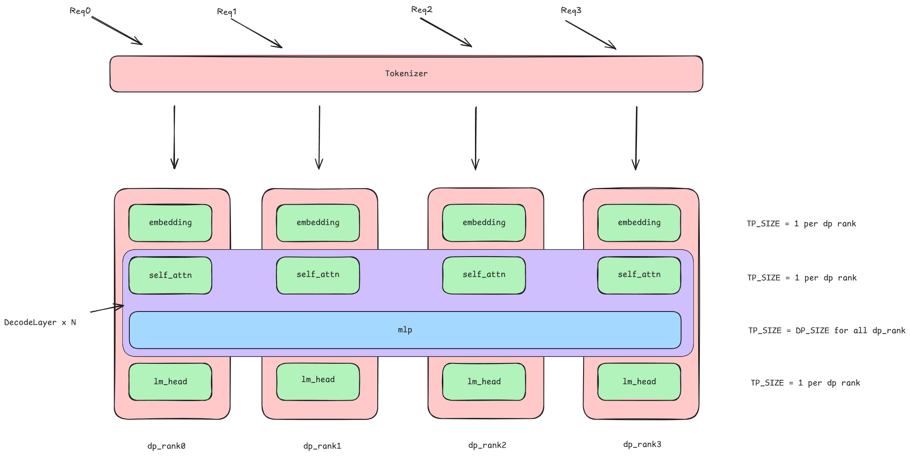

# Data Parallelism in Attention in SGLang

## What is Data Parallelism in Attention?

⚠ **这里的 `dp_size` 不是传统的数据并行而是 `attentnion dp`**
其目的是将一个大的张量并行（TP）组**重组为几个较小的 TP 组** ，这些较小的 TP 组又形成一个**专门用于注意力层的新的数据并行（DP）组**。

1. 对于模型中除 MLP 层以外的部分（如 Embedding, Self-Attention），每个数据并行单元（DP_Rank）内部的张量并行规模（TP_Size）设置为 1，即每个 DP_Rank 独立计算这些部分。
2. 对于 MLP 层，所有 DP_Rank 则共同组成一个大的张量并行组（TP_Group），该组的大小等于数据并行的规模（DP_Size）。


## 启动流程

1.  engine 会启动一个子进程执行 `run_data_parallel_control_process`
2.  该函数启动 DataParallelController 并执行 `launch_dp_attention_schedulers`
    - 为每个 dp rank 获取单独的 zmq 通信接口
    - 调用 `launch_tensor_parallel_group`
3.  `launch_tensor_parallel_group` 对每个 (pp_rank, tp_rank) 启动一个 Schedular 子进程 - 父进程在这里阻塞等待每个子进程通过 pipe 发送初始化信息（通常包含：模型已加载完成、模型的 buffer/kv 配置、最大 token 长度等

    ```python
	scheduler = Scheduler(
			server_args,
			port_args,
			gpu_id,
			tp_rank,
			moe_ep_rank,
			pp_rank,
			dp_rank,
		)
	pipe_writer.send(
				{
					"status": "ready",
					"max_total_num_tokens": scheduler.max_total_num_tokens,
					"max_req_input_len": scheduler.max_req_input_len,
				}
			)
			
	# PP + TP
	┌─────────────── Pipeline Stage 0 ───────────────┐
	TP=0→ │ TP Rank 0 │ TP Rank 1 │ TP Rank 2        │
	├─────────────── Pipeline Stage 1 ───────────────┤
	TP=1→ │ TP Rank 3 │ TP Rank 4 │ TP Rank 5        │
	├─────────────── Pipeline Stage 2 ───────────────┤
	TP=2→ │ TP Rank 6 │ TP Rank 7 │ TP Rank 8        │
	└────────────────────────────────────────────────┘
	```


4. ModelRunner 初始化时执行 `initialize_dp_attention`，
   - 计算 `attn_tp` 的大小以及对应的 `attn_tp_rank` 以及 `attn_dp_rank`
   - 并据此创建 attention-specific group coordinator（attn_tp_group）
   - 设置 Gather 时候的 Buffer
	    > 为 Gather buffer 预留 `attn_tp_size` 倍的空间

以[上面的图](#what-is-data-parallelism-in-attention)为例

| tp_rank | attn_tp_size | attn_dp_rank | attn_tp_rank |
| ------- | -----------: | -----------: | -----------: |
| 0       |            1 |            0 |            0 |
| 1       |            1 |            1 |            0 |
| 2       |            1 |            2 |            0 |
| 3       |            1 |            3 |            0 |
## 执行流程

与正常执行类似，都先执行 `recv_requests` 和 `process_input_requests`

1. 在 `get_next_batch_to_run` 中执行 `prepare_mlp_sync_batch`
2. `prepare_mlp_sync_batch` 在 (dp_size, attn_tp_size）维度上收集每个 worker 的 batch/forward-mode 信息（包括 token 数、是否能跑 CUDA graph、logprob 相关长度、是否为 extend、以及 TBO 相关的 all-gather 元数据），然后合并回每个本地 `local_batch`

   - 若本地没任务，但任一其它 DP 副本有任务（表示全局不是完全空闲），则通过 `get_idle_batch()` 获取一个占位 `ScheduleBatch`，便于该 worker 参与后续同步/并行（例如同步 MLP gather 或 KV cache 操作），避免因为某些 worker 缺失导致收集/通信异常。
   - 最后返回 `local_batch` 作为此次的 new_batch

     ```python
         def get_idle_batch(self):
             idle_batch = ScheduleBatch.init_new(
                 [],
                 self.req_to_token_pool,
                 self.token_to_kv_pool_allocator,
                 self.tree_cache,
                 self.model_config,
                 self.enable_overlap,
                 self.spec_algorithm,
             )
             idle_batch.prepare_for_idle()
             return idle_batch
     ```


3. 变为 `ModelWorkerBatch` 后调用 `TpModelWorker::forward_batch_generation`转化为 `ForwardBatch`，调用 `ModelRunner::forward` -> `ModelRunner::_forward_raw` 在这里进行 padding
4. 实际上是调用 `FowardBatch::prepare_mlp_sync_batch`
   - 把各个 dp rank 的 num_token 信息对齐 Attention-tp-size
     - 确保每个 DP rank 的 token 数量是 `attn_tp_size`  的倍数
     - 为后续可能的  reduce-scatter  操作做准备(**reduce-scatter 要求可被整除的分割**)
   - 每个 dp rank 本地的 batch 会根据填充模式被 padding 到指定的大小(bs = self.batchsize = num_tokens).
     - 当 `dp_padding_mode` 设置为 max 时，padding 到的 batchsize 大小为所有 dp rank 上最大的 local batch，同时对齐到 attention_tp_size;
     - 当 `dp_padding_mode` 设置为 sum 时，padding 到的 batchsize 大小为所有 dp rank 上 local batch 之和，即 global batch size
     - **is_extend_in_batch 设置 SUM，cuda_graph 设置 MAX**
3. 在完成 dp attention batch padding 后，根据 batch 类型调用`self.forward_decode` 进行模型推理。在完成推理后，调用`forward_batch.post_forward_mlp_sync_batch(ret)`
   - 复原被临时修改的属性
   - 将 padding 后的 ForwardBatch 还原，具体做法是在 prepare 时会记录原 batchsize，此时对结果进行切片

```python
# prepare
setattr(self, "_original_forward_mode", self.forward_mode)
setattr(self, "_original_batch_size", self.batch_size)

# post
self.forward_mode = getattr(self, "_original_forward_mode", self.forward_mode)
self.batch_size = getattr(self, "_original_batch_size", self.batch_size)

logits_output.next_token_logits = logits_output.next_token_logits[:bs]
logits_output.hidden_states = logits_output.hidden_states[:bs]
```

6. 最后的处理流程与常规无差别，调用 `process_batch_result` 结束此轮调度

## Why DP Attention?

它用**一次相对廉价的内存通信**（`All-Gather KV Cache`）换取了**Attention 的并行加速**，同时还**保持了 MLP 层（$O(N)$）的零通信数据并行效率**。

### Why Padding?

在 Attention 层与 MoE 层之间需要进行同步通信，对各 dp rank atttention 部分计算得到的 hidden_state 集合进行同步，**如果采用 Allgather 或者 Allreduce 通信，其对数据性状有一定的要求**

- allgather：要求每个 sub-batchsize 大小相同。因此需要把 local batchsize padding 到 max batchsize，且最后 gatheredbuffer 大小为：max_batchsize \* sync_group_size
  
- allreduce：每个 dp rank 上都有完整的数据集合(**对应 padding 到 sum batchsize**). 最后 gatheredbuffer 大小为：sum_batchsize
  
### Padding Problems

这种为了“正确性”而做的 padding，反过来又会严重影响性能，主要体现在以下两方面：

#### A. 负载不均与“掉队者” (Load Imbalance & Stragglers)

`GPU_0` 有 4 个**真实**的请求需要计算，而 `GPU_1, 2, 3` 只有 3 个**真实**的请求（和 1 个几乎不耗时的虚拟请求）。

- **结果**：`GPU_1, 2, 3` 会很快完成它们的本地计算。
- **等待**：然后，它们在 `All-Gather` 这个同步点（Barrier）上**被迫空转（Idle）**，等待 `GPU_0` 完成它那份更重的工作。
- `GPU_0` 成为了这个批次的**“掉队者” (Straggler)**，它拖慢了所有其他 GPU 的进度。

**结论：** 这导致了**极低的 GPU 利用率**。在 `dp_size=4` 的情况下，可能有 3/4 的 GPU 在大部分时间里处于空闲等待状态。

#### B. 计算和内存的额外开销 (Overhead)

1. **计算开销**：

   - 尽管是“虚拟”请求，但系统仍然需要启动 CUDA Kernel 来处理它们，这会带来一定的调度开销。
   - 更重要的是，`All-Gather` 操作本身。所有 GPU 现在都必须交换一个“大小为 4”的批次数据，而不是它们“实际”的 `[4, 3, 3, 3]`。通信量被放大了。

2. **内存开销**：

   - `All-Gather` 之后，每个 GPU 都需要分配**足够大的内存缓冲区**来接收来自所有其他 rank 的数据。
   - `GPU_1` 明明只需要 `4+3+3+3 = 13` 个请求的数据，但它**必须**按照 `4+4+4+4 = 16` 个请求（即`max_batch_per_rank * dp_size`）的**最大可能性**来分配内存。
   - 这导致了**显存（VRAM）的浪费**。
