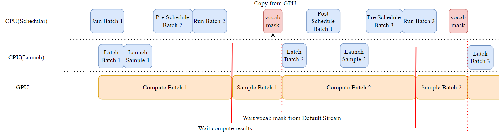

# Evolution of SGLang Scheduler

- Initially, the Scheduler operated with CPU and GPU in serial, leading to significant GPU idle time.
- Later versions of the Scheduler allowed for CPU and GPU overlap, achieving a zero-overhead scheduler.

The overall workflow of the Scheduler is shown in the figure below: [^code-walk]


We will analyze the entire Scheduler process in conjunction with the code. However, before diving into the workflow, we first need to understand the key data structures in scheduling and how they transform into one another.

## Key Structure

### Scheduler

The `Scheduler` component is responsible for managing Active Requests. The following core global data structures are used to maintain these Active Requests within the `Scheduler`.

#### `waiting_queue`

- **Purpose:** `waiting_queue` is a data structure designed to hold Active Requests. It dynamically reorders these requests based on priority (longest prefix of the Request) or available memory to optimize batch processing.
- **Additional Points**
  - **Enqueue**
    - Newly arrived Requests.
    - Requests returned from `retract_decode`.
  - **Dequeue** The request with the highest current priority is dequeued to form a batch.

#### `new_batch`

- **Purpose:** Represents a batch of Requests ready for the prefill/extend phase.
- **Additional Points**
  - **Chunked Prefill:** If the number of tokens required by a Request exceeds available memory (`remaining_tokens`), it may be chunked into smaller parts.
  - Requests in `new_batch` will undergo prefill/extend.
  - After prefill/extend, `new_batch` will transition to the **Global Batch** for the next iteration.

#### `running_batch`

- **Purpose:** A batch of Requests ready for the decode phase.
  - Initialized as an empty batch: `ScheduleBatch(reqs=[], batch_is_full=False)`
  - Can dynamically add newly prefilled requests.
  - Can remove completed requests.
- **Additional Points**
  - **Retracted:** If available memory is insufficient during decode, the `Scheduler` may retract certain Requests from the `running_batch` via `retract_decode`, returning them to the `waiting_queue` for later processing.

#### `cur_batch`

- **Purpose:** The batch of Requests currently being processed in the `Scheduler` main loop (`run_batch` function). **`prefill` takes precedence.**
- **Additional Points**
  - `cur_batch` is assigned in `event_loop_normal`.
  - The logic for forming `cur_batch` is:
    - If there are Requests ready for prefill (`new_batch`) in this round, `new_batch` is used as `cur_batch`.
    - Otherwise, `cur_batch` will process Requests ready for decode, so `running_batch` is used as `cur_batch`.


### Three Important Batches

#### Overview

- `ScheduleBatch` is managed by `schedule.py::Scheduler`. It contains high-level scheduling data, most of which resides on the CPU.
- `ModelWorkerBatch` is managed by `tp_worker.py::TpModelWorker`. It is a subset of `ScheduleBatch`, containing only data relevant to model forward on the GPU, and it transitions from the CPU scheduler to the GPU model runner.
- `ForwardBatch` is managed by `model_runner.py::ModelRunner` and contains **low-level tensor data**.

#### ScheduleBatch

```python
class ScheduleBatch:
    reqs: List[Req]  # List of requests
    req_to_token_pool: ReqToTokenPool  # Request to token mapping pool
    token_to_kv_pool_allocator: BaseTokenToKVPoolAllocator  # KV cache allocator
    tree_cache: BasePrefixCache  # Prefix cache tree
    forward_mode: ForwardMode  # Forward mode

    # Batch related
    input_ids: torch.Tensor  # Input token IDs
    seq_lens: torch.Tensor  # Sequence lengths
    extend_lens: List[int]  # Extend lengths (seq_len - prefix_len)
    prefix_lens: List[int]  # Prefix lengths
```

#### ModelWorkerBatch

```python
class ModelWorkerBatch:
    forward_mode: ForwardMode
    input_ids: torch.Tensor # Input token IDs
    req_pool_indices: torch.Tensor # Indices of out_cache_loc corresponding to req
    seq_lens: torch.Tensor # Sequence lengths
    out_cache_loc: torch.Tensor # Allocated KV cache

    # Extension related (seq - prefix)
    extend_num_tokens: Optional[int]
    extend_seq_lens: Optional[List[int]]
    extend_prefix_lens: Optional[List[int]]
```

#### ForwardBatch

```python
class ForwardBatch:
    forward_mode: ForwardMode
    batch_size: int
    input_ids: torch.Tensor
    seq_lens: torch.Tensor
    positions: torch.Tensor  # Position encoding

    # Attention related
    attn_backend: AttentionBackend
    token_to_kv_pool: KVCache

    # Extension information (seq - prefix)
    extend_num_tokens: Optional[int]
    extend_start_loc: Optional[torch.Tensor]
    extend_prefix_lens: Optional[torch.Tensor]
```

#### Batch Transformation

```python
# 1. Scheduler creates ScheduleBatch
def run_batch(self, batch: ScheduleBatch):
    # 2. Convert to ModelWorkerBatch
    model_worker_batch = batch.get_model_worker_batch()

# 3. TpModelWorker processing
def forward_batch_generation(self, model_worker_batch: ModelWorkerBatch):
        # 4. Convert to ForwardBatch
        forward_batch = ForwardBatch.init_new(model_worker_batch, self.model_runner)

        # 5. ModelRunner executes forward pass
        logits_output, can_run_cuda_graph = self.model_runner.forward(forward_batch)

        # 6. Sample to generate token
        next_token_ids = self.model_runner.sample(logits_output, forward_batch)

        return GenerationBatchResult(
            logits_output=logits_output,
            next_token_ids=next_token_ids,
            can_run_cuda_graph=can_run_cuda_graph,
        )
```

### Cache

In SGLang, caching mainly involves three structures: `req_to_token_pool`, `token_to_kv_pool`, and `tree_cache`.

```python
req_to_token_pool[req_idx]:
┌─────────────────────────────────────────────────────────────┐
│  Prefix Part (1984 tokens)    │    New Chunk Part (2000 tokens)    │
├─────────────────────────────────────────────────────────────┤
│ [loc_1, loc_2, ..., loc_1984] │ [loc_1985, ..., loc_3984] │
└─────────────────────────────────────────────────────────────┘
Position:  0                    1984                         3984

KV Cache Pool:
┌──────┬──────┬──────┬──────┬──────┬──────┬──────┬──────┐
│loc_1 │loc_2 │ ... │loc_1984│loc_1985│ ... │loc_3984│ ... │
├──────┼──────┼──────┼──────┼──────┼──────┼──────┼──────┤
│ k1,v1│ k2,v2│ ... │k1984,v1984│k1985,v1985│ ... │k3984,v3984│ ... │
└──────┴──────┴──────┴──────┴──────┴──────┴──────┴──────┘
```

#### ReqToTokenPool

- Manages the **mapping from req_idx to token position**.
- Allocates fixed memory slots for each request.
- Maintains the logical contiguous layout of the request's token sequence in memory.

```python
class ReqToTokenPool:
    def __init__(self, size: int, max_context_len: int, device: str, enable_memory_saver: bool):
        # Main storage structure: [number of requests, max context length]
        self.req_to_token = torch.zeros(
            (size, max_context_len),
            dtype=torch.int32,
            device=device
        )
        self.free_slots = list(range(size))  # List of free slots
        self.size = size
        self.max_context_len = max_context_len
```

#### token_to_kv_pool

- Manages allocation and deallocation of physical KV cache.
- Handles page-aligned memory allocation (if paging is enabled).
- Supports different allocation strategies (contiguous allocation, paged allocation, etc.).

#### Tree Cache

It is essentially the organizational structure connecting the two pools. The scheduler accesses it frequently during scheduling to allocate slots in `req_to_token_pool` and `token_to_kv_pool` for requests.

- `tree_cache` plays a key role in scheduling policy, determining when the current request is prefilled based on prefix matching.
- `page_size` determines the granularity of prefix matching, key matching strategy, and paged matching algorithm.

  - `page_size = 1` means exact token-by-token matching, capable of matching prefixes of any length.
  - `page_size > 1` means prefix matching by page (using `tuple(tokens)` as key).
  ```python
  # page_size = 1
  root
  └── 1 (child_key=1)
      └── 2 (child_key=2)
          └── 3 (child_key=3)
              └── 4 (child_key=4)
                  └── 5 (child_key=5)

  # page_size = 4
  root
  └── (1,2,3,4) (child_key=(1,2,3,4))
  └── (5,6,7,8) (child_key=(5,6,7,8))
  ```


#### Relationship

When a new request enters:

- First, perform longest prefix matching to find the corresponding KV index.
- `req_to_token_pool` allocates free slots for `extend_token` to get the `req_pool_idx`.
- `token_to_kv_pool_allocator` allocates new KV Cache.
- Update the mapping between `req_pool_idx` and KV Cache.

```python
# Directly allocate KV cache needed for extend tokens of all reqs in this batch
out_cache_loc = alloc_token_slots(batch.tree_cache, batch.extend_num_tokens)
# update mapping (prefix + extend)
req_to_token_pool.write(
	(req_idx, slice(0, prefix_len)),
	prefix_tensors[i],
)
req_to_token_pool.write(
	(req_idx, slice(prefix_len, seq_len)),
	out_cache_loc[pt : pt + extend_len],
)
```


### PrefillAdder

It is the core component in SGLang Scheduler responsible for **batching prefill and decode requests**. Its main role is to select suitable requests from the waiting queue and assemble them into a prefill batch that can be executed efficiently.

> If Mixed Chunk is enabled, a batch can contain both prefill and decode requests simultaneously.

```python
class PrefillAdder:
    def __init__(self, ...):
        self.page_size = page_size # memory page size
        self.tree_cache = tree_cache  # radix kv cache
        self.token_to_kv_pool_allocator = token_to_kv_pool_allocator # kv cache pool
        self.running_batch = running_batch # currently running decode batch
        self.new_token_ratio = new_token_ratio # new token generation ratio
        self.can_run_list = []      # list of runnable requests
        self.preempt_list = []      # list of preempted requests
        self.new_chunked_req = None   # new chunked request
        self.log_hit_tokens = 0     # number of cache hit tokens
        self.log_input_tokens = 0   # input token statistics
        
    @property
    def rem_total_tokens(self):
        """Calculate total remaining available tokens"""

    def add_one_req(self, req: Req, has_chunked_req: bool, truncation_align_size: Optional[int]):
        """Add a request to the batch"""

    def add_chunked_req(self, req: Req):
        """Handle chunked prefill request"""
        
    def preempt_to_schedule(self, req: Req, server_args: ServerArgs) -> bool:
        """Preempt low-priority requests to make way for high-priority ones"""
```

### GenerationBatchResult

#### **1. logits_output: Optional[LogitsProcessorOutput]**

- **Role**: Contains the complete logits output and related information from the model's forward pass.
- **Content**:
  - next_token_logits: Logits distribution of the next token `[batch_size, vocab_size]`
  - input_token_logprobs: Log probabilities of input tokens
  - hidden_states: Hidden states (used for speculative decoding)
  - Various top-k logprobs and token probability information
- **Usage**: Used for sampling, calculating probabilities, and returning logprob information to the user.

#### **2. next_token_ids: Optional[torch.Tensor]**

- **Role**: The next token ID after sampling.
- **Shape**: `[batch_size]`
- **Content**:
  - Prefill mode: The first generated token sampled based on the last position.
  - Decode mode: The next token generated in the current step.
  - Prefill-only: All-zero placeholder tensor.
- **Usage**: Directly used to update the request's `output_ids` to advance the generation process.

#### **3. num_accepted_tokens: Optional[int]**

- **Role**: Number of tokens accepted in speculative decoding.
- **Usage**: Statistics on acceptance rate of speculative decoding, used for performance optimization and metric collection.

#### **4. next_draft_input: Optional[EagleDraftInput]**

- **Role**: Input information for the next round of EAGLE speculative decoding.
- **Content**: Includes top-k probabilities, indices, hidden states, etc.
- **Usage**: Preparing input data for the next round of speculative decoding.

#### **5. extend_input_len_per_req: Optional[List[int]]**

- **Role**: Extended input length for each request.
- **Usage**: Knowing **how many new tokens were actually processed** for each request when processing batch results.

#### **6. extend_logprob_start_len_per_req: Optional[List[int]]**

- **Role**: The position where each request starts calculating logprob.
- **Usage**: Determining from which position to start returning logprob information to the user.

#### **7. copy_done: Optional[torch.cuda.Event]**

- **Role**: Synchronization event for GPU to CPU data transfer completion.
- **Usage**: Ensuring data transfer is complete before processing results in overlapped scheduling.

#### **8. delay_sample_func: Optional[callable]**

- **Role**: Delayed sampling function.
- **Usage**: In overlapped scheduling, execute forward pass first, then execute sampling operation later.

#### **9. future_indices: Optional[FutureIndices]**

- **Role**: Index information in the Future mechanism.
- **Usage**: **Managing storage and retrieval of asynchronous results** in overlapped scheduling.

## Normal (No overlap)

LLMs have an autoregressive structure, so whether in Prefill or Decode, what drives them to the next inference step is the predicted next token of the sequence. Data containing `next_token_ids` is therefore crucial.

In prefill mode, `next_token_ids` contains:

- **Shape**: `[batch_size]` - one token ID per request.
- **Content**: The **next token** for each sequence, i.e., the token sampled based on logits from the last position of the input sequence.
- **Position**: For prefill, only the last position of the sequence is used for sampling.

In decode mode, `next_token_ids` contains:

- **Shape**: `[batch_size]` - one token ID per request.
- **Content**: The **next token** generated by each request in the current decoding step.
- **Position**: Sampling using the current decoding position.

### Overview

When a Request enters SGLang Scheduler, it goes through the following stages:

```shell
Req -> Pre Schedule(CPU) -> Compute Batch -> Sample(GPU) -> Post Schedule(CPU) -> next Schedule ...
```


#### Pre Schedule

- Collect requests from the TokenizerManager and put them into the waiting queue. (`Schedule::recv_request()` & `Schedule::process_input_requests()`)
- Schedule from the waiting queue and `running_batch`. (`Schedule::get_batch_to_run()`)
  - Prefill involves Radix Tree and Longest Prefix Matching algorithm. (`Req::init_next_round_input()`)
- Allocate memory resources required for Tokens for each request. (`ScheduleBatch::prepare_for_extend()` & `ScheduleBatch::prepare_for_decode()`)

#### Compute batch

New requests enter the Prefill phase, and after Prefill ends, they enter the Decode phase.

##### Prefill Schedule

1. `get_next_batch_to_run`: Prefill takes precedence here, so `get_new_batch_prefill` is called, and the returned `new_batch` is directly used **as the batch for this execution round (i.e., `cur_batch`)**.
2. `get_new_batch_prefill`:

   - Create `PrefillAdder` to manage batch construction, selecting requests from `waiting_queue`.
   - **`init_next_round_input` updates the prefix of the radix tree cache.**
   - Create a new `ScheduleBatch`, call `prepare_for_extend`:
     - Allocate `req_pool_indices`: Assign a unique index position in the request pool for each request. This index is used to store the request's token-to-KV mapping in `req_to_token_pool`.
      - allocate KV cache
       - Write the mapping of req to kv cache into `req_to_token_pool`.

3. `run_batch()`: Execute Prefill inference, call `TpModelWorker::forward_batch_generation()` -> `ModelRunner::forward()` -> `ModelRunner::_forward_raw()` -> `ModelRunner::forward_extend()`, then execute backend operators and wait for results.

##### Decode Schedule

1. `get_next_batch_to_run()`: Process completed requests from the previous batch, then merge with `running_batch`.
2. `update_running_batch()`:
   - Call `prepare_for_decode()`:
     - `output_ids` from the previous schedule become `input_ids` for this one.
     - Allocate (batch size * 1) slots for `out_cache_loc`, because in decode mode we generate only one token per batch at a time.
     ```python
       out_cache_loc = alloc_token_slots(batch.tree_cache, bs * 1)
     ```
3. `run_batch()`: Execute Decode inference, call `TpModelWorker::forward_batch_generation()` -> `ModelRunner::forward()` -> `ModelRunner::_forward_raw()` -> `ModelRunner::forward_decode()`, then execute backend operators and wait for results.

#### Sample

`TpModelWorker::forward_batch_generation()`:

- If not in overlap mode, perform Sample immediately; otherwise, overlap CPU and GPU for delayed sampling.
- **Sample to get `next_token_ids` of the batch for use in the next batch forward.**
  ```python
  sampling_info.update_regex_vocab_mask()
    sampling_info.apply_logits_bias(logits_output.next_token_logits)
    next_token_ids = self.sampler(
        logits_output,
        forward_batch.sampling_info,
        forward_batch.return_logprob,
        forward_batch.top_logprobs_nums,
        forward_batch.token_ids_logprobs,
        # For prefill, we only use the position of the last token.
        (
            forward_batch.positions
            if forward_batch.forward_mode.is_decode()
            else forward_batch.seq_lens - 1
        ),
    )
  ```

#### Post Schedule

- Prefill: `process_batch_result_prefill()`
  - Get results, call `tree_cache`'s `cache_unfinished_req()` to retain the cache for that req.
- Decode: `process_batch_result_decode()`:
  - Check each Req; if completed, release the corresponding KV cache in `tree_cache` (**batch release after loop interpretation**).
  - Return batch results via `stream_out()` to detokenizer for next steps.

### Event Loop

- Requests will first execute the prefill phase and then the decode phase until EOS is obtained or exit for other reasons.

```python
def event_loop_normal(self):
        """A normal scheduler loop."""
        while True:
            recv_reqs = self.recv_requests()
            self.process_input_requests(recv_reqs)
            batch = self.get_next_batch_to_run()
            self.cur_batch = batch
            if batch:
                result = self.run_batch(batch)
                self.process_batch_result(batch, result)
            else:
                # When the server is idle, do self-check and re-init some states
                self.self_check_during_idle()
            self.last_batch = batch
```

### Pre Schedule

#### Req -> Waiting_queue

- First execute `recv_requests`:

  - Only Pipeline rank = 0 can get requests from tokenizer via zmq.
  - Other pipeline ranks get requests from the previous pipeline.
  - `work_reqs` are broadcast in `attn_tp`; system `control_reqs` are broadcast across the entire `tp_size`.

- Then execute `process_input_requests`
  1.  **Extract worker_id**: `worker_id = recv_req.worker_id`
  2.  **Unpack request**: `recv_req = recv_req.obj`
  3.  **Dispatch processing**: `output = self._request_dispatcher(recv_req)` Call request dispatcher.
      - Construct `recv_req` as a new `Req` object.
      - Call `_add_request_to_queue()` to insert `Req` into `waiting_queue`.
  4.  **Send response**: Send output back to the corresponding tokenizer worker process.

#### Waiting_queue/running_batch -> cur_batch


##### Get prefill batch `get_new_batch_prefill`

- Create `PrefillAdder`, chunk new requests, then process multiple chunks at a time.
  - `init_next_round_input()`:
    - Construct full sequence: original input tokens + generated output tokens.
    - Max prefix length calculation: Cache up to the second to last token (`input_len - 1`).
      > The model needs an input token to query these cached historical information and calculate the logits (probability distribution) for the current step. If we count all tokens as prefix tokens and read them from cache, then there is no "input token" fed to the model for the current step, and the model cannot calculate the logits for $t+1$. Therefore, we must **keep the last token out of prefix matching** and let it be the `input_ids` to the model for this inference.
    - Prefix matching:
      - When Request `ABC` arrives, assume there is a node `AFG` in the current radix cache.
      - `match_prefix` will try to find the longest prefix of existing `ABC` in the current radix cache, meaning it will find `A` in the `AFG` node.
      - Radix cache will split this node `AFG` into `A` and `FG`, with node `A` becoming the last node of the current Request.
- Create a new `ScheduleBatch`.
- Call `ScheduleBatch::prepare_for_extend()`

  - Allocate `req_pool_indices` to assign a unique index position in the request pool for each request. This index is used to store the request's token-to-KV mapping in `req_to_token_pool`.

    - allocate kv cache: [Total input tokens per Request - matched prefix tokens] `out_cache_loc`.
    - Write mapping of req to kv cache into `req_to_token_pool`.

    ```python
    req_to_token_pool[req_idx]:
    ┌─────────────────────────────────────────────────────────────┐
    │  Prefix Part (1984 tokens)    │    New Chunk Part (2000 tokens)    │
    ├─────────────────────────────────────────────────────────────┤
    │ [loc_1, loc_2, ..., loc_1984] │ [loc_1985, ..., loc_3984] │
    └─────────────────────────────────────────────────────────────┘
    Position:  0                    1984                         3984

    KV Cache Pool:
    ┌──────┬──────┬──────┬──────┬──────┬──────┬──────┬──────┐
    │loc_1 │loc_2 │ ... │loc_1984│loc_1985│ ... │loc_3984│ ... │
    ├──────┼──────┼──────┼──────┼──────┼──────┼──────┼──────┤
    │ k1,v1│ k2,v2│ ... │k1984,v1984│k1985,v1985│ ... │k3984,v3984│ ... │
    └──────┴──────┴──────┴──────┴──────┴──────┴──────┴──────┘
    ```

##### Get decode batch

- First remove completed or errored batches from the batch, then merge the previous round's decode batch with `running_batch`.
  - Essentially concatenating `seq_lens`, `orig_seq_lens`, `output_ids`, etc. using `torch.cat`.
- Call `update_running_batch()` to get decode batch.

  - First check if requests need to be retracted.
  - If so, re-insert requests to be retracted into `waiting_queue` and re-queue for scheduling.
  - Call `ScheduleBatch::prepare_for_decode()`

    - Previous round output as this round's input.
    - Memory allocation + sequence length update.

    ```python
    # Assume batch has 3 requests, current lengths are [10, 15, 8]
    # Decode needs to allocate space for the next position of each request

    # KV cache mapping before allocation
    req_to_token_pool[req1_idx, 0:10] = [loc1, loc2, ..., loc10]
    req_to_token_pool[req2_idx, 0:15] = [loc11, loc12, ..., loc25]
    req_to_token_pool[req3_idx, 0:8] = [loc26, loc27, ..., loc33]

    # After executing alloc_for_decode
    req_to_token_pool[req1_idx, 10] = loc34    # Allocate for position 10
    req_to_token_pool[req2_idx, 15] = loc35    # Allocate for position 15
    req_to_token_pool[req3_idx, 8] = loc36     # Allocate for position 8

    # out_cache_loc = [loc34, loc35, loc36]

    # A faster in-place version
    self.seq_lens.add_(1)
    self.seq_lens_cpu.add_(1)
    self.orig_seq_lens.add_(1)
    # update all length
    self.seq_lens_sum += bs  # bs = batch_size
    ```

### Compute Batch & Sample

Here we temporarily only consider the **generation** case (there is also the Embedding case).

- Convert `ScheduleBatch` to `ModelWorkerBatch`.
- Call `TpModelWorker::forward_batch_generation()`
  - Convert `ModelWorkerBatch` to `ForwardBatch`.
  - Call `ModelRunner::forward()`, finally calling backend flashinfer operators.
    - Prefill executes `ModelRunner::forward_extend()`.
    - Decode executes `ModelRunner::forward_decode()`.
  - **Immediately perform Sample to get the next token based on logits.**
  - Return result `GenerationBatchResult`.

### Post Schedule

#### Prefill

- Unpack `GenerationBatchResult`.
- Execute `synchronize()` to **wait for GPU→CPU copy completion, ensuring subsequent data access is available on CPU**.
- Iterate through each request in the batch.
  - Update generation results.
  - Update logprob.
  - Special handling for Chunked requests: `is_chunked > 0` indicates prefill is not yet fully complete, need to decrement counter and skip streaming output.
- Output streaming results: Call `stream_output()` to send results (token, logprob, etc.) to the client (e.g., WebSocket / API response).

#### Decode

```python
[GPU forward kernel]
   ↓ (Result written to GenerationBatchResult)
[Scheduler.process_batch_result_decode()]
   ├── copy_done.synchronize()
   ├── next_token_ids.tolist()
   ├── Update req status
	   ├── req.output_ids.append(next_token_id)
	   ├── if finished, self.tree_cache.cache_finished_req(req) # Release kv cache
   ├── stream_output()
   └── free KV pages
```

## Why Overlap?

Running the actual scheduling algorithm accounts for only a small fraction of the total scheduling overhead. **Most of the overhead comes from model input preparation and model output post-processing.** Specifically, the largest overheads come from constructing input tensors (**Pre Schedule**), executing output detokenization (**Post Schedule**), and preparing metadata for each request (**Pre Schedule**)[^overhead].

**Overhead in constructing model input tensors and sampling metadata mainly stems from Python.**

Using **multi-step scheduling can reduce total scheduling overhead**, but it also has drawbacks. For example, between two scheduling calls, even if some requests finish early, new requests cannot be added to the batch.

- **vLLM**'s multi-step decode
- **SGLang**'s speculative group execution

## Zero-Overhead Scheduling (Overlap)

### Principle

Before introducing the principle, we need to recall the four major steps of the inference process above and consider which steps can be overlapped to reduce GPU bubbles (idle periods). Here is a diagram of the current overlap pipeline.



#### Inference Overview

SGLang's inference process is mainly divided into the following four stages:

1. **Pre schedule:**
   - Collect requests from TokenizerManager and put them into waiting queue. (`Scheduler::recv_request()` & `Scheduler::process_input_requests()`)
   - Schedule from waiting queue and `running_batch`. (`Scheduler::get_batch_to_run()`)
     - Prefill involves Radix Tree and Longest Prefix Matching algorithm. (`Req::init_next_round_input()`)
   - Allocate memory resources required for Tokens for each request. (`ScheduleBatch::prepare_for_extend()` & `ScheduleBatch::prepare_for_decode()`)
2. **Compute batch:**
   - Send batch to GPU for one step (i.e., one iter of Continue Batch) inference. (`Scheduler::run_batch()`)
3. **Sample:**
   - Sample based on Logit output from model to generate next Token. (`ModelRunner::sample()`)
4. **Post schedule:**
   - After one inference step, dynamically check if requests meet finish condition (Check Finish Condition). (`Scheduler::process_batch_result()`)
  - Remove completed requests from the batch, send them to the detokenizer, then return results to the DetokenizerManager, and finally forward them to the TokenizerManager.

#### Overlap Overview[^overlap]

The `Compute batch` and `Sample` stages, which are adjacent, are GPU-heavy, while the two schedule stages are CPU-heavy. When multiple batches are pipelined, we can use **GPU Compute and Sample to overlap the post scheduler of the previous batch with the pre scheduler of the current batch**.

> Actually, our Prefill request entry does not depend on unfinished batches; **the first request can execute normally**.

We implement overlap by using Forward CUDA Stream, specifically:

- In `Run Batch`, two operations are submitted to the `forward_stream` stream: one retrieves the next token of the previous batch from `FutureMap`; the other uses this token as `input_id` for the next calculation.
- In `Sample`, two operations are also submitted to the `forward_stream` stream: one performs sampling; the other **writes the obtained next token back to FutureMap**.
- We need to synchronize CPU and GPU before processing data in `Post Schedule` to ensure `next_token_ids` on CPU can be processed.
  - We **perform synchronization in Post Schedule**, ensuring subsequent processing runs normally without affecting GPU pipeline work.
    ```python
    def process_batch_result_decode(
            self: Scheduler,
            batch: ScheduleBatch,
            result: GenerationBatchResult,
        ):
            if result.copy_done is not None:
                result.copy_done.synchronize()
            logits_output, next_token_ids, can_run_cuda_graph = (
                result.logits_output,
                result.next_token_ids,
                result.can_run_cuda_graph,
            )
      next_token_ids = next_token_ids.tolist()
      next_token_logprobs = logits_output.next_token_logprobs.tolist()
    ```


### Init Overlap

- **forward_stream**: Dedicated to GPU forward computation, parallel to default stream.
- **copy_stream**: Handles GPU->CPU data transfer.
- **future_map**: Manages asynchronous calculation results, using **negative indices as future identifiers**.
  - `output_id` calculated by previous batch serves as `input_id` for next batch, implemented by accessing `future_map`.
- **batch_record_buf**: Batch buffer (prevents GPU tensors from being GC'd).

```python
def init_overlap(self):
    if not self.enable_overlap:
        return
    self.forward_stream = torch.cuda.Stream()      # GPU forward computation stream
    # Future map manages asynchronous results
    self.future_map = FutureMap(max_running_requests, device, spec_algorithm)
    # batch buffer (prevents GPU tensors from being GC'd)
    self.batch_record_buf = [None] * 2
    self.batch_record_ct = 0
```

#### FutureMap

**Stored on GPU.**

- `future_ct`: Current ring counter (pointer), used to generate new future indices (not "number of unfinished").
- `future_limit`: Modulo for ring pointer (used for `% self.future_limit`). The code uses a factor of `*3` to **reduce index collision probability** (preventing `future_ct` from wrapping around quickly and overwriting slots not yet written back).
- `future_buffer_len`: Actual physical buffer length (`*5`), longer than `future_limit` to ensure enough space in write interval (preventing slice out-of-bounds or wrap-around write/read conflicts).

- These two factors (3 and 5) are engineering empirical values used to increase safety margin; you can adjust based on concurrency and outstanding futures.

```python
class FutureMap:
    def __init__(
        self,
        max_running_requests: int,
    ):
        self.future_ct = 0
        # A factor of 3 is used to avoid collision in the circular buffer.
        self.future_limit = max_running_requests * 3
        # A factor of 5 is used to ensure the buffer is large enough.
        self.future_buffer_len = max_running_requests * 5
```

### Overlap Event Loop

```python
def event_loop_overlap(self):
    self.result_queue = deque()  # Store (batch, result) pairs
    while True:
        # === Pre Schedule 2 ===
        recv_reqs = self.recv_requests()
        self.process_input_requests(recv_reqs)
        batch = self.get_next_batch_to_run()
        self.cur_batch = batch

        batch_result = None
        if batch:
            # === Launch Compute Batch 2 ===
            batch_result = self.run_batch(batch)  # Non-blocking launch
            self.result_queue.append((batch.copy(), batch_result))

        # === Post Schedule 1 ===
        # compute batch 2 executes in parallel with post schedule 1
        if self.last_batch:
            # Process results in queue (GPU is computing current batch in parallel at this time)
            tmp_batch, tmp_result = self.result_queue.popleft()
            self.process_batch_result(tmp_batch, tmp_result)
        elif batch is None:
            self.self_check_during_idle()

        # === Launch Sample 2 ===
        self.launch_batch_sample_if_needed(batch_result) # update vocab mask
        self.last_batch = batch
```

#### Differences from normal event loop

- `Schedule::run_batch()`
  - `Schedule::record_batch_in_overlap()`: Alternately stores `model_worker_batch` references in two overlapping batches, **avoiding CUDA kernel accessing dangling pointers or freed memory when overlap forward is not yet finished**.
  - `FutureMap::resolve_future()`: Replaces negative index placeholders with **real tokens obtained from previous batch sample**.
- `TpModelWorker::forward_batch_generation()`, this function merely delays execution of `model_runner.sample` function, returning `batch_result` first.
- Added `Scheduler::launch_batch_sample_if_needed()`:
  - Execute real Sample operation.
    - Mask illegal tokens, allocate `vocab_mask` tensor size `[batch, vocab_size]`.
    - Move mask to CPU.
  - Store obtained `next_token_id` to corresponding position in `FutureMap`'s `future_indices`.
    - For next batch to get real token in `resolve_future` during `run_batch`.

### Stream Synchronization

- In decode mode, `batch.output_ids` of previous batch is `batch.input_ids` of next batch.
- **First:** After **last batch**'s `output_id` **stored in FutureMap**.
- **Second:** **current batch gets `output_id` from FutureMap** and uses it as `input_id` for next batch calculation.
  - Limitation of CUDA Stream itself.
  - Implemented on CPU side using negative placeholders, waiting for GPU to fill real tokens.

```python
# previous batch output is negative indices
batch.output_ids = -self.future_map.alloc_future_indices(bs).indices
with self.forward_stream_ctx:
	self.forward_stream.wait_stream(self.default_stream)
	_batch_result = batch_result.delay_sample_func()
	assert _batch_result is batch_result
	# store token to negative indices
	self.future_map.store_to_map(batch_result.future_indices, batch_result)
	batch_result.copy_to_cpu()

# next batch input is output of previous batch
 with self.forward_stream_ctx:
	self.forward_stream.wait_stream(self.default_stream)
	# get token from negative indices
	self.future_map._resolve_future_token_ids(model_worker_batch.input_ids, self.token_ids_buf)
	batch_result = self.model_worker.forward_batch_generation(
		model_worker_batch
	)
```

### Differences from previous overlap version

- Moved `update_vocab_mask` to GPU for calculation, `vocab_mask` is also allocated directly on GPU, no longer transferred.
- Current GPU is additionally responsible for storing (after sample) and retrieving (before compute) `next_token_ids` to/from `FutureMap`.
  - `FutureMap` is also completely stored on GPU.
- GPU scheduling changed from CPU launch to directly submitting operations to the CUDA stream, scheduled by the stream itself.
- For sample synchronization, the previous version used a CUDA event; here we directly use **CUDA stream ordering constraints for synchronization**.


#### Pros and Cons of the Two Versions

##### CUDA stream version

- Higher execution efficiency: No CPU-GPU transfer for `vocab_mask` and `token_ids_buf`; fully utilizes GPU memory bandwidth.
- Lower latency: `token_ids_buf` modified in-place directly on GPU, no need for repeated transfer.
  - On same device as model inference, facilitating pipelining.
- Large non-model VRAM usage: `token_ids_buf` occupies GPU VRAM, fixed overhead.

##### CPU launch version

- Occupies GPU memory only when in use.
- Increased synchronization points: `vocab_mask` adds one CPU-GPU synchronization.
  - CPU-GPU synchronization breaks pipeline.

## Reference

[^overlap]: [Zero-Overhead Batch Scheduler](https://github.com/zhaochenyang20/Awesome-ML-SYS-Tutorial/blob/main/sglang/zero-overhead-scheduler/zero-overhead-batch-scheduler.md)
[^overhead]: [Can Scheduling Overhead Dominate LLM Inference Performance? A Study of CPU Scheduling Overhead on Two Popular LLM Inference Systems](https://mlsys.wuklab.io/posts/scheduling_overhead/)
[^code-walk]: [SGLang Code Walk Through](https://github.com/zhaochenyang20/Awesome-ML-SYS-Tutorial/blob/main/sglang/code-walk-through/readme-CN.md)
