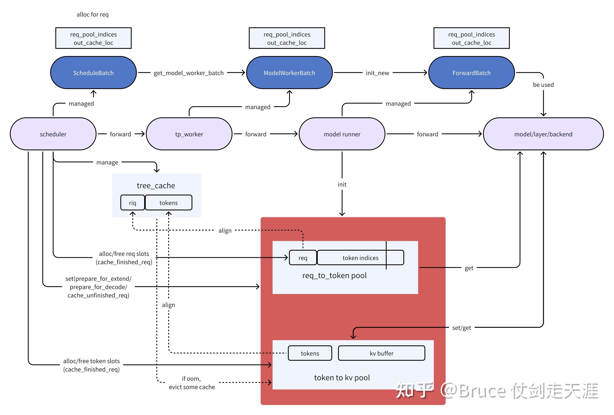

# SGLang Scheduler 技术变迁

- 最开始的 Scheduler 中 CPU 和 GPU 是串行的，导致 GPU 的大量空闲
- 后面的 Scheduler 允许 CPU 和 GPU overlap，实现了 zero overhead scheduler

Scheduler 整体的工作流程如下图所示：[^code-walk]


我们将结合代码分析一下整个 Scheduler 的流程。但在分析整个流程之前，我们需要先了解一下调度中比较重要的数据结构以及这些结构之间的关系如何转换

## Key Structure

### Scheduler

`Scheduler`  组件负责管理 Active Request。以下核心全局状态用于在  `Scheduler`  中维护这些 Active Request。

#### `waiting_queue`

- **用途：** `waiting_queue`是一个数据结构，设计用于存放 Active Request。它根据优先级（Request 的最长前缀）或可用内存动态重新排序这些 Request，以优化批处理任务。
- **一些额外要点**
  - **入队**
    - 新到达的 Request。
    - 从  `retract_decode`  返回的 Request。
  - **出队**  当前有最高优先级的 Request 从队列中出队以形成 batch。

#### `new_batch`

- **用途：**：一批准备好进行 prefill/extend 阶段的 Request。
- **一些额外要点**
  - **分块预填充**：如果 Request 所需的 token 数超过可用内存（`remaining_tokens`），可能会被分块成较小的部分。
  - `new_batch`  中的 Request 将经历 prefill/extend。
  - prefill/extend 后，`new_batch`  将过渡到  **全局批次（Global Batch）**，用于下一次迭代。

#### `running_batch`

- **用途：**：一批准备好进行 decode 阶段的 Request。
  - 初始化为空批次：`ScheduleBatch(reqs=[], batch_is_full=False)`
  - 可以动态添加新完成 prefill 的请求
  - 可以移除已完成的请求
- **一些额外要点**
  - **Retracted**：如果 decode 期间可用内存不足，`Scheduler`可能会通过  `retract_decode`  从  `running_batch`  中撤回某些 Request，将其返回到  `waiting_queue`  以供后续处理。

#### `cur_batch`

- **用途：**：`Scheduler`  主循环（`run_batch`  函数）中当前正在处理的 Request 批次。**`prefill` 优先**
- **一些额外要点**
  - `cur_batch`  在  `event_loop_normal`  中分配。
  - 形成  `cur_batch`  的逻辑是：
    - 如果本轮有准备好 prefill 的 Request（`new_batch`），则使用  `new_batch`  作为  `cur_batch`。
    - 否则，`cur_batch`  将处理准备好 decode 的 Request，因此使用  `running_batch`  作为  `cur_batch`。


### 三个重要的 Batch

#### Overview

- ScheduleBatch 由 schedule.py::Scheduler 管理。它包含高级调度数据，大部分数据位于 CPU 上。
- ModelWorkerBatch 由 tp_worker.py::TpModelWorker 管理。它是 ScheduleBatch 的子集，只包含与 GPU 上模型 forward 相关的数据，它将从 CPU scheduler 转换到 GPU model runner。
- ForwardBatch 由 model_runner.py::ModelRunner 管理，**它包含低级 tensor 数据**

#### ScheduleBatch

```python
class ScheduleBatch:
    reqs: List[Req]  # 请求列表
    req_to_token_pool: ReqToTokenPool  # 请求到token的映射池
    token_to_kv_pool_allocator: BaseTokenToKVPoolAllocator  # KV缓存分配器
    tree_cache: BasePrefixCache  # 前缀缓存树
    forward_mode: ForwardMode  # 前向模式

    # 批处理相关
    input_ids: torch.Tensor  # 输入token IDs
    seq_lens: torch.Tensor  # 序列长度
    extend_lens: List[int]  # 扩展长度(sel_len - prefix_len)
    prefix_lens: List[int]  # 前缀长度
```

#### ModelWorkerBatch

```python
class ModelWorkerBatch:
    forward_mode: ForwardMode
    input_ids: torch.Tensor # 输入token IDs
    req_pool_indices: torch.Tensor # req 对应的 out_cache_loc 的索引
    seq_lens: torch.Tensor # 序列长度
    out_cache_loc: torch.Tensor # 分配的 KV cache

    # 扩展相关(seq - prefix)
    extend_num_tokens: Optional[int]
    extend_seq_lens: Optional[List[int]]
    extend_prefix_lens: Optional[List[int]]
```

#### ForwardBatch

```python
class ForwardBatch:
    forward_mode: ForwardMode
    batch_size: int
    input_ids: torch.Tensor
    seq_lens: torch.Tensor
    positions: torch.Tensor  # 位置编码

    # 注意力相关
    attn_backend: AttentionBackend
    token_to_kv_pool: KVCache

    # 扩展信息(seq - prefix)
    extend_num_tokens: Optional[int]
    extend_start_loc: Optional[torch.Tensor]
    extend_prefix_lens: Optional[torch.Tensor]
```

#### Transpose

```python
# 1. Scheduler创建ScheduleBatch
def run_batch(self, batch: ScheduleBatch):
    # 2. 转换为ModelWorkerBatch
    model_worker_batch = batch.get_model_worker_batch()

# 3. TpModelWorker处理
def forward_batch_generation(self, model_worker_batch: ModelWorkerBatch):
        # 4. 转换为ForwardBatch
        forward_batch = ForwardBatch.init_new(model_worker_batch, self.model_runner)

        # 5. ModelRunner执行前向传播
        logits_output, can_run_cuda_graph = self.model_runner.forward(forward_batch)

        # 6. 采样生成token
        next_token_ids = self.model_runner.sample(logits_output, forward_batch)

        return GenerationBatchResult(
            logits_output=logits_output,
            next_token_ids=next_token_ids,
            can_run_cuda_graph=can_run_cuda_graph,
        )
```

### Cache

cache 在 sglang 中，相关的主要是``req_to_token_pool`, `token_to_kv_pool`,`tree_cache` 三个结构。

```python
req_to_token_pool[req_idx]:
┌─────────────────────────────────────────────────────────────┐
│  前缀部分 (1984 tokens)    │    新chunk部分 (2000 tokens)    │
├─────────────────────────────────────────────────────────────┤
│ [loc_1, loc_2, ..., loc_1984] │ [loc_1985, ..., loc_3984] │
└─────────────────────────────────────────────────────────────┘
位置:  0                    1984                         3984

KV Cache Pool:
┌──────┬──────┬──────┬──────┬──────┬──────┬──────┬──────┐
│loc_1 │loc_2 │ ... │loc_1984│loc_1985│ ... │loc_3984│ ... │
├──────┼──────┼──────┼──────┼──────┼──────┼──────┼──────┤
│ k1,v1│ k2,v2│ ... │k1984,v1984│k1985,v1985│ ... │k3984,v3984│ ... │
└──────┴──────┴──────┴──────┴──────┴──────┴──────┴──────┘
```

#### ReqToTokenPool

- 管理 **req_idx 到 token 位置的映射关系**
- 为每个请求分配固定的内存槽位
- 维护请求的 token 序列在内存中的连续布局

```python
class ReqToTokenPool:
    def __init__(self, size: int, max_context_len: int, device: str, enable_memory_saver: bool):
        # 主要存储结构：[请求数量, 最大上下文长度]
        self.req_to_token = torch.zeros(
            (size, max_context_len),
            dtype=torch.int32,
            device=device
        )
        self.free_slots = list(range(size))  # 可用槽位列表
        self.size = size
        self.max_context_len = max_context_len
```

#### token_to_kv_pool

- 管理物理 KV 缓存的分配和释放
- 处理页对齐的内存分配（如果启用分页）
- 支持不同的分配策略（连续分配、分页分配等）

#### Tree Cache

其实是联系两个 pool 的组织结构，scheduler 调度过程中会频繁访问，并为请求分配 `req_to_token_pool` 和 `token_to_kv_pool` 中的 slot

- tree_cache 在调度策略中是个关键角色，根据 prefix match 的情况，会决定当前请求何时被 prefill
- `page_size` 决定前缀匹配的粒度，键匹配策略以及分页匹配算法

  - page_size = 1 是逐 token 精确匹配，可以匹配任意长度的前缀
  - page_size > 1 是按页进行前缀匹配(使用 tuple(tokens) 为 key
    ```python
    # page_size = 1
    root
    └── 1 (child_key=1)
        └── 2 (child_key=2)
            └── 3 (child_key=3)
                └── 4 (child_key=4)
                    └── 5 (child_key=5)
    ```

  # page_size = 4

  root
  └── (1,2,3,4) (child_key=(1,2,3,4))
  └── (5,6,7,8) (child_key=(5,6,7,8))

  ```

  ```

#### RelationShip

一个新请求进入

- 首先进行最长前缀匹配找到对应的 KV 索引
- `req_to_token_pool` 分配 `extend_token` 的空闲槽位，得到 `req_pool_idx` 索引
- `token_to_kv_pool_allocator` 分配新的 KV Cache
- 更新 `req_pool_idx` 与 KV Cache 间的映射关系

```python
# 直接分配这一个 batch 所有 req 的 extend tokens 需要的 kv cache
out_cache_loc = alloc_token_slots(batch.tree_cache, batch.extend_num_tokens)
# update 映射(prefix + extend)
req_to_token_pool.write(
	(req_idx, slice(0, prefix_len)),
	prefix_tensors[i],
)
req_to_token_pool.write(
	(req_idx, slice(prefix_len, seq_len)),
	out_cache_loc[pt : pt + extend_len],
)
```



### PrefillAdder

是 SGLang Scheduler 中负责**智能批处理预填充请求**的核心组件。它的主要作用是从等待队列中选择合适的请求，组装成一个可以高效执行的预填充批次

> 如果启用了 Mixed Chunk，可以在一个 batch 中同时包含 prefill 和 decode 请求

```python
class PrefillAdder:
    def __init__(self, ...):
	    self.page_size = page_size # 内存页大小
		self.tree_cache = tree_cache  # radix kv cache
		self.token_to_kv_pool_allocator = token_to_kv_pool_allocator # kv cache pool
		self.running_batch = running_batch # 当前正在运行的 decode batch
		self.new_token_ratio = new_token_ratio # 新 token 生成比例
        self.can_run_list = []        # 可以运行的请求列表
        self.preempt_list = []        # 被抢占的请求列表  
        self.new_chunked_req = None   # 新的分块请求
        self.log_hit_tokens = 0       # 缓存命中的token数
        self.log_input_tokens = 0     # 输入token统计
       
	@property
	def rem_total_tokens(self):
	    """计算剩余可用的总token数"""

	def add_one_req(self, req: Req, has_chunked_req: bool, truncation_align_size: Optional[int]):
	    """添加一个请求到批次中"""

	def add_chunked_req(self, req: Req):
	    """处理分块预填充请求"""
	   
	def preempt_to_schedule(self, req: Req, server_args: ServerArgs) -> bool:
	    """抢占低优先级请求为高优先级请求让路"""
```

### GenerationBatchResult

#### **1. logits_output: Optional[LogitsProcessorOutput]**

- **作用**: 包含模型前向传播的完整 logits 输出和相关信息
- **内容**:
  - next_token_logits: 下一个 token 的 logits 分布  `[batch_size, vocab_size]`
  - input_token_logprobs: 输入 token 的 log 概率
  - hidden_states: 隐藏状态（用于推测解码）
  - 各种 top-k logprobs 和 token 概率信息
- **用途**: 用于采样、计算概率、返回 logprob 信息给用户

#### **2. next_token_ids: Optional[torch.Tensor]**

- **作用**: 经过采样后的下一个 token ID
- **形状**: `[batch_size]`
- **内容**:
  - Prefill 模式：基于最后位置采样的第一个生成 token
  - Decode 模式：当前步骤生成的下一个 token
  - Prefill-only：全零占位符 tensor
- **用途**: 直接用于更新请求的 `output_ids`，推进生成过程

#### **3. num_accepted_tokens: Optional[int]**

- **作用**: 推测解码中被接受的 token 数量
- **用途**: 统计推测解码的接受率，用于性能优化和指标收集

#### **4. next_draft_input: Optional[EagleDraftInput]**

- **作用**: EAGLE 推测解码的下一轮输入信息
- **内容**: 包含 top-k 概率、索引、隐藏状态等
- **用途**: 为下一轮推测解码准备输入数据

#### **5. extend_input_len_per_req: Optional[List[int]]**

- **作用**: 每个请求的扩展输入长度
- **用途**: 在处理 batch 结果时，知道每个请求**实际处理了多少个新 token**

#### **6. extend_logprob_start_len_per_req: Optional[List[int]]**

- **作用**: 每个请求开始计算 logprob 的位置
- **用途**: 确定从哪个位置开始返回 logprob 信息给用户

#### **7. copy_done: Optional[torch.cuda.Event]**

- **作用**: GPU 到 CPU 数据传输完成的同步事件
- **用途**: 在重叠调度中确保数据传输完成再处理结果

#### **8. delay_sample_func: Optional[callable]**

- **作用**: 延迟采样函数
- **用途**: 在重叠调度中，先执行前向传播，后续再执行采样操作

#### **9. future_indices: Optional[FutureIndices]**

- **作用**: Future 机制中的索引信息
- **用途**: 在重叠调度中**管理异步结果的存储和检索**

## Normal (No overlap)

LLM 是自回归结构，所以无论是 Prefill 还是 Decode，驱动它们进行下一步推理的都是预测序列的下一个 token，包含 `next_token_ids` 的数据就非常关键

在 prefill 模式下，`next_token_ids` 包含的是：

- **形状**: `[batch_size]` - 每个请求一个 token ID
- **内容**: 每个序列的**下一个 token**，即基于输入序列最后一个位置的 logits 采样得到的 token
- **位置**: 对于 prefill，只使用序列的最后一个位置进行采样

在 decode 模式下，`next_token_ids` 包含的是：

- **形状**: `[batch_size]` - 每个请求一个 token ID
- **内容**: 每个请求当前解码步骤生成的**下一个 token**
- **位置**: 使用当前解码位置进行采样

### Overview

一个请求 Request 进入 SGLang Scheduler，会经过如下阶段

```shell
Req -> Pre Schedule(CPU) -> Compute Batch -> Sample(GPU) -> Post Schedule(CPU) -> next Schedule ...
```


#### Pre Schedule

- 收集前端传入的请求，并将其放入等待队列。(`Schedule::recv_request()` & `Schedule::process_input_requests()`)
- 从等待队列和 running_batch 中进行调度 (`Schedule::get_batch_to_run()`)
  - Prefill 中涉及 Radix Tree 和最长前缀匹配（Longest Prefix Matching）算法。(`Req::init_next_round_input()`)
- 为每个请求分配 Token 所需的内存资源。。(`ScheduleBatch::prepare_for_extend()` & `ScheduleBatch::prepare_for_decode()`)

#### Compute batch

新的请求会进入 Prefill 阶段，Prefill 阶段结束后进入 Decode 阶

##### Prefill Schedule

1. `get_next_batch_to_run`：这里是 Prefill 优先，所以会调用 `get_new_batch_prefill`，并直接把函数返回的`new_batch`**作为这一轮执行的 batch(即 `cur_batch`)**
2. `get_new_batch_prefill`:

   - 创建 PrefillAdder 来管理批次构建，从 waiting_queue 中选择请求
   - **`init_next_round_input` 更新 radix tree cache 的前缀**
   - 创建新的 ScheduleBatch，调用 `prepare_for_extend`:
     - 分配`req_pool_indices`：为每个请求在请求池中分配一个唯一的索引位置，这个索引用于在  `req_to_token_pool`  中存储该请求的 token-to-KV 映射。
       - allocate kv cache
       - 将 req 与 kv cache 的映射写入到 `req_to_token_pool`

3. `run_batch()`：执行 Prefill 推理，调用 `TpModelWorker::forward_batch_generation()` -> `ModelRunner::forward()` -> `ModelRunner::_foward_raw()` -> `ModelRunner::forward_extend()`，后面执行 backend 的算子等待返回结果

##### Decode Schedule

1. `get_next_batch_to_run()`：处理上一批次的完成请求，然后与 running_batch 进行 merge
2. `update_running_batch()`：
   - 调用  `prepare_for_decode()`：
     - 上一次 schedule 的 `output_ids` 变为这一次的 `input_ids`
     - 为  `out_cache_loc`  分配（batch size \* 1）个 slot，因为在 decode 模式下我们对每个 batch 一次只生成一个 token
     ```python
       out_cache_loc = alloc_token_slots(batch.tree_cache, bs * 1)
     ```
3. `run_batch()`：执行 Decode 推理，调用 `TpModelWorker::forward_batch_generation()` -> `ModelRunner::forward()` -> `ModelRunner::_foward_raw()` -> `ModelRunner::forward_decode()`后面执行 backend 的算子等待返回结果

#### Sample

`TpModelWorker::forward_batch_generation()`：

- 如果不是 overlap 模式，立即进行 Sample，否则重叠 CPU 和 GPU 进行延迟采样
- **Sample 得到 batch 的 `next_token_ids`，供下一次 batch forward 使用**
  ```python
  sampling_info.update_regex_vocab_mask()
    sampling_info.apply_logits_bias(logits_output.next_token_logits)
    next_token_ids = self.sampler(
              logits_output,
              forward_batch.sampling_info,
              forward_batch.return_logprob,
              forward_batch.top_logprobs_nums,
              forward_batch.token_ids_logprobs,
              # For prefill, we only use the position of the last token.
              (
                  forward_batch.positions
                  if forward_batch.forward_mode.is_decode()
                  else forward_batch.seq_lens - 1
              ),
          )
  ```

#### Post Schedule

- Prefill： `process_batch_result_prefill()`
  - 获取结果，调用 tree_cache 的 `cache_unfinished_req()` 保留该 req 的 cache
- Decode： `process_batch_result_decode()`：
  - 对每个 Req 进行判断，如果已经完成就释放 tree_cache 中对应的 KV cache(**循环解释后批量释放**)
  - 将 batch 的结果通过 `stream_out()` 返回给 detokenizer 进行下一步处理

### 事件循环

- 请求都会先执行 prefill 阶段然后执行 decode 阶段，直到获得 EOS 或其他原因退出

```python
def event_loop_normal(self):
        """A normal scheduler loop."""
        while True:
            recv_reqs = self.recv_requests()
            self.process_input_requests(recv_reqs)
            batch = self.get_next_batch_to_run()
            self.cur_batch = batch
            if batch:
                result = self.run_batch(batch)
                self.process_batch_result(batch, result)
            else:
                # When the server is idle, do self-check and re-init some states
                self.self_check_during_idle()
            self.last_batch = batch
```

### Pre Schedule

#### Req -> Waiting_queue

- 首先执行 `recv_requests`：

  - 只有 Pipeline rank = 0 的可以从 zmq 中获取 tokenizer 传来的 requests
  - 其他 pipeline rank 从前一个 pipeline 获取 requests
  - work_reqs 在 attn_tp 中进行广播；系统的 control_reqs 在整个 tp_size 中广播

- 然后执行 `process_input_requests`
  1.  **提取 worker_id**: `worker_id = recv_req.worker_id`
  2.  **解包请求**: `recv_req = recv_req.obj`
  3.  **分发处理**: `output = self._request_dispatcher(recv_req)` 调用请求分发器
      - 将 recv_req 构建为新的 `Req` 对象
      - 调用 `_add_request_to_queue()` 将 `Req` 插入 waiting_queue 中
  4.  **发送回应**: 将输出发送回对应的 tokenizer 工作进程

#### Waiting_queue/running_batch -> cur_batch


##### 获取 prefill batch `get_new_batch_prefill`

- 创建 PrefillAdder，对新来的请求进行分块，然后每次处理多个分块
  - `init_next_round_input()`：
    - 构建完整填充序列：原始输入 token + 已生成的输出 token
    - 最大前缀长度计算：最多缓存到倒数第二个 token（`input_len - 1`）
      > 模型需要一个输入 Token 来查询（Query）这些缓存的历史信息，并计算出当前步的 Logits（概率分布）。如果我们把所有 Token 都算作 Prefix 并从 Cache 中读取，那么当前步就没有“输入”喂给模型了，模型也就无法计算出 $t+1$ 的 Logits。因此，我们必须 保留最后一个 Token 不放入 Prefix 匹配中，让它作为本次推理的 input_ids 输入给模型。
    - 前缀匹配：
      - 当 Request `ABC`到达时，假设当前 radix cache 里存在一个节点`AFG`
      - `match_prefix`  会尝试在当前 radix cache 里找到现存的`ABC`的最长前缀，也就是说它会在`AFG`节点里找到`A`
      - Radix cache 会把这个节点`AFG`拆分成`A`和`FG`，`A`节点成为当前 Request 的最后一个节点
- 创建一个新的 ScheduleBatch
- 调用 `ScheduleBatch::prepare_for_extend()`

  - 分配`req_pool_indices`为每个请求在请求池中分配一个唯一的索引位置，这个索引用于在  `req_to_token_pool`  中存储该请求的 token-to-KV 映射。

    - allocate kv cache：[每个 Request 的总 input token 数 - match 到的 prefix token 数] 个`out_cache_loc`
    - 将 req 与 kv cache 的映射写入到 `req_to_token_pool`

    ```python
    req_to_token_pool[req_idx]:
    ┌─────────────────────────────────────────────────────────────┐
    │  前缀部分 (1984 tokens)    │    新chunk部分 (2000 tokens)    │
    ├─────────────────────────────────────────────────────────────┤
    │ [loc_1, loc_2, ..., loc_1984] │ [loc_1985, ..., loc_3984] │
    └─────────────────────────────────────────────────────────────┘
    位置:  0                    1984                         3984

    KV Cache Pool:
    ┌──────┬──────┬──────┬──────┬──────┬──────┬──────┬──────┐
    │loc_1 │loc_2 │ ... │loc_1984│loc_1985│ ... │loc_3984│ ... │
    ├──────┼──────┼──────┼──────┼──────┼──────┼──────┼──────┤
    │ k1,v1│ k2,v2│ ... │k1984,v1984│k1985,v1985│ ... │k3984,v3984│ ... │
    └──────┴──────┴──────┴──────┴──────┴──────┴──────┴──────┘
    ```

##### 获取 decode batch

- 先从 batch 中删除已经完成或者已经出错的 batch，然后将上一轮的 decode batch 与 running_batch 合并
  - 实际上就是将 `seq_lens`, `orig_seq_lens`, `output_ids` 等进行 `torch.cat` 拼接
- 调用 `update_running_batch()` 获取 decode batch

  - 先检查是否需要回退请求
  - 如果需要，把要回退的请求重新插入 `waiting_queue`，重新排队进行调度
  - 调用 `ScheduleBatch::prepare_for_decode()`

    - 上一轮输出作为这一轮的输入
    - 内存分配 + 序列长度更新

    ```python
    # 假设batch有3个请求，每个请求当前长度分别为[10, 15, 8]
    # decode需要为每个请求的下一个位置分配空间

    # 分配前的KV cache映射
    req_to_token_pool[req1_idx, 0:10] = [loc1, loc2, ..., loc10]
    req_to_token_pool[req2_idx, 0:15] = [loc11, loc12, ..., loc25]
    req_to_token_pool[req3_idx, 0:8] = [loc26, loc27, ..., loc33]

    # 执行 alloc_for_decode 后
    req_to_token_pool[req1_idx, 10] = loc34    # 为位置10分配
    req_to_token_pool[req2_idx, 15] = loc35    # 为位置15分配
    req_to_token_pool[req3_idx, 8] = loc36     # 为位置8分配

    # out_cache_loc = [loc34, loc35, loc36]

    # A faster in-place version
    self.seq_lens.add_(1)
    self.seq_lens_cpu.add_(1)
    self.orig_seq_lens.add_(1)
    # update all length
    self.seq_lens_sum += bs  # bs = batch_size
    ```

### Compute batch & Sample

这里我们暂时只考虑 **generation** 的情况（还有 Embedding 的情况）

- 将 `ScheduleBatch` 转化为 `ModelWorkerBatch`
- 调用 `TpModelWorker::forward_batch_generation()`
  - 将 `ModelWorkerBatch` 转化为 `ForwardBatch`
  - 调用 `ModelRunner::forward()`，最后调用后端 flashinfer 的算子
    - Prefill 执行 `ModelRunner::forward_extend()`
    - Decode 执行 `ModelRunner::forward_decode()`
  - **立即进行 Sample，根据 logits 获得下一个 token**
  - 返回结果 `GenerationBatchResult`

### Post Schedule

#### Prefill

- 解包 `GenerationBatchResult`
- 执行 `synchronize()` **等待 GPU→CPU 拷贝完成，保证之后访问的数据已在 CPU 上可用**。
- 遍历 batch 中每个请求
  - 更新生成结果
  - 更新 logprob
  - Chunked 请求的特殊处理：`is_chunked > 0` 表示 prefill 尚未全部完成，需要递减计数并跳过流式输出。
- 输出流式结果：调用 `stream_output()` 将结果（token、logprob 等）发送给客户端（例如 WebSocket / API response）

#### Decode

```python
[GPU forward kernel]
   ↓ (结果写入 GenerationBatchResult)
[Scheduler.process_batch_result_decode()]
   ├── copy_done.synchronize()
   ├── next_token_ids.tolist()
   ├── 更新 req 状态
	   ├── req.output_ids.append(next_token_id)
	   ├── if finished, self.tree_cache.cache_finished_req(req) # 释放 kv cache
   ├── stream_output()
   └── free KV pages
```

## Why Overlap?

运行实际调度算法仅占总体调度开销的一小部分。**大部分开销来自于模型输入的准备和模型输出的后处理**。具体而言，最大的开销来自于构建输入张量(**Pre Schedule**)、执行输出去标记化(**Post Schedule**)以及准备每个请求的元数据(**Pre Schedule**)[^overhead]

**构建模型输入张量和采样元数据方面的开销主要源于 Python**

使用**多步调度可以降低总体调度开销**，但也存在一些弊端。例如，在两次调度调用之间，即使某些请求提前完成，也无法将新的请求添加到批次中。

- **vLLM** 的 multi-step decode
- **SGLang** 的 speculative group execution

## Zero-Overhead Schedule(Overlap)

### 原理

在介绍原理之前我们需要回忆一下上面推理过程的 4 个大步骤，考虑哪些步骤可以进行 Overlap，减少 GPU Bubble，先放一张现在 Overlap 的流水线图


#### Inference Overview

SGLang 的推理过程主要分为以下四个阶段：

1. **Pre schedule：**
   - 收集前端传入的请求，并将其放入等待队列。(`Scheduler::recv_request()` & `Scheduler::process_input_requests()`)
   - 从等待队列和 running_batch 中进行调度 (`Scheduler::get_batch_to_run()`)
     - Prefill 中涉及 Radix Tree 和最长前缀匹配（Longest Prefix Matching）算法。(`Req::init_next_round_input()`)
   - 为每个请求分配 Token 所需的内存资源。(`ScheduleBatch::prepare_for_extend()` & `ScheduleBatch::prepare_for_decode()`)
2. **Compute batch：**
   - 将 batch 发送到 GPU 上进行一步（即 Continue Batch 的一个 iter）推理(`Scheduler::run_batch()`)
3. **Sample：**
   - 根据模型输出的 Logit 进行采样，生成下一步的 Token。(`ModelRunner::sample()`)
4. **Post schedule：**
   - 在一步推理完成后，动态检查请求是否满足结束条件（Check Finish Condition）。(`Scheduler::process_batch_result()`)
   - 将已完成的请求从批次中移除，并送入 Detokenizer 处理，最终将结果返回给前端。

#### Overlap Overview[^overlap]

Compute batch 和 Sample 这两个挨在一起的阶段是 GPU heavy 的，而 schedule 的两个阶段是 CPU heavy 的。当多个 batch 流水线化时，我们可以用 **GPU 的 Compute 和 Sample 来重叠上一个 batch 的 post scheduler 与当前 batch 的 pre scheduler**。

> 实际上我们的 Prefill 请求进入并不依赖未完成的 batch，**第一个请求进来可以直接正常执行**

我们通过使用 Forward CUDA Stream 的方式来实现 overlap，具体来说：

- Run Batch 中将两个操作提交到 forward_stream 队列：一个是从 FutureMap **获取上一次 batch 的 next token**；一个用这个 token 作为 `intput_id` 进行下一次计算
- Sample 中也把两个操作提交到 forward_stream 队列：一个是进行采样；一个是将得**到的 next token 写回 FutureMap**
- 我们需要在 Post Schedule 处理数据前对 CPU 和 GPU 做一个同步，保证可以处理到 CPU 的 `next_token_ids`
  - 我们**在 Post Schedule 中进行同步操作**，确保后续的处理可以正常运行且不影响 GPU 的流水线工作
    ```python
    def process_batch_result_decode(
            self: Scheduler,
            batch: ScheduleBatch,
            result: GenerationBatchResult,
        ):
            if result.copy_done is not None:
                result.copy_done.synchronize()
            logits_output, next_token_ids, can_run_cuda_graph = (
                result.logits_output,
                result.next_token_ids,
                result.can_run_cuda_graph,
            )
      next_token_ids = next_token_ids.tolist()
      next_token_logprobs = logits_output.next_token_logprobs.tolist()
    ```


### 初始化 Overlap

- **forward_stream**：专门用于 GPU 前向计算，与默认流并行
- **copy_stream**：处理 GPU->CPU 数据传输
- **future_map**：管理异步计算结果，使用**负索引作为 future 标识符**
  - 上一个 batch 计算的 `output_id` 作为下一个 batch 的 `input_id`，通过存取 `future_map` 实现

```python
def init_overlap(self):
    if not self.enable_overlap:
        return
    self.forward_stream = torch.cuda.Stream()      # GPU前向计算流
    # Future映射管理异步结果
    self.future_map = FutureMap(max_running_requests, device, spec_algorithm)
    # batch 缓冲区（防止GPU张量被GC回收）
    self.batch_record_buf = [None] * 2
    self.batch_record_ct = 0
```

#### FutureMap

- 存放在 GPU 上

- `future_ct`：当前环形计数器（指针），用于生成新的 future indices（并非“尚未完成的数量”）。
- `future_limit`：环形指针的模（用来做 `% self.future_limit`）。代码里用 `*3` 的因子来 **减小索引冲突概率**（防止 `future_ct` 快速回绕覆盖尚未写回的 slot）。
- `future_buffer_len`：实际缓冲区物理长度（`*5`），比 `future_limit` 更长以保证写入区间有足够空间（防止 slice 越界或回绕写入与读冲突）。

- 这两个因子（3 和 5）是工程经验值，用来增加安全裕量；你可以根据并发量和 outstanding futures 调整。

```python
class FutureMap:
    def __init__(
        self,
        max_running_requests: int,
    ):
        self.future_ct = 0
        # A factor of 3 is used to avoid collision in the circular buffer.
        self.future_limit = max_running_requests * 3
        # A factor of 5 is used to ensure the buffer is large enough.
        self.future_buffer_len = max_running_requests * 5
```

### Overlap 事件循环

```python
def event_loop_overlap(self):
    self.result_queue = deque()  # 存储(batch, result)对
    while True:
        # === Pre Schedule 2 ===
        recv_reqs = self.recv_requests()
        self.process_input_requests(recv_reqs)
        batch = self.get_next_batch_to_run()
        self.cur_batch = batch

        batch_result = None
        if batch:
            # === Launch Compute Batch 2 ===
            batch_result = self.run_batch(batch)  # 非阻塞启动
            self.result_queue.append((batch.copy(), batch_result))

        # === Post Schedule 1 ===
        # compute batch 2 与 post schedule 1 并行执行
        if self.last_batch:
            # 处理队列中的结果（此时GPU在并行计算当前批次）
            tmp_batch, tmp_result = self.result_queue.popleft()
            self.process_batch_result(tmp_batch, tmp_result)
        elif batch is None:
            self.self_check_during_idle()

        # === Launch Sample 2 ===
        self.launch_batch_sample_if_needed(batch_result) # update vocab mask
        self.last_batch = batch
```

#### 与 normal event loop 的不同

- `Schedule::run_batch()`
  - `Schedule::record_batch_in_overlap()`：在两个 overlap 的 batch 中交替存储 model_worker_batch 引用，**避免在 overlap 的 forward 尚未结束时，CUDA kernel 访问野指针或已释放的显存**
  - `FutureMap::resolve_future()`：用**上一轮 batch sample 得到的真实 token 替换负索引的占位符**
- `TpModelWorker::forward_batch_generation()`，该函数仅仅将 `model_runner.sample` 函数 delay 执行，先返回 batch_result
- 增加了 `Scheduler::launch_batch_sample_if_needed()`：
  - 执行真正的 Sample 操作
    - 屏蔽非法 token，分配 vocab_mask 张量大小 [batch, vocab_size]
    - 移动 mask 到 CPU
  - 将得到的 `next_token_id` 存储到 FutureMap 的 `future_indices` 的对应位置
    - 为了下一次 batch 在 `run_batch` 中的 `resolve_future` 获取到真正的 token

### 流同步

- decode 模式下前一次 batch 的 `batch.output_ids` 是后一次 batch 的 `batch.input_ids`
- **First:** **last batch** 的 `output_id` **store in FutureMap 后**
- **Second:** **current batch get `output_id` from FutureMap** 并作为下一次 batch 的 `input_id` 进行计算
  - CUDA Stream 的本身的限制
  - CPU 侧使用负数占位符实现，等待 GPU 进行真正 token 的填充

```python
# previos batch output is negative indices
batch.output_ids = -self.future_map.alloc_future_indices(bs).indices
with self.forward_stream_ctx:
	self.forward_stream.wait_stream(self.default_stream)
	_batch_result = batch_result.delay_sample_func()
	assert _batch_result is batch_result
	# store token to negative indices
	self.future_map.store_to_map(batch_result.future_indices, batch_result)
	batch_result.copy_to_cpu()

# next batch input is output of previous batch
 with self.forward_stream_ctx:
	self.forward_stream.wait_stream(self.default_stream)
	# get token from negative indices
	self.future_map._resolve_future_token_ids(model_worker_batch.input_ids, self.token_ids_buf)
	batch_result = self.model_worker.forward_batch_generation(
		model_worker_batch
	)
```

### 与上一版 overlap 差异

- 将 update_vocab_mask 移动到 GPU 进行计算，`vocab_mask` 也在 GPU 直接进行分配，不再进行传输
- 现在的 GPU 额外负责向 FutureMap 存储(after sample)以及获取(before compute) `next_token_ids`
  - FutureMap 也是完全存储在 GPU 上
- 对 GPU 调度由原来 CPU 进行 launch，变成直接将操作提交到 cuda stream，由 stream 自己来调度
- 对 sample 的同步，上一版使用 cuda event 进行同步，这里直接使用 **cuda stream 顺序限制来进行同步**


#### 两个版本的优缺点

##### CUDA stream 版本

- 执行效率更高：`vocab_mask` 和 `token_ids_buf` 无 CPU-GPU 传输；充分利用 GPU 内存带宽
- 延迟更低：`token_ids_buf` 直接在 GPU 上原地修改，不必反复传输
  - 与模型推理在同一设备上，便于流水线
- 非模型占用显存大：`token_ids_buf` 占用 GPU 显存，开销固定

##### CPU launch 版本

- 只有在使用时才占用 GPU 内存
- 同步点增加：`vocab_mask` 会增加一次 CPU-GPU 同步
  - CPU-GPU 同步会破坏流水线

## Reference

[^overlap]: [Zero-Overhead Batch Scheduler](https://github.com/zhaochenyang20/Awesome-ML-SYS-Tutorial/blob/main/sglang/zero-overhead-scheduler/zero-overhead-batch-scheduler.md)
[^overhead]: [Can Scheduling Overhead Dominate LLM Inference Performance? A Study of CPU Scheduling Overhead on Two Popular LLM Inference Systems](https://mlsys.wuklab.io/posts/scheduling_overhead/)
[^code-walk]: [ SGLang 后端代码解析](https://github.com/zhaochenyang20/Awesome-ML-SYS-Tutorial/blob/main/sglang/code-walk-through/readme-CN.md)
