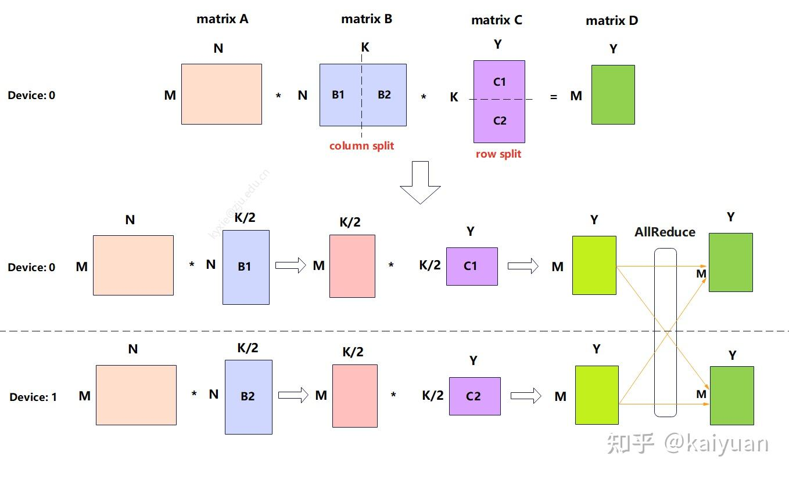

# SGLang 中的 TP + PP 流程浅析(以 Qwen2 为例)

这里我们以 `Qwen2` 模型为例，开启 PP + TP 分析一下 SGLang 是如何实现模型推理的并行的

## 不同节点的职责

| 节点     | 工作内容                                               |
| -------- | ------------------------------------------------------ |
| Rank 0   | tokenizer、detokenizer、HTTP 服务、调度器、模型 worker |
| Rank > 0 | **只运行调度器 + worker，不处理前端服务**              |

## Initiallize Server

1. `launch_server.py` 中根据 `grpc_mode` 参数决定执行 `serve_grpc()` 或者 `launch_server()`

   > 后续以 `launch_server()` 为例进行讲解

2. 调用 `engine.py` 中的 `_launch_subprocesses()`

   > 这里所有的子进程以 **spawn** 方式派生全新 Python 进程

   - 按照 pp 和 tp 重新映射 GPU Id，然后为每个 GPU 创建一个`mp.Pipe()`
   - 接着启动一个 Scheduler **子进程**，传入 pipe 的写端（使用 `run_scheduler_process()`），然后**父进程保留子进程引用和 pipe 的读端**
   - 多机场景下非 0 节点不参与前端服务，仅负责启动 scheduler 进程并**保持节点健康**，避免重复运行 tokenizer / detokenizer / 接入服务。
   - 0 号节点启动 detokenizer 子进程 by `run_detokenizer_process()`，
   - 启动 TokenizerManager，等待所有的 GPU 都加载了 model 并拥有相同的 `scheduler_info`(By `mp.Pipe()`)

3. 从 `_launch_subprocesses()` 中获得 `tokenizer_manager` 和 `scheduler_info`，直接在主进程启动 HTTP 服务 TokenizerManager 进行请求的接收

😆 现在，Tokenizer 进程，Scheduler 进程，Detokenizer 进程可以通过事件循环不停驱动，实现用户请求的处理

### Scheduler

先创建 Scheduler 对象，在 `__init__` 中进行 TpModelWorker 初始化，DraftWorker 初始化，memory pool 和 memory cache 初始化

然后根据 `server_args` 不同，启动不同的事件循环

```python
if disaggregation_mode == DisaggregationMode.NULL:
    if scheduler.enable_pdmux:
        scheduler.event_loop_pdmux()
    elif server_args.pp_size > 1:
        scheduler.event_loop_pp()
    elif scheduler.enable_overlap:
        scheduler.event_loop_overlap()
    else:
        scheduler.event_loop_normal()
```

### TpModelWorker & ModelRunner

TpModelWoker 的 `__init__()` 中进行了 ModelRunner 的初始化

ModelRunner 的 `__init__()` 调用了 `self.init_torch_distributed()`

- 确认使用的通信后端，这里以 NCCL 为例
- 最终调用  parallel_state.py  中的  `initialize_model_parallel()`。
- 创建全局的  `_TP` (Tensor Parallelism) 进程组。假设 TP=4，GPU 0-3 会被划入同一个 NCCL 通信组。
- 创建全局的 `_PP`(Pipeline Parallelism) 进程组，为每个流水线 stage 创建 1 个独立的通信 group

| i   | ranks = range(i, 8, 4) | PP Stage |
| --- | ---------------------- | -------- |
| 0   | 0,4                    | [0,4]    |
| 1   | 1,5                    | [1,5]    |
| 2   | 2,6                    | [2,6]    |
| 3   | 3,7                    | [3,7]    |

### Detokenizer

实际上 detokenizer 会一直事件循环，从 Scheduler 得到 TODO，解码成 `BatchTokenIDOutput` 传递给 Tokenizer 子进程

```python
def event_loop(self):
"""The event loop that handles requests"""
	while True:
		recv_obj = self.recv_from_scheduler.recv_pyobj()
		output = self._request_dispatcher(recv_obj)
		if output is not None:
			self.send_to_tokenizer.send_pyobj(output)
```

## Parallel Linear in SGLang

在 SGLang 中，`Parallel Linear`  是实现 Tensor Parallel (TP) 的核心组件。它通过将巨大的权重矩阵切分到多个 GPU 上，使得每个 GPU 只需计算一部分数据，从而减少显存占用并加速计算。

主要有两种并行方式：**Column Parallel (列并行)**  和  **Row Parallel (行并行)**。通常它们会成对出现（例如在 MLP 中：先 Column 后 Row），以最小化通信开销。

### ColumnParallelLinear

**数学原理**：
输入  $X$  是完整的（复制在所有 GPU 上）。每个 GPU 计算  $Y_i=XA_i$​。输出  $Y$被 切分为 $[Y_1,Y_2,...,Y_p]$，即每个 GPU 得到输出向量的一部分特征。

**典型应用**:

- Attention 的 QKV Projection (`QKVParallelLinear`)。
- MLP 的 Gate / Up Projection (`MergedColumnParallelLinear`)。

### RowParallelLinear

**数学原理**：
为了匹配矩阵乘法规则，输入  $X$  也必须按**列**切分为  $[X_1​,X_2​,...,X_p​]$（这正好是 ColumnParallelLinear 的输出格式）。每个 GPU 计算  $Y_i=XA_i$​。注意，$Y_i$ 的形状与最终输出  $Y$  相同，但它只是部分和。最终输出  $Y = \sum Y_i$​ ，需要一次  **All-Reduce (Sum)**  操作

**典型应用**：

- Attention 的 Output Projection (`o_proj`)。
- MLP 的 Down Projection (`down_proj`)。

### ColumnParallelLinear + RowParallelLinear

**计算量减半，多了一次集群通信（allReduce），中间值的存储大小减半，Input, Weight 减半**



## Qwen2 Model

每个 GPU 进程都会实例化一个  `Qwen2ForCausalLM`  对象，但根据其所在的  **PP Rank**  和  **TP Rank**，加载的内容不同

### Embedding 层

- 只有  **PP Rank 0**  的进程会初始化 `VocabParallelEmbedding`(**Row Parallel**)。
- **TP 处理**: 词表 (Vocab) 被切分到 TP 组的各个 GPU 上。每个 GPU 只持有  `VocabSize / TP_Size`  大小的权重。
- **其他 PP Rank**: 初始化为 PPMissingLayer (占位符，不占用显存)。

```python
# perform weight tying for PP
if self.pp_group.world_size > 1 and config.tie_word_embeddings:
    if self.pp_group.is_first_rank:
        self.pp_group.send(self.model.embed_tokens.weight, dst=self.pp_group.last_rank)
    elif self.pp_group.is_last_rank:
        emb_token_weight = self.pp_group.recv(
            size=(config.vocab_size, config.hidden_size),
            dtype=next(self.model.parameters()).dtype,
            src=self.pp_group.first_rank,
        )
        self.lm_head.weight.copy_(emb_token_weight)
```

### Transformer Layers (所有 PP Rank)

- 使用 `make_layers` 进行构建。**所有层都会构建，只有本地层会加载权重(即占用显存)**
- **PP 切分**: 总层数（例如 32 层）会被均匀分配给 PP 组的各个 Rank。
  - 例如 PP=4，Rank 0 负责 0-7 层，Rank 1 负责 8-15 层，以此类推。
- **本地层**: 当前 Rank 只实际初始化它负责的那部分  `Qwen2DecoderLayer`。
- **缺失层**: 不属于当前 Rank 的层被初始化为  `PPMissingLayer`。

```python
modules = torch.nn.ModuleList(
    [PPMissingLayer(return_tuple=return_tuple) for _ in range(start_layer)]
    + get_offloader().wrap_modules(
        (
            layer_fn(idx=idx, prefix=add_prefix(idx, prefix))
            for idx in range(start_layer, end_layer)
        ),
        **(offloader_kwargs or {}),
    )
    + [
        PPMissingLayer(return_tuple=return_tuple)
        for _ in range(end_layer, num_hidden_layers)
    ]
)
```

Qwen2DecodeLayer 实际上主要是由 Qwen2Attention，Qwen2MLP，RMSNorm 组成的

1. **Qwen2Attention**:

   - **输入 -> 中间**: 使用  QKVParallelLinear (继承自  **ColumnParallelLinear**)。将输入投影到 Q, K, V。
   - **中间 -> 输出**: 使用  RowParallelLinear。将 Attention 的输出投影回 hidden size。

2. **Qwen2MLP**:

   - **输入 -> 中间**: 使用  MergedColumnParallelLinear (继承自  **ColumnParallelLinear**)。将输入投影到 Gate 和 Up 状态。
   - **中间 -> 输出**: 使用  RowParallelLinear。将激活后的状态投影回 hidden size。

### LMHead 层

是一个  **按词表维度切分 (Column Parallel)**  的线性层

- 只有  **最后一个 PP Rank**  会初始化  `RMSNorm`  和  `ParallelLMHead`。
- **其他 PP Rank**: 初始化为  PPMissingLayer。

---

## Inference Process

当一个 Batch 的请求到来时，数据流会在 GPU 之间通过流水线传递。
这里以 PP3 + TP2 为例，梳理下整个推理的流程
### 拓扑

| GPU  | 逻辑 rank | 负责层                 |
| ---- | --------- | ---------------------- |
| GPU1 | (pp0,tp0) | Layer1-2 的 TP shard 0 |
| GPU2 | (pp0,tp1) | Layer1-2 的 TP shard 1 |
| GPU3 | (pp0,tp2) | Layer1-2 的 TP shard 2 |
| GPU4 | (pp1,tp0) | Layer3-4 的 TP shard 0 |
| GPU5 | (pp1,tp1) | Layer3-4 的 TP shard 1 |
| GPU6 | (pp1,tp2) | Layer3-4 的 TP shard 2 |

### Scheduler 持有的关键状态

- 单 stage 常驻状态是 waiting_queue / running_batch / cur_batch / last_batch
- PP 模式额外有 mbs / last_mbs / running_mbs / pp_outputs / last_rank_comm_queue / send_req_work / send_proxy_work / send_output_work。
- hidden_states 不是 scheduler 的长期成员；它作为 `GenerationBatchResult.pp_hidden_states_proxy_tensors` 里的 PPProxyTensors 临时存在，然后通过 send_proxy_work 发到下一 stage。
- next_token_ids 先是 `GenerationBatchResult.next_token_ids`，随后写入 batch.output_ids，最后 append 到每个 req.output_ids。

### 消息传输
- req/control：CPU 侧控制消息，单 rank 收发 + CPU broadcast
- hidden_states/residual：tensor data 各 TP rank 点对点发送 + 接收侧可选 TP all-gather

### Prefill 流程

- 外部请求只先进 pp0。(pp0,tp0) 从 ZMQ 收到 recv_reqs；pp0,tp1/tp2 不直接收外部请求
- pp0 内部先做 TP 控制广播：recv_reqs 经 broadcast_pyobj(..., tp_cpu_group) 扩给 GPU2/GPU3。这是 CPU gloo 通道，传的是 Python 对象，属于控制面。
- pp0 选 batch 后，每张卡都本地执行 prepare_for_extend()。这一步得到：
    ```python
    input_ids = fill_ids[len(prefix_indices):]
    seq_lens / prefix_lens / extend_lens
    out_cache_loc
    req_pool_indices
    ```

    - 这里没有 TP0 统一分配再广播。而是 GPU1/2/3 各自用自己的本地 req_to_token_pool 和 token_to_kv_pool_allocator 做同样的分配；因为控制流一致，分配结果在逻辑位置上保持一致，但物理 KV 存在各自 GPU 本地。
    - 都只是存放的各自负责的 layer 和各自负责的 head 的 KV
- ForwardBatch.init_new() 把 input_ids / req_pool_indices / out_cache_loc / seq_lens 填进模型执行结构。
- pp0 的每张卡开始算本 stage 层。stage 内的 TP 通信发生在层内部，不在 scheduler 里：
    - 首层 embedding 后会做 TP all_reduce。
    - 线性层会按实现做 all_gather 或 all_reduce。
    - 这些都是 GPU collectives，参与 rank 必须同步完成这个 collective 才能继续。
    - 同时，本 stage 每个本地 layer shard 会把本 shard 的 K/V 写入本卡自己的 KV pool；写入位置就是 `forward_batch.out_cache_loc`。
- pp0 前向结束后，不是直接传 token，而是传 `PPProxyTensors({"hidden_states","residual"})` 给 pp1。
    - 这条消息在 scheduler 里走 send_proxy_work，消息体来自 `result.pp_hidden_states_proxy_tensors.tensors`。发送前会等 launch_event，确保 GPU 计算完成；**发送是 async，但下一 stage 的接收是阻塞**
- req/control 也从 (pp0,tp0) 通过 `point_to_point_pyobj` 发到 (pp1,tp0)，**再在 pp1 内广播到 GPU5/GPU6**；这条是 CPU 控制消息，和 proxy tensor 分离。
- pp1 收到 proxy 后继续算 Layer3-4；本 stage 也会做本地 TP collectives，并把本 stage 的 K/V 写进 GPU4/5/6 各自本地 KV pool。
- 最后一层后，lm_head logits 会先在 TP 内 all-gather 成完整 vocab logits，所以 GPU4/5/6 每张卡本地都有完整 next_token_logits。
- 然后 GPU4/5/6 都各自执行 sampler；默认不再额外同步 next_token_ids，只依赖算子确定性。只有 SYNC_TOKEN_IDS_ACROSS_TP=1 或 grammar 时才做一次 TP all_reduce(MIN) 对齐。
- pp1 把 next_token_ids 打成 output tensor dict，先放进 last_rank_comm_queue，**再 async 发回 ring。**
  - 这条 output 不只回到 pp0，还会继续沿 ring 转一圈，**让每个 PP stage 都跑一次 process_batch_result，从而每个 stage 的本地 Req 状态保持一致**；pp_outputs 就是这个在环上中转的成员。每个 stage 收到 output 后：
    - `_pp_prep_batch_result()` 先把 `batch.output_ids = pp_outputs["next_token_ids"]`
    - 然后 `process_batch_result_prefill()` 把每个 token append 到 req.output_ids若请求未结束，会 tree_cache.cache_unfinished_req(req)，把刚算好的前缀缓存进 radix cache，并更新 req.prefix_indices

### Decode 流程

- 进入 decode 前，每个 stage 的本地 Req 都已经有同样的 req.output_ids，因为上一轮 output 已经沿 ring 让所有 stage 都处理过了。
- 每个 stage 本地调用 alloc_for_decode() 给这 1 个新 token 分一个新的 out_cache_loc，并写到 req_to_token_pool[req_pool_idx, seq_lens]。
    - 注意: 这里仍然没有跨 PP/TP 传 KV；每张卡只是给自己这张卡上、自己负责的层 shard 追加一格 KV。真正的历史上下文依赖本地 KV cache，不重算 prompt
- 第 k 轮 decode 的通信与 prefill 基本同型，只是 pp0 输入 token 数从整段 extend tokens变成每请求 1 token：
    - CPU 控制消息：req 从 pp0 到 pp1
    - TP 层内 collectives：每个 local layer 都有
    - PP proxy：hidden_states/residual 从 pp0 到 pp1
    - LM head logits all-gather：在 pp1 的 TP 内
    - 可选 token-id TP sync：默认关
    - PP output：next_token_ids 从 pp1 回 ring
- 所有 stage 本地 process_batch_result_decode()：append 到 req.output_ids

### 层内并行细节 (Inside a Layer with TP)

在每一个 Transformer 层内部，TP 是这样工作的：

1. **Qwen2Attention**:

   - **输入**: 完整的  `hidden_states` (所有 TP Rank 都有副本)。
   - **QKV Proj (Column Parallel)**: 每个 TP Rank 只计算一部分 Head 的 Q/K/V。
   - **Attention 计算**: 每个 Rank 独立计算自己那部分 Head 的 Attention。
   - **Output Proj (Row Parallel)**: 每个 Rank 计算部分输出。
   - **AllReduce**: 在 Output Proj 之后，执行一次  **AllReduce (Sum)**，让所有 TP Rank 重新获得完整的 Attention 输出，并加到 Residual 上。

2. **Qwen2MLP**:

   - **Gate/Up Proj (Column Parallel)**: 输入完整，输出被切分（每个 Rank 计算一部分中间特征）。
   - **Activation**: 在切分的数据上独立执行 (如 SiLU)。
   - **Down Proj (Row Parallel)**: 输入是列切分的（来自 Activation 的输出），权重按行切分。每个 Rank 计算出部分输出。
   - **AllReduce**: 执行  **AllReduce (Sum)**，聚合最终结果。
     
